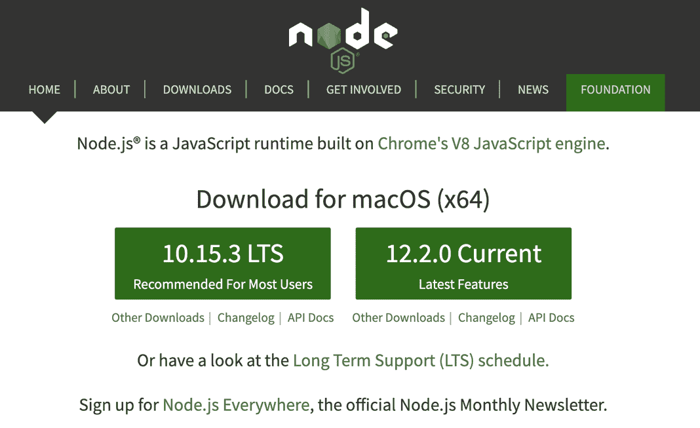
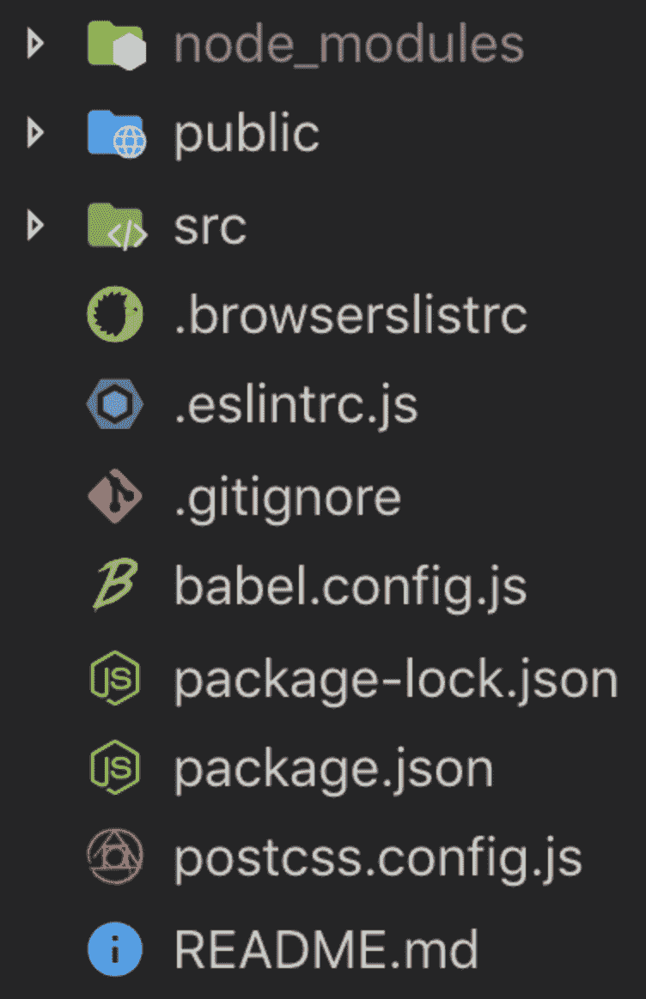

# 第一章：设置演示项目

每一个伟大的应用程序部署都始于一行代码，而在我们面前还有很长的路要走，我们应该从一开始就开始。

在本书中，我们将使用 Vue CLI 3 来设置我们的项目结构。Vue CLI 是一个令人惊叹的工具，可以快速搭建 Vue 应用程序。Vue CLI 诞生于成为搭建应用程序的首选工具。尽管还有其他令人惊叹的解决方案，比如 Nuxt，但了解 Vue CLI 的基础知识将让您在大多数项目中上手。如果您以前没有使用过它，不用担心：我们将一起逐步深入设置。

在本章中，我们将涵盖以下主题：

+   将 Vue CLI 安装到我们的计算机上

+   创建我们的新项目

+   快速查看项目结构

# 技术要求

本章的要求如下：

+   您需要一台可以访问终端程序的计算机，例如苹果的终端或 Windows 的命令提示符。

+   Node 版本 8.9 或更高版本和**Node 包管理器**（**npm**）：本章将提供安装说明。

+   您将需要一个您喜欢的**集成开发环境**（**IDE**）。一个很棒的免费 IDE 可以在[`code.visualstudio.com/`](https://code.visualstudio.com/)找到

本章的代码文件可以在以下 GitHub 存储库中找到：

[`github.com/PacktPublishing/Building-Forms-with-Vue.js/tree/master/Chapter01`](https://github.com/PacktPublishing/Building-Forms-with-Vue.js/tree/master/Chapter01)。

观看以下视频，查看代码运行情况：

[`bit.ly/2OXLxpg`](http://bit.ly/2OXLxpg)

# 将 Vue CLI 安装到我们的计算机上

在撰写本文时，Vue CLI 要求使用 Node 版本 8.9 或更高版本（建议使用 8.11.0+），因此我们需要确保您首先在开发计算机上设置了这个。

要检查是否已安装，请执行以下步骤：

1.  打开一个终端（也称为命令行！）

1.  执行`node -v`命令

如果您得到一个带有版本标签的输出，那么您已经安装了它，可以跳过。

如果您还没有安装 Node，请在浏览器中转到以下链接：[nodejs.org](https://nodejs.org/en)。

您应该看到一个主屏幕和两个大绿色的下载按钮。我们将使用标有“Current”的按钮，如下截图所示：



因此，请继续点击按钮并按照您自己操作系统的安装说明进行安装。

安装完成后，请验证一切是否正常工作：

1.  打开您的终端

1.  执行`node -v`命令

您应该得到类似 v12.2.0 的输出，验证了 node 已经正确安装到您的系统中。

然而，要将 Vue CLI 实际安装到我们的系统中，我们仍然需要使用包管理器。

现在，当您安装 Node 时，实际上免费在系统上安装了`npm`的副本。您可以通过在终端中输入`npm -v`来验证这一点，和以前一样，您将得到一个版本号作为输出。

请注意，Vue CLI 要求 Node 版本在 8.9 或以上（推荐 8.11.0+），但请确保您在阅读本书时检查以下链接以获取确切的版本号：[vuejs.org/guide/installation.html](https://vuejs.org/v2/guide/installation.html)。

最后，现在是真正开始运行事情的时候了。再次打开您的终端，并运行以下命令：

```js
> npm install --global @vue/cli
```

终端将继续下载所有所需的文件到您的计算机，并在全局可访问的路径中设置它们，以便您可以在计算机的任何地方使用此 CLI 工具。很棒，对吧？

请注意此命令上的`--global`标志。这意味着您在计算机上全局安装此软件包。简而言之，这意味着您可以在文件系统的任何位置使用命令，而无需导航到特定文件夹。

供以后参考，您还可以使用`--global`的简写，即简单的`-g`。

再次，让我们通过在终端上运行`vue --version`来检查一切是否安装正确。您应该会得到 Vue CLI 的版本号。

现在我们已经设置好了 CLI，我们可以开始创建我们的新项目。让我们在下一节深入了解如何做到这一点。

# 创建我们的新项目

进入您选择的一个文件夹，该文件夹将保存您的项目文件。不用担心，我们不需要设置服务器、虚拟主机或任何类似的东西。Vue CLI 实际上会在我们每次运行项目脚本时为我们设置一个开发服务器，因此您可以在任何您喜欢的地方创建它。

您现在要运行的命令是`vue create <name>`，其中`<name>`是您的项目名称，也是将要创建的文件夹。

我们将通过运行以下命令来创建我们的新项目：

```js
> vue create vuetiful-forms
```

`vuetiful-forms` 部分的命令将命名项目文件夹。当然，你可以根据自己的需要自由命名。

运行此命令后，Vue CLI 将显示一个向导，让你配置项目的设置方式：


我们将选择手动选择功能，因为我们想要尝试并查看可以切换开关的选项。请注意，我们在这里做出的决定并不是最终的。任何东西都可以随后添加或移除，所以不用担心！

第一个屏幕向我们展示了可以选择的不同功能和包：

1.  选择 Babel 和 Lint/Formatter，这是默认的两个选项。在本书的后面，我们将手动向项目添加 Vuex。

1.  按下空格键选择任何选项，按下 *Enter* 键继续到下一个屏幕。

1.  在 linter/formatter 配置屏幕上，使用仅包含错误预防的 ESLint 配置。

1.  在下一个屏幕上，我们将选择在保存时进行代码检查。（如果你不喜欢自动代码检查，可以选择其他选项。）

1.  对于我们的配置，选择将其存储在专用配置文件中，以尽可能保持我们的 `package.json` 文件整洁。

1.  最后，如果你愿意，可以将此保存为未来项目的预设。

另外，请注意，根据你的选择，你可能会看到不同于我在这里解释的配置。

终端将再次开始工作，在幕后为你的新项目创建项目结构：


通过这个易于遵循的向导，你可以轻松地搭建所有项目，但是如果在此阶段没有选择特定选项，不用担心；Vue CLI 使得随后添加和移除插件变得非常容易！现在让我们快速看一下我们的项目。

# 项目结构的快速概览

打开你的新的 `vuetiful-forms` 文件夹在你喜欢的代码编辑器中。如果你还没有用于开发的集成开发环境，你可以从 [code.visualstudio.com](https://code.visualstudio.com) 免费获取一个非常好的。

你的项目结构将如下截图所示：



以下是你可以在结构中找到的快速概述：

+   node_modules: 这里保存着你的依赖项——你可以使用 `npm` 安装或移除的代码包。

+   public：这个文件夹将保存`index.html`，当您导航到应用程序的 URL 时，您的 Web 服务器将加载它。Vue 会自动注入它所需的所有文件，因此您不需要担心这里发生的事情。

+   src：这是您将放置所有代码、组件、资产等的地方。

在您的项目根目录中，您将看到一个名为`.eslintrc.js`的配置文件，用于您的 ESLint 配置，`.gitignore`用于 Git，`package.json`和`package-lock.json`或`yarn.lock`文件用于包管理，以及根据您之前的选择而定的其他文件。

这些文件用于更改每个服务的偏好设置，如果您没有调整它们的经验，可以安全地忽略它们。

# 总结

到目前为止，您已经了解了使用 Vue CLI 构建应用程序的所有基础知识，并且已经初步了解了项目结构。

在下一章中，我们将启动并运行我们的项目，并开始处理实际的表单！
