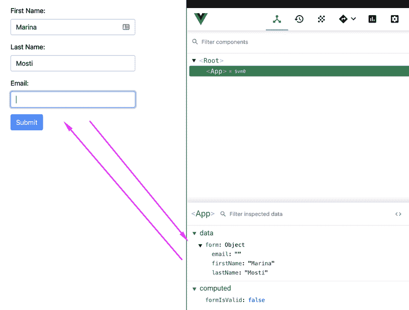

# 第二章：最简单的表单

好的！让我们毫不犹豫地开始（在美化之前稍作一些绕路）。我们将创建一个非常简单的带有表单的页面。这个表单将向用户询问一些基本的个人数据，表单的第二部分将用于更具体的问题。

在本章结束时，您将对如何在 Vue 中构建基本表单有扎实的理解，而且您还将快速复习基本的 Vue 概念，如`v-model`、事件和属性。

在本章中，我们将涵盖以下主题：

+   使用 Bootstrap 入门

+   实际编写一些代码

+   将输入绑定到本地状态

+   提交表单数据

+   引入 Axios

# 技术要求

本章的代码可以在以下 GitHub 存储库中找到：

[`github.com/PacktPublishing/Building-Forms-with-Vue.js/tree/master/Chapter02`](https://github.com/PacktPublishing/Building-Forms-with-Vue.js/tree/master/Chapter02)。

查看以下视频以查看代码的实际操作：

[`bit.ly/35F6340`](http://bit.ly/35F6340)

# 使用 Bootstrap 入门

让我们首先将 Bootstrap 4 作为项目的依赖项添加到我们的项目中，这样我们就不必考虑设计，可以专注于我们表单的功能。

Bootstrap 是一个流行的开源工具包，它为我们提供了一些预定义的类和样式，这样我们就可以让我们的应用程序看起来漂亮，而不必太担心样式。

要安装 Bootstrap 并为我们的项目设置，请按照以下步骤进行：

1.  打开项目文件夹的终端，并使用以下命令安装依赖项：

```js
> npm install bootstrap
```

1.  太棒了！这将把包添加到我们的`node_modules`文件夹和`package.json`中。现在，继续并将必要的样式导入到`src/main.js`中。使用以下命令来执行：

```js
import 'bootstrap/dist/css/bootstrap.min.css';
```

我们不会使用 Bootstrap 的脚本，所以我们只需要最小化的 CSS 就可以了。

让我们对我们的`App.vue`文件进行一些清理，因为现在我们只有一些样板代码，但我们想要重新开始！所以，让我们开始清理：

1.  用以下代码替换`App.vue`中的所有内容：

```js
<template>
  <div id="app">
  </div>
</template>

<script>
export default {
  name: 'app'
}
</script>
```

1.  通过在终端上运行以下命令来启动开发服务器：

```js
> npm run serve
```

1.  打开终端显示的链接（显示为本地）并在浏览器中应该看到一个空白屏幕。

瞧，这是伟大和重要的第一步的空白画布！耶！

让我们继续并开始着手实际的表单工作。现在是写一些代码的时候了。

# 实际编写一些代码

好了，够了设置——让我们写一些代码！我们将从一个非常简单的表单开始，这样我们的用户可以填写他们的个人信息。没什么疯狂的，只是小步走。

我们将向我们的表单添加三个字段。一个`firstName`输入，一个`lastName`输入和一个`email`输入。最后，我们将添加一个`Submit`按钮。

还记得我们安装 Bootstrap 吗？这就是它发挥作用的地方。我们要添加到标记中的所有类都将由 Bootstrap 自动样式化。

对您的`App.vue`文件进行以下更改：

```js
<template>
  <div id="app" class="container py-4">
    <div class="row">
      <div class="col-12">
        <form>
          <div class="form-group">
            <label>First Name:</label>
            <input type="text" class="form-control">
          </div>

          <div class="form-group">
            <label>Last Name:</label>
            <input type="text" class="form-control">
          </div>

          <div class="form-group">
            <label>Email:</label>
            <input type="email" class="form-control">
          </div>

          <div class="form-group">
            <button type="submit" class="btn btn-primary">Submit</button>
          </div>
        </form>
      </div>
    </div>
  </div>
</template>
```

在上一个代码示例中，我们设置了一个带有`row`的容器。在这个`row`中，我们用三个不同的输入填充了它，两个`text`类型（一个用于名字，一个用于姓氏），以及一个`email`类型的输入。最后，我们添加了`<button>`，它将作为提交表单的主要方式。

保存您的文件并检查您的浏览器。如果服务器仍在运行，您应该会自动看到更改。好吧，我同意这有点令人失望，但我确实说过我们从一个简单的例子开始，这就是最简单的例子！

表单是完全功能的，甚至可以单击提交按钮使其提交给自身并实现绝对没有任何作用。很棒！但让我们用一些 Vue 来调味一下。

# 将输入绑定到本地状态

Web 应用程序中表单的目的是捕获一些用户输入并能够对其进行操作。在我们的示例中，我们仍然没有任何方法使用 JavaScript 访问用户的输入以进行我们美好的 Vuetiful 计划，所以让我们从那里开始。

请注意，您不一定要将表单数据包装在次要对象中，但我发现这样更清晰——特别是当您开始向组件添加其他数据属性时，这些属性可能与您的表单无关。

在您的`App.vue`文件的实例上创建一个新的`data`属性。在其中，我们将声明一个`form`对象，它将依次包含每个输入的属性：

```js
<script>
export default {
  name: 'app',
  data() {
    return {
      form: {
        firstName: '',
        lastName: '',
        email: ''
      }
    }
  }
}
</script>
```

为了将我们的输入值绑定到内部状态，我们需要使用 Vue 的`v-model`属性。因此，让我们为每个输入添加`v-model`。这样，每当用户输入或删除信息时，输入元素的值将绑定到我们的`data`属性。

请记住，`v-model`不是一个*神奇*的属性。它是两件事的简写：

+   它绑定了我们输入框的`input`事件：

```js
v-on:input="form.name = $event.target.value"
```

+   它将`value`属性绑定到我们的`data`属性：

```js
 v-bind:value="form.firstName"
```

继续在所有输入中添加`v-model`：

```js
...
<div class="form-group">
  <label>First Name:</label>
  <input 
    v-model="form.firstName" 
    type="text" 
    class="form-control"
  >
</div>
<div class="form-group">
  <label>Last Name:</label>
  <input 
    v-model="form.lastName" 
    type="text" 
    class="form-control"
  >
</div>
<div class="form-group">
  <label>Email:</label>
  <input
    v-model="form.email"
    type="email"
    class="form-control"
  >
</div>
```

下面的屏幕截图显示了 Vue 开发者工具显示我们的表单与数据内部状态之间的双向数据绑定：



干得好！现在，这并不是非常令人印象深刻，但我们正在为未来打下基础。

在接下来的部分中，我们将看看如何处理表单提交并发送到 API 端点。

# 提交表单数据

目前，当单击提交按钮时，表单将提交到相同的 URL。这不是 Vue 的魔法 - 这只是默认的`<form>`行为，特别是因为我们没有在标签上指定`action`属性。

在大多数实际场景中，您希望在提交表单之前执行一些操作。最常见的操作可能是验证一些输入，或者甚至使用诸如 Axios 之类的库进行异步调用来覆盖默认的提交行为。

首先，我们需要确保当用户单击提交按钮时，我们阻止表单自行提交。我们还希望绑定一个新的方法来处理点击。

让我们首先绑定表单的`submit`事件。请记住，我们希望为事件添加`.prevent`修饰符，以便在提交表单时，不会触发默认行为，而我们的函数将按预期运行：

```js
<form @submit.prevent="onSubmit">
  ...
</form>
```

太棒了！现在我们需要在`App.vue`文件的配置中创建这个新的`onSubmit`方法。在进一步详细说明之前，让我们在`click`方法处理程序内使用`console.log`来验证它是否有效。

将此代码作为`export default`声明内的属性添加：

```js
methods: {
  onSubmit() {
    console.log('click');
  }
}
```

只是为了验证一切是否正常工作，继续打开浏览器，点击几次提交按钮。检查控制台；日志应该显示点击。到目前为止，一切都很好 - 我们已经成功控制了表单的行为。

让我们创建一个*非常*基本的验证方法作为示例。我们将验证三个字段的输入长度是否`> 0`（不为空）。在后面的章节中，我们将介绍 Vuelidate，它将为我们的表单提供更深入和强大的验证。

让我们创建一个名为`formIsValid`的新计算属性，它将检查我们刚刚讨论的条件。将以下内容添加到`App.vue`中：

```js
computed: {
  formIsValid() {
    return (
      this.form.firstName.length > 0 && 
      this.form.lastName.length > 0 && 
      this.form.email.length > 0
    );
 }
}
```

现在我们有一个计算属性来检查我们表单的状态，让我们在`onSubmit`方法中实际使用它。我们将验证`this.formIsValid`是否为`true`，如果不是，我们将简单地返回并阻止表单提交。现在，我们将仅使用`console.log`进行确认。

将`onSubmit`方法调整为以下内容：

```js
onSubmit() {
  if (!this.formIsValid) return;
  console.log('Send my form!');
}
```

在浏览器上进行测试。如果您缺少任何字段，您将无法得到`console.log`，因为验证将失败。如果您填写它们并点击提交按钮，您将在控制台中收到消息。

在下一个块中，我们将引入第三方库 Axios，以帮助我们发送数据。

# 引入 Axios

我们表单的下一步是实际上让表单将用户的数据发送到我们的服务器。举例来说，数据实际上不会被存储在任何地方，但我们将看一下创建 POST 调用的步骤，大多数表单将用于将数据传输到 API 或服务器端点。

Axios 是一个非常棒和流行的库，用于向服务器发送和接收数据。我个人推荐它作为您的 Vue 应用程序中进行任何 HTTP 调用时的首选。您可以在这里找到官方的 GitHub 页面：[github.com/axios/axios](http://github.com/axios/axios)。

按照以下步骤准备好您的项目中的 Axios：

1.  打开您的终端并运行以下命令：

```js
> npm install axios
```

1.  我们需要一个 API 端点来进行调用。由于我们手头没有任何服务器，为了保持简单，我们将使用一个名为 Mockoon 的应用程序。前往[mockoon.com/#download](http://mockoon.com/#download)下载适用于您操作系统的应用程序。安装完成后，启动它。

1.  在第二列中，您将看到两个示例路由；我们感兴趣的是 POST 路由到/dolphins（坦白说，我更喜欢海獭，但我会接受这个）。继续点击顶部的绿色播放三角形；这将在`localhost:3000`上启动一个服务器，默认情况下，但如果默认设置不适用于您，您可以更改端口。

1.  现在，Axios 已经作为项目的依赖项添加，我们可以将其导入到`App.vue`中，以利用其不同的方法。

1.  在`App.vue`文件的顶部添加导入语句，就在开头的`<script>`标签之后，在`export default {`行之前：

```js
import axios from 'axios';
```

通过这个导入，我们现在可以在这个组件的任何地方使用 Axios。请记住，如果以后我们想在另一个组件或文件中使用它，我们将不得不再次导入它。

1.  让我们再次更新`onSubmit`按钮。这一次，我们将摆脱`console.log`，然后用 Axios 进行`async`调用：

```js
onSubmit() {
  if (!this.formIsValid) return;
  axios
    .post('http://localhost:3000/dolphins', { params: this.form })
    .then(response =>   {
      console.log('Form has been posted', response);
    }).catch(err => {
      console.log('An error occurred', err);
    });
}
```

每个 Axios 方法都返回一个 promise，这是一个原始的 JavaScript 对象。当这个 promise 解析时，也就是说，当实际的 HTTP 请求完成时，`then`块就会被调用！关于 promises 的更多信息，MDN 在[developer.mozilla.org/en-US/docs/Web/JavaScript/Reference/Global_Objects/Promise](http://developer.mozilla.org/en-US/docs/Web/JavaScript/Reference/Global_Objects/Promise)上有一个很好的资源。

如果你现在去浏览器尝试一下，你会发现，当点击提交按钮时，我们的`onSubmit`方法被触发，`console.log`成功执行。在这一点上，我们可以说我们有一个非常基本的（但可悲的无用）表单！

让我们再走一步，实际上在表单有效之前禁用输入按钮。（请记住，我们的验证现在非常薄弱，但我们以后会加强它。）

回到你的模板，让我们将按钮的`:disabled`属性与我们的计算属性`formIsValid`关联起来：

```js
<button 
  :disabled="!formIsValid" 
  @click.prevent="onSubmit" 
  type="submit" 
  class="btn btn-primary"
> 
  Submit
</button>
```

再次在浏览器中测试一下，你会发现在表单实际填写之前，输入按钮是灰色的。很整洁！

# 总结

在本章中，我们已经迈出了创建一个简单数据收集表单的第一步。我们使用 Bootstrap 对其进行了样式化，并钩入了`<form>`事件。最后，我们使用 Axios 和 Mockoon 将数据发送到一个虚拟后端进行测试。

在下一章中，我们将探讨利用 Vue 的强大功能来构建可重用的表单组件。
