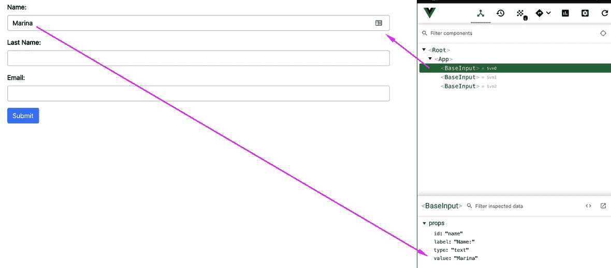

# 第三章：创建可重用的表单组件

Vue 最强大的部分之一是它能够创建组件。

组件是可重用的代码片段，通常包括模板、脚本和样式。组件的惊人之处在于，你可以将特定元素或一组元素的所有逻辑封装到一个单元中。

开始以组件的方式思考的一个好方法是将日常物品分解为简单的、更小的部分。（请在你的脑海中！）

举个例子，你正在使用的计算机。作为一个整体，整个系统可以称为计算机。现在再进一步分解——它有一个显示器、一个键盘和一些电缆。现在拿键盘来分解。现在你有一个容器，这个容器有键。每个键都是一个单一的组件，它重复出现，具有一些在它们之间变化的属性。键上的标签会改变，有时也会改变大小。

那么这个关键组件呢？你能进一步分解吗？也许可以！但是值得吗？键盘键是一个很好的单一组件。它有清晰的属性来定义它，我们可以清晰地定义它的内部功能。当它被按下时，我们需要告诉包含它的人，一个键被按下，以及该键的值。

这种将某物进行分解的过程也可以应用到任何 Vue 应用程序中。从整个应用程序作为一个整体单元开始，然后将其分解。

现在，我们当前的表单是一个大块在`App.vue`中，这不是理想的。让我们创建一些组件！

在本章中，我们将涵盖以下主题：

+   将应用程序分解为可重用组件

+   理解自定义组件中的`v-model`

+   实现自定义输入和选择组件

# 技术要求

本章的代码可以在以下 GitHub 存储库中找到：

[`github.com/PacktPublishing/Building-Forms-with-Vue.js/tree/master/Chapter03`](https://github.com/PacktPublishing/Building-Forms-with-Vue.js/tree/master/Chapter03)。

查看以下视频以查看代码的实际操作：

[`bit.ly/2qgj7wx`](http://bit.ly/2qgj7wx)

# 将表单分解为组件

看看`App.vue`，让我们从我们可以创建的最小可能组件开始。如果你仔细看，你会发现代码中有一个重复的模式——这通常是一个好迹象，表明某些东西可能成为一个很好的组件！

在我们的`<form>`元素中，我们有三个不同的文本输入。其中两个是`text`类型，一个是`email`类型。看起来我们需要一种方法将这些值分配给`type`属性。属性对象可能是一个简单的解决方案！

作为一个快速提醒，这是表单的当前代码：

```js
<div class="form-group">
  <label>First Name:</label>
  <input v-model="form.firstName" type="text" class="form-control">
</div>
<div class="form-group">
  <label>Last Name:</label>
  <input v-model="form.lastName" type="text" class="form-control">
</div>
<div class="form-group">
  <label>Email:</label>
  <input v-model="form.email" type="email" class="form-control">
</div>
```

继续在`src/components`文件夹中创建一个新文件，命名为`BaseInput.vue`。就我个人而言，我喜欢以`Base`开头命名我的基本输入组件；这样，我就知道它是我在应用程序中能找到的最简单的输入形式。

如果我需要制作一个扩展或以某种方式使用`Base`的组件，那么我只需导入`BaseInput`组件，并进行一些调整！但是，您可以随意使用任何您喜欢的命名约定。如果您想要一些关于命名组件的实际样式指南和最佳实践，请参考官方指南：[`vuejs.org/v2/style-guide/`](https://vuejs.org/v2/style-guide/)。

让我们将`App.vue`中的第一个输入复制到我们的新组件中的`<template>`标签中，这样我们就有了一个基础来工作：

```js
<template>
  <div class="form-group">
    <label>Name:</label>
    <input v-model="form.firstName" type="text" class="form-control">
  </div>
</template>
<script>
export default {

}
</script>
```

我们需要做的第一件事是弄清楚如何摆脱硬编码的值；毕竟，将代码提取到组件中的目的是使其具有动态性和可重用性。

让我们创建一个属性对象来保存`label`的值（名称为`string`）：

```js
<script>
export default {
  props: {
    label: {
      type: String,
      required: true
    }
  }
}
</script>
```

我们将使用对象表示法来声明属性，这样我们可以确保任何使用我们组件的人至少会在浏览器控制台中被警告，如果他们忘记定义标签。

现在，让我们回到模板，实际上用新创建的属性对象替换这个值：

```js
<template>
  <div class="form-group">
    <label>{{ label }}</label>
    <input v-model="form.firstName" type="text" class="form-control">
  </div>
</template>
```

还有一个，类型呢？我们可能会想要在电子邮件和最终密码字段中使用这个（我们会的）。

让我们为此创建一个新的属性对象，并像以前一样绑定它：

```js
props: {
  label: {
    type: String,
    required: true
  },
  type: {
    type: String,
    default: 'text',
    validator(value) {
      return ['text', 'email', 'password'].includes(value);
    }
  }
}
```

我们的新属性类型有一个默认值，在组件实现时，如果该属性缺失，将使用默认值。

`validator`是一个函数，它验证！它接受一个参数，即传递到属性的值，并且必须返回一个布尔值来验证该值是否可接受用于属性（`validator`验证！）。

在这种特殊情况下，我们只是检查它是否是我们允许的三个选择之一：`text`，`email`或`password`。

既然我们已经准备好了，让我们更新`<input>`：

```js
<input v-model="form.firstName" :type="type" class="form-control">
```

到目前为止，一切都很好！除了还有一件事情还缺少，我们需要重构。你能发现吗？

到目前为止，我们已经看到了如何将表单分解为组件。现在让我们更深入地了解`v-model`，以及在创建动态组件时的重要性。

# 在自定义组件中理解 v-model

正如你所知，`v-model`是`v-on:input`和`v-bind:value="value"`的简写形式。它允许我们双向绑定特定元素的值，以及它发出的事件到我们内部状态属性之一。

然而，在谈论组件组合时，我们需要考虑额外的事情。

为了让自定义组件能够实现`v-model`协议，我们必须确保发生两件事。没错！我们需要确保组件有一个`value`属性，并且它`$emits`一个输入事件。

有一种方法可以通过使用`model`属性来更改这种默认行为，但这超出了本书的范围。如果你想告诉你的组件使用不同的属性或不同的事件来使用`v-model`，请查看[`vuejs.org/v2/api/#model`](https://vuejs.org/v2/api/#model)。

让我们将这个理论付诸实践。我们将修改我们的`BaseInput`组件，以便能够使用`v-model`绑定。首先，让我们添加一个`value`属性，并将其挂钩到`<input>`上：

```js
props: {
  label: {
    type: String,
    required: true
  },
  type: {
    type: String,
    default: 'text',
    validator(value) {
      return ['text', 'email', 'password'].includes(value);
    }
  },

  // Add this new prop
  value: {
    type: String,
    required: true
  }
}
```

现在我们有了新的`value`属性，我们需要将其绑定到`<input>`的值上。不过，一定要将旧的`v-model`从中移除！看一下下面的例子：

```js
<input :value="value" type="text" class="form-control">
```

差不多了；现在我们需要确保`<input>`在更新时触发输入事件。因此，我们需要添加一个事件处理程序来`$emit`这个信息。

**重要！**在我们继续之前，让我告诉你一个非常常见的*陷阱*，当使用`v-model`和表单时。并非所有的输入都是一样的！`<input>`文本元素（`text`，`email`和`password`）和`<textarea>`很容易。它们触发我们可以监听到用于`v-model`绑定的输入事件。但是，`select`，`checkboxes`和`radio`呢？

Vue 文档非常清晰，所以我要引用一下：

“*`v-model`在内部使用不同的属性并为不同的输入元素发出不同的事件：*

+   *`text`和`textarea`元素使用`value`属性和`input`事件；*

+   *`checkboxes`和`radiobuttons`使用`checked`属性和`change`事件；*

+   *`select`字段使用`value`作为属性和`change`作为事件。*

现在我们已经搞清楚了这个理论，让我们实际监听我们的事件：

```js
<input 
  :value="value" 
  :type="type" 
  class="form-control"
  @input="$emit('input', $event.target.value)"
> 
```

恭喜！我们的`BaseInput`组件已经准备好使用了。

现在我们对`v-model`和自定义组件有了清晰的理解，我们将在表单中使用我们的组件。这将使它更易读、动态和易于维护。

# 实现自定义输入组件

创建可重用的自定义组件是 Vue 的核心部分，但是为了使组件真正有用，我们必须实际上*使用*它们！

打开您的`App.vue`文件，让我们用我们的自定义组件替换三个`<div class="form-group">`元素。

首先要做的是将组件导入到我们的文件中。让我们先搞定这个。在`<script>`元素的顶部添加以下导入，如下所示：

```js
import BaseInput from '@/components/BaseInput';
```

仅仅导入文件是不够的；我们实际上必须将组件添加到文件的组件属性中，这样我们才能在模板中使用它。我们目前在 Vue 实例中没有这样的属性，所以让我们在`name`和`data()`之间创建一个：

```js
...
components: { BaseInput },
...
```

现在我们已经注册了我们的组件，并在`App.vue`文件中导入了它，我们可以进入模板，用我们的新组件替换旧的输入：

```js
<BaseInput 
  label="First Name:" 
  v-model="form.firstName" 
/>
<BaseInput 
  label="Last Name:" 
  v-model="form.lastName" 
/>
<BaseInput 
  label="Email:" 
  v-model="form.email" 
  type="email" 
/>
```

回到您的浏览器，玩一下这个应用程序。您会发现，即使实际上没有发生任何变化，表单现在是由可重用的输入组件驱动的——例如，如果我们需要更新输入的 CSS，我们只需在那个文件中更改一次，整个应用程序就会更新以反映这些变化。

再次打开 Vue DevTools，并确保选择了第一个图标（组件结构的图标）。深入结构，您将看到三个`BaseInput`组件在那里表示。

您甚至可以点击每一个，属性面板将清楚地显示每一个的独特之处——属性！

在下面的截图中，您可以看到，当我在“名称：”字段中输入我的名字时，<BaseInput>组件会在其值属性中反映出来：



还有一件事！在表单中输入一些值，然后查看 props 框，它将实时更新您的值属性中的双向绑定。现在，点击 DevTools 中的第三个图标，看起来像一堆点——这是事件视图。

再次在其中一个输入框中输入一些值，您会看到事件框将填满条目。点击其中一个，您会注意到我们的输入事件在每次按键时都被触发。

这是两种不同的*操作*——值得到更新和输入事件被触发构成了`v-model`在工作中所做的工作，正如我们之前讨论的那样！

让我们看一下以下的屏幕截图：

！[](assets/8da52196-dedc-4554-94eb-2c40913540cc.png)

在前面的屏幕截图中，您可以看到`<BaseInput>`组件是如何发出输入事件的——`payload`是用户在表单中输入的内容。

# 再来一次——带有下拉选项！

在我们结束本章之前，让我们构建一个自定义组件，它包装了一个下拉输入，以便回顾我们迄今为止学到的知识。

首先创建组件文件——我们将其命名为`BaseSelect.vue`，并将其放在`components`文件夹中。

就像我们对`BaseInput`所做的那样，首先我们将定义我们的 HTML 模板。我们现在会留一些属性为空，因为我们稍后会绑定它们。我们还将设置一些虚拟数据以便轻松测试。在组件创建中，您会发现小步骤是前进的方式！

将以下代码添加为`BaseSelect`的模板：

```js
<template>
  <div class="form-group">
 <label>Label here</label>
 <select class="form-control">
 <option value="">Test!</option>
 <option value="">Me!</option>
 <option value="">:D</option>
 </select>
  </div>
</template>
```

看起来不错！让我们将这个新组件导入到`App.vue`中，并在我们的模板中，以便我们可以在浏览器中测试它的功能。按照给定的步骤来做：

1.  在`script`元素的顶部导入组件，紧挨着`BaseInput`导入语句：

```js
import BaseSelect from '@/components/BaseSelect';
```

1.  将`BaseSelect`添加到您的`components`声明中：

```js
components: { BaseInput, BaseSelect },
```

1.  在`<template>`元素内创建`BaseSelect`的实例，就在最后一个`BaseInput`组件下面，也在包含输入按钮的`div`之前：

```js
...
<BaseSelect />
... 
```

检查您的浏览器，您会看到我们新选择的组件正在发挥作用。她不是很漂亮吗？

让我们再进一步，我们迫切需要一些`props`。让我们从添加`label`开始；我们可以从模板中看到它需要被动态化。

在新的`script`元素内创建您的`props`对象，并将其添加到列表中：

```js
<script>
export default {
  props: {
    label: {
      type: String,
      required: true
    }
  }
}
</script>
```

现在，前往模板并动态绑定它们。我们需要使用一些插值使`<label>`的内容动态化：

```js
<template>
  <div class="form-group">
    <label>{{ label }}</label>
    <select class="form-control">
      <option value="">Test!</option>
      <option value="">Me!</option>
      <option value="">:D</option>
    </select>
  </div>
</template>
```

到目前为止，一切都很好！回到`App.vue`，并将这些新的`props`添加到我们的示例组件中：

```js
<BaseSelect 
  label="What do you love most about Vue?" 
/>
```

在浏览器中测试一下，确保没有出现问题。到目前为止，组件运行得相当顺利，但它显示的选项仍然是硬编码的。让我们实现一个`options`属性，这次它将是一个对象数组，我们将用它来填充`select`选项。

回到`BaseSelect.vue`，并创建新的属性：

```js
options: {
  type: Array,
  required: true,
  validator(opts) {
    return !opts.find(opt => typeof opt !== 'object');
  }
}
```

对于`validator`对象，我们将使用 JavaScript 数组，以找到一种方法来查看数组中是否存在一个不是对象的元素。如果找到了某些东西，`find`方法将返回它，`!`将对其进行评估为`false`，这将引发控制台错误。如果找不到任何东西（并且所有元素都是对象），那么`find`将返回`undefined`，`!`将转换为`true`，并且验证将通过。

有关`find`方法的更多信息，请查看以下链接：[`developer.mozilla.org/en-US/docs/Web/JavaScript/Reference/Global_Objects/Array/find`](https://developer.mozilla.org/en-US/docs/Web/JavaScript/Reference/Global_Objects/Array/find)。

让我们在`<select>`元素内部实现一个`v-for`循环：

```js
<select class="form-control">
  <option 
    v-for="opt in options"
    :key="opt.value"
    :value="opt.value"
    >
    {{ opt.label || 'No label' }}  
  </option>
</select>
```

`v-for`循环将抓取 options 中的每个元素，并在`<select>`内创建一个新的`<option>`元素；不要忘记设置`:key`属性！

如果您想了解更多关于`:key`的信息，即何时使用它以及原因，请查看我在以下链接中的文章：[`www.telerik.com/blogs/in-vue-when-do-i-actually-need-the-key-attribute-and-why`](https://www.telerik.com/blogs/in-vue-when-do-i-actually-need-the-key-attribute-and-why)。

我们需要确保 options 中的每个对象都有`label`和`value`属性，但如果`label`缺失，我们将提供一个默认值。

回到`App.vue`，我们将在`data()`内部创建一个名为`loveOptions`的新内部`state`属性，它将保存特定`<Select>`的选项：

```js
return {
  form: ...,
  loveOptions: [
    { label: 'Fun to use', value: 'fun' },
    { label: 'Friendly learning curve', value: 'curve' },
    { label: 'Amazing documentation', value: 'docs' },
    { label: 'Fantastic community', value: 'community' }
  ]
}
```

现在我们已经设置好了，去模板并将其绑定到我们的`BaseSelect`组件的`options` prop 上：

```js
<BaseSelect 
  label="What do you love most about Vue?" 
  :options="loveOptions"
/>
```

保存后返回浏览器并检查选项。它活了！

还有一件事情缺失，我们需要将其添加到这个组件中，即`v-model`功能。我们需要创建一个`value` prop，使所选的`option`属性使用它，并确保我们从组件内部触发输入事件。

“记住，记住，`v-model` 的规则，属性绑定和发射。我不知道任何理由，`v-model` 系统，应该被遗忘。” - Vue Fawkes

在这种情况下，由于我们将使用 `v-model` 与 `select`，请记住我们需要监听变化，甚至是内部的变化！另一个需要注意的是，您可能会想要在 `select` 标签上放置一个 `:value` 绑定，这不是与选择一起工作的正确方式！

HTML 中的 `<select>` 元素没有 `value` 属性；它所做的是将 `selected` 属性应用到其中的 `option` 元素，该元素保存当前值。

1.  添加 `value` 属性：

```js
      value: {
        type: String,
        required: true
      }
```

1.  您将使用 `value` 属性来检查此选项的值是否等于它。确保在 `select` 元素触发 `change` 事件时发出 `input`：

```js
      <select 
        class="form-control"
        @change="$emit('input', $event.target.value)"
       >
        <option
          v-for="opt in options"
          :key="opt.value"
          :value="opt.value"
          :selected="value === opt.value"
          >
          {{ opt.label || 'No label' }}  
        </option>
      </select>
```

1.  返回到 `App.vue` 并将 `v-model` 绑定到这个新元素。您需要在 `data()` 中的 `form` 属性中创建一个名为 `love` 的新属性，并将 `v-model` 属性添加到 `BaseSelect` 元素中：

```js
      form: {
        firstName: '',
        lastName: '',
        email: '',
        love: 'fun'
      },
```

`BaseSelect` 元素现在将具有 `v-model` 绑定：

```js
<BaseSelect 
        label="What do you love most about Vue?" 
        :options="loveOptions"
        v-model="form.love"
      />
```

最后，检查您的浏览器，看看一切是否正常。进入 DevTools 并检查您的 App 组件 - 当您切换选择的值时，它也会更新！

# 总结

在本章中，我们已经通过将单例应用程序或表单解构为可重用的动态组件的过程。我们已经涵盖了一些重要的核心 Vue 功能，比如 `v-model`，属性和事件。

在下一章中，我们将加快速度，实现一个与用户体验（UX）相关的功能，即输入掩码！
