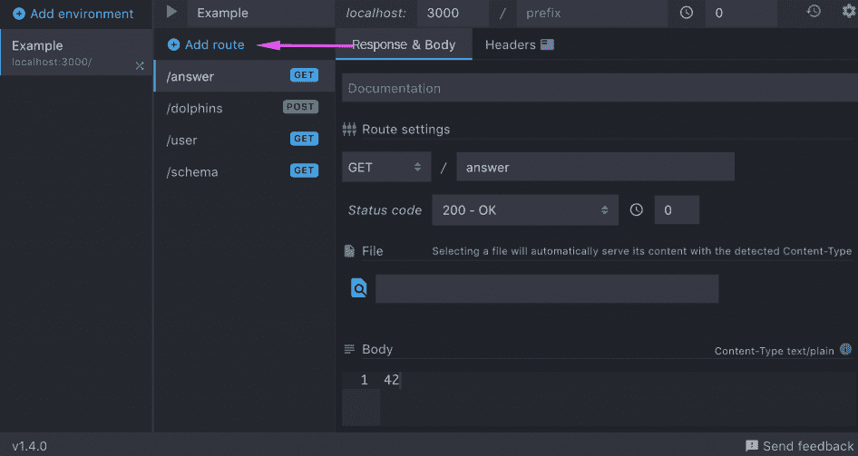
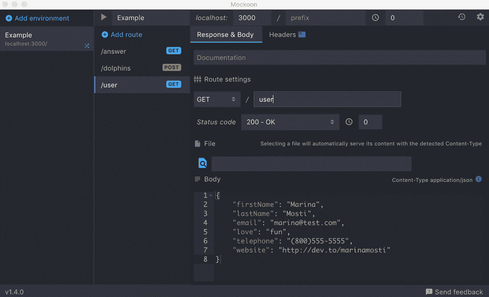

# 第六章：使用 Vuex 进行全局状态管理

Vuex 是一种状态管理模式和库。等等，什么？让我们把所有的技术术语放在一边，如果你想阅读官方的技术解释，你可以在官方的 Vuex 网站上找到，什么是 Vuex？[`vuex.vuejs.org/`](https://vuex.vuejs.org/)。

在这一章中，你将学习如何使用全局状态管理模式和库 Vuex 来设置你的项目。Vuex 将允许你将组件中的局部状态提取到一个全局的、无所不知的状态中。如果你对这种模式不熟悉，比如 React 的 Redux，不用担心！继续阅读，我们将一步步来。

我们将以“这对我意味着什么”的水平来处理它。你可能知道，在 Vue 中，组件之间的通信是通过从父组件到子组件的 props 和从子组件到父组件的事件。在某些情况下，子组件将希望向其父组件发送数据。也许你想提醒父组件，它内部的某些东西被点击了，或者某些数据被改变了。在我们之前的例子中，我们的`BasicInput`和`BasicSelect`组件在改变时向父组件`$emit`值。

在某些情况下，父组件有自己的父组件，并向上发送`$emit`。有时，这第三个父组件也有父组件，依此类推。这可能很快就会变成一个非常复杂的组件网络，它们之间完美平衡地进行通信。或者你以为是这样。

你接到客户的电话：他们希望你在应用程序上进行 API 调用，以在标题中显示当前用户的名称，并且如果当前有用户登录，他们希望你预先填充表单上的一些字段。你该怎么办？也许你正在考虑在`App.vue`父组件上进行 API 调用，并开始构建一个需要它的组件链，但当这些数据在其中一个子组件上发生变化时会发生什么呢？你会将值`$emit`回父组件并创建一个庞大的链吗？

解决方案是使用 Vuex。Vuex 将为你提供一个全局状态，它不直接附加到任何组件上，但所有组件都可以访问它。在本章中，我们将从上一章的工作中获取我们的工作，并将整个表单迁移到 Vuex。我们还将进行一个模拟 API 调用，以获取已登录用户的数据，并使用一些值预先填充我们的全局存储。

本章将涵盖以下主题：

+   将 Vuex 添加到我们的项目中

+   创建模拟 API 端点

+   创建全局状态

+   添加一些变异

+   灯光，Vue，行动！

+   Vuelidate 和 Vuex

# 技术要求

本章的完整代码可以在以下 GitHub 存储库中找到：

[`github.com/PacktPublishing/Building-Forms-with-Vue.js/tree/master/Chapter06`](https://github.com/PacktPublishing/Building-Forms-with-Vue.js/tree/master/Chapter06)。

查看以下视频以查看代码的运行情况：

[`bit.ly/31l16Kg`](http://bit.ly/31l16Kg)

# 将 Vuex 添加到我们的项目中

让我们首先将 Vuex 添加到我们的项目中。按照以下步骤进行：

1.  打开终端并运行以下命令，以将 Vuex 添加到项目中作为依赖项：

```js
> npm install vuex
```

1.  现在我们已经安装了库，我们需要将其添加为应用程序的插件。转到`main.js`，导入它并使用以下代码添加它。您可以将它们放在`Vue`和`App`导入语句之后：

```js
import Vuex from 'vuex';
Vue.use(Vuex);
const store = new Vuex.store({
  // Our global store
});
```

`store`变量将保存我们的全局状态，包括我们的操作和变异。我们很快将详细讨论这些内容。为了使`store`对整个应用程序可用，我们还缺少最后一步。我们需要将`store`变量注入到我们的`Vue`实例中。

1.  在`main.js`中，继续转到新`Vue`实例的配置选项，并将`store`注入其中作为属性：

```js
new Vue({
store: store,
  render: h => h(App),
}).$mount('#app');
```

干得好！现在我们已经将 Vuex 设置为项目依赖项，我们几乎可以开始创建我们的存储了——在那之前只有一件微小的事情要做。我们将为我们的测试创建一个快速的模拟 API 端点。

# 创建模拟 API 端点

为了模拟我们正在调用 API 以获取用户详细信息，我们需要首先使用 Mockoon 进行设置。如果您还没有设置它，请查看本书的*Bringing in Axios*部分中第二章中如何安装它的说明。

让我们看看如何创建模拟 API 端点。按照以下步骤进行：

1.  打开应用程序，然后单击第二列中的“添加路由”按钮。这将在同一列中的列表中添加一个新路由。单击它以选择它，右侧的窗格将更新以显示此特定路由的信息：



1.  在路由设置下，你可以输入路由的名称，将动词保留为 GET，并将端点的名称设置为`user`：


1.  现在，转到面板的 Body 部分，并设置我们将从调用中返回的虚拟数据。当然，你可以随意填写你自己的名称和虚拟信息，如下所示：

```js
{ 
   "firstName": "Marina",
   "lastName": "Mosti",
    "email": "marina@test.com",
    "love": "fun",
    "telephone": "(800)555-5555",
    "website": "http://dev.to/marinamosti"
}

```

下面的截图显示了虚拟信息的样子：



1.  在我们开始模拟服务器之前还有一件事。转到面板顶部的 Headers 选项卡，并添加一个新的头部。左侧应该写 Content-Type，右侧应该写`application/json`，如下面的截图所示：


最后，确保你使用工具栏上的绿色播放图标启动服务器。如果服务器已经在运行，点击停止按钮然后重新启动。

Mockoon 是一个非常简单但功能强大的工具，通过这些简单的步骤，我们已经有了一个完全功能的端点来运行测试。在下一节中，我们将最终开始创建我们的存储和全局状态。

# 创建全局状态

现在我们已经完成了设置，可以回到`main.js`并开始处理我们的全局状态。

在新的`Vuex.Store`配置中，我们将添加一个叫做`state`的保留属性。`state`是一个响应式对象，类似于本地状态`data()`的工作方式，因此我们将在这里重新定义我们的表单结构，不过，由于它现在不直接与表单绑定，我们将把它重命名为`user`。

回到`main.js`，继续在新的`Vuex.Store`对象中设置以下状态：

```js
state: {
  user: {
    firstName: '',
    lastName: '',
    email: '',
    love: 'fun',
   telephone: '',
    website: ''
  }
},
```

你可能想知道为什么我们将保存用户数据的全局属性命名为`user`，而不是之前的`form`。首先，让我澄清一点，你可以根据你的应用程序需求自由地命名状态变量！然而，在这种情况下，`form`并不能一目了然地表明我们将在这里存储什么样的数据；另一方面，`user`则非常具有描述性。

一个常见的做法是在这里将`user`属性初始化为 null。在这种情况下，您可以通过简单的`if`语句来检查他们是否已经通过认证，例如`if (!user)`。在这种情况下，我选择了这种设置来清晰地表明结构。当然，在`App.vue`中，用户的数据将用于填充一个表单，但在我们应用程序的另一个部分中，它可能会用于在任何类型的表单之外显示一些用户的数据。

学习如何设置您的存储是成功拥有功能全局状态的第一步。在接下来的部分，我们将添加修改此存储的能力与变异。

# 向我们的存储添加一些变异

关于 Vuex 的一个重要事情是，尽管全局状态可以从我们的任何组件中访问，但我们不应该直接改变或修改它。要修改我们的用户的内容，我们需要创建一个叫做**变异**的东西。变异是具有一个单一任务的方法：接受一个值或有效载荷，并对状态进行修改。这样，Vuex 就可以监视哪些组件正在对状态进行修改，而不会变得混乱不堪！

让我们创建我们的第一个变异；我们将称之为`updateUser`。

这个变异将接受两个参数：第一个是`state`。每个变异都会始终接收状态作为第一个参数；它默认由 Vuex 注入到变异中。第二个参数将是当您调用它时该变异将获得的值——在这种情况下，我们将称之为`user`，因为这是我们将传递给它的内容。重要的是要知道，变异*不能*执行异步代码。每个变异都需要是同步的，因为它们直接对我们的状态进行更改。

在`Vuex.Store`配置中创建一个名为`mutations`的新属性，然后将我们的以下新变异添加到其中：

```js
mutations: {
 updateUser(state, user) {
    state.user = user;
  },
},
```

当提交此变异时，它将通过调用`state.user = user`来更新全局状态，并传递我们传递的用户。现在，我们到底想要提交这个新的变异在哪里呢？

早些时候，我们设置了一个 API 端点来获取我们的模拟*已登录*用户。我们仍然需要设置一个调用此端点的方法，以便我们的应用程序在启动时可以使用它来检查 API 中是否有用户。

# 灯光，Vue，操作！

Vuex 的第三个关键部分称为**操作**。操作是方法，就像变异一样，但它们可以在其中执行异步代码。

操作接收两个参数，如下所示：

+   第一个是`context`，它是一个对象，保存对状态、getter 的引用，以及提交 mutations 和调度其他 actions 的能力。

+   第二个（可选）参数是用户定义的；这意味着我们可以在需要时向我们的 actions 发送额外的信息，但这也可以安全地忽略。

在基于 Vuex 的应用程序中的一个常见模式是将 HTTP 调用放在 Vuex actions 中 - 这样，如果需要的话，它们可以被应用程序内的任何组件调度。这些 HTTP 调用通常修改或利用状态，这非常方便，因为我们可以通过`context`轻松访问所有这些内容。

让我们回到手头的问题。我们需要调用我们的`/users`端点来获取用户信息。我们将创建一个名为`getLoggedInUser`的 Vuex action，它将知道如何为我们进行这个调用，并将自动将其获取的信息提交到状态。

按照以下步骤进行：

1.  由于我们将使用 Axios，确保首先在`main.js`文件中与其他导入语句一起导入它：

```js
import axios from 'axios';
```

1.  现在，在`Vuex.Store`配置对象中创建一个名为`actions`的属性；这个属性也是一个保留字。在其中，我们将创建我们的`getLoggedInUser`函数：

```js
getLoggedInUser(context) {
    axios.get('http://localhost:3000/user')
    .then(response => {
      context.commit('updateUser', response.data);
    });
  },
```

记住，Axios 返回一个 JavaScript promise，所以我们将在调用中附加一个`.then`块，在其中我们将使用响应数据提交我们的`updateUser` mutation。这些数据正是我们在 Mockoon 中定义的 JSON 对象。请记住，现实生活中的应用程序可能会涉及更复杂的流程，以检查用户是否实际上已登录；一个常见的做法是向端点传递一个 ID，或者甚至后端将通过来回传递令牌来处理会话。然而，这超出了本书的范围，因此我们将继续使用这个虚假场景进行演示目的。

现在我们的 action 已经准备好了，我们需要一个地方来调度它。在这种情况下，我们假设我们的应用程序希望尽快检查已登录的用户，因此我们将利用`App.vue`文件中的`created()`钩子：

1.  转到`App.vue`并在组件上添加`created`方法：

```js
created() {
 this.$store.dispatch('getLoggedInUser');
}
```

1.  打开您的浏览器，刷新页面，并在开发者工具的网络选项卡中检查。您会看到，页面加载后，我们对`http://localhost:3000/user`的 Axios 调用被触发，并且用户的数据被加载。如果出现错误，请记住首先在 Mockoon 上启动服务器！

1.  在我们继续修改我们的表单之前，让我们创建一个新的`<TheHeader>`组件来展示我们新的全局状态的强大功能。在`components`文件夹内创建一个新文件`TheHeader.vue`，并复制以下代码：

```js
<template>
 <div class="row">
    <div class="col-12 text-right">
      <p v-if="$store.state.user">
        Welcome back, {{ $store.state.user.firstName }}!
      </p>
    </div>
  </div>
</template>
```

在这个组件中，我们将使用插值来输出`$store.state.user.firstName`，这将访问我们的全局状态，在状态内部和用户内部查找`firstName`属性并在这里显示它。

1.  返回`App.vue`并导入组件：

```js
import 'TheHeader' from '@/components/TheHeader' 
```

不要忘记在`components`属性内声明它，如下所示：

```js
components: { BaseInput, BaseSelect, TheHeader },
```

1.  最后，在模板中添加我们的新组件，就在开头的`<div>`元素下方，并在浏览器中查看。您应该可以直接从全局状态中看到我们用户的名称被输出：

```js
<div id="app" class="container py-4">
    <TheHeader />
    ...
```

现在您已经了解了操作和突变，我们可以提高难度。在下一节中，我们将整合我们的两个主要库——Vuex 和 Vuelidate。

# Vuelidate 和 Vuex

为了让我们的表单在使用 Vuelidate 和 Vuex 的同时继续工作，我们需要对我们的数据设置进行一些调整，以便在输入上进行双向绑定。别担心，我们会一步一步来做。现在我们已经将 Vuex 整合到我们的应用程序中，我们希望我们的表单使用全局状态而不是我们在`App.vue`内的`data() { form: {...} }`中的局部状态。因此，我们需要在模板中进行一些更改，以告诉双向绑定使用 Vuex 而不是局部状态。

我们将从我们表单中删除所有的`v-model`语句。相反，我们将通过设置`:value`绑定和`@input`监听器来手动创建我们的双向绑定。

首先，我们将创建一个名为`updateUser`的新方法，它将接收两个参数，如下所示：

+   第一个将在我们的表单中被更新的是`property`，例如`firstName`或`lastName`。

+   第二个参数将是这个新属性将接收的`value`。

所以，让我们从将这个新方法添加到我们的`App.vue`组件开始：

```js
updateUser(property, value) {
  this.$store.dispatch('updateUserData', {
    property,
    value
  });

  this.$v.form[property].$touch();
}
```

这种方法将触发一个新的动作，我们将在接下来创建一个名为`updateUserData`的动作；它将发送一个包含`property`和方法获取的`value`的有效负载。

让我们停下来看一下第二个陈述。由于 Vuelidate 将不再连接到我们的本地状态，它将需要我们告诉它何时重新计算输入的脏状态，并检查验证错误。

由于`updateUser`方法将负责对我们的全局状态进行更改，我们将通过`$v.form[property]`访问 Vuelidate 的输入对象，并在其上强制`$touch()`。

现在我们的状态将是全局的，我们不再需要我们的`form: {...}`本地状态，所以你可以继续删除它。你的`data()`属性现在应该如下所示：

```js
data() {
  return {
    loveOptions: [
      { label: 'Fun to use', value: 'fun' },
      { label: 'Friendly learning curve', value: 'curve' },
      { label: 'Amazing documentation', value: 'docs' },
      { label: 'Fantastic community', value: 'community' }
    ]
  }
},
```

然而，为了让 Vuelidate 能够访问我们的全局状态，我们需要使用一个 Vuex 辅助函数将其映射到计算属性上。在这种情况下，我们想要使用`mapState`。想象一下，如果你不得不为我们的每一个用户属性创建一个计算属性，你将不得不逐个创建大量重复的代码，就像下面的例子一样：

```js
firstName() {
  return this.$store.state.user.firstName;
}
```

想象一下，如果你不得不为表单的所有属性都这样做，可能会很快变得乏味，对吧？

在这些情况下，Vuex 有一些方便的映射函数可以利用，所以让我们继续并将`mapState`导入到我们的`App.vue`文件的顶部：

```js
import { mapState } from 'vuex';
```

接下来，我们将在`App.vue`组件中添加一个`computed`属性，并使用`mapState`函数将整个状态映射到计算属性上：

```js
computed: {
  ...mapState({form: 'user'}),
},
```

我们将传递一个对象给`mapState`，告诉函数我们想要将整个全局状态的哪一部分映射到我们的计算属性上。在这种情况下，我们告诉它将用户全局状态中的所有内容映射到本地表单中。由于用户是一个具有多个子属性的对象，它将为每一个创建一个绑定，因此当`App.vue`调用，例如，`this.form.firstName`时，它将在全局状态中的`this.$store.state.user.firstName`中找到。很棒，对吧？！

请记住，`mapState`返回一个对象，因此我们可以在这里使用 JavaScript ES6 的展开运算符将新创建的对象合并到我们的`computed: {}`属性中。如果您以后想要添加一些不是从 Vuex 映射而来的计算属性，这将非常方便。

如果您想了解更多关于展开运算符的信息，请参考以下文章：[`dev.to/marinamosti/understanding-the-spread-operator-in-javascript-485j`](https://dev.to/marinamosti/understanding-the-spread-operator-in-javascript-485j)。

在我们去处理`updateUserData`动作之前，让我们对我们的输入进行`v-model`更改。删除所有`v-model`语句，并将它们替换为以下内容：

```js
<BaseInput 
  label="First Name:"
  :value="$store.state.user.firstName"
  @input="updateUser('firstName', $event)"
  :validator="$v.form.firstName"
/>
<BaseInput  
  label="Last Name:"
  :value="$store.state.user.lastName"
  @input="updateUser('lastName', $event)"
  :validator="$v.form.lastName"
/>
<BaseInput 
  label="Email:" 
  :value="$store.state.user.email"
  @input="updateUser('email', $event)"
  :validator="$v.form.email"
  type="email" 
/>
<BaseInput 
  label="The URL of your favorite Vue-made website"
  :value="$store.state.user.website"
  @input="updateUser('website', $event)"
  :validator="$v.form.website"
/>
<BaseInput 
  label="Telephone"
  type="text" 
  :value="$store.state.user.telephone"
  @input="updateUser('telephone', $event)"
  :validator="$v.form.telephone"
  :mask="'(###)###-####'"
/>
<BaseSelect 
  label="What do you love most about Vue?" 
  :options="loveOptions"
  :value="$store.state.user.love"
  @input="updateUser('love', $event)"
  :validator="$v.form.love"
/>
```

`：value`属性将绑定到我们的全局状态，也就是我们在本章开头创建的状态。`$store`属性通过 Vuex 在整个应用程序中都可以访问，我们可以使用它直接访问状态，甚至在模板中也可以。`@input`监听器将直接指向`updateUser`，将属性设置为字符串，并将`$event`的有效负载作为值传递。

转到`main.js`；我们必须创建我们的`updateUser`方法正在调用的新动作。我们将利用我们已经存在的突变`updateUser`，来更新用户的一个属性。您还可以将其重构为一个专门更新一个属性而不是覆盖整个对象的突变。在这种情况下，对象非常小，性能不是问题。将以下动作添加到您的存储中：

```js
updateUserData(context, payload) {
const userCopy = {...context.state.user};
  userCopy[payload.property] = payload.value;
  context.commit('updateUser', userCopy);
}
```

在动作的第一行，我们将使用 ES6 的展开运算符对用户状态进行浅拷贝。重要的是要记住，状态永远不应该在突变之外改变，所以如果我们直接将新属性值分配给我们的状态中的用户，我们将会做到这一点。

在制作副本之后，我们将属性设置为新值，并在我们的`updateUser`突变上调用`commit`。返回浏览器并重新加载页面；确保你的虚拟 Mockoon API 正在运行，这样我们的 Axios 调用才能正常工作并查看结果：


就是这样！通过对我们应用程序的这些小改动，我们成功地使全局状态不仅控制我们的表单，而且还利用了 Vuelidate 的灵活性和强大功能，直接连接到全局状态。

# 总结

在本章中，您已经掌握了设置、创建和使用 Vuex 作为全局状态模式和库所需的技能。您还学会了如何将 Vuelidate 与 Vuex 连接起来，以便您的验证直接与全局状态连接。

在下一章中，我们将进入最后阶段——如何将我们所做的一切以及我们的形式转化为完全基于模式驱动的形式。
