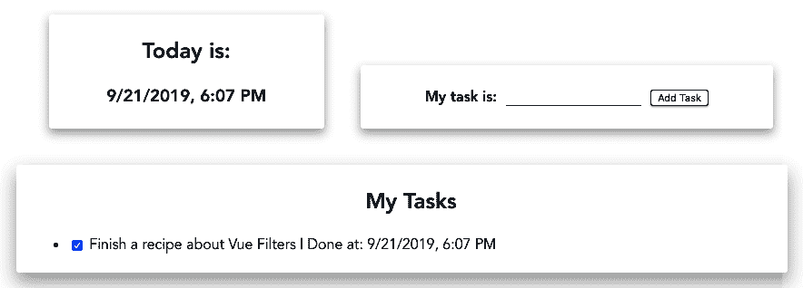
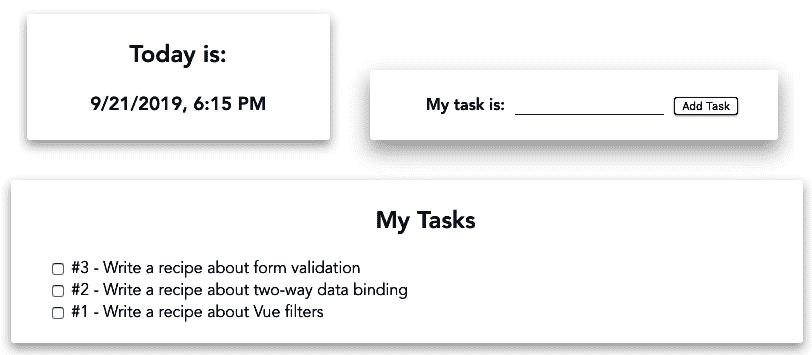
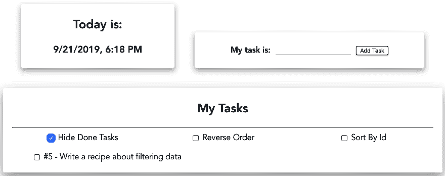
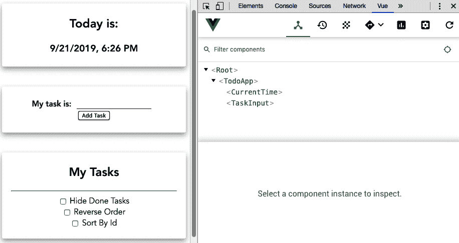
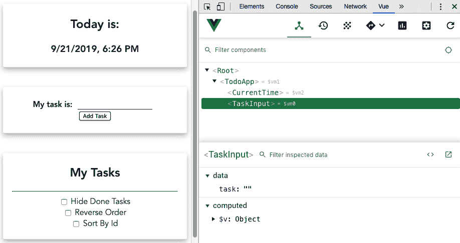
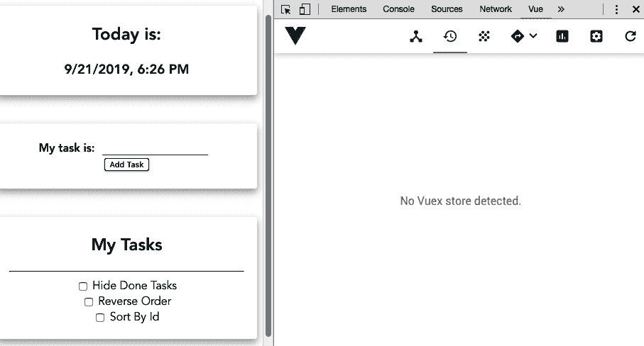
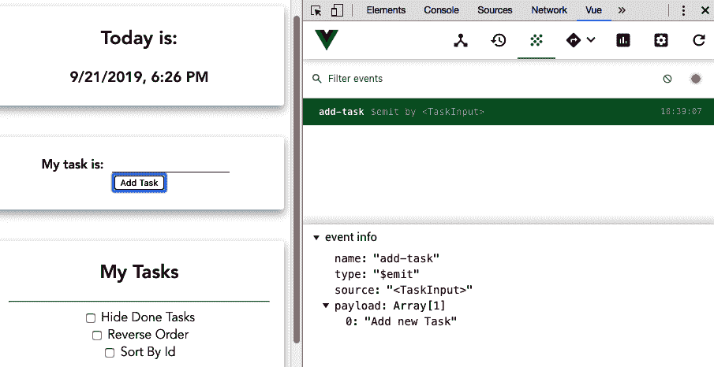

# 第一章：数据绑定、事件和计算属性

**数据**是当今世界上最有价值的资产，知道如何管理它是必须的。在 Vue 中，我们有权利选择如何收集这些数据，按照我们的意愿进行操作，并将其传递到服务器。

在本章中，我们将更多地了解数据处理和数据处理过程，表单验证，数据过滤，如何向用户显示这些数据，以及如何以与应用程序内部不同的方式呈现它。

我们将学习如何使用各种`vue-devtools`，以便我们可以深入了解 Vue 组件并查看我们的数据和应用程序发生了什么。

在本章中，我们将涵盖以下配方：

+   使用 Vue CLI 创建您的第一个项目

+   创建 hello world 组件

+   创建具有双向数据绑定的输入表单

+   在元素上添加事件监听器

+   从输入中删除`v-model`指令

+   创建动态待办事项列表

+   创建计算属性并了解它们的工作原理

+   使用自定义过滤器显示更清洁的数据和文本

+   为列表创建过滤器和排序器

+   创建条件过滤器以对列表数据进行排序

+   添加自定义样式和过渡

+   使用`vue-devtools`调试您的应用程序

让我们开始吧！

# 技术要求

在本章中，我们将使用**Node.js**和**Vue CLI**。

注意，Windows 用户 - 您需要安装一个名为`windows-build-tools`的`npm`包，以便能够安装以下所需的包。要做到这一点，以管理员身份打开 PowerShell 并执行

`> npm install -g windows-build-tools`命令。

要安装**Vue CLI**，您需要打开终端（macOS 或 Linux）或命令提示符/PowerShell（Windows）并执行以下命令：

```js
> npm install -g @vue/cli @vue/cli-service-global
```

# 使用 Vue CLI 创建您的第一个项目

当 Vue 团队意识到开发人员在创建和管理他们的应用程序时遇到问题时，他们看到了一个机会，可以创建一个工具来帮助世界各地的开发人员。有了这个，Vue CLI 项目诞生了。

Vue CLI 工具是一个在 terminal 命令行中使用的 CLI 工具，如 Windows PowerShell、Linux Bash 或 macOS Terminal。它被创建为 Vue 开发的起点，开发人员可以启动一个项目并顺利地管理和构建它。Vue CLI 团队的重点是为开发人员提供更多时间思考代码，花费更少的时间在工具上，将他们的代码投入生产，添加新的插件或简单的 `hot-module-reload`。

Vue CLI 工具已经进行了调整，无需在将其投入生产之前将工具代码弹出 CLI。

当版本 3 发布时，Vue UI 项目被添加到 CLI 中作为主要功能，将 CLI 命令转换为更完整的可视解决方案，并增加了许多新的功能和改进。

## 准备工作

这个配方的先决条件是 Node.js 12+。

这个配方所需的 Node.js 全局对象如下：

+   `@vue/cli`

+   `@vue/cli-service-global`

## 如何做...

要创建一个 Vue CLI 项目，请按照以下步骤进行：

1.  我们需要在 Terminal (macOS 或 Linux) 或 Command Prompt/PowerShell (Windows) 中执行以下命令：

```js
> vue create my-first-project
```

1.  CLI 会询问一些问题，这些问题将帮助你创建项目。你可以使用箭头键进行导航，*Enter* 键继续，*Spacebar* 选择选项：

```js
?  Please pick a preset: (Use arrow keys)  default (babel, eslint) ❯ **Manually select features** ‌
```

1.  有两种方法可以启动一个新项目。默认方法是一个基本的 `babel` 和 `eslint` 项目，没有任何插件或配置，但也有 `手动` 模式，你可以选择更多模式、插件、linters 和选项。我们将选择 `手动` 模式。

1.  在这一点上，我们将被询问关于我们希望为我们的项目选择的功能。这些功能是一些 Vue 插件，如 Vuex 或 Router (Vue-Router)、测试器、linters 等。对于这个项目，我们将选择 `CSS 预处理器` 并按 *Enter* 继续：

```js
? Check the features needed for your project: (Press <space> to 
  select, <a> to toggle all, <i> to invert selection)
 ❯ Choose Vue version
 ❯ Babel
 TypeScript
 Progressive Web App (PWA) Support
 Router
 Vuex
 CSS Pre-processors
 ❯ Linter / Formatter
 Unit Testing
 E2E Testing
```

1.  CLI 会要求你选择一个 Vue 版本来启动你的应用程序。我们将在这里选择 `3.x (Preview)`。按 *Enter* 继续：

```js
? Choose a version of Vue.js that you want to start the project with 
 (Use arrow keys)
 2.x 
❯ 3.x (Preview)
```

1.  可以选择与 Vue 一起使用的主要 **层叠样式表** (**CSS**) 预处理器，即 `Sass`、`Less` 和 `Stylus`。由你选择哪种最适合你的设计并且最适合你：

```js
?  Pick a CSS pre-processor (PostCSS, Autoprefixer and CSS Modules
  are supported by default): (Use arrow keys) Sass/SCSS (with dart-sass)  Sass/SCSS (with node-sass)  **Less** ❯ Stylus 
```

1.  现在是时候格式化您的代码了。您可以在`AirBnB`、`Standard`和`Prettier`之间进行选择，并使用基本配置。在`ESLint`中导入的这些规则总是可以自定义，没有任何问题，并且有一个完美的规则适合您的需求。找出对您来说最好的方法，然后执行以下操作：

```js
?  Pick a linter / formatter config: (Use arrow keys) ESLint with error prevention only ❯ **ESLint + Airbnb config** ESLint + Standard config 
  ESLint + Prettier
```

1.  一旦代码检查规则被设置，我们需要定义它们何时应用于我们的代码。它们可以在保存时应用，或者在提交时进行修复：

```js
? Pick additional lint features: 
 Lint on save
❯ Lint and fix on commit 
```

1.  一旦所有这些插件、代码检查器和处理器都被定义，我们需要选择设置和配置存储的位置。最好的存储位置是在一个专用文件中，但也可以将它们存储在`package.json`文件中：

```js
?  Where do you prefer placing config for Babel, ESLint, etc.?  (Use  
  arrow keys) ❯ **In dedicated config files** In package.json
```

1.  现在，您可以选择是否将此选择作为将来项目的预设，这样您就不需要再次重新选择所有内容。

```js
?  Save this as a preset for future projects?  (y/N) n
```

1.  CLI 将自动创建以*步骤 1*中设置的名称命名的文件夹，安装所有内容并配置项目。

有了这些，现在您可以导航并运行项目了。Vue CLI 项目的基本命令如下：

+   `npm run serve`：在本地运行开发服务器

+   `npm run build`：用于构建和缩小应用程序以进行部署

+   `npm run lint`：对代码执行 lint

您可以通过终端（macOS 或 Linux）或命令提示符/PowerShell（Windows）执行这些命令。

## 还有更多...

CLI 内部有一个名为 Vue UI 的工具，可帮助您管理 Vue 项目。这个工具将负责项目的依赖关系、插件和配置。

Vue UI 工具中的每个`npm`脚本都被称为一个任务，在这些任务中，您可以收集实时统计数据，如资产、模块和依赖项的大小；错误或警告的数量；以及更深入的网络数据，以微调您的应用程序。

要进入 Vue UI 界面，您需要打开终端（macOS 或 Linux）或命令提示符/PowerShell（Windows）并执行以下命令：

```js
> vue ui
```

## 另请参阅

+   您可以在[`cli.vuejs.org/guide/`](https://cli.vuejs.org/guide/)找到有关 Vue CLI 项目的更多信息。

+   你可以在[`cli.vuejs.org/dev-guide/plugin-dev.html`](https://cli.vuejs.org/dev-guide/plugin-dev.html)找到有关 Vue CLI 插件开发的更多信息。

# 创建 hello world 组件

Vue 应用程序是由各种组件组合在一起，并由 Vue 框架编排的。知道如何制作您的组件是很重要的。每个组件就像墙上的一块砖，需要以一种方式制作，当放置时，不需要其他砖块以不同的方式重新塑造。在这个教程中，我们将学习如何制作一个基础组件，同时遵循一些重要的原则，重点放在组织和清晰的代码上。

## 准备工作

本教程的先决条件是 Node.js 12+。

本教程所需的 Node.js 全局对象如下：

+   `@vue/cli`

+   `@vue/cli-service-global`

要开始我们的组件，我们可以使用 Vue CLI 创建我们的 Vue 项目，就像我们在*使用 Vue CLI 创建你的第一个项目*中学到的那样，或者开始一个新的项目。

## 操作步骤...

要开始一个新的组件，打开终端（macOS 或 Linux）或命令提示符/PowerShell（Windows）并执行以下命令：

```js
> vue create my-component
```

**命令行界面**（**CLI**）将询问一些问题，这些问题将帮助您创建项目。您可以使用箭头键导航，使用*Enter*键继续，使用*Spacebar*选择选项。选择**`default`**选项：

```js
?  Please pick a preset: **(Use arrow keys)** ❯ default (babel, eslint) 
  Manually select features  ‌
```

通过以下步骤创建我们的第一个`hello world`组件：

1.  让我们在`src/components`文件夹中创建一个名为`CurrentTime.vue`的新文件。

1.  在这个文件中，我们将从组件的`<template>`部分开始。它将是一个阴影框卡片，显示当前日期，格式化：

```js
<template>
  <div class='cardBox'>
    <div class='container'>
      <h2>Today is:</h2>
      <h3>{{ getCurrentDate }}</h3>
    </div>
  </div>
</template>
```

1.  现在，我们需要创建`<script>`部分。我们将从`name`属性开始。这将在使用`vue-devtools`调试我们的应用程序时使用，以识别我们的组件，并帮助**集成开发环境**（**IDE**）。对于`getCurrentDate`计算属性，我们将创建一个`computed`属性，它将返回当前日期，由`Intl`浏览器函数格式化：

```js
<script>
export default {
  name: 'CurrentTime',
  computed: {
    getCurrentDate() {
      const browserLocale =
        navigator.languages && navigator.languages.length
          ? navigator.languages[0]
          : navigator.language;
      const intlDateTime = new Intl.DateTimeFormat(
        browserLocale, 
        {
          year: 'numeric',
          month: 'numeric',
          day: 'numeric',
          hour: 'numeric',
          minute: 'numeric'
        });

      return intlDateTime.format(new Date());
    }
  }
};
</script>
```

1.  为了为我们的盒子设置样式，我们需要在`src`文件夹中创建一个`style.css`文件，然后将`cardBox`样式添加到其中：

```js
.cardBox {
  box-shadow: 0 5px 10px 0 rgba(0, 0, 0, 0.2);
  transition: 0.3s linear;
  max-width: 33%;
  border-radius: 3px;
  margin: 20px;
}

.cardBox:hover {
  box-shadow: 0 10px 20px 0 rgba(0, 0, 0, 0.2);
}

.cardBox>.container {
  padding: 4px 18px;
}

[class*='col-'] {
  display: inline-block;
}

@media only screen and (max-width: 600px) {
  [class*='col-'] {
    width: 100%;
  }

  .cardBox {
    margin: 20px 0;
  }
}

@media only screen and (min-width: 600px) {
  .col-1 {width: 8.33%;}
  .col-2 {width: 16.66%;}
  .col-3 {width: 25%;}
  .col-4 {width: 33.33%;}
  .col-5 {width: 41.66%;}
  .col-6 {width: 50%;}
  .col-7 {width: 58.33%;}
  .col-8 {width: 66.66%;}
  .col-9 {width: 75%;}
  .col-10 {width: 83.33%;}
  .col-11 {width: 91.66%;}
  .col-12 {width: 100%;}
}

@media only screen and (min-width: 768px) {
  .col-1 {width: 8.33%;}
  .col-2 {width: 16.66%;}
  .col-3 {width: 25%;}
  .col-4 {width: 33.33%;}
  .col-5 {width: 41.66%;}
  .col-6 {width: 50%;}
  .col-7 {width: 58.33%;}
  .col-8 {width: 66.66%;}
  .col-9 {width: 75%;}
  .col-10 {width: 83.33%;}
  .col-11 {width: 91.66%;}
  .col-12 {width: 100%;}
}

@media only screen and (min-width: 992px) {
  .col-1 {width: 8.33%;}
  .col-2 {width: 16.66%;}
  .col-3 {width: 25%;}
  .col-4 {width: 33.33%;}
  .col-5 {width: 41.66%;}
  .col-6 {width: 50%;}
  .col-7 {width: 58.33%;}
  .col-8 {width: 66.66%;}
  .col-9 {width: 75%;}
  .col-10 {width: 83.33%;}
  .col-11 {width: 91.66%;}
  .col-12 {width: 100%;}
}

@media only screen and (min-width: 1200px) {
  .col-1 {width: 8.33%;}
  .col-2 {width: 16.66%;}
  .col-3 {width: 25%;}
  .col-4 {width: 33.33%;}
  .col-5 {width: 41.66%;}
  .col-6 {width: 50%;}
  .col-7 {width: 58.33%;}
  .col-8 {width: 66.66%;}
  .col-9 {width: 75%;}
  .col-10 {width: 83.33%;}
  .col-11 {width: 91.66%;}
  .col-12 {width: 100%;}
}
```

1.  在`App.vue`文件中，我们需要导入我们的组件，这样我们才能看到它：

```js
<template>
  <div id='app'>
    <current-time />
  </div>
</template>

<script>
import CurrentTime from './components/CurrentTime.vue';

export default {
  name: 'app',
  components: {
    CurrentTime
  }
}
</script>
```

1.  在`main.js`文件中，我们需要导入`style.css`文件，以便它包含在 Vue 应用程序中：

```js
import { createApp } from 'vue'; import './style.css'; import App from './App.vue';   createApp(App).mount('#app');
```

1.  要运行服务器并查看您的组件，您需要打开终端（macOS 或 Linux）或命令提示符/PowerShell（Windows）并执行以下命令：

```js
> npm run serve
```

记住始终执行命令`npm run lint --fix`，以自动修复任何代码 lint 错误。

这是渲染和运行的组件：


## 它是如何工作的...

Vue 组件几乎与 Node.js 包一样工作。要在代码中使用它，您需要导入组件，然后在要使用的组件的`components`属性中声明它。

就像一堵砖墙，Vue 应用程序由调用和使用其他组件的组件组成。

对于我们的组件，我们使用了`Intl.DateTimeFormat`函数，这是一个本机函数，可用于将日期格式化和解析为声明的位置。为了获得本地格式，我们使用了 navigator 全局变量。

## 另请参阅

+   您可以在[`developer.mozilla.org/en-US/docs/Web/JavaScript/Reference/Global_Objects/DateTimeFormat`](https://developer.mozilla.org/en-US/docs/Web/JavaScript/Reference/Global_Objects/DateTimeFormat)找到有关`Intl.DateTimeFormat`的更多信息。

+   您可以在[`v3.vuejs.org/guide/single-file-component.html`](https://v3.vuejs.org/guide/single-file-component.html)找到有关 Vue 组件的更多信息。

# 使用双向数据绑定创建输入表单

在网上收集数据，我们使用 HTML 表单输入。在 Vue 中，可以使用双向数据绑定方法，其中 DOM 上输入的值传递给 JavaScript，反之亦然。

这使得 Web 表单更加动态，使您有可能在保存或将数据发送回服务器之前管理、格式化和验证数据。

## 准备工作

此配方的先决条件是 Node.js 12+。

此配方所需的 Node.js 全局对象如下：

+   `@vue/cli`

+   `@vue/cli-service-global`

要启动我们的组件，我们可以使用 Vue CLI 创建我们的 Vue 项目，就像我们在*使用 Vue CLI 创建您的第一个项目*配方中学到的那样，或者使用*创建 hello world 组件*配方中的项目。

## 如何做...

按照以下步骤创建具有双向数据绑定的输入表单：

1.  让我们在`src/components`文件夹中创建一个名为`TaskInput.vue`的新文件。

1.  在这个文件中，我们将创建一个组件，它将有一个文本输入和一些显示文本。这个文本将基于文本输入中键入的内容。在组件的`<template>`部分，我们需要创建一个 HTML 输入和一个`mustache`变量，用于接收和呈现数据：

```js
<template>
  <div class='cardBox'>
    <div class='container tasker'>
      <strong>My task is: {{ task }}</strong>
      <input 
        type='text'
        v-model='task'
        class='taskInput' />
    </div>
  </div>
</template>
```

1.  现在，在组件的`<script>`部分，我们将对其命名并将任务添加到`data`属性中。由于数据始终需要返回一个`Object`，我们将使用箭头函数直接返回一个`Object`：

```js
<script>
export default {
  name: 'TaskInput',
  data: () => ({
    task: '',
  }),
};
</script>
```

1.  我们需要为这个组件添加一些样式。在组件的`<style>`部分，我们需要添加`scoped`属性，以便样式仅保持在组件中，不会与其他**层叠样式表**（**CSS**）规则混合：

```js
<style scoped>
  .tasker{
    margin: 20px;
  }
  .tasker .taskInput {
    font-size: 14px;
    margin: 0 10px;
    border: 0;
    border-bottom: 1px solid rgba(0, 0, 0, 0.75);
  }
  .tasker button {
    border: 1px solid rgba(0, 0, 0, 0.75);
    border-radius: 3px;
    box-shadow: 0 1px 2px 0 rgba(0, 0, 0, 0.2);
  }
</style>
```

1.  现在，我们需要将这个组件导入到我们的`App.vue`文件中：

```js
<template>
  <div id='app'>
  <current-time class='col-4' />
  <task-input class='col-6' />
  </div> </template>   <script> import CurrentTime from './components/CurrentTime.vue'; import TaskInput from './components/TaskInput.vue';   export default {
  name: 'TodoApp',
  components: {
  CurrentTime,
  TaskInput,
  }, }; </script> 
```

1.  要运行服务器并查看您的组件，您需要打开终端（macOS 或 Linux）或命令提示符/PowerShell（Windows）并执行以下命令：

```js
> npm run serve
```

请记住始终执行命令`npm run lint --fix`，以自动修复任何代码 lint 错误。

这是渲染和运行的组件：


## 它是如何工作的...

当您创建一个 HTML`input`元素并为其添加`v-model`时，您正在传递一个内置到 Vue 中的指令，该指令检查输入类型并为输入提供糖语法。这处理更新变量和 DOM 的值。

这个模型被称为**双向数据绑定**。如果变量被代码更改，DOM 将重新渲染，如果它被 DOM 通过用户输入更改，比如`input-form`，那么 JavaScript 代码可以执行一个函数。

## 另请参阅

您可以在[`v3.vuejs.org/guide/forms.html`](https://v3.vuejs.org/guide/forms.html)找到有关表单输入绑定的更多信息。

# 向元素添加事件侦听器

在 Vue 中，父子通信的最常见方法是通过 props 和 events。在 JavaScript 中，通常会向 DOM 树的元素添加事件侦听器，以在特定事件上执行函数。在 Vue 中，可以添加监听器并根据需要命名，而不是坚持 JavaScript 引擎上存在的名称。

在这个配方中，我们将学习如何创建自定义事件以及如何发出它们。

## 准备工作

这个配方的先决条件是 Node.js 12+。

这个配方所需的 Node.js 全局对象如下：

+   `@vue/cli`

+   `@vue/cli-service-global`

要启动我们的组件，我们可以使用 Vue CLI 创建我们的 Vue 项目，就像我们在*使用 Vue CLI 创建您的第一个项目*配方中学到的那样，或者使用*使用双向数据绑定创建输入表单*配方中的项目。

## 如何做...

按照以下步骤为 Vue 中的元素添加事件监听器：

1.  创建一个新组件或打开`TaskInput.vue`文件。

1.  在`<template>`部分，我们将添加一个按钮元素，并使用`v-on`指令为按钮点击事件添加一个事件监听器。我们将从组件中删除`{{ task }}`变量，因为从现在开始，它将被发出并且不再显示在组件上：

```js
<template>
  <div class='cardBox'>
    <div class='container tasker'>
      <strong>My task is:</strong>
      <input 
        type='text' 
        v-model='task' 
        class='taskInput' />
      <button 
        v-on:click='addTask'>
            Add Task
      </button>
    </div>
  </div>
</template>
```

1.  在组件的`<script>`部分，我们需要添加一个处理点击事件的方法。这个方法将被命名为`addTask`。它将发出一个名为`add-task`的事件，并将任务发送到数据中。之后，组件上的任务将被重置：

```js
<script>
export default {
 name: 'TaskInput',
 data: () => ({
 task: '',
 }),
  methods: {
    addTask(){
      this.$emit('add-task', this.task);
      this.task = '';
    },
  }
};
</script>
```

1.  在`App.vue`文件中，我们需要为组件添加一个事件监听器绑定。这个监听器将附加到`add-task`事件上。我们将使用`v-on`指令的缩写版本`@`。当它被触发时，事件将调用`addNewTask`方法，该方法将发送一个警报，说明已添加了一个新任务：

```js
<template>
  <div id='app'>
    <current-time class='col-4' />
    <task-input 
      class='col-6'
      @add-task='addNewTask'
    />
  </div>
</template>
```

1.  现在，让我们创建`addNewTask`方法。这将接收任务作为参数，并向用户显示一个警报，说明已添加了任务：

```js
<script> import CurrentTime from './components/CurrentTime.vue'; import TaskInput from './components/TaskInput.vue';   export default {
  name: 'TodoApp',
  components: {
  CurrentTime,
  TaskInput,
  },
  methods: {
  addNewTask(task) {
    alert(`New task added: ${task}`);
  },
  }, }; </script> 
```

1.  要运行服务器并查看您的组件，您需要打开终端（macOS 或 Linux）或命令提示符/PowerShell（Windows）并执行以下命令：

```js
> npm run serve
```

请记住始终执行命令`npm run lint --fix`，以自动修复任何代码 lint 错误。

以下是渲染和运行的组件：


## 它是如何工作的...

Vue 使用`v-on`事件处理指令来读取 HTML 事件。当我们将`v-on:click`指令附加到按钮时，我们为按钮添加了一个监听器，以便在用户单击按钮时执行一个函数。

该函数在组件方法中声明。当调用此函数时，将发出一个事件，表示任何使用此组件作为子组件的组件都可以使用`v-on`指令监听它。

## 另请参阅

您可以在[`v3.vuejs.org/guide/events.html`](https://v3.vuejs.org/guide/events.html)找到有关事件处理的更多信息。

# 从输入中删除 v-model 指令

如果我告诉你，在`v-model`的魔术背后，有很多代码使我们的魔术糖语法发生？如果我告诉你，兔子洞可以深入到足以控制输入的事件和值的一切？

在这个配方中，我们将学习如何提取`v-model`指令的糖语法，并将其转换为其背后的基本语法。

## 准备工作

这个配方的先决条件是 Node.js 12+。

本配方所需的 Node.js 全局对象如下：

+   `@vue/cli`

+   `@vue/cli-service-global`

要启动我们的组件，我们可以使用 Vue CLI 创建我们的 Vue 项目，就像我们在*使用 Vue CLI 创建您的第一个项目*配方中学到的那样，或者使用*向元素添加事件监听器*配方中的项目。

## 如何操作...

通过执行以下步骤，我们将从输入中删除`v-model`指令的糖语法：

1.  打开`TaskInput.vue`文件。

1.  在组件的`<template>`块中，找到`v-model`指令。我们需要删除`v-model`指令。然后，我们需要向输入添加一个新的绑定，称为`v-bind:value`或缩写版本`:value`，以及一个事件监听器到 HTML`input`元素。我们需要在`input`事件上添加一个事件监听器，使用`v-on:input`指令或缩写版本`@input`。输入绑定将接收任务值作为参数，事件监听器将接收一个值赋值，其中它将使任务变量等于事件值的值：

```js
<template>
  <div class='cardBox'>
    <div class='container tasker'>
      <strong>My task is:</strong>
      <input 
        type='text' 
        :value='task' 
        @input='task = $event.target.value' 
        class='taskInput' 
      />
      <button v-on:click='addTask'>
        Add Task
      </button>
    </div>
  </div>
</template>
```

1.  要运行服务器并查看您的组件，您需要打开终端（macOS 或 Linux）或命令提示符/PowerShell（Windows）并执行以下命令：

```js
> npm run serve 
```

记得始终执行命令`npm run lint --fix`，以自动修复任何代码 lint 错误。

## 它是如何工作的...

作为一种语法糖，`v-model`指令可以自动声明绑定和事件监听器到元素中。然而，副作用是你无法完全控制可以实现什么。

正如我们所见，绑定的值可以是变量、方法、计算属性或 Vuex getter 等。在事件监听器方面，它可以是一个函数或直接声明一个变量赋值。当事件被触发并传递给 Vue 时，`$event`变量用于传递事件。在这种情况下，与普通 JavaScript 一样，要捕获输入的值，我们需要使用`event.target.value`值。

## 另请参阅

您可以在[`v3.vuejs.org/guide/events.html`](https://v3.vuejs.org/guide/events.html)找到有关事件处理的更多信息。

# 创建一个动态的待办事项列表

每个程序员在学习一门新语言时创建的第一个项目之一就是待办事项列表。这样做可以让我们更多地了解在处理状态和数据时遵循的语言流程。

我们将使用 Vue 制作我们的待办事项列表。我们将使用之前教程中学到的知识和创建的内容。

## 准备工作

这个教程的先决条件是 Node.js 12+。

这个教程所需的 Node.js 全局对象如下：

+   `@vue/cli`

+   `@vue/cli-service-global`

要启动我们的组件，我们可以使用 Vue CLI 创建 Vue 项目，就像我们在*使用 Vue CLI 创建第一个项目*这个教程中学到的那样，或者使用*从输入中删除 v-model 指令*这个教程中的项目。

## 如何做...

制作待办事项应用程序涉及一些基本原则-它必须包含一个任务列表，任务可以标记为已完成和未完成，并且列表可以进行过滤和排序。现在，我们将学习如何将任务添加到任务列表中。

按照以下步骤使用 Vue 和从之前教程中获得的信息创建一个动态的待办事项列表：

1.  在`App.vue`文件中，我们将创建我们的任务数组。每当`TaskInput.vue`组件发出消息时，这个任务将被填充。我们将向这个数组添加一个包含任务以及任务创建的当前日期的对象。目前，任务完成的日期将被留空。为了做到这一点，在组件的`<script>`部分，我们需要创建一个接收任务并将任务与当前日期添加到`taskList`数组中的方法：

```js
<script>
import CurrentTime from './components/CurrentTime.vue';
import TaskInput from './components/TaskInput.vue';

export default {
  name: 'TodoApp',
  components: {
    CurrentTime,
    TaskInput,
  },
  data: () => ({
    taskList: [],
  }),
  methods:{
    addNewTask(task){
      this.taskList.push({
        task,
        createdAt: Date.now(),
        finishedAt: undefined,
      })
    },
  },
}
</script>
```

1.  现在，我们需要在`<template>`部分渲染这个列表。我们将使用 Vue 的`v-for`指令来遍历任务列表。当我们将这个指令与数组一起使用时，它会给我们访问两个属性-项目本身和项目的索引。我们将使用项目本身进行渲染，使用索引来创建元素的键以进行渲染过程。我们需要添加一个复选框，当选中时，调用一个改变任务状态的函数，并显示任务完成的时间：

```js
<template>
  <div id='app'>
    <current-time class='col-4' />
    <task-input class='col-6' @add-task='addNewTask' />
    <div class='col-12'>
      <div class='cardBox'>
        <div class='container'>
          <h2>My Tasks</h2>
          <ul class='taskList'>
            <li 
              v-for='(taskItem, index) in taskList'
              :key='`${index}_${Math.random()}`'
            >
              <input type='checkbox' 
                :checked='!!taskItem.finishedAt' 
                @input='changeStatus(index)'
              /> 
              {{ taskItem.task }} 
              <span v-if='taskItem.finishedAt'>
                {{ taskItem.finishedAt }}
              </span>
            </li>
          </ul>
        </div>
      </div>
    </div>
  </div>
</template>
```

始终重要的是要记住迭代器中的键必须是唯一的。这是因为`render`函数需要知道哪些元素已更改。在此示例中，我们添加了`Math.random()`函数到索引中以生成唯一键，因为当减少元素数量时，数组的第一个元素的索引始终是相同的数字。

1.  我们需要在`App.vue`文件的`methods`属性上创建`changeStatus`函数。此函数将接收任务的索引作为参数，然后转到任务数组并更改`finishedAt`属性，这是我们标记任务完成的标记。

```js
changeStatus(taskIndex){
  const task = this.taskList[taskIndex];
    if(task.finishedAt){
      task.finishedAt = undefined;
    } else {
      task.finishedAt = Date.now();
    }
}
```

1.  现在，我们需要将任务文本添加到屏幕左侧。在组件的`<style>`部分，我们将使其具有作用域并添加自定义类：

```js
<style scoped>
  .taskList li{
    text-align: left;
  }
</style>
```

1.  运行服务器并查看您的组件，您需要打开终端（macOS 或 Linux）或命令提示符/PowerShell（Windows）并执行以下命令：

```js
> npm run serve
```

请记住始终执行命令`npm run lint --fix`，以自动修复任何代码 lint 错误。

这是渲染和运行的组件：


## 它是如何工作的...

当我们从组件接收到发射的消息时，我们使用更多数据对消息进行了处理，并将其推送到本地数组变量中。

在模板中，我们迭代此数组，将其转换为任务列表。这显示了我们需要完成的任务、标记任务完成的复选框以及任务完成的时间。

当用户单击复选框时，它会执行一个函数，该函数将当前任务标记为已完成。如果任务已经完成，该函数将将`finishedAt`属性设置为`undefined`。

## 另请参阅

+   您可以在[`v3.vuejs.org/guide/list.html#mapping-an-array-to-elements-with-v-for`](https://v3.vuejs.org/guide/list.html#mapping-an-array-to-elements-with-v-for)找到有关列表渲染的更多信息。

+   您可以在[`v3.vuejs.org/guide/conditional.html#v-if`](https://v3.vuejs.org/guide/conditional.html#v-if)找到有关条件渲染的更多信息。

+   您可以在[`developer.mozilla.org/en-US/docs/Web/JavaScript/Reference/Global_Objects/Math/random`](https://developer.mozilla.org/en-US/docs/Web/JavaScript/Reference/Global_Objects/Math/random)找到有关`Math.random`的更多信息。

# 创建计算属性并了解其工作原理

想象一下，每次您需要获取处理过的数据时，您都需要执行一个函数。想象一下，您需要获取需要经过一些处理的特定数据，并且您需要每次通过函数执行它。这种类型的工作不容易维护。计算属性存在是为了解决这些问题。使用计算属性使得更容易获取需要预处理甚至缓存的数据，而无需执行任何其他外部记忆函数。

## 准备工作

这个配方的先决条件是 Node.js 12+。

此处所需的 Node.js 全局对象如下：

+   `@vue/cli`

+   `@vue/cli-service-global`

您可以继续进行我们的待办事项项目，或者按照我们在*使用 Vue CLI 创建您的第一个项目*中学到的内容创建一个新的 Vue 项目。

## 操作步骤

按照以下步骤创建一个计算属性并了解它的工作原理：

1.  在`App.vue`文件的`<script>`部分，我们将在`data`和`method`之间添加一个新属性，称为`computed`。这是`computed`属性将被放置的地方。我们将创建一个名为`displayList`的新计算属性，用于在模板上呈现最终列表：

```js
<script>
import CurrentTime from './components/CurrentTime.vue';
import TaskInput from './components/TaskInput.vue';

export default {
  name: 'TodoApp',
  components: {
    CurrentTime,
    TaskInput
  },
  data: () => ({
    taskList: []
  }),
  computed: {
    displayList(){
      return this.taskList;
    },
  },
  methods: {
    addNewTask(task) {
      this.taskList.push({
        task,
        createdAt: Date.now(),
        finishedAt: undefined
      });
    },
    changeStatus(taskIndex){
      const task = this.taskList[taskIndex];
      if(task.finishedAt){
        task.finishedAt = undefined;
      } else {
        task.finishedAt = Date.now();
      }
    }
  }
};
</script>
```

目前，`displayList`属性只是返回变量的缓存值，而不是直接的变量本身。

1.  现在，对于`<template>`部分，我们需要改变列表的获取位置：

```js
<template>
  <div id='app'>
    <current-time class='col-4' />
    <task-input class='col-6' @add-task='addNewTask' />
    <div class='col-12'>
      <div class='cardBox'>
        <div class='container'>
          <h2>My Tasks</h2>
          <ul class='taskList'>
            <li 
              v-for='(taskItem, index) in displayList'
              :key='`${index}_${Math.random()}`'
            >
              <input type='checkbox' 
                :checked='!!taskItem.finishedAt' 
                @input='changeStatus(index)'
              /> 
              {{ taskItem.task }} 
              <span v-if='taskItem.finishedAt'>
                {{ taskItem.finishedAt }}
              </span>
            </li>
          </ul>
        </div>
      </div>
    </div>
  </div>
</template>
```

1.  要运行服务器并查看您的组件，您需要打开终端（macOS 或 Linux）或命令提示符/PowerShell（Windows）并执行以下命令：

```js
> npm run serve 
```

记得始终执行命令`npm run lint --fix`，以自动修复任何代码 lint 错误。

## 工作原理

当使用`computed`属性将一个值传递给模板时，这个值现在被缓存。这意味着只有在值更新时才会触发渲染过程。同时，我们确保模板不使用变量进行渲染，以便它不能在模板上更改，因为它是变量的缓存副本。

使用这个过程，我们可以获得最佳的性能，因为我们不会浪费处理时间重新渲染对数据显示没有影响的更改的 DOM 树。这是因为如果有什么变化，结果是一样的，`computed`属性会缓存结果，并且不会更新最终结果。

## 另请参阅

你可以在[`v3.vuejs.org/guide/computed.html`](https://v3.vuejs.org/guide/computed.html)找到更多关于计算属性的信息。

# 使用自定义过滤器显示更清晰的数据和文本

有时，您可能会发现用户，甚至您自己，无法阅读 Unix 时间戳或其他`DateTime`格式。我们如何解决这个问题？在 Vue 中呈现数据时，可以使用我们称之为过滤器的东西。

想象一系列数据通过的管道。数据以一种形式进入每个管道，以另一种形式退出。这就是 Vue 中的过滤器的样子。您可以在同一个变量上放置一系列过滤器，以便对其进行格式化、重塑，并最终以不同的数据显示，而代码保持不变。在这些管道中，初始变量的代码是不可变的。

## 准备工作

本教程的先决条件是 Node.js 12+。

本教程所需的 Node.js 全局对象如下：

+   `@vue/cli`

+   `@vue/cli-service-global`

我们可以继续进行我们的待办事项项目，或者按照我们在*使用 Vue CLI 创建您的第一个项目*教程中学到的内容创建一个新的 Vue 项目。

## 如何做...

按照以下步骤创建您的第一个自定义 Vue 过滤器：

1.  在`App.vue`文件中，在`<script>`部分，在方法中，创建一个`formatDate`函数。这个函数将接收`value`作为参数并输入过滤器管道。我们可以检查`value`是否是一个数字，因为我们知道我们的时间是基于 Unix 时间戳格式的。如果它是一个数字，我们将根据当前浏览器位置进行格式化，并返回该格式化的值。如果值不是一个数字，我们只是返回传递的值。

```js
<script>
  import CurrentTime from './components/CurrentTime.vue';
  import TaskInput from './components/TaskInput.vue';

  export default {
    name: 'TodoApp',
    components: {
      CurrentTime,
      TaskInput
    },
    data: () => ({
      taskList: []
    }),
    computed: {
      displayList() {
        return this.taskList;
      }
    },
    methods: {
      formatDate(value) {
        if (!value) return '';
        if (typeof value !== 'number') return value;

        const browserLocale =
          navigator.languages && navigator.languages.length
            ? navigator.languages[0]
            : navigator.language;
        const intlDateTime = new Intl.DateTimeFormat(
          browserLocale, 
          {
            year: 'numeric',
            month: 'numeric',
            day: 'numeric',
            hour: 'numeric',
            minute: 'numeric'
          });

        return intlDateTime.format(new Date(value));
      },
      addNewTask(task) {
        this.taskList.push({
          task,
          createdAt: Date.now(),
          finishedAt: undefined
        });
      },
      changeStatus(taskIndex) {
        const task = this.taskList[taskIndex];
        if (task.finishedAt) {
          task.finishedAt = undefined;
        } else {
          task.finishedAt = Date.now();
        }
      }
    }
  };
</script>
```

1.  对于组件的`<template>`部分，我们需要将变量传递给过滤器方法。为了做到这一点，我们需要找到`taskItem.finishedAt`属性，并将其作为`formatDate`方法的参数。我们将添加一些文本来表示任务是在日期的开头“完成于：”。

```js
<template>
  <div id='app'>
    <current-time class='col-4' />
    <task-input class='col-6' @add-task='addNewTask' />
    <div class='col-12'>
      <div class='cardBox'>
        <div class='container'>
          <h2>My Tasks</h2>
          <ul class='taskList'>
            <li 
              v-for='(taskItem, index) in displayList'
              :key='`${index}_${Math.random()}`'
            >
              <input type='checkbox' 
                :checked='!!taskItem.finishedAt' 
                @input='changeStatus(index)'
              /> 
              {{ taskItem.task }} 
              <span v-if='taskItem.finishedAt'> | 
                Done at: 
                {{ formatDate(taskItem.finishedAt) }}
              </span>
            </li>
          </ul>
        </div>
      </div>
    </div>
  </div>
</template>
```

1.  要运行服务器并查看您的组件，请打开终端（macOS 或 Linux）或命令提示符/PowerShell（Windows）并执行以下命令：

```js
> npm run serve
```

请记住始终执行命令`npm run lint --fix`，以自动修复任何代码 lint 错误。

这是渲染和运行的组件：



## 它是如何工作的...

过滤器是接收一个值并必须返回一个值以在文件的`<template>`部分中显示或在 Vue 属性中使用的方法。

当我们将值传递给`formatDate`方法时，我们知道它是一个有效的 Unix 时间戳，因此可以调用一个新的`Date`类构造函数，将`value`作为参数传递，因为 Unix 时间戳是一个有效的日期构造函数。

我们过滤器背后的代码是`Intl.DateTimeFormat`函数，这是一个本地函数，可用于格式化和解析日期到指定的位置。要获取本地格式，我们可以使用全局变量`navigator`。

## 另请参阅

您可以在[`developer.mozilla.org/en-US/docs/Web/JavaScript/Reference/Global_Objects/DateTimeFormat`](https://developer.mozilla.org/en-US/docs/Web/JavaScript/Reference/Global_Objects/DateTimeFormat)找到有关`Intl.DateTimeFormat`的更多信息。

# 为列表创建过滤器和排序器

在处理列表时，通常会遇到原始数据。有时，您需要对这些数据进行过滤，以便用户可以阅读。为此，我们需要一组计算属性来形成最终的过滤器和排序器。

在这个教程中，我们将学习如何创建一个简单的过滤器和排序器，来控制我们最初的待办任务列表。

## 准备工作

这个教程的先决条件是 Node.js 12+。

本教程所需的 Node.js 全局对象如下：

+   `@vue/cli`

+   `@vue/cli-service-global`

我们可以继续进行待办事项列表项目，或者按照我们在*使用 Vue CLI 创建您的第一个项目*教程中学到的内容，创建一个新的 Vue 项目。

## 如何做...

按照以下步骤为您的列表添加一组过滤器和排序器：

1.  在`App.vue`文件的`<script>`部分，我们将添加新的计算属性；这些将用于排序和过滤。我们将添加三个新的计算属性：`baseList`，`filteredList`和`sortedList`。`baseList`属性将是我们的第一个操作。我们将通过`Array.map`向任务列表添加一个`id`属性。由于 JavaScript 数组从零开始，我们将在数组的索引上添加`1`。`filteredList`属性将过滤`baseList`属性，并返回未完成的任务，而`sortedList`属性将对`filteredList`属性进行排序，以便最后添加的`id`属性将首先显示给用户：

```js
<script>
import CurrentTime from "./components/CurrentTime.vue";
import TaskInput from "./components/TaskInput";

export default {
  name: "TodoApp",
  components: {
    CurrentTime,
    TaskInput
  },
  data: () => ({
    taskList: [],
  }),
  computed: {
    baseList() {
      return [...this.taskList]
        .map((t, index) => ({
            ...t,
            id: index + 1
          }));
    },
    filteredList() {
      return [...this.baseList]
            .filter(t => !t.finishedAt);
    },
    sortedList() {
      return [...this.filteredList]
          .sort((a, b) => b.id - a.id);
    },
    displayList() {
      return this.sortedList;
    }
  },
  methods: {
    formatDate(value) {
      if (!value) return "";
      if (typeof value !== "number") return value;

      const browserLocale =
        navigator.languages && navigator.languages.length
          ? navigator.languages[0]
          : navigator.language;
      const intlDateTime = new Intl.DateTimeFormat(browserLocale, {
        year: "numeric",
        month: "numeric",
        day: "numeric",
        hour: "numeric",
        minute: "numeric"
      });

      return intlDateTime.format(new Date(value));
    },
    addNewTask(task) {
      this.taskList.push({
        task,
        createdAt: Date.now(),
        finishedAt: undefined
      });
    },
    changeStatus(taskIndex) {
      const task = this.taskList[taskIndex];

      if (task.finishedAt) {
        task.finishedAt = undefined;
      } else {
        task.finishedAt = Date.now();
      }
    }
  }
};
</script>
```

1.  在`<template>`部分，我们将添加`Task ID`并更改`changeStatus`方法发送参数的方式。因为索引现在是可变的，我们不能将其用作变量；它只是数组上的临时索引。我们需要使用任务的`id`：

```js
<template>
  <div id="app">
    <current-time class="col-4" />
    <task-input class="col-6" @add-task="addNewTask" />
    <div class="col-12">
      <div class="cardBox">
        <div class="container">
          <h2>My Tasks</h2>
          <ul class="taskList">
            <li 
              v-for="(taskItem, index) in displayList"
              :key="`${index}_${Math.random()}`"
            >
              <input type="checkbox" 
                :checked="!!taskItem.finishedAt" 
                @input="changeStatus(taskItem.id)"
              /> 
              #{{ taskItem.id }} - {{ taskItem.task }} 
              <span v-if="taskItem.finishedAt"> | 
                Done at: 
                {{ formatDate(taskItem.finishedAt) }}
              </span>
            </li>
          </ul>
        </div>
      </div>
    </div>
  </div>
</template>
```

1.  我们还需要更新`changeStatus`方法中的函数。由于索引现在从`1`开始，我们需要将数组的索引减一，以便在更新之前获得元素的真实索引：

```js
changeStatus(taskId) {
    const task = this.taskList[taskId - 1];

    if (task.finishedAt) {
      task.finishedAt = undefined;
    } else {
      task.finishedAt = Date.now();
    }
}
```

1.  要运行服务器并查看组件，您需要打开终端（macOS 或 Linux）或命令提示符/PowerShell（Windows）并执行以下命令：

```js
> npm run serve
```

记得始终执行命令`npm run lint --fix`，以自动修复任何代码 lint 错误。

这是渲染和运行的组件：



## 它是如何工作的...

`computed`属性一起工作，作为列表的缓存，并确保在操作元素时没有副作用：

1.  对于`baseList`属性，我们创建了一个具有相同任务的新数组，但为任务添加了一个新的`id`属性。

1.  对于`filteredList`属性，我们使用`baseList`属性，只返回未完成的任务。

1.  对于`sortedList`属性，我们按照它们的 ID，按降序对`filteredList`属性上的任务进行排序。

当所有操作完成时，`displayList`属性返回了被操作的数据的结果。

## 另请参阅

+   您可以在[`developer.mozilla.org/en-US/docs/Web/JavaScript/Reference/Global_Objects/Array/map`](https://developer.mozilla.org/en-US/docs/Web/JavaScript/Reference/Global_Objects/Array/map)找到有关`Array.prototype.map`的更多信息。

+   您可以在[`developer.mozilla.org/en-US/docs/Web/JavaScript/Reference/Global_Objects/Array/filter`](https://developer.mozilla.org/en-US/docs/Web/JavaScript/Reference/Global_Objects/Array/filter)找到有关`Array.prototype.filter`的更多信息。

+   您可以在[`developer.mozilla.org/en-US/docs/Web/JavaScript/Reference/Global_Objects/Array/sort`](https://developer.mozilla.org/en-US/docs/Web/JavaScript/Reference/Global_Objects/Array/sort)找到有关`Array.prototype.sort`的更多信息。

# 创建条件过滤器以对列表数据进行排序

现在您已经完成了上一个食谱，您的数据应该被过滤和排序，但您可能需要检查过滤后的数据或需要更改排序方式。在这个食谱中，您将学习如何创建条件过滤器并对列表上的数据进行排序。

使用一些基本原则，可以收集信息并以许多不同的方式显示它。

## 准备就绪

此食谱的先决条件是 Node.js 12+。

此食谱所需的 Node.js 全局对象如下：

+   `@vue/cli`

+   `@vue/cli-service-global`

我们可以继续进行我们的待办事项列表项目，或者按照我们在 *使用 Vue CLI 创建您的第一个项目* 食谱中学到的内容创建一个新的 Vue 项目。

## 如何做...

按照以下步骤添加条件过滤器以对列表数据进行排序：

1.  在 `App.vue` 文件的 `<script>` 部分，我们将更新 `computed` 属性；即 `filteredList`、`sortedList` 和 `displayList`。我们需要向我们的项目添加三个新变量：`hideDone`、`reverse` 和 `sortById`。所有三个变量都将是布尔变量，并且将以默认值 `false` 开始。`filteredList` 属性将检查 `hideDone` 变量是否为 `true`。如果是，它将具有相同的行为，但如果不是，它将显示完整的列表而不进行过滤。`sortedList` 属性将检查 `sortById` 变量是否为 `true`。如果是，它将具有相同的行为，但如果不是，它将按任务的完成日期对列表进行排序。最后，`displayList` 属性将检查 `reverse` 变量是否为 `true`。如果是，它将颠倒显示的列表，但如果不是，它将具有相同的行为：

```js
<script>
import CurrentTime from "./components/CurrentTime.vue";
import TaskInput from "./components/TaskInput";

export default {
  name: "TodoApp",
  components: {
    CurrentTime,
    TaskInput
  },
  data: () => ({
    taskList: [],
    hideDone: false,
    reverse: false,
    sortById: false,
  }),
  computed: {
    baseList() {
      return [...this.taskList]
        .map((t, index) => ({
            ...t,
            id: index + 1
          }));
    },
    filteredList() {
      return this.hideDone
        ? [...this.baseList]
            .filter(t => !t.finishedAt)
        : [...this.baseList];
    },
    sortedList() {
      return [...this.filteredList]
          .sort((a, b) => (
            this.sortById
              ? b.id - a.id
              : (a.finishedAt || 0) - (b.finishedAt || 0)
          ));
    },
    displayList() {
      const taskList = [...this.sortedList];

      return this.reverse 
      ? taskList.reverse() 
      : taskList;
    }
  },
  methods: {
    formatDate(value) {
      if (!value) return "";
      if (typeof value !== "number") return value;

      const browserLocale =
        navigator.languages && navigator.languages.length
          ? navigator.languages[0]
          : navigator.language;

      const intlDateTime = new Intl.DateTimeFormat(browserLocale, {
        year: "numeric",
        month: "numeric",
        day: "numeric",
        hour: "numeric",
        minute: "numeric"
      });

      return intlDateTime.format(new Date(value));
    },
    addNewTask(task) {
      this.taskList.push({
        task,
        createdAt: Date.now(),
        finishedAt: undefined
      });
    },
    changeStatus(taskId) {
      const task = this.taskList[taskId - 1];

      if (task.finishedAt) {
        task.finishedAt = undefined;
      } else {
        task.finishedAt = Date.now();
      }
    }
  }
};
</script>
```

1.  对于 `<template>` 部分，我们需要为这些变量添加控制器。我们将创建三个复选框，直接通过 `v-model` 指令与变量链接：

```js
<template>
  <div id="app">
    <current-time class="col-4" />
    <task-input class="col-6" @add-task="addNewTask" />
    <div class="col-12">
      <div class="cardBox">
        <div class="container">
          <h2>My Tasks</h2>
          <hr /> 
          <div class="col-4">
            <input 
              v-model="hideDone"
              type="checkbox"
              id="hideDone"
              name="hideDone"
            />
            <label for="hideDone">
              Hide Done Tasks
            </label>
          </div>
          <div class="col-4">
            <input 
              v-model="reverse"
              type="checkbox"
              id="reverse"
              name="reverse"
            />
            <label for="reverse">
              Reverse Order
            </label>
          </div>
          <div class="col-4">
            <input 
              v-model="sortById"
              type="checkbox"
              id="sortById"
              name="sortById"
            />
            <label for="sortById">
              Sort By Id
            </label>
          </div>
          <ul class="taskList">
            <li 
              v-for="(taskItem, index) in displayList"
              :key="`${index}_${Math.random()}`"
            >
              <input type="checkbox" 
                :checked="!!taskItem.finishedAt" 
                @input="changeStatus(taskItem.id)"
              /> 
              #{{ taskItem.id }} - {{ taskItem.task }} 
              <span v-if="taskItem.finishedAt"> | 
                Done at: 
                {{ formatDate(taskItem.finishedAt) }}
              </span>
            </li>
          </ul>
        </div>
      </div>
    </div>
  </div>
</template>
```

1.  要运行服务器并查看您的组件，您需要打开终端（macOS 或 Linux）或命令提示符/PowerShell（Windows）并执行以下命令：

```js
> npm run serve 
```

请记住始终执行命令 `npm run lint --fix`，以自动修复任何代码 lint 错误。

组件已呈现并运行：



## 工作原理...

`computed` 属性一起作为列表的缓存，并确保在操作元素时没有任何副作用。通过条件过程，可以通过变量更改过滤和排序过程的规则，并且显示会实时更新：

1.  对于 `filteredList` 属性，我们取 `baseList` 属性并仅返回未完成的任务。当 `hideDone` 变量为 `false` 时，我们返回完整的列表而不进行任何过滤。

1.  对于`sortedList`属性，我们对`filteredList`属性上的任务进行了排序。当`sortById`变量为`true`时，列表按 ID 降序排序；当为`false`时，按任务的完成时间升序排序。

1.  对于`displayList`属性，当`reverse`变量为`true`时，最终列表被反转。

当所有操作完成时，`displayList`属性将返回被操作的数据的结果。

这些`computed`属性由用户屏幕上的复选框控制，因此用户可以完全控制他们可以看到什么以及如何看到它。

## 另请参阅

+   您可以在[`developer.mozilla.org/en-US/docs/Web/JavaScript/Reference/Global_Objects/Array/map`](https://developer.mozilla.org/en-US/docs/Web/JavaScript/Reference/Global_Objects/Array/map)找到有关`Array.prototype.map`的更多信息。

+   您可以在[`developer.mozilla.org/en-US/docs/Web/JavaScript/Reference/Global_Objects/Array/filter`](https://developer.mozilla.org/en-US/docs/Web/JavaScript/Reference/Global_Objects/Array/filter)找到有关`Array.prototype.filter`的更多信息。

+   您可以在[`developer.mozilla.org/en-US/docs/Web/JavaScript/Reference/Global_Objects/Array/sort`](https://developer.mozilla.org/en-US/docs/Web/JavaScript/Reference/Global_Objects/Array/sort)找到有关`Array.prototype.sort`的更多信息。

# 添加自定义样式和过渡效果

向您的组件添加样式是一个很好的做法，因为它可以让您更清楚地向用户展示发生了什么。通过这样做，您可以向用户显示视觉响应，并为他们提供更好的应用体验。

在这个示例中，我们将学习如何添加一种新的条件类绑定。我们将使用混合了 CSS 效果和每个新的 Vue 更新带来的重新渲染。

## 准备工作

此示例的先决条件是 Node.js 12+。

此处所需的 Node.js 全局对象如下：

+   `@vue/cli`

+   `@vue/cli-service-global`

我们可以继续进行待办事项列表项目，或者使用 Vue CLI 创建一个新的 Vue 项目，就像我们在*使用 Vue CLI 创建您的第一个项目*中学到的那样。

## 如何做...

按照以下步骤为您的组件添加自定义样式和过渡效果：

1.  在`App.vue`文件中，我们将为已完成的任务的列表项添加一个条件类：

```js
<template>
  <div id="app">
    <current-time class="col-4" />
    <task-input class="col-6" @add-task="addNewTask" />
    <div class="col-12">
      <div class="cardBox">
        <div class="container">
          <h2>My Tasks</h2>
          <hr /> 
          <div class="col-4">
            <input 
              v-model="hideDone"
              type="checkbox"
              id="hideDone"
              name="hideDone"
            />
            <label for="hideDone">
              Hide Done Tasks
            </label>
          </div>
          <div class="col-4">
            <input 
              v-model="reverse"
              type="checkbox"
              id="reverse"
              name="reverse"
            />
            <label for="reverse">
              Reverse Order
            </label>
          </div>
          <div class="col-4">
            <input 
              v-model="sortById"
              type="checkbox"
              id="sortById"
              name="sortById"
            />
            <label for="sortById">
              Sort By Id
            </label>
          </div>
          <ul class="taskList">
            <li 
              v-for="(taskItem, index) in displayList"
              :key="`${index}_${Math.random()}`"
              :class="!!taskItem.finishedAt ? 'taskDone' : ''"
            >
              <input type="checkbox" 
                :checked="!!taskItem.finishedAt" 
                @input="changeStatus(taskItem.id)"
              /> 
              #{{ taskItem.id }} - {{ taskItem.task }} 
              <span v-if="taskItem.finishedAt"> | 
                Done at: 
                {{ formatDate(taskItem.finishedAt) }}
              </span>
            </li>
          </ul>
        </div>
      </div>
    </div>
  </div>
</template>
```

1.  对于组件的`<style>`部分，我们将为`taskDone` CSS 类创建 CSS 样式表类。我们需要使列表在项目之间有一个分隔符；然后，我们将使列表具有条纹样式。当它们被标记为已完成时，背景将带有一个效果。为了在行和条纹列表或斑马样式之间添加分隔符，我们需要添加一个 CSS 规则，该规则适用于我们列表的每个`even nth-child`：

```js
<style scoped>
  .taskList li {
    list-style: none;
    text-align: left;
    padding: 5px 10px;
    border-bottom: 1px solid rgba(0,0,0,0.15);
  }

  .taskList li:last-child {
    border-bottom: 0px;
  }

  .taskList li:nth-child(even){
    background-color: rgba(0,0,0,0.05);
  }
</style>
```

1.  要在任务完成时将效果添加到背景中，在`<style>`部分的末尾，我们将添加一个 CSS 动画关键帧，指示背景颜色的变化，并将此动画应用于`.taskDone` CSS 类：

```js
<style scoped>
  .taskList li {
    list-style: none;
    text-align: left;
    padding: 5px 10px;
    border-bottom: 1px solid rgba(0,0,0,0.15);
  }

  .taskList li:last-child {
    border-bottom: 0px;
  }

  .taskList li:nth-child(even){
    background-color: rgba(0,0,0,0.05);
  }

  @keyframes colorChange {
    from{
      background-color: inherit;
    }
    to{
      background-color: rgba(0, 160, 24, 0.577); 
    }
  }

  .taskList li.taskDone{
    animation: colorChange 1s ease;
    background-color: rgba(0, 160, 24, 0.577);
  }
</style>
```

1.  要运行服务器并查看您的组件，您需要打开终端（macOS 或 Linux）或命令提示符/PowerShell（Windows）并执行以下命令：

```js
> npm run serve 
```

请记住始终执行命令`npm run lint --fix`，以自动修复任何代码 lint 错误。

这是渲染和运行的组件：


## 工作原理...

每当我们的应用程序中的新项目被标记为已完成时，`displayList`属性都会更新并触发组件的重新渲染。

因此，我们的`taskDone` CSS 类附加了一个动画，该动画在渲染时执行，显示绿色背景。

## 参见

+   您可以在[`developer.mozilla.org/en-US/docs/Web/CSS/CSS_Animations/Using_CSS_animations`](https://developer.mozilla.org/en-US/docs/Web/CSS/CSS_Animations/Using_CSS_animations)找到有关 CSS 动画的更多信息。

+   您可以在[`v3.vuejs.org/guide/class-and-style.html`](https://v3.vuejs.org/guide/class-and-style.html)找到有关类和样式绑定的更多信息

# 使用 vue-devtools 调试您的应用程序

`vue-devtools`对于每个 Vue 开发人员都是必不可少的。这个工具向我们展示了 Vue 组件、路由、事件和 Vuex 的深度。

借助`vue-devtools`扩展，可以调试我们的应用程序，在更改代码之前尝试新数据，执行函数而无需直接在代码中调用它们，等等。

在本教程中，我们将学习如何使用各种开发工具来了解我们的应用程序，并了解它们如何帮助我们的调试过程。

## 准备工作

本教程的先决条件是 Node.js 12+。

本教程所需的 Node.js 全局对象如下：

+   `@vue/cli`

+   `@vue/cli-service-global`

您需要在浏览器中安装`vue-devtools`扩展程序：

+   Chrome 扩展程序：[`bit.ly/chrome-vue-devtools`](http://bit.ly/chrome-vue-devtools)

+   Firefox 扩展程序：[`bit.ly/firefox-vue-devtools`](http://bit.ly/firefox-vue-devtools)

我们可以继续进行我们的待办事项列表项目，或者使用 Vue CLI 创建一个新的 Vue 项目，就像我们在*使用 Vue CLI 创建您的第一个项目*中学到的那样。

## 如何做...

在开发任何 Vue 应用程序时，始终将`vue-devtools`作为良好的实践进行开发。

按照以下步骤了解如何使用`vue-devtools`以及如何正确调试 Vue 应用程序：

1.  要进入`vue-devtools`，您需要在浏览器中安装它，因此请查看本教程的*准备就绪*部分，获取 Chrome 或 Firefox 扩展程序的链接。在您的 Vue 开发应用程序中，进入浏览器开发者检查器模式。将出现一个名为 Vue 的新标签页：



1.  您将看到的第一个标签页是组件标签页。此标签显示应用程序组件树。如果单击组件，您将能够查看所有可用数据，计算属性以及插件（如`vuelidate`，`vue-router`或`vuex`）注入的额外数据。您可以编辑此数据以实时查看应用程序中的更改：



1.  第二个标签页用于 Vuex 开发。此标签将显示变化的历史记录，当前状态和获取器。可以检查每个变化的传递负载，并进行时间旅行变化，以*回到过去*并查看状态中的 Vuex 更改：



1.  第三个标签页专门用于应用程序中的事件发射器。在此处显示应用程序中发射的所有事件。您可以通过单击事件来检查发射的事件。通过这样做，您可以看到事件的名称，类型，事件源（在本例中是组件）以及负载：



1.  第四个标签页专门用于 vue-router 插件。在那里，您可以查看其导航历史，以及传递给新路由的所有元数据。这是您可以检查应用程序中所有可用路由的地方：


1.  第五个选项卡是性能选项卡。在这里，您可以检查组件的加载时间以及应用程序实时运行的每秒帧数。以下屏幕截图显示了当前应用程序的每秒帧数，以及所选组件的每秒帧数：

！[](assets/833ad7aa-88bb-49d0-9522-fbba99d168c5.png)

以下屏幕截图显示了组件的生命周期钩子性能以及执行每个钩子所需的时间：

！[](assets/c539f0f6-7f06-4dba-95a6-dbc587b1702e.png)

1.  第六个选项卡是您的设置选项卡。在这里，您可以管理扩展程序并更改其外观，内部行为以及在 Vue 插件中的行为：

！[](assets/5ded148d-1d5b-4239-9746-9a4ac0fc912e.png)

1.  最后一个选项卡是`vue-devtools`的刷新按钮。有时，当发生`热模块重新加载`或当应用程序组件树中发生一些复杂事件时，扩展程序可能会丢失对发生情况的跟踪。此按钮强制扩展程序重新加载并再次读取 Vue 应用程序状态。

## 另请参阅

您可以在[`github.com/vuejs/vue-devtools`](https://github.com/vuejs/vue-devtools)找到有关`vue-devtools`的更多信息。
