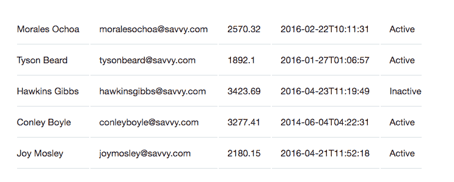
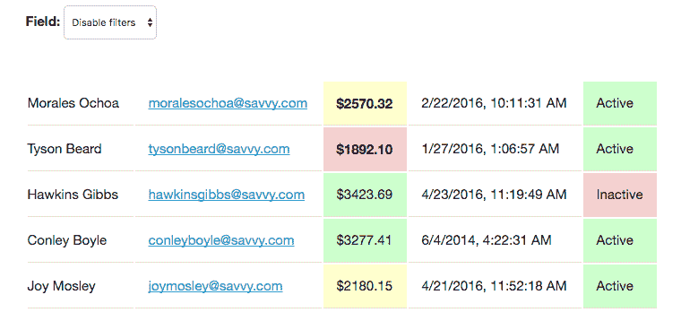

# 第二章：显示、循环、搜索和过滤数据

在第一章《开始使用 Vue.js》中，我们介绍了 Vue 中的`data`、`computed`和`method`对象以及如何显示静态数据值。在本章中，我们将介绍以下内容：

+   使用`v-if`、`v-else`和`v-for`在 Vue 中显示列表和更复杂的数据

+   使用表单元素过滤列表

+   根据数据应用条件性 CSS 类

我们将使用 JSON 生成器服务（[`www.json-generator.com/`](http://www.json-generator.com/)）随机生成要使用的数据。这个网站允许我们获取虚拟数据进行练习。以下模板用于生成我们将使用的数据。将以下内容复制到左侧以生成相同格式的数据，以便属性与代码示例匹配，如下所示：

```js
      [
        '{{repeat(5)}}',
        {
          index: '{{index()}}',
          guid: '{{guid()}}',
          isActive: '{{bool()}}',
          balance: '{{floating(1000, 4000, 2, "00.00")}}',
          name: '{{firstName()}} {{surname()}}',
          email: '{{email()}}',
          registered: '{{date(new Date(2014, 0, 1), new Date(), "YYYY-            
         MM-ddThh:mm:ss")}}'
        }
      ]
```

在构建我们的简单应用程序并显示用户之前，我们将介绍 Vue 的更多功能和视图中可用的 HTML 特定属性。这些功能从动态渲染内容到循环遍历数组等。

# HTML 声明

Vue 允许您使用 HTML 标签和属性来控制和修改应用程序的视图。这包括动态设置属性，如`alt`和`href`。它还允许您根据应用程序中的数据来渲染标签和组件。这些属性以`v-`开头，并且如本书开头所提到的，在渲染时会从 HTML 中删除。在我们开始输出和过滤数据之前，我们将介绍一些常见的声明。

# v-html

`v-html`指令允许您在不使用花括号语法的情况下输出内容。如果输出包含 HTML 标签，它也可以用于将输出呈现为 HTML 而不是纯文本。HTML 属性的值是数据键或计算函数名称的值：

**View**:

在您的视图应用空间中，将`v-html`属性添加到一个元素中：

```js
      <div id="app">
        <div v-html="message"></div>
      </div>
```

**JavaScript**:

在 JavaScript 中，将`message`变量设置为包含一些 HTML 元素的字符串：

```js
      const app = new Vue({
        el: '#app',

        data: {
          message: '<h1>Hello!</h1>'
        }
      });
```

您应该尽量避免向 Vue 实例中添加 HTML，因为这会混淆我们的 MVVM 结构中的视图、视图模型和模型。还存在一种危险，即在另一个 HTML 标签中输出无效的 HTML 标签。只有在您完全信任的数据上使用`v-html`，因为与外部 API 一起使用它可能会带来安全问题，因为它允许 API 控制您的应用程序。潜在的恶意 API 可以使用`v-html`来注入不需要的内容和 HTML。只使用您完全信任的数据来使用`v-html`。

# 声明式渲染

使用`v-bind:`属性可以动态填充常规 HTML 属性，例如``标签的`src`属性。这允许您使用 Vue 应用程序中的数据填充任何现有属性。这可能是图像源或元素 ID。

`bind`选项通过在要填充的属性前面添加前缀来使用。例如，如果您希望使用名为`imageSource`的数据键的值填充图像源，则可以执行以下操作：

**View**:

在视图应用空间中创建一个 img 标签，其中包含一个动态的`src`属性，使用`v-bind`和一个名为`imageSource`的变量。

```js
      <div id="app">
        
      </div>
```

**JavaScript**:

在 Vue JavaScript 代码中创建一个名为`imageSource`的变量，并添加所需图像的 URL：

```js
      const app = new Vue({
        el: '#app',

        data: {
          imageSource: 'http://via.placeholder.com/350x150'
        }
      });
```

`v-bind:`属性可以缩写为`:`，例如，`v-bind:src`可以简写为`:src`。

# 条件渲染

使用自定义 HTML 声明，Vue 允许您根据数据属性或 JavaScript 声明有条件地渲染元素和内容。这些包括`v-if`，用于在声明等于 true 时显示容器，以及`v-else`，用于显示替代内容。

# v-if

最基本的示例是`v-if`指令-确定是否显示块的值或函数。

在视图中创建一个 Vue 实例，其中包含一个`div`元素和一个名为`isVisible`的数据键，其值设置为`false`。

**View**:

从以下视图代码开始：

```js
      <div id="app">
        <div>Now you see me</div>
      </div>
```

**JavaScript**:

在 JavaScript 中，初始化 Vue 并创建一个名为`isVisible`的数据属性：

```js
      const app = new Vue({
        el: '#app',

        data: {
          isVisible: false
        }
      });
```

现在，您的 Vue 应用程序将显示元素的内容。现在在 HTML 元素中添加`v-if`指令，并将其值设置为`isVisible`：

```js
      <div id="app">
        <div v-if="isVisible">Now you see me</div>
      </div>
```

保存后，您的文本应该消失。这是因为标签根据当前值有条件地呈现，而当前值为`false`。如果您打开 JavaScript 控制台并运行以下代码，则应该重新显示元素：

```js
      app.isVisible = true
```

`v-if` 不仅适用于布尔值 true/false。你可以检查一个数据属性是否等于特定的字符串：

```js
      <div v-if="selected == 'yes'">Now you see me</div>
```

例如，上述代码检查一个选定的数据属性是否等于 `yes` 的值。`v-if` 属性接受 JavaScript 运算符，因此可以检查不等于、大于或小于。

这里的危险在于你的逻辑开始从 ViewModel 中渗入到 View 中。为了解决这个问题，该属性还可以接受函数作为值。该方法可以是复杂的，但最终必须返回 `true`（如果你希望显示代码）或 `false`（如果不希望显示代码）。请注意，如果函数返回除 false 值（如 `0` 或 `false`）之外的任何值，则结果将被解释为 true。

这将看起来像这样：

```js
      <div v-if="isSelected">Now you see me</div>
```

你的方法可以是这样的：

```js
      isSelected() {
        return selected == 'yes';
      }
```

如果你不希望完全删除元素，只是隐藏它，有一个更合适的指令 `v-show`。它会应用 CSS 的 display 属性，而不是操作 DOM - `v-show` 将在本章后面介绍。

# v-else

`v-else` 允许根据 `v-if` 语句的相反条件渲染一个替代元素。如果结果为 `true`，将显示第一个元素；否则，将显示包含 `v-else` 的元素。

具有 `v-else` 的元素需要直接跟在包含 `v-if` 的元素后面；否则，你的应用程序将抛出错误。

`v-else` 没有值，并且放置在元素标签内。

```js
      <div id="app">
        <div v-if="isVisible">
          Now you see me
        </div>
        <div v-else>
          Now you don't
        </div>
      </div>
```

将上述 HTML 添加到你的应用空间中将只显示一个 `<div>` 元素 - 在控制台中切换值，就像我们之前做的那样，将显示另一个容器。如果你希望链接你的条件，你也可以使用 `v-else-if`。`v-else-if` 的一个示例如下：

```js
      <div id="app">
        <div v-if="isVisible">
          Now you see me
        </div>
        <div v-else-if="otherVisible">
          You might see me
        </div>
        <div v-else>
          Now you don't
        </div>
      </div>
```

如果 `isVisible` 变量等于 `false`，则可能会显示 `You might see me`，但 `otherVisible` 变量等于 `true`。

`v-else` 应该谨慎使用，因为它可能会产生歧义，并导致错误的情况。

# v-for 和显示数据

下一个 HTML 声明意味着我们可以开始显示我们的数据并将其中一些属性应用到实践中。由于我们的数据是一个数组，我们需要循环遍历它以显示每个元素。为此，我们将使用 `v-for` 指令。

生成你的 JSON 并将其赋值给一个名为 `people` 的变量。在这些示例中，生成的 JSON 循环将显示在代码块中，如 `[...]`。你的 Vue 应用应该如下所示：

```js
      const app = new Vue({
        el: '#app',

        data: {
          people: [...]
        }
      });
```

现在我们需要在我们的视图中以项目符号列表的形式显示每个人的姓名。这就是`v-for`指令的用途：

```js
      <div id="app">
        <ul>
          <li v-for="person in people">
            {{ person }}
          </li>
        </ul>
      </div>
```

`v-for`循环遍历 JSON 列表，并临时将其分配给`person`变量。然后我们可以输出变量的值或属性。

`v-for`循环需要应用于要重复的 HTML 元素，本例中为`<li>`。如果没有包装元素或者不希望使用 HTML，可以使用 Vue 的`<template>`元素。这些元素在运行时被移除，同时仍然为您创建一个容器来输出数据：

```js
      <div id="app">
        <ul>
          <template v-for="person in people">
            <li>
              {{ person }}
            </li>
          </template>
        </ul>
      </div>
```

模板标签还可以隐藏内容，直到应用程序初始化完成，这在您的网络速度较慢或 JavaScript 需要一段时间才能触发时可能会很方便。

仅仅将我们的视图输出为`{{ person }}`将创建一长串的信息，对我们没有任何用处。更新输出以定位`person`对象的`name`属性：

```js
      <li v-for="person in people">
        {{ person.name }}
      </li>
```

在浏览器中查看结果应该会显示一个用户姓名的列表。更新 HTML 以在表格中列出用户的姓名、电子邮件地址和余额。将`v-for`应用于`<tr>`元素：

```js
      <table>
        <tr v-for="person in people">
          <td>{{ person.name }}</td>
          <td>{{ person.email }}</td>
          <td>{{ person.balance }}</td>
          <td>{{ person.registered }}</td>
        </tr>
      </table>
```

在您的表格中添加一个额外的单元格。这将根据`person`对象上的`isActive`属性显示 Active 或 Inactive。可以通过两种方式实现这一点-使用`v-if`指令或者使用三元的`if`。三元的 if 是内联的 if 语句，可以放置在视图的花括号中。如果我们想要使用 HTML 元素来应用一些样式，我们将使用`v-if`。

如果我们使用三元的'if'，单元格将如下所示：

```js
      <td>{{ (person.isActive) ? 'Active' : 'Inactive' }}</td>
```

如果我们选择使用`v-if`选项和`v-else`，允许我们使用我们希望的 HTML，它将如下所示：

```js
      <td>
        <span class="positive" v-if="person.isActive">Active</span>
        <span class="negative" v-else>Inactive</span>
      </td>
```

这个 active 元素是 Vue 组件非常理想的一个例子-我们将在第三章中介绍，*优化我们的应用程序并使用组件显示数据*。作为符合我们的 MVVM 方法论的替代方案，我们可以创建一个方法，该方法返回状态文本。这将整理我们的视图并将逻辑移到我们的应用程序中：

```js
      <td>{{ activeStatus(person) }}</td>
```

我们的方法将执行与我们的视图相同的逻辑：

```js
activeStatus(person) {
  return (person.isActive) ? 'Active' : 'Inactive';
}
```

我们的表格现在将如下所示：



# 使用 v-html 创建链接

下一步是将电子邮件地址链接起来，以便用户在查看人员列表时可以点击。在这种情况下，我们需要在电子邮件地址之前添加`mailto:`来连接字符串。

第一反应是执行以下操作：

```js
      <a href="mailto:{{person.email}}">{{ person.email }}</a>
```

但是 Vue 不允许在属性内插值。相反，我们必须在`href`属性上使用`v-bind`指令。这将属性转换为 JavaScript 变量，因此任何原始文本必须用引号括起来，并与所需的变量连接起来：

```js
<a v-bind:href="'mailto:' + person.email">{{ person.email }}</a>
```

注意添加了`v-bind:`，单引号和连接符`+`。

# 格式化余额

在继续筛选用户之前，添加一个方法来正确格式化余额，将货币符号定义在数据对象中，并确保小数点后有两个数字。我们可以从第一章“开始使用 Vue.js”中调整我们的方法来实现这一点。我们的 Vue 应用程序现在应该是这样的：

```js
      const app = new Vue({
        el: '#app',

        data: {
          people: [...],
          currency: '$'
        },
        methods: {
          activeStatus(person) {
            return (person.isActive) ? 'Active' : 'Inactive';
          },
          formatBalance(balance) {
            return this.currency + balance.toFixed(2);
          }
        }
    });
```

我们可以在视图中使用这种新方法：

```js
      <td>{{ formatBalance(person.balance) }}</td>
```

# 格式化注册日期

数据中的注册日期字段对计算机友好，但对人类来说不太友好。创建一个名为`formatDate`的新方法，它接受一个参数，类似于之前的`formatBalance`方法。

如果您想完全自定义日期的显示，有几个可用的库，例如`moment.js`，可以更灵活地控制任何日期和基于时间的数据的输出。对于这种方法，我们将使用一个本地的 JavaScript 函数`toLocaleString()`：

```js
      formatDate(date) {
        let registered = new Date(date);
        return registered.toLocaleString('en-US');
      }
```

有了注册日期，我们将其传递给本地的`Date()`函数，这样 JavaScript 就知道将字符串解释为日期。一旦存储在 registered 变量中，我们使用`toLocaleString()`函数将对象返回为字符串。该函数接受大量选项（如 MDN 上所述）来自定义日期的输出。现在，我们将传递所希望显示的区域设置，并使用该位置的默认值。现在我们可以在视图中使用我们的方法：

```js
      <td>{{ formatDate(person.registered) }}</td>
```

现在每个表行应该如下所示：


# 筛选我们的数据

现在我们要构建过滤功能来列出我们的数据。这将允许用户选择一个字段进行过滤，并输入他们的查询。Vue 应用程序将在用户输入时过滤行。为此，我们将绑定一些表单输入到`data`对象中的各个值，创建一个新的方法，并在表格行上使用一个新的指令`v-show`。

# 构建表单

首先在视图中创建 HTML。创建一个`<select>`框，为每个要过滤的字段创建一个`<option>`，一个用于查询的`<input>`，以及一对单选按钮 - 我们将使用这些按钮来过滤活动和非活动用户。确保每个`<option>`的`value`属性反映用户数据中的键 - 这将减少所需的代码并使选择框的目的更明显。

要使过滤工作，您过滤的数据不需要显示出来，尽管在这里需要考虑用户体验。如果一个表格行在没有您正在过滤的数据的情况下显示出来，这是否有意义？

创建用于过滤的表单：

```js
      <form>
        <label for="fiterField">
          Field:
          <select id="filterField">
            <option value="">Disable filters</option>
            <option value="isActive">Active user</option>
            <option value="name">Name</option>
            <option value="email">Email</option>
            <option value="balance">Balance</option>
            <option value="registered">Date registered</option>
          </select>
        </label>

        <label for="filterQuery">
          Query:
          <input type="text" id="filterQuery">
        </label>

        <span>
          Active:
          <label for="userStateActive">
            Yes:
            <input type="radio" value="true" id="userStateActive"                   
          selected>
          </label>
          <label for="userStateInactive">
            No:
            <input type="radio" value="false" id="userStateInactive">
          </label>
        </span>
      </form>
```

该表单包括一个选择框，用于选择要过滤的字段，一个输入框，允许用户输入要过滤的查询，以及一对单选按钮，用于过滤活动和非活动用户。想象中的用户流程是：用户将选择他们希望通过哪个字段来过滤数据，然后输入他们的查询或选择单选按钮。当在选择框中选择`isActive`（活动用户）选项时，单选按钮将显示，输入框将隐藏。我们已经确保默认选择第一个单选按钮以提供帮助。

过滤输入不需要包含在表单中才能工作；然而，保留语义化的 HTML 是一个好的实践，即使在 JavaScript 应用程序中。

# 绑定输入

要将输入绑定到可以通过 Vue 实例访问的变量，需要在字段中添加一个 HTML 属性，并在`data`对象中添加相应的键。为每个字段在`data`对象中创建一个变量，以便我们可以将表单元素绑定到它们：

```js
      data: {
        people: [...],

        currency: '$',

        filterField: '',
 filterQuery: '',
 filterUserState: ''
      }
```

现在，`data`对象有了三个额外的键：`filterField`，用于存储下拉框的值；`filterQuery`，用于存储输入到文本框中的数据的占位符；以及`filterUserState`，允许我们存储单选按钮复选框的值。

现在有了要使用的数据键，我们可以将表单元素绑定到它们上。为每个表单字段应用一个`v-model=""`属性，其值为数据键。

这是一个例子：

```js
      <input type="text" id="filterQuery" v-model="filterQuery">
```

确保两个单选按钮具有完全相同的`v-model=""`属性：这样它们才能更新相同的值。为了验证它是否起作用，你现在可以输出数据变量并获取字段的值。

尝试输出`filterField`或`filterQuery`并更改字段。

```js
      {{ filterField }}
```

如果输出`filterUserState`变量，您可能会注意到它似乎在工作，但是它没有得到期望的实际结果。变量的输出将是在值属性中设置的`true`和`false`。

仔细检查后，实际上这些值是字符串，而不是布尔值。布尔值是硬性的`true`或`false`，`1`或`0`，您可以轻松地与之进行比较，而字符串则需要对硬编码字符串进行精确检查。可以通过输出`typeof`变量来验证它是什么类型的：

```js
      {{ typeof filterUserState }}
```

可以通过使用`v-bind:value`属性绑定单选按钮的值来解决这个问题。该属性允许您指定 Vue 要解释的值，并且可以接受布尔值、字符串或对象值。现在，我们将传递`true`和`false`，就像我们已经在标准值属性中做的那样，但是 Vue 将知道将其解释为布尔值：

```js
      <span>
        Active:
        <label for="userStateActive">
          Yes:
          <input type="radio" v-bind:value="true" id="userStateActive"       
         v-model="filterUserState" selected>
        </label>
        <label for="userStateInactive">
          No:
          <input type="radio" v-bind:value="false"       
         id="userStateInactive" v-model="filterUserState">
        </label>
      </span>
```

下一步是根据这些过滤器显示和隐藏表格行。

# 显示和隐藏 Vue 内容

除了用于显示和隐藏内容的`v-if`之外，还可以使用`v-show=""`指令。`v-show`与`v-if`非常相似；它们都会添加到 HTML 包装器中，并且都可以接受相同的参数，包括一个函数。

两者之间的区别是，`v-if`会改变标记，根据需要删除和添加 HTML 元素，而`v-show`无论如何都会渲染元素，通过内联 CSS 样式来隐藏和显示元素。`v-if`更适合运行时渲染或不频繁的用户交互，因为它可能会重构整个页面。当大量元素快速进入和退出视图时，例如在过滤时，`v-show`更可取！

当在方法中使用`v-show`时，函数需要返回一个`true`或`false`。函数不知道它在哪里使用，所以我们需要传入当前正在渲染的人来计算是否应该显示它。

在您的 Vue 实例上创建一个名为`filterRow()`的方法，并在内部将其设置为`return true`：

```js
      filterRow(person) {
         return true;
      }
```

该函数接受一个参数，即我们从 HTML 中传递的人。在视图中，将`v-show`属性添加到具有`filterRow`作为值的`<tr>`元素中，同时传递人物对象：

```js
      <table>
        <tr v-for="person in people" v-show="filterRow(person)">
          <td>{{ person.name }}</td>
          ...
```

作为一个简单的测试，将`isActive`值返回给人。这应该立即过滤掉任何不活动的人，因为他们的值将返回`false`：

```js
      filterRow(person) {
        return person.isActive;
      }
```

# 过滤我们的内容

现在我们对人员行和视图中的一些过滤器控件有了控制，我们需要使我们的过滤器起作用。我们已经通过我们的`isActive`键进行了过滤，所以单选按钮将是第一个被连接的。我们已经以布尔形式拥有了单选按钮的值和我们将进行过滤的键的值。为了使此过滤器起作用，我们需要将`isActive`键与单选按钮的值进行比较。

+   如果`filterUserState`的值为`true`，则显示`isActive`为`true`的用户。

+   然而，如果`filterUserState`的值为`false`，则只显示`isActive`值为`false`的用户

可以通过比较两个变量来将其写成一行：

```js
      filterRow(person) {
        return (this.filterUserState === person.isActive);
      }
```

页面加载时，不会显示任何用户，因为`filterUserState`键既不设置为`true`也不设置为`false`。单击其中一个单选按钮将显示相应的用户。

让我们只在下拉菜单中选择活动用户选项时使过滤器起作用：

```js
      filterRow(person) {
        let result = true;

        if(this.filterField === 'isActive') {
          result = this.filterUserState === person.isActive;
        }

        return result;
      }
```

此代码将一个变量设置为默认值`true`。然后，我们可以立即返回变量，我们的行将显示。然而，在返回之前，它检查选择框的值，如果是所需的值，则通过我们的单选按钮进行过滤。由于我们的选择框绑定到`filterField`值，与`filterUserState`变量一样，它在我们与应用程序交互时更新。尝试在选择框中选择活动用户选项并更改单选按钮。

下一步是在未选择活动用户选项时使用输入查询框。我们还希望我们的查询是一个*模糊*搜索 - 例如，匹配包含搜索查询的单词而不是完全匹配。我们还希望它是不区分大小写的：

```js
      filterRow(person) {
        let result = true;

        if(this.filterField) {

          if(this.filterField === 'isActive') {
            result = this.filterUserState === person.isActive;
          } else {
 let query = this.filterQuery.toLowerCase(),
 field =  person[this.filterField].toString().toLowerCase(); result = field.includes(query);
 }

        }

        return result;
      }
```

为了使其工作，我们必须添加一些内容到这个方法中。第一步是检查我们的选择字段是否有一个值来开始过滤。由于我们的选择字段中的第一个选项具有`value = ""`，这等于`false`。如果是这种情况，该方法将返回默认值`true`。

如果它有一个值，它然后进入我们最初的`if`语句。这将检查特定值是否与`isActive`匹配 - 如果匹配，则运行我们之前编写的代码。如果不匹配，则开始我们的备用过滤。建立一个名为`query`的新变量，它获取输入的值并转换为小写。

第二个变量是我们要进行过滤的数据。它使用选择框的值作为人员的字段键，提取要进行过滤的值。该值被转换为字符串（在日期或余额的情况下），转换为小写并存储为`field`变量。最后，我们使用`includes`函数来检查字段是否包含输入的查询。如果是，则返回`true`并显示该行；否则，隐藏该行。

下一个问题是使用数字进行过滤。对于用户来说，输入他们想要的用户的确切余额并不直观 - 更自然的搜索方式是找到余额低于或高于某个金额的用户，例如，`< 2000`。

首先要做的是只在`balance`字段时应用这种类型的过滤。我们可以有两种方法来处理这个问题 - 我们可以检查字段名称是否为`balance`，类似于我们检查`isActive`字段，或者我们可以检查我们正在过滤的数据类型。

检查字段名称更简单。我们可以在我们的方法中使用`else if()`，甚至可以迁移到`switch`语句以便更容易阅读和扩展。然而，检查字段类型的替代方法更具可扩展性。这意味着我们可以通过添加更多的数字字段来扩展我们的数据集，而无需扩展或更改我们的代码。然而，这也意味着我们的代码中将有进一步的`if`语句。

首先要做的是修改我们的存储方法，因为我们不一定希望将字段或查询转换为小写：

```js
      if(this.filterField === 'isActive') {
        result = this.filterUserState === person.isActive;
      } else {

        let query = this.filterQuery,
 field = person[this.filterField]; 
 }
```

下一步是确定字段变量中的数据类型。可以通过再次使用`typeof`运算符来确定。可以在`if`语句中使用它，以检查字段的类型是否为数字：

```js
      if(this.filterField === 'isActive') {
        result = this.filterUserState === person.isActive;
      } else {

        let query = this.filterQuery,
            field = person[this.filterField];

        if(typeof field === 'number') {
          // Is a number
 } else {
 // Is not a number
          field = field.toLowerCase();
          result = field.includes(query.toLowerCase());
 }

      }
```

一旦我们的检查完成，我们可以回到我们最初的查询代码。如果选择选项不是`isActive`，并且我们正在过滤的数据不是数字，则将使用此代码。如果是这种情况，则会将字段转换为小写，并查看在转换为小写之前在查询框中写入的内容是否包含在内。

下一步是实际比较我们的数字数据与查询框中的内容。为此，我们将使用原生的 JavaScript `eval`函数。

`eval`函数可能是一个潜在危险的函数，在生产代码中不应该使用它而不进行一些严格的输入消毒检查，而且它的性能比较低。它会将所有内容作为原生 JavaScript 运行，因此可能会被滥用。然而，由于我们在这个虚拟应用程序中使用它，重点是 Vue 本身而不是创建一个完全安全的 Web 应用程序，所以在这种情况下是可以接受的。你可以在 24 ways 中阅读更多关于`eval`的内容。

```js
      if(this.filterField === 'isActive') {
       result = this.filterUserState === person.isActive;
      } else {

        let query = this.filterQuery,
            field = person[this.filterField];

        if(typeof field === 'number') {
          result = eval(field + query);
        } else {
          field = field.toLowerCase();
          result = field.includes(query.toLowerCase());
        }

      }
```

这将字段和查询都传递给`eval()`函数，并将结果（`true`或`false`）传递给我们的`result`变量，以确定行的可见性。`eval`函数会直接评估表达式，并确定其是否为`true`或`false`。以下是一个示例：

```js
      eval(500 > 300); // true
      eval(500 < 400); // false
      eval(500 - 500); // false
```

在这个例子中，数字`500`是我们的字段，或者在这个具体的例子中是`balance`。之后的任何内容都是我们的用户输入的内容。你的过滤代码现在已经准备好了。尝试从下拉菜单中选择余额，并过滤出余额大于`2000`的用户。

在继续之前，我们需要添加一些错误检查。如果你打开了 JavaScript 控制台，你可能会注意到在输入第一个大于或小于符号时出现了一个错误。这是因为`eval`函数无法评估`X >`（其中`X`是余额）。你可能还尝试输入`*$2000*`带有货币符号，并意识到这不起作用。这是因为货币是在渲染视图时应用的，而我们在此之前对数据进行了过滤。

为了解决这两个错误，我们必须删除查询中输入的任何货币符号，并在依赖它返回结果之前测试我们的`eval`函数。使用原生的 JavaScript `replace()`函数来删除货币符号。如果它发生了变化，使用应用程序中存储的货币符号，而不是硬编码当前使用的货币符号。

```js
      if(typeof field == 'number') {
        query = query.replace(this.currency, '');
        result = eval(field + query);
      }
```

现在我们需要测试`eval`函数，以便它在每次按键时不会抛出错误。为此，我们使用`try...catch`语句：

```js
      if(typeof field == 'number') {
        query = query.replace(this.currency, '');

        try {
          result = eval(field + query);
 } catch(e) {}
      }
```

由于我们不希望在输入错误时输出任何内容，所以我们可以将`catch`语句留空。我们可以将`field.includes(query)`语句放在这里，这样它就会回退到默认功能。我们完整的`filterRow()`方法现在看起来是这样的：

```js
      filterRow(person) {
        let result = true;

        if(this.filterField) {

          if(this.filterField === 'isActive') {

            result = this.filterUserState === person.isActive;

          } else {

            let query = this.filterQuery,
          field = person[this.filterField];

            if(typeof field === 'number') {

              query = query.replace(this.currency, '');        
              try {
                result = eval(field + query);
              } catch (e) {}

            } else {

              field = field.toLowerCase();
              result = field.includes(query.toLowerCase());

            }
          }
        }

        return result;

      }
```

# 过滤我们的过滤器

现在我们已经完成了过滤，我们只需要在下拉菜单中选择`isActive`选项时才显示单选按钮。根据我们所学的知识，这应该相对简单。

创建一个新的方法，检查选择框的值，并在我们的下拉菜单中选择“Active User”时返回`true`：

```js
      isActiveFilterSelected() {
        return (this.filterField === 'isActive');
      }
```

现在我们可以使用`v-show`来控制输入框和单选按钮，当在查询框上时反转效果：

```js
      <label for="filterQuery" v-show="!isActiveFilterSelected()">
        Query:
        <input type="text" id="filterQuery" v-model="filterQuery">
      </label>
      <span v-show="isActiveFilterSelected()">
        Active:
        <label for="userStateActive">
          Yes:
          <input type="radio" v-bind:value="true" id="userStateActive"           
         v-model="filterUserState">
        </label>
        <label for="userStateInactive">
          No:
     <input type="radio" v-bind:value="false" id="userStateInactive" v-
      model="filterUserState">
        </label>
      </span>
```

请注意输入字段上方法调用之前的感叹号。这意味着“不”，实际上是反转函数的结果，例如“不是真”等同于“假”。

为了改进用户体验，我们还可以在显示任何输入之前检查过滤是否处于活动状态。这可以通过在我们的`v-show`属性中包含一个次要检查来实现：

```js
      <label for="filterQuery" v-show="this.filterField &&        
      !isActiveFilterSelected()">
        Query:
        <input type="text" id="filterQuery" v-model="filterQuery">
      </label>
```

这个现在检查`filterField`是否有值，并且选择框没有设置为`isActive`。确保你也将这个添加到单选按钮中。

进一步改进用户体验的方法是，确保当选择`isActive`选项时，所有用户都不会消失。目前这种情况发生是因为默认设置为一个字符串，它与字段的`true`或`false`值不匹配。在过滤这个字段之前，我们应该检查`filterUserState`变量是否为`true`或`false`，即布尔值。我们可以再次使用`typeof`来实现这一点：

```js
      if(this.filterField === 'isActive') {
        result = (typeof this.filterUserState === 'boolean') ?                  
        (this.filterUserState === person.isActive) : true;
      }
```

我们使用三元运算符来检查要过滤的结果是否为布尔值。如果是，则按照我们之前的方式进行过滤；如果不是，则只显示该行。

# 更改 CSS 类

与任何 HTML 属性一样，Vue 能够操作 CSS 类。与 Vue 中的所有内容一样，这可以通过多种方式完成，从对象本身的属性到利用方法。我们将首先添加一个类，如果用户是活动的。

绑定 CSS 类与其他属性类似。值接受一个对象，可以在视图中计算逻辑或抽象到我们的 Vue 实例中。这完全取决于操作的复杂性。

首先，如果用户是活动的，让我们给包含`isActive`变量的单元格添加一个类：

```js
      <td v-bind:class="{ active: person.isActive }">
        {{ activeStatus(person) }}
      </td>
```

class HTML 属性首先由`v-bind:`前缀，以让 Vue 知道它需要处理该属性。然后，值是一个对象，CSS 类作为键，条件作为值。此代码在表格单元格上切换`active`类，如果`person.isActive`变量等于`true`。如果我们想要在用户不活动时添加一个`inactive`类，我们可以将其添加到对象中：

```js
      <td v-bind:class="{ active: person.isActive, inactive: 
      !person.isActive }">
        {{ activeStatus(person) }}
      </td>
```

这里我们再次使用感叹号来反转状态。如果运行此应用程序，您应该会发现 CSS 类按预期应用。

如果我们只是根据一个条件应用两个类，可以在类属性内部使用三元`if`语句：

```js
      <td v-bind:class="person.isActive ? 'active' : 'inactive'">
        {{ activeStatus(person) }}
      </td>
```

请注意类名周围的单引号。然而，逻辑再次开始渗入我们的视图中，如果我们希望在其他地方也使用这个类，它并不是非常可扩展。

在我们的 Vue 实例上创建一个名为`activeClass`的新方法，并将逻辑抽象到其中 - 不要忘记传递 person 对象：

```js
      activeClass(person) {
        return person.isActive ? 'active' : 'inactive';
      }
```

现在我们可以在我们的视图中调用该方法：

```js
      <td v-bind:class="activeClass(person)">
        {{ activeStatus(person) }}
      </td>
```

我很欣赏这是一个相当简单的执行；让我们尝试一个稍微复杂一点的。我们想要根据数值向余额单元格添加一个条件类。如果他们的余额低于 2000 美元，我们将添加一个`error`类。如果在 2000 美元和 3000 美元之间，将应用一个`warning`类，如果超过 3000 美元，将添加一个`success`类。

除了`error`，`warning`和`success`类之外，如果余额超过 500 美元，还将添加一个`increasing`类。例如，2600 美元的余额将同时获得`warning`和`increasing`类，而 2400 美元只会获得`warning`类。

由于这包含了几个逻辑部分，我们将在实例中创建一个方法来使用。创建一个名为`balanceClass`的方法，并将其绑定到包含余额的单元格的类 HTML 属性上。首先，我们将添加`error`，`warning`和`success`类。

```js
      <td v-bind:class="balanceClass(person)">
        {{ formatBalance(person.balance) }}
      </td>
```

在该方法中，我们需要访问传入的人的`balance`属性，并返回我们希望添加的类的名称。现在，我们将返回一个固定的结果来验证它是否工作：

```js
      balanceClass(person) {
        return 'warning';
      }
```

现在我们需要评估我们的余额。由于它已经是一个数字，与我们的标准进行比较不需要进行任何转换：

```js
      balanceClass(person) {
        let balanceLevel = 'success';

        if(person.balance < 2000) {
          balanceLevel = 'error';
        } else if (person.balance < 3000) {
          balanceLevel = 'warning';
        }

        return balanceLevel;
      }
```

在前面的方法中，默认情况下将类输出设置为`success`，因为我们只需要在小于`3000`时更改输出。第一个`if`检查余额是否低于我们的第一个阈值 - 如果是，则将输出设置为`error`。如果不是，则尝试第二个条件，即检查余额是否低于`3000`。如果成功，则应用的类变为`warning`。最后，它输出所选的类，直接应用于元素。

现在我们需要考虑如何使用`increasing`类。为了使其与现有的`balanceLevel`类一起输出，我们需要将输出从单个变量转换为数组。为了验证这是否有效，将额外的类硬编码到输出中：

```js
      balanceClass(person) {
        let balanceLevel = 'success';
        if(person.balance < 2000) {
          balanceLevel = 'error';
        } else if (person.balance < 3000) {
          balanceLevel = 'warning';
        }
        return [balanceLevel, 'increasing'];
      }
```

这将两个类添加到元素中。将字符串转换为变量，并默认设置为`false`。如果在数组中传递了`false`值，Vue 不会输出任何内容。

为了确定我们是否需要增加的类，我们需要对余额进行一些计算。由于我们希望在余额高于 500 时使用增加的类，无论它在什么范围内，我们需要舍入数字并进行比较：

```js
      let increasing = false,
          balance = person.balance / 1000;

      if(Math.round(balance) == Math.ceil(balance)) {
        increasing = 'increasing';
      }
```

最初，我们将`increasing`变量默认设置为`false`。我们还存储了余额除以`1000`的版本。这意味着我们的余额变成了 2.45643，而不是 2456.42。从那里，我们将 JavaScript 舍入后的数字（例如 2.5 变成 3，而 2.4 变成 2）与强制舍入的数字（例如 2.1 变成 3，以及 2.9）进行比较。

如果输出的数字相同，则将`increasing`变量设置为我们想要设置的类的字符串。然后，我们可以将此变量与`balanceLevel`变量一起作为数组传递出去。完整的方法现在看起来像下面这样：

```js
      balanceClass(person) {
        let balanceLevel = 'success';

        if(person.balance < 2000) {
          balanceLevel = 'error';
        } else if (person.balance < 3000) {
          balanceLevel = 'warning';
        } 

        let increasing = false,
            balance = person.balance / 1000;

        if(Math.round(balance) == Math.ceil(balance)) {
          increasing = 'increasing';
        }

        return [balanceLevel, increasing];
      }
```

# 过滤和自定义类

现在，我们拥有了一个完整的用户列表/注册表，可以根据选择的字段进行过滤，并根据条件自定义 CSS 类。回顾一下，我们现在的视图是这样的：

```js
      <div id="app">
        <form>
          <label for="fiterField">
            Field:
            <select id="filterField" v-model="filterField">
              <option value="">Disable filters</option>
              <option value="isActive">Active user</option>
              <option value="name">Name</option>
              <option value="email">Email</option>
              <option value="balance">Balance</option>
              <option value="registered">Date registered</option>
            </select>
          </label>

          <label for="filterQuery" v-show="this.filterField &&                  
          !isActiveFilterSelected()">
            Query:
            <input type="text" id="filterQuery" v-model="filterQuery">
          </label>

          <span v-show="isActiveFilterSelected()">
         Active:
        <label for="userStateActive">
        Yes:
        <input type="radio" v-bind:value="true" id="userStateActive" v-
         model="filterUserState">
      </label>
      <label for="userStateInactive">
        No:
        <input type="radio" v-bind:value="false" id="userStateInactive"          
      v-model="filterUserState">
      </label>
          </span>
        </form>

        <table>
          <tr v-for="person in people" v-show="filterRow(person)">
            <td>{{ person.name }}</td>
            <td>
         <a v-bind:href="'mailto:' + person.email">{{ person.email }}            
           </a>
            </td>
            <td v-bind:class="balanceClass(person)">
              {{ formatBalance(person.balance) }}
            </td>
            <td>{{ formatDate(person.registered) }}</td>
            <td v-bind:class="activeClass(person)">
              {{ activeStatus(person) }}
            </td>
          </tr>
        </table>

      </div>
```

我们的 Vue 应用程序的 JavaScript 应该是这样的：

```js
      const app = new Vue({
        el: '#app',

        data: {
          people: [...],

          currency: '$',

          filterField: '',
          filterQuery: '',
          filterUserState: ''
        },
        methods: {
          activeStatus(person) {
            return (person.isActive) ? 'Active' : 'Inactive';
          },

          activeClass(person) {
            return person.isActive ? 'active' : 'inactive';
          },
          balanceClass(person) {
            let balanceLevel = 'success';

            if(person.balance < 2000) {
              balanceLevel = 'error';
            } else if (person.balance < 3000) {
              balanceLevel = 'warning';
            }

            let increasing = false,
          balance = person.balance / 1000;

            if(Math.round(balance) == Math.ceil(balance)) {
              increasing = 'increasing';
            }

            return [balanceLevel, increasing];
          },

          formatBalance(balance) {
            return this.currency + balance.toFixed(2);
          },
          formatDate(date) {
            let registered = new Date(date);
            return registered.toLocaleString('en-US');
          },

          filterRow(person) {
            let result = true;
            if(this.filterField) {

              if(this.filterField === 'isActive') {

              result = (typeof this.filterUserState === 'boolean') ?       
              (this.filterUserState === person.isActive) : true;
             } else {

          let query = this.filterQuery,
              field = person[this.filterField];

          if(typeof field === 'number') {
            query.replace(this.currency, '');
            try {
              result = eval(field + query);
            } catch(e) {}
          } else {
            field = field.toLowerCase();
            result = field.includes(query.toLowerCase());
            }
          }
        }

            return result;
          },

          isActiveFilterSelected() {
            return (this.filterField === 'isActive');
          }
        }
      });
```

通过少量的 CSS，我们的人员过滤应用程序现在看起来像下面这样：



# 总结

在本章中，我们学习了 Vue 的 HTML 声明，根据需要有条件地渲染我们的 HTML 并显示替代内容。我们还实践了我们学到的关于方法的知识。最后，我们为我们的表格构建了一个过滤组件，允许我们显示活动和非活动用户，查找具有特定名称和电子邮件的用户，并根据余额过滤行。

现在我们的应用程序已经达到了一个良好的状态，这是一个很好的机会来检查我们的代码，看看是否可以进行任何优化。通过优化，我指的是减少重复，尽可能简化代码，并将逻辑抽象成更小、更可读、更可重用的块。

在第三章中，我们将优化我们的代码，并将 Vue 组件作为将逻辑分离到单独的段落和部分的一种方式。
