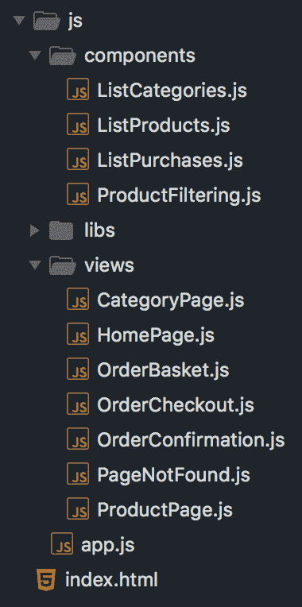
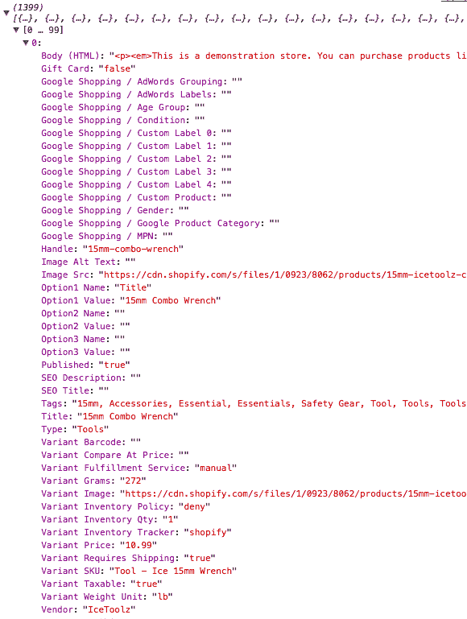
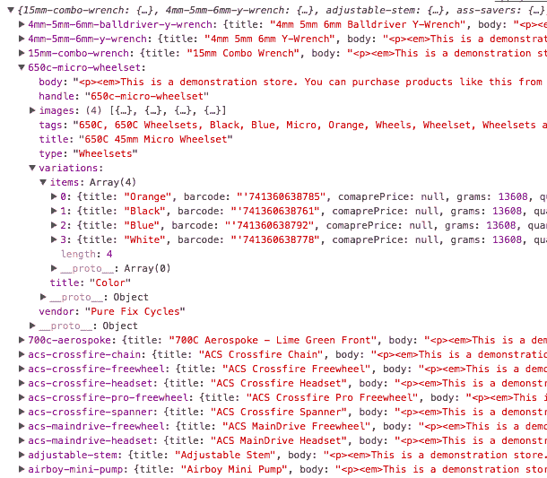
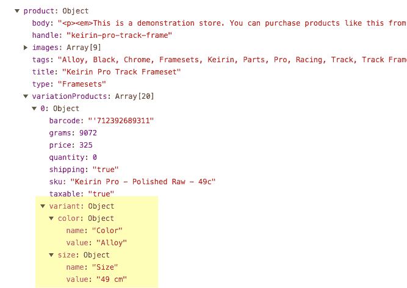

# 第九章：使用 Vue-Router 动态路由加载数据

在第八章《介绍 Vue-Router 和加载基于 URL 的组件》中，我们探索了 Vue-router 及其功能和功能。有了这些知识，我们现在可以继续使用 Vue 制作我们的商店。在我们进入代码并开始创建之前，我们应该首先计划我们的商店将如何工作，我们需要哪些 URL 以及我们需要制作哪些组件。一旦我们计划好我们的应用程序，我们就可以继续创建一个产品页面。

在本章中，我们将：

+   概述我们的组件和路由，并创建占位符文件

+   加载产品 CSV 文件，处理并缓存在 Vuex 中

+   创建一个带有图像和产品变体的单独产品页面

# 概述和计划您的应用程序

首先，让我们考虑整个应用程序和用户流程。

我们将创建一个没有支付处理网关的商店。商店首页将显示一系列精选产品。用户将能够使用类别浏览产品，并使用我们制作的筛选器缩小选择范围。他们将能够选择一个产品并查看更多详细信息。产品将具有变体（大小、颜色等），并且可能有多个产品图像。用户将能够将变体添加到购物篮中。从那里，他们可以继续浏览产品并添加更多产品到购物篮中，或者进入结账流程，在那里他们将被要求提供姓名和地址，并进行支付。将显示订单确认屏幕。

整个商店应用程序将在 Vue 中创建并在客户端运行。这不涵盖任何用于付款、用户帐户、库存管理或验证的服务器端代码。

该应用程序将使用 Vue-router 处理 URL 和 Vuex 存储产品、购物篮内容和用户详细信息。

# 组件

在确定用户流程后，我们需要计划我们的商店需要制作哪些组件以及它们的名称。这有助于开发应用程序，因为我们清楚地知道需要创建哪些组件。我们还将决定组件的名称。根据 Vue 风格指南（[`vuejs.org/v2/style-guide/index.html`](https://vuejs.org/v2/style-guide/index.html)），我们的所有组件都将由两个名称组成。

# 路由组件

以下组件将与 Vue-router 一起使用，形成我们应用程序的页面：

+   **商店首页**—`HomePage`：商店首页将显示由商店所有者精选的产品列表。这将使用预先选择的产品句柄列表进行显示。

+   **分类页面**—`CategoryPage`：这将列出特定类别的产品。类别列表页面还将具有过滤器。

+   **产品页面**—`ProductPage`：产品页面将显示产品的详细信息、图片和产品的变体。

+   **购物篮**—`OrderBasket`：在购物篮中，用户可以查看已添加的产品，删除不需要的项目，并更改每个项目的数量。它还将显示订单的总成本。

+   **结账**—`OrderCheckout`：结账将锁定购物篮，禁止删除和更新产品，并提供一个表单供用户输入地址。

+   **订单确认**—`OrderConfirmation`：下单后将显示此组件，确认购买的产品、交付地址和总价格。

+   `404` **页面**—`PageNotFound`：当输入错误的 URL 时显示的错误页面。

# HTML 组件

HTML 组件将在页面组件中使用，以帮助减少我们的代码中的重复布局。

+   **产品列表**—`ListProducts`：在列表视图中查看时，将显示产品的分页列表，例如在`HomePage`或`CategoryPage`组件中。

+   **类别列表**—`ListCategories`：这将创建一个用于导航的类别列表。

+   **购买列表**—`ListPurchases`：此组件将出现在购物篮、结账和订单确认页面中；它将以表格形式列出产品的变体、价格和数量。它还将显示购物篮中所有产品的总价格。

+   **过滤**—`ProductFiltering`：在类别页面的侧边使用的组件将提供用户过滤的能力，并且将使用我们在[第八章](https://cdp.packtpub.com/vue_js_by_example/wp-admin/post.php?post=103&action=edit#post_93)中介绍的 GET 参数更新 URL，*介绍 Vue-Router 和加载基于 URL 的组件*。

# 路径

在我们概述了组件之后，我们可以规划商店的路径和 URL，以及它们将采取的组件或操作。我们还需要考虑错误的 URL 以及是否应该将用户重定向到适当的位置或显示错误消息：

+   `/`：`Home`

+   `/category/:slug`：`CategoryPage`，使用`:slug`唯一标识符来确定要显示的产品

+   `/category`：这将重定向到`/`

+   `/product/:slug`：`ProductPage` - 再次使用`:slug`来标识产品

+   `/product`：这将重定向到`/`

+   `/basket`：`OrderBasket`

+   `/checkout`：`OrderCheckout` - 如果没有产品，它将重定向用户到`/basket`

+   `/complete`：`OrderConfirmation` - 如果用户没有从`OrderCheckout`组件进入，则会重定向到`/basket`

+   `*`：`PageNotFound` - 这将捕获任何未指定的路由

随着我们确定了路由和组件，我们可以开始创建我们的应用程序。

# 创建初始文件

在前一节中概述的应用程序中，我们可以为文件结构和组件创建框架。由于这个应用程序是一个大型应用程序，我们将把文件拆分为每个组件的单独文件。这意味着我们的文件更易管理，我们的主应用程序 JavaScript 文件不会变得无法控制。

尽管在开发过程中可以接受，但是部署具有这么多文件的应用程序可能会增加加载时间，这取决于服务器的设置方式。使用传统的 HTTP/1.1，浏览器必须请求和加载每个文件 - 如果有多个文件，这将是一个阻碍。然而，使用 HTTP/2，您可以同时向用户推送多个文件 - 在这种情况下，多个文件可以在一定程度上提高应用程序的性能。

无论您选择使用哪种部署方法，强烈建议在将代码部署到生产环境时对 JavaScript 进行缩小。这样可以确保在为用户提供服务时，代码尽可能小：



为每个组件、视图和库（如 Vue、Vuex 和 Vue-router）创建一个文件。然后，为每种类型的文件创建一个文件夹。最后，添加一个`app.js` - 这是初始化库的地方。

您还可以考虑使用 vue-cli [(https://github.com/vuejs/vue-cli)](https://github.com/vuejs/vue-cli)来构建您的应用程序。超出了本书的范围，因为我们只涵盖了使用包含的 JavaScript 文件构建 Vue 应用程序，vue-cli 应用程序允许您以更模块化的方式开发应用程序，并在开发完成后以类似我们一直在开发应用程序的方式部署它。

创建一个`index.html`文件，并包含您的 JavaScript 文件，确保首先加载 Vue，最后加载您的应用程序的 JavaScript。添加一个容器来形成我们商店的视图：

```js
<!DOCTYPE html>
<html>
<head>
  <title>Vue Shop</title>
</head>
<body>
  <div id="app"></div>

  <!-- Libraries -->
  <script type="text/javascript" src="js/libs/vue.js"></script>
  <script type="text/javascript" src="js/libs/vuex.js"></script>
  <script type="text/javascript" src="js/libs/router.js"></script>

  <!-- Components -->
  <script src="js/components/ListCategories.js"></script>
  <script src="js/components/ListProducts.js"></script>
  <script src="js/components/ListPurchases.js"></script>
  <script src="js/components/ProductFiltering.js"></script>

  <!-- Views -->
  <script src="js/views/PageNotFound.js"></script>
  <script src="js/views/CategoryPage.js"></script>
  <script src="js/views/HomePage.js"></script>
  <script src="js/views/OrderBasket.js"></script>
  <script src="js/views/OrderCheckout.js"></script>
  <script src="js/views/OrderConfirmation.js"></script>
  <script src="js/views/ProductPage.js"></script>

  <!-- App -->
  <script type="text/javascript" src="js/app.js"></script>
</body>
</html>
```

确保首先加载`PageNotFound`组件，因为我们将在其他组件中使用它，并将其指定为我们的 404 页面。

在每个文件中，通过声明变量或使用`Vue.component`来初始化组件的类型。对于视图，还要添加一个`name`属性，以便以后调试时使用。

例如，位于`js/components/`文件夹中的所有文件应该像下面这样初始化。确保这些组件是小写的，并且使用连字符分隔：

```js
Vue.component('list-products', {

});
```

而位于`js/views`中的路由和视图组件应该如下所示：

```js
const OrderConfirmation = {
name: 'OrderConfirmation'
};
```

最后一步是初始化我们的 Vuex 存储、Vue-router 和 Vue 应用程序。打开`app.js`并初始化这些库：

```js
const store = new Vuex.Store({});

const router = new VueRouter({});

new Vue({
  el: '#app',

  store,
  router
});
```

准备好 Vue 组件和路由，初始化我们的存储、路由和应用程序后，让我们来看看如何设置服务器（如果需要）并加载数据。

# 服务器设置

在我们的商店中，我们将在页面加载时加载一个产品的 CSV 文件。这将模拟从数据库或 API 中收集库存和产品数据的过程，这是在线商店与实体店可能需要处理的事情。

与本书前面的 Dropbox 应用程序类似，我们将加载外部数据并将其保存到 Vuex 存储中。然而，我们将面临一个问题，即在通过 JavaScript 加载资源时，浏览器要求请求的文件的协议必须是 HTTP、HTTPS 或 CORS 请求。

这意味着我们无法使用我们在 Dropbox API 中使用的`fetch()`技术来加载*本地*文件，因为在浏览器中查看我们的应用程序时，我们是通过`file://`协议加载本地资源的。

我们可以通过几种不同的方式解决这个问题-你选择哪种方式取决于你的情况。我们将加载一个 CSV 文件，并使用两个插件将其转换为可用的 JSON 对象。你有三个选项：

1.  将文件存储在本地

1.  使用远程服务器或

1.  使用本地服务器

让我们逐个讨论每个选项的优缺点。

# 将文件存储在本地

第一种选择是将 CSV 适当地转换为 JSON，然后将输出保存在文件中。您需要将其分配给文件中的变量，并在加载库之前加载 JSON。一个示例可能是创建一个`data.json`并将其更新为分配给变量：

```js
const products = {...}
```

然后可以在您的 HTML 中加载 JSON 文件：

```js
<script type="text/javascript" src="data.json"></script>
```

然后，在您的`app.js`中可以使用`products`变量。

优点：

+   代码负载较少

+   无需加载处理 CSV 所需的额外文件

+   不需要额外的步骤

缺点：

+   无法模拟真实世界

+   如果要更新 CSV 数据，需要进行转换、保存并分配给变量

# 使用远程服务器

另一个选项是将文件上传到远程现有服务器并在那里开发您的应用程序。

优点：

+   模拟真实世界中加载 CSV 的开发

+   可以在任何地方、任何机器上开发

缺点：

+   可能会很慢

+   需要连接到互联网

+   需要设置部署过程或在实时服务器上编辑文件

# 设置本地服务器

最后一种选择是在您的计算机上设置本地服务器。有几个小型、轻量级、零配置模块和应用程序，也有更大、更强大的应用程序。如果您的计算机上安装了 npm，则建议使用 Node HTTP 服务器。如果没有，还有其他选项可用。

另一种选择是使用更重量级的应用程序，它可以为您提供 SQL 数据库和运行 PHP 应用程序的能力。这种情况的一个例子是 MAMP 或 XAMPP。

优点：

+   模拟真实世界中加载 CSV 的开发

+   快速、即时更新

+   可以离线开发

缺点：

+   需要安装软件

+   可能需要一些配置和/或命令行知识

我们将选择的选项是使用 HTTP 服务器。让我们加载和处理 CSV 文件，以便开始创建我们的商店。

# 加载 CSV

为了模拟从商店数据库或销售点收集数据，我们的应用程序将从 CSV 加载产品数据。CSV（逗号分隔值）是一种常用的文件格式，用于以数据库样式的方式共享数据。想象一下如何在 Excel 或 Numbers 中布置产品列表：这就是 CSV 文件的格式。

下一步需要下载并包含几个 JavaScript 文件。如果您在“服务器设置”部分选择了选项 1-将文件存储在本地的 JSON 文件中-则可以跳过此步骤。

我们将使用 Shopify 的示例商店数据。这些 CSV 文件有各种产品类型和不同的数据，这将测试我们的 Vue 技能。Shopify 已经将他们的示例数据放在了一个 GitHub 仓库中（[`github.com/shopifypartners/shopify-product-csvs-and-images`](https://github.com/shopifypartners/shopify-product-csvs-and-images)）。下载任何你感兴趣的 CSV 文件，并将其保存在你的文件系统中的`data/`文件夹中。对于这个应用程序，我将使用`bicycles.csv`文件。

JavaScript 不能本地加载和处理 CSV 文件，除非进行大量的编码和处理逗号分隔和引号封装的值。为了避免本书偏离主题，介绍如何加载、解析和处理 CSV 文件，我们将使用一个库来完成这些繁重的工作。有两个值得注意的库，CSV 解析器（[`github.com/okfn/csv.js`](https://github.com/okfn/csv.js)）和 d3（[`d3js.org/`](https://d3js.org/)）。CSV 解析器只做 CSV 解析，而 d3 有生成图表和数据可视化的能力。

值得考虑哪个适合你；CSV 解析器只会给你的应用程序增加 3KB 多的负担，而 d3 大约是 60KB。除非你预计以后会添加可视化效果，否则建议你选择更小的库-尤其是它们执行相同的功能。然而，我们将为两个库运行示例。

我们希望在应用程序加载时加载我们的产品数据，这样我们的组件在需要数据时就可以加载和解析 CSV。因此，我们将在 Vue 的`created()`方法中加载数据。

# 使用 d3 加载 CSV

这两个插件以非常相似的方式加载数据，但返回的数据有所不同-然而，我们将在加载数据后处理这个问题。

加载 d3 库-如果你想尝试一下，你可以使用托管的版本：

```js
<script src="https://d3js.org/d3.v4.min.js"></script>
```

使用 d3，我们使用`d3`对象上的`csv()`函数，它接受一个参数-CSV 文件的路径。将`created()`函数添加到你的 Vue 实例中，并初始化 CSV 加载器：

```js
new Vue({
  el: '#app',

  store,
  router,

  created() {
    d3.csv('./data/csv-files/bicycles.csv', (error, data) => {
 console.log(data);
 });
  }
});
```

请记住，文件的路径是相对于包含 JavaScript 文件的 HTML 文件的路径-在这种情况下是`index.html`。

在浏览器中打开文件不会显示任何输出。然而，如果你打开 Javascript 控制台并展开输出的对象，你会看到类似于这样的内容：



这将以`key: value`的格式为每个产品提供所有可用属性的详细信息。这使我们可以使用每个产品上的一致的`key`来访问每个`value`。例如，如果我们想要获取上面产品的`15mm-combo-wrench`，我们可以使用`Handle`键。稍后将详细介绍这个。

# 使用 CSV 解析器加载 CSV 文件

CSV 解析器的工作方式略有不同，它可以接受许多不同的参数，并且库包含几种不同的方法和函数。数据输出也是以不同的格式，以表格/CSV 样式的结构返回，包含`headers`和`fields`对象：

```js
new Vue({
  el: '#app',

  store,
  router,

  created() {
    CSV.fetch({url: './data/csv-files/bicycles.csv'}).then(data => {
 console.log(data);
 });
  }
});
```

这次查看输出将显示一个非常不同的结构，并需要将字段的`key`与`headers`对象的索引进行匹配。

# 统一 Shopify CSV 数据

在保存和使用 Shopify 数据之前，我们需要统一数据并将其转换为更易处理的状态。如果检查任一库输出的数据，您会注意到每个变体或产品的附加图像都有一个条目，而链接因子是 handle。例如，有大约 12 个 handle 为`pure-fix-bar-tape`的条目，每个条目都是不同的颜色。理想情况下，我们希望将每个变体分组到同一项下，并将图像显示为一个产品的列表。

Shopify CSV 数据的另一个问题是字段标题的标点符号和语法不适合作为对象键。理想情况下，对象键应该像 URL 的 slug 一样，小写且不包含空格。例如，`Variant Inventory Qty`理想情况下应该是`variant-inventory-qty`。

为了避免手动处理数据并更新键，我们可以使用一个 Vue 插件来处理加载库的输出，并返回一个格式完全符合我们要求的产品对象。该插件是`vue-shopify-products`，可以从 unpkg 获取：

```js
https://unpkg.com/vue-shopify-products
```

下载并将该库包含到您的`index.html`文件中。下一步是告诉 Vue 使用这个插件 - 在您的`app.js`文件的顶部，包含以下行：

```js
Vue.use(ShopifyProducts);
```

这将在 Vue 实例的`$formatProducts()`上暴露一个新的方法，允许我们传入 CSV 加载库的输出，并获得一个更有用的对象集合：

```js
Vue.use(ShopifyProducts);

const store = new Vuex.Store({});

const router = new VueRouter({});

new Vue({
  el: '#app',

  store,
  router,

  created() {
    CSV.fetch({url: './data/csv-files/bicycles.csv'}).then(data => {
      let products = this.$formatProducts(data);
      console.log(products);
    });
  }
});
```

现在检查输出，可以看到按`handle`分组的集合，其中变体和图像作为对象：



通过更有效地分组我们的产品，我们可以按需存储和调用。

# 存储产品

一旦我们检索和格式化了 CSV 数据，我们就可以将内容缓存到 Vuex store 中。这将通过一个简单的 mutation 来完成，该 mutation 接受一个 payload 并将其存储在不进行任何修改的情况下。

在你的 store 中创建一个`state`和`mutations`对象。在`state`中添加一个`products`键作为一个对象，并在`mutations`对象中创建一个名为`products`的函数。该 mutation 应该接受两个参数 - state 和 payload：

```js
const store = new Vuex.Store({
  state: {
    products: {}
  },

  mutations: {
    products(state, payload) {

    }
  }
});
```

更新`state.products`对象为`payload`的内容：

```js
const store = new Vuex.Store({
  state: {
    products: {}
  },

  mutations: {
    products(state, payload) {
      state.products = payload;
    }
  }
});
```

用一个 commit 函数替换主 Vue 实例中的`console.log`，调用新的 mutation 并传入格式化的产品数据：

```js
new Vue({
  el: '#app',

  store,
  router,

  created() {
    CSV.fetch({url: './data/csv-files/bicycles.csv'}).then(data => {
      let products = this.$formatProducts(data);
      this.store.commit('products', products);
    });
  }
});
```

可以通过直接将`$formatProducts`函数传递给 store 的`commit()`函数来减少一些代码，而不是将其存储为一个变量：

```js
new Vue({
  el: '#app',

  store,
  router,

  created() {
    CSV.fetch({url: './data/csv-files/bicycles.csv'}).then(data => {
      this.$store.commit('products', this.$formatProducts(data));
    });
  }
});
```

# 显示单个产品

现在我们的数据已经存储好了，我们可以开始制作组件并在前端显示内容了。我们将从制作产品视图开始 - 显示产品详情、变体和图片。接下来我们将在第十章中创建分类列表页面，*构建电子商务商店 - 浏览产品*。

创建产品视图的第一步是创建路由，以允许通过 URL 显示组件。回顾一下本章开头的笔记，产品组件将加载在`/product/:slug`路径上。

在你的 Vue-router 中创建一个`routes`数组，指定路径和组件：

```js
const router = new VueRouter({
  routes: [
 {
      path: '/product/:slug', 
      component: ProductPage
    }
 ]
});
```

通过解释`products`对象的布局，我们可以开始理解路由和产品之间的关联。我们将把产品的句柄传递到 URL 中。这将选择具有该句柄的产品并显示数据。这意味着我们不需要显式地将`slug`与`products`关联起来。

# 页面未找到

创建第一个路由后，我们还应该创建我们的`PageNotFound`路由，以捕获任何不存在的 URL。当没有与之匹配的产品时，我们也可以重定向到此页面。

我们将以稍微不同的方式创建`PageNotFound`组件。我们将创建一个`/404`路径作为一个命名路由，而不是将组件放在`*`上。这样可以根据需要对多个不同的路由进行别名和重定向。

向路由数组添加一个新对象，将`/404`作为路径，将`PageNotFound`组件作为指定的组件。为您的路由添加一个名称，以便在需要时使用，并最后添加一个`alias`属性，其中包含我们的全局捕获所有路由。

不要忘记将此放在路由数组的末尾，以捕获任何先前未指定的路由。添加新路由时，始终记得将它们放在`PageNotFound`路由之前：

```js
const router = new VueRouter({
  routes: [
    {
      path: '/product/:slug', 
      component: ProductPage
    },

    {
 path: '/404', 
 alias: '*',
 component: PageNotFound
 }
  ]
});
```

为您的`PageNotFound`组件添加一个模板。现在，给它一些基本内容 - 一旦我们设置好应用程序的其余部分，我们可以稍后改进它：

```js
const PageNotFound = {
  name: 'PageNotFound',
  template: `<div>
 <h1>404 Page Not Found</h1>
 <p>Head back to the <router-link to="/">home page</router-link> and start again.</p>
 </div>`
};
```

注意内容中使用的路由链接。让我们启动应用程序的最后一件事是在我们的应用程序中添加`<router-view>`元素。转到视图，并将其包含在应用程序空间中：

```js
<div id="app">
  <router-view></router-view>
</div> 
```

在浏览器中加载应用程序，不要忘记在需要时启动 HTTP 服务器。首先，您应该看到`PageNotFound`组件的内容。导航到以下产品 URL 应该导致 JavaScript 错误，而不是`404`页面。这表明路由正确地捕获了 URL，但错误是因为我们的`ProductPage`组件不包含模板：

```js
#/product/15mm-combo-wrench
```

如果您看到`PageNotFound`组件，请检查您的路由代码，因为这意味着`ProductPage`路由没有被捕获。

# 选择正确的产品

设置初始路由后，我们现在可以继续加载所需的产品并显示存储中的信息。打开`views/Product.js`并创建一个模板键。首先，创建一个简单的`<div>`容器，显示产品的标题：

```js
const ProductPage = {
  name: 'ProductPage',
  template: `<div>{{ product.title }}</div>`
};
```

在浏览器中查看此内容将立即引发 JavaScript 错误，因为 Vue 期望`product`变量是一个对象 - 但由于我们尚未声明它，它目前是未定义的。尽管此问题的修复目前似乎非常简单，但我们需要考虑产品尚未定义的情况。

我们的商店应用程序异步加载数据 CSV。这意味着在产品加载时，应用程序的其余部分不会停止执行。总体而言，这增加了我们应用程序的速度，一旦我们有了产品，我们就可以开始操作和显示列表，而不需要等待应用程序的其余部分启动。

因此，有可能用户在没有加载产品列表的情况下访问产品详情页面，无论是通过共享的链接还是搜索结果。为了防止应用程序在没有完全初始化的情况下尝试显示产品数据，可以在模板中添加一个条件属性，检查产品变量是否存在，然后再尝试显示其任何属性。

在加载产品数据时，可以确保产品变量设置为`false`，直到所有内容都加载完成。在模板中的包含元素上添加`v-if`属性：

```js
const ProductPage = {
  name: 'ProductPage',
  template: `<div v-if="product">{{ product.title }}</div>`
};
```

现在我们可以从存储中加载正确的产品并将其赋值给一个变量。

创建一个带有`product()`函数的`computed`对象。在函数内部，创建一个空的变量来存储产品，并在之后返回它。现在默认返回`false`，这意味着我们的模板不会生成`<div>`标签：

```js
const ProductPage = {
  name: 'ProductPage',
  template: `<div v-if="product">{{ product.title }}</div>`,

  computed: {
    product() {
 let product;

 return product;
 }
  }
};
```

由于我们有格式良好的产品存储和可在`Product`组件中使用的`slug`变量的帮助，选择产品现在变得相当简单。存储中的`products`对象以句柄作为键，以`product details`对象作为值进行格式化。有了这个想法，我们可以使用方括号格式来选择所需的产品。例如：

```js
products[handle]
```

使用路由器的`params`对象，从存储中加载所需的产品并将其赋值给`product`变量以返回：

```js
const ProductPage = {
  name: 'ProductPage',
  template: `<div v-if="product">{{ product.title }}</div>`,

  computed: {
    product() {
      let product;

      product = this.$store.state.products[this.$route.params.slug];

      return product;
    }
  }
};
```

我们不直接赋值给`product`的原因是我们可以添加一些条件语句。为了确保只有在存储中有可用数据时才加载产品，我们可以添加一个`if()`语句来确保产品对象有可用的键；换句话说，是否已加载数据？

添加一个`if`语句来检查存储产品键的长度。如果它们存在，则将存储中的数据赋值给`product`变量以返回。

```js
const ProductPage = {
  name: 'ProductPage',
  template: `<div v-if="product">{{ product.title }}</div>`,

  computed: {
    product() {
      let product;

      if(Object.keys(this.$store.state.products).length) {
        product = this.$store.state.products[this.$route.params.slug];
      }

      return product;
    }
  }
};
```

现在在浏览器中查看应用程序，一旦数据加载完成，您将看到产品的标题。这应该只需要一瞬间就能加载完成，并且应该由我们的`if`语句优雅地处理。

在继续显示所有产品数据之前，我们需要处理 URL 中不存在产品句柄的情况。因为我们的`ProductPage`路由会捕捉 URL 中`/product`之后的任何内容，所以无法使用`PageNotFound`通配符路径 - 因为我们的`ProductPage`组件正在加载数据并确定产品是否存在。

# 捕捉找不到的产品

为了在产品不可用时显示`PageNotFound`页面，我们将使用我们的`ProductPage`组件加载组件并有条件地显示它。

为了做到这一点，我们需要注册组件，以便在模板中使用它。我们需要注册它，因为我们的`PageNotFound`组件当前是一个对象，而不是一个 Vue 组件（例如，当我们使用`Vue.component`时）。

在`ProductPage`组件中添加一个`components`对象，并包含`PageNotFound`：

```js
const ProductPage = {
  name: 'ProductPage',

  template: `<div v-if="product"><h1>{{ product.title }}</h1></div>`,

 components: {
 PageNotFound
 },

  computed: {
    product() {
      let product;

      if(Object.keys(this.$store.state.products).length) {
        product = this.$store.state.products[this.$route.params.slug];
      }

      return product;
    }
  }
};
```

现在，我们有了一个新的 HTML 元素可以在模板中使用，即`<page-not-found>`。在现有的`<div>`之后，在模板中添加此元素。由于我们的模板需要一个根元素，所以将它们都包装在一个额外的容器中：

```js
const ProductPage = {
  name: 'ProductPage',

  template: `<div>
    <div v-if="product"><h1>{{ product.title }}</h1></div>
    <page-not-found></page-not-found>
  </div>`,

  components: {
    PageNotFound
  },
  computed: {
    product() {
      let product;

      if(Object.keys(this.$store.state.products).length) {
        product = this.$store.state.products[this.$route.params.slug];
      }

      return product;
    }
  }
};
```

在浏览器中查看时，将呈现`404`页面模板，一旦数据加载完成，就会显示在其上方的产品标题。现在我们需要更新组件，只有在没有数据可显示时才显示`PageNotFound`组件。我们可以使用现有的产品变量和`v-if`属性，如果为 false，则显示错误消息，如下所示：

```js
<page-not-found v-if="!product"></page-not-found>
```

然而，这意味着如果用户在产品数据加载之前访问产品页面，他们会先看到 404 信息，然后再被替换为产品信息。这不是一个很好的用户体验，所以我们应该只在确定产品数据已加载并且没有匹配项时显示错误。

为了解决这个问题，我们将创建一个新的变量来确定组件是否显示。在`ProductPage`组件中创建一个数据函数，返回一个键为`productNotFound`的对象，将其设置为 false。在`<page-not-found>`元素中添加一个`v-if`条件，检查新的`productNotFound`变量：

```js
const ProductPage = {
  name: 'ProductPage',

  template: `<div>
    <div v-if="product"><h1>{{ product.title }}</h1></div>
    <page-not-found v-if="productNotFound"></page-not-found>
  </div>`,

  components: {
    PageNotFound
  },

 data() {
 return {
 productNotFound: false
 }
 },

  computed: {
    product() {
      let product;

      if(Object.keys(this.$store.state.products).length) {
        product = this.$store.state.products[this.$route.params.slug];
      }

      return product;
    }
  }
};
```

最后一步是将变量设置为`true`，如果产品不存在。由于我们只想在数据加载完成后执行此操作，因此将代码添加到`$store.state.products`检查中。我们已经将数据分配给了`product`变量，因此我们可以添加一个检查以查看此变量是否存在-如果不存在，则更改我们的`productNotFound`变量的极性：

```js
const ProductPage = {
  name: 'ProductPage',

  template: `<div>
    <div v-if="product"><h1>{{ product.title }}</h1></div>
    <page-not-found v-if="productNotFound"></page-not-found>
  </div>`,

  components: {
    PageNotFound
  },

  data() {
    return {
      productNotFound: false
    }
  },

  computed: {
    product() {
      let product;

      if(Object.keys(this.$store.state.products).length) {
        product = this.$store.state.products[this.$route.params.slug];

 if(!product) {
 this.productNotFound = true;
 }
      }

      return product;
    }
  }
};
```

尝试在 URL 末尾输入一个错误的字符串-您应该看到我们现在熟悉的`404`错误页面。

# 显示产品信息

有了我们的产品加载、过滤和错误捕捉，我们可以继续显示我们所需的产品信息。每个产品可能包含一个或多个图像，一个或多个变体以及任何组合之间的任何组合-因此我们需要确保我们为每种情况提供支持。

在`return`之前添加一个`console.log(product)`以查看我们可用的数据：

```js
product() {
  let product;

  if(Object.keys(this.$store.state.products).length) {
    product = this.$store.state.products[this.$route.params.slug];
    if(!product) {
      this.productNotFound = true;
    }
  }

  console.log(product);
  return product;
}
```

打开 JavaScript 控制台并检查应该存在的对象。熟悉可用的键和值。请注意，`images`键是一个数组，而`variations`是一个对象，包含一个字符串和一个进一步的数组。

在处理变体和图像之前-让我们输出简单的内容。我们需要记住的是，我们输出的每个字段可能不会存在于每个产品上-因此最好在必要时将其包装在条件标签中。

从产品详细信息中输出`body`，`type`和`vendor.title`。在供应商标题和类型之前添加它们的描述，但请确保仅在产品详细信息中存在时才呈现该文本：

```js
template: `<div>
  <div v-if="product">
    <h1>{{ product.title }}</h1>
    <div class="meta">
 <span>
 Manufacturer: <strong>{{ product.vendor.title }}</strong>
 </span>
 <span v-if="product.type">
 Category: <strong>{{ product.type }}</strong>
 </span>
 </div>
 {{ product.body }}
  </div>
  <page-not-found v-if="productNotFound"></page-not-found>
</div>`,
```

请注意，我们可以在类型和供应商之前添加更友好的名称。一旦我们设置好了我们的类别和过滤器，我们就可以将供应商和类型链接到适当的产品列表。

在浏览器中查看此内容将显示将所有 HTML 标签输出为文本-这意味着我们可以在页面上看到它们。如果你回想起我们在本书开头讨论输出类型时，我们需要使用`v-html`告诉 Vue 将该块呈现为原始 HTML：

```js
template: `<div>
  <div v-if="product">
    <h1>{{ product.title }}</h1>
    <div class="meta">
      <span>
        Manufacturer: <strong>{{ product.vendor.title }}</strong>
      </span>
      <span v-if="product.type">
        Category: <strong>{{ product.type }}</strong>
      </span>
    </div>
    <div v-html="product.body"></div>
  </div>
  <page-not-found v-if="productNotFound"></page-not-found>
</div>`,
```

# 产品图像

下一步是输出我们产品的图像。如果您使用的是自行车的 CSV 文件，则可以使用`650c-micro-wheelset`进行测试-导航到此产品，因为它有四个图像。不要忘记返回到原始产品以检查它是否适用于一个图像。

无论是一个图像还是 100 个图像，images 的值始终是一个数组，因此要显示它们，我们始终需要使用`v-for`。添加一个新的容器并循环遍历图像。为每个图像添加一个宽度，以免占用整个页面。

images 数组包含每个图像的对象。该对象具有`alt`和`source`键，可以直接输入到 HTML 中。然而，有些情况下`alt`值是缺失的 - 如果缺失，将产品标题插入其中：

```js
template: `<div>
  <div v-if="product">

    <div class="images" v-if="product.images.length">
 <template v-for="img in product.images">
 
 </template>
 </div> 

    <h1>{{ product.title }}</h1>

    <div class="meta">
      <span>
        Manufacturer: <strong>{{ product.vendor.title }}</strong>
      </span>
      <span v-if="product.type">
        Category: <strong>{{ product.type }}</strong>
      </span>
    </div>

    <div v-html="product.body"></div>

  </div>
  <page-not-found v-if="productNotFound"></page-not-found>
</div>`,
```

在显示图像的同时，创建一个画廊会是一个不错的补充。商店通常会显示一张大图像，下面是一组缩略图。点击每个缩略图，然后替换主图像，以便用户可以更好地查看更大的图像。让我们重新创建这个功能。我们还需要确保如果只有一个图像，不显示缩略图。

我们通过将图像变量设置为 images 数组中的第一个图像来实现这一点，这是将形成大图像的图像。如果数组中有多个图像，我们将显示缩略图。然后，我们将创建一个点击方法，用选定的图像更新图像变量。

在数据对象中创建一个新变量，并在产品加载完成时使用 images 数组的第一项进行更新。在尝试分配值之前，确保`images`键实际上是一个项目数组是一个好的做法：

```js
const ProductPage = {
  name: 'ProductPage',

  template: `<div>
    <div v-if="product">
      <div class="images" v-if="product.images.length">
        <template v-for="img in product.images">
          
        </template>
      </div> 
      <h1>{{ product.title }}</h1>
      <div class="meta">
        <span>
          Manufacturer: <strong>{{ product.vendor.title }}</strong>
        </span>
        <span v-if="product.type">
          Category: <strong>{{ product.type }}</strong>
        </span>
      </div>
      <div v-html="product.body"></div>
    </div>
    <page-not-found v-if="productNotFound"></page-not-found>
  </div>`,

  components: {
    PageNotFound
  },

  data() {
    return {
      productNotFound: false,
      image: false
    }
  },

  computed: {
    product() {
      let product;

      if(Object.keys(this.$store.state.products).length) {

        product = this.$store.state.products[this.$route.params.slug];
        this.image = (product.images.length) ? product.images[0] : false;

        if(!product) {
          this.productNotFound = true;
        }
      }

      console.log(product);
      return product;
    }
  }
};
```

接下来，在模板中更新现有的图像循环，只有在数组中有多个图像时才显示。还要将第一个图像添加为模板中的主图像 - 不要忘记先检查它是否存在：

```js
template: `<div>
  <div v-if="product">

    <div class="images" v-if="image">
      <div class="main">
        
      </div>

      <div class="thumbnails" v-if="product.images.length > 1">
        <template v-for="img in product.images">
          
        </template>
      </div>
    </div> 

    <h1>{{ product.title }}</h1>

    <div class="meta">
      <span>
        Manufacturer: <strong>{{ product.vendor.title }}</strong>
      </span>
      <span v-if="product.type">
        Category: <strong>{{ product.type }}</strong>
      </span>
    </div>

    <div v-html="product.body"></div>

  </div>
  <page-not-found v-if="productNotFound"></page-not-found>
</div>`,
```

最后一步是为每个缩略图像添加一个点击处理程序，以在与之交互时更新图像变量。由于图像本身不会具有`cursor: pointer`的 CSS 属性，因此考虑添加这个属性可能是值得的。

点击处理程序将是一个接受缩略图循环中的每个图像作为参数的方法。点击时，它将简单地使用传递的对象更新图像变量：

```js
const ProductPage = {
  name: 'ProductPage',

  template: `<div>
    <div v-if="product">
      <div class="images" v-if="image">
        <div class="main">
          
        </div>

        <div class="thumbnails" v-if="product.images.length > 1">
          <template v-for="img in product.images">
            
          </template>
        </div>
      </div> 

      <h1>{{ product.title }}</h1>

      <div class="meta">
        <span>
          Manufacturer: <strong>{{ product.vendor.title }}</strong>
        </span>
        <span v-if="product.type">
          Category: <strong>{{ product.type }}</strong>
        </span>
      </div>

      <div v-html="product.body"></div>

    </div>
    <page-not-found v-if="productNotFound"></page-not-found>
  </div>`,

  components: {
    PageNotFound
  },

  data() {
    return {
      productNotFound: false,
      image: false
    }
  },

  computed: {
    product() {
      let product;

      if(Object.keys(this.$store.state.products).length) {

        product = this.$store.state.products[this.$route.params.slug];
        this.image = (product.images.length) ? product.images[0] : false;

        if(!product) {
          this.productNotFound = true;
        }
      }

      console.log(product);
      return product;
    }
  },

  methods: {
 updateImage(img) {
 this.image = img;
 }
 }
};
```

在浏览器中加载产品，并尝试点击任何缩略图 - 您应该能够更新主图像。不要忘记在只有一个图像甚至零个图像的产品上验证您的代码，以确保用户不会遇到任何错误。

不要害怕使用空格和添加新行以提高可读性。能够轻松理解您的代码比在文件加载时节省几个字节更重要。在部署到生产环境时，文件应该被压缩，但在开发过程中，空白占据主导地位。

# 产品变体

对于这个特定的数据集，我们的每个产品至少包含一个变体，但可以包含多个变体。这通常与图像数量相对应，但并不总是相关的。变体可以是颜色或尺寸等。

在我们的`Product`对象上，我们有两个键将帮助我们显示变体。它们是`variationTypes`，列出了变体的名称，如尺寸和颜色，以及`variationProducts`，其中包含所有的变体。`variationProducts`对象中的每个产品都有一个更进一步的`variant`对象，列出了所有可变的属性。例如，如果一件夹克有两种颜色，每种颜色有三种尺寸，那么将有六个`variationProducts`，每个产品都有两个`variant`属性。

每个产品都将包含至少一个变体，尽管如果只有一个变体，我们可能需要考虑产品页面的用户体验。我们将在表格和下拉菜单中显示产品的变体，这样您就可以体验创建这两个元素。

# 变体显示表格

在产品模板中创建一个新的容器，用于显示变体。在此容器中，我们可以创建一个表格来显示产品的不同变体。这将通过`v-for`声明来实现。然而，现在您对功能更加熟悉，我们可以引入一个新的属性。

# 使用循环键

在 Vue 中使用循环时，建议您使用额外的属性来标识每个项，即`:key`。这有助于 Vue 在重新排序、排序或过滤时识别数组的元素。使用`:key`的示例如下：

```js
<div v-for="item in items" :key="item.id">
  {{ item.title }}
</div>
```

键属性应该是项本身的唯一属性，而不是数组中的项的索引，以帮助 Vue 识别特定的对象。有关使用循环键的更多信息，请参阅[官方 Vue 文档](https://vuejs.org/v2/guide/list.html#key)。

在显示变体时，我们将使用`key`属性，但使用`barcode`属性。

# 在表格中显示变体

在您的变体容器中添加一个表格元素，并循环遍历`items`数组。现在，显示`title`、`quantity`和`price`。添加一个包含值为“添加到购物篮”的按钮的额外单元格。我们将在第十一章“构建电子商务商店 - 添加结账”中进行配置。不要忘记在价格前面添加`$`货币符号，因为它目前只是一个“原始”数字。

注意 - 当在模板文字中使用`$`符号时，JavaScript 将尝试解释它，以及花括号，作为 JavaScript 变量。为了抵消这一点，用反斜杠在货币前面 - 这告诉 JavaScript 下一个字符是字面的，不应以任何其他方式解释：

```js
template: `<div>
  <div v-if="product">
    <div class="images" v-if="image">
      <div class="main">
        
      </div>

      <div class="thumbnails" v-if="product.images.length > 1">
        <template v-for="img in product.images">
          
        </template>
      </div>
    </div> 

    <h1>{{ product.title }}</h1>

    <div class="meta">
      <span>
        Manufacturer: <strong>{{ product.vendor.title }}</strong>
      </span>
      <span v-if="product.type">
        Category: <strong>{{ product.type }}</strong>
      </span>
    </div>

    <div class="variations">
 <table>
 <tr v-for="variation in product.variationProducts" :key="variation.barcode">
 <td>{{ variation.quantity }}</td>
 <td>\${{ variation.price }}</td>
 <td><button>Add to basket</button></td>
 </tr>
 </table>
 </div>

    <div v-html="product.body"></div>

  </div>
  <page-not-found v-if="productNotFound"></page-not-found>
</div>`,
```

尽管我们显示了价格和数量，但我们没有输出变体的实际属性（如颜色）。为了做到这一点，我们需要对变体进行一些处理，使用一个方法。

变体对象包含每个变体类型的子对象，每个类型都有一个名称和一个值。它们还以 slug 转换后的键存储在对象中。有关更多详细信息，请参见以下屏幕截图：



在表格开头添加一个新的单元格，将变体传递给名为`variantTitle()`的方法：

```js
<div class="variations">
  <table>
    <tr v-for="variation in product.variationProducts" :key="variation.barcode">
      <td>{{ variantTitle(variation) }}</td>
      <td>{{ variation.quantity }}</td>
      <td>\${{ variation.price }}</td>
      <td><button>Add to basket</button></td>
    </tr>
  </table>
</div>
```

在`methods`对象中创建新的方法：

```js
methods: {
  updateImage(img) {
    this.image = img;
  },

 variantTitle(variation) {

 }
}
```

现在，我们需要构建一个包含变体标题的字符串，显示所有可用选项。为此，我们将构建一个包含每个类型的数组，然后将它们连接成一个字符串。

将`variants`存储为一个变量，并创建一个空数组。现在我们可以循环遍历`variants`对象中可用的键，并创建一个输出字符串。如果您决定在字符串中添加 HTML，如下面的示例所示，我们需要更新模板以输出 HTML 而不是原始字符串：

```js
variantTitle(variation) {
  let variants = variation.variant,
 output = [];

 for(let a in variants) {
 output.push(`<b>${variants[a].name}:</b> ${variants[a].value}`);
 } 
}
```

我们的输出数组将有一个项目，格式如下：

```js
["<b>Color:</b> Alloy", "<b>Size:</b> 49 cm"]
```

现在我们可以将它们连接在一起，将输出从数组转换为字符串。您可以选择使用的字符、字符串或 HTML 取决于您。现在，使用两边带有空格的`/`。或者，您可以使用`</td><td>`标签创建一个新的表格单元格。添加`join()`函数并更新模板以使用`v-html`：

```js
const ProductPage = {
  name: 'ProductPage',

  template: `<div>
    <div v-if="product">
      <div class="images" v-if="image">
        <div class="main">
          
        </div>

        <div class="thumbnails" v-if="product.images.length > 1">
          <template v-for="img in product.images">
            
          </template>
        </div>
      </div> 

      <h1>{{ product.title }}</h1>

      <div class="meta">
        <span>
          Manufacturer: <strong>{{ product.vendor.title }}</strong>
        </span>
        <span v-if="product.type">
          Category: <strong>{{ product.type }}</strong>
        </span>
      </div>

      <div class="variations">
        <table>
          <tr v-for="variation in product.variationProducts" :key="variation.barcode">
            <td v-html="variantTitle(variation)"></td>
            <td>{{ variation.quantity }}</td>
            <td>\${{ variation.price }}</td>
            <td><button>Add to basket</button></td>
          </tr>
        </table>
      </div>

      <div v-html="product.body"></div>

    </div>
    <page-not-found v-if="productNotFound"></page-not-found>
  </div>`,

  components: {
    PageNotFound
  },

  data() {
    return {
      productNotFound: false,
      image: false
    }
  },

  computed: {
    ...
  },

  methods: {
    updateImage(img) {
      this.image = img;
    },

    variantTitle(variation) {
      let variants = variation.variant,
        output = [];

      for(let a in variants) {
        output.push(`<b>${variants[a].name}:</b> ${variants[a].value}`);
      }

      return output.join(' / ');
    }

  }
};
```

将点击事件附加到“添加到购物篮”按钮，并在组件上创建一个新的方法。此方法将需要传入`variation`对象，以便将正确的对象添加到购物篮中。现在，添加一个 JavaScript `alert()`来确认您是否选择了正确的对象：

```js
const ProductPage = {
  name: 'ProductPage',

  template: `<div>
    <div v-if="product">
      <div class="images" v-if="image">
        <div class="main">
          
        </div>

        <div class="thumbnails" v-if="product.images.length > 1">
          <template v-for="img in product.images">
            
          </template>
        </div>
      </div> 

      <h1>{{ product.title }}</h1>

      <div class="meta">
        <span>
          Manufacturer: <strong>{{ product.vendor.title }}</strong>
        </span>
        <span v-if="product.type">
          Category: <strong>{{ product.type }}</strong>
        </span>
      </div>

      <div class="variations">
        <table>
          <tr v-for="variation in product.variationProducts" :key="variation.barcode">
            <td v-html="variantTitle(variation)"></td>
            <td>{{ variation.quantity }}</td>
            <td>\${{ variation.price }}</td>
            <td><button @click="addToBasket(variation)">Add to basket</button></td>
          </tr>
        </table>
      </div>

      <div v-html="product.body"></div>

    </div>
    <page-not-found v-if="productNotFound"></page-not-found>
  </div>`,

  components: {
    PageNotFound
  },

  data() {
    return {
      productNotFound: false,
      image: false
    }
  },

  computed: {
    product() {
      let product;

      if(Object.keys(this.$store.state.products).length) {

        product = this.$store.state.products[this.$route.params.slug];
        this.image = (product.images.length) ? product.images[0] : false;

        if(!product) {
          this.productNotFound = true;
        }
      }

      console.log(product);
      return product;
    }
  },

  methods: {
    updateImage(img) {
      this.image = img;
    },

    variantTitle(variation) {
      let variants = variation.variant,
        output = [];

      for(let a in variants) {
        output.push(`<b>${variants[a].name}:</b> ${variants[a].value}`);
      }

      return output.join(' / ');
    },

    addToBasket(variation) {
 alert(`Added to basket: ${this.product.title} - ${this.variantTitle(variation)}`);
 }

  }
};
```

注意在警告框中使用的模板字面量-这允许我们使用 JavaScript 变量，而无需使用字符串连接技术。现在，点击“添加到购物篮”按钮将生成一个弹出窗口，列出产品的名称和所点击的变体。

# 在选择框中显示变体

产品页面上更常见的界面模式是在下拉列表或选择框中显示和选择您的变体。

使用选择框时，我们将有一个变体，它要么是默认选择的，要么是用户已经与之交互并专门选择的。因此，当用户更改选择框时，我们可以更改图像，并在产品页面上显示有关变体的其他信息，包括价格和数量。

我们不会依赖于将变体传递给`addToBasket`方法，因为它将作为产品组件上的一个对象存在。

将您的`<table>`元素更新为`<select>`，将`<tr>`更新为`<option>`。将按钮移动到此元素之外，并从`click`事件中删除参数。从`variantTitle()`方法中删除任何 HTML。因为它现在在选择框内，所以不需要它。

```js
<div class="variations">
 <select>
 <option 
 v-for="variation in product.variationProducts" 
 :key="variation.barcode" 
 v-html="variantTitle(variation)"
 ></option>
 </select>

  <button @click="addToBasket()">Add to basket</button>
</div>
```

下一步是创建一个新的变量，可供组件使用。与图片类似，这将在`variationProducts`数组的第一项完成，并在选择框更改时进行更新。

在数据对象中创建一个名为`variation`的新项。在数据加载到`product`计算变量中时填充此变量：

```js
const ProductPage = {
  name: 'ProductPage',

  template: `...`,

  components: {
    PageNotFound
  },

  data() {
    return {
      productNotFound: false,
      image: false,
      variation: false
    }
  },

  computed: {
    product() {
      let product;

      if(Object.keys(this.$store.state.products).length) {

        product = this.$store.state.products[this.$route.params.slug];

        this.image = (product.images.length) ? product.images[0] : false;
        this.variation = product.variationProducts[0];

        if(!product) {
          this.productNotFound = true;
        }
      }

      console.log(product);
      return product;
    }
  },

  methods: {
    ...
  }
};
```

更新`addToBasket`方法，使用`ProductPage`组件的`variation`变量，而不是依赖于参数：

```js
addToBasket() {
  alert(`Added to basket: ${this.product.title} - ${this.variantTitle(this.variation)}`);
}
```

尝试点击“添加到购物篮”按钮-它应该添加第一个变体，而不管在下拉列表中选择了什么。为了在更改时更新变量，我们可以将`variations`变量绑定到选择框上-就像我们在本书开始时对文本框进行过滤一样。

在`select`元素上添加`v-model`属性。当选择时，我们还需要告诉 Vue 要绑定到此变量的内容。默认情况下，它将使用`<option>`的内容，即我们当前的自定义变体标题。但是，我们希望绑定整个`variation`对象。在`<option>`元素上添加一个`:value`属性：

```js
<div class="variations">
  <select v-model="variation">
    <option 
      v-for="variation in product.variationProducts" 
      :key="variation.barcode" 
      :value="variation"
      v-html="variantTitle(variation)"
    ></option>
  </select>

  <button @click="addToBasket()">Add to basket</button>
</div>
```

更改选择框并单击“添加到购物篮”按钮现在将生成正确的变体。这种方法使我们在表格中显示变体更加灵活。

它允许我们在产品的其他位置显示变体数据。尝试在产品标题旁边添加价格，并在`meta`容器中显示数量：

```js
template: `<div>
  <div v-if="product">
    <div class="images" v-if="image">
      <div class="main">
        
      </div>

      <div class="thumbnails" v-if="product.images.length > 1">
        <template v-for="img in product.images">
          
        </template>
      </div>
    </div> 

    <h1>{{ product.title }} - \${{ variation.price }}</h1>

    <div class="meta">
      <span>
        Manufacturer: <strong>{{ product.vendor.title }}</strong>
      </span>
      <span v-if="product.type">
        Category: <strong>{{ product.type }}</strong>
      </span>
      <span>
 Quantity: <strong>{{ variation.quantity }}</strong>
 </span>
    </div>

    <div class="variations">
      <select v-model="variation">
        <option 
          v-for="variation in product.variationProducts" 
          :key="variation.barcode" 
          :value="variation"
          v-html="variantTitle(variation)"
        ></option>
      </select>

      <button @click="addToBasket()">Add to basket</button>
    </div>

    <div v-html="product.body"></div>

  </div>
  <page-not-found v-if="productNotFound"></page-not-found>
</div>`,
```

这两个新属性将在更改变体时更新。如果有选择的变体，则还可以更新图像。为此，请在组件中添加一个`watch`对象，该对象监视变体变量。更新后，我们可以检查变体是否有图像，如果有，则使用此属性更新图像变量：

```js
const ProductPage = {
  name: 'ProductPage',

  template: `...`,

  components: {
    ...
  },

  data() {
    ...
  },

  computed: {
    ...
  },

 watch: {
 variation(v) {
 if(v.hasOwnProperty('image')) {
 this.updateImage(v.image);
 }
 }
 },

  methods: {
    ...
  }
};
```

在使用`watch`时，函数将新项作为第一个参数传递。我们可以使用此参数来收集图像信息，而不是引用组件上的参数。

我们可以进行的另一个改进是，如果变体缺货，则禁用“添加到购物篮”按钮并在下拉菜单中添加注释。此信息从变体的`quantity`键中获取。

检查数量，如果小于 1，则在选择框中显示缺货消息，并使用`disabled` HTML 属性禁用“添加到购物篮”按钮。我们还可以更新按钮的值：

```js
template: `<div>
    <div v-if="product">
      <div class="images" v-if="image">
        <div class="main">
          
        </div>

        <div class="thumbnails" v-if="product.images.length > 1">
          <template v-for="img in product.images">
            
          </template>
        </div>
      </div> 

      <h1>{{ product.title }} - \${{ variation.price }}</h1>

      <div class="meta">
        <span>
          Manufacturer: <strong>{{ product.vendor.title }}</strong>
        </span>
        <span v-if="product.type">
          Category: <strong>{{ product.type }}</strong>
        </span>
        <span>
          Quantity: <strong>{{ variation.quantity }}</strong>
        </span>
      </div>

      <div class="variations">
        <select v-model="variation">
          <option 
            v-for="variation in product.variationProducts" 
            :key="variation.barcode" 
            :value="variation"
            v-html="variantTitle(variation) + ((!variation.quantity) ? ' - out of stock' : '')"
          ></option>
        </select>

        <button @click="addToBasket()" :disabled="!variation.quantity">
          {{ (variation.quantity) ? 'Add to basket' : 'Out of stock' }}
        </button>
      </div>

      <div v-html="product.body"></div>

    </div>
    <page-not-found v-if="productNotFound"></page-not-found>
  </div>`,
```

如果使用`bicycles.csv`数据集，则 Keirin Pro Track Frameset 产品（`/#/product/keirin-pro-track-frame`）包含几种变体，其中一些没有库存。这样可以测试“缺货”功能以及图像更改。

我们可以对产品页面进行的另一项操作是仅在存在多个变体时显示下拉菜单。一个只有一个变体的产品的示例是 15 mm Combo 扳手（`#/product/15mm-combo-wrench`）。在这种情况下，显示`<select>`框没有意义。由于我们在加载时在`Product`组件上设置了`variation`变量，因此我们不依赖于选择来最初设置变量。因此，当只有一个备选产品时，我们可以使用`v-if=""`完全删除选择框。

与图像一样，检查数组的长度是否大于 1，这次是`variationProducts`数组：

```js
<div class="variations">
  <select v-model="variation" v-if="product.variationProducts.length > 1">
    <option 
      v-for="variation in product.variationProducts" 
      :key="variation.barcode" 
      :value="variation"
      v-html="variantTitle(variation) + ((!variation.quantity) ? ' - out of stock' : '')"
    ></option>
  </select>

  <button @click="addToBasket()" :disabled="!variation.quantity">
    {{ (variation.quantity) ? 'Add to basket' : 'Out of stock' }}
  </button>
</div>
```

通过在不需要时删除元素，我们现在有了一个更简洁的界面。

# 在切换 URL 时更新产品详细信息

在浏览不同的产品 URL 以检查变体时，您可能已经注意到点击后退和前进不会更新页面上的产品数据。

这是因为`Vue-router`意识到在页面之间使用相同的组件，所以它不会销毁和创建一个新实例，而是重用组件。这样做的缺点是数据不会更新；我们需要触发一个函数来包含新的产品数据。好处是代码更高效。

为了告诉 Vue 检索新数据，我们需要创建一个`watch`函数；而不是观察一个变量，我们将观察`$route`变量。当它更新时，我们可以加载新数据。

在数据实例的`slug`中创建一个新变量，并将默认值设置为路由参数。更新`product`计算函数以使用此变量而不是路由：

```js
const ProductPage = {
  name: 'ProductPage',

  template: `...`,

  components: {
    PageNotFound
  },

  data() {
    return {
      slug: this.$route.params.slug,
      productNotFound: false,
      image: false,
      variation: false
    }
  },

  computed: {
    product() {
      let product;

      if(Object.keys(this.$store.state.products).length) {

        product = this.$store.state.products[this.slug];

        this.image = (product.images.length) ? product.images[0] : false;
        this.variation = product.variationProducts[0];

        if(!product) {
          this.productNotFound = true;
        }
      }

      console.log(product);
      return product;
    }
  },

  watch: {
    ...
  },

  methods: {
    ...
  }
};
```

现在我们可以创建一个`watch`函数，监视`$route`变量。当它改变时，我们可以更新`slug`变量，从而更新显示的数据。

在观察路由时，函数有两个参数传递给它：`to`和`from`。`to`变量包含有关我们要去的路由的所有内容，包括参数和使用的组件。`from`变量包含有关当前路由的所有内容。

通过在路由更改时将`slug`变量更新为新参数，我们强制组件使用来自存储的新数据重新绘制：

```js
const ProductPage = {
  name: 'ProductPage',

  template: `<div>
    <div v-if="product">
      <div class="images" v-if="image">
        <div class="main">
          
        </div>

        <div class="thumbnails" v-if="product.images.length > 1">
          <template v-for="img in product.images">
            
          </template>
        </div>
      </div> 

      <h1>{{ product.title }} - \${{ variation.price }}</h1>

      <div class="meta">
        <span>
          Manufacturer: <strong>{{ product.vendor.title }}</strong>
        </span>
        <span v-if="product.type">
          Category: <strong>{{ product.type }}</strong>
        </span>
        <span>
          Quantity: <strong>{{ variation.quantity }}</strong>
        </span>
      </div>

      <div class="variations">
        <select v-model="variation" v-if="product.variationProducts.length > 1">
          <option 
            v-for="variation in product.variationProducts" 
            :key="variation.barcode" 
            :value="variation"
            v-html="variantTitle(variation) + ((!variation.quantity) ? ' - out of stock' : '')"
          ></option>
        </select>

        <button @click="addToBasket()" :disabled="!variation.quantity">
          {{ (variation.quantity) ? 'Add to basket' : 'Out of stock' }}
        </button>
      </div>

      <div v-html="product.body"></div>

    </div>
    <page-not-found v-if="productNotFound"></page-not-found>
  </div>`,

  components: {
    PageNotFound
  },

  data() {
    return {
      slug: this.$route.params.slug,
      productNotFound: false,
      image: false,
      variation: false
    }
  },

  computed: {
    product() {
      let product;

      if(Object.keys(this.$store.state.products).length) {

        product = this.$store.state.products[this.slug];

        this.image = (product.images.length) ? product.images[0] : false;
        this.variation = product.variationProducts[0];

        if(!product) {
          this.productNotFound = true;
        }
      }

      return product;
    }
  },

  watch: {
    variation(v) {
      if(v.hasOwnProperty('image')) {
        this.updateImage(v.image);
      }
    },

    '$route'(to) {
 this.slug = to.params.slug;
 }
  },

  methods: {
    updateImage(img) {
      this.image = img;
    },

    variantTitle(variation) {
      let variants = variation.variant,
        output = [];

      for(let a in variants) {
        output.push(`${variants[a].name}: ${variants[a].value}`);
      }

      return output.join(' / ');
    },

    addToBasket() {
      alert(`Added to basket: ${this.product.title} - ${this.variantTitle(this.variation)}`);
    }

  }
};
```

完成产品页面后，我们可以继续创建一个类别列表，包括`type`和`vendor`变量。还要删除代码中的任何`console.log()`调用，以保持代码整洁。

# 总结

本章涵盖了很多内容。我们将产品的 CSV 文件加载并存储到 Vuex 存储中。从那里，我们创建了一个产品详细页面，该页面使用 URL 中的动态变量加载特定产品。我们创建了一个产品详细视图，允许用户浏览图库并从下拉列表中选择变体。如果变体有关联的图像，主图像会更新。

在第十章《构建电子商务商店-浏览产品》中，

我们将创建一个分类页面，创建过滤和排序功能，帮助用户找到他们想要的产品。
