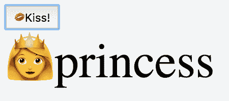
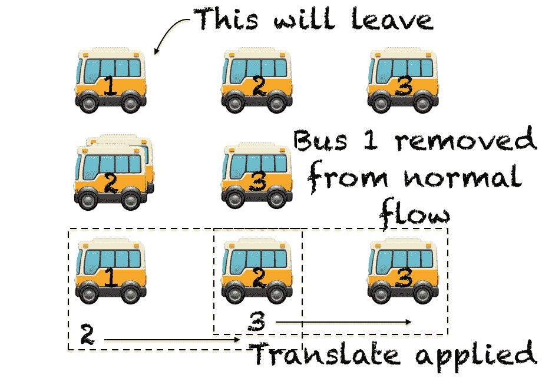
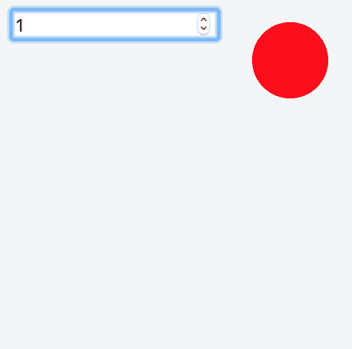
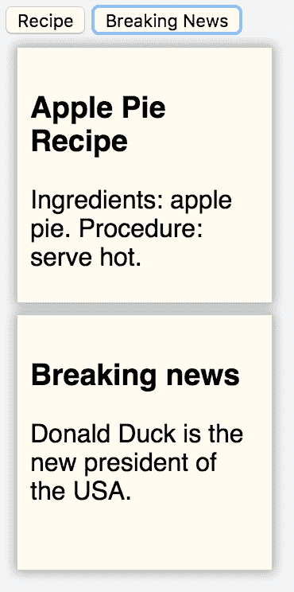

# 第十三章：过渡和动画

本章将介绍以下内容：

+   与 animate.css 等第三方 CSS 动画库集成

+   添加自定义的过渡类

+   使用 JavaScript 而不是 CSS 进行动画处理

+   在初始渲染上进行过渡

+   元素之间的过渡

+   在过渡中，在进入阶段之前让元素离开

+   为列表中的元素添加进入和离开过渡

+   在列表中移动的元素进行过渡

+   对组件的状态进行动画处理

+   将可重用的过渡打包到组件中

+   动态过渡

# 介绍

本章包含与过渡和动画相关的示例。Vue 具有用于处理元素进入或离开场景的过渡的标签：<transition>和<transition-group>。您将学习如何使用它们，以便为您的客户提供更好的用户体验。

Vue 过渡非常强大，因为它们是完全可定制的，并且可以轻松地结合 JavaScript 和 CSS 样式，同时具有非常直观的默认值，这样您就可以在不需要所有花哨效果的情况下编写更少的代码。

即使没有过渡标签，您也可以对组件中发生的大部分内容进行动画处理，因为您只需要将状态变量绑定到某些可见属性即可。

最后，一旦您掌握了关于 Vue 过渡和动画的所有知识，您可以轻松地将它们打包到分层组件中，并在整个应用程序中重复使用它们。这不仅使它们功能强大，而且易于使用和维护。

# 与 animate.css 等第三方 CSS 动画库集成

图形界面不仅需要可用性和易于理解，还应提供可负担性和愉悦性。通过提供过渡效果，可以以有趣的方式提供网站的工作方式的线索，这对于帮助很大。在这个示例中，我们将介绍如何在应用程序中使用 CSS 库。

# 准备工作

在开始之前，您可以查看[`daneden.github.io/animate.css/`](https://daneden.github.io/animate.css/)，如图所示，以了解可用的动画效果，但您实际上不需要任何特殊的知识来继续：

！[](assets/f9ba4864-e66a-485c-a49f-10a17ecd5ecc.png)

# 如何操作...

想象一下，您正在创建一个预订出租车的应用程序。我们将创建的界面将简单而有趣。

首先，将`animate.css`库添加到依赖列表中（参考*选择开发环境*教程来了解如何做）。

为了继续，我们需要我们通常的包装器：

```js
<div id="app"> 
</div>
```

在其中，我们将放置一个按钮来叫出租车：

```js
<button @click="taxiCalled = true"> 
  Call a cab 
</button>
```

您已经可以看出我们将使用`taxiCalled`变量来跟踪按钮是否已被按下

让我们添加一个表情符号，以向用户确认出租车已被叫到：

```js
<p v-if="taxiCalled"></p>
```

此时，我们可以添加一些 JavaScript 代码：

```js
new Vue({ 
  el: '#app', 
  data: { 
    taxiCalled: false 
  } 
})
```

运行应用程序，当您按下按钮时，您将立即看到出租车出现。我们是一家很酷的出租车公司，所以让我们让出租车通过过渡来到我们这里：

```js
<transition  
  enter-active-class="animated slideInRight"> 
  <p v-if="taxiCalled"></p> 
</transition>
```

现在运行您的应用程序；如果您叫出租车，它将从右侧滑动到您这里：


出租车将从右向左滑动，如图所示：


# 它是如何工作的...

每个过渡应用四个类。两个类应用于元素进入*场景*时，另外两个类应用于元素离开时：

| **名称** | **应用于** | **移除于** |
| --- | --- | --- |
| `v-enter` | 元素插入之前 | 一帧后 |
| `v-enter-active` | 元素插入之前 | 过渡结束时 |
| `v-enter-to` | 一帧后 | 过渡结束时 |
| `v-leave` | 过渡开始 | 一帧后 |
| `v-leave-active` | 过渡开始 | 过渡结束时 |
| `v-leave-to` | 一帧后 | 过渡结束时 |

在这里，初始的*v*代表您的过渡名称。如果您没有指定名称，将使用*v*。

虽然过渡的开始是一个明确定义的瞬间，但过渡的结束对于浏览器来说需要一些工作。例如，如果 CSS 动画循环，动画的持续时间只有一个迭代。此外，这可能会在将来的版本中发生变化，所以请记住这一点。

在我们的情况下，我们希望提供一个第三方的`v-enter-active`，而不是编写我们自己的。问题是，我们的库已经为我们想要使用的动画类（`slideInRight`）命名为不同的名称。由于我们无法更改类的名称，我们告诉 Vue 使用`slideInRight`而不是寻找`v-enter-active`类。

为了做到这一点，我们使用了以下代码：

```js
<transition enter-active-class="animated slideInRight">
```

这意味着我们的`v-enter-active`现在被称为`animated slideInRight`。Vue 将在元素插入之前附加这两个类，并在过渡结束时删除它们。只需注意，animated 是一种带有`animate.css`的辅助类。

# 添加自己的过渡类

如果您的应用程序富含动画，并且希望通过混合和匹配在其他项目中重用您的 CSS 类，那么这就是适合您的示例。您还将了解一种重要的性能动画技术，称为 FLIP（First Last Invert Play）。虽然后一种技术通常由 Vue 自动触发，但我们将手动实现它，以更好地理解其工作原理。

# 准备工作

要完成此示例，您应该了解 CSS 动画和过渡的工作原理。这超出了本书的范围，但您可以在[`css3.bradshawenterprises.com/`](https://daneden.github.io/animate.css/)上找到一个很好的入门指南。这个网站也很棒，因为它会解释何时可以使用动画和过渡。

# 如何操作...

我们将为出租车公司构建一个界面（类似于前面的示例），用户可以通过点击按钮来叫出租车，并在叫出租车时提供一个漂亮的动画反馈。

要编写按钮，请编写以下 HTML 代码：

```js
<div id="app"> 
  <button @click="taxiCalled = true"> 
    Call a cab 
  </button> 
  <p v-if="taxiCalled"></p> 
</div>
```

然后，您可以在 JavaScript 中将`taxiCalled`变量初始化为`false`，如下所示：

```js
new Vue({ 
  el: '#app', 
  data: { 
    taxiCalled: false 
  } 
})
```

此时，我们将在 CSS 中创建自定义过渡：

```js
.slideInRight { 
  transform: translateX(200px); 
} 

.go { 
  transition: all 2s ease-out; 
}
```

将您的汽车表情包装在 Vue 过渡中：

```js
<transition  
  enter-class="slideInRight" 
  enter-active-class="go"> 
  <p v-if="taxiCalled"></p> 
</transition>
```

当您运行代码并点击“叫出租车”按钮时，您将看到一辆出租车停在旁边。

# 工作原理...

当我们点击按钮时，`taxiCalled`变量变为`true`，Vue 会将出租车插入到您的页面中。在实际执行此操作之前，它会读取您在`enter-class`中指定的类（在本例中仅为`slideInRight`），并将其应用于包装元素（带有出租车表情的`<p>`元素）。它还会应用在`enter-class-active`中指定的类（在本例中仅为 go）。

`enter-class`中的类在第一帧后被移除，`enter-class-active`中的类在动画结束时也被移除。

此处创建的动画遵循 FLIP 技术，由四个要点组成：

+   **First (F)**：您将属性保持在动画的第一帧中；在我们的例子中，我们希望出租车从屏幕右侧的某个位置开始。

+   **Last (L)**：你将属性保持在动画的最后一帧中，对于我们的情况来说，就是屏幕左侧的出租车。

+   **Invert (I)**：你反转在第一帧和最后一帧之间注册的属性变化。由于我们的出租车向左移动，在最后一帧中它将位于-200 像素的偏移位置。我们反转这个并设置`slideInRight`类，使得 transform 为`translateX(200px)`，这样出租车出现时将位于+200 像素的偏移位置。

+   **Play (P)**：我们为每个已触摸的属性创建一个过渡效果。在出租车的例子中，我们使用了 transform 属性，因此我们使用`writetransition: all 2s ease-out`来使出租车平滑过渡。

Vue 在内部自动使用这种技术来使得在`<transition-group>`标签内的过渡效果正常工作。关于这一点，我们将在*为列表中的元素添加进入和离开过渡效果*的食谱中详细介绍。

# 使用 JavaScript 而不是 CSS 进行动画

有一个普遍的误解，即使用 JavaScript 进行动画会更慢，而动画应该在 CSS 中完成。事实是，如果使用正确，JavaScript 中的动画可以具有相似或更好的性能。在这个食谱中，我们将使用简单但强大的 Velocity.js（[`velocityjs.org/`](http://velocityjs.org/)）库创建一个动画：


# 准备工作

这个食谱假设你对 Velocity 库没有任何了解，但假设你对 CSS 或 JavaScript 库（如 jQuery）中的动画非常熟悉。如果你从未见过 CSS 动画并且想要快速入门，只需完成前两个食谱，你就能跟上。

# 如何实现...

我们仍在寻找一个完美的过渡效果，用于等待出租车时娱乐我们的客户（与前一个食谱中相同）。我们有一个按钮来呼叫出租车，当我们预订时会出现一个小的出租车表情符号。

在任何其他操作之前，将 Velocity 库作为项目的依赖项添加进来--[`cdnjs.cloudflare.com/ajax/libs/velocity/1.2.3/velocity.min.js`](http://velocityjs.org/)。

这是创建界面框架的 HTML 代码：

```js
<div id="app"> 
  <button @click="taxiCalled = true"> 
    Call a cab 
  </button> 
  <p v-if="taxiCalled"></p> 
</div>
```

我们的 Vue 模型非常简单，只包含一个`taxiCalled`变量：

```js
new Vue({ 
  el: '#app', 
  data: { 
    taxiCalled: false 
  } 
})
```

通过将小出租车包装在 Vue 过渡中来创建动画：

```js
<transition 
  @enter="enter" 
  :css="false" 
> 
<p v-if="taxiCalled"></p> 
</transition>
```

当按下按钮插入出租车表情符号时，将调用 enter 方法。

enter 方法，您需要将其添加到 Vue 实例中，如下所示：

```js
methods: { 
    enter (el) { 
      Velocity(el,  
      { opacity: [1, 0], translateX: ["0px", "200px"] }, 
      { duration: 2000, easing: "ease-out" }) 
    } 
  }
```

运行代码并按下按钮预订您的出租车！

# 它是如何工作的...

正如你可能已经注意到的，你的代码中没有 CSS。动画完全由 JavaScript 驱动。让我们稍微解析一下我们的 Vue 过渡：

```js
<transition 
  @enter="enter" 
  :css="false" 
> 
  <p v-if="taxiCalled"></p> 
</transition>
```

虽然这仍然是一个可以使用 CSS 的过渡，但我们想告诉 Vue 关闭 CSS 并节省宝贵的 CPU 周期，通过设置`:css="false"`。这将使 Vue 跳过与 CSS 动画相关的所有代码，并防止 CSS 干扰我们纯粹的 JavaScript 动画。

多汁的部分在`@enter="enter"`这一部分。我们将触发元素插入时的钩子绑定到`enter`方法上。方法本身如下：

```js
enter (el) { 
  Velocity(el,  
    { opacity: [1, 0], translateX: ["0px", "200px"] }, 
    { duration: 2000, easing: "ease-out" }
  ) 
}
```

在这里，我们调用了 Velocity 库。`el`参数由 Vue 免费传递，并且它指的是被插入的元素（在我们的例子中，是包含汽车表情的`<p>`元素）。

Velocity 函数的语法如下所示：

```js
Velocity( elementToAnimate, propertiesToAnimate, [options] )
```

还有其他语法可能，但我们将坚持使用这种语法。

在调用此函数时，我们将段落元素作为第一个参数传递；然后我们说不透明度应该从 0 变为 1，并且同时，元素应该从 x 轴上的起始位置 200 像素移动到其原点。作为选项，我们指定动画持续时间为两秒，并且我们希望在接近结束时缓和动画。

我认为一切都很清楚，除了我们如何传递`opacity`和`translateX`参数。

这就是 Velocity 所谓的**强制喂食**--我们告诉 Velocity 不透明度应该从 0 开始到 1 结束。同样，我们告诉 Velocity`translateX`属性应该从 200 像素开始，结束于 0 像素。

通常情况下，我们可以避免传递数组来指定属性的初始值；Velocity 会计算如何过渡。

例如，我们可以有以下 CSS 类：

```js
p { 
  opacity: 0; 
}
```

如果我们将 Velocity 调用重写如下：

```js
Velocity(el,  
  { opacity: 1 } 
)
```

汽车将慢慢出现。Velocity 查询了元素的初始值，然后将其过渡到 1。这种方法的问题是，由于涉及对 DOM 的查询，某些动画可能会变慢，特别是当您有很多并发动画时。

我们可以通过使用 begin 选项来获得与强制喂食相同的效果，如下所示：

```js
Velocity(el,  
  { opacity: 1 }, 
  { begin: () => { el.style.opacity = 0 } } 
)
```

这将在动画开始之前（因此在元素插入之前）将不透明度设置为零。这将有助于在较慢的浏览器中，强制显示仍然会在将其完全移到右侧并开始动画之前显示一闪而过的汽车。

JavaScript 动画的可能钩子在下表中总结：

| **属性** | **描述** |
| --- | --- |
| `@before-enter` | 在元素插入之前调用此函数。 |
| `@enter` | 当元素插入时调用此函数。 |
| `@after-enter` | 当元素插入并且动画完成时调用此函数。 |
| `@enter-cancelled` | 当动画仍在进行中但元素必须离开时调用此函数。如果使用 Velocity，可以执行类似于`Velocity(el, "stop")`的操作。 |
| `@before-leave` | 在触发离开函数之前调用此函数。 |
| `@leave` | 当元素离开时调用此函数。 |
| `@after-leave` | 当元素离开页面时调用此函数。 |
| `@leave-cancelled` | 在离开调用完成之前，如果必须插入元素，则调用此函数。仅适用于 v-show。 |

请记住，这些钩子对于任何库都有效，不仅仅适用于 Velocity。

# 还有更多...

我们可以尝试使用这个界面来实现一个取消按钮。如果用户错误地预订了出租车，点击取消按钮将删除预订，并且通过小的出租车表情消失来表明。

首先，让我们添加一个取消按钮：

```js
<button @click="taxiCalled = false">
  Cancel
</button>
```

这很容易；现在我们添加离开过渡效果：

```js
<transition 
  @enter="enter" 
  @leave="leave" 
  :css="false" 
> 
  <p v-if="taxiCalled"></p> 
</transition>
```

这将引导我们到离开方法：

```js
leave (el) { 
  Velocity(el, 
    { opacity: [0, 1], 'font-size': ['0.1em', '1em'] }, 
    { duration: 200}) 
}
```

我们正在做的是使表情符号消失并缩小。

如果您尝试运行代码，您将遇到一些问题。

当您点击取消按钮时，应该发生的是离开动画应该开始，出租车应该变小并最终消失。相反，什么都不会发生，出租车会突然消失。

取消动画无法按计划播放的原因是因为动画是用 JavaScript 编写的，而不是 CSS，Vue 无法判断动画何时完成。特别是，发生的情况是 Vue 认为离开动画在开始之前就已经完成了。这就是我们的汽车消失的原因。

关键在于第二个参数。每个钩子都调用一个带有两个参数的函数。我们已经看到了第一个参数`el`，它是动画的主体。第二个参数是一个回调函数，当调用时，告诉 Vue 动画已经完成。

我们将利用 Velocity 有一个名为`complete`的选项，它期望在动画（从 Velocity 的角度）完成时调用一个函数。

让我们使用这些新信息重写我们的代码：

```js
leave (el, done) { 
  Velocity(el, 
  { opacity: [0, 1], 'font-size': ['0.1em', '1em'] }, 
  { duration: 200 }) 
}
```

向我们的函数添加`done`参数，让 Vue 知道我们希望在动画完成时调用回调函数。我们不需要显式使用回调函数，因为 Vue 会自动找到它，但是由于依赖默认行为总是一个坏主意（如果它们没有记录，它们可能会改变），让我们在动画完成时调用`done`函数：

```js
leave (el, done) { 
  Velocity(el, 
  { opacity: [0, 1], 'font-size': ['0.1em', '1em'] }, 
  { duration: 200, complete: done }) 
}
```

运行代码并按下取消按钮来取消您的出租车！

# 在初始渲染上进行过渡

通过使用`appear`关键字，我们可以在元素首次加载时为其添加过渡效果。这有助于提高用户体验，因为它给人一种页面更具响应性和加载速度更快的印象，尤其是当应用于多个元素时。

# 准备工作

这个示例不假设任何特定的知识，但如果您至少完成了*使用 CSS 过渡为您的应用程序增添一些乐趣*示例，那么这将是小菜一碟。

# 操作步骤...

我们将建立一个关于美国演员 Fill Murray 的页面；不，不是 Bill Murray。您可以在[`www.fillmurray.com`](https://cdnjs.cloudflare.com/ajax/libs/velocity/1.2.3/velocity.min.js)找到关于他的更多信息。我们将使用这个网站的图片来填充我们关于他的页面。

在我们的 HTML 中，让我们写一个标题作为页面的标题：

```js
<h1> 
  The Fill Murray Page 
</h1>
```

在标题之后，我们将放置我们的 Vue 应用程序：

```js
<div id="app"> 
   
  <p> 
    The internet was missing the ability to 
    provide custom-sized placeholder images of Bill Murray. 
    Now it can. 
  </p> 
</div>
```

在浏览器中呈现时，将显示如下：


我们的页面现在非常简单。我们希望 Fill Murray 的图片淡入。我们必须将其包装在一个过渡中：

```js
<transition appear> 
   
</transition>
```

以下是 CSS 类：

```js
img { 
  float: left; 
  padding: 5px 
} 
.v-enter { 
  opacity: 0 
} 
.v-enter-active { 
  transition: opacity 2s 
}
```

现在运行我们的页面将使图片慢慢出现，但也会移动文本。为了修复这个问题，我们必须提前指定图片的大小：

```js
<transition appear> 
   
</transition>
```

这样，我们的浏览器将为即将出现的图片预留一些空间。

# 工作原理...

`transition`标签中的`appear`指令将使组件在首次出现时带有关联的过渡效果（如果找到）。

在组件的第一次渲染中，有很多可能的方法来指定一个过渡。在所有情况下，必须指定`appear`指令。

当这个指令存在时，Vue 将首先寻找 JavaScript 钩子或在标签中指定的 CSS 类：

```js
<transition 
  appear 
  @before-appear="customBeforeAppearHook" 
  @appear="customAppearHook" 
  @after-appear="customAfterAppearHook" 
  appear-class="custom-appear-class" 
  appear-active-class="custom-appear-active-class" 
> 
  <p>My element</p> 
</transition>
```

之后，如果指定了一个名称，Vue 将会寻找该元素的入场过渡：

```js
<transition appear name="myTransition"> 
  <p>My element</p> 
</transition>
```

上述代码将寻找以下命名的类：

```js
.myTransition-enter {...} 
.myTransition-enter-active {...}
```

如果其他方法都失败了，Vue 将会寻找元素插入的默认 CSS 类（`v-enter`和`v-enter-active`）。顺便说一句，这就是我们在这个示例中所做的。

依赖这些默认值并不是一个好的实践；在这里，我们只是作为演示而这样做。你应该总是给你的过渡命名。

也许值得一提的是，为什么我们必须为图像添加宽度和高度。原因是当我们在 HTML 中指定一个图像 URL 时，浏览器不知道图像的大小，所以默认情况下不会为其保留任何空间。只有通过提前指定图像的大小，浏览器才能在图像加载之前正确地组合页面。

# 元素之间的过渡

网页上的每个东西都是一个元素。通过 Vue 的`v-if`和`v-show`指令，你可以轻松地使它们出现和消失。通过过渡，你甚至可以轻松地控制它们的出现，并添加魔法效果。本示例将解释如何做到这一点。

# 准备工作

对于这个示例，你应该对 Vue 过渡和 CSS 的工作原理有一些了解。

# 如何做到这一点...

既然我们谈到了魔法，我们将把一只青蛙变成一位公主。变化本身将是一个过渡。

我们将实例化一个按钮，当按下时，它将代表对青蛙的一个吻：

```js
<div id="app"> 
  <button @click="kisses++">Kiss!</button> 
</div>
```

每次按下按钮时，变量 kisses 都会增加。变量将被初始化为零，如下面的代码所示：

```js
new Vue({ 
   el: '#app', 
  data: { 
   kisses: 0 
  } 
})
```

接下来，我们需要青蛙和公主，我们将在按钮之后立即添加它们：

```js
<transition name="fade"> 
  <p v-if="kisses < 3" key="frog">frog</p> 
  <p v-if="kisses >= 3" key="princess">princess</p> 
</transition>
```

淡入淡出过渡的 CSS 代码如下：

```js
.fade-enter-active, .fade-leave-active { 
  transition: opacity .5s 
} 
.fade-enter, .fade-leave-active { 
  opacity: 0 
}
```

为了使其正常工作，我们需要添加一个最后的 CSS 选择器：

```js
p { 
  margin: 0; 
  position: absolute; 
  font-size: 3em; 
}
```

如果你运行应用程序并点击足够多次的吻按钮，你应该会看到你的青蛙变成一位公主：


这个过渡将有一个淡入淡出的效果：


青蛙表情符号将变成公主表情符号：



# 它是如何工作的...

当我们写下这两个元素时，我们使用了`key`属性来指定谁是青蛙，谁是公主。这是因为，否则 Vue 优化系统将会启动。它会看到两个元素的内容可以互换，而不必交换元素本身，并且由于元素是相同的，只有内容发生了变化，所以不会发生过渡。

如果我们移除`key`属性，我们可以亲眼看到青蛙和公主会发生变化，但没有任何过渡效果：

```js
<transition name="fade"> 
  <p v-if="kisses < 3">frog</p> 
  <p v-if="kisses >= 3">princess</p> 
</transition>
```

考虑到我们使用了两个不同的元素，如下所示：

```js
<p v-if="kisses < 3" >frog</p> 
<span v-if="kisses >= 3">princess</span>
```

此外，我们相应地修改了`<p>`的 CSS 选择器：

```js
p, span { 
  margin: 0; 
  position: absolute; 
  font-size: 3em; 
  display: block; 
}
```

现在，如果我们再次启动应用程序，一切都可以正常工作，而不需要使用任何`key`属性。

即使在不必要的情况下，使用 key 通常也是推荐的，就像前面的情况一样。这尤其适用于项目具有不同的语义含义的情况。这样做的原因有几个。主要原因是，当多个人在同一行代码上工作时，修改`key`属性不会像将`span`元素切换回`p`元素那样容易破坏应用程序，这会破坏我们刚刚看到的过渡效果。

# 还有更多...

在这里，我们涵盖了前面示例的两个子情况：在多个元素之间切换和绑定`key`属性。

# 在多个元素之间进行过渡

我们可以按照简单的方式扩展我们刚刚完成的示例。

假设如果我们亲吻公主太多次，她会变成圣诞老人，这可能会或可能不会吸引人，这取决于你的年龄。

首先，我们添加第三个元素：

```js
<transition name="fade"> 
  <p v-if="kisses < 3" key="frog">frog</p> 
  <p v-else-if="kisses >= 3 && kisses <= 5" key="princess">princess</p> 
  <p v-else key="santa">santa</p> 
</transition>
```

我们可以立即启动应用程序，当我们亲吻公主/青蛙超过五次时，圣诞老人将以相同的淡入淡出过渡效果出现：


使用这种设置，我们在使用第一个和第二个元素之间使用相同的过渡时受到限制。

在*动态过渡*的示例中，有一个解决方法。

# 动态设置 key 属性

如果我们已经有一些可用的数据，我们不必为所有元素编写 key。我们可以以以下方式编写相同的应用程序，但不重复元素：

```js
<transition name="fade">
  <p :key="transformation">{{emoji}}{{transformation}}</p>
</transition>
```

当然，这意味着我们必须根据亲吻的次数为`transformation`和`emoji`变量提供一个合理的值。

为了做到这一点，我们将把它们与计算属性绑定起来：

```js
computed: { 
  transformation () { 
    if (this.kisses < 3) { 
      return 'frog' 
    } 
    if (this.kisses >= 3 && this.kisses <= 5) { 
      return 'princess' 
    } 
    if (this.kisses > 5) { 
      return 'santa' 
    } 
  }, 
  emoji () { 
    switch (this.transformation) { 
      case 'frog': return '' 
      case 'princess': return '' 
      case 'santa': return '' 
    } 
  } 
}
```

我们在模板中牺牲了一些复杂性，换取了 Vue 实例中更多的逻辑。如果我们预计将来会有更复杂的逻辑或者转换数量增加，这可能是有益的。

# 在过渡中让元素在进入阶段之前离开

在*元素之间过渡*的示例中，我们探讨了如何在两个元素之间进行过渡。Vue 的默认行为是在第一个元素离开的同时开始进入元素的过渡；这并不总是理想的。

您将在本示例中了解到这个重要的特殊情况以及如何解决它。

# 准备工作

这个示例是在两个元素之间的过渡的基础上构建的，解决了一个特定的问题。如果您不知道我们在谈论什么，返回上一个示例，您将很快跟上。

# 如何做...

首先，如果您还没有遇到这个问题，您将看到问题。接下来，我们将看到 Vue 为我们提供的解决方案。

# 两个元素的问题

让我们在我们的网站上创建一个轮播效果。用户一次只能查看一个产品，然后他将滑动到下一个产品。要滑动到下一个产品，用户需要点击一个按钮。

首先，我们需要在 Vue 实例中有我们的产品列表：

```js
new Vue({ 
  el: '#app', 
  data: { 
    product: 0, 
    products: ['umbrella', 'computer', 'ball', 'camera'] 
  } 
})
```

在我们的 HTML 中，我们只需要一个按钮和一个元素的视图：

```js
<div id="app"> 
  <button @click="product++">next</button> 
  <transition name="slide"> 
    <p :key="products[product % 4]">{{products[product % 4]}}</p> 
  </transition> 
</div>
```

模 4（product % 4）只是因为我们希望在产品列表结束时重新开始。

为了设置我们的滑动过渡，我们需要以下规则：

```js
.slide-enter-active, .slide-leave-active { 
  transition: transform .5s 
} 
.slide-enter { 
  transform: translateX(300px) 
} 
.slide-leave-active { 
  transform: translateX(-300px); 
}
```

此外，为了使一切看起来好看，我们最后完成了以下内容：

```js
p { 
  position: absolute; 
  margin: 0; 
  font-size: 3em; 
}
```

如果现在运行代码，您将看到一个漂亮的轮播图：


现在，让我们尝试从最后一个规则中删除`position: absolute`：

```js
p { 
  margin: 0; 
  font-size: 3em; 
}
```

如果您现在尝试您的代码，您将看到产品之间的奇怪跳动：


这是我们试图解决的问题。第二个过渡在第一个产品离开之前就开始了。如果定位不是绝对的，我们会看到一些奇怪的效果。

# 过渡模式

为了解决这个问题，我们将改变过渡模式。让我们修改`<transition>`的代码：

```js
<transition name="slide" mode="out-in"> 
  <p :key="products[product%4]">{{products[product%4]}}</p> 
</transition>
```

现在运行您的程序，您将看到产品在滑入屏幕之前需要更长的时间。它们在进入之前等待上一个项目离开。

# 工作原理...

总之，您有两种不同的方法来管理 Vue 组件之间的过渡。默认方式是同时开始“in”过渡和“out”过渡。我们可以通过以下方式明确表示：

```js
<transition mode="in-out"> 
  <!-- elements --> 
</transition>
```

我们可以通过等待“out”部分完成后再开始“in”动画来改变这种默认行为。我们通过以下方式实现了这一点：

```js
<transition mode="out-in"> 
  <!-- elements --> 
</transition>
```

前者在元素具有绝对样式位置时很有用，而后者在我们真正需要等待在页面上放置更多内容之前有一个清晰的方法时更相关。

绝对定位不会在意元素之间的重叠，因为它们不遵循页面的流动。另一方面，静态定位将在第一个元素之后追加第二个元素，如果两个元素同时显示，则过渡会变得尴尬。

# 为列表中的元素添加进入和离开过渡

在这里，我们将尝试添加一种视觉方式来暗示列表中的元素是添加还是删除。这可以为用户体验增添很多，因为您有机会向用户建议为什么添加或删除元素。

# 准备工作

对 CSS 和过渡有一些了解会有所帮助。如果您觉得有必要，只需浏览本章中的其他示例。

# 如何做...

我们将建立一个学习编程的教学大纲。当我们完成一个主题时，我们会感到宽慰，并希望通过让主题从教学大纲中飘走来将这种感觉融入我们的应用程序中。

列表的数据将在我们的 Vue 实例中：

```js
new Vue({ 
  el: '#app', 
  data: { 
    syllabus: [ 
      'HTML', 
      'CSS', 
      'Scratch', 
      'JavaScript', 
      'Python' 
    ] 
  } 
})
```

列表将在我们的 HTML 中打印出以下代码：

```js
<div id="app"> 
  <h3>Syllabus</h3> 
  <ul> 
    <li v-for="topic in syllabus"> 
      {{topic}} 
    </li> 
  </ul> 
</div>
```

当我们按下按钮时，我们希望主题从列表中消失。为了实现这一点，我们需要修改我们已经编写的代码。

首先，在每个主题之前添加一个“完成”按钮：

```js
<li v-for="topic in syllabus"> 
  <button @click="completed(topic)">Done</button>{{topic}} 
</li>
```

在这里，completed 方法将如下所示：

```js
methods: { 
  completed (topic) { 
    let index = this.syllabus.indexOf(topic) 
    this.syllabus.splice(index, 1) 
  } 
}
```

现在运行代码将显示一个简单的应用程序，用于勾选我们已经学习过的主题。不过，我们想要的是一种让我们感到宽慰的动画。

为此，我们需要编辑我们列表的容器。我们删除`<ul>`标签，并告诉`<transition-group>`编译为`<ul>`标签：

```js
<transition-group tag="ul"> 
  <li v-for="topic in syllabus" :key="topic"> 
    <button @click="completed(topic)">Done</button>{{topic}} 
  </li> 
</transition-group>
```

请注意，我们还根据主题为每个列表元素添加了一个键。我们需要做的最后一件事是将过渡规则添加到我们的 CSS 中：

```js
.v-leave-active { 
  transition: all 1s; 
  opacity: 0; 
  transform: translateY(-30px); 
}
```

现在，主题将在点击“完成”按钮时以过渡方式消失，如下所示：

！[](assets/1dc697d3-26c5-4957-86c6-2ed79cc3966b.png)

# 它是如何工作的...

`<transition-group>`标签表示一组元素的容器，这些元素将同时显示。默认情况下，它表示`<span>`标签，但通过将标签属性设置为`ul`，我们使其表示无序列表。

列表中的每个元素必须具有唯一的键，否则转换将无法工作。Vue 将负责对每个进入或离开的元素应用转换。

# 在列表中移动的过渡元素

在这个教程中，您将构建一个元素列表，根据列表的变化而移动。当您想告诉用户某些内容已经改变并且列表已相应更新时，这种特定的动画是有用的。它还将帮助用户识别插入元素的位置。

# 准备工作

这个教程有点高级；如果您对 Vue 中的过渡不是很熟悉，我建议您先完成本章中的一些教程。如果您可以轻松完成*为列表元素添加进入和离开过渡*教程，那就可以继续了。

# 如何做...

您将构建一个小游戏--一个公交车站模拟器！

每当一辆公交车--由其表情符号表示--离开车站时，所有其他公交车都会稍微前进以占据它的位置。每辆公交车都由一个数字标识，您可以从 Vue 实例数据中看到：

```js
new Vue({ 
  el: '#app', 
  data: { 
    buses: [1,2,3,4,5], 
    nextBus: 6 
  } 
})
```

每当新的公交车到达时，它将被分配一个递增的编号。我们希望每两秒钟有一辆新的公交车离开或到达。我们可以通过在组件挂载到屏幕时挂接一个计时器来实现这一点。在数据之后，立即编写以下内容：

```js
mounted () { 
  setInterval(() => { 
    const headOrTail = () => Math.random() > 0.5 
    if (headOrTail()) { 
      this.buses.push(this.nextBus) 
      this.nextBus += 1 
    } else { 
      this.buses.splice(0, 1) 
    } 
  }, 2000) 
}
```

我们应用的 HTML 将如下所示：

```js
<div id="app"> 
  <h3>Bus station simulator</h3> 
  <transition-group tag="p" name="station"> 
    <span v-for="bus in buses" :key="bus"></span> 
  </transition-group> 
</div>
```

为了让公交车四处移动，我们需要在前缀站下指定一些 CSS 规则：

```js
.station-leave-active, .station-enter-active { 
  transition: all 2s; 
  position: absolute; 
} 

.station-leave-to { 
  opacity: 0; 
  transform: translateX(-30px); 
} 

.station-enter { 
  opacity: 0; 
  transform: translateX(30px); 
} 

.station-move { 
  transition: 2s; 
} 

span { 
  display: inline-block; 
  margin: 3px; 
}
```

现在启动应用将导致一个有序的公交车队列，每两秒钟有一辆公交车离开或到达：


# 工作原理...

我们应用的核心是`<transition-group>`标签。它管理所有通过它们的键标识的公交车：

```js
<transition-group tag="p" name="station"> 
  <span v-for="bus in buses" :key="bus"></span> 
</transition-group>
```

每当一辆公交车进入或离开场景时，Vue 将自动触发 FLIP 动画（参见*添加自己的过渡类*教程）。

为了更好地理解，假设我们有公交车[1, 2, 3]，公交车 1 离开了。接下来发生的是，在动画实际开始之前，将记住第一辆公交车的`<span>`元素的属性。因此，我们可以检索到描述属性的以下对象：

```js
{ 
  bottom:110.4375 
  height:26 
  left:11 
  right:27 
  top:84.4375 
  width:16 
}
```

Vue 对`<transition-group>`标签内的所有元素都这样做。

之后，`station-leave-active`类将应用于第一辆公交车。让我们简要回顾一下规则是什么：

```js
.station-leave-active, .station-enter-active { 
  transition: all 2s; 
  position: absolute; 
}
```

我们注意到位置变为绝对定位。这意味着元素从页面的正常流程中移除。这又意味着所有在它后面的公交车将突然移动填补留下的空间。Vue 在这个阶段记录所有公交车的属性，这被认为是动画的最终帧。这个帧实际上并不是一个真正显示的帧；它只是用来计算元素的最终位置的抽象：



Vue 将计算最终帧和起始帧之间的差异，并将应用样式，使公交车出现在初始帧，即使它们实际上并不在那里。这些样式将在一帧后被移除。公交车缓慢爬向它们的最终位置，而不是立即移动到它们的新位置，原因是它们是`span`元素，我们指定了任何变换样式（Vue 用来伪造它们位置一帧的样式）必须过渡两秒：

```js
.station-move { 
  transition: 2s; 
}
```

换句话说，在第-1 帧，三辆公交车都在原位，并记录了它们的位置。

在第 0 帧，第一辆公交车从页面流中移除，其他公交车立即移动到它的后面。在同一帧中，Vue 记录它们的新位置，并应用一个变换，将公交车移回到它们在第-1 帧的位置，从视觉上看就好像没有人移动过。

在第 1 帧，变换被移除，但由于我们有一个过渡，公交车将缓慢移动到它们的最终位置。

# 动画化组件的状态

在计算机中，一切都是数字。在 Vue 中，一切都是数字的东西都可以以某种方式进行动画。在这个配方中，您将控制一个弹跳球，它将通过缓动动画平稳地定位自己。

# 准备工作

完成这个配方，您至少需要对 JavaScript 有一定的了解。JavaScript 的技术细节超出了本书的范围，但我会在*它是如何工作的...*部分为您解释代码，所以不要太担心。

# 如何做...

在我们的 HTML 中，我们只会添加两个元素：一个输入框，我们将在其中输入我们的弹跳球的期望位置，以及球本身：

```js
<div id="app"> 
  <input type="number"> 
  <div class="ball"></div> 
</div>
```

为了正确渲染小球，写下这个 CSS 规则，它将出现在屏幕上：

```js
.ball { 
  width: 3em; 
  height: 3em; 
  background-color: red; 
  border-radius: 50%; 
  position: absolute; 
  left: 10em; 
}
```

我们想要控制球的*Y*位置。为此，我们将绑定球的`top`属性：

```js
<div id="app"> 
  <input type="number"> 
  <div class="ball" :style="'top: ' + height + 'em'"></div> 
</div>
```

高度将成为我们 Vue 实例模型的一部分：

```js
new Vue({ 
   el: '#app', 
   data: { 
     height: 0 
   } 
})
```

现在，由于我们希望每当`enteredHeight`更改时，球在新位置上进行动画，一个想法是绑定输入元素的`@change`事件：

```js
<div id="app"> 
  <input type="number" @input="move"> 
  <div class="ball" :style="'top: ' + height + 'em'"></div> 
</div>
```

move 方法将负责将球的当前高度缓慢过渡到指定值。

在执行此操作之前，您将将**Tween.js**库添加为依赖项。官方存储库位于[`github.com/tweenjs/tween.js`](https://github.com/tweenjs/tween.js)。如果您在使用 JSFiddle，可以添加 README.md 页面中指定的 CDN 链接。

在添加库之后添加 move 方法，就像这样：

```js
methods: { 
  move (event) { 
    const newHeight = Number(event.target.value) 
    const _this = this 
    const animate = (time) => { 
      requestAnimationFrame(animate) 
      TWEEN.update(time) 
    } 
    new TWEEN.Tween({ H: this.height }) 
      .easing(TWEEN.Easing.Bounce.Out) 
      .to({ H: newHeight }, 1000) 
      .onUpdate(function () { 
        _this.height = this.H 
      }) 
      .start() 
    animate() 
  } 
}
```

尝试启动应用程序，看到球在您编辑其高度时弹跳：



当我们改变高度时，球的位置也会改变：


# 它是如何工作的...

这里的一般原则是，您有一个元素或组件的状态。当状态是数字性质时，您可以根据特定的曲线或加速度从一个值“tween”（在之间）到另一个值。

让我们来分解代码，好吗？

我们要做的第一件事是将指定的新高度保存到`newHeight`变量中：

```js
const newHeight = Number(event.target.value)
```

在下一行，我们还将 Vue 实例保存在`_this`辅助变量中：

```js
const _this = this
```

我们这样做的原因一分钟后就会清楚：

```js
const animate = (time) => { 
  requestAnimationFrame(animate) 
  TWEEN.update(time) 
}
```

在前面的代码中，我们将所有的动画包装在一个函数中。这是 Tween.js 库的惯用法，并且确定了我们将用于动画的主循环。如果我们有其他 Tween，这就是触发它们的地方：

```js
new TWEEN.Tween({ H: this.height }) 
  .easing(TWEEN.Easing.Bounce.Out) 
  .to({ H: newHeight }, 1000) 
  .onUpdate(function () { 
    _this.height = this.H 
  }) 
.start()
```

这是对我们库的 API 调用。首先，我们创建一个对象，它将保存状态值的副本，而不是我们组件的状态。通常，在这里，您放置代表状态本身的对象。由于 Vue 的限制（或 Tween.js 的限制），我们使用了一种不同的策略；我们正在动画化状态的副本，并且我们正在为每一帧同步真实状态：

```js
Tween({ H: this.height })
```

第一行将此副本初始化为球的当前实际高度：

```js
easing(TWEEN.Easing.Bounce.Out)
```

我们选择缓动效果来模拟弹跳球：

```js
.to({ H: newHeight }, 1000)
```

这行设置了目标高度和动画应持续的毫秒数：

```js
onUpdate(function () { 
  _this.height = this.H 
})
```

在这里，我们将动画的高度复制回真实的事物。由于此函数将 this 绑定到复制的状态，我们被迫使用 ES5 语法来访问它。这就是为什么我们有一个变量准备好引用 Vue 实例的原因。如果我们使用了 ES6 语法，我们将无法直接获取`H`的值。

# 将可重用的过渡效果打包到组件中

我们可能在网站中有一个重要的过渡效果，我们希望在用户漏斗中重复使用。如果您试图保持代码有序，将过渡效果打包到组件中可能是一个很好的策略。在这个示例中，您将构建一个简单的过渡组件。

# 准备工作

如果您已经通过 Vue 的过渡效果工作过，那么遵循这个示例是有意义的。此外，由于我们正在使用组件，您至少应该对它们有所了解。浏览下一章以了解组件的基础知识。特别是，我们将创建一个功能性组件，其解剖结构在*创建功能性组件*示例中有详细说明。

# 操作步骤...

我们将为新闻门户构建一个特色过渡效果。实际上，我们将使用优秀的 magic 库中的预制过渡效果（[`github.com/miniMAC/magic`](https://github.com/miniMAC/magic)），因此您应该将其添加到项目中作为依赖项。您可以在[`cdnjs.com/libraries/magic`](https://cdnjs.com/libraries/magic)找到 CDN 链接（[转到页面查找链接，不要将其复制为链接](https://github.com/miniMAC/magic)）。

首先，您将构建网站页面，然后构建过渡效果本身。最后，您将只需将过渡效果添加到不同的元素中。

# 构建基本网页

我们的网页将包括两个按钮，每个按钮将显示一个卡片：一个是食谱，另一个是最新的突发新闻：

```js
<div id="app"> 
  <button @click="showRecipe = !showRecipe"> 
    Recipe 
  </button> 
  <button @click="showNews= !showNews"> 
    Breaking News 
  </button> 
  <article v-if="showRecipe" class="card"> 
    <h3> 
      Apple Pie Recipe 
    </h3> 
    <p> 
      Ingredients: apple pie. Procedure: serve hot. 
    </p> 
  </article> 
  <article v-if="showNews" class="card"> 
    <h3> 
      Breaking news 
    </h3> 
    <p> 
      Donald Duck is the new president of the USA. 
    </p> 
  </article> 
</div>
```

由于以下 CSS 规则，卡片将具有其独特的触感：

```js
.card { 
  position: relative; 
  background-color: FloralWhite; 
  width: 9em; 
  height: 9em; 
  margin: 0.5em; 
  padding: 0.5em; 
  font-family: sans-serif; 
  box-shadow: 0px 0px 10px 2px rgba(0,0,0,0.3); 
}
```

JavaScript 部分将是一个非常简单的 Vue 实例：

```js
new Vue({ 
  el: '#app', 
  data: { 
    showRecipe: false, 
    showNews: false 
  } 
})
```

运行此代码将会显示您的网页：



# 构建可重用的过渡效果

我们决定我们的网站在显示卡片时将会有一个过渡效果。由于我们打算在网站的所有地方重复使用动画，最好将其打包在一个组件中。

在 Vue 实例之前，我们声明了以下组件：

```js
Vue.component('puff', { 
  functional: true, 
  render: function (createElement, context) { 
    var data = { 
      props: { 
        'enter-active-class': 'magictime puffIn', 
        'leave-active-class': 'magictime puffOut' 
      } 
    } 
    return createElement('transition', data, context.children) 
  } 
})
```

`puffIn`和`puffOut`动画在`magic.css`中定义。

# 在我们网页中使用我们的过渡效果

现在，我们将编辑我们的网页，向卡片中添加`<puff>`组件：

```js
<div id="app"> 
  <button @click="showRecipe = !showRecipe"> 
    Recipe 
  </button> 
  <button @click="showNews = !showNews"> 
    Breaking News 
  </button> 
 <puff> 
    <article v-if="showRecipe" class="card"> 
      <h3> 
        Apple Pie Recipe 
      </h3> 
      <p> 
        Ingredients: apple pie. Procedure: serve hot. 
      </p> 
    </article> 
 </puff> <puff> 
    <article v-if="showNews" class="card"> 
      <h3> 
        Breaking news 
      </h3> 
      <p> 
        Donald Duck is the new president of the USA. 
      </p> 
    </article> 
 </puff> 
</div>
```

现在，当按下按钮时，卡片将以“puff”效果出现和消失。

# 它是如何工作的...

我们代码中唯一棘手的部分是构建`<puff>`组件。一旦我们把它放在那里，无论我们放进去什么都会根据我们的过渡效果出现和消失。在我们的例子中，我们使用了一个已经制作好的过渡。在现实世界中，我们可能会制作一个非常复杂的动画，每次以相同的方式应用可能会很困难。将其打包在一个组件中更容易维护。

有两件事使`<puff>`组件作为可重用的过渡工作：

```js
props: { 
  'enter-active-class': 'magictime puffIn', 
  'leave-active-class': 'magictime puffOut' 
}
```

在这里，我们指定了组件在进入和离开时必须采用的类；这里没有什么特别的，我们已经在*与第三方 CSS 动画库集成，比如 animate.css*配方中做过了。

最后我们返回实际元素：

```js
return createElement('transition', data, context.children)
```

这一行创建了我们元素的根，是一个`<transition>`标签，只有一个子元素--`context.children`。这意味着子元素是未指定的；组件将把模板中传递的实际子元素作为子元素。在我们的例子中，我们传递了一些卡片，它们很快就显示出来了。

# 动态过渡

在 Vue 中，一个常数主题是反应性，当然，由于这个原因，过渡可以是动态的。不仅过渡本身，而且所有它们的属性都可以绑定到响应式变量上。这使我们对在任何给定时刻使用哪种过渡有很多控制。

# 准备工作

这个配方是建立在*元素之间过渡*配方之上的。如果你已经了解过渡，你不需要回去，但如果你觉得有所遗漏，最好先完成那个。

# 如何做...

我们将用一些吻把青蛙变成公主，但如果我们亲吻得太多，公主就会变成圣诞老人。当然，我们说的是表情符号。

我们的 HTML 设置非常简单：

```js
<div id="app"> 
  <button @click="kisses++">Kiss!</button> 
  <transition :name="kindOfTransformation" :mode="transformationMode"> 
    <p :key="transformation">{{emoji}}{{transformation}}</p> 
  </transition> 
</div>
```

只需注意这里大多数属性都绑定到变量上。以下是 JavaScript 的展开方式。

首先，我们将创建一个包含所有数据的简单 Vue 实例：

```js
new Vue({ 
el: '#app', 
  data: { 
    kisses: 0, 
    kindOfTransformation: 'fade', 
    transformationMode: 'in-out' 
  } 
})
```

我们所指的淡入淡出效果是以下 CSS：

```js
.fade-enter-active, .fade-leave-active { 
  transition: opacity .5s 
} 
.fade-enter, .fade-leave-active { 
  opacity: 0 
}
```

变量 transformation 和 emoji 由两个计算属性定义：

```js
computed: { 
  transformation () { 
    if (this.kisses < 3) { 
      return 'frog' 
    } 
    if (this.kisses >= 3 && this.kisses <= 5) { 
      return 'princess' 
    } 
    if (this.kisses > 5) { 
         return 'santa' 
    } 
  }, 
  emoji () { 
    switch (this.transformation) { 
      case 'frog': return '' 
      case 'princess': return '' 
      case 'santa': return '' 
    } 
  } 
}
```

当我们在青蛙和公主之间使用淡入淡出过渡时，我们希望在公主和青蛙之间使用其他过渡。我们将使用以下过渡类：

```js
.zoom-leave-active, .zoom-enter-active { 
  transition: transform .5s; 
} 

.zoom-leave-active, .zoom-enter { 
  transform: scale(0) 
}
```

现在，由于我们将过渡的名称绑定到一个变量，我们可以很容易地以编程方式进行切换。我们可以通过将以下突出显示的行添加到计算属性中来实现这一点：

```js
transformation () { 
  if (this.kisses < 3) { 
    return 'frog' 
  } 
  if (this.kisses >= 3 && this.kisses <= 5) { 
 this.transformationMode = 'out-in' 
    return 'princess' 
  } 
  if (this.kisses > 5) { 
 this.kindOfTransformation = 'zoom' 
    return 'santa' 
  } 
}
```

第一行添加的是为了避免在缩放转换开始时出现重叠（关于这一点，可以参考*让元素在过渡期离开之前离开*的内容）。

第二行添加的代码将动画切换为“缩放”。

为了使一切都以正确的方式出现，我们需要再添加一个 CSS 规则：

```js
p { 
  margin: 0; 
  position: absolute; 
  font-size: 3em; 
}
```

这样好多了。

现在运行应用程序，看看两种不同的转换是如何动态使用的：


随着亲吻的次数增加，公主会缩小：


有了这个，圣诞老人会放大：


# 它是如何工作的...

如果你了解 Vue 中响应式的工作原理，就没有太多要补充的了。我们将过渡的名称绑定到`kindOfTransformation`变量，并在代码中从淡入淡出切换到缩放。我们还演示了`<transition>`标签的其他属性也可以随时更改。
