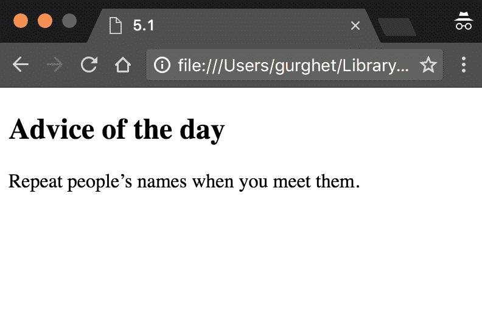
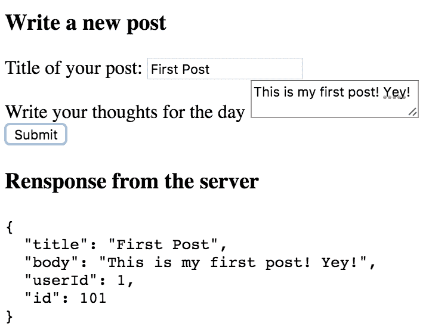
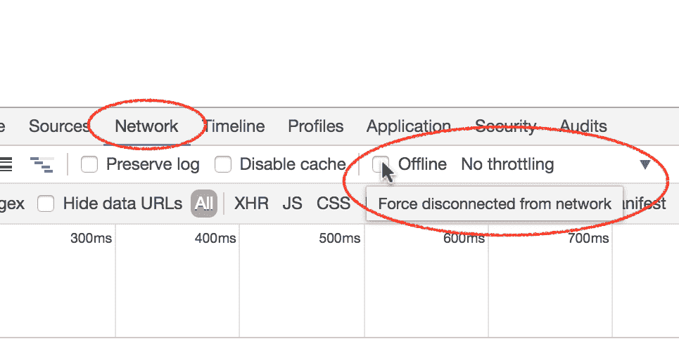
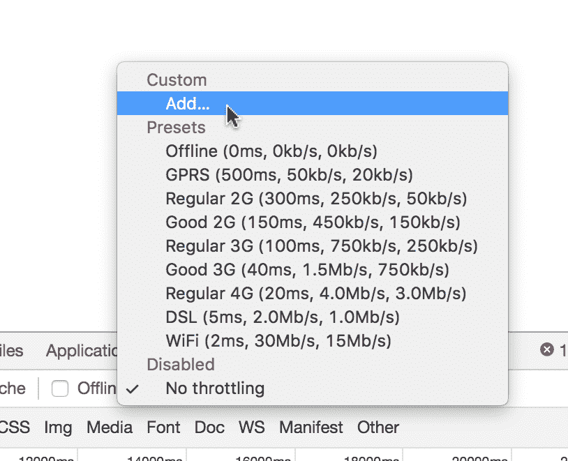

# 第十四章：Vue 与互联网通信

在本章中，将涵盖以下配方：

+   使用 Axios 发送基本的 AJAX 请求

+   在发送之前验证用户数据

+   创建一个表单并将数据发送到服务器

+   在请求期间从错误中恢复

+   创建 REST 客户端（和服务器！）

+   实现无限滚动

+   在发送请求之前处理请求

+   防止 XSS 攻击到您的应用程序

# 介绍

Web 应用程序很少能够独立运行。使它们变得有趣的实际上是它们使我们能够以几年前不存在的创新方式与世界进行交流。

Vue 本身不包含任何机制或库来发起 AJAX 请求或打开网络套接字。因此，在本章中，我们将探讨 Vue 如何与内置机制和外部库进行交互，以连接到外部服务。

您将首先使用外部库发起基本的 AJAX 请求。然后，您将探索一些在表单中发送和获取数据的常见模式。最后，有一些具有真实应用程序的配方以及如何构建 RESTful 客户端。

# 使用 Axios 发送基本的 AJAX 请求

Axios 是 Vue 推荐的用于发起 HTTP 请求的库。它是一个非常简单的库，但它具有一些内置功能，可以帮助您执行常见操作。它实现了使用 HTTP 动词进行请求的 REST 模式，并且还可以在函数调用中处理并发（同时发起多个请求）。您可以在[`github.com/mzabriskie/axios`](https://github.com/mzabriskie/axios)找到更多信息。

# 准备工作

对于这个配方，您不需要对 Vue 有任何特定的了解。我们将使用 Axios，它本身使用 JavaScript promises。如果您从未听说过 promises，您可以在[`developers.google.com/web/fundamentals/getting-started/primers/promises`](https://developers.google.com/web/fundamentals/getting-started/primers/promises)上了解一些基础知识。

# 如何做...

您将构建一个简单的应用程序，每次访问网页时都会给您一条明智的建议。

您需要做的第一件事是在应用程序中安装 Axios。如果您使用 npm，只需发出以下命令：

```js
    npm install axios
```

如果您正在处理单个页面，您可以从 CDN 导入以下文件，网址为[`unpkg.com/axios/dist/axios.js`](https://unpkg.com/axios/dist/axios.js)。

不幸的是，我们将使用的建议服务在 JSFiddle 上无法工作，因为服务运行在 HTTP 上，而 JSFiddle 在 HTTPS 上，你的浏览器很可能会抱怨。你可以在本地 HTML 文件上运行这个教程。

我们的 HTML 如下所示：

```js
<div id="app"> 
  <h2>Advice of the day</h2> 
  <p>{{advice}}</p> 
</div>
```

我们的 Vue 实例如下：

```js
new Vue({ 
  el: '#app', 
  data: { 
    advice: 'loading...' 
  }, 
  created () { 
    axios.get('http://api.adviceslip.com/advice') 
      .then(response => { 
        this.advice = response.data.slip.advice 
      }) 
      .catch(error => { 
        this.advice = 'There was an error: ' + error.message 
      }) 
  } 
})
```

打开你的应用程序，获得一条令人耳目一新的智慧建议：



# 它是如何工作的...

当我们的应用程序启动时，创建的钩子被激活，并将使用 Axios 运行代码。第一行执行一个 GET 请求到 API 端点：

```js
axios.get('http://api.adviceslip.com/advice')
```

这将返回一个 promise。我们可以在任何 promise 上使用`then`方法来处理结果，如果 promise 成功解决：

```js
.then(response => { 
  this.advice = response.data.slip.advice 
})
```

响应对象将包含关于我们请求结果的一些数据。一个可能的响应对象如下：

```js
{ 
  "data": { 
    "slip": { 
      "advice": "Repeat people's name when you meet them.", 
      "slip_id": "132" 
    } 
  }, 
  "status": 200, 
  "statusText": "OK", 
  "headers": { 
    "content-type": "text/html; charset=UTF-8", 
    "cache-control": "max-age=0, no-cache" 
  }, 
  "config": { 
    "transformRequest": {}, 
    "transformResponse": {}, 
    "timeout": 0, 
    "xsrfCookieName": "XSRF-TOKEN", 
    "xsrfHeaderName": "X-XSRF-TOKEN", 
    "maxContentLength": -1, 
    "headers": { 
      "Accept": "application/json, text/plain, */*" 
    }, 
    "method": "get", 
    "url": "http://api.adviceslip.com/advice" 
  }, 
  "request": {} 
}
```

我们导航到我们想要交互的属性；在我们的例子中，我们想要`response.data.slip.advice`，这是一个字符串。我们将字符串复制到实例状态中的建议变量中。

最后一部分是当我们的请求或者第一分支内的代码出现问题时：

```js
.catch(error => { 
  this.advice = 'There was an error: ' + error.message 
})
```

我们将在*在请求期间从错误中恢复*的教程中更深入地探讨错误处理。现在，让我们手动触发一个错误，看看会发生什么。

触发错误的最便宜的方法是在 JSFiddle 上运行应用程序。由于浏览器检测到 JSFiddle 是在安全连接上，而我们的 API 是在 HTTP 上（不安全），现代浏览器会抱怨并阻止连接。你应该看到以下文本：

```js
There was an error: Network Error
```

这只是你可以尝试的许多可能错误之一。考虑到你将 GET 端点编辑为一些不存在的页面：

```js
axios.get('http://api.adviceslip.com/non-existent-page')
```

在这种情况下，你会得到一个 404 错误：

```js
There was an error: Request failed with status code 404
```

有趣的是，即使请求顺利进行，但第一分支中出现错误，你最终会进入错误分支。

将`then`分支更改为这样：

```js
.then(response => { 
  this.advice = undefined.hello 
})
```

众所周知，JavaScript 无法读取未定义对象的“hello”属性：

```js
There was an error: Cannot read property 'hello' of undefined
```

就像我告诉你的那样。

# 在发送用户数据之前验证它的有效性

一般来说，用户讨厌表单。虽然我们无法改变这一点，但我们可以通过提供有关如何填写表单的相关说明来减少他们的挫败感。在这个教程中，我们将创建一个表单，并利用 HTML 标准为用户提供如何完成它的良好指导。

# 准备工作

这个教程不需要先前的知识就可以完成。虽然我们将构建一个表单（*使用 Axios 发送基本 AJAX 请求*教程），但我们将伪造 AJAX 调用并集中在验证上。

# 如何做...

我们将构建一个非常简单的表单：一个用于用户名的字段，一个用于用户电子邮件的字段，以及一个用于提交信息的按钮。

在 HTML 中输入：

```js
<div id="app"> 
  <form @submit.prevent="vueSubmit"> 
    <div> 
      <label>Name</label> 
      <input type="text" required> 
    </div> 
    <div> 
      <label>Email</label> 
      <input type="email" required> 
    </div> 
    <div> 
      <label>Submit</label> 
      <button type="submit">Submit</button> 
    </div> 
  </form> 
</div>
```

Vue 实例很简单，如下所示：

```js
new Vue({ 
  el: '#app', 
  methods: { 
    vueSubmit() { 
      console.info('fake AJAX request') 
    } 
  } 
})
```

运行这个应用程序，尝试提交一个空字段或错误的电子邮件。您应该会看到浏览器本身的帮助：


然后，如果您尝试输入一个无效的电子邮件地址，您将看到以下内容：


# 它是如何工作的...

我们正在使用原生的 HTML5 验证 API，它在内部使用模式匹配来检查我们输入的内容是否符合某些规则。

考虑以下行中的 required 属性：

```js
<input type="text" required>
```

这样可以确保当我们提交表单时，字段实际上是填充的，而在另一个输入元素中使用`type="email"`可以确保内容类似于电子邮件格式。

这个 API 非常丰富，您可以在[`developer.mozilla.org/en-US/docs/Web/Guide/HTML/Forms/Data_form_validation`](https://developer.mozilla.org/en-US/docs/Web/Guide/HTML/Forms/Data_form_validation)上阅读更多。

很多时候，问题在于要利用这个 API，我们需要触发原生验证机制。这意味着我们不能阻止提交按钮的默认行为：

```js
<button type="submit" @click.prevent="vueSubmit">Submit</button>
```

这不会触发原生验证，表单将始终被提交。另一方面，如果我们这样做：

```js
<button type="submit" @click="vueSubmit">Submit</button>
```

表单将被验证，但由于我们没有阻止提交按钮的默认行为，表单将被发送到另一个页面，这将破坏单页面应用程序的体验。

诀窍是在表单级别拦截提交：

```js
<form @submit.prevent="vueSubmit">
```

这样，我们可以拥有表单的原生验证和我们真正喜欢的现代浏览体验。

# 创建一个表单并将数据发送到您的服务器

HTML 表单是与用户交互的标准方式。您可以收集他们的数据以在网站内注册，让他们登录，甚至进行更高级的交互。在这个教程中，您将使用 Vue 构建您的第一个表单。

# 准备工作

这个教程非常简单，但它假设您已经了解 AJAX，并且希望将您的知识应用到 Vue 上。

# 如何做...

假设我们有一个博客，并且我们想写一篇新文章。为此，我们需要一个表单。以下是 HTML 的布局方式：

```js
<div id="app"> 
  <h3>Write a new post</h3> 
  <form> 
    <div> 
      <label>Title of your post:</label> 
      <input type="text" v-model="title"> 
    </div> 
    <div> 
      <label>Write your thoughts for the day</label> 
      <textarea v-model="body"></textarea> 
    </div> 
    <div> 
      <button @click.prevent="submit">Submit</button> 
    </div> 
  </form> 
</div>
```

我们有一个用于标题的框，一个用于我们新帖子的正文的框，以及一个发送我们的帖子的按钮。

在我们的 Vue 实例中，这三个东西以及用户 ID 将成为应用程序状态的一部分：

```js
new Vue({ 
  el: '#app', 
  data: { 
    userId: 1, 
    title: '', 
    body: '' 
  } 
})
```

在这一点上，我们只需要在单击“提交”按钮时向服务器发送数据的方法。由于我们没有服务器，我们将使用**Typicode**提供的非常有用的服务。它基本上是一个虚假的 REST 服务器。我们将发送一个请求，服务器将以真实的方式做出响应，即使实际上什么都不会发生。

这是我们的方法：

```js
methods: { 
  submit () { 
    const xhr = new XMLHttpRequest() 
    xhr.open('post', 'https://jsonplaceholder.typicode.com/posts') 
    xhr.setRequestHeader('Content-Type',  
                         'application/json;charset=UTF-8') 
    xhr.onreadystatechange = () => { 
    const DONE = 4 
    const CREATED = 201 
    if (xhr.readyState === DONE) { 
      if (xhr.status === CREATED) { 
          this.response = xhr.response 
        } else { 
          this.response = 'Error: ' + xhr.status 
        } 
      } 
    } 
    xhr.send(JSON.stringify({ 
      title: this.title, 
      body: this.body, 
      userId: this.userId 
    })) 
  } 
}
```

为了查看服务器的实际响应，我们将把响应变量添加到我们的状态中：

```js
data: { 
  userId: 1, 
  title: '', 
  body: '', 
 response: '...' 
}
```

在我们的 HTML 表单之后，添加以下内容：

```js
<h3>Response from the server</h3> 
<pre>{{response}}</pre>
```

当您启动页面时，您应该能够与服务器进行交互。当您写一篇文章时，服务器将回显该文章并回复帖子 ID：



# 它是如何工作的...

大部分魔法发生在`submit`方法中。在第一行，我们创建了一个`XMLHttpRequest`对象，这是一个用于发出 AJAX 请求的本机 JavaScript 机制：

```js
const xhr = new XMLHttpRequest()
```

然后我们使用`open`和`setRequestHeader`方法来配置一个新的连接；我们要发送一个 POST 请求，并且我们将随之发送一些 JSON：

```js
xhr.open('post', 'http://jsonplaceholder.typicode.com/posts') 
xhr.setRequestHeader('Content-Type', 'application/json;charset=UTF-8')
```

由于我们正在与 RESTful 接口交互，POST 方法意味着我们期望我们的请求修改服务器上的数据（特别是创建一个新的帖子），并且多次发出相同的请求将每次都得到不同的结果（换句话说，我们将创建一个新的、不同的帖子 ID）。

这与更常见的 GET 请求不同，后者不会修改服务器上的数据（除了可能的日志），并且始终会产生相同的结果（假设服务器上的数据在请求之间没有发生变化）。

有关 REST 的更多细节，请查看*创建 REST 客户端（和服务器！）*的内容。

接下来的几行都是关于响应的：

```js
xhr.onreadystatechange = () => { 
  const DONE = 4 
  const CREATED = 201 
  if (xhr.readyState === DONE) { 
    if (xhr.status === CREATED) { 
      this.response = xhr.response 
    } else { 
      this.response = 'Error: ' + xhr.status 
    } 
  } 
}
```

这将在我们的对象发生某种变化时安装一个处理程序。如果`readyState`变为`DONE`，这意味着我们从服务器得到了响应。接下来，我们检查状态码，应该是`201`，表示已创建了一个新资源（我们的新帖子）。如果是这种情况，我们设置放在双大括号中的变量以获得快速反馈。否则，我们将接收到的错误消息放入同一个变量中。

在设置事件处理程序之后，我们需要做的最后一件事是实际发送请求以及我们新帖子的数据：

```js
xhr.send(JSON.stringify({ 
  title: this.title, 
  body: this.body, 
  userId: this.userId 
}))
```

# 更多内容...

另一种解决相同问题的方法是使用 Axios 发送 AJAX 请求。如果你需要了解 Axios 是什么，可以看一下*使用 Axios 发送基本的 AJAX 请求*这个教程。

`submit`方法的代码将变成如下（记得将 Axios 添加为依赖项）：

```js
submit () { 
  axios.post('http://jsonplaceholder.typicode.com/posts', { 
    title: this.title, 
    body: this.body, 
    userId: this.userId 
  }).then(response => { 
    this.response = JSON.stringify(response,null,'  ') 
  }).catch(error => { 
    this.response = 'Error: ' + error.response.status 
  }) 
}
```

这段代码完全等效，但比使用原生浏览器对象更具表现力和简洁。

# 在请求期间从错误中恢复

从计算机的角度来看，对外部服务的请求需要很长时间。从人类的角度来看，就像是把卫星送到木星，然后等待它返回地球。你无法百分之百确定旅行是否会完成，以及旅行实际需要多长时间。网络经常不稳定，最好提前做好准备，以防我们的请求无法成功完成。

# 准备工作

这个教程有点复杂，但并不使用高级概念。然而，你应该熟悉使用 Vue。

我们将在这个教程中使用 Axios。如果你不确定它具体包含什么，可以完成*使用 Axios 发送基本的 AJAX 请求*这个教程。

# 操作步骤

你将为在珠穆朗玛峰上订购比萨的网站建立一个网站。该地区的互联网连接非常差，所以在放弃我们的比萨之前，我们可能需要重试几次。

这是我们的 HTML 代码：

```js
<div id="app"> 
  <h3>Everest pizza delivery</h3> 
  <button @click="order"  
          :disabled="inProgress">Order pizza!</button> 
  <span class="spinner" v-show="inProgress"></span> 
  <h4>Pizza wanted</h4> 
  <p>{{requests}}</p> 
  <h4>Pizzas ordered</h4> 
  <span v-for="pizza in responses"> 
    {{pizza.id}}:{{pizza.req}} 
  </span> 
</div>
```

我们有一个用于下订单的按钮，当订单正在进行时会被禁用--一个正在进行中的订单列表（目前只包含一个订单）和一个已经订购的比萨列表。

我们可以添加一个旋转的小比萨饼来让等待变得更愉快。添加这个 CSS 来让小比萨饼旋转：

```js
@keyframes spin { 
  100% {transform:rotate(360deg);} 
} 
.spinner { 
  width: 1em; 
  height: 1em; 
  padding-bottom: 12px; 
  display: inline-block; 
  animation: spin 2s linear infinite; 
}
```

我们的 Vue 实例将跟踪一些东西；写下这段代码来开始构建实例：

```js
new Vue({ 
  el: '#app', 
  data: { 
    inProgress: false, 
    requests: new Object(null), 
    responses: new Object(null), 
    counter: 0, 
    impatientAxios: undefined 
  } 
})
```

我想要使用 JavaScript 集来处理请求和响应；不幸的是，在 Vue 中，集合不是响应式的；我们可以使用的最接近的东西是一个对象，目前是空的，也就是说，我们正在将请求和响应初始化为空对象。

`impatientAxios`变量将在创建时填充。通常，Axios 会等待浏览器等待响应的时间。由于我们心急，我们将创建一个在 3 秒后断开连接的 Axios：

```js
created () { 
  this.impatientAxios = axios.create({ 
    timeout: 3000  
  }) 
}
```

我们需要构建的最后一件事是订单方法。由于我们没有一个用于实际请求的网络服务器，我们将使用 `http://httpstat.us/200` 端点，它对我们所有的请求都简单地回答 200 OK：

```js
methods: { 
  order (event, oldRequest) { 
    let request = undefined 
    if (oldRequest) { 
      request = oldRequest 
    } else { 
      request = { req: '', id: this.counter++} 
   } 
   this.inProgress = true 
   this.requests[request.id] = request 
   this.impatientAxios.get('http://httpstat.us/200') 
    .then(response => { 
      this.inProgress = false 
      this.responses[request.id] = this.requests[request.id] 
      delete this.requests[request.id] 
    }) 
    .catch(e => { 
      this.inProgress = false 
      console.error(e.message) 
      console.error(this.requests.s) 
      setTimeout(this.order(event, request), 1000) 
    }) 
}
```

为了按预期运行这个程序，用 Chrome 打开它，并用*Cmd* + *Opt* + *I*（在 Windows 上是*F12*）打开开发者工具：


切换到网络选项卡，并打开下拉菜单，你会看到没有节流：

****

点击它以显示下拉菜单：



添加一个名为`Everest`的新自定义节流，下载和上传速度为`1kb/s`，延迟为`1,000`毫秒，如下面的屏幕截图所示：


然后你可以选择那种类型的节流并尝试订购一些披萨。如果你幸运的话，你最终应该能够订购一些，这要归功于 Axios 的持久性。

如果你没有成功或者你的所有披萨都被正确地订购了，尝试调整参数；这个过程中很大一部分实际上是随机的，而且高度依赖于机器。

# 它是如何工作的...

有许多处理不稳定连接的方法，也有许多与 Axios 集成并具有更高级重试和重试策略的库。在这里，我们只看到了一种基本策略，但是像**Patience JS**这样的库有更高级的策略，它们并不难使用。

# 创建一个 REST 客户端（和服务器！）

在这个教程中，我们将学习关于 REST 以及如何构建 REST 客户端。要构建一个 REST 客户端，我们需要一个暴露 REST 接口的服务器；我们也将构建它。等一下！在一本关于 Vue 的书中，一个完整的 REST 服务器只是一个附注？只要跟着做，你就不会失望。

# 准备工作

这个示例在某种意义上相当高级，您需要熟悉客户端和服务器的架构，并且至少听说过或阅读过 REST 接口。您还需要熟悉命令行并安装 npm。您可以在*选择开发环境*示例中了解所有相关信息。

还需要安装 Axios；在本章的第一个示例中可以了解更多信息。

# 如何做...

我还记得几年前，构建 REST 服务器可能需要花费几天甚至几周的时间。您可以使用`Feather.js`，它将快速且（希望是）无痛的。打开命令行并使用以下命令通过 npm 安装它：

```js
    npm install -g feathers-cli
```

之后，创建一个目录，在其中运行服务器，然后进入该目录并启动 Feathers：

```js
    mkdir my-server
    cd my-server
    feathers generate app
```

将所有问题的答案都设置为默认值。当进程完成时，键入以下命令以创建新资源：

```js
 feathers generate service
```

其中一个问题是资源的名称；将其命名为`messages`，但除此之外，其他问题都使用默认值。

使用`exit`命令退出 feathers-cli，并使用以下命令启动新服务器：

```js
    npm start
```

几秒钟后，您的 REST 服务器应该已启动，并且应该正在端口`3030`上进行监听。你能诚实地说这很困难吗？

上述命令序列适用于 Feathers 版本 2.0.0

您可能正在使用另一个版本，但是使用后续版本仍然很容易获得相同的结果；请查看[`feathersjs.com/`](https://feathersjs.com/)上的在线安装指南。

接下来，您将构建一个与服务器无缝通信的 Vue 应用程序。现在，由于服务器通过 HTTP 在本地环境中运行，您将无法使用 JSFiddle，因为它在 HTTPS 上运行，并认为 HTTP 是不安全的。您可以使用之前描述的其他方法，或者使用 HTTP 上的服务，例如[codepen.io](http://codepen.io)或其他服务。

您将编写一个管理便签消息的应用程序。我们希望能够查看、添加、编辑和删除它们。

在 HTML 中键入以下内容：

```js
<div id="app"> 
  <h3>Sticky messages</h3> 
  <ol> 
    <li v-for="message in messages"> 
      <button @click="deleteItem(message._id)">Delete</button> 
      <button @click="edit(message._id, message.text)"> 
        edit 
      </button> 
      <input v-model="message.text"> 
    </li> 
  </ol> 
  <input v-model="toAdd"> 
  <button @click="add">add</button> 
</div>
```

我们的 Vue 实例状态将包括一系列记录的消息，以及要添加到列表中的临时消息：

```js
new Vue({ 
  el: '#app', 
  data: { 
    messages: [], 
    toAdd: '' 
  }, 
})
```

我们要做的第一件事是向服务器请求消息列表。为此编写创建的钩子：

```js
created () { 
  axios.get('http://localhost:3030/messages/') 
    .then(response => { 
      this.messages = response.data.data 
    }) 
},
```

要创建新消息，请编写一个绑定到添加按钮的点击事件的方法，并将输入框中的内容发送到服务器：

```js
methods: { 
  add () { 
    axios.post('http://localhost:3030/messages/', { 
      text: this.toAdd 
    }) 
      .then(response => { 
        if (response.status === 201) { 
          this.messages.push(response.data) 
          this.toAdd = '' 
        } 
      }) 
  } 
}
```

同样，编写一个用于删除消息和编辑消息的方法：

```js
deleteItem (id) { 
  console.log('delete') 
  axios.delete('http://localhost:3030/messages/' + id) 
    .then(response => { 
      if (response.status < 400) { 
        this.messages.splice( 
          this.messages.findIndex(e => e.id === id), 1) 
      } 
    }) 
}, 
edit (id, text) { 
  axios.put('http://localhost:3030/messages/' + id, { 
    text 
  }) 
    .then(response => { 
      if (response.status < 400) { 
        console.info(response.status) 
      } 
    }) 
}
```

启动你的应用程序，你将能够管理你的便利贴消息板：


为了证明你确实在与服务器通信，你可以刷新页面，或者关闭并重新打开浏览器，你的笔记仍然会在那里。

# 它是如何工作的...

**REST**意味着**REpresentational State Transfer**，也就是说你将传输某个资源状态的表示。在实践中，我们使用一组**动词**来传输我们消息状态的表示。

使用 HTTP 协议，我们可以使用以下动词：

| **动词** | **属性** | **描述** |
| --- | --- | --- |
| `GET` | 幂等，安全 | 用于检索资源的表示 |
| `POST` |  | 用于上传新资源 |
| `PUT` | 幂等 | 用于上传现有资源（修改它） |
| `DELETE` | 幂等 | 用于删除资源 |

幂等意味着如果我们两次使用相同的动词，资源不会发生任何变化，而安全意味着根本不会发生任何变化。

在我们的应用程序中，我们只在创建时使用 GET 动词。当我们看到列表因其他操作而改变时，那只是因为我们在前端上反映了服务器上的操作。

POST 动词用于向列表中添加新消息。请注意，它不是幂等的，因为即使在便利贴消息中使用相同的文本，我们仍然会在按下添加按钮时创建一个 ID 不同的新消息。

按下编辑按钮会触发 PUT，而删除按钮，嗯，你可以想象它使用了 DELETE 动词。

Axios 通过使用动词本身来命名其 API 的方法，使其非常清晰。

# 实现无限滚动

无限滚动是使用 Vue 和 AJAX 的一个很好的例子。它也非常受欢迎，可以改善某些类型内容的交互。你将构建一个可以使用无限滚动的随机单词生成器。

# 准备工作

我们将使用 Axios。查看*使用 Axios 发送基本 AJAX 请求*的示例，了解如何安装它及其基本功能。除此之外，你不需要了解太多就可以跟着做。

# 如何做...

为了使我们的应用程序工作，我们将从[`www.setgetgo.com/randomword/get.php`](http://www.setgetgo.com/randomword/get.php)端点请求随机单词。每次你将浏览器指向这个地址，你都会得到一个随机单词。

整个页面将仅由无限单词列表组成。编写以下 HTML：

```js
<div id="app"> 
  <p v-for="word in words">{{word}}</p> 
</div>
```

随着页面向下滚动，单词列表需要增长。所以我们需要两件事：了解用户何时到达页面底部，以及获取新单词。

要知道用户何时到达页面底部，我们在 Vue 实例中添加一个方法：

```js
new Vue({ 
  el: '#app', 
  methods: { 
    bottomVisible () { 
      const visibleHeight = document.documentElement.clientHeight 
      const pageHeight = document.documentElement.scrollHeight 
      const scrolled = window.scrollY 
      const reachedBottom = visibleHeight + scrolled >= pageHeight 
      return reachedBottom || pageHeight < visibleHeight 
    } 
  } 
})
```

如果页面滚动到底部，或者页面本身比浏览器小，这将返回`true`。

接下来，我们需要添加一个机制，将这个函数的结果绑定到一个状态变量`bottom`，并在用户滚动页面时更新它。我们可以在`created`钩子中做到这一点：

```js
created () { 
  window.addEventListener('scroll', () => { 
    this.bottom = this.bottomVisible() 
  }) 
}
```

状态将由`bottom`变量和随机单词列表组成：

```js
data: { 
  bottom: false, 
  words: [] 
}
```

现在我们需要一个方法来向数组中添加单词。将以下方法添加到现有方法中：

```js
addWord () { 
  axios.get('http://www.setgetgo.com/randomword/get.php') 
    .then(response => { 
      this.words.push(response.data) 
      if (this.bottomVisible()) { 
        this.addWord() 
      } 
    }) 
}
```

该方法将递归调用自身，直到页面有足够的单词填满整个浏览器视图。

由于这个方法需要在每次到达底部时被调用，我们将监视底部变量，并在其为`true`时触发该方法。在`data`之后的 Vue 实例中添加以下选项：

```js
watch: { 
  bottom (bottom) { 
    if (bottom) { 
      this.addWord() 
    } 
  } 
}
```

我们还需要在`created`钩子中调用`addWord`方法来启动页面：

```js
created () { 
  window.addEventListener('scroll', () => { 
    this.bottom = this.bottomVisible() 
  }) 
 this.addWord() 
}
```

如果现在启动页面，你将得到一个无限流的随机单词，这在你需要创建新密码时很有用！

# 工作原理…

在这个教程中，我们使用了一个叫做`watch`的选项，它使用以下语法：

```js
watch: { 
 'name of sate variable' (newValue, oldValue) { 
   ... 
  } 
}
```

这是计算属性的对应物，当我们对一些响应式变量的变化后不感兴趣。事实上，我们只是用它来触发另一个方法。如果我们对一些计算结果感兴趣，我们会使用计算属性。

# 在发送请求之前处理请求

这个教程教你如何使用拦截器在请求发送到互联网之前编辑请求。在某些情况下，这可能很有用，比如当你需要在所有请求到服务器时提供授权令牌，或者当你需要一个单一点来编辑 API 调用的执行方式时。

# 准备工作

这个教程使用了 Axios（*使用 Axios 发送基本 AJAX 请求*教程）；除此之外，最好已经完成了*在发送数据之前如何验证用户数据*教程，因为我们将构建一个小型表单进行演示。

# 如何做...

在这个教程中，您将为一个假设的评论系统构建一个脏话过滤器。假设我们网站上有一篇文章可能会引发争论：

```js
<div id="app"> 
  <h3>Who's better: Socrates or Plato?</h3> 
  <p>Technically, without Plato we wouldn't have<br> 
  much to go on when it comes to information about<br> 
  Socrates. Plato ftw!</p>
```

在那篇文章之后，我们放置了一个评论框：

```js
  <form> 
    <label>Write your comment:</label> 
    <textarea v-model="message"></textarea> 
    <button @click.prevent="submit">Send!</button> 
  </form> 
  <p>Server got: {{response}}</p> 
</div>
```

我们还在表单后面添加了一行来调试我们将从服务器获取的响应。

在我们的 Vue 实例中，我们编写所有支持代码将评论发送到我们的服务器，这种情况下，将是[`jsonplaceholder.typicode.com/comments`](http://www.setgetgo.com/randomword/get.php)，一个假的 REST 接口，将表现得像一个真正的服务器。

这是由按下提交按钮触发的 submit 方法：

```js
methods: { 
  submit () { 
    axios.post('http://jsonplaceholder.typicode.com/comments', 
    { 
      body: this.message 
    }).then(response => { 
      this.response = response.data 
    }) 
  } 
}
```

Vue 实例的状态将只有两个变量：

```js
data: { 
  message: '', 
  response: '...' 
}
```

像往常一样，我们希望将其挂载到`<div>`应用程序中：

```js
new Vue({ 
  el: '#app', 
...
```

一旦实例被挂载，我们希望在 Axios 中安装单词过滤器；为此，我们利用 Vue 的`mounted`钩子：

```js
mounted () { 
  axios.interceptors.request.use(config => { 
    const body = config.data.body.replace(/punk/i, '***') 
    config.data.body = body 
    return config 
  }) 
}
```

现在我们可以启动我们的应用程序并尝试写我们的脏话评论：


# 它是如何工作的...

在`mounted`钩子中，我们正在安装所谓的`拦截器`。特别是一个请求拦截器，这意味着它将获取我们的请求并在发送到互联网之前对其进行操作：

```js
axios.interceptors.request.use(config => { 
  const body = config.data.body.replace(/punk/i, '***') 
  config.data.body = body 
  return config 
})
```

`config`对象包含许多我们可以编辑的内容。它包含头部和 URL 参数。它还包含 Axios 配置变量。您可以查看 Axios 文档以获取最新列表。

我们正在获取随 POST 请求发送的数据部分，并检查是否存在`punk`这个词。如果是这样，它将被替换为星号。返回的对象将成为当前请求的新配置。

# 防止 XSS 攻击到您的应用程序

在没有考虑安全性的情况下编写应用程序将不可避免地导致漏洞，特别是如果它必须在 Web 服务器上运行。**跨站脚本**（**XSS**）是当今最流行的安全问题之一；即使您不是安全专家，您也应该了解它的工作原理以及如何在 Vue 应用程序中防止它。

# 准备工作

这个步骤不需要任何先前的知识，只需要了解 Axios。您可以在*使用 Axios 发送基本的 AJAX 请求*中找到更多关于 Axios 以及如何安装它的信息。

# 如何做...

您应该首先发现后端是如何给您 CSRF 令牌的（在下一段中会详细介绍）。我们假设服务器会在您的浏览器中放置一个名为 XSRF-TOKEN 的 cookie。

您可以模拟您的服务器，在浏览器控制台中使用`document.cookie = 'XSRF-TOKEN=abc123'`命令设置一个 cookie（在开发者工具中）。

Axios 会自动读取这样的 cookie，并在下一次请求中传输它。

考虑到我们在代码中调用了一个 Axios 的`get`请求，如下所示：

```js
methods: { 
  sendAllMoney () { 
    axios.get('/sendTo/'+this.accountNo) 
  } 
}
```

Axios 会获取该 cookie，并在请求中添加一个名为 X-XSRF-TOKEN 的新标头。您可以通过在 Chrome 的开发者工具的网络选项卡中点击请求的名称来查看这样的标头：


# 它是如何工作的...

为了防止 XSS 攻击，您必须确保没有用户输入会出现在您的应用程序中。这意味着您必须非常小心地使用`v-html`属性（*输出原始 HTML*的方法）。

不幸的是，您无法控制页面外发生的事情。如果您的用户之一收到了包含与您的应用程序中的操作相对应的链接的虚假电子邮件，那么点击邮件中的链接将触发该操作。

让我们举个具体的例子；您开发了一个银行应用*VueBank*，您的应用用户收到了以下虚假电子邮件：

```js
Hello user!
Click here to read the latest news.
```

正如您所看到的，这封邮件甚至与我们的应用无关，`here`超链接被隐藏在邮件本身的 HTML 中。实际上，它指向`http://vuebank.com?give_all_my_money_to_account=754839534`地址。

如果我们已经登录了 VueBank，那么链接可能会立即生效。这对我们的财务状况不利。

为了防止这类攻击，我们应该让后端为我们生成一个**CSRF**（**跨站点请求伪造**）令牌。我们将获取该令牌并将其发送到请求中，以证明该请求是由用户发起的。前面的链接将变成

`http://vuebank.com?give_all_my_money_to_account=754839534&csrf=s83Rnj`。

由于令牌每次都是随机生成的，所以邮件中的链接无法被正确伪造，因为攻击者不知道服务器给网页的令牌。

在 Vue 中，我们使用 Axios 来发送令牌。通常，我们不会将其作为链接的一部分发送，而是作为请求的标头；实际上，Axios 会为我们执行此操作，并在下一个请求中自动放入令牌。

您可以通过设置`axios.defaults.xsrfCookieName`变量来更改 Axios 将拾取的 cookie 的名称，并且您可以通过编辑`axios.defaults.xsrfHeaderName`变量来更改将返回令牌的标头的名称。
