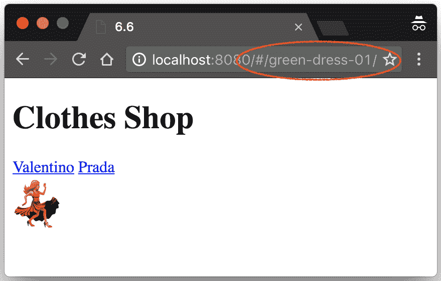
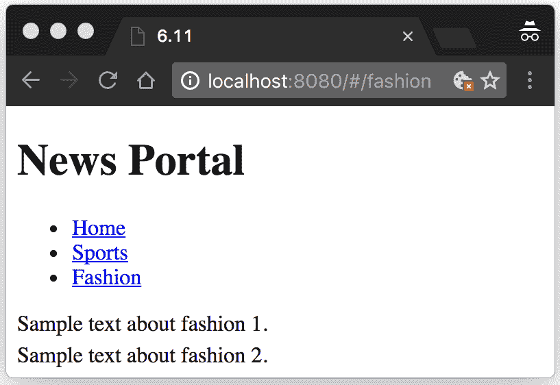

# 第十五章：单页面应用程序

在本章中，将涵盖以下内容：

+   使用 vue-router 创建 SPA

+   在切换路由之前获取数据

+   使用命名动态路由

+   在页面中有多个 router-view

+   按层次结构组合您的路由

+   使用路由别名

+   在您的路由之间添加过渡

+   管理路由的错误

+   为加载页面添加进度条

+   如何重定向到另一个路由

+   在点击返回时保存滚动位置

# 介绍

许多现代应用程序都基于 SPA 或单页面应用程序模型。从用户的角度来看，这意味着整个网站看起来类似于单个页面中的应用程序。

这很好，因为如果做得正确，它会增强用户体验，主要是减少等待时间，因为没有新页面需要加载-整个网站都在一个页面上。这就是 Facebook、Medium、Google 和许多其他网站的工作方式。

URL 不再指向 HTML 页面，而是指向应用程序的特定状态（通常看起来像不同的页面）。在实践中，在服务器上，假设您的应用程序位于`index.html`页面内，这是通过将请求“关于我”的用户重定向到`index.html`来实现的。

后一页将采用 URL 的后缀，并将其解释为路由，从而创建一个类似页面的具有传记信息的组件。

# 使用 vue-router 创建 SPA

Vue.js 通过其核心插件 vue-router 实现了 SPA 模式。对于 vue-router，每个路由 URL 对应一个组件。这意味着我们将告诉 vue-router 当用户转到特定 URL 时如何行为，以其组件为基础。换句话说，在这个新系统中，每个组件都是旧系统中的一个页面。

# 准备工作

对于这个配方，您只需要安装 vue-router 并对 Vue 组件有一些了解。

要安装 vue-router，请按照[`router.vuejs.org/en/installation.html`](https://router.vuejs.org/en/installation.html)上的说明进行操作。

如果您正在使用 JSFiddle 进行跟踪，您可以添加类似于[`unpkg.com/vue-router/dist/vue-router.js`](https://unpkg.com/vue-router/dist/vue-router.js)的链接。

# 如何做…

我们正在为一家餐厅准备一个现代网站，并且将使用 SPA 模式。

网站将包括三个页面：主页、餐厅菜单和酒吧菜单。

整个 HTML 代码将如下所示：

```js
<div id="app">
  <h1>Choppy's Restaurant</h1>
  <ul>
    <li>Home</li>
    <li>Menu</li>
    <li>Bar</li>
  </ul>
  <router-view></router-view>
</div>
```

`<router-view>`组件是 vue-router 的入口点。它是组件显示为页面的地方。

列表元素将成为链接。目前，它们只是列表元素；要将它们转换为链接，我们可以使用两种不同的语法。将第一个链接包装如下行：

```js
<li><router-link to="/">Home</router-link></li>
```

另一个例子如下：

```js
<li><router-link to="/menu">Menu</router-link></li>
```

我们还可以使用另一种语法（用于“Bar”链接）：

```js
<li>
  <router-link
    tag="li" to="/bar"
      :event="['mousedown', 'touchstart']"
    >
    <a>Bar</a>
  </router-link>
</li>
```

这种更冗长但更明确的语法可以用来将自定义事件绑定到特定路由。

为了告诉 Vue 我们要使用 vue-router 插件，在 JavaScript 中写入以下内容：

```js
Vue.use(VueRouter)
```

我们在开头列出的三个页面部分将由这三个虚拟组件扮演（将它们添加到 JavaScript 中）：

```js
const Home = { template: '<div>Welcome to Choppy's</div>' }
const Menu = { template: '<div>Today we have cookies</div>' }
const Bar = { template: '<div>We serve cocktails</div>' }
```

现在，您可以创建路由器了。代码如下：

```js
const router = new VueRouter({})
```

这个路由器并没有做太多事情；我们需要添加路由（对应 URL）和它们关联的组件：

```js
const router = new VueRouter({
 routes: [ { path: '/', component: Home }, { path: '/menu', component: Menu }, { path: '/bar', component: Bar } ] })
```

现在我们的应用几乎完成了；我们只需要声明一个简单的`Vue`实例：

```js
new Vue({
  router,
  el: '#app'
})
```

我们的应用现在可以工作了；在启动之前，添加这个 CSS 规则以获得稍微更好的反馈：

```js
a.router-link-active, li.router-link-active>a {
  background-color: gainsboro;
}
```

打开应用并点击“Bar”链接时，您应该看到类似以下截图的内容：


# 工作原理…

您的程序的第一步是将 vue-router 注册为插件。而 vue-router 则注册路由（URL 的一部分）并将组件连接到每个路由。

当我们第一次访问应用程序时，浏览器的 URL（您无法在 JSFiddle 内部看到它在变化，因为它在一个 iframe 内部）将以`index.html/#/`结尾。井号后面的所有内容都是 vue-router 的路由。在这种情况下，它只是一个斜杠（`/`），因此匹配第一个主页路由。

当我们点击链接时，`<router-view>`的内容会根据我们与该路由关联的组件而改变。

# 还有更多…

敏锐的读者肯定会发现可以解释为错误的地方——在运行应用程序之前，我们添加了一些 CSS 样式。每当页面对应于实际指向的链接时，`.router-link-active`类会自动注入到`<router-link>`组件中。

当我们点击“菜单和栏”时，背景颜色会改变，但似乎仍然被选中为主页链接。这是因为`<router-link>`组件执行的匹配不是**精确**的。换句话说，`/bar`和`/menu`包含`/`字符串，因此`/`总是匹配。

一个快速的解决方法是添加属性，与第一个`<router-link>`完全相同：

```js
<li><router-link to="/" exact>Home</router-link></li>
```

现在，只有当路由完全匹配主页链接时，“主页”链接才会被突出显示。

另一个需要注意的事情是规则本身：

```js
a.router-link-active, li.router-link-active>a {
  background-color: gainsboro;
}
```

为什么我们匹配两个不同的东西？这取决于你如何编写路由链接。

```js
<li><router-link to="/" exact>Home</router-link></li>
```

上述代码将被翻译成以下 DOM 部分：

```js
<li><a href="#/" class="router-link-active">Home</a></li>
```

而：

```js
<router-link tag="li" to="/" exact>Home</router-link>
```

变成：

```js
<li class="router-link-active">Home</li>
```

请注意，在第一种情况下，类被应用到子锚点元素；在第二种情况下，它被应用到父元素。

# 在切换路由之前获取数据

在 Vue 的上一个版本中，我们有一个专门的方法从互联网获取数据，然后再改变路由。在 Vue 2 中，我们有一个更通用的方法，它将在切换路由之前处理这个问题，可能还有其他事情。

# 准备工作

要完成这个教程，你应该已经了解了 vue-router 的基础知识以及如何进行 AJAX 请求（更多内容请参见最后一章）。

# 操作步骤…

我们将编写一个简单的网页作品集，由两个页面组成：主页和关于我页面。

对于这个教程，我们需要将 Axios 作为一个依赖项添加进去。

基本布局从以下 HTML 代码中清晰可见：

```js
<div id="app">
  <h1>My Portfolio</h1>
  <ul>
    <li><router-link to="/" exact>Home</router-link></li>
    <li><router-link to="/aboutme">About Me</router-link></li>
  </ul>
  <router-view></router-view>
</div>
```

在 JavaScript 中，你可以开始构建你的`AboutMe`组件：

```js
const AboutMe = {
  template: `<div>Name:{{name}}<br>Phone:{{phone}}</div>`
}
```

它将只显示一个姓名和一个电话号码。让我们在组件的`data`选项中声明这两个变量，如下所示：

```js
data () {
  return {
    name: undefined,
    phone: undefined  
  } 
}
```

在实际加载组件到场景之前，vue-router 将在我们的对象中查找一个名为`beforeRouteEnter`的选项；我们将使用这个选项从服务器加载姓名和电话。我们使用的服务器将提供一些虚假数据，仅用于显示一些内容，如下所示：

```js
beforeRouteEnter (to, from, next) {
  axios.post('https://schematic-ipsum.herokuapp.com/', {
    "type": "object",
    "properties": {
      "name": {
        "type": "string",
        "ipsum": "name"
      },
      "phone": {
        type": "string",
        "format": "phone"
      }
    }
  }).then(response => {
    next(vm => {
      vm.name = response.data.name
      vm.phone = response.data.phone 
    })
  })
}
```

对于另一个组件，主页，我们将只写一个小组件作为占位符：

```js
const Home = { template: '<div>This is my home page</div>' }
```

接下来你需要注册`router`和它的`paths`：

```js
Vue.use(VueRouter)
const router = new VueRouter({
  routes: [
    { path: '/', component: Home },
    { path: '/aboutme', component: AboutMe },  
  ] 
})
```

当然，你还需要注册一个`Vue`根实例，如下所示：

```js
new Vue({
  router,
  el: '#app'
})
```

当你启动应用程序并点击“关于我”链接时，你应该看到类似于这样的东西：


您会注意到当您点击链接时页面不会重新加载，但显示生物信息仍然需要一些时间。这是因为它正在从互联网获取数据。

# 它是如何工作的…

`beforeRouteEnter`钩子接受三个参数：

+   `to`：这是一个代表用户请求的路由的`Route`对象。

+   from：这也是一个代表当前路由的`Route`对象。这是用户在出现错误时将保留在的路由。

+   `next`：这是一个我们可以在准备好切换路由时使用的函数。调用这个函数并传入 false 将阻止路由的改变，并且在出现错误时非常有用。

在调用前面的函数时，我们使用 Axios 调用了一个 web 服务，该服务提供了一个名称和一个电话号码的字符串。

当我们在这个钩子里时，重要的是要记住我们没有访问这个。这是因为这个钩子在组件实际实例化之前运行，所以没有`this`可以引用。

当服务器响应时，我们在`then`函数中，并且想要分配从服务器返回的名称和电话，但是，正如所说，我们无法访问这个。下一个函数接收到我们组件的引用作为参数。我们使用这个来将变量设置为接收到的值：

```js
...
}).then(response => {
  next(vm => {
    vm.name = response.data.name
    vm.phone = response.data.phone
  })
})
```

# 使用命名动态路由

手动注册所有路由可能会耗费时间，而且当路由事先不知道时，这是不可能的。vue-router 允许您使用参数注册路由，这样您就可以为数据库中的所有对象创建链接，并覆盖其他用户选择路由的用例，遵循某种模式，这将导致手动注册太多的路由。

# 准备工作

除了 vue-router 的基础知识（参考*使用 vue-router 创建 SPA*配方），你不需要任何额外的信息来完成这个配方。

# 如何做…

我们将开设一个有十种不同菜品的在线餐厅。我们将为每道菜创建一个路由。

我们网站的 HTML 布局如下：

```js
<div id="app">
  <h1>Online Restaurant</h1>
  <ul>
    <li>
      <router-link :to="{ name: 'home' }" exact>
        Home
      </router-link>
    </li>
    <li v-for="i in 10">
      <router-link :to="{ name: 'menu', params: { id: i } }">
        Menu {{i}}
      </router-link>
    </li>
    </ul>
  <router-view class="view"></router-view>
</div>
```

这将创建 11 个链接，一个用于主页，十个用于菜品。

在 JavaScript 部分注册`VueRouter`后，代码如下：

```js
Vue.use(VueRouter)
```

创建两个组件；一个将是主页的占位符：

```js
const Home = { template: `
  <div>
    Welcome to Online Restaurant
  </div>
` }
```

其他路由将连接到一个`Menu`组件：

```js
const Menu = { template: `
  <div>
    You just ordered
    
  </div>
` }
```

在前面的组件中，我们使用`$route`引用全局路由对象，并从 URL 中获取`id`参数。`Lorempixel.com`是一个提供示例图片的网站。我们为每个`id`连接不同的图片。

最后，使用以下代码创建路由本身：

```js
const router = new VueRouter({
  routes: [
    { path: '/', name:'home', component: Home }, 
    { path: '/menu/:id', name: 'menu', component: Menu },
  ]
})
```

你可以看到菜单的路径包含`/:id`，这是`id`参数在 URL 中出现的占位符。

最后，写一个根`Vue`实例：

```js
new Vue({
  router,
  el: '#app'
})
```

现在可以启动应用程序，应该能够看到所有的菜单项。点击其中任何一个应该点菜：


# 它是如何工作的…

代码的两个主要部分有助于创建不同菜品的路由。

首先，我们使用冒号语法注册了一个通用路由，并为其分配了一个名称，代码如下：

```js
{ path: '/menu/:id', name: 'menu', component: Menu }
```

这意味着我们可以有一个以`/menu/82`结尾的 URL，而`Menu`组件将显示，并且`$route.params.id`变量设置为`82`。因此，下一行应该根据以下进行更改：

```js

```

在渲染的 DOM 中，前一行将被以下行替换：

```js

```

不要在现实生活中没有这样的图片这个事实上介意。

注意，我们还为这个路由指定了一个名称。这并不是严格必要的，但它使我们能够编写代码的第二个主要部分，如下所示：

```js
<router-link :to="{ name: 'menu', params: { id: i } }">
  Menu {{i}}
</router-link>
```

我们可以传递一个对象给`to`属性，而不是写一个字符串，并指定`params`。在我们的例子中，`param`由`v-for`包装给出。这意味着，例如，在`v-for`的第四个循环中：

```js
<router-link :to="{ name: 'menu', params: { id: 4} }">
  Menu 4
</router-link>
```

这将导致 DOM 如下：

```js
<a href="#/menu/4" class="">Menu 4</a>
```

# 在你的页面中有多个 router-view

拥有多个`<router-view>`可以让你拥有可以用更复杂布局组织的页面。例如，你可以有一个侧边栏和主视图。这个食谱就是关于这个的。

# 准备工作

这个食谱没有使用任何高级概念。建议你熟悉 vue-router 并学习如何安装它。不过，可以去本章的第一个食谱了解更多信息。

# 如何做…

这个食谱将使用大量代码来阐明观点。不过，不要灰心，机制真的很简单。

我们将建立一个二手硬件商店。我们将有一个主视图和一个侧边栏；这些将是我们的路由视图。侧边栏将包含我们的购物清单，这样我们总是知道我们在购物什么，不会有任何干扰。

整个 HTML 代码非常简短，因为它只包含一个标题和两个`router-view`组件：

```js
<div id="app">
  <h1>Second-Hand Hardware</h1>
    <router-view name="list"></router-view>
    <router-view></router-view>
</div>
```

在这种情况下，列表被命名为`router-view`。第二个没有名称；因此，默认情况下被命名为`Vue`。

在 JavaScript 中注册`vue-router`：

```js
Vue.use(VueRouter)
```

之后，注册路由：

```js
const router = new VueRouter({
  routes: [
    { path: '/',
      components: {
        default: Parts,
        list: List
      }
    },
    { path: '/computer',
      components: {
        default: ComputerDetail,
        list: List
      }
    }
  ]
})
```

组件不再是单个对象；它已经成为一个包含两个组件的对象：一个用于`list`，另一个用于默认的`router-view`。

在路由代码之前编写`list`组件，如图所示：

```js
const List = { template: `
  <div>
    <h2>Shopping List</h2>
      <ul>
        <li>Computer</li>
      </ul>
  </div>
` }
```

这将只显示计算机作为我们应该记得购买的物品。

部分组件如下；在`router`代码之前编写它：

```js
const Parts = { template: `
  <div>
    <h2>Computer Parts</h2>
    <ul>
      <li><router-link to="/computer">Computer</router-link></li>
      <li>CD-ROM</li>
    </ul>
  </div>
` }
```

这包含一个链接，可以查看有关出售计算机的更多信息；下一个组件绑定到该页面，因此在`router`代码之前编写它：

```js
const ComputerDetail = { template: `
  <div>
    <h2>Computer Detail</h2>
    <p>Pentium 120Mhz, CDs sold separately</p>
  </div>
` }
```

当然，不要忘记添加`Vue`实例：

```js
new Vue({
  router,
  el: '#app'
})
```

当你启动应用程序时，你应该看到两个路由视图一个在另一个上面。如果你想让它们并排，你可以添加一些 CSS 样式：


# 工作原理…

在页面中添加`<router-view>`组件时，你只需要记住在路由注册期间添加一个名称来引用它：

```js
<router-view name="view1"></router-view>
<router-view name="view2"></router-view>
<router-view></router-view>
```

如果你没有指定名称，路由将被称为默认路由：

```js
routes: [
  { path: '/',
    components: {  
      default: DefaultComponent,
      view1: Component1,
      view2: Component2
    }
  }
]
```

这样，组件将显示在它们各自的`router-view`元素中。

如果你没有为命名视图指定一个或多个组件，与该名称关联的`router-view`将为空。

# 按层次组织您的路由

在许多情况下，你的网站的组织树可能会很复杂。在某些情况下，有一个明确的分层组织，你可以遵循并使用嵌套路由，vue-routes 可以帮助你保持一切井然有序。最好的情况是 URL 的组织方式与组件的嵌套方式完全对应。

# 准备就绪

在这个教程中，你将使用 Vue 的组件和其他基本功能。你还将使用动态路由。去查看*使用命名动态路由*教程，了解更多信息。

# 如何做…

在这个教程中，你将为一个虚构的世界建立一个在线会计网站。我们将有两个用户--`Stark`和`Lannister`--我们将能够看到这两个用户拥有多少黄金和士兵。

我们网站的 HTML 布局如下：

```js
<div id="app">
  <h1>Kindoms Encyclopedia</h1>
  <router-link to="/user/Stark/">Stark</router-link>
  <router-link to="/user/Lannister/">Lannister</router-link>
  <router-view></router-view>
</div>
```

我们有一个标题和两个链接--一个是`Stark`，一个是`Lannister`--最后是`router-view`元素。

我们将`VueRouter`添加到插件中：

```js
Vue.use(VueRouter)
```

然后，我们注册`routes`：

```js
const router = new VueRouter({
  routes: [
    { path: '/user/:id', component: User,
      children: [ 
        {
          path: 'soldiers',
          component: Soldiers
        },
        {
          path: 'gold',
          component: Gold
        }
      ]
    }
  ]
})
```

我们所说的是注册一个动态路由`/user/:id`，并且在`User`组件内部将有另一个 router-view，其中将包含 gold 和 soldiers 的嵌套路径。

刚才提到的三个组件是按照所示编写的；在路由代码之前添加它们：

```js
const User = { template: `
  <div class="user">
    <h1>Kindoms Encyclopedia</h1>
    User {{$route.params.id}}
    <router-link to="gold">Gold</router-link>
    <router-link to="soldiers">Soldiers</router-link>
    <router-view></router-view>
  </div>
`}
```

正如预期的那样，在`User`组件内部有另一个 router-view 入口，将包含嵌套的`routes`组件。

然后，在路由代码之前编写`Soldiers`和`Gold`组件：

```js
const Soldiers = { template: `
  <div class="soldiers">
    <span v-for="soldier in $root[$route.params.id].soldiers"> 

    </span>
  </div>
`}
const Gold = { template: `
   div class="gold">
    <span v-for="coin in $root[$route.params.id].gold">

    </span>
  </div>
`}
```

这些组件将显示与 Vue 根实例数据选项内的 gold 或 soldiers 变量一样多的表情符号。

这是`Vue`根实例的样子：

```js
new Vue({
  router,
  el: '#app',
  data: {
    Stark: {
      soldiers: 100,
      gold: 50  
    },
    Lannister: {
      soldiers: 50,
      gold: 100
    }
  }
})
```

启动应用程序将使您能够直观地表示两个用户的金币和士兵数量：


# 工作原理…

为了更好地理解嵌套路由的工作原理，有必要看一下以下图表：


我们的路由中只有两个级别。第一个级别，即顶级，由大包装矩形表示，对应于`/user/:id`路由，这意味着每个潜在匹配的 ID 都在同一级别。

相反，内部矩形是一个嵌套路由和嵌套组件。它对应于路由 gold 和 Gold 组件。

当嵌套`routes`对应于嵌套组件时，这是正确的选择。还有另外两种情况需要考虑。

当我们有嵌套组件但没有嵌套路由时，我们可以在嵌套路由前加上斜杠`/`。这将使其表现得像顶级路由。

例如，考虑将我们的代码更改为以下内容：

```js
const router = new VueRouter({
  routes: [
    { path: '/user/:id', component: User,
      children: [
        {
          path: 'soldiers',
          component: Soldiers
        },
        {
          path: '/gold',
          component: Gold
        }
      ] 
    }
  ]
})
```

在`/gold`路由前加上前缀将使`Gold`组件在我们将浏览器指向`/gold`URL 时出现，而不是`/user/Lannister/gold`（在这种情况下将导致错误和空白页面，因为用户未指定）。

另一种情况是有嵌套的`routes`但同一级别没有组件。在这种情况下，只需使用常规语法注册路由。

# 使用路由别名

有时需要有多个指向同一页面的 URL。这可能是因为页面已更改名称，或者因为页面在站点的不同部分中被称为不同的名称。

特别是当页面更改名称时，同样重要的是在许多设置中保留以前的名称。链接可能会断裂，页面可能会从网站的某些部分变得无法访问。在这个食谱中，你将防止这种情况发生。

# 准备工作

对于这个食谱，你只需要对 vue-router 组件有一些了解（如何安装和基本操作）。有关 vue-router 的更多信息将从*使用 vue-router 创建单页应用*食谱开始。

# 如何做…

假设我们有一个时尚网站，负责给服装命名的员工 Lisa 为两件衣服创建了两个新链接：

```js
<router-link to="/green-dress-01/">Valentino</router-link>
<router-link to="/green-purse-A2/">Prada</router-link>
```

开发人员在 vue-router 中创建相应的路由：

```js
const router = new VueRouter({
  routes: [
    {
      path: '/green-dress-01',
      component: Valentino01
    },
    {
      path: '/green-purse-A2',
      component: PradaA2
    }
  ]
})
```

后来发现这两件物品不是绿色的，而是红色的。Lisa 并不怪罪，因为她是色盲。

现在你负责更改所有链接以反映列表的真实颜色。你要做的第一件事是改变链接本身。在你编辑后，HTML 布局看起来是这样的：

```js
<div id="app">
  <h1>Clothes Shop</h1>
  <router-link to="/red-dress-01/">Valentino</router-link>
  <router-link to="/red-purse-A2/">Prada</router-link>
  <router-view></router-view>
</div>
```

你向`Vue`添加`VueRouter`插件：

```js
Vue.use(VueRouter)
```

然后，注册新的`routes`以及旧的`aliases`：

```js
const router = new VueRouter({
  routes: [
    {
      path: '/red-dress-01',
      component: Valentino01,
      alias: '/green-dress-01'
    },
    {
      path: '/red-purse-A2',
      component: PradaA2,
      alias: '/green-purse-A2'
    }
  ]
})
```

这些组件看起来是这样的：

```js
const Valentino01 = { template: '<div class="emoji"></div>' }
const PradaA2 = { template: '<div class="emoji"></div>' }
```

在启动应用程序之前，请记住实例化一个`Vue`实例：

```js
new Vue({
  router,
  el: '#app'
})
```

你可以添加一个 CSS 规则，使表情符号看起来像图片，就像下面的截图所示：

```js
.emoji {
  font-size: 3em;
}
```



# 工作原理…

即使我们改变了所有的链接，我们也无法控制其他实体如何链接到我们的页面。对于搜索引擎，比如 Google，没有办法告诉它们删除对旧页面的链接并使用新页面。这意味着如果我们不使用别名，我们可能会在形式上遭受大量的坏名声，包括损坏的链接和 404 页面；在某些情况下，甚至是我们支付给链接到一个不存在页面的广告商。

# 在你的路由之间添加过渡效果

我们在*过渡和动画*中详细探讨了过渡效果。在这里，我们将在更改路由时使用它们，而不是更改元素或组件。同样的观察结果在这里也适用。

# 准备工作

在尝试这个食谱之前，我强烈建议你完成*过渡和动画*中的一些食谱，以及这个食谱。这个食谱是到目前为止学到的概念的混合体。

# 如何做…

在这个教程中，我们将为一个鬼魂餐厅建立一个网站。它与普通餐厅的网站并没有太大的不同，除了页面必须淡出而不是立即出现的要求。

让我们先写一些 HTML 布局：

```js
<div id="app">
  <h1>Ghost's Restaurant</h1>
  <ul>
    <li><router-link to="/">Home</router-link></li>
    <li><router-link to="/menu">Menu</router-link></li>  
  </ul>
  <transition mode="out-in">
  <router-view></router-view>
  </transition>
</div>
```

请注意，我们用一个`transition`标签包裹了主路由显示端口。设置了`out-in`模式，因为我们希望消失的组件的动画在另一个组件出现之前完成。如果我们没有设置这个，两个淡出的组件会在短暂的时间内叠加在一起。有关更详细的讨论，您可以参考*在过渡中让元素离开之前进入阶段*的教程。

让我们创建两个页面/组件：

```js
const Home = { template: '<div>Welcome to Ghost's</div>' }
const Menu = { template: '<div>Today: invisible cookies</div>' }
```

现在，让我们注册`routes`：

```js
Vue.use(VueRouter)
const router = new VueRouter({
  routes: [
    { path: '/', component: Home },
    { path: '/menu', component: Menu }
  ]
})
```

在启动应用程序之前，实例化一个`Vue`对象：

```js
new Vue({
  router,
  el: '#app'
})
```

为了使过渡效果生效，您需要添加一些 CSS 规则：

```js
.v-enter-active, .v-leave-active {
  transition: opacity .5s;
}
.v-enter, .v-leave-active {
  opacity: 0
}
```

现在启动您的应用程序。您成功地在页面切换之间添加了一个淡出过渡。

# 它是如何工作的…

把整个`<router-view>`包裹在一个过渡标签中将为所有组件执行相同的过渡。

如果我们想为每个组件设置不同的过渡，我们有另一种选择：我们必须将单独的组件包裹在过渡中。

比如说，我们有两个过渡效果：诡异和美味。我们希望在`Home`组件出现时应用第一个过渡效果，在`Menu`组件出现时应用第二个过渡效果。

我们需要修改我们的组件，如下所示：

```js
const Home = { template: `
  <transition name="spooky">
    <div>Welcome to Ghost's</div>
  </transition>
` }
const Menu = { template: `
  <transition name="delicious">
    <div>Today: insisible cookies!</div>
  </transition>
` }
```

# 为您的路由管理错误

如果我们去的页面找不到或者不起作用，去链接就没有太多意义。传统上，当发生这种情况时，我们会看到一个错误页面。在 SPA 中，我们更加强大，可以阻止用户完全进入那里，并显示一个礼貌的消息，说明页面不可用。这极大地增强了用户体验，因为用户可以立即采取其他行动，而无需返回。

# 准备工作

为了跟上进度，您应该完成*在切换路由之前获取数据*的教程。

这个教程将在此基础上进行，并假设您已经将所有相关的代码放在了适当的位置。

# 如何做…

正如所说，我们将编辑*在切换路由之前获取数据*教程的结果代码来处理错误。只是为了让您记得，当我们去到`/aboutme`页面时，我们正在从互联网上加载信息。如果信息不可用，我们希望避免进入该页面。

对于这个配方，添加 Axios 作为依赖项，就像在以前的配方中一样。

首先，使用突出显示的代码丰富 HTML 布局：

```js
<div id="app">
  <h1>My Portfolio</h1>
  <ul>
    <li><router-link to="/" exact>Home</router-link></li>
    <li><router-link to="/aboutme">About Me</router-link></li>
  </ul>
  <router-view></router-view>
 <div class="toast" v-show="showError"> There was an error </div> </div>
```

这是一个吐司消息，每当出现错误时都会出现在屏幕上。使用这个 CSS 规则为它添加一些样式：

```js
div.toast {
  width: 15em;
  height: 1em;
  position: fixed;
  bottom: 1em;
  background-color: red;
  color: white;
  padding: 1em;
  text-align: center;
}
```

接下来你想做的事情是有一个全局机制来将`showError`设置为`true`。在 JavaScript 代码的顶部，声明`vm`变量：

```js
let vm
```

然后，将我们的`Vue`根实例分配给它：

```js
vm = new Vue({
  router,
  el: '#app',
 data: { showError: false } })
```

我们还将`showError`变量添加到数据选项中。

最后要做的事情实际上是在显示生物信息之前管理我们的数据检索错误。

将突出显示的代码添加到`beforeRouteEnter`钩子中：

```js
beforeRouteEnter (to, from, next) {
  axios.post('http://example.com/', {
    "type": "object",
    "properties": {
      "name": {
        "type": "string",
        "ipsum": "name"
      },
      "phone": {
        "type": "string",
        "format": "phone"
      }
    }
  }).then(response => {
  next(vm => {
    vm.name = response.data.name
    vm.phone = response.data.phone
  })
}).catch(error => {
 vm.showError = true next(false) }) }
```

接下来的（false）命令将使用户停留在原地，我们还编辑了端点到`example.com`，它将在`POST`请求上返回一个错误代码：


# 它是如何工作的...

Axios 将从`example.com`接收到一个错误，这将触发对我们调用 post 时创建的 promise 的拒绝。promise 的拒绝将反过来触发 catch 中传递的函数。

值得注意的是，在代码的这一点上，`vm`指的是根`Vue`实例；这是因为该代码总是在`Vue`实例初始化并分配给`vm`之后执行的。

# 添加进度条以加载页面

虽然 SPA 用户不必等待新页面加载，但他仍然必须等待数据加载。在*在切换路由之前获取数据*配方中，我们在点击按钮到`/aboutme`页面后还必须等待一段时间。没有任何提示数据正在加载，然后突然页面出现了。如果用户至少有一些反馈页面正在加载，那不是很好吗？

# 准备就绪

为了跟上，您应该完成*在切换路由之前获取数据*配方。

这个配方将在此基础上构建，我假设您已经在适当的位置有了所有相关的代码。

# 如何做...

正如前面所述，我将假设您已经有了*在切换路由之前获取数据*配方中的所有代码，并且已经在适当的位置工作。

对于这个配方，我们将使用一个额外的依赖项--`NProgress`，一个小型实用程序，用于在屏幕顶部显示加载条。

在页面的头部或 JSFiddle 的依赖项列表中添加以下两行（npm 也有一个包）：

```js
<link rel="stylesheet" href="https://cdn.bootcss.com/nprogress/X/nprogress.css">
<script src="https://cdn.bootcss.com/nprogress/X/nprogress.js"></script>
```

在这里，`X`是`NProgress`的版本。在写作时，它是 0.2.0，但您可以在网上查找。

完成这些步骤后，下一步是定义我们希望进度条的行为。

首先，我们希望点击链接后立即出现进度条。为此，我们可以在点击事件上添加一个事件监听器，但如果有一百个链接，这将是一个很差的设计。一个更可持续和干净的方法是通过为路由创建一个新的钩子，并将进度条的出现与路由的切换连接起来。这样还可以提供一致的应用体验：

```js
router.beforeEach((to, from, next) => {
  NProgress.start()
  next()
})
```

同样地，我们希望在成功加载完成后进度条消失。这意味着我们希望在回调函数内部执行它：

```js
beforeRouteEnter (to, from, next) {
  axios.post('http://schematic-ipsum.herokuapp.com/', {
    "type": "object",
    "properties": {
      "name": {
        "type": "string",
        "ipsum": "name"
      },
      "phone": {
        "type": "string",
        "format": "phone"
      }
    }
  }).then(response => {
 NProgress.done()    next(vm => {
      vm.name = response.data.name
      vm.phone = response.data.phone
    })
  })
}
```

现在您可以启动应用程序，您的进度条应该已经工作了：


# 工作原理…

这个示例还表明，利用外部库并不难，只要它们易于安装。

由于`NProgress`组件如此简单且有用，我在这里报告它的 API 作为参考：

+   `NProgress.start()`: 显示进度条

+   `NProgress.set(0.4)`: 设置进度条的百分比

+   `NProgress.inc()`: 将进度条递增一点

+   `NProgress.done()`: 完成进度

我们使用了前面两个函数。

作为预防措施，我还建议不要依赖于个别组件调用`done()`函数。我们在`then`函数中调用它，但如果下一个开发人员忘记了呢？毕竟，我们在*任何*路由切换之前都会启动进度条。

最好是在`router`中添加一个新的钩子：

```js
router.afterEach((to, from) => {
  NProgress.done()
})
```

由于`done`函数是幂等的，我们可以随意调用它。因此，这不会修改我们应用的行为，并且可以确保即使将来的开发人员忘记关闭进度条，一旦路由已经改变，它也会自动消失。

# 如何重定向到另一个路由

您可能有无数个原因希望重定向用户。您可能希望用户在访问页面之前登录，或者页面已经移动，您希望用户注意新链接。在这个示例中，您将重定向用户到一个新的主页，以便快速修改网站。

# 准备就绪

这个教程只会使用关于 vue-router 的基本知识。如果您已经完成了*使用 vue-router 创建 SPA*的教程，那么您就可以开始了。

# 如何做…

假设我们有一个在线服装店。

这将是网站的 HTML 布局：

```js
<div id="app">
  <h1>Clothes for Humans</h1>
  <ul>
    <li><router-link to="/">Home</router-link></li>
    <li><router-link to="/clothes">Clothes</router-link></li>
  </ul>
  <router-view></router-view>
</div>
```

这只是一个链接到服装列表的页面。

让我们注册`VueRouter`：

```js
Vue.use(VueRouter)
```

我们的网站有三个页面，分别由以下组件表示：

```js
const Home = { template: '<div>Welcome to Clothes for Humans</div>' }
const Clothes = { template: '<div>Today we have shoes</div>' }
const Sales = { template: '<div>Up to 50% discounts! Buy!</div>' }
```

它们代表着主页、服装列表和去年我们使用过的一些打折的页面。

让我们注册一些`routes`：

```js
const router = new VueRouter({
  routes: [
    { path: '/', component: Home }
    { path: '/clothes', component: Clothes },
    { path: '/last-year-sales', component: Sales }
  ]
})
```

最后，我们添加一个根`Vue`实例：

```js
new Vue({
  router,
  el: '#app'
})
```

您可以启动应用程序，它应该可以正常工作，没有任何问题。

黑色星期五就要到了，我们忘了这是全球时尚界最大的活动。我们没有时间重写主页，但去年的销售页面可以解决问题。我们要做的是将访问我们主页的用户重定向到那个页面。

为了实现这一点，我们需要修改我们注册的`routes`的方式：

```js
const router = new VueRouter({
  routes: [
    { path: '/', component: Home, redirect: '/last-year-sales' },
    { path: '/clothes', component: Clothes },
    { path: '/last-year-sales', component: Sales }
  ]
})
```

只需添加那个重定向，我们就挽救了这一天。现在，每当您访问主页时，都会呈现销售页面。

# 它是如何工作的…

当匹配根路由时，`Home`组件不会被加载。而是匹配`/last-year-sales`的路径。我们也可以完全省略组件，因为它永远不会被加载：

```js
{ path: '/', redirect: '/last-year-sales' }
```

# 还有更多…

在 vue-router 中进行重定向比我们刚才看到的更强大。在这里，我将尝试为我们刚刚创建的应用程序增加更多重定向功能。

# 重定向到 404 页面

重定向未找到的页面是通过在最后一个路由中添加一个捕获所有来完成的。它将匹配所有其他路由未匹配的内容：

```js
...
{ path: '/404', component: NotFound },
{ path: '*', redirect: '/404' }
```

# 命名重定向

重定向可以与命名路由结合使用（参考*使用命名动态路由*教程）。我们可以通过名称指定目的地：

```js
...
{ path: '/clothes', name: 'listing', component: Clothes },
{ path: '/shoes', redirect: { name: 'listing' }}
```

# 带参数重定向

您还可以在重定向时保留参数：

```js
...
{ path: '/de/Schuh/:size', redirect: '/en/shoe/:size' },
{ path: '/en/shoe/:size', component: Shoe }
```

# 动态重定向

这是最终的重定向。您可以访问用户试图访问的路由，并决定要将其重定向到哪里（尽管您无法取消重定向）：

```js
...
{ path: '/air', component: Air },
{ path: '/bags', name: 'bags', component: Bags },
{ path: '/super-shirt/:size', component: SuperShirt },
{ path: '/shirt/:size?', component: Shirt},
{ path: '/shirts/:size?',
  redirect: to => {
    const { hash, params, query } = to
    if (query.colour === 'transparent') {
      return { path: '/air', query: null }
    }
    if (hash === '#prada') {
      return { name: 'bags', hash: '' }
    }
    if (params.size > 10) {
      return '/super-shirt/:size'
    } else {
      return '/shirt/:size?'
    }
  }
}
```

# 在返回时保存滚动位置

在 vue-router 中，有两种导航模式：`hash`和`history`。默认模式和前面的示例中使用的模式是`previouslye`。传统上，当您访问网站，向下滚动一点并单击链接到另一个页面时，新页面将从顶部显示。当您单击浏览器的返回按钮时，页面将从先前滚动的高度显示，并且您刚刚单击的链接可见。

当您在 SPA 中时，这是不正确的，或者至少不是自动的。vue-router 历史模式让您模拟这一点，甚至更好地控制发生在您滚动时发生的事情。

# 准备工作

要完成此示例，我们需要切换到历史模式。历史模式仅在应用程序在正确配置的服务器上运行时才起作用。如何为 SPA 配置服务器超出了本书的范围（但原则是每个路由都从服务器端重定向到`index.html`）。

我们将使用一个 npm 程序来启动一个小型服务器；您应该已经安装了 npm。

# 如何做…

首先，您将安装一个用于 SPA 的紧凑服务器，以便历史模式可以工作。

在您喜欢的命令行中，进入将包含您的应用程序的目录。然后，键入以下命令：

```js
    npm install -g history-server
    history-server .
```

服务器运行后，您将不得不将浏览器指向`http://localhost:8080`，如果您的目录中有一个名为`index.html`的文件，它将显示出来；否则，您将看不到太多。

创建一个名为`index.html`的文件，并填写一些样板，就像在*选择开发环境*示例中一样。我们希望有一个只有`Vue`和`vue-router`作为依赖项的空白页面。我们的空白画布应该如下所示：

```js
<!DOCTYPE html>
<html>
<head>
  <script src="https://unpkg.com/vue/dist/vue.js"></script>
  <script src="https://unpkg.com/vue-router/dist/vue-router.js"></script>
</head>
<body>
  <div id="app">
  </div>
  <script>
    new Vue({
      router,
      el: '#app'
    })
  </script>
</body>
</html>
```

作为 HTML 布局，将其放在 body 中：

```js
<div id="app">
  <h1>News Portal</h1>
    <ul>
      <li><router-link to="/">Home</router-link></li>
      <li><router-link to="/sports">Sports</router-link></li>
      <li><router-link to="/fashion">Fashion</router-link></li>
    </ul>
  <router-view></router-view>
</div>
```

我们有一个带有三个链接和一个 router-view 入口的标题。我们将为体育和时尚页面创建两个长页面：

```js
const Sports = { template: `
  <div>
    <p v-for="i in 30">
      Sample text about sports {{i}}.
    </p>
    <router-link to="/fashion">Go to Fashion</router-link>
    <p v-for="i in 30">
      Sample text about sports {{i + 30}}.
    </p>
  </div>
` }
const Fashion = { template: `
  <div>
    <p v-for="i in 30">
      Sample text about fashion {{i}}.
    </p>
    <router-link to="/sports">Go to Sports</router-link>
    <p v-for="i in 30">
      Sample text about fashion {{i + 30}}.
    </p>
  </div>
` }
```

我们只需要一个主页组件的存根：

```js
const Home = { template: '<div>Welcome to BBCCN</div>' }
```

为这个新闻网站编写一个合理的路由器：

```js
Vue.use(VueRouter)
const router = new VueRouter({
  routes: [
    { path: '/', component: Home },
    { path: '/sports', component: Sports },
    { path: '/fashion', component: Fashion } 
  ]
})
```

如果您现在使用浏览器转到先前指定的地址，您应该可以看到网站正在运行。

转到体育页面，滚动到看到链接为止，然后单击它。

注意您正在访问的页面不是从头开始显示的。这在传统网站中不会发生，也不是理想的。

单击返回按钮，注意我们在上次离开页面的地方；我们希望保留这种行为。

最后，请注意页面的 URL 看起来并不自然，但内部有哈希符号；我们希望 URL 看起来更好：



为了实现这一点，让我们将路由器代码修改为以下内容：

```js
const router = new VueRouter({
 mode: 'history',  routes: [
    { path: '/', component: Home },
    { path: '/sports', component: Sports },
    { path: '/fashion', component: Fashion }
  ],
 scrollBehavior (to, from, savedPosition) { if (savedPosition) { return savedPosition } else { return { x: 0, y: 0 } } } })
```

我们添加了一行，指定新模式为历史（链接中没有哈希），并定义了`scrollBehavior`函数，以便在有位置时返回到最后位置；如果是新页面，它应该滚动到左上角。

您可以通过刷新浏览器并返回主页来尝试这一点。

打开体育页面并单击页面中间的链接。新页面现在从头开始显示。

单击“返回”，`savedPosition`将被恢复。

请注意现在 URL 看起来更好了：


# 它是如何工作的...

当您在浏览器中使用包含哈希符号的 URL 时，浏览器将发送一个不带哈希后缀的 URL 的请求，也就是说，当您在页面内有一个事件，该事件转到相同页面但带有不同的哈希后缀时：

```js
http://example.com#/page1 on  http://example.com#/page2
```

浏览器不会重新加载页面；这就是为什么 vue-router 可以在用户单击仅修改哈希的链接时修改页面的内容，而无需重新加载页面。

当您将模式从`hash`更改为`history`时，vue-router 将放弃哈希标记，并利用“history.pushState（）”函数。

此函数将添加另一个虚拟页面并将 URL 更改为其他内容：

```js
http://example.com/page1 =pushState=> http://example.com/page2
```

浏览器不会发送 GET 请求来查找`page2`; 实际上，它什么也不会做。

当您按下返回按钮时，浏览器会恢复 URL，并且 vue-router 会接收一个事件。然后它将读取 URL（现在是`page1`）并匹配相关的路由。

我们紧凑的历史服务器的作用是将每个 GET 请求重定向到`index.html`页面。这就是为什么当我们尝试直接转到`http://localhost:8080/fashion`时，我们不会收到 404 错误。
