# 第十六章：组织+自动化+部署=Webpack

在这一章中，我们将讨论以下主题：

+   从组件中提取逻辑以保持代码整洁

+   使用 Webpack 捆绑您的组件

+   使用 Webpack 组织您的依赖项

+   在您的 Webpack 项目中使用外部组件

+   使用热重载进行持续反馈的开发

+   使用 Babel 编译 ES6

+   在开发过程中运行代码检查器

+   只使用一个命令来构建一个压缩和一个开发.js 文件

+   将您的组件发布到公共场所

# 介绍

Webpack 与 npm 结合是一个非常强大的工具。本质上，它只是一个捆绑器，将一些文件及其依赖项捆绑到一个或多个可消耗的文件中。它现在已经进入第二个版本，并且比以前更加强大，特别是对于 Vue 开发人员。

Webpack 将使您能够方便地编写单个文件中方便隔离的组件，并可通过命令进行发布。它将使您能够使用不同的 JavaScript 标准，如 ES6，但也可以使用其他语言，这都归功于**加载器**，这个概念将在以下配方中反复出现。

# 从组件中提取逻辑以保持代码整洁

Vue 组件有时可能变得非常复杂。在这些情况下，最好将它们拆分开来，并尝试用抽象隐藏一些复杂性。放置这种复杂性的最佳位置是外部 JavaScript 文件。这样做的好处是，如果有必要，更容易与其他组件共享提取的逻辑。

# 准备工作

这个配方是中级水平的。在来这里之前，你知道如何用 npm 建立一个项目。

还要确保您已经全局安装了`vue-cli`包，使用以下命令：

```js
npm install -g vue-cli
```

# 如何做...

我们将为复利利息构建一个计算器；您将发现在初始投资后您将拥有多少钱。

# 创建一个干净的 Webpack 项目

创建一个新目录，并使用以下命令在其中创建一个新的`Vue`项目：

```js
vue init webpack
```

您可以选择问题的默认值。

运行`npm install`来安装所有必需的依赖项。

然后，导航到目录结构中的`src/App.vue`并删除文件中的几乎所有内容。

最终结果应该如下：

```js
<template>
  <div id="app">
  </div>
</template>

<script>
export default {
  name: 'app'
}
</script>

<style>
</style>
```

我已经为您做了这个，您可以使用以下命令来使用另一个模板：

`vue init gurghet/webpack`

# 构建复利计算器

要构建复利计算器，您需要三个字段：初始资本或本金，年利率和投资期限。然后添加一个输出字段来显示最终结果。以下是相应的 HTML 代码：

```js
<div id="app">
  <div>
    <label>principal capital</label>
    <input v-model.number="principal">
  </div>
  <div>
    <label>Yearly interestRate</label>
    <input v-model.number="interestRate">
  </div>
  <div>
    <label>Investment length (timeYears)</label>
    <input v-model.number="timeYears">
  </div>
  <div>
    You will gain:
    <output>{{final}}</output>
  </div>
</div>
```

我们加上`.number`修饰符，否则我们放入的数字将被 JavaScript 转换为字符串。

在 JavaScript 部分，通过编写以下代码声明三个模型变量：

```js
export default {
  name: 'app',
  data () {
    return {
      principal: 0,
      interestRate: 0,
      timeYears: 0
    }
  }
}
```

为了计算复利，我们采用数学公式：


在 JavaScript 中，可以写成如下形式：

```js
P * Math.pow((1 + r), t)
```

您必须将其添加到`Vue`组件作为计算属性，如下所示：

```js
computed: {
  final () {
    const P = this.principal
    const r = this.interestRate
    const t = this.timeYears
    return P * Math.pow((1 + r), t)
  }
}
```

您可以使用以下命令运行您的应用程序（从您的目录启动）：

```js
npm run dev
```

现在我们的应用程序可以运行了，您可以看到我们将在银行账户中存入 0.93 美元，利率为 2.25％，然后休眠 1000 年会获得多少收益（43 亿美元！）：


代码内部的公式现在并不是什么大问题。但是，如果我们有另一个组件也执行相同的计算怎么办？我们也希望更明确地表明我们正在计算复利，而在这个范围内我们实际上并不关心公式是怎么做的。

在`src`文件夹中创建一个名为`compoundInterest.js`的新文件；在其中编写以下代码：

```js
export default function (Principal, yearlyRate, years) {
  const P = Principal
  const r = yearlyRate
  const t = years
  return P * Math.pow((1 + r), t)
}
```

然后我们相应地修改`App.vue`中的代码：

```js
computed: {
  final () {
    return compoundInterest(
 this.principal,
 this.interestRate,
 this.timeYears
 )
  }
}
```

还要记得在 JavaScript 部分的顶部导入我们刚刚创建的文件：

```js
<script>
 import compoundInterest from './compoundInterest'
  export default {
  ...
```

# 工作原理...

在组件中工作或者一般编程时，最好将代码范围减少到只有一层抽象。当我们编写一个计算函数返回最终资本值时，我们只需要担心调用正确的函数--为我们的目的进行正确的计算的函数。公式的内部处于更低的抽象层次，我们不想处理那些。

我们所做的是将所有计算的细节放在一个单独的文件中。然后我们用以下一行从文件中导出函数：

```js
export default function (Principal, yearlyRate, years) {
...
```

这样在从我们的`Vue`组件中导入文件时，默认情况下就可以使用该函数：

```js
import compoundInterest from './compoundInterest'
...
```

所以，现在`compoundInterest`是我们在另一个文件中定义的函数。此外，这种关注点的分离使我们可以在代码的任何地方使用这个函数来计算复利，甚至在其他文件中（可能也是其他项目）。

# 使用 Webpack 打包您的组件

Webpack 允许您将项目打包成缩小的 JavaScript 文件。然后，您可以分发这些文件或自己使用它们。当您使用`vue-cli`提供的内置模板时，Webpack 被配置为构建一个完整的工作应用程序。有时我们想要构建一个库来发布或在另一个项目中使用。在这个食谱中，您将调整 Webpack 模板的默认配置，以发布一个组件。

# 准备工作

只有在您安装了 npm 并熟悉了`vue-cli`和 Webpack 模板之后，这个食谱才对您有意义。

# 如何做...

对于这个食谱，您将构建一个可重复使用的组件，它可以摇动您放入其中的任何东西；为此，我们将使用优秀的 CSShake 库。

基于 Webpack 模板创建一个新的干净项目。您可以查看之前的食谱，看看如何做，或者您可以使用我制作的预构建模板。您可以通过创建一个新目录并运行此命令来使用我的模板：

```js
vue init gurghet/webpack
```

如果您不知道它们的含义，请选择默认答案。记得运行`npm install`来引入依赖项。

让我们首先重命名一些东西：将`App.vue`文件重命名为`Shaker.vue`。

在其中，将以下内容写入 HTML 模板：

```js
<template>
  <span id="shaker" class="shake">
    <link rel="stylesheet" type="text/css" href="https://csshake.surge.sh/csshake.min.css">
    <slot></slot>
  </span>
</template>
```

请注意，我们将`<div>`更改为`<span>`，与原始模板相比。这是因为我们希望我们的摇动器成为一个内联组件。

组件已经完整了；我们只需要在 JavaScript 部分进行一些微小的美学编辑：

```js
<script>
  export default {
    name: 'shaker'
  }
</script>
```

要手动测试我们的应用程序，我们可以以以下方式修改`main.js`文件（突出显示的文本是修改后的代码）：

```js
// The Vue build version to load with the `import` command
// (runtime-only or standalone) has been set in webpack.base.conf with an alias.
import Vue from 'vue'
import Shaker from './Shaker'

/* eslint-disable no-new */
new Vue({
  el: '#app',
 template: `
    <div>
      This is a <Shaker>test</Shaker>
    </div>
  `,  components: { Shaker }
})
```

这将创建一个示例页面，如下截图所示，在其中我们可以使用热重新加载原型化我们的组件。通过运行以下命令来启动它：

```js
npm run dev
```

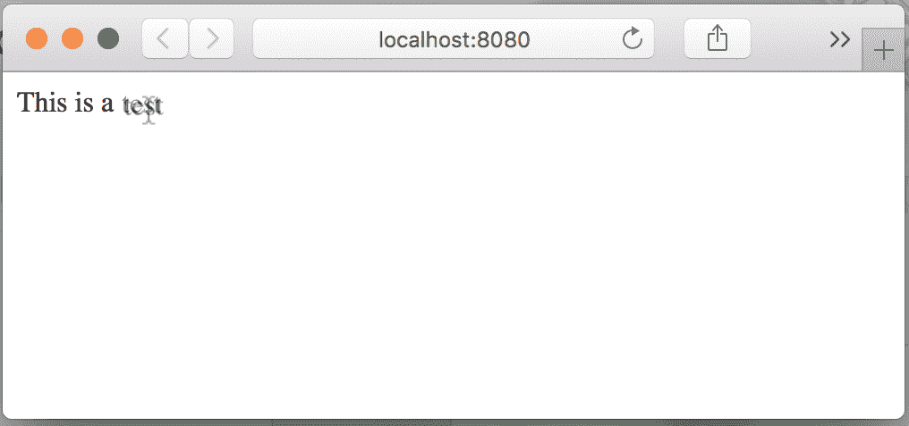

将光标放在单词`test`上应该会使其摇动。

现在，我们想将这个组件打包成一个单独的 JavaScript 文件，以便将来可以重复使用。

默认模板中没有此配置，但很容易添加一个。

首先，您需要在`build`文件夹内的`webpack.prod.js`文件中进行一些修改。

让我们摆脱一些我们在发布库时不需要的插件；找到文件中的`plugins`数组。它是一个包含以下代码形式的插件数组：

```js
plugins: [
  new Plugin1(...),
  new Plugin2(...),
  ...
  new PluginN(...)
]
```

我们只需要以下插件：

+   `webpack.DefinePlugin`

+   `webpack.optimize.UglifyJsPlugin`

+   `webpack.optimize.OccurrenceOrderPlugin`

摆脱所有其他插件，因为我们不需要它们；最终数组应该看起来像这样：

```js
plugins: [
  new webpack.DefinePlugin({
    'process.env': env
  }),
  new webpack.optimize.UglifyJsPlugin({
    compress: {
      warnings: false
    }
  }),
  new webpack.optimize.OccurrenceOrderPlugin()
]
```

第一个允许您添加一些更多的配置，第二个插件会使文件变小，第三个将优化生成文件的大小。

我们需要编辑的另一个属性是`output`，因为我们希望简化输出路径。

原始属性看起来像这样：

```js
output: {
  path: config.build.assetsRoot,
  filename: utils.assetsPath('js/[name].[chunkhash].js'),
  chunkFilename: utils.assetsPath('js/[id].[chunkhash].js')
}
```

它最初的作用是在`js`目录内创建一系列输出文件。方括号中有变量；我们不需要它们，因为我们的应用程序只有一个独立模块，我们将其称为*shaker*。我们需要获取以下代码：

```js
output: {
  path: config.build.assetsRoot,
 filename: utils.assetsPath('shaker.js') }
```

由于刚才说过，您希望组件是独立的，我们需要进行一些更多的修改，这也将取决于您的需求。

如果您希望组件内置任何 CSS 样式（在我们的情况下我们没有，因为我们正在使用外部 CSS 库），您应该禁用`ExtractTextPlugin`；我们已经从列表中删除了插件，但是一些其他文件仍在使用它。找到`vue-loader.conf.js`文件中的`extract`选项（在某些版本中是相同文件的`vue`部分）并用以下代码替换它：

```js
... {
  loaders: utils.cssLoaders({
    ...
    extract: false
  })
}
```

我们的组件通常会包含 Vue 库；如果您想在 Vue 项目中使用组件，则不需要这个，因为这将是重复的代码。您可以告诉 Webpack 只搜索外部依赖项，而不包括它们。在您刚刚修改的`webpack.prod.js`文件中，在`plugins`之前添加以下属性：

```js
externals: {
  'vue': 'Vue'
}
```

这将告诉 Webpack 不将 Vue 库写入捆绑包中，而只是获取一个全局命名为`Vue`，并在我们的代码中导入`vue`依赖项时使用它。Webpack 配置几乎完成了；我们只需要在`module`属性之前添加另一个属性：

```js
var webpackConfig = merge(baseWebpackConfig, {
  entry: {
 app: './src/dist.js'
 },
  module: {
  ...
```

这将启动编译，从`dist.js`文件中读取代码。等一下，这个文件还不存在。让我们创建它，并在其中添加以下代码：

```js
import Vue from 'vue'
import Shaker from './Shaker'
Vue.component('shaker', Shaker)
```

在最终的 JavaScript 压缩文件中，Vue 依赖项将被外部引用，然后我们将全局注册组件。

作为最后的更改，我建议修改保存压缩文件的文件夹。在`config/index.js`文件中，编辑以下行：

```js
assetsSubDirectory: 'static',
```

用以下代码替换前一行：

```js
assetsSubDirectory: '.',
```

现在用 npm 运行命令构建压缩文件：

```js
npm run build
```

您将看到如下输出：

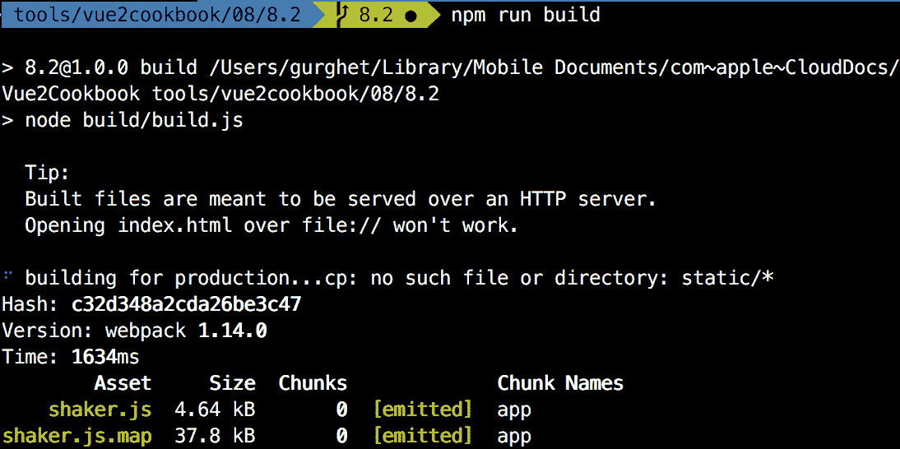

为了测试我们的文件，我们可以使用 JSFiddle

复制您创建的文件内容到`dist/shaker.js`中，然后转到[`gist.github.com/`](https://gist.github.com/)（您可能需要注册），并将文件内容粘贴到文本区域中。将其命名为`shaker.js`：

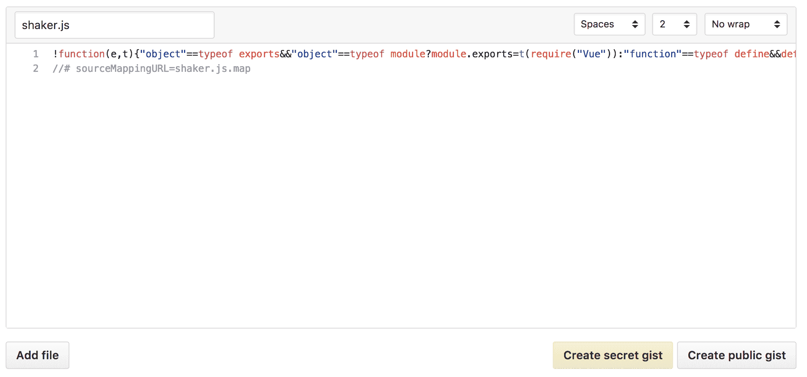

由于文本是单行的，使用 No wrap 选项您将看不到太多。点击创建公共 gist，当您看到下一页时，点击 Raw，如下面的截图所示：


复制地址栏中的 URL，转到[`rawgit.com/`](http://rawgit.com/)，在那里您可以粘贴链接：

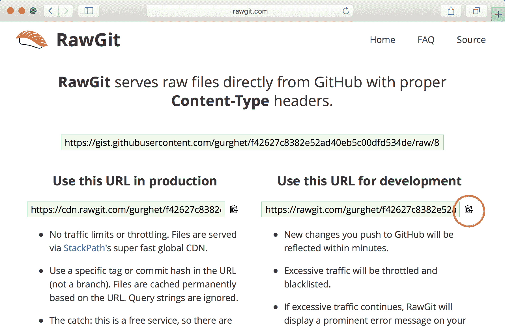

点击并复制右侧得到的链接。恭喜，您刚刚在网络上发布了您的组件！

现在转到 JSFiddle 并选择 Vue 作为库。您现在可以在左侧添加您复制的链接，然后您的组件就可以使用了：

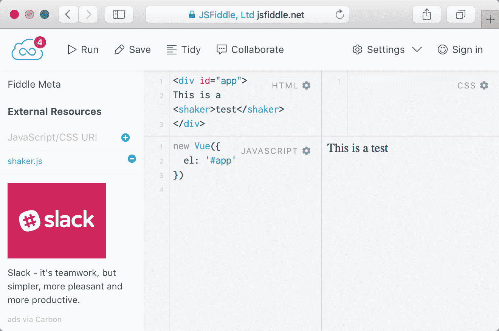

# 它是如何工作的...

官方模板中的 Webpack 配置非常复杂。另一方面，不要试图立刻理解一切，否则你会陷入困境，也学不到太多。

我们创建了一个**UMD**（通用模块定义）模块，它将尝试查看是否有 Vue 依赖可用，并将自己安装为组件。

您甚至可以为您的组件添加 CSS 和样式，以我们配置 Webpack 的方式，样式仍将与您的组件一起发布。

# 还有更多...

在本章的*将您的组件发布到公共*中，您将学习如何在 npm 发布注册表中发布您的组件。我们将使用不同的方法，但您将在那里找到发布到注册表的缺失步骤。

# 使用 Webpack 组织您的依赖项

Webpack 是一个组织代码和依赖项的工具。此外，它为您提供了一种使用 JavaScript 文件开发和构建的方式，这些文件嵌入了我们传递给它们的所有依赖项和模块。我们将在这个示例中使用它来构建一个小型的 Vue 应用程序，并将所有内容捆绑在一个单一文件中。

# 准备工作

这个示例除了使用 npm 和一些命令行知识外，不需要任何特殊技能。您可以在本章的*使用 Webpack 组织您的依赖项*示例中找到更多信息。

# 如何做...

为您的示例创建一个新文件夹，并在其中创建一个`package.json`文件，其中包含以下内容：

```js
{
 "name": "recipe",
 "version": "1.0.0"
}
```

这在我们的文件夹中定义了一个 npm 项目。当然，如果你知道自己在做什么，你可以使用`npm init`或`yarn init`。

我们将为这个示例安装 Webpack 2。要将其添加到项目依赖项中，请运行以下命令：

```js
npm install --save-dev webpack@2
```

`--save-dev`选项意味着我们不会在最终产品中发布 Webpack 的代码，而只会在开发过程中使用它。

创建一个新的`app`目录，并在其中创建一个`App.vue`文件。

这个文件将是一个简单的`Vue`组件；它可以像下面这样简单：

```js
<template>
  <div>
    {{msg}}
  </div>
</template>
<script>
export default {
  name: 'app',
  data () {
    return {
      msg: 'Hello world'
    }
  }
}
</script>
<style>
</style>
```

我们需要告诉 Webpack 如何将`.vue`文件转换为`.js`文件。为此，在根文件夹中创建一个名为`webpack.config.js`的配置文件；这个文件将被 Webpack 自动捡起。在这个文件中，写入如下内容：

```js
module.exports = {
  module: {
    rules: [
      {test: /.vue$/, use: 'vue-loader'}
    ]
  }
}
```

rules 中的这一行表示：

<q>嘿 Webpack，当你看到以`.vue`结尾的文件时，使用`vue-loader`将其转换为 JavaScript 文件。</q>

我们需要使用以下命令通过 npm 安装这样的加载器：

```js
npm install --save-dev vue-loader
```

这个加载器内部使用其他依赖项，这些依赖项不会自动安装；我们需要通过运行以下命令手动安装它们：

```js
npm install --save-dev vue-template-compiler css-loader
```

让我们趁机安装 Vue 本身：

```js
npm install --save vue
```

现在我们的`Vue`组件已经准备好了。我们需要编写一个页面来放置它并尝试它。在`app`文件夹中创建一个名为`index.js`的文件。我们将在 Vue 实例中实例化组件。在`index.js`中，写入以下内容：

```js
import Vue from 'vue'
import App from './App.vue'
new Vue({
  el: '#app',
  render: h => h(App)
})
```

这将在具有`id="app"`的元素内挂载 Vue 实例，并且它将包含一个单一组件--我们的`App.vue`。

我们还需要另一个文件--一个 HTML 文件。在根目录中，创建`index.html`并输入以下代码：

```js
<!DOCTYPE html>
<html>
  <head>
    <title>Webpack 2 demo</title>
  </head>
  <body>
    <div id="app"></div>
    <script src="dist/bundle.js"></script>
  </body>
</html>
```

我们不想直接引用`app/index.js`；这是因为`index.js`本身并不包含太多内容。它有一个`import`语句，浏览器不会识别。Webpack 可以轻松地创建`dist/bundle.js`，其中包含`index.js`及其所有依赖项。要做到这一点，请运行以下命令：

```js
./node_modules/webpack/bin/webpack.js app/index.js dist/bundle.js
```

这应该会生成类似于这样的输出：

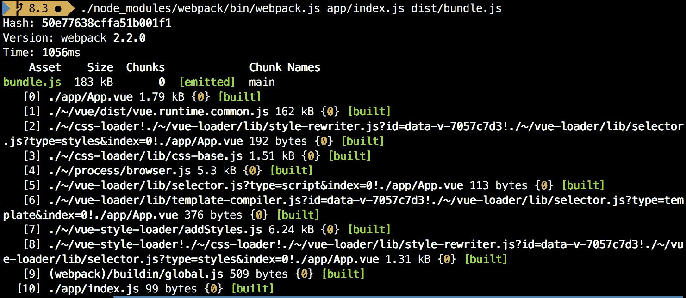

现在你可以打开`index.html`，你会看到组件在工作。

然而，每次启动这个长命令并不是很有趣。Webpack 和 npm 可以做得更好。

在`webpack.config.js`中，添加以下属性：

```js
module.exports = {
  entry: './app/index.js',
 output: {
 filename: 'bundle.js',
 path: __dirname + '/dist'
 },
  module: {
  ...
```

这将指定 Webpack 的入口点以及结果文件应该保存在哪里。

我们还可以在`package.json`中添加一个脚本：

```js
"scripts": {
  "build": "webpack"
}
```

现在，启动`npm run build`将产生与我们使用的长命令相同的效果。

# 它是如何工作的...

在这个教程中，我们基本上创建了一个 JavaScript 文件（`bundle.js`），它同时包含了 Vue 和我们编写的组件。在`index.html`中，没有 Vue 的痕迹，因为它嵌入在`bundle.js`中。

当我们有很多依赖时，这种工作方式要好得多。我们不再需要在页面的头部或主体中添加很多标签。此外，我们也不必担心加载我们不需要的依赖。

作为额外的奖励，Webpack 具有压缩我们最终文件和其他高级优化的能力和灵活性，这是通过手动加载依赖项根本不可能实现的。

# 在你的 Webpack 项目中使用外部组件

在自己的项目中使用外部 Vue 组件通常很简单。但有时候，事情并不那么简单。特别是，在官方模板中有一些配置与 Webpack 实际上阻止你使用一些外部组件。在这个教程中，我们将安装 Bulma 项目中的一个模态对话框组件。

# 准备工作

在这个教程中，我们将调整 Webpack 配置。建议在接手这项任务之前，先完成*使用 Webpack 组织你的依赖项*教程。

# 如何做...

我们将从一个新的 Webpack 项目开始。你可以使用`vue-cli`和官方的 Webpack 模板创建一个新的项目。不过，我的建议是，从我的 Webpack 模板开始，这是一个干净的起点。要做到这一点，请在一个新目录中运行以下命令：

```js
vue init gurghet/webpack
```

我们将安装`vue-bulma-modal`，这是一个使用 Bulma CSS 框架编写的 Vue 组件：

```js
npm install --save vue-bulma-modal bulma
```

在上述命令中，我们也安装了`bulma`，其中包含实际的 CSS 样式。

要使样式生效，我们需要将它们转换为 Webpack 的 JavaScript；这意味着我们需要安装一些加载器：

```js
npm install --save-dev node-sass sass-loader
```

SASS 加载器已经配置好了，所以不需要做任何修改。不过，我们将修改与 Babel 加载器相关的 Webpack 配置（在*使用热重新加载进行持续反馈开发*食谱中了解更多）。

在官方模板中（但这可能会改变，请注意），有一行阻止 Webpack 编译依赖项。转到`build/webpack.base.conf.js`并找到以下代码块：

```js
{
  test: /.js$/,
  loader: 'babel-loader',
  include: [
    path.join(projectRoot, 'src')
  ],
 exclude: /node_modules/
},
```

根据您使用的 Webpack 版本，您可能需要稍微调整加载器语法。例如，在较旧的 Webpack 版本中，您将写`babel`而不是`babel-loader`。

您必须删除突出显示的行，而是写入以下内容：

```js
{
  test: /.js$/,
  loader: 'babel-loader',
  include: [
    path.join(projectRoot, 'src'),
 path.join(projectRoot, 'node_modules/vue-bulma-modal')
  ]
},
```

这告诉 Webpack 使用`babel-loader`编译我们刚刚安装的组件。

现在，在`App.vue`中编写以下 HTML 布局：

```js
<template>
  <div id="app">
    <card-modal
      @ok="accept"
      ok-text="Accept"
      :visible="popup"
      @cancel="cancel"
    >
      <div class="content">
        <h1>Contract</h1>
          <p>
            I hereby declare I have learned how to
            install third party components in my
            own Vue project.
          </p>
        </div>
      </card-modal>
    <p v-if="signed">It appears you signed!</p>
  </div>
</template>
```

然后，您可以按照 JavaScript 中所示的逻辑编写代码：

```js
<script>
import { CardModal } from 'vue-bulma-modal'
export default {
  name: 'app',
  components: { CardModal },
  data () {
    return {
      signed: false,
      popup: true
    }
  },
  methods: {
    accept () {
      this.popup = false
      this.signed = true
    },
    cancel () {
      this.popup = false
    }
  }
}
</script>
```

使用 Bulma 样式，我们需要启用 SASS 加载器并导入`bulma`文件。添加以下行：

```js
<style lang="sass">
@import '~bulma';
</style>
```

请注意，我们在第一行中指定了样式的语言（我们写的是 SCSS，但在这种情况下我们原样写）。

如果您现在尝试使用`npm run dev`命令运行应用程序，您将看到 Bulma 模态对话框以其全部辉煌：

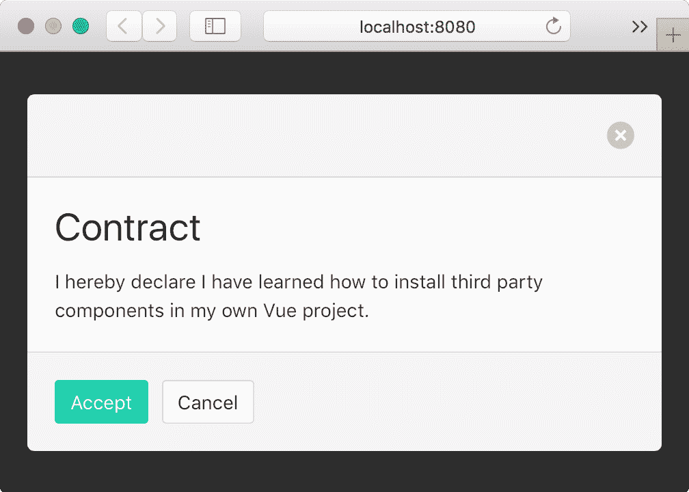

# 它是如何工作的...

官方的 Webpack 模板包含一个配置规则，永远不要编译`node_modules`目录中的文件。这意味着 Web 组件的作者被鼓励分发已经编译好的文件，否则用户将在其项目中导入原始 JavaScript 文件（因为 Webpack 不会编译它们），从而在浏览器中引起各种错误。就个人而言，我认为这不是一个好的工程实践。这种设置的一个问题是，由于您在项目中导入的文件是针对 Vue 的一个版本编译的，如果您使用更新的 Vue 版本，组件可能无法正常工作（这实际上在过去发生过）。

更好的方法是导入原始文件和组件，让 Webpack 将它们编译成一个单一文件。不幸的是，大多数在外部可用的组件已经编译好了，所以虽然按照官方模板导入它们非常快速，但你更有可能遇到兼容性问题。

在导入外部组件时，首先要做的是检查它们的`package.json`文件。让我们看看`vue-bulma-modal`包在这个文件中包含了什么：

```js
{
  "name": "vue-bulma-modal",
  "version": "1.0.1",
  "description": "Modal component for Vue Bulma",
 "main": "src/index.js",  "peerDependencies": {
    "bulma": ">=0.2",
    "vue": ">=2"
  },
  ...
  "author": "Fangdun Cai <cfddream@gmail.com>",
  "license": "MIT"
}
```

`main`属性引用的文件是我们在 JavaScript 中写下以下行时导入的文件：

```js
import { CardModal } from 'vue-bulma-modal'
```

而`src/index.js`文件则包含以下代码：

```js
import Modal from './Modal'
import BaseModal from './BaseModal'
import CardModal from './CardModal'
import ImageModal from './ImageModal'

export {
  Modal,
  BaseModal,
  CardModal,
  ImageModal
}
```

这不是一个编译后的文件；它是原始的 ES6，我们知道这一点是因为在常规 JavaScript 中没有定义`import`。这就是为什么我们需要 Webpack 来为我们编译它。

另一方面，考虑到我们写下以下内容：

```js
<style lang="sass">
@import '~bulma';
</style>
```

使用波浪号（`~`），我们告诉 Webpack 像模块一样解析样式，所以我们真正导入的是`bulma`包的`package.json`中`main`引用的文件，如果我们检查一下，它看起来是这样的：

```js
{
  "name": "bulma",
  "version": "0.3.1",
  ...
 "main": "bulma.sass",
  ...
}
```

由于我们正在导入具有 SASS 语法的 SASS，我们需要在 Vue 组件中指定`lang="sass"`。

# 使用热重载进行持续反馈开发

热重载是一种非常有用的技术，它让您在浏览器中查看结果的同时进行开发，甚至无需刷新页面。这是一个非常紧密的循环，可以真正加快您的开发过程。在官方 Webpack 模板中，默认安装了热重载。在这个示例中，您将学习如何自己安装它。

# 准备工作

在尝试这个示例之前，您应该至少对 Webpack 的工作原理有一个模糊的概念；本章中的*使用 Webpack 组织您的依赖项*示例将为您提供帮助。

# 如何做到这一点...

在新目录中创建一个新的 npm 项目，可以使用`npm init -y`或`yarn init -y`。我个人更喜欢第二种方法，因为生成的`package.json`更加简洁。

要安装 Yarn，可以使用`npm install -g yarn`命令。Yarn 的主要好处是您将能够将您的依赖项锁定到已知版本。这可以防止在团队合作时出现错误，当应用程序从 Git 克隆时，会有略有不同的版本引入不兼容性。

您将创建一个数字骂人罐。每次您说脏话，您都要向骂人罐捐赠一定金额的钱，用于长期目标。

创建一个名为`SwearJar.vue`的新文件，并在其中添加以下代码：

```js
<template>
  <div>
    Swears: {{counter}} $$
    <button @click="addSwear">+</button>
  </div>
</template>
<script>
export default {
  name: 'swear-jar',
  data () {
    return {
      counter: 0
    }
  },
  methods: {
    addSwear () {
      this.counter++
    }
  }
}
</script>
```

您将在网页上插入此组件。

在同一目录下创建一个名为`index.html`的文件，并写入以下代码：

```js
<!DOCTYPE html>
<html>
  <head>
    <title>Swear Jar Page</title>
  </head>
  <body>
    <div id="app"></div>
    <script src="bundle.js"></script>
  </body>
</html>
```

`bundle.js`文件将由 Webpack（在内存中）为我们创建。

您需要的最后一个应用文件是一个包含我们 Vue 根实例的 JavaScript 文件。在同一目录中创建一个名为`index.js`的文件；将以下内容放入其中：

```js
import Vue from 'vue'
import SwearJar from './SwearJar.vue'
new Vue({
  el: '#app',
  render: h => h(SwearJar)
})
```

现在，您需要创建一个名为`webpack.config.js`的文件，告诉 Webpack 一些事情。首先是我们应用的入口点（`index.js`）以及我们想要放置编译文件的位置：

```js
module.exports = {
  entry: './index.js',
  output: {
    path: 'dist',
    filename: 'bundle.js'
  }
}
```

接下来，我们将告诉 Webpack 使用`vue-loader`将`.vue`文件转换为 JavaScript：

```js
module.exports = {
  entry: './index.js',
  output: {
    path: 'dist',
    filename: 'bundle.js'
  },
  module: {
 rules: [
 {
 test: /.vue$/,
 use: 'vue-loader'
 }
 ]
 }
}
```

为了使一切正常运行，我们仍然需要安装我们代码中暗示的依赖项。我们可以用以下两个命令来安装它们：

```js
npm install --save vue
npm install --save-dev vue-loader vue-template-compiler webpack webpack-dev-server
```

特别是最后一个--`webpack-dev-server`--是一个开发服务器，将帮助我们进行热重载开发。

运行以下命令启动服务器：

```js
./node_modules/webpack-dev-server/bin/webpack-dev-server.js --output-path / --inline --hot --open
```

实际上，让我们将这个命令放在一个 npm 脚本中。

打开`package.json`并添加以下行：

```js
"scripts": {
  "dev": "webpack-dev-server --output-path / --inline --hot --open"
}
```

现在我们可以运行`npm run dev`，我们将得到相同的结果--浏览器将弹出--如下面的截图所示：

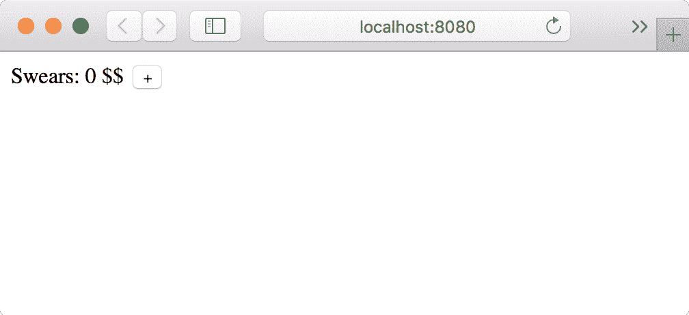

单击加号按钮将使计数增加，但是这个应用的样式呢？让我们让它更有吸引力。

打开您的代码编辑器和窗口并排放置，并对`SwearJar.vue`进行以下修改：

```js
<template>
  <div>
    <p>Swears: {{counter}} $$</p>
    <button @click="addSwear">Add Swear</button>
  </div>
</template>
```

保存文件，您将看到页面自动更新。更好的是，如果计数已经设置为非零，状态将被保留，这意味着如果您有一个复杂的组件，在每次修改后您不必手动将其带入相同的状态。尝试将脏话计数设置为某个数字并编辑模板。大多数情况下，计数不会被重置为零。

# 它是如何工作的...

Webpack 开发服务器是非常有帮助的软件，让您可以以非常紧密的反馈循环进行开发。我们使用了大量参数来使其运行：

```js
webpack-dev-server --output-path / --inline --hot --open
```

所有这些参数在`webpack.config.js`中都是相同的。相反，我们将这些参数放在命令行中以方便使用。`--output-path`是 Webpack 服务器将提供`bundle.js`的位置；在我们的情况下，我们说我们希望它在根路径提供服务，因此它将有效地将`/bundle.js`路径绑定到实际的`bundle.js`文件。

第二个参数`--inline`将在我们的浏览器中注入一些 JavaScript 代码，以便我们的应用程序可以与 Webpack 开发服务器进行通信。

`--hot`参数将激活热模块替换插件，它将与`vue-loader`（实际上是其中的`vue-hot-reload-api`）通信，并且将重新启动或重新渲染（保留状态）页面内的每个 Vue 模型。

最后，`--open`只是为我们打开默认浏览器。

# 使用 Babel 编译 ES6

ES6 有很多有用的功能，在这个教程中，您将学习如何在您的项目中使用它。值得注意的是，ES6 目前在浏览器中有很好的支持。您不会在野外的 80%的浏览器中遇到兼容性问题，但根据您的受众，您可能需要甚至接触仍在使用 Internet Explorer 11 的人，或者您可能只是想最大化您的受众。此外，一些开发工具和 Node.js 仍然不完全支持 ES6，因此即使是开发，也认为 Babel 是必需的。

# 准备工作

在这个教程中，我们将使用 npm 和命令行。

# 如何做...

创建一个带有空 npm 项目的新目录。您可以在目录中使用`npm init -y`命令，或者如果您已经安装了 Yarn，您可以在目录中使用`yarn init -y`。这个命令将在目录中创建一个新的`package.json`。（请参阅*使用 Yarn 进行持续反馈开发和热重载*教程中关于 Yarn 的注意事项。）

对于这个 npm 项目，除了 Vue 之外，我们还需要一些依赖项：Webpack 和 Babel 作为 Webpack 的加载器。哦是的，我们还需要`vue-loader`来为 Webpack 安装它们，启动以下两个命令：

```js
npm install --save vue
npm install --save-dev webpack babel-core babel-loader babel-preset-es2015 vue-loader vue-template-compiler
```

在同一个目录中，让我们编写一个使用 ES6 语法的组件；让我们称之为`myComp.vue`：

```js
<template>
  <div>Hello</div>
</template>
<script>
var double = n => n * 2
export default {
  beforeCreate () {
    console.log([1,2,3].map(double))
  }
}
</script>
```

这个组件除了在控制台打印`[2,4,6]`数组之外并没有做太多事情，但它在以下行中使用箭头语法：

```js
var double = n => n * 2
```

一些浏览器和工具无法理解这一点；我们需要使用 Babel 加载器对这个组件进行 Webpack 编译。

创建一个新的`webpack.config.js`文件，并在其中写入以下内容：

```js
module.exports = {
  entry: 'babel-loader!vue-loader!./myComp.vue',
  output: {
    filename: 'bundle.js',
    path: 'dist'
  }
}
```

这将告诉 Webpack 从我们的 `myComp.vue` 文件开始编译，但在此之前，它将被 `vue-loader` 处理为一个 js 文件，然后由 `babel-loader` 处理为更简单和更兼容的箭头函数。

我们可以通过不同和更标准的配置来实现相同的效果：

```js
module.exports = {
 entry: './myComp.vue',  output: {
    filename: 'bundle.js'
  },
  module: {
    rules: [
      {
        test: /.vue$/,
        use: 'vue-loader'
      },
      {
        test: /.js$/,
        use: 'babel-loader'
      }
    ]
  }
}
```

这是一个更一般的配置，它表示每当我们遇到以 `.vue` 结尾的文件时，应该使用 `vue-loader` 进行解析和处理，而对于 `.js` 文件则使用 `babel-loader`。

要配置 Babel 加载器，有几个选项；我们将遵循推荐的方式。在项目文件夹内创建一个名为 `.babelrc` 的文件（注意初始点），并指定我们要应用 `es2015` 预设，写入以下代码：

```js
{
  "presets": ["es2015"]
}
```

最后，我总是喜欢在 `package.json` 文件中添加一个新的脚本，以便更轻松地启动命令。在文件末尾（但在最后一个右花括号之前）添加以下行：

```js
"scripts": {
  "build": "webpack"
}
```

然后运行 `npm run build`。这将在 `dist` 目录内创建一个名为 `bundle.js` 的文件；打开它并搜索包含例如 `double` 的行。你应该会找到类似这样的内容：

```js
...
var double = function double(n) {
  return n * 2;
};
...
```

这是我们的 `var double = n => n * 2`，从 ES6 转换为*普通*JavaScript。

# 它是如何工作的...

`es2015` Babel 预设是一组 Babel 插件，旨在将 ECMAScript2015（ES6）语法转换为更简单的 JavaScript。例如，它包含了 `babel-plugin-transform-es2015-arrow-functions` 插件，你可能已经猜到，它转换箭头函数：

```js
var addOne = n => n + 1
```

将箭头函数转换为更简单的 JavaScript，如下所示：

```js
var addOne = function addOne(n) {
  return n + 1
}
```

为了选择文件及其相应的加载器，我们填写了 `webpack.config.js` 内的测试字段，并匹配 `.vue` 文件，我们写入了以下内容：

```js
test: /\.vue$/
```

这个语法是一个正则表达式，它总是以一个斜杠开始，以另一个斜杠结束。它匹配的第一个字符是点，表示为 `\.`，因为 `.` 字符已经被用于其他目的。点后面必须跟着 `vue` 字符，字符串的结束字符表示为一个美元符号。如果把它们都放在一起，它将匹配所有以 `.vue` 结尾的字符串。对于 `.js` 文件也是类似的。

# 在开发时运行代码检查器

对代码进行 linting 可以大大减少开发过程中累积的小错误和低效率，它可以保证团队或组织的编码风格一致，并且使您的代码更易读。与偶尔运行 linter 不同，让它持续运行是很有用的。本教程将教您如何在 Webpack 中实现这一点。

# 准备工作

在本教程中，我们将再次使用 Webpack。您将使用`webpack-dev-server`构建一个紧密的循环，这在*使用热重载进行持续反馈开发*教程中有介绍。

# 如何做...

在一个新的文件夹中，创建一个新的 npm 项目（可以使用`npm init -y`或`yarn init -y`）。

在文件夹内，创建一个名为`src`的新目录，并在其中放入一个名为`MyComp.vue`的文件。让文件包含以下代码：

```js
<template>
  <div>
    Hello {{name}}!
  </div>
</template>
<script>
export default {
  data () {
    return {
      name: 'John',
      name: 'Jane'
    }
  }
}
</script>
```

我们已经发现了一个问题——`John`的`name`属性将被后面的`Jane`属性用相同的键覆盖。假装我们没有注意到这一点，并将组件放在一个网页中。为此，我们需要另一个文件，名为`index.js`，放在`src`目录中。在其中写入以下代码：

```js
import Vue from 'vue'
import MyComp from './MyComp.vue'
new Vue({
  el: '#app',
  render: h => h(MyComp)
})
```

在根目录中，放置一个名为`index.html`的文件，其中包含以下代码：

```js
<!DOCTYPE html>
<html>
  <head>
    <title>Hello</title>
  </head>
  <body>
    <div id="app"></div>
      <script src="bundle.js"></script>
    </body>
</html>
```

我们现在需要一个`webpack.config.js`文件来告诉 Webpack 如何编译我们的文件；在其中写入以下内容：

```js
module.exports = {
  entry: './src/index.js',
  module: {
    rules: [
      { 
        test: /.vue$/,
        use: 'vue-loader'
      }
    ]
  }
}
```

这只是告诉 Webpack 从`index.js`文件开始编译，并且每当它找到一个`.vue`文件时，将其转换为 JavaScript 代码使用`vue-loader`。除此之外，我们希望用 linter 扫描所有文件，以确保我们的代码没有愚蠢的错误。

将以下加载器添加到`rules`数组中：

```js
{
  test: /.(vue|js)$/,
  use: 'eslint-loader',
  enforce: 'pre'
}
```

`enforce: 'pre'`属性将在其他加载器之前运行此加载器，因此它将应用于您编写的代码而不是其转换。

我们需要做的最后一件事是配置 ESLint。在根目录中创建一个名为`.eslintrc.js`的新文件，并在其中添加以下内容：

```js
module.exports = {
  "extends": "eslint:recommended",
  "parser": "babel-eslint",
  plugins: [
    'html'
  ]
}
```

我们在这里说了几件事情。首先是我们想要应用到我们的代码的一组规则；换句话说，我们的规则集（现在为空）正在扩展推荐的规则集。其次，我们使用`babel-eslint`解析器而不是默认的解析器。最后，我们使用 HTML ESLint 插件，它将帮助我们处理`.vue`文件，并从中提取 JavaScript 代码。

现在我们已经准备好启动开发工具，但首先，我们需要使用以下命令安装依赖项：

```js
npm install --save vue
npm install --save-dev babel-eslint eslint eslint-loader eslint-plugin-html vue-loader vue-template-compiler webpack webpack-dev-server
```

我们可以直接启动 Webpack 开发服务器，但我强烈建议将以下代码添加到`package.json`文件中：

```js
"scripts": {
  "dev": "webpack-dev-server --entry ./src/index.js --inline --hot --open"
}
```

现在，如果我们启动`npm run dev`，浏览器应该打开，并显示组件不正确：

`<q>Hello Jane!</q>`

你也应该能在控制台中看到问题：

`11:7  error  Duplicate key 'name'  no-dupe-keys`

这意味着我们有两个相同的*name*键。通过删除属性来纠正错误：

```js
data () {
  return {
    name: 'John'
  }
}
```

在控制台中，保存 Vue 组件后，你应该注意到 Webpack 已经再次执行了编译，这次没有错误。

# 它是如何工作的…

基本上，这里发生的是 linter loader 在其他编译步骤之前处理文件，并将错误写入控制台。这样，你就能在开发过程中看到代码中的不完美之处。

ESLint 和 Webpack 在 Vue 官方模板中可用。现在你知道，如果出于某种原因，你想修改 ESLint 规则，你可以从`.eslintrc.js`文件中进行，如果你想使用另一个 linter，你可以在 Webpack 配置文件中使用另一个 loader。

# 只使用一个命令构建一个压缩和一个开发.js 文件

在发布组件时，你可能需要一个可靠的流程来发布你构建的文件。一个常见的操作是发布库/组件的两个版本：一个用于开发目的，一个用于在生产代码中使用，通常是压缩的。在这个方法中，你将调整官方模板，同时发布一个压缩和一个开发 JavaScript 文件。

# 准备工作

如果你已经在构建和分发自己的组件，这个方法就有意义。如果你想了解更多，我建议你参考*Bundling your component with Webpack*这个方法。

# 如何做…

我们将从官方 Webpack 模板开始一个项目。你可以使用你自己的，或者你可以用`vue init webpack`创建一个新项目，并用`npm install`安装依赖。

进入`build`目录。当你启动`npm run build`命令时，实际上是在这个目录中启动了`build.js`文件。

如果你检查文件，你会在结尾附近找到类似这样的内容：

```js
webpack(webpackConfig, function (err, stats) {
...
})
```

这相当于从命令行启动 Webpack，使用第一个参数中指定的相同配置`webpackConfig`。为了得到一个经过压缩和一个未经压缩的文件，我们必须将`webpackConfig`带到一个共同的基准，然后我们将只指定开发和生产版本文件之间的差异。

为了做到这一点，进入同一目录中的`webpack.prod.conf.js`。在这里，你可以看到我们正在传递的配置；特别是，你会发现`UglifyJsPlugin`，它负责压缩文件，如果你查看插件数组。删除该插件，因为它代表了两个分发版本之间的主要差异。

现在，在 Webpack 命令之前在`build.js`中写入以下内容：

```js
const configs = [
  {
    plugins: [
      new webpack.optimize.UglifyJsPlugin({
        compress: {
          warnings: false
        },
        sourceMap: true
      })
    ]
  },
  {
    plugins: []
  }
]
```

现在你有了一个包含两个不同配置的数组，一个带有用于压缩文件的插件，一个没有。如果你将它们中的每一个与`webpack.prod.conf.js`中的配置合并，你将得到不同的结果。

为了合并这两个配置，我们将使用`webpack-merge`包。在文件顶部添加以下行：

```js
var merge = require('webpack-merge')
```

然后，修改 Webpack 命令的第一行为以下内容：

```js
configs.map(c => webpack(merge(webpackConfig, c), function (err, stats) {
...
```

这将启动与我们在配置数组中指定的一样多的合并配置。

你现在可以运行`npm run build`命令，但问题是文件将会有相同的名称。从`webpack.prod.conf.js`中剪切输出属性，并粘贴到`config`数组中，现在它应该是这样的：

```js
const configs = [
  {
    output: {
 path: <whatever is your path>,
 filename: 'myFilename.min.js'),
 <other options you may have>
 },
    plugins: [
      new webpack.optimize.UglifyJsPlugin({
        compress: {
          warnings: false
        }
      })
    ]
  },
  {
    output: {
 path: <whatever is your path>,
 filename: 'myFilename.js'),
 <other options you may have>
 },
    plugins: []
  }
]
```

如果现在构建项目，你将会得到一个经过压缩和一个开发文件。当然，你可以根据需要个性化你的配置，使它们变得截然不同。例如，你可以在一个配置中添加源映射，而在另一个配置中保持原样。

# 工作原理...

我们首先创建了一个对象数组，代表了 Webpack 配置中的差异。然后我们使用`webpack-merge`将每个配置映射到一个更大的共同配置中。当我们现在调用`npm run build`命令时，这两个配置将依次运行。

通常的约定是在文件名后加上`min`来表示该文件已经被压缩并准备用于生产环境。

# 发布你的组件到公共环境

在某个时候，你会有一个想要回馈社区的时刻。也许你建了一个“放屁按钮”，或者你建了一个自动股票期权交易者；无论你建了什么，JavaScript 和 Vue 社区都会乐意欢迎你。在市场营销和许可方面有很多事情要做，但在这个教程中，你将集中在更技术方面的内容。

# 准备工作

这个教程是针对那些想要与 Vue 社区分享他们的工作的人。在 *使用 Webpack 打包你的组件* 这个教程中，你将找到如何调整官方 Webpack 模板以正确打包你的组件；这个教程可以被看作是第二部分。我们不会使用官方模板。

# 如何做...

我在这个教程中采用的方法是使用 *Guillaume Chau* 的优秀的 `vue-share-components` 模板。我们将从这个起点构建一个笑话按钮。

在你的命令行中，创建一个新的目录，并在其中输入以下命令：

```js
vue init Akryum/vue-share-components
```

它会问你一些问题；你可以从下面的图片中复制答案。唯一需要注意的是，你（遗憾地）不能在你的项目中使用 `joke-button` 这个名字，因为在写这个教程时我已经注册了它。然而，你可以想出一个听起来类似的名字（在继续之前，你可能想检查一下这个名字在 `npm` 注册表中是否可用）：

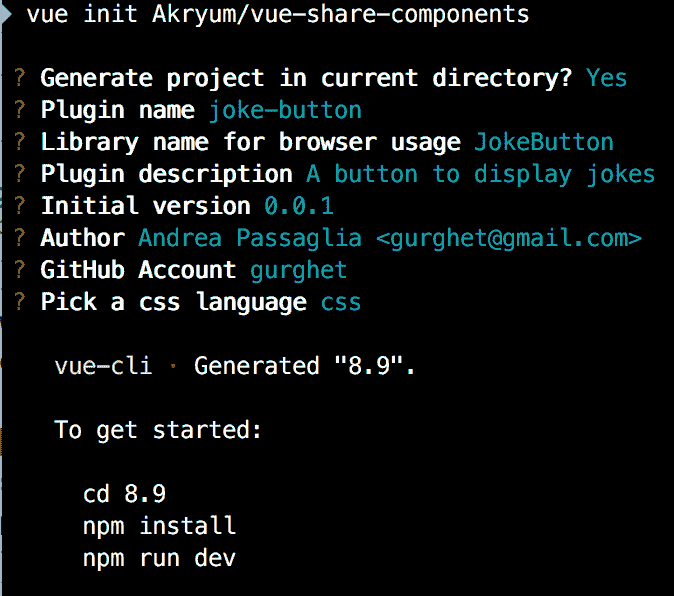

项目创建完成后，你可以像在控制台输出中一样使用 `npm install` 安装依赖。

在项目内，让我们创建笑话按钮组件。在 `component` 文件夹内，你会找到一个 `Test.vue` 组件；将其重命名为 `JokeButton.vue` 并使其看起来像以下代码：

```js
<template>
  <div class="test">
    <button @click="newJoke">New Joke</button>
    <p>{{joke}}</p>
  </div>
</template>
<script>
const jokes = [
 'Chuck Norris/'s keyboard has the Any key.',
 'Chuck Norris can win at solitaire with only 18 cards.',
 'Chuck Norris/' first job was as a paperboy. There were no survivors.',
 'When Chuck Norris break the build, you can/'t fix it.',
]
export default {
  name: 'joke-button',
  data () {
    return {
      joke: '...',
    }
  },
  methods: {
    newJoke () {
      this.joke = jokes[Math.floor(Math.random() * jokes.length)]
    },
  },
}
</script>
```

显然，你可以创建你喜欢的组件；这只是一个例子。

在 `index.js` 文件中，你会看到 `Test` 组件被导入和安装；你需要安装 `JokeButton`。你需要改变的行已经被标出：

```js
import JokeButton from './components/JokeButton.vue'
// Install the components
export function install (Vue) {
  Vue.component('jokeButton', JokeButton)
  /* -- Add more components here -- */
}
// Expose the components
export {
  JokeButton,
  /* -- Add more components here -- */
}
...
```

我们的组件准备好了！

现在你需要去 npm 网站注册一个账号（如果你还没有的话）。

前往[npmjs.com](https://www.npmjs.com/)：


点击注册并输入你的详细信息，就像我在这里做的一样：

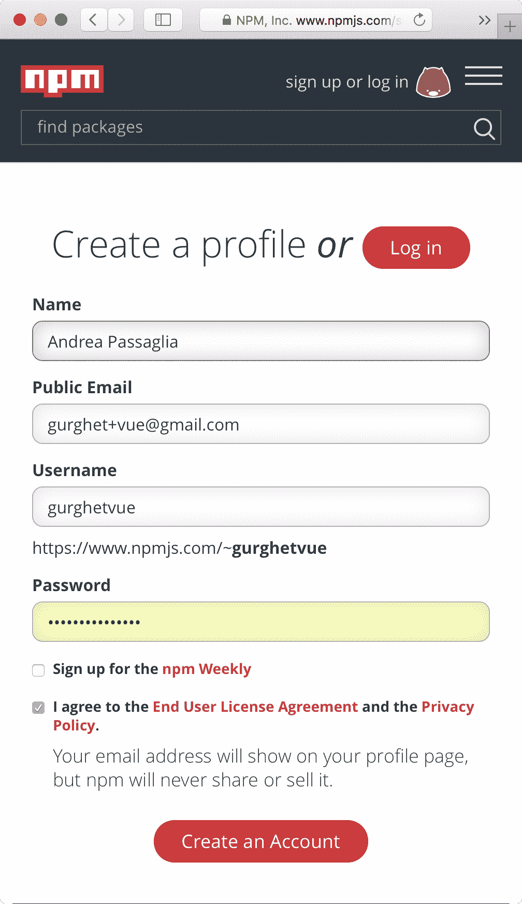

当然，如果你愿意，你可以订阅 npm 每周的新闻通讯。

注册后，您就完成了，可以回到命令行。您必须使用以下命令从终端登录到 npm 注册表：

```js
npm adduser
```

您会看到类似于这样的东西：


您将不得不输入您刚刚为 npm 网站输入的密码。

下一个命令将在公共存储库中发布您的库：

```js
npm publish
```

现在，您甚至可以查找您的软件包，确实，您将会发现它如下截图所示：

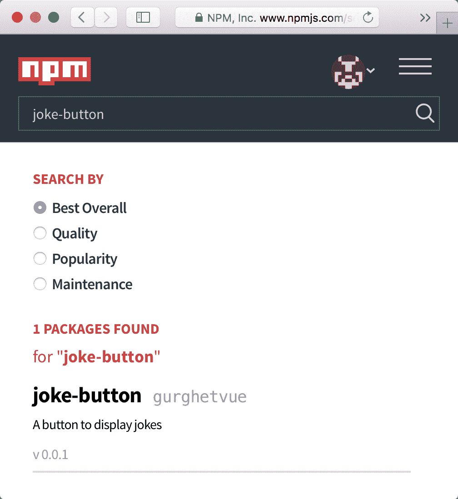

要尝试它，您可以在自己的`README`中找到说明，这是多么酷啊？

# 它是如何工作的...

`vue-share-components`比官方模板更简单，所以通过检查它来学习是一个很好的方法。

我们可以首先查看`package.json`文件。以下行是相关的：

```js
...
"main": "dist/joke-button.common.js",
"unpkg": "dist/joke-button.browser.js",
"module": "index.js",
"scripts": {
  "dev": "cross-env NODE_ENV=development webpack --config config/webpack.config.dev.js --progress --watch",
  "build": "npm run build:browser && npm run build:common",
  "build:browser": "cross-env NODE_ENV=production webpack --config config/webpack.config.browser.js --progress --hide-modules",
  "build:common": "cross-env NODE_ENV=production webpack --config config/webpack.config.common.js --progress --hide-modules",
  "prepublish": "npm run build"
},
...
```

`main`属性是我们在程序中输入以下命令时实际得到的内容：

```js
import JokeButton from 'JokeButton'
```

或者，我们在添加以下代码时得到它：

```js
var JokeButton = require("JokeButton")
```

因此，`JokeButton`变量实际上将包含我们的`joke-button.common.js`中导出的内容。

您可以编辑`package.json`的主属性，直接指向`.vue`组件。这样，您可以让用户负责编译组件。虽然这对用户来说更费力，但当用户想要自由地针对最新版本的 Vue 进行编译时，这也是有帮助的。

在后一种情况下，如果您的组件中有一些逻辑导出到`external.js`文件中（就像本章的第一个示例中那样），请始终记得在 Webpack 规则中添加目录，如下所示：

`{`

`  test: /.js$/,`

`  loader: 'babel-loader',`

`  include: [resolve('src'), resolve('test'), resolve('node_modules/myComponent')]`

`},`

unpkg 是[unpkg.com](https://unpkg.com/#/)的特定部分，它是一个 CDN。这非常好，因为一旦我们发布我们的项目，我们的脚本将被发布在[`unpkg.com/joke-button`](https://unpkg.com/joke-button)，它将指向适用于浏览器的`joke-button.browser.js`文件。

`prepublish`脚本是一个特殊的脚本，在使用`npm publish`命令将项目发布到 npm 之前将被调用。这可以消除在发布组件之前忘记构建文件的可能性（这种情况经常发生，所以我被迫人为增加软件版本，手动构建文件，然后再次发布）。

另一个有趣的事实要注意的是`webpack.config.common.js`和`webpack.config.browser.js`之间的区别，前者输出`joke-button.common.js`文件，而后者输出`joke-button.browser.js`文件。

第一个文件的输出设置如下：

```js
output: {
  path: './dist',
  filename: outputFile + '.common.js',
  libraryTarget: 'commonjs2',
},
target:  'node',
```

因此，它将输出一个将暴露出一个 commonJS 接口的库；这适用于非浏览器环境，您将需要要求或导入此库才能使用它。另一方面，用于浏览器的第二个文件具有以下输出：

```js
output: {
  path: './dist',
  filename: outputFile + '.browser.js',
  library: globalName,
  libraryTarget: 'umd',
},
```

UMD 将在全局范围内暴露自己，无需导入任何内容，因此非常适合浏览器，因为我们可以在 Vue 网页中包含该文件并自由使用组件。这也是可能的，多亏了`index.js`的自动安装功能：

```js
/* -- Plugin definition & Auto-install -- */
/* You shouldn't have to modify the code below */
// Plugin
const plugin = {
 /* eslint-disable no-undef */
 version: VERSION,
 install,
}
export default plugin
// Auto-install
let GlobalVue = null
if (typeof window !== 'undefined') {
 GlobalVue = window.Vue
} else if (typeof global !== 'undefined') {
 GlobalVue = global.Vue
}
if (GlobalVue) {
 GlobalVue.use(plugin)
}
```

这段代码的作用是将安装函数（用于在 Vue 中注册组件）打包到`plugin`常量中，并同时导出。然后，它会检查是否定义了`window`或`global`，如果是这样，它会获取代表 Vue 库的`Vue`变量，并使用插件 API 来安装组件。
