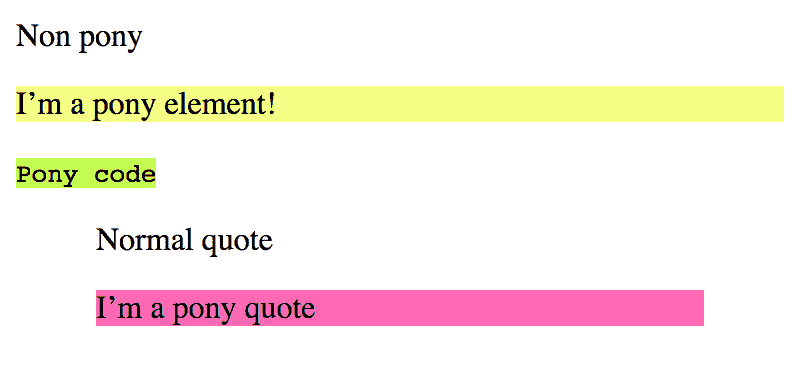
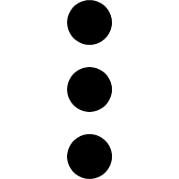

# 第十七章：高级 Vue.js - 指令、插件和渲染函数

在本章中，我们将讨论以下主题：

+   创建一个新指令

+   在 Vue 中使用 WebSockets

+   为 Vue 编写一个插件

+   手动渲染一个简单的组件

+   渲染带有子元素的组件

+   使用 JSX 来渲染一个组件

+   创建一个功能性组件

+   使用高阶组件构建响应式表格

# 介绍

指令和插件是以可重用的方式打包功能，并且使其在应用程序和团队之间易于共享的方式；在本章中，您将构建其中的一些。渲染函数是 Vue 在幕后真正工作的方式，它将模板转换为 Vue 语言，然后再次转换为 HTML 和 JavaScript；如果您需要优化应用程序的性能并处理一些边缘情况，它们将变得有用。

一般来说，尽量避免使用这些高级功能，因为它们在过去有点被滥用。通常，许多问题可以通过简单地编写一个良好的组件并分发组件本身来解决；只有在这种情况不成立时，才应该考虑使用高级功能。

本章面向略有经验的人，您可能不会在其他教程中找到的逐步详细级别，但我仍然努力使它们完整。

# 创建一个新指令

指令就像迷你函数，您可以快速地将其放入您的代码中，主要是为了改善用户体验，并向图形界面添加新的低级功能。

# 准备工作

尽管这个教程在高级章节中，但实际上非常容易完成。指令被认为是*高级*的主要原因是，通常情况下，您应该更喜欢组合来添加功能和样式到您的应用程序中。当组件无法满足需求时，使用指令。

# 如何做...

我们将构建一个`v-pony`指令，它将把任何元素转换为一个小马元素。小马元素创建时具有粉色背景，并在点击时更改颜色。

小马元素的 HTML 代码如下：

```js
<div id="app">
  <p v-pony>I'm a pony paragraph!</p>
  <code v-pony>Pony code</code>
  <blockquote>Normal quote</blockquote>
  <blockquote v-pony>I'm a pony quote</blockquote>
</div>
```

为了展示区别，我包含了一个普通的`blockquote`元素。在我们的 JavaScript 部分，写入以下内容：

```js
Vue.directive('pony', {
  bind (el) {
    el.style.backgroundColor = 'hotpink'
  }
})
```

这是如何声明一个新指令的方式。`bind`钩子在指令绑定到元素时被调用。我们现在唯一要做的事情就是设置背景颜色。我们还希望它在每次点击后改变颜色。要做到这一点，您必须添加以下代码：

```js
Vue.directive('pony', {
  bind (el) {
    el.style.backgroundColor = 'hotpink'
    el.onclick = () => {
 const colGen = () => 
 Math.round(Math.random()*255 + 25)
 const cols =
 [colGen() + 100, colGen(), colGen()]
 const randRGB =
 `rgb(${cols[0]}, ${cols[1]}, ${cols[2]})`
 el.style.backgroundColor = randRGB
 }
  }
})
```

在这里，我们创建了一个`onclick`监听器，它将生成一个偏向红色的随机颜色，并将其分配为新的背景颜色。

在我们的 JavaScript 结尾处，记得创建一个`Vue`实例：

```js
new Vue({
  el: '#app'
})
```

您可以启动应用程序以查看指令的运行情况：



不要忘记点击文本以更改背景颜色！

# 工作原理...

声明新指令的语法如下所示：

```js
Vue.directive(<name: String>, {
  // hooks
})
```

这将注册一个新的全局指令。在 hooks 对象内，您可以定义两个重要的函数：`bind`，您在本教程中使用了它，以及`update`，每当包含在其中的组件更新时触发。

每个 hook 函数至少带有三个参数：

+   `el`: HTML 元素

+   `binding`：指令可以接收一个参数；binding 是一个包含参数值的对象

+   `vnode`：这个元素的 Vue 内部表示

我们使用`el`参数直接编辑元素的外观。

# 在 Vue 中使用 WebSockets

WebSockets 是一种新技术，它使用户和托管应用程序的服务器之间实现双向通信。在这项技术出现之前，只有浏览器可以发起请求和建立连接。如果页面上有更新，浏览器必须不断地轮询服务器。有了 WebSockets，这就不再需要了；连接建立后，服务器只有在需要时才能发送更新。

# 准备工作

对于这个教程，您不需要做任何准备，只需要了解 Vue 的基础知识。如果您不知道什么是 WebSockets，您也不需要知道，只需将它们视为服务器和浏览器之间持续双向通信的通道。

# 如何做...

对于这个教程，我们需要一个服务器和一个将充当客户端的浏览器。我们不会构建服务器；相反，我们将使用一个已经存在的服务器，它只会通过 WebSockets 回显您发送的任何内容。因此，如果我们发送`Hello`消息，服务器将回复`Hello`。

您将构建一个聊天应用程序，它将与此服务器通信。编写以下 HTML 代码：

```js
<div id="app">
  <h1>Welcome</h1>
  <pre>{{chat}}</pre>
  <input v-model="message" @keyup.enter="send">
</div>
```

`<pre>`标签将帮助我们呈现聊天。由于我们不需要`<br/>`元素来换行，我们可以使用`n`特殊字符，表示换行。

为了使我们的聊天工作，我们首先必须在 JavaScript 中声明我们的 WebSocket：

```js
 const ws = new WebSocket('ws://echo.websocket.org')
```

之后，我们声明将包含`chat`字符串（目前为止包含聊天内容）和`message`字符串（包含我们当前正在编写的消息）的`Vue`实例：

```js
new Vue({
  el: '#app',
  data: {
    chat: '',
    message: ''
  }
})
```

我们仍然需要定义`send`方法，在文本框中按下*Enter*时调用：

```js
new Vue({
  el: '#app',
  data: {
    chat: '',
    message: ''
  },
  methods: {
 send () {
 this.appendToChat(this.message)
 ws.send(this.message)
 this.message = ''
 },
 appendToChat (text) {
 this.chat += text + 'n'
 }
 }
}
```

我们将`appendToChat`方法分解出来，因为我们将用它来附加我们将收到的所有消息。为此，我们必须等待组件被实例化。`created`挂钩是一个安全的地方：

```js
...
created () {
  ws.onmessage = event => {
    this.appendToChat(event.data)
  }
}
...
```

现在启动应用程序，与您的个人回声室聊天：


# 它是如何工作的...

要查看您构建的内容的内部，请打开 Chrome 开发者工具（ | 更多工具 | 开发者工具或*Opt* + *Cmd* + *I*）：


转到网络选项卡并重新加载页面；您应该会看到`echo.websocket.orl` WebSocket，就像屏幕截图中所示。写点东西，消息将出现在帧选项卡中，就像这样：


绿色消息是您发送的，而白色消息是您收到的。您还可以检查消息长度（以字节为单位）和发送或接收的确切时间。

# 为 Vue 编写插件

插件是我们想要在应用程序中使用的一组实用程序或全局新行为。Vuex 和 vue-router 是 Vue 插件的两个著名示例。插件实际上可以是任何东西，因为编写插件意味着在非常低的级别上进行操作。您可以编写不同类型的插件。对于这个示例，我们将集中于构建具有全局属性的指令。

# 准备工作

这个示例将基于*创建一个新的指令*，只是我们将为全局协调添加一些功能。

# 如何做...

对于这个示例，我们将为袋鼠欣赏俱乐部构建一个网站。主页 HTML 的布局如下：

```js
<div id="app">
  <h1>Welcome to the Kangaroo club</h1>
  
  
  
  <p>We love kangaroos</p>
</div>
```

你可以将袋鼠图片的链接更改为你喜欢的链接。

在 JavaScript 部分，我们目前实例化了一个空的`Vue`实例：

```js
new Vue({
  el: '#app'
})
```

如果我们现在打开页面，会得到这个：


现在我们想在我们的网站上添加一个有趣的注释。我们希望页面的元素（除标题外）在随机时间间隔跳动。

为了做到这一点，您将实现的策略是在一个数组中注册所有需要跳跃的元素，然后定期选择一个随机元素并使其跳跃。

我们需要定义的第一件事是 CSS 中的跳跃动画：

```js
@keyframes generateJump {
  20%{transform: translateY(0);}
  40%{transform: translateY(-30px);}
  50%{transform: translateY(0);}
  60%{transform: translateY(-15px);}
  80%{transform: translateY(0);}
}
.kangaroo {
  animation: generateJump 1.5s ease 0s 2 normal;
}
```

它的作用是创建一个名为`kangaroo`的类，当应用于一个元素时，使其沿 y 轴跳动两次。

接下来，在 JavaScript 中编写一个将此类添加到指定元素的函数：

```js
const jump = el => {
  el.classList.add('kangaroo')
  el.addEventListener('animationend', () => {
    el.classList.remove('kangaroo')
  })
}
```

`jump`函数添加`kangaroo`类，然后在动画完成时将其移除。

我们希望对从注册的元素中随机选择的一个元素执行此操作：

```js
const doOnRandomElement = (action, collection) => {
  if (collection.length === 0) {
    return
  }
  const el = 
    collection[Math.floor(Math.random()*collection.length)]
  action(el)
}
```

`doOnRandomElement`函数接受一个动作和一个集合，并将该动作应用于一个绘制的元素。然后我们需要在随机间隔内安排它：

```js
const atRandomIntervals = action => {
  setTimeout(() => {
    action()
    atRandomIntervals(action)
  }, Math.round(Math.random() * 6000))
}
```

`atRandomIntervals`函数接受指定的函数，并在小于 6 秒的随机间隔内调用它。

我们现在拥有了实际构建一个使我们的元素跳跃的插件所需的所有功能：

```js
const Kangaroo = {
  install (vueInstance) {
    vueInstance.kangaroos = []
    vueInstance.directive('kangaroo', {
      bind (el) {
       vueInstance.kangaroos.push(el)
      }
    })
    atRandomIntervals(() => 
      doOnRandomElement(jump, vueInstance.kangaroos))
  }
}
```

Kangaroo 插件在安装时创建一个空数组；它声明了一个新的指令`kangaroo`，它将在数组中注册所有的元素。

然后在随机间隔内，从数组中随机选择一个元素，并对其调用跳跃函数。

激活插件之前，我们需要在声明`Vue`实例之前（但在声明`Kangaroo`之后）加一行：

```js
Vue.use(Kangaroo)
new Vue({
  el: '#app'
})
```

我们必须选择跳跃的元素，也就是除了标题之外的所有东西：

```js
 <div id="app">
   <h1>Welcome to the Kangaroo club</h1>
   
   
   
   <p v-kangaroo>We love kangaroos</p>
 </div>
```

如果现在运行您的应用程序，您会看到一张图片或文本每隔几秒钟像袋鼠一样跳跃。

# 它是如何工作的...

在本质上，Vue 插件只是一种将一些功能组合在一起的方法。没有太多的限制，创建插件的全部工作就是声明一个安装函数。要做到这一点的一般语法如下：

```js
MyPlugin.install = (vueInstance, option) => {
  // ...
}
```

要使用您刚刚制作的插件，请编写以下内容：

```js
Vue.use(MyPlugin, { /* any option you need */ }) 
```

这里，第二个参数是传递给`install`函数的可选对象。

由于插件是全局实体，您应该节俭使用它们，只用于您预见会影响整个应用程序的功能。

# 手动渲染一个简单的组件

Vue 将您的 HTML 模板转换为渲染函数。通常，您应该坚持使用模板，因为它们更简单。有一些情况下，渲染函数变得很有用。在这里，我们展示了一个简单的例子，其中渲染函数很有用。

# 准备就绪

这是关于渲染函数的第一个教程。如果您已经了解了 Vue 的基础知识，您将会理解一切。

# 如何做...

渲染函数的第一个用例是每当您只想要一个显示另一个组件的`Vue`实例时。

编写一个空的 HTML 布局，如下所示：

```js
 <div id="app"></div>
```

我们有一个名为 Greeter 的组件，我们希望将其显示为主`Vue`实例。在 JavaScript 部分，添加以下代码：

```js
const Greeter = {
  template: '<p>Hello World</p>'
}
```

在这里，我们必须想象我们从其他地方获取了`Greeter`组件，并且由于组件已经很好地打包，我们不想修改它。相反，我们将它传递给`Vue`主实例：

```js
const Greeter = {
  template: '<p>Hello World</p>'
}
new Vue({
 el: '#app',
 render: h => h(Greeter)
})
```

如果我们现在启动应用程序，我们只会看到`Greeter`组件。主`Vue`实例只会充当包装器。

# 它是如何工作的...

渲染函数替换了`Vue`实例中的模板。当调用渲染函数时，传递的参数是所谓的`createElement`函数。我们为了简洁起见将其命名为`h`。这个函数接受三个参数，但现在只需要注意我们传递的第一个参数（我们唯一传递的参数）是`Greeter`组件。

理论上，您可以在`h`函数内联编写组件。在实际项目中，这并不总是可能的，这取决于运行时是否存在 Vue 模板编译器。当您使用官方的 Webpack 模板时，您会被问到是否要在分发软件时包含 Vue 模板编译器。

`createElement`函数的参数在这里列出：

1.  作为第一个参数，唯一必需的参数，您可以选择传递三种不同的东西：

+   Vue 组件的选项，就像我们的教程中

+   表示 HTML 标签的字符串（例如`div`、`h1`和`p`）

+   一个为 Vue 组件返回选项对象的函数或表示 HTML 标签的字符串

1.  第二个参数必须是一个名为**Data Object**的对象。这个对象在下一个教程中会解释。

1.  第三个参数是一个数组或一个字符串：

+   数组表示要放在组件内的元素、文本或组件的列表

+   您可以编写一个字符串，它将被渲染为文本

# 渲染具有子元素的组件

在这个教程中，您将完全使用渲染函数构建一个简单的网页，其中包含一些元素和组件。这将让您近距离了解 Vue 如何编译您的模板和组件。如果您想要构建一个高级组件，并且希望有一个完整的示例来启动，这可能会很有用。

# 准备工作

这是一个完整的关于如何通过渲染函数构建组件的示例。通常情况下，您不需要在实践中这样做；这仅建议给高级读者。

# 如何做...

你将为一个水管工俱乐部建立一个页面。页面将如下所示：


每当我们在名称文本框中写入一个名称，它将会被写入问候语中，就像`v-model`指令一样。

对于这个示例，我们从末尾开始而不是从开头开始，因为通常当你不得不求助于`render`函数时，你对你想要得到的东西有一个很清楚的想法。

在我们应用程序的 HTML 部分中，让我们从一个空标签开始：

```js
<div id="app"></div>
```

在 JavaScript 中，在`render`函数中写入一个空的`<div>`元素：

```js
new Vue({
  el: '#app',
  render: h => h('div')
})
```

我们将放入的第一件事是标题，就像这样：

```js
new Vue({
  el: '#app',
  render: h => h(
    'div',
    [
 h('h1', 'The plumber club page')
 ]
  )
})
```

所有其他元素和组件都将适应我们刚刚为标题创建的数组。

我们需要一个`<input>`元素，它将获取值并显示问候语。为此，我们可以构建一个`Vue`组件。

在下面的代码中，我们使用了一个常规的 JavaScript 函数，而不是箭头函数；这是因为我们想要一个对组件本身的引用。箭头函数不允许您修改`this`的作用域，而`this`取决于函数的调用方式，并且可以选择地绑定到常规函数中的任何变量。在我们的情况下，它将绑定到实例组件。

在页面的标题之后，我们在同一个数组中添加以下组件：

```js
h(
  {
    render: function (h) {
      const self = this
      return h('div', [
        'Your name is ',
        h('input', {
          domProps: {
            value: self.name
          },
          on: {
            input (event) {
              self.name = event.target.value
            }
          }
        }),
        h(
          'p',
          'Hello ' + self.name + 
            (self.exclamation ? '!' : ''))
      ])
    },
    data () { return { name: '' } },
    props: ['exclamation']
  },
  {
    props: {
      exclamation: true
    }
  }
)
```

该组件有三个选项：`render`、`data`和`props`函数。

`createElement`函数的第二个参数是实际为我们的 props 分配值：

```js
{
  props: {
    exclamation: true
  }
}
```

这将相当于在声明组件时写入`:exclamation="true"`。

您可以轻松理解组件的`data`和`props`选项。让我们来看看我们在`render`函数中写了什么。

在函数的第一行，我们将`self = this`设置为一个方便的方式来引用组件，如果我们要添加任何嵌套函数。然后，我们返回`createElement`函数（`h`）的结果，它在一个 div 标签内将三个东西放在 DOM 中。第一个是原始文本`Your name is`，然后是两个元素：一个输入和一个段落。

在使用`render`函数时，我们没有`v-model`指令的直接等价物。相反，我们手动实现它。我们将值绑定到名称，然后添加一个监听器来监听输入事件，该事件将把状态变量`name`的值设置为文本框中的内容。

然后，我们插入一个段落元素，用于组成问候语，根据`exclamation`属性的值添加感叹号。

在组件之后，我们可以添加如下内容，如同在同一个数组中所示：

```js
 'Here you will find ', h('i', 'a flood '), 'of plumbers.'
```

如果你做得对，你应该能够运行应用程序并看到整个页面。

# 工作原理...

在这个例子中，我们已经看到了 Vue 编译我们模板时发生的事情的一瞥；同样，不建议在常规组件中这样做。大多数情况下，结果只会更冗长，几乎没有收益。另一方面，在一些情况下，编写`render`函数实际上可能会导致更好或更健壮的代码，并涵盖一些难以用模板表达的功能。

# 使用 JSX 渲染组件

JSX 在 React 社区中非常受欢迎。在 Vue 中，你不必使用 JSX 来为你的组件构建模板；你可以使用更熟悉的 HTML。然而，如果你被迫编写大量的`render`函数，JSX 是你可以做的下一个最好的事情。

# 准备工作

在尝试本教程之前，最好先玩一下`render`函数。之前的教程提供了一些练习。

# 如何做...

JSX 需要一个 Babel 插件才能工作。在本教程中，我将假设你是在 webpack 模板中工作。

要安装 babel 插件，你可以运行以下命令：

```js
npm install
 babel-plugin-syntax-jsx
 babel-plugin-transform-vue-jsx
 babel-helper-vue-jsx-merge-props
 --save-dev
```

在`.babelrc`文件中，在`plugins`数组中添加以下内容：

```js
"plugins": [
 ...
  "transform-vue-jsx" ]
```

像往常一样运行`npm install`来安装所有依赖项。

现在，打开`main.js`并删除其中的所有内容。用以下代码替换它：

```js
import Vue from 'vue'

/* eslint-disable no-new */
new Vue({
  el: '#app',
  render (h) {
    return <div>{this.msg}</div>
  },
  data: {
    msg: 'Hello World'
  }
})
```

如果你从未见过 JSX，那么高亮显示的那一行可能有点奇怪。请注意，在前面的代码中，我们没有在`render`选项中使用箭头函数。这是因为我们在内部使用了`this`，并且我们希望它绑定到组件上。

你已经可以使用`npm run dev`命令看到你的页面在工作了。

# 工作原理...

Babel 插件将把 JSX 代码转换成 JavaScript 的`render`函数。

我不建议在 Vue 中使用 JSX。我能想到它有用的唯一时机是当您需要将`render`函数与 JavaScript 混合使用，并且需要一种快速且可读的方式来定义模板。除此之外，使用 JSX 并没有太多优势。

# 还有更多...

让我们稍微复杂化代码，至少让它具有 JSX 与 props 交互的味道。

在主`Vue`实例之前定义一个新的组件：

```js
const myComp = {
  render (h) {
    return <p>{this.myProp}</p>
  },
  props: ['myProp']
}
```

让我们在我们的`Vue`实例中使用这个组件，并通过 props 传递`msg`变量：

```js
new Vue({
  el: '#app',
  render (h) {
    return <div>
      <myComp myProp={this.msg}/>
    </div>
  },
  data: {
    msg: 'Hello World'
  },
  components: {
    myComp
  }
})
```

语法与 HTML 模板略有不同。特别要注意如何传递 props 以及如何使用驼峰命名和自闭合标签。

# 创建一个功能性组件

一个更轻量级的组件版本是功能性组件。功能性组件没有实例变量（所以没有`this`）并且没有状态。在这个示例中，我们将编写一个简单的功能性组件，通过 HTML 接收一些指令并将其转换为绘图。

# 准备工作

在尝试这个示例之前，您至少应该熟悉 Vue 中的渲染函数。您可以使用之前的示例来做到这一点。

# 如何做...

当您编写一个`<svg>`元素时，通常需要将数据放入其中的元素的属性中以实际绘制形状。例如，如果您想要绘制一个三角形，您必须编写以下内容：

```js
<svg>
  <path d="M 100 30 L 200 30 L 150 120 z"/>
</svg>
```

`d`属性中的文本是一系列指令，用于使虚拟光标移动以绘制：`M`将光标移动到`<svg>`内的(100, 30)坐标，然后`L`绘制一条线直到(200, 30)，然后再次到(150, 120)坐标。最后，`z`关闭我们正在绘制的路径，结果总是一个三角形。

我们想用一个组件来绘制一个三角形，但我们不喜欢属性，我们想用自己的语言来编写，所以我们将编写以下内容以获得相同的结果：

```js
<orange-line>
  moveTo 100 30 traceLine 200 30 traceLine 150 120 closePath
</orange-line>
```

这是功能性组件的完美工作，因为没有状态需要管理，只需要将一个组件转换为一个元素。

您的 HTML 布局将简单地如下所示：

```js
<div id="app">
  <orange-line>
    moveTo 100 30 traceLine 200 30 traceLine 150 120 closePath
  </orange-line>
</div>
```

然后，在您的 JavaScript 中布置您的功能性组件：

```js
const OrangeLine = {
  functional: true,
  render (h, context) {
    return h('svg',
      []
    )
  }
}
```

您必须使用`functional: true`来指定组件将是功能性的；然后渲染函数与通常略有不同。第一个参数仍然是`createElement`函数，但第二个传递的是我们组件的上下文。

我们可以通过`context.children`访问组件内部 HTML 中写的文本（绘制命令）。

你可以看到我已经添加了一个空的`<svg>`元素。在其中，有一个空的子节点数组；我们将只在那里放置`<path>`元素，如下所示：

```js
render (h, context) {
  return h('svg',
    [
      h('path', {
 attrs: {
 d: context.children.map(c => {
 return c.text
 .replace(/moveTo/g, 'M')
 .replace(/traceLine/g, 'L')
 .replace(/closePath/g, 'z')
 }).join(' ').trim(),
 fill: 'black',
 stroke: 'orange',
 'stroke-width': '4'
 }
 })
    ]
  )
}
```

高亮显示的代码创建了一个路径元素，然后设置了一些属性，比如`fill`和`stroke`。`d`属性获取了组件内部的文本，进行了一些替换，然后返回它。

我们只需要在 JavaScript 中创建`Vue`实例：

```js
new Vue({
  el: '#app',
  components: {
    OrangeLine
  }
})
```

现在，加载应用程序，我们应该看到一个三角形，如下截图所示：


# 它是如何工作的...

Vue 允许您创建非常轻量级的组件，因为它们没有任何内部状态。随之而来的是一些限制，例如，我们可以将一些逻辑放在渲染函数中来处理用户输入（以元素的子节点或 props 的形式）。

我们传递的上下文包含以下属性：

+   `props`: 这是由用户传递的。

+   `children`: 这实际上是一个虚拟节点数组，在模板中是我们组件的子节点。这里我们没有实际的 HTML 元素，而只是 Vue 的表示。

+   `slots`: 这是一个返回插槽的函数（在某些情况下可以代替 children 使用）。

+   `data`: 这是传递给组件的整个数据对象。

+   `parent`: 这是对父组件的引用。

在我们的代码中，我们通过以下方式提取了组件内部的文本：

```js
context.children.map(c => {
  return c.text
    .replace(/moveTo/g, 'M')
    .replace(/traceLine/g, 'L')
    .replace(/closePath/g, 'z')
}).join(' ').trim()
```

我们正在取出 children 中包含的虚拟节点数组，并将每个节点映射到其文本。由于我们在 HTML 中只放了一些文本，节点数组将是一个单例，只有一个节点：我们输入的文本。因此，在这种特殊情况下，执行`var a = children.map(c => someFunction(c))`等同于执行`var a = [someFunction(children[0])]`。

我们不仅提取了文本，还替换了一些我发明的术语来描述`svg`命令，用真实的命令。`join`函数将把数组中的所有字符串（在我们的情况下只有一个）拼接在一起，`trim`将删除所有空格和换行符。

# 使用高阶组件构建响应式表格

功能组件在我们必须决定实际包装哪个组件时是非常好的包装器。在这个示例中，您将编写一个响应式表格，根据浏览器宽度显示不同的列。

# 准备工作

这个示例是关于功能组件的。如果你想热身，可以尝试并完成上一个示例。

# 如何做...

对于这个示例，我们将使用优秀的语义化 UI CSS 框架。要使用它，您必须将 CSS 库作为依赖项或`<link>`标签包含在内。例如，您可以将以下代码放在 HTML 的`<head>`中：

```js
<link rel="stylesheet" href="https://cdnjs.cloudflare.com/ajax/libs/semantic-ui/2.2.7/semantic.css" />
```

如果您正在使用 JSFiddle，内部的链接就足够了。

您必须添加另一个标签到您的页面上，以便在移动设备上看起来更好：

```js
<meta name="viewport" content="width=device-width">
```

这告诉移动浏览器页面的宽度等于设备的宽度。如果您不这样做，移动设备可能会认为页面比手机大得多，并试图显示所有内容，显示您应用的缩小版本。

我们将设计一张猫品种的表格。您可以在 Vue 实例状态中看到所有数据。在您的 JavaScript 中编写它：

```js
new Vue({
  el: '#app',
  data: {
    width: document.body.clientWidth,
  breeds: [
    { name: 'Persian', colour: 'orange', affection: 3, shedding: 5 },
    { name: 'Siberian', colour: 'blue', affection: 5, shedding: 4 },
    { name: 'Bombay', colour: 'black', affection: 4, shedding: 2 }
  ]
  },
  created() {
    window.onresize = event => {
      this.width = document.body.clientWidth
    }
  },
  components: {
    BreedTable
  }
})
```

我们声明`width`变量来改变页面的布局，由于页面的宽度本质上不是响应式的，我们还在`window.onresize`上安装了一个监听器。对于一个真正的项目，您可能需要更复杂一些的东西，但对于这个示例，这就足够了。

还要注意我们如何使用`BreedTable`组件，我们的写法是这样的：

```js
const BreedTable = {
  functional: true,
  render(h, context) {
    if (context.parent.width > 400) {
      return h(DesktopTable, context.data, context.children)
    } else {
      return h(MobileTable, context.data, context.children)
    }
  }
}
```

我们的组件所做的就是将所有的`context.data`和`context.children`传递给另一个组件，这将是`DesktopTable`或`MobileTable`，取决于分辨率。

我们的 HTML 布局如下：

```js
<div id="app">
  <h1>Breeds</h1>
  <breed-table :breeds="breeds"></breed-table>
</div>
```

`breeds`属性将传递给`context.data`中选定的组件。

我们的桌面表格看起来会很普通：

```js
const DesktopTable = {
  template: `
    <table class="ui celled table unstackable">
      <thead>
        <tr>
          <th>Breed</th>
          <th>Coat Colour</th>
          <th>Level of Affection</th>
          <th>Level of Shedding</th>
        </tr>
      </thead>
      <tbody>
        <tr v-for="breed in breeds">
          <td>{{breed.name}}</td>
          <td>{{breed.colour}}</td>
          <td>{{breed.affection}}</td>
          <td>{{breed.shedding}}</td>
        </tr>
      </tbody>
    </table>
  `,
  props: ['breeds']
}
```

顶部的类是语义 UI 的一部分，它们将使我们的表格看起来更好。特别是`unstackable`类，它禁用了 CSS 执行的自动堆叠。我们将在下一节中更多地介绍这个。

对于移动表格，我们不仅想编辑样式，还想对列进行分组。品种将与颜色一起显示，情感与脱毛一起显示。此外，我们希望以紧凑的样式表达它们。表头将如下所示：

```js
const MobileTable = {
  template: `
    <table class="ui celled table unstackable">
      <thead>
       <tr>
         <th>Breed</th>
         <th>Affection & Shedding</th>
       </tr>
     </thead>
   ...
```

我们不仅仅是拼写外套颜色，我们还画了一个小圆圈表示颜色：

```js
...
<tbody>
  <tr v-for="breed in breeds">
    <td>{{breed.name}}
      <div 
        class="ui mini circular image"
        :style="'height:35px;background-color:'+breed.colour"
      ></div>
    </td>
  ...
```

此外，与桌面表格中使用数字不同，我们为喜爱程度和脱毛程度使用了心形和星级评分：

```js
      ...
      <td>
        <div class="ui heart rating">
          <i 
            v-for="n in 5"
            class="icon"
            :class="{ active: n <= breed.affection }"
          ></i>
        </div>
        <div class="ui star rating">
          <i 
            v-for="n in 5"
            class="icon"
            :class="{ active: n <= breed.shedding }"
          ></i>
        </div>
      </td>
    </tr>
  </tbody>
</table>
```

此外，不要忘记像`DesktopTable`组件中那样声明`breeds`属性。

现在在浏览器中启动你的应用程序。当压缩到足够小的时候，你可以看到表格是如何将列分组的：


以下截图显示数字被心形和星级评分替换：


# 它是如何工作的...

响应式页面会根据浏览器的宽度更改其布局，当用户使用平板电脑或智能手机浏览网站时，这一点非常重要。

大多数组件只需开发一次，就可以为响应式页面开发，只需根据不同的尺寸多次进行样式设置。与为移动设备优化的单独网站相比，这可以节省大量开发时间。

通常，在响应式页面表格中，会从列式布局变为堆叠布局，如下图所示：


我从来不喜欢这种方法，但客观的缺点是，如果你让你的表在一侧看起来很好，它在另一侧看起来就不那么好。这是因为你必须以相同的方式设置单元格，而响应式的作用是将它们堆叠起来。

我们的`BreedTable`组件所做的是在两个组件之间动态切换，而不仅仅依赖于 CSS。由于它是一个功能性组件，与完整的组件相比，它具有非常轻量级的优势。

在真实应用中，使用`onresize`事件是值得商榷的，主要是因为性能问题。在生产系统中，通过 JavaScript 实现响应式的解决方案需要更加结构化。例如，考虑使用定时器或使用`matchMedia`。

最后一点，注意 Vue 实例从未注册这两个子组件；这是因为它们从未出现在模板中，而是直接在代码中作为对象引用。
