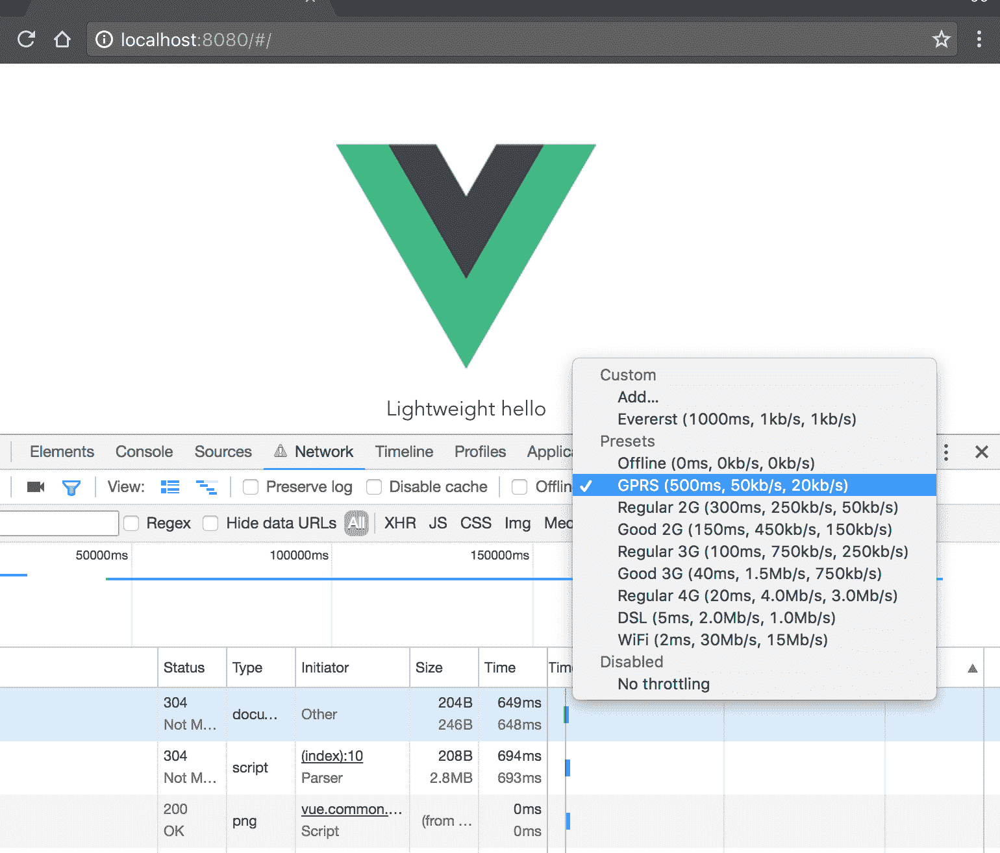
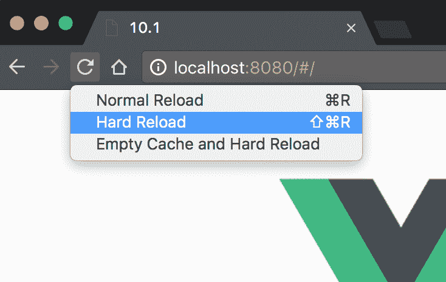
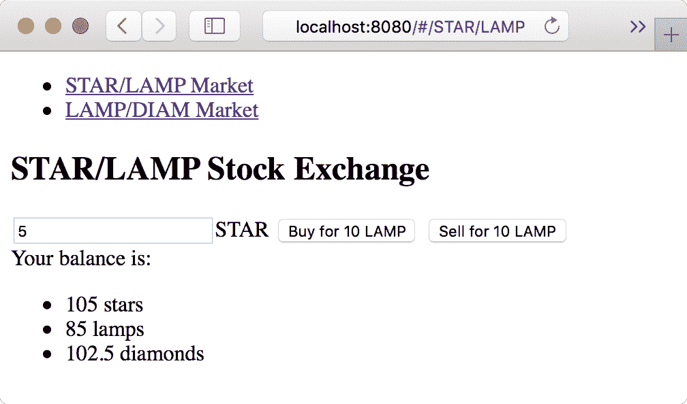
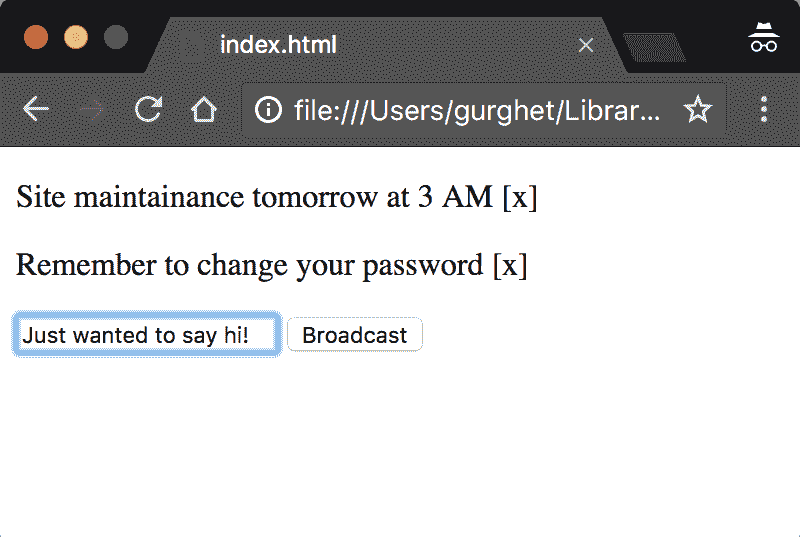
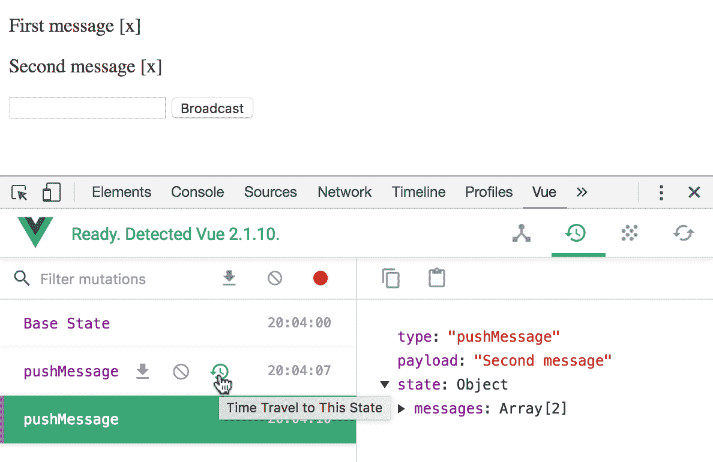
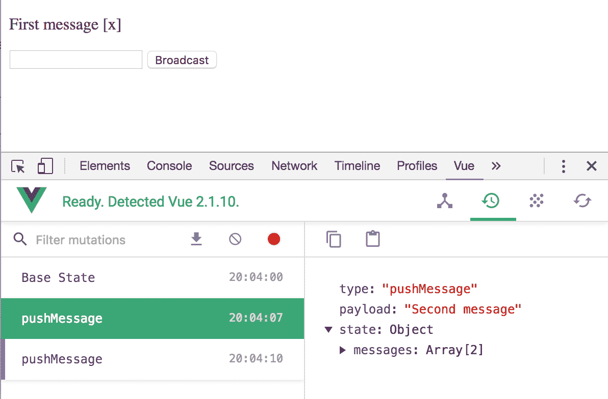

# 第十八章：使用 Vuex 的大型应用程序模式

在本章中，我们将涵盖以下配方：

+   在 vue-router 中动态加载页面

+   为应用程序状态构建一个简单的存储

+   理解 Vuex 的 mutations

+   在 Vuex 中列出你的操作

+   使用模块分离关注点

+   构建 getter 来帮助检索数据

+   测试你的存储

# 介绍

在本章中，你将学习 Vuex 的工作原理以及如何使用它来支持可扩展的应用程序。Vuex 实现了一种在前端框架中流行的模式，它包括将不同的关注点分开来管理一个大型全局应用程序状态。mutations 是唯一可以改变状态的东西，所以你只需要在一个地方查找它。大部分逻辑，以及所有的异步逻辑，都包含在 actions 中；最后，getters 和 modules 进一步帮助分散认知负荷，当涉及计算派生状态和将代码拆分成不同的文件时。

除了配方，你还会发现我在开发真正大型应用程序时发现有用的智慧之言；有些与命名约定有关，有些与避免错误的小技巧有关。

如果你完成了所有的配方，你将准备好开发大型前端应用程序，减少错误并实现无缝协作。

# 在 vue-router 中动态加载页面

很快，你将建立大量组件的大型 Vue 网站。加载大量 JavaScript 可能会产生浪费和无用的前期延迟。

# 准备工作

这个配方需要了解 vue-router。

# 如何做...

通过创建新目录并运行以下命令来使用`vue-cli`创建一个新项目：

```js
vue init webpack
```

你可以根据自己的喜好回答问题，只要在要求时将`vue-router`添加到模板中即可。

我们将创建两个组件：一个将是我们的主页，它将是小而轻的，另一个组件将非常大且加载速度很慢。我们想要实现的是立即加载主页，而不必等待浏览器下载巨大的组件。

打开`components`文件夹中的`Hello.vue`文件。删除所有内容，只留下以下内容：

```js
<template>
  <div>
    Lightweight hello
  </div>
</template>
```

在同一个文件夹中，创建另一个名为`Massive.vue`的文件，并在其中写入以下内容：

```js
<template>
  <div>
   Massive hello
  </div>
</template>

<script>
/* eslint-disable no-unused-vars */
const a = `
```

在最后一行留一个开放的反引号，因为我们必须用大量无用的数据膨胀文件。保存并关闭`Massive.vue`。

在控制台中，转到存储文件的相同目录，并使用以下文件将大量垃圾放入其中：

```js
yes "XXX" | head -n $((10**6)) >> Massive.vue
```

这个命令的作用是将`XXX`行重复附加到文件中 10⁶次；这将向文件添加 400 万字节，使其对于快速浏览体验来说太大了。

现在我们需要关闭我们打开的反引号。不要尝试现在打开文件，因为你的文本编辑器可能无法打开这样一个庞大的文件；相反，使用以下命令：

```js
echo '`</script>' >> Massive.vue
```

我们的`Massive`组件现在已经完成。

打开`router`文件夹中的`index.js`并添加组件及其路由：

```js
import Massive from '@/components/Massive'
...
export default new Router({
  routes: [
    {
      path: '/',
      name: 'Hello',
      component: Hello
    },
 {
 path: '/massive',
 name: 'Massive',
 component: Massive
 }
  ]
})
```

使用`npm install`安装所有依赖项后，我们现在可以使用`npm run dev`命令启动我们非常庞大的应用程序了。

该应用程序将加载得非常快，但这是因为它直接从您的本地存储加载；为了模拟更真实的情况，打开开发者工具中的网络选项卡，并选择网络限制。选择一些慢的东西，比如 GPRS 或者好的 3G，这是我们大多数人可能拥有的：



现在右键单击刷新按钮，选择硬刷新以绕过缓存（或按*Shift* + *Cmd* + *R*）：



你会注意到页面加载需要几分钟的时间。当它变成 X 时，你可以通过再次单击刷新按钮来停止页面的加载。

为了解决这个问题，回到`router`文件夹中的`index.js`文件。删除以下行，其中你导入`Massive`组件：

```js
import Massive from '@/components/Massive'
```

前一行告诉 Webpack 将`Massive`组件中包含的所有代码都包含在一个单独的 js 捆绑包中。相反，我们希望告诉 Webpack 将`Massive`组件保持为一个单独的捆绑包，并且只在必要时加载它。

不要直接导入组件，使用以下代码声明`Massive`：

```js
const Massive = resolve =>
 require(['../components/Massive.vue'], resolve)
```

Webpack 将把这种特殊语法转换为一个单独的文件，它将被懒加载。保存并在仍然设置为慢速的限制下进行另一次硬刷新（比如 GPRS 到好的 3G）。几秒钟后，你应该能够看到 hello 页面。如果你想加载`Massive`组件，只需将`massive`添加到 URL 中，但你将需要等待一段时间。

# 它是如何工作的...

显然，在真实的应用程序中，你不会有这样一个庞大的组件，但你可以很容易地看到，如果`Massive`组件代表了你的应用程序的所有其他组件，它们很快就会累积成这样一个庞大的大小。

这里的诀窍是异步加载它们；Webpack 将帮助您将它们分成更小的包，这样它们只会在需要时加载。

# 还有更多...

有一种替代语法可以懒惰地导入组件。这可能会成为未来的 ECMA 标准，所以你应该意识到这一点。打开`router`目录内的`index.js`文件，并完全删除`Massive`组件的导入，或者我们在这个示例中添加的`Massive`常量行。

在路由内，当指定`/massive`路由的组件时，尝试以下操作：

```js
routes: [ {  path:  '/',
  name:  'Hello',
  component:  Hello
 }, {     path:  '/massive',
  name:  'Massive',
 component: import('@/components/Massive') } ] 
```

这将等同于我们之前所做的，因为 Webpack 将获取这行，并且不会直接导入 Massive 组件的代码，而是创建一个不同的 js 文件，懒加载加载。

# 为应用程序状态构建一个简单的存储

在这个示例中，您将了解在构建大型应用程序时 Vuex 的基本原理。这个示例有点不正统，因为为了理解 Vuex 存储的工作原理，我们将直接操作它；在真实应用程序中，你永远不应该这样做。

# 准备工作

在尝试这个示例之前，您应该知道如何让组件与 Vuex 通信。

# 如何做...

在一个新的目录中运行以下命令，基于 Webpack 模板创建一个新项目：

```js
vue init webpack
```

你如何回答这个问题并不重要。运行`npm intall`并使用`npm install vuex --save`或者如果你使用 yarn，使用`yarn add vuex`来安装 Vuex。

打开`src`文件夹内的`main.js`文件，并添加以下突出显示的行以完成安装 Vuex：

```js
import Vue from 'vue'
import App from './App'
import router from './router'
import store from './store'

/* eslint-disable no-new */
new Vue({
 el: '#app',
 router,
 store,
 template: '<App/>',
 components: { App }
})
```

当然，现在没有`store`模块，所以你需要创建一个。为此，在`src`文件夹下创建一个名为`store`的文件夹。在其中，创建一个名为`index.js`的文件。在`main.js`文件中，我们没有指定使用`index.js`文件，但当没有指定文件而只有文件夹时，这是默认行为。

我们将实现的是一个简化的股票市场。我们有三种资产：星星（STAR）、灯（LAMP）和钻石（DIAM）。我们将定义两条路线：一条用于 STAR/LAMP 市场，另一条用于 LAMP/DIAM 市场。

在存储文件夹中的`index.js`文件中，写入以下内容：

```js
import Vue from 'vue'
import Vuex from 'vuex'
Vue.use(Vuex)
const store = new Vuex.Store({
  state: {
    STAR: 100,
    LAMP: 100,
    DIAM: 100,
    rate: {
      STAR: {
        LAMP: 2
      },
      LAMP: {
        DIAM: 0.5
      }
    }
  }
})
export default store
```

我们正在创建一个新的`Vuex`存储，用于保存我们的余额。最初，我们每种资产有 100 个；在存储中，星星和灯之间的汇率以及灯和钻石之间的汇率也是固定的。

在`components`目录下创建一个名为`Market.vue`的新组件。它将具有以下模板：

```js
<template>
  <div class="market">
    <h2>{{symbol1}}/{{symbol2}} Stock Exchange</h2>
    <div class="buy-sell">
      <input v-model.number="amount">{{symbol1}}
      <button @click="buy">
        Buy for {{rate*amount}} {{symbol2}}
      </button>
      <button @click="sell">
        Sell for {{rate*amount}} {{symbol2}}
      </button>
    </div>
  </div>
</template>
```

`symbol1`和`symbol2`代表两种交易的资产。在这个组件的 JavaScript 中，我们定义了`sell`和`buy`方法，直接在全局`Vuex`存储上操作：

```js
<script>
export default {
  name: 'market',
  data () {
    return {
      amount: 0
    }
  },
  computed: {
    rate () {
      return this.$store.state.rate[this.symbol1][this.symbol2]
    }
  },
  props: ['symbol1', 'symbol2'],
  methods: {
    buy () {
      this.$store.state[this.symbol1] += this.amount
      this.$store.state[this.symbol2] -= this.amount * this.rate
    },
    sell () {
      this.$store.state[this.symbol1] -= this.amount
      this.$store.state[this.symbol2] += this.amount * this.rate
    }
  }
}
</script>
```

您不应该像我在这里所做的那样直接触摸状态。您应该始终使用 mutations。在这里，我们跳过中间人以保持食谱的最小化。关于 mutations 的更多内容将在下一个食谱中介绍。

您必须在`router`文件夹中的`index.js`中以以下方式使用此组件：

```js
import Vue from 'vue'
import Router from 'vue-router'
import Market from '@/components/Market'
Vue.use(Router)
export default new Router({
  routes: [
    {
      path: '/',
      redirect: '/STAR/LAMP'
    },
    {
      path: '/:symbol1/:symbol2',
      component: Market,
      props: true
    }
  ]
})
```

在上述代码中，我们对包含一对交易符号的任何路由使用`Market`组件。作为主页，我们使用 STAR/LAMP 市场。

为了显示一些导航链接到不同的市场和我们当前的余额，我们可以编辑`App.vue`组件，使用以下模板：

```js
<template>
  <div id="app">
    <nav>
      <ul>
        <li>
          <router-link to="/STAR/LAMP">STAR/LAMP Market</router-link>
        </li><li>
          <router-link to="/LAMP/DIAM">LAMP/DIAM Market</router-link>
        </li>
      </ul>
    </nav>
    <router-view></router-view>
    <div class="balance">
      Your balance is:
      <ul>
        <li>{{$store.state.STAR}} stars</li>
        <li>{{$store.state.LAMP}} lamps</li>
        <li>{{$store.state.DIAM}} diamonds</li>
      </ul>
    </div>
  </div>
</template>
```

对于这个组件，我们不需要任何 JavaScript，所以可以删除`<script>`标签。

我们的应用现在已经准备就绪；启动它并开始交易。以下图片是我们完成的应用程序，不包括`App.vue`中包含的样式：



# 它是如何工作的...

底部的余额就像全局状态的摘要。通过 Vuex，我们能够通过访问每个组件都被 Vuex 插件注入的`$store`变量来影响其他组件。当您想要基本上扩展变量的范围超出组件本身时，您可以很容易地想象如何在大型应用程序中使用这种策略。

一些状态可能是局部的，例如，如果您需要一些动画或者需要一些变量来显示组件的模态对话框；不将这些值放入存储中是完全可以的。否则，在一个地方拥有结构化的集中状态会帮助很多。在随后的食谱中，您将使用更高级的技术来更好地利用 Vuex 的力量。

# 理解 Vuex 的变异

在 Vuex 应用程序中，变异状态的正确方法是使用 mutations 的帮助。变异是将状态更改分解为原子单位的非常有用的抽象。在这个食谱中，我们将探讨这一点。

# 准备就绪

完成上一个食谱后，可以完成此食谱，而无需太多了解 Vuex。

# 如何做...

将 Vuex 作为项目的依赖项添加（CDN 地址为`https://unpkg.com/vuex`）。我假设您正在使用 JSFiddle 进行跟进；否则，请记住在存储代码之前放置`Vue.use(Vuex)`。

我们将构建的示例应用程序是向网站用户广播通知。

HTML 布局如下所示：

```js
<div id="app">
  <div v-for="(message, index) in messages"> 
    <p style="cursor:pointer">{{message}}
      <span @click="close(index)">[x]</span>
    </p>
  </div>
  <input v-model="newMessage" @keyUp.enter="broadcast">
  <button @click="broadcast">Broadcast</button>
</div>
```

这个想法是有一个文本框来写消息，广播的消息将显示在顶部，最近的消息将首先显示。可以通过点击小 x 来关闭消息。

首先，让我们构建一个存储库，用于保存广播消息列表并列举我们可以对该列表进行的可能变异：

```js
const store = new Vuex.Store({
  state: {
    messages: []
  },
  mutations: {
    pushMessage (state, message) {
      state.messages.push(message)
    },
    removeMessage (state, index) {
      state.messages.splice(index, 1)
    }
  }
})
```

因此，我们有一系列消息；我们可以将其中一个推送到列表的顶部，或者通过知道其索引来删除消息。

接下来，我们需要编写应用程序本身的逻辑：

```js
new Vue({
  store,
  el: '#app',
  data: {
    newMessage: ''
  },
  computed: Vuex.mapState(['messages']),
  methods: {
    broadcast () {
      store.commit('pushMessage', this.newMessage)
      this.newMessage = ''
    },
    close (index) {
      store.commit('removeMessage', index)
    }
  }
})
```

现在，您可以启动应用程序并开始向我们虚构的用户广播消息：



# 它是如何工作的...

我认为重要的是要注意变异的名称；它们被称为`pushMessage`和`removeMessage`，但在这个应用程序中它们真正做的是在屏幕上显示消息，并（虚构地）向用户广播消息。将它们称为`showMessage`或`broadcastMessage`和`hideMessage`会更好吗？不会，因为变异本身和该变异的特定效果之间必须有明确的意图分离。当我们决定让用户有能力忽略这些通知或者在实际广播通知之前引入延迟时，问题就变得清晰了。然后我们将有一个`showMessage`变异，它实际上并不显示消息。

我们使用的计算语法如下所示：

```js
computed: Vuex.mapState(['messages'])
```

当您将 Vuex 作为 ES6 模块导入时，您不必在表达式中显式使用 Vuex。您只需要写

`import { mapState } from 'Vuex'`。

然后，`mapState`函数将可用。

`mapState`方法以字符串数组作为参数，查找存储中具有相同名称的`state`变量，并创建具有相同名称的计算属性。您可以使用任意数量的变量来做到这一点。

# 还有更多...

如果您在本地 npm 项目上跟随操作，请打开 Vue 开发者工具（不幸的是，在使用 JSFiddle 时，Vue 开发者工具不可用），您将看到每条消息都会发出一个新的变异。考虑一下，您点击了小时钟：



实际上，您可以使用它来撤消变异，如下图所示：



请注意，当点击时间旅行选项时，状态并未发生变化；这是因为紫色丝带仍然停留在最后的状态。要查看不同的状态，只需点击变异名称本身。

这种调试机制是可能的，因为变异始终是同步的；这意味着可以在变异之前和之后对状态进行快照，并在时间轴上导航。在下一个食谱中，您将学习如何使用 Vuex 执行异步操作。

# 在 Vuex 中列出您的操作

您的所有变异必须是同步的，那么如何做一些等待超时或使用 Axios 进行 AJAX 请求的事情呢？操作是下一个抽象级别，将帮助您处理这些问题。在操作中，您可以提交多个变异并执行异步操作。

# 准备就绪

变异是操作的构建块，因此强烈建议您在尝试此操作之前完成前面的食谱。

我们将使用“为应用程序状态构建简单存储”食谱中的设置；您也可以使用自己的设置，但无论如何，此食谱都是基于官方 Webpack 模板的轻微修改。

# 如何做...

您将构建一个流行的 Xkcd 网站的克隆。实际上，它将更像是一个包装器，而不是一个真正的克隆，因为我们将重用网站上的面板。

基于 Webpack 模板创建一个 Vue 项目，使用`vue init webpack`命令。我们首先要做的是在`config`文件夹中的`index.js`中将 API 连接到 Xkcd 网站。将以下行放入`proxyTable`对象中：

```js
module.exports = {
  ...
  dev: {
    proxyTable: {
      '/comic': {
        target: 'https://xkcd.com',
        changeOrigin: true,
        pathRewrite: (path, req) => {
          const num = path.split('/')[2]
          return `/${num}/info.0.json`
        }
      }
    },
  ...
```

这将把我们发出的所有请求重定向到`/comic`到 Xkcd 网站。

在`src`目录下，创建一个新的`store`目录，并在其中创建一个`index.js`文件；在这里，开始构建应用程序存储：

```js
import Vue from 'vue'
import Vuex from 'vuex'

Vue.use(Vuex)

const store = new Vuex.Store({
  state: {
    currentPanel: undefined,
    currentImg: undefined,
    errorStack: []
  },
  actions: {},
  mutations: {}
}

export default store
```

您应该像以前的食谱一样在`main.js`中导入这个。我们想要跟踪当前面板编号，面板图像的链接以及可能的错误。修改状态的唯一方法是通过变异，而操作可以执行异步工作。

当应用程序加载时，我们计划显示最新的漫画。为此，我们创建一个动作：

```js
actions: {
  goToLastPanel ({ commit }) {
    axios.get(endpoint)
      .then(({ data }) => {
        commit('setPanel', data.num)
        commit('setImg', data.img)
      }).catch(error => {
        commit('pushError', error)
      })
  }
 ...
```

为了使此代码工作，我们需要声明端点并安装 Axios：

```js
...
import axios from 'axios'
...
const endpoint = '/comic/'
```

对于您来说，编写相应的突变应该很容易：

```js
mutations: {
  setPanel (state, num) {
    state.currentPanel = num
  },
  setImg (state, img) {
    state.currentImg = img
  },
  pushError (state, error) {
    state.errorStack.push(error)
  }
}
```

我们将重用`Hello.vue`组件，并在其中放入以下模板：

```js
<template>
  <div class="hello">
    <h1>XKCD</h1>
    
  </div>
</template>
```

为了在加载时显示最后一个面板，您可以在组件中使用以下 JavaScript：

```js
<script>
import { mapState } from 'vuex'
export default {
  name: 'hello',
  computed: mapState(['currentImg']),
  created () {
    this.$store.dispatch('goToLastPanel')
  }
}
</script>
```

此外，您可以删除大部分`App.vue`模板，只留下以下内容：

```js
<template>
  <div id="app">
    <router-view></router-view>
  </div>
</template>
```

# 它是如何工作的...

`proxyTable`对象将配置`http-proxy-middleware`。每当我们开发大型 Web 应用程序的 UI 并在`localhost`上启动开发服务器，但我们的 API 响应到另一个 Web 服务器时，这将非常有用。当我们想要使用 CORS 并且不允许其他网站使用我们的 API 时，这一点尤为重要。Xkcd API 不允许`localhost`消耗 Web 服务。这就是为什么，即使我们尝试直接使用 Xkcd API，我们的浏览器也不会让我们这样做。`changeOrigin`选项将以 Xkcd 为主机发送请求，从而使 CORS 变得不必要。

要从组件中调用一个动作，我们使用了`dispatch`函数。还可以传递第二个参数，第一个是动作本身的名称。然后在定义动作时将第二个参数传递。

关于命名的最后说明——在我的看法中，由于动作是异步的，而突变是同步的，因此无需在动作的名称中显式地表明异步性。

# 使用模块分离关注点

构建大型应用程序时，Vuex 存储可能会变得拥挤。幸运的是，可以使用模块将应用程序的不同关注点分成单独的区块。

# 准备工作

如果您想使用模块，这个示例可以作为参考。您应该已经对 Vuex 有足够的了解。

对于这个示例，您需要对 Webpack 有一定的了解。

# 如何做...

在这个示例中，我们将以稍微简化的方式对一个完全功能的人体进行建模。每个器官都将有一个单独的模块。

使用`vue init webpack`和`npm install vuex`创建一个新的 Webpack 模板。在其中创建一个包含`src/store/index.js`文件的新目录。在其中，写入以下内容：

```js
import Vue from 'vue'
import Vuex from 'vuex'

Vue.use(Vuex)

const store = new Vuex.Store({
  modules: {
    brain,
    heart
  }
})

export default store
```

`heart`模块是这样的；将其放在存储声明之前：

```js
const heart = {
  state: { loves: undefined },
  mutations: {
    love (state, target) {
      state.loves = target
    },
    unlove (state) {
      state.loves = undefined
    }
  }
}
```

请注意，传递给突变的状态不是根状态，而是模块的本地状态。

然后是大脑，它分为左叶叶和右叶叶；在存储之前写入以下内容：

```js
const brain = {
  modules: {
    left: leftLobe,
    right: rightLobe
  }
}
```

你可以将它们实现为简单的布尔状态（在它们所依赖的大脑之前写入）：

```js
const leftLobe = {
  namespaced: true,
  state: { reason: true },
  mutations: {
    toggle (state) { state.reason = !state.reason }
  }
}
const rightLobe = {
  namespaced: true,
  state: { fantasy: true },
  mutations: {
   toggle (state) { state.fantasy = !state.fantasy }
  }
}
```

将`namespaced`设置为 true 会修改你调用 mutator 的方式。因为它们都被称为`toggle`，现在你可以指定哪个叶叶，例如，对于左叶叶，变异字符串变成了`left/toggle`，其中`left`表示它是大脑中用来指代左叶叶的键。

要查看你的存储在运行中的情况，你可以创建一个使用所有变异的组件。对于大脑，我们可以有两张叶叶的图片，如下所示：

```js

```

这将用红色铅笔创建两个大脑叶叶的图画；注意嵌套方式中模块名称的使用。以下的`off` CSS 规则会使叶叶变灰：

```js
.off {
  filter: grayscale(100%)
}
```

要调用变异，我们在正确的方法中使用上述字符串：

```js
methods: {
  left () {
    this.$store.commit('left/toggle')
  },
  right () {
    this.$store.commit('right/toggle')
  }
}
```

你也可以创建一个输入文本框，并调用其他两个变异，如下所示：

```js
...
love () {
  this.$store.commit('love', this.partner)
},
clear () {
  this.$store.commit('unlove')
  this.partner = undefined
}
...
```

这很容易，但是如何检索叶叶的名称呢？你可以在你的模板中放上这些大括号：

```js
<p> loves: {{$store.state.heart.loves}}</p>
<input v-model="partner" @input="love">
<button @click="clear">Clear</button>
```

显然，你必须在你的 Vue 实例上声明`partner`变量：


# 它是如何工作的...

我们已经看到了如何使用模块将你的应用程序关注点分成不同的单元。随着项目规模的增长，这种能力可能变得很重要。

常见模式是，在变异中，你可以直接访问本地状态：

```js
const leftLobe = {
  namespaced: true,
  state: { reason: true },
  mutations: {
    toggle (state) {
      // here state is the left lobe state
      state.reason = !state.reason
    }
  }
}
```

在变异中，只有访问本地状态是有意义的。例如，大脑不能改变心脏，反之亦然，但动作呢？如果我们在模块内声明一个动作，我们会得到一个名为上下文的对象，看起来像这样：

```js
{
  "getters":{},
  "state":{
    "reason":true
  },
  "rootGetters":{},
  "rootState":{
    "brain":{
      "left":{
        "reason":true
      },
      "right":{
        "fantasy":false
      }
    },
    "heart":{
      "loves": "Johnny Toast"
    }
  }
}
```

因此，如果我们想在左叶叶中声明一个动作，并且想要影响心脏，我们必须做类似以下的事情：

```js
actions: {
  beNerd ({ rootState }) {
    rootState.heart.loves = 'Math & Physics'
  }
}
```

# 构建 getter 来帮助检索你的数据

你不想在你的状态中保存太多数据。保留重复或派生数据可能特别危险，因为它很容易失去同步。Getter 可以帮助你做到这一点，而不会将负担转移到组件上，因为它将所有逻辑都保存在一个地方。

# 准备工作

如果你已经具有一些 Vuex 知识并且想要拓展你的视野，那么这个教程适合你。

# 如何做...

想象一下，你正在构建一个比特币钱包。你想给你的用户一个余额概览，并且你希望他们看到它对应多少欧元。

使用`vue init webpack`和`npm install vuex`创建一个新的 Webpack 模板。创建一个新的`src/store/index.js`文件，并在其中写入以下内容：

```js
import Vue from 'vue'
import Vuex from 'vuex'

Vue.use(Vuex)

const store = new Vuex.Store({
  state: {
    bitcoin: 600,
    rate: 1000,
    euro: 600000
  }
})

export default store
```

这段代码容易出错。如果我们没有正确进行乘法运算，第一个错误可能是欧元金额的错误计算。第二种错误可能是在交易过程中告诉用户“比特币”和“欧元”余额，导致其中一种金额过时和错误。

为了解决这些问题，我们使用`getters`：

```js
const store = new Vuex.Store({
  state: {
    bitcoin: 600,
    rate: 1000
  },
  getters: {
    euro: state => state.bitcoin * state.rate
  }
})
```

这样，“欧元”金额永远不会在状态中，而是始终计算。此外，它是集中在存储中，因此我们不需要向我们的组件添加任何内容。

现在，从模板中轻松检索两个金额：

```js
<template>
  <div>
    <h1>Balance</h1>
    <ul>
      <li>{{$store.state.bitcoin}}฿</li>
      <li>{{$store.getters.euro}}&euro;</li>
    </ul>
  </div>
</template>
```

在这里，`&#3647 ;`是比特币符号的 HTML 实体。

# 它是如何工作的...

如果我们不谈论输入数据，为派生数据设置一个 getter 总是一个好主意。我们尚未讨论的 getter 的一个显着特点是它们能够与其他 getter 进行交互并接受参数。

# 访问其他 getter

调用 getter 时传递的第二个参数是包含其他`getters`的对象：

```js
getters:  {
 ...
  getCatPictures: state => state.pictures.filter(pic => isCat(pic)) getKittens:  (state, getters)  =>  {
 return getters.getCatPictures().filter(cat  => !isAdult(cat))
 } } 
```

在我们的示例中，我们可以调用`euro`getter 来获得一些更多的派生数据，比如我们可以用 150,000 欧元的平均价格大致计算出我们可以用比特币购买多少房屋：

```js
const store = new Vuex.Store({
  state: {
    bitcoin: 600,
    rate: 1000
  },
  getters: {
    euro: state => state.bitcoin * state.rate,
    houses: (state, getters) => getters.euro() / 150000
})
```

# 传递参数

如果 getter 返回一个带有参数的函数，那么该参数将成为 getter 的参数：

```js
getters: {
  ...
  getWorldWonder: state => nth => state.worldWonders[nth]
}
```

在我们的示例中，一个实际的例子可以指定前一段中的 getter 中房屋的平均成本：

```js
const store = new Vuex.Store({
  state: {
    bitcoin: 600,
    rate: 1000
  },
  getters: {
    euro: state => state.bitcoin * state.rate,
    houses: (state, getters) => averageHousePrice => {
 return getters.euro() / averageHousePrice
 }
})
```

# 测试您的 store

在这个示例中，您将为 Vuex 存储编写测试。

# 准备就绪

这个示例需要对单元测试和端到端测试有所了解，并且对 Vuex 有一些了解。

# 如何做...

首先，我将定义我们的存储必须实现的一些功能；然后，您将编写证明这些功能存在且正常工作的测试。

# 软件要求

我们的存储包括待办事项列表中的项目，如下所示：

```js
state: {
  todo: [
    { id: 43, text: 'Buy iPhone', done: false },
    ...
  ],
  archived: [
    { id: 2, text: 'Buy gramophone', done: true },
    ...
  ]
}
```

我们有两个要求：

+   我们必须有一个`MARK_ITEM_AS_DONE`mutation，将`done`字段从 false 更改为 true。

+   我们必须有一个`downloadNew`操作，从服务器下载最新项目并将其添加到列表中。

# 测试 mutations

为了能够测试您的 mutations，您必须使它们可用于您的测试文件。为此，您必须从存储中提取 mutation 对象。考虑类似于这样的东西：

```js
import Vuex from 'vuex'
import Vue from 'vue'

Vue.use(Vuex)

const store = new Vuex.Store({
  ...
  mutations: {
    ...
    MARK_ITEM_AS_DONE (state, itemId) {
      state.todo.filter(item => {
        return item.id === itemId
      }).forEach(item => {
        item.done = true
      })
      state.archived.filter(item => {
        return item.id === itemId
      }).forEach(item => {
        item.done = true
      })
    }
  }
}) 

export default store
```

您必须将其提取为类似于这样的东西：

```js
export const mutations = { ... }

const store = new Vuex.Store({ ... })

export default store
```

这样，您可以在测试文件中使用以下行导入突变：

```js
import { mutations } from '@/store'
```

对第 1 个要求的测试可以编写如下：

```js
describe('mutations', () => {
  it(`MARK_ITEM_AS_DONE mutation must change the
        done field from false to true for a todo`, () => {
    const state = {
      todo: [
        { id: 43, text: 'Buy iPhone', done: false }
      ],
      archived: [
        { id: 40, text: 'Buy cat', done: false }
      ]
    }
    mutations.MARK_ITEM_AS_DONE(state, 43)
    expect(state.todo[0].done).to.be.true
  })
})
```

如果您使用官方的 Webpack 模板，可以使用`npm run unit`运行测试。这默认使用 PhantomJS，它不实现一些功能。您可以使用 Babel polyfills，或者简单地进入`karma.conf.js`并在`browsers`数组中写入`Chrome`而不是`PhantomJS`。记得使用`npm install karma-chrome-launcher --save-dev`安装 Chrome 启动器。

# 测试行动

**测试行动**意味着测试行动是否提交了预期的突变。我们对突变本身不感兴趣（至少在单元测试中不感兴趣），因为它们已经单独测试过了。不过，我们可能需要模拟一些依赖关系。

为了避免依赖于 Vue 或 Vuex（因为我们不需要它们，它们可能会污染测试），我们在`store`目录中创建了一个新的`actions.js`文件。使用`npm install axios`安装 Axios。`actions.js`文件可以如下所示：

```js
import axios from 'axios'

export const actions = {
  downloadNew ({ commit }) {
    axios.get('/myNewPosts')
      .then(({ data }) => {
        commit('ADD_ITEMS', data)
      })
  }
}
```

为了测试第 2 个要求，我们首先模拟应该下载新待办事项的服务器调用：

```js
describe('actions', () => {
const actionsInjector = 
  require('inject-loader!@/store/actions')
const buyHouseTodo = {
  id: 84,
  text: 'Buy house',
  done: true
}
const actions = actionsInjector({
  'axios': {
    get () {
      return new Promise(resolve => {
        resolve({
          data: [buyHouseTodo]
        })
      })
    }
  }
}).default
}
```

这将确保对`axios`的`get`方法的任何调用都将始终返回一个新的待办事项。

然后，我们希望确保在调度时调用`ADD_ITEMS`突变：

```js
describe('actions', () => {
  const actionsInjector = 
    require('inject-loader!@/store/actions')
    const buyHouseTodo = {
      id: 84,
      text: 'Buy house',
      done: true
    }
    const actions = actionsInjector({
      'axios': {
        get () {
          return new Promise(resolve => {
            resolve({ data: [buyHouseTodo] })
          })
        }
      }
    }).default
    it(`downloadNew should commit ADD_ITEMS
    with the 'Buy house' todo when successful`, done => {
    const commit = (type, payload) => {
      try {
        expect(type).to.equal('ADD_ITEMS')
        expect(payload).to.deep.equal([buyHouseTodo])
        done()
      } catch (error) {
        done(error)
      }
    }
  actions.downloadNew({ commit })
  })
})
```

# 它是如何工作的...

对突变的测试非常简单，但我认为对行动的测试需要更多的解释。

由于我们不想依赖外部服务来执行操作，我们不得不模拟`axios`服务。我们使用`inject-loader`，它接受原始库并用任意代码模拟我们指定的部分（`@`符号是`src`的简写）；在我们的情况下，我们模拟了`axios`库，特别是`get`方法。我们必须使用 CommonJS 语法（带有`require`）因为这是告诉 Webpack 在导入时使用加载器的唯一方法。

在测试中，我们还模拟了`commit`函数。通常，这个函数调用一个修改状态的突变。我们只想知道是否调用了正确的突变，并且带有正确的参数。此外，我们必须将所有内容包装在`try`块中；如果没有它，测试将因超时而失败，我们将丢失错误。相反，现在我们立即失败，我们可以从控制台中读取导致测试失败的错误。
