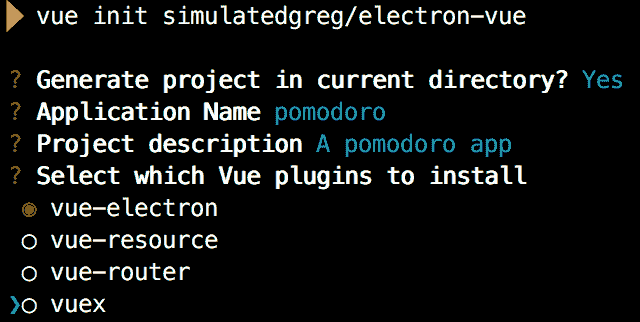
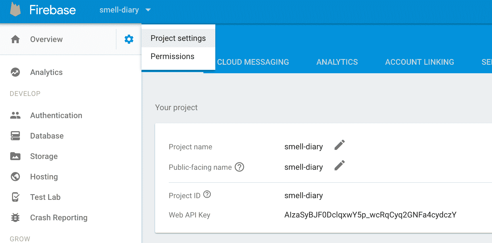
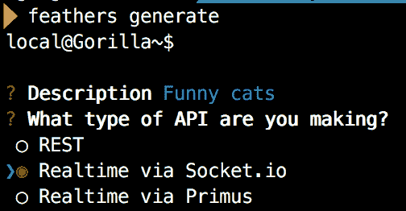

# 第十九章：与其他框架集成

在本章中，我们将探讨以下主题：

+   使用 Electron 构建通用应用程序

+   使用 Vue 与 Firebase

+   使用 Feathers 创建实时应用程序

+   使用 Horizon 创建一个响应式应用程序

# 介绍

Vue 很强大，但如果您需要后端，它单独做不了太多；至少您需要一个服务器来部署您的软件。在本节中，您将使用流行的框架实际构建小型但完整且可工作的应用程序。Electron 用于将 Vue 应用程序带到桌面。Firebase 是一个现代的云后端，最后，FeatherJS 是一个简约但功能齐全的 JavaScript 后端。完成这些后，您将拥有与它们交互并快速构建专业应用程序所需的所有工具。

# 使用 Electron 构建通用应用程序

Electron 是一个用于在 Mac、Linux 和 Windows 上运行通用应用程序的框架。它的核心是一个精简版的 Web 浏览器。它已被用于创建广泛使用的应用程序，如 Slack 和 Visual Studio Code 等。在这个示例中，您将使用 Electron 构建一个简单的应用程序。

# 准备工作

为了构建这个应用程序，我们将只使用基本的 Vue 功能。Electron 超出了本书的范围，但对于这个示例，不需要了解 Electron；事实上，这是学习更多关于 Electron 的好起点。

# 如何做...

在这个示例中，我们将构建一个小型但完整的应用程序--一个番茄钟应用程序。番茄钟是大约 25 个时间单位的间隔，您应该集中精力工作。之所以这样称呼它，是因为通常使用番茄形状的厨房计时器来测量时间。这个应用程序将跟踪时间，这样您就不必购买昂贵的厨房计时器了。

使用 Electron-Vue 模板是使用 Electron 快速启动 Vue 项目的最佳方法（你不说！）。可以通过以下命令轻松实现：

```js
vue init simulatedgreg/electron-vue pomodoro
```

您可以使用默认值进行回答，但当被问及要安装哪个插件时，只需选择`vue-electron`。使用`npm intall`安装所有依赖项，如果愿意，您可以在进行必要修改时保持应用程序处于热重新加载状态，方法是使用`npm run dev`。您可以通过单击角落的*x*来隐藏开发工具：



首先，我们希望我们的应用程序尽可能小。让我们转到`app/src/main/index.js`文件；这个文件控制我们应用程序的生命周期。将窗口大小更改为以下内容：

```js
mainWindow = new BrowserWindow({
  height: 200,
  width: 300
})
```

然后，我们并不真的想要`app/src/render/components`文件夹中的样板组件，所以您可以删除所有内容。相反，创建一个`Pomodoro.vue`文件，并将此模板放入其中：

```js
<template>
  <div class="pomodoro">
    <p>Time remaining: {{formattedTime}}</p>
    <button v-if="remainingTime === 1500" @click="start">Start</button>
    <button v-else @click="stop">Stop</button>
  </div>
</template>
```

为了使其工作，我们还必须编写 JavaScript 部分，如下所示：

```js
<script>
export default {
  data () {
    return {
      remainingTime: 1500,
      timer: undefined
    }
  },
  methods: {
    start () {
      this.remainingTime -= 1
      this.timer = setInterval(() => {
        this.remainingTime -= 1
        if (this.remainingTime === 0) {
          clearInterval(this.timer)
        }
      }, 1000)
    },
    stop () {
      clearInterval(this.timer)
      this.remainingTime = 1500
    }
  }
}
</script>
```

这样，单击程序中的开始按钮将每秒减少 1 秒。单击停止按钮将清除计时器并将剩余时间重置为 1500 秒（25 分钟）。计时器对象基本上是`setInterval`操作的结果，`clearInterval`只是停止计时器正在执行的任何操作。

在我们的模板中，我们希望有一个`formattedTime`方法，以便以`mm:ss`格式查看时间，这比仅剩秒数更易读（即使更极客），因此我们需要添加计算函数：

```js
computed: {
  formattedTime () {
    const pad = num => ('0' + num).substr(-2)
    const minutes = Math.floor(this.remainingTime / 60)
    const seconds = this.remainingTime - minutes * 60
    return `${minutes}:${pad(seconds)}`
  }
}
```

要将此组件添加到应用程序中，请转到`App.vue`文件并编辑以下行，替换`landingPage`占位符元素：

```js
<template>
  <div id="#app">
 <pomodoro></pomodoro>
  </div>
</template>

<script>
 import Pomodoro from 'components/Pomodoro'
  export default {
    components: {
 Pomodoro
    }
  }
</script>
```

使用`npm run dev`启动应用程序，现在您应该能够在工作或学习时跟踪时间了：


甚至可以使用`npm run build`命令构建应用程序的可分发版本。

# 工作原理...

我们实现的计时器方式对于时间跟踪来说并不特别准确。让我们来审查一下代码：

```js
this.timer = setInterval(() => {
  this.remainingTime -= 1
  if (this.remainingTime === 0) {
    clearInterval(this.timer)
  }
}, 1000)
```

这意味着我们每秒减少剩余时间。问题在于`setInterval`函数本身并不是 100%准确的，可能会在 1000 毫秒之前或之后触发函数，这取决于机器的计算负载；这样，误差会积累并变成相当大的数量。更好的方法是在每次循环时检查时钟并调整误差，尽管我们不会在这里涵盖这个问题。

# 使用 Vue 和 Firebase

使用 Vue 和 Firebase 作为后端非常容易，这要归功于 VueFire--一个包含 Firebase 绑定的插件。在这个示例中，您将开发一个完全功能的气味数据库。

# 准备工作

Firebase 超出了本书的范围，但是我将假设，对于这个示例，您对基本概念有所了解。除此之外，您真的没有太多需要了解的，因为我们将在此基础上构建一个非常基本的 Vue 应用程序。

# 如何做到这一点...

在开始编写代码之前，我们需要创建一个新的 Firebase 应用程序。要做到这一点，您必须登录[`firebase.google.com/`](https://firebase.google.com/)并创建一个新的应用程序。在我们的情况下，它将被称为`smell-diary`。您还需要记下您的 API 密钥，该密钥可以在项目设置中找到：



此外，您需要禁用身份验证；转到数据库部分，在规则选项卡中，将读取和写入都设置为 true：

```js
{
  "rules": {
    ".read": true,
    ".write": true
  }
}
```

我们已经完成了 Firebase 配置。

打开一个干净的 HTML5 样板或 JSFiddle，使用`Vue`作为库。我们需要将以下依赖项表示为文件头中的脚本标记：

```js
 <script src="https://unpkg.com/vue/dist/vue.js"></script>
 <script src="https://www.gstatic.com/firebasejs/3.6.9/firebase.js"></script>
 <script src="https://unpkg.com/vuefire/dist/vuefire.js"></script>
```

VueFire 将自动检测 Vue（因此顺序很重要）并将自身安装为插件。我们将构建一个非常简单的数据库来跟踪我们周围事物的气味。以下是我们应用程序的 HTML 布局：

```js
<div id="app">
  <ul>
    <li v-for="item in items">
      {{item.name}}: {{item.smell}}
    <button @click="removeItem(item['.key'])">X</button>
    </li>
  </ul>
  <form @submit.prevent="addItem">
    <input v-model="newItem" />
    smells like
    <input v-model="newSmell" />
    <button>Add #{{items.length}}</button>
  </form>
</div>
```

在我们应用程序的 JavaScript 部分，我们需要指定 API 密钥以用于与 Firebase 进行身份验证，写入以下内容：

```js
const config = {
  databaseURL: 'https://smell-diary.firebaseio.com/'
}
```

然后，我们将配置提供给 Firebase 并获取数据库的控制权：

```js
const firebaseApp = firebase.initializeApp(config)
 const db = firebaseApp.database()
```

这可以在`Vue`实例之外完成。VueFire 插件在`Vue`实例中安装了一个名为`firebase`的新选项；我们必须指定我们要使用`item`变量在 Firebase 应用程序中访问`/items`：

```js
new Vue({
  el: '#app',
  firebase: {
    items: db.ref('/items')
  }
})
```

`newItem`和`newSmell`变量将临时保存我们在输入框中输入的值；然后，`addItem`和`removeItem`方法将发布和从我们的数据库中删除数据：

```js
data: {
  newItem: '',
  newSmell: ''
},
methods: {
  addItem () {
    this.$firebaseRefs.items
      .push({
        name: this.newItem,
        smell: this.newSmell
      })
    this.newItem = ''
    this.newSmell = ''
  },
  removeItem (key) {
    this.$firebaseRefs.items
      .child(key).remove()
  }
}
```

如果您现在启动应用程序，您已经可以添加您最喜欢的香味以及嗅探它们的方式：


# 它是如何工作的...

Firebase 作为一个简单的键值存储。在我们的情况下，我们从不存储值，而是始终添加子项；您可以在 Firebase 控制台中查看您创建的内容：


密钥是自动生成的，它们包含空值和 32 级嵌套数据。我们使用一级嵌套来为每个对象插入名称和气味。

# 使用 Feathers 创建实时应用程序

大多数现代应用程序都是实时的，不是传统意义上的实时，而是它们不需要重新加载页面就可以更新。实现这一点最常见的方式是通过 WebSockets。在这个配方中，我们将利用 Feathers 和 Socket.io 来构建一个猫数据库。

# 准备工作

这个配方没有先决条件，但如果您想要更多上下文，可以在开始这个配方之前完成*创建 REST 客户端（和服务器！）*配方。

# 如何操作...

要完成这个配方，您需要 Feathers 的命令行；使用以下命令安装它：

```js
npm install -g feathers-cli
```

现在运行`feathers generate`，它将为您创建所有样板。在询问 API 时，选择 Socket.io：



其他所有问题都可以保持默认值。在 Feather 控制台中，输入`generate service`来创建一个新的服务。您可以将其命名为 cats，并将其他问题保持默认值。

在`public`文件夹中，打开`index.html`并删除除了 HTML5 样板之外的所有内容。您需要在头部引入三个依赖项：

```js
 <script src="//cdnjs.cloudflare.com/ajax/libs/vue/2.1.10/vue.js"></script>
 <script src="//cdnjs.cloudflare.com/ajax/libs/socket.io/1.7.3/socket.io.js"></script>
 <script src="//unpkg.com/feathers-client@¹.0.0/dist/feathers.js"></script>
```

在`body`标签中编写 HTML 布局如下：

```js
<div id="app">
  <div v-for="cat in cats" style="display:inline-block">
    
    <p>{{cat.name}}</p>
  </div>
  <form @submit.prevent="addCat">
    <div>
      <label>Cat Name</label>
      <input v-model="newName" />
    </div>
    <div>
      <label>Cat Url</label>
      <input v-model="newUrl" />
    </div>
    <button>Add cat</button>
    
  </form>
</div>
```

第一个`<div>`标签是猫的画廊。然后，构建一个表单来添加您收集的猫的新图像。

在`body`标签中，您可以始终使用以下行配置 Feathers 服务：

```js
<script>
  const socket = io('http://localhost:3030')
  const app = feathers()
    .configure(feathers.socketio(socket))
  const catService = app.service('cats')
```

这是为了配置将连接到 WebSockets 的浏览器的客户端。`catService`方法是对猫数据库的处理。接下来，我们编写`Vue`实例：

```js
  new Vue({
    el: '#app',
    data: {
      cats: [],
      newName: '',
      newUrl: ''
    },
    methods: {
      addCat () {
        catService.create({
          name: this.newName,
          url: this.newUrl
        })
        this.newName = ''
        this.newUrl = ''
      }
    },
```

最后，我们需要在启动时请求数据库中的所有猫，并安装一个监听器以防其他用户创建新的猫：

```js
    mounted () {
      catService.find()
        .then(page => {
          this.cats = page.data
        })
      catService.on('created', cat => {
        this.cats.push(cat)
      })
    }
 })
 </script>
```

如果您使用`npm start`运行应用程序，可以导航到控制台中写的 URL 以查看您的新应用程序。打开另一个浏览器窗口，看看它如何实时变化：


# 工作原理...

实时查看添加的猫显然是现代应用程序的选择。Feathers 让您可以轻松创建它们，并且只需少量代码，这要归功于底层的 Socket.io，后者又使用了 WebSockets。

WebSockets 实际上并不那么复杂，Feathers 在这种情况下所做的就是监听通道中的消息，并将它们与像向数据库添加内容这样的操作关联起来。

当你可以轻松切换数据库和 WebSocket 提供程序，或者切换到 REST 而不用触碰你的 Vue 代码时，Feathers 的强大之处就显而易见了。

# 使用 Horizon 创建一个反应式应用程序

Horizon 是一个构建反应式、实时可扩展应用程序的平台。它在内部使用 RethinkDB，并且与 Vue 立即兼容。在这个教程中，你将建立一个自动个人日记。

# 准备工作

这个教程只需要一点 Vue 基础知识，但真的没有其他什么。

不过，在开始之前，请确保你安装了 RethinkDB。你可以在他们的网站上找到更多信息（[`www.rethinkdb.com/docs/install/`](https://www.rethinkdb.com/docs/install/)）。如果你有 Homebrew，你可以用`brew install rethinkdb`来安装它。

此外，你还需要一个 Clarifai 令牌。要免费获取一个，请转到[`developer.clarifai.com/`](https://developer.clarifai.com/)并注册。你将看到你应该在你的应用程序中写的代码，就像下面的图片中一样：


特别是，你将需要`clientId`和`clientSecret`，它们以这种方式显示：

```js
var app = new Clarifai.App( 'your client id would be printed here',
 'your client secret would be here' );
```

记下这段代码，或者准备好将其复制粘贴到你的应用程序中。

# 如何做...

写日记是一项艰巨的任务，每天都要写很多。在这个教程中，我们将建立一个基于我们白天拍摄的照片为我们写作的自动日记。

Horizon 将帮助我们记住一切，并在我们的设备之间同步日记。安装 RethinkDB 后，使用以下命令安装 Horizon：

```js
npm install -g horizon
```

现在，你将有一个新的命令`hz`可用。输入`hz -h`来检查它；你应该会看到类似以下的内容：


要创建一个将托管我们的新应用程序的目录，请输入以下内容：

```js
hz init vue_app
```

然后，进入新创建的`vue_app`目录，查看`dist`文件夹中的`index.html`。这个文件将是我们服务器的入口点，用编辑器打开它。

你可以清除一切，只留下一个空的 HTML5 样板，其中包含一个空的`<head>`和`<body>`。在头部部分，我们需要声明对 Vue、Horizon 和 Clarifai 的依赖，如下所示：

```js
 <script src="https://unpkg.com/vue"></script>
 <script src="/horizon/horizon.js"></script>
 <script src="https://sdk.clarifai.com/js/clarifai-latest.js"></script>
```

请注意，Horizon 并不是来自 CDN，而是来自本地依赖。

我们首先为我们的日记制定一个模板。我们有两部分。在第一部分中，我们将列出过去做过的事情。在 HTML 的主体中写入以下内容：

```js
<div id="app">
  <div>
    <h3>Dear diary...</h3>
    <ul>
      <li v-for="entry in entries">
        {{ entry.datetime.toLocaleDateString() }}:
        {{ entry.text }}
      </li>
    </ul>
  </div>
...
```

在第二部分中，我们将输入新条目：

```js
  ...
  <h3>New Entry</h3>
  
  <input type="file" @change="selectFile" ref="file">
  <p v-if="tentativeEntries.length">Choose an entry</p>
  <button v-for="tentativeEntry in tentativeEntries" @click="send(tentativeEntry)">
    {{tentativeEntry}}
  </button>
</div>
```

在此之后，打开一个`<script>`标签，我们将在其中编写以下所有 JavaScript。

首先，我们需要登录到 Clarifai：

```js
var app = new Clarifai.App(
 '7CDIjv_VqEYfmFi_ygwKsKAaDe-LwEzc78CcW1sA',
 'XC0S9GHxS0iONFsAdiA2xOUuBsOhAT0jZWQTx4hl'
 )
```

显然，您希望输入 Clarifai 的`clientId`和`clientSecret`。

然后，我们需要启动 Horizon 并获得我们将创建的`entries`集合的句柄：

```js
const horizon = new Horizon()
const entries = horizon('entries')
```

现在，我们最终编写我们的`Vue`实例，其中包含三个状态变量：

```js
new Vue({
  el: '#app',
  data: {
    tentativeEntries: [],
    data_uri: undefined,
    entries: []
  },
  ...
```

`tentativeEntries`数组将包含我们可以选择的日记的可能条目列表；`data_uri`将包含我们想要用作今天所做事情的参考的图像（`base64`代码）；`entries`是所有过去的条目。

当我们加载图像时，我们要求 Clarifai 提出可能的条目：

```js
...
methods: {
  selectFile(e) {
  const file = e.target.files[0]
  const reader = new FileReader()
  if (file) {
    reader.addEventListener('load', () => {
      const data_uri = reader.result
      this.data_uri = data_uri
      const base64 = data_uri.split(',')[1]
      app.models.predict(Clarifai.GENERAL_MODEL, base64)
        .then(response => {
          this.tentativeEntries =
            response.outputs[0].data.concepts
            .map(c => c.name)
        })
      })
    reader.readAsDataURL(file)
  }
},
...
```

然后，当我们按下发送按钮时，我们告诉 Horizon 条目集存储这个新条目：

```js
    ...
    send(concept) {
      entries.store({
        text: concept,
         datetime: new Date()
      }).subscribe(
        result => console.log(result),
        error => console.log(error)
      )
      this.tentativeEntries = []
      this.$refs.file.value = ''
      this.data_uri = undefined
    }
  }
})
```

最后，我们希望在页面加载时确保屏幕上有最后十个条目，并且每次添加新条目时，它都会实时弹出。在 Vue 实例中的方法之后添加以下钩子：

```js
created() {
  entries.order('datetime', 'descending').limit(10).watch()
    .subscribe(allEntries => {
      this.entries = [...allEntries].reverse()
  })
}
```

要运行 Horizon 服务器，请使用以下命令：

```js
hz serve --dev
```

上述代码的输出如下：


转到指定的地址（第一行，而不是管理界面），您将看到以下内容：


您会注意到，如果您打开其他浏览器窗口，它们将实时更新。现在您终于可以每天写日记而不用打字了！

# 工作原理...

我们的应用程序使用一种称为响应式的模式。它的核心可以清楚地在创建的句柄中看到：

```js
entries.order('datetime', 'descending').limit(10).watch()
  .subscribe(allEntries => {
    this.entries = [...allEntries].reverse()
  })
```

第一行返回了所谓的响应式可观察对象。可观察对象可以被视为事件源。每次触发事件时，订阅者将对该事件进行处理。在我们的情况下，我们正在获取整个条目集合，并且抛出的事件是对该集合的修改。每当我们收到这种类型的事件时，我们就会更新`entries`数组。

我不会在这里提供有关响应式编程的深入解释，但我想强调这种模式非常有助于可扩展性，因为您可以轻松实现数据流的控制；`limit(10)`就是一个例子。
