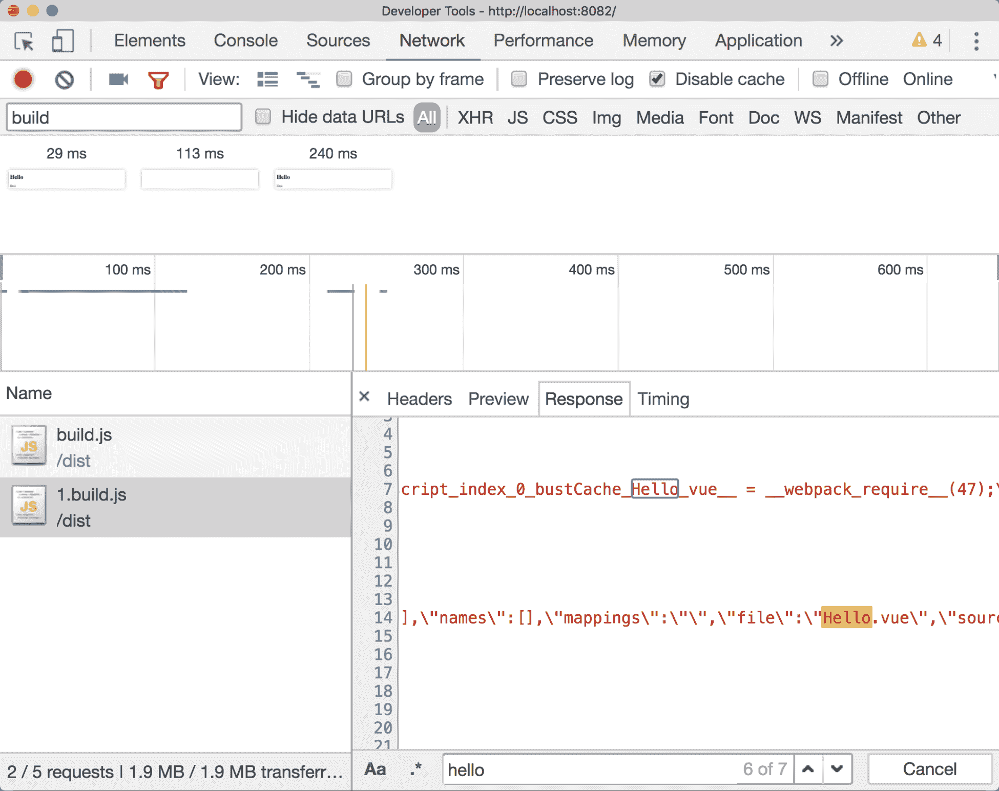
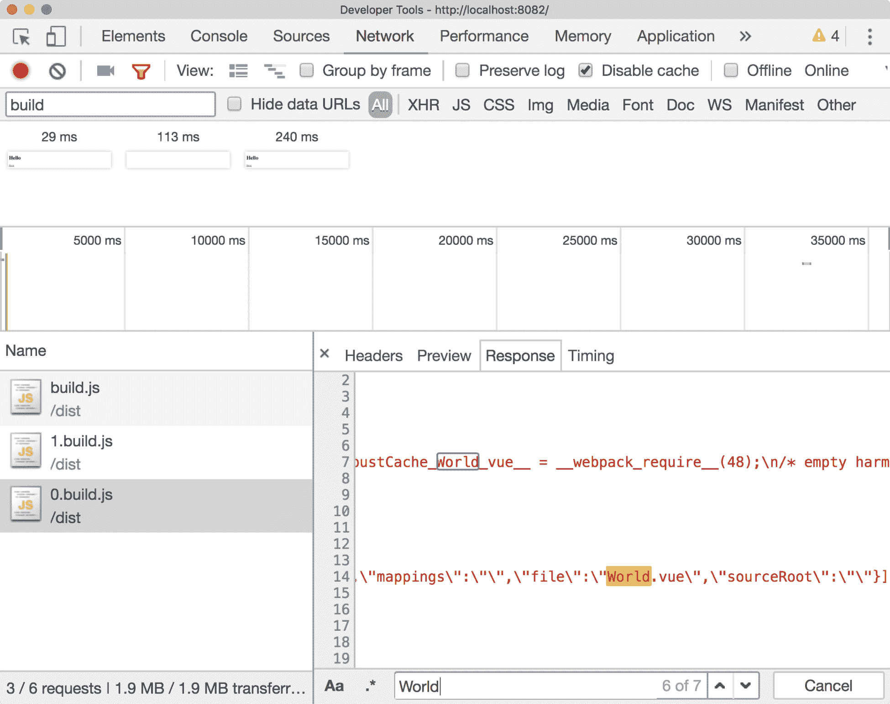
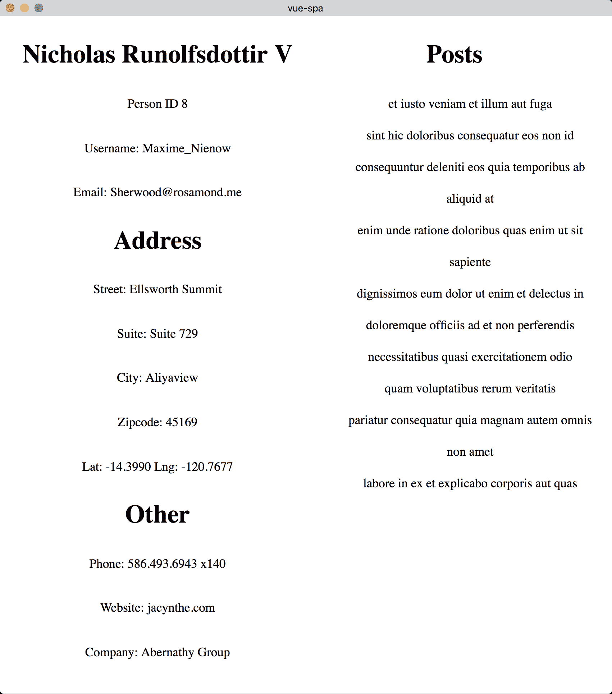

# 第二十章：Vue 路由模式

路由是任何**单页面应用**（**SPA**）的重要组成部分。本章重点介绍了如何最大化使用 Vue 路由器，并从用户页面之间的路由、参数到最佳配置进行了讨论。

到本章结束时，我们将涵盖以下内容：

+   在 Vue.js 应用程序中实现路由

+   使用动态路由匹配创建路由参数

+   将路由参数作为组件属性传递

# 单页面应用程序

现代 JavaScript 应用程序实现了一种称为 SPA 的模式。在其最简单的形式中，它可以被认为是根据 URL 显示组件的应用程序。由于模板被映射到路由，因此无需重新加载页面，因为它们可以根据用户导航的位置进行注入。

路由器的工作。

通过这种方式创建我们的应用程序，我们能够提高感知和实际速度，因为我们的应用程序更加动态。

# 使用路由器

让我们启动一个游乐项目并安装`vue-router`库。这使我们能够在应用程序内利用路由，并为我们提供现代 SPA 的功能。

在终端中运行以下命令：

```js
# Create a new Vue project
$ vue init webpack-simple vue-router-basics

# Navigate to directory
$ cd vue-router-basics

# Install dependencies
$ npm install

# Install Vue Router
$ npm install vue-router

# Run application
$ npm run dev
```

由于我们在构建系统中使用 webpack，我们已经使用`npm`安装了路由器。然后我们可以在`src/main.js`中初始化路由器：

```js
import Vue from 'vue';
import VueRouter from 'vue-router';

import App from './App.vue';

Vue.use(VueRouter);

new Vue({
  el: '#app',
  render: h => h(App)
});
```

这实际上将`VueRouter`注册为全局插件。插件只是一个接收`Vue`和`options`作为参数的函数，并允许诸如`VueRouter`之类的库向我们的 Vue 应用程序添加功能。

# 创建路由

然后，我们可以在`main.js`文件中定义两个简单的组件，它们只是有一个模板，显示带有一些文本的`h1`：

```js
const Hello = { template: `<h1>Hello</h1>` };
const World = { template: `<h1>World</h1>`};
```

然后，为了在特定的 URL（如`/hello`和`/world`）上在屏幕上显示这些组件，我们可以在应用程序内定义路由：

```js
const routes = [
  { path: '/hello', component: Hello },
  { path: '/world', component: World }
];
```

现在我们已经定义了我们想要使用的组件以及应用程序内的路由，我们需要创建一个新的`VueRouter`实例并传递路由。

尽管我们使用了`Vue.use(VueRouter)`，但我们仍需要创建一个新的`VueRouter`实例并初始化我们的路由。这是因为仅仅将`VueRouter`注册为插件，就可以让我们在 Vue 实例中访问路由选项：

```js
const router = new VueRouter({
  routes
});
```

然后，我们需要将`router`传递给我们的根 Vue 实例：

```js
new Vue({
  el: '#app',
  router,
  render: h => h(App)
});
```

最后，要在我们的`App.vue`组件中显示路由的组件，我们需要在`template`中添加`router-view`组件：

```js
<template>
  <div id="app">
    <router-view/>
  </div>
</template>
```

如果我们导航到`/#/hello/`或`/#/world`，将显示相应的组件：


# 动态路由

我们还可以根据特定参数动态匹配路由。这可以通过在参数名之前指定一个冒号的路由来实现。以下是使用类似问候组件的示例：

```js
// Components
const Hello = { template: `<h1>Hello</h1>` };
const HelloName = { template: `<h1>Hello {{ $route.params.name}}` }

// Routes
const routes = [
 { path: '/hello', component: Hello },
 { path: '/hello/:name', component: HelloName },
]
```

如果我们的用户导航到`/hello`，他们将看到带有文本`Hello`的`h1`。否则，如果他们导航到`/hello/{name}`（即 Paul），他们将看到带有文本`Hello Paul`的`h1`。

我们取得了很大的进展，但重要的是要知道，当我们导航到参数化的 URL 时，如果参数发生变化（即从`/hello/paul`到`/hello/katie`），组件的生命周期钩子不会再次触发。我们很快会看到这一点！

# 路由 props

让我们将我们的`/hello/name`路由更改为将`name`参数作为`component`属性传递，这可以通过在路由中添加`props: true`标志来完成：

```js
const routes = [
  { path: '/hello', component: Hello },
  { path: '/hello/:name', component: HelloName, props: true},
]
```

然后，我们可以更新我们的组件以接受一个带有`name`的`id`属性，并在生命周期钩子中将其记录到控制台中：

```js
const HelloName = {
  props: ['name'],
  template: `<h1>Hello {{ name }}</h1>`,
  created() {
    console.log(`Hello ${this.name}`)
  }
}
```

如果我们尝试导航到不同的动态路由，我们会发现`created`钩子只会触发一次（除非我们刷新页面），即使我们的页面显示了正确的名称：


# 组件导航守卫

我们如何解决生命周期钩子问题？在这种情况下，我们可以使用所谓的导航守卫。这允许我们钩入到路由器的不同生命周期中，比如`beforeRouteEnter`、`beforeRouteUpdate`和`beforeRouteLeave`方法。

# beforeRouteUpdate

让我们使用`beforeRouteUpdate`方法来访问有关路由更改的信息：

```js
const HelloName = {
  props: ['name'],
  template: `<h1>Hello {{ name }}</h1>`,
  beforeRouteUpdate(to, from, next) {
    console.log(to);
    console.log(from);
    console.log(`Hello ${to.params.name}`)
  },
}
```

如果我们在导航到`/hello/{name}`下的不同路由后检查 JavaScript 控制台，我们将能够看到用户要去的路由以及他们来自哪里。`to`和`from`对象还为我们提供了对`params`、查询、完整路径等的访问权限。

虽然我们正确地得到了日志记录，但如果我们尝试在路由之间导航，你会注意到我们的应用程序不会使用参数`name`属性进行更新。这是因为我们在守卫内完成任何计算后没有使用`next`函数。让我们添加进去：

```js
  beforeRouteUpdate(to, from, next) {
    console.log(to);
    console.log(from);
    console.log(`Hello ${to.params.name}`)
    next();
  },
```

# beforeRouteEnter

我们还可以利用`beforeRouteEnter`来在进入组件路由之前执行操作。这里有一个例子：

```js
 beforeRouteEnter(to, from, next) {
  console.log(`I'm called before entering the route!`)
  next();
 }
```

我们仍然必须调用`next`来将堆栈传递给下一个路由处理程序。

# beforeRouteLeave

我们还可以钩入`beforeRouteLeave`来在离开路由时执行操作。由于我们已经在这个钩子的上下文中在这个路由上，我们可以访问组件实例。让我们看一个例子：

```js
 beforeRouteLeave(to, from, next) {
 console.log(`I'm called before leaving the route!`)
 console.log(`I have access to the component instance, here's proof! 
 Name: ${this.name}`);
 next();
 }
```

再次，我们必须在这种情况下调用`next`。

# 全局路由钩子

我们已经研究了组件导航守卫，虽然这些守卫是基于组件的，但你可能想要建立全局钩子来监听导航事件。

# beforeEach

我们可以使用`router.beforeEach`来全局监听应用程序中的路由事件。如果你有认证检查或其他应该在每个路由中使用的功能，这是值得使用的。

这里有一个例子，简单地记录用户要去的路由和来自的路由。以下每个示例都假定路由器存在于类似以下范围的上下文中：

```js
const router = new VueRouter({
  routes
})

router.beforeEach((to, from, next) => {
 console.log(`Route to`, to)
 console.log(`Route from`, from)
 next();
});
```

再次，我们必须调用`next()`来触发下一个路由守卫。

# beforeResolve

`beforeResolve`全局路由守卫在确认导航之前触发，但重要的是要知道，这只是在所有特定于组件的守卫和异步组件已经解析之后。

这里有一个例子：

```js
router.beforeResolve((to, from, next) => {
 console.log(`Before resolve:`)
 console.log(`Route to`, to)
 console.log(`Route from`, from)
 next();
});
```

# afterEach

我们还可以钩入全局的`afterEach`函数，允许我们执行操作，但我们无法影响导航，因此只能访问`to`和`from`参数：

```js
router.afterEach((to, from) => {
 console.log(`After each:`)
 console.log(`Route to`, to)
 console.log(`Route from`, from)
});
```

# 解析堆栈

现在我们已经熟悉了提供的各种不同的路由生命周期钩子，值得调查的是，每当我们尝试导航到另一个路由时，整个解析堆栈。

1.  **触发路由更改**：这是任何路由生命周期的第一阶段，当我们*尝试*导航到新路由时触发。一个例子是从`/hello/Paul`到`/hello/Katie`。在这一点上还没有触发任何导航守卫。

1.  **触发组件离开守卫**：接下来，任何离开守卫都会被触发，比如在加载的组件上的`beforeRouteLeave`。

1.  **触发全局 beforeEach 守卫**：由于全局路由中间件可以通过`beforeEach`创建，这些函数将在任何路由更新之前被调用。

1.  **在重用组件中触发本地 beforeRouteUpdate 守卫**：正如我们之前看到的，每当我们使用不同的参数导航到相同的路由时，生命周期钩子不会被触发两次。相反，我们使用`beforeRouteUpdate`来触发生命周期更改。

1.  **在组件中触发 beforeRouteEnter**：这在导航到任何路由之前每次都会被调用。在这个阶段，组件还没有被渲染，因此无法访问`this`组件实例。

1.  **解析异步路由组件**：然后尝试解析项目中的任何异步组件。这里有一个例子：

```js
const MyAsyncComponent = () => ({
component: import ('./LazyComponent.vue'),
loading: LoadingComponent,
error: ErrorComponent,
delay: 150,
timeout: 3000
})
```

1.  **在成功激活的组件中触发 beforeRouteEnter**：

现在我们可以访问`beforeRouteEnter`钩子，并在解析路由之前执行任何操作。

1.  **触发全局 beforeResolve 钩子**：提供了组件内的守卫和异步路由组件已经解析，我们现在可以钩入全局的`router.beforeResolve`方法，允许我们在这个阶段执行操作。

1.  **导航**：所有先前的导航守卫都已触发，用户现在成功导航到了一个路由。

1.  **触发 afterEach 钩子**：虽然用户已经导航到了路由，但事情并没有到此为止。接下来，路由器会触发一个全局的`afterEach`钩子，该钩子可以访问`to`和`from`参数。由于路由在这个阶段已经解析，它没有下一个参数，因此不能影响导航。

1.  **触发 DOM 更新**：路由已经解析，Vue 可以适当地触发 DOM 更新。

1.  **在 beforeRouteEnter 中的 next 中触发回调**：由于`beforeRouteEnter`无法访问组件的`this`上下文，`next`参数接受一个回调函数，在导航时解析为组件实例。一个例子可以在这里看到：

```js
beforeRouteEnter (to, from, next) {   
 next(comp => {
  // 'comp' inside this closure is equal to the component instance
 }) 
```

# 程序化导航

我们不仅限于使用`router-link`进行模板导航；我们还可以在 JavaScript 中以编程方式将用户导航到不同的路由。在我们的`App.vue`中，让我们暴露`<router-view>`并让用户能够选择一个按钮，将他们导航到`/hello`或`/hello/:name`路由：

```js
<template>
  <div id="app">
    <nav>
      <button @click="navigateToRoute('/hello')">/Hello</button>
      <button 
       @click="navigateToRoute('/hello/Paul')">/Hello/Name</button>
    </nav>
    <router-view></router-view>
  </div>
</template>
```

然后我们可以添加一个方法，将新的路由推送到路由堆栈中*：*

```js
<script>
export default {
  methods: {
    navigateToRoute(routeName) {
      this.$router.push({ path: routeName });
    },
  },
};
</script>
```

此时，每当我们选择一个按钮，它应该随后将用户导航到适当的路由。`$router.push()`函数可以接受各种不同的参数，取决于你如何设置你的路由。这里有一些例子：

```js
// Navigate with string literal
this.$router.push('hello')

// Navigate with object options
this.$router.push({ path: 'hello' })

// Add parameters
this.$router.push({ name: 'hello', params: { name: 'Paul' }})

// Using query parameters /hello?name=paul
this.$router.push({ path: 'hello', query: { name: 'Paul' }})
```

# router.replace

不要推送导航项到堆栈上，我们也可以用 `router.replace` 替换当前的历史堆栈。以下是一个例子：

```js
this.$router.replace({ path: routeName });
```

# router.go

如果我们想要向后或向前导航用户，我们可以使用 `router.go`；这本质上是对 `window.history` API 的抽象。让我们看一些例子：

```js
// Navigate forward one record
this.$router.go(1);

// Navigate backward one record
this.$router.go(-1);

// Navigate forward three records
this.$router.go(3);

// Navigate backward three records
this.$router.go(-3);
```

# 延迟加载路由

我们还可以延迟加载我们的路由，以利用 webpack 的代码拆分。这使我们比急切加载路由时拥有更好的性能。为此，我们可以创建一个小型的试验项目。在终端中运行以下命令来执行： 

```js
# Create a new Vue project
$ vue init webpack-simple vue-lazy-loading

# Navigate to directory
$ cd vue-lazy-loading

# Install dependencies
$ npm install

# Install Vue Router
$ npm install vue-router

# Run application
$ npm run dev
```

让我们开始创建两个组件，名为 `Hello.vue` 和 `World.vue`，在 `src/components` 中：

```js
// Hello.vue
<template>
  <div>
    <h1>Hello</h1>
    <router-link to="/world">Next</router-link>
  </div>
</template>

<script>
export default {};
</script>
```

现在我们已经创建了我们的 `Hello.vue` 组件，让我们创建第二个 `World.vue`：

```js
// World.vue
<template>
  <div>
    <h1>World</h1>
    <router-link to="/hello">Back</router-link>
  </div>
</template>

<script>
export default {};
</script>
```

然后我们可以像通常一样初始化我们的路由器，在 `main.js` 中：

```js
import Vue from 'vue';
import VueRouter from 'vue-router';

Vue.use(VueRouter);
```

主要区别在于导入组件的方式。这需要使用 `syntax-dynamic-import` Babel 插件。通过在终端中运行以下命令将其安装到项目中：

```js
$ npm install --save-dev babel-plugin-syntax-dynamic-import
```

然后我们可以更新 `.babelrc` 来使用新的插件：

```js
{
 "presets": [["env", { "modules": false }], "stage-3"],
 "plugins": ["syntax-dynamic-import"]
}
```

最后，这使我们能够异步导入我们的组件，就像这样：

```js
const Hello = () => import('./components/Hello');
const World = () => import('./components/World');
```

然后我们可以定义我们的路由并初始化路由器，这次引用异步导入：

```js
const routes = [
 { path: '/', redirect: '/hello' },
 { path: '/hello', component: Hello },
 { path: '/World', component: World },
];

const router = new VueRouter({
 routes,
});

new Vue({
 el: '#app',
 router,
 render: h => h(App),
});
```

然后我们可以通过在 Chrome 中查看开发者工具 | 网络选项卡来查看其结果，同时浏览我们的应用程序：



每个路由都添加到自己的捆绑文件中，随后使我们的性能得到改善，因为初始捆绑文件要小得多：



# 一个单页应用项目

让我们创建一个使用 RESTful API 和我们刚学到的路由概念的项目。在终端中运行以下命令来创建一个新项目：

```js
# Create a new Vue project
$ vue init webpack-simple vue-spa

# Navigate to directory
$ cd vue-spa

# Install dependencies
$ npm install

# Install Vue Router and Axios
$ npm install vue-router axios

# Run application
$ npm run dev
```

# 启用路由

我们可以通过在应用程序中启用 `VueRouter` 插件来开始。为此，我们可以在 `src/router` 中创建一个名为 `index.js` 的新文件。我们将使用这个文件来包含所有特定于路由的配置，但根据底层功能将每个路由分离到不同的文件中。

让我们导入并添加路由插件：

```js
import Vue from 'vue';
import VueRouter from 'vue-router';

Vue.use(VueRouter)
```

# 定义路由

为了将路由分离到应用程序中的不同文件中，我们首先可以在 `src/components/user` 下创建一个名为 `user.routes.js` 的文件。每当我们有一个需要路由的不同功能集时，我们可以创建自己的 `*.routes.js` 文件，然后将其导入到路由的 `index.js` 中。

目前，我们只需导出一个新的空数组：

```js
export const userRoutes = [];
```

然后我们可以将路由添加到我们的 `index.js` 中（即使我们还没有定义任何路由）：

```js
import { userRoutes } from '../components/user/user.routes';

const routes = [...userRoutes];
```

我们正在使用 ES2015+ 的展开运算符，它允许我们使用数组中的每个对象而不是数组本身。

然后，我们可以初始化路由，创建一个新的 `VueRouter` 并传递路由，如下所示：

```js
const router = new VueRouter({
  // This is ES2015+ shorthand for routes: routes
  routes,
});
```

最后，让我们导出路由，以便它可以在我们的主 Vue 实例中使用：

```js
export default router;
```

在 `main.js` 中，让我们导入路由并将其添加到实例中，如下所示：

```js
import Vue from 'vue';
import App from './App.vue';
import router from './router';

new Vue({
 el: '#app',
 router,
 render: h => h(App),
});
```

# 创建 UserList 路由

我们应用程序的第一部分将是一个主页，显示来自 API 的用户列表。我们过去曾使用过这个例子，所以你应该对涉及的步骤很熟悉。让我们在 `src/components/user` 下创建一个名为 `UserList.vue` 的新组件。

组件将看起来像这样：

```js
<template>
  <ul>
    <li v-for="user in users" :key="user.id">
      {{user.name}}
    </li>
  </ul> 
</template>

<script>
export default {
  data() {
    return {
      users: [
        {
          id: 1,
          name: 'Leanne Graham',
        }
      ],
    };
  },
};
</script>
```

此时可以随意添加自己的测试数据。我们将很快从 API 请求这些数据。

由于我们已经创建了组件，我们可以在 `user.routes.js` 中添加一个路由，当激活 `'/'`（或您选择的路径）时显示此组件：

```js
import UserList from './UserList';

export const userRoutes = [{ path: '/', component: UserList }];
```

为了显示这个路由，我们需要更新 `App.vue`，随后将内容注入到 `router-view` 节点中。让我们更新 `App.vue` 来处理这个问题：

```js
<template>
 <div>
  <router-view></router-view>
 </div>
</template>

<script>
export default {};
</script>

<style>

</style>
```

我们的应用程序应该显示单个用户。让我们创建一个 HTTP 实用程序来从 API 获取数据。

# 从 API 获取数据

在 `src/utils` 下创建一个名为 `api.js` 的新文件。这将用于创建 `Axios` 的基本实例，然后我们可以在其上执行 HTTP 请求：

```js
import axios from 'axios';

export const API = axios.create({
 baseURL: `https://jsonplaceholder.typicode.com/`
})
```

然后我们可以使用 `beforeRouteEnter` 导航守卫，在某人导航到 `'/'` 路由时获取用户数据：

```js
<template>
  <ul>
    <li v-for="user in users" :key="user.id">
      {{user.name}}
    </li>
  </ul> 
</template>

<script>
import { API } from '../../utils/api';
export default {
  data() {
    return {
      users: [],
    };
  },
  beforeRouteEnter(to, from, next) {
    API.get(`users`)
      .then(response => next(vm => (vm.users = response.data)))
      .catch(error => next(error));
  },
};
</script>
```

然后我们发现屏幕上显示了用户列表，如下截图所示，每个用户都表示为不同的列表项。下一步是创建一个 `detail` 组件，注册详细路由，并找到链接到该路由的方法：


# 创建详细页面

为了创建详细页面，我们可以创建 `UserDetail.vue` 并按照与上一个组件类似的步骤进行操作：

```js
<template>
  <div class="container">
    <div class="user">
      <div class="user__name">
        <h1>{{userInfo.name}}</h1>
        <p>Person ID {{$route.params.userId}}</p>
        <p>Username: {{userInfo.username}}</p>
        <p>Email: {{userInfo.email}}</p>
      </div>
      <div class="user__address" v-if="userInfo && userInfo.address">
        <h1>Address</h1>
        <p>Street: {{userInfo.address.street}}</p>
        <p>Suite: {{userInfo.address.suite}}</p>
        <p>City: {{userInfo.address.city}}</p>
        <p>Zipcode: {{userInfo.address.zipcode}}</p>
        <p>Lat: {{userInfo.address.geo.lat}} Lng: 
        {{userInfo.address.geo.lng}} </p>
      </div>

      <div class="user__other" >
        <h1>Other</h1>
        <p>Phone: {{userInfo.phone}}</p>
        <p>Website: {{userInfo.website}}</p>
        <p v-if="userInfo && userInfo.company">Company: 
        {{userInfo.company.name}}</p>
      </div>
    </div>
  </div>
</template>

<script>
import { API } from '../../utils/api';

export default {
  data() {
    return {
      userInfo: {},
    };
  },
  beforeRouteEnter(to, from, next) {
    next(vm => 
      API.get(`users/${to.params.userId}`)
        .then(response => (vm.userInfo = response.data))
        .catch(err => console.error(err))
    )
  },
};
</script>

<style>
.container {
 line-height: 2.5em;
 text-align: center;
}
</style>
```

由于在我们的详细页面中永远不应该有多个用户，因此`userInfo`变量被创建为 JavaScript 对象而不是数组。

然后我们可以将新组件添加到我们的`user.routes.js`中：

```js
import UserList from './UserList';
import UserDetail from './UserDetail';

export const userRoutes = [
 { path: '/', component: UserList },
 { path: '/:userId', component: UserDetail },
];
```

为了链接到这个组件，我们可以在我们的`UserList`组件中添加`router-link`：

```js
<template>
  <ul>
    <li v-for="user in users" :key="user.id">
      <router-link :to="{ path: `/${user.id}` }">
      {{user.name}}
      </router-link>
    </li>
  </ul> 
</template>
```

如果我们然后在浏览器中查看，我们可以看到只有一个用户列出，下面的信息来自于与该用户关联的用户详细信息：


# 子路由

我们还可以从我们的 API 中访问帖子，因此我们可以同时显示帖子信息和用户信息。让我们创建一个名为`UserPosts.vue`的新组件：

```js
<template>
  <div>
    <ul>
      <li v-for="post in posts" :key="post.id">{{post.title}}</li>
    </ul>
  </div>
</template>

<script>
import { API } from '../../utils/api';
export default {
  data() {
    return {
      posts: [],
    };
  },
  beforeRouteEnter(to, from, next) {
       next(vm =>
          API.get(`posts?userId=${to.params.userId}`)
          .then(response => (vm.posts = response.data))
          .catch(err => console.error(err))
     )
  },
};
</script>
```

这允许我们根据我们的`userId`路由参数获取帖子。为了将此组件显示为子视图，我们需要在`user.routes.js`中注册它：

```js
import UserList from './UserList';
import UserDetail from './UserDetail';
import UserPosts from './UserPosts';

export const userRoutes = [
  { path: '/', component: UserList },
  {
    path: '/:userId',
    component: UserDetail,
    children: [{ path: '/:userId', component: UserPosts }],
  },
];
```

然后我们可以在`UserDetail.vue`组件内部添加另一个`<router-view>`标签来显示子路由。模板现在看起来像这样：

```js
<template>
  <div class="container">
    <div class="user">
        // Omitted
    </div>
    <div class="posts">
      <h1>Posts</h1>
      <router-view></router-view>
    </div>
  </div>
</template>
```

最后，我们还添加了一些样式，将用户信息显示在左侧，帖子显示在右侧：

```js
<style>
.container {
  line-height: 2.5em;
  text-align: center;
}
.user {
  display: inline-block;
  width: 49%;
}
.posts {
  vertical-align: top;
  display: inline-block;
  width: 49%;
}
ul {
  list-style-type: none;
}
</style>
```

如果我们然后转到我们的浏览器，我们可以看到数据的显示方式正如我们计划的那样，用户信息显示在左侧，帖子显示在右侧：



哒哒！我们现在创建了一个具有多个路由、子路由、参数等的 Vue 应用程序！

# 总结

在这一部分，我们学习了关于 Vue Router 以及如何使用它来创建单页面应用程序。因此，我们涵盖了从初始化路由插件到定义路由、组件、导航守卫等方面的所有内容。我们现在有了必要的知识来创建超越单一组件的 Vue 应用程序。

既然我们扩展了我们的知识并了解了如何使用 Vue Router，我们可以继续在下一章节中处理`Vuex`中的状态管理。
