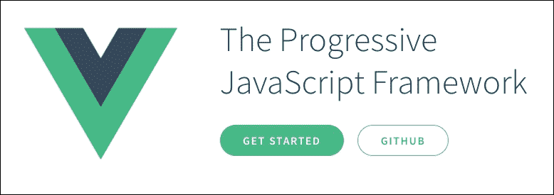
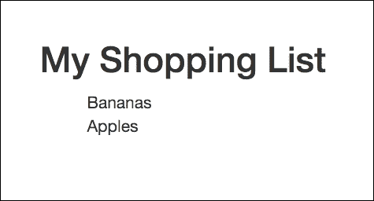
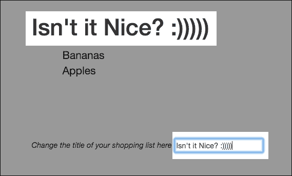
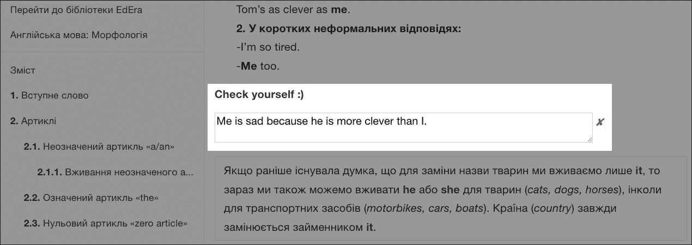
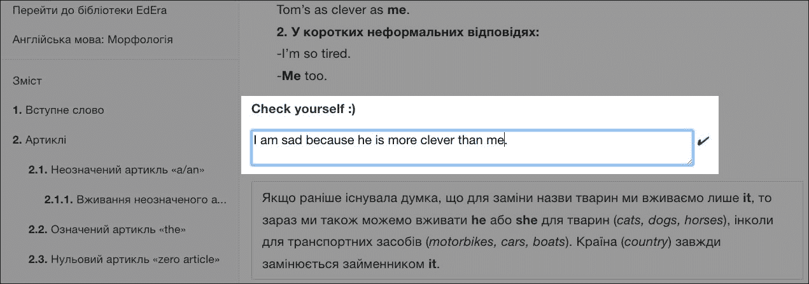
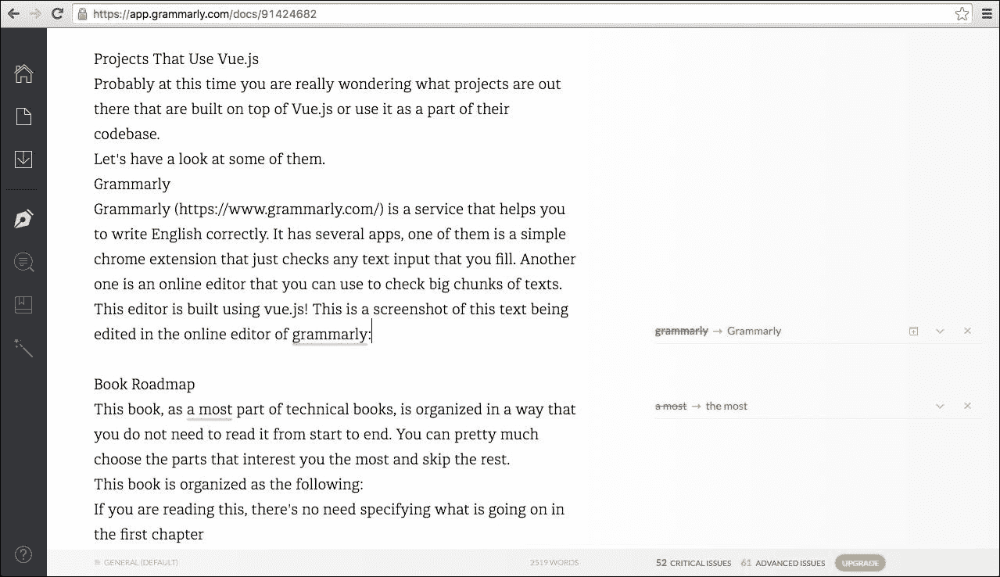
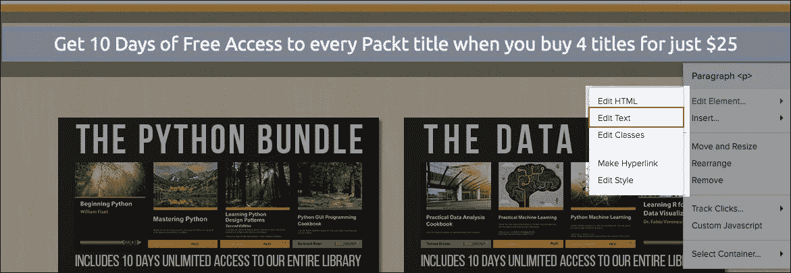
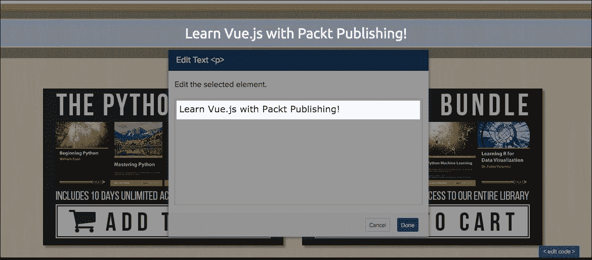
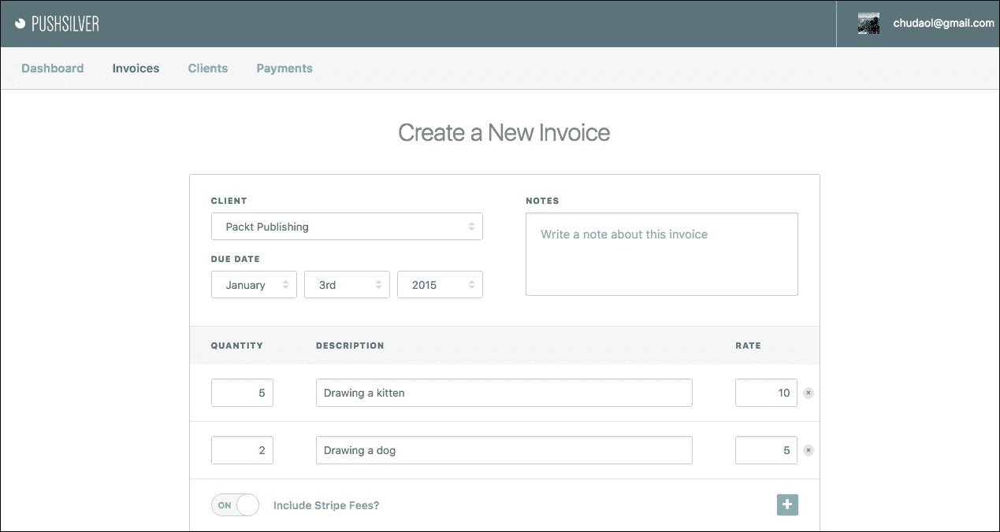
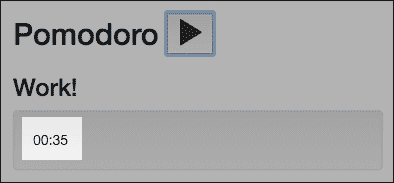

# 第一章：使用 Vue.js 去购物

> *"Vue.js 是一个用于构建惊人的 Web 应用程序的 JavaScript 框架。Vue.js 是一个用于创建 Web 界面的 JavaScript 库。Vue.js 是一种利用 MVVM 架构的工具。"*

简化的 JavaScript 术语建议 Vue.js 是一个基于底层数据模型创建用户界面（视图）的 JavaScript 库（[`jargon.js.org/_glossary/VUEJS.md`](http://jargon.js.org/_glossary/VUEJS.md)）。

官方的 Vue.js 网站（[`vuejs.org/`](https://vuejs.org/)）在几个月前表示，Vue.js 是用于现代 Web 界面的反应式组件。


现在它说明了 Vue.js 是一个渐进式的 JavaScript 框架：



那么 Vue.js 到底是什么？框架？工具？库？它应该用于构建全栈 Web 应用程序，还是仅用于添加一些特殊功能？我应该从我喜欢的框架转到它吗？如果是的话，为什么？我可以在我的项目中同时使用它和其他工具吗？它可能带来什么优势？

在本章中，我们将尝试找到所有这些问题的答案。我们将稍微涉及 Vue.js，并在一些小而简单的示例中使用它。

更具体地说，我们将做以下事情：

+   了解 Vue.js 是什么，它的重要部分和历史

+   了解哪些项目使用了 Vue.js

+   使用 Vue.js 构建一个简单的购物清单，并将其实现与相同应用程序的 jQuery 实现进行比较

+   使用 Vue.js 构建一个简单的番茄工作法计时器

+   享受一个小而简单的练习

# 流行词

在本书中将会有很多流行词、缩写和其他时髦的字母组合。请不要害怕它们。我可以告诉你更多，但是，对于使用 Vue.js 或任何其他框架需要做的大部分事情，你不需要全部都牢记在心！但是，无论如何，让我们把词汇表放在这里，这样你在书的任何地方都会对术语感到困惑，你可以回到这里看一看：

+   **应用状态**：这是应用程序的全局集中状态。当应用程序启动时，此状态中的数据被初始化。任何应用程序组件都可以访问此数据；但是，它们不能轻易地更改它。状态的每个项目都有一个附加的变异，可以在应用程序组件内发生的特殊事件上分派。

+   Bootstrap：这是一个项目，提供了一组样式和 JavaScript 工具，用于开发响应式和美观的应用程序，而无需过多考虑 CSS。

+   内容分发网络（CDN）：这是一个特殊的服务器，其目的是以高可用性和高性能向用户传递数据。开发框架的人和公司喜欢通过 CDN 分发它们，因为它们只需在安装说明中指出 CDN 的 URL。Vue.js 托管在 npmcdn（[`npmcdn.com/`](https://npmcdn.com/)），这是一个可靠的全球网络，用于发布到 npm 的内容。

+   组件：这些是应用程序的部分，具有自己的数据和视图，可以在整个应用程序中重复使用，就像建造房子的砖块一样。

+   层叠样式表（CSS）：这是一组样式，应用于 HTML 文档，使其变得美观漂亮。

+   声明式视图：这些是提供了一种直接数据绑定的视图，可以在普通的 JavaScript 数据模型和表示之间进行绑定。

+   指令：这是 Vue.js 中的特殊 HTML 元素属性，允许以不同的方式进行数据绑定。

+   文档对象模型（DOM）：这是一种表示标记语言节点的约定，例如 HTML、XML 和 XHTML。文档的节点被组织成 DOM 树。当有人说与 DOM 交互时，这只是他们花哨地说与 HTML 元素交互。

+   npm：这是 JavaScript 的包管理器，允许搜索、安装和管理 JavaScript 包。

+   Markdown：这是一种人性化的语法，允许网络作者编写文本而不必担心样式和 HTML 标记。Markdown 文件的扩展名为`.md`。

+   模型视图视图模型（MVVM）：这是一种架构模式，其核心是视图模型，充当视图和数据模型之间的桥梁，允许它们之间的数据流动。

+   模型视图控制器（MVC）：这是一种架构模式。它允许将视图与模型分离，以及信息从视图流向模型，反之亦然。

+   单向数据绑定：这是一种数据绑定类型，其中数据模型中的更改会自动传播到视图层，但反之则不会。

+   快速原型制作：在 Web 中，这是一种轻松快速地构建用户界面模型的技术，包括一些基本的用户交互。

+   响应性：在 Web 中，这实际上是数据的任何更改立即传播到视图层。

+   双向数据绑定：这是一种数据绑定类型，其中数据模型的更改会自动传播到视图层，而视图层中发生的更改会立即反映在数据模型中。

+   用户界面（UI）：这是一组视觉组件，允许用户与应用程序进行交互。

+   Vuex：这是 Vue 应用程序的架构，允许简单地管理应用程序状态。

# Vue.js 历史

当 Vue.js 的创始人 Evan You（[`evanyou.me/`](http://evanyou.me/)）在 Google 创意实验室的一个项目上工作时，他们需要快速原型制作一个相当大的 UI 界面。编写大量重复的 HTML 显然是耗时和耗资源的，这就是为什么 Evan 开始寻找已经存在的工具来实现这个目的。令他惊讶的是，他发现没有工具、库或框架能够完全符合快速原型制作的目的！那时，Angular 被广泛使用，React.js 刚刚开始，Backbone.js 等框架被用于具有 MVC 架构的大型应用程序。对于需要非常灵活和轻量级的快速 UI 原型制作的项目来说，这些复杂的框架都不太合适。

当你意识到某个酷炫的东西不存在，而你又能够创造它时——*就去做吧*！

### 注意

Vue.js 诞生于快速原型制作工具。现在它可以用来构建复杂可扩展的响应式 Web 应用程序。

这就是 Evan 所做的。这就是他想到创建一个库的想法，通过提供一种简单灵活的响应式数据绑定和可重用组件的方式来帮助快速原型制作。

像每个优秀的库一样，Vue.js 一直在不断成长和发展，因此提供了比最初承诺的更多功能。目前，它提供了一种简单的附加和创建插件、编写和使用混合物的方法，以及总体添加自定义行为。Vue 可以以如此灵活的方式使用，并且对应用程序结构没有明确的意见，以至于它绝对可以被视为一个能够支持端到端构建复杂 Web 应用程序的框架。

# 关于 Vue.js 最重要的一点

Vue.js 允许你简单地将你的数据模型绑定到表示层。它还允许你在整个应用程序中轻松重用组件。

你不需要创建特殊的模型或集合，并在其中注册事件对象。你不需要遵循某种特殊的语法。你不需要安装任何无休止的依赖。

你的模型是普通的 JavaScript 对象。它们被绑定到你在视图中想要的任何东西（文本、输入文本、类、属性等），它就能正常工作。

你可以简单地将`vue.js`文件添加到你的项目中并使用它。或者，你可以使用`vue-cli`与 Webpack 和 Browserify 系列，它不仅可以快速启动整个项目，还支持热重载并提供开发者工具。

你可以将视图层与样式和 JavaScript 逻辑分开，也可以将它们放在同一个 Vue 文件中，并在同一个地方构建你的组件结构和逻辑。所有现代和常用的 IDE 都支持插件。

你可以使用任何预处理器，并且你可以使用 ES2015。你可以将它与你一直在开发的喜爱框架一起使用，或者你可以单独使用它。你可以仅仅用它来添加一些小功能，或者你可以使用整个 Vue 生态系统来构建复杂的应用程序。

如果你想要比较它与其他框架，比如 Angular 或 React，那么请访问[`vuejs.org/guide/comparison.html`](http://vuejs.org/guide/comparison.html)。

如果你想了解关于 Vue.js 的所有惊人之处，那么欢迎访问[`github.com/vuejs/awesome-vue`](https://github.com/vuejs/awesome-vue)。

# 我们去购物吧！

我不知道为什么，但我能感觉到你的周末即将到来，你开始考虑去购物买下周所需的杂货。除非你是一个能够在脑海中维护整个清单的天才，或者你是一个不需要那么多的谦逊的人，你可能在去购物前会列一个购物清单。也许你甚至会使用一些应用程序来帮助。现在，我问你：为什么不使用你自己的应用程序呢？你对创建和设计它有什么感觉？让我们做吧！让我们创建我们自己的购物清单应用程序。让我们从创建一个快速原型开始。这是一个非常简单的任务——为购物清单构建一个交互式原型。

它应该显示列表并允许我们添加和删除项目。实际上，这与待办事项列表非常相似。让我们开始使用经典的 HTML + CSS + JS + jQuery 方法来做这件事。我们还将使用 Bootstrap 框架（[`getbootstrap.com/`](http://getbootstrap.com/)）来使事情看起来更美观，而无需编写大量的 CSS 代码。（是的，因为我们的书不是关于 CSS，因为使用 Bootstrap 制作东西是如此地简单！）

## 使用 jQuery 实现购物清单

可能，您的代码最终看起来会像以下内容：

以下是 HTML 代码：

```js
<div class="container"> 
  <h2>My Shopping List</h2> 
  <div class="input-group"> 
    <input placeholder="add shopping list item"        
      type="text" class="js-new-item form-control"> 
    <span class="input-group-btn"> 
      <button @click="addItem" class="js-add btn btn-default"          
        type="button">Add!</button> 
    </span> 
  </div> 
  <ul> 
    <li> 
      <div class="checkbox"> 
        <label> 
          <input class="js-item" name="list"              
            type="checkbox"> Carrot 
        </label> 
      </div> 
    </li> 
    <li> 
      <div class="checkbox"> 
        <label> 
          <input class="js-item" name="list" type="checkbox"> Book 
        </label> 
      </div> 
    </li> 
    <li class="removed"> 
      <div class="checkbox"> 
        <label> 
          <input class="js-item" name="list" type="checkbox"              
            checked> Gift for aunt's birthday 
        </label> 
      </div> 
    </li> 
  </ul> 
</div> 

```

以下是 CSS 代码：

```js
.container { 
  width: 40%; 
  margin: 20px auto 0px auto; 
} 

.removed { 
  color: gray; 
} 

.removed label { 
  text-decoration: line-through; 
} 

ul li { 
  list-style-type: none; 
} 

```

以下是 JavaScript/jQuery 代码：

```js
$(document).ready(function () { 
  /** 
   * Add button click handler 
   */ 
  function onAdd() { 
    var $ul, li, $li, $label, $div, value; 

    value = $('.js-new-item').val(); 
    //validate against empty values 
    if (value === '') { 
      return; 
    } 
    $ul = $('ul'); 
    $li = $('<li>').appendTo($ul); 
    $div = $('<div>') 
        .addClass('checkbox') 
        .appendTo($li); 
    $label = $('<label>').appendTo($div); 
    $('<input>') 
        .attr('type', 'checkbox') 
        .addClass('item') 
        .attr('name', 'list') 
        .click(toggleRemoved) 
        .appendTo($label); 
    $label 
        .append(value); 
    $('.js-new-item').val(''); 
  } 

  /** 
   * Checkbox click handler - 
   * toggles class removed on li parent element 
   * @param ev 
   */ 
  function toggleRemoved(ev) { 
    var $el; 

    $el = $(ev.currentTarget); 
    $el.closest('li').toggleClass('removed'); 
  } 

  $('.js-add').click(onAdd); 
  $('.js-item').click(toggleRemoved); 
}); 

```

### 提示

**`下载示例代码`** 下载代码包的详细步骤在本书的前言中有提到。该书的代码包也托管在 GitHub 上，网址为[`github.com/PacktPublishing/Learning-Vue.js-2`](https://github.com/PacktPublishing/Learning-Vue.js-2)。我们还有来自丰富书籍和视频目录的其他代码包，可在[`github.com/PacktPublishing/`](https://github.com/PacktPublishing/)上找到。去看看吧！

如果您在浏览器中打开页面，您可能会看到类似以下内容：


使用 HTML + CSS + jQuery 方法实现购物清单

请查看[`jsfiddle.net/chudaol/u5pcnLw9/2/`](https://jsfiddle.net/chudaol/u5pcnLw9/2/)上的 JSFiddle。

正如你所看到的，这是一个非常基本的 HTML 代码片段，其中包含一个无序元素列表，每个元素都用复选框和文本呈现 - 一个用于用户文本和**`Add!`**按钮的输入。每次单击**`Add!`**按钮时，文本输入的内容都会被转换为列表条目并附加到列表中。当单击任何项目的复选框时，条目的状态会从**`to buy`**（未选中）切换到**`bought`**（已选中）。

让我们还添加一个功能，允许我们更改列表的标题（如果我们最终在应用程序中实现多个购物清单，这可能会很有用）。

因此，我们将最终得到一些额外的标记和一些更多的 jQuery 事件监听器和处理程序：

```js
<div class="container"> 
  <h2>My Shopping List</h2> 
  <!-- ... --> 
  <div class="footer"> 
    <hr/> 
    <em>Change the title of your shopping list here</em> 
    <input class="js-change-title" type="text"
      value="My Shopping List"/> 
  </div> 
</div> 

//And javascript code: 
function onChangeTitle() { 
  $('h2').text($('.js-change-title').val()); 
} 
$('.js-change-title').keyup(onChangeTitle); 

```

在[`jsfiddle.net/chudaol/47u38fvh/3/`](https://jsfiddle.net/chudaol/47u38fvh/3/)上查看 JSFiddle。

## 使用 Vue.js 实现购物清单

这是一个非常简单的例子。让我们尝试使用 Vue.js 逐步实现它。有很多种方法可以将`vue.js`包含到您的项目中，但在本章中，我们将通过添加来自**CDN**的 JavaScript Vue 文件来包含它：

```js
<script  src="https://cdnjs.cloudflare.com/ajax/libs/vue/2.0.3/vue.js">  </script> 

```

所以，让我们从渲染元素列表开始。

创建 HTML 文件并添加以下标记：

```js
<div id="app" class="container"> 
  <h2>{{ title }}</h2> 
  <ul> 
    <li>{{ items[0] }}</li> 
    <li>{{ items[1] }}</li> 
  </ul> 
</div> 

```

现在添加以下 JavaScript 代码：

```js
var data = { 
  items: ['Bananas', 'Apples'], 
  title: 'My Shopping List' 
}; 

new Vue({ 
  el: '#app', 
  data: data 
}); 

```

在浏览器中打开它。您会看到列表已经渲染出来了：



使用 Vue.js 实现的购物清单

让我们分析一下这个例子。Vue 应用程序代码以新的`Vue`关键字开始。我们如何将标记片段绑定到应用程序数据？我们将 DOM 元素传递给`Vue`实例，该元素必须与其绑定。页面中的任何其他标记都不会受到影响，也不会识别 Vue 的魔法。

正如你所看到的，我们的标记被包裹在`#app`元素中，并作为`Vue`选项映射中的第一个参数传递。`data`参数包含在标记中使用双大括号(`{{}}`)的对象。如果您熟悉模板预处理器（例如 handlebars），您可能会发现这种注释非常容易理解；有关更多信息，请访问[`handlebarsjs.com/`](http://handlebarsjs.com/)。

那又怎样？—你可能会惊叹。你要教我什么？如何使用模板预处理器？非常感谢，但我宁愿喝点啤酒，看看足球。

停下来，亲爱的读者，别走，拿起你的啤酒，让我们继续我们的例子。你会发现这将是非常有趣的！

## 使用开发者工具分析数据绑定

让我们看看数据绑定的实际操作。打开浏览器的开发者工具，找到您的 JavaScript 代码，并在脚本的开头添加一个断点。现在分析一下 Vue 应用程序初始化之前和之后数据对象的样子。你会发现，它变化很大。现在`data`对象已经准备好进行反应式数据绑定了：


Vue 对象初始化之前和之后的数据对象

现在，如果我们从开发者工具控制台更改`data`对象的`title`属性（我们可以这样做，因为我们的`data`是一个全局对象），它将自动反映在页面上的标题中：


数据绑定：更改对象属性会立即影响视图

## 通过双向绑定将用户输入带入数据

因此，在我们的示例中，我们能够将数据从普通的 JavaScript 数据模型带到页面上。我们为它提供了一种从应用程序代码到页面的飞行。你不觉得如果我们能为我们的数据提供双向飞行会很好吗？

现在让我们看看如何实现双向数据绑定，以及如何从页面更改`data`属性的值。

复制标题的 HTML 标记，更改第一个 jQuery 示例中的输入，并向`input`元素添加属性`v-model="title"`。

### 提示

您已经听说过 Vue.js 中的指令了吗？恭喜，您刚刚使用了一个！实际上，`v-model`属性是 Vue.js 的一个指令，提供了双向数据绑定。您可以在官方 Vue 页面上阅读更多关于它的信息：[`vuejs.org/api/#v-model`](http://vuejs.org/api/#v-model)。

现在，我们的购物清单应用程序代码的 HTML 代码如下：

```js
<div id="app" class="container"> 
  <h2>{{ title }}</h2> 
  <ul> 
    <li>{{ items[0] }}</li> 
    <li>{{ items[1] }}</li> 
  </ul> 
  <div class="footer"> 
    <hr/> 
    <em>Change the title of your shopping list here</em> 
    <input v-model="title"/> 
  </div> 
</div> 

```

就是这样！

现在刷新页面并修改输入。您会看到标题在您输入时自动更新：



数据绑定：更改绑定到模型属性的文本会立即影响绑定到同一属性的文本。

因此，一切都很好；然而，这个例子只是抓取了两个项目元素，并将它们呈现为列表项。我们希望它能够独立于列表大小呈现项目列表。

## 使用 v-for 指令渲染项目列表

因此，我们需要一些机制来遍历`items`数组，并在我们的`<ul>`元素中呈现每个项目。

幸运的是，Vue.js 为我们提供了一个很好的指令，用于遍历迭代的 JavaScript 数据结构。它被称为`v-for`。我们将在列表项`<li>`元素中使用它。修改列表的标记，使其看起来像下面这样：

```js
  <ul> 
    <li v-for="item in items">{{ item }}</li> 
  </ul> 

```

### 注意

在本书中，您将学习到其他很好的指令，如`v-if`、`v-else`、`v-show`、`v-on`、`v-bind`等等，所以请继续阅读。

刷新页面并查看。页面保持不变。现在，尝试从开发者工具控制台将项目推入`items`数组中。也尝试弹出它们。您会不会惊讶地看到`items`数组的操作立即反映在页面上：


数据绑定：更改数组会立即影响基于它的列表

所以，现在我们有一个项目列表，只需一行标记就可以在页面上呈现出来。然而，我们仍然需要这些项目有一个复选框，允许我们在需要时勾选已购买的项目或取消勾选它们。

## 勾选和取消勾选购物清单项目

为了实现这种行为，让我们稍微修改我们的`items`数组，将我们的字符串项目更改为具有两个属性`text`和`checked`（以反映状态）的对象，并修改标记以为每个项目添加复选框。

因此，我们的数据声明的 JavaScript 代码将如下所示：

```js
var data = { 
  items: [{ text: 'Bananas', checked: true },    
          { text: 'Apples',  checked: false }], 
  title: 'My Shopping List', 
  newItem: '' 
}; 

```

我们的列表标记将如下所示：

```js
<ul> 
  <li v-for="item in items" v-bind:class="{ 'removed':      
    item.checked }"> 
    <div class="checkbox"> 
      <label> 
        <input type="checkbox" v-model="item.checked"> {{            
          item.text }} 
      </label> 
    </div> 
  </li> 
</ul>  

```

刷新页面并检查`items`复选框的`checked`属性，以及每个列表项`<li>`的移除类，是否与项目的`checked`布尔状态绑定。尝试点击复选框，看看会发生什么。仅仅用两个指令就能够传播项目的状态并改变相应的`<li>`HTML 元素的类，是不是很棒？

## 使用 v-on 指令添加新的购物清单项目

所以现在我们只需要对我们的代码进行一点小的修改，就能够真正地添加购物清单项目了。为了实现这一点，我们将在我们的数据中再添加一个对象，称之为`newItem`。我们还将添加一个小方法，将新项目推送到`items`数组中。我们将在标记页中使用`v:on`指令调用这个方法，该指令用于 HTML 输入元素和用于单击以添加新项目的按钮。

因此，我们的 JavaScript 代码将如下所示：

```js
var data = { 
  items: [{ text: 'Bananas', checked: true },    
          { text: 'Apples', checked: false }], 
  title: 'My Shopping List', 
  **newItem: ''** 
}; 
new Vue({ 
  el: '#app', 
  data: data, 
  **methods: { 
    addItem: function () { 
      var text; 

      text = this.newItem.trim(); 
      if (text) { 
        this.items.push({ 
          text: text, 
          checked: false 
        }); 
        this.newItem = ''; 
      } 
    }** 
  } 
}); 

```

我们在`data`对象中添加了一个名为`newItem`的新属性。然后我们在 Vue 初始化`options`对象中添加了一个名为`methods`的新部分，并在该部分中添加了`addItem`方法。所有的数据属性都可以通过`this`关键字在`methods`部分中访问。因此，在这个方法中，我们只需获取`this.newItem`并将其推送到`this.items`数组中。现在我们必须将对这个方法的调用绑定到某个用户操作上。正如已经提到的，我们将使用`v-on`指令，并将其应用于新项目输入的`enter`键盘事件和**`Add!`**按钮的单击事件。

在我们的项目列表之前添加以下标记：

```js
<div class="input-group"> 
  <input v-model="newItem" **v-on:keyup.enter="addItem"**      
    placeholder="add shopping list item" type="text" class="form-      
    control"> 
  <span class="input-group-btn"> 
    <button **v-on:click="addItem"** class="btn btn-default"            
      type="button">Add!</button> 
  </span> 
</div> 

```

### 注意

`v-on`指令将事件侦听器附加到元素。快捷方式是`@`符号。因此，你可以用`@keyup="addItem"`来代替`v-on:keyup="addItem"`。你可以在官方文档网站上阅读更多关于`v-on`指令的信息，网址是[`vuejs.org/api/#v-on`](http://vuejs.org/api/#v-on)。

让我们完成。整个代码现在看起来像下面这样：

这是 HTML 代码：

```js
<div id="app" class="container"> 
  <h2>{{ title }}</h2> 
  <div class="input-group"> 
    <input v-model="newItem" @keyup.enter="addItem"        
      placeholder="add shopping list item" type="text" 
      class="form-control"> 
  <span class="input-group-btn"> 
    <button @click="addItem" class="btn btn-default"        
      type="button">Add!</button> 
  </span> 
  </div> 
  <ul> 
    <li v-for="item in items" :class="{ 'removed': item.checked      
      }"> 
      <div class="checkbox"> 
        <label> 
          <input type="checkbox" v-model="item.checked"> {{              
            item.text }} 
        </label> 
      </div>     
    </li> 
  </ul> 
  <div class="footer hidden"> 
    <hr/> 
    <em>Change the title of your shopping list here</em> 
    <input v-model="title"/> 
  </div> 
</div> 

```

这是 JavaScript 代码：

```js
var data = { 
  items: [{ text: 'Bananas', checked: true },    
          { text: 'Apples', checked: false }], 
  title: 'My Shopping List', 
  newItem: '' 
}; 

new Vue({ 
  el: '#app', 
  data: data, 
  methods: { 
    addItem: function () { 
      var text; 

      text = this.newItem.trim(); 
      if (text) { 
        this.items.push({ 
          text: text, 
          checked: false 
        }); 
        this.newItem = ''; 
      } 
    } 
  } 
}); 

```

这是 JSFiddle 的链接：[`jsfiddle.net/chudaol/vxfkxjzk/3/`](https://jsfiddle.net/chudaol/vxfkxjzk/3/)。

# 在现有项目中使用 Vue.js

我现在可以感觉到你已经看到了将模型的属性绑定到表示层有多容易，你已经开始考虑如何在现有项目中使用它。但是然后你会想：天啊，不，我需要安装一些东西，运行`npm install`，改变项目的结构，添加指令，改变代码。

在这里我可以告诉你：不！不需要安装，不需要 npm，只需获取`vue.js`文件，将其插入到你的 HTML 页面中，然后使用它。就这样，不需要改变结构，不需要架构决策，也不需要讨论。只需使用它。我将向你展示我们在 EdEra（[`www.ed-era.com`](https://www.ed-era.com)）中如何在 GitBook 章节的末尾包含一个小的“自我检查”功能。

EdEra 是一个总部位于乌克兰的在线教育项目，其目标是将整个教育系统转变为现代、在线、互动和有趣的东西。实际上，我是这个年轻的美好项目的联合创始人兼首席技术官，负责整个技术部分。因此，在 EdEra，我们有一些建立在开放的 EdX 平台（[`open.edx.org/`](https://open.edx.org/)）之上的在线课程，以及一些建立在伟大的 GitBook 框架（[`www.gitbook.org`](http://www.gitbook.org)）之上的互动教育书籍。基本上，GitBook 是一个基于 Node.js 技术栈的平台。它允许具有对 Markdown 语言和基本 Git 命令的基本知识的人编写书籍并将它们托管在 GitBook 服务器上。EdEra 的书籍可以在[`ed-era.com/books`](http://ed-era.com/books)找到（注意，它们都是乌克兰语）。

让我们看看我们在书中使用 Vue.js 做了什么。

在某个时候，我决定在教授英语的书籍中关于人称代词的章节末尾包含一个小测验。因此，我包含了`vue.js` JavaScript 文件，编辑了相应的`.md`文件，并包含了以下 HTML 代码：

```js
<div id="pronouns"> 
    <p><strong>Check yourself :)</strong></p> 
    <textarea class="textarea" v-model="text" v-      
      on:keyup="checkText"> 
        {{ text }} 
    </textarea><i  v-bind:class="{ 'correct': correct,      
      'incorrect': !correct }"></i> 
</div> 

```

然后我添加了一个自定义的 JavaScript 文件，其中包含了以下代码：

```js
$(document).ready(function() { 
  var initialText, correctText; 

  initialText = 'Me is sad because he is more clever than I.'; 
  correctText = 'I am sad because he is more clever than me.'; 

  new Vue({ 
    el: '#pronouns', 
    data: { 
      text: initialText, 
      correct: false 
    }, 
    methods: { 
      checkText: function () { 
        var text; 
        text = this.text.trim(); 
        this.correct = text === correctText; 
      } 
    } 
  }); 
}); 

```

### 注意

你可以在这个 GitHub 页面上查看这段代码：[`github.com/chudaol/ed-era-book-english`](https://github.com/chudaol/ed-era-book-english)。这是一个用 markdown 编写并插入 HTML 的页面的代码：[`github.com/chudaol/ed-era-book-english/blob/master/2/osobovi_zaimenniki.md`](https://github.com/chudaol/ed-era-book-english/blob/master/2/osobovi_zaimenniki.md)。这是一个 JavaScript 代码：[`github.com/chudaol/ed-era-book-english/blob/master/custom/js/quiz-vue.js`](https://github.com/chudaol/ed-era-book-english/blob/master/custom/js/quiz-vue.js)。你甚至可以克隆这个存储库，并使用`gitbook-cli`在本地尝试（[`github.com/GitbookIO/gitbook/blob/master/docs/setup.md`](https://github.com/GitbookIO/gitbook/blob/master/docs/setup.md)）。

让我们来看看这段代码。你可能已经发现了你已经看过甚至尝试过的部分：

+   `data`对象包含两个属性：

+   字符串属性 text

+   布尔属性 correct

+   `checkText`方法只是获取`text`属性，将其与正确的文本进行比较，并将值分配给正确的值

+   `v-on`指令在键盘松开时调用`checkText`方法

+   `v-bind`指令将类`correct`绑定到`correct`属性

这是我的 IDE 中的代码样子：


在驱动项目中使用 Vue

接下来是在浏览器中的样子：



Vue.js 在 GitBook 页面内的实际应用



Vue.js 在 GitBook 页面内的实际应用

在[`english.ed-era.com/2/osobovi_zaimenniki.html`](http://english.ed-era.com/2/osobovi_zaimenniki.html)查看它。

很棒，对吧？非常简单，非常响应！

# Vue.js 2.0！

在撰写本文时，Vue.js 2.0 已经宣布（[`vuejs.org/2016/04/27/announcing-2.0/`](https://vuejs.org/2016/04/27/announcing-2.0/)）。请查看相关链接：

+   [`www.infoworld.com/article/3063615/javascript/vuejs-lead-our-javascript-framework-is-faster-than-react.html`](http://www.infoworld.com/article/3063615/javascript/vuejs-lead-our-javascript-framework-is-faster-than-react.html)

+   [`www.reddit.com/r/vuejs/comments/4gq2r1/announcing_vuejs_20/`](https://www.reddit.com/r/vuejs/comments/4gq2r1/announcing_vuejs_20/)

Vue.js 的第二个版本与其前身相比有一些显著的区别，从处理数据绑定的方式开始，到其 API。它使用轻量级虚拟 DOM 实现进行渲染，支持服务器端渲染，并且更快、更精简。

在撰写本文时，Vue 2.0 处于早期 alpha 阶段。不过不用担心。本书中涵盖的所有示例都基于 Vue 2.0 的最新稳定版本，并且与两个版本都完全兼容。

# 使用 Vue.js 的项目

也许，此时你想知道有哪些项目是建立在 Vue.js 之上，或者将其作为其代码库的一部分。有很多不错的开源、实验性和企业项目在使用它。这些项目的完整和不断更新的列表可以在[`github.com/vuejs/awesome-vue#projects-using-vuejs`](https://github.com/vuejs/awesome-vue#projects-using-vuejs)找到。

让我们来看看其中一些。

## Grammarly

Grammarly（[`www.grammarly.com/`](https://www.grammarly.com/)）是一个帮助您正确书写英语的服务。它有几个应用程序，其中一个是一个简单的 Chrome 扩展，只是检查您填写的任何文本输入。另一个是一个在线编辑器，您可以用它来检查大块的文本。这个编辑器是使用 Vue.js 构建的！以下是 Grammarly 在线编辑器中正在编辑的文本的截图：



Grammarly：一个建立在 Vue.js 之上的项目

## Optimizely

Optimizely（[`www.optimizely.com/`](https://www.optimizely.com/)）是一个帮助您测试、优化和个性化您的网站的服务。我曾使用 Packt 网站创建了一个 Optimizely 实验，并在这个资源中查看了 Vue.js 的实际效果。它看起来像下面这样：


Optimizely：一个建立在 Vue.js 之上的项目

鼠标悬停可以打开上下文菜单，允许对页面数据进行不同的操作，包括最简单的文本编辑。让我们试试这个：



使用 Optimizely 并观看 Vue.js 的实际操作

文本框已打开。当我在其中输入时，标题中的文本会被动地更改。我们使用 Vue.js 看到并实现了它：



使用 Optimizely 并观看 Vue.js 的实际操作

## FilterBlend

FilterBlend（[`github.com/ilyashubin/FilterBlend`](https://github.com/ilyashubin/FilterBlend)）是一个开源的 CSS 背景混合模式和滤镜属性的游乐场。

您可以加载您的图像并将混合与滤镜相结合。

如果您想尝试 FilterBlend，您可以在本地安装它：

1.  克隆存储库：

```js
**git clone https://github.com/ilyashubin/FilterBlend.git**

```

1.  进入`FilterBlend`目录：

```js
**cd FilterBlend**

```

1.  安装依赖项：

```js
**npm install**

```

1.  运行项目：

```js
**gulp**

```

在`localhost:8000`上打开您的浏览器并进行操作。您会发现，一旦您在右侧菜单中更改了某些内容，它会立即传播到左侧的图像中。所有这些功能都是使用 Vue.js 实现的。在 GitHub 上查看代码。


FilterBlend：一个基于 Vue.js 构建的项目

## PushSilver

PushSilver（[`pushsilver.com`](https://pushsilver.com)）是一个为忙碌的人创建简单发票的良好而简单的服务。它允许创建发票，向客户发送和重新发送它们，并跟踪它们。它是由一位进行自由咨询的开发人员创建的，他厌倦了每次为每个小项目创建发票。这个工具运行良好，它是使用 Vue.js 构建的：



PushSilver：基于 Vue.js 构建的发票管理应用程序


PushSilver：基于 Vue.js 构建的发票管理应用程序

# 书籍路线图

这本书，像大多数技术书籍一样，是以这样一种方式组织的，您不需要从头到尾阅读它。您可以选择您最感兴趣的部分并跳过其余部分。

本书的组织如下：

+   如果您正在阅读本书，就无需说明第一章中正在发生什么。

+   第二章，“基础知识-安装和使用”，是非常理论性的，将解释 Vue.js 及其主要部分背后发生了什么。因此，如果你不喜欢理论，想要动手编码，可以跳过这部分。在这一部分，我们还将介绍安装和设置过程。

+   从第三章到第八章，我们将在构建应用程序的同时探索 Vue.js 的主要特性。

+   在第三章，“组件-理解和使用”，我们将介绍 Vue 组件，并将这些知识应用到我们的应用程序中。

+   在第四章，“反应性-将数据绑定到您的应用程序”，我们将使用 Vue 提供的所有数据绑定机制。

+   在第五章，“Vuex-管理应用程序中的状态”，我们将介绍 Vuex 状态管理系统，并解释如何在我们的应用程序中使用它。

+   在第六章，“插件-用自己的砖建造你的房子”，我们将学习如何为 Vue 应用程序创建和使用插件，以丰富其功能。

+   在第七章，“测试-是时候测试我们到目前为止所做的了！”，我们将涵盖并探索 Vue.js 的自定义指令，并在我们的应用程序中创建一些。

+   在第八章，“部署-是时候上线了！”，我们将学习如何测试和部署使用 Vue.js 编写的 JavaScript 应用程序。

+   在第九章，“接下来是什么？”，我们将总结我们所学到的内容，并看看接下来我们可以做些什么。

# 让我们管理好时间！

此时此刻，我已经知道你对这本书非常热情，想要一口气读到底。但这是不对的。我们应该管理好我们的时间，给自己一些工作时间和休息时间。让我们创建一个小应用程序，实现番茄工作法定时器，以帮助我们管理工作时间。

### 注意

**Pomodoro**技术是一种以厨房番茄计时器命名的时间管理技术（事实上，Pomodoro 在意大利语中意味着番茄）。这种技术包括将工作时间分解为短暂休息间隔。在官方网站上了解更多关于 Pomodoro 技术的信息：[`pomodorotechnique.com/`](http://pomodorotechnique.com/)。

因此，我们的目标非常简单。我们只需要创建一个非常简单的时间计数器，直到工作间隔结束，然后重新开始并递减直到休息时间结束，依此类推。

让我们开始吧！

我们将引入两个 Vue 数据变量，`minute`和`second`，它们将显示在我们的页面上。每秒钟的主要方法将递减`second`；当`second`变为`0`时，它将递减`minute`；当`minute`和`second`变量都变为`0`时，应用程序应在工作和休息间隔之间切换：

我们的 JavaScript 代码将如下所示：

```js
const POMODORO_STATES = { 
  WORK: 'work', 
  REST: 'rest' 
}; 
const WORKING_TIME_LENGTH_IN_MINUTES = 25; 
const RESTING_TIME_LENGTH_IN_MINUTES = 5; 

new Vue({ 
  el: '#app', 
  data: { 
    minute: WORKING_TIME_LENGTH_IN_MINUTES, 
    second: 0, 
    pomodoroState: POMODORO_STATES.WORK, 
    timestamp: 0 
  }, 
  methods: { 
    start: function () { 
      this._tick(); 
      this.interval = setInterval(this._tick, 1000); 
    }, 
    _tick: function () { 
      //if second is not 0, just decrement second 
      if (**this.second** !== 0) { 
        **this.second**--; 
        return; 
      } 
      //if second is 0 and minute is not 0,        
      //decrement minute and set second to 59 
      if (**this.minute** !== 0) { 
        **this.minute**--; 
        **this.second** = 59; 
        return; 
      } 
      //if second is 0 and minute is 0,        
      //toggle working/resting intervals 
      this.pomodoroState = this.pomodoroState ===        
      POMODORO_STATES.WORK ? POMODORO_STATES.REST :        
      POMODORO_STATES.WORK; 
      if (this.pomodoroState === POMODORO_STATES.WORK) { 
        **this.minute** = WORKING_TIME_LENGTH_IN_MINUTES; 
      } else { 
        **this.minute** = RESTING_TIME_LENGTH_IN_MINUTES; 
      } 
    } 
  } 
}); 

```

在我们的 HTML 代码中，让我们为`minute`和`second`创建两个占位符，并为我们的 Pomodoro 计时器创建一个开始按钮：

```js
<div id="app" class="container"> 
  <h2> 
    <span>Pomodoro</span> 
    <button  **@click="start()"**> 
      <i class="glyphicon glyphicon-play"></i> 
    </button> 
  </h2> 
  <div class="well"> 
    <div class="pomodoro-timer"> 
      <span>**{{ minute }}**</span>:<span>{{ second }}</span> 
    </div> 
  </div> 
</div> 

```

再次，我们使用 Bootstrap 进行样式设置，因此我们的 Pomodoro 计时器看起来像下面这样：


使用 Vue.js 构建的倒计时器

我们的 Pomodoro 很好，但它也有一些问题：

+   首先，我们不知道正在切换的状态是哪个州。我们不知道我们是应该工作还是休息。让我们引入一个标题，每次 Pomodoro 状态改变时都会改变。

+   另一个问题是分钟和秒数的显示不一致。例如，对于 24 分钟 5 秒，我们希望看到 24:05 而不是 24:5。让我们通过在应用程序数据中引入计算值并显示它们而不是普通值来解决这个问题。

+   还有另一个问题是我们的开始按钮可以一遍又一遍地点击，这会在每次点击时创建一个计时器。尝试多次点击它，看看你的计时器会变得多么疯狂。让我们通过引入开始、暂停和停止按钮，将应用程序状态应用到它们，并根据状态禁用按钮来解决这个问题。

## 使用计算属性切换标题

让我们首先通过创建计算属性标题来解决第一个问题，并在我们的标记中使用它。

### 注意

**计算属性**是`data`对象中的属性，它们允许我们避免在模板中添加额外的逻辑。您可以在官方文档网站上找到有关计算属性的更多信息：[`vuejs.org/guide/computed.html`](http://vuejs.org/guide/computed.html)。

在 Vue 的`options`对象中添加`computed`部分，并在那里添加`title`属性：

```js
data: { 
  //... 
}, 
computed: { 
  title: function () { 
    return this.pomodoroState === POMODORO_STATES.WORK ? 'Work!' :      
    'Rest!' 
  } 
}, 
methods: { 
//... 

```

现在只需在标记中将以下属性用作普通的 Vue `data`属性：

```js
  <h2> 
    <span>Pomodoro</span> 
    <!--!> 
  </h2> 
  **<h3>{{ title }}</h3>** 
  <div class="well"> 

```

看！现在我们有一个标题，每当 Pomodoro 状态被切换时都会更改：


基于计时器状态自动更改标题

不错，是吧？

## 使用计算属性进行左填充时间值

现在让我们对`minute`和`second`数字应用相同的逻辑进行左填充。在我们的`computed`部分中的`data`选项中添加两个计算属性，`min`和`sec`，并应用简单的算法在左侧填充数字为`0`。当然，我们可以使用著名的 left-pad 项目（[`github.com/stevemao/left-pad`](https://github.com/stevemao/left-pad)），但为了保持简单并且不破坏整个互联网（[`www.theregister.co.uk/2016/03/23/npm_left_pad_chaos/`](http://www.theregister.co.uk/2016/03/23/npm_left_pad_chaos/)），让我们应用自己的简单逻辑：

```js
computed: { 
  title: function () { 
    return this.pomodoroState === POMODORO_STATES.WORK ? 'Work!' :      
    'Rest!' 
  }, 
  **min**: function () { 
    if (this.minute < 10) { 
      return '0' + this.minute; 
    } 

    return this.minute; 
  }, 
  **sec**: function () { 
    if (this.second < 10) { 
      return '0' + this.second; 
    } 

    return this.second; 
  } 
} 

```

并且在我们的 HTML 代码中使用这些属性代替`minute`和`second`：

```js
   <div class="pomodoro-timer"> 
    <span>**{{ min }}**</span>:<span>{{ sec }}</span> 
   </div> 

```

刷新页面并检查我们的数字现在有多美：



在 Vue.js 中使用计算属性进行左填充

## 使用开始、暂停和停止按钮保持状态

因此，为了解决第三个问题，让我们引入三种应用状态，`started`、`paused`和`stopped`，并且让我们有三种方法可以允许我们在这些状态之间进行排列。我们已经有了启动应用程序的方法，所以我们只需在那里添加逻辑来将状态更改为`started`。我们还添加了另外两种方法，`pause`和`stop`，它们将暂停计时器并更改为相应的应用程序状态：

```js
**const POMODORO_STATES = { 
  WORK: 'work', 
  REST: 'rest' 
}; 
const STATES = { 
  STARTED: 'started', 
  STOPPED: 'stopped', 
  PAUSED: 'paused' 
};** 
//<...> 
new Vue({ 
  el: '#app', 
  data: { 
    **state: STATES.STOPPED**, 
    //<...> 
  }, 
  //<...> 
  methods: { 
    start: function () { 
      **this.state = STATES.STARTED**; 
      this._tick(); 
      this.interval = setInterval(this._tick, 1000); 
    }, 
    **pause**: function () { 
      **this.state = STATES.PAUSED;** 
      clearInterval(this.interval); 
    }, 
    **stop**: function () { 
      **this.state = STATES.STOPPED;** 
      clearInterval(this.interval);  
      this.pomodoroState = POMODORO_STATES.WORK; 
      this.minute = WORKING_TIME_LENGTH_IN_MINUTES; 
      this.second = 0; 
    }, 
    //<...> 
  } 
}); 

```

然后，在我们的 HTML 代码中添加两个按钮，并添加调用相应方法的`click`监听器：

```js
    <button **:disabled="state==='started'"**
**@click="start()"**> 
      <i class="glyphicon glyphicon-play"></i> 
    </button> 
    <button **:disabled="state!=='started'"       
      @click="pause()"**> 
      <i class="glyphicon glyphicon-pause"></i> 
    </button> 
    <button **:disabled="state!=='started' && state !== 'paused'"      
       @click="stop()"**> 
      <i class="glyphicon glyphicon-stop"></i> 
    </button> 

```

现在我们的应用程序看起来很好，并且允许我们启动、暂停和停止计时器：


根据应用程序状态切换开始、停止和暂停按钮

在 JSFiddle 中查看整个代码的样子：[`jsfiddle.net/chudaol/b6vmtzq1/1/`](https://jsfiddle.net/chudaol/b6vmtzq1/1/)。

经过这么多的工作和新术语和知识，你肯定值得拥有一只小猫！我也喜欢小猫，所以这里有一只来自[`thecatapi.com/`](http://thecatapi.com/)的随机小猫：


# 练习

在本章结束时，我想提出一个小练习。我们在前几章中构建的番茄钟定时器无疑非常棒，但仍然缺少一些不错的功能。它可以提供的一个非常好的功能是在休息时间显示来自[`thecatapi.com/`](http://thecatapi.com/)的随机小猫。你能实现这个吗？当然可以！但请不要把休息时间和工作时间搞混了！我几乎可以肯定，如果你盯着小猫而不是工作，你的项目经理是不会太喜欢的。

这个练习的解决方案可以在附录中找到，*练习解答*。

# 摘要

我非常高兴你已经达到了这一点，这意味着你已经知道了 Vue.js 是什么，如果有人问你它是一个工具、一个库还是一个框架，你肯定会找到答案。你还知道如何使用 Vue.js 启动应用程序，以及如何在已有项目中使用 Vue 的功能。你已经玩过一些用 Vue.js 编写的非常棒的项目，并且开始开发一些属于自己的项目！现在你不仅仅是去购物，现在你是用 Vue.js 创建的购物清单去购物！现在你不需要从厨房偷一个番茄定时器来用作番茄钟定时器了；你可以使用自己用 Vue.js 制作的数字番茄钟定时器。最后但同样重要的是，现在你也可以在 JavaScript 应用程序中插入随机小猫，同样使用 Vue.js。

在下一章中，我们将介绍 Vue 的幕后工作原理，以及它是如何工作的，以及它使用的架构模式。每个概念都将以示例来加以说明。然后我们将准备深入代码，改进我们的应用程序，将它们提升到令人惊叹的状态。
