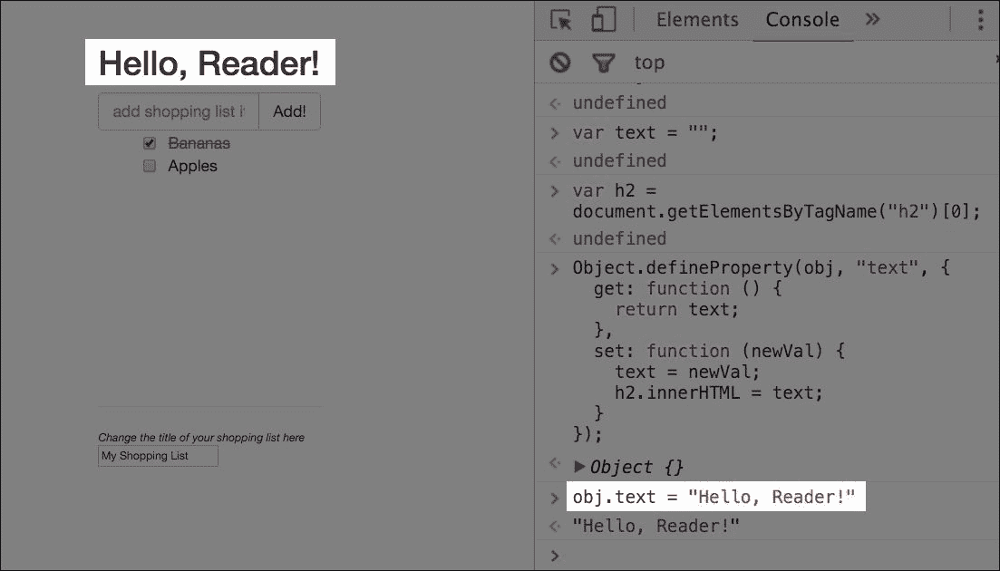
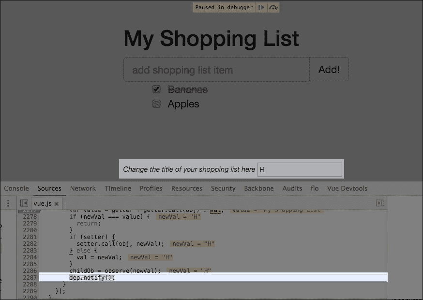
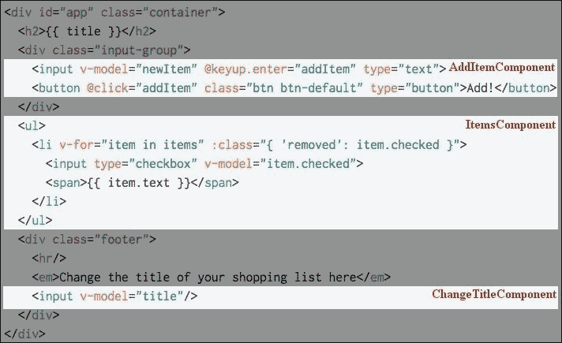
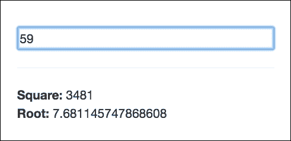
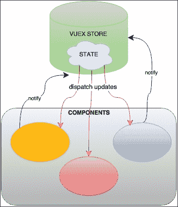
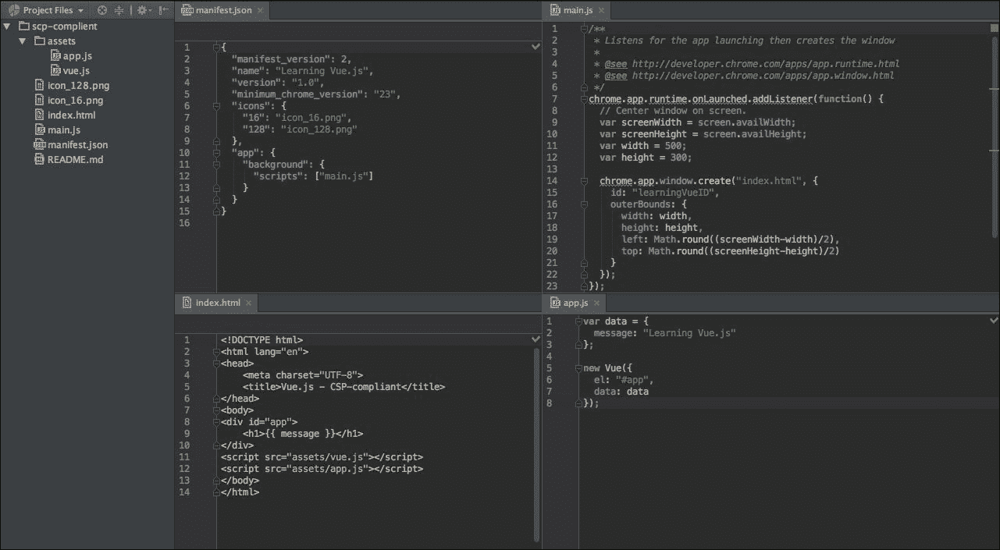
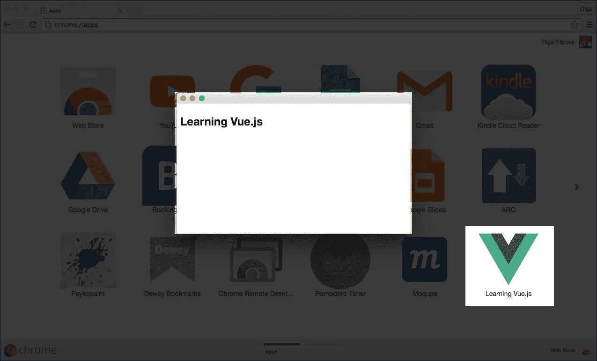
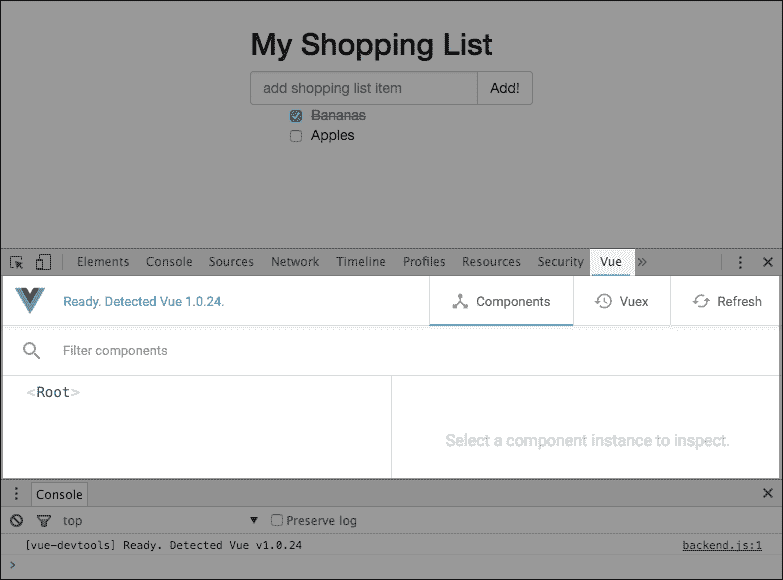
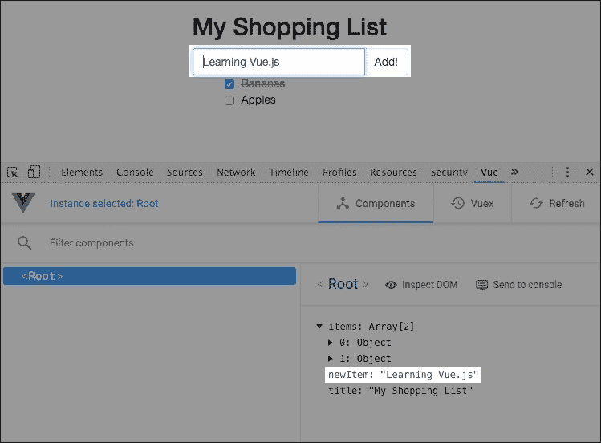

# 第二章：基础知识-安装和使用

在上一章中，我们对 Vue.js 有了一些了解。我们能够在两个不同的应用程序中使用它，这两个应用程序是从头开始创建的。我们学会了如何将 Vue.js 集成到已经存在的项目中。我们能够看到 Vue 的响应式数据绑定是如何运作的。

现在，你可能会问自己：它是如何工作的？在数据模型发生变化时，它是如何实现快速 UI 变化的行为？也许，你决定在你的项目中使用 Vue.js，并且现在想知道它是否遵循某种架构模式或范式，以便你应该在你的项目中采用它。在本章中，我们将探讨 Vue.js 框架的关键概念，以了解其所有幕后功能。此外，在本章中，我们将分析安装 Vue.js 的所有可能方式。我们还将为我们的应用程序创建一个骨架，我们将通过接下来的章节来开发和增强它。我们还将学习调试和测试我们应用程序的方法。

因此，在本章中，我们将学习：

+   MVVM 架构范式是什么，以及它如何应用于 Vue.js

+   什么是声明式视图

+   Vue.js 如何探索定义的属性、getter 和 setter

+   Vue.js 中响应性和数据绑定的工作原理

+   什么是脏检查、DOM 和虚拟 DOM

+   Vue.js 1.0 和 Vue.js 2.0 之间的主要区别

+   可重用组件是什么

+   Vue.js 中插件、指令、自定义插件和自定义指令的工作原理

+   如何安装、启动、运行和调试 Vue 应用程序

# MVVM 架构模式

你还记得我们在第一章中如何创建`Vue`实例吗？我们通过调用`new Vue({...})`来实例化它。你还记得在选项中，我们传递了页面上应该绑定这个`Vue`实例的元素，以及包含我们想要绑定到我们视图的属性的`data`对象。`data`对象是我们的模型，而`Vue`实例绑定的 DOM 元素是我们的视图：


经典的视图-模型表示，其中 Vue 实例将一个绑定到另一个

与此同时，我们的`Vue`实例是帮助将我们的模型绑定到视图以及反之的东西。因此，我们的应用程序遵循**模型-视图-视图模型**（**MVVM**）模式，其中`Vue`实例是视图模型：


模型-视图-视图模型模式的简化图表

我们的**Model**包含数据和一些业务逻辑，我们的**View**负责其表示。**ViewModel**处理数据绑定，确保在**Model**中更改的数据立即影响**View**层，反之亦然。

因此，我们的视图完全是数据驱动的。**ViewModel**负责控制数据流，使数据绑定对我们来说完全是声明性的。

# DefineProperty、getter 和 setter

那么，一旦数据传递给`Vue`实例，会发生什么？`Vue`对其应用了哪些转换，使其自动绑定到 View 层？

让我们分析一下，如果我们有一个字符串，每次它改变时，我们想对某个 DOM 元素应用一些转换，我们会怎么做。我们会如何应用字符串更改的监听函数？我们会将它附加到什么上？没有`var stringVar='hello';stringVar.onChange(doSomething)`这样的东西。

所以我们可能会将字符串的值设置和获取包装在某种函数中，该函数会做一些事情，例如每次字符串更新时更新 DOM。你会如何实现它？当你考虑这个问题时，我会准备一个有趣的快速演示。

打开您的购物清单应用程序的开发者工具。让我们写一点代码。创建一个`obj`变量和另一个`text`变量：

```js
var obj = {}; 
var text = ''; 

```

让我们将 DOM 元素`h2`存储在一个变量中：

```js
var h2 = document.getElementsByTagName('h2')[0]; 

```

如果我们将`text`分配给`obj.text`属性，如何才能在每次更改此属性时，`h2`的`innerHTML`也会相应更改？

让我们使用`Object.defineProperty`方法（[`developer.mozilla.org/en/docs/Web/JavaScript/Reference/Global_Objects/Object/defineProperty`](https://developer.mozilla.org/en/docs/Web/JavaScript/Reference/Global_Objects/Object/defineProperty)）。

该方法允许创建 getter 和 setter 函数，从而指定在访问或更改属性时必须发生什么：

```js
Object.defineProperty(obj, 'text', { 
  get: function () { 
    return text; 
  }, 
  set: function (newVal) { 
    text = newVal;  
    **h2.innerHTML = text;** 
  } 
}); 

```

现在尝试从控制台更改`obj.text`属性。看看标题：



每次属性更改时都会调用对象.defineProperty 的 set 方法

这个确切的机制被 Vue.js 使用过。一旦数据被传递给`Vue`实例，它的所有属性都会通过`Object.defineProperty`方法，为它们分配响应式的 getter 和 setter。对于页面上存在的每个指令，都会添加一个观察者，它会在`set`方法中被通知。在控制台中打开`vue.js`代码，并搜索一下说`set: function reactiveSetter(newVal)`的那一行。添加一个断点，尝试在输入框中更改购物清单的标题。现在一步步执行，直到达到这个函数中的最后一个调用，它说`dep.notify()`：



在调用观察者通知方法的 setter 函数内部设置断点

进入这个函数。你会看到这个函数正在遍历属性的观察者并更新它们。如果你跳过这个调用，你会发现 DOM 没有被更新。这是因为在同一个事件循环中执行的更新被放入了定期刷新的队列中。

找到`runBatcherQueue`函数并在其中设置一个断点。再次尝试更改标题。你会看到这个函数遍历了所有等待在队列中的观察者，并在每个观察者上调用`run`方法。如果你进入这个方法，你会看到它将新值与先前的值进行比较：

```js
if (value !== this.value ||... 

```

然后它调用了回调的执行：

```js
this.cb.call(this.vm, value, oldValue); 

```

如果你进入这个回调函数，你会看到最终它会更新 DOM 的值：

```js
    update: function update(value) { 
      **this.el[this.attr] = _toString(value);** 
    } 

```

这不是很简单吗？

### 注意：

在这个调试中使用的是 Vue 版本 1.0。

所以 Vue.js 响应式数据绑定背后的机制非常简单。观察者被分配给所有的指令和数据属性。然后，在`Object.defineProperty`的`set`方法中，观察者被通知，然后它们更新相应的 DOM 或数据：


从数据对象到 DOM 的数据流

具有指令的 DOM 元素附加了监听器，监听它们的更新并调用相应的数据属性 setter，然后唤醒它们的观察者。

# 与其他框架相比

当你尝试一个新的工具时，你想知道它与其他工具或框架相比如何。你可以在 Vue.js 的官方页面上找到关于这方面的深入分析：[`vuejs.org/guide/comparison.html`](http://vuejs.org/guide/comparison.html)。我只会指出一些我认为对于大多数使用的框架很重要的主题。

## React

React 和 Vue 非常相似。它们都使用虚拟 DOM，具有可重用的组件，并且都是关于反应性数据。然而，值得一提的是，Vue 只从其第二个主要版本开始使用虚拟 DOM。在 Vue 2.0 之前，它使用真实的 DOM。Vue 2.0 发布不仅比 Vue 1.0 更高效，而且比 React 更高效（[`vuejs.org/guide/comparison.html#Performance-Profiles`](http://vuejs.org/guide/comparison.html#Performance-Profiles)）。

最显著的区别可能是两个框架中如何创建组件的方式。你可能已经知道在 React 中，一切都是 JavaScript。即使是模板，也是用 JavaScript 开发的，这实际上可能是好的，因此程序员总是在相同的范围内，渲染变得更加灵活。

然而，对于一些想要进行快速原型设计的设计师，或者对编程技能不是很强的开发人员，或者只是不想学习 JSX 的人来说，这可能会变得非常痛苦。在 Vue 组件中，你实际上也可以使用 JSX，但你仍然可以遵循常见的 Web 开发结构：在`<style>`标签内编写 CSS，在`<template>`标签内编写 HTML 代码，在`<script>`标签内编写组件的逻辑。例如，比较一下 React 中渲染函数内的模板和你可以在 Vue 组件内编写的模板。在这个例子中，我将展示如何渲染我们之前看到的购物清单的项目列表。因此，在 React 中，你最终会得到类似于这样的 JSX 代码：

```js
render () { 
  return ( 
    <ul> 
    {items.map(item => 
    <li className={item.checked && 'removed'}> 
      <div className='checkbox'> 
        <input type='checkbox' checked={item.checked}>          
        { item.text } 
      </div> 
    </li> 
    )} 
    </ul> 
  ) 
}); 

```

使用 Vue，你只需在`template`标签内写入以下 HTML 代码：

```js
<template> 
<ul> 
  <li v-for="item in items" :class="{ 'removed': item.checked }"> 
    <div class="checkbox"> 
    <label> 
    <input type="checkbox" v-model="item.checked"> {{ item.text }} 
  </label> 
  </div> 
  </li> 
</ul> 
</template>
```

我个人喜欢将这些东西分开，因此我觉得 Vue 提供了这种可能性很好。

Vue 的另一个好处是它允许使用`scoped`属性附加到`style`标签来在组件内部限定样式：

```js
<style **scoped**> 
</style> 

```

在这种样式中，如果你使用预处理器，你仍然可以访问所有全局定义的变量，并且可以创建或重新定义只能由该组件访问的样式。

还值得一提的是，这两个框架的学习曲线。要开始使用 React 开发应用程序，您可能需要学习 JSX 和 ES2105 语法，因为官方 React 文档中的大多数示例都使用它。而对于 Vue，您可以从零开始。只需将其包含在页面中，就像您使用 jQuery 一样，您就可以使用相当简单和易于理解的语法来使用 Vue 模型和数据绑定，以及您喜欢使用的任何 JavaScript 版本。之后，您可以在学习和应用程序风格上进行扩展。

如果您想对这两个框架进行更深入的分析，请查看文档，尝试阐述类似的例子，并检查哪个更适合您的需求。

## Angular

Angular 1 和 Angular 2 之间有很大的区别。我们都知道，Angular 的第二个版本与其前身完全不同。它提供了更高的性能，API 也不同，并且底层实现已经被重写。

这两个版本的区别如此之大，以至于在 Vue 的官方文档中，您会发现对比两个 Angular 版本的比较，就像对比两个不同的框架一样。然而，学习曲线以及每个框架强制您构建应用程序的方式对于两个 Angular 版本都是横跨的。事实证明，Vue 比 Angular 1 和 Angular 2 都不那么武断。只需比较一下 Angular 的快速入门指南和 Vue 的 hello world 应用程序，就可以看出这一点。[`angular.io/docs/js/latest/quickstart.html`](https://angular.io/docs/js/latest/quickstart.html) 和 [`vuejs.org/guide/index.html#Hello-World`](http://vuejs.org/guide/index.html#Hello-World) 。

|   | *"即使没有 TypeScript，Angular 的快速入门指南也从一个使用 ES2015 JavaScript、NPM 的应用程序开始，有 18 个依赖项，4 个文件，超过 3000 个字来解释这一切 - 只是为了说 Hello World。"* |   |
| --- | --- | --- |
|   | --*http://vuejs.org/guide/comparison.html#Learning-Curve* |

如果您仍在使用 Angular 1，值得一提的是，这个框架与 Vue 之间的重大区别在于，在这个版本的 Angular 中，每次作用域发生变化时，都会重新评估所有的观察者，从而执行脏检查，因此当观察者的数量变得相当高时，性能会降低。因此，在 Vue 中，当作用域中的某些内容发生变化时，只有这个属性的观察者会被重新评估。其他观察者都会保持空闲，等待它们各自的调用。

## Vue

不，这不是打字错误。值得一提的是，Vue 也值得与 Vue 进行比较。Vue 最近推出了它的第二个版本，比起前身更快更干净。如果你仍在使用 Vue 1.0，值得升级。如果你对 Vue 的版本一无所知，值得了解它的发展以及新版本允许做什么。查看 Vue 在 2016 年 4 月发布 Vue 2.0 的博客文章[`vuejs.org/2016/04/27/announcing-2.0/`](https://vuejs.org/2016/04/27/announcing-2.0/)。

# Vue.js 基础知识

在将我们的手放入代码并开始用组件、插件、混合、模板和其他东西增强我们的应用程序之前，让我们回顾一下主要的 Vue 特性。让我们分析可重用组件是什么，以及如何管理应用程序状态，还谈论插件、过滤器和混合。在本节中，我们将对这些特性进行简要概述。我们将在接下来的章节中深入学习它们。

## 可重用组件

现在你不仅知道 Vue.js 中的数据绑定是什么以及如何使用它，还知道它是如何工作的，现在是时候介绍 Vue.js 的另一个强大特性了。使用 Vue.js 创建的组件可以在应用程序中被使用和重复使用，就像你用砖块建造房子一样。每个组件都有自己的样式和绑定范围，与其他组件完全隔离。

组件创建语法与我们已经了解的`Vue`实例创建非常相似，你只需要使用`Vue.extend`而不是`Vue`：

```js
var CustomComponent = Vue.extend({...}) 

```


Vue.js 中的自定义组件

例如，让我们尝试将我们的购物清单代码分成组件。你记得，我们的购物清单基本上由三部分组成：包含购物清单项目的部分，包含添加新项目的输入的另一部分，以及允许更改购物清单标题的第三部分。


购物清单应用程序的三个基本部分

让我们修改应用程序的代码，使其使用三个组件，每个部分一个组件。

我们的代码看起来像下面这样：

```js
var data = { 
  items: [{ text: 'Bananas', checked: true },    
          { text: 'Apples', checked: false }], 
  title: 'My Shopping List', 
  newItem: '' 
}; 

new Vue({ 
  el: '#app', 
  data: data, 
  methods: { 
    addItem: function () { 
      var text; 

      text = this.newItem.trim(); 
      if (text) { 
        this.items.push({ 
          text: text, 
          checked: false 
        }); 
        this.newItem = ''; 
      } 
    } 
  } 
}); 

```

现在我们将创建三个组件：`ItemsComponent`、`ChangeTitleComponent` 和 `AddItemComponent`。它们都将具有带有 `data` 对象的 `data` 属性。`addItem` 方法将从主 `Vue` 实例跳转到 `ChangeTitleComponent`。所有必要的 HTML 将从我们的 `index.html` 文件转移到每个组件中。因此，最终，我们的主脚本将如下所示：

```js
var data = { 
  items: [{ text: 'Bananas', checked: true },
          { text: 'Apples', checked: false }], 
  title: 'My Shopping List', 
  newItem: '' 
}; 

/** 
 * Declaring components 
 */ 
var **ItemsComponent** = Vue.extend({ 
  data: function () { 
    return data; 
  }, 
  template: '<ul>' + 
  '           <li v-for="item in items"
              :class="{ 'removed': item.checked }">' + 
  '             <div class="checkbox">' + 
  '               <label>' + 
  '                 <input type="checkbox"                       
                    v-model="item.checked"> {{ item.text }}' + 
  '               </label>' + 
  '             </div>' + 
  '           </li>' + 
  '         </ul>' 
}); 
var **ChangeTitleComponent** = Vue.extend({ 
  data: function () { 
    return data; 
  }, 
  template: '<input v-model="title"/>' 
}); 
var **AddItemComponent** = Vue.extend({ 
  data: function () { 
    return data; 
  }, 
  methods: { 
    addItem: function () { 
      var text; 

      text = this.newItem.trim(); 
      if (text) { 
        this.items.push({ 
          text: text, 
          checked: false 
        }); 
        this.newItem = ""; 
      } 
    } 
  }, 
  template: 
  '<div class="input-group">' + 
    '<input v-model="newItem" @keyup.enter="addItem"        
     placeholder="add shopping list item" type="text"       
     class="form-control">'  + 
    '<span class="input-group-btn">'  + 
    '  <button @click="addItem" class="btn btn-default"           
       type="button">Add!</button>'  + 
    '</span>'  + 
  '</div>' 
}); 

/** 
 * Registering components 
 */ 
**Vue.component('items-component', ItemsComponent); 
Vue.component('change-title-component', ChangeTitleComponent); 
Vue.component('add-item-component', AddItemComponent);** 
/** 
 * Instantiating a Vue instance 
 */ 
new Vue({ 
  el: '#app', 
  data: data 
}); 

```

我们如何在视图中使用这些组件？我们只需用注册组件的标签替换相应的标记。我们的标记看起来像下面这样：



具有定义组件的购物清单应用程序标记

因此，我们将用 `<add-item-component></add-item-component>` 标签替换第一个高亮区域，用 `<items-component></items-component>` 标签替换第二个高亮区域，用 `<change-title-component></change-title-component>` 标签替换第三个高亮区域。因此，我们之前庞大的标记现在看起来像下面这样：

```js
<div id="app" class="container"> 
  <h2>{{ title }}</h2> 
  **<add-item-component></add-item-component> 
  <items-component></items-component>** 
  <div class="footer"> 
    <hr/> 
    <em>Change the title of your shopping list here</em> 
    **<change-title-component></change-title-component>** 
  </div> 
</div> 

```

我们将在下一章深入研究组件，并学习一种更好的组织方式。敬请关注！

## Vue.js 指令

在上一章中，您已经学习了指令是什么，以及它们如何用于增强应用程序的行为。

您已经使用了一些指令，这些指令以不同的方式允许数据绑定到视图层（`v-model`、`v-if`、`v-show`等）。除了这些默认指令之外，Vue.js 还允许您创建自定义指令。自定义指令提供了一种机制，可以实现 DOM 到数据的自定义映射行为。

在注册自定义指令时，您可以提供三个函数：`bind`、`update` 和 `unbind`。在 `bind` 函数中，您可以将事件侦听器附加到元素，并在那里执行任何需要执行的操作。在接收旧值和新值作为参数的 `update` 函数中，您可以定义数据更改时应该发生的自定义行为。`unbind` 方法提供了所有所需的清理操作（例如，分离事件侦听器）。

### 提示

在 Vue 2.0 中，指令显著减少了责任范围，现在它们只用于应用低级别的直接 DOM 操作。Vue 的变更指南建议优先使用组件而不是自定义指令（[`github.com/vuejs/vue/issues/2873`](https://github.com/vuejs/vue/issues/2873)）。

因此，自定义指令的完整版本将如下所示：

```js
Vue.directive('my-directive', { 
  bind: function () { 
    // do the preparation work on element binding 
  }, 
  update: function (newValue, oldValue) { 
    // do something based on the updated value 
  }, 
  unbind: function () { 
    // do the clean-up work 
  } 
}) 

```

简化版本，如果您只需要在值更新时执行某些操作，则只能具有`update`方法，该方法可以直接作为指令函数的第二个参数传递：

```js
Vue.directive('my-directive', function (el, binding) { 
  // do something with binding.value 
}) 

```

理论很好，但没有一个小例子，它就会变得无聊。所以让我们看一个非常简单的例子，每次更新其值时都会显示数字的平方。

我们的自定义指令将如下所示：

```js
Vue.directive('square', function (el, binding) { 
  el.innerHTML = Math.pow(binding.value, 2); 
}); 

```

在模板文件中使用`v-`前缀使用此指令：

```js
<div v-square="item"></div> 

```

在其数据中实例化`Vue`实例，并尝试更改`item`的值。您会看到`div`元素内的值将立即显示更改后的值的平方数。此自定义指令的完整代码可以在 JSFiddle 上找到[`jsfiddle.net/chudaol/we07oxbd/`](https://jsfiddle.net/chudaol/we07oxbd/)。

## 在 Vue.js 中的插件

Vue 的核心功能，正如我们已经分析的那样，提供了声明性数据绑定和组件组合。这种核心行为通过提供丰富功能的插件得到增强。有几种类型的插件：

+   添加一些全局属性或方法（`vue-element`）的插件

+   添加一些全局资源（`vue-touch`）的插件

+   添加`Vue`实例方法并将它们附加到 Vue 的原型上的插件

+   提供一些外部功能或 API（`vue-router`）的插件

插件必须提供一个`install`方法，该方法可以访问全局`Vue`对象，以增强和修改它。为了使用此插件，Vue 提供了`use`方法，该方法接收插件实例（`Vue.use(SomePlugin)`）。

### 提示

您还可以编写自己的 Vue 插件，以启用对`Vue`实例的自定义行为。

让我们使用先前的自定义指令示例，并创建一个实现数学平方和平方根指令的简约插件。创建一个名为`VueMathPlugin.js`的文件，并添加以下代码：

```js
export default { 
  **install**: function (Vue) { 
    Vue.directive('square', function (el, binding) { 
      el.innerHTML = Math.pow(binding.value, 2); 
    }); 
    Vue.directive('sqrt', function (el, binding) { 
      el.innerHTML = Math.sqrt(binding.value); 
    }); 
  } 
}; 

```

现在创建一个名为`script.js`的文件。让我们将主要脚本添加到此文件中。在此脚本中，我们将同时导入`Vue`和`VueMathPlugin`，并将调用 Vue 的`use`方法，以告诉它使用插件并调用插件的`install`方法。然后我们将像往常一样初始化一个`Vue`实例：

```js
import Vue from 'vue/dist/vue.js'; 
import VueMathPlugin from './VueMathPlugin.js'; 

**Vue.use(VueMathPlugin);** 

new Vue({ 
  el: '#app', 
  data: { item: 49 } 
}); 

```

现在创建一个包含`main.js`文件的`index.html`文件（我们将使用 Browserify 和 Babelify 构建它）。在这个文件中，让我们使用`v-model`指令添加一个输入，用于更改项目的值。使用`v-square`和`v-sqrt`指令创建两个 span：

```js
<body> 
  <div id="app"> 
    <input v-model="item"/> 
    <hr> 
    <div>Square: <span **v-square="item"**></span></div> 
    <div>Root: <span **v-sqrt="item"**></span></div> 
  </div> 
  <script src="main.js"></script> 
</body> 

```

创建一个`package.json`文件，包括构建项目所需的依赖项，并添加一个构建`main.js`文件的脚本：

```js
{ 
  "name": "vue-custom-plugin", 
  "scripts": { 
    "build": **"browserify script.js -o main.js -t
       [ babelify --presets [ es2015 ] ]"** 
  }, 
  "version": "0.0.1", 
  "devDependencies": { 
    "babel-preset-es2015": "⁶.9.0", 
    "babelify": "⁷.3.0", 
    "browserify": "¹³.0.1", 
    "vue": "².0.3" 
  } 
} 

```

现在使用以下命令安装依赖并构建项目：

```js
**npm install**
**npm run build**

```

在浏览器中打开`index.html`。尝试更改输入框中的数字。正方形和平方根的值都会立即改变：



数据的更改立即应用于作为自定义插件的一部分创建的指令

## 练习

使用三角函数（正弦、余弦和正切）增强`MathPlugin`。

此练习的可能解决方案可以在*附录*中找到。

## 应用状态和 Vuex

当应用程序达到相当大的规模时，可能需要我们以某种方式管理全局应用程序状态。受 Flux（[`facebook.github.io/flux/`](https://facebook.github.io/flux/)）的启发，有一个 Vuex 模块，允许我们在 Vue 组件之间管理和共享全局应用程序状态。

### 提示

不要将应用程序状态视为复杂和难以理解的东西。实际上，它只不过是数据。每个组件都有自己的数据，“应用程序状态”是可以在所有组件之间轻松共享的数据！



Vuex 存储库如何管理应用程序状态更新

与其他插件一样，为了能够使用和实例化 Vuex 存储库，您需要指示 Vue 使用它：

```js
import Vuex from 'vuex'; 
import Vue from 'vue'; 

Vue.use(Vuex); 

var store = new Vuex.Store({ 
  state: { <...> }, 
  mutations: { <...> } 
}); 

```

然后，在初始化主组件时，将存储实例分配给它：

```js
new Vue({ 
  components: components, 
  store: store 
}); 

```

现在，主应用程序及其所有组件都知道存储库，可以访问其中的数据，并能够在应用程序的任何生命周期中触发操作。我们将在接下来的章节中深入挖掘应用程序状态。

## vue-cli

是的，Vue 有自己的命令行界面。它允许我们使用任何配置初始化 Vue 应用程序。您可以使用 Webpack 样板初始化它，使用 Browserify 样板初始化它，或者只是使用一个简单的样板，只需创建一个 HTML 文件并为您准备好一切，以便开始使用 Vue.js 进行工作。

使用`npm`安装它：

```js
**npm install -g vue-cli**

```

初始化应用程序的不同方式如下：

```js
**vue init webpack**
**vue init webpack-simple**
**vue init browserify**
**vue init browserify-simple**
**vue init simple**

```

为了看到区别，让我们分别使用简单模板和 Webpack 模板运行`vue init`，并查看生成结构的差异。以下是两个命令的输出差异：


命令`vue init webpack`和`vue init simple`的输出

以下是应用程序结构的不同之处：


使用`vue init simple`和`vue init webpack`脚手架生成的应用程序结构的不同之处

简单配置中的`index.html`文件已经包含了来自 CDN 的 Vue.js，所以如果你只需要做一些非常简单的事情，比如快速原型设计，就可以使用这个。

但是，如果你要开始一个需要在开发过程中进行测试和热重载的复杂**单页面应用程序**（**SPA**）项目，请使用 Webpack 或 Browserify 配置。

## IDE 的 Vue 插件

有一些主要 IDE 的 Vue 语法高亮插件。我会给你留下最潮的链接：

| **IDE** | **链接到 Vue 插件** |
| --- | --- |
| Sublime | [`github.com/vuejs/vue-syntax-highlight`](https://github.com/vuejs/vue-syntax-highlight) |
| Webstorm | [`github.com/postalservice14/vuejs-plugin`](https://github.com/postalservice14/vuejs-plugin) |
| Atom | [`github.com/hedefalk/atom-vue`](https://github.com/hedefalk/atom-vue) |
| Visual Studio Code | [`github.com/LiuJi-Jim/vscode-vue`](https://github.com/LiuJi-Jim/vscode-vue) |
| vim | [`github.com/posva/vim-vue`](https://github.com/posva/vim-vue) |
| Brackets | [`github.com/pandao/brackets-vue`](https://github.com/pandao/brackets-vue) |

# 安装、使用和调试 Vue.js 应用程序

在本节中，我们将分析安装 Vue.js 的所有可能方式。我们还将为我们将在接下来的章节中开发和增强的应用程序创建一个骨架。我们还将学习调试和测试我们的应用程序的方法。

## 安装 Vue.js

有许多种安装 Vue.js 的方式。从经典的开始，包括将下载的脚本放入 HTML 的`<script>`标签中，使用诸如 bower、npm 或 Vue 的命令行接口（`vue-cli`）等工具，以启动整个应用程序。

让我们看看所有这些方法，并选择我们喜欢的。在所有这些示例中，我们只会在页面上显示一个标题，写着**`学习 Vue.js`**。

### 独立使用

下载`vue.js`文件。有两个版本，压缩和开发者版本。开发版本在[`vuejs.org/js/vue.js`](https://vuejs.org/js/vue.js)。压缩版本在[`vuejs.org/js/vue.min.js`](https://vuejs.org/js/vue.min.js)。

### 提示

如果您正在开发，请确保使用 Vue 的开发非压缩版本。您会喜欢控制台上的良好提示和警告。

然后只需在`<script>`标签中包含`vue.js`，如下所示：

```js
<script src="vue.js"></script> 

```

Vue 已在全局变量中注册。您可以开始使用它。

我们的示例将如下所示：

```js
  <div id="app"> 
    <h1>{{ message }}</h1> 
  </div> 
  **<script src="vue.js"></script>** 
  <script> 
     var data = { 
       message: 'Learning Vue.js' 
     }; 

     new Vue({ 
       el: '#app', 
       data: data 
     }); 
  </script> 

```

### CDN

Vue.js 在以下 CDN 中可用：

+   **jsdelivr**：[`cdn.jsdelivr.net/vue/2.0.3/vue.js`](https://cdn.jsdelivr.net/vue/2.0.3/vue.js)

+   **cdnjs**：[`cdnjs.cloudflare.com/ajax/libs/vue/2.0.3/vue.js`](https://cdnjs.cloudflare.com/ajax/libs/vue/2.0.3/vue.js)

+   **unpkg**：[`unpkg.com/vue@2.0.3/dist/vue.js`](https://unpkg.com/vue@2.0.3/dist/vue.js)（推荐）

只需将 URL 放在`script`标签中的源中，您就可以使用 Vue 了！

```js
<script src="  https://cdnjs.cloudflare.com/ajax/libs/vue/2.0.3/vue.js"></script> 

```

### 提示

请注意 CDN 版本可能与 Vue 的最新可用版本不同步。

因此，示例看起来与独立版本完全相同，但是我们使用 CDN URL 而不是在`<script>`标签中使用下载的文件。

### Bower

如果您已经在 Bower 中管理您的应用程序，并且不想使用其他工具，Vue 也有一个 Bower 分发版本。只需调用`bower install`：

```js
**# latest stable release**
**bower install vue**

```

我们的示例看起来与前两个示例完全相同，但它将包括来自`bower`文件夹的文件：

```js
<script src="bower_components/vue/dist/vue.js"></script> 

```

### 符合 CSP

**内容安全策略**（**CSP**）是一种安全标准，提供了一组规则，必须由应用程序遵守，以防止安全攻击。如果您正在为浏览器开发应用程序，您可能熟悉这个策略！

对于需要符合 CSP 的脚本的环境，Vue.js 有一个特殊版本，位于[`github.com/vuejs/vue/tree/csp/dist`](https://github.com/vuejs/vue/tree/csp/dist)。

让我们将我们的示例作为 Chrome 应用程序，看看符合 CSP 的 Vue.js 在其中的表现！

首先创建一个文件夹用于我们的应用程序示例。Chrome 应用程序中最重要的是`manifest.json`文件，它描述了您的应用程序。让我们创建它。它应该如下所示：

```js
{ 
  "manifest_version": 2, 
  "name": "Learning Vue.js", 
  "version": "1.0", 
  "minimum_chrome_version": "23", 
  "icons": { 
    "16": "icon_16.png", 
    "128": "icon_128.png" 
  }, 
  "app": { 
    "background": { 
      "scripts": ["main.js"] 
    } 
  } 
} 

```

下一步是创建我们的`main.js`文件，这将是 Chrome 应用程序的入口点。该脚本应监听应用程序的启动并打开一个给定大小的新窗口。让我们创建一个大小为 500 x 300 的窗口，并使用`index.html`打开它：

```js
chrome.app.runtime.onLaunched.addListener(function() { 
  // Center the window on the screen. 
  var screenWidth = screen.availWidth; 
  var screenHeight = screen.availHeight; 
  var width = 500; 
  var height = 300; 

  chrome.app.window.create(**"index.html"**, { 
    id: "learningVueID", 
    outerBounds: { 
      width: width, 
      height: height, 
      left: Math.round((screenWidth-width)/2), 
      top: Math.round((screenHeight-height)/2) 
    } 
  }); 
}); 

```

此时，Chrome 特定的应用程序魔法已经结束，现在我们只需创建一个`index.html`文件，该文件将执行与之前示例中相同的操作。它将包括`vue.js`文件和我们的脚本，我们将在其中初始化我们的 Vue 应用程序：

```js
<html lang="en"> 
<head> 
    <meta charset="UTF-8"> 
    <title>Vue.js - CSP-compliant</title> 
</head> 
<body> 
<div id="app"> 
    <h1>{{ message }}</h1> 
</div> 
<script src="assets/vue.js"></script> 
<script src="assets/app.js"></script> 
</body> 
</html> 

```

下载符合 CSP 标准的 Vue.js 版本，并将其添加到`assets`文件夹中。

现在让我们创建`app.js`文件，并添加我们已经多次编写的代码：

```js
var data = { 
  message: "Learning Vue.js" 
}; 

new Vue({ 
  el: "#app", 
  data: data 
}); 

```

将其添加到`assets`文件夹中。

不要忘记创建两个 16 和 128 像素的图标，并分别将它们命名为`icon_16.png`和`icon_128.png`。

最后，您的代码和结构应该看起来与以下内容差不多：



使用 vue.js 创建示例 Chrome 应用程序的结构和代码

现在最重要的事情。让我们检查它是否有效！这非常非常简单：

1.  在 Chrome 浏览器中转到`chrome://extensions/url`。

1.  勾选**“开发者模式”**复选框。

1.  单击**“加载未打包的扩展程序...”**，并检查我们刚刚创建的文件夹。

1.  您的应用程序将出现在列表中！现在只需打开一个新标签，单击应用程序，然后检查您的应用程序是否存在。单击它！



在 Chrome 应用程序列表中使用 vue.js 的示例 Chrome 应用程序

恭喜！您刚刚创建了一个 Chrome 应用程序！

### npm

建议对于大型应用程序使用`npm`安装方法。只需按照以下方式运行`npm install vue`：

```js
**# latest stable release**
**npm install vue**
**# latest stable CSP-compliant release**
**npm install vue@csp**

```

然后需要引入它：

```js
**var Vue = require("vue");**

```

或者，对于 ES2015 爱好者，请运行以下命令：

```js
**import Vue from "vue";**

```

我们的 HTML 将与之前的示例完全相同：

```js
<html lang="en"> 
<head> 
  <meta charset="UTF-8"> 
  <title>Vue.js - NPM Installation</title> 
</head> 
<body> 
  <div id="app"> 
    <h1>{{ message }}</h1> 
  </div> 
  <script src=**"main.js"**></script> 
</body> 
</html> 

```

现在让我们创建一个`script.js`文件，它几乎与独立版本或 CDN 版本完全相同，唯一的区别是它将需要`vue.js`：

```js
**var Vue = require('vue/dist/vue.js');** 

var data = { 
  message: 'Learning Vue.js' 
}; 

new Vue({ 
  el: '#app', 
  data: data 
}); 

```

让我们安装 Vue 和 Browserify，以便能够将我们的`script.js`文件编译成`main.js`文件：

```js
**npm install vue --save-dev**
**npm install browserify --save-dev**

```

在`package.json`文件中，添加一个构建脚本，该脚本将在`script.js`上执行 Browserify，将其转换为`main.js`。因此，我们的`package.json`文件将如下所示：

```js
{ 
  "name": "learningVue", 
  "scripts": { 
    "build": "browserify script.js -o main.js" 
  }, 
  "version": "0.0.1", 
  "devDependencies": { 
    "browserify": "¹³.0.1", 
    "vue": "².0.3" 
  } 
} 

```

现在运行以下命令：

```js
**npm run build**

```

然后在浏览器中打开`index.html`。

我有一个朋友在这一点上会说类似的话：真的吗？这么多步骤，安装，命令，解释...只是为了输出一些标题？我不干了！

如果您也在思考这个问题，请等一下。是的，这是真的，现在我们以一种相当复杂的方式做了一些非常简单的事情，但是如果您和我一起坚持一会儿，您将看到如果我们使用适当的工具，复杂的事情变得容易实现。另外，不要忘记检查您的番茄钟，也许是休息的时候了！

### vue-cli

正如我们在上一章中已经提到的，Vue 提供了自己的命令行界面，允许使用您想要的任何工作流来引导单页应用程序。它立即提供了热重载和测试驱动环境的结构。安装了`vue-cli`之后，只需运行`vue init <desired boilerplate> <project-name>`，然后只需安装和运行：

```js
**# install vue-cli**
**$ npm install -g vue-cli**
**# create a new project**
**$ vue init webpack learn-vue**
**# install and run**
**$ cd learn-vue**
**$ npm install**
**$ npm run dev** 

```

现在在`localhost:8080`上打开您的浏览器。您刚刚使用`vue-cli`来搭建您的应用程序。让我们将其调整到我们的示例中。打开一个源文件夹。在`src`文件夹中，您将找到一个`App.vue`文件。您还记得我们谈到过 Vue 组件就像是您构建应用程序的砖块吗？您还记得我们是如何在主脚本文件中创建和注册它们的，并且我提到我们将学习以更优雅的方式构建组件吗？恭喜，您正在看一个以时髦方式构建的组件！

找到说`import Hello from './components/Hello'`的那一行。这正是组件在其他组件中被重用的方式。看一下组件文件顶部的模板。在某个地方，它包含`<hello></hello>`标记。这正是在我们的 HTML 文件中`hello`组件将出现的地方。看一下这个组件；它在`src/components`文件夹中。正如您所看到的，它包含一个带有`{{ msg }}`的模板和一个导出带有定义的`msg`数据的脚本。这与我们在之前的示例中使用组件时所做的完全相同。让我们稍微修改代码，使其与之前的示例相同。在`Hello.vue`文件中，更改`data`对象中的`msg`：

```js
<script> 
export default { 
  data () { 
    return { 
   msg: **"Learning Vue.js"** 
    } 
  } 
} 
</script> 

```

在`App.vue`组件中，从模板中删除除了`hello`标记之外的所有内容，使模板看起来像下面这样：

```js
<template> 
  <div id="app"> 
    <hello></hello> 
  </div> 
</template> 

```

现在，如果重新运行应用程序，您将看到我们的示例具有美丽的样式，而我们没有触及：


使用 vue-cli 引导的 Vue 应用程序

### 提示

除了 Webpack 样板模板，你可以使用以下配置与你的`vue-cli`一起使用：

+   `webpack-simple`：一个用于快速原型设计的简单 Webpack + vue-loader 设置

+   `browserify`：一个具有热重载、linting 和单元测试的全功能 Browserify + Vueify 设置

+   `browserify-simple`：一个用于快速原型设计的简单 Browserify + Vueify 设置

+   `simple`：一个在单个 HTML 文件中的最简单的 Vue 设置

### Dev build

亲爱的读者，我能看到你闪亮的眼睛，我能读懂你的心思。现在你知道如何安装和使用 Vue.js 以及它的工作原理，你肯定想深入了解核心代码并做出贡献！

我理解你。为此，你需要使用 Vue.js 的开发版本，你需要从 GitHub 上下载并自行编译。

让我们用这个开发版本的 Vue 来构建我们的示例。创建一个新文件夹，例如`dev-build`，并将所有文件从 npm 示例复制到此文件夹中。

不要忘记复制`node_modules`文件夹。你应该`cd`进入它，并从 GitHub 下载文件到其中，然后运行`npm install`和`npm run build`：

```js
**cd <APP-PATH>/node_modules**
**rm -rf vue**
**git clone https://github.com/vuejs/vue.git**
**cd vue**
**npm install**
**npm run build**

```

现在构建我们的示例应用程序：

```js
**cd <APP-PATH>**
**npm run build**

```

在浏览器中打开`index.html`，你会看到通常的**`学习 Vue.js`**标题。

现在让我们尝试更改`vue.js`源代码中的一些内容！转到`node_modules/vue/src/compiler/parser`文件夹，并打开`text-parser.js`文件。找到以下行：

```js
const defaultTagRE = /\{\{((?:.|\n)+?)\}\}/g  

```

实际上，这个正则表达式定义了 HTML 模板中使用的默认定界符。这些定界符内的内容被识别为 Vue 数据或 JavaScript 代码。让我们改变它们！让我们用双百分号替换`{`和`}`！继续编辑文件：

```js
const defaultTagRE = /\%\%((?:.|\n)+?)\%\%/g  

```

现在重新构建 Vue 源代码和我们的应用程序，然后刷新浏览器。你看到了什么？


更改 Vue 源代码并替换定界符后，{{}}定界符不再起作用！

`{{}}`中的消息不再被识别为我们传递给 Vue 的数据。实际上，它被呈现为 HTML 的一部分。

现在转到`index.html`文件，并用双百分号替换我们的花括号定界符，如下所示：

```js
<div id="app"> 
  <h1>**%% message %%**</h1> 
</div> 

```

重新构建我们的应用程序并刷新浏览器！现在怎么样？你看到了改变框架代码并尝试你的改变是多么容易。我相信你有很多关于如何改进或添加一些功能到 Vue.js 的想法。所以改变它，重新构建，测试，部署！愉快的拉取请求！

# 调试您的 Vue 应用程序

您可以像调试任何其他 Web 应用程序一样调试您的 Vue 应用程序。使用开发者工具（firebug），断点，调试器语句等。如果您想深入了解 Chrome 调试工具，请查看 Chrome 的文档[`developer.chrome.com/devtools`](https://developer.chrome.com/devtools)。

Vue 还提供了*Vue.js devtools*，因此调试 Vue 应用程序变得更容易。您可以从 Chrome 网络商店下载并安装它[`chrome.google.com/webstore/detail/vuejs-devtools/nhdogjmejiglipccpnnnanhbledajbpd`](https://chrome.google.com/webstore/detail/vuejs-devtools/nhdogjmejiglipccpnnnanhbledajbpd)。

不幸的是，它不适用于本地打开的文件，因此请使用一些简单的 HTTP 服务器来将我们的示例作为 Web 页面提供（例如，[`www.npmjs.com/package/http-server`](https://www.npmjs.com/package/http-server)）。

安装后，打开，例如，我们的购物清单应用程序。打开开发者工具。您将看到**`Vue`**选项卡已自动出现：



Vue devtools

在我们的情况下，我们只有一个组件—**`<Root>`**。可以想象，一旦我们开始使用组件并且有很多组件，它们都会出现在 Vue devtools 调色板的左侧。单击**`<Root>`**组件并对其进行检查。您将看到附加到此组件的所有数据。如果您尝试更改某些内容，例如添加购物清单项目，检查或取消复选框，更改标题等，所有这些更改都将立即传播到 Vue devtools 中的数据。您将立即在其右侧看到更改。例如，让我们尝试添加一个购物清单项目。一旦开始输入，您会看到`newItem`如何相应更改：



模型中的更改立即传播到 Vue devtools 数据

当我们开始添加更多组件并向我们的 Vue 应用程序引入复杂性时，调试肯定会变得更有趣！

# 搭建我们的应用程序

你还记得我们在第一章开始工作的两个应用程序，购物清单应用程序和番茄钟应用程序吗？在本节中，我们将使用`vue-cli`工具搭建这些应用程序，以便它们准备好包含可重用组件，进行测试和部署。一旦我们引导这些应用程序，我们将在本书的最后工作。所以让我们小心谨慎地做，并充满爱心！

## 搭建购物清单应用程序

我们将使用`vue-cli` Webpack 配置来搭建购物清单应用程序。

### 提示

如果你忽略了与`vue-cli`相关的所有先前的实际练习，请不要忘记在继续下一步之前安装它：**npm install -g vue-cli**

如果你已经安装了`vue-cli`，请转到要引导应用程序的目录并运行以下命令：

```js
**vue init webpack shopping-list**

```

对所有问题回答 yes（只需点击回车键），voilà！你已经引导了应用程序：


使用 vue-cli 引导购物清单应用程序

切换到购物清单目录并运行`npm install`和`npm run dev`。在`localhost:8080`上打开你的浏览器。你会看到新创建的 Vue 应用程序的**`Hello World`**页面：


新引导应用程序的 Hello World 视图

让我们清理引导代码，使应用程序准备好填充我们的特定应用程序代码。转到`App.vue`文件并删除所有内容，只留下定义应用程序结构的标签：

+   `<template>`与主要的`<div>`内部

+   `<script>`标签

+   `<style>`标签

因此，最终，你的`App.vue`文件看起来像下面这样：

```js
<template>
  <div id="app">
  </div>
</template>

<script>
</script>

<style>
</style>

```

看看在浏览器中打开的页面。有趣的是，你什么都没做，但页面现在不再包含默认的**`Hello World`**。页面是空的！它自动改变了！

尝试在`<template>`标签内添加一些内容。查看页面；一旦你引入更改，它会自动重新加载。这是因为`vue-hot-reload`插件会检测你的 Vue 组件的更改，并自动重建项目并重新加载浏览器页面。尝试在`<script>`标签内写一些不符合 lint 标准的 JavaScript 代码，例如使用`notDefinedVariable`：

```js
<script> 
  **notDefinedVariable = 5;** 
</script> 

```

浏览器中的页面没有刷新。看看你的 shell 控制台。它显示了*lint*错误，并且“拒绝”构建你的应用程序：


每次应用程序更改时都会检查 lint 规则

这是因为 ESLint 插件会检查代码是否符合 lint 规则，每次应用程序更改时都会发生这种情况。

有了这个，我们可以确信我们的代码将遵循最佳的质量标准。

说到质量，我们还应该准备好我们的应用程序能够运行单元测试。幸运的是，`vue-cli`与 Webpack 已经为我们做好了准备。运行`npm run unit`来运行单元测试，运行`npm run e2e`来运行端到端的 nightwatch 测试。端到端测试不会与正在运行的应用程序并行运行，因为两者都使用相同的端口。因此，如果你想在开发过程中运行测试，你应该在`config/index.js`配置文件中更改端口，或者在运行测试之间简单地停止应用程序。运行测试后，你会看到端到端测试失败。这是因为它们正在检查我们已经删除的应用程序特定元素。打开`test/e2e/specs/`目录下的`test.js`文件，并清除所有我们不再需要的断言。现在它应该看起来像下面这样：

```js
module.exports = { 
  'default e2e tests': function (browser) { 
    browser 
    .url('http://localhost:8080') 
      .waitForElementVisible('#app', 5000) 
      .end() 
  } 
} 

```

重新运行测试。现在它们应该通过了。从现在开始，当我们向我们的应用程序添加代码时，我们将添加单元测试和端到端测试。

## 启动你的番茄钟应用程序

对于番茄钟应用程序，做与购物清单应用程序相同的事情。运行`vue init webpack pomodoro`，并重复所有必要的步骤，以确保结构已准备好用于填充番茄钟应用程序的代码！

# 练习

将我们的番茄钟应用程序实现为 Chrome 应用程序！你只需要使用符合 CSP 的 Vue.js 版本，并添加一个`manifest.json`文件。

# 总结

在本章中，我们分析了 Vue.js 的幕后情况。你学会了如何实现数据的响应性。你看到了 Vue.js 如何利用`Object.defineProperty`的 getter 和 setter 来传播数据的变化。你看到了 Vue.js 概念的概述，比如可重用组件、插件系统和使用 Vuex 进行状态管理。我们已经启动了我们将在接下来的章节中开发的应用程序。

在下一章中，我们将更深入地了解 Vue 的组件系统。我们将在我们的应用程序中使用组件。
