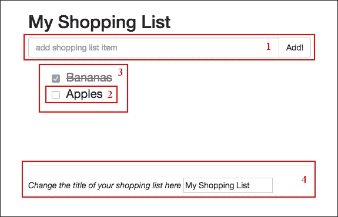
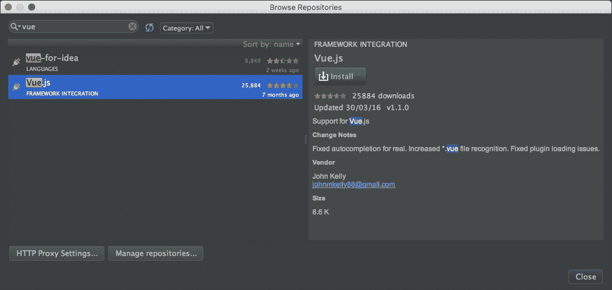
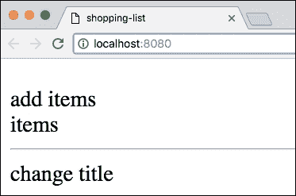
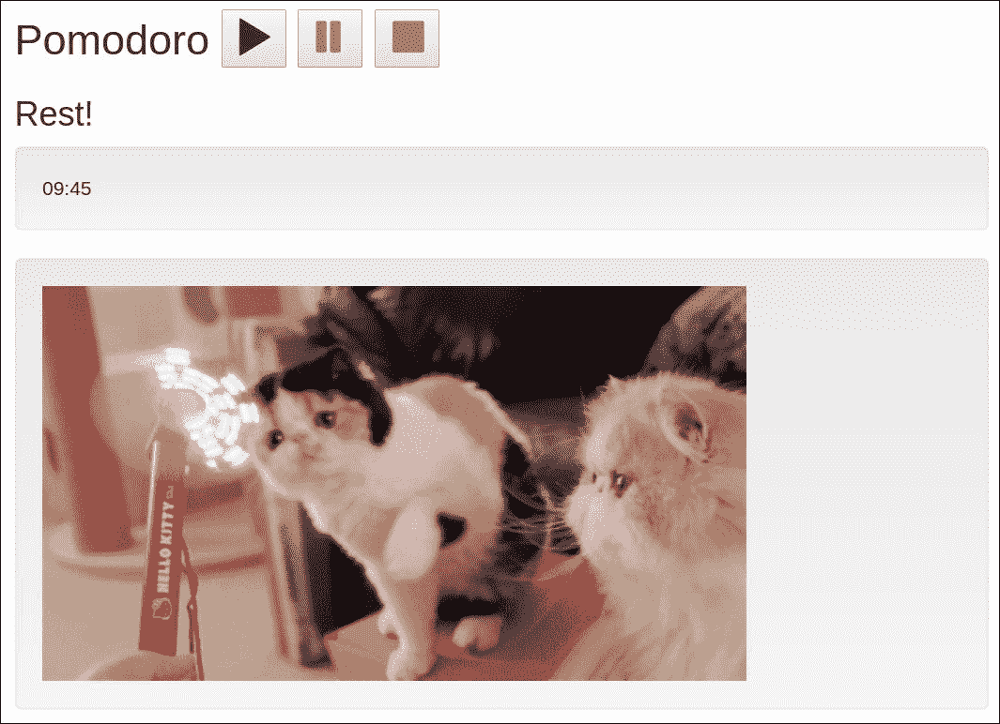

# 第三章：组件-理解和使用

在上一章中，你学习了 Vue.js 的工作原理。你了解了幕后情况，甚至对 Vue.js 核心代码进行了轻微的调试。你学习了一些 Vue 的关键概念。你还学习并尝试了不同的安装 Vue.js 的方式。我们已经启动了应用程序；从本章开始，我们将开发和增强它。我们还学会了如何调试和测试我们的应用程序。

在第一章中，我们谈论了组件，甚至创建了一些。在本章中，我们将在我们的应用程序中使用组件，并看到一些有趣的指令在其中的作用。也就是说，在本章中，我们将做以下事情：

+   重新讨论组件主题并回顾组件的定义

+   为我们的应用程序创建组件

+   学习什么是单文件组件

+   学习如何使用特殊属性实现响应式 CSS 过渡

# 重新讨论组件

正如你在之前的章节中肯定记得的，组件是 Vue 应用程序的特殊部分，具有自己的数据和方法范围。组件可以在整个应用程序中被使用和重复使用。在上一章中，你学到了组件是通过使用`Vue.extend({...})`方法创建的，并且使用`Vue.component()`语法进行注册。因此，为了创建和使用一个组件，我们需要编写以下 JavaScript 代码：

```js
//creating component 
var HelloComponent = Vue.extend({ 
  template: '<h1>Hello</h1>' 
}); 
//registering component 
Vue.component('hello-component', HelloComponent); 

//initializing the Vue application 
new Vue({ 
  el: '#app' 
}); 

```

然后，我们将在 HTML 中使用`hello-component`：

```js
<div id='app'> 
  <hello-component></hello-component> 
</div> 

```

### 提示

初始化和注册都可以写成单个`Vue.component`调用，带有相应的选项：

`Vue.component('hello-component', { template: '<h1>Hello</h1>' });`

# 使用组件的好处

在深入了解组件并重写应用程序之前，有一些东西我们需要学习。在本节中，我们将涵盖处理组件内的`data`和`el`属性、组件模板、作用域和预处理器等内容。

## 在 HTML 中声明模板

在我们之前的例子中，我们创建了一个 Vue 组件，模板是以字符串形式编写的。这实际上很容易和不错，因为我们在组件内有我们需要的一切。现在想象一下我们的组件具有更复杂的 HTML 结构。编写复杂的 HTML 字符串模板容易出错，丑陋，并且违反最佳实践。

### 提示

通过最佳实践，我指的是清晰和可维护的代码。将复杂的 HTML 写成字符串是不可维护的。

Vue 允许在特殊的`<template>`标签内声明模板！

因此，为了重写我们的示例，我们将声明一个带有相应标记的 HTML 标签模板：

```js
<template id="hello"> 
  <h1>Hello</h1> 
</template> 

```

然后，在我们的组件内部，我们将只使用模板的 ID，而不是 HTML 字符串：

```js
Vue.component('hello-component', { 
  template: '#hello' 
}); 

```

我们的整个代码将如下所示：

```js
<body> 
  **<template id="hello">** 
    <h1>Hello</h1> 
  **</template>** 

  <div id="app"> 
    <hello-component></hello-component> 
  </div> 

  <script src="vue.js"></script> 
  <script> 
    Vue.component('hello-component', { 
      template: '**#hello**' 
    }); 

    new Vue({ 
      el: '#app' 
    }); 
  </script> 
</body> 

```

在前面的示例中，我们只使用了组件的`template`属性。让我们继续看看`data`和`el`属性在组件内部应该如何处理。

## 处理组件内的数据和 el 属性

如前所述，组件的语法与 Vue 实例的语法相同，但必须扩展 Vue 而不是直接调用它。基于这一前提，创建一个组件似乎是正确的：

```js
var HelloComponent = Vue.extend({ 
  el: '#hello', 
  data: { msg: 'Hello' } 
}); 

```

但这会导致作用域泄漏。每个`HelloComponent`实例将共享相同的`data`和`el`。这并不是我们想要的。这就是为什么 Vue 明确要求将这些属性声明为函数的原因：

```js
var HelloComponent = Vue.component('hello-component', { 
  el: **function ()** { 
    return '#hello'; 
  }, 
  data: **function ()** { 
    return { 
      msg: 'Hello' 
    } 
  } 
}); 

```

即使您犯了错误，并将`data`或`el`属性声明为对象或元素，Vue 也会友好地警告您：


在 Vue 组件内将数据作为对象而不是函数使用时，Vue 会友好地警告

## 组件的作用域

如前所述，所有组件都有自己的作用域，其他组件无法访问。然而，全局应用程序作用域可被所有注册的组件访问。您可以将组件的作用域视为局部作用域，将应用程序作用域视为全局作用域。它是一样的。然而，在组件内部使用父级的数据并不直观。您必须在组件内明确指示应该使用`prop`属性访问哪些父级数据属性，并使用`v-bind`语法将它们绑定到组件实例。让我们看看它在我们的`HelloComponent`示例中是如何工作的。

让我们从声明包含属性`msg`的数据的`HelloComponent`开始：

```js
Vue.component('hello-component', { 
  data: function () { 
    return { 
      **msg: 'Hello'** 
    } 
  } 
}); 

```

现在，让我们创建一个带有一些数据的`Vue`实例：

```js
new Vue({ 
  el: '#app', 
  **data: { 
    user: 'hero' 
  }** 
});  

```

在我们的 HTML 中，让我们创建一个模板并将其应用到具有模板 ID 的组件上：

```js
//template declaration 
<template id="hello"> 
  <h1>**{{msg}} {{user}}**</h1> 
</template> 

//using template in component 
Vue.component('hello-component', { 
  **template: '#hello',** 
  data: function () { 
    return { 
      msg: 'Hello' 
    } 
  } 
}); 

```

为了在页面上看到组件，我们应该在`app`容器的 HTML 中调用它：

```js
<div id="app"> 
  **<hello-component></hello-component>** 
</div> 

```

如果您在浏览器中打开页面，您只会看到**`Hello`**；`user`数据属性仍然没有绑定到组件：


父级的数据属性尚未绑定到我们的 Vue 组件

为了将数据绑定到父 Vue 应用程序，我们必须做以下两件事：

+   在组件的`prop`属性中指示此属性

+   将其绑定到`hello-component`调用：

```js
//calling parent's data attributes in the component 
Vue.component('hello-component', { 
  template: '#hello', 
  data: function () { 
    return { 
      msg: 'Hello' 
    } 
  }, 
  **props: ['user']** 
}); 

//binding a user data property to the component 
<div id="app"> 
  <hello-component **v-bind:user="user"**></hello-component> 
</div> 

```

刷新页面，您将看到它现在向您呈现问候语：


在正确绑定父级的`data`属性到组件之后，一切都按预期运行。

### 提示

实际上，`v-bind:user`语法可以通过以下方式进行快捷操作：

`:user<hello-component **:user="user"**></hello-component>`

## 组件内部的组件

组件的美妙之处在于它们可以像乐高积木和积木一样在其他组件内部被使用和重复使用！让我们构建另一个组件；让我们称之为**greetings**，它将由两个子组件组成：一个要求用户姓名的表单和我们的`hello`组件。

为了做到这一点，让我们声明表单的模板和我们已经熟悉的`hello`模板：

```js
<!--template for the form--> 
<template id="form"> 
  <div> 
    <label for="name">What's your name?</label> 
    <input **v-model="user"** type="text" id="name"> 
  </div> 
</template> 

//template for saying hello 
<template id="hello"> 
  <h1>{{msg}} {{user}}</h1> 
</template> 

```

现在我们将基于这些模板注册两个 Vue 组件：

```js
//register form component 
Vue.component('**form-component**', { 
  template: '**#form**', 
  props: ['user'] 
}); 
//register hello component 
Vue.component('**hello-component**', { 
  template: '**#hello**', 
  data: function () { 
    return { 
      msg: 'Hello' 
    } 
  }, 
  props: ['user'] 
}); 

```

最后，我们将创建我们的 greetings 模板，它将使用`form`和`hello`组件。不要忘记我们必须在组件调用时绑定`user`属性：

```js
<template id="greetings"> 
  <div> 
    <form-component **:user="user"**></form-component> 
    <hello-component **:user="user"**></hello-component> 
  </div> 
</template> 

```

在这一点上，我们可以创建我们的 greetings 组件，并在其中使用 greetings 模板。让我们初始化，使用此组件中用户的`data`函数：

```js
//create greetings component based on the greetings template 
Vue.component('greetings-component', { 
  template: '**#greetings**', 
  data: function () { 
    return { 
      user: 'hero' 
    } 
  } 
}); 

```

在我们的主应用程序容器内，我们现在将调用 greetings 组件：

```js
<div id="app"> 
  **<greetings-component></greetings-component>** 
</div> 

```

不要忘记初始化 Vue 应用程序：

```js
new Vue({ 
  el: '#app' 
}); 

```

在浏览器中打开页面。您应该看到类似以下的内容：


由各种 Vue 组件构建的页面

尝试在输入框中更改名称。您期望它在问候标题中也发生变化，因为我们将其绑定到了它。但奇怪的是，它并没有改变。嗯，这实际上是正常的行为。默认情况下，所有属性都遵循单向数据绑定。这意味着如果在父级范围内更改数据，这些更改会传播到子组件，但反之则不会。这样做是为了防止子组件意外地改变父状态。但是，可以通过调用事件来强制子组件与其父组件通信。请查看 Vue 文档[`vuejs.org/guide/components.html#Custom-Events`](https://vuejs.org/guide/components.html#Custom-Events)。

在我们的案例中，我们可以将用户模型绑定到我们的表单`input`组件，并在用户在输入框中输入时发出`input`事件。我们通过使用`v-on:input`修饰符来实现这一点，就像在[`vuejs.org/guide/components.html#Form-Input-Components-using-Custom-Events`](https://vuejs.org/guide/components.html#Form-Input-Components-using-Custom-Events)中描述的那样。

因此，我们必须将`v-model:user`传递给`form-component`：

```js
<form-component **v-model="user"**></form-component> 

```

然后，`form-component`应该接受`value`属性并发出`input`事件：

```js
Vue.component('form-component', { 
  template: '#form', 
  props: [**'value'**], 
  methods: { 
    **onInput: function (event) { 
      this.$emit('input', event.target.value) 
    }** 
  } 
}); 

```

`form-component`模板中的输入框应将`v-on:input`和`onInput`方法绑定到`v-on:input`修饰符：

```js
<input **v-bind:value="value"** type="text" id="name" **v-on:input="onInput"**> 

```

### 提示

实际上，在 Vue 2.0 之前，可以通过显式告知使用`.sync`修饰符绑定的属性来实现组件与其父级之间的双向同步：`<form-component :user.sync="user"></form-component>`

刷新页面。现在您可以更改输入框中的名称，并立即传播到父级范围，从而传播到依赖该属性的其他子组件：


使用`.sync`修饰符绑定属性允许父级和子级组件之间的双向数据绑定

您可以在 JSFiddle 中找到此示例的完整代码[`jsfiddle.net/chudaol/1mzzo8yn/`](https://jsfiddle.net/chudaol/1mzzo8yn/)。

### 提示

在 Vue 2.0 发布之前，还有一个数据绑定修饰符`.once`。使用此修饰符，数据将仅绑定一次，任何其他更改都不会影响组件的状态。比较以下内容：

`<form-component **:user="user"**></form-component>`

`<form-component **:user.sync="user"**></form-component>`

`<form-component **:user.once="user"**></form-component>`

# 使用简单组件重写购物清单

既然我们已经对组件有了很多了解，让我们使用它们来重写我们的购物清单应用程序。

### 提示

在重写应用程序时，我们将使用这个版本的购物清单应用程序作为基础：[`jsfiddle.net/chudaol/vxfkxjzk/3/`](https://jsfiddle.net/chudaol/vxfkxjzk/3/)。

我们之前已经做过了，当我们开始讨论组件时。但那时，我们在组件选项中使用了字符串模板。现在让我们使用刚学会的模板来做。让我们再看一下界面，并再次识别组件：



我们的购物清单应用程序将有四个组件

因此，我建议我们的购物清单应用程序由以下四个组件组成：

+   `AddItemComponent`：负责向购物清单添加新项目的组件

+   `ItemComponent`：负责在购物清单中呈现新项目的组件

+   `ItemsComponent`：负责渲染和管理`ItemComponent`列表的组件

+   `ChangeTitleComponent`：负责更改列表标题的组件

## 为所有组件定义模板

假设这些组件已经定义并注册，让我们为这些组件创建模板。

### 注意

**`驼峰命名法 VS 短横线命名法`** 您可能已经注意到，当我们声明描述组件的变量时使用驼峰命名法（`var HelloComponent=Vue.extend({...})`），但我们在短横线命名法中命名它们：`Vue.component('hello-component', {...})`。我们这样做是因为 HTML 属性不区分大小写的特性。因此，我们购物清单应用程序的组件将被称为：

`add-item-component`

`item-component`

`items-component`

`change-title-component`

看一下我们之前的标记是怎样的（[`jsfiddle.net/chudaol/vxfkxjzk/3/`](https://jsfiddle.net/chudaol/vxfkxjzk/3/)）。

让我们使用模板和组件名称重写它。在这部分，我们只关心呈现层，将数据绑定和操作处理留给将来实现。我们只需复制粘贴应用程序的 HTML 部分，并将其分发到我们的组件上。我们的四个模板将看起来像下面这样：

```js
<!--add new item template--> 
<template id="**add-item-template**"> 
  <div class="input-group"> 
    <input @keyup.enter="addItem" v-model="newItem" 
      placeholder="add shopping list item" type="text" 
      class="form-control"> 
    <span class="input-group-btn"> 
      <button @click="addItem" class="btn btn-default" 
        type="button">Add!</button> 
    </span> 
  </div> 
</template> 

<!--list item template--> 
<template id="**item-template**"> 
  <li :class="{ 'removed': item.checked }"> 
    <div class="checkbox"> 
      <label> 
        <input type="checkbox" v-model="item.checked"> {{ item.text }} 
      </label> 
    </div> 
  </li> 
</template> 

<!--items list template--> 
<template id="**items-template**"> 
  <ul> 
    <item-component v-for="item in items" :item="item">
    </item-component> 
  </ul> 
</template> 

<!--change title template--> 
<template id="**change-title-template**"> 
  <div> 
    <em>Change the title of your shopping list here</em> 
    <input **v-bind:value="value" v-on:input="onInput"**/> 
  </div> 
</template> 

```

因此，我们的主要组件标记将由一些组件组成：

```js
<div id="app" class="container"> 
  <h2>{{ title }}</h2> 
  **<add-item-component></add-item-component> 
  <items-component :items="items"></items-component>** 
  <div class="footer"> 
    <hr/> 
    **<change-title-component v-model="title"</change-title-component>** 
  </div> 
</div> 

```

正如您所看到的，每个模板的大部分内容都是对应 HTML 代码的简单复制粘贴。

然而，也有一些显著的不同之处。例如，列表项模板略有改变。您已经学习并在以前使用了`v-for`指令。在以前的示例中，我们将此指令与`<li>`等 HTML 元素一起使用。现在您可以看到它也可以与 Vue 自定义组件一起使用。

您可能还注意到更改标题模板中的一个小差异。现在它有一个绑定的值，并发出`onInput`方法绑定到`v-on:input`修饰符。正如您在上一节中学到的，子组件不能直接影响父组件的数据，这就是为什么我们必须使用事件系统的原因。

## 定义和注册所有组件

看一下我们以前的购物清单应用程序中的 JavaScript 代码：[`jsfiddle.net/chudaol/c8LjyenL/`](https://jsfiddle.net/chudaol/c8LjyenL/)。让我们添加创建 Vue 组件的代码。我们将使用已定义模板的 ID 作为它们的`template`属性。还要不要忘记`props`属性，以从父应用程序传递属性。因此，我们添加以下代码：

```js
//add item component 
Vue.component('add-item-component', { 
  template: '**#add-item-template**', 
  data: function () { 
    return { 
      **newItem**: '' 
    } 
  } 
}); 
//item component 
Vue.component('item-component', { 
  template: '**#item-template**', 
  props: ['**item**'] 
}); 
//items component 
Vue.component('items-component', { 
  template: '**#items-template**', 
  props: ['**items**'] 
}); 
//change title component 
Vue.component('change-title-component', { 
  template: '**#change-title-template**', 
  props: ['**value**'], 
  methods: { 
    onInput: function (event) { 
      this.$emit('input', event.target.value) 
    } 
  } 
}); 

```

正如您所看到的，在每个组件的`props`中，我们传递了不同的数据属性，只涉及到该组件的属性。我们还将`newItem`属性移动到`add-item-component`的`data`属性中。在`change-title-component`中，我们添加了`onInput`方法，该方法发出输入事件，因此父组件中的标题受到用户在输入框中输入的任何内容的影响。

在浏览器中打开 HTML 文件。界面与之前完全相同！我们在本节中所做的所有代码可以在 JSFiddle 中找到：[`jsfiddle.net/chudaol/xkhum2ck/1/`](https://jsfiddle.net/chudaol/xkhum2ck/1/)。

# 练习

尽管我们的应用程序看起来与之前一样，但其功能已经丢失。它不仅不添加项目，而且还在 devtools 控制台中显示了丑陋的错误。

请使用事件发射系统将添加项目的功能带回来。

此练习的一个可能解决方案可以在附录*练习解决方案*中找到。

# 单文件组件

从旧的最佳实践中，我们知道将 HTML 与 CSS 和 JavaScript 文件分开总是一个好主意。一些现代框架如 React 正在放松并逐渐取消这一规则。如今，看到包含自己标记、样式和应用代码的小文件或组件并不会让你感到震惊。实际上，对于小组件来说，我们甚至发现这样的架构更加方便。Vue 也允许在同一个文件中定义与同一组件相关的所有内容。这种组件被称为单文件组件。

### 注意：

单文件 Vue 组件是一个扩展名为`.vue`的文件。包含这些组件的应用程序可以使用`webpack vue`配置构建。使用这种配置搭建应用程序的最简单方法是使用`vue-cli`（[`github.com/vuejs-templates/webpack`](https://github.com/vuejs-templates/webpack)）。

Vue 组件可以包含最多三个部分：

+   `<script>`

+   `<template>`

+   `<style>`

这些部分中的每一个都负责你所想的确切内容。在`<template>`标签中放入 HTML 模板应该负责的内容，在`<script>`标签中放入 Vue 组件的 JavaScript 代码、方法、数据、props 等。`<style>`标签应该包含给定组件的 CSS 样式。

你还记得我们的`hello-component`吗？在[`jsfiddle.net/chudaol/mf82ts9a/2/`](https://jsfiddle.net/chudaol/mf82ts9a/2/)的 JSFiddle 中看一下它。

首先使用`vue-cli`使用`webpack-simple`配置搭建应用程序：

```js
**npm install -g vue-cli vue init webpack-simple hello**

```

要将其重写为 Vue 组件，我们创建我们的`HelloComponent.vue`文件并添加以下代码：

```js
<template> 
  <h1>{{ msg }}</h1> 
</template> 

<script> 
**export default { 
  data () { 
    return { 
      msg: 'Hello!' 
    } 
  } 
}** 
</script> 

```

请注意，我们不需要在 JavaScript 组件定义中指定模板。作为单文件组件，隐含的是应该使用的模板是在此文件中定义的模板。您可能也注意到我们在这里使用了 ES6 风格。另外，不要忘记`data`属性应该是一个函数而不是一个对象。

在我们的主脚本中，我们必须创建 Vue 应用程序并指示它使用`HelloComponent`：

```js
import Vue from 'vue' 
**import HelloComponent** from './HelloComponent.vue' 

new Vue({ 
  el: '#app', 
  **components: { HelloComponent }** 
}); 

```

我们的`index.html`标记不会改变。它仍然会调用`hello-component`：

```js
<body> 
  <div id="app"> 
    **<hello-component></hello-component>** 
  </div> 
  <script src="./dist/build.js"></script> 
</body> 

```

现在我们只需要安装`npm`依赖项（如果你还没有这样做）并构建应用程序：

```js
**npm install 
npm run dev**

```

一旦你这样做了，你的浏览器将自动打开`localhost:8080`页面！

在[chapter3/hello](https://github.com/PacktPublishing/Learning-Vue.js-2/tree/master/chapter3/hello)文件夹中查看完整的代码。

您还可以在[`www.webpackbin.com/N1LbBIsLb`](http://www.webpackbin.com/N1LbBIsLb)的 webpackbin 中测试、修改、重新测试和检查`hello`组件。

### 提示

Webpackbin 是一个很好的服务，可以运行和测试使用 Webpack 构建的应用程序。尽管它仍处于测试阶段，但它是一个非常好的工具。由于它还很年轻，所以仍然存在一些小问题。例如，如果您尝试下载整个项目的软件包，它将无法构建。

## IDE 的插件

Vue 的创建者和贡献者考虑到了开发人员，并为一系列现代 IDE 开发了插件。您可以在[`github.com/vuejs/awesome-vue#syntax-highlighting`](https://github.com/vuejs/awesome-vue#syntax-highlighting)找到它们。如果您像我一样使用的是 IntelliJ 的 WebStorm IDE，请按照以下说明安装 Vue 支持插件：

1.  转到**`Preferences`** | **`P`****`lugins`**。

1.  点击**`浏览存储库`**。

1.  在搜索框中输入`vue`。

1.  选择**`Vue.js`**，然后点击**`Install`**按钮：



安装 WebStorm IDE 的 Vue 插件

## 样式和范围

很明显，模板和组件的脚本只属于它。然而，样式并不适用于相同的规则。例如，尝试向我们的`hello`组件添加`style`标签，并添加 CSS 规则，使`<h1>`标签变成红色：

```js
<style> 
  h1 { 
    color: red; 
  } 
</style> 

```

现在，当页面刷新时，可以预期`Hello!`标题的颜色会变成红色。现在尝试将`<h1>`标签添加到主`index.html`文件中。你可能会感到惊讶，但它也会是红色的：

```js
<div id="app"> 
  <h1>This is a single file component demo</h1> 
  <hello-component></hello-component> 
</div> 

```


所有的`<h1>`标签都具有我们在组件内定义的样式

为了使样式只附加到组件的范围内，我们需要在`<style>`标签中指定`scoped`属性：

```js
<style **scoped**> 
  h1 { 
    color: red; 
  } 
</style> 

```

看看页面，你会发现只有`Hello!`文本是红色的，其他的`h1`都是默认样式。

## 热重载

您可能已经注意到，现在我不再要求您刷新页面，而是要求您查看页面。这是因为在使用`vue-cli`Webpack 脚手架方法引导应用程序时，每次更改时页面都会自动刷新。这个魔法是由`vue-hot-reload` API 实现的，它监视应用程序的文件，并告诉浏览器在每次有变化时自动重新加载！耶！

## 预处理器

如果您喜欢预处理器，欢迎在您的`.vue`组件中使用它们。这是由于`vue-loader`允许使用 Webpack 加载程序。

### 注意

您可以在教程中找到有关`vue-loader`和预处理器的更多信息[`vue-loader.vuejs.org/en/`](http://vue-loader.vuejs.org/en/)。

### HTML 预处理器

为了能够在单文件 Vue 组件中使用预处理器，只需在`<template>`标签中添加`lang`属性！不要忘记安装相应的节点模块：

```js
**npm install jade --save-dev** 

```

例如，在我们的`hello`组件模板中使用`jade`将会非常简单：

```js
<template lang="jade"> 
  h1 {{ msg }} 
</template> 

```

### CSS 预处理器

相同的逻辑也适用于 CSS 预处理器。让我们看看如何使用，例如，sass 预处理器：

```js
<style lang="sass" scoped> 
  $red: red; 
  h1 { 
    color: $red; 
  } 
</style> 

```

### 提示

就像在前面的例子中一样，不要忘记安装相应的加载程序才能使其工作：`npm install sass-loader node-sass --save-dev`

### JavaScript 预处理器

也可以使用任何 JavaScript 预处理器。就像在前面的两个例子中一样，只需使用`lang`属性指定要使用的预处理器。并且不要忘记通过`npm`安装它！

```js
**> npm install coffee-loader coffee-script --save-dev 
<script lang="coffee"> 
  exports.default = data: -> 
  { msg: 'Hello!' } 
</script>** 

```

# 使用单文件组件重写我们的购物清单应用程序

现在我们已经了解了组件以及如何使用它们，还知道了使我们的代码更容易编写的好技巧，让我们回到我们的购物清单，并将其重写为单文件组件的 Vue 应用程序。为了简单设置，我们可以使用带有 Webpack 配置的`vue-cli`。实际上，我们已经在第二章*基础知识-安装和使用*中完成了。所以，只需找到这个应用程序，并准备开始工作。如果找不到，您可以轻松创建它：

```js
**#install vue-cli if you still hadn't installed it 
$ npm install vue-cli -g 
#bootstrap the application 
$ vue init webpack shopping-list 
$ cd shopping-list 
$ npm install 
$ npm run dev** 

```

确保您的`index.html`文件看起来像下面这样：

```js
<!DOCTYPE html> 
<html> 
  <head> 
    <meta charset="utf-8"> 
    <title>shopping-list</title> 
    <link rel="stylesheet" 
      href="https://maxcdn.bootstrapcdn.com/bootstrap/
      3.3.6/css/bootstrap.min.css"> 
  </head> 
  <body> 
    **<app></app>** 
  </body> 
</html> 

```

您的`main.js`文件应该看起来像下面这样：

```js
import Vue from 'vue' 
import App from './App' 

new Vue({ 
  **el: 'app'**, 
  components: { App } 
}) 

```

我们现在准备创建我们的组件并用它们填充我们的应用程序。当然，您记得我们的购物清单基本上有四个组件：

+   `AddItemComponent`：负责向购物清单添加新项目的组件

+   `ItemComponent`：负责在购物清单项目列表中呈现新项目的组件

+   `ItemsComponent`：负责渲染和管理`ItemComponent`列表的组件

+   ChangeTitleComponent：负责更改列表标题的组件

让我们在`components`文件夹中创建它们。首先，只需在每个组件中包含三个空的部分`(<template>`、`<script>`和`<style>`)，并在主`App.vue`组件中的正确位置调用它们。请在模板中放入一些内容，以便我们可以在页面上清楚地识别不同的组件。因此，我们所有四个组件的代码将如下所示：


购物清单应用程序的所有四个组件的代码

现在打开`App.vue`组件。这是我们的主要组件，将所有组件组装在一起。

从`<template>`、`<script>`和`<style>`标签中删除所有内容。我们现在将开始构建我们的应用程序。

首先，我们必须导入`App.vue`将使用的组件（在本例中，全部）。

### 提示

不要忘记，由于我们在这个应用程序中使用了 ES2015，我们可以使用 import/export 和所有其他美丽的 ES2015 功能。

在`<script>`标签内，让我们导入组件并导出包含导入组件和返回购物清单项目的数据函数的对象：

```js
<script> 
  import **AddItemComponent** from './components/AddItemComponent' 
  import **ItemsComponent** from './components/ItemsComponent' 
  import **ChangeTitleComponent** from './components/ChangeTitleComponent' 

  export default { 
    components: { 
      **AddItemComponent, 
      ItemsComponent, 
      ChangeTitleComponent** 
    }, 
    data () { 
      return { 
        **items: [{ text: 'Bananas', checked: true }, 
                { text: 'Apples', checked: false }]** 
      } 
    }, 
    methods: { 
      addItem (text) { 
        this.items.push({ 
          text: text, 
          checked: false 
        }) 
      } 
    } 
  } 
</script> 

```

我们的模板基本上可以与使用简单组件构建的购物清单应用程序中的模板相同。让我们暂时删除有关模型和数据绑定的所有内容。首先，插入负责添加项目的组件，然后是包含所有项目的组件，然后在页脚中，负责更改标题的组件。

然后，我们的模板将如下所示：

```js
<template> 
  <div id="app" class="container"> 
    <h2>{{ title }}</h2> 
    **<add-item-component></add-item-component> 
    <items-component></items-component>** 
    <div class="footer"> 
      <hr/> 
      **<change-title-component></change-title-component>** 
    </div> 
  </div> 
</template> 

```

你还记得组件变量的名称是驼峰式的，当它们在模板内部使用时，应该使用 kebab-case 进行调用，对吧？好的，让我们看看它在浏览器中的样子：



使用单文件组件构建的购物清单应用程序

看起来不太美观，对吧？让我们为每个组件填充它们的模板。

### 提示

我们将继续在这个应用程序中使用 Bootstrap 的 CSS 样式。在`index.html`文件中全局包含它：`<link rel="stylesheet" href=" https://maxcdn.bootstrapcdn.com/bootstrap/3.3.6/css/bootstrap.min.css">`

## 添加 ItemComponent

打开`AddItemComponent.vue`。让我们填充它的`<template>`。它将如下所示：

```js
<template> 
  <div> 
    <div class="input-group"> 
      <input type="text" class="input form-control" 
        placeholder="add shopping list item"> 
      <span class="input-group-btn"> 
        <button class="btn btn-default" type="button">Add!</button> 
      </span> 
    </div> 
  </div> 
</template> 

```

如果你在浏览器中查看页面，你会发现它已经改变，变得更加像我们的购物清单应用程序。

## 配置 ItemComponent 和 ItemsComponent

现在让我们转到`ItemComponent`。我们只需复制并粘贴简单组件示例中的 HTML：

```js
//ItemComponent.vue 
<template> 
  <li :class="{ 'removed': item.checked }"> 
    <div class="checkbox"> 
      <label> 
        <input type="checkbox" v-model="item.checked"> {{ item.text }} 
      </label> 
    </div> 
  </li> 
</template> 

```

让我们还为这个组件添加一些`scoped`样式。这个组件的特定样式是与`<li>`、`<span>`和类`.removed`有关的样式。让我们将它们复制并粘贴到这个组件中：

```js
//ItemComponent.vue 
<style scoped> 
  .removed { 
    color: gray; 
  } 
  .removed span { 
    text-decoration: line-through; 
  } 
  li { 
    list-style-type: none; 
  } 
  li span { 
    margin-left: 5px; 
  } 
</style> 

```

现在打开`ItemsComponents`。你记得，它是`ItemComponent`元素的列表。即使你不记得，我猜这个组件名称的复数特征就表明了这一点。为了能够使用`ItemComponent`，它必须导入并在`components`属性中注册。所以，让我们先修改脚本：

```js
//ItemsComponent.vue 
<script> 
  import **ItemComponent** from './ItemComponent' 

  export default { 
    components: { 
      **ItemComponent** 
    } 
  } 
</script> 

```

现在你可以在`<template>`中使用`item-component`了！你还记得如何在`vue.js`中进行迭代吗？当然记得！这就是为什么你现在打开`<template>`标签并编写以下代码：

```js
//temsComponent.vue 
<template> 
  <div> 
    <item-component v-for="item in items" :item="item">
    </item-component> 
  </div> 
</template> 

```

如果你现在检查页面，你会惊讶地发现事情实际上并没有工作。网页控制台充满了错误。你能想出原因吗？

你还记得当子组件想要访问父组件的数据时，它们必须在组件初始化时声明“props”吗？这正是我们在`ItemsComponent`和`ItemComponent`的声明中忘记的事情。

首先，在`App.vue`中，将 items 绑定到`items-component`调用：

```js
//App.vue  
<items-component **:items="items"**></items-component> 

```

然后将`props`属性添加到`ItemsComponent`中：

```js
//ItemsComponent.vue 
<script> 
  import ItemComponent from './ItemComponent' 

  export default { 
    components: { 
      ItemComponent 
    }, 
    **props: ['items']** 
  } 
</script> 

```

现在回到`ItemComponent`并添加`props`属性：

```js
//temComponent.vue 
<script> 
  export default { 
    props: ['item'] 
  } 
</script>  

```

现在检查页面。现在它确实包含了物品列表，并且在我们第一次创建它时几乎具有相同的外观和感觉。在[chapter3/shopping-list](https://github.com/PacktPublishing/Learning-Vue.js-2/tree/master/chapter3/shopping-list)文件夹中检查此部分的完整代码。

# 练习

完成购物清单应用程序，使其具有与以前相同的功能。

剩下的不多了，我相信你会在不到半个小时内完成它。这个练习的可能解决方案可以在附录中找到，*练习的解决方案*。

# 使用单文件组件重写番茄钟应用程序

我希望你还记得并可能甚至使用了我们在本书第一章开发的番茄钟应用程序。

我现在想重新审视它，并做与上一节相同的练习——定义应用程序的组件并使用这些组件重写它。

让我们来看看我们的番茄钟应用程序。现在我要给你一个惊喜：我将包含一个屏幕截图，其中包含在休息时间显示的小猫，使用[`thecatapi.com/api`](http://thecatapi.com/api)：



番茄钟应用程序处于休息状态

有一些容易识别的组件：

+   控制组件（开始，暂停，结束）的组件，让我们称之为`**ControlsComponent**`

+   倒计时组件，`**CowntdownComponent**`

+   当前状态的标题组件（**`Work!`**/**`Rest!`**），`**StateTitleComponent**`

+   取决于状态（工作或休息）的小猫渲染组件`**KittensComponent**`（这是我最喜欢的！）

现在，请停止盯着小猫，让我们开始使用单文件组件来实现我们的番茄钟应用程序！一些用于搭建应用程序的第一步如下：

1.  首先打开前一章中的脚手架式番茄钟应用程序，或者基于 Webpack 模板创建一个新的应用程序。

1.  在`application`文件夹中运行`npm install`和`npm run dev`。

1.  确保你的`index.html`看起来像下面这样：

```js
      <!DOCTYPE html> 
      <html> 
        <head> 
          <meta charset="utf-8"> 
          <title>pomodoro</title> 
        </head> 
        <body> 
          <app></app> 
        </body> 
      </html> 

```

1.  确保你的`main.js`文件看起来像下面这样：

```js
      import Vue from 'vue' 
      import App from './App' 

      /* eslint-disable no-new */ 
      new Vue({ 
        el: 'app', 
        components: { App } 
      }) 

```

1.  打开你的浏览器到页面`localhost:8080`。

1.  然后，就像在之前的例子中一样，转到`components`文件夹并创建所有必要的`.vue`组件。

1.  转到`App.vue`，并导入和注册所有创建的组件。

1.  在每个组件的`<template>`部分，放入一些可以唯一标识它的东西，这样我们在检查页面时可以轻松识别它。

你几乎肯定会看到结构和初始代码，看起来像下面这样：

使用单文件组件重写番茄钟应用程序

使用单文件组件实现的番茄钟应用程序的最初状态

现在，假设我们的组件已经准备好使用，让我们将它们放在应用程序的布局中应该放置的位置。

我只是稍微提醒一下整个应用程序的标记之前是什么样子的：

```js
<div id="app" class="container"> 
  <h2> 
    <span>Pomodoro</span> 
    **// Looks like our ControlsComponent** 
    <button > 
      <i class="glyphicon glyphicon-play"></i> 
    </button> 
    <button > 
      <i class="glyphicon glyphicon-pause"></i> 
    </button> 
    <button > 
      <i class="glyphicon glyphicon-stop"></i> 
    </button> 
  </h2> 
  **// Looks like our StateTitleComponent** 
  <h3>{{ title }}</h3> 
  **// Looks like our CountdownComponent** 
  <div class="well"> 
    <div class="pomodoro-timer"> 
      <span>{{ min }}</span>:<span>{{ sec }}</span> 
    </div> 
  </div> 
  **// Looks like our KittensComponent** 
  <div class="well"> 
     
  </div> 
</div> 

```

你可能已经注意到，我删除了一些负责类绑定或操作处理程序的部分。不要担心。还记得《飘》中的斯嘉丽·奥哈拉吗？她过去常说，

> “我现在不能考虑那个。我明天再想。”

（[`goo.gl/InYm8e`](http://goo.gl/InYm8e)）。斯嘉丽·奥哈拉是一个聪明的女人。像斯嘉丽·奥哈拉一样。目前，我们将只关注`App.vue`的`<template>`标签。其他的东西以后再说。现在我们基本上可以复制并粘贴这个 HTML 片段，并替换我们识别出来的部分，比如组件和它们的 kebab-case 名称。因此，`App.vue`中的模板将如下所示：

```js
//App.vue 
<template> 
  <div id="app" class="container"> 
    <h2> 
      <span>Pomodoro</span> 
      **<controls-component></controls-component>** 
    </h2> 
    **<state-title-component></state-title-component> 
    <countdown-component></countdown-component> 
    <kittens-component></kittens-component>** 
  </div> 
</template> 

```

有点小了，对吧？打开你的应用程序的浏览器检查一下。不是很漂亮，肯定与我们的番茄钟应用程序无关，但是...它起作用！

使用单文件组件重写番茄钟应用程序

番茄钟应用程序作为单文件组件应用程序引导

现在我们该怎么办？将相应的标记复制到它们组件的`<template>`部分。请自己进行这个小小的复制粘贴，让它成为一个小小的家庭练习。但是，如果你想检查一下自己，可以看一下[chapter3/pomodoro](https://github.com/PacktPublishing/Learning-Vue.js-2/tree/master/chapter3/pomodoro)文件夹。目前就是这样了！所有的数据绑定和有趣的东西将在下一章中出现。所以不要关闭这本书。但是，不要忘记休息一下。

# CSS 过渡的响应式绑定

在*转到下一章之前，我们将详细讨论不同类型的数据绑定，我想给你一点有趣的味道，即可以绑定的一些有趣的东西。我知道你非常关注文字，亲爱的读者。所以，到目前为止，你已经发现了两次过渡这个词，你可能已经猜到我们实际上可以将 CSS 过渡绑定到数据变化上。

因此，想象一下，如果您有一个元素，只有在`data`属性`show`为`true`时才应该显示。这很容易，对吧？您已经了解了`v-if`指令：

```js
<div v-if="show">hello</div> 

```

因此，每当`show`属性发生变化时，这个`<div>`就会相应地行为。想象一下，在隐藏/显示时，您希望应用一些 CSS 过渡。使用 Vue，您可以使用特殊的`transition`包装组件来指定数据更改时要使用的过渡：

```js
<transition name="fade">  
  <div v-if="show" transition="my">hello</div> 
</transition> 

```

之后，您只需为`fade-enter`、`fade-leave`、`fade-enter-active`和`fade-leave-active`类定义 CSS 规则。查看有关这些类的官方 Vue 文档页面[`vuejs.org/v2/guide/transitions.html#Transition-Classes`](https://vuejs.org/v2/guide/transitions.html#Transition-Classes)。

让我们看看在我们的`kittens`组件示例中它是如何工作的。首先，让我们在`App.vue`中的`kittens-component`中添加`v-if`指令：

```js
<template> 
  <...> 
  <kittens-component **v-if="kittens"**></kittens-component> 
  <...> 
</template> 

```

此外，我们应该在`App.vue`的`<script>`标签中添加`data`函数（还要使其全局，以便我们可以从 devtools 控制台修改它）：

```js
<script> 
// ... // 
window.data = { 
  kittens: true 
}; 

export default { 
  //.....// 
  data () { 
    return window.data 
  } 
} 
</script> 

```

查看浏览器：一切似乎没有改变。打开 devtools 控制台，输入以下内容：

```js
data.kittens = false 

```

您将看到`kittens`组件将从页面中消失。如果您输入以下内容，它将再次出现：

```js
data.kittens = true 

```

### 提示

我希望您没有忘记在主`index.html`文件中包含 Bootstrap 的 CSS。如果没有，您将看不到任何出现/消失，因为我们的`<div>`标签既没有信息也没有应用任何类：`<link rel="stylesheet" href="https://maxcdn.bootstrapcdn.com/bootstrap/3.3.6/css/bootstrap.min.css">`

但是，我们正在谈论*CSS*过渡，而不是简单地隐藏/显示东西。现在让我们将 CSS`fade`过渡应用到我们的`kittens`组件上。只需添加一个带有名称属性`fade`的包装组件`transition`：

```js
<template> 
  <...> 
  **<transition name="fade">** 
    <kittens-component v-if="kittens"></kittens-component> 
  **</transition>** 
  <...> 
</template> 

```

现在，如果我们为正确的类定义良好的规则，我们将看到一个漂亮的 CSS 过渡。让我们来做吧。在`<style>`标签内添加以下 CSS 规则：

```js
<style scoped> 
  **.fade-enter-active, .fade-leave-active** { 
    transition: opacity .5s 
  } 
  **.fade-enter, .fade-leave-active** { 
    opacity: 0 
  } 
</style> 

```

再次查看页面。打开控制台，输入`data.kittens = false`和`data.kittens = true`。现在您可以看到在每次数据更改时发生漂亮的`fade`过渡。在下一章中，我们将更多地讨论 Vue.js 中的过渡，并将其应用到我们的应用程序中。

# 摘要

在本章中，您了解了 Vue 组件以及如何使用它们。您看到了如何使用经典方法（使用 HTML、CSS 和 JavaScript 的应用程序）创建和注册它们，还看到了使用单文件组件方法创建和操作它们是多么容易。需要记住的事情：

+   虽然变量是使用驼峰格式创建的，但为了能够在模板内部使用组件，你必须应用相应的短横线格式，例如，`MyBeautifulComponent` -> `my-beautiful-component`

+   组件内部的属性`data`和`el`必须是函数而不是对象：`{data: function () {}}`

+   如果你不希望组件的样式泄漏到全局范围，请给它添加一个`scoped`属性：`<style scoped></style>`

我们还使用单文件组件重写了我们的应用程序，并稍微涉及了数据绑定到 CSS 过渡。

在下一章中，我们将深入探讨所有类型的数据绑定，包括 CSS 和 JavaScript 过渡。我们将使用数据绑定使我们的应用程序重焕生机。最后但并非最不重要的是，我们将看到更多的猫！
