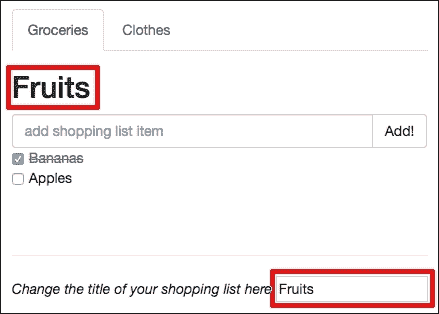
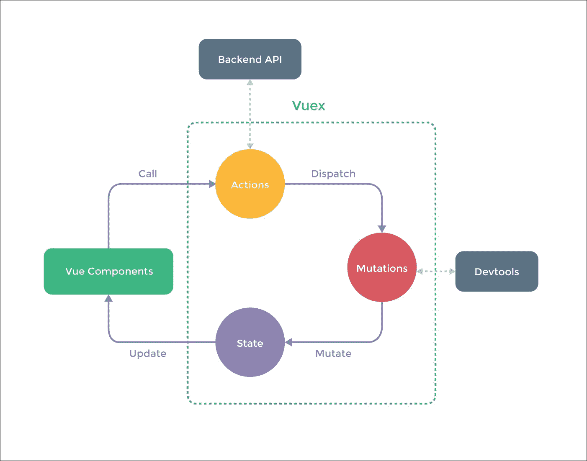
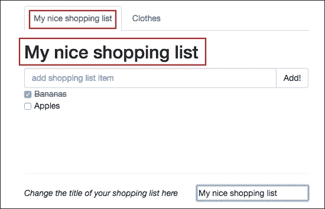

# 第五章：Vuex-管理应用程序中的状态

在上一章中，您学习了 Vue.js 中最重要的概念之一：数据绑定。您学习并应用了许多将数据绑定到我们的应用程序的方法。您还学习了如何使用指令，如何监听事件，以及如何创建和调用方法。在本章中，您将看到如何管理表示全局应用程序状态的数据。我们将讨论 Vuex，这是 Vue 应用程序中用于集中状态的特殊架构。您将学习如何创建全局数据存储以及如何在组件内部检索和更改它。我们将定义应用程序中哪些数据是本地的，哪些应该是全局的，并且我们将使用 Vuex 存储来处理其中的全局状态。

总而言之，在本章中，我们将：

+   了解本地和全局应用程序状态之间的区别

+   了解 Vuex 是什么以及它是如何工作的

+   学习如何使用全局存储中的数据

+   了解存储的 getter、mutation 和 action

+   安装并在购物清单和番茄钟应用程序中使用 Vuex 存储

# 父子组件的通信、事件和脑筋急转弯

还记得我们的购物清单应用程序吗？还记得我们的`ChangeTitleComponent`以及我们如何确保在其输入框中输入会影响属于父组件的购物清单的标题吗？您记得每个组件都有自己的作用域，父组件的作用域不能受到子组件的影响。因此，为了能够将来自子组件内部的更改传播到父组件，我们使用了事件。简单地说，您可以从子组件调用`$emit`方法，并传递要分发的事件的名称，然后在父组件的`v-on`指令中监听此事件。

如果是原生事件，比如`input`，那就更简单了。只需将所需的属性绑定到子组件作为`v-model`，然后从子组件调用`$emit`方法并传递事件的名称（例如，`input`）。

实际上，这正是我们在`ChangeTitleComponent`中所做的。

打开[chapter5/shopping-list](https://github.com/PacktPublishing/Learning-Vue.js-2/tree/master/chapter5/shopping-list)文件夹中的代码，并检查我是否正确。（如果您想在浏览器中检查应用程序的行为，您可能还需要运行`npm install`和`npm run dev`。）

我们使用`v-model`指令将标题绑定到`ShoppingListComponent`模板中的`ChangeTitleComponent`：

```js
//ShoppingListComponent.vue 
<template> 
  <div> 
    <...> 
    <div class="footer"> 
      <hr /> 
      <change-title-component **v-model="title"**></change-title-component> 
    </div> 
  </div> 
</template> 

```

之后，我们在`ChangeTitleComponent`的`props`属性中声明了标题模型的值，并在`input`动作上发出了`input`事件：

```js
<template> 
  <div> 
    <em>Change the title of your shopping list here</em> 
    <input **:value="value" @input="onInput"**/> 
  </div> 
</template> 

<script> 
  export default { 
    props: [**'value'**], 
    methods: { 
      onInput (event) { 
        **this.$emit('input', event.target.value)** 
      } 
    } 
  } 
</script> 

```

看起来非常简单，对吧？

如果我们尝试在输入框中更改标题，我们的购物清单的标题会相应更改：



在父子组件之间建立基于事件的通信之后，我们能够改变标题

看起来我们实际上能够实现我们的目的。然而，如果你打开你的开发工具，你会看到一个丑陋的错误：

```js
**[Vue warn]: Avoid mutating a prop directly since the value will be overwritten whenever the parent component rerenders. Instead, use a data or computed property based on the prop's value. Prop being mutated: "title"**

```

哎呀！Vue 实际上是对的，我们正在改变包含在`ShoppingList`组件的`props`属性中的数据。这个属性来自于主父组件`App.vue`，它又是我们的`ShoppingListComponent`的父组件。而我们已经知道我们不能从子组件改变父组件的数据。如果标题直接属于`ShoppingListComponent`，那就没问题，但在这种情况下，我们肯定做错了什么。

另外，如果你足够注意，你可能会注意到还有一个地方包含了相同的数据，尽管我们努力了，它也没有改变。看看标签的标题。它继续显示单词**`Groceries`**。但我们也希望它改变！

小小的侧记：我添加了一个新组件，`ShoppingListTitleComponent`。它代表了标签的标题。你还记得计算属性吗？请注意，这个组件包含一个计算属性，它只是在通过`props`属性导入的 ID 前面添加`#`来生成一个锚点：

```js
<template> 
  <a **:href="href"** :aria-controls="id" role="tab" data-toggle="tab">
  {{ title }}</a> 
</template> 
<script> 
  export default{ 
    props: ['id', **'title'**], 
    **computed: { 
      href () { 
        return '#' + this.id 
      } 
    }** 
  } 
</script> 

```

显示标签标题的锚点包含一个依赖于这个计算属性的`href`绑定指令。

所以，回到标题更改。当`ChangeTitleComponent`内部的标题改变时，我们能做些什么来改变这个组件的标题？如果我们能将事件传播到主`App.vue`组件，我们实际上可以解决这两个问题。每当父组件中的数据改变时，它都会影响所有子组件。

因此，我们需要以某种方式使事件从`ChangeTitleComponent`流向主`App`组件。听起来很困难，但实际上，我们只需要在`ChangeTitleComponent`及其父级中注册我们的自定义事件，并发出它直到它到达`App`组件。`App`组件应该通过将更改应用于相应的标题来处理此事件。为了让`App.vue`确切地知道正在更改哪个购物清单，它的子`ShoppingListComponent`还应该传递它所代表的购物清单的 ID。为了实现这一点，`App.vue`应该将`id`属性传递给组件，购物清单组件应该在其`props`属性中注册它。

因此，我们将执行以下操作：

1.  在`App`组件的模板中，在`ShoppingListComponent`的创建时将`id`属性绑定到`ShoppingListComponent`。

1.  从`ShoppingList`组件内部绑定属性`title`而不是`v-model`到`change-title-component`。

1.  将自定义事件（我们称之为`changeTitle`）附加到`ChangeTitleComponent`内部的`input`上。

1.  告诉`ShoppingListComponent`监听来自`change-title-component`的自定义`changeTitle`事件，使用`v-on`指令处理它，通过发出另一个事件（也可以称为`changeTitle`）来处理它，应该被`App`组件捕获。

1.  在`App.vue`内部为`shopping-list-component`附加`changeTitle`事件的监听器，并通过实际更改相应购物清单的标题来处理它。

让我们从修改`App.vue`文件的模板开始，并将购物清单的 ID 绑定到`shopping-list-component`：

```js
//App.vue 
<template> 
  <div id="app" class="container"> 
    <...> 
        <shopping-list-component **:id="list.id"** : 
          :items="list.items"></shopping-list-component> 
    <...> 
  </div> 
</template> 

```

现在在`ShoppingListComponent`组件的`props`中注册`id`属性：

```js
//ShoppingListComponent.vue 
<script> 
  <...> 
  export default { 
    <...> 
    props: [**'id'**, 'title', 'items'], 
    <...> 
  } 
</script> 

```

将`title`数据属性绑定到`change-title-component`而不是`v-model`指令：

```js
//ShoppingListComponent.vue 
<template> 
  <...> 
      <change-title-component **:**></change-title-component> 
  <...> 
</template> 

//ChangeTitleComponent.vue 
<template> 
  <div> 
    <em>Change the title of your shopping list here</em> 
    <input **:value="title"** @input="onInput"/> 
  </div> 
</template> 

<script> 
  export default { 
    props: ['value', **'title'**], 
    <...> 
  } 
</script> 

```

从`ChangeTitleComponent`发出自定义事件而不是`input`，并在其父组件中监听此事件：

```js
//ChangeTitleComponent.vue 
<script> 
  export default { 
    <...> 
    methods: { 
      onInput (event) { 
        this.$emit(**'changeTitle'**, event.target.value) 
      } 
    } 
  } 
</script> 

//ShoppingListComponent.vue 
<template> 
  <...> 
      <change-title-component :  
        **v-on:changeTitle="onChangeTitle"**></change-title-component> 
  <...> 
</template> 

```

在`ShoppingListComponent`中创建`onChangeTitle`方法，该方法将发出自己的`changeTitle`事件。使用`v-on`指令在`App.vue`组件中监听此事件。请注意，购物清单组件的`onChangeTitle`方法应发送其 ID，以便`App.vue`知道正在更改哪个购物清单的标题。因此，`onChangeTitle`方法及其处理将如下所示：

```js
//ShoppingListComponent.vue 
<script> 
  <...> 

  export default { 
    <...> 
    methods: { 
      <...> 
      **onChangeTitle (text) { 
        this.$emit('changeTitle', this.id, text) 
      }** 
    } 
  } 
</script> 

//App.vue 
<template> 
  <...> 
  <shopping-list-component :id="list.id" : 
    :items="list.items" **v-on:changeTitle="onChangeTitle"**>
  </shopping-list-component> 
  <...> 
</template> 

```

最后，在`App.vue`中创建一个`changeTitle`方法，该方法将通过其 ID 在`shoppinglists`数组中找到一个购物清单并更改其标题：

```js
<script> 
  <...> 
  import _ from 'underscore' 

  export default { 
    <...> 
    methods: { 
      **onChangeTitle (id, text) { 
        _.findWhere(this.shoppinglists, { id: id }).title = text 
      }** 
    } 
  } 
</script> 

```

请注意，我们使用了`underscore`类的`findWhere`方法（[`underscorejs.org/#findWhere`](http://underscorejs.org/#findWhere)）来使我们通过 ID 查找购物清单的任务更容易。

而且...我们完成了！检查这个提示的最终代码在[chapter5/shopping-list2](https://github.com/PacktPublishing/Learning-Vue.js-2/tree/master/chapter5/shopping-list2)文件夹中。在浏览器中检查页面。尝试在输入框中更改标题。你会看到它在所有地方都改变了！

承认这是相当具有挑战性的。试着自己重复所有的步骤。与此同时，让我随机地告诉你两个词：全局和局部。想一想。

# 我们为什么需要一个全局状态存储？

作为开发人员，你已经熟悉全局和局部的概念。有一些全局变量可以被应用程序的每个部分访问，但方法也有它们自己的（局部）作用域，它们的作用域不可被其他方法访问。

基于组件的系统也有它的局部和全局状态。每个组件都有它的局部数据，但应用程序有一个全局的应用程序状态，可以被应用程序的任何组件访问。我们在前面段落中遇到的挑战，如果我们有某种全局变量存储器，其中包含购物清单的标题，并且每个组件都可以访问和修改它们，那么这个挑战将很容易解决。幸运的是，Vue 的创作者为我们考虑到了这一点，并创建了 Vuex 架构。这种架构允许我们创建一个全局应用程序存储——全局应用程序状态可以被存储和管理的地方！

# 什么是 Vuex？

如前所述，Vuex 是用于集中状态管理的应用程序架构。它受 Flux 和 Redux 的启发，但更容易理解和使用：



Vuex 架构；图片取自 Vuex GitHub 页面，网址为 https://github.com/vuejs/vuex

看着镜子（不要忘记对自己微笑）。你看到一个漂亮的人。然而，里面有一个复杂的系统。当你感到冷时你会怎么做？当天气炎热时你会有什么感觉？饥饿是什么感觉？非常饥饿又是什么感觉？摸一只毛茸茸的猫是什么感觉？人可以处于各种状态（快乐，饥饿，微笑，生气等）。人还有很多组件，比如手、胳膊、腿、胃、脸等。你能想象一下，如果比如一只手能够直接影响你的胃，让你感到饥饿，而你却不知情，那会是什么感觉？

我们的工作方式与集中式状态管理系统非常相似。我们的大脑包含事物的初始状态（快乐，不饿，满足等）。它还提供了允许在其中拉动的机制，可以影响状态。例如，*微笑*，*感到满足*，*鼓掌*等。我们的手、胃、嘴巴和其他组件不能直接影响状态。但它们可以告诉我们的大脑触发某些改变，而这些改变反过来会影响状态。

例如，当你饿了的时候，你会吃东西。你的胃在某个特定的时刻告诉大脑它已经饱了。这个动作会改变饥饿状态为满足状态。你的嘴巴组件与这个状态绑定，让你露出微笑。因此，组件与只读的大脑状态绑定，并且可以触发改变状态的大脑动作。这些组件彼此不知道对方，也不能直接以任何方式修改对方的状态。它们也不能直接影响大脑的初始状态。它们只能调用动作。动作属于大脑，在它们的回调中，状态可以被修改。因此，我们的大脑是唯一的真相来源。

### 提示

信息系统中的唯一真相来源是一种设计应用架构的方式，其中每个数据元素只存储一次。这些数据是只读的，以防止应用程序的组件破坏被其他组件访问的状态。Vuex 商店的设计方式使得不可能从任何组件改变它的状态。

# 商店是如何工作的，它有什么特别之处？

Vuex 存储基本上包含两件事：**状态**和**变化**。状态是表示应用程序数据的初始状态的对象。变化也是一个包含影响状态的动作函数的对象。Vuex 存储只是一个普通的 JavaScript 文件，它导出这两个对象，并告诉 Vue 使用 Vuex（`Vue.use(Vuex)`）。然后它可以被导入到任何其他组件中。如果你在主`App.vue`文件中导入它，并在`Vue`应用程序初始化时注册存储，它将传递给整个子代链，并且可以通过`this.$store`变量访问。因此，非常粗略地，以一种非常简化的方式，我们将创建一个存储，在主应用程序中导入它，并在组件中使用它的方式：

```js
**//CREATE STORE** 
//initialize state 
const state = { 
  msg: 'Hello!' 
} 
//initialize mutations 
const mutations = { 
  changeMessage(state, msg) { 
    state.msg = msg 
  } 
} 
//create store with defined state and mutations 
export default new Vuex.Store({ 
  state: state 
  mutations: mutations 
}) 

**//CREATE VUE APP** 
<script> 
  **import store from './vuex/store'** 
  export default { 
    components: { 
      SomeComponent 
    }, 
    **store: store** 
  } 
</script> 

**//INSIDE SomeComponent** 
<script> 
  export default { 
    computed: { 
      msg () { 
        return **this.$store.state.msg**; 
      } 
    }, 
    methods: { 
      changeMessage () { 
        **this.$store.commit('changeMessage', newMsg);**      
      } 
    } 
  } 
</script> 

```

一个非常合乎逻辑的问题可能会出现：为什么创建 Vuex 存储而不是只有一个共享的 JavaScript 文件导入一些状态？当然，你可以这样做，但是然后你必须确保没有组件可以直接改变状态。当然，能够直接更改存储属性会更容易，但这可能会导致错误和不一致。Vuex 提供了一种干净的方式来隐式保护存储状态免受直接访问。而且，它是反应性的。将所有这些放在陈述中：

+   Vuex 存储是反应性的。一旦组件从中检索状态，它们将在状态更改时自动更新其视图。

+   组件无法直接改变存储的状态。相反，它们必须分派存储声明的变化，这样可以轻松跟踪更改。

+   因此，我们的 Vuex 存储成为了唯一的真相来源。

让我们创建一个简单的问候示例，看看 Vuex 的运作方式。

# 带存储的问候

我们将创建一个非常简单的 Vue 应用程序，其中包含两个组件：其中一个将包含问候消息，另一个将包含`input`，允许我们更改此消息。我们的存储将包含表示初始问候的初始状态，以及能够更改消息的变化。让我们从创建 Vue 应用程序开始。我们将使用`vue-cli`和`webpack-simple`模板：

```js
**vue init webpack-simple simple-store**

```

安装依赖项并按以下方式运行应用程序：

```js
**cd simple-store npm install npm run dev**

```

应用程序已启动！在`localhost:8080`中打开浏览器。实际上，问候已经存在。现在让我们添加必要的组件：

+   `ShowGreetingsComponent`将只显示问候消息

+   `ChangeGreetingsComponent`将显示输入字段，允许更改消息

在`src`文件夹中，创建一个`components`子文件夹。首先将`ShowGreetingsComponent.vue`添加到这个文件夹中。

它看起来就像下面这样简单：

```js
<template> 
  <h1>**{{ msg }}**</h1> 
</template> 
<script> 
  export default { 
    **props: ['msg']** 
  } 
</script> 

```

之后，将`ChangeGreetingsComponent.vue`添加到这个文件夹中。它必须包含带有`v-model='msg'`指令的输入：

```js
<template> 
  <input **v-model='msg'**> 
</template> 
<script> 
  export default { 
    **props: ['msg']** 
  } 
</script> 

```

现在打开`App.vue`文件，导入组件，并用这两个组件替换标记。不要忘记将`msg`绑定到它们两个。所以，修改后的`App.vue`将看起来像下面这样：

```js
<template> 
  <div> 
    **<show-greetings-component :msg='msg'></show-greetings-component> 
    <change-greetings-component :msg='msg'></change-greetings-component>** 
  <div> 
</template> 

<script> 
import ShowGreetingsComponent from './components/ShowGreetingsComponent.vue' 
import ChangeGreetingsComponent from './components/ChangeGreetingsComponent.vue' 

export default { 
  **components: { ShowGreetingsComponent, ChangeGreetingsComponent }**, 
  data () { 
    return { 
      msg: 'Hello Vue!' 
    } 
  } 
} 
</script> 

```

打开浏览器。你会看到带有我们问候语的输入框；然而，在其中输入不会改变标题中的消息。我们已经预料到了，因为我们知道组件不能直接影响彼此的状态。现在让我们引入 store！首先，我们必须安装`vuex`：

```js
**npm install vuex --save**

```

在`src`文件夹中创建一个名为`vuex`的文件夹。创建一个名为`store.js`的 JavaScript 文件。这将是我们的状态管理入口。首先导入`Vue`和`Vuex`，并告诉`Vue`我们想在这个应用程序中使用`Vuex`：

```js
//store.js
import Vue from 'vue'
import Vuex from 'vuex'
  **Vue.use(Vuex)**

```

现在创建两个常量，`state`和`mutations`。`State`将包含消息`msg`，而`mutations`将导出允许我们修改`msg`的方法：

```js
const state = { 
  msg: 'Hello Vue!' 
} 

const mutations = { 
  changeMessage(state, msg) { 
    state.msg = msg 
  } 
} 

```

现在使用已创建的`state`和`mutations`初始化 Vuex store：

```js
export default new Vuex.Store({ 
  state: state, 
  mutations: mutations 
}) 

```

### 提示

由于我们使用 ES6，`{state: state, mutations: mutations}`的表示法可以简单地替换为`{state, mutations}`

我们整个商店的代码看起来就像下面这样：

```js
//store.js 
import Vue from 'vue' 
import Vuex from 'vuex' 

Vue.use(Vuex) 
const state = { 
  **msg: 'Hello Vue!'** 
} 
const mutations = { 
  **changeMessage(state, msg) { 
    state.msg = msg 
  }** 
} 
export default new Vuex.Store({ 
  **state, 
  mutations** 
}) 

```

现在我们可以在`App.vue`中导入 store。通过这样做，我们告诉所有组件它们可以使用全局 store，因此我们可以从`App.vue`中删除数据。而且，我们不再需要将数据绑定到组件：

```js
//App.vue 
<template> 
  <div> 
    <show-greetings-component></show-greetings-component> 
    <change-greetings-component></change-greetings-component> 
  </div> 
</template> 

<script> 
import ShowGreetingsComponent from './components/ShowGreetingsComponent.vue' 
import ChangeGreetingsComponent from './components/ChangeGreetingsComponent.vue' 
**import store from './vuex/store'** 

export default { 
  components: {ShowGreetingsComponent, ChangeGreetingsComponent}, 
  **store** 
} 
</script>    

```

现在让我们回到我们的组件，并重用 store 中的数据。为了能够重用 store 状态中的响应式数据，我们应该使用计算属性。Vue 是如此聪明，它将为我们做所有的工作，以便在状态更改时，反应地更新这些属性。不，我们不需要在组件内部导入 store。我们只需使用`this.$store`变量就可以访问它。因此，我们的`ShowGreetingsComponent`将看起来像下面这样：

```js
//ShowGreetingsComponent.vue 
<template> 
  <h1>{{ msg }}</h1> 
</template> 
<style> 
</style> 
<script> 
  export default { 
    **computed: { 
      msg () { 
        return this.$store.state.msg 
      } 
    }** 
  } 
</script> 

```

按照相同的逻辑在`ChangeGreetingsComponent`中重用存储的`msg`。现在我们只需要在每个`keyup`事件上分发变异。为此，我们只需要创建一个方法，该方法将提交相应的存储变异，并且我们将从输入的`keyup`监听器中调用它：

```js
//ChangeGreetingsComponent.vue 
<template> 
  <input v-model='msg' **@keyup='changeMsg'**> 
</template> 
<script> 
  export default { 
    computed: { 
      msg() { 
        return this.$store.state.msg 
      } 
    }, 
    **methods: { 
      changeMsg(ev) { 
        this.$store.commit('changeMessage', ev.target.value) 
      } 
    }** 
  } 
</script> 

```

打开页面。尝试更改标题。Et voilà！它奏效了！


使用 Vuex 存储调用变异并通过组件传播更改存储状态

我们不再需要绑定`v-model`指令，因为所有的更改都是由调用存储的变异方法引起的。因此，`msg`属性可以绑定为输入框的值属性：

```js
<template> 
  <input **:value='msg'** @keyup='changeMsg'> 
</template> 

```

检查[chapter5/simple-store](https://github.com/PacktPublishing/Learning-Vue.js-2/tree/master/chapter5/simple-store)文件夹中的此部分的代码。在这个例子中，我们使用了一个非常简化的存储版本。然而，复杂的**单页应用程序**（**SPAs**）需要更复杂和模块化的结构。我们可以并且应该将存储的 getter 和分发变化的操作提取到单独的文件中。我们还可以根据相应数据的责任对这些文件进行分组。在接下来的章节中，我们将看到如何通过使用 getter 和 action 来实现这样的模块化结构。

## 存储状态和 getter

当然，我们可以在组件内部重用`this.$store.state`关键字是好的。但想象一下以下情景：

+   在一个大型应用程序中，不同的组件使用`$this.store.state.somevalue`访问存储的状态，我们决定更改`somevalue`的名称。这意味着我们必须更改每个使用它的组件内部变量的名称！

+   我们想要使用状态的*计算*值。例如，假设我们想要一个计数器。它的初始状态是“0”。每次我们使用它，我们都想要递增它。这意味着每个组件都必须包含一个重用存储值并递增它的函数，这意味着在每个组件中都有重复的代码，这一点一点也不好！

对不起，情景不太好，伙计们！幸运的是，有一种不会陷入其中任何一种情况的好方法。想象一下，中央获取器访问存储状态并为每个状态项提供获取器函数。如果需要，此获取器可以对状态项应用一些计算。如果我们需要更改某些属性的名称，我们只需在此获取器中更改一次。这更像是一种良好的实践或约定，而不是强制性的架构系统，但我强烈建议即使只有几个状态项，也要使用它。

让我们为我们的简单问候应用程序创建这样的获取器。只需在`vuex`文件夹中创建一个`getters.js`文件，并导出一个将返回`state.msg`的`getMessage`函数：

```js
//getters.js 
export default { 
  **getMessage(state) { 
    return state.msg 
  }** 
} 

```

然后它应该被存储导入并在新的`Vuex`对象中导出，这样存储就知道它的获取器是什么：

```js
//store.js 
import Vue from 'vue' 
import Vuex from 'vuex' 
**import getters from './getters'** 

Vue.use(Vuex) 

const state = { 
  msg: 'Hello Vue!' 
} 

const mutations = { 
  changeMessage(state, msg) { 
    state.msg = msg 
  } 
} 

export default new Vuex.Store({ 
  state, mutations, **getters** 
}) 

```

然后，在我们的组件中，我们使用获取器而不是直接访问存储状态。只需在两个组件中替换您的`computed`属性为以下内容：

```js
computed: { 
  msg () { 
    return **this.$store.getters.getMessage** 
  } 
}, 

```

打开页面；一切都像魅力一样工作！

仍然`this.$store.getters`表示法包含太多要写的字母。我们，程序员是懒惰的，对吧？Vue 很好地为我们提供了一种支持我们懒惰的简单方法。它提供了一个`mapGetters`助手，正如其名称所示，为我们的组件提供了所有存储的获取器。只需导入它并在您的`computed`属性中使用它，如下所示：

```js
//ShowGreetingsComponent.vue 
<template> 
  <h1>**{{ getMessage }}**</h1> 
</template> 
<script> 
  **import { mapGetters } from 'vuex'** 

  export default { 
    **computed: mapGetters(['getMessage'])** 
  } 
</script> 

//ChangeGreetingsComponent.vue 
<template> 
  <input :value='**getMessage**' @keyup='changeMsg'> 
</template> 
<script> 
  **import { mapGetters } from 'vuex'** 

  export default { 
    **computed: mapGetters(['getMessage'])**, 
    methods: { 
      changeMsg(ev) { 
        this.$store.commit('changeMessage', ev.target.value) 
      } 
    } 
  } 
</script> 

```

请注意，我们已更改模板中使用的属性，使其与获取器方法名称相同。但是，也可以将相应的获取器方法名称映射到我们在组件中想要使用的属性名称。

```js
//ShowGreetingsComponent.vue 
<template> 
  <h1>**{{ msg }}**</h1> 
</template> 
<style> 
</style> 
<script> 
  **import { mapGetters } from 'vuex'** 

  export default { 
    **computed: mapGetters({ 
      msg: 'getMessage' 
    })** 
  } 
</script> 

//ChangeGreetingsComponent.vue 
<template> 
  <input :value='**msg**' @keyup='changeMsg'> 
</template> 
<script> 
  **import { mapGetters } from 'vuex'** 

  export default { 
    **computed: mapGetters({ 
      msg: 'getMessage' 
    })**, 
    methods: { 
      changeMsg(ev) { 
        this.$store.commit('changeMessage', ev.target.value) 
      } 
    } 
  } 
</script> 

```

因此，我们能够将`msg`属性的获取器提取到中央存储的获取器文件中。

现在，如果您决定为`msg`属性添加一些计算，您只需要在一个地方做就可以了。只在一个地方！


Rick 总是在所有组件中更改代码，刚刚发现只需在一个地方更改代码就可以了

例如，如果我们想在所有组件中重用大写消息，我们可以在获取器中应用`uppercase`函数，如下所示：

```js
//getters.js 
export default { 
  getMessage(state) { 
    **return (state.msg).toUpperCase()** 
  } 
} 

```

从现在开始，每个使用获取器检索状态的组件都将具有大写消息：


ShowTitleComponent 将消息大写。toUpperCase 函数应用在 getter 内部

还要注意，当您在输入框中输入时，消息如何平稳地变成大写！查看[chapter5/simple-store2](https://github.com/PacktPublishing/Learning-Vue.js-2/tree/master/chapter5/simple-store2)文件夹中此部分的最终代码。

如果我们决定更改状态属性的名称，我们只需要在 getter 函数内部进行更改。例如，如果我们想将`msg`的名称更改为`message`，我们将在我们的 store 内部进行更改：

```js
const state = { 
  **message**: 'Hello Vue!' 
} 

const mutations = { 
  changeMessage(state, msg) { 
    state.**message** = msg 
  } 
} 

```

然后，我们还将在相应的 getter *函数*内部进行更改：

```js
export default { 
  getMessage(state) { 
    return (**state.message**).toUpperCase() 
  } 
} 

```

就是这样！应用的其余部分完全不受影响。这就是这种架构的力量。在一些非常复杂的应用程序中，我们可以有多个 getter 文件，为应用程序的不同属性导出状态。**模块化**是推动可维护性的力量；利用它！

## 变化

从前面的例子中，应该清楚地看到，变化不过是由**名称**定义的简单事件处理程序函数。变化处理程序函数将`state`作为第一个参数。其他参数可以用于向处理程序函数传递不同的参数：

```js
const mutations = { 
  **changeMessage**(state, msg) { 
    state.message = msg 
  }, 
  **incrementCounter**(state) { 
    state.counter ++; 
  } 
} 

```

变化的一个特点是它们不能直接调用。为了能够分发一个变化，我们应该调用一个名为`commit`的方法，其中包含相应变化的名称和参数：

```js
store.commit('changeMessage', 'newMessage') 
store.commit('incrementCounter') 

```

### 提示

在 Vue 2.0 之前，分发变化的方法被称为“dispatch”。因此，您可以按照以下方式调用它：`store.dispatch('changeMessage', 'newMessage')`

您可以创建任意数量的变化。它们可以对相同状态项执行不同的操作。您甚至可以进一步声明变化名称为常量在一个单独的文件中。这样，您可以轻松地导入它们并使用它们，而不是字符串。因此，对于我们的例子，我们将在`vuex`目录内创建一个文件，并将其命名为`mutation_types.js`，并在那里导出所有的常量名称：

```js
//mutation_types.js 
export const INCREMENT_COUNTER = '**INCREMENT_COUNTER**' 
export const CHANGE_MSG = '**CHANGE_MSG**' 

```

然后，在我们的 store 中，我们将导入这些常量并重复使用它们：

```js
//store.js 
<...> 
**import { CHANGE_MSG, INCREMENT_COUNTER } from './mutation_types'** 
   <...>     
const mutations = { 
  **[CHANGE_MSG]**(state, msg) { 
    state.message = msg 
  }, 
  **[INCREMENT_COUNTER]**(state) { 
    state.counter ++ 
  } 
} 

```

在分发变化的组件内部，我们将导入相应的变化类型，并使用变量名进行分发：

```js
this.$store.commit(**CHANGE_MSG**, ev.target.value) 

```

这种结构在大型应用程序中非常有意义。同样，您可以根据它们为应用程序提供的功能对 mutation 类型进行分组，并仅在组件中导入那些特定组件所需的 mutations。这再次涉及最佳实践、模块化和可维护性。

## 动作

当我们分发一个 mutation 时，我们基本上执行了一个 action。说我们 *commit* 一个 `CHANGE_MSG` mutation 就等同于说我们 *执行了一个* 改变消息的 action。为了美观和完全抽取，就像我们将 store 状态的项抽取到 getters 和将 mutations 名称常量抽取到 `mutation_types` 一样，我们也可以将 mutations 抽取到 actions 中。

### 注意

因此，action 实际上只是一个分发 mutation 的函数！

`function changeMessage(msg) { store.commit(CHANGE_MSG, msg) }`

让我们为我们的改变消息示例创建一个简单的 `actions` 文件。但在此之前，让我们为 store 的初始状态创建一个额外的项 `counter`，并将其初始化为 "0" 值。因此，我们的 store 将如下所示：

```js
**//store.js** 
import Vue from 'vue' 
import Vuex from 'vuex' 
import { CHANGE_MSG, INCREMENT_COUNTER } from './mutation_types' 

Vue.use(Vuex) 

const state = { 
  message: 'Hello Vue!', 
  **counter: 0** 
} 

const mutations = { 
  CHANGE_MSG { 
    state.message = msg 
  }, 
  **INCREMENT_COUNTER { 
    state.counter ++; 
  }** 
} 

export default new Vuex.Store({ 
  state, 
  mutations 
}) 

```

让我们还在 getters 文件中添加一个计数器 getter，这样我们的 `getters.js` 文件看起来像下面这样：

```js
**//getters.js** 
export default { 
  getMessage(state) { 
    return (state.message).toUpperCase() 
  }, 
  **getCounter(state)**
**{**
**return (state.counter) 
  }** 
} 

```

最后，让我们在 `ShowGreetingsComponent` 中使用计数器的 getter 来显示消息 `msg` 被改变的次数：

```js
<template> 
  <div> 
    <h1>{{ msg }}</h1> 
    **<div>the message was changed {{ counter }} times</div>** 
  </div> 
</template> 
<script> 
  import { mapGetters } from 'vuex' 

  export default { 
    computed: mapGetters({ 
      msg: 'getMessage', 
      **counter: 'getCounter'** 
    }) 
  } 
</script> 

```

现在让我们为计数器和改变消息的两个 mutations 创建 actions。在 `vuex` 文件夹中，创建一个 `actions.js` 文件并导出 `actions` 函数：

```js
**//actions.js** 
import { CHANGE_MSG, INCREMENT_COUNTER } from './mutation_types'

export const changeMessage = (store, msg) => { 
 store.commit(CHANGE_MSG, msg)
}
export const incrementCounter = (store) => { 
 store.commit(INCREMENT_COUNTER)
}

```

我们可以并且应该使用 ES2015 参数解构，使我们的代码更加优雅。让我们也在单个 `export default` 语句中导出所有的 actions：

```js
**//actions.js** 
import **{ CHANGE_MSG, INCREMENT_COUNTER }** from './mutation_types' 

export default { 
  changeMessage (**{ commit }**, msg) { 
    **commit(CHANGE_MSG, msg)** 
  }, 
  incrementCounter (**{ commit }**) { 
    **commit(INCREMENT_COUNTER)** 
  } 
} 

```

好的，现在我们有了漂亮而美丽的 actions。让我们在 `ChangeGreetingsComponent` 中使用它们！为了能够在组件中使用 actions，我们首先应该将它们导入到我们的 store 中，然后在新的 `Vuex` 对象中导出。然后可以在组件中使用 `this.$store.dispatch` 方法来分发 actions：

```js
// ChangeGreetingsComponent.vue 
<template> 
  <input :value="msg" @keyup="changeMsg"> 
</template> 
<script> 
  import { mapGetters } from 'vuex' 

  export default { 
    computed: mapGetters({ 
      msg: 'getMessage' 
    }), 
    methods: { 
      changeMsg(ev) { 
        **this.$store.dispatch('changeMessage', ev.target.value)** 
      } 
    } 
  } 
</script> 

```

那么实际上有什么区别呢？我们继续编写 `this.$store` 代码，唯一的区别是，我们不再调用 `commit` 方法，而是调用 `dispatch`。你还记得我们是如何发现 `mapGetters` 辅助函数的吗？是不是很好？实际上，Vue 也提供了一个 `mapActions` 辅助函数，它允许我们避免编写冗长的 `this.$store.dispatch` 方法。只需像导入 `mapGetters` 一样导入 `mapActions`，并在组件的 methods 属性中使用它：

```js
//ChangeGreetingsComponent.vue 
<template> 
  <input :value="msg" @keyup="**changeMessage**"> 
</template> 
<script> 
  import { mapGetters } from 'vuex' 
  **import { mapActions } from 'vuex'** 

  export default { 
    computed: mapGetters({ 
      msg: 'getMessage' 
    }), 
    methods:  mapActions([**'changeMessage'**, **'incrementCounter'**]) 
  } 
</script> 

```

请注意，我们已经改变了`keyup`事件的处理函数，所以我们不必将事件名称映射到相应的 actions。然而，就像`mapGetters`一样，我们也可以将自定义事件名称映射到相应的 actions 名称。

我们还应该改变`changeMessage`的调用，因为我们现在不在 actions 中提取任何事件的目标值；因此，我们应该在调用中进行提取：

```js
//ChangeGreetingsComponent.vue 
<template> 
  <input :value="msg" **@keyup="changeMessage($event.target.value)"**> 
</template>  

```

最后，让我们将`incrementCounter` action 绑定到用户的输入上。例如，让我们在输入模板中在`keyup.enter`事件上调用这个 action：

```js
<template> 
  <input :value="msg" @keyup="changeMessage" 
  **@keyup.enter="incrementCounter"**> 
</template> 

```

如果你打开页面，尝试改变标题并按下*Enter*按钮，你会发现每次按下*Enter*时计数器都会增加：


使用 actions 来增加页面上的计数器。

所以，你看到了使用 actions 而不是直接访问 store 来模块化我们的应用是多么容易。你在 Vuex store 中导出 actions，在组件中导入`mapActions`，并在模板中的事件处理程序指令中调用它们。

你还记得我们的“人体”例子吗？在那个例子中，我们将人体的部分与组件进行比较，将人脑与应用状态的存储进行比较。想象一下你在跑步。这只是*一个*动作，但有多少变化被派发，有多少组件受到这些变化的影响？当你跑步时，你的心率增加，你出汗，你的手臂移动，你的脸上露出微笑，因为你意识到跑步是多么美好！当你吃东西时，你也会微笑，因为吃东西是美好的。当你看到小猫时，你也会微笑。因此，不同的 actions 可以派发多个变化，同一个变化也可以被多个 action 派发。

我们的 Vuex 存储和它的 mutations 和 actions 也是一样的。在同一个 action 中，可以派发多个 mutation。例如，我们可以在同一个 action 中派发改变消息和增加计数器的 mutation。让我们在`action.js`文件中创建这个 action。让我们称之为`handleMessageInputChanges`，并让它接收一个参数：`event`。它将使用`event.target.value`派发`CHANGE_MSG` mutation，并且如果`event.keyCode`是`enter`，它将派发`INCREMENT_COUNTER` mutation。

```js
//actions.js 
handleMessageInputChanges ({ commit }, event) { 
  **commit(CHANGE_MSG, event.target.value)** 
  if (event.keyCode === 13) { 
    **commit(INCREMENT_COUNTER)** 
  } 
} 

```

现在让我们在`ChangeGreetingsComponent`组件的`mapActions`对象中导入这个 action，并使用它调用带有`$event`参数的 action：

```js
//ChangeGreetingsComponent.vue 
<template> 
  <input :value="msg" **@keyup="handleMessageInputChanges($event)"** /> 
</template> 
<script> 
  import { mapGetters, mapActions } from 'vuex' 

  export default { 
    computed: mapGetters({ 
      msg: 'getMessage' 
    }), 
    **methods:  mapActions(['handleMessageInputChanges'])** 
  } 
</script> 

```

打开页面，尝试更改问候消息并通过点击*Enter*按钮增加计数器。它有效！

简单存储示例的最终代码可以在[chapter5/simple-store3](https://github.com/PacktPublishing/Learning-Vue.js-2/tree/master/chapter5/simple-store3)文件夹中找到。

# 在我们的应用程序中安装和使用 Vuex store

现在我们知道了 Vuex 是什么，如何创建 store，分发 mutations，以及如何使用 getter 和 action，我们可以在我们的应用程序中安装 store，并用它来完成它们的数据流和通信链。

您可以在以下文件夹中找到要处理的应用程序：

+   **番茄钟**：[chapter5/pomodoro](https://github.com/PacktPublishing/Learning-Vue.js-2/tree/master/chapter5/pomodoro)

+   **购物清单**：[chapter5/shopping-list2](https://github.com/PacktPublishing/Learning-Vue.js-2/tree/master/chapter5/shopping-list2)

不要忘记在两个应用程序上运行`npm install`。

首先安装`vuex`，并在两个应用程序中定义必要的目录和文件结构。

要安装`vuex`，只需运行以下命令：

```js
**npm install vuex --save** 

```

安装`vuex`后，在每个应用程序的`src`文件夹中创建一个名为`vuex`的子文件夹。在此文件夹中，创建四个文件：`store.js`、`mutation_types.js`、`actions.js`和`getters.js`。

准备`store.js`结构：

```js
//store.js 
import Vue from 'vue' 
import Vuex from 'vuex' 
import getters from './getters' 
import actions from './actions' 
import mutations from './mutations' 

Vue.use(Vuex) 

const state = { 
} 

export default new Vuex.Store({ 
  state,  
  mutations,  
  getters,  
  actions 
}) 

```

在主`App.vue`中导入并使用 store：

```js
//App.vue 
<script> 
  <...> 
  import store from './vuex/store' 

  export default { 
    store, 
    <...> 
  } 
</script> 

```

我们现在将定义每个应用程序中的全局状态和局部状态，定义缺少的数据和绑定，划分数据，并使用我们刚学到的内容添加所有缺失的内容。

# 在购物清单应用程序中使用 Vuex store

我希望您还记得我们在本章开头面临的挑战。我们希望在组件之间建立通信，以便可以轻松地从`ChangeTitleComponent`更改购物清单的标题，并将其传播到`ShoppingListTitle`和`ShoppingListComponent`。让我们从`App.vue`中删除硬编码的购物清单数组，并将其复制到 store 的状态中：

```js
//store.js 
<...> 
const state = { 
  **shoppinglists**: [ 
    { 
      id: 'groceries', 
      title: 'Groceries', 
      items: [{ text: 'Bananas', checked: true }, 
              { text: 'Apples', checked: false }] 
    }, 
    { 
      id: 'clothes', 
      title: 'Clothes', 
      items: [{ text: 'black dress', checked: false }, 
              { text: 'all-stars', checked: false }] 
    } 
  ] 
} 

<...> 

```

让我们为购物清单定义 getter：

```js
//getters.js 
export default { 
  getLists: state => state.shoppinglists 
} 

```

现在，在`App.vue`中导入`mapGetters`，并将`shoppinglists`值映射到`getLists`方法，以便`App.vue`组件内的`<script>`标签看起来像下面这样：

```js
//App.vue 
<script> 
  import ShoppingListComponent from './components/ShoppingListComponent' 
  import ShoppingListTitleComponent from  
  './components/ShoppingListTitleComponent' 
  import _ from 'underscore' 
  **import store from './vuex/store' 
  import { mapGetters } from 'vuex'** 

  export default { 
    components: { 
      ShoppingListComponent, 
      ShoppingListTitleComponent 
    }, 
    **computed: mapGetters({ 
      shoppinglists: 'getLists' 
    }),** 
    methods: { 
      onChangeTitle (id, text) { 
        _.findWhere(this.shoppinglists, { id: id }).title = text 
      } 
    }, 
    store 
  } 
</script> 

```

其余部分保持不变！

现在让我们在存储中定义一个负责更改标题的 mutation。很明显，它应该是一个接收新标题字符串作为参数的函数。但是，有一些困难。我们不知道应该更改哪个购物清单的标题。如果我们可以从组件将列表的 ID 传递给此函数，实际上我们可以编写一段代码来通过其 ID 找到正确的列表。我刚刚说*如果我们可以*？当然可以！实际上，我们的`ShoppingListComponent`已经从其父级`App.vue`接收了 ID。让我们只是将这个 ID 从`ShoppingListComponent`传递给`ChangeTitleComponent`。这样，我们将能够从实际更改标题的组件中调用必要的操作，而无需通过父级链传播事件。

因此，只需将 ID 绑定到`ShoppingListComponent`组件模板中的`change-title-component`，如下所示：

```js
//ShoppingListComponent.vue 
<template> 
  <...> 
      <change-title-component : **:id="id"** v- 
        on:changeTitle="onChangeTitle"></change-title-component> 
  <...> 
</template> 

```

不要忘记向`ChangeTitleComponent`组件的`props`属性添加`id`属性：

```js
//ChangeTitleComponent.vue 
<script> 
  export default { 
    props: ['title', **'id'**], 
    <...> 
  } 
</script> 

```

现在，我们的`ChangeTitleComponent`可以访问购物清单的`title`和`id`。让我们向存储中添加相应的 mutation。

我们可以先编写一个通过其 ID 查找购物清单的函数。为此，我将使用`underscore`类的`_.findWhere`方法，就像我们在`App.vue`组件的`changeTitle`方法中所做的那样。

在`mutations.js`中导入`underscore`并添加`findById`函数如下：

```js
//mutations.js 
<...> 
function findById (state, id) { 
  return **_.findWhere(state.shoppinglists, { id: id })** 
} 
<...> 

```

现在让我们添加 mutation，并将其命名为`CHANGE_TITLE`。此 mutation 将接收`data`对象作为参数，其中包含`title`和`id`，并将接收到的标题值分配给找到的购物清单项的标题。首先，在`mutation_types.js`中声明一个常量`CHANGE_TITLE`，并重用它而不是将 mutation 的名称写为字符串：

```js
//mutation_types.js 
export const **CHANGE_TITLE** = 'CHANGE_TITLE' 

//mutations.js 
import _ from 'underscore' 
**import * as types from './mutation_types'** 

function findById (state, id) { 
  return _.findWhere(state.shoppinglists, { id: id }) 
} 

export default { 
  **[types.CHANGE_TITLE] (state, data) { 
    findById(state, data.id).title = data.title 
  }** 
} 

```

我们快要完成了。现在让我们在`actions.js`文件中定义一个`changeTitle`操作，并在我们的`ChangeTitleComponent`中重用它。打开`actions.js`文件并添加以下代码：

```js
//actions.js 
import { CHANGE_TITLE } from './mutation_types' 

export default { 
  changeTitle: ({ commit }, data) => { 
    **commit(CHANGE_TITLE, data)** 
  } 
} 

```

最后一步。打开`ChangeTitleComponent.vue`，导入`mapActions`辅助程序，将`onInput`方法映射到`changeTitle`操作，并在`template`中调用它，对象映射标题为`event.target.value`和 ID 为`id`参数。因此，`ChangeTitleComponent`的代码将如下所示：

```js
//ChangeTitleComponent.vue 
<template> 
  <div> 
    <em>Change the title of your shopping list here</em> 
    <input :value="title" **@input="onInput({ title: $event.target.value,** 
 **id: id })"**/> 
  </div> 
</template> 

<script> 
  **import { mapActions } from 'vuex'** 

  export default { 
    props: ['title', 'id'], 
    **methods: mapActions({ 
      onInput: 'changeTitle' 
    })** 
  } 
</script> 

```

现在，您可以从`ShoppingListComponent`和主`App`组件中删除所有事件处理代码。

打开页面并尝试在输入框中输入！标题将在所有位置更改：



使用存储、突变和操作——所有组件都可以更新其状态，而无需事件处理机制

应用存储功能后购物清单应用程序的最终代码可以在[chapter5/shopping-list3](https://github.com/PacktPublishing/Learning-Vue.js-2/tree/master/chapter5/shopping-list3)文件夹中找到。

# 在 Pomodoro 应用程序中使用 Vuex 存储

最后，我们回到了我们的 Pomodoro！你上次休息了多久？让我们使用 Vuex 架构构建我们的 Pomodoro 应用程序，然后休息一下，看看小猫。让我们从[chapter5/pomodoro](https://github.com/PacktPublishing/Learning-Vue.js-2/tree/master/chapter5/pomodoro)文件夹中的基础开始，您已经包含了 Vuex 存储的基本结构（如果没有，请转到*在我们的应用程序中安装和使用 Vuex 存储*部分的开头）。

## 为启动、暂停和停止按钮注入生命

让我们首先分析我们的番茄钟定时器实际上可以做什么。看看页面。我们只有三个按钮：启动、暂停和停止。这意味着我们的应用程序可以处于这三种状态之一。让我们在`store.js`文件中定义并导出它们：

```js
//store.js 
<...> 
const state = { 
  **started**: false, 
  **paused**: false, 
  **stopped**: false 
} 
<...> 

```

最初，所有这些状态都设置为`false`，这是有道理的，因为应用程序尚未启动，尚未暂停，当然也没有停止！

现在让我们为这些状态定义 getter。打开`getters.js`文件，并为所有三种状态添加 getter 函数：

```js
//getters.js 
export default { 
  **isStarted**: state => state.started, 
  **isPaused**: state => state.paused, 
  **isStopped**: state => state.stopped 
} 

```

对于每个定义的状态，我们的控制按钮应该发生什么变化：

+   当应用程序启动时，启动按钮应该变为禁用。然而，当应用程序暂停时，它应该再次启用，以便我们可以使用此按钮恢复应用程序。

+   暂停按钮只能在应用程序启动时启用（因为我们不能暂停尚未启动的东西）。但是，如果应用程序已暂停，它应该被禁用（因为我们不能暂停已经暂停的东西）。

+   停止按钮只能在应用程序启动时启用。

让我们通过根据应用程序状态有条件地向我们的控制按钮添加`disabled`类来将其翻译成代码。

### 提示

一旦我们应用了`disabled`类，Bootstrap 将通过不仅应用特殊样式而且禁用交互元素来为我们处理按钮的行为。

为了能够使用已定义的 getter，我们必须在组件的`<script>`标签中导入`mapGetters`。之后，我们必须通过在`computed`属性对象中导出它们来告诉组件我们想要使用它们：

```js
//ControlsComponent.vue 
<script> 
  **import { mapGetters } from 'vuex'** 

  export default { 
    **computed: mapGetters(['isStarted', 'isPaused', 'isStopped'])** 
  } 
</script> 

```

现在这些 getter 可以在模板中使用。因此，我们将把`disabled`类应用于以下内容：

+   当应用程序启动且未暂停时启动按钮（`isStarted && !isPaused`）

+   当应用程序未启动或已暂停时暂停按钮（`!isStarted || isPaused`）

+   当应用程序未启动时停止按钮（`!isStarted`）

我们的模板现在看起来像这样：

```js
//ControlsComponent.vue 
<template> 
  <span> 
    <button  **:disabled='isStarted && !isPaused'**> 
      <i class="glyphicon glyphicon-play"></i> 
    </button> 
    <button  **:disabled='!isStarted || isPaused'**> 
      <i class="glyphicon glyphicon-pause"></i> 
    </button> 
    <button  **:disabled='!isStarted'**> 
      <i class="glyphicon glyphicon-stop"></i> 
    </button> 
  </span> 
</template> 

```

现在你看到暂停和停止按钮看起来不同了！如果你将鼠标悬停在它们上面，光标不会改变，这意味着它们真的被禁用了！让我们为禁用按钮内部的图标创建一个样式，以更加突出禁用状态：

```js
 //ControlsComponent.vue 
 <style scoped> 
  **button:disabled i { 
    color: gray; 
  }** 
</style> 

```

好了，现在我们有了漂亮的禁用按钮，让我们为它们注入一些生命吧！

让我们考虑一下当我们启动、暂停或停止应用程序时实际上应该发生什么：

+   当我们启动应用程序时，状态`started`应该变为`true`，而`paused`和`stopped`状态肯定会变为`false`。

+   当我们暂停应用程序时，状态`paused`为`true`，状态`stopped`为`false`，而状态`started`为`true`，因为暂停的应用程序仍然是启动的。

+   当我们停止应用程序时，状态`stopped`变为`true`，而`paused`和`started`状态变为`false`。让我们将所有这些行为转化为 mutation_types、mutations 和 actions！

打开`mutation_types.js`并添加三种 mutation 类型如下：

```js
//mutation_types.js 
export const START = 'START' 
export const PAUSE = 'PAUSE' 
export const STOP = 'STOP' 

```

现在让我们定义 mutations！打开`mutations.js`文件并为每种 mutation 类型添加三种 mutations。因此，我们决定当我们：

+   **启动应用程序**：状态`started`为`true`，而状态`paused`和`stopped`为`false`。

+   **暂停应用程序**：状态`started`为`true`，状态`paused`为`true`，而`stopped`为`false`。

+   **停止应用程序**：状态`stopped`为`true`，而状态`started`和`paused`为`false`。

现在让我们把它放到代码中。将`mutation_types`导入到`mutations.js`中，并编写所有三个必要的 mutations 如下：

```js
//mutations.js 
import * as types from './mutation_types' 

export default { 
  [types.START] (state) { 
    state.started = true 
    state.paused = false 
    state.stopped = false 
  }, 
  [types.PAUSE] (state) { 
    state.paused = true 
    state.started = true 
    state.stopped = false 
  }, 
  [types.STOP] (state) { 
    state.stopped = true 
    state.paused = false 
    state.started = false 
  } 
} 

```

现在让我们定义我们的 actions！转到`actions.js`文件，导入 mutation 类型，并导出三个函数：

```js
//actions.js 
import * as types from './mutation_types' 

export default { 
  start: ({ commit }) => { 
    **commit(types.START)** 
  }, 
  pause: ({ commit }) => { 
    **commit(types.PAUSE)** 
  }, 
  stop: ({ commit }) => { 
    **commit(types.STOP)** 
  } 
} 

```

为了使我们的按钮生效，最后一步是将这些 actions 导入到`ControlsComponent`中，并在每个按钮的`click`事件上调用它们。让我们来做吧。你还记得如何在 HTML 元素上应用事件时调用 action 吗？如果我们谈论的是`click`事件，就是下面这样的：

```js
@click='someAction' 

```

因此，在我们的`ControlsComponent.vue`中，我们导入`mapActions`对象，将其映射到组件的`methods`属性，并将其应用于相应按钮的点击事件。就是这样！`ControlsComponent`的`<script>`标签看起来像下面这样：

```js
//ControlsComponent.vue 
<script> 
  **import { mapGetters, mapActions } from 'vuex'** 

  export default { 
    computed: mapGetters(['isStarted', 'isPaused', 'isStopped']), 
    **methods: mapActions(['start', 'stop', 'pause'])** 
  } 
</script> 

```

现在在模板中的事件处理程序指令内调用这些函数，使得`ControlsComponent`的`<template>`标签看起来像下面这样：

```js
//ControlsComponent.vue 
<template> 
  <span> 
    <button  :disabled='isStarted && !isPaused'
    **@click="start"**> 
      <i class="glyphicon glyphicon-play"></i> 
    </button> 
    <button  :disabled='!isStarted || isPaused' 
    **@click="pause"**> 
      <i class="glyphicon glyphicon-pause"></i> 
    </button> 
    <button  :disabled='!isStarted' **@click="stop"**> 
      <i class="glyphicon glyphicon-stop"></i> 
    </button> 
  </span> 
</template> 

```

尝试点击按钮。它们确实做到了我们需要它们做的事情。干得漂亮！在[chapter5/pomodoro2](https://github.com/PacktPublishing/Learning-Vue.js-2/tree/master/chapter5/pomodoro2)文件夹中查看。然而，我们还没有完成。我们仍然需要将我们的番茄钟定时器变成一个真正的定时器，而不仅仅是一些允许您点击按钮并观察它们从禁用状态到启用状态的页面。

## 绑定番茄钟的分钟和秒

在上一节中，我们能够定义番茄钟应用的三种不同状态：`开始`，`暂停`和`停止`。然而，让我们不要忘记番茄钟应用应该用于什么。它必须倒计时一定的工作时间，然后切换到休息倒计时器，然后再回到工作，依此类推。

这让我们意识到，还有一个非常重要的番茄钟应用状态：在*工作*和*休息*时间段之间切换的二进制状态。这个状态不能由按钮切换；它应该以某种方式由我们应用的内部逻辑来管理。

让我们首先定义两个状态属性：一个用于随着时间减少的计数器，另一个用于区分工作状态和非工作状态。假设当我们开始番茄钟时，我们开始工作，所以工作状态应该设置为 true，倒计时计数器应该设置为我们定义的工作番茄钟时间。为了模块化和可维护性，让我们在外部文件中定义工作和休息的时间。比如，我们称之为`config.js`。在项目的根目录下创建`config.js`文件，并添加以下内容：

```js
**//config.js** 
export const WORKING_TIME = **20 * 60** 
export const RESTING_TIME = **5 * 60** 

```

通过这些初始化，我的意思是我们的番茄钟应该倒计时*20*分钟的工作番茄钟间隔和*5*分钟的休息时间。当然，你可以自由定义最适合你的值。现在让我们在我们的存储中导出`config.js`，并重用`WORKING_TIME`值来初始化我们的计数器。让我们还创建一个在工作/休息之间切换的属性，并将其命名为`isWorking`。让我们将其初始化为`true`。

所以，我们的新状态将如下所示：

```js
//store.js 
<...> 
import { WORKING_TIME } from '../config' 

const state = { 
  started: false, 
  paused: false, 
  stopped: false, 
  **isWorking: true, 
  counter: WORKING_TIME** 
} 

```

所以，我们有了这两个新的属性。在开始创建方法、操作、突变和其他减少计数器和切换`isWorking`属性的事情之前，让我们考虑依赖这些属性的可视元素。

我们没有那么多元素，所以很容易定义。

+   `isWorking`状态影响标题：当是工作时间时，我们应该显示**`工作！`**，当是休息时间时，我们应该显示**`休息！`**。

+   `isWorking`状态也影响着小猫组件的可见性：只有当`isWorking`为`false`时才应该显示。

+   `counter`属性影响`minute`和`second`：每次它减少时，`second`的值也应该减少，每减少 60 次，`minute`的值也应该减少。

让我们为`isWorking`状态和`minute`和`second`定义获取函数。在定义这些获取函数之后，我们可以在我们的组件中重用它们，而不是使用硬编码的值。让我们首先定义一个用于`isWorking`属性的获取器：

```js
//getters.js 
export default { 
  isStarted: state => state.started, 
  isPaused: state => state.paused, 
  isStopped: state => state.stopped, 
  **isWorking: state => state.isWorking** 
} 

```

让我们在使用在`App.vue`组件中定义的硬编码`isworking`的组件中重用此 getter。 打开`App.vue`，删除对`isworking`硬编码变量的所有引用，导入`mapGetters`对象，并将`isworking`属性映射到`computed`属性中的`isWorking`方法，如下所示：

```js
//App.vue 
<script> 
<...> 
**import { mapGetters } from 'vuex'** 

export default { 
  <...> 
  **computed: mapGetters({ 
    isworking: 'isWorking' 
  }),** 
  store 
} 
</script> 

```

在`StateTitleComponent`中重复相同的步骤。 导入`mapGetters`并用映射的`computed`属性替换`props`：

```js
//StateTitleComponent.vue 
<script> 
  **import { mapGetters } from 'vuex'** 

  export default { 
    data () { 
      return { 
        workingtitle: 'Work!', 
        restingtitle: 'Rest!' 
      } 
    }, 
    **computed: mapGetters({ 
      isworking: 'isWorking' 
    })** 
  } 
</script> 

```

这两个组件中的其余部分保持不变！ 在模板内，使用`isworking`属性。 此属性仍然存在； 它只是从响应式的 Vuex 存储中导入，而不是从硬编码数据中导入！

现在我们必须为分钟和秒定义 getter。 这部分比较棘手，因为在这些 getter 中，我们必须对计数器状态的属性应用一些计算。 这一点一点也不难。 我们的计数器表示总秒数。 这意味着我们可以通过将计数器除以 60 并四舍五入到最低整数（`Math.floor`）来轻松提取分钟。 秒数可以通过取除以 60 的余数来提取。 因此，我们可以以以下方式编写我们的分钟和秒的 getter：

```js
//getters.js 
export default { 
  <...> 
  **getMinutes**: state => **Math.floor(state.counter / 60)**, 
  **getSeconds**: state => **state.counter % 60** 
} 

```

就是这样！ 现在让我们在`CountdownComponent`中重用这些 getter。 导入`mapGetters`并将其相应的方法映射到`computed`属性中的`min`和`sec`属性。 不要忘记删除硬编码的数据。 因此，我们的`CountdownComponent.vue`的`script`标签如下所示：

```js
//CountdownComponent.vue 
<script> 
  **import { mapGetters } from 'vuex'** 

  export default { 
    **computed: mapGetters({ 
      min: 'getMinutes', 
      sec: 'getSeconds' 
    })** 
  } 
</script> 

```

其余部分完全不变！ 模板引用了`min`和`sec`属性，它们仍然存在。 到目前为止的代码可以在[chapter5/pomodoro3](https://github.com/PacktPublishing/Learning-Vue.js-2/tree/master/chapter5/pomodoro3)文件夹中找到。 看看页面； 现在显示的分钟和秒数对应于我们在配置文件中定义的工作时间！ 如果您更改它，它也会随之更改：


更改工作时间的配置将立即影响番茄钟应用程序视图

## 创建番茄钟定时器

好的，现在一切准备就绪，可以开始倒计时我们的工作时间，这样我们最终可以休息一下！ 让我们定义两个辅助函数，`togglePomodoro`和`tick`。

第一个将只是切换`isWorking`属性。它还将重新定义状态的计数器。当状态为`isWorking`时，计数器应该对应工作时间，当状态不工作时，计数器应该对应休息时间。

tick`函数将只是减少计数器并检查是否已达到“0”值，在这种情况下，将切换 Pomodoro 状态。其余的已经被照顾好了。因此，`togglePomodoro`函数将如下所示：

```js
//mutations.js 
function togglePomodoro (state, toggle) { 
  if (_.isBoolean(toggle) === false) { 
    toggle = **!state.isWorking** 
  } 
  **state.isWorking = toggle 
  state.counter = state.isWorking ? WORKING_TIME : RESTING_TIME** } 

```

啊，不要忘记从我们的配置中导入`WORKING_TIME`和`RESTING_TIME`！还有，不要忘记导入`underscore`，因为我们在`_.isBoolean`检查中使用它：

```js
//mutations.js 
import _ from 'underscore' 
import { WORKING_TIME, RESTING_TIME } from './config' 

```

然后，`tick`函数将只是减少计数器并检查是否已达到“0”值：

```js
//mutations.js 
function tick (state) { 
  if (state.counter === 0) { 
    togglePomodoro(state) 
  } 
  state.counter-- 
} 

```

好的！还不够。我们需要设置一个间隔，每秒调用一次`tick`函数。它应该在哪里设置？嗯，很明显，当我们开始 Pomodoro 时，应该这样做在`START`变异中！

但是，如果我们在`START`变异中设置了间隔，并且它每秒调用一次`tick`函数，那么在点击暂停或停止按钮时，它将如何停止或暂停？这就是为什么存在`setInterval`和`clearInterval` JavaScript 函数，这也是为什么我们有一个存储可以保存`interval`值的初始状态的地方！让我们首先在存储状态中将`interval`定义为`null`：

```js
//store.js 
const state = { 
  <...> 
  interval: null 
} 

```

现在，在我们的`START`变异中，让我们添加以下代码来初始化间隔：

```js
//mutations.js 
export default { 
  [types.START] (state) { 
    state.started = true 
    state.paused = false 
    state.stopped = false 
    **state.interval = setInterval(() => tick(state), 1000)** 
  }, 
  <...> 
} 

```

我们刚刚设置了一个间隔，每秒调用一次`tick`函数。反过来，`tick`函数将减少计数器。依赖于计数器值的值——分钟和秒——将改变，并且会将这些更改反应地传播到视图中。

如果你现在点击开始按钮，你将启动倒计时！耶！几乎完成了。我们只需要在`pause`和`stop`变异方法上添加`clearInterval`函数。除此之外，在`stop`方法上，让我们调用`togglePomodoro`函数，并传入`true`，这将重置 Pomodoro 计时器到工作状态：

```js
//mutations.js 
export default { 
  [types.START] (state) { 
    state.started = true 
    state.paused = false 
    state.stopped = false 
    **state.interval = setInterval(() => tick(state), 1000)** 
  }, 
  [types.PAUSE] (state) { 
    state.paused = true 
    state.started = true 
    state.stopped = false 
    **clearInterval(state.interval)** 
  }, 
  [types.STOP] (state) { 
    state.stopped = true 
    state.paused = false 
    state.started = false 
    **togglePomodoro(state, true)** 
  } 
} 

```

## 更改小猫咪

我希望你工作了很多，你的休息时间终于到了！如果没有，或者如果你等不及了，只需在`config.js`文件中将`WORKING_TIME`的值更改为相当小的值，然后等待。我认为我终于应该休息一下了，所以我已经盯着这张漂亮的图片看了几分钟了：


我盯着这张图片，猫也盯着我。

你不想有时候显示的图片改变吗？当然想！为了实现这一点，我们只需向图像源附加一些内容，以便随着时间的推移而改变，并向我们提供一个非缓存的图像。

### 提示

提供非缓存内容的最佳实践之一是将*时间戳*附加到请求的 URL 中。

例如，我们可以在存储中有另一个属性，比如`timestamp`，它将随着每次计数器减少而更新，并且它的值将被附加到图像源 URL。让我们做吧！让我们首先在我们存储的状态中定义一个`timestamp`属性，如下所示：

```js
//store.js 
const state = { 
  <...> 
  **timestamp: 0** 
} 

```

告诉`tick`函数在每次滴答时更新这个值：

```js
//mutations.js 
function tick(state) { 
  <...> 
  **state.timestamp = new Date().getTime()** 
} 

```

在`getters.js`中为这个值创建 getter，并在`KittensComponent`中使用它，通过在`computed`属性中访问`this.$store.getters.getTimestamp`方法：

```js
//getters.js 
export default { 
  <...> 
  **getTimestamp: state => state.timestamp** 
} 

//KittensComponent.vue 
<script> 
  export default { 
    computed: { 
      catimgsrc () { 
        return 'http://thecatapi.com/api/images/get?size=med**&ts='** 
 **+ this.$store.getters.getTimestamp** 
      } 
    } 
  } 
</script> 

```

现在速度有点太快了，对吧？让我们定义一个时间来展示每只小猫。这一点都不难。例如，如果我们决定每只小猫展示 3 秒钟，在`tick`函数内改变时间戳状态之前，我们只需要检查计数器的值是否可以被 3 整除。让我们也把展示小猫的秒数变成可配置的。在`config.js`中添加以下内容：

```js
//config.js 
export const WORKING_TIME = 0.1 * 60 
export const RESTING_TIME = 5 * 60 
**export const KITTEN_TIME = 5** //each kitten is visible for 5 seconds 

```

现在将其导入到`mutations.js`文件中，并在`tick`函数中使用它来检查是否是改变时间戳值的时候：

```js
//mutations.js 
import { WORKING_TIME, RESTING_TIME, **KITTEN_TIME** } from './config' 
<...> 
function tick(state) { 
  <...> 
  **if (state.counter % KITTEN_TIME === 0) { 
    state.timestamp = new Date().getTime() 
  }** 
} 

```

我们完成了！您可以在[chapter5/pomodoro4](https://github.com/PacktPublishing/Learning-Vue.js-2/tree/master/chapter5/pomodoro4)文件夹中检查本节的最终代码。是的，我将工作时间设置为 6 秒，这样您就可以休息一下，并欣赏一些来自[thecatapi.com](http://thecatapi.com)的非常可爱的小猫。

因此，在阅读本章摘要并开始下一章之前，休息一下！就像这个美妙的物种一样：


美好的事物需要休息。像它一样。休息一下。

# 总结

在本章中，您看到了如何使用事件处理和触发机制来将组件的数据更改传播到它们的父级。

最重要的是，您利用了 Vuex 架构的力量，能够在组件之间建立数据流。您看到了如何创建存储库以及其主要部分，即 mutations 和 states。您学会了如何构建使用存储库的应用程序，使其变得模块化和可维护。您还学会了如何创建存储库的 getters 以及如何定义分派存储库状态变化的 actions。我们将所有学到的机制应用到我们的应用程序中，并看到了数据流的实际操作。

到目前为止，我们能够在 Vue 应用程序中使用任何数据交换机制，从简单的组件内部的本地数据绑定开始，逐渐扩展到全局状态管理。到目前为止，我们已经掌握了在 Vue 应用程序中操作数据的所有基础知识。我们快要完成了！

在下一章中，我们将深入探讨 Vue 应用程序的插件系统。您将学习如何使用现有的插件并创建自己的插件，以丰富您的应用程序的自定义行为。
