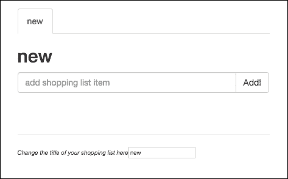
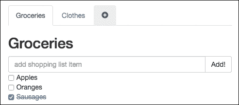
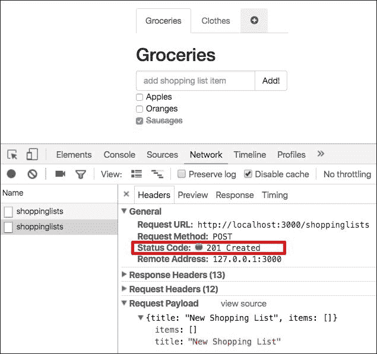
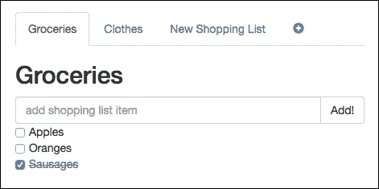
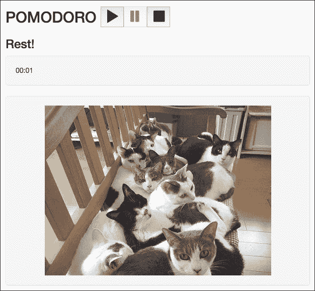

# 第六章：插件-用自己的砖头建造你的房子

在上一章中，你学会了如何使用 Vuex 架构管理全局应用程序存储。你学到了很多新概念并应用了它们。你还学会了如何创建一个存储，如何定义它的状态和变化，以及如何使用操作和获取器。我们利用在这一章中获得的知识，让我们的购物清单和番茄钟应用程序焕发生机。

在这一章中，我们将重新审视 Vue 插件，看看它们是如何工作的，以及它们必须如何创建。我们将使用一些现有的插件并创建我们自己的插件。

总结一下，在这一章中，我们将做以下事情：

+   了解 Vue 插件的性质

+   在购物清单应用程序中使用资源插件

+   创建一个生成白色、粉色和棕色噪音的插件，并将其应用到我们的番茄钟应用程序中

# Vue 插件的性质

在 Vue.js 中，插件的用途与在任何其他范围中使用的目的完全相同：为系统的核心功能无法实现的一些良好功能添加一些功能。为 Vue 编写的插件可以提供各种功能，从定义一些全局 Vue 方法，甚至实例方法，到提供一些新的指令、过滤器或转换。

为了能够使用现有的插件，你必须首先安装它：

```js
**npm install some-plugin --save-dev** 

```

然后，告诉 Vue 在你的应用程序中使用它：

```js
var Vue = require('vue') 
var SomePlugin = require('some-plugin') 

**Vue.use(SomePlugin)** 

```

我们也可以创建我们自己的插件。这也很容易。你的插件必须提供一个`install`方法，在这个方法中你可以定义任何全局或实例方法，或自定义指令：

```js
MyPlugin.**install** = function (Vue, options) { 
  // 1\. add global method or property 
  Vue.**myGlobalMethod** = ... 
  // 2\. add a global asset 
  Vue.**directive**('my-directive', {}) 
  // 3\. add an instance method 
  Vue.prototype.**$myMethod** = ... 
} 

```

然后它可以像任何其他现有的插件一样使用。在这一章中，我们将使用现有的`resource`插件为 Vue（[`github.com/vuejs/vue-resource`](https://github.com/vuejs/vue-resource)）并创建我们自己的插件，生成白色、粉色和棕色噪音。

# 在购物清单应用程序中使用 vue-resource 插件

打开购物清单应用程序（[chapter6/shopping-list](https://github.com/PacktPublishing/Learning-Vue.js-2/tree/master/chapter6/shopping-list)文件夹）并运行`npm install`和`npm run dev`。这很好，但它仍然使用硬编码的购物清单列表。如果我们能够添加新的购物清单，删除它们，并存储有关更新后的购物清单的信息，那将非常好，这样当我们重新启动应用程序时，显示的信息将与重新启动前看到的信息相对应。为了能够做到这一点，我们将使用`resource`插件，它允许我们轻松创建 REST 资源并在其上调用 REST 方法。在开始之前，让我们总结一下我们需要做的一切：

+   首先，我们需要一个简单的服务器，其中包含一些存储，我们可以从中检索和存储我们的购物清单。这个服务器必须为所有这些功能提供所需的端点。

+   创建我们的服务器和所有所需的端点后，我们应该安装并使用`vue-resource`插件来创建一个资源和调用提供的端点上的方法。

+   为了保证数据的完整性，我们应该调用更新服务器状态的操作，以便在每次购物清单更新时更新服务器的状态。

+   在应用程序启动时，我们应该从服务器获取购物清单并将它们分配给我们存储的状态。

+   我们还应该提供一个机制来创建新的购物清单并删除现有的清单。

听起来不太困难，对吧？那么让我们开始吧！

## 创建一个简单的服务器

为了简单起见，我们将使用一个非常基本和易于使用的 HTTP 服务器，它将数据存储在一个常规的 JSON 文件中。它被称为`json-server`，托管在[`github.com/typicode/json-server`](https://github.com/typicode/json-server)。在购物清单应用程序的目录中安装它：

```js
**cd shopping-list 
npm install --save-dev json-server** 

```

创建一个带有`db.json`文件的`server`文件夹，并在其中添加以下内容：

```js
//shopping-list/server/db.json 
{ 
  "shoppinglists": [ 
  ] 
} 

```

这将是我们的数据库。让我们向`package.json`文件添加脚本条目，以便我们可以轻松地启动我们的服务器：

```js
  "scripts": { 
    "dev": "node build/dev-server.js ", 
    **"server": "node_modules/json-server/bin/index.js --watch  
    server/db.json"**, 
    <...> 
  }, 

```

现在，要启动服务器，只需运行以下命令：

```js
**cd shopping-list 
npm run server** 

```

在`http://localhost:3000/shoppinglists`上打开浏览器页面。您将看到一个空数组作为结果。这是因为我们的数据库仍然是空的。尝试使用`curl`插入一些数据：

```js
**curl -H "Content-Type:application/json" -d '{"title":"new","items":[]}' http://localhost:3000/shoppinglists** 

```

如果现在刷新页面，您将看到您新插入的值。

现在我们的简单 REST 服务器已经启动运行，让我们借助`vue-resource`插件在我们的购物清单应用程序中使用它！

## 安装 vue-resource，创建资源及其方法

在深入使用`vue-resource`插件之前，请查看其文档[`github.com/vuejs/vue-resource/blob/master/docs/resource.md`](https://github.com/vuejs/vue-resource/blob/master/docs/resource.md)。基本上，文档提供了一种根据给定 URL（在我们的情况下，将是`http://localhost:3000/shoppinglists`）创建资源的简单方法。创建资源后，我们可以在其上调用`get`，`delete`，`post`和`update`方法。

在项目文件夹中安装它：

```js
**cd shopping-list 
npm install vue-resource --save-dev** 

```

现在让我们为我们的 API 创建入口点。在购物清单应用程序的`src`文件夹内，创建一个子文件夹并将其命名为`api`。在其中创建一个`index.js`文件。在这个文件中，我们将导入`vue-resource`插件并告诉`Vue`去使用它：

```js
**//api/index.js** 
import Vue from 'vue' 
import VueResource from 'vue-resource' 

Vue.use(VueResource) 

```

很好！现在我们准备创建`ShoppingListsResource`并为其附加一些方法。使用`vue-resource`插件创建资源，我们只需在`Vue`上调用`resource`方法并将 URL 传递给它：

```js
const ShoppingListsResource = Vue.resource(**'http://localhost:3000/' + 'shoppinglists{/id}'**) 

```

`ShoppingListsResource`常量现在公开了实现**CRUD**（**创建，读取，更新和删除**）操作所需的所有方法。它非常容易使用，以至于我们基本上可以导出资源本身。但让我们为每个 CRUD 操作导出好的方法：

```js
export default { 
  fetchShoppingLists: () => { 
    return **ShoppingListsResource.get()** 
  }, 
  addNewShoppingList: (data) => { 
    return **ShoppingListsResource.save(data)** 
  }, 
  updateShoppingList: (data) => { 
    return **ShoppingListsResource.update({ id: data.id }, data)** 
  }, 
  deleteShoppingList: (id) => { 
    return **ShoppingListsResource.remove({ id: id })** 
  } 
} 

```

`api/index.js`文件的完整代码可以在此处的 gist 中查看[`gist.github.com/chudaol/d5176b88ba2c5799c0b7b0dd33ac0426`](https://gist.github.com/chudaol/d5176b88ba2c5799c0b7b0dd33ac0426)。

就是这样！我们的 API 已经准备好使用并填充我们的响应式 Vue 数据！

## 获取应用程序开始的所有购物清单

让我们首先创建一个操作，该操作将获取并填充存储的`shoppinglists`状态。创建后，我们可以在主`App.vue`准备状态上调用它。

在`mutation_types.js`文件中定义一个常量，如下所示：

```js
//mutation_types.js 
export const POPULATE_SHOPPING_LISTS = 'POPULATE_SHOPPING_LISTS' 

```

现在创建一个 mutation。这个 mutation 将只接收一个`shoppinglists`数组并将其分配给`shoppinglists`状态：

```js
//mutations.js 
export default { 
  [types.CHANGE_TITLE] (state, data) { 
    findById(state, data.id).title = data.title 
  }, 
  **[types.POPULATE_SHOPPING_LISTS] (state, lists) { 
    state.shoppinglists = lists 
  }** 
} 

```

好了！现在我们只需要一个使用 API 的`get`方法并分派填充 mutation 的操作。在`actions.js`文件中导入 API 并创建相应的 action 方法：

```js
import { CHANGE_TITLE, POPULATE_SHOPPING_LISTS } from './mutation_types' 
**import api from '../api'** 

export default { 
  changeTitle: ({ commit }, data) => { 
    commit(CHANGE_TITLE, data) 
  }, 
  **populateShoppingLists: ({ commit }) => { 
    api.fetchShoppingLists().then(response => { 
      commit(POPULATE_SHOPPING_LISTS, response.data) 
    })** 
  } 
} 

```

在上述代码的前面几行中，我们执行了一个非常简单的任务——调用`fetchShoppingLists` API 的方法，该方法反过来调用资源的`get`方法。这个方法执行一个`http GET`调用，并在数据从服务器返回时解析一个 promise。

然后使用这些数据来分发填充变异。这种方法将把这些数据分配给存储的状态`shoppinglists`属性。这个属性是响应式的；你还记得吗？这意味着依赖于`shoppinglists`属性 getter 的所有视图都将被更新。现在让我们在主`App.vue`组件的`mounted`状态中使用这个操作。在官方 Vue 文档页面的[mounted](https://vuejs.org/v2/api/#mounted)状态钩子中查看更多信息。

打开`App.vue`组件，导入`mapActions`对象，在组件的`methods`属性中映射`populateShoppingLists`操作，并在`mounted`处理程序中调用它。因此，在更改后，`App.vue`的`script`标签如下所示：

```js
<script> 
  import ShoppingListComponent from './components/ShoppingListComponent' 
  import ShoppingListTitleComponent from   
  './components/ShoppingListTitleComponent' 
  import store from './vuex/store' 
  import { mapGetters, **mapActions** } from 'vuex' 

  export default { 
    components: { 
      ShoppingListComponent, 
      ShoppingListTitleComponent 
    }, 
    computed: mapGetters({ 
      shoppinglists: 'getLists' 
    }), 
    **methods: mapActions(['populateShoppingLists']),** 
    store, 
    **mounted () { 
      this.populateShoppingLists() 
    }** 
  } 
</script> 

```

如果您现在打开页面，您将看到我们使用`curl`创建的唯一购物清单，如下面的屏幕截图所示：



显示的购物清单是由我们简单的服务器提供的！

尝试使用`curl`添加更多项目，甚至直接修改`db.json`文件。刷新页面，看看它是如何像魅力一样工作的！

## 在更改时更新服务器状态

非常好，现在我们的购物清单是由我们的 REST API 提供的，一切都运作良好并且看起来很好。尝试添加一些购物清单项目或更改购物清单的标题，并检查或取消检查项目。在所有这些交互之后，刷新页面。哎呀，列表是空的，什么也没发生。这完全正确，我们有一个用于更新给定购物清单的 API 方法，但我们没有在任何地方调用它，因此我们的服务器不知道应用的更改。

让我们首先定义哪些组件对我们的购物清单进行了一些操作，以便将这些更改发送到服务器。购物清单及其项目可能发生以下三种情况：

+   清单的标题可以在`ChangeTitleComponent`中更改

+   新项目可以在`AddItemComponent`中添加到购物清单

+   购物清单中的项目可以在`ItemComponent`中进行勾选或取消勾选

我们必须创建一个必须在所有这些更改上触发的动作。在此动作中，我们应该调用`update` API 的方法。仔细查看`api/index.js`模块中的更新方法；它必须接收整个购物清单对象作为参数：

```js
//api/index.js 
updateShoppingList: (**data**) => { 
  return ShoppingListsResource.update(**{ id: data.id }, data**) 
} 

```

让我们创建一个接收`id`作为参数的动作，通过其 ID 检索购物清单，并调用 API 的方法。在此之前，在`getters.js`文件中创建一个`getListById`方法，并将其导入到动作中：

```js
//getters.js 
**import _ from 'underscore'** 

export default { 
  getLists: state => state.shoppinglists, 
  **getListById: (state, id) => { 
    return _.findWhere(state.shoppinglists, { id: id }) 
  }** 
} 

//actions.js 
**import getters from './getters'** 

```

现在我们准备定义更新购物清单的动作：

```js
//actions.js 
<...> 
export default { 
  <...> 
  updateList: (store, id) => { 
    let shoppingList = **getters.getListById**(store.state, id) 

    **api.updateShoppingList(shoppingList)** 
  } 
} 

```

实际上，我们现在可以从`mutations.js`中删除`findById`方法，只需从`getters.js`中重用此方法：

```js
//mutations.js 
import * as types from './mutation_types' 
**import getters from './getters'** 

export default { 
  [types.CHANGE_TITLE] (state, data) { 
    **getters.getListById**(state, data.id).title = data.title 
  }, 
  [types.POPULATE_SHOPPING_LISTS] (state, lists) { 
    state.shoppinglists = lists 
  } 
} 

```

好了，现在我们已经定义了调用 API 的`updateList`方法的动作。现在我们只需在组件内部发生的每个更改上调用该动作！

让我们从`AddItemComponent`开始。我们必须在`addItem`方法中使用`this.$store.dispatch`方法分派`updateList`动作，使用动作的名称。但是，有一个小问题 - 我们必须将列表项 ID 传递给`updateList`方法，而我们在此组件内部没有对其的引用。但这实际上很容易解决。只需在组件的`props`中添加 ID，并将其绑定到`ShoppingListComponent`中的组件调用。因此，我们的`AddItemComponent`组件的`script`标签如下所示：

```js
//AddItemComponent.vue 
<script> 
  export default { 
    **props: ['id']**, 
    data () { 
      return { 
        newItem: '' 
      } 
    }, 
    methods: { 
      addItem () { 
        var text 

        text = this.newItem.trim() 
        if (text) { 
          this.$emit('add', this.newItem) 
          this.newItem = '' 
          **this.$store.dispatch('updateList', this.id)** 
        } 
      } 
    } 
  } 
</script> 

```

而且，在`ShoppingListComponent`中，在`add-item-component`调用时，将 ID 绑定到它：

```js
//ShoppingListComponent.vue 
<template> 
  <...> 
    <add-item-component **:id="id"** @add="addItem"></add-item-component> 
  <...> 
</template> 

```

现在，如果您尝试向购物清单添加项目并刷新页面，新添加的项目将出现在列表中！

现在我们应该对`ChangeTitleComponent`做同样的事情。打开`ChangeTitleComponent.vue`文件并检查代码。现在，它在输入时调用`changeTitle`动作：

```js
//ChangeTitleComponent.vue 
<template> 
  <div> 
    <em>Change the title of your shopping list here</em> 
    <input :value="title" **@input="onInput({ title: 
      $event.target.value, id: id })"**/> 
  </div> 
</template> 

<script> 
  **import { mapActions } from 'vuex'** 

  export default { 
    props: ['title', 'id'], 
    **methods: mapActions({ 
      onInput: 'changeTitle'** 
    }) 
  } 
</script> 

```

当然，我们可以导入`updateList`动作，并在调用`changeTitle`动作后立即调用它。但是在动作本身内部执行可能更容易。您可能记得，为了调度存储的动作，我们应该调用应用于存储的`dispatch`方法，并将动作的名称作为参数。因此，我们可以在`changeTitle`动作内部执行。只需打开`action.js`文件，找到我们的`changeTitle`动作，并添加对`updateList`的调用：

```js
//actions.js 
export default { 
  changeTitle: (store, data) => { 
    store.commit(CHANGE_TITLE, data) 
    **store.dispatch('updateList', data.id)** 
  }, 
  <...> 
} 

```

完成了！打开页面，修改页面的标题，并刷新页面。标题应保持其修改后的状态！

我们需要确保持久化的最后一个更改是购物清单中物品的`checked`属性的更改。让我们看看`ItemComponent`，决定我们应该在哪里调用`updateList`动作。

让我们首先像我们在`AddItemComponent`中做的那样，在`props`属性中添加 ID：

```js
//ItemComponent.vue 
<script> 
  export default { 
    props: ['item', **'id'**] 
  } 
</script> 

```

我们还必须将`id`属性绑定到组件的调用中，这是在`ItemsComponent`内完成的：

```js
//ItemsComponent.vue 
<template> 
  <ul> 
    <item-component v-for="item in items" :item="item" **:id="id"**>
    </item-component> 
  </ul> 
</template> 

<script> 
  import ItemComponent from './ItemComponent' 

  export default { 
    components: { 
      ItemComponent 
    }, 
    props: ['items', 'id'] 
  } 
</script> 

```

这也意味着我们必须将`id`属性绑定到`item-component`内部的`ShoppingListComponent`中：

```js
//ShoppingListComponent.vue 
<template> 
  <...> 
    <items-component :items="items" **:id="id"**></items-component> 
  <...> 
</template> 

```

我们还应该在`ItemComponent`内部导入`mapActions`对象，并在`methods`属性中导出`updateList`方法：

```js
//ItemComponent.vue 
<script> 
  **import { mapActions } from 'vuex'** 

  export default { 
    props: ['item', 'id'], 
    **methods: mapActions(['updateList'])** 
  } 
</script> 

```

好的，一切都与一切相连；现在我们只需要找到`ItemComponent`内部调用`updateList`动作的正确位置。

这事实上并不是一件容易的任务，因为与其他组件不同，我们在这里没有事件处理程序处理更改并调用相应的函数，而是只有绑定到复选框元素的类和模型绑定。幸运的是，`Vue`提供了一个`watch`选项，允许我们将监听器附加到组件的任何数据并将处理程序绑定到它们。在我们的情况下，我们想要监视`item.checked`属性并调用动作。所以，只需将`watch`属性添加到组件选项中，如下所示：

```js
//ItemComponent.vue 
<script> 
  import { mapActions } from 'vuex' 

  export default { 
    props: ['item', 'id'], 
    methods: mapActions(['updateList']), 
    **watch: { 
      'item.checked': function () { 
        this.updateList(this.id) 
      } 
    }** 
  } 
</script> 

```

然后...我们完成了！尝试向购物清单中添加物品，勾选，取消勾选，然后再次勾选。刷新页面。一切看起来都和刷新前一样！

## 创建一个新的购物清单

好的，我们已经从服务器获取了购物清单；我们还存储了应用的更改，所以一切都很好。但是，如果我们能够使用我们应用程序的用户界面创建购物清单，而不是修改`db.json`文件或使用`curl post`请求，那不是也很好吗？当然，那会很好。当然，我们可以用几行代码做到！

让我们首先添加调用相应 API 方法的动作，如下所示：

```js
//actions.js 
export default { 
  <...> 
  **createShoppingList: ({ commit }, shoppinglist) => { 
    api.addNewShoppingList(shoppinglist) 
  }** 
} 

```

现在我们必须提供一个可视化机制来调用这个动作。为此，我们可以在选项卡列表中创建一个额外的选项卡，其中包含加号按钮，当点击时将调用该动作。我们将在`App.vue`组件内完成。我们已经导入了`mapActions`对象。让我们只需将`createShoppingList`方法添加到导出的`methods`属性中：

```js
//App.vue 
<script> 
  import ShoppingListComponent from './components/ShoppingListComponent' 
  import ShoppingListTitleComponent from 
  './components/ShoppingListTitleComponent' 
  import store from './vuex/store' 
  import { mapGetters, mapActions } from 'vuex' 

  export default { 
    components: { 
      ShoppingListComponent, 
      ShoppingListTitleComponent 
    }, 
    computed: mapGetters({ 
      shoppinglists: 'getLists' 
    }), 
    methods: mapActions(['populateShoppingLists', 
    **'createShoppingList'**]), 
    store, 
    mounted () { 
      this.populateShoppingLists() 
    } 
  } 
</script> 

```

此刻，我们的 `App.vue` 组件可以访问 `createShoppingList` 动作，并且可以在事件处理程序上调用它。问题是——使用什么数据？`createShoppingList` 方法正在等待接收一个对象，然后将其发送到服务器。让我们创建一个方法，它将生成一个带有硬编码标题的新列表，并在这个方法内部，使用这个新对象调用动作。但是这个方法应该放在哪里呢？组件的 `methods` 属性已经被 `mapActions` 辅助程序的调用占用了。嗯，`mapActions` 方法返回一个方法映射。我们可以简单地*扩展*这个映射，加入我们的本地方法：

```js
//App.vue 
methods: _.**extend**({}, 
    mapActions(['populateShoppingLists', 'createShoppingList']), 
    { 
      **addShoppingList ()** { 
        let list = { 
          title: 'New Shopping List', 
          items: [] 
        } 

        **this.createShoppingList(list)** 
      } 
    }), 

```

现在我们只需要添加一个按钮，并将 `addShoppingList` 方法绑定到它的 `click` 事件上。你可以在页面的任何地方创建自己的按钮。我的按钮代码如下：

```js
App.vue 
<template> 
  <div id="app" class="container"> 
    <ul class="nav nav-tabs" role="tablist"> 
      <li :class="index===0 ? 'active' : ''" v-for="(list, index) in 
        shoppinglists" role="presentation"> 
        <shopping-list-title-component :id="list.id" 
          :title="list.title"></shopping-list-title-component> 
      </li> 
      **<li> 
        <a href="#" @click="addShoppingList"> 
          <i class="glyphicon glyphicon-plus-sign"></i> 
        </a> 
      </li>** 
    </ul> 
    <div class="tab-content"> 
      <div :class="index===0 ? 'active' : ''" v-for="(list, index) in 
      shoppinglists" class="tab-pane" role="tabpanel" :id="list.id"> 
        <shopping-list-component :id="list.id" :title="list.title" 
        :items="list.items"></shopping-list-component> 
      </div> 
    </div> 
  </div> 
</template> 

```

看看页面；现在我们在最后一个标签上有一个漂亮的加号按钮，清楚地表明可以添加新的购物清单，如下截图所示：



现在我们可以使用这个漂亮的加号按钮添加新的购物清单

尝试点击按钮。哎呀，什么也没发生！但是，如果我们查看网络面板，我们可以看到请求实际上已经执行成功了：



创建请求已成功执行；但是，页面上没有任何变化

实际上，这是完全有道理的。我们更新了服务器上的信息，但客户端并不知道这些变化。如果我们能在成功创建购物清单后填充购物清单，那就太好了，不是吗？我说“如果我们能”吗？当然我们可以！只需回到 `actions.js` 并在 promise 的 `then` 回调中使用 `store.dispatch` 方法调用 `populateShoppingLists` 动作：

```js
//actions.js 
createShoppingList: (**store**, shoppinglist) => { 
  api.addNewShoppingList(shoppinglist).**then**(() => { 
    **store.dispatch('populateShoppingLists')** 
  }) 
}  

```

现在，如果你点击加号按钮，你会立即看到新创建的清单出现在标签窗格中，如下截图所示：



重新填充我们的清单后新增的购物清单

现在你可以点击新的购物清单，更改它的名称，添加它的项目，并对其进行检查和取消检查。当你刷新页面时，一切都和刷新前一样。太棒了！

## 删除现有的购物清单

我们已经能够创建和更新我们的购物清单。现在我们只需要能够删除它们。在本章学到的所有知识之后，这将是最容易的部分。我们应该添加一个动作，调用我们的 API 的`deleteShoppingList`方法，为每个购物清单添加删除按钮，并在按钮点击时调用该动作。

让我们从添加动作开始。与我们创建购物清单时一样，我们将在删除购物清单后立即调用`populate`方法，因此我们的动作将如下所示：

```js
//action.js 
deleteShoppingList: (store, id) => { 
  **api.deleteShoppingList(id)**.then(() => { 
    store.dispatch('populateShoppingLists') 
  }) 
} 

```

现在让我们想一想应该在哪里添加删除按钮。我希望在选项卡标题中的购物清单标题附近看到它。这是一个名为`ShoppingListTitleComponent`的组件。打开它并导入`mapActions`助手。在`methods`属性中导出它。因此，这个组件的`script`标签内的代码如下所示：

```js
//ShoppingListTitleComponent.vue 
<script> 
  **import { mapActions } from 'vuex'** 

  export default{ 
    props: ['id', 'title'], 
    computed: { 
      href () { 
        return '#' + this.id 
      } 
    }, 
    **methods: mapActions(['deleteShoppingList'])** 
  } 
</script> 

```

现在让我们添加删除按钮，并将`deleteShoppingList`方法绑定到其`click`事件侦听器上。我们应该将 ID 传递给这个方法。我们可以直接在模板内部做到这一点：

```js
//ShoppingListTitleComponent.vue 
<template> 
  <a :href="href" :aria-controls="id" role="tab" data-toggle="tab">
    {{ title }} 
    **<i class="glyphicon glyphicon-remove" 
      @click="deleteShoppingList(id)"></i>** 
  </a> 
</template> 

```

我还为删除图标添加了一点样式，使其看起来更小更优雅：

```js
<style scoped> 
  i { 
    font-size: x-small; 
    padding-left: 3px; 
    cursor: pointer; 
  } 
</style> 

```

就是这样！打开页面，你会看到每个购物清单标题旁边有一个小的**`x`**按钮。尝试点击它，你会立即看到变化，如下面的截图所示：


带有删除 X 按钮的购物清单，允许我们删除未使用的购物清单

恭喜！现在我们有一个完全功能的应用程序，可以让我们为任何场合创建购物清单，删除它们，并管理每个清单上的物品！干得好！本节的最终代码可以在[chapter6/shopping-list2](https://github.com/PacktPublishing/Learning-Vue.js-2/tree/master/chapter6/shopping-list2)文件夹中找到。

## 练习

我们的购物清单彼此非常相似。我想提出一个小的样式练习，你应该在其中为你的清单附加颜色，以使它们彼此不同。这将要求你在购物清单创建时添加一个背景颜色字段，并在组件内部使用它以用给定的颜色绘制你的清单。

# 在番茄钟应用程序中创建和使用插件

既然我们知道如何在 Vue 应用程序中使用现有的插件，为什么不创建我们自己的插件呢？我们的番茄钟应用程序中已经有一点动画效果，当状态从工作的番茄钟间隔变为休息间隔时，屏幕会完全改变。然而，如果我们不看标签，我们就不知道是应该工作还是休息。向我们的番茄钟添加一些声音会很好！

在思考时间管理应用中的声音时，我想到了适合工作的声音。我们每个人都有自己喜欢的工作播放列表。当然，这取决于每个人的音乐偏好。这就是为什么我决定在工作时间段内向我们的应用程序添加一些中性声音。一些研究证明了不同的噪音（白噪声、粉红噪声、棕噪声等）对于需要高度集中注意力的工作是有益的。关于这些研究的维基百科条目可以在[`en.wikipedia.org/wiki/Sound_masking`](https://en.wikipedia.org/wiki/Sound_masking)找到。一些 Quora 专家讨论这个问题可以在[`bit.ly/2cmRVW2`](http://bit.ly/2cmRVW2)找到。

在这一部分，我们将使用 Web Audio API（[`developer.mozilla.org/en-US/docs/Web/API/Web_Audio_API`](https://developer.mozilla.org/en-US/docs/Web/API/Web_Audio_API)）为 Vue 创建一个插件，用于生成白噪声、粉红噪声和棕噪声。我们将提供一种机制，使用 Vue 指令来实例化一个噪声或另一个噪声，并且我们还将提供全局 Vue 方法来启动和暂停这些声音。之后，我们将使用这个插件在休息时观看猫时切换到静音状态，而在工作时切换到嘈杂状态。听起来有挑战性和有趣吗？我真的希望是！那么让我们开始吧！

## 创建 NoiseGenerator 插件

我们的插件将存储在一个单独的 JavaScript 文件中。它将包含三种方法，一种用于生成每种噪声，并提供一个`Vue.install`方法，其中将定义指令和所需的 Vue 方法。使用[chapter6/pomodoro](https://github.com/PacktPublishing/Learning-Vue.js-2/tree/master/chapter6/pomodoro)文件夹作为起点。首先，在`src`文件夹中创建一个`plugins`子文件夹，并在其中添加`VueNoiseGeneratorPlugin.js`文件。现在让我们创建以下三种方法：

+   生成白噪声

+   生成粉红噪声

+   生成棕噪声

我不会重复造轮子，只会复制并粘贴我在互联网上找到的已有代码。当然，我要非常感谢我在[`noisehack.com/generate-noise-web-audio-api/`](http://noisehack.com/generate-noise-web-audio-api/)找到的这个很棒的资源。话虽如此，我们在复制代码并将其组织成函数后，插件应该如下所示：

```js
// plugins/VueNoiseGenerator.js 
import _ from 'underscore' 

// Thanks to this great tutorial: 
//http://noisehack.com/generate-noise-web-audio-api/ 
var audioContext, bufferSize, noise 
audioContext = new (window.AudioContext || window.webkitAudioContext)() 

function **generateWhiteNoise** () { 
  var noiseBuffer, output 

  bufferSize = 2 * audioContext.sampleRate 
  noiseBuffer = audioContext.createBuffer(1, bufferSize, 
    audioContext.sampleRate) 

  output = noiseBuffer.getChannelData(0) 
  _.times(bufferSize, i => { 
    output[i] = Math.random() * 2 - 1 
  }) 

  noise = audioContext.createBufferSource() 
  noise.buffer = noiseBuffer 
  noise.loop = true 
  noise.start(0) 

  return noise 
} 

function **generatePinkNoise** () { 
  bufferSize = 4096 
  noise = (function () { 
    var b0, b1, b2, b3, b4, b5, b6, node 
    b0 = b1 = b2 = b3 = b4 = b5 = b6 = 0.0 
    node = audioContext.createScriptProcessor(bufferSize, 1, 1) 
    node.onaudioprocess = function (e) { 
      var output 

      output = e.outputBuffer.getChannelData(0) 
      _.times(bufferSize, i => { 
        var white = Math.random() * 2 - 1 
        b0 = 0.99886 * b0 + white * 0.0555179 
        b1 = 0.99332 * b1 + white * 0.0750759 
        b2 = 0.96900 * b2 + white * 0.1538520 
        b3 = 0.86650 * b3 + white * 0.3104856 
        b4 = 0.55000 * b4 + white * 0.5329522 
        b5 = -0.7616 * b5 - white * 0.0168980 
        output[i] = b0 + b1 + b2 + b3 + b4 + b5 + b6 + white * 0.5362 
        output[i] *= 0.11 // (roughly) compensate for gain 
        b6 = white * 0.115926 
      }) 
    } 
    return node 
  })() 

  return noise 
} 

function **generateBrownNoise** () { 
  bufferSize = 4096 

  noise = (function () { 
    var lastOut, node 

    lastOut = 0.0 
    node = audioContext.createScriptProcessor(bufferSize, 1, 1) 
    node.onaudioprocess = function (e) { 
      var output = e.outputBuffer.getChannelData(0) 
      _.times(bufferSize, i => { 
        var white = Math.random() * 2 - 1 
        output[i] = (lastOut + (0.02 * white)) / 1.02 
        lastOut = output[i] 
        output[i] *= 3.5 // (roughly) compensate for gain 
      }) 
    } 
    return node 
  })() 

  return noise 
} 

```

您可以在[`jsfiddle.net/chudaol/7tuewm5z/`](https://jsfiddle.net/chudaol/7tuewm5z/)的 JSFiddle 中测试所有这些噪音。

好的，我们已经实现了所有三种噪音。现在我们必须导出`install`方法，该方法将被`Vue`调用。此方法接收`Vue`实例，并可以在其上创建指令和方法。让我们创建一个指令，称之为`noise`。这个指令可以有三个值，`white`、`pink`或`brown`，根据接收到的值，将通过调用相应的噪音创建方法来实例化`noise`变量。因此，在`install`方法中创建指令将如下所示：

```js
// plugins/VueNoiseGeneratorPlugin.js 
export default { 
  install: function (Vue) { 
    **Vue.directive('noise'**, (value) => { 
      var noise 

      switch (value) { 
        case **'white'**: 
          noise = **generateWhiteNoise**() 
          break 
        case **'pink'**: 
          noise = **generatePinkNoise**() 
          break 
        case **'brown'**: 
          noise = **generateBrownNoise**() 
          break 
        default: 
          noise = generateWhiteNoise() 
      } 
      noise.connect(audioContext.destination) 
      audioContext.suspend() 
    }) 
  } 
} 

```

实例化后，我们将`noise`连接到已经实例化的`audioContext`，并将其暂停，因为我们不希望它在指令绑定时立即开始产生噪音。我们希望它在某些事件（例如，单击开始按钮）上被实例化，并在其他事件（例如，有人单击暂停按钮时）上被暂停。为此，让我们为启动、暂停和停止我们的`audioContext`提供方法。我们将这三种方法放在名为`noise`的全局 Vue 属性上。我们将这些方法称为`start`、`pause`和`stop`。在`start`方法中，我们希望在`pause`和`stop`方法中恢复`audioContext`并将其暂停。因此，我们的方法将如下所示：

```js
// plugins/VueNoiseGeneratorPlugin.js 
export default { 
  install: function (Vue) { 
    Vue.directive('noise', (value) => { 
      <...> 
    }) 
    **Vue.noise** = { 
      **start** () { 
        audioContext.resume() 
      }, 
      **pause** () { 
        audioContext.suspend() 
      }, 
      **stop** () { 
        audioContext.suspend() 
      } 
    } 
  } 
} 

```

就是这样！我们的插件已经完全准备好使用了。当然，它并不完美，因为我们只有一个`audioContext`，它只被实例化一次，然后由所选的噪音之一填充，这意味着我们将无法在页面上多次使用`noise`指令，但再次强调，这只是一个原型，您完全可以增强它并使其完美并公开！

## 在番茄钟应用程序中使用插件

好了，现在我们有了一个很好的噪音产生插件，唯一缺少的就是使用它！您已经知道如何做了。打开`main.js`文件，导入`VueNoiseGeneratorPlugin`，并告诉`Vue`使用它：

```js
import VueNoiseGeneratorPlugin from 
'./plugins/VueNoiseGeneratorPlugin' 

Vue.use(VueNoiseGeneratorPlugin) 

```

从现在开始，我们可以在 Pomodoro 应用程序的任何部分附加`noise`指令并使用`Vue.noise`方法。让我们将其绑定到`App.vue`组件中的主模板中：

```js
//App.vue 
<template> 
  <div id="app" class="container" **v-noise="'brown'"**> 
    <...> 
  </div> 
</template> 

```

请注意，我们在指令的名称中使用了`v-noise`而不仅仅是`noise`。当我们学习自定义指令时已经讨论过这一点。要使用指令，我们应该始终在其名称前加上`v-`前缀。还要注意，我们在单引号内使用双引号来包裹`brown`字符串。如果我们不这样做，Vue 将搜索名为`brown`的数据属性，因为这就是 Vue 的工作原理。由于我们可以在指令绑定赋值中编写任何 JavaScript 语句，因此我们必须使用双引号传递字符串。您还可以进一步创建一个名为`noise`的数据属性，并将您想要的值（`white`、`brown`或`pink`）分配给它，并在指令绑定语法中重用它。

完成后，让我们在我们的`start` mutation 中调用`Vue.noise.start`方法：

```js
//mutations.js 
**import Vue from 'vue'** 
<...> 

export default { 
  [types.START] (state) { 
    <...> 
    **if (state.isWorking) { 
      Vue.noise.start() 
    }** 
  }, 
<...> 

```

检查页面并点击开始按钮。您将听到一种悦耳的棕色噪音。但是要小心，不要吵醒您的同事，也不要吓到您的家人（反之亦然）。尝试更改噪音指令的值，并选择您喜欢的噪音进行工作。

但我们还没有完成。我们创建了一个启动噪音的机制，但它正在变成一个永无止境的噪音。让我们分别在`pause`和`stop` mutations 中调用`Vue.noise.pause`和`Vue.noise.stop`方法：

```js
//mutations.js 
export default { 
  <...> 
  [types.PAUSE] (state) { 
    <...> 
    **Vue.noise.pause()** 
  }, 
  [types.STOP] (state) { 
    <...> 
    **Vue.noise.stop()** 
  } 
} 

```

看看页面。现在，如果您点击暂停或停止按钮，噪音就会被暂停！我们还没有完成。请记住，我们的目的是只在工作时间而不是休息时间播放噪音。因此，让我们看看`mutations.js`中的`tooglePomodoro`方法，并添加一个根据番茄钟当前状态启动或停止噪音的机制：

```js
//mutations.js 
function togglePomodoro (state, toggle) { 
  if (_.isBoolean(toggle) === false) { 
    toggle = !state.isWorking 
  } 
  state.isWorking = toggle 
  **if (state.isWorking) { 
    Vue.noise.start() 
  } else { 
    Vue.noise.pause() 
  }** 
  state.counter = state.isWorking ? WORKING_TIME : RESTING_TIME 
} 

```

所有这些修改后的番茄钟应用程序的代码可以在[chapter6/pomodoro2](https://github.com/PacktPublishing/Learning-Vue.js-2/tree/master/chapter6/pomodoro2)文件夹中找到。查看当我们启动应用程序时噪音是如何开始的，当工作番茄钟完成时它是如何暂停的，以及当我们应该回到工作时它是如何重新开始的。还要查看启动、暂停和停止按钮如何触发噪音。干得好！

## 创建切换声音的按钮

我们很高兴将噪音声音绑定到番茄钟应用程序的工作状态。当我们暂停应用程序时，声音也会暂停。然而，有时候可能需要能够暂停声音而不必暂停整个应用程序。想想那些你想要完全安静工作的情况，或者你可能想接听 Skype 电话的情况。在这些情况下，即使是美妙的粉色噪音也不好。让我们在应用程序中添加一个按钮来切换声音。首先声明一个名为`soundEnabled`的 store 属性，并将其初始化为`true`。还要为此属性创建一个`getter`。因此，`store.js`和`getters.js`开始看起来像下面这样：

```js
//store.js 
<...> 
const state = { 
  <...> 
  **soundEnabled: true** 
} 

//getters.js 
export default { 
  <...> 
  **isSoundEnabled: state => state.soundEnabled** 
} 

```

现在我们必须提供一个切换声音的机制。让我们创建一个用于此目的的 mutation 方法，并添加一个触发此 mutation 的 action。首先声明一个名为`TOGGLE_SOUND`的 mutation 类型：

```js
//mutation_types.js 
<...> 
**export const TOGGLE_SOUND = 'TOGGLE_SOUND'** 

```

现在让我们打开`mutations.js`并添加一个切换`soundEnabled`存储属性的 mutation 方法：

```js
//mutations.js 
[types.TOGGLE_SOUND] (state) { 
  state.soundEnabled = !state.soundEnabled 
  if (state.soundEnabled) { 
    Vue.noise.start() 
  } else { 
    Vue.noise.pause() 
  } 
} 

```

现在让我们添加触发这个 mutation 的动作：

```js
//actions.js 
export default { 
  <...> 
  toggleSound: ({ commit }) => { 
    **commit(types.TOGGLE_SOUND)** 
  } 
} 

```

好的，现在我们有了创建切换声音按钮所需的一切！让我们在`ControlsComponent`中完成。首先在方法映射中添加必要的 getter 和 action：

```js
//ControlsComponent.vue 
<script> 
  import { mapGetters, mapActions } from 'vuex' 

  export default { 
    computed: mapGetters(['isStarted', 'isPaused', 'isStopped', 
    **'isSoundEnabled'**]), 
    methods: mapActions(['start', 'stop', 'pause', **'toggleSound'**]) 
  } 
</script> 

```

现在我们可以在模板中添加按钮。我建议它是一个带有`glyphicon`类的图标，将其对齐到右侧。

让我们只在应用程序`启动`且`未暂停`时显示此图标，并且只在番茄钟状态*为*`工作`时显示，这样我们就不会在根本不应该有声音的状态下搞乱切换声音按钮。这意味着我们在这个元素上的`v-show`指令将如下所示：

```js
v-show="isStarted && !isPaused && isWorking" 

```

请注意，我们在这里使用了尚未导入的`isWorking`属性。将其添加到方法映射中：

```js
//ControlsComponents.vue 
<script> 
  import { mapGetters, mapActions } from 'vuex' 

  export default { 
    computed: mapGetters(['isStarted', 'isPaused', 'isStopped', 
    **'isWorking'**, 'isSoundEnabled']), 
    methods: mapActions(['start', 'stop', 'pause', 'toggleSound']) 
  } 
</script> 

```

让我们还在这个元素上使用`glyphicon-volume-off`和`glyphicon-volume-on`类。它们将指示调用切换声音状态的操作。这意味着当声音*启用*时应用`glyphicon-volume-off`类，当声音*禁用*时应用`glyphicon-volume-on`类。将其放入代码中，我们的类指令应该如下所示：

```js
:class="{ 'glyphicon-volume-off': **isSoundEnabled**, 'glyphicon-volume-up': **!isSoundEnabled** }" 

```

最后但同样重要的是，当点击按钮时，我们应该调用`toggleSound`动作。这意味着我们还应该将`click`事件监听器绑定到这个元素，代码如下所示：

```js
@click='**toggleSound**' 

```

因此，这个按钮的整个 jade 标记代码将如下所示：

```js
//ControlsComponent.vue 
<template> 
  <span> 
    <...> 
    **<i class="toggle-volume glyphicon" v-show="isStarted &&** 
 **!isPaused && isWorking" :class="{ 'glyphicon-volume-off':** 
 **isSoundEnabled, 'glyphicon-volume-up': !isSoundEnabled }"** 
 **@click="toggleSound"></i>** 
  </span> 
</template> 

```

让我们给这个按钮添加一点样式，使它看起来与右侧对齐：

```js
<style scoped> 
  <...> 
  **.toggle-volume { 
    float: right; 
    cursor: pointer; 
  }** 
</style> 

```

打开页面并启动 Pomodoro 应用程序。现在你可以在右上角看到一个漂亮的按钮，它将允许你关闭声音，如下截图所示：


现在我们可以在工作时关闭声音！

如果你点击这个按钮，它将变成另一个按钮，其目的是再次打开声音，如下截图所示：


现在我们可以再次打开它！

现在考虑以下情景：我们启动应用程序，关闭声音，暂停应用程序，然后恢复应用程序。我们当前的逻辑表明每次启动应用程序时都会启动声音。我们将处于一个不一致的状态——应用程序已启动，声音正在播放，但切换声音按钮建议打开声音。这不对，对吧？但这有一个简单的解决办法——只需在启动变异中添加一个条件，不仅应该检查`isWorking`是否为`true`，还应该检查声音是否启用：

```js
//mutations.js 
types.START { 
  <...> 
  if (state.isWorking && **state.soundEnabled**) { 
    Vue.noise.start() 
  } 
}, 

```

现在我们很好。所有这些修改后的代码可以在[chapter6/pomodoro3](https://github.com/PacktPublishing/Learning-Vue.js-2/tree/master/chapter6/pomodoro3)文件夹中找到。

检查代码，运行应用程序，享受声音，并不要忘记休息！

## 练习

在我们的 Pomodoro 间隔期间，如果我们还能享受一些愉快的音乐，看着猫会很好。创建一个播放选择的 mp3 文件的插件，并在 Pomodoro 间隔期间使用它。

# 总结

当我为本章编写最后几行代码并检查页面时，有一次我被这张图片吸引住了：



很多猫盯着我问：这一章什么时候结束？

我甚至暂停了应用程序，好好看了一下这张图片（是的，当你在休息时间暂停番茄钟应用程序时，图片也会暂停，因为缓存破坏时间戳不再更新）。这些猫似乎在问我们休息一下？而且它们的数量与我们在本章学到的东西的数量非常接近！

在本章中，您学习了 Vue.js 插件系统的工作原理。我们使用现有的`resource`插件将服务器端行为附加到我们的购物清单应用程序上。现在我们可以创建、删除和更新我们的购物清单。

我们还创建了自己的插件！我们的插件能够发出声音，有助于在工作期间集中注意力。我们不仅创建了它，还在我们的番茄钟应用程序中使用了它！现在在番茄钟工作时我们可以更好地集中注意力，并随时切换声音！

现在我们手头有两个非常好的应用程序。你知道什么比一个好的应用程序更好吗？

*唯一比一个好的应用程序更好的是一个经过良好测试的应用程序！*

考虑到这一点，是时候测试我们的应用程序了。在下一章中，我们将检查并应用一些测试技术。我们将使用 Karma 测试运行器和 Jasmine 作为断言库编写单元测试。我们还将使用 Nightwatch 编写端到端测试。我喜欢测试应用程序，希望你也会喜欢。让我们开始吧！
