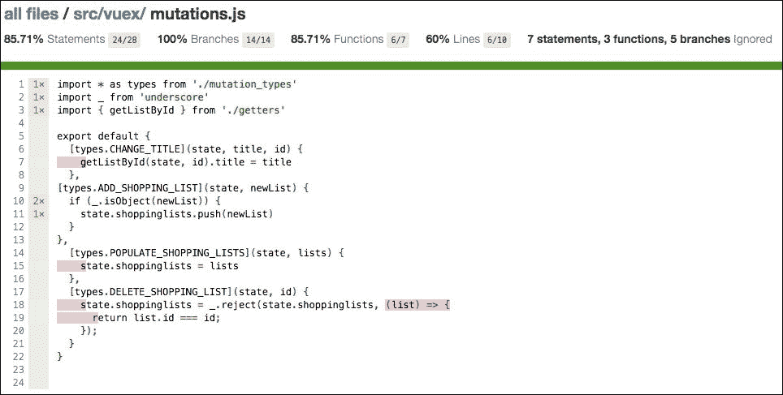
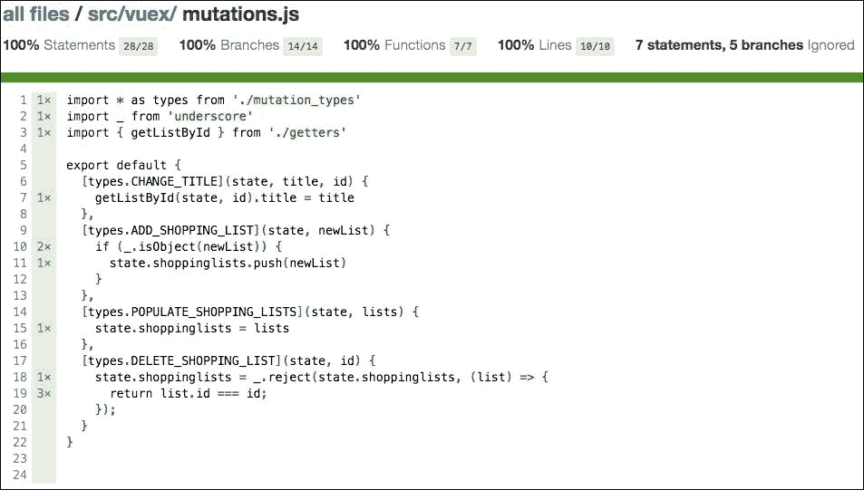
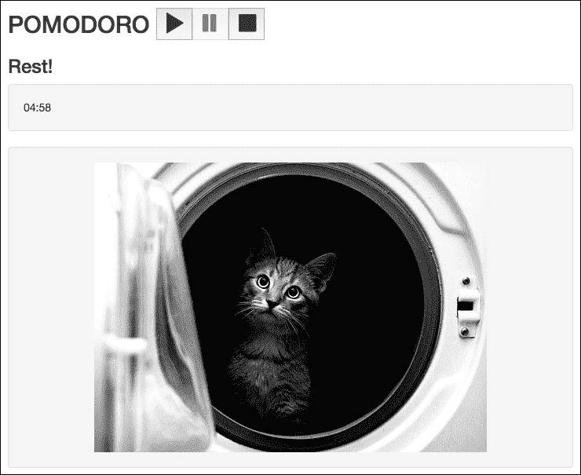
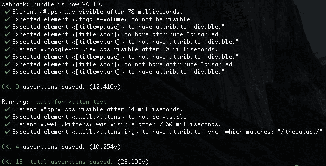

# 第七章：测试-是时候测试我们到目前为止所做的了！

在上一章中，您学会了如何使用和创建 Vue 插件。我们使用现有的`resource`插件为 Vue 创建了自己的`NoiseGenerator`插件。

在本章中，我们将确保番茄钟和购物清单应用程序的质量。我们将使用不同的测试技术来测试这些应用程序。首先，我们将对 Vue 组件和与 Vuex 相关的代码（如 actions、mutations 和 getters）执行经典的单元测试。之后，我们将学习如何使用 Nightwatch 执行端到端测试。因此，在本章中，我们将做以下事情：

+   谈论单元测试和端到端测试的重要性

+   为番茄钟和购物清单应用程序实现单元测试

+   学习如何在单元测试中模拟服务器响应

+   使用 Nightwatch 为两个应用程序实现端到端测试

# 为什么单元测试？

在我们开始编写单元测试之前，让我们试着理解我们试图通过编写它们来实现什么。为什么单元测试如此重要？有时当我写我的测试时，我唯一能想到的就是我的代码覆盖率；我想要达到 100%的水平。

代码覆盖率是一个非常重要的指标，对于理解代码流程和需要测试的内容有很大帮助。但这并不是单元测试质量的指标。这不是代码质量好坏的指标。你可以让你的代码 100%覆盖，只是因为你在测试代码中调用了所有的函数，但如果你的断言是错误的，那么代码也可能是错误的。编写良好的单元测试是一门需要时间和耐心的艺术。但是当你的单元测试足够好，当你专注于做出良好的断言时，关于边界情况和分支覆盖，它们提供以下内容：

+   帮助我们识别算法和逻辑中的失败

+   帮助我们提高代码质量

+   让我们编写易于测试的代码

+   防止未来的更改破坏功能

+   帮助我们拥有更可预测的截止日期和估算

易于进行单元测试覆盖的代码同时也是易于阅读的代码。易于阅读的代码更不容易出错，更易于维护。可维护性是应用程序质量的主要支柱之一。

### 注意

在[`chudaol.github.io/presentation-unit-testing`](https://chudaol.github.io/presentation-unit-testing)的演示中了解更多关于单元测试的内容。

让我们为我们的应用程序编写一些单元测试。

我们将使用 Karma 测试运行器，Mocha 测试框架，Chai 期望库和 Sinon 进行模拟。

有关这些工具的更多信息，请参考以下内容：

+   **Karma**: [`karma-runner.github.io/`](http://karma-runner.github.io/)

+   **Mocha**: [`mochajs.org`](https://mochajs.org)

+   **Chaijs**: [`chaijs.com/`](http://chaijs.com/)

+   **Sinon**: [`sinonjs.org/`](http://sinonjs.org/)

如果我们没有使用`vue-cli webpack`进行应用程序的引导，我们将不得不通过`npm`安装所有这些工具。但在我们的情况下，我们不需要进行这种安装。检查你的`package.json`文件，你会发现所有这些东西已经在那里：

```js
  "devDependencies": { 
    <...> 
    "**chai**": "³.5.0", 
    <...> 
    "**karma**": "⁰.13.15", 
    "karma-chrome-launcher": "².0.0", 
    "karma-coverage": "⁰.5.5", 
    "karma-mocha": "⁰.2.2", 
    "karma-phantomjs-launcher": "¹.0.0", 
    "**karma-sinon-chai**": "¹.2.0", 
    "**mocha**": "².4.5", 
    <...> 
  } 

```

你肯定知道为简单函数编写单元测试有多简单。这几乎就像说人类语言一样。它（这个函数）如果输入是*Y*，应该返回*X*。我期望它是*X*。

因此，如果我们有一个模块导出了一个返回两个参数之和的函数，那么这个函数的单元测试必须使用不同的参数调用该函数并期望一些输出。因此，让我们假设我们有一个如下的函数：

```js
function sum(a, b) { 
  return a + b 
} 

```

然后我们的单元测试可能如下所示：

```js
it('should follow commutative law', () => { 
  let a = 2; 
  let b = 3; 

  expect(sum(a, b)).to.equal(5); 
  expect(sum(b, a)).to.equal(5); 
}) 

```

当我们考虑对正在进行单元测试的函数的可能输入时，我们绝不应该害羞。空输入，负输入，字符串输入，一切都重要！你看过这条著名的推文吗（[`twitter.com/sempf/status/514473420277694465`](https://twitter.com/sempf/status/514473420277694465)）？

为什么要进行单元测试？

关于 QA 工程师思维方式的病毒推文

考虑所有可能的输入和适当的输出。用期望和断言来表达这一点。运行测试。看看哪里出了问题。修复你的代码。

# Vue 应用的单元测试

首先，让我们检查一些关于单元测试我们的 Vue 应用程序及其组件的特殊情况。为了能够为组件实例编写测试，首先必须实例化它！非常合乎逻辑，对吧？问题是，我们如何实例化 Vue 组件，以便其方法变得可访问和易于测试？要测试组件初始状态的基本断言，你只需导入它们并断言它们的属性。如果你想测试动态属性——一旦组件绑定到 DOM 后会发生变化的属性——你只需做以下三件事：

1.  导入一个组件。

1.  通过将其传递给`Vue`函数来实例化它。

1.  挂载它。

### 提示

当实例绑定到物理 DOM 时，一旦实例化，编译立即开始。在我们的情况下，我们没有将实例绑定到任何真正的物理 DOM 元素，因此我们必须通过手动调用`mount`方法（`$mount`）来显式地使其编译。

现在你可以使用创建的实例并访问它的方法。在伪代码中，它看起来像下面这样

```js
**import** MyComponent from <path to my component> 
var vm = **new Vue**(MyComponent).**$mount()** 

```

现在我们可以访问所有`vm`实例方法并测试它们。其余的东西，比如`data`，`props`等等，我们可以伪造。伪造东西没有问题，因为它为我们提供了轻松尝试各种输入并测试每种输入的所有可行输出的可能性。

如果你想在测试使用`props`的组件时拥有更真实的场景，这些`props`是由其父组件绑定到组件的，或者访问`vuex`存储等等，你可以使用`ref`属性将组件绑定到`Vue`实例。这个`Vue`实例，反过来，实例化存储和数据，并以通常的方式将数据项绑定到组件。之后，你可以通过使用`$refs` Vue 属性访问组件实例。这种绑定看起来像下面这样：

```js
import store from <path to store> 
import **MyComponent** from <path to my component> 
// load the component with a vue instance 
var vm = new Vue({ 
  template: '<div><test :items="items" :id="id" ref=testcomponent></test></div>', 
  components: { 
    'test': **MyComponent** 
  }, 
  data() { 
    return { 
      items: [], 
      id: 'myId' 
    } 
  }, 
  store 
}).$mount(); 

var myComponent = **vm.$refs.testcomponent**; 

```

现在你可以测试`myComponent`的所有方法，而不用担心覆盖它的`props`，`methods`和其他实例相关的东西。这是这种方法的一个好处；然而，正如你所看到的，这并不是最容易的设置，你应该考虑一切。例如，如果你的组件调用了一些存储的动作，这些动作调用了一些 API 的方法，你应该准备好伪造服务器的响应。

我个人喜欢尽可能简单地保持事情，伪造所有的数据输入，并集中在测试函数的可能输出和所有可能的边缘情况。但这只是我的个人观点，而且我们应该尝试生活中的一切，所以在这一章中，我们将尝试不同的方法。

# 编写购物清单应用的单元测试

在实际编写单元测试之前，让我们建立一些规则。对于我们的每个`.js`或`.vue`文件，都会存在一个相应的测试规范文件，它将具有相同的名称和一个`.spec.js`扩展名。这些规范的结构将遵循这种方法：

+   它将描述我们正在测试的文件

+   它将为正在测试的每个方法有一个`describe`方法

+   它将为我们描述的每种情况都有一个`it`方法

因此，如果我们有一个`myBeautifulThing.js`文件和它的规范，它可能看起来像下面这样：

```js
**// myBeautifulThing.js** 
export myBeautifulMethod1() { 
  return 'hello beauty' 
} 

export myBeautifulMethod2() { 
  return 'hello again' 
} 

**// myBeautifulThing.spec.js** 
import myBeautifulThing from <path to myBeautifulThing> 

describe('myBeautifulThing', () => { 
  //define needed variables 

  describe('myBeautifulMethod1', () => { 
    it('should return hello beauty', () { 
      expect(myBeautifulThing.myBeautifulMethod1()).to.equal('hello  
        beauty') 
    }) 
  }) 
}) 

```

让我们从覆盖`vuex`文件夹中的所有内容开始进行单元测试。

## 测试操作、getter 和 mutations

在本节中，请使用[chapter7/shopping-list](https://github.com/PacktPublishing/Learning-Vue.js-2/tree/master/chapter7/shopping-list)文件夹中的代码。不要忘记运行`npm install`命令。请注意，有两个新的 mutations：`ADD_SHOPPING_LIST`和`DELETE_SHOPPING_LIST`。这些 mutations 会将新的购物清单添加到列表中，并通过其 ID 删除列表。它们在`createShoppingList`和`deleteShoppingList`操作中被用于 promise 失败处理程序内：

```js
//actions.js  
createShoppingList: (store, shoppinglist) => { 
  api.addNewShoppingList(shoppinglist).then(() => { 
    store.dispatch('populateShoppingLists') 
  }, () => { 
    **store.commit(ADD_SHOPPING_LIST, shoppinglist)** 
  }) 
}, 
deleteShoppingList: (store, id) => { 
  api.deleteShoppingList(id).then(() => { 
    store.dispatch('populateShoppingLists') 
  }, () => { 
    **store.commit(DELETE_SHOPPING_LIST, id)** 
  }) 
} 

```

因此，即使我们的后端服务器宕机，我们仍然不会失去这个功能。

如果你再次检查你的项目结构，你会看到已经存在一个名为`test`的现有目录。在这个目录中，有两个目录，`unit`和`e2e`。现在，我们应该进入`unit`文件夹。在这里，你会看到另一个名为`specs`的目录。这是我们所有单元测试规范的所在地。让我们首先在`specs`内创建一个名为`vuex`的目录。这是我们所有与 Vuex 相关的 JavaScript 文件的规范所在地。

让我们从测试`mutations.js`方法开始。

创建一个`mutations.spec.js`文件。在这个文件中，我们应该导入`mutations.js`和 mutation 类型，以便我们可以轻松地调用 mutations。看一下`mutations.js`中声明的 mutations。它们都接收`state`和一些其他参数。让我们还创建一个带有`shoppinglist`数组的假`state`对象，这样我们就可以在我们的测试中使用它。

在每次测试之前，让我们也将其重置为空数组。

因此，在所有准备工作完成后，`mutations.js`的引导规范如下：

```js
// mutations.spec.js 
import mutations from 'src/vuex/mutations' 
import { ADD_SHOPPING_LIST, DELETE_SHOPPING_LIST, POPULATE_SHOPPING_LISTS, CHANGE_TITLE } from 'src/vuex/mutation_types' 

describe('mutations.js', () => { 
  var state 

  beforeEach(() => { 
    state = { 
      shoppinglists: [] 
    } 
  }) 
}) 

```

现在让我们为`ADD_SHOPPING_LIST`mutation 添加测试。

再次检查它在做什么：

```js
[types.ADD_SHOPPING_LIST] (state, newList) { 
  state.shoppinglists.push(newList) 
}, 

```

这个 mutation 只是将接收到的对象推送到`shoppinglists`数组中。非常直接和容易测试。

首先创建一个带有函数名称的`describe`语句：

```js
describe(**'ADD_SHOPPING_LIST'**, () => { 
}) 

```

现在，在这个`describe`回调中，我们可以添加带有所需断言的`it`语句。让我们想一想当我们将新的购物清单添加到`shoppinglists`数组时会发生什么。首先，数组的长度会增加，它还将包含新添加的购物清单对象。这是最基本的测试。我们的`it`函数与所需的断言将如下所示：

```js
  it('should add item to the shopping list array and increase its 
    length', () => { 
  //call the add_shopping_list mutations 
  **mutationsADD_SHOPPING_LIST** 
  //check that the array now equals array with new object 
  **expect(state.shoppinglists).to.eql([{id: '1'}])** 
  //check that array's length had increased 
  **expect(state.shoppinglists).to.have.length(1)** 
}) 

```

创建完这个函数后，整个规范的代码应该如下所示：

```js
// mutations.spec.js 
import mutations from 'src/vuex/mutations' 
import { ADD_SHOPPING_LIST, DELETE_SHOPPING_LIST, POPULATE_SHOPPING_LISTS, CHANGE_TITLE } from 'src/vuex/mutation_types' 

describe('mutations.js', () => { 
  var state 

  beforeEach(() => { 
    state = { 
      shoppinglists: [] 
    } 
  }) 

  describe('ADD_SHOPPING_LIST', () => { 
    it('should add item to the shopping list array and increase its 
      length', () => { 
      mutationsADD_SHOPPING_LIST 
      expect(state.shoppinglists).to.eql([{id: '1'}]) 
      expect(state.shoppinglists).to.have.length(1) 
    }) 
  }) 
}) 

```

让我们运行测试！在项目目录中打开控制台，运行以下命令：

```js
**npm run unit** 

```

你应该看到以下输出：


运行我们的测试的输出

还记得关于 QA 工程师的笑话吗？我们可以测试`add_shopping_list`函数的所有可能输入。例如，如果我们在不传递任何对象的情况下调用它，会发生什么？理论上，它不应该添加到购物清单数组中，对吧？让我们测试一下。创建一个新的`it`语句，尝试在不传递第二个参数的情况下调用该函数。断言为空列表。

这个测试将看起来像下面这样：

```js
it('should not add the item if item is empty', () => { 
  mutationsADD_SHOPPING_LIST 
  **expect(state.shoppinglists).to.have.length(0)** 
}) 

```

使用`npm run unit`命令运行测试。哦，糟糕！它失败了！错误如下：

```js
expected [ undefined ] to have a length of 0 but got 1 

```

为什么？看看相应的变异。它只是将接收到的参数推送到数组中，而没有任何检查。这就是为什么我们能够添加任何垃圾、任何未定义和任何其他不合适的值！你还记得我说过编写良好的单元测试可以帮助我们创建更少容易出错的代码吗？现在我们意识到在将新项目推送到数组之前，我们应该可能运行一些检查。让我们添加检查，确保接收到的项目是一个对象。打开`mutations.js`文件中的`ADD_SHOPPING_LIST`变异，并将其重写如下：

```js
//mutations.js 
types.ADD_SHOPPING_LIST { 
  if (**_.isObject(newList)**) { 
    state.shoppinglists.push(newList) 
  } 
} 

```

现在运行测试。它们都通过了！

当然，我们可以更加精确。我们可以检查和测试空对象，还可以对该对象进行一些验证，以确保包含`id`、`items`和`title`等属性。我会把这个留给你作为一个小练习。尝试考虑所有可能的输入和所有可能的输出，编写所有可能的断言，并使代码与它们相对应。

## 良好的测试标准

一个好的单元测试是当你改变你的代码时会失败的测试。想象一下，例如，我们决定在将新的购物清单推送到数组之前为其分配一个默认标题。因此，变异看起来像下面这样：

```js
types.ADD_SHOPPING_LIST { 
  if (_.isObject(newList)) { 
    **newList.title = 'New Shopping List'**     
    state.shoppinglists.push(newList) 
  } 
} 

```

如果你运行测试，它们会失败：


当代码发生变化时，单元测试失败

这非常好。当你的代码发生变化后测试失败，可能的结果是你修复测试，因为代码执行了预期的行为，或者你修复你的代码。

## 代码覆盖率

我相信你在运行测试后的控制台输出中已经注意到了一些测试统计信息。这些统计数据显示了我们在运行时测试所达到的不同类型的覆盖率。现在看起来是这样的：


在为 ADD_SHOPPING_LIST mutation 编写两个测试后的 mutations.js 的代码覆盖率

你还记得我说过良好的代码覆盖率并不意味着我们的测试和代码是完美的吗？我们实际上有相当不错的语句、分支和行覆盖率，但我们只测试了一个文件的一个函数，甚至没有覆盖这个函数的所有可能输入。但数字不会说谎。我们几乎有 100%的分支覆盖率，因为我们的代码几乎没有分支。

如果你想看到更详细的报告，只需在浏览器中打开`test/unit/coverage/lcov-report`目录下的`index.html`文件。它会给你一个完整的代码图片，显示出你的代码覆盖了什么，以及覆盖了什么。目前看起来是这样的：


我们代码库覆盖率的整体图片

你可以深入到文件夹中，打开文件，检查我们的代码是如何被覆盖的。让我们来检查`mutations.js`：



actions.js 的覆盖率报告准确显示了哪些代码被覆盖了，哪些没有被覆盖

现在你知道还有什么需要测试。你想看看它如何报告`if…else`缺失的分支覆盖率吗？只需跳过我们的第二个测试：

```js
it.**skip**('should not add the item if item is empty', () => { 
  mutationsADD_SHOPPING_LIST 
  expect(state.shoppinglists).to.have.length(0) 
}) 

```

运行测试并刷新`actions.js`的报告。你会在`if`语句左边看到一个**`E`**图标：


在 if 语句附近的 E 图标表示 else 分支没有被测试覆盖

这表明我们没有覆盖`else`分支。如果你跳过第一个测试，只留下一个空对象的测试，你会看到**`I`**图标，表示我们跳过了`if`分支：


在 if 语句附近的 I 图标表示 if 分支没有被测试覆盖

为其余的变异编写测试。至少执行以下检查：

+   对于`DELETE_SHOPPING_LIST`变异，检查我们传递的 ID 对应的列表是否实际上被删除，如果它之前存在于列表中，并且调用具有在列表中不存在的 ID 的变异不会引起任何改变

+   对于`POPULATE_SHOPPING_LISTS`变异，检查当我们调用这个变异时，`shoppinglist`数组是否被我们传递的数组覆盖

+   对于`CHANGE_TITLE`变异，检查当我们传递新标题和 ID 时，确切地改变了这个对象的标题

最后，你的`mutation.spec.js`文件可能看起来像这个[gist](https://gist.github.com/chudaol/befd9fc5701ff72dff7fb68ef1c7f06a)。

经过这些测试，`mutation.js`的覆盖率看起来相当不错：



在为所有变异编写单元测试后，`mutations.js`的覆盖率为 100%

以完全相同的方式，我们可以测试我们的`getters.js`。创建一个`getters.spec.js`文件，并填充它以测试我们的两个 getter 函数。最后，它可能看起来像这个[gist](https://gist.github.com/chudaol/e89dd0f77b1563366d5eec16bd6ae4a9)。

在单元测试中缺少的唯一重要的存储组件是`actions.js`。但是我们的`actions.js`广泛使用了 API，而 API 又执行 HTTP 请求。它的函数也是异步的。这种类型的东西能像我们刚刚测试 getter 和 action 一样灵活和简单地进行单元测试吗？是的，可以！让我们看看如何使用`sinon.js`伪造服务器响应，以及如何使用`mocha.js`编写异步测试。

## 伪造服务器响应和编写异步测试

打开`actions.js`文件，检查第一个动作方法：

```js
//actions.js 
populateShoppingLists: ({ commit }) => { 
  api.fetchShoppingLists().then(response => { 
    commit(POPULATE_SHOPPING_LISTS, response.data) 
  }) 
} 

```

首先，让我们给这个函数添加一个`return`语句，使其返回一个 promise。我们这样做是为了让我们能够在 promise 解析后调用`.then`方法，以便我们可以测试期间发生的一切。因此，我们的函数看起来像下面这样：

```js
//actions.js 
populateShoppingLists: ({ commit }) => { 
  **return** api.fetchShoppingLists().then(response => { 
    commit(POPULATE_SHOPPING_LISTS, response.data) 
  }) 
} 

```

现在，检查这里发生了什么：

1.  这个函数接收带有`dispatch`方法的`store`。

1.  它执行对 API 的调用。API 又调用资源`get`方法，该方法只是向我们的服务器执行 HTTP 请求。

1.  在 API 的`fetchShoppingLists`承诺解决后，我们的方法将使用两个参数调用存储的`commit`方法：一个`POPULATE_SHOPPING_LISTS`字符串和响应中传入的数据。

我们如何对这个工作流进行单元测试？如果我们能够捕获请求并模拟响应，我们可以检查我们提供给服务器模拟的响应是否调用了`commit`方法（由我们传递，这意味着它也可以被模拟）。听起来混乱吗？一点也不！步骤如下：

1.  为`store`及其`commit`方法创建一个模拟。

1.  为假设的服务器响应创建一个模拟。

1.  创建一个假服务器，它将拦截 GET 请求并返回模拟的响应。

1.  检查`commit`方法是否以我们模拟的响应和`POPULATE_SHOPPING_LISTS`字符串被调用。

这意味着我们的测试可能看起来像下面这样：

```js
it('should test that commit is called with correct parameters', () => { 
  actions.populateShoppingLists({ commit }).then(() => { 
    expect(commit).to.have.been.calledWith(<...>) 
  }) 
}) 

```

这里的问题是我们的测试是同步的，这意味着代码永远不会达到我们`.then`回调中的内容。幸运的是，`mocha.js`提供了对异步测试的支持。在[`mochajs.org/#asynchronous-code`](https://mochajs.org/#asynchronous-code)查看。你所需要做的就是将`done`回调传递给`it()`，并在测试完成时调用它。这样，我们对这个测试的伪代码看起来如下：

```js
it('should test that commit is called with correct parameters', 
(**done**) => { 
  actions.populateShoppingLists({ commit }).then(() => { 
   expect(commit).to.have.been.calledWith(<...>) 
   **done()** 
  }) 
}) 

```

现在让我们编码！创建一个测试规范并将其命名为`actions.spec.js`，并编写所有所需的引导代码：

```js
// actions.spec.js 
import actions from 'src/vuex/actions' 
import { CHANGE_TITLE, POPULATE_SHOPPING_LISTS } from 'src/vuex/mutation_types' 

describe('actions.js', () => { 
  describe('populateShoppingLists', () => { 
    //here we will add our test case 
  }) 
}) 

```

现在让我们按步骤进行。首先，让我们模拟服务器响应。只需创建`lists`变量并在`beforeEach`方法中初始化它：

```js
//actions.spec.js 
describe('actions.js', () => { 
  **var lists** 

  beforeEach(() => { 
    **// mock shopping lists 
    lists = [{ 
      id: '1', 
      title: 'Groceries' 
    }, { 
      id: '2', 
      title: 'Clothes' 
    }]** 
  }) 

  describe('populateShoppingLists', () => { 
  }) 
}) 

```

现在，让我们模拟存储的`commit`方法：

```js
// actions.spec.js 
describe('actions.js', () => { 
  var lists, **store** 

  beforeEach(() => { 
    <...> 
    //mock store commit method 
    **store = { 
      commit: (method, data) => {}, 
      state: { 
        shoppinglists: lists 
      } 
    }** 
  }) 
  <...> 
}) 

```

现在，我们必须对这个`commit`方法进行间谍活动，以便能够断言它是否以所需的参数被调用。我们将使用`sinon.stub`方法来实现这一点。在这个问题上查看`sinon.js`的文档：[`sinonjs.org/docs/#stubs`](http://sinonjs.org/docs/#stubs)。在给定函数上创建一个存根非常容易。只需调用`sinon.stub`方法，并将我们想要进行间谍活动的对象及其方法传递给它：

```js
sinon.stub(store, 'commit')  

```

因此，我们的`beforeEach`函数将如下所示：

```js
beforeEach(() => { 
    <...> 
    // mock store commit method 
    store = { 
      commit: (method, data) => {}, 
      state: { 
        shoppinglists: lists 
      } 
    } 

    sinon.stub(store, 'commit') 
}) 

```

非常重要的是，在每个方法之后，我们*恢复*存根，以便每个测试方法在不受其他测试影响的干净环境中运行。为此，创建一个`afterEach`方法并添加以下行：

```js
afterEach(function () { 
  //restore stub 
  store.commit.restore() 
}) 

```

现在我们唯一需要做的就是用我们模拟的数据伪造服务器响应。让我们使用 Sinon 的`fakeServer`来实现这个目的。在[`sinonjs.org/docs/#fakeServer`](http://sinonjs.org/docs/#fakeServer)查看 sinon 的文档。我们只需要创建`fakeServer`并告诉它响应我们模拟的 GET 请求的响应：

```js
describe('actions.js', () => { 
  var lists, store, server 

  beforeEach(() => { 
    <...> 
    //mock server 
    **server = sinon.fakeServer.create() 
    server.respondWith('GET', /shoppinglists/, xhr => { 
      xhr.respond(200, {'Content-Type': 'application/json'}, 
      JSON.stringify(lists)) 
    })** 
  }) 
  <...> 
}) 

```

在做好这些准备之后，每个进行请求的测试都应该调用服务器的`respond`方法来调用服务器的功能。

然而，我们可以通过告诉服务器自动响应每个捕获的请求来简化这个过程：

```js
server.autoRespond = true 

```

因此，我们模拟服务器的代码将如下所示：

```js
beforeEach(() => { 
    <...> 
    //mock server 
    server = sinon.fakeServer.create() 
    server.respondWith('GET', /shoppinglists/, xhr => { 
      xhr.respond(200, {'Content-Type': 'application/json'}, 
      JSON.stringify(lists) 
    }) 
    **server.autoRespond = true**   
}) 

```

非常重要的是，在每个测试之后，我们要恢复我们的伪造服务器，以便这个测试不会影响其他测试。因此，在`afterEach`方法中添加以下行：

```js
afterEach(() => { 
  //restore stubs and server mock 
  store.commit.restore() 
  **server.restore()** 
}) 

```

现在我们已经模拟了一切可能模拟的东西，我们终于可以编写我们的测试用例了！所以，你记得，我们创建一个带有`done`回调的`it()`语句，调用我们的`populateShoppingLists`方法，并检查解析后的响应是否与我们模拟的`list`对象相同。进入`describe`方法，只需将我们刚刚描述的内容翻译成代码：

```js
it('should call commit method with POPULATE_SHOPPING_LIST and with mocked lists', done => { 
  actions.populateShoppingLists(store).then(() => { 
    **expect(store.commit).to.have.been.calledWith(POPULATE_SHOPPING_LISTS,
    lists) 
    done()** 
  }).catch(done) 
}) 

```

我们整个测试规范现在看起来像这个要点[`gist.github.com/chudaol/addb6657095406234bc6f659970f3eb8`](https://gist.github.com/chudaol/addb6657095406234bc6f659970f3eb8)。

用`npm run unit`运行测试。它有效了！

现在我们只需要模拟 PUT、POST 和 DELETE 方法的服务器响应。这些方法不返回任何数据；然而，为了能够测试响应，让我们返回伪造的成功消息，并在每个测试中检查返回的数据是否对应这些响应。在规范的顶部添加以下变量：

```js
  var server, store, lists, successPut, successPost, successDelete 

  **successDelete = {'delete': true} 
  successPost = {'post': true} 
  successPut = {'put': true}** 

```

并且在我们的服务器中添加以下伪造响应的方法：

```js
    server.respondWith(**'POST'**, /shoppinglists/, xhr => { 
      xhr.respond(200, {'Content-Type': 'application/json'}, 
        JSON.stringify(**successPost**)) 
    }) 
    server.respondWith(**'PUT'**, /shoppinglists/, xhr => { 
      xhr.respond(200, {'Content-Type': 'application/json'}, 
        JSON.stringify(**successPut**)) 
    }) 
    server.respondWith(**'DELETE'**, /shoppinglists/, xhr => { 
      xhr.respond(200, {'Content-Type': 'application/json'}, 
        JSON.stringify(**successDelete**)) 
    }) 

```

让我们看看它将如何工作，例如，对于`changeTitle`方法。在这个测试中，我们想要测试`commit`方法是否会以给定的 ID 和标题被调用。因此，我们的测试将如下所示：

```js
describe(**'changeTitle'**, () => { 
  it('should call commit method with CHANGE_TITLE string', (done) => { 
    let title = 'new title' 

    actions.changeTitle(store, {title: title, id: '1'}).then(() => { 
      **expect(store.commit).to.have.been.calledWith(CHANGE_TITLE, 
      {title: title, id: '1'})** 
      done() 
    }).catch(done) 
  }) 
}) 

```

为了使这个工作正常，我们还应该模拟存储的`dispatch`方法，因为它被用在`changeTitle`动作中。只需将`dispatch`属性添加到我们存储的模拟中，并返回一个 resolved promise：

```js
// mock store commit and dispatch methods 
store = { 
  commit: (method, data) => {}, 
  **dispatch: () => { 
    return Promise.resolve() 
  },** 
  state: { 
    shoppinglists: lists 
  } 
} 

```

在这一刻检查单元测试的最终代码[`gist.github.com/chudaol/1405dff6a46b84c284b0eae731974050`](https://gist.github.com/chudaol/1405dff6a46b84c284b0eae731974050)。

通过为`updateList`、`createShoppingList`和`deleteShoppingList`方法添加单元测试来完成`actions.js`的测试。在[chapter7/shopping-list2](https://github.com/PacktPublishing/Learning-Vue.js-2/tree/master/chapter7/shopping-list2)文件夹中检查到目前为止的所有单元测试代码。

## 测试组件

现在我们所有与 Vuex 相关的函数都经过了单元测试，是时候应用特定的 Vue 组件测试技术来测试我们购物清单应用程序的组件了。

你还记得本章第一节中提到的，为了准备`Vue`实例进行单元测试，我们必须导入、初始化（将其传递给新的`Vue`实例）并挂载它。让我们开始吧！在`test/unit/specs`目录下创建一个`components`文件夹。让我们从测试`AddItemComponent`组件开始。创建一个`AddItemComponent.spec.js`文件并导入`Vue`和`AddItemComponent`：

```js
//AddItemComponent.spec.js 
import Vue from 'vue' 
import AddItemComponent from 'src/components/AddItemComponent' 

describe('AddItemComponent.vue', () => { 

}) 

```

变量`AddItemComponent`可以用来直接访问组件的初始数据。因此，我们可以断言，例如，组件数据初始化为一个等于空字符串的`newItem`属性：

```js
describe('initialization', () => { 
  it('should initialize the component with empty string newItem', () => { 
    **expect(AddItemComponent.data()).to.eql({ 
      newItem: '' 
    })** 
  }) 
}) 

```

让我们现在检查一下这个组件的哪些方法可以用单元测试来覆盖。

这个组件只有一个方法，就是`addItem`方法。让我们来看看这个方法做了什么：

```js
//AddItemComponent.vue 
addItem () { 
  var text 

  text = this.newItem.trim() 
  if (text) { 
    this.$emit('add', this.newItem) 
    this.newItem = '' 
    this.$store.dispatch('updateList', this.id) 
  } 
} 

```

这个方法访问了存储，所以我们必须使用另一种初始化组件的策略，而不是直接使用导入的值。在这种情况下，我们应该将 Vue 主组件初始化为`AddItemComponent`的子组件，将所有必要的属性传递给它，并使用`$refs`属性访问它。因此，在测试方法中，组件的初始化将如下所示：

```js
var vm, addItemComponent; 

vm = new Vue({ 
  template: '<add-item-component :items="items" :id="id" 
  **ref="additemcomponent"**>' + 
  '</add-item-component>', 
  components: { 
    AddItemComponent 
  }, 
  data() { 
    return { 
      items: [], 
      id: 'niceId' 
    } 
  }, 
  store 
}).$mount(); 

**addItemComponent = vm.$refs.additemcomponent** 

```

回到方法的功能。所以，`addItem`方法获取实例的`newItem`属性，修剪它，检查它是否为假，如果不是，则触发自定义事件`add`，重置`newItem`属性，并在存储上调度`updateList`操作。我们可以通过为`component.newItem`和`component.id`分配不同的值并检查输出是否符合我们的期望来测试这个方法。

### 提示

**正面测试**意味着通过提供有效数据来测试系统。**负面测试**意味着通过提供无效数据来测试系统。

在我们的正面测试中，我们应该使用一个有效的字符串来初始化`component.newItem`属性。调用方法后，我们应该确保各种事情：

+   组件的`$emit`方法已经使用`add`和我们分配给`newItem`属性的文本进行了调用

+   `component.newItem`已重置为空字符串

+   store 的`dispatch`方法已经使用组件的`id`属性调用了

走吧！让我们从为`addItem`函数添加`describe`方法开始：

```js
describe(**'addItem'**, () => { 

}) 

```

现在我们可以添加`it()`方法，我们将为`component.newItem`分配一个值，调用`addItem`方法，并检查我们需要检查的一切：

```js
//AddItemComponent.spec.js 
it('should call $emit method', () => { 
  let newItem = 'Learning Vue JS' 
  // stub $emit method 
  sinon.stub(component, '$emit') 
  // stub store's dispatch method 
  sinon.stub(store, 'dispatch') 
  // set a new item 
  **component.newItem = newItem** 
  component.addItem() 
  // newItem should be reset 
  **expect(component.newItem).to.eql('')** 
  // $emit should be called with custom event 'add' and a newItem value 
  **expect(component.$emit).to.have.been.calledWith('add', newItem)** 
  // dispatch should be called with updateList and the id of the list 
  **expect(store.dispatch).to.have.been.calledWith('updateList', 
  'niceId')** 
  store.dispatch.restore() 
  component.$emit.restore() 
}) 

```

运行测试并检查它们是否通过，一切都正常。检查[chapter7/shopping-list3](https://github.com/PacktPublishing/Learning-Vue.js-2/tree/master/chapter7/shopping-list3)文件夹中的`AddItemComponent`的最终代码。

尝试为购物清单应用程序的其余组件编写单元测试。记得编写单元测试来覆盖你的代码，这样如果你改变了代码，它就会出错。

# 为我们的番茄钟应用程序编写单元测试

好的！让我们转到我们的番茄钟应用程序！顺便问一下，你上次休息是什么时候？也许，现在是时候在浏览器中打开应用程序，等待几分钟的番茄工作时间计时器，然后检查一些小猫。

我刚刚做了，这让我感觉真的很好，很可爱。



我不是你的衣服...请休息一下

让我们从 mutations 开始。打开[chapter7/pomodoro](https://github.com/PacktPublishing/Learning-Vue.js-2/tree/master/chapter7/pomodoro)文件夹中的代码。打开`mutations.js`文件并检查那里发生了什么。有四个 mutations 发生：`START`，`STOP`，`PAUSE`和`TOGGLE_SOUND`。猜猜我们将从哪一个开始。是的，你猜对了，我们将从`start`方法开始。在`test/unit/specs`文件夹内创建一个`vuex`子文件夹，并添加`mutations.spec.js`文件。让我们准备好进行测试：

```js
// mutations.spec.js 
import Vue from 'vue' 
import mutations from 'src/vuex/mutations' 
import * as types from 'src/vuex/mutation_types' 

describe('mutations', () => { 
  var state 

  beforeEach(() => { 
    state = {} 
    // let's mock Vue noise plugin 
    //to be able to listen on its methods 
    **Vue.noise = { 
      start: () => {}, 
      stop: () => {}, 
      pause: () => {} 
    }** 
    sinon.spy(Vue.noise, 'start') 
    sinon.spy(Vue.noise, 'pause') 
    sinon.spy(Vue.noise, 'stop') 
  }) 

  afterEach(() => { 
    **Vue.noise.start.restore() 
    Vue.noise.pause.restore() 
    Vue.noise.stop.restore()** 
  }) 

  describe(**'START'**, () => { 
  }) 
}) 

```

请注意，我对噪音生成器插件的所有方法进行了模拟。这是因为在这个规范中，我们不需要测试插件的功能（实际上，在发布之前，我们必须在插件本身的范围内进行测试）。在这个测试范围内，我们应该测试插件的方法在需要调用时是否被调用。

为了能够测试 `start` 方法，让我们思考应该发生什么。在点击开始按钮后，我们知道应用程序的 `started`、`paused` 和 `stopped` 状态必须获得一些特定的值（实际上分别是 `true`、`false` 和 `false`）。我们还知道应用程序的间隔应该启动。我们还知道如果番茄钟的状态是 `working`，并且声音已启用，噪音生成器插件的 `start` 方法应该被调用。实际上，这就是我们的方法实际在做的事情：

```js
[types.START] (state) { 
  state.started = true 
  state.paused = false 
  state.stopped = false 
  state.interval = setInterval(() => tick(state), 1000) 
  if (state.isWorking && state.soundEnabled) { 
    Vue.noise.start() 
  } 
}, 

```

但即使它没有做所有这些事情，我们已经编写了测试来测试它，我们会立即意识到我们的代码中缺少了一些东西，并加以修复。让我们写我们的测试。让我们首先定义 `it()` 方法，测试所有属性是否被正确设置。为了确保在调用方法之前它们没有被设置，让我们还断言在测试开始时这些属性都未被定义：

```js
it('should set all the state properties correctly after start', () => { 
  // ensure that all the properties are undefined 
  // before calling the start method 
  expect(state.started).to.be.undefined 
  expect(state.stopped).to.be.undefined 
  expect(state.paused).to.be.undefined 
  expect(state.interval).to.be.undefined 
  // call the start method 
  mutationstypes.START 
  // check that all the properties were correctly set 
  expect(state.started).to.be.true 
  expect(state.paused).to.be.false 
  expect(state.stopped).to.be.false 
  expect(state.interval).not.to.be.undefined 
}) 

```

现在让我们检查 `Vue.noise.start` 方法。我们知道只有当 `state.isWorking` 为 `true` 且 `state.soundEnabled` 为 `true` 时才应该调用它。让我们写一个正面测试。在这个测试中，我们会将两个布尔状态都初始化为 `true`，并检查 `noise.start` 方法是否被调用：

```js
it('should call Vue.noise.start method if both state.isWorking and state.soundEnabled are true', () => { 
  state.**isWorking** = true 
  state.**soundEnabled** = true 
  mutationstypes.START 
  expect(Vue.noise.start).**to.have.been.called** 
}) 

```

让我们为每个状态添加两个负面测试，`isWorking` 和 `soundEnabled` 都设为 `false`：

```js
it('should not call Vue.noise.start method if state.isWorking is not true', () => { 
  **state.isWorking = false** 
  state.soundEnabled = true 
  mutationstypes.START 
  expect(Vue.noise.start).**to.not.have.been.called** 
}) 

it('should not call Vue.noise.start method if state.soundEnabled is not true', () => { 
  state.isWorking = true 
  **state.soundEnabled = false** 
  mutationstypes.START 
  expect(Vue.noise.start).**to.not.have.been.called** 
}) 

```

我们的 `start` 变异已经很好地测试了！在 [chapter7/pomodoro2](https://github.com/PacktPublishing/Learning-Vue.js-2/tree/master/chapter7/pomodoro2) 文件夹中检查代码的最终状态。我建议你现在写其余的单元测试，不仅测试变异，还要测试所有存储相关的函数，包括在 getters 和 actions 中的函数。之后，应用我们刚学到的技术来测试 Vue 组件，并测试我们番茄钟应用程序的一些组件。

在这一点上，我们已经完成了单元测试！

# 什么是端到端测试？

**端到端**（**e2e**）测试是一种技术，用于测试应用程序的整个流程。在这种测试中，既不使用模拟对象也不使用存根，而是对真实系统进行测试。进行端到端测试可以测试应用程序的所有方面——API、前端、后端、数据库、服务器负载，从而确保系统集成的质量。

在 Web 应用程序的情况下，这些测试是通过 UI 测试执行的。每个测试都描述了从打开浏览器到关闭浏览器的所有步骤。必须描述为实现某些系统功能而需要执行的所有步骤。实际上，这与您在应用程序页面上单击并执行一些操作的方式相同，但是是自动化和快速的。在本节中，我们将看到 Selenium webdriver 是什么，Nightwatch 是什么，以及它们如何用于为我们的应用程序创建端到端测试。

# 端到端的 Nightwatch

如果您已经使用过测试自动化，或者与使用测试自动化的人一起工作过，那么肯定已经听说过 Selenium 这个神奇的词语——Selenium 可以打开浏览器，点击，输入，像人一样做任何事情，以并行、良好分布、多平台和跨浏览器的方式。实际上，Selenium 只是一个包含 API 的 JAR 文件，用于在浏览器上执行不同的操作（点击、输入、滚动等）。

### 注意

查看 Selenium 的文档[`www.seleniumhq.org/`](http://www.seleniumhq.org/)。

当执行这个 JAR 文件时，它会连接到指定的浏览器，打开 API，并等待在浏览器上执行命令。发送到 Selenium 服务器的命令可以以各种不同的方式和语言执行。

有很多现有的实现和框架可以让您用几行代码调用 Selenium 命令：

+   您可以使用 Java 的原生 Selenium 框架（[`seleniumhq.github.io/selenium/docs/api/java/`](http://seleniumhq.github.io/selenium/docs/api/java/)）

+   您可以使用浏览器的 Firefox 插件（[`addons.mozilla.org/en-us/firefox/addon/selenium-ide/`](https://addons.mozilla.org/en-us/firefox/addon/selenium-ide/)）

+   您可以使用**Selenide**，这是 Java 的另一个实现，但比 Selenium 框架更容易使用（[`selenide.org/`](http://selenide.org/)）

+   如果您是 AngularJS 开发人员，可以使用 Protractor，这是一个非常好的用于 AngularJS 应用程序的端到端测试框架，也使用 Selenium webdriver（[`www.protractortest.org/`](http://www.protractortest.org/)）

在我们的案例中，我们将使用 Nightwatch，这是一个很好且非常易于使用的测试框架，可以使用 JavaScript 调用 Selenium 的命令。

查看 Nightwatch 的文档[`nightwatchjs.org/`](http://nightwatchjs.org/)。

Vue 应用程序使用`vue-cli webpack`方法引导时，已经包含了对 Nightwatch 测试的支持，无需安装任何东西。基本上，每个测试规范看起来都有点像下面这样：

```js
module.exports = { 
  'e2e test': function (browser) { 
    browser 
    .**url**('http://localhost:8080') 
      .**waitForElementVisible**('#app', 5000) 
      .assert.**elementPresent**('.logo') 
      .assert.**containsText**('h1', 'Hello World!') 
      .assert.**elementCount**('p', 3) 
      .end() 
  } 
} 

```

语法很好，易于理解。每个突出显示的方法都是一个 Nightwatch 命令，其背后会被转换为 Selenium 命令并被调用。在官方文档页面[`nightwatchjs.org/api#commands`](http://nightwatchjs.org/api#commands)上检查 Nightwatch 命令的完整列表。

# 为番茄钟应用编写端到端测试

现在我们知道了 UI 测试背后的所有理论，我们可以为我们的番茄钟应用创建我们的第一个端到端测试。让我们定义我们将执行的步骤和我们应该测试的事情。首先，我们应该打开浏览器。然后，我们可能应该检查我们的容器（具有`#app` ID）是否在页面上。

我们还可以尝试检查暂停和停止按钮是否禁用，以及页面上是否不存在声音切换按钮。

然后我们可以点击开始按钮，检查声音切换按钮是否出现，开始按钮是否变为禁用状态，暂停和停止按钮是否变为启用状态。还有无数种可能的点击和检查，但让我们至少执行描述的步骤。让我们用项目符号的形式写出来：

1.  在`http://localhost:8080`上打开浏览器。

1.  检查页面上是否有`#app`元素。

1.  检查`.toggle-volume`图标是否不可见。

1.  检查`'[title=pause]'`和`'[title=stop]'`按钮是否禁用，`'[title=start]'`按钮是否启用。

1.  点击`'[title=start]'`按钮。

1.  检查`'[title=pause]'`和`'[title=stop]'`按钮是否现在启用，`'[title=start]'`按钮是否禁用。

1.  检查`.toggle-volume`图标现在是否可见。

让我们开始吧！只需打开`tests/e2e/specs`文件夹中的`test.js`文件，删除其内容，并添加以下代码：

```js
module.exports = { 
  'default e2e tests': (browser) => { 
    // open the browser and check that #app is on the page 
    browser.url('http://localhost:8080') 
      .waitForElementVisible('#app', 5000); 
    // check that toggle-volume icon is not visible 
    browser.expect.element('.toggle-volume') 
      .to.not.be.visible 
    // check that pause button is disabled 
    browser.expect.element('[title=pause]') 
      .to.have.attribute('disabled') 
    // check that stop button is disabled 
    browser.expect.element('[title=stop]') 
      .to.have.attribute('disabled') 
    // check that start button is not disabled            
    browser.expect.element('[title=start]') 
      .to.not.have.attribute('disabled') 
    // click on start button, check that toggle volume 
    // button is visible 
    browser.click('[title=start]') 
      .waitForElementVisible('.toggle-volume', 5000) 
    // check that pause button is not disabled 
    browser.expect.element('[title=pause]') 
      .to.not.have.attribute('disabled') 
    // check that stop button is not disabled 
    browser.expect.element('[title=stop]') 
      .to.not.have.attribute('disabled') 
    // check that stop button is disabled 
    browser.expect.element('[title=start]') 
      .to.have.attribute('disabled') 
    browser.end() 
  } 
} 

```

你看到这种语言是多么友好吗？现在让我们进行一项检查，看看在工作时间结束后，小猫元素是否出现在屏幕上。为了使测试更短，不必等待很长时间才能通过测试，让我们将工作时间设定为 6 秒。在我们的`config.js`文件中更改这个值：

```js
//config.js 
export const WORKING_TIME = 0.1 * 60 

```

包含猫图片的元素具有`'div.well.kittens'`选择器，因此我们将检查它是否可见。让我们在这个测试中检查，在小猫元素出现后，图像的来源是否包含`'thecatapi'`字符串。这个测试将如下所示：

```js
'wait for kitten test': (browser) => { 
  browser.url('http://localhost:8080') 
    .waitForElementVisible('#app', 5000) 
  // initially the kitten element is not visible 
  browser.expect.element('.well.kittens') 
    .to.not.be.visible 
  // click on the start button and wait for 7s for 
  //kitten element to appear 
  browser.click('[title=start]') 
    .waitForElementVisible('.well.kittens', 7000) 
  // check that the image contains the src element 
  //that matches thecatapi string 
  browser.expect.element('.well.kittens img') 
    .to.have.attribute('src') 
    .which.matches(/thecatapi/); 
  browser.end() 
} 

```

运行测试。为了做到这一点，调用`e2e` npm 命令：

```js
**npm run e2e** 

```

你会看到浏览器自己打开并执行所有操作。

*这是一种魔法！*

我们所有的测试都通过了，所有的期望都得到了满足；查看控制台：



所有测试都通过了！

恭喜！你刚刚学会了如何使用 Nightwatch 编写 e2e 测试。检查[chapter7/pomodoro3](https://github.com/PacktPublishing/Learning-Vue.js-2/tree/master/chapter7/pomodoro3)文件夹中的代码。为我们的番茄钟应用程序编写更多的测试用例。不要忘记我们的购物清单应用程序，它可能有更多的 UI 测试场景。编写它们并检查 Selenium 如何为你工作。如果你决定增强代码，你的代码质量不仅受到单元测试的保护，而且现在还应用了回归测试。每次更改代码时，只需运行一个命令来运行两种类型的测试：

```js
**npm test** 

```

现在你肯定值得休息一下。拿一杯咖啡或茶，打开番茄钟应用程序页面，等待 6 秒，欣赏我们的小毛绒朋友：


实际上，这不是来自 thecatapi 的小猫。这是我的猫 Patuscas 祝愿大家有一个愉快的休息时间！

# 总结

在这一章中，我们已经测试了我们的两个应用程序。我们为 Vuex 方法和 Vue 组件编写了单元测试。我们使用了简单的单元测试和异步单元测试，并熟悉了 Sinon 的模拟技术，比如对方法进行间谍操作和伪造服务器响应。我们还学会了如何使用 Nightwatch 创建 UI 测试。我们的应用程序现在经过了测试，准备部署到生产环境！我们将在下一章中了解如何部署它们，下一章将专门讨论使用 Heroku 云应用平台部署应用程序。
