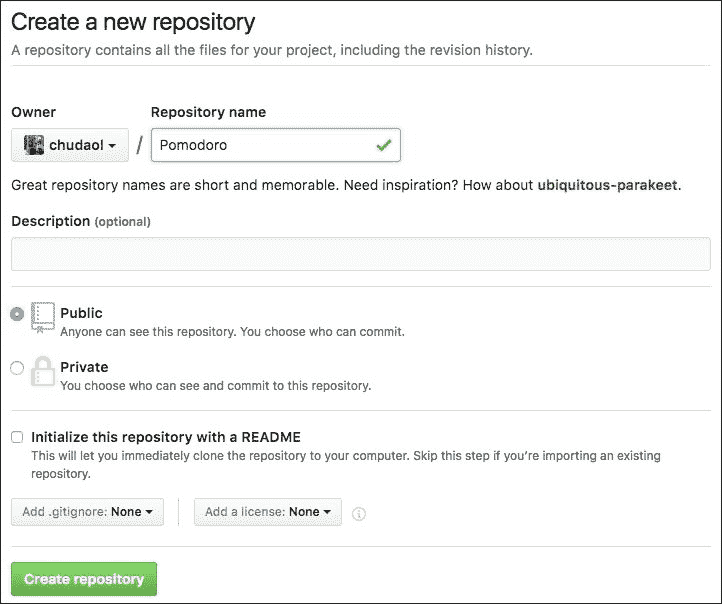
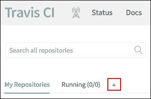
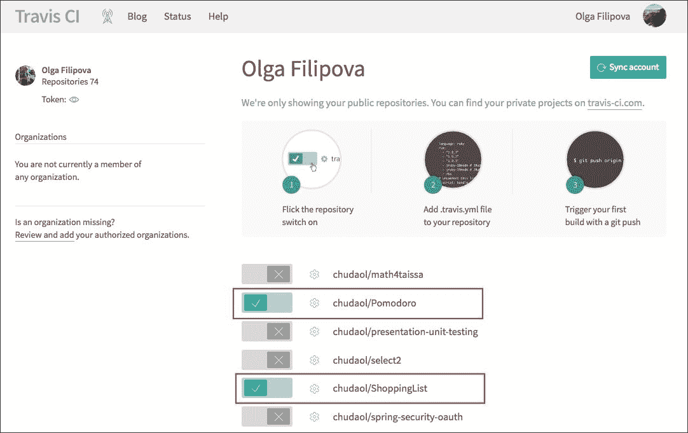
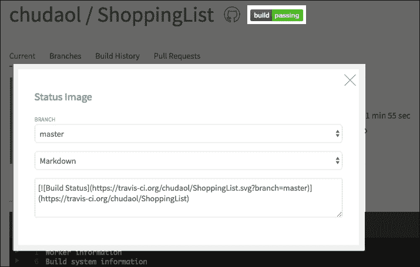
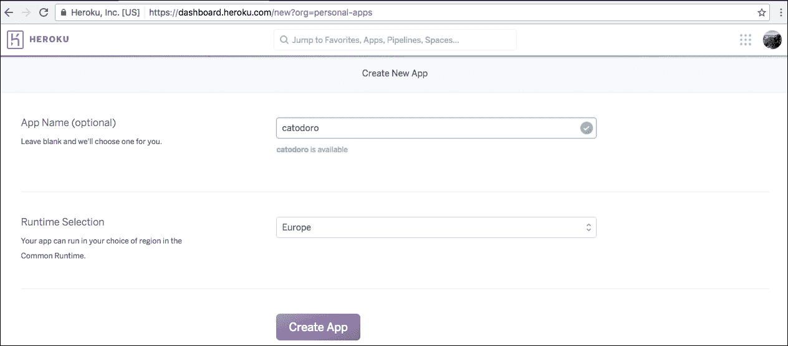
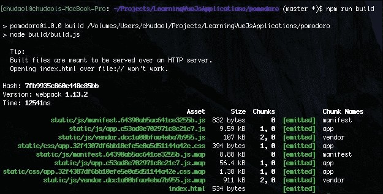
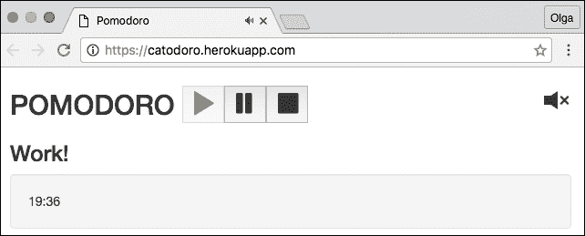

# 第八章：部署-时间上线！

在上一章中，您学会了如何测试您的 Vue 应用程序。我们应用了不同的测试技术进行测试。一开始，我们对 Vue 组件和与 Vuex 相关的模块（如 actions、mutations 和 getters）进行了经典的单元测试。之后，我们学会了如何使用 Nightwatch 应用端到端测试技术。

在本章中，我们将通过将应用程序部署到服务器并使其对世界可用来使我们的应用程序上线。我们还将保证我们的应用程序进行持续集成和持续部署。这意味着每当我们提交对应用程序所做的更改时，它们将自动进行测试和部署。

考虑到这一点，在本章中，我们将做以下事情：

+   使用 Travis 设置持续集成流程

+   使用 Heroku 设置持续部署

# 软件部署

在开始部署我们的应用程序之前，让我们首先尝试定义它实际上意味着什么：

> *“软件部署是使软件系统可供使用的所有活动。” - 维基百科：https://en.wikipedia.org/wiki/Software_deployment*

这个定义意味着在我们执行所有必要的活动之后，我们的软件将对公众可用。在我们的情况下，由于我们正在部署 Web 应用程序，这意味着将有一个公共 URL，任何人都可以在其浏览器中输入此 URL 并访问该应用程序。如何实现这一点？最简单的方法是向您的朋友提供您自己的 IP 地址并运行该应用程序。因此，在您的私人网络内的人将能够在其浏览器上访问该应用程序。因此，例如，运行番茄钟应用程序：

```js
**> cd <path to pomodoro> 
> npm run dev** 

```

然后检查你的 IP：

```js
**ifconfig**

```


使用 ifconfig 命令检查 IP 地址

然后与在同一私人网络上的朋友分享地址。在我的情况下，它将是`http://192.168.1.6:8080`。

然而，只有在你的网络内的朋友才能访问该应用程序，显然这样并不那么有趣。

您可以使用一些软件来创建一个公共可访问的地址，从而将您的计算机转变为一个托管提供者，例如**ngrok**（[`ngrok.com/`](https://ngrok.com/)）。运行该应用程序，然后运行以下命令：

```js
**ngrok http 8080** 

```

这将创建一个地址，可以从任何地方访问，就像一个常规网站：


使用 ngrok 为本地主机提供隧道

在我的情况下，它将是`http://5dcb8d46.ngrok.io`。我可以在我的社交网络上分享这个地址，每个人都可以访问并尝试 Pomodoro 应用程序！但是停下…我可以让我的笔记本电脑整夜开着，但我不能永远让它开着。一旦我关闭它，网络连接就会丢失，我的应用程序就无法访问了。而且，即使我可以让它永远开着，我也不喜欢这个网站地址。这是一堆字母和数字，我希望它有意义。

还有更强大的方法。例如，我可以在**AWS**（**亚马逊网络服务**）上购买一个虚拟实例，将我的应用程序复制到这个实例上，在 GoDaddy 等域名提供商购买一个域名，将该域名与购买的实例 IP 关联，并在那里运行应用程序，它将是可访问的，维护、备份和由亚马逊服务照料。令人惊讶，但…贵得要命。让我们在我们的应用程序达到相应规模和回报水平时考虑这个解决方案。

就目前而言，在这一章中，我们希望我们的部署解决方案是便宜的（便宜意味着免费）、强大和简单。这就是为什么我们将部署我们的应用程序到 Heroku，一个云应用平台。为了做到这一点，我们将首先将我们的应用程序托管在 GitHub 上。你还记得部署是使我们的应用程序准备好使用的东西吗？我认为一个应用程序在经过测试并且测试没有失败时才能使用。这就是为什么在实际部署之前，我们还将使用 Travis 来保证我们应用程序的质量。因此，我们部署应用程序的必要活动将是以下内容：

1.  为应用程序创建 GitHub 存储库，并将应用程序移入存储库。

1.  使用 Travis 进行持续集成。

1.  将应用程序连接到 Heroku，并设置和配置它们，以便 Heroku 运行它们并向世界公开它们。

在接下来的三个小节中，我将简要介绍 GitHub、Travis 和 Heroku。

## GitHub 是什么？

GitHub 是基于 Git 的项目的托管提供商。

它可以在小型个人规模上用于个人私人和公共项目。它也可以用于大型企业项目和所有与开发相关的活动，如代码审查，持续集成等等。

生活在开源软件世界的每个人都知道 GitHub。如果你正在阅读这本关于 Vue 的书，它托管在 GitHub 上（[`github.com/vuejs/`](https://github.com/vuejs/)），我相信你会跳过这一小节，所以我可能会在这里写一些愚蠢的笑话，而你永远不会注意到它们！开玩笑！

## Travis 是什么？

Travis 是 GitHub 的一个工具，它允许我们将 GitHub 项目连接到它，并确保它们的质量。它在您的项目中运行测试，并告诉您构建是否通过，或者警告您构建失败了。在[`travis-ci.org/`](https://travis-ci.org/)上了解更多关于 Travis 以及如何使用它。

## Heroku 是什么？

Heroku 是一个用于部署应用程序的云平台。它非常容易使用。您只需创建一个应用程序，给它一个好的有意义的名称，将其连接到您的 GitHub 项目，然后就完成了！每次您推送到特定分支（例如`master`分支），Heroku 将运行您提供的脚本作为应用程序的入口点脚本，并重新部署它。

它是高度可配置的，还提供了命令行界面，这样您就可以从本地命令行访问所有应用程序，而无需检查 Heroku 仪表板网站。让我们开始学习并亲自做一切。

# 将应用程序移动到 GitHub 存储库

让我们从为我们的应用程序创建 GitHub 存储库开始。

请使用[chapter8/pomodoro](https://github.com/PacktPublishing/Learning-Vue.js-2/tree/master/chapter8/pomodoro)和[chapter8/shopping-list](https://github.com/PacktPublishing/Learning-Vue.js-2/tree/master/chapter8/shopping-list)目录中的代码。

如果您还没有 GitHub 帐户，请创建一个。现在登录到您的 GitHub 帐户并创建两个存储库，`Pomodoro`和`ShoppingList`：



在 GitHub 上创建存储库

一旦你点击**`创建存储库`**按钮，会出现一个包含不同指令的页面。我们特别关注第二段，它说**`...或在命令行上创建一个新的存储库`**。复制它，粘贴到 Pomodoro 应用程序目录中的命令行中，删除第一行（因为我们已经有了 README 文件），并修改第三行以添加目录中的所有内容，然后点击*Enter*按钮：

```js
**git init**
**git add** 
**git commit -m "first commit"**
**git remote add origin https://github.com/chudaol/Pomodoro.git**
**git push -u origin master**

```

刷新你的 GitHub 项目页面，你会看到所有的代码都在那里！在我的情况下，它在[`github.com/chudaol/Pomodoro`](https://github.com/chudaol/Pomodoro)。

对于购物清单应用程序也是一样。我刚刚做了，现在在这里：[`github.com/chudaol/ShoppingList`](https://github.com/chudaol/ShoppingList)。

如果你不想创建自己的存储库，你可以直接 fork 我的。开源就是开放的！

# 使用 Travis 设置持续集成

为了能够使用 Travis 设置持续集成，首先你必须将你的 Travis 账户与你的 GitHub 账户连接起来。打开[`travis-ci.org/`](https://travis-ci.org/)，点击**`使用 GitHub 登录`**按钮：


点击使用 GitHub 登录按钮

现在你可以添加要由 Travis 跟踪的存储库。点击加号（**`+`**）：



点击加号添加你的 GitHub 项目

点击加号按钮后，你的 GitHub 项目的整个列表会出现。选择你想要跟踪的项目：



选择你想要用 Travis 跟踪的项目

现在我们的项目已经连接到 Travis 构建系统，它会监听对`master`分支的每次提交和推送，我们需要告诉它一些东西，一旦它检测到变化。所有 Travis 的配置都应该存储在`.travis.yml`文件中。将`.travis.yml`文件添加到这两个项目中。至少我们要告诉它应该使用哪个节点版本。检查你系统的 Node 版本（这是你完全确定可以与我们的项目一起工作的版本）。只需运行以下命令：

```js
**node --version** 

```

在我的情况下，它是`v5.11.0`。所以我会把它添加到`.travis.yml`文件中：

```js
//.travis.yml 
language: node_js 
node_js: 
  - "**5.11.0**" 

```

如果你现在提交并推送，你会发现 Travis 会自动开始运行测试。默认情况下，它会在项目上调用`npm test`命令。等待几分钟，观察结果。不幸的是，在执行端到端（Selenium）测试时会失败。为什么会发生这种情况呢？

默认情况下，Travis 构建和测试环境的虚拟镜像没有安装 Chrome 浏览器。而我们的 Selenium 测试正试图在 Chrome 浏览器上运行。但幸运的是，Travis 提供了在构建之前执行一些命令的机制。这应该在 YML 文件的`before_script`部分中完成。让我们调用必要的命令来安装 Chrome 并导出`CHROME_BIN`变量。将以下内容添加到你的`.travis.yml`文件中：

```js
before_script: 
  - export CHROME_BIN=/usr/bin/google-chrome 
  - sudo apt-get update 
  - sudo apt-get install -y libappindicator1 fonts-liberation 
  - wget https://dl.google.com/linux/direct/google-chrome-
    stable_current_amd64.deb 
  - sudo dpkg -i google-chrome*.deb 

```

如你所见，为了执行安装和系统更新，我们必须使用`sudo`来调用命令。默认情况下，Travis 不允许你执行`sudo`命令，以防止不可信任的脚本造成意外损害。但你可以明确告诉 Travis 你的脚本使用了`sudo`，这意味着你知道自己在做什么。只需将以下行添加到你的`.travis.yml`文件中：

```js
sudo: required 
dist: trusty  

```

现在你的整个`.travis.yml`文件应该如下所示：

```js
//.travis.yml 
language: node_js 
**sudo: required 
dist: trusty** 
node_js: 
  - "5.11.0" 

before_script: 
  - export CHROME_BIN=/usr/bin/google-chrome 
  - sudo apt-get update 
  - sudo apt-get install -y libappindicator1 fonts-liberation 
  - wget https://dl.google.com/linux/direct/google-chrome-
    stable_current_amd64.deb 
  - sudo dpkg -i google-chrome*.deb 

```

尝试提交并检查你的 Travis 仪表板。

哦，不！它又失败了。这次，似乎是超时问题：


即使安装了 Chrome，测试仍然会由于超时而悄悄失败

为什么会发生这种情况？让我们回想一下当我们运行端到端测试时实际发生了什么。每个测试都会打开浏览器，然后执行点击、输入和其他操作来测试我们的用户界面。最后一句话的关键词是*用户界面*。如果我们需要测试用户界面，我们需要一个**图形用户界面**（**GUI**）。Travis 虚拟镜像没有图形显示。因此，它们无法打开浏览器并在其中显示我们的用户界面。幸运的是，有一种叫做*Xvfb - X 虚拟帧缓冲*的好东西。

Xvfb 是一个显示服务器，实现了物理显示使用的协议。所有需要的图形操作都在内存中执行；因此，不需要物理显示。因此，我们可以运行一个 Xvfb 服务器，为我们的测试提供虚拟图形环境。如果您仔细阅读 Travis 文档，您会发现这正是它建议的运行需要 GUI 的测试的方法：[`docs.travis-ci.com/user/gui-and-headless-browsers/#Using-xvfb-to-Run-Tests-That-Require-a-GUI`](https://docs.travis-ci.com/user/gui-and-headless-browsers/#Using-xvfb-to-Run-Tests-That-Require-a-GUI)。因此，打开`.travis.yml`文件，并将以下内容添加到`before_script`部分：

```js
  - export DISPLAY=:99.0 
  - sh -e /etc/init.d/xvfb start 

```

整个 YML 文件现在看起来像下面这样：

```js
//.travis.yml 
language: node_js 
sudo: required 
dist: trusty 
node_js: 
  - "5.11.0" 

before_script: 
  - export CHROME_BIN=/usr/bin/google-chrome 
  - sudo apt-get update 
  - sudo apt-get install -y libappindicator1 fonts-liberation 
  - wget https://dl.google.com/linux/direct/google-chrome-
    stable_current_amd64.deb 
  - sudo dpkg -i google-chrome*.deb 
  - export DISPLAY=:99.0 
  - sh -e /etc/init.d/xvfb start 

```

提交并检查您的 Travis 仪表板。Pomodoro 应用程序已成功构建！


Pomodoro 应用程序构建成功！

然而，购物清单应用程序的构建失败了。请注意，Travis 甚至会为每个构建状态更改选项卡的标题颜色：


Travis 根据构建状态更改选项卡标题上的图标

购物清单应用程序的构建发生了什么？在端到端测试中有一步检查页面上是否存在**`Groceries`**标题。问题是，这个标题来自我们的后端服务器，应该使用`npm run server`命令运行。你还记得我们在第六章中实现它的吗，*插件-用自己的砖头建造你的房子*，使用了`vue-resource`插件？这意味着在构建应用程序之前，我们需要告诉 Travis 运行我们的小服务器。只需将以下行添加到购物清单应用程序的`.travis.yml`文件中：

```js
- nohup npm run server & 

```

提交您的更改并检查 Travis 仪表板。构建通过了！一切都是绿色的，我们很高兴（至少我是，我希望成功的构建也能让你开心）。现在，如果我们能告诉世界我们的构建是通过的，那就太好了。我们可以通过将 Travis 按钮添加到我们的`README.md`文件中来实现这一点。这将使我们能够立即在项目的 GitHub 页面上看到构建状态。

在应用程序的 Travis 页面上点击**`构建通过`**按钮，从第二个下拉列表中选择**`Markdown`**选项，并将生成的文本复制到`README.md`文件中：



点击通过构建按钮，从第二个下拉菜单中选择 Markdown 选项，并将文本复制到 README.md 文件中

看看它在我们项目的 GitHub 页面的 README 文件中是多么漂亮：


Travis 按钮在 GitHub 页面上的项目的 README 文件中看起来真的很漂亮

现在我们的应用程序在每次提交时都会被检查，因此我们可以确保它们的质量，最终将它们部署到公共可访问的地方。

在开始部署过程之前，请在 Heroku（[`signup.heroku.com/dc`](https://signup.heroku.com/dc)）创建一个帐户并安装 Heroku Toolbelt（[`devcenter.heroku.com/articles/getting-started-with-nodejs#set-up`](https://devcenter.heroku.com/articles/getting-started-with-nodejs#set-up)）。

现在我们准备部署我们的项目。

# 部署番茄应用程序

让我们从在 Heroku 账户中添加新应用开始。在 Heroku 仪表板上点击**`创建新应用`**按钮。你可以创建自己的名称，也可以将名称输入字段留空，Heroku 会为你创建一个名称。我会将我的应用称为*catodoro*，因为它是有猫的番茄！



使用 Heroku 创建一个新应用

点击**`创建应用`**按钮，然后选择一个部署流水线来部署你的应用。选择 GitHub 方法，然后从建议的 GitHub 项目下拉菜单中选择我们想要部署的项目：


选择 GitHub 部署方法，并从 GitHub 项目中选择相应的项目

点击**`连接`**按钮后，你可能想要检查的两件事是 **`从主分支启用自动部署`** 和 **`等待 CI 通过后再部署`** 选项：


勾选等待 CI 通过后再部署复选框，然后点击启用自动部署按钮

一切都准备好进行第一次部署，甚至可以单击**`Deploy Branch`**按钮，Heroku 将尝试执行构建，但是，如果您尝试在浏览器中打开应用程序，它将无法工作。如果您想知道原因，您应该始终查看执行此类操作时的运行日志。

## 检查日志

我希望您已经成功安装了 Heroku CLI（或 Heroku 工具包），现在您可以在命令行中运行`heroku`命令。让我们检查日志。在您的 shell 中运行`heroku logs`命令：

```js
**heroku logs --app catodoro --tail** 

```

当 Heroku 尝试执行构建时，您将看到一个持续运行的日志。错误是`npm ERR! missing script: start`。我们在`package.json`文件中没有`start`脚本。

这是完全正确的。为了创建一个启动脚本，让我们首先尝试了解如何为生产构建和运行 Vue 应用程序。README 文件告诉我们需要运行`npm run build`命令。让我们在本地运行它并检查发生了什么：



npm run build 命令的输出

因此，我们知道构建命令的结果会进入`dist`文件夹。我们还知道我们必须使用 HTTP 服务器从此文件夹中提供`index.html`文件。我们还知道我们必须在`package.json`文件的`scripts`部分中创建一个`start`脚本，以便 Heroku 知道如何运行我们的应用程序。

## 准备在 Heroku 上运行应用程序

通过检查日志文件，我们能够收集了大量信息。在继续部署应用程序的步骤之前，让我们在这里总结一下 Heroku 在运行应用程序之前的流程。

因此，Heroku 执行以下操作：

+   运行`npm install`脚本以安装所有所需的依赖项（它检查`package.json`文件的`dependencies`部分中的依赖项）

+   从`package.json`运行`npm start`脚本，并在已知的 web 地址上提供其结果

因此，根据这些信息和我们从日志和运行`npm build`脚本中收集到的信息，我们需要执行以下操作：

+   告诉 Heroku 安装所有所需的依赖项；为此，我们需要将项目依赖项从`package.json`文件的`devDependencies`部分移动到`dependencies`部分，以便 Heroku 安装它们

+   告诉 Heroku 在执行`npm install`后运行构建脚本；为此，我们需要在`package.json`文件中创建一个`postinstall`脚本，其中我们将调用`npm run build`命令。

+   创建一个`server.js`文件，从`dist`文件夹中提供`index.html`文件

+   提供 Heroku 运行`server.js`脚本的方法；为此，我们需要在`package.json`文件中创建一个`start`脚本来运行`server.js`脚本

首先，将`package.json`文件的`devDependencies`部分中除了与测试有关的依赖之外的所有依赖移动到`dependencies`部分中：

```js
"dependencies": { 
  "autoprefixer": "⁶.4.0", 
  "babel-core": "⁶.0.0", 
  "babel-eslint": "⁷.0.0", 
  "babel-loader": "⁶.0.0", 
  "babel-plugin-transform-runtime": "⁶.0.0", 
  "babel-polyfill": "⁶.16.0", 
  "babel-preset-es2015": "⁶.0.0", 
  "babel-preset-stage-2": "⁶.0.0", 
  "babel-register": "⁶.0.0", 
  "chalk": "¹.1.3", 
  "connect-history-api-fallback": "¹.1.0", 
  "cross-spawn": "⁴.0.2", 
  "css-loader": "⁰.25.0", 
  "es6-promise": "⁴.0.5", 
  "eslint": "³.7.1", 
  "eslint-config-standard": "⁶.1.0", 
  "eslint-friendly-formatter": "².0.5", 
  "eslint-loader": "¹.5.0", 
  "eslint-plugin-html": "¹.3.0", 
  "eslint-plugin-promise": "².0.1", 
  "eslint-plugin-standard": "².0.1", 
  "eventsource-polyfill": "⁰.9.6", 
  "express": "⁴.13.3", 
  "extract-text-webpack-plugin": "¹.0.1", 
  "file-loader": "⁰.9.0", 
  "function-bind": "¹.0.2", 
  "html-webpack-plugin": "².8.1", 
  "http-proxy-middleware": "⁰.17.2", 
  "inject-loader": "².0.1", 
  "isparta-loader": "².0.0", 
  "json-loader": "⁰.5.4", 
  "lolex": "¹.4.0", 
  "opn": "⁴.0.2", 
  "ora": "⁰.3.0", 
  "semver": "⁵.3.0", 
  "shelljs": "⁰.7.4", 
  "url-loader": "⁰.5.7", 
  "vue": "².0.1", 
  "vuex": "².0.0", 
  "vue-loader": "⁹.4.0", 
  "vue-style-loader": "¹.0.0", 
  "webpack": "¹.13.2", 
  "webpack-dev-middleware": "¹.8.3", 
  "webpack-hot-middleware": "².12.2", 
  "webpack-merge": "⁰.14.1" 
}, 
"devDependencies": { 
  "chai": "³.5.0", 
  "chromedriver": "².21.2", 
  "karma": "¹.3.0", 
  "karma-coverage": "¹.1.1", 
  "karma-mocha": "¹.2.0", 
  "karma-phantomjs-launcher": "¹.0.0", 
  "karma-sinon-chai": "¹.2.0", 
  "karma-sourcemap-loader": "⁰.3.7", 
  "karma-spec-reporter": "0.0.26", 
  "karma-webpack": "¹.7.0", 
  "mocha": "³.1.0", 
  "nightwatch": "⁰.9.8", 
  "phantomjs-prebuilt": "².1.3", 
  "selenium-server": "2.53.1", 
  "sinon": "¹.17.3", 
  "sinon-chai": "².8.0" 
} 

```

现在让我们创建一个`postinstall`脚本，在其中我们将告诉 Heroku 运行`npm run build`脚本。在`scripts`部分中，添加`postinstall`脚本：

```js
  "**scripts**": { 
    <...> 
    **"postinstall": "npm run build"** 
  }, 

```

现在让我们创建一个`server.js`文件，在其中我们将从`dist`目录中提供`index.html`文件。在项目文件夹中创建一个`server.js`文件，并添加以下内容：

```js
// server.js 
var express = require('express'); 
var serveStatic = require('serve-static'); 
var app = express(); 
app.use(serveStatic(__dirname + '/dist')); 
var port = process.env.PORT || 5000; 
app.listen(port); 
console.log('server started '+ port); 

```

好的，现在我们只需要在`package.json`文件的`scripts`部分创建一个`start`脚本，然后我们就完成了！我们的`start`脚本应该只运行`node server.js`，所以让我们来做吧：

```js
  "**scripts**": { 
    <...> 
    "postinstall": "npm run build", 
    **"start": "node server.js"** 
  }, 

```

提交您的更改，转到 Heroku 仪表板，然后点击**`Deploy Branch`**按钮。不要忘记检查运行日志！

哇哦！构建成功了！成功构建后，您被邀请点击**`View`**按钮；别害羞，点击它，您将看到您的应用程序在运行！



番茄钟应用程序已成功部署到 Heroku

现在您可以在任何地方使用您的番茄钟应用程序。现在您也可以邀请您的朋友使用它，只需提供 Heroku 链接即可。

恭喜！您刚刚部署了您的 Vue 应用程序，每个人都可以使用它。多么美好啊！

# 部署购物清单应用程序

为了部署我们的购物清单应用程序，我们需要执行与番茄钟应用程序完全相同的步骤。

在您的 Heroku 仪表板上创建一个新应用程序，并将其连接到您的 GitHub 购物清单项目。之后，从番茄钟应用程序中复制`server.js`文件，处理`package.json`文件中的依赖关系，并创建`postinstall`和`start`脚本。

然而，我们还有一步要做。不要忘记我们的后端服务器，为购物清单提供 REST API。我们也需要运行它。

或者更好的是，如果我们可以只运行一个服务器来完成所有工作，为什么我们需要运行两个服务器呢？我们可以通过为其提供路由路径来将我们的 JSON 服务器与我们的 express 服务器集成以提供购物清单端点，比如`api`。打开`server.js`文件，在那里导入`jsonServer`依赖项，并告诉 express 应用程序使用它。因此，你的`server.js`文件将如下所示：

```js
//server.js 
var express = require('express'); 
**var jsonServer = require('json-server');** 
var serveStatic = require('serve-static'); 
var app = express(); 

app.use(serveStatic(__dirname + '/dist')); 
**app.use('/api', jsonServer.router('server/db.json'));** 
var port = process.env.PORT || 5000; 
app.listen(port); 
console.log('server started '+ port); 

```

使用前一行，我们告诉我们的 express 应用程序使用`jsonServer`并在`/api/`端点上提供`db.json`文件。

我们还应该更改`Vue`资源中的端点地址。打开 API 文件夹中的`index.js`，并用`api`前缀替换`localhost:3000`：

```js
const ShoppingListsResource = Vue.resource('api/' + 'shoppinglists{/id}') 

```

我们还应该在`dev-server.js`中添加 JSON 服务器支持；否则，我们将无法以开发模式运行应用程序。因此，打开`build/dev-server.js`文件，导入`jsonServer`，并告诉 express 应用程序使用它：

```js
//dev-server.js 
var path = require('path') 
var express = require('express') 
**var jsonServer = require('json-server')** 
<...> 
// compilation error display 
app.use(hotMiddleware) 

**// use json server 
app.use('/api', jsonServer.router('server/db.json'));** 
<...> 

```

尝试以开发模式运行应用程序（`npm run dev`）。一切正常。

现在你也可以从`travis.yml`文件中删除运行服务器的命令（`- nohup npm run server &`）。你也可以从`package.json`中删除服务器脚本。

在本地运行测试并检查它们是否失败。

我们几乎完成了。让我们在本地尝试我们的应用程序。

## 尝试在本地使用 Heroku

有时候要让事情运行起来需要很多次尝试和失败的迭代。我们尝试一些东西，提交，推送，尝试部署，看看是否起作用。我们意识到我们忘记了一些东西，提交，推送，尝试部署，看错误日志。一遍又一遍地做。这可能会非常耗时，因为网络上的事情需要时间！幸运的是，Heroku CLI 提供了一种在本地运行应用程序的方法，就像它已经部署到 Heroku 服务器上一样。你只需要在构建应用程序后立即运行`heroku local web`命令：

```js
**npm run build 
heroku local web** 

```

试一下。

在浏览器中打开`http://localhost:5000`。是的，它起作用了！


使用 Heroku 本地 web 命令在本地运行应用程序。它起作用了！

现在让我们提交并推送更改。

现在你可以等待 Travis 成功构建并 Heroku 自动部署，或者你可以打开你的 Heroku 仪表板，点击**`Deploy Branch`**按钮。等一会儿。然后... 它起作用了！这是我们今天执行的两次部署的结果：

+   **番茄钟应用程序**：[`catodoro.herokuapp.com/`](https://catodoro.herokuapp.com/)

+   **购物清单应用程序**：[`shopping-list-vue.herokuapp.com/`](https://shopping-list-vue.herokuapp.com/)

各自的 GitHub 存储库可以在[`github.com/chudaol/Pomodoro`](https://github.com/chudaol/Pomodoro)和[`github.com/chudaol/ShoppingList`](https://github.com/chudaol/ShoppingList)找到。

分叉，玩耍，测试，部署。此刻，您拥有增强，改进并向全世界展示这些应用程序所需的所有工具。感谢您与我一起经历这激动人心的旅程！
