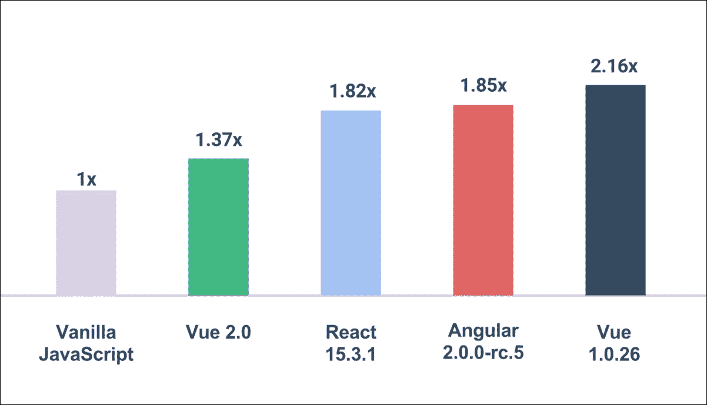
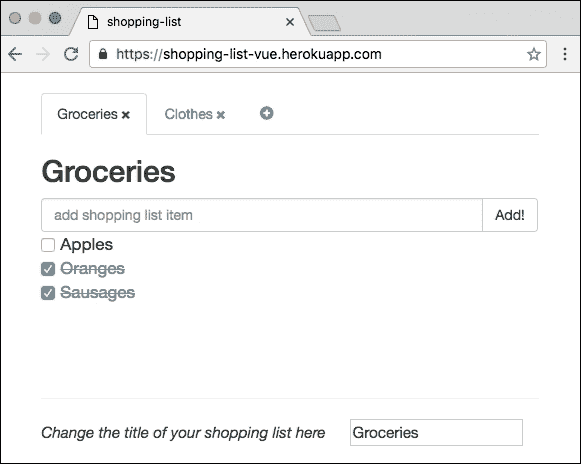
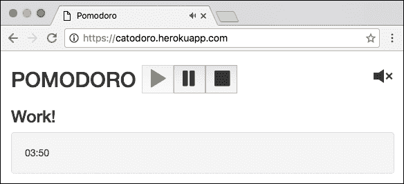
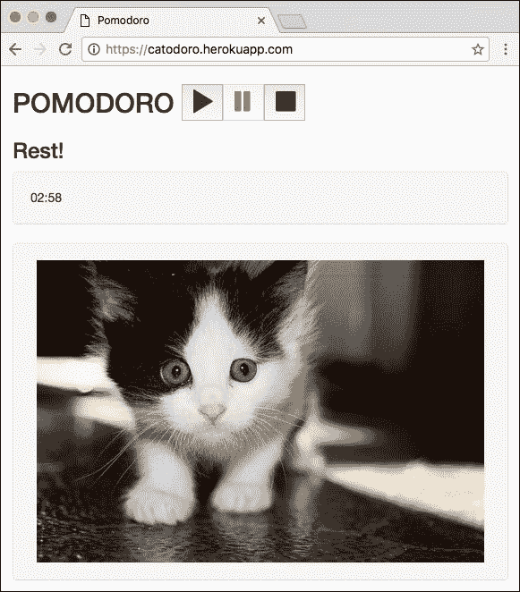
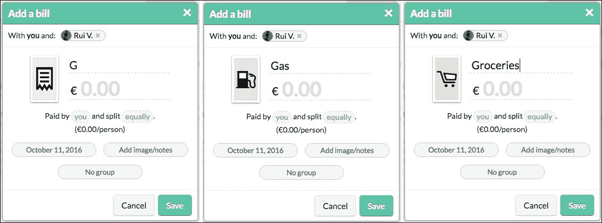
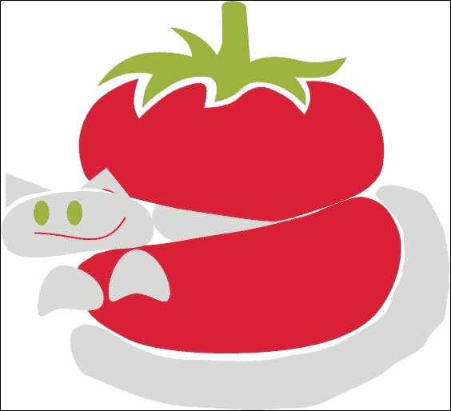

# 第九章：接下来是什么？

在上一章中，我们通过将应用程序部署到服务器并使其对外可用，使我们的应用程序上线。我们还保证了应用程序的持续集成和持续部署。这意味着每当我们提交对应用程序的更改时，它们将自动进行测试和部署。

看起来我们在这本书中的旅程已经结束了。但实际上，它才刚刚开始。尽管我们已经发现和学到了很多，但仍有很多工作要做！在本章中，我们将总结我们迄今为止学到的一切，看看我们还有什么需要学习，以及我们还可以做些什么来提升我们应用程序的酷炫程度。因此，在本章中，我们将做以下事情：

+   总结我们迄今为止学到的一切

+   列出后续事项

# 迄今为止的旅程

迄今为止，我们已经走过了一段很长的旅程，现在是时候总结我们所做的和所学到的。

在第一章*使用 Vue.js 去购物*中，我们与 Vue.js 有了第一次约会。我们谈论了 Vue.js 是什么，它是如何创建的，它的作用是什么，并看了一些基本示例。

在第二章*基础知识-安装和使用*中，我们深入了解了 Vue.js 的幕后情况。我们了解了 MVVM 架构模式，看到了 Vue.js 的工作原理，并接触了 Vue.js 的不同方面，如*组件*、*指令*、*插件*和应用程序*状态*。我们学习了安装 Vue.js 的不同方式，从使用简单的独立编译脚本开始，通过使用 CDN 版本、NPM 版本，然后使用 Vue.js 的开发版本，不仅可以使用它，还可以为其代码库做出贡献。我们学会了如何调试以及如何使用`Vue-cli`搭建 Vue.js 应用程序。我们甚至使用了符合 CSP 标准的 Vue 的简单 Chrome 应用程序。

在第三章*组件-理解和使用*中，我们深入了解了组件系统。我们学习了如何定义 Vue 组件，组件作用域的工作原理，以及组件之间的关系，我们开始在之前引导的应用程序中使用单文件组件。

在第四章中，*反应性-将数据绑定到您的应用程序*，我们深入研究了 Vue.js 的数据绑定和反应性。我们学习了如何使用指令、表达式和过滤器。我们将数据绑定引入了最初章节中开发的应用程序，并且由于 Vue.js 的反应性方式，使它们变得交互式。

在第五章中，*Vuex-管理您的应用程序中的状态*，我们学习了如何使用 Vuex 存储系统在 Vue 应用程序中管理全局状态。我们学习了如何使用状态、操作、获取器和突变来创建一个模块化和良好的应用程序结构，其中组件可以轻松地相互通信。我们将这些新知识应用到了我们在前几章中开发的应用程序中。

在第六章中，*插件-用自己的砖块建造你的房子*，我们学习了 Vue 插件如何与 Vue 应用程序合作。我们使用了现有的插件`vue-resource`，它帮助我们在浏览器刷新之间保存应用程序的状态。我们还为 Vue 应用程序创建了自己的插件，用于生成白噪声、棕噪声和粉红噪声。在这一点上，我们拥有了功能齐全的应用程序，具有相当不错的一套工作功能。

在第七章中，*测试-是时候测试我们到目前为止所做的了！*，我们学习了如何测试我们的 Vue 应用程序。我们学习了如何编写单元测试，以及如何使用 Selenium 驱动程序创建和运行端到端测试。我们了解了代码覆盖率以及如何在单元测试中伪造服务器响应。我们几乎用单元测试覆盖了我们的代码的 100％，并且我们看到 Selenium 驱动程序在运行端到端测试时的效果。

在第八章，“部署-上线时间！”中，我们最终将我们的应用程序暴露给了整个世界。我们将它们部署到 Heroku 云系统，现在它们可以从互联网存在的任何地方访问。更重要的是，我们使我们的部署过程完全自动化。每当我们将代码更改推送到`master`分支时，应用程序就会被部署！甚至更多。它们不仅在每次推送时部署，而且还会自动使用 Travis 持续集成系统进行测试。

因此，在这本书中，我们不仅学习了一个新的框架。我们运用我们的知识从头开始开发了两个简单但不错的应用程序。我们应用了最重要的 Vue 概念，使我们的应用程序具有响应性、快速、可维护和可测试。然而，这并不是结束。在写作本书期间，Vue 2.0 已经发布。它带来了一些新的可能性和一些新的东西需要学习和使用。

# Vue 2.0

Vue 2.0 于 2016 年 9 月 30 日发布。查看 Evan You 在[`medium.com/the-vue-point/vue-2-0-is-here-ef1f26acf4b8#.ifpgtjlek`](https://medium.com/the-vue-point/vue-2-0-is-here-ef1f26acf4b8#.ifpgtjlek)的帖子。

在整本书中，我们使用了最新版本；然而，每当有必要时，我都试图参考 Vue 第一代的做法。实际上，API 几乎是相同的；有一些轻微的变化，一些已弃用的属性，但提供给最终用户的整个界面几乎没有改变。

然而，它几乎是从头开始重写的！当然，有一些代码部分几乎 100%被重用，但总体上，这是一个重大的重构，一些概念完全改变了。例如，渲染层被完全重写。如果早些时候，渲染引擎使用的是真实的 DOM，现在它使用了轻量级的虚拟 DOM 结构（[`github.com/snabbdom/snabbdom`](https://github.com/snabbdom/snabbdom)）。它的性能超群！查看以下的基准图表：



性能基准（数值越低越好）取自 https://medium.com/the-vue-point/vue-2-0-is-here-ef1f26acf4b8#.fjxegtv98

在这个新版本中还有另一个有趣的地方。如果你已经使用过第一代 Vue，并阅读过它并听过播客，你可能知道 Vue 和 React 之间的一个主要区别是 React Native（这个框架允许我们基于 React 构建原生应用程序）。Evan You 一直声称 Vue 只是一个用于 web 界面的微小层。现在，我们有新兴的**Weex**，一个将受 Vue 启发的组件渲染成原生应用程序的框架（[`github.com/alibaba/weex`](https://github.com/alibaba/weex)）。根据 Evan You 的说法，很快，“受 Vue 启发”的将变成“由 Vue 驱动”的！敬请期待。请继续关注。我想推荐这个令人惊叹的 Full Stack Radio 播客，Evan You 在其中谈到了 Vue 的新版本：[`www.fullstackradio.com/50`](http://www.fullstackradio.com/50)。

> *Vue 自其作为一个副产品的谦卑开始以来已经发展了很多。今天它是由社区资助的，在现实世界中被广泛采用，并且根据 stats.js.org 的统计数据，它在所有 JavaScript 库中拥有最强劲的增长趋势之一。我们相信 2.0 版本将进一步推动它。这是自 Vue 诞生以来最大的更新，我们很期待看到你用它构建的东西。- *Evan You*，https://medium.com/the-vue-point/vue-2-0-is-here-ef1f26acf4b8#.fjxegtv98)*

考虑到这一点，如果你来自 Vue 1.0 时代，升级你的应用程序将不会很困难。查看迁移指南，[`vuejs.org/guide/migration.html`](http://vuejs.org/guide/migration.html)，安装迁移助手，[`github.com/vuejs/vue-migration-helper`](https://github.com/vuejs/vue-migration-helper)，应用所有必要的更改，然后看看你的应用程序在那之后的表现如何。

# 重新审视我们的应用程序

让我们再次检查我们到目前为止做了什么。我们已经使用 Vue.js 开发了两个应用程序。让我们重新审视它们。

## 购物清单应用程序

我们在本书章节中开发的购物清单应用程序是一个允许以下操作的 web 应用程序：

+   创建不同的购物清单

+   向购物清单添加新项目并在购买后进行检查

+   重命名购物清单并删除它们

我们的购物清单应用程序驻留在 Heroku 云平台上：[`shopping-list-vue.herokuapp.com/`](https://shopping-list-vue.herokuapp.com/)。

它的代码托管在 GitHub 上：[`github.com/chudaol/ShoppingList`](https://github.com/chudaol/ShoppingList)。

它与 Travis 持续集成：[`travis-ci.org/chudaol/ShoppingList`](https://travis-ci.org/chudaol/ShoppingList)。

它的界面简单易懂：



使用 Vue.js 开发的购物清单应用程序的界面

它仍然远非你每次去购物都会使用的东西，不是吗？

## 番茄钟应用程序

我们在本书中开发的番茄钟应用程序是一个 Web 应用程序，它在工作的番茄钟期间实现了白噪音和间隔时间显示美丽的猫的计时器。它允许以下操作：

+   启动、暂停和停止应用程序

+   在工作时听白噪音，有助于集中注意力的噪音

+   静音和取消静音白噪音声音

+   在空闲时间盯着小猫

我们的番茄钟应用程序也托管在 Heroku 云平台上：[`catodoro.herokuapp.com/`](https://catodoro.herokuapp.com/)。

它的代码也托管在 GitHub 上：[`github.com/chudaol/Pomodoro`](https://github.com/chudaol/Pomodoro)。

它还是在每次推送时使用 Travis 持续集成平台进行构建和测试：[`travis-ci.org/chudaol/Pomodoro`](https://travis-ci.org/chudaol/Pomodoro)。

它的界面清晰易用。以下是它在 20 分钟工作的番茄钟间隔时间显示的内容：



工作中的番茄钟应用程序

当 5 分钟休息时间到来时，会出现以下内容：



间隔时间的番茄钟应用程序

它实际上相当可用，但仍然远非完美。

# 为什么这只是个开始？

在前一节中，我们总结了本书中开发的应用程序的功能。我们也同意（希望）它们仍然远非完美。远非完美的东西是我们想要改进的东西，因此它们给我们带来挑战和目的。实际上还有很多工作要做。我们的应用程序很好，但它们缺乏功能、风格、身份、UX 模式、扩展到其他平台等等。让我们看看我们还能做什么。

## 为我们的应用程序添加功能

我们的应用程序已经具有一些非常好的功能，但它们可以拥有更多。它们可以更具配置性。它们可以更加灵活。它们可以更加友好的 UI/UX。让我们逐个查看它们，并列出可以添加的功能列表。这将是你的家庭作业。

### 购物清单应用

在浏览器中打开我们的购物清单应用程序并查看它。您可以向其中添加清单和项目。您可以删除项目和清单。但是每个打开应用程序的人都可以做同样的事情。这意味着我们必须为每个人提供自己的购物清单应用程序的方式，这只有通过身份验证机制才可能。

还有一些用户体验问题。如果我们可以内联更改购物清单的名称，为什么要在页脚的输入字段中更改它呢？实际上，当我们学习如何在 Vue 应用程序中实现数据绑定时，购物清单名称编辑在输入字段中是我们实现的第一件事情。所以，当时是有道理的，但现在它可以并且应该得到改进。

另一件事与已删除的项目有关。没有清除它们的方法。如果我们有一个很长的项目列表，即使我们删除它们，除非我们删除整个购物清单，否则它们将永远存在。应该有一种方法来清除清单上已选项目的方式。

我们可以应用的另一个美观变化与样式有关。不同的清单可能有不同的背景颜色，不同的字体颜色，甚至可能有不同的字体样式和大小。因此，以下是购物清单应用的改进列表：

+   实现身份验证机制

+   实现内联名称编辑

+   实现清除已选项目

+   实现配置不同购物清单样式的机制，如背景颜色、文字颜色、字体大小和样式

您还可以为项目实现类别，并为每个类别添加图标。作为灵感，您可以查看 Splitwise 应用程序[`www.splitwise.com/`](https://www.splitwise.com/)。当您开始添加项目时，项目的图标是通用的。一旦您输入了有意义的内容，图标就会更改，如下面的屏幕截图所示：



Splitwise 应用程序的屏幕截图可以为图标类别提供灵感：它会根据您在输入字段中输入的内容进行调整

尝试为我们的购物清单应用程序实现这种分类。这将是一个非常好的和强大的奖励！

### 番茄钟应用程序

在浏览器中打开我们的番茄钟应用程序并尝试使用它。这很好，毫无疑问。它简单易用。但是，一些额外的配置可能会为其带来一些额外的功能。例如，为什么我要工作 20 分钟？也许我想要 15 分钟的工作番茄钟。或者我想要更长的工作番茄钟，比如 25 或 30 分钟。它肯定应该是可配置的。

让我们仔细检查维基百科上的番茄钟技术描述，看看我们是否漏掉了什么：[`en.wikipedia.org/wiki/Pomodoro_Technique`](https://en.wikipedia.org/wiki/Pomodoro_Technique)。

我很确定我们是。检查一下基本原则：

| “四个番茄钟后，休息更长时间（15-30 分钟），将您的勾号计数重置为零，然后转到步骤 1。” |
| --- |
| --*https://en.wikipedia.org/wiki/Pomodoro_Technique* |

啊哈！四个番茄钟后应该发生一些事情。更长的间隔，更多时间盯着猫（或者做任何你想做的事情）。嗯，也许能够配置这段时间会很好！

还有一件重要的事情。和任何人一样，努力工作后，我想看到一些进展。如果我们的番茄钟应用程序能够显示一些关于我们能够集中精力和工作的时间的统计数据，这不是很好吗？为此，我们可以收集一些统计数据，并在我们的番茄钟计时器中显示它们。

另外，将这些统计数据存储起来并能够在一段时间内进行可视化，比如一周、一个月、一年，这会很好吧？这就导致我们需要实现一个存储机制。这个存储应该为每个用户存储统计数据，因此，也需要一个身份验证机制。

让我们想想我们美丽的白色、棕色和粉色噪音。目前，我们只播放在我们的`App.vue`中硬编码的棕色噪音：

```js
<template>
 <div id="app" class="container" **v-noise="'brown'"**>
 </div>
</template> 

```

我们不应该能够在噪音之间切换并选择我们最喜欢的吗？因此，我们已经确定了要添加到应用程序配置中的另一项内容。现在就够了；让我们把这些都列在清单上：

+   实现身份验证机制

+   实现一个存储机制——它应该收集有关工作时间的统计数据，并将它们存储在某种持久层中

+   实现统计数据显示机制——它应该获取存储的统计数据并以一种漂亮干净的方式显示出来（例如，图表）

+   为番茄钟应用程序添加配置机制。这个配置应该允许以下操作：

+   配置番茄钟工作时间

+   配置休息间隔时间

+   在可配置的工作番茄数量之后配置一个长的休息时间（默认为 4 个）

+   配置工作间隔期间播放的首选噪音

正如你所看到的，你还有一些工作要做。好在你已经有一个可用的番茄钟计时器应用程序，可以在改进时使用！

## 美化我们的应用程序

目前两个应用程序都相当灰暗。只有番茄钟计时器应用程序在屏幕上出现猫时才会变得多彩一点。为它们添加一些设计会很好。让它们变得独特，赋予它们自己的特色；你为它们努力工作了这么久，显然它们值得一些漂亮的衣服。让我们想想我们可以用样式做些什么。

### 标志

从标志开始。一个好的标志定义了你的产品并使其独特。至少我可以帮你设计番茄钟应用程序的标志的想法。我有一个叫 Carina 的非常好的朋友为我设计了一个番茄，我尽力在上面加了一只小猫。看看吧。你可以直接使用它，或者只是作为发展你自己想法的参考。实际上，你的想象力没有极限！



番茄钟应用程序的标志的想法

为购物清单应用程序想一个漂亮的标志。它可以是什么？一只装杂货的袋子？一个复选框？只是首字母——SL？同样，没有限制。我希望在存储库的分支中看到你漂亮的标志。等不及了！

### 标识和设计

我们的应用程序确实需要一些独特的设计。使用一些 UX 技术为它们开发一个漂亮的标识指南。考虑颜色、字体以及页面上元素应该如何组合，以便为我们的用户提供独特的用户友好体验。

### 动画和过渡

动画和过渡是为应用程序带来生机的强大机制。然而，它们不能被滥用。考虑它们何时何地是有意义的。例如，悬停在购物清单标题上可能会导致一些突出显示，购物清单项目在被选中时可以进行一些微小的弹跳，更改购物清单标题的过程也可以以某种方式突出显示，等等。番茄钟应用程序可以在每个状态转换时更改其背景颜色。它还可以意识到一天中的时间并相应地着色背景。机会数不胜数。发挥你的创造力，利用 Vue 的力量实现你的想法。

## 将我们的应用程序扩展到其他设备

我们的两个应用程序都是 Web 应用程序。对于番茄钟应用程序来说，如果我们整天都在电脑上工作并使用 Web，这可能没问题，但对于购物清单应用程序来说可能有点不舒服。你去购物时不会带着笔记本电脑。当然，你可以在家里填写购物清单，然后在超市打开手机浏览器，但这可能会很慢，使用起来也不太好。使用 Weex（[`github.com/alibaba/weex`](https://github.com/alibaba/weex)）将我们的 Web 应用程序带到移动设备上。这两个应用程序也可以扩展为 Google Chrome 应用程序，就像我们在第二章中学到的那样，*基础知识-安装和使用*。将你的工作扩展到每一个设备上。我期待着检查你的工作。

# 总结

这是本书的最后一章。老实说，我对此感到有点难过。我和你在一起的时间真的很愉快。我知道我不认识你，但我觉得我认识你。我和你交谈，有时我觉得你也在和我交谈。到目前为止开发的一切，我不能说都是我开发的；我觉得我们一直在一起工作。

实际上，这是一种非常有趣的感觉，因为当你阅读这本书时（对我来说，这是未来），我同时处于现在和未来。而你现在处于你的现在，同时又在过去和我交谈。我喜欢书籍和技术建立的联系方式，不仅在人与人之间建立联系，还在不同的时间间隔之间建立联系。这太神奇了。

我真的希望你能像我一样成为 Vue.js 的粉丝。

我真的希望你能至少改进我们迄今为止开发的一个应用程序，并向我展示。如果你需要帮助，我会很乐意帮助你。不要犹豫给我发邮件`chudaol@gmail.com`。

谢谢你一直陪伴着我，希望很快能在下一本书中见到你！
