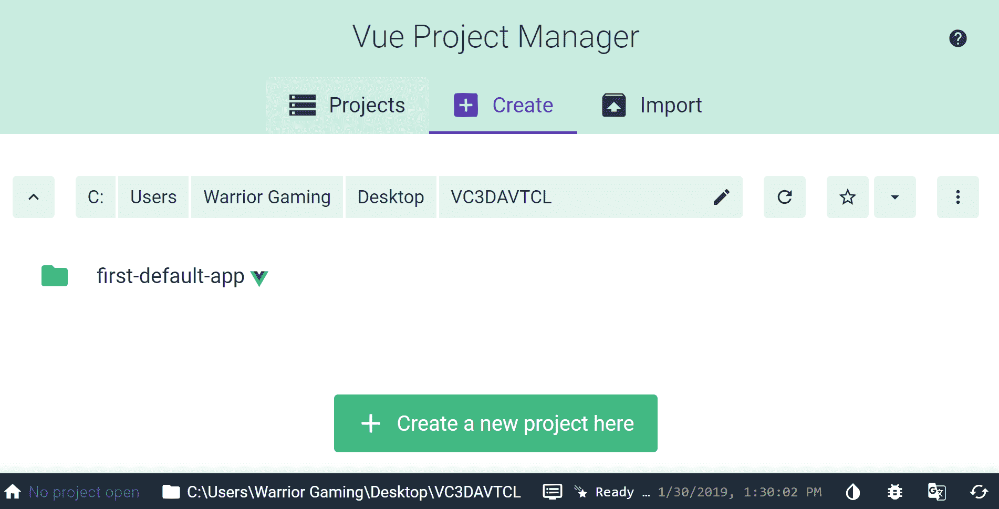
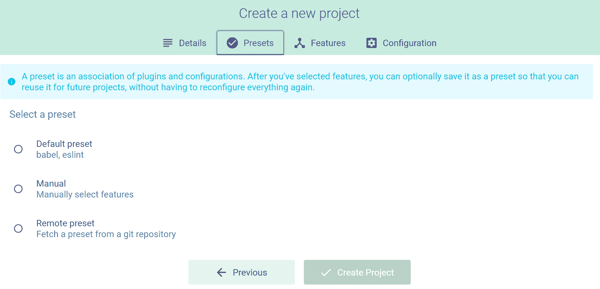
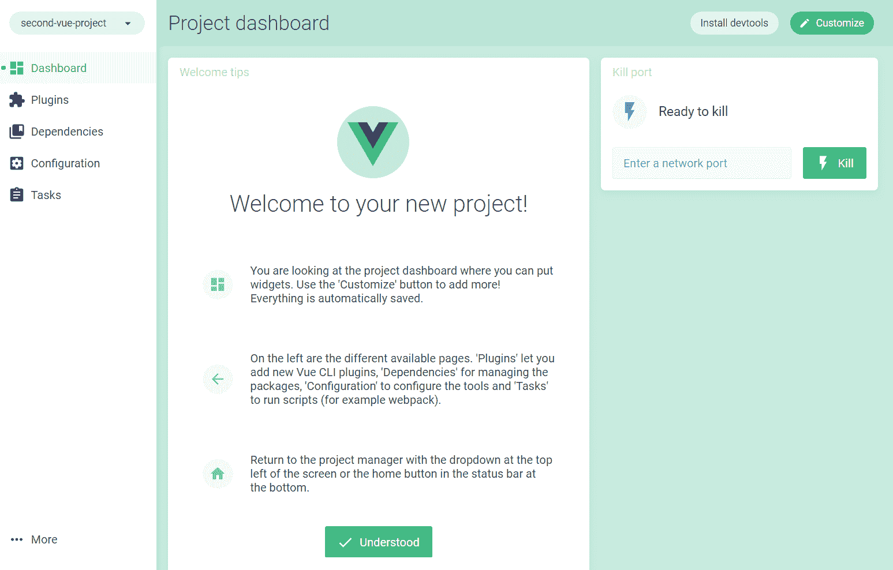

# 第一章：介绍 Vue CLI 3

本书介绍了**Vue CLI 3**，并回答了诸如如何使用它，为什么使用它，最佳实践以及您将从中获得什么等问题。

在本章中，我们将看看如何在我们的系统上设置 Vue CLI 3。我们将首先检查 Vue CLI 3 是否已经可用，然后我们将看到如果我们需要进行全新安装或从先前版本进行更新的确切步骤。

然后我们将看看如何安装**Node 版本管理器**（**NVM**），以及为什么这比简单安装 Node 更好。我们将看到在 VS Code 中如何轻松开始使用 Vue CLI 3，以及如何通过使用命令行来集成所有这些工具。

我们还将讨论为什么使用 Vue CLI 3 非常好，并且我们将通过从命令行和使用内置的 Vue CLI 3 UI 功能来运行默认的 Vue CLI 3 应用程序来实践这一点。

我们将在本章中涵盖以下主题：

+   在您的系统上设置 Vue CLI 3

+   安装 Vue CLI 3

+   安装 VS Code

+   使用无配置的 Vue CLI

+   使用 Vue CLI 3 的好处

+   通过默认工具链避免 JavaScript 疲劳

我们将从设置 Vue CLI 3 开始本章。

# 技术要求

我们只需要一些技术要求；它们如下：

+   Windows 安装（Windows 7 或更高版本）

+   为 Windows 安装 NVM（安装的具体步骤在本章中描述）

+   安装 VS Code（代码编辑器）

让我们开始在我们的系统上设置 Vue CLI 3。

# 在我们的系统上设置 Vue CLI 3

使用 Vue CLI 3 的常见方式是通过一个名为**命令行界面**（**CLI**）的命令行应用程序，在那里我们运行我们的 Vue CLI 3 命令。另一个先决条件是在我们的计算机上安装 Node.js。

如果您在共享计算机上工作，比如在您的开发团队中，很有可能您已经具备了所有的先决条件。在这种情况下，您可以通过运行一些检查来验证您是否可以立即开始使用 Vue CLI 3。

# Vue CLI 3 已经可用吗？

要快速检查您是否可以立即运行 Vue CLI 3 并跳过所有安装步骤，请在命令行应用程序中运行以下命令：

```js
node --version
```

还可以使用此命令检查 Vue CLI 3：

```js
vue -V
```

如果您得到任何高于 8.9 的 Node 版本（理想情况下，高于 8.11.0），您就可以开始了。显然，对于 Vue CLI，您希望得到任何高于 3.0.0 的版本。

此外，如果您的 Vue CLI 版本低于 V3，或者您想更新到最新的 Vue CLI，例如 3.3.0，只需运行此命令：

```js
npm install @vue/cli
```

如果您没有安装 Node.js 或 Vue CLI 怎么办？

我们将使用`nvm`或`nvm-windows`来安装 Node，然后安装 Vue CLI 3。

# 使用 Node 版本管理器安装 Node.js

我们应该使用推荐的 Node.js 版本是多少？此信息可在以下链接找到：[`cli.vuejs.org/guide/installation.html`](https://cli.vuejs.org/guide/installation.html)。

目前，截至 2019 年初，要在 Vue CLI 中获得最佳结果，所需的 Node 的最低版本是 8.11.0+，但如果确实需要，您也可以使用 8.9。

这带我们来到另一个重要的决定：安装 NVM。

# 为什么要安装 NVM？

虽然不绝对需要安装 NVM 才能在系统上运行 Vue CLI 3，但出于几个原因，安装 NVM 是可取的。

首先，您永远不知道 Node 何时会推荐更新以修复安全问题，这通常意味着最好在您的计算机上安装更新。

其次，如果您需要运行除 Vue 之外的其他技术，这些其他技术可能还需要不同版本的 Node。要在系统上轻松切换这些所需的 Node 安装，您可以简单地安装 NVM。

# 在 Windows 上安装 NVM

您可以从此地址下载 Windows 的 NVM：

```js
https://github.com/coreybutler/nvm-windows/releases
```

找到`nvm-setup.zip`文件，下载并从中提取`nvm-setup.exe`，然后按照以下安装步骤进行安装：

1.  按下 Windows + *R*打开运行提示。在提示符中键入`cmd`。

1.  在提示符内部，按下*Ctrl* + *Shift* + *Enter*。这将以管理员权限运行命令提示符，这是下一步所需的。

1.  访问[`nodejs.org`](https://nodejs.org)，查看当前的**长期支持**（**LTS**）版本号。例如，目前在 64 位 Windows 上，LTS 版本是 10.15.1。

1.  要安装它，请在具有管理员权限的命令提示符中运行以下命令：

```js
nvm install 10.15.1
```

1.  命令提示符将记录以下消息：

```js
Downloading node.js version 10.15.1 (64-bit) ...
```

1.  下载完成后，我们可以使用下载的 Node 版本。我们用以下命令来做：

```js
nvm use 10.15.1
```

1.  最后，您可以通过运行以下命令来验证安装是否成功：

```js
node --version
```

1.  如果您想了解与您的 Node 安装一起提供的`npm`的版本，只需运行以下命令：

```js
npm --version
```

接下来，我们将安装 Vue CLI 3。

# 安装 Vue CLI 3

我们可以使用`npm`或`yarn`来安装 Vue CLI 3。由于`npm`与 Node.js 安装捆绑在一起，我们将使用`npm`：

```js
npm install -g @vue/cli --loglevel verbose
```

上述命令会全局安装 Vue CLI 3。这就是`-g`标志的作用。`@vue/cli`的语法是我们在 Vue CLI 3 中使用的，`--loglevel verbose`将记录我们安装的细节，这非常有用，特别是在较慢的连接和较慢的机器上，有时我们可能会开始怀疑我们的控制台是否冻结。使用`--loglevel verbose`，就会更清晰，这总是好的。

完成后，让我们通过运行此命令来双重检查安装的 Vue CLI 版本：

```js
vue --version
```

以下是一些其他有用的命令，您应该在控制台中尝试：

```js
vue -h
```

请注意，`vue -h`是`vue --help`的别名。我使用前者是因为它更容易输入。

还要注意，您可以在每个单独的`vue`命令上运行`-h`标志，例如：

```js
vue create -h
vue add -h
vue invoke -h
vue inspect -h
vue serve -h
vue build -h
vue ui -h
vue init -h
vue config -h
vue upgrade -h
vue info -h
```

运行任何上述命令将返回特定命令的用法说明，描述其功能以及要附加到每个单独命令的选项（标志）。显然，`-h`标志是探索 Vue CLI 功能的好方法，并且在需要时即时刷新您的记忆。

接下来，我们将安装我们选择的代码编辑器 VS Code。

# 安装 VS Code

要安装 VS Code，只需转到[`code.visualstudio.com`](https://code.visualstudio.com)，然后下载适合您操作系统的版本。

如果您不确定自己使用的是 32 位还是 64 位计算机，您可以通过在命令提示符（具有管理员权限）中运行以下命令来快速检查 Windows 上的情况：

`wmic os get osarchitecture`

输出将是`OSArchitecture`，在下一行，要么是`32 位`，要么是`64 位`。

一旦 VS Code 被下载，只需运行下载的安装文件并按照安装说明进行安装。

安装完 VS Code 后，您将在命令行中获得一个额外的命令，`code`。

`code`命令非常有用，我们将在下一节中看到。

# 在没有配置的情况下使用 Vue CLI

在本节中，我们将看到使用 Vue CLI 的最快最简单的方法。它完全不需要任何配置！使用 Vue CLI 无需配置的原因是为了进行一些快速实验，而不必回答关于项目配置的提示，这是 Vue CLI 在运行包含配置步骤的项目时通常会询问的（这是使用 Vue CLI 构建应用程序的默认方法）。

首先，按住*Shift*键，在桌面的空白区域右键单击。从弹出的上下文菜单中，单击“在此处打开命令窗口”命令。

打开后，输入以下命令：

```js
mkdir noConfig
```

这将创建一个名为`noConfig`的新目录。接下来，让我们使用`cd`命令切换到该目录：

```js
cd noConfig
```

最后，使用以下命令从命令提示符启动 VS Code：

```js
code .
```

前面命令中的点表示在当前文件夹中打开 VS Code。可以关闭欢迎标签页。

接下来，使用*Alt* + *F*键盘快捷键打开文件菜单，并按下*N*键打开一个全新的文件。

在新文件中，打开标签页，输入以下代码：

```js
<template>
  <h1>What's up, Vue CLI 3?</h1>
  <hr>
</template>
```

接下来，按下*Ctrl* + *S*键盘快捷键，将文件保存为`App.vue`。

VS Code 将保存文件。它将给出一个新的图标，Vue 标志图标，这是一个视觉提示，刚刚保存的文件确实是一个 Vue 文件。

VS Code 也可能提示您安装一个名为`Vetur`的扩展，具体提示如下：

```js
The 'Vetur' extension is recommended for this file type.
```

通过单击弹出窗口底部的安装按钮来安装扩展。

请注意，安装`Vetur`扩展与使用没有配置的 Vue CLI 3 无关，但与我们在 VS Code 中使用 Vue 时更加高效有关。

现在我们可以通过运行`vue serve`来为我们的 Vue 应用程序提供服务。但是，在实际运行命令之前，让我们使用`-h`标志来查看我们有哪些可用选项：

```js
vue serve -h
```

这就是我们将得到的内容：

```js
Usage: serve [options] [entry]

serve a .js or .vue file in development mode with zero config

Options:
 -o, --open Open browser
 -c, --copy Copy local url to clipboard
 -h, --help Output usage information
```

现在我们知道可以期待什么，让我们使用以下命令为我们的 Vue 应用程序提供服务：

```js
vue serve -o -c
```

因此，正如之前提到的，这个命令将为我们的 Vue 应用程序提供服务，并在浏览器中打开它。它还将复制提供的 URL 到剪贴板。这使我们可以，例如，打开一个不同的非默认浏览器，并轻松地粘贴 URL 到浏览器的地址栏中，这样我们也可以在那里预览我们的应用程序。

然而，我们将遇到一个小问题。

我们将在命令中得到这个通知，而不是我们的 Vue 应用程序被提供服务：

```js
Command vue serve requires a global addon to be installed.
Please run npm install -g @vue/cli-service-global and try again.
```

这是一个简单的修复。更好的是，我们将使用`--loglevel verbose`扩展前面的命令：

```js
npm install -g @vue/cli-service-global --loglevel verbose
```

一段时间后，根据你的下载速度，你会收到`npm info ok`的消息。

这意味着你现在可以再次运行`vue serve`命令：

```js
vue serve -o -c
```

这次它成功了！有点...

现在我们收到一个错误，上面写着`编译失败，有 1 个错误`。然后，更进一步地，我们看到了根本原因：

```js
Component template should contain exactly one root element.
```

有几种方法可以解决这个问题，但它基本上是说我们可以将我们的`h1`和`hr`标签包裹在一个`div`标签中，然后我们就可以了。所以，让我们在 VS Code 中更新`App.vue`文件为这样：

```js
<template>
  <div>
    <h1>What's up, Vue CLI 3?</h1>
    <hr>
  </div>
</template>
```

确保保存你的更改，现在，最后，让我们再次提供服务：

```js
vue serve -o -c
```

你可能会有点惊讶，因为一个新的标签页会自动打开，加载应用程序，显示在你的默认浏览器中。

假设你的默认浏览器是 Chrome。让我们打开另一个浏览器（例如 Firefox），点击管理栏内部，并按下*Ctrl* + *V*快捷键粘贴剪贴板的内容。当然，它将是`http://localhost:8080/`。

通过使用`-o`和`-c`标志，我们以非常简单的方式执行了打开应用程序并复制其 URL 的重复任务只是冰山一角。Vue CLI 3 还有更多功能，可以帮助我们更快更轻松地编写我们的应用程序。

例如，让我们回到我们的代码，删除带有`hr`标签的行，然后保存文件。看看你的浏览器标签，打开我们的 Vue 应用程序的标签。它将自动刷新，反映代码的更改。这就是 webpack 在 Vue CLI 3 的内部运行，监视我们的 Vue 文件的更改，并相应地在浏览器中热重新加载应用程序。

如果你已经编码超过几年，你会欣赏到这种工作流的便利。过去，我们要么必须设置我们的工具，使它们在我们保存文件时自动刷新浏览器中的应用程序，要么我们必须设置我们的 IDE 或代码编辑器，或者两者兼而有之。甚至直到最近，我们仍然不得不调整 webpack 来自动化这种工作流程，而且像任何与编码相关的事情一样，有时并不像我们希望的那样顺利。

使用 Vue CLI 3，所有这些都是自动化的，非常简单。

让我们看看 Vue CLI 3 如何帮助我们更好地编码并提高生产力的其他方式。

# 使用 Vue CLI 3 的好处

当 Vue CLI 3 推出时，Vue 的创始人 Evan You 列出了它的这些目标：

+   通过简化设置来避免前端开发的工具链疲劳

+   遵循工具的最佳实践

+   使这些最佳实践成为 Vue 应用的默认设置

除了这些伟大的目标，Vue CLI 还带来了许多更新，比如以下内容：

+   预设的 webpack 配置

+   ES2017 和 Babel 7 支持开箱即用

+   出色的 CSS 支持，包括**Sassy CSS**（**SCSS**）和**PostCSS**支持

+   许多集成选项（TypeScript，PWA，Web 组件，端到端测试，Jest 等）

这是很多功能。本书的目的是遍历所有选项，并让您熟悉它们的内部工作原理。

现在，让我们来看看使用默认选项设置默认应用有多么容易，来结束本章。

# 默认工具链，疲劳程度为零

在本节中，我们将创建一个默认的 Vue 应用程序模板。与上一节相反，在本节中，我们将真正构建一个完整的应用程序。我们将使用两种方法：命令行上的 Vue CLI 3 和带有 GUI 的 Vue CLI 3。

您可能会问为什么我们首先没有配置运行 Vue CLI 3？答案是，这可能对快速实验和开始使用一些基本命令很有用。

# 通过命令行创建 Vue CLI 3 默认应用

我们使用`vue create`命令创建 Vue CLI 3 应用程序。让我们看看我们有哪些选项可用：

```js
vue create -h
```

这就是将返回的内容：

```js
Usage: create [options] <app-name>

create a new project powered by vue-cli-service

Options:
-p, --preset <presetName> Skip prompts and use saved or remote preset
-d, --default Skip prompts and use default preset
-i, --inlinePreset <json> Skip prompts and use inline JSON string as preset
-m, --packageManager <command> Use specified npm client when installing dependencies
-r, --registry <rul> Use specified npm registry when installing dependencies (only for npm)
-g, --git [message] Force git initialization with initial commit message
-n, --no-git Skip git initialization
-f, --force Overwrite target directory if it exists
-c, --clone Use git clone when fetching remote preset
-x, --proxy Use specified proxy when creating project
-b, --bare Scaffold project without beginner instructions
-h, --help output usage information
```

让我们首先跳过所有提示，使用默认选项：

```js
vue create -d first-default-app
```

您的控制台将显示以下输出：

```js
Vue CLI v3.3.0
? Creating project in C:\...
? Initializing git repository...
? Installing CLI plugins. This might take a while...
```

确实需要一段时间。幸运的是，有一个进度条，让我们知道我们在设置项目时进行到了哪个阶段。

准备好后，我们只需运行以下命令：

```js
cd first-default-app
```

一旦我们的控制台指向正确的目录，我们可以使用以下命令运行应用：

```js
npm run serve
```

现在我们可以在浏览器中查看默认应用程序：


正如我们所看到的，我们有一个欢迎消息，然后页面列出了安装的 CLI 插件。显然，`babel`和`eslint`插件是默认的。每个链接都指向 GitHub 上`vue-cli`存储库中的各自部分。

接下来，我们看到一些基本链接和一些链接，以了解更大的`Vue.js`生态系统（即，`vue-router`，`vuex`，`vue-devtools`，`vue-loader`和`awesome-vue`的链接）。

# 通过 UI 创建 Vue CLI 3 默认应用

要开始使用 Vue CLI GUI，让我们首先使用*Ctrl* + *C*快捷键停止在上一节中运行的服务器。控制台将会回应以下消息：

```js
Terminate batch job (Y/N)?
```

输入`Y`（大小写不重要）并按下*Enter*键。

这将使我们重新获得当前控制台窗口的控制，并允许我们输入新命令。

让我们首先在控制台中从当前目录向上一级：

```js
cd ..
```

接下来，让我们运行这个命令：

```js
vue ui -h
```

然后我们将得到以下输出：

```js
Usage: ui [options]

start and open the vue-cli ui

Options:
-H, --host <host> Host used for the UI server (default: localhost)
-p, --port <port> Port used for the UI server (by default search for available port)
-D, --dev Run in dev mode
--quiet Don't output starting messages
--headless Don't open browser on start and output port
-h, --help output usage information
```

这次，我们将不使用任何标志运行该命令：

```js
vue ui
```

我们将在控制台中看到以下输出：

```js
? Starting GUI...
? Ready on http://localhost:8000
```

这次，我们可以通过可视化方式创建一个项目。最初，我们看到当前文件夹中没有 Vue 项目：


让我们点击“创建”选项卡来创建一个项目。

将打开一个新窗口，有一个大按钮，上面写着在这里创建一个新项目：



正如我们在前面的截图中看到的，还有许多其他按钮和选项可以使用。我们将在接下来的章节中进行详细讨论；目前，我们只是熟悉我们正在使用的工具：


正如我们从前面的截图中看到的，页面底部的“下一步”按钮当前是禁用的。要启用它，只需在最顶部的输入框中输入项目文件夹名称。我们将文件夹命名为`second-vue-project`。现在点击“下一步”。

在下一个窗口中，您可以选择一个预设。让我们将其设置为默认预设：



选择一个预设将使“创建项目”按钮可点击。您将在屏幕中央看到一个加载图标，并显示以下消息：

```js
Installing Vue CLI plugins. This might take a while...
```

在安装过程中，您将看到一些其他消息。最后，当完成时，您将会看到以下窗口：



我们的项目现在已经准备好进行工作了，我们将在下一章中进行。

# 摘要

在本章中，我们看了如何使用 Vue CLI 3 开始，既可以使用命令行，也可以使用 Vue CLI UI。

我们已经看到如何安装所有先决条件，并且我们看到了建议的工作流程和一些基本指针，以便轻松入门。由于了解如何在命令行和 UI 上使用 Vue CLI，我们现在可以轻松初始化 Vue 应用程序。我们知道在启动新项目时有哪些选项可供我们选择。然而，还有许多其他事情我们需要了解 Vue CLI 的内部工作原理。

在下一章中，我们将通过专注于 webpack 来进一步改进我们的工作流程，webpack 是 Vue CLI 3 核心的模块捆绑器。
