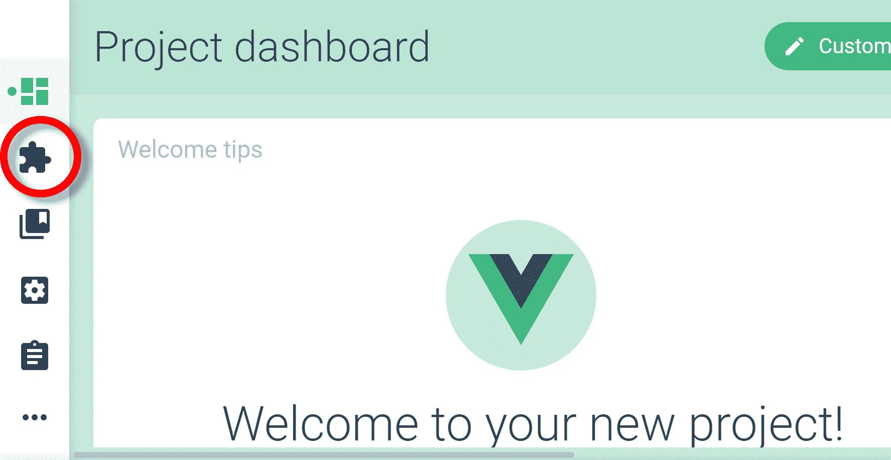
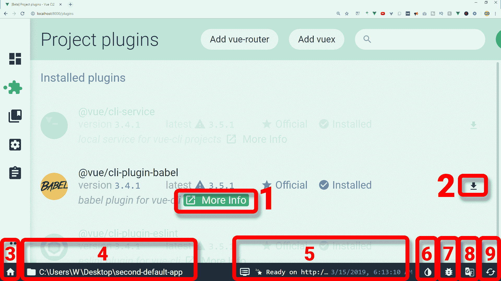

# 第三章：Vue CLI 3 中的 Babel

在本章中，我们将使用 Babel 将**JavaScript**（**JS**）的新功能带到浏览器中，使其在浏览器能够理解之前将其转换为旧版本的 JS。我们将讨论以下内容：

+   理解 Babel

+   使用 ES5 和 ES6 运行 webpack

+   更新我们的 webpack 配置以适配 Babel

+   Vue，Babel 和 JSX

+   手动添加 Babel 插件

让我们首先看看 Babel 解决了什么问题。

# 理解 Babel

正如我们在之前的章节中已经看到的，一旦使用 Vue CLI 构建了默认的 Vue 应用程序，您可以使用`npm run serve`来提供它。

您的应用程序通常会在`localhost:8080`上提供。查看默认内容的服务页面时，您会注意到在已安装的 CLI 插件标题下列出了两个插件：`babel`和`eslint`。

为什么这两个插件会预先安装在默认应用程序中呢？显然，Vue 框架团队正在努力遵循最佳实践，并与构建 Web 应用程序的现代方法保持最新。使用 Babel 就是其中之一。

如果您访问 Babel 网站，您会看到以下关于它的定义：

“Babel 是一个主要用于将 ECMAScript 2015+代码转换为当前和旧版浏览器或环境中的 JS 的向后兼容版本的工具链。”

那么，我们如何使用 Vue CLI Babel 插件？以及获取有关它的更多信息的最简单方法是什么？

由于我们已经使用 Vue CLI 创建了默认的 Vue 应用程序，并且已经了解了 Vue CLI 的 UI，我们可以通过打开 Git Bash 并启动 Vue CLI UI 轻松地访问官方文档：

```js
vue ui
```

正如我们在第一章中所看到的，*介绍 Vue CLI 3*，这个命令将使 webpack 在浏览器中为我们最新的项目仪表板提供服务。在那里，我们可以点击插件图标，如下截图所示：



一旦您点击了已安装的插件链接，您将看到以下屏幕：



此应用程序列出了三个默认安装的插件：*@vue/cli-service*，*@vue/cli-plugin-babel*和*@vue/cli-plugin-eslint*。为了更容易理解，其他插件已被灰掉，并且在截图中添加了编号框：

1.  更多信息链接到`cli-plugin-babel`的 GitHub 存储库

1.  更新`@vue/cli-plugin-babel`

1.  带有主页图标的按钮是指向 Vue UI 项目管理器的链接，列出了所有可用的项目。

1.  UI 的这一部分显示了您的操作系统中当前 Vue 项目的位置

1.  单击此处可让您切换 Vue UI 的日志开关

1.  正如我们之前所看到的，这使您可以在 Vue UI 的两种颜色变化之间切换

1.  报告错误图标将带您到 Vue-CLI 错误报告网页。

1.  如果您有兴趣翻译 UI，此按钮链接到 UI 本地化页面

1.  此图标仅刷新插件的 API

如果您需要使用流行的**vuex**或**vue-router**插件，您可以简单地点击插件页面顶部的相应按钮来安装它们。

在“添加 vuex”和“添加 vue-router”按钮右侧的搜索输入框可让您过滤已安装的插件，“添加插件”按钮将带您转到`localhost:8000/plugins/add`屏幕，您可以从多个插件中进行选择，例如`@vue/cli-plugin-unit-jest`，`@vue/cli-plugin-typescript`，`@vue/cli-plugin-pwa`等。这里有大量的插件可供选择，我们将在后面的章节中更详细地了解它。

在下一节中，我们将讨论`cli-plugin-babel`的所有功能。

# @vue/cli-plugin-babel 的构建模块

`@vue/cli-plugin-babel`默认提供了几个部分。这些是 Babel 7、babel-loader 和`@vue/cli-plugin-babel`。

# @vue/cli-plugin-babel 中的 Babel 7

这就是 Babel 解决的问题。

假设您正在开发您的 Web 应用的前端，并且正在使用 JS 语言的更现代的 ES6+语法。一旦您的应用程序完成，并发布到互联网上，您的一些用户在 Internet Explorer 上运行您的 Web 应用程序。与您的 Web 应用程序的其他用户相反，他们可以顺利运行您的应用程序，Internet Explorer 用户将收到语法错误。

Babel 就是对这样的问题的答案。它*平衡了竞争环境*：它允许开发人员将他们的 JS 浏览器兼容性问题外包给 Babel。他们不必再担心和迎合旧版浏览器，他们可以简单地使用语言的最新功能来编写他们的 JS 代码，甚至在任何浏览器完全支持之前。然后，Babel 负责将此代码转换为旧的 JS 方言，这是旧版浏览器可以理解的。

`@vue/cli-plugin-babel`运行在 Babel 7 上，Babel 7 于 2018 年 8 月 27 日发布。Babel 6 和 Babel 7 之间相差三年，这一迭代带来了一系列改进。Vue CLI 支持如此近期的更新是其团队致力于尽可能跟上时代的又一个证明。

# `@vue/cli-plugin-babel`中 babel-loader 的作用

正如我们在前一章中看到的，Vue CLI 运行在 webpack 4 上。

为了能够使用 Babel 7，`@vue/cli-plugin-babel`使用 babel-loader，可以在这里找到：[`github.com/babel/babel-loader`](https://github.com/babel/babel-loader)。

如前一章所述，使用 webpack 加载器，我们可以预处理和捆绑一堆不同的资源，不仅仅是常规 JS，而是几乎任何其他静态资源。

具体来说，`babel-loader`接收 ES6+ JS，并将其转换为 ES5 JS。这个过程通常被称为**转译**。因此，`@vue/cli-plugin-babel`中 babel-loader 的作用是将我们的 ES6+代码转译为 ES5。

# `@vue/babel-preset-app`的作用

`@vue/cli-plugin-babel`还有更多功能。它包括`@vue/babel-preset-app`，其唯一目的是在通过 Vue CLI 生成的项目中使用。在不深入讨论`@vue/babel-preset-app`的工作原理的情况下，我们可以列出其主要功能：

+   它使用`browserslist`来查看您的浏览器目标

+   它自动应用所需的转换和填充（借助`@babel/preset-env`实现）

+   它增加了对 Vue JSX 的支持

+   它阻止在构建过程中将所有文件中的辅助程序内联

除了之前列出的功能之外，`@vue/cli-plugin-babel` 还有其他功能，我们将在下一节中讨论它们。

# `@vue/cli-plugin-babel`的其他功能

除了前一节中列出的默认设置，`@vue/cli-plugin-babel`也是可扩展的。我们可以使用`babel.config.js`添加其他 Babel 预设和插件。

它使用了一些 webpack 加载器来执行另外两个主要任务：缓存（借助 cache-loader 的帮助）和利用多核处理器（借助 thread-loader 的帮助）。这被称为**并行化**。

在下一节中，类似于我们在第二章中所做的，*Vue CLI 3 中的 Webpack*，我们将介绍在 Vue 中设置 Babel 而不使用 CLI。之后，我们将看看 CLI 如何使事情变得更容易，以及如何进一步扩展。

# 在 Vue 2 中使用 Babel 和 webpack 而不使用 Vue CLI

让我们将我们的新项目命名为`npm-vue-babel-webpack`。我们将打开 Git Bash，添加此项目的文件夹，并`cd`进入其中：

```js
mkdir npm-vue-babel-webpack && cd $_
```

我们将初始化 NPM 并接受所有默认设置：

```js
npm init -y
```

在第二章中，*Vue CLI 3 中的 Webpack*，我们逐个安装了 NPM 包，解释了每个包的作用，并在此过程中修复了任何错误。这使我们对 webpack 的构建模块和 Vue 与 webpack 的配合方式有了深入的了解。为了避免不必要的重复，这次我们将一次性安装所有内容。

# 安装必要的 NPM 包

安装必要的 NPM 包：

```js
npm install vue webpack webpack-cli html-webpack-plugin vue-loader vue-template-compiler --save-dev --verbose
```

现在将`src`和`dist`文件夹添加到我们的项目中，并在 VS Code 中打开我们的项目：

```js
mkdir dist src && code .
```

随时在 VS Code 中检查`package.json`的内容，以确认所有 NPM 包确实已安装。

让我们在`src`文件夹内创建三个新文件，具体为`main.js`、`App.vue`和`index.html`，几乎与我们在第二章中所做的一样，*Vue CLI 3 中的 Webpack*。

以下是要添加到`index.html`中的代码：

```js
<!DOCTYPE html>
<html lang="en">
<head>
   <meta charset="utf-8">
    <title>Compiled HTML file</title>
</head>
<body>
    <div id="entryPoint"></div>
</body>
</html>
```

以下是`main.js`的内容：

```js
import Vue from 'vue';
import App from './App.vue';

new Vue({
    el: '#entryPoint',
    render: h => h(App),
})
```

最后，这是`App.vue`的内容：

```js
<template>
  <div id="entryPoint">
      <article>
        Our own custom article component!
      </article>
      <AnotherComponent />
  </div>
</template>

<script>
import AnotherComponent from './components/AnotherComponent.vue';

export default {
    name: 'entryPoint',
    components: {
        AnotherComponent
    }
}
</script>
```

请注意，在上述`script`标签内部，我们正在从`components`文件夹中导入`AnotherComponent`。

因此，让我们在项目的`src`文件夹内添加一个`components`文件夹。在`components`文件夹内，我们将添加一个新文件并将其命名为`AnotherComponent.vue`。

接下来，将此代码添加到`AnotherComponent.vue`中：

```js
<template>
  <p>
    This is another component.
    <button v-on:click="alertTime">What's the time?</button>
  </p>
</template>

<script>
export default {
  name: "AnotherComponent",
  data() {
    return {
    }
  },
  methods: {
    alertTime: function() {
      alert(new Date());
    }
  }
};
</script>

<!-- Add "scoped" attribute to limit CSS to this component only -->
<style scoped>
</style>
```

在上述代码中，我们终于看到了一个示例，其中我们的组件具有一些基本的 JS 驱动的 Vue 功能。我们正在使用 Vue 的内置`data`和`methods`选项。在`methods`选项内，我们定义了`alertTime`函数，每当它被调用时，都会在警报框中显示当前时间。

讨论所有这些组成部分如何运作的细节超出了本书的范围。本章的重点是理解 Babel。如果您需要更多关于 Vue 的基本概念的信息，比如前几段提到的内容，请参考 Packt 图书馆中的许多有用资源之一。本书的一个很好的伴侣将是对 Vue 2 框架的快速介绍：*Vue.js 快速入门指南*，作者是*Ajdin Imsirovic*（[`prod.packtpub.com/in/application-development/vuejs-quick-start-guide`](https://prod.packtpub.com/in/application-development/vuejs-quick-start-guide)）。

我们现在需要关注的重点是在我们的`methods`选项中使用 ES6+功能。目前，`methods`选项的代码是用 ES5 JS 编写的，因此很容易在此代码上运行 webpack，我们很快就会看到。

# 使用 ES5 代码运行 webpack

要运行 webpack，请执行以下操作：

1.  在项目的根目录中添加另一个文件`webpack.config.js`，以便我们可以设置我们的 webpack 配置如下：

```js
let HtmlWebpackPlugin = require('html-webpack-plugin');
let VueLoaderPlugin = require('vue-loader/lib/plugin');

module.exports = {
    entry: './src/main.js',
    output: {
        filename: 'main.js',
    },
    module: {
        rules: [
            { test: /\.vue$/, use: 'vue-loader' }
        ]
    },
    plugins: [
        new HtmlWebpackPlugin({
            template: './src/index.html',
        }),
        new VueLoaderPlugin(), 
    ]
};
```

请注意，入口和输出文件都是`main.js`，所以我们不必指定它们，但是在前面的代码中我们还是这样做了，以使事情更明显。

1.  接下来，在`package.json`中，更新`scripts`键：

```js
"scripts": {
    "webpack": "webpack"
 },
```

1.  现在从 Git Bash 运行我们的项目，使用以下命令：

```js
npm run webpack
```

1.  现在，在 VS Code 中，导航到我们项目中的`dist`文件夹。

1.  右键单击`index.html`，然后单击“在默认浏览器中打开”命令。

我们的浏览器现在将显示以下输出（放大以便查看）：


如果用户单击“现在几点了？”按钮，将在网页上出现一个警报框，显示当前时间。现在让我们将我们的`methods`选项更新为 ES6 语法，然后看看会发生什么。

# 添加 webpack-dev-server

在我们开始将代码更新为 ES6 语法之前，还有一件事可以让事情变得更快捷和更方便：

1.  添加`webpack-dev-server`。借助这个 NPM 包，我们的代码将不断地被提供和监视变化。让我们使用以下命令安装它：

```js
npm install webpack-dev-server --save-dev --verbose
```

1.  为了让 webpack 开发服务器运行并提供我们的代码，我们还需要将`package.json`条目的`scripts`更新为以下内容：

```js
"scripts": {
  "webpack": "webpack",
  "webpack-dev": "webpack-dev-server --mode development"
},
```

现在我们可以尝试向我们的组件添加各种功能，并在我们在 VS Code 中保存代码时，观察它们在浏览器中进行热重载。

1.  现在让我们立即通过运行以下命令来测试它：

```js
npm run webpack-dev
```

您可以在`http://localhost:8080/`上测试提供的网页，并且您会注意到它仍然像以前一样工作。

接下来，我们将在`methods`选项中添加一些 ES6 语法。

# 将方法选项更新为 ES6 语法

让我们更新`AnotherComponent.vue`文件中的`methods`选项。以下是更新后的代码：

```js
methods: {
    alertTime: () => {
      alert(new Date());
      alert('something else');
    }
}
```

一旦您在 VS Code 中保存了更改，您可以单击“现在几点了？”按钮，然后会出现预期的警报，然后是另一个读取其他内容的警报。这样，我们可以确保我们正在查看更新的应用程序。

现在让我们在`dist`文件夹中的编译后的`main.js`文件中找到我们的 ES6 代码。

如果我们在开发工具中检查`/dist/index.html`文件，我们可以看到对`main.js`的引用，这是 webpack 编译的 JS 代码。如果右键单击`main.js`并在上下文右键菜单中点击“在新标签页中打开”命令，您将在新标签页中看到完整的代码。要找到我们的 ES6 代码，让我们按下*Ctrl* + *F*快捷键，以便输入我们的搜索词：`alertTime`。

在文件的底部，我们看到了我们的 ES6 箭头函数：

```js
alertTime: () => {\r\n      alert('something else');
```

在接下来的部分，我们将使用 babel-loader 更新我们的 webpack 配置，并看看 webpack 将如何将前面的代码转译为 ES5。

# 将 babel-loader 添加到我们的 webpack 配置中

在开始之前，我们需要停止 webpack-dev-server，使用 Git Bash 中的*Ctrl* + *C*组合键。

接下来，为了能够在我们的项目中转译 ES6+语法，我们需要使用 Babel 更新我们的 webpack 配置。让我们首先使用 NPM 安装 babel-loader 包：

```js
npm install babel-loader --save-dev --verbose
```

接下来，让我们再次在项目上运行 webpack：

```js
npm run webpack
```

不幸的是，这仍然不起作用。如果我们检查我们转译后的`main.js`，我们仍然会看到`alertTime`键和它的 ES6 匿名函数。这意味着我们仍然需要另一个包：`babel core`。

```js
npm install @babel/core --save-dev --verbose
```

如果我们此时运行 webpack，我们会发现我们的问题仍然没有解决。

这意味着我们仍然需要添加`babel-preset-env`：

```js
npm install @babel/preset-env --save-dev --verbose
```

此时，验证一下我们的`package.json`中的`devDependencies`是否都有预期的更新是没有坏处的：

```js
"devDependencies": {
  "@babel/core": "⁷.3.4",
  "@babel/preset-env": "⁷.3.4",
  "babel-loader": "⁸.0.5",
  "html-webpack-plugin": "³.2.0",
  "vue": "².6.9",
  "vue-loader": "¹⁵.7.0",
  "vue-template-compiler": "².6.9",
  "webpack": "⁴.29.6",
  "webpack-cli": "³.2.3",
  "webpack-dev-server": "³.2.1"
}
```

最后，在我们重新运行 webpack 之前，我们需要设置一个`babel.config.js`文件，这是 Babel 自己的配置文件（类似于 webpack 的`webpack.config.js`）。

让我们在项目的根目录中创建一个新文件`babel.config.js`，并添加以下代码：

```js
module.exports = {
  presets: ['@babel/preset-env']
}
```

现在我们需要做的就是更新我们的 webpack 配置，使其能够与 Babel 一起工作。

# 更新我们的 webpack 配置以使用 babel

为了使我们的 webpack 能够使用 babel，我们需要告诉它何时使用 babel-loader。我们通过在`webpack.config.js`的`module`选项内添加一个测试规则来实现，如下所示：

```js
module: {
    rules: [
        { test: /\.js$/, use: 'babel-loader' }, 
        { test: /\.vue$/, use: 'vue-loader' }
    ]
},
```

现在我们已经设置好了一切，我们可以再次在 Git Bash 中运行`npm run webpack-dev`命令。

这里有一个快速的方法来查看 webpack 是否与之前不同地捆绑了我们的 JS 文件：只需查看 Git Bash 中的 webpack 日志信息。在我们之前尝试将 Babel 与 webpack 配合工作时，捆绑大小恰好是 70.2 KB。然而，在`webpack` NPM 脚本的最后一次运行之后，`main.js`的捆绑大小为 70.6 KB。我们可以再次在开发工具中检查`./dist/main.js`文件。或者，你可以在 VS Code 中直接搜索`./dist/main.js`中的`alertTime`字符串。

无论我们如何定位它，我们捆绑的`main.js`文件的`methods`条目看起来是这样的：

```js
methods:{alertTime:function(){alert(new Date),alert("something else")}}}...
```

仅仅瞥一眼前面的代码并看到`function`关键字，就应该明显地意识到这段代码是 ES5 的，这意味着 Babel 已经成功地被 webpack 运行，我们在`src`文件夹中的输入文件中的 ES6 `alertTime` Vue 方法已经成功地被转译到了`dist`文件夹中的输出文件中。

为了验证我们的设置是否有效，我们可以再次运行`webpack-dev-server`，并且在它运行时，对`AnotherComponent.vue`中的`methods`选项进行另一个小改动：

```js
methods: {
    alertTime: () => {
      alert(new Date());
      alert('whatever');
    }
}
```

如果你查看在`localhost:8080`上提供的项目，你会看到它按预期工作，如果你从开发工具中打开`main.js`，你也会看到转译后的语法。

在下一节中，我们将简要提到一个常见的困惑来源以及在 Vue 中如何处理它。这与箭头函数语法和`this`关键字有关。

# 箭头函数中的 this 关键字在 Vue 中的问题

不幸的是，当 Babel 将箭头函数中的`this`关键字转译为`_this`时，这意味着我们的任何方法都将被破坏，我们的应用程序将无法工作。这背后的原因是箭头函数的作用域与 ES5 函数不同。

在下一节中，我们将看一下在 Vue 实例的方法选项中定义函数的推荐方法。

# 关键字问题的推荐解决方案

在 Vue 组件中解决`this`关键字的推荐解决方案是不使用箭头函数语法，因为由于作用域问题，它不会产生预期的结果。具体来说，箭头函数的作用域是父上下文。

让我们看一个简单的应用作为问题的例子。

# 添加一个计数器应用

在开始之前，请确保你回到了`VUE-CLI-3-QSG/Chapter03`文件夹，这是本章中所有项目的根文件夹。

在我们开始构建应用程序之前，我们需要提醒自己在使用`vue create`时有一些选项，因此让我们运行这个：

```js
vue create --help
```

在选项列表中，我们可以看到`-d`代表`--default`标志，跳过提示并使用默认预设，而`-b`选项是`--bare`标志的简写，用于在不带初学者说明的情况下搭建我们的项目。

有趣的是，我们可以组合这些单独的标志，我们现在就来做。让我们通过运行以下命令来开始我们的应用程序：

```js
vue create add-one-counter -db
```

正如我们所看到的，我们可以在`vue create`命令后附加的标志的字母别名之间进行链接，这是一个很好的小型生产力提升。

在构建的应用程序中，我们将更改`src`文件夹中的`main.js`的内容。这个文件将与之前的示例应用程序（上一节中的`npm-vue-b-w-es6-syntax`应用程序）完全相同，因此您可以将该文件从之前的 Vue 应用程序中复制并粘贴到我们的新示例应用程序`add-one-counter`中。

如果您在 VS Code 中打开我们的新的`add-one-counter`应用程序，您还会注意到另一个文件夹：`public`文件夹，其中包含`index.html`。我们将保留此文件不变。

回到`src`文件夹，我们需要更改`App.vue`的内容如下：

```js
<template>
  <div id="app">
      <article>
        Our own custom article component!
      </article>
      <AnotherComponent />
  </div>
</template>

<script>
import AnotherComponent from './components/AnotherComponent.vue';

export default {
    name: 'app',
    components: {
        AnotherComponent
    }
}
</script>
```

最后，我们需要在项目的根目录下添加一个`components`文件夹，并在其中添加`AnotherComponent.vue`文件。以下是`AnotherComponent.vue`的内容：

```js
<template>
  <p>
    This is another component.
    <button v-on:click="incrementUp">Add One</button>
    <br>
    <span>Current value of the counter: {{ counter }}</span>
  </p>
</template>

<script>
export default {
  name: "AnotherComponent",
  data() {
    return {
      counter: 0
    }
  },
  methods: {
    incrementUp: function() {
      this.counter++;
    }
  }
};
</script>

<!-- Add "scoped" attribute to limit CSS to this component only -->
<style scoped>
</style>
```

在`methods`选项中，我们可以看到`incrementUp`函数使用 ES6 语法进行定义。

如果您尝试运行此应用程序，它将无法工作。这是因为箭头函数的作用域和 Babel 设置使得在`arrow`函数中正确设置 Vue 应用程序的`methods`变得困难。

唯一的改进，也是在方法选项中编写函数的通常方式，是避免使用箭头函数语法和`function`关键字的使用，如下所示：

```js
methods: {
    incrementUp() {
        this.counter++;
    }
}
```

`incrementUp`函数被称为**简写**函数。您可以在以下网址阅读更多信息：[`developer.mozilla.org/en-US/docs/Web/JavaScript/Reference/Operators/Object_initializer#Method_definitions`](https://developer.mozilla.org/en-US/docs/Web/JavaScript/Reference/Operators/Object_initializer#Method_definitions)。

让我们通过 UI 来测试驱动应用程序：

```js
vue ui
```

一旦 Vue UI 在浏览器中提供服务，让我们将浏览器的地址栏指向`http://localhost:8000/project/select`。接下来，点击`add-one-counter`文件夹，然后点击导入此文件夹按钮。

接下来，点击主菜单上的 Tasks 按钮。最后，点击 Serve 图标。点击 Output 按钮查看应用程序的构建和服务情况。

最后，在`http://localhost:8080/`打开网站。你会看到一个正在提供服务的工作中的应用程序：


前面的例子向我们展示了如何在 Vue 实例中命名和组织方法的最佳实践。此外，我们还学会了如何使用 Vue UI 来自动化 webpack 的构建和服务应用程序，只需点击几下，比本章大部分内容中我们所做的要好得多！这让我们得出一个结论：很多的管道和功能都被抽象化了，因此，使用 Vue UI 和 Babel 设置变得更加容易和方便。

# 摘要

在本章中，我们简要概述了 Babel 是什么，它的作用以及使其与 Vue 一起工作所需的内容。所有这些都是通过`vue-cli-service`来抽象化的，它在幕后由 webpack 提供支持。现在我们已经了解了所有这些不同部分是如何一起工作的，我们将开始只使用 Vue CLI 及其 UI，并在接下来的章节中学习如何更好地使用它。

我们将从理解在 Vue CLI 中使用 Jest 进行测试开始。我们还将学习**测试驱动开发**（TDD）以及如何使用 Vue CLI UI 运行测试。
