# 第四章：在 Vue CLI 3 中进行测试

在上一章中，我们研究了 Babel 在现代 JavaScript 开发中的作用。我们还看到了在 Vue 中使用它的一些实际例子。在本章中，我们将介绍 JS 中的测试。我们将了解测试的一般情况，并使用 Jest 和 Cypress 进行实践。我们将讨论断言和**测试驱动开发**（**TDD**）。然后，我们将继续了解 Jest 和 Cypress 如何与 Vue CLI 3 一起工作。我们将讨论测试工具和测试用例。具体来说，我们将看以下内容：

+   了解 Vue 插件

+   将 Jest 插件添加到我们的 Vue 应用程序

+   在 Vue 应用程序中使用 Jest 编写单元测试

+   从项目任务页面运行任务

+   在 Vue CLI UI 中运行单元测试

+   使用断言

+   实施 TDD

+   使用 Cypress

我们将从对 Vue 插件的简要概述开始本章。

# 了解 Vue 插件

使用 Vue CLI 从命令行创建新的 Vue 应用程序时，我们使用`vue create`命令。然后，我们需要选择一些步骤和提示，以便正确配置我们的应用程序。实际上，我们正在选择我们的应用程序将使用哪些 Vue 插件，而其他事情。

插件是向我们的 Vue 项目添加功能的一种方式。有些插件比其他插件更复杂；它们有时在安装过程中会出现自己的提示。我们的 Vue 应用程序的配置，即底层代码，将反映我们的选择。我们的应用程序的设置方式将基于我们对这些安装提示的回答。

项目的所有官方`npm`包都使用`@`符号进行范围限定，后面跟着项目名称。因此，由 Vue 维护者构建的官方 Vue 插件以`@vue`开头。

要了解有关范围限定`npm`包的更多信息，请访问：[`docs.npmjs.com/about-scopes.`](https://docs.npmjs.com/about-scopes)

要从命令行添加插件，我们使用`vue add`命令，但我们也可以使用 Vue UI，正如我们将在本章中看到的那样。Vue UI 也是搜索 Vue 插件的好方法，我们也将在本章中进行研究。

# 在全新的 Vue 应用程序上开始测试

在之前的章节中，我们已经看到了 Vue CLI 和 UI 中许多不同的选项。我们将通过使用最佳方法来开始一个新应用程序，即 Vue CLI UI，来开始本章。这将帮助我们了解 UI 的一些其他功能。在此过程中，我们还将慢慢向我们的项目引入测试。

# 使用 Vue CLI UI 添加新项目

现在让我们使用 Vue CLI UI 添加新项目：

1.  首先，让我们打开 Git Bash 并导航到所有项目的根文件夹`vue-cli-3-qsg`。

1.  现在我们将运行 Vue CLI UI 命令如下：

```js
vue ui
```

这将导致浏览器中提供新页面。默认地址为`http://localhost:8000/dashboard`。

1.  接下来，单击主页图标（或者在地址栏中键入此 URL：`http://localhost:8000/project/select`），这将带您到 Vue 项目管理器屏幕。

请注意，主页图标是 Vue CLI UI 页脚中最左边的图标：


图 4.1：Vue CLI UI 中的主页图标

1.  无论您如何访问 Vue 项目管理器屏幕，它都会显示可用应用程序的列表，以及顶部的三个选项卡：*项目*，*创建*和*导入*。单击“创建”选项卡以创建新项目。

1.  单击“创建”选项卡后，您需要返回到项目的根目录，然后单击“在此处创建新项目”按钮如下：

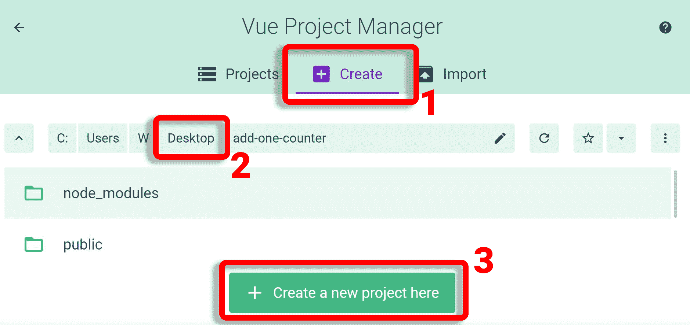

图 4.2：创建，返回所有项目的根目录，点击“在此处创建新项目”按钮

一旦单击“在此处创建新项目”按钮，您将看到“创建新项目”屏幕。我们只会输入我们新应用程序的文件夹名称。我们将其称为`testing-debugging-vuecli3`。我们不会更改任何其他内容：我们将接受默认的软件包管理器和其他默认选项如下：

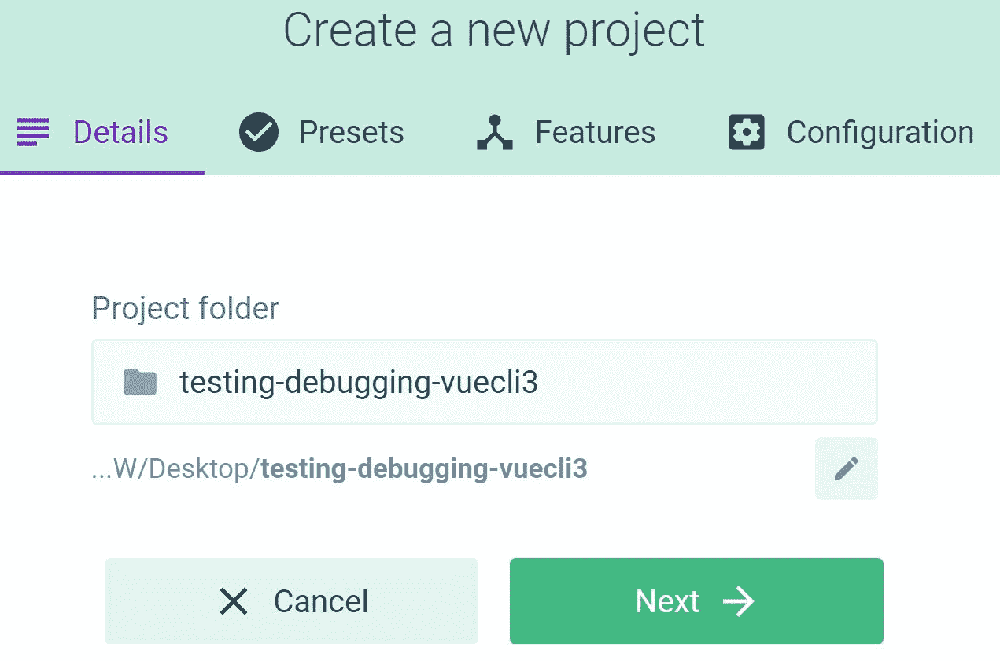

图 4.3：添加将容纳我们新应用程序的文件夹的名称

我们已经在“详细信息”选项卡中完成了所有必要的更改。

1.  点击“下一步”按钮，我们将进入预设屏幕。在那里，我们可以接受默认预设（babel，eslint）如下：

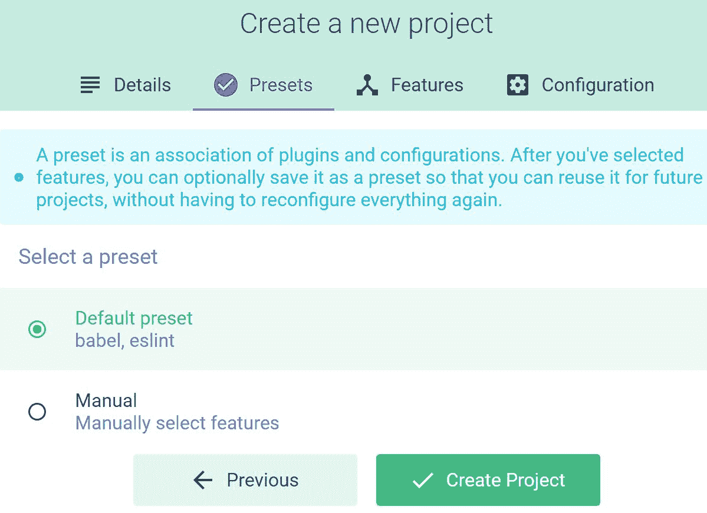

图 4.4：接受默认预设

1.  接下来，我们将单击“创建项目”以搭建我们的项目。Vue CLI UI 完成项目搭建需要一些时间。完成后，我们将看到“欢迎来到您的新项目！”屏幕。

# 向我们的 Vue 应用程序添加 Jest 插件

现在让我们添加我们的 Jest 插件：

1.  点击插件图标（以下截图中标有数字 1）。

1.  一旦项目插件屏幕出现，点击“添加插件”按钮（以下截图中的 2）：

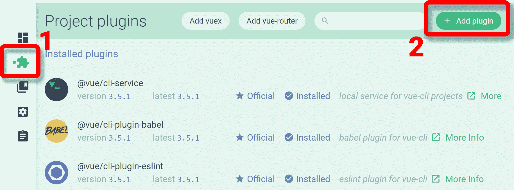

图 4.5：向我们的安装添加新插件

1.  这将带我们到“添加插件”屏幕，在那里我们有一个输入字段来搜索插件。我们需要找到一个单元测试插件，所以我们可以输入`cli-plugin-unit`如下：

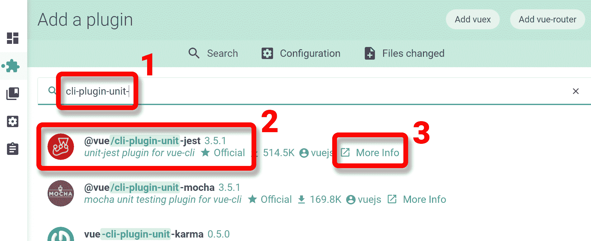

图 4.6：查找 Vue 的单元测试插件

1.  输入此搜索词将显示所有可用的单元测试插件。Jest 应该就在顶部。您可以在上一张截图中看到它，标记为 2。在插件名称下的描述中，您可以看到它是一个官方插件。与我们已经看到的`@vue/cli-plugin-babel`类似，您可以单击“更多信息”链接以查看有关所讨论插件的相应 GitHub 存储库（在上述截图中标记为 3）。这样做将带您到 vue-cli GitHub 页面。

您可以在以下 URL 的`npm`包页面上找到有关`@vue/cli-plugin-unit-jest`的更多信息：[`www.npmjs.com/package/@vue/cli-plugin-unit-jest.`](https://www.npmjs.com/package/@vue/cli-plugin-unit-jest)

1.  要安装 Jest 插件，只需在插件列表中单击它。这将在 Jest 插件旁边的绿色圆圈中添加一个复选框（在下一张截图中标记为 1）。还将出现一个新的安装按钮（在下一张截图中的框 2）：

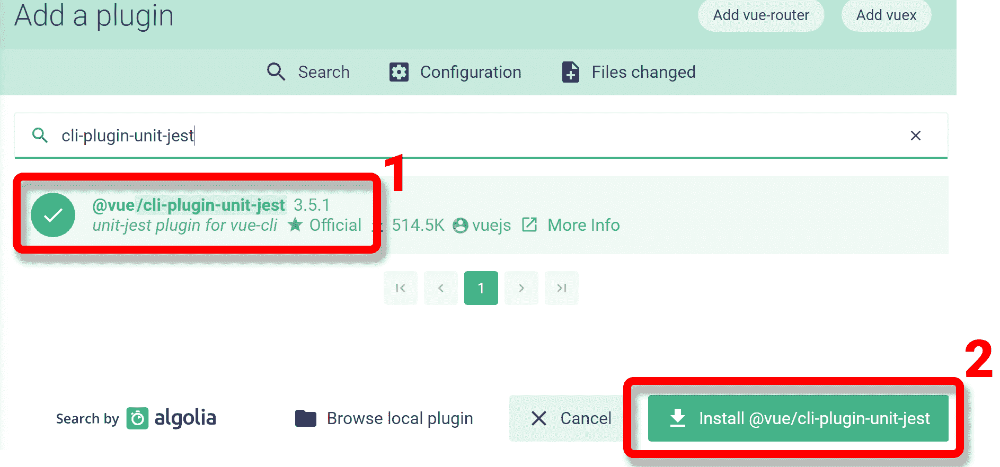

图 4.7：添加 Jest 插件

1.  单击“安装@vue/cli-plugin-unit-jest”按钮将导致页面上出现加载器，并显示以下消息：安装@vue/cli-plugin-unit-jest....

1.  完成后，只需单击“完成安装”按钮，如下所示：

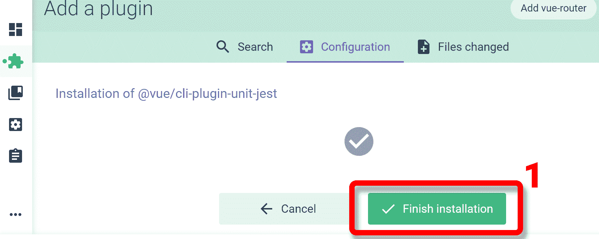

图 4.8：完成 Jest 插件的安装

1.  单击“完成安装”按钮将在屏幕上显示以下消息：调用@vue/cli-plugin-unit-jest....

1.  更新完成后，我们将看到另一个屏幕，显示文件的更改，并要求我们提交所做的更新：

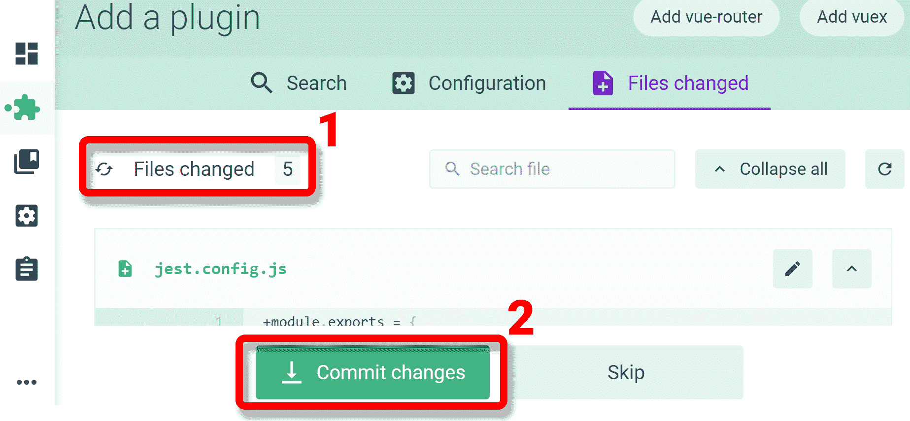

图 4.9：Vue CLI UI 在安装 Jest 插件后显示更改

# 检查更新

在上述截图中，我们可以看到“更改的文件”选项卡是活动的。在“更改的文件”选项卡中，我们可以看到更改的文件数量（框 1）。

在使用 Vue CLI UI 构建项目时，我们被默认选项要求使用 Git 跟踪项目的更改，我们接受了这个默认设置；这就是为什么我们现在看到在上一个截图中标记为 2 的提交更改按钮。

我们还可以看到对两个现有文件`package-lock.json`和`package.json`所做的所有更改和更新，以及在安装插件时添加的三个新文件的内容：`jest.config.js`，`tests/unit/.eslintrc.js`和`tests/unit/example.spec.js`。

检查每个文件的内容将是有益的，以便更熟悉它们的设置以及对它们进行了哪些更改。我们需要注意的最重要的更改之一是在`package.json`文件中的`scripts`键中，如下所示：

```js
"test:unit":  "vue-cli-service test:unit"
```

前一行显示我们的`vue-cli-service`刚刚得到了一个新命令，`test:unit`，专门用于使用 Jest 进行单元测试。

一旦我们点击提交更改按钮，我们将看到一个对话框，邀请我们输入提交消息。我们可以输入一个简单的消息，比如`添加 Jest 插件`。

在我们添加了提交之后，我们将被带回到已安装插件的屏幕。现在我们可以看到`@vue/cli-plugin-unit-jest`也已添加：

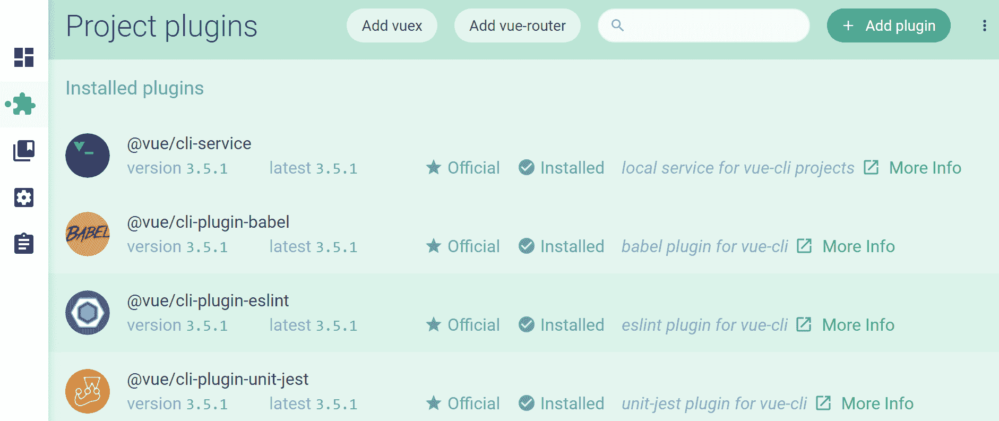

图 4.10：Vue CLI UI 在安装 Jest 插件后显示的更改

在接下来的部分中，我们将添加我们的应用程序，以便我们可以开始使用 Jest 进行测试。

# 添加我们的 Vue 应用程序的代码

要添加我们的应用程序，我们需要执行以下操作：

1.  在 Windows 资源管理器中导航到`testing-debugging-vuecli3`文件夹。

1.  接下来，在文件夹内的空白处右键单击，然后单击 Git Bash here 命令。

1.  一旦 Git Bash 打开，输入`code .`并按下*Enter*键。这将在 VS Code 中打开我们的`testing-debugging-vuecli3`项目。

我们目前的重点是 Jest。为了避免不必要的复杂性，我们将简单地复制并粘贴上一章中的整个`add-one-counter`应用程序。最简单的方法是将 Windows 资源管理器指向`add-one-counter`应用程序，并在文件夹内右键单击启动另一个 Git Bash 实例，如前所述。我们将再次在 Git Bash 中输入`code .`命令，另一个 VS Code 实例将打开，这次显示`add-one-counter`应用程序内的文件。现在只需要将所有文件和文件夹从`add-one-counter`复制并粘贴到`testing-debugging-vuecli3`中。

或者，您可以在 Git Bash 中使用 Linux 命令来复制相关文件。

无论您如何操作，更新后的项目结构现在将如下所示：

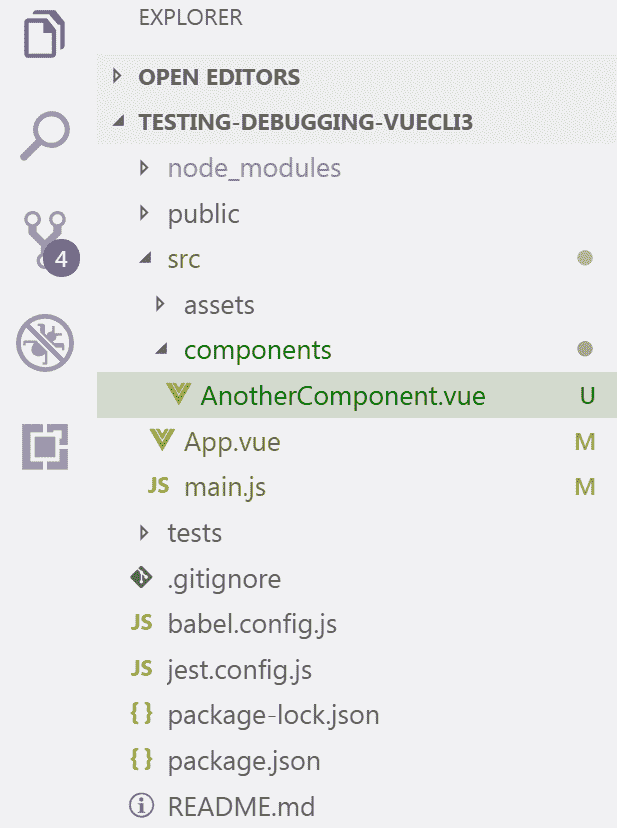

图 4.11：testing-debugging-vuecli3 的更新项目结构

现在，我们准备使用 Jest 开始我们的第一个单元测试。

# 使用 Jest 在 Vue 应用程序中编写我们的第一个单元测试

在`tests`文件夹中，还有一个名为`unit`的文件夹。让我们向`unit`文件夹添加一个新文件。我们将这个新文件命名为`AnotherComponent.spec.js`。

任何具有`spec.js`扩展名的文件都将被 Jest 识别。

为了描述一个测试，我们使用`describe`函数，因此让我们将其添加到`AnotherComponent.spec.js`中，如下所示：

```js
describe()
```

`describe`函数接受两个参数。第一个参数是我们正在测试的 Vue 组件的名称，第二个参数是一个匿名函数，如下所示：

```js
describe('AnotherComponent.vue', function() {} )
```

我们可以使用箭头函数作为第二个参数来重写前面的代码，如下所示：

```js
describe('AnotherComponent.vue', () => {})
```

在匿名函数的主体中，我们调用另一个函数，`test`函数，如下所示：

```js
describe('AnotherComponent.vue', () => {
    test()
})
```

`test`函数接受两个参数：第一个参数是我们的测试名称，第二个参数是另一个匿名箭头函数，如下所示：

```js
describe('AnotherComponent.vue', () => {
    test('Jest is setup correctly and working', () => {})
})
```

我们正在指定一个名为`setup working`的测试，并且我们需要在第二个参数内给出一个断言，也就是在匿名函数的主体内，如下所示：

```js
describe('AnotherComponent.vue', () => {
    test('Jest is setup correctly and working', () => {
        expect(true).toBeTrue();
    })
})
```

这个断言将始终为真，因此我们给出以下代码：`expect(true).toBeTrue()`。

我们刚刚看到了 Jest 匹配器的一个示例。匹配器是在 Jest 中测试值的一种方式。检查某些东西是否为真的一种方式是使用`toBeTrue`匹配器。还有许多其他 Jest 匹配器。有关更多信息，请查看以下 URL 的官方 Jest 文档：[`jestjs.io/docs/en/using-matchers.`](https://jestjs.io/docs/en/using-matchers)

现在，让我们转到 Vue CLI UI，并运行我们的单元测试。

# 在 Vue CLI UI 中运行我们的第一个单元测试

要在 Vue CLI UI 中运行我们的单元测试，我们需要导航到`localhost:8080/tests`页面，可以直接从地址栏访问该 URL，也可以通过单击 Vue CLI UI 仪表板中最左侧列中的最低图标（Vue CLI UI 仪表板中的 Tests 图标）来导航到该页面。一旦我们这样做，我们将看到以下测试列表：

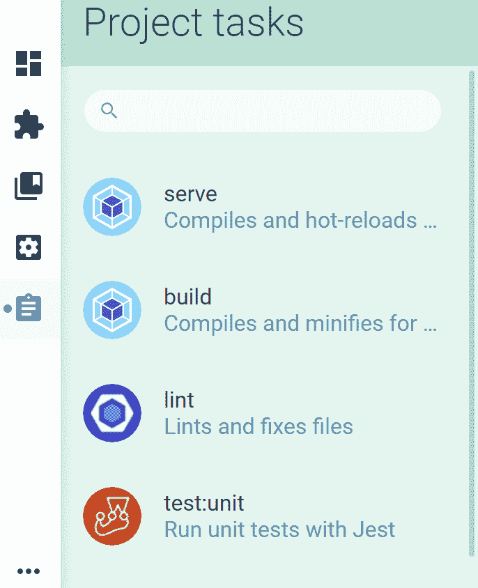

图 4.12：查看 Vue CLI UI 中可用的任务

接下来，让我们准备点击`test:unit`任务来运行。这样做将导致在项目任务页面的右侧出现一个面板，如下所示：


图 4.13：运行 test:unit 命令的运行任务面板

这个运行任务面板给了我们一个很好的概览。现在让我们通过单击运行任务按钮来运行我们的测试。

以下信息将显示在输出部分：

```js
...
... 
PASS tests/unit/AnotherComponent.spec.js

Test Suites: 1 failed, 1 passed, 2 total
Tests: 1 passed, 1 total
Snapshots: 0 total
Time: 2.702s
Ran all test suites.

Total task duration: 3.93s
```

正如我们所看到的，我们的`AnotherComponent.spec.js`测试已经成功通过。在`AnotherComponent.spec.js`测试之前，有一个测试失败并记录输出的测试，那就是`HelloWorld.vue`组件的测试。我们在 Vue UI 构建应用程序后，已经将`HelloWorld.vue`文件从默认应用程序中移除了。

然而，`./tests/unit`文件夹中的`example.spec.js`文件是调用不存在的`HelloWorld.vue`文件的`test`文件。查看`example.spec.js`，我们可以看到它在第 2 行导入了`HelloWorld.vue`组件，如下所示：

```js
import HelloWorld from '@/components/HelloWorld.vue'
```

为什么会这样呢？难道我们不是已经在`describe`函数中指定了`AnotherComponent.vue`吗？

事实证明，我们可以在我们的单元测试中的 describe 函数的第一个参数中指定任何名称。例如，我们可以将我们的`AnotherComponent.spec.js`文件更新为以下代码：

```js
describe('whatever', () => {
    test('Jest is setup correctly and working', () => {
        expect(true).toBeTrue();
    })
})
```

如果我们再次运行我们的测试，它仍然会运行。

这意味着字符串`AnotherComponent.vue`是我们开发者作为第一个参数传递给我们的`describe`函数的，这样我们在项目中更容易工作。Jest 不在乎它的名字是什么。

然而，它在乎的是导入要测试的文件。正如我们在`HelloWorld.vue`导入中看到的，我们需要在我们的`AnotherComponent.spec.js`文件中添加一个类似的导入，这样现在它看起来如下：

```js
import AnotherComponent from '@/components/AnotherComponent.vue';

describe('AnotherComponent.vue', () => {
    test('Jest is setup correctly and working', () => {
        expect(true).toBeTrue();
    })
})
```

有趣的是，我们导入了一个 Vue 文件，但我们的测试仍然通过，即使`.vue`扩展名不是 JS。这是如何实现的？

如果我们打开位于项目根目录的`jest.config.js`文件，我们可以很容易地看到发生了什么。查看这个文件的前 12 行，我们会看到以下代码：

```js
module.exports = {
  moduleFileExtensions: [
    'js',
    'jsx',
    'json',
    'vue'
  ],
  transform: {
    '^.+\\.vue$': 'vue-jest',
    '.+\\.(css|styl|less|sass|scss|svg|png|jpg|ttf|woff|woff2)$': 'jest-transform-stub',
    '^.+\\.jsx?$': 'babel-jest'
  },
```

正如我们所看到的，`vue`扩展名在第 6 行上列出，`.vue`文件扩展名将使用`vue-jest`插件进行转换，如第 9 行所指定的。

在我们继续之前，让我们将我们的`example.spec.js`文件重命名为`example.js`，这样 Jest 就不会捕捉到它。我们仍然需要文件的内容，所以让我们不要删除它，而是只是重命名它。

# 从 test-utils 导入 mount 并编写另一个单元测试

我们将从`@vue/test-utils`中的`mount`导入开始，放在我们的`AnotherComponent.spec.js`文件的第一行，如下所示：

```js
import { mount } from '@vue/test-utils';
```

在我们继续之前，我们需要看一下这个语法的作用。为什么在`mount`周围有花括号？

要回答这个问题，了解这是被接受的 JS 语法是很重要的。为了解释发生了什么，我们需要从`package.json`文件开始。

这个文件是由我们的 Vue CLI 在构建项目时创建的。如果我们查看`package.json`文件的内容，我们会看到`@vue/test-utils`被列为我们项目的`devDependencies`之一。

在前面的代码中，我们从`@vue/test-utils` JS 模块中导入了一个单一函数`mount`。通过这样做，我们将`mount`函数插入到我们的`AnotherComponent.spec.js`文件的作用域中。

简单来说，我们从`@vue/test-utils`导入`mount`功能，这样我们就可以在`AnotherComponent.spec.js`文件中使用它，并且只测试这个组件。

在我们的浏览器中运行 Vue CLI UI，让我们通过访问以下 URL 来查看我们项目的依赖列表：`http://localhost:8000/dependencies`。

你应该会看到类似以下截图的屏幕：

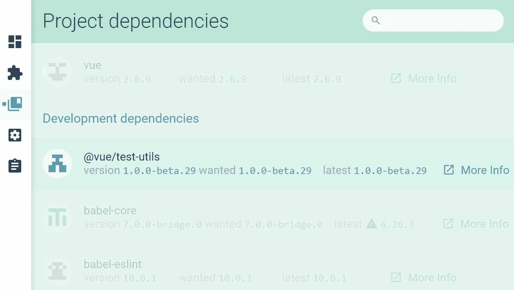

图 4.14：Vue CLI UI 仪表板中列出的项目的 devDependencies

像往常一样，点击`@vue/test-utils`项目依赖项的“更多信息”链接将带我们到该项目对应的 GitHub 存储库：[`github.com/vuejs/vue-test-utils#readme.`](https://github.com/vuejs/vue-test-utils#readme)

# 挂载要测试的组件

我们首先导入`mount`方法和要测试的组件，如下所示：

```js
import { mount } from '@vue/test-utils';
import AnotherComponent from '@/components/AnotherComponent.vue';
```

`mount`函数接收一个组件作为其参数。调用`mount`函数的结果是一个包装器，其中包含我们给定的组件的实例。这个包装器还带有帮助我们测试过程的附加函数。让我们首先将调用`mount(AnotherComponent)`的返回值分配给一个变量，如下所示：

```js
import { mount } from '@vue/test-utils';
import AnotherComponent from '@/components/AnotherComponent.vue';

describe('AnotherComponent.vue'), () => {
  test('Adds one when a user clicks the button', () => {
  const wrapped = mount(AnotherComponent);
}
```

# 编写一个失败的断言

当我们的应用程序最初加载到浏览器中时，我们期望计数器的当前值为`0`。然而，由于我们希望我们的断言最初失败，让我们断言计数器的值将是`1`而不是`0`，如下所示：

```js
import { mount } from '@vue/test-utils';
import AnotherComponent from '@/components/AnotherComponent.vue';

describe('AnotherComponent.vue'), () => {
  test('Adds one when a user clicks the button', () => {
  const wrapped = mount(AnotherComponent);
  expect(wrapped.text()).toContain('Current value of the counter: 1');
}  
```

在上述代码中，我们已经编写了一个失败的断言。我们声称我们期望我们的包装组件将包含以下文本：

```js
Current value of the counter: 1
```

我们的计数器的初始值不会是`1`；实际上将是`0`，因此前面的断言应该失败。

因此，让我们保存并运行我们的单元测试，方法是转到项目任务屏幕，并按照本章前面描述的方式运行测试。

输出将显示在项目任务中的 Run task 的输出面板中，如下所示：

```js
Test Suites: 1 failed, 1 total
Tests: 0 total
Snapshots: 0 total
Time: 1.947s
Ran all test suites.

Total task duration: 3.14s
```

接下来，我们将通过编写一个通过的断言来修复前面的测试。

# 编写一个通过的断言

要编写一个通过的断言，我们只需要将我们的`1`恢复为`0`，如下所示：

```js
expect(wrapped.text()).toContain('Current value of the counter: 0');
```

接下来，让我们在 Vue UI 中再次运行我们的任务，然后我们将得到以下输出：

```js
Test Suites: 1 passed, 1 total
Tests: 1 passed, 1 total
Snapshots: 0 total
Time: 2.418s
Ran all test suites.

Total task duration: 3.55s
```

接下来，我们将在我们的测试中触发一个按钮点击。

# 在我们的测试中触发按钮点击

我们如何在单元测试中测试按钮点击？执行以下步骤：

1.  我们需要找到要点击的按钮。这很容易，因为我们的应用程序中只有一个按钮。我们将使用`find`方法来做到这一点。

1.  我们将使用`trigger`方法触发按钮点击。

1.  我们需要检查计数器的值是否从`0`变为`1`。然而，由于我们首先需要编写一个失败的测试，我们将编写以下代码：

```js
import { mount } from '@vue/test-utils';
import AnotherComponent from '@/components/AnotherComponent.vue';

describe('AnotherComponent.vue', () => {
  test('Adds one when a user clicks the button', () => {
    const wrapped = mount(AnotherComponent);
    expect(wrapped.text()).toContain('Current value of the counter: 0');
    const button = wrapped.find('button');
    button.trigger('click');
    expect(wrapped.text()).toContain('Current value of the counter: 0');
  })
})
```

如预期的那样，在 Vue CLI UI 中运行我们的测试的输出如下：

```js
Test Suites: 1 failed, 1 total
Tests: 1 failed, 1 total
Snapshots: 0 total
Time: 2.383s
Ran all test suites.

Total task duration: 3.55s
```

通过编写两个测试并断言它们以使它们都通过，让事情变得更有趣，如下所示：

```js
import { mount } from '@vue/test-utils';
import AnotherComponent from '@/components/AnotherComponent.vue';

describe('AnotherComponent.vue', () => {
    const wrapped = mount(AnotherComponent);
    const button = wrapped.find('button');
    test('Checks that the initial counter value is 0', () => {
        expect(wrapped.text()).toContain('Current value of the counter: 0');
    });
    test('Adds one when a user clicks the button', () => {
        button.trigger('click');
        expect(wrapped.text()).toContain('Current value of the counter: 1');
    })
})
```

让我们再次保存我们的测试，并在 Vue CLI UI 中再次运行它作为一个任务。

以下是输出：

```js
AnotherComponent.vue
    √ Checks that the initial counter value is 0 (3ms)
    √ Adds one when a user clicks the button (4ms)

Test Suites: 1 passed, 1 total
Tests: 2 passed, 2 total
Snapshots: 0 total
Time: 2.307s
Ran all test suites.

Total task duration: 3.64s
```

我们已经成功地在一个测试套件中为 Vue 组件编写了两个单独的单元测试，并且我们的两个测试都通过了。

# 在 Vue CLI 3 中的测试驱动开发

TDD 是基于“红-绿-重构”周期的开发。与我们在前面的代码中看到的类似，我们首先编写我们的代码，使我们的测试失败。接下来，我们编写我们的代码，使我们的测试通过，最后我们重构我们的代码。

对于我们应用程序中的每个新功能，我们重复相同的过程。这本质上就是 TDD。

TDD 只是以一种简化的方式在任何语言或框架中编写任何应用程序。它通过允许我们将整个项目分割成可测试的、清晰分离的功能块来简化我们的工作。

红绿重构方法在项目任务页面的输出中也是清晰可见的。如果我们编写一个失败的测试，我们会看到单词“fail”的背景是红色的。如果我们编写一个通过的测试，我们会看到单词“pass”的背景是绿色的。

在本章的其余部分，我们将通过 Vue CLI 3 的帮助来了解与测试相关的一些其他概念。

# 在 Vue CLI 3 中改进我们的测试

我们可以利用 Jest 和其他测试平台在 Vue CLI 3 中进行更好的测试体验的几种方式。在接下来的章节中，我们将看到以下内容：

+   在 Vue CLI 3 中观察我们的单元测试

+   为我们的任务设置参数

+   使用 Cypress 编写端到端测试

让我们从使用 `--watch` 标志开始。

# 在 Vue CLI 3 中观察我们的测试

`test:unit` 命令带有 `--watch` 标志。要看到它的效果，我们只需要回到 Vue UI 中的项目任务页面，并在选择 `test:unit` 任务后，点击参数按钮，如下所示：

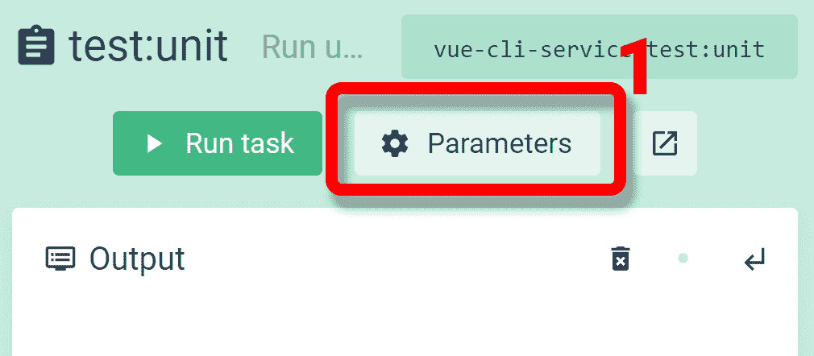

图 4.15：test:unit 任务中的参数按钮

点击参数按钮将触发一个对话框，其中包含以下两个选项：

+   监视文件以进行更改并重新运行与更改文件相关的测试

+   在此测试运行期间重新记录每个失败的快照

点击第一个选项以打开观察模式。接下来的选项将立即出现在其下方：

+   在每次运行后显示通知

这个选项只有在观察模式启用时才可用。让我们也启用每次运行后显示通知选项，并点击保存。

你可以在`package.json`的 scripts 中设置这些选项。第一个选项是`--watch`，显示通知选项是`--notify`标志。

要做到这一点，只需更新项目的`package.json`中的 scripts 键到以下代码：

```js
"scripts": {
  "serve": "vue-cli-service serve",
  "build": "vue-cli-service build",
  "lint": "vue-cli-service lint",
  "test:unit": "vue-cli-service test:unit",
  "test:unit-watch": "vue-cli-service test:unit --watch --notify"
},
```

你会看到你的任务列表现在已经扩展到包括另一个测试任务：`test:unit-watch`。

然而，即使你可以，最好不要这样做。这不是最佳实践，而且这样做有点违背了使用 Vue UI 的初衷。不过，了解到这样可以做的话，我们对 Vue CLI UI 底层发生了更好的理解。

现在，让我们通过向`AnotherComponent.spec.js`文件添加更改来查看观察模式是否正常工作。只需在某个地方添加一个空格并保存更新即可。

# 使用 Cypress 编写端到端测试

端到端测试是一种测试实践，我们在其中从头到尾测试应用程序的流程。通过端到端测试，我们模拟用户从某种入口点流经我们的应用程序到达某种结果的场景。

例如，Web 应用程序的端到端测试可能包括以下流程：

+   用户在浏览器中打开 Web 应用程序的 URL

+   用户点击登录链接并登录

+   用户在 Web 应用程序中检查通知

+   用户登出

# 介绍 Cypress

在本节中，我们将使用 Cypress 进行端到端测试。Cypress 在 Chrome 浏览器中运行良好。或者，如果你想使用基于 Selenium 的工具，你可以在这个网站上查看 Nightwatch.js：[`nightwatchjs.org/.`](http://nightwatchjs.org/)

要了解更多关于 Cypress 的信息，请访问以下网址的官方网站：[`www.cypress.io/`](https://www.cypress.io/)。

如果你访问 Cypress 网站，你会看到它被描述为：

快速、简单、可靠的测试任何在浏览器中运行的东西。

让我们马上开始吧。

# 向我们的项目添加 Cypress 插件

现在让我们在运行 Vue CLI UI 的情况下向我们的项目添加一个 Cypress 插件：

1.  在浏览器中打开以下地址：

`http://localhost:8000/plugins/add`

1.  接下来，在搜索框中输入`cypress`，并找到`@vue/cli-plugin-e2e-cypress`插件。

1.  按照我们之前使用 Jest 插件的方式，按照插件安装步骤进行操作。

1.  一旦我们添加了 Cypress 插件，我们需要提交更改。与 Jest 一样，我们可以只用一个简单的消息提交，比如“添加 Cypress 插件”。

注意，安装 Cypress 会在我们的`tests`文件夹中添加一个名为`e2e`的新文件夹。在`e2e`文件夹中，我们可以找到以下子文件夹：`plugins`，`specs`和`support`。

让我们接着检查`package.json`文件的内容。

# 验证 Cypress 插件安装后对 package.json 的更新

让我们在 VS Code 中检查我们项目的`package.json`。我们会注意到`scripts`选项中有一个新的条目，如下所示：

```js
"test:e2e": "vue-cli-service test:e2e",
```

此外，我们的`devDependencies`已经通过 Cypress 插件进行了更新，我们还可以通过访问 Vue UI 仪表板并检查已安装的插件来看到这一点。

最后，如果我们点击任务图标，我们会看到`test:e2e`任务已添加到我们项目的任务列表底部，与我们在`package.json`文件中看到的完全相同。

如果我们点击`test:e2e`任务，右侧窗格将相应更新，运行任务按钮已准备好点击。点击运行任务按钮将产生以下输出：

```js
$ vue-cli-service test:e2e --mode development
 INFO Starting e2e tests...
 INFO Starting development server...

 DONE Compiled successfully in 1691ms18:06:27

  App running at:
  - Local: http://localhost:8082/
  - Network: http://192.168.1.70:8082/

  Note that the development build is not optimized.
  To create a production build, run npm run build.

It looks like this is your first time using Cypress: 3.2.0

[18:06:28] Verifying Cypress can run C:\Users\W\AppData\Local\Cypress\Cache\3.2.0\Cypress [started]

[18:06:30] Verified Cypress! C:\Users\W\AppData\Local\Cypress\Cache\3.2.0\Cypress [title changed]

[18:06:30] Verified Cypress! C:\Users\WAppData\Local\Cypress\Cache\3.2.0\Cypress [completed]

Opening Cypress...
```

一个新的由 Electron 驱动的窗口将在我们的计算机上打开。使用 Cypress 很容易。正如“帮助您入门……”窗口所告诉我们的那样，您可以在`examples`文件夹中运行测试，或者将您自己的测试文件添加到`cypress/integration`中。

如果您看一下 Cypress 窗口右上角，您会看到“运行所有规范”按钮。默认情况下，它将在 Chrome 中运行（指定版本号）。如果您点击下拉菜单，选择 Chrome，您可以切换到 Electron。无论您选择哪个选项，您的测试都将在一个新窗口中运行，无论是一个新的 Chrome 窗口还是一个新的 Electron 窗口。

此时，我们的端到端 Cypress 测试将失败，因为 Cypress 试图在默认的 Vue 脚手架项目上运行测试，如下所示：

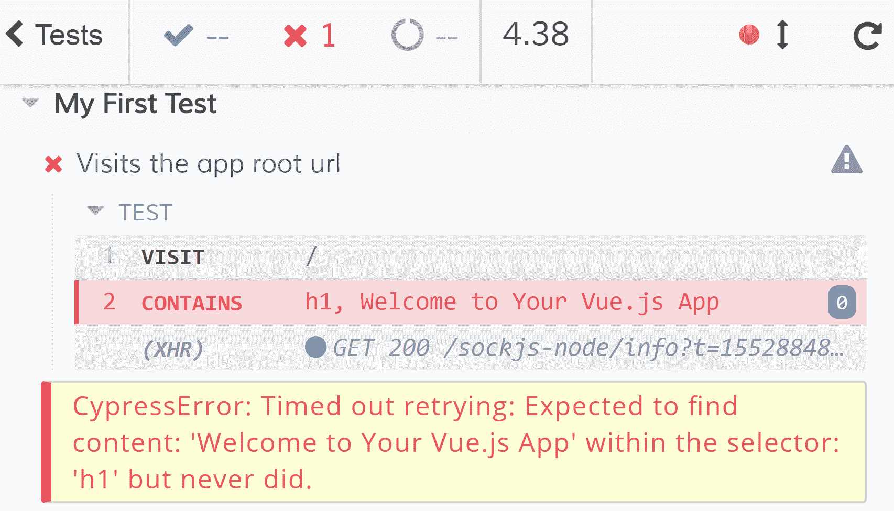

图 4.16：Cypress 中的一个失败测试

如果您希望从一开始就看到这些测试通过，您需要创建一个全新的项目，并在配置中设置 Cypress`e2e`测试。我们将在本书的后面看看这些不同的选项。现在，让我们更新我们的测试，使它们通过。

# 更新我们 Vue 应用中的 Cypress 测试

回到 VS Code，在`./tests/e2e/specs/`文件夹中打开`test.js`文件。您会看到一个带有两个参数的`describe`函数。

要更好地理解 Cypress 术语，请参考以下网址：

[`docs.cypress.io/guides/core-concepts/writing-and-organizing-tests.html#Support-file`](https://docs.cypress.io/guides/core-concepts/writing-and-organizing-tests.html#Support-file)，以及

[`docs.cypress.io/guides/references/bundled-tools.html#Mocha.`](https://docs.cypress.io/guides/references/bundled-tools.html#Mocha)

在 Jest 中，我们看到`test`这个词作为单元测试函数的名称，而在 Cypress 中，我们看到使用`it`这个词。`cy`对象是实际的 Cypress 测试运行器。让我们看一下`test.js`文件的以下更新代码，并解释它是如何以及为什么工作的：

```js
describe('My First Test', () => {
  it('Visits the app root url', () => {
    cy.visit('/')
    cy.contains('article', 'Our own custom article component!')
  })
})
```

这次我们的测试通过了。请注意，我们只需要在 VS Code 中保存更新后的测试文件，测试就会自动运行。您可以转到`http://localhost:8000/tasks/`，并单击`test:e2e`任务以获取有关正在运行的任务的更多信息，如下所示：

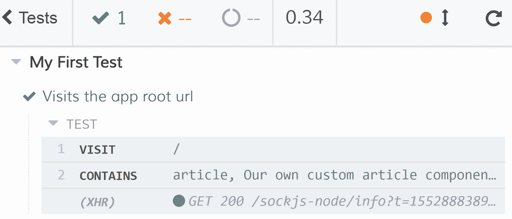

图 4.17：我们 Vue 应用程序主页的 Cypress 测试通过的屏幕截图

另外请注意，如果你在测试结果上悬停在“CONTAINS”部分，那么服务的 Vue 应用程序的适当部分将被突出显示，这是一个关于我们正在测试的 Vue 应用程序的确切部分的美妙视觉提示。

# Summary

在本章中，我们通过 Vue CLI 3 的视角讨论了许多与测试相关的主题。TDD 是一种很棒的技术，应该被团队和个人广泛利用，而 Vue CLI 3、它的 UI 和 Jest 是优化这一过程的绝佳选择。与 Vue CLI 3 的其他方面一样，很多的管道工作都对我们隐藏起来，这使得编码体验非常棒。

在下一章中，我们将研究 Vue CLI 3 中的路由。
