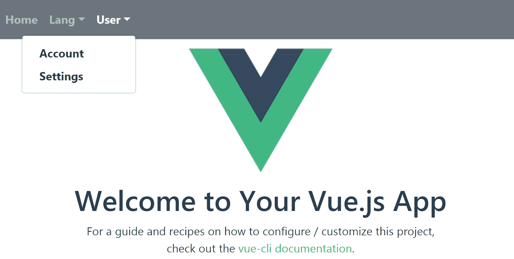

# 第七章：使用 SCSS 改进 CSS

在本章中，我们将讨论 SCSS 的基础知识以及它解决的问题。我们还将讨论引入的改进，使 CSS 更接近 SCSS。

我们还将使用我们在第五章中制作的应用程序，Vue CLI 3 和路由*。本章的目标是使用 CSS、SCSS，并通过使用 Bootstrap + Vue 插件来实现这一目标。

本章将涵盖以下主题：

+   安装 Bootstrap + Vue

+   使用 bootstrap-vue 插件为我们的项目添加样式

+   在我们的项目中使用 SCSS

# 安装 Bootstrap + Vue

在使用 Vue 时，为什么不从官方网站使用 Bootstrap？嗯，我们当然可以这样做，但 Bootstrap 依赖于 jQuery，而且由于我们希望将所有与 JavaScript 相关的内容都通过 Vue 运行，因此我们必须使用一个专为此目的构建的项目：BootstrapVue。

让我们从访问项目网站开始[`bootstrap-vue.js.org/`](https://bootstrap-vue.js.org/)。在这里，我们可以对项目有一个大致的了解。具体来说，阅读文档[`bootstrap-vue.js.org/docs#vue-cli-3`](https://bootstrap-vue.js.org/docs#vue-cli-3)将非常有用，该文档讨论了在 Vue CLI 3 项目中使用 BootstrapVue。

# 将 BootstrapVue 添加为插件

您可以通过 Vue CLI 3 UI 的帮助轻松创建一个新的 Vue 项目。这在本书中已经多次介绍过，您应该能够自己完成这个操作。

将您的新项目命名为“第七章”，并按照与第五章相同的安装步骤运行它，Vue CLI 3 和路由*。

在控制台中，转到项目的根目录并运行以下命令：

```js
vue add bootstrap-vue
```

您将在控制台内看到以下提示：

```js
Successfully installed plugin: vue-cli-plugin-bootstrap-vue
```

接下来将跟进以下问题：

```js
? Use babel/polyfill? (Y/n)
```

只需按下*Enter*键接受默认答案（是）。

无论您如何安装插件，您的插件列表现在应该是这样的：


既然我们已经安装了它，我们可以开始使用它了。

# 使用 bootstrap-vue 插件为我们的项目添加样式

安装了`bootstrap-vue`插件后，让我们在项目中使用它！我们将从官方文档中添加一个`navbar`，该文档可在[`bootstrap-vue.js.org/docs/components/navbar#b-nav-item-dropdown`](https://bootstrap-vue.js.org/docs/components/navbar#b-nav-item-dropdown)找到，如下所示：

```js
  <b-navbar type="dark" variant="dark">
    <b-navbar-nav>
      <b-nav-item href="#">Home</b-nav-item>

      <!-- Navbar dropdowns -->
      <b-nav-item-dropdown text="Lang" right>
        <b-dropdown-item href="#">EN</b-dropdown-item>
        <b-dropdown-item href="#">ES</b-dropdown-item>
        <b-dropdown-item href="#">RU</b-dropdown-item>
        <b-dropdown-item href="#">FA</b-dropdown-item>
      </b-nav-item-dropdown>

      <b-nav-item-dropdown text="User" right>
        <b-dropdown-item href="#">Account</b-dropdown-item>
        <b-dropdown-item href="#">Settings</b-dropdown-item>
      </b-nav-item-dropdown>
    </b-navbar-nav>
  </b-navbar>
```

我们将在`App.vue`中的模板部分添加这个`navbar`。更新后的`template`元素现在看起来是这样的：

```js
<template>
  <div id="app">
    <div id="nav">

      <b-navbar type="dark" variant="secondary">
        <b-navbar-nav>
          <b-nav-item href="#">Home</b-nav-item>
          <!-- Navbar dropdowns -->
          <b-nav-item-dropdown text="Lang" right>
            <b-dropdown-item href="#">EN</b-dropdown-item>
            <b-dropdown-item href="#">ES</b-dropdown-item>
            <b-dropdown-item href="#">RU</b-dropdown-item>
            <b-dropdown-item href="#">FA</b-dropdown-item>
          </b-nav-item-dropdown>

          <b-nav-item-dropdown text="User" right>
            <b-dropdown-item href="#">Account</b-dropdown-item>
            <b-dropdown-item href="#">Settings</b-dropdown-item>
          </b-nav-item-dropdown>
        </b-navbar-nav>
      </b-navbar>
      <!--
      <router-link to="/">Home</router-link> |
      <router-link to="/about">About</router-link>
      -->
    </div>
    <router-view />
  </div>
</template>
```

我们还需要更新样式，使其看起来像这样：

```js
<style>
#app {
  text-align: center;
  color: #2c3e50;
}

#nav a {
  font-weight: bold;
  color: #2c3e50;
}

#nav a.router-link-exact-active {
  color: #42b983;
}
</style>
```

保存更改后，我们的主页将更新为以下截图：



要快速更改`bootstrap-vue navbar`的背景颜色，只需将 Bootstrap 颜色添加到`variant`自定义 HTML 属性中。接受的值为`primary`、`secondary`、`success`、`danger`、`info`、`warning`、`light`和`dark`。

在前面的例子中，我们使用了值为`secondary`的`variant`，这给了我们一个灰色的背景，鼠标悬停时显示白色的`nav`项。

# 在我们的项目中使用 SCSS

类似于 TypeScript 被称为 JavaScript 的*超集*，SCSS 经常被称为 CSS 的*超集*。但这个*超集*到底是什么？

语言的**超集**只是它周围的一个层，具有在*常规*实现中不存在的附加功能。还可能有额外的最佳实践、方法等。

在最核心的层面，SCSS 文件可能只包含普通的 CSS 语法。这是因为所有的 SCSS 最终都会编译成 CSS，并且作为这样，它会被提供给我们的浏览器。这使得它非常易于接近。对于 SCSS 新手来说，了解他们可以继续编写 CSS 并且它会在他们的 SCSS 中正常工作是令人放心的！

让我们把这作为我们的起点。首先，让我们更新我们的`bootstrap-vue`插件设置，以便我们使用 SCSS 而不是 CSS。

导航到我们应用程序的文件夹结构，并找到以下文件：`src/plugins/bootstrap-vue.js`。接下来，更新代码，使其看起来像下面这样：

```js
import Vue from 'vue'

import BootstrapVue from 'bootstrap-vue'
import 'bootstrap/scss/bootstrap.scss'
import 'bootstrap-vue/dist/bootstrap-vue.css'

Vue.use(BootstrapVue)
```

# 处理错误

可能会遇到“找不到 sass-loader”错误。您可以通过运行以下命令来解决它：

```js
npm install -D sass-loader sass
```

此时，如果您不确定加载程序是什么，可能值得重新阅读第二章*，Vue CLI 3 中的 Webpack*，以便对 webpack 加载程序进行复习。

可能会出现的另一个错误是：

```js
Module build failed (from ./node_modules/sass-loader/lib/loader.js): Error: Cannot find module 'node-sass'
```

你可以通过运行以下命令来解决这个错误：

```js
npm install node-sass
```

最后，在安装新包之后，你会看到一条消息，上面写着`found 1 high severity vulnerability`（或类似的内容）。你可以，也应该，根据控制台的提示修复这样的漏洞，并运行`npm audit fix`。

# 在我们的项目中编写一些 SCSS

现在我们已经导入了`bootstrap.scss`，我们可以开始使用它了。

让我们打开`App.vue`，并将`style`标签更新为以下内容：

```js
<style lang="scss">
#app {
  text-align: center;
  color: #2c3e50;
}

#nav {
  a {
    font-weight: bold;
  }
  a.router-link-exact-active {
    color: #42b983;
  }
}
</style>
```

在上面的代码中，我们看到了嵌套的例子，这是 SCSS 的一个特性，它允许我们在 SCSS 规则内模仿我们应用程序的 HTML 结构。

如果你在这个阶段查看你的项目在网页浏览器中的运行情况，你会注意到它仍在运行，并且没有改变。这是好的！这意味着一切都在正常工作，一切都得到了应有的服务。

现在让我们在我们的 SCSS 中添加一些变量、混合和插值。

# 覆盖 bootstrap-vue 样式

我们将首先添加一个自定义的 SCSS 文件。我们将把它命名为`custom.scss`，并将其放在项目的`assets`文件夹中。

现在让我们把这段代码添加到`custom.scss`中：

```js
$secondary: tomato;
```

我们刚刚覆盖了 Bootstrap 的变量。现在让我们在`App.vue`文件中使用它，通过导入`custom.scss`文件。我们还将在`#nav`元素内覆盖`.bg-secondary`类。更新后的`script`标签将如下所示：

```js
<style lang="scss">
@import './assets/custom.scss';
#app {
  text-align: center;
  color: #2c3e50;
}

#nav {
  a {
    font-weight: bold;
  }
  a.router-link-exact-active {
    color: #42b983;
  }
  .bg-secondary {
    background-color: $secondary;
  }
}
</style>
```

在我们保存了所有的更改之后，我们的项目将更新为如下所示：


接下来，我们将在`App.vue`文件中使用一些更高级的 SCSS 特性。

# 使用变量、混合和插值

在这一部分，我们将在 SCSS 中使用一些更多的变量、混合和插值语法。在我们开始本章之前，有必要提到一个网站，你可以在这个网站上练习编写 SCSS，并查看它生成的 CSS 输出。这个网站叫做 Sassmeister，网址是：[`www.sassmeister.com/`](https://www.sassmeister.com/)。

# 使用 Sassmeister 练习 SCSS

一旦你访问了这个网站，你可以通过悬停在选项上来选择你想使用的 Sass 或 SCSS 的风格，如下所示：


Sassmeister 网站是一个练习使用语言各种特性的好地方。例如，我们可以导航到我们项目的`node_modules`文件夹，并找到`bootstrap`文件夹。

如果您在`node_modules`中找不到 bootstrap 文件夹，可以使用`npm i bootstrap`进行安装。

接下来，打开`scss/mixins`文件夹，找到`_alert.scss`，其语法如下：

```js
@mixin alert-variant($background, $border, $color) {
  color: $color;
  @include gradient-bg($background);
  border-color: $border;

  hr {
    border-top-color: darken($border, 5%);
  }

  .alert-link {
    color: darken($color, 10%);
  }
}
```

正如我们所看到的，这是一个 mixin。让我们将其复制粘贴到 Sassmeister 中，看看我们得到什么输出。

实际上，我们不会得到任何输出。为什么呢？

原因很简单：在 Sass 或 SCSS 中的 mixin 实际上就像是其他语言中的函数，例如 JavaScript。因此，要在 SCSS 中使用 mixin，我们需要调用它，并传递一些参数。这里是一个例子：

```js
@include alert-variant(tomato, purple, white);
```

请注意，使用`@include`语法是运行 mixin 所必需的。

上述代码应该可以工作，但在我们的 mixin 定义内部，我们调用另一个 mixin，如下所示：

```js
@include gradient-bg($background);
```

这意味着为了使我们的代码在 Sassmeister 中编译，我们需要用其他内容替换上述行，例如，用以下内容：

```js
background: $background;
```

最后，我们的`@include` for `alert-custom`，需要应用于 CSS 规则。这意味着我们需要用 CSS 声明包装我们对`alert-custom`的调用，就像下面的例子一样：

```js
.alert-custom {
  @include alert-variant(tomato, purple, white);
}
```

将所有这些放在一起，这是我们的 SCSS 代码：

```js
@mixin alert-variant($background, $border, $color) {
  color: $color;
  background: $background;
  border-color: $border;

  hr {
    border-top-color: darken($border, 5%);
  }

  .alert-link {
    color: darken($color, 10%);
  }
}
.alert-custom {
  @include alert-variant(tomato, purple, white);
}
```

Sassmeister 将把上述代码编译为以下内容：

```js
.alert-custom {
  color: white;
  background: tomato;
  border-color: purple;
}

.alert-custom hr {
  border-top-color: #670067;
}

.alert-custom .alert-link {
  color: #e6e6e6;
}
```

既然我们知道如何使用 SCSS mixins，我们可以在我们的项目中使用它们。

# 在我们的 Vue 项目中使用 SCSS mixins 和插值

我们将从在`App.vue`中添加一个警报开始，如下所示：

```js
<b-alert show>Default Alert</b-alert>
```

这个简单的添加将更新我们的应用程序外观为这样：


现在我们将添加一些 mixins 来更新样式。

我们将从添加我们的自定义 mixin 开始，以给我们添加的警报上色。以下是`custom.scss`的代码：

```js
$secondary: tomato!important;
$border: darken(#ff0000, 10%);

@mixin alert-variant($background, $border, $color) {
    color: $color;
    background: $background;
    border-color: $border;
    border-radius: 0;
    border-width: 5px;

    .alert-link {
      color: darken($color, 10%);
    }
  }
  .alert-info {
    @include alert-variant(rgb(255, 192, 181), #ff0000, white);
  }
```

保存上述文件后，我们的警报将如下所示：


有了这个，我们结束本章。

# 摘要

SCSS 是一个庞大的主题。在像 Vue 这样的 VDOM 框架中使用 SCSS 可能会变得复杂，因为涉及的概念数量很多。本章为您提供了可用的内容以及如何入门的一瞥。

在本章中，我们已经涉及了在我们的项目中使用 SCSS。我们已经了解了如何在我们的 Vue 应用程序中使用 CSS 和 SCSS。我们还了解了 SCSS 的一些主要特性，如变量、mixins 和插值，还学会了如何在我们的 Vue 应用程序中实现 Bootstrap 4。接下来，我们学会了如何编辑 Vue 中 bootstrap-vue 插件的内置组件，并如何使用自定义 SCSS 代码对其进行更新。

在下一章中，我们将使用到目前为止学到的所有知识来构建一个简单的项目，并将其发布在 GitHub Pages 上。
