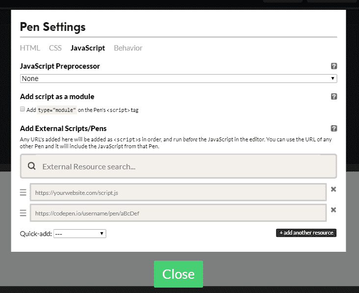

# 第一章：介绍 Vue

在本章中，我们将探讨如何开始学习 Vue 2。本章将向您展示快速入门的最简单方法，以及如何借助可用的 SaaS 平台轻松跟踪您的进度。

我们还将探讨 Vue 为什么变得如此受欢迎，以及为什么我们应该使用它。

此外，我们将讨论 Vue 的基本构建模块：mustache 模板、指令、修饰符、方法和计算属性。

在此过程中，我们将看到许多实际的例子。让我们首先看看 Vue 到底是什么。

在本章中，我们将看一下以下主题：

+   什么是 Vue？

+   Vue 解决了哪些问题？

+   为什么使用 Vue？

# 什么是 Vue？

Vue 是一个简单易用的 JS 框架，于 2013 年出现。它成功地将一些优秀的想法从 Angular 和 React 中提取出来，并结合在一个易于使用的包中。

与其他流行的前端框架相比，Vue 在简单性和易用性方面表现出色。

让我们看看如何开始使用它。

# 开始使用 Vue2 的最快方法

在过去的十年里，很多用于网页开发的工具已经转移到了网络上，所以让我们顺应潮流，在[`codepen.io/`](http://codepen.io/)上开始一个新的项目。

您不必成为[`codepen.io/`](https://codepen.io/)的成员才能在那里创建项目——您可以使用用户名`Captain Anonymous`保存它们。但最好还是注册一个账户，这样您的所有实验都在一个地方。

一旦您将浏览器导航到[`codepen.io`](https://codepen.io)，您将看到以下屏幕：


点击创建下拉菜单（在主导航栏中，位于屏幕右上角），然后点击新建项目。一旦您这样做了，您将看到默认的编辑器设置：


接下来，点击屏幕右上角的设置按钮，在弹出的窗口中选择 JavaScript：



接下来，在快速添加下拉字段中，选择 Vue 选项。一旦您这样做了，第一个输入框将填写当前的 Vue 的压缩版本，它是从 Cloudflare CDN 提供的，或者更具体地说，是从这个链接提供的：[`cdnjs.cloudflare.com/ajax/libs/vue/2.5.13/vue.min.js`](https://cdnjs.cloudflare.com/ajax/libs/vue/2.5.13/vue.min.js)。

就是这样！我们已经准备好在我们的 Codepen 项目中开始使用 Vue2 了。

关于 Vue 要理解的一件事是，它使我们的 HTML 动态化。这是通过添加**胡须语法**来实现的。这种语法非常容易理解。我们只需将其插入到 HTML 元素中。例如，我们可以像这样向`h1`标签添加胡须语法：

```js
<h1>{{ heading1 }}</h1>
```

因此，让我们详细了解一下这是如何工作的。随意在您自己的 pen 上工作或在此处查看示例：[`codepen.io/AjdinImsirovic/pen/rKYyvE`](https://codepen.io/AjdinImsirovic/pen/rKYyvE)。

# 胡须模板示例

让我们开始使用我们的第一个 pen：

```js
<div id="entryPoint">
  <h1>Just an h1 heading here</h1>
  <h2>Just an h2 heading here</h2>
  <p>Vue JS is fun</p>
</div>
```

我们现在可以在 CodePen 预览窗格中看到我们的 HTML 正在呈现，屏幕上打印出以下文本：

```js
Just an h1 heading here Just an h2 heading here Vue JS is fun
```

请注意，CodePen 应用程序通常会在不保存的情况下更新预览窗格，这比刷新浏览器要好得多——在本地项目上工作时必须这样做。尽管如此，经常保存您的 CodePen 项目是很好的，以免丢失任何更改（在浏览器冻结或发生其他异常情况时）。

接下来，让我们将以下 Vue 代码添加到我们 pen 内部的 JS 窗格中：

```js
new Vue({
  el: '#entryPoint',
  data: {
     heading1: 'Just an h1 heading here',
     heading2: 'heading 2 here',
     paragraph1: 'Vue JS'
  }
})
```

最后，让我们更新 HTML，以便 Vue 代码可以发挥其魔力：

```js
<div id="entryPoint">
  <h1>{{ heading1 }}</h1>
  <h2>Just an {{ heading2 }}</h2>
  <p>{{paragraph1}} is fun</p>
</div>
```

在前面的代码示例中，我们可以看到我们如何使用胡须模板将数据动态插入到我们的 HTML 中。

通过简单地将数据对象的键传递到我们的 HTML 标记中，并用开放的`{{`和关闭的`}}`标记将键括起来，可以实现胡须模板。

如前所述，CodePen 将自动更新预览窗格，但这不会影响预览，因为我们实际上产生的输出与我们仅使用纯 HTML 时所做的输出相同。

现在我们可以通过简单地更改数据输入中的键值对来玩耍：

```js
new Vue({
  el: '#entryPoint',
  data: {
     heading1: 'This is an h1',
     heading2: 'h2 heading',
     paragraph1: 'Vue2'
  }
})
```

这次，输出将自动更新为这样：

这是一个 h1

只是一个 h2 标题

Vue2 很有趣

我们也可以更改我们的入口点。例如，我们可以让 Vue 只访问`p`标签：

```js
new Vue({
  el: 'p',
  data: {
     heading1: 'This is an h1',
     //heading2: 'h2 heading',
     paragraph1: 'Vue2'
  }
})
```

更改后，我们的预览窗格将显示以下内容：

{{ heading1 }}

只是一个{{ heading2 }}

Vue2 很有趣

从这个输出中，我们可以得出结论，如果发生以下任何一种情况，我们的胡须模板将被呈现为常规文本：

+   我们的入口点没有引用数据

+   我们的数据中不存在的输入

我们还看到了我们的入口点可以是任何类型的选择器。您可以将其视为类似于在 jQuery 中定位不同的元素。

例如，我们可以将更复杂的选择器作为我们应用的入口点：

```js
new Vue({
  el: 'div#entryPoint',
  data: {
     heading1: 'This is an h1',
     heading2: 'h2 heading',
     paragraph1: 'Vue2'
  }
})
```

# 使用 Vue 的数据选项作为函数

请注意，我们的 Vue 实例的`data`选项可以是对象，也可以是函数。数据作为对象的示例可以在先前的代码中看到。使用数据作为函数也很容易。

数据作为对象与可重用组件不兼容。因此，通常来说，将数据作为函数使用是使用 Vue 中数据选项的更有用的方式。

让我们看另一个笔记。这次，我们将使用数据选项作为函数，而不是作为对象。笔记在这里：[`codepen.io/AjdinImsirovic/pen/aKVJgd`](https://codepen.io/AjdinImsirovic/pen/aKVJgd)。我们唯一要做的改变是我们的 Vue 代码：

```js
new Vue({
  el: '#entryPoint',
  data() {
    return {
     heading1: 'Just an h1 heading here',
     heading2: 'heading 2 here',
     paragraph1: 'Vue JS data as a function'
    }
  }
})
```

现在我们熟悉了 Vue 语法的基础知识，让我们看看它可以用来做什么。

# Vue 解决了什么问题？

不打算列出一个详尽的清单，让我们快速地强调一些 Vue 最大的优点：

+   Vue——jQuery 的继任者？

+   Vue 对于初学者来说是一个很好的学习工具

+   Vue 是一个多才多艺和渐进的框架

+   Vue 是一个用于动画和交互的很棒的工具

+   Vue 的方法与其他现代前端框架和库类似

接下来，让我们简要地概述每一点。

# Vue，jQuery 的继任者

著名的 jQuery 库于 2006 年出现。当它出现时，它做了一些非常好的事情：

+   它使得编写跨浏览器的 JavaScript 变得更容易，这在当时是一个很大的优势，因为它大大减少了开发人员处理各种浏览器怪癖和不一致性的需求

+   它有一个简单的语法，使得更容易定位和操作特定的 DOM 节点，这在他们的座右铭“写得更少，做得更多”中表达得很好

+   它是学习 JavaScript 的绝佳入门点

+   它有一个很棒的 API，使得使用 Ajax 变得简单和容易

然而，自那时以来发生了很多变化，变得更好了。

可以说，2006 年至今在 JavaScript 领域发生的最大改进是虚拟 DOM。

虚拟 DOM 是一种范式转变：我们不再需要编写过程化、混乱的 JS 来指示浏览器如何遍历和操作 DOM。我们现在不再告诉浏览器*如何*更新 DOM，而是告诉它*更新*什么。或者更具体地说，我们告诉*一个框架*要更新什么——像 View 或 React 这样的框架。虚拟 DOM 的实际实现是特定于框架的，目前不需要太在意。

我们现在可以通过使用处理底层框架的虚拟 DOM 实现的*声明式*代码来间接地使用 DOM。这种抽象是使 jQuery 或多或少变得多余的一件事。

当然，由于仍然有很多应用程序由 jQuery 提供动力，并且由于遗留代码有粘性的倾向，jQuery 在未来几年内仍将活跃。

然而，我们对 DOM 操作方式的范式转变使得 Vue 成为与 jQuery 竞争激烈的对手，成为当今最受欢迎的游戏。

Vue 还有其他优势：它是学习当今前端开发的绝佳起点。入门门槛非常低。

# 一个初学者的学习工具

如果一个 jQuery 开发人员面临学习现代前端框架/库（React、Angular、Vue、Ember...）的选择，哪一个可能是最容易入门的呢？

当然是 Vue！

正如我们已经看到的，使用 Vue 可以简单到只需导入 CDN。由于我们人类天生喜欢小而频繁的胜利，Vue 似乎是一条快乐的道路。这并不是说开发人员不应该尝试学习其他前端框架。只是 Vue 似乎是最简单的入门方式，也是最快速提高生产力的最佳方式。

# 一个多才多艺的渐进式框架

Vue JS 的官方网站称 Vue 为*渐进式 JavaScript 框架*。这意味着您可以逐步将 Vue 添加到现有的服务器端项目中。基本上，您可以将 Vue 添加到您网站的一个简单部分。难怪 Laravel 选择在其前端与 Vue 捆绑在一起。

但你不必只在这里和那里使用 Vue。您还可以使用 Vuex 和 Vue-Router 进行扩展。这使得 Vue 非常灵活，可以在许多不同的场景中使用。

# 动画和过渡工具

如果您需要进行高性能的动画和过渡效果，那就毫无疑问选择 Vue！Vue 的动画 API 非常易于理解，使用起来非常愉快。在 Vue 中做动画是如此容易，以至于您会惊讶于您在很短的时间内可以完成多少工作。

# 与其他现代前端框架和库类似的功能

与其他现代前端框架（如 React 和 Angular）一样，Vue 也具有以下特点：

+   虚拟 DOM

+   命令行界面（Vue-cli）

+   状态管理（Vuex）

+   路由（Vue-Router）

然而，似乎 Vue 的核心团队正在尽最大努力使 Vue 尽可能易于接近。这在几个例子中是显而易见的：

+   他们为了避免设置 Vue-cli 的麻烦所付出的努力，这使得入门非常容易

+   复杂的工具链的缺乏

+   Vue 的 API 的简单性

就像官方项目的网站所述，Vue 是易于接近，多才多艺和高性能的。

# 为什么使用 Vue？

我们已经在前一节讨论了 Vue 解决的问题。在本节中，我们将看一下为什么与之合作是一种乐趣的实际例子：

+   声明性代码（我们告诉 Vue 要做什么，而不是如何做）

+   易于理解的语法（尽可能简洁）

+   感觉适合各种项目

# 声明性代码

让我们将原生 JavaScript 代码与 Vue JavaScript 代码进行比较。

对于这个例子，我们将打印出一个数组的成员。

在原生 JavaScript 中，这将是代码：

```js
<!DOCTYPE html>
<html lang="en">
<head>
  <meta charset="UTF-8">
  <title>Document</title>
  <style>
    .list-item {
      background: white;
      color: gray;
      padding: 20px;
      margin: 20px;
    }
  </style>
</head>
<body>

  <script>
    var arr1 = ['a','b','c'];
    var unorderedList = document.createElement('ul');
    unorderedList.style.cssText = "background:tomato; width: 
    400px;height:400px";
    document.body.appendChild(unorderedList);
    for (var i=0; i<3; i++) {
      var listItem = document.createElement('li');
      listItem.className = "list-item";
      unorderedList.appendChild(listItem);
      listItem.innerHTML = arr1[i];
    }
  </script>
</body>
</html>
```

在这个文件中，重点应该放在`script`标签内的代码上。

您可以在此 URL 的表单中看到此示例：[`codepen.io/AjdinImsirovic/pen/xzPdxO`](https://codepen.io/AjdinImsirovic/pen/xzPdxO)。

在这段代码中，我们正在做几件事：

1.  我们正在设置`array1`，它将稍后填充我们将动态创建的列表项

1.  我们正在创建一个`ul`——一个无序列表元素，它将包裹我们所有的列表项（所有我们的`li`元素）

1.  我们正在为我们的`ul`设置样式

1.  我们正在将`unorderedList`附加到我们文档的主体

1.  接下来，我们使用`for`循环创建三个`li`元素

1.  仍然在`for`循环中，我们为每个列表项添加一个类

1.  然后我们将它们中的每一个附加到无序列表元素

1.  最后，我们为每个列表项添加`innerHTML`

对于这段代码，可能会有很多反对意见。我们本可以使用`forEach`；我们本可以避免以我们的方式添加样式，而是从一个单独的文件中调用 CSS。但最大的反对意见是这段代码有多脆弱。让我们将这段代码与用 Vue 编写的相同内容进行对比。

在 Vue 中，我们的代码将如下所示：

```js
<!-- HTML -->
<ul>
  <li v-for="entry in entries">
     {{ entry.content }}
  </li>
</ul>

// JS
var listExample = new Vue ({
  el: "ul",
  data: {
    entries: [
      { content: 'a'},
      { content: 'b'},
      { content: 'c'}
    ]
  }
})
```

此示例的代码可以在这里找到：[`codepen.io/AjdinImsirovic/pen/VdrbYW`](https://codepen.io/AjdinImsirovic/pen/VdrbYW)。

正如我们在简单的一瞥中所看到的，与在原生 JavaScript 中实现的相同代码相比，Vue 的代码更容易理解和推理。

这里的 `el` 是我们 Vue 应用的入口点。`data` 选项是我们的 Vue 应用将使用的实际数据。

这种设置还有另一个主要好处：一旦你了解了 Vue 的工作原理，任何使用 Vue 的其他项目对你来说都会变得简单明了，这将提高生产力和效率。

Vue 的方式促进更快速地完成更多事情。

# 对各种项目来说都是合适的选择

Vue 的一个优点是可以逐步实现。如果你只是想在 Vue 中进行一个快速、简单的实验，没有问题。你可以在不到一分钟的时间内开始使用 Vue。

这使得它非常适合转换传统项目、从头开始构建项目，或者进行简单的实验。

Vue 也在迅速成熟。有一个充满活力的 Vue 社区，许多开发人员在不断地为其努力。例如，人们选择 React 而不是 Vue 的一个论点是 Vue 中缺乏用于构建原生移动应用的框架。这已经不再是问题了：Vue Native 从 2018 年 6 月起就可用了。你可以在 [`github.com/GeekyAnts/vue-native-core`](https://github.com/GeekyAnts/vue-native-core) 查看它，或者在 [`vue-native.io/`](https://vue-native.io/) 了解更多信息。

考虑到所有这些，学习 Vue 对任何人来说都是一个不错的投资回报，尤其是前端开发人员。

# 易于理解的语法

在这个非常简单的 Vue 应用示例中可以注意到一件事，就是使用了 `v-for` HTML 属性。

# 指令

Vue 中的所有 `v-*` 属性都被称为 *指令*，这是从 Angular 中借鉴过来的。

指令的概念非常有趣。它们使代码更易于理解、更易于思考，也更易于使用。

在 Vue 中还有其他指令，我们将在本书中广泛使用。现在，让我们列出其中一些：`v-bind`、`v-cloak`、`v-for`、`v-else`、`v-else-if`、`v-model`、`v-on`、`v-once`、`v-text` 和 `v-html`。

一个有用的指令示例是 `v-model`。`v-model` 指令用于使表单具有响应性；它帮助我们在用户输入事件中更新数据。虽然这个话题对于 Vue 的初学者来说可能有点高级，但这种复杂性被处理得如此优雅，以至于即使初学者也应该很容易看出代码中发生了什么：

```js
<!-- HTML -->
<div id="app">
  <span>Enter the weight in kilograms:</span>
  <input v-model="someNum" type="number">
  <div>The weight in pounds is: {{ someNum * 2.20 }}</div>
</div>

// js
new Vue({
  el: '#app',
  data() {
    return {
      someNum: "1"
    }
  }
})
```

如您所见，`{{ someNum }}`的值绑定到用户在输入字段中键入的任何内容。换句话说，基于用户输入，底层数据模型`someNum`的值将发生变化。

要查看前面示例的 pen，请访问[`codepen.io/AjdinImsirovic/pen/pKdPgX`](https://codepen.io/AjdinImsirovic/pen/pKdPgX)。

# 修饰符

Vue 中的指令还可以通过修饰符进行进一步扩展。

有关指令中修饰符的官方文档链接在此：[`vuejs.org/v2/guide/forms.html#Modifiers`](https://vuejs.org/v2/guide/forms.html#Modifiers)。

要使用修饰符，我们只需将其附加到指令上。最简单的示例可能看起来像这样：

```js
<!-- HTML -->
<div>
  <input v-model.trim="userInput" placeholder="type here">
  <p>You have typed in: {{ userInput }}</p>
</div>

// js
new Vue({
  el: 'div',
  data() {
    return {
      userInput: ""
    }
  }
})
```

我们刚刚将`trim`修饰符附加到`v-model`指令上。

您可以在此链接查看此代码的示例：[`codepen.io/AjdinImsirovic/pen/eKeRXK`](https://codepen.io/AjdinImsirovic/pen/eKeRXK)。

此修饰符将修剪用户在输入字段中键入的任何空白（例如空格或制表符）。

在继续查看 Vue 语法的概述之前，让我们也提一下`v-on`指令，它用于事件处理。这里是一个快速示例：

```js
<!-- HTML -->
<div id="example-1">
 <button v-on:click="counter += 1">Add 1</button>
 <p>The button above has been clicked {{ counter }} times.</p>
</div>

// JS var example1 = new Vue({
 el: '#example-1',
 data: {
 counter: 0
 }
})
```

Vue 甚至为`v-on`提供了快捷语法：`@`符号。因此，我们可以用`@click`替换`v-on:click`，我们的 Vue 计数器仍然可以工作。

要在[`codepen.io/`](http://codepen.io/)中查看此示例，请访问以下网址：[`codepen.io/AjdinImsirovic/pen/PaOjvz`](https://codepen.io/AjdinImsirovic/pen/PaOjvz)。

# Vue 方法

Vue 实例中的`methods`选项只列出了该 Vue 实例（或 Vue 组件）上存在的所有函数。

`methods`选项与 Vue 实例的数据一起工作。接下来是这个概念的一个简单演示：

```js
// HTML
<div id="definitions">
  <!-- 'whatIsVue' and 'whyUseVue' are functions defined in the 'methods' option in the Vue instance -->
  <button id="btn" v-on:click="whatIsVue">What is Vue?</button>
  <button id="btn" v-on:click="whyUseVue">Why use Vue?</button>
</div>

// JS
var definitions = new Vue({
 el: '#definitions',
 data: {
 name: 'Vue.js'
 },
 // define methods (functions) under the `methods` object
 methods: {
   whatIsVue: function () {
    console.info(this.name + ' is a Progressive Front-end Framework')
   },
   whyUseVue: function () {
    alert('Because ' + this.name + ' is nice.')
   }
 }
})
```

正如我们所看到的，`data`选项保存了`Vue.js`字符串，可以通过`name`键访问。

在`methods`选项中，我们可以看到两个函数：`whatIsVue`和`whyUseVue`。`whatIsVue`函数接受点击事件并将`name`中的值记录到控制台。`methods`选项中的`whyUseVue`函数工作方式类似。

此代码可以在此地址的 pen 中查看：[`codepen.io/AjdinImsirovic/pen/yEPXdK`](https://codepen.io/AjdinImsirovic/pen/yEPXdK?editors=1111)。

# 计算属性和观察者

计算属性用于避免复杂逻辑增加视图的臃肿。换句话说，计算属性对于隐藏 HTML 的复杂性是有用的，因此使我们的 HTML 易于理解、易于使用和声明性。换句话说，当我们需要从`data`选项计算一些值时，我们可以借助计算属性来实现。

以下示例的完整代码可以在[`codepen.io/AjdinImsirovic/pen/WyXEOz`](https://codepen.io/AjdinImsirovic/pen/WyXEOz)中查看：

```js
<!-- HTML -->
<div id="example">
  <p>User name: "{{ message }}"</p>
  <p>Message prefixed with a title: "{{ prefixedMessage }}"</p>
</div>

// JS
var example = new Vue({
  el: '#example',
  data: {
    userName: 'John Doe',
    title: ''
  },
  computed: {
    // a computed getter
    prefixedMessage: function () {
      // `this` points to the Vue instance's data option
      return this.title + " " + this.userName
    }
  }
})
```

计算属性是被缓存的。只要计算属性的依赖项没有发生变化，Vue 将返回计算属性的缓存值。

观察者并不像计算属性那样经常使用。换句话说，观察选项要比计算属性选项少用。观察者通常用于具有变化数据的异步或成本高昂的操作。

观察者与响应式编程有关；它们允许我们通过时间观察事件序列并对特定数据属性的变化做出反应。

我们将在后面的章节中介绍计算属性和观察者的主题。目前，知道它们存在于 Vue 中并且被广泛使用就足够了。

# 总结

在本章中，我们看了如何通过[codepen.io](http://codepen.io)快速开始使用 Vue。我们还讨论了 Vue 中一些最重要的思想和概念，例如学习 Vue 2 的最快和最开发者友好的方式。我们了解了 Vue 解决了什么问题，它的优势是什么，以及为什么有时被称为*新的 jQuery*。我们了解了花括号模板、Vue 的声明性代码和易于理解的语法。最后，我们介绍了指令、修饰符、方法、计算属性和观察者。

在下一章中，我们将看到什么是响应式编程以及它如何应用在 Vue 中。我们还将进一步扩展本章涵盖的概念，并介绍 Vue 的一些其他特性。
