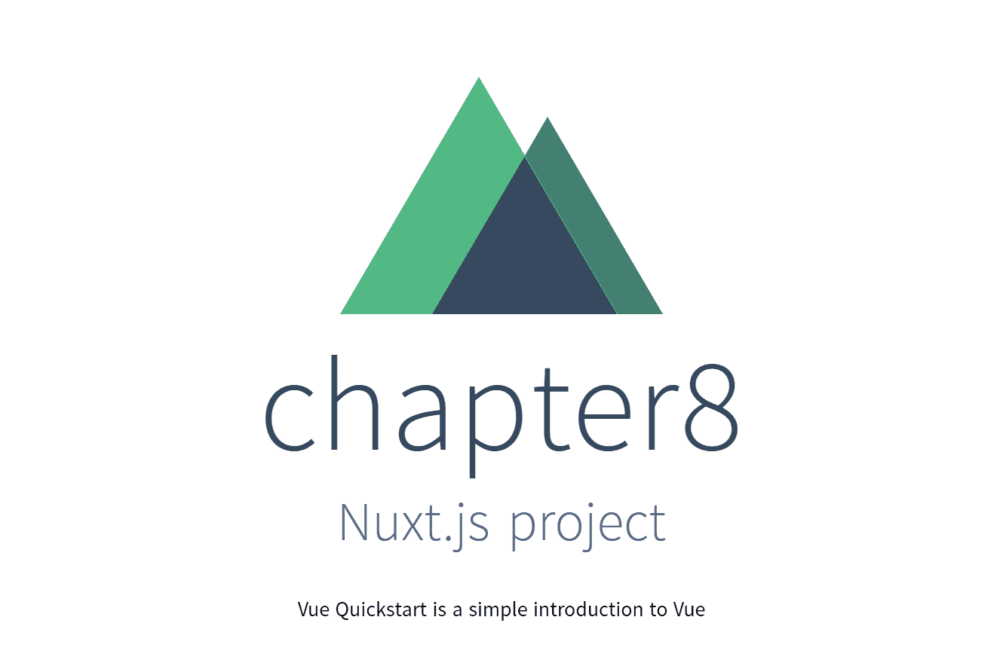
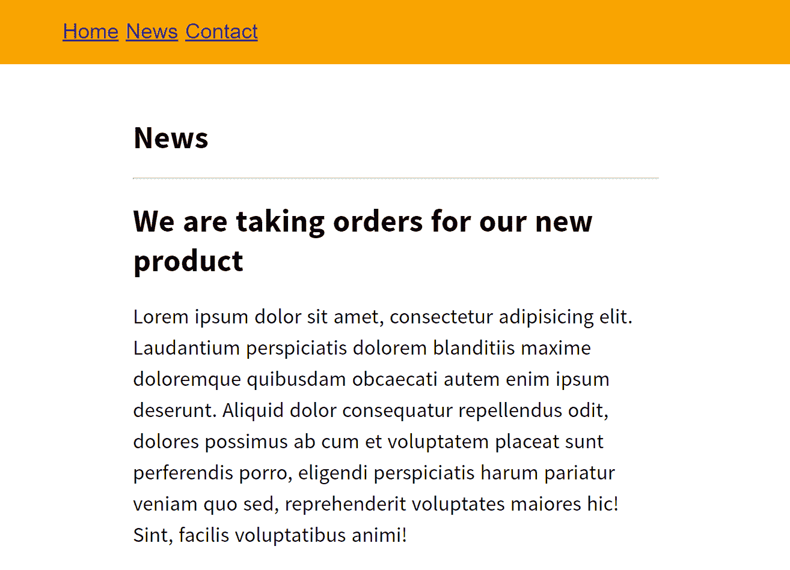

# 第八章：使用 Nuxt.js 和 Vue-Router

随着**单页应用**（**SPA**）的兴起，出现了一些特定的问题。针对这些问题已经有了各种尝试，并且一些常见的解决方案也从这些尝试中出现。在本节中，我们将看看围绕 SPA 的问题以及在 Vue 中解决这些问题的方法。

在这一章中，我们将使用 Nuxt.js 和 Vue-Router 来理解一些概念：

+   单页应用

+   初始页面加载

+   服务器端渲染和通用 Web 应用

+   安装 Nuxt.js

+   Nuxt 页面作为路由

+   使用`nuxt-link`标签链接页面

我们将首先了解 SPA 是什么以及它们是如何工作的。

# 单页应用和服务器端渲染

传统上，Web 服务器只提供静态内容。当用户在应用中请求一个链接时，通常服务器会处理该请求并将处理结果作为整个页面发送给客户端，包括 HTML、CSS 和由浏览器提供的 JS。这发生在请求 Web 应用中的每个路由时。如果开发人员想要查看浏览器发送的内容，只需在所选浏览器中运行`view source`命令即可。

查看源代码的快捷键在一些浏览器中传统上是*Ctrl* + *U*，比如 Chrome 和 Firefox。

随着网络体验向桌面端靠拢的推动，近年来我们看到了单页应用（SPA）的兴起。流行的 SPA 示例包括 Gmail、Twitter 和 Google Maps。

单页应用的工作方式是这样的：当用户在网站上浏览不同的页面（路由）时，浏览器不会下载一个全新的页面，也不会向服务器发送一个全新的请求。与其每次用户访问一个路由时从服务器下载完整页面不同，SPA 在客户端渲染所有内容。向服务器的请求仅用于获取新数据。

判断一个 Web 应用是否可以被视为 SPA 的一个好方法是：在应用中访问不同的路由是否会导致整个应用刷新？如果不会，那么它就是一个 SPA。

SPA 从服务器请求新数据，而传统 Web 应用从服务器下载整个页面。

这通常意味着所有的 SPA 代码将在一个页面加载中下载——**初始页面加载**。这包括 HTML、CSS 和 JS——所有的代码，没有这些代码，SPA 将无法运行。这种方法的缺点是，在较慢的网络上运行或者由于应用程序的体积过大时，下载时间可能会相当长，特别是考虑到许多这些 SPA 都充斥着 JavaScript 代码。

然而，如前所述，SPA 的目标是提供出色的用户体验，表现得像桌面应用程序一样，具有即时执行和无延迟。

解决这个问题的一个方法是引入**服务器端渲染**。服务器端渲染简单地说就是前端框架在服务器上准备 HTML、CSS 和 JS 的能力，因此当用户访问我们的 SPA 时，他们的浏览器不需要一次性下载整个应用程序，而只需下载部分代码——完整 SPA 的一部分——尽管如此，用户仍然可以与页面进行交互。通过代码分割和重新注水等概念，SPA 无缝地只下载应用程序的那部分内容，以便开始使用它，然后再下载 SPA 的其余部分，而用户已经在与之交互。这种方法减少了初始加载的延迟。

过去 SPA 的另一个主要问题是搜索引擎爬虫无法读取的问题。由于这些爬虫在爬取 SPA 网站时无法运行 JavaScript，访问的搜索引擎爬虫将无法看到 SPA 的内容。因此，服务器端渲染是加快 web 应用程序速度并使其更易于被搜索引擎爬虫索引的一种优雅方法。

当一个 web 应用程序可以在服务器和客户端上渲染网页时，它被称为**通用 web 应用程序**。通用 web 应用程序基本上是具有 SSR 能力的 SPA。

许多现代前端框架都有自己的 SSR 实现。在 Vue 中，这就是我们所说的 Nuxt.js。

# 安装 Nuxt.js 并预览默认项目

为了提供不同的路由，Nuxt.js 在后台使用 Vue-router。为了保持简单，我们将专注于使用 Nuxt.js。

有几种方法可以开始使用 Nuxt.js。一种选择是通过`vue init`命令。另一种是使用一种常见的实践，即`create-nuxt-app`命令，类似于`create-elm-app`或`create-react-app`。

# 使用 vue init 命令安装 Nuxt.js

让我们首先找到一个位置来保存我们的新 Nuxt 应用程序，然后使用`vue init`命令来创建它：

```js
vue init nuxt-community/stater-template chapter8
```

在未安装`vue init`的情况下运行此命令可能会在控制台中返回以下消息：

```js
Command vue init requires a global addon to be installed. 
Please run yarn global add @vue/cli-init and try again.
```

因此，要纠正问题，只需运行这个命令：

```js
yarn global add @vue/cli-init
```

这将需要一些时间，但最终我们将能够运行`**vue init**`命令：

```js
vue init nuxt-community/starter-template chapter8
```

这次运行前面的命令将导致我们需要回答一些问题，以便根据我们的喜好配置项目。与我们在 Vue-cli 中看到的类似，要接受默认值，我们可以简单地按下*Enter*键。

这是控制台的输出，包括所有问题和答案：

```js
? Project name (chapter8)
? Project name chapter8
? Project description (Nuxt.js project)
? Project description Nuxt.js project
? Author (AuthorName <author@email.com>)
? Author AuthorName <author@email.com>)
   vue-cli Generated "chapter 8"

   To get started:
     cd chapter8
     npm install # Or yarn
     npm run dev
```

让我们按照描述运行这些命令。我们将`cd`进入`chapter8`文件夹，然后运行`npm install`。这将产生一个输出，其中包括 Nuxt 标志的一些漂亮的 ASCII 艺术，贡献者和支持者的列表，以及其他项目信息。现在，我们可以运行`npm run dev`命令，这将产生以下输出：

```js
[11:12:14] Building project
[11:12:14] Builder initialized
...
[11:12:33] Listening on http://localhost:3000
```

如果我们访问`localhost:3000`页面，我们将看到标准的欢迎屏幕，其中有 Nuxt.js 标志，在下面将是我们项目的名称（chapter8），以及两个按钮：链接到文档和项目的 GitHub 存储库。

# 调试 eslint 错误

在撰写本书时，尽管所有软件都是最新的，`eslint`仍然会抛出错误。如果在运行`npm run dev`之后，您打开`localhost:3000`，您可能会在页面的左上角看到以下错误，指出 eslint 模块未定义。

如果发生这种情况，您可以通过打开代码编辑器中的`nuxt.config.js`文件，并将第 23 行后的所有代码替换为以下内容来修复它：

```js
  build: {
    /*
    ** Run ESLint on save
    */
    /*
    extend (config, { isDev, isClient }) {
      if (isDev && isClient) {
        config.module.rules.push({
          enforce: 'pre',
          test: /\.(js|vue)$/,
          loader: 'eslint-loader',
          exclude: /(node_modules)/
        })
      }
    }
    */
    extend(config) {
      if (process.server && process.browser) {
        config.module.rules.push({
          enforce: 'pre',
          test: /\.(js|vue)$/,
          loader: 'eslint-loader',
          exclude: /(node_modules)/
        })
      }
    } 
  }
}
```

在上面的代码中，我们已经注释掉了有问题的代码，并用正确的代码替换，以便比较差异并理解需要修复的内容。

现在我们可以重新运行`npm run dev`命令，我们应该在`localhost:3000`上看到应用程序没有任何错误。

# 使用 create-nuxt-app 安装

或者，我们可以使用`create-nuxt-app`命令。首先，我们需要全局安装它，以便我们可以在计算机的任何地方使用它：

```js
npm install -g create-nuxt-app
```

这个命令是全局安装的，可能需要一些时间。成功安装将在控制台中记录几行，即`create-nuxt-app`已安装在本地驱动器的位置，以及其他一些信息，类似于这样：

```js
+ create-nuxt-app@2.1.1
added 401 packages in 20.234s
```

接下来，让我们将控制台指向所需的文件夹，然后运行这个命令：

```js
create-nuxt-app chapter8b
```

与第一种安装方法类似，这种方法也会产生一些带有预设答案的问题，我们可以通过简单地按下*Enter*键来接受。这是带有默认答案的问题列表：

```js
$ create-nuxt-app chapter8b
> Generating Nuxt.js project in C:\Users\PC\Desktop\chapter8b
? Project name (chapter8b)
? Project name chapter8b
? Project description (My smashing Nuxt.js project)
? Project description My smashing Nuxt.js project
? Use a custom server framework (Use arrow keys)
? Use a custom server framework none
? Use a custom UI framework (Use arrow keys)
? Use a custom UI framework none
? Choose rendering mode (Use arrow keys)
? Choose rendering mode Universal
? Use axios module (Use arrow keys)
? Use axios module no
? Use eslint (Use arrow keys)
? Use eslint no
? Use prettier (Use arrow keys)
? Use prettier no
? Author name (AuthorName)
? Author name AuthorName
? Choose a package manager (Use arrow keys)
? Choose a package manager npm
Initialized empty Git repository in C:/Users/PC/Desktop/chapter8b/.git/
```

与先前的安装类似，我们可以看到运行样板项目的说明如下：

```js
  To get started:

    cd chapter8b
    npm run dev

  To build & start for production:

    cd chapter8b
    npm run build
    npm start
```

所以，让我们运行`cd chapter8b`，然后跟着运行`npm run dev`。输出将几乎与先前的安装方法相同。

# 编辑 index.vue 文件

让我们也编辑我们的`index.vue`文件，在`pages`文件夹中。这是我们应用程序的根路由。我们将进行的更改很小：我们将删除`<div class="links">`标签内的所有代码。更新后，该代码片段应如下所示：

```js
      <div class="links">
        <p>Vue Quickstart is a simple introduction to Vue</p>
      </div>
```

由于后台的 webpack 正在刷新我们的页面，所以在保存更改后，我们应该在浏览器中看到这个更改的结果：



到目前为止，我们已经看到了两种不同方式初始化新的 Vue Nuxt 项目。在下一节中，我们将看看 Nuxt 风格的实现`约定优于配置`方法：页面作为路由。

# Nuxt 页面作为路由

*约定优于配置*方法是由 Ruby on Rails 推广的。这是一种对 Web 开发的看法，以一种设置和忘记的方式在框架中设置一些东西。当我们说它是有看法的，它只是意味着在处理问题时，框架的开发人员选择了一种特定的方法，而这种方法是做某事的唯一方式。

我们可以说 Nuxt.js 是有看法的，因为它遵循页面作为路由的约定。因此，我们不必在应用程序中手动设置路由，而是遵循简单的约定。在页面文件夹中，`index.vue`文件充当根路由：`/`。这意味着如果我们运行我们的应用程序，访问`localhost:3000`的根路由等同于访问`localhost:3000/index.vue`。

同样地，如果我们创建一个名为`about.vue`的文件并将其放在页面文件夹中，要查看此文件，我们需要访问`localhost:3000/about`路由。

所以，让我们就这样做。在我们的页面文件夹中，我们将创建一个新文件并将其命名为`contact.vue`。在该文件中，我们将添加以下代码：

```js
<template>
  <h1>Contact</h1>
</template>
```

这就是使`/contact`路由可用所需的所有内容，您可以通过导航到`localhost:3000/contact`来查看。我们甚至可以将此文件设置为`contact`文件夹的默认根路由。在这种情况下，我们必须在`pages`文件夹内创建一个子文件夹，并将其命名为`contact`。现在，我们可以在新创建的`contact`文件夹内创建一个`index.vue`文件，路由将保持不变。只是我们在`pages`文件夹内的文件和文件夹结构略有改变，但最终结果是相同的。

然而，将文件分离成子文件夹将使您在添加更多文件时更容易保持组织。

# 通过`components`文件夹向 Nuxt 应用程序添加导航

在我们应用程序开发的这一点上，将导航放在适当的位置将是很好的。导航本身不是一个页面；它是一个应该存在于我们应用程序的每个页面中的组件。因此，让我们通过打开`components`文件夹并添加一个新文件来创建它，我们将其称为`Navigation.vue`。让我们向其中添加这段代码：

```js
<template>
  <div class="navigation">
    <ul>
        <li><nuxt-link to="/">Home</nuxt-link></li>
        <li><nuxt-link to="/contact">Contact</nuxt-link></li>
        <li><nuxt-link to="/news">News</nuxt-link></li>
    </ul>
  </div>
</template>

<style scoped>
.navigation {
    width: 100%;
    margin: 0;
    padding: 20px;
    background: orange;
    color: #444;
    font-family: Arial, sans-serif;
    font-size: 20px;
}
ul {
    list-style: none;
}
ul li {
    display: inline-block;
}
</style>
```

请注意`<nuxt-link>`标签。它只是 Vue-router 实现的一个包装器，`to="..."`属性的值是我们指定的实际 URL，它只是`pages`文件夹内特定文件的名称。

接下来，让我们找到`layouts`文件夹，在其中的`default.vue`文件中，让我们在模板中添加`Navigation`组件，使其看起来像这样：

```js
<template>
 <div>
 <Navigation></Navigation>
 <nuxt />
 </div>
</template>
```

请注意，我们可以自我关闭组件，所以我们可以写简写版本，而不是`<Navigation></Navigation>`，简写版本就是`<Navigation />`。

我们需要确保通过在`template`标签下方添加`script`标签来导入`Navigation`组件：

```js
<script>
import Navigation from '@/components/Navigation'
export default {
 components: {
 Navigation
 }
}
</script>
```

在这一点上，我们的主页，通过导航更新，将如下所示：


现在我们的导航已经就位，我们将添加另一个页面，我们将其称为`News.vue`，代码如下：

```js
<template>
  <h1>News</h1>
</template>
```

在这一点上，我们的导航中有三个链接，现在我们可以专注于向每个页面添加更多内容。

# 向我们的 Nuxt 应用程序页面添加内容

让我们更新`News.vue`组件：

```js
<template>
  <section class="news">
    <h1>News</h1>
    <hr>
    <article>
        <h2>We are taking orders for our new product</h2>
        <div>
            Lorem ipsum dolor sit amet, consectetur adipisicing elit. Laudantium perspiciatis dolorem blanditiis maxime doloremque quibusdam obcaecati autem enim ipsum deserunt. Aliquid dolor consequatur repellendus odit, dolores possimus ab cum et voluptatem placeat sunt perferendis porro, eligendi perspiciatis harum pariatur veniam quo sed, reprehenderit voluptates maiores hic! Sint, facilis voluptatibus animi!
        </div>
    </article>
    <article>
        <h2>Our website is live</h2>
        <div>
            Lorem ipsum dolor sit amet, consectetur adipisicing elit. Delectus unde fugit quod, tempore enim obcaecati quam eius explicabo voluptates quo consequatur! Ad iste consequuntur dolorem minima at cupiditate veniam saepe voluptatum, qui hic corporis modi repellendus illum natus optio aut! Omnis praesentium placeat pariatur neque dolorum eaque, labore at et dignissimos impedit nobis, commodi rerum. Debitis est exercitationem ipsa, commodi nihil! Inventore minus ex, quam, facilis ut fuga unde harum possimus dolore ea voluptatum non debitis nihil ipsum repellendus aut dolorum nam nostrum assumenda eveniet corrupti consequatur obcaecati provident alias! Ad est minus repudiandae aliquid maxime provident labore. Asperiores, qui!
        </div>
    </article>
  </section>
</template>

<script>

</script>

<style scoped>
    .news {
        max-width: 500px;
        margin: 0 auto;
        padding-top: 30px;
        font-size: 20px;
    }
    .news article div {
        line-height: 30px;
    }
    h1, h2 {
        padding-top: 20px;
        padding-bottom: 20px;
    }
</style>
```

现在新闻链接将如下所示：



接下来，让我们更新`Contact.vue`组件：

```js
<template>
  <section class="contact">
    <h1>Contact</h1>
    <hr>
    <article>
        <h2>Feel free to get in touch!</h2>
        <div>
            <p>Our managers:</p>
            <ul>
                <li>John Doe, +01 123 4567</li>
                <li>Jane Doe, +01 124 4567</li>
                <li>Another Person, +01 125 4567</li>
            </ul>
        </div>
    </article>
  </section>
</template>

<script>

</script>

<style scoped>
    .contact {
        max-width: 500px;
        margin: 0 auto;
        padding-top: 30px;
        font-size: 20px;
    }
    .contact article div {
        line-height: 30px;
    }
    h1, h2 {
        padding-top: 20px;
        padding-bottom: 20px;
    }
</style>
```

我们不会改变 Nuxt.js 项目的原始主页。有限的更改原因是我们只需要有一些带有虚拟内容的页面，这样我们就可以继续到下一节，在那里我们将看到如何将页面过渡效果添加到我们的 Nuxt.js 应用程序中。

# 向我们的 Nuxt.js 应用程序添加页面过渡效果

正如我们在第六章中学到的，Vue 提供了许多方法来为我们的应用程序添加交互性、过渡效果和动画。为了加快这个过程，我们将使用`Animate.css`中的动画，稍作修改。

在 Nuxt 中，我们可以像我们已经学过的那样使用页面过渡钩子。我们只需将`.v-*`过渡钩子中的`v`字母替换为`.page-*`。所有的功能以及一切的工作方式都将保持不变。

让我们从打开`pages/index.vue`文件并在其`style`标签的顶部添加以下代码开始：

```js
.page-enter-active, .page-leave-active {
  transition: opacity 1s;
}
.page-enter, .page-leave-active {
  opacity: 0;
}
```

接下来，我们将打开`contact.vue`文件，并在其`style`标签的顶部添加以下代码：

```js
.page-enter-active {
    animation: zoomIn .5s;
} 
@keyframes zoomIn {
from {
    opacity: 0;
    transform: scale3d(0.4, 0.4, 0.4);
}

50% {
    opacity: 1;
}
}

.zoomIn {
animation-name: zoomIn;
}
```

最后，我们将使用以下代码更新`news.vue`的`style`标签顶部：

```js
.page-enter-active {
    animation: bounce .5s;
} 
.page-leave-active {
    animation: bounce .5s;
} 
@keyframes bounce {
    from,
    20%,
    55%,
    85%,
    to {
        animation-timing-function: cubic-bezier(0.320, 0.70, 0.355, 1);
        transform: translate3d(0, 0, 0);
    }

    40%,
    43% {
        animation-timing-function: cubic-bezier(0.700, 0.05, 0.855, 
         0.06);
        transform: translate3d(0, -30px, 0);
    }

    70% {
        animation-timing-function: cubic-bezier(0.700, 0.05, 0.855, 
        0.06);
        transform: translate3d(0, -15px, 0);
    }

    90% {
        transform: translate3d(0, -4px, 0);
    }
}
```

在这一点上，随时测试您的应用程序，并看看您如何通过对路由文件中的`style`标签进行少量更改来实现显著的视觉改进。

在本章中，我们了解了构建基本 Nuxt.js 应用程序的基础知识。有许多方法可以改进和扩展这一点。要继续构建更好的应用程序并了解更多关于在 Node 上运行 Vue 应用程序的知识，请随时参考 Packt 图书馆中的其他标题，比如*使用 Vue.js 和 Node 进行全栈 Web 开发*。

# 总结

在本章中，我们学习了关于单页面应用程序的知识，以及导致它们出现的想法，以及它们的实施带来的挑战，比如初始页面加载的问题。我们还学习了与 SPA 相关问题的解决方案，比如服务器端渲染，以及 Nuxt.js 如何帮助我们构建通用的 Web 应用程序。我们学习了如何安装 Nuxt.js 并设置 Nuxt.js 页面作为路由。我们使用`nuxt-link`标签链接了我们的 Vue 应用程序的路由，并为每个页面添加了一些内容。最后，为了建立在前几章学到的知识基础上，我们为更流畅的用户体验添加了一些页面过渡效果。

这就是*Vue JS 快速入门*的结尾。我们已经介绍了一整套基本的 Vue JS 概念。简要概述一下，我们可以重申一些我们所涵盖的内容：mustache 模板、指令、修饰符、方法、计算属性、观察者、组件（全局和本地）、props、生命周期钩子、vue-cli、插槽、父子组件通信、过滤器、混合、自定义指令和插件、过渡、动画、过渡组件、集成第三方动画、绑定样式、处理过渡组和 JavaScript 动画钩子、SPA、状态和存储的概念、单向数据流、使用 Vuex、处理初始页面加载、Nuxt、SSR 和通用 Web 应用程序。

在这本简短的书中，我们涵盖了很多内容。为了看到 Vue JS 的所有组成部分的全貌，我们必须保持基本。接下来该去哪里呢？

有几种方法可以进一步提高您的 Vue 相关技能。您可以专注于了解如何使用服务器端技术，比如 Node、Laravel 或.NET Core。您也可以使用 VuePress——一种使用 Vue 构建静态 JS 站点的方式。或者您可能想查看*Vuex 快速入门指南*。

为了更容易地继续提高您的 Vue.js 技能，Packt 图书馆中有超过两打本书可供您选择，其中包括涉及本摘要中列出的主题的书籍。
