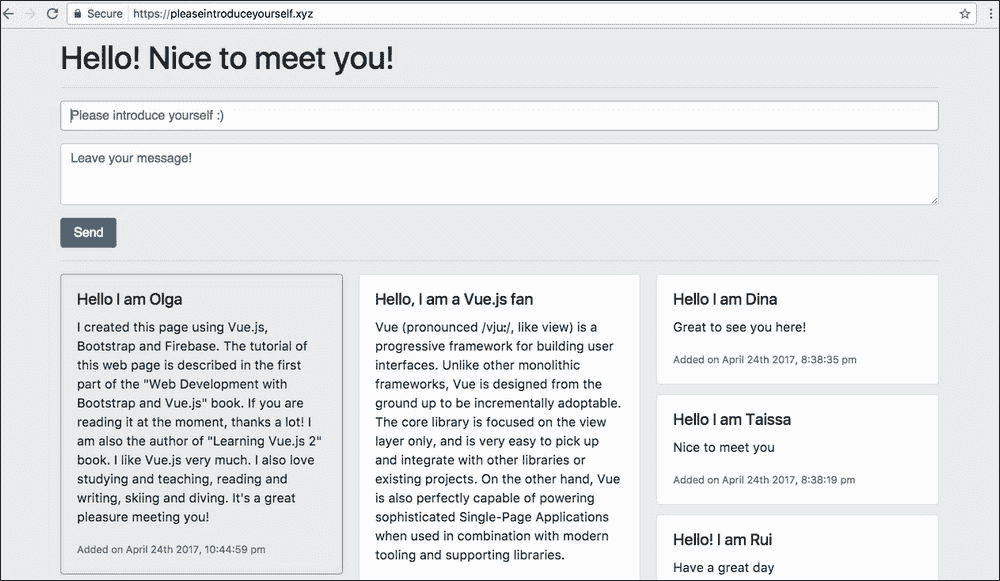
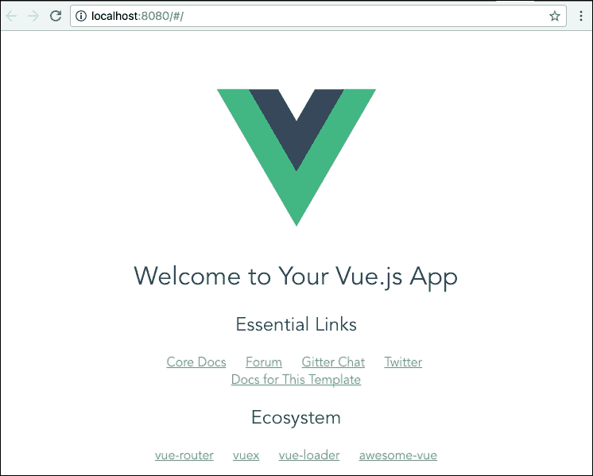
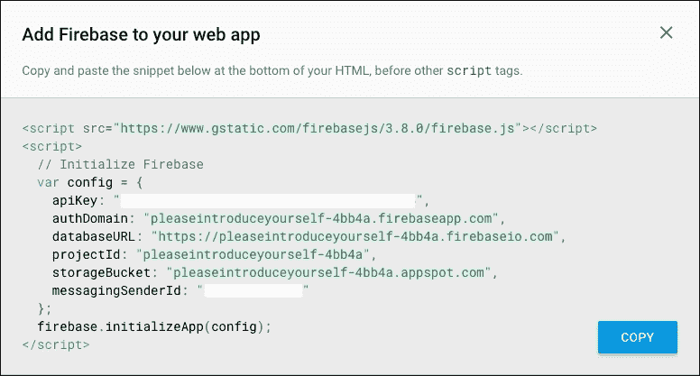
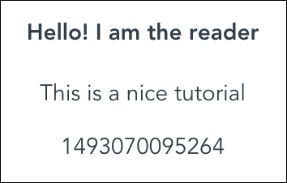
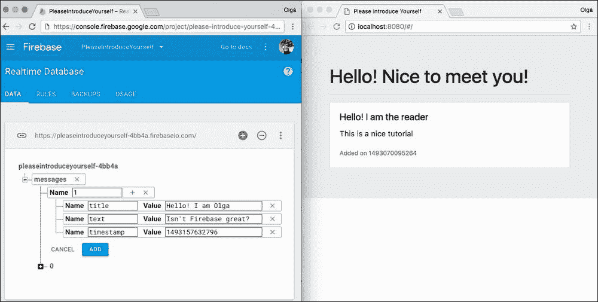
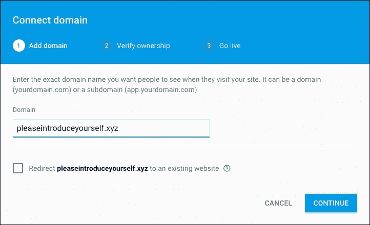
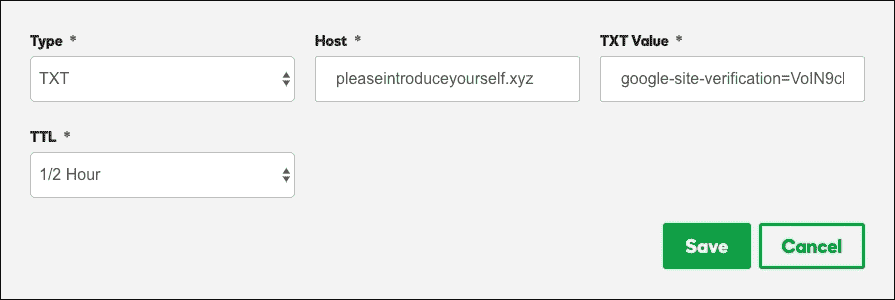

# 第一章：请介绍你自己 - 教程

# 你好，用户

你好亲爱的读者，我的名字是 Olga。你也想介绍一下自己吗？打开[`pleaseintroduceyourself.xyz/`](https://pleaseintroduceyourself.xyz/)给我和其他读者留言。

页面本身看起来并不特别。它只是一个允许用户写消息的网页，然后，这条消息立即与其他用户的消息一起以倒序显示：



请介绍你自己页面

你想知道我创建这个页面花了多长时间吗？大约花了我半个小时，我不仅指的是编写 HTML 标记或者倒序排列消息，还包括数据库设置、部署和托管。

你可能注意到第一条消息从未改变，实际上这是我的消息，我写道我喜欢学习和教学。这是真的。这就是为什么我会把这一章节专门用来教你如何在短短 15 分钟内创建完全相同的页面。你准备好了吗？让我们开始吧！

# 在 Firebase 控制台中创建一个项目

如果你还没有谷歌账号，但是你真的想继续这个教程，那么，很抱歉，你这次必须创建一个。Firebase 是由谷歌提供的服务，所以谷歌账号是必须的。

如果你已经有账号，请登录 Firebase 控制台：

[`console.firebase.google.com/`](https://console.firebase.google.com/)。

让我们开始创建你的新 Firebase 项目。点击**添加项目**按钮。给它一个有意义的名字，并从列表中选择你的国家。完成后，点击**创建项目**：


使用 Firebase 控制台创建一个项目

完成了！现在，你可以使用 Firebase 后端为你的应用程序提供支持，包括实时数据库、认证机制、托管和分析。

## 向 Firebase 应用程序数据库添加第一个条目

让我们添加第一个数据库条目。点击左侧的**数据库**选项卡。你应该看到类似这样的仪表板：


Firebase 项目仪表板上的实时数据库

通过点击加号来添加一个名为`messages`的条目，以及作为键值对象包含`title`、`text`和`timestamp`的第一条消息：


向 Firebase 实时数据库添加第一个值

点击**添加**按钮，您的数据库将保留添加的条目。添加尽可能多的消息条目，或者保持原样。现在，为了简单起见，让我们改变我们数据库的规则，使其对每个人都可读可写。注意！不要为公共使用的生产环境做这个操作。在这个例子中，我们只是想测试一些 Firebase 功能，但是您未来的应用程序必须是智能和安全的。点击**规则**选项卡，在打开的文本区域中输入以下规则：

```js
{
  "rules": {
    ".read": true,
    ".write": true
  }
}
```

因此，您的**规则**选项卡现在看起来是这样的：


更改规则后的规则选项卡

点击**发布**按钮，您就完成了！现在，开始在我们的应用程序中使用这些数据将会很有趣。但是，首先我们必须创建这个应用程序，并将其连接到我们的项目中。

# 搭建 Vue.js 应用程序

在本节中，我们将创建一个*Vue.js*应用程序，并将其连接到我们在上一步中创建的 Firebase 项目。确保您的系统上已安装*Node.js*。

您还必须安装 Vue.js。请查看官方 Vue 文档的说明页面[`vuejs.org/v2/guide/installation.html`](https://vuejs.org/v2/guide/installation.html)。或者，只需运行`npm install`命令：

```js
**$ npm install -g vue-cli**

```

现在，一切都准备好开始搭建我们的应用程序了。转到您希望应用程序驻留的文件夹，并输入以下代码行：

```js
**vue init webpack please-introduce-yourself**

```

它会问您几个问题。只需选择默认答案，然后对每个问题按*Enter*。初始化后，您就可以安装和运行您的应用程序了：

```js
**cd please-introduce-yourself**
**npm install**
**npm run dev**

```

如果一切正常，以下页面将自动在您的默认浏览器中打开：



安装和运行后的默认 Vue.js 应用程序

如果不是，请再次检查 Vue.js 官方安装页面。

## 将 Vue.js 应用程序连接到 Firebase 项目

要能够将您的应用程序连接到 Firebase 项目，您必须安装*Firebase*和*VueFire*。在您的新应用程序的根目录中运行`npm install`命令：

```js
**cd please-introduce-yourself**
**npm install firebase vuefire --save**

```

现在，您可以在应用程序内部使用 Firebase 强大的功能。让我们检查一下是否成功！我们只需执行以下操作：

+   导入 Firebase

+   创建一个包含 Firebase 应用程序 ID、项目域、数据库域和连接到我们项目所需的其他一些内容的`config`对象

+   编写将使用 Firebase API 和创建的`config`文件连接到 Firebase 项目的代码。

+   使用它

我们从哪里获取配置我们的 Firebase 实例所需的信息？转到 Firebase 控制台，单击**概述**选项卡右侧的齿轮图标，然后选择**项目设置**。现在，单击**将 Firebase 添加到您的网络应用**按钮：


单击**将 Firebase 添加到您的网络应用**按钮

将打开一个包含我们所需所有信息的弹出窗口：



所需的配置对象的所有信息都在这里

好的，现在，只需保留此弹出窗口打开，转到您的 Vue 应用程序，并打开位于应用程序的`src`目录中的`main.js`文件。在这里，我们需要告诉我们的 Vue 应用程序它将使用 VueFire。这样，我们就能在应用程序内部使用 Firebase 提供的所有功能。将以下行添加到`main.js`文件的导入部分：

```js
//main.js
import VueFire from 'vuefire'
**Vue.use(VueFire)**

```

太棒了！现在，打开`App.vue`文件。在这里，我们将导入 Firebase 并在 Vue 应用程序内初始化我们的 Firebase 应用程序。在`<script>`标签内添加以下代码行：

```js
//App.vue
<script>
  import Firebase from 'firebase'

  let config = {
    apiKey: 'YOUR_API_KEY',
    authDomain: 'YOUR_AUTH_DOMAIN',
    databaseURL: 'YOUR_DATABASE_URL',
    projectId: 'YOUR_PROJECT_ID',
    storageBucket: 'YOUR_STORAGE_BUCKET',
    messagingSenderId: 'YOUR_MESSAGING_SENDER_ID'
  }

  let app = Firebase.initializeApp(config)
</script>
```

从我们在上一步中打开的弹出窗口中复制`config`对象信息所需的内容。

现在，我们将获取到我们的消息数据库对象的引用。使用 Firebase API 非常简单：

```js
//App.vue
<script>
  <...>
 **let db = app.database()**
 **let messagesRef = db.ref('messages')**
</script>
```

我们快完成了。现在，我们只需在 Vue 数据对象中导出`messages`对象，以便我们能够在模板部分内使用它。因此，在`export`部分内，添加一个带有`firebase`键的条目，并将`messages`指向`messagesRef`：

```js
export default {
  firebase: {
    messages: messagesRef
  },
}
```

现在，在`<template>`标签内，我们将使用`v-for`指令来遍历`messages`数组并打印有关每条消息的所有信息。请记住，每条消息由`title`、`text`和`timestamp`组成。因此，请在模板中添加以下`<div>`：

```js
//App.vue
<div v-for="message in messages">
  <h4>{{ message.title }}</h4>
  <p>{{ message.text }}</p>
  <p>{{ message.timestamp }}</p>
</div>
```

最后，您的`App.vue`组件将如下所示：

```js
//App.vue
<template>
  <div id="app">
    <div v-for="message in messages">
      <h4>{{ message.title }}</h4>
      <p>{{ message.text }}</p>
      <p>{{ message.timestamp }}</p>
    </div>
  </div>
</template>

<script>
  import Firebase from 'firebase'

  let config = {
    apiKey: 'YOUR_API_KEY',
    authDomain: 'YOUR_AUTH_DOMAIN',
    databaseURL: 'YOUR_DATABASE_URL',
    projectId: 'YOUR_PROJECT_ID',
    storageBucket: 'YOUR_STORAGE_BUCKET',
    messagingSenderId: 'YOUR_MESSAGING_SENDER_ID'
  }

  let app = Firebase.initializeApp(config)
  let db = app.database()
  let messagesRef = db.ref('messages')
  export default {
    name: 'app',
    firebase: {
      messages: messagesRef
    }
  }
</script>
```

如果您在应用程序初始化时选择了默认的代码检查设置，那么您从 Firebase 复制并粘贴到应用程序中的代码将无法通过代码检查。这是因为 Vue-cli 初始化的默认代码检查设置要求使用单引号，并且行尾不使用分号。顺便说一下，*Evan You*特别自豪于这个不使用分号的规则。所以，请让他高兴一下；从复制的代码中删除所有分号，并将双引号替换为单引号。

您难道不好奇去查看页面吗？如果您还没有运行应用程序，请切换到应用程序文件夹并运行它：

```js
**cd please-introduce-yourself**
**npm run dev**

```

我非常确定您看到了以下截图：



显示来自 Firebase 数据库的 Vue.js Web 应用程序信息

恭喜！您已成功完成我们教程的第一部分，将 Vue.js 应用程序连接到 Firebase 实时数据库。

# 添加基于 Bootstrap 的标记

让我们通过添加 Bootstrap 并使用其类来为我们的应用程序添加基本样式。

首先，让我们从 Bootstrap 的 CDN 中包含 Bootstrap 的`CSS`和`JS`文件。我们将使用即将推出的版本 4，目前还处于 alpha 版。打开`index.html`文件，在`<head>`部分添加必要的`link`和`script`标签：

```js
//index.html
<link
rel="stylesheet"
href="https://maxcdn.bootstrapcdn.com/bootstrap/4.0.0-alpha.6/css/bootstrap.min.css"crossorigin="anonymous">
<script src="https://code.jquery.com/jquery-3.2.1.min.js"crossorigin="anonymous"></script>
<script src="https://npmcdn.com/tether@1.2.4/dist/js/tether.min.js">
</script>
<script src="https://maxcdn.bootstrapcdn.com/bootstrap/4.0.0-alpha.6/js/bootstrap.min.js"crossorigin="anonymous">
</script>
```

您可能已经注意到我还添加了*jQuery*和*Tether*依赖项；这是因为 Bootstrap 依赖于它们。

现在，我们可以在应用程序中使用 Bootstrap 类和组件。让我们从使用 Bootstrap 的类开始添加一些样式。

我将整个应用程序`div`标签包装到`jumbotron`类中，然后将其内容包装到`container`类中。因此，模板将会有些不同：

```js
//App.vue
<template>
  <div id="app" class="**jumbotron**">
    <div class="**container**">
      <h1>Hello! Nice to meet you!</h1>
    <hr />
    <div v-for="message in messages">
    <...>
    </div>
  </div>
</div>
</template>
```

查看页面；它看起来不一样吗？现在，我想将每条消息的内容包装在`card`类中。卡片似乎是这种东西的适当容器。查看官方 Bootstrap 关于卡片的文档[`v4-alpha.getbootstrap.com/components/card/`](https://v4-alpha.getbootstrap.com/components/card/)。我将添加一个带有`card-group`类的`div`标签，并将所有带有消息的卡片放在这个容器中。因此，我不需要担心定位和布局。一切都会自动变得响应！因此，消息的标记将如下所示：

```js
//App.vue
<template>
<...>
  <div class="**card-group**">
    <div class="card" v-for="message in messages">
      <div class="**card-block**">
        <h5 class="**card-title**">{{ message.title }}</h5>
        <p class="**card-text**">{{ message.text }}</p>
        <p class="**card-text**"><small class="text-muted">Added on {{ message.timestamp }}</small></p>
      </div>
    </div>
  </div>
</template>
```

查看页面。它看起来几乎很好！在几个步骤中，我们能够很好地显示存储在我们 Firebase 数据库中的消息。尝试使用 Firebase 实时数据库仪表板添加另一条消息。保持网页打开！填写 Firebase 数据库字段：



向 Firebase 数据库添加条目

现在，点击“添加”按钮。新消息会自动出现在您的网页上：


一旦我们点击“添加”按钮，新消息立即出现在我们的网页上

这不是很棒吗？现在，我们可以添加任意多的消息。我们还可以删除它们并操纵它们，所有的更改都会自动传播到我们的网页上。这很不错，但我们真的想继续在后端数据库上玩耍，看到网页上的变化吗？当然不！我们希望我们网页的用户能够使用我们的页面而不是我们的数据库仪表板来添加他们的消息。让我们回到我们的 Vue.js 应用程序，并添加一个表单，让我们能够添加新的消息。

## 使用 Bootstrap 添加表单

让我们向我们的应用程序添加一个简单的表单，这样我们就可以向我们的留言板添加新消息。查看 Bootstrap 关于表单的文档[`v4-alpha.getbootstrap.com/components/forms/`](https://v4-alpha.getbootstrap.com/components/forms/)。

让我们在消息列表之前添加一个表单。这个表单将包含标题的输入，消息的文本区域和提交按钮。它将看起来像这样：

```js
//App.vue
<template>
  <div id="app" class="jumbotron">
    <div class="container">
      <h1>Hello! Nice to meet you!</h1>
      <hr />
      <form>
        <div>
 **<input maxlength="40" autofocus placeholder="Please introduce yourself :)" />**
        </div>
        <div>
 **<textarea placeholder="Leave your message!"  rows="3">**
 **</textarea>**
        </div>
 **<button type="submit">Send</button>**
      </form>
      <hr />
      <...>
    </div>
  </div>
</template>
```

看看页面。看起来不太美观，是吗？


我们的表单看起来不太美观。

实际上，让我们诚实一点，它看起来很丑！但是，使用 Bootstrap 类，修复它真的很容易。如果我们将`form-control`类添加到`input`和`textarea`元素中，将`form-group`类添加到围绕这些元素的每个`div`标签中，可能还将`btn btn-primary`类添加到`submit`按钮中…嗯，我们会得到更好的东西！


表格看起来真的很漂亮，使用了 Bootstrap 类

好的，现在我们有一个看起来不错的表单，但是如果我们尝试填写它，什么也不会发生。我们必须使其功能化，为此，我们将使用 Vue.js 的强大功能。

# 使用 Vue.js 使事情功能化

那么，我们想要通过我们的表单实现什么？我们希望创建新消息。这条消息必须由标题、文本和时间戳组成。我们还希望将此消息添加到我们的消息引用数组中。

让我们将这条新消息称为`newMessage`，并将其添加到`App.vue`的`data`属性中：

```js
//App.vue
<script>
  <...>
  export default {
    data () {
      return {
 **newMessage: {**
 **title: '',**
 **text: '',**
 **timestamp: null**
 **}**
      }
    },
  <...>
  }
</script>
```

现在，让我们将`newMessage`对象的标题和文本绑定到表单的`input`和`textarea`上。我们还将一个名为`addMessage`的方法绑定到表单的提交处理程序，使整个表单的标记看起来像这样：

```js
<template>
<...>
  <form **@submit="addMessage"**>
    <div class="form-group">
      <input class="form-control"**v-model="newMessage.title"**maxlength="40"autofocus  placeholder="Please introduce yourself :)" />
    </div>
    <div class="form-group">
      <textarea class="form-control"**v-model="newMessage.text"** placeholder="Leave your message!"  rows="3"></textarea>
    </div>
    <button class="btnbtn-primary" type="submit">Send</button>
  </form>
  <...>
</template>
```

嗯，我们已经将`"addMessage"`方法绑定到表单的`submit`回调，但是我们还没有定义这个方法！因此，让我们定义它。在我们的`App.vue`导出部分添加`methods`对象，并在其中定义`addMessage`方法。此方法将从我们的表单接收事件属性，然后只需获取`newMessage`对象并将其推送到`messagesRef`数组中。听起来很容易吧？

```js
//App.vue
<script>
  export default {
  <...>
 **methods: {**
 **addMessage (e) {**
 **e.preventDefault()**
 **this.newMessage.timestamp = Date.now()**
 **messagesRef.push(this.newMessage)**
 **}**
 **}**
  }
</script>
```

现在，打开页面，填写表单，然后点击**发送**按钮。您会立即看到您的消息出现在消息列表中：


我们在表单中输入的消息立即传播到消息列表中

还有一些东西我们需要修复。我们不希望填写表单的值在消息添加到消息列表后仍然保留在那里。因此，我们需要在`addMessage`方法中清除它。可能，至少对标题进行一些基本检查也会很好。因此，将方法重写如下：

```js
//App.vue
addMessage (e) {
  e.preventDefault()
 **if (this.newMessage.title === '') {**
 **return**
 **}**
  this.newMessage.timestamp = Date.now()
  messagesRef.push(this.newMessage)
 **this.newMessage.text = ''**
 **this.newMessage.title = ''**
 **this.newMessage.timestamp = null**
}
```

现在，如果你开始添加更多的消息，事情看起来有点奇怪。我们显示消息的方式可能不是最适合我们的情况。你还记得我们将消息卡片包装在带有`card-group`类的`div`中吗？让我们尝试用`card-columns`类替换它，看看是否更好看。事实上，是的。让我们保持这样。

## 添加实用函数使事情看起来更美观

我们已经有一个完全功能的单页面应用程序，但它仍然缺少一些令人惊叹的东西。例如，时间显示为时间戳并不真的美观。让我们编写实用函数，将我们的时间戳转换成美观的形式。

我们将使用*Moment.js*库（[`momentjs.com/`](https://momentjs.com/)）。在应用程序文件夹中安装它：

```js
**npm install moment --save**

```

创建一个名为`utils`的文件夹。在这个文件夹中添加一个名为`utils.js`的文件。导入`moment`并编写以下函数：

```js
//utils.js
import moment from 'moment'

function dateToString (date) {
  if (date) {
 **return moment(date).format('MMMM Do YYYY, h:mm:ss a')**
  }
  return''
}
```

在文件的末尾导出它：

```js
//utils.js
<...>
export { dateToString }
```

让我们将这个函数导入到`App.vue`中，并用它来格式化我们的时间戳。打开`App.vue`文件，在`script`部分的开头添加`import`语句：

```js
//App.vue
<script>
  import Firebase from 'firebase'
 **import { dateToString } from './utils/utils'**
  <...>
</script>
```

为了能够在 Vue 模板中使用这个函数，我们必须在`methods`部分导出它。只需向`methods`对象添加一个新条目：

```js
//App.vue
<script>
  export default {
    <...>
    methods: {
 **dateToString: dateToString**,
      <...>
    }
</script>
```

由于我们使用 ES6，我们可以直接编写以下代码行：

```js
methods: {
 **dateToString**
}
```

现在，我们可以在模板部分使用这种方法。只需将`message.timestamp`绑定对象包装在`dataToString`方法中：

```js
<p class="card-text"><small class="text-muted">Added on {{ **dateToString(message.timestamp)** }}</small></p>
```

查看页面！现在，你可以看到美观的日期，而不是 Unix 时间戳。

### 练习

我有一个小练习给你。你看到了将实用函数添加到将时间戳转换为格式良好的日期是多么容易。现在，创建另一个实用函数，将其命名为`reverse`。这个函数应该用于以相反的顺序显示消息数组，所以最近的消息应该首先出现。如果你有疑问，请查看本章的代码。

## 将消息卡片提取到它们自己的组件中

你可能注意到了演示应用程序的第一条消息总是在那里。它不会被其他新消息项移动。所以，它似乎是一种特殊的消息，并且以一种特殊的方式对待。事实上，确实如此。如果你想让一张卡片固定，只需在遍历其他消息的`card`元素之前添加它。你还可以给这张卡片添加一些类，以显示它是真的特别。在我的例子中，我添加了 Bootstrap 的`card-outline-success`类，用漂亮的绿色轮廓显示元素：

```js
//App.vue
<div class="card-columns">
 **<div class="card card-outline-success">**
 **<div class="card-block">**
 **<h5 class="card-title">Hello!</h5>**
 **<p class="card-text">This is our fixed card!</p>**
 **<p class="card-text"><small class="text-muted">Added on {{ dateToString(Date.now()) }}</small></p>**
 **</div>**
 **</div>**
  <div class="card" v-for="message in messages">
    <div class="card-block">
      <h5 class="card-title">{{ message.title }}</h5>
      <p class="card-text">{{ message.text }}</p>
      <p class="card-text"><small class="text-muted">Added on {{ dateToString(message.timestamp) }}</small></p>
    </div>
  </div>
</div>
```

现在，你有一张漂亮的固定卡片，颜色与其他卡片的颜色不同。但是... 你没有看到任何问题吗？我们在模板中重复了完全相同的代码两次。我非常确定你知道任何开发者的黄金法则：DRY—不要重复自己！

让我们将卡片提取到一个单独的组件中。这很容易。在`components`文件夹中添加一个名为`Card.vue`的组件。这个组件的代码非常简单：

```js
//Card.vue
<template>
  <div class="card">
    <div class="card-block">
      <h5 class="card-title">**{{ title }}**</h5>
      <p class="card-text">**{{ text }}**</p>
      <p class="card-text"><small class="text-muted">**{{ footer }}**</small></p>
    </div>
  </div>
</template>

<script>
  export default {
    props: [**'title', 'text', 'footer'**]
  }
</script>
```

现在，让我们在`App.vue`中调用这个组件，为标题、文本和页脚添加不同的值。首先，它应该在 Vue 的`components`对象中被导入和导出：

```js
//App.vue
<script>
<...>
 **import Card from './components/Card'**
  <...>
  export default {
  <...>
 **components: {**
 **Card**
 **}**
  }
</script>
```

现在，我们可以在模板中使用`<card>`元素。我们需要绑定标题、文本和页脚。页脚实际上是显示**添加于...**的文本。因此，第一张卡片的标记看起来像这样：

```js
//App.vue
<template>
  <div class="card-columns">
    <card class="card-outline-success"**:title="'Hello!'":text="'This is our fixed card!'":footer="'Added on ' + dateToString(Date.now())"**></card>
  </div>
</div>
</template>
```

其他消息的列表将遵循相同的逻辑。对于`messages`数组中的每条消息，我们将绑定相应消息的条目（标题、文本和时间戳）。因此，消息卡片列表的标记看起来像这样：

```js
<div class="card-columns">
<...>
  <card v-for="message in messages"**:title="message.title":text="message.text":footer="'Added on ' + dateToString(message.timestamp)"**></card>
</div>
</div>
```

你可以看到，我们用两行代码替换了十四行代码！当然，我们的组件也包含一些代码，但现在，我们可以一遍又一遍地重用它。

### 练习

我们将卡片代码提取到其各自的组件中的方式无疑是很好的，但我们为第一条消息绑定属性的方式有点丑陋。如果在某个时候我们需要更改消息的文本怎么办？首先，很难在标记内找到文本。此外，在标记属性内管理文本非常困难，因为我们必须非常小心，以免弄乱双引号/单引号。而且，承认吧，这很丑陋。您在这个练习中的任务是将第一条消息的标题、文本和日期提取出来，放入数据对象中，并以与绑定其他消息相同的方式绑定它。如果您对这个练习有疑问，请查看本章的代码。

### 注意

不要被提供的代码中的`v-bind`指令所困惑。我们已经在使用它，只是它的缩写版本——在分号后面写绑定属性的名称。因此，例如，`v-bind:messages`与`:messages`是相同的。

# 部署您的应用程序

好了，现在我们手头有一个完全可用的应用程序，是时候将其公开了。为了做到这一点，我们将把它部署到 Firebase 上。

首先安装 Firebase 工具：

```js
**npm install -g firebase-tools**

```

现在，您必须告诉 Firebase 工具，您实际上是一个拥有账户的 Firebase 用户。为此，您必须使用 Firebase 工具登录。运行以下命令：

```js
**firebase login**

```

按照说明进行登录。

现在，您必须在应用程序中初始化 Firebase。从应用程序根目录调用以下内容：

```js
**firebaseinit**

```

您将被问一些问题。对于第一个问题，请选择第三个选项：


对于第一个问题，选择 Hosting 选项

从项目列表中选择`PleaseIntroduceYourself`项目以关联到应用程序。

初始化已完成。检查项目文件夹中是否已创建名为`firebase.json`的文件。该文件可以包含无数个配置。在这方面，请查看官方 Firebase 文档[`firebase.google.com/docs/hosting/full-config`](https://firebase.google.com/docs/hosting/full-config)。对于我们来说，部署的公共目录的基本指示就足够了。`vue-cli`构建生产就绪资产的目录称为`dist`；因此，我们希望部署该目录的内容。因此，请将以下代码添加到您的`firebase.json`文件中：

```js
{
  "hosting": {
    "public": "**dist**",
    "ignore": [
      "firebase.json",
      "**/.*",
      "**/node_modules/**"
    ]
  }
}
```

不要忘记保存您的`firebase.json`文件。现在让我们构建和部署我们的应用程序。听起来像是一个很大的 DevOps 任务，对吧？其实并不是很大。运行`npm build`，然后运行`firebase deploy`。

```js
**npm run build**
**firebase deploy**

```

有多难？成功部署后，Firebase 将输出您项目的 URL。现在，您可以开始使用它并将其发送给您的朋友。这可能不是世界上最美丽的 URL，对吧？也许您想将其连接到您的域名？当然，这是可能的！

# 额外里程-将您的 Firebase 项目连接到自定义域

将 Firebase 项目连接到自定义域名非常容易。首先，当然，您需要购买这个域名。对于这个应用程序，我购买了*pleaseintroduceyourself*域名，使用最便宜的顶级域名`.xyz`。在 GoDaddy 上，每年花费我一美元多一点（[`godaddy.com`](https://godaddy.com)）。拥有了您的域名之后，就非常容易了。转到项目的 Firebase Web 控制台。点击左侧的**托管**选项卡。然后，点击**连接域**按钮：


点击连接域按钮

在弹出窗口中，输入您的域名：



输入您的域名

它会建议您向您的域名添加 TXT DNS 记录。只需打开您的 DNS 提供商页面，选择您的域名，找出如何添加 DNS 记录，并添加类型为`TXT`的记录。在我的情况下，使用 GoDaddy，记录添加部分看起来像这样：



向我们的域名添加 DNS TXT 记录

握手建立后（注意，可能需要一些时间），Firebase 将建议您进行最后一步-向您的域名添加**A**记录。按照与上一步完全相同的步骤进行；只是不再添加类型为`TXT`的记录，而是添加类型为**A**的记录。

直到更改完全传播需要一些时间。在我的情况下，大约需要一个小时。过一段时间，您将能够使用`https://<您的域名>.<您的顶级域名>`地址打开您的新页面。在我的情况下，正如您已经知道的那样，它是[`pleaseintroduceyourself.xyz/`](https://pleaseintroduceyourself.xyz/)。

# 总结

在本章中，我们按照教程从头开始开发了一个单页面应用程序。我们使用 Vue.js 框架来构建我们的应用程序，使用 Bootstrap 框架来应用样式，使用 Firebase 平台来管理应用程序的持久层和托管。

尽管能够取得可观的成果（一个完全功能的部署应用程序），但我们在不了解背后发生的事情的情况下完成了所有工作。教程没有解释 Vue.js、Bootstrap 或 Firebase 是什么。我们只是理所当然地接受了它。

在下一章中，我们将详细了解底层技术。我们将做以下事情：

+   仔细研究 Vue.js 框架，从基本理解开始，然后涵盖诸如指令、数据绑定、组件、路由等主题

+   深入了解 Bootstrap 框架，查看可以使用它实现什么以及如何实现

+   更好地了解 Firebase 平台；我们将获得一些基本的了解，并涉及更复杂的主题，如数据存储或函数

+   了解使用这三个不同项目的不同技术，为我们的应用程序增加简单性、强大性和灵活性
