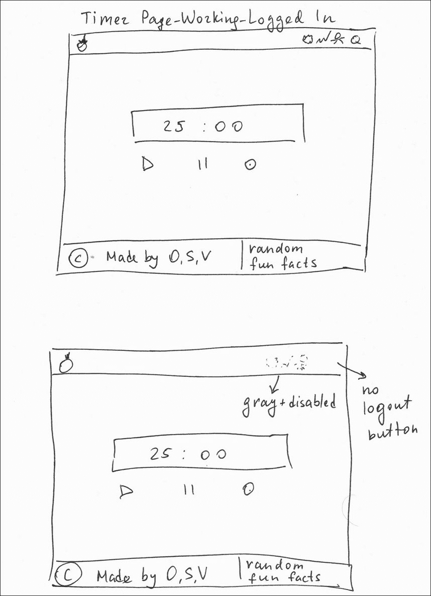
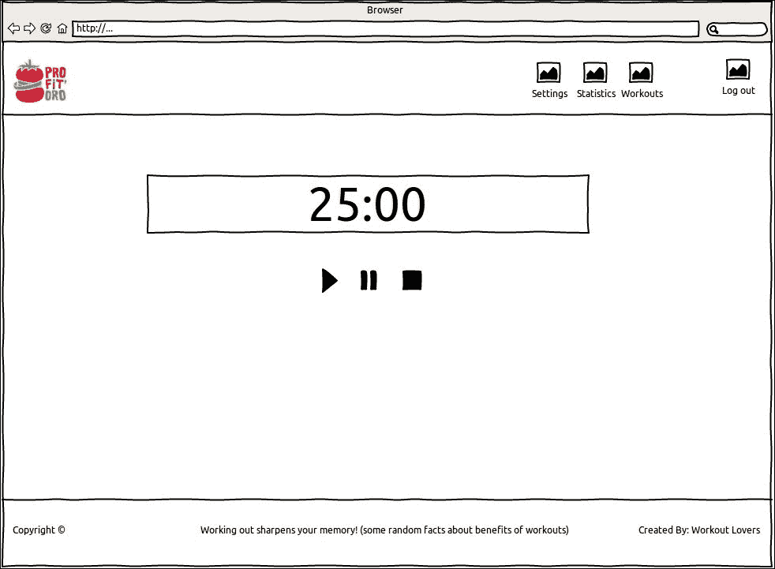
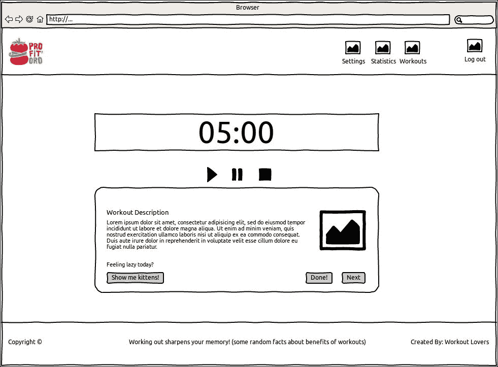

# 第三章：让我们开始吧

在上一章中，我们讨论了本书中将使用的三种主要技术，以构建我们的应用程序。我们深入探讨了 Vue.js 的许多内容；我们介绍了 Bootstrap 的一些功能，并检查了使用 Google Firebase 控制台可以实现什么。我们知道如何使用 Vue.js 从头开始创建应用程序。我们知道如何在 Bootstrap 的帮助下使其美观，也知道如何使用 Google Firebase 将其部署到实时环境中！这意味着我们已经百分之百准备好开始开发我们的应用程序了！

编写应用程序是一个有趣、具有挑战性和令人兴奋的过程……只要我们知道我们要编写什么，对吧？为了知道我们将要编写什么，我们必须定义应用程序的概念、其要求和目标用户。在本书中，我们不会完全涉及设计构建的整个过程，因为对此，您有很多其他书籍，因为这是一个大科学。

在本书中，特别是在本章中，在进行实施之前，我们至少会定义一组角色和用户故事。因此，在本章中，我们将执行以下操作：

+   阐述我们将用应用程序解决的问题

+   定义一些角色和用户故事

+   从用户故事中提取名词和动词

+   绘制将定义我们应用程序的主要屏幕和区域的模拟图

# 陈述问题

世界上有许多时间管理技术。一些大师和专业人士已经就如何有效管理时间，以便您高效并且所有的 KPI 值都高于任何可能的生产力基准进行了大量演讲。其中一些演讲真的很棒。当涉及到时间管理演讲时，我总是建议观看 Randy Pausch 在[`youtu.be/oTugjssqOT0`](https://youtu.be/oTugjssqOT0)上的演讲。

说到时间管理技术，有一种我特别喜欢的流行技术，我觉得非常简单易用。它被称为番茄钟（[`en.wikipedia.org/wiki/Pomodoro_Technique`](https://en.wikipedia.org/wiki/Pomodoro_Technique)）。这种技术包括以下原则：

+   在一定时间内工作，没有任何干扰。这段时间可以是 20 到 25 分钟，被称为番茄钟

+   在工作的番茄钟后，您有 5 分钟的休息时间。在这个休息时间里，您可以做任何您想做的事情——查看电子邮件、社交网络等等

+   在完成四个番茄钟后，你有权享受一个持续 10 到 15 分钟的较长休息时间。

番茄钟有许多实现方式。其中一些允许你配置工作番茄钟和短暂和长暂休息的时间。有些在工作番茄钟期间阻止社交网络页面；有些会发出噪音。在《学习 Vue.js 2》一书中，我们还构建了一个简单的番茄钟，它在工作期间发出棕色噪音，并在短暂休息期间显示随机小猫。

如果你正在阅读这本书，那么很可能你是一名开发人员，你一天中的大部分时间都是坐着，或者可能是站着，因为站立式办公桌如今非常流行。你在工作日（或夜晚）中改变姿势的频率有多高？你是否有背部问题？你去健身房吗？你喜欢慢跑吗？你多久在家锻炼一次？作为一名开发人员需要高度集中注意力，我们很容易忘记一点关于自己的事情。

在这本书中，我们将再次构建一个番茄钟。这次，它不仅会尝试解决时间管理问题，还会解决健身管理问题。它不会让你在休息期间做任何你想做的事情或者显示一些随机小猫，而是会告诉你做简单的锻炼。锻炼的种类从非常简单的头部旋转练习到俯卧撑和弹跳。用户可以根据他们所在办公室的类型选择一组自己喜欢的锻炼。用户还可以添加新的锻炼。锻炼也可以被评分。

因此，我们将实现的番茄钟的主要原则如下：

+   不间断地工作。专注于你正在做的事情。

+   在休息期间进行锻炼。

+   合作并添加新的令人兴奋的锻炼，可以被你和应用程序的其他用户使用。

# 需求收集

现在我们知道要构建什么，让我们为应用程序定义一系列要求。该应用程序主要用于显示计时器和展示锻炼。因此，让我们定义它必须具备的功能。以下是我的功能要求列表：

+   该应用程序应该显示倒计时计时器。

+   倒计时计时器可以从 25 到 0 分钟，从 5 到 0 分钟，或者从 10 到 0 分钟。

+   在应用程序的任何时刻都可以启动、暂停和停止倒计时计时器。

+   当时间到达 0 并且下一个休息时间或工作番茄开始时，应用程序应该发出一些声音。

+   该应用程序应该在短暂和长时间休息期间显示一个锻炼项目。可以跳过当前的锻炼项目并切换到下一个。也可以在休息期间完全跳过锻炼项目，只是盯着小猫。也可以标记给定的锻炼项目为已完成。

+   该应用程序必须提供认证机制。经过认证的用户可以配置番茄定时器，向系统添加新的锻炼项目，并查看他们的统计数据。

+   认证用户的统计数据显示每天、每周和每月完成的锻炼项目数量。

+   经过认证的用户可以配置番茄工作法定时器，如下所示：

+   为长时间工作的番茄定时器选择一个在 15 到 30 之间的值

+   为短暂休息定时器选择一个在 5 到 10 之间的值

+   为长休息定时器选择一个在 10 到 15 之间的值

+   经过认证的用户可以配置他们喜欢的锻炼项目集进行显示。

+   经过认证的用户可以创建新的锻炼项目并将其添加到系统中。

+   每个锻炼项目包括四个部分：标题、描述、图片和评分。

我还有一个非功能需求的基本清单，包括两个项目：

+   该应用程序应该使用持久存储来存储其数据——在我们的情况下是 Firebase 的实时数据库

+   该应用程序应该是响应式的，并且可以在多个平台和设备上运行

我想这已经足够支持我们的番茄工作法的功能了。或者，既然涉及健身，也许我们可以称之为 PoFIToro？或者，也许，既然我们的身体得到了一些好处，让我们称之为*ProFitOro*。

# 人物角色

通常，在开发应用程序之前，我们必须定义其目标用户。为此，我们要与应用程序的潜在用户进行多次问卷调查。问卷调查通常包括关于用户个人数据的问题，如年龄、性别等。还应该有关于用户使用模式的问题——操作系统、桌面或移动设备等。当然，还应该有关于应用程序本身的问题。例如，对于 ProFitOro 应用程序，我们可以问以下问题：

+   你每天在办公室花费多少小时？

+   你在工作日里在办公室坐多久？

+   你多久进行一次像慢跑、健身锻炼等体育活动？

+   你是在办公室工作还是在家工作？

+   你的工作场所有没有可以做俯卧撑的地方？

+   你有背部问题吗？

收集完所有问卷后，用户根据相似的模式和个人数据被分成不同的类别。然后，每个用户的类别形成一个单一的角色。我将在这里为 ProFitOro 应用程序留下四个角色。

让我们从一个叫做 Alex Bright 的虚构角色开始：

*Alex Bright*

**年龄**：32 岁

**性别**：男性

**教育**：硕士

**职业**：软件工程师，全职

**使用模式**：在办公室工作，使用运行 Ubuntu 的笔记本电脑和 iPhone。

**最喜欢的浏览器**：Google Chrome

**健康和健身**：每个月跑 5 公里。偶尔感到背部疼痛

让我们继续我们下一个虚构的角色—Anna Kuznetsova。

*Anna Kuznetsova*

**年龄**：22 岁

**性别**：女性

**教育**：学士学位

**职业**：学生

**使用模式**：大部分时间在家使用运行 Windows 的台式机和安卓手机。

**最喜欢的浏览器**：Mozilla Firefox

**健康和健身**：每周去健身房三次。没有任何健康问题

在写这本书的时候，我的一个朋友刚刚来我们家做客。他叫 Duarte，但我们取笑他叫 Dwart。他一露面，下一个角色就诞生了（请注意，我们的朋友 Duarte 离 45 岁还很远）：

*Dwart Azevedo*

**年龄**：45 岁

**性别**：男性

**教育**：博士

**职业**：副总工程师，全职

**使用模式**：在办公室工作，经常在共享工作空间和家里工作。使用 MacBook Pro 和 iPhone，并且在工作时花费大量时间坐着。

**健康和健身**：定期在家做锻炼。有时感到背部疼痛。

我丈夫 Rui 在一家名为 Gymondo 的在线健身公司工作。那里有一个名叫 Steve 的出色健身教练。他会把你推到极限。每次我和这个家伙一起做锻炼，之后我甚至都无法走路。这就是下一个角色诞生的原因：

*Steve Wilson*

**年龄**：35 岁

**性别**：男性

**职业**：健身教练，全职

**使用模式**：家里的 Windows 台式机

**健康和健身**：从不感到疼痛，每天每小时都训练

我们可以看到，我们的用户共同之处在于他们都花了一些时间保持相同的姿势（坐着），他们的工作需要一些专注力和可能需要时间管理技巧，他们有时需要改变姿势以防止背部问题。

# 用户故事

在定义了我们的用户之后，让我们写一些用户故事。当涉及编写用户故事时，我只需闭上眼睛，想象自己是这个人。让我们从德瓦特·阿塞韦多开始尝试这种心灵锻炼：

德瓦特·阿塞韦多

德瓦特的工作日包括会议、电话、视频会议和文书工作。今天，他非常忙碌，有访谈和会议。最后，他有几个小时可以处理整整一周等待他的文书工作。德瓦特希望能够以最有效率的方式度过这几个小时。他打开 ProFitOro 应用，点击“开始”，然后开始工作。在完成文书工作后，他点击“停止”，在 ProFitOro 中检查自己的统计数据，并感到高兴。尽管他的工作时间只有两个小时，但他能够完成他计划完成的一切。

因此，我们可以提出一个正式的用户故事，如下所示：

作为一个经过验证的用户，我想要在 ProFitOro 上查看我的统计页面，以便了解我的工作日的完整性。

让我们继续介绍我们的健身教练史蒂夫·威尔逊。

史蒂夫·威尔逊

史蒂夫是一名健身教练。他对人体、营养知识以及如何正确进行锻炼了如指掌。他有很多朋友——都是使用 ProFitOro 应用的程序员。他在工作结束后回到家，登录并打开 ProFitOro 应用，点击“锻炼”部分，并添加了新的背部锻炼。

因此，一个新的正式用户故事可以是这样的：

作为一名健身教练，我希望能够轻松添加新的锻炼，以丰富 ProFitOro 应用的锻炼内容。

让我们继续介绍我们的学生安娜·库兹涅佐娃。

安娜·库兹涅佐娃

安娜是一名学生。目前，她正在经历考试期。她每天都需要为考试学习。在夏天，当所有朋友都出去玩时，要专心看书并不容易。有人告诉她 ProFitOro 应用程序可以帮助她集中注意力，所以她开始在没有注册的情况下使用它。过了一会儿，她意识到这实际上有助于她集中注意力。使用了一段时间后，她想要检查自己工作了多少时间，做了多少练习。然而，这些信息对非注册用户不可用。因此，她点击应用程序首页的**注册**按钮，用她的电子邮件注册，现在她可以访问她的统计数据了。

因此，又出现了另一个用户故事：

*作为非注册用户，我希望能够注册自己，以便能够登录应用程序并访问我的统计数据*。

# 检索名词和动词

从用户故事中检索名词和动词是一项非常有趣的任务，它可以帮助你意识到你的应用程序由哪些部分组成。对于那些喜欢**统一建模语言**（**UML**）的人来说，当你从用户故事中检索名词和动词后，你几乎已经完成了类和实体关系图！不要低估要检索的名词和动词的数量。把它们都写下来——真的！之后可以删除那些没有意义的词。所以，让我们开始吧。

## 名词

我能从我的用户故事中检索到的名词如下：

+   工作日

+   会议

+   电话

+   面试

+   小时

+   天

+   周

+   应用程序

+   统计

+   工作时间

+   计划

+   健身

+   教练

+   人体

+   营养

+   锻炼

+   部分

+   练习

+   电子邮件

+   数据

+   页面

+   注册

## 动词

我能从用户故事中检索到的动词如下：

+   包括

+   忙碌

+   打开

+   花时间

+   开始

+   暂停

+   停止

+   检查

+   完成

+   计划

+   添加

+   创建

+   注册

+   认证

+   登录

+   集中

我们有**注册**、**登录**和**认证**等动词，以及**电子邮件**和**注册**等名词，这意味着该应用程序可能会有注册和非注册两种使用方式。这意味着第一页可能会包含*登录*和*注册*区域，并且以某种方式，它还应该包含一个链接到可以在任何身份验证之前使用的应用程序。

然后，我们有动词如**开始**，**暂停**和**停止**。这些是适用于我们的番茄钟的主要动作。我们可以启动应用程序，我们可以暂停它，当然，我们可以在工作日的任何时候停止它。顺便说一句，**工作日**是我们检索到的名词之一。这意味着我们的应用程序的主页面将包含倒计时计时器，可以启动、暂停和停止。

我们有很多与健身相关的名词——**健身**本身，**人体**，**锻炼**，**训练**等等。这实际上是我们试图通过这个应用程序实现的目标——在番茄休息时训练我们的*身体*。因此，在工作休息时进行锻炼。注意还有动词如**检查**和**完成**。因此，锻炼可以被*完成*，并且某事可以被*检查*，表明用户已经*完成*了锻炼。这就是为什么，这个番茄间隔表示应该包含一个*复选框*。它还应该包含一个链接，指向下一个锻炼，以防你在当前锻炼上花费的时间较少。它还可能有一个跳过按钮，以防你在这个间隔期间完全不喜欢这个锻炼。

查看名词**统计**。这并不意味着我们必须讨论平均数、抽样、人口和其他一些年前在学校学到的东西。在我们的语境中，名词**统计**意味着用户应该能够访问他们在*一天*、*一周*或*一个月*内进行的锻炼的*统计数据*（注意名词列表中实际上有**天**和**周**这两个名词）。因此，将会有另一个屏幕显示用户的*统计数据*。

**计划**和**工作时间**。一些事情可以被计划并可能被配置。这是有道理的——一些用户可能觉得对于他们来说，工作时间应该是 30 分钟而不是 25 分钟。有些人可能需要更短的工作间隔，比如 15 或 20 分钟。这些数值应该是*可配置*的。因此，我们又来到了另一个屏幕——*配置*。在这个屏幕上，用户将能够重设他们的密码并配置他们的番茄钟工作时间，以及短时和长时休息时间。

查看动词**创建**和**添加**与名词**锻炼**相结合。我们已经讨论过番茄钟休息期间出现的锻炼是应用程序用户协作工作的结果。因此，应该有一个*部分*（检查名词列表中是否也包含**部分**这个词），允许*可视化*现有的锻炼和*创建*新的锻炼。

因此，根据先前的分析，我们将涉及 ProFitOro 应用程序的六个重要领域：

+   用户可以注册或登录的第一页。此页面还允许用户在未经身份验证的情况下开始使用应用程序。

+   番茄钟计时器所在的主页面。

+   主页面上显示番茄钟休息时间并显示在此休息期间要进行的锻炼的计时器。

+   可以更改用户设置，如用户名和个人资料图片，并配置番茄钟计时器的区域。

+   可以观察每天、每周或每月进行的锻炼的统计数据的区域。

+   显示所有现有锻炼并允许用户添加新锻炼的部分。

现在我们已经有了如何概述我们的应用程序的想法，我们可以开始考虑创建一些模型，以便更好地了解它，并尽早预见可能的问题。

# 模型

现在我们已经有了所有的名词和动词，我们可以开始在应用程序的所有部分之间建立联系。我们实际上可以开始准备一些模型。坐下来和某人讨论，解释你的想法，并收集反馈。提出问题。回答问题。使用白板，使用便条。使用纸张：绘制，丢弃，然后重新绘制。

我有一个名叫 Safura 的好朋友。她是一名在柏林学习计算机科学的在职学生，我们在同一个团队一起工作。她对 UI/UX 话题很感兴趣。实际上，她将在**人机交互**（**HCI**）领域撰写她的硕士论文。所以，我们坐在一起，我向她解释了 ProFitOro 的想法。你无法想象她提出的问题数量。然后，我们开始绘制。然后重新绘制。“如果……？”再次重绘。

这是纸上的第一批模型的样子：

ProFitOro 应用程序的纸上的第一批模型

在所有头脑风暴、绘图和重绘之后，Safura 为我准备了一些不错的模型。她使用*WireframeSketcher*进行此操作（[`wireframesketcher.com/`](http://wireframesketcher.com/)）。

## 第一页-登录和注册

用户看到的第一页是允许他们登录、注册或开始使用 ProFitOro 而无需注册的页面。页面如下所示：

ProFitOro 应用程序的登录页面

措辞、颜色和图形尚未最终确定。模型的最重要部分是元素的定位。您仍将与设计师合作，并且仍然必须使用您喜爱的编程语言（对我们来说是 JavaScript/HTML/CSS）来实现这一点。模型有助于您记住应用程序的重要细节。

## 显示番茄钟的主页面

应用程序的下一个模型显示了番茄钟启动时的情况：

应用程序的主屏幕——工作计时器已启动

正如您所看到的，我们的目标是拥有简单清晰的界面。标题区域有四个链接。它们如下：

+   **链接到设置页面**：它将打开用户的个人设置。用户可以更改个人数据，如密码、个人资料照片和番茄钟设置。

+   **链接到统计页面**：它将打开包含用户统计数据的弹出窗口。

+   **链接到锻炼**：这将打开包含所有可用锻炼的页面。该页面还将提供添加新锻炼的可能性。

+   **注销链接**

这些链接仅对已注册和经过身份验证的用户启用。对于匿名用户，这些链接将被禁用。

## 休息时锻炼

当工作的番茄钟结束时，将开始为期五分钟的小休息。在这段休息时间内，用户可以选择进行简单的小型锻炼：

在短暂的休息时间内，用户有可能进行小型锻炼

正如您所看到的，锻炼区域提供以下内容：

+   首先，您可以完成锻炼并单击**完成**。此操作将将您的锻炼存储到您的统计数据中。

+   如果出于某种原因，您不想做建议的锻炼，但仍想做些事情，那么您可以单击**下一个**。这将为您提供一个新的随机选择的锻炼。

+   如果出于某种原因，您感到疲倦，根本不想锻炼，那么您可以点击**给我看小猫！**按钮，它将呈现一个区域，其中有随机的小猫，您可以盯着它们直到休息时间结束。

## 设置

如果用户想要更改他们的个人设置或番茄工作法的时间间隔，用户必须前往**设置**区域。这个区域看起来像这样：

ProFitOro 的设置区域

正如您所看到的，**设置**区域允许我们更改用户的个人数据并配置番茄工作法的时间。

## 统计

如果用户想要查看他们的统计数据并点击**统计**菜单按钮，将打开一个弹出窗口，其中显示了用户每天、每周和每月完成的锻炼的图表：

统计数据弹出窗口

## 锻炼

最后，如果您觉得您可能有一个在应用程序中不存在的锻炼想法，您可以随时打开**锻炼**部分并添加新的锻炼：

锻炼部分

正如您所看到的，在**锻炼**部分，用户可以查看整个锻炼列表，搜索它们，并编制自己的锻炼列表。默认情况下，应用程序中列出的所有锻炼将形成您的日常锻炼计划。然而，在这个区域，可以切换它们的选择。配置将为每个用户存储。

还可以创建新的锻炼。添加新的锻炼包括提供标题、描述和图片。

这些模型并不决定应用程序的最终外观。它们只是帮助我们定义首要任务和如何放置元素。在过程中，最终的位置和外观可能会发生很大变化。尽管如此，我们有严格的指导方针，这是项目管理和开发这个阶段最重要的成果。

## 标志

您可能已经注意到所有屏幕都包含一个漂亮的标志。这个标志是由我的一个非常好的朋友、一位名叫 Carina 的优秀平面设计师设计的。我已经在*学习 Vue.js 2*书中提到过这个标志，但我很乐意再次提到它。就在这里：

ProFitOro 的标志是由我的朋友 Carina 设计的

是不是很好？它是否反映了我们的应用程序将允许我们做的事情——结合番茄工作法和小锻炼？我们甚至定义了 ProFitOro 的座右铭：

> 工作期间休息。休息期间锻炼。

# 总结

在本章中，我们应用了设计应用程序用户界面的基本原则。我们进行了头脑风暴，定义了我们的角色并编写了用户故事，从这些故事中提取了名词和动词，并最终为我们的应用程序设计了一些不错的模型。

在下一章中，我们将开始实现我们的 ProFitOro。我们将使用 Vue.js 来搭建应用程序并将其拆分为重要的组件。因此，在下一章中我们将做以下事情：

+   使用`webpack`模板使用 vue-cli 搭建 ProFitOro 应用程序

+   将应用程序拆分为组件并为应用程序创建所有必要的组件

+   使用 Vue.js 和 Bootstrap 实现一个基本的番茄钟定时器
