# 第四章：让它成为番茄钟！

上一章以一组*ProFitOro*应用程序的模拟图结束。我们之前已经定义了应用程序应该做什么；我们还确定了一个平均用户配置文件，并且准备好实现它。在这一章中，我们将最终开始编码。因此，在这一章中，我们将做以下事情：

+   使用`webpack`模板使用 vue-cli 搭建*ProFitOro*

+   定义所有需要的应用程序组件

+   为所有组件创建占位符

+   实现一个组件，负责使用 Vue.js 和 Bootstrap 渲染番茄钟计时器

+   重新审视三角函数的基础知识（你没想到会有这个吧？）

# 创建应用程序的骨架

在一切之前，让我们确保我们至少在节点版本上是一致的。我使用的 Node.js 版本是*6.11.1*。

让我们从为我们的应用程序创建一个骨架开始。我们将使用`webpack`模板的 vue-cli。如果你不记得**vue-cli**是什么以及它来自哪里，请查看官方 Vue 文档，网址为[`github.com/vuejs/vue-cli`](https://github.com/vuejs/vue-cli)。如果由于某种原因你还没有安装它，请继续安装：

```js
**npm install -g vue-cli**

```

现在，让我们引导我们的应用程序。我相信你记得，为了使用`vue-cli`初始化应用程序，你必须运行`vue init`命令，后面跟着要使用的模板名称和项目本身的名称。我们将使用`webpack`模板，我们的应用程序名称是`profitoro`。所以，让我们初始化它：

```js
**vue init webpack profitoro**

```

在初始化过程中，会有一些问题需要回答。只需一直按*Enter*键回答默认的`Yes`即可；因为对于这个应用程序，我们需要一切：代码检查、vue-router、单元测试、端到端测试，全部都需要。这将会很庞大！

你的控制台输出应该几乎和我的一样：

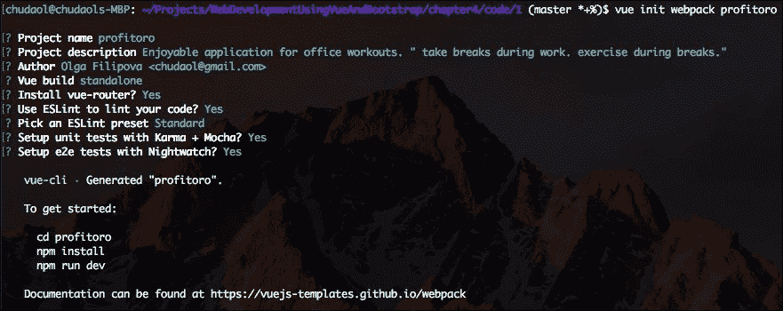

应用程序初始化时的控制台输出

现在，在新创建的`profitoro`目录中运行`npm install`：

```js
**cd profitoro**
**npm install**

```

让我们安装`sass`加载器，因为我们将使用`sass`预处理器来为我们的应用程序添加样式：

```js
**npm install sass-loader node-sass --save-dev**

```

最后，我们准备运行它：

```js
**npm run dev**

```

您的新 Vue 应用程序已准备就绪。为了让我们的 ProFitOro 有一个干净的工作环境，删除与默认安装过程一起安装的`Hello`组件相关的一切。作为替代方案，只需打开第四章 *让它番茄钟！*的代码文件，并从`chapter4/1/profitoro`文件夹中获取样板代码。

# 定义 ProFitOro 组件

我们的应用程序由两个主要屏幕组成。

其中一个屏幕是所谓的*登陆页面*；该页面由以下部分组成：

+   一个标志

+   一个标语

+   一个认证部分

+   一个可供未注册用户使用的应用程序链接

从图表上看，这是我们组件在屏幕上的位置：

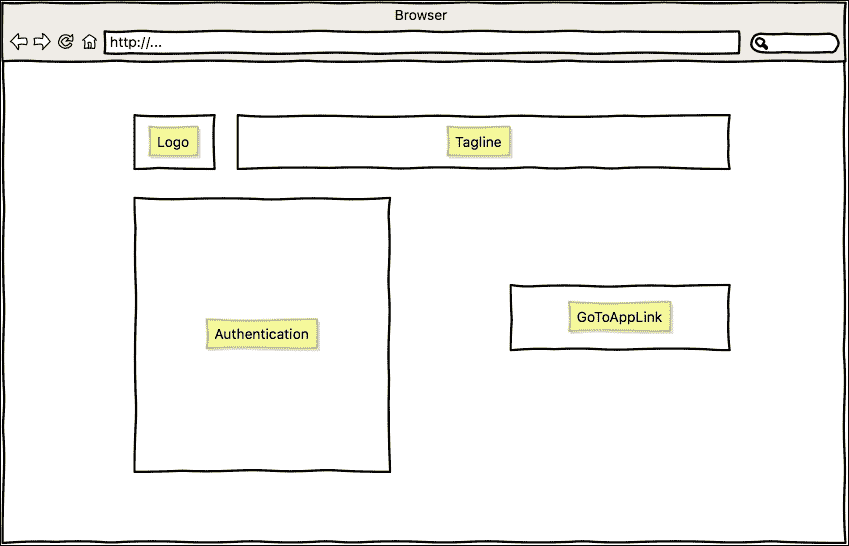

包含标志、标语、认证部分和应用程序链接的登陆页面

第二个屏幕是主应用程序屏幕。该屏幕包含三个部分：

+   一个页眉

+   一个页脚

+   内容

内容部分包含番茄钟计时器。如果用户已经认证，它将包含设置、锻炼和统计信息：

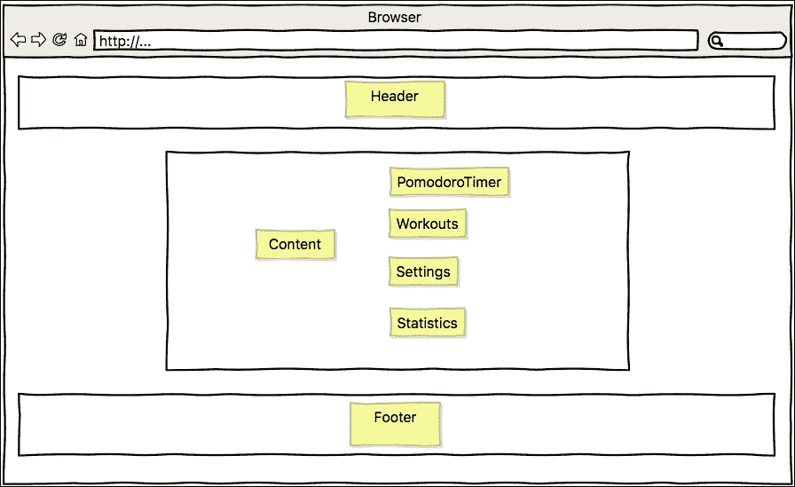

包含页眉、页脚和内容的主应用程序屏幕

让我们创建一个名为`components`的文件夹，以及名为`main`、`landing`和`common`的子文件夹，用于相应的子组件。

登陆页面和主页面的组件将存放在`components`文件夹中；其余的 11 个组件将分布在相应的子文件夹中。

对于每个定义的组件文件，添加`template`、`script`和`style`部分。在`style`标签中添加`lang="sass"`属性，因为正如我之前提到的，我们将使用`sass`预处理器来为我们的组件添加样式。因此，例如，`HeaderComponent.vue`将如下所示：

```js
//HeaderComponent.vue
<template>
  <div>**Header**</div>
</template>
<script>
  export default {

  }
</script>
<style scoped **lang="sass"**>

</style>
```

因此，我们有 13 个准备好填充必要数据的组件占位符。这些组件将被使用和重复使用。这是因为 Vue 组件是*可重用组件*，这就是它们如此强大的原因。在开发过程中，我们将不可避免地添加更多组件和子组件，但这是我们的基础：

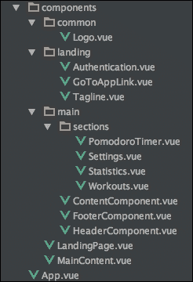

ProFitOro 的 13 个基础组件

检查我们在`chapter4/2/profitoro`文件夹中的基础组件。

让我们也通过填充所需的子组件来准备我们的`LandingPage`和`MainContent`组件。在此之前，为每个子文件夹添加一个`index.js`文件，并在其中导出相应子文件夹的内容。这将使之后的导入更容易。因此，从`common`文件夹开始，并添加以下内容的`index.js`文件：

```js
//common/index.js
export {default as Logo} from './Logo'
```

对`sections`，`main`和`landing`文件夹重复相同的操作。

现在我们可以组合我们的登陆页面和主要内容组件。让我们从`LandingPage.vue`开始。这个组件包括一个标志，一个认证部分，一个指向应用程序的链接和一个标语。导入所有这些组件，将它们导出到`components`对象中，并在`template`中使用它们！我们在`index.js`文件中导出这些组件的事实使我们可以像下面这样导入它们：

```js
//LandingPage.vue
import {Authentication, GoToAppLink, Tagline} from './landing'
import {Logo} from './common'
```

现在我们可以在`LandingPage`组件的`components`对象中使用这些导入的组件。顺便说一句，你有没有见过同一个短语中有这么多*组件*这个词？"组件，组件，组件"，导出的对象看起来如下：

```js
//LandingPage.vue
export default {
  components: {
    Logo,
    Authentication,
    GoToAppLink,
    Tagline
  }
}
```

在`components`对象中导出后，所有这些组件都可以在模板中使用。请注意，所有**驼峰命名**的内容在模板中都会变成**短横线命名**。因此，我们的`GoToAppLink`看起来会像`go-to-app-link`。因此，我们模板中的组件将如下所示：

```js
<logo></logo>
<tagline></tagline>
<authentication></authentication>
<go-to-app-link></go-to-app-link>
```

因此，我们整个`LandingPage`组件现在将有以下代码：

```js
//LandingPage.vue
<template>
  <div>
    **<logo></logo>**
 **<tagline></tagline>**
 **<authentication></authentication>**
 **<go-to-app-link></go-to-app-link>**
  </div>
</template>
<script>
  import {**Authentication, GoToAppLink, Tagline**} from './landing'
  import {**Logo**} from **'./common'**
  export default {
    components: {
      **Logo,**
 **Authentication,**
 **GoToAppLink,**
 **Tagline**
    }
  }
</script>
<style scoped lang="sass">

</style>
```

让我们告诉`App.vue`来渲染这个组件：

```js
//App.vue
<template>
  <div id="app">
    <h1>Welcome to Profitoro</h1>
    **<landing-page></landing-page>**
  </div>
</template>

<script>
  **import LandingPage from './components/LandingPage'**
  export default {
    name: 'app',
    components: {
      LandingPage
    }
  }
</script>
```

检查页面。你能看到你的组件吗？我相信你可以：


LandingPage 组件

现在，我们*只需*实现相应的组件，我们的登陆页面就准备好了！

## 练习

对于`MainContent`组件也要做同样的操作——导入和导出所有必要的子组件，并将它们添加到模板中。之后，在`App.vue`中调用`MainContent`组件，就像我们刚刚在`LandingPage`组件中所做的那样。如果有疑问，请检查`chapter4/3/profitoro`文件夹中的代码。

# 实现番茄钟计时器

我们应用程序中最重要的组件之一，毫无疑问，就是番茄钟计时器。它执行应用程序的主要功能。因此，首先实现它可能是一个好主意。

我在想一种圆形计时器。类似这样的：

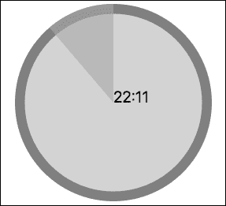

圆形计时器将被实现为番茄钟

随着时间的推移，突出显示的扇形将逆时针移动，时间也将倒计时。为了实现这种结构，我考虑了三个组件：

+   *SvgCircleSector*：此组件将只接收一个角度作为属性，并着色 SVG 圆的相应扇形。

+   *CountDownTimer*：此组件将接收要倒计时的秒数，实现计时器并在每次计时器更新时计算要传递给`SvgCircularComponent`的角度。

+   *PomodoroTimer*：我们已经引导了这个组件。此组件将负责使用初始时间调用`CountDownTimer`组件，并根据当前工作的番茄钟或休息间隔更新到相应的秒数。

## SVG 和三角函数

让我们首先定义我们的`SvgCircleSector`组件。这个组件将接收`angle`和`text`作为属性，并绘制一个具有给定角度突出显示扇形的 SVG 圆。在`components/main/sections`文件夹内创建一个名为`timer`的文件夹，然后在其中创建一个`SvgCircleSector.vue`文件。定义`template`、`script`和`style`所需的部分。您还可以导出`props`，其中包括此组件将从其父级接收的`angle`和`text`属性：

```js
//SvgCircleSector.vue
<template>
  <div>
  </div>
</template>
<script>
  export default {
    **props: ['angle', 'text']**
  }
</script>
<style scoped lang="scss">
</style>
```

那么，我们如何使用 SVG 绘制圆并突出显示其扇形？首先，让我们绘制两个圆：一个在另一个内部。让我们将较大的圆半径设为`100px`，较小的圆半径设为`90px`。基本上，我们必须提供中心、*x*和*y*坐标、半径（`r`）和`fill`属性。查看 SVG 中关于圆的文档，网址为[`developer.mozilla.org/en-US/docs/Web/SVG/Element/circle`](https://developer.mozilla.org/en-US/docs/Web/SVG/Element/circle)。我们最终会得到类似于这样的东西：

```js
<svg width="200" height="200" >
  <circle r="100" cx="100" cy="100" fill="gray"></circle>
  <circle r="90" cx="100" cy="100" fill="lightgray"></circle>
</svg>
```

因此，我们得到了两个圆，一个在另一个内部。

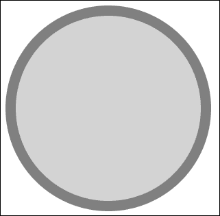

使用 SVG 圆元素绘制的两个圆

现在，为了绘制圆的突出显示扇形，我们将使用*path* SVG 元素（[`developer.mozilla.org/en-US/docs/Web/SVG/Element/path`](https://developer.mozilla.org/en-US/docs/Web/SVG/Element/path)）。

使用 SVG 路径元素，您可以绘制任何您想要的东西。它的主要属性称为`d`，基本上是一种使用 SVG 特定领域语言编程路径的方式。例如，这是如何在我们的圆内绘制一个三角形：

```js
<path d="M100,100 V0 L0,100 H0 z"></path>
```

这些代码代表什么？ `M`代表*移动*，`L`代表*线*，`V`代表*垂直线*，`H`代表*水平线*，`z`代表*在此停止路径*。因此，我们告诉我们的路径首先移动到`100`，`100`（圆心），然后画一条垂直线直到达到*y*轴的`0`点，然后画一条线到`0`，`100` *x*，*y*坐标，然后画一条水平线直到达到`100` *x*坐标，然后停止。我们的二维坐标区由*x*和*y*轴组成，其中*x*从左到右从`0`开始，直到`200`，*y*从上到下从`0`开始，直到`200`。

这是我们小圆坐标系的中心和极端点的(*x*, *y*)坐标的样子：

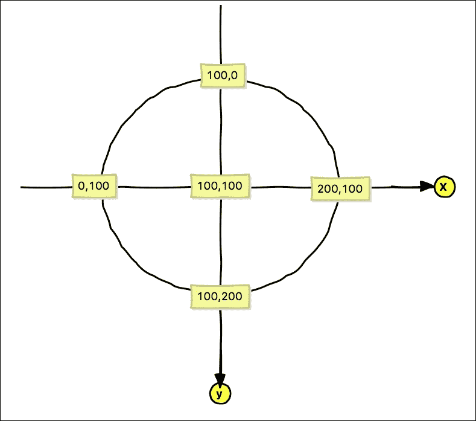

标记的点代表 SVG 圆的(x,y)坐标，圆心在(100,100)

因此，如果我们从(`100`,`100`)开始，画一条垂直线到(`100`,`0`)，然后画一条线到(`0`, `100`)，然后画一条水平线直到(`100`,`100`)，我们最终得到一个在我们的圆的左上象限内绘制的直角三角形：

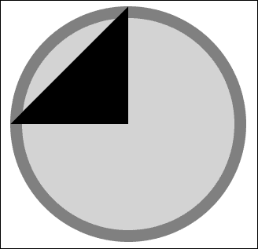

路径在圆内绘制一个三角形

这只是对路径 SVG 元素的一个小介绍，以及它可以实现的内容。然而，我们仍然需要绘制一个圆形扇区，而不仅仅是一个三角形。为了使用路径绘制扇区，我们可以在`d`属性内部使用`A`命令。 `A`代表*弧*。这可能是路径中最复杂的命令。它接收以下信息：*rx, ry, x-axis-rotation, large-arc-flag, sweep-flag, x, y*。

在我们的情况下，前四个属性始终可以是`100`，`100`，`0`，`0`。如果您想了解原因，请查看 w3c 关于弧路径属性的文档[`www.w3.org/TR/SVG/paths.html#PathDataEllipticalArcCommands`](https://www.w3.org/TR/SVG/paths.html#PathDataEllipticalArcCommands)。 

对我们来说，最重要的属性是最后三个。*sweep-flag*表示*弧*的方向；它可以是`0`或`1`，分别表示顺时针和逆时针方向。在我们的情况下，它将始终为*0*，因为这是我们希望弧线绘制的方式（逆时针）。至于最后的*x*和*y*值，这些值决定了弧线的停止位置。因此，例如，如果我们想在*90*度处绘制左上方的扇形，我们将在(`0`, `100`)坐标处停止弧线—*x*为`0`，*y*为`100`—因此我们的`d`属性将如下所示：

```js
d="M100,100 L100,0 **A**100,100 0 0,0 **0,100** z"
```

包含两个圆和扇形的整个 SVG 元素将如下所示：

```js
<svg width="200" height="200" >
  <circle r="100" cx="100" cy="100" fill="gray"></circle>
  <circle r="90" cx="100" cy="100" fill="lightgray"></circle>
  <path id="sector" fill="darkgray" opacity="0.6" **d="M100,100 L100,0 A100,100 0 0,0 0, 100 z"**></path>
</svg>
```

这段代码产生了以下结果：

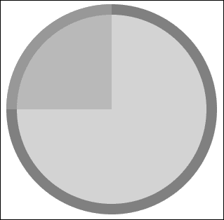

用 SVG 元素的路径绘制的 90 度扇形

我们实际上必须将这个`d`属性定义为一个动态属性，其计算值将取决于。为了表示这一点，我们必须使用`v-bind`，后面跟着一个分号和属性：`v-bind:d`，或者简单地写为`:d`。让我们给相应的属性路径命名，并将其添加到我们组件的导出对象`computed`中：

```js
//SvgCircleSector.vue
<template>
  <div>
    <svg class="timer" width="200" height="200" >
      <...>
      <path class="segment" **:d="path"**></path>
    </svg>
  </div>
</template>
<script>
  function **calcPath** (angle) {
    let d
    **d = "M100,100 L100,0 A100,100 0 0,0 0, 100 z"**
    return d
  }
  export default {
    props: ['angle', 'text'],
    computed: {
      path () {
        **return calcPath(this.angle)**
      }
    }
  }
</script>
```

我引入了一个名为`calcPath`的函数，它将确定我们的路径字符串。目前，它返回的路径将突出显示*90*度的区域。

我们几乎完成了。我们实际上可以绘制一个段，但缺少的是能够为任何角度绘制一个段的能力。我们的`SvgCircleSector`组件将接收一个角度作为属性。这个角度不总是等于*90*度。我们应该想出一个公式，根据`angle`来计算结束的*x*和*y*坐标。如果你对重新学习基本的三角函数不感兴趣，可以跳过这部分，继续阅读本节的结尾。

这是我计算小于 180 度角的*x*，*y*坐标的方法：

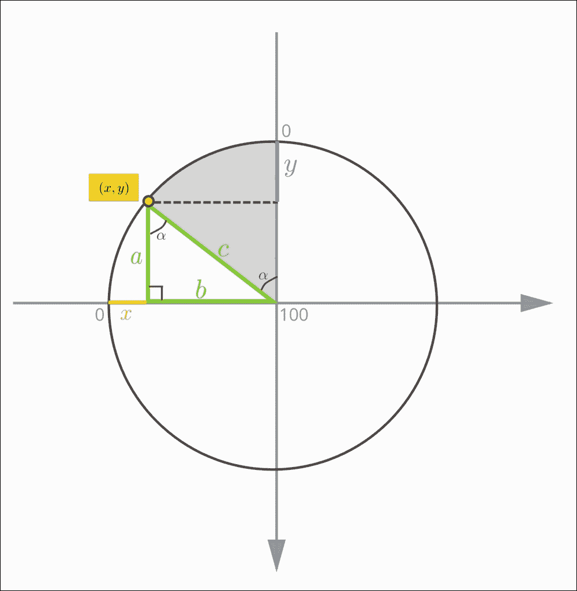

要计算角度α的(x,y)坐标，我们需要计算直角三角形的 a 和 b 边。

从图中我们可以看到：

```js
x = 100 – b
y = 100 – a
```

因此，我们只需要计算`a`和`b`。这是一项简单的任务。我们可以通过知道角度和斜边来计算直角三角形的两条腿。斜边`c`等于圆的半径（在我们的例子中为`100`）。与角度相邻的腿`a`等于`c * cosα`，而与角度相对的腿`b`等于`c * sin` `α`。因此：

```js
x = 100 – 100 * sinα
y = 100 – 100 * cosα
```

对于大于 180 度的角度，我们有以下方案：

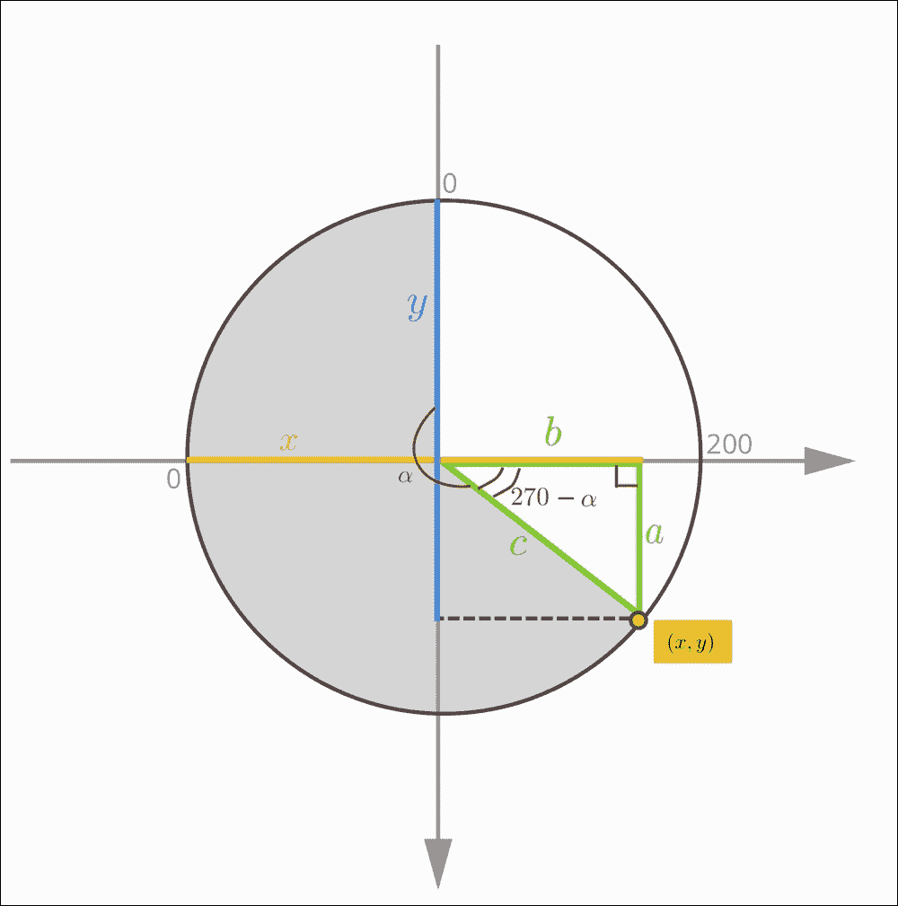

对于大于 180°的角度，我们还必须计算右三角形的两边

我可以告诉你一个秘密吗？我真的很不擅长画这种图。我尝试过从纸上的草图到使用 Gimp 进行绘画。一切看起来都很丑。幸运的是，我有我的哥哥*伊利亚*，他用 Sketch 在五分钟内创建了这些图形。非常感谢你，*伊鲁什卡*！

回到我们的例子。在这种情况下，右三角形的角度等于`270° -` `α`。我们的`x`等于`100 + b`，`y`等于`100 + a`。以下是简单的计算：

```js
a = c * sin (270 - α)
a = c * sin (180 + (90 - α))
a = -c * sin (90 - α)
a = -c * cosα
b = c * cos (270 - α)
b = c * cos (180 + (90 - α))
b = -c * cos (90 - α)
b = -c * sinα
```

因此：

```js
x = 100 + (-100 * sinα) = 100 – 100*sinα
y = 100 + (-100 * cosα) = 100 – 100*cosα
```

这与小于*180*度的角度完全相同！

这是用于计算*x*，*y*坐标的 JavaScript 代码：

```js
function calcEndPoint (angle) {
  let x, y

  **x = 100 - 100 * Math.sin(Math.PI * angle / 180)**
 **y = 100 - 100 * Math.cos(Math.PI * angle / 180)**

  return {
    x, y
  }
}
```

现在，我们终于可以定义一个函数，根据角度确定路径元素的`d`字符串属性。这个函数将调用`calcEndPoint`函数，并返回一个包含最终`d`属性的`string`：

```js
function calcPath (angle) {
  let d
  let {x, y} = calcEndPoint(angle)
  if (angle <= 180) {
    d = `M100,100 L100, 0 A100,100 0 0,0 ${x}, ${y} z`
  } else {
    d = `M100,100 L100, 0 A100,100 0 0,0 100, 200 A100,100 0 0,0 ${x}, ${y} z`
  }
  return d
}
```

为了完成我们的组件，让我们引入一个文本 SVG 元素，它将只渲染传递给组件的文本属性。也应该可以绘制一个没有任何文本的圆；因此，让我们使用`v-if`指令来实现这一点：

```js
//SvgCircleSector.vue
<template>
  <div>
    <svg class="timer" width="200" height="200" >
      <...>
      <text **v-if="text != ''"** class="text" x="100" y="100">
        **{{text}}**
      </text>
    </svg>
  </div>
</template>
```

让我们还提取大圆和小圆的样式，以及路径和文本的样式到`style`部分。让我们定义有意义的类，这样我们的模板将如下所示：

```js
//SvgCircleSector.vue
<template>
  <div>
    <svg class="timer" width="200" height="200" >
      <circle class="**bigCircle**" r="100" cx="100" cy="100"></circle>
      <circle class="**smallCircle**" r="90" cx="100" cy="100"></circle>
      <path class="**segment**" :d="path"></path>
      <text v-if="text != ''" class="**text**" x="100" y="100">
        {{text}}
      </text>
    </svg>
  </div>
</template>
```

在`style`标签内，让我们定义颜色变量，并将它们用于我们的圆。将颜色提取到变量中将有助于我们在将来轻松地更改它们，如果我们决定更改应用程序的颜色方案。因此，我们的 SVG 组件的样式将如下所示：

```js
//SvgCircleSector.vue
<style scoped lang="scss">
  **$big-circle-color: gray;**
 **$small-circle-color: lightgray;**
 **$segment-color: darkgray;**
 **$text-color: black;**

  .bigCircle {
    fill: $big-circle-color;
  }
  .smallCircle {
    fill: $small-circle-color;
  }
  .segment {
    fill: $segment-color;opacity: 0.6;
  }
  .text {
    font-size: 1em;
    stroke-width: 0;
    opacity: .9;
    fill: $text-color;
  }
</style>
```

### 练习

到目前为止，我们一直在使用绝对大小的圆；它的半径始终为`100`像素。使用`viewBox`和`preserveAspectRatio`属性应用于`svg`元素，使我们的圆响应式。试着玩一下；在`PomodoroTimer`组件中调用这个组件，使用不同的角度属性来看看它是如何工作的。我能想出这样疯狂的页面：

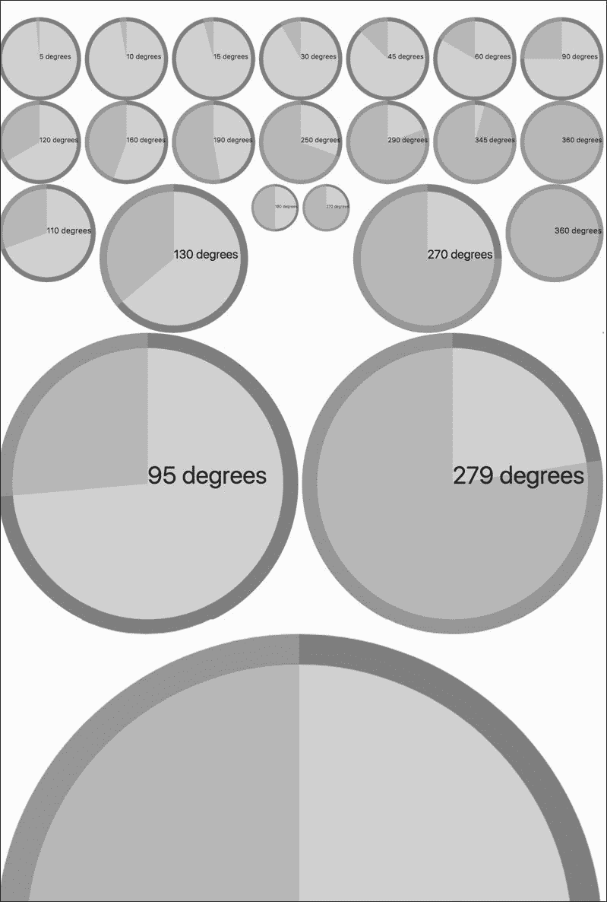

由许多 SVG 圆组成的疯狂页面，其扇形由给定角度定义

检查`chapter4/4/profitoro`文件夹中的代码。特别注意`components/sections/timer`文件夹中的`SvgCircleSector.vue`组件，以及调用圆形组件多次并使用不同的角度属性的`PomodoroTimer.vue`组件。

## 实现倒计时计时器组件

现在我们有一个完全功能的组件，它可以根据给定的角度渲染一个带有高亮区域的圆形，我们将实现`CountDownTimer`组件。这个组件将接收一个倒计时的秒数作为属性。它将包含控件元素：一组按钮，允许你*开始*、*暂停*和*停止*计时器。一旦计时器启动，秒数将被倒计时，并相应地重新计算角度。这个重新计算的角度被传递给`SvgCircleSector`组件，以及计算出的文本。文本将包含计时器结束时剩余的分钟和秒数。

首先，在`components/main/sections/timer`文件夹中创建一个`CountDownTimer.vue`文件。让我们从这个组件中调用`SvgCircleSector`组件，并为`angle`和`text`属性设置一些任意值：

```js
**//CountDownTimer.vue**
<template>
  <div class="container">
    <div>
      <**svg-circle-sector** **:angle="30"** **:text="'Hello'"**></**svg-circle-sector**>
    </div>
  </div>
</template>
<script>
  **import SvgCircleSector from './SvgCircleSector'**
  export default {
    components: {
      **SvgCircleSector**
    }
  }
</script>
<style scoped lang="scss">

</style>
```

打开页面。有点太大了。甚至不适合我的屏幕：

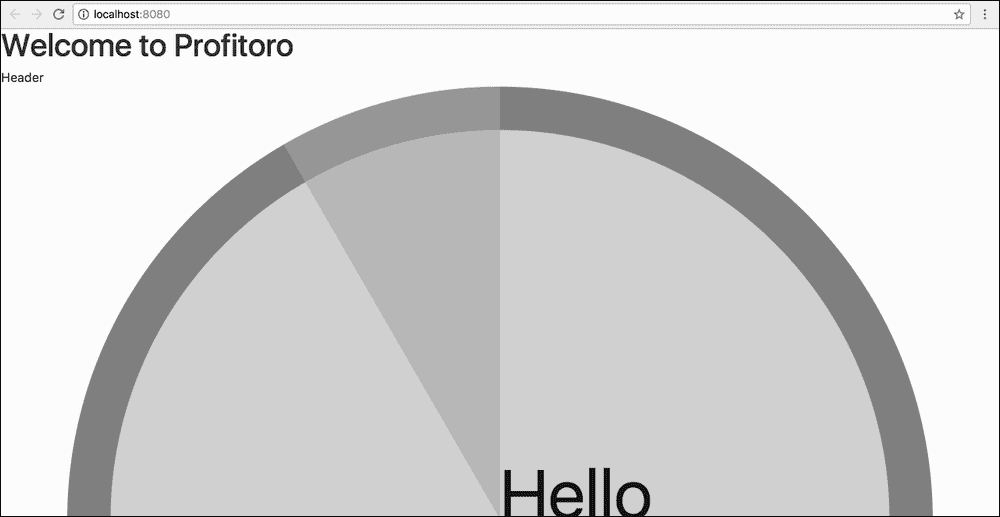

我们的组件不适合我的屏幕

然而，如果我在手机上打开它，它会渲染得很好，实际上看起来很好：

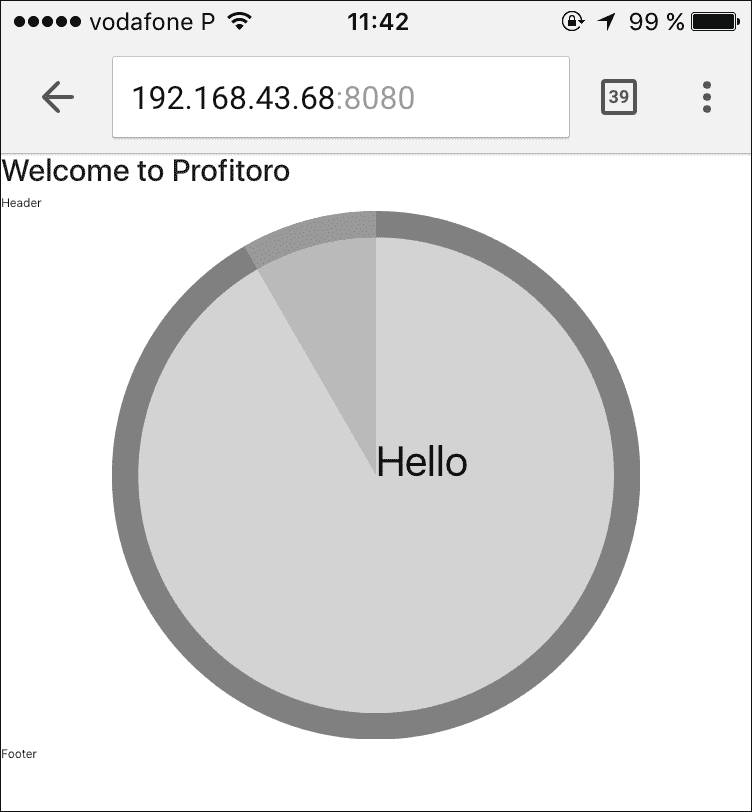

我们的组件在移动屏幕上实际上非常合适

这是因为我们的圆是响应式的。如果你尝试调整浏览器的大小，你会发现圆形会相应地调整大小。它的宽度始终是浏览器的*100%*。当页面的高度大于宽度时（这是移动浏览器的情况），它看起来很好，但当宽度大于高度时（如在桌面屏幕的情况下），它看起来非常大和丑陋。所以，我们的圆是响应式的，但并不是真正适应性的。但我们正在使用 Bootstrap！Bootstrap 在响应性和适应性方面是一个很好的朋友。

## 使用 Bootstrap 实现倒计时计时器的响应性和适应性

为了实现对任何设备的适应性，我们将使用 Bootstrap 网格系统来构建我们的布局，网址为[`v4-alpha.getbootstrap.com/layout/grid/`](https://v4-alpha.getbootstrap.com/layout/grid/)。

### 注意

请注意，此 URL 是用于 alpha 版本的，下一个版本将在官方网站上提供。

此系统基于十二列行布局。`row`和`col`类包括不同的层级，每个媒体查询一个。因此，相同的元素可以根据设备大小具有不同的相对大小。这些类的名称是不言自明的。包装行类名为`row`。然后，每列可能有一个名为`col`的类。例如，这是一个具有相等大小的四列的简单行：

```js
<div class="**row**">
  <div class="**col**">Column 1</div>
  <div class="**col**">Column 2</div>
  <div class="**col**">Column 3</div>
  <div class="**col**">Column 4</div>
</div>
```

此代码将产生以下结果：


具有四个相等大小列的 Bootstrap 行

类`col`可以与您要为列指定的大小相结合：

```js
<div class="**col-***">Column 1</div>
```

在这里，`*`可以是从`1`到`12`的任何内容，因为每行最多可以包含十二列。以下是具有四个不同大小列的行的示例：

```js
<div class="row">
  <div class="**col-6**">Column 1</div>
  <div class="**col-3**">Column 2</div>
  <div class="**col-2**">Column 3</div>
  <div class="**col-1**">Column 4</div>
</div>
```

因此，第一列将占据一半的行，第二列将占据四分之一的行，第三列将占据六分之一的行，最后一列将占据十二分之一的行。这是它的样子：


具有不同大小列的 Bootstrap 行

不要在意黑色边框；我添加它们是为了使列宽更加明显。Bootstrap 将在没有任何边框的情况下绘制您的布局，除非您告诉它包括它们。

Bootstrap 还提供了一种偏移列的技术，可以在[`v4-alpha.getbootstrap.com/layout/grid/#offsetting-columns`](https://v4-alpha.getbootstrap.com/layout/grid/#offsetting-columns)上找到。

### 注意

请注意，此 URL 是用于 alpha 版本的，下一个版本将在官方网站上提供。

例如，我们如何制作两列，其中一列的大小为`6`，另一列的大小为`2`，偏移量为`4`：

```js
<div class="**row**">
  <div class="**col-6**">Column 1</div>
  <div class="**col-2 offset-4**">Column 2</div>
</div>
```

这是它的样子：


具有两列的行，其中一列显示偏移量为 4。

您甚至可以通过使用`push-*`和`pull-*`类来玩转列并更改它们的顺序。有关更多信息，请访问[`v4-alpha.getbootstrap.com/layout/grid/#push-and-pull`](https://v4-alpha.getbootstrap.com/layout/grid/#push-and-pull)。

### 注意

请注意，此 URL 是用于 alpha 版本的，下一个版本将在官方网站上提供

这些类几乎扮演了`offset-*`类的相同角色；它们为您的列提供了更多的灵活性。例如，如果我们想要呈现大小为`3`的列和大小为`9`的列并更改它们的顺序，我们将需要将大小为`3`的列推送到`9`的位置，并将大小为`9`的列拉到`3`的位置：

```js
<div class="row">
  <div class="**col-3 push-9**">Column 1</div>
  <div class="**col-9 pull-3**">Column 2</div>
</div>
```

此代码将产生以下布局：


使用 push-*和 pull-*类更改列的顺序

尝试所有这些示例，并检查无论如何调整页面大小，布局的比例都将始终相同。这是 Bootstrap 布局的一个强大功能；您甚至不必费心使您的布局响应。我在本节的第一段中提到的不同设备怎么样？到目前为止，我们一直在探索称为`col-*`、`offset-*`、`push-*`和`pull-*`的类。Bootstrap 还为每种媒体查询提供了这组类。

Bootstrap 中有五种设备类型：

| **xs** | 超小设备 | 竖屏手机（<544px） |
| --- | --- | --- |
| **sm** | 小设备 | 横屏手机（≥544px - <768px） |
| **md** | 中等设备 | 平板电脑（≥768px - <992px） |
| **lg** | 大设备 | 桌面电脑（≥992px - <1200px） |
| **xl** | 超大设备 | 桌面电脑（≥1200px） |

为了指示在给定设备上的期望行为，您只需在类名和其大小之间传递设备指定。因此，例如，如果您希望大小分别为`8`和`4`的两列在移动设备上转换为两个堆叠的列，您可以执行以下操作：

```js
<div class="row">
  <div class="col-sm-12 col-md-8">Column 1</div>
  <div class="col-sm-12 col-md-4">Column 2</div>
</div>
```

如果您在浏览器中打开此代码并尝试调整页面大小，您会发现一旦大小小于`544`像素，列将堆叠：


两列布局在小屏幕上变成了堆叠的等大小列布局

那么我们应该怎么处理我们的计时器？我会说它可以在小设备上占据整个宽度（*100%*），在中等宽度设备上占据宽度的 2/3，在大设备上变为宽度的一半，在超大设备上为宽度的 1/3。因此，它将需要以下类：

+   **col-sm-12** 用于小设备

+   **col-md-8** 用于中等宽度设备

+   **col-lg-6** 用于大设备

+   **col-xl-4** 用于超大设备

我还希望我的圆圈出现在屏幕中央。为此，我将应用`justify-content-center`类到行中：

```js
<div class="row **justify-content-center**">
  <svg-circle-sector class="**col-sm-12 col-md-8 col-lg-6 col-xl-4**" :angle="30" :text="'Hello'"></svg-circle-sector>
</div>
```

打开页面并尝试调整大小，模拟不同的设备，测试纵向和横向视图。我们的圆圈会相应地调整大小。检查`chapter4/5/profitoro`文件夹中的代码；特别注意`components/CountDownTimer.vue`组件。

## 倒计时计时器组件- 让我们倒计时！

我们已经实现了倒计时计时器组件的响应性。让我们最终将其变成一个真正的倒计时计时器组件。让我们首先添加控件：开始、暂停和停止按钮。现在，我会让它们看起来像链接。为此，我将使用 Bootstrap 的`btn-link`类在[`v4-alpha.getbootstrap.com/components/buttons/`](https://v4-alpha.getbootstrap.com/components/buttons/)。

### 注意

请注意，此 URL 是用于 alpha 版本的，下一个版本将在官方网站上提供。

我还将使用 Vue 的`v-on`指令在每个按钮点击时绑定一个方法在[`vuejs.org/v2/api/#v-on`](https://vuejs.org/v2/api/#v-on)：

```js
<button **v-on:click="start">Start</button>**
```

或者，我们可以简单地使用：

```js
<button **@click="start"**>Start</button>
```

因此，按钮的代码将如下所示：

```js
<div class="controls">
  <div class="btn-group" role="group">
    <button **@click="start"** type="button" class="**btn btn-link**">Start</button>
    <button **@click="pause"** type="button" class="**btn btn-link**">Pause</button>
    <button **@click="stop"** type="button" class="**btn btn-link**">Stop</button>
  </div>
</div>
```

将`text-center`类添加到包装容器`div`中，以便按钮居中对齐。现在，有了控制按钮，我们的计时器看起来像这样：

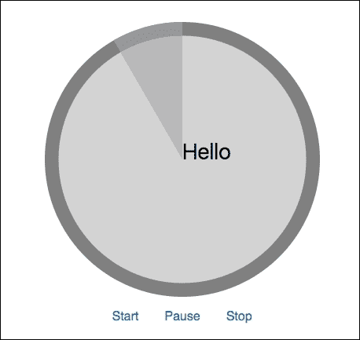

带控制按钮的倒计时计时器

当我们开始讨论这个组件时，我们说它将从其父组件接收以秒为单位的倒计时时间。让我们添加一个名为`time`的属性，并让我们从父组件传递这个属性：

```js
//CountDownTimer.vue
<script>
  <...>
  export default {
    **props: ['time']**
    <...>
  }
</script>
```

现在，让我们将这个属性作为计算的硬编码属性导出到`PomodorTimer`组件中，并将其绑定到`CountDownTimer`组件。让我们将其硬编码为`25`分钟，或`25 * 60`秒：

```js
//PomodoroTimer.vue
<template>
  <div>
    <count-down-timer **:time="time"**></count-down-timer>
  </div>
</template>
<script>
  import CountDownTimer from './timer/CountDownTimer'
  export default {
    **computed: {**
 **time () {**
 **return 25 * 60**
 **}**
 **}**,
    components: {
      CountDownTimer
    }
  }
</script>
```

好的，所以我们的倒计时组件接收以秒为单位的时间。它将如何更新`角度`和`文本`？由于我们无法更改父级的属性(`时间`)，我们需要引入属于该组件的值，然后我们将能够在组件内部更改它，并根据该值计算角度和文本值。让我们引入这个新值并称之为`时间戳`。将其放在倒计时组件的数据函数中：

```js
//CountDownTimer.vue
data () {
  return {
    **timestamp: this.time**
  }
},
```

现在让我们为`angle`添加一个计算值。我们如何根据时间戳（以秒为单位）计算角度？如果我们知道每秒的角度值，那么我们只需将该值乘以所需秒数即可：

```js
angle = DegreesPerSecond * this.timestamp
```

知道初始时间（以秒为单位），很容易计算每秒的度数。由于整个周长为*360 度*，我们只需将*360*除以*初始时间*即可：

```js
DegreesPerSecond = 360/this.time
```

最后但同样重要的是，由于我们的计时器是逆时针计时器，我们需要将逆角度传递给`SvgCircleSector`组件，因此我们的最终计算角度值将如下所示：

```js
  computed: {
    **angle** () {
      **return 360 - (360 / this.time * this.timestamp)**
    }
  }
```

通过角度的值替换模板中的硬编码角度绑定：

```js
<svg-circle-sector **:angle="angle"**></svg-circle-sector>
```

调整`timestamp`的值；尝试将其从`0 * 60`设置为`25 * 60`。您将看到高亮区域如何相应地更改：

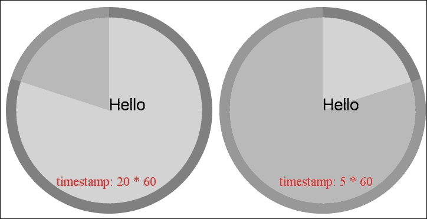

圆圈的高亮区域随着给定的时间戳而相应地变化

我不确定你，但我已经厌倦了看到这个 Hello。让我们做点什么。计时器的文本应显示剩余时间直到倒计时结束的分钟数和秒数；它对应于计时器圆圈的未高亮区域。这是一个非常简单的计算。如果我们将时间戳除以`60`并获得除法的整数部分，我们将得到当前分钟数。如果我们获得这个除法的余数，我们将得到当前秒数。文本应该显示分钟和秒数除以冒号（`:`）。因此，让我们添加这三个计算值：

```js
//CountDownTimer.vue
computed: {
  angle () {
    return 360 - (360 / this.time * this.timestamp)
  },
  **minutes** () {
    return **Math.floor(this.timestamp / 60)**
  },
  **seconds** () {
    return **this.timestamp % 60**
  },
  **text** () {
    return **`${this.minutes}:${this.seconds}`**
  }
},
```

请注意，我们在计算文本时使用了`ES6`模板（[`developer.mozilla.org/en/docs/Web/JavaScript/Reference/Template_literals`](https://developer.mozilla.org/en/docs/Web/JavaScript/Reference/Template_literals)）。

最后，用文本值替换属性绑定中的硬编码字符串`Hello`：

```js
<svg-circle-sector :angle="angle" **:text="text"**></svg-circle-sector>
```

现在好多了吧？

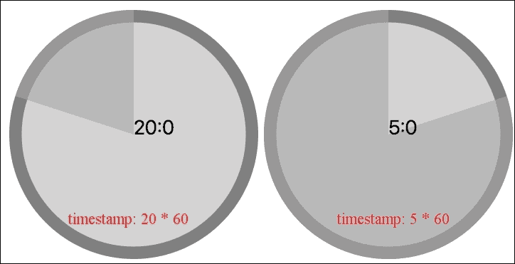

计时器的文本根据剩余时间而变化

现在唯一缺少的是实际启动计时器并进行倒计时。我们已经在每个相应的按钮点击上调用了`start`、`pause`和`stop`方法。让我们创建这些方法：

```js
//CountDownTimer.vue
methods: {
  **start** () {
  },
  **pause** () {
  },
  **stop** () {
  }
},
```

这些方法内部应该发生什么？`start`方法应该设置一个间隔，每秒减少一秒的计时器。`pause`方法应该暂停这个间隔，`stop`方法应该清除这个间隔并重置时间戳。在组件的数据函数中引入一个名为`interval`的新变量，并添加所需的方法：

```js
//CountDownTimer.vue
data () {
  return {
    timestamp: this.time,
    **interval**: null
  }
},
<...>
methods: {
  **start** () {
    this.interval = **setInterval**(() => {
      **this.timestamp--**
      if (this.timestamp === 0) {
        this.timestamp = this.time
      }
    }, 1000)
  },
  **pause** () {
    **clearInterval**(this.interval)
  },
  **stop** () {
    **clearInterval**(this.interval)
    this.timestamp = this.time
  }
}
```

然后...我们完成了！打开页面，点击控制按钮，尝试不同的初始时间值，并检查它的工作情况！检查`chapter4/6/profitoro`文件夹中`CountDownTimer`组件的代码。

### 练习

我们的倒计时器看起来很不错，但仍然存在一些问题。首先，文本看起来不太好。当分钟或秒数少于`9`时，它会显示相应的文本，而不带有尾随的`0`，例如，*5 分钟 5 秒*显示为**5:5**。这看起来并不像时间。引入一个方法，让我们称之为`leftpad`，它将为这种情况添加一个额外的`0`。请尽量不要破坏互联网！（[`www.theregister.co.uk/2016/03/23/npm_left_pad_chaos/`](https://www.theregister.co.uk/2016/03/23/npm_left_pad_chaos/)）

我们的计时器的另一个问题是我们可以随时点击任何按钮。如果你频繁点击启动按钮，结果会出乎意料地难看。引入三个数据变量——`isStarted`，`isPaused`和`isStopped`——它们将根据每个方法进行切换。将`disabled`类绑定到控制按钮。这个类应该根据提到的变量的值来激活。所以，行为应该是以下的：

+   如果计时器已经启动并且没有暂停，启动按钮应该被禁用。

+   如果计时器没有启动，暂停和停止按钮应该被禁用。如果计时器已经暂停或停止，它们也应该被禁用。

要有条件地绑定类，使用`v-bind:className={expression}`，或者简单地使用`:className={expression}`表示法。例如：

```js
<button **:class="{disabled: isStarted}"**>Start</button>
```

要自己检查一下，请查看`chapter4/7/profitoro`目录，特别是`components/CountDownTimer.vue`组件。

## 番茄钟计时器

因此，我们已经有了一个完全功能的倒计时计时器。我们离应用程序的最终目的——能够倒计时任何给定的时间——已经非常接近了。我们只需要基于它实现一个番茄钟计时器。我们的番茄钟计时器必须使用工作番茄钟时间初始化倒计时组件，并在番茄钟结束后将其重置为休息时间。休息结束后，它必须再次将其重置为工作番茄钟时间。依此类推。不要忘记，三个常规番茄钟后的休息时间略长于通常的休息时间。

让我们创建一个`config`文件，其中包含这些值，这样我们就可以在需要用不同的时间测试应用程序时轻松更改它。因此，我们需要指定`workingPomodoro`、`shortBreak`和`longBreak`的值。我们还需要指定到长休息之前工作的*番茄钟*数量。默认情况下，这个值将是三，但是如果你是一个工作狂，你可以在*23485*个常规番茄钟后指定更长的番茄钟休息（不要这样做，我还需要你！）。因此，我们的配置文件是一个常规的`.js`文件，其内容如下：

```js
//src/config.js
export default {
  **workingPomodoro**: 25,
  **shortBreak**: 5,
  **longBreak**: 10,
  **pomodorosTillLongBreak**: 3
}
```

在`PomodoroTimer`组件中导入这个文件。让我们还为这个组件定义必要的数据。因此，番茄钟计时器有三种主要状态；它要么处于工作状态，要么处于短休息状态，要么处于长休息状态。它还应该计算到长休息之前的番茄钟数量。因此，我们的`PomodoroTimer`组件的数据将如下所示：

```js
//PomodoroTimer.vue
data () {
  return {
    isWorking: true,
    isShortBreak: false,
    isLongBreak: false,
    pomodoros: 0
  }
}
```

现在，我们可以根据番茄钟计时器的当前状态计算`time`的值。为此，我们只需要将当前间隔对应的分钟数乘以`60`。我们需要定义哪个间隔是正确的分钟数，并根据应用程序的当前状态做出决定。下面是我们漂亮的计算值的`if-else`构造：

```js
//PomodoroTimer.vue
computed: {
  time () {
    let minutes

    if (this.**isWorking**) {
      minutes = config.**workingPomodoro**
    } else if (this.**isShortBreak**) {
      minutes = config.**shortBreak**
    } else if (this.**isLongBreak**) {
      minutes = config.**longBreak**
    }

    return minutes * 60
  }
}
```

这比较清楚，对吧？现在，我们必须编写代码，以在工作的番茄钟、短休息和长休息之间切换。让我们称这个方法为`togglePomodoro`。这个方法应该做什么？首先，`isWorking`状态应该根据先前的值设置为`true`或`false`（`this.isWorking = !this.isWorking`）。然后，我们应该重置`isShortBreak`和`isLongBreak`的值。然后我们必须检查`isWorking`的状态是否为`false`，这意味着我们目前正在休息。如果是的话，我们必须增加到目前为止完成的番茄数量。然后根据番茄数量，我们需要将其中一个休息状态设置为`true`。这是这个方法：

```js
//PomodoroTimer.vue
methods: {
  togglePomodoro () {
    // toggle the working state
    **this.isWorking = !this.isWorking**

    // reset break states
    **this.isShortBreak = this.isLongBreak = false**

    // we have switched to the working state, just return
    if (this.isWorking) {
      return
    }

    // we have switched to the break state, increase the number of pomodoros and choose between long and short break
    **this.pomodoros ++**
    this.isLongBreak = **this.pomodoros % config.pomodorosTillLongBreak === 0**
    this.isShortBreak = **!this.isLongBreak**
  }
}
```

现在，我们只需要找到一种调用这个方法的方式。它应该在什么时候被调用？很明显，每当倒计时器达到零时，应该调用这个方法，但我们如何能意识到这一点呢？某种程度上，倒计时器组件必须向其父组件通知它已经停在零上。幸运的是，使用 Vue.js，组件可以使用`this.$emit`方法发出事件。因此，我们将从倒计时组件触发此事件，并将其处理程序绑定到从`PomodoroTimer`调用的组件上。让我们称这个事件为`finished`。打开`CountDownTimer.vue`组件，并找到一个地方，我们在那里检查减少的时间戳是否达到了零值。在这一点上，我们必须大喊“嘿，父组件！我完成了我的任务！给我另一个”。这是一个简单的代码：

```js
// CountDownTimer.vue
<...>
if (this.timestamp <= 0) {
  **this.$emit('finished')**
  this.timestamp = this.time
}
```

绑定这个事件非常简单。就像任何其他事件一样；只需在`PomodoroTimer`模板内使用`@`后跟附加到组件的事件名称。

```js
<count-down-timer **@finished="togglePomodoro"** :time="time"></count-down-timer>
```

现在检查应用程序的页面。尝试在配置文件中玩弄时间值。检查一切是否正常工作。

### 锻炼

你已经开始使用新的番茄钟来安排你的日常生活了吗？如果是的话，我相信当计时器在工作时，你会非常愉快地浏览其他标签并做其他事情。你有没有注意到时间比应该的时间长？我们的浏览器真的很聪明；为了不影响你的 CPU，它们在非活动的标签中保持相当空闲。这实际上是完全合理的。如果你不看它们，为什么非活动的标签要执行复杂的计算或者基于`setIntervals`和`setTimeout`函数运行一些疯狂的动画呢？虽然从性能方面来说这是完全合理的，但对我们的应用程序来说并没有太多意义。

不管怎样，它都应该倒数 25 分钟。为了这个练习，改进我们的倒计时器，使其始终倒计时准确的秒数，即使它在隐藏或非活动的浏览器标签中打开。谷歌一下，你会看到整个互联网上关于*Stackoverflow*的结果：

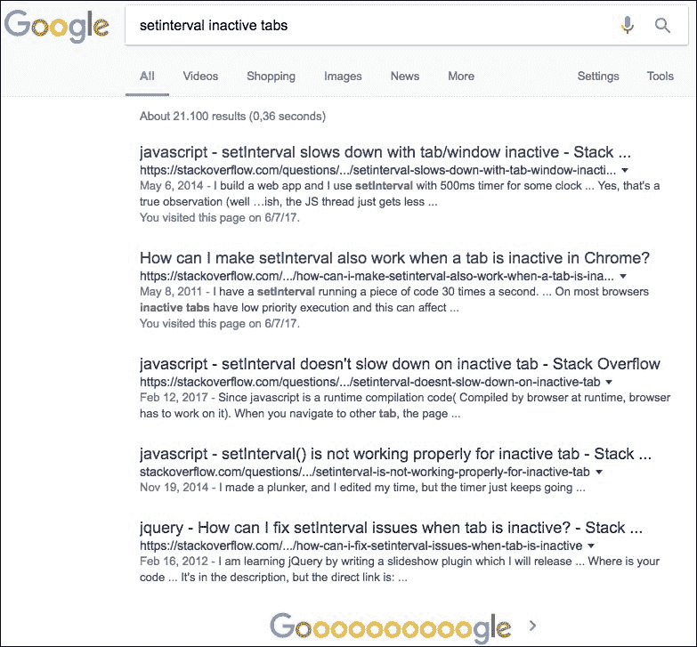

在非活动标签中使用 setInerval 的奇怪行为充斥着互联网

我还希望你在这个练习中为`CountDownTimer`组件的`time`属性添加一个监视器，以便重新启动计时器。这将使我们能够更精确地在`PomodoroTimer`组件中更改时间时重置计时器。在这方面，请查看 Vue 文档，网址为[`vuejs.org/v2/guide/computed.html#Watchers`](https://vuejs.org/v2/guide/computed.html#Watchers)。

对于这两个任务，请查看`chapter4/8/profitoro`应用程序文件夹，自行检查。唯一应用更改的组件是`CountDownTimer.vue`组件。注意`setInterval`函数以及如何更新`timestamp`。

# 引入锻炼

我写这一章时非常热情，计算正弦、余弦，绘制 SVG，实现计时器，并照顾非活动标签等等，以至于我几乎忘记了做锻炼！我喜欢做平板支撑和俯卧撑，你呢？顺便说一句，你难道也忘了锻炼是我们应用程序的一部分吗？在休息时间，我们应该做简单的锻炼，而不仅仅是查看社交网络！

我们将在接下来的章节中实现完整的锻炼和管理；现在，让我们为锻炼留下一个漂亮的占位符，并在这个占位符中硬编码一个锻炼（我投票支持俯卧撑，因为这本书是我的，但你可以添加你自己喜欢的锻炼或者锻炼）。打开`PomodoroTimer.vue`组件，并将倒计时组件包装在一个带有`row`类的`div`中。我们将使这一行包含两列，其中一列将是倒计时器，另一列是一个有条件渲染的包含锻炼的元素。为什么有条件呢？因为我们只需要在番茄钟休息时显示这个元素。我们将使用`v-show`指令，以便包含元素始终存在，只有`display`属性会改变。因此，标记看起来像下面这样：

```js
//PomodoroTimer.vue
<div class="container">
  <div class="**row**">
    <div **v-show="!isWorking"** class="**col-sm-4**">
      WORKOUT TIME!
    </div>
    <count-down-timer class="**col-sm-8**" @finished="togglePomodoro" :time="time"></count-down-timer>
  </div>
</div>
```

请注意`col-sm-4`和`col-sm-8`。再次强调，我希望在更大的设备上列看起来不同，在小设备上堆叠！

我们应该使用什么元素来显示我们的锻炼？出于某种原因，我非常喜欢 Bootstrap 的`jumbotrons`（[`v4-alpha.getbootstrap.com/components/jumbotron/`](https://v4-alpha.getbootstrap.com/components/jumbotron/)），所以我将使用一个包含锻炼标题的标题元素，锻炼描述的引导元素，以及一个图像元素来显示锻炼图像的`jumbotron`。

### 注意

请注意，Bootstrap 的 Jumbotron 组件的 URL 是 alpha 版本的，下一个版本将在官方网站上提供

因此，我用于显示锻炼的标记结构如下：

```js
//PomodoroTimer.vue
<div class="jumbotron">
  <div class="container">
    
    <h2>Push-ups</h2>
    <lead>
      Description: lorem ipsum
    </lead>
  </div>
</div>
```

在这一部分，随意添加另一个适合你的好锻炼，这样你就能在读完这本书之前锻炼了。检查`section4/9/profitoro`文件夹中的此部分的代码。

这是我的笔记本电脑屏幕上的番茄钟的样子：

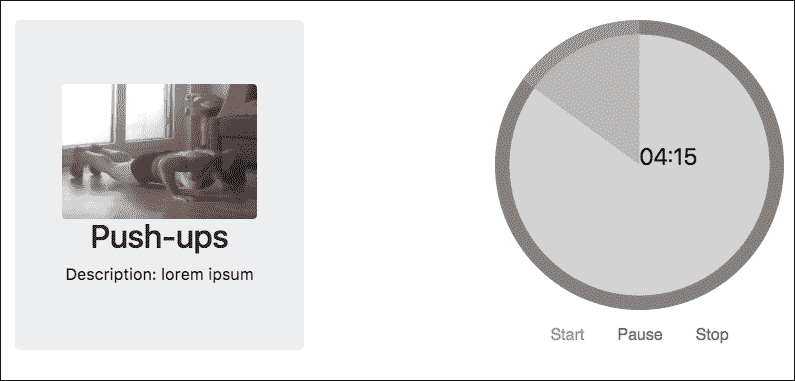

笔记本电脑屏幕上的番茄钟

这是它在手机屏幕上的样子：

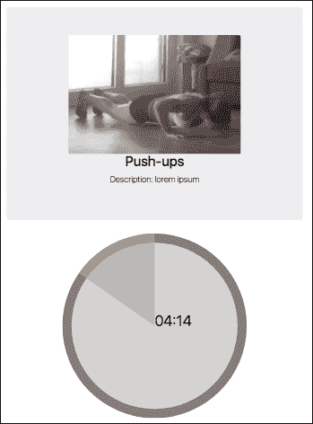

手机屏幕上的番茄钟

当然，它并不那么美观，但它是响应式和自适应的，我们没有为它做任何 CSS 黑魔法！

# 总结

在本章中，我们做了很多事情。我们实现了我们的番茄钟计时器的主要功能，现在它是完全功能的、可配置的、可用的和响应的。我们启动了我们的 ProFitOro 应用程序，将其分成组件，为每个定义的组件创建了一个骨架，并完全实现了其中的一个。我们甚至重新学习了一些三角学，因为数学无处不在。我们实现了我们的计时器，并让它在隐藏和非活动标签上也能工作。我们使用强大的 Bootstrap 布局类使应用程序对不同设备尺寸具有响应性和适应性。我们的应用程序是功能性的，但离美观还有很大差距。不过，暂时不要在意这些灰色调；让我们暂时坚持它们。在本书的最后，你将得到你漂亮的 ProFitOro 样式，我向你保证！

我们准备继续在技术世界中的旅程。在下一章中，我们将学习如何配置我们的番茄钟，以及如何使用 Firebase 存储配置和使用统计数据。因此，在下一章中我们将：

+   回到 Vuex 集中式状态管理架构，并将其与 Google Firebase 存储系统结合起来，以存储应用程序的关键数据，如配置和统计信息。

+   实现 ProFitOro 的配置

+   实现 ProFitOro 使用统计数据的存储、检索和显示
