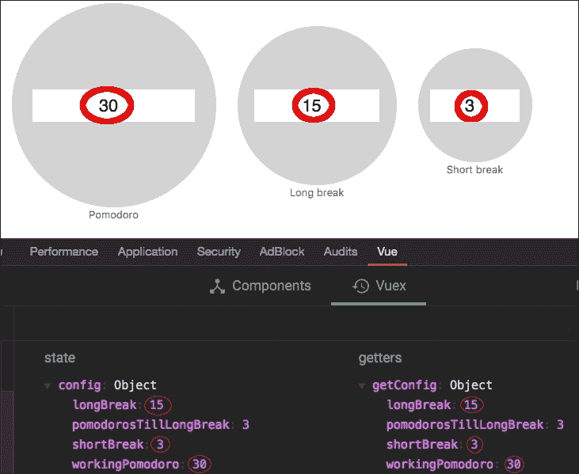
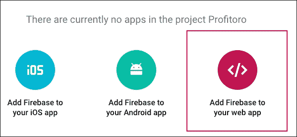
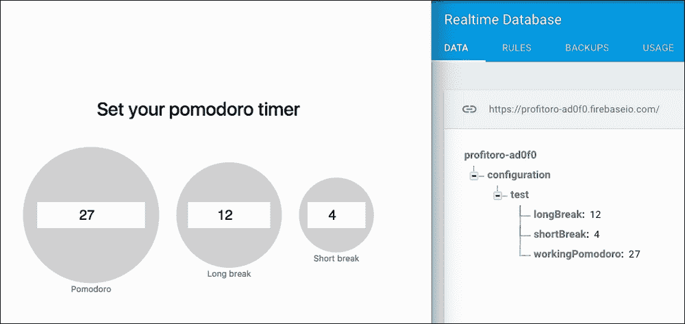

# 第五章：配置您的番茄钟

在上一章中，我们实现了 ProFitOro 应用程序的主要功能-番茄钟计时器。我们甚至添加了一个硬编码的锻炼，这样我们就可以在休息时间锻炼。实际上，我已经开始使用 ProFitOro。当我写下这些文字时，番茄钟正在倒计时-*滴答滴答滴答滴答*。

在这一章中，我们将探索*Firebase 实时数据库*的可能性及其 API。我们将管理存储、检索和更新应用程序的使用统计和配置。我们将使用 Vuex 存储将应用程序的数据从数据库传递到前端应用程序。

为了将这种可能性带到 UI 中，我们将使用 Vue 的响应性结合 Bootstrap 的强大之处。因此，在这一章中，我们将使用以下内容来实现 ProFitOro 的统计和设置组件：

+   Firebase 实时数据库

+   Vue.js 的响应式数据绑定和 Vuex 状态管理

+   Bootstrap 的强大之处在于使事物具有响应性

# 设置 Vuex 存储

在开始使用数据库中的真实数据之前，让我们为我们的 ProFitOro 设置 Vuex 存储。我们将使用它来管理番茄钟计时器的配置，用户设置（如用户名）以及个人资料图片的 URL。我们还将使用它来存储和检索应用程序的使用统计。

从第二章 *Hello User Explained*，您已经知道了 Vuex 存储的工作原理。我们必须定义代表应用程序状态的数据，然后我们必须提供所有需要的 getter 来获取数据和所有需要的 mutation 来更新数据。一旦所有这些都设置好了，我们就能够从组件中访问这些数据。

应用程序的存储准备就绪并设置好后，我们可以将其连接到实时数据库，并稍微调整 getter 和 mutation 以操作真实数据。

首先，我们需要告诉我们的应用程序将使用 Vuex 存储。为此，让我们为`vuex`添加`npm`依赖项：

```js
**npm install vuex --save**

```

现在，我们需要定义我们存储的基本结构。我们的 Vuex 存储将包含以下内容：

+   **State**：应用程序数据的初始状态。

+   **Getters**：检索状态属性的方法。

+   **Mutations**：提供改变状态的方法。

+   **操作**：可以调度以调用突变的方法。操作和突变之间唯一的区别是操作可以是异步的，我们可能需要它们用于我们的应用程序。

听起来很简单，对吧？只需创建一个名为`store`的文件夹，并为我们刚刚指定的所有内容创建 JavaScript 文件。还要创建`index.js`文件，该文件将使用所有这些内容实例化一个带有所有这些内容的 Vuex 存储。以下是您的结构：


存储文件夹的结构

当我们在第二章中首次提到 Vuex 存储时，*Hello User Explained*，我们简化了结构，并在同一个文件中介绍了所有存储的组件。现在，我们将遵循良好的模块化结构，并让所有内容都放在自己的位置上。我们甚至可以进一步将状态分离到模块中（一个用于配置，另一个用于设置，依此类推），但对于 ProFitOro 的复杂级别来说，这可能会有些过度。但是，如果您想了解如何将存储分离为逻辑模块，请查看关于 Vuex 的这篇出色文档中有关模块的部分：[`vuex.vuejs.org/en/`](https://vuex.vuejs.org/en/)。

尽管如此，让我们继续使用我们的存储。在创建了结构之后，将所有存储组件导入`index.js`并创建一个 Vuex 实例，将所有这些组件作为参数传递。不要忘记导入 Vuex 并告诉 Vue 使用它！因此，我们的存储入口点将如下所示：

```js
//store/index.js
**import Vue from 'vue'**
**import Vuex from 'vuex'**
import state from './state'
import getters from './getters'
import mutations from './mutations'
import actions from './actions'

**Vue.use(Vuex)**

export default new Vuex.Store({
  **state,**
 **getters,**
 **mutations,**
 **actions**
})
```

现在唯一重要的事情，以便我们的设置完全完成，就是让我们的应用程序知道它现在正在使用这个存储。这样，存储将在所有组件中可用。要使其成为可能的唯一事情就是在应用程序的入口点（`main.js`）中导入我们的存储，并将其传递给 Vue 实例：

```js
//main.js
import Vue from 'vue'
import App from './App'
**import store from './store'**

new Vue({
  el: '#app',
  template: '<App/>',
  components: { App },
  **store**
})
```

现在，我们已经完全准备好开始使用存储进行魔术了。您是否一直在思念编码？好了，现在可以了！让我们首先用存储的状态和获取器替换我们已经创建的`config`文件，该文件用作番茄钟定时属性的容器。只需将`config`文件的所有配置元素复制到我们的状态中，并为其创建一个获取器：

```js
//store/state.js
const config = {
  workingPomodoro: 25,
  shortBreak: 5,
  longBreak: 10,
  pomodorosTillLongBreak: 3
}

export default {
  **config**
}
```

让我们现在转向 getter。 Getter 不仅仅是普通的函数。在幕后，它们接收状态作为参数，因此您可以访问应用程序状态的数据，而无需进行任何依赖注入的努力，因为 Vuex 已经为您管理了。因此，只需创建一个接收状态作为参数并返回任何状态数据的函数！如果需要，在 getter 内部，您可以对数据执行任何操作。因此，`config`文件的 getter 可能看起来像这样：

```js
//store/getters.js
function getConfig (state) {
  return state.config
}
```

由于我们使用的是 ES6，可以以更简洁和优雅的方式重写：

```js
//store/getters.js
var getConfig = (state) => state.config
```

然后，它可以被导出：

```js
//store/getters.js
export default {
  getConfig: getConfig
}
```

或者，我们可以简单地使用：

```js
//store/getter.js
export default {
  getConfig
}
```

整个事情实际上可以写成：

```js
//store/getters.js
export default {
  **getConfig: state => state.config**
}
```

多么惊人简单啊？当我开始使用 JavaScript 时（不要问我什么时候，我不想让自己感觉老），我几乎无法想象这样的语法会有可能。

现在，您可以在任何应用程序组件中使用您的新 getter。如何？您还记得使用`this.$store.state`属性轻松访问状态有多容易吗？同样，在计算数据函数内部，您可以访问您的“getter”：

```js
**computed**: {
  config () {
    return **this.$store.getters.getConfig**
  }
},
```

从现在开始，`this.config`可以在组件的所有计算值和方法中使用。现在想象一下，在同一个组件内，我们需要使用多个 getter。例如，假设我们为每个 config 的值创建 getter。因此，对于每个值，您都必须重复这种繁琐的代码：`this.$store.getters.bla-bla-bla`。啊！一定有更简单的方法...而且确实有。Vuex 很友好地为我们提供了一个名为`mapGetters`的辅助对象。如果您简单地将此对象导入到组件中，就可以使用 ES6 扩展运算符使用`mapGetters`调用您的 getter：

```js
import { **mapGetters** } from 'vuex'

export default {
  computed: {
    **...mapGetters**([
      'getConfig'
    ])
  }
}
```

或者，如果您想将 getter 方法映射到其他名称，只需使用一个对象：

```js
import { mapGetters } from 'vuex'

export default {
  computed: {
    ...mapGetters({
      **config: 'getConfig'**
    })
  }
}
```

所以，这就是我们要做的。我们将在`PomodoroTimer`组件内部使用`mapGetters`助手，并删除对导入的`config`文件的引用（还要记得删除文件本身；我们不希望代码库中有死代码）。我们将用`this.config`替换所有对`config`的引用。因此，我们的`PomodoroTimer`脚本部分将如下所示：

```js
//PomodoroTimer.vue
<script>
  // ...
  **import { mapGetters } from 'vuex'**
  // ...
  export default {
    data () {
      // ...
    },
    computed: {
      **...mapGetters({**
 **config: 'getConfig'**
 **})**,
      time () {
        let minutes
        if (this.isWorking) {
          minutes = **this.config**.workingPomodoro
        } else if (this.isShortBreak) {
          minutes = **this.config**.shortBreak
        } else if (this.isLongBreak) {
          minutes = **this.config**.longBreak
        }

        return minutes * 60
      }
    },
    // ...
    methods: {
      togglePomodoro () {
        // ...
        this.isLongBreak = this.pomodoros % **this.config**.pomodorosTillLongBreak === 0
      }
    }
  }
</script>
```

检查你的页面，一切都应该和以前一样。这种新方法的优势是什么？——有人可能会问，我们已经在这里花了半章的时间设置这个商店和它的方法、获取器、操作，等等…最后，我们得到了完全相同的行为。为什么？嗯，你还记得这一章的整个目的是能够配置和重新配置番茄工作法的定时设置，并将它们存储在数据库中吗？如果我们不得不在我们的组件中引入数据库引用和检索和存储数据的所有操作，我们的生活会更加艰难。想象一下，如果某个时候 Firebase 不符合你的需求，你希望切换到另一个数据源，甚至是另一种技术，比如 *Elasticsearch* 或者 *MongoDB*。你将不得不改变你的组件和它的方法，以及它的计算值。维护所有这些不是听起来像地狱吗？

让你的数据驻留在存储中，并且让你的获取器负责检索它们，将使你只需要改变你的获取器，如果你决定改变底层数据源。你的组件将永远不会被触及！这是你的应用程序的数据和逻辑层的抽象。在软件工程领域，抽象是一件非常酷的事情。

让我们为 `Settings.vue` 组件定义一个基本的标记。检查我们的模拟。

这个组件将包含两个主要区域：

+   个人设置配置区域

+   番茄工作法定时设置配置区域

同样，我将使用 Bootstrap 栅格类来帮助我构建一个漂亮的、响应式的布局。我希望在小设备上制作两个堆叠列，在中等大小的设备上制作两个相同大小的列，在大设备上制作两个不同大小的列。因此，我将使用 `row` 类来包装 `div` 和相应的 `col-*-*` 类来包装我们 `Settings` 组件的两个主要区域。

```js
// Settings.vue
<div class="**row justify-content-center**">
  <div class="**col-sm-12 col-md-6 col-lg-4**">
    <div class="container">
      <h2>Account settings</h2>
      account settings
    </div>
  </div>
  <div class="**col-sm-12 col-md-6 col-lg-8**">
    <div class="container">
      <h2>Set your pomodoro timer</h2>
      pomodoro timer configuration
    </div>
  </div>
</div>
```

现在让我们只集中在番茄工作法定时设置配置上。我创建了一个名为 `SetTimer.vue` 的组件。这个组件只包含一个数字类型的输入，并在其值发生变化时发出一个方法。在番茄工作法设置容器中，我将使用从导入的 `mapGetters` 助手中获取的不同值，将这个组件渲染三次：

```js
//Settings.vue
<template>
  <...>
    <div class="row justify-content-center align-items-center">
      <div class="col-md-5 col-sm-10">
        **<set-timer :value="config.workingPomodoro"></set-timer>**
        <div class="figure-caption">Pomodoro</div>
      </div>
      <div class="col-md-4 col-sm-10">
        **<set-timer :value="config.longBreak"></set-timer>**
        <div class="figure-caption">Long break</div>
      </div>
      <div class="col-md-3 col-sm-10">
        **<set-timer :value="config.shortBreak"></set-timer>**
        <div class="figure-caption">Short break</div>
      </div>
    </div>
  <...>
</template>
```

通过一些 CSS 魔法，我能够在 `SetTimer` 组件中渲染三个输入圆圈，如下所示：


输入允许我们为不同的番茄钟间隔设置定时器的球

您可以在`chapter5/1/profitoro`文件夹中找到相应的代码。特别是检查`components/main/sections/timer`文件夹中的`SetTimer.vue`组件以及在`Settings.vue`组件中如何使用相应的值调用它。

# 定义操作和突变

很棒，我们的组件现在可以从存储中获取数据，但如果我们的组件也能够更改存储中的数据，那可能会更有趣。另一方面，我们都知道我们不能直接修改存储的状态。

状态不应该被任何组件触摸。然而，您还记得我们关于 Vuex 存储的章节中有一些特殊函数可以改变存储。它们甚至被称为`mutations`。这些函数可以对 Vuex 存储数据做任何它们/你想做的事情。这些突变可以使用应用于存储的`commit`方法来调用。在底层，它们实质上接收两个参数 - 状态和值。

我将定义三个突变 - 分别用于定时器的每个定义。这些突变将使用新值更新`config`对象的相应属性。因此，我的突变如下：

```js
//store/mutations.js
export default {
  **setWorkingPomodoro** (state, workingPomodoro) {
    state.config.workingPomodoro = workingPomodoro
  },
  **setShortBreak** (state, shortBreak) {
    state.config.shortBreak = shortBreak
  },
  **setLongBreak** (state, longBreak) {
    state.config.longBreak = longBreak
  }
}
```

现在我们可以定义操作。操作基本上会调用我们的突变，因此可以被视为重复的工作。然而，请记住操作和突变之间的区别在于操作实际上可以是异步的，因此当我们将操作连接到数据库时可能会派上用场。现在，让我们告诉操作在提交之前验证接收到的值。`actions`方法接收存储和一个新值。由于存储为我们提供了一个名为`commit`的基本方法，该方法将调用所需的突变的名称，因此我们可以定义每个操作如下：

```js
actionName (**{commit}**, newValue) {
  **commit**('mutationName', newValue)
}
```

### 提示

我们可以将`{commit}`写为参数，并立即使用`commit`函数，因为我们使用的是 ES6 和对象解构对我们来说非常完美（[`developer.mozilla.org/en/docs/Web/JavaScript/Reference/Operators/Destructuring_assignment`](https://developer.mozilla.org/en/docs/Web/JavaScript/Reference/Operators/Destructuring_assignment)）。

因此，我的操作看起来是这样的：

```js
//store/actions.js
export default {
  **setWorkingPomodoro** ({commit}, workingPomodoro) {
    if (workingPomodoro) {
      commit('setWorkingPomodoro', parseInt(workingPomodoro, 10))
    }
  },
  **setShortBreak** ({commit}, shortBreak) {
    if (shortBreak) {
      commit('setShortBreak', parseInt(shortBreak, 10))
    }
  },
  **setLongBreak** ({commit}, longBreak) {
    if (longBreak) {
      commit('setLongBreak', parseInt(longBreak, 10))
    }
  }
}
```

现在，让我们回到`Settings.vue`组件。这个组件应该导入操作并在需要时调用它们，对吧？我们如何导入操作？你还记得`mapGetters`助手吗？有一个类似的助手用于操作，叫做`mapActions`。所以，我们可以和`mapGetters`助手一起导入它，并在`methods`对象内使用扩展操作符(`…`)：

```js
//Settings.vue
<script>
  import {mapGetters, **mapActions**} from 'vuex'
  <...>
  export default {
    <...>
    methods: {
      **...mapActions(['setWorkingPomodoro', 'setShortBreak', 'setLongBreak'])**
    }
  }
</script>
```

现在，我们必须在`set-timer`输入框的值发生变化时调用所需的操作。在前一段中，我们讨论了`SetTimer`组件发出`changeValue`事件。所以，我们现在唯一需要做的就是将这个事件绑定到所有三个`set-timer`组件上，并调用相应的方法：

```js
<div class="col-md-5 col-sm-10">
  **<set-timer :value="config.workingPomodoro" @valueChanged="setWorkingPomodoro"></set-timer>**
  <div class="figure-caption">Pomodoro</div>
</div>
<div class="col-md-4 col-sm-10">
  **<set-timer :value="config.longBreak" @valueChanged="setLongBreak"></set-timer>**
  <div class="figure-caption">Long break</div>
</div>
<div class="col-md-3 col-sm-10">
  **<set-timer :value="config.shortBreak" @valueChanged="setShortBreak"></set-timer>**
  <div class="figure-caption">Short break</div>
</div>
```

打开页面，尝试更改每个计时器设置的值。

如果你正在使用 Chrome 浏览器，但还没有安装 Vue 开发者工具，请安装它。你会看到它是多么方便和可爱！只需按照这个链接：[`goo.gl/22khXD`](https://goo.gl/22khXD)。

安装了 Vue devtools 扩展后，你会立即看到这些值在 Vuex 存储中是如何变化的：



一旦输入框中的值发生变化，它们就会立即在 Vuex 存储中发生变化

检查`chapter5/2/profitoro`文件夹中的本节最终代码。注意存储文件夹内的`actions.js`和`mutations.js`文件以及`Settings.vue`组件。

# 建立一个 Firebase 项目

我希望你还记得如何从本书的前几章中设置 Firebase 项目。在[`console.firebase.google.com`](https://console.firebase.google.com)打开你的 Firebase 控制台，点击**添加项目**按钮，命名它，并选择你的国家。Firebase 项目已准备好。是不是很容易？现在让我们准备我们的数据库。以下数据将存储在其中：

+   **配置**: 我们的 Pomodoro 计时器值的配置

+   **统计**: Pomodoro 使用的统计数据

每个这些对象将通过一个特殊的键来访问，该键将对应于用户的 ID；这是因为在下一章中，我们将实现一个身份验证机制。

配置对象将包含值-`workingPomodoro`，`longBreak`和`shortBreak`-这些值对我们来说已经很熟悉了。

让我们向我们的数据库添加一个带有一些虚假数据的配置对象：

```js
{
  "configuration": {
    "test": {
      "workingPomodoro": 25,
      "shortBreak": 5,
      "longBreak": 10
    }
  }
}
```

你甚至可以将其创建为一个简单的 JSON 文件并导入到你的数据库中：


将 JSON 文件导入到您的实时 Firebase 数据库

恭喜，您的实时数据库已准备就绪！请记住，默认情况下，安全规则不允许您从外部访问数据，除非您经过身份验证。现在，让我们暂时删除这些规则。一旦我们实现了身份验证机制，我们将稍后添加它们。单击**RULES**选项卡，并用以下对象替换现有规则：

```js
{
  "rules": {
    ".read": true,
    ".write": true
  }
}
```

现在我们可以从我们的 Vue 应用程序访问我们的实时数据库。

# 将 Vuex 存储连接到 Firebase 数据库

现在，我们必须将我们的 Vuex 存储连接到 Firebase 数据库。我们可以使用本机 Firebase API 将状态数据绑定到数据库数据，但是如果有人已经为我们做了这些事情，为什么我们要处理承诺和其他东西呢？这个人叫 Eduardo，他创建了 Vuexfire - Vuex 的 Firebase 绑定（[`github.com/posva/vuexfire`](https://github.com/posva/vuexfire)）。如果您在*Wroclaw*的*vueconf2017 大会*上，您可能还记得这个家伙：


Eduardo 在 Vue 大会期间谈到 Vue 和 Firebase

Vuexfire 带有 Firebase 的 mutations 和 actions，这将为您执行所有幕后工作，而您只需在 mutations 和 actions 对象中导出它们。因此，首先安装`firebase`和`vuexfire`：

```js
**npm install vue firebase vuexfire –save**

```

在您的存储的`index.js`入口点中导入`firebase`和`firebaseMutations`：

```js
//store/index.js
import firebase from 'firebase'
import { firebaseMutations } from 'vuexfire'
```

现在，我们需要获取对 Firebase 应用程序的引用。Firebase 带有一个初始化方法`initializeApp`，它接收由许多应用程序设置数据组成的对象 - 应用程序 ID，身份验证域等。现在，我们至少必须提供数据库 URL。要获取数据库 URL，只需转到您的 Firebase 项目设置，然后单击**将 Firebase 添加到您的 Web 应用**按钮：



单击“将 Firebase 添加到您的 Web 应用”按钮

复制数据库 URL，甚至整个配置对象，并将其粘贴到您的存储的`index.js`文件中：

```js
//store/index.js
let app = firebase.initializeApp({
  databaseURL: **'https://profitoro-ad0f0.firebaseio.com'**
})
```

您现在可以获取配置对象的引用。一旦我们实现了身份验证机制，我们将使用经过身份验证的用户 ID 从数据库中获取当前用户的配置。现在，让我们使用我们硬编码的 ID `test`：

```js
let configRef = app.database().ref('**/configuration/test**')
```

我将使用扩展运算符在状态对象中导出`configRef`引用。因此，这个引用可以被动作访问：

```js
//store/index.js
export default new Vuex.Store({
  **state: {**
 **...state,**
 **configRef**
 **}**
})
```

为了使整个 Vuexfire 魔术生效，我们还必须在`mutations`对象中导出`firebaseMutations`：

```js
//store/index.js
export default new Vuex.Store({
  mutations: {
    ...mutations,
    **...firebaseMutations**
  },
  actions
})
```

因此，我们整个`store/index.js`现在看起来像下面这样：

```js
//store/index.js
import Vue from 'vue'
import Vuex from 'vuex'
import state from './state'
import getters from './getters'
import mutations from './mutations'
import actions from './actions'
import firebase from 'firebase'
import { firebaseMutations } from 'vuexfire'
Vue.use(Vuex)

// Initialize Firebase
let config = {
  databaseURL: 'https://profitoro-ad0f0.firebaseio.com'
}
let app = firebase.initializeApp(config)
let configRef = app.database().ref('/configuration/test')

export default new Vuex.Store({
  state: {
    ...state,
    configRef
  },
  getters,
  mutations: {
    ...mutations,
    ...firebaseMutations
  },
  actions
})
```

现在让我们去我们的动作。非常重要的是，在做任何其他事情之前，我们要将我们的数据库引用绑定到相应的状态属性上。在我们的情况下，我们必须将状态的`config`对象绑定到它对应的引用`configRef`上。为此，我们的朋友 Eduardo 为我们提供了一个叫做`firebaseAction`的动作增强器，它实现了`bindFirebaseRef`方法。只需调用这个方法，你就不必担心承诺和它们的回调。

打开`action.js`并导入`firebaseAction`增强器：

```js
//store/actions.js
import { **firebaseAction** } from 'vuexfire'
```

现在让我们创建一个名为`bindConfig`的动作，我们将使用`bindFirebaseRef`方法实际绑定两个东西在一起：

```js
//store/actions.js
**bindConfig**: firebaseAction(({bindFirebaseRef, state}) => {
  **bindFirebaseRef('config', state.configRef)**
})
```

这个动作应该在什么时候派发呢？可能是在`Settings.vue`组件创建时，因为这个组件负责渲染`config`状态。因此，在`Settings.vue`内部，我们绑定了`created`组件的状态，并在其中调用了`bindConfig`动作：

```js
//Settings.vue
export default {
 //...
 methods: {
    ...mapActions(['setWorkingPomodoro', 'setShortBreak', 'setLongBreak', **'bindConfig'**])
  },
  **created () {**
 **this.bindConfig()**
 **}**
}
```

如果你现在打开页面，你会发现一切都保持不变。唯一的区别是，现在我们使用的数据来自我们的实时数据库，而不是硬编码的`config`对象。您可以通过完全删除状态存储对象内`config`对象的内容并确保一切仍然正常工作来进行检查。

如果你尝试更改输入值，然后刷新页面，你会发现应用的更改没有保存。这是因为我们没有更新数据库引用。所以让我们更新它！好处是我们不需要在组件内部改变*任何*东西；我们只需要稍微改变我们的*动作*。我们将在引用上调用`update`方法。请查看 Firebase 实时数据库文档以了解读取和写入数据：[`firebase.google.com/docs/database/web/read-and-write`](https://firebase.google.com/docs/database/web/read-and-write)。

因此，我们将`state`对象传递给每个动作，并在`state.configRef`上调用`update`方法，将相应的更改属性传递给它。因此，它可能看起来就像以下代码片段一样简单：

```js
//store/actions.js
setWorkingPomodoro ({commit, **state**}, workingPomodoro) {
  **state.configRef.update({workingPomodoro})**
},
```

不要忘记执行所需的检查，将更新的属性解析为整数，并检查`configRef`是否可用。如果不可用，只需使用相应的 mutation 名称调用`commit`方法。检查`chapter5/3/profitoro`文件夹中此部分的最终代码。特别注意`store/index.js`和`store/actions.js`文件以及`Settings.vue`组件。

如果您打开页面并更改番茄钟计时器的值，并继续查看 Firebase 控制台数据库选项卡，您将立即看到差异！



应用于番茄钟计时器配置框的更改立即传播到实时数据库

如果直接在数据库中更改值，您还将看到更改立即传播到您的视图。

# 练习

您已经学会了如何将实时 Firebase 数据库连接到您的 Vue 应用程序，并利用这些知识来更新番茄钟计时器的配置。现在，将您的知识应用到统计领域。为了简单起见，只显示自用户开始使用该应用以来执行的番茄钟总数。为此，您需要执行以下操作：

1.  在您的 Firebase 数据库中添加另一个名为`statistics`的对象，其中包含初始等于`0`的`totalPomodoros`属性。

1.  在存储的`state`中创建一个条目来保存统计数据。

1.  使用`firebaseAction`增强器和`bindFirebaseRef`方法将统计状态对象的`totalPomodoros`映射到 Firebase 引用。

1.  创建一个动作，将更新`totalPomodoros`的引用。

1.  每当必须在`PomodoroTimer`组件内调用此动作时调用此动作。

1.  在`Statistics.vue`组件内显示此值。

尝试自己做。这不应该很困难。遵循我们在`Settings.vue`组件中应用的相同逻辑。如果有疑问，请查看`chapter5/4/profitoro`文件夹，特别是存储的文件 - `index.js`，`state.js`和`actions.js`。然后查看相应的动作如何在`PomodoroTimer`组件内使用，以及它如何在`Statistics`组件中呈现。祝你好运！

# 总结

在本章中，您学会了如何在 Vue 应用程序中使用实时 Firebase 数据库。您学会了如何使用 Vuexfire 及其方法，将我们的 Vuex 存储状态正确地绑定到数据库引用。我们不仅能够从数据库中读取和渲染数据，还能够更新数据。因此，在本章中，我们看到了 Vuex、Firebase 和 Vuexfire 的实际应用。我想我们应该为自己感到自豪。

然而，让我们不要忘记，我们已经在获取用户数据时使用了一个硬编码的用户 ID。此外，我们还不得不通过更改安全规则来向世界公开我们的数据库，这似乎也不太对。看来是时候启用认证机制了！

在下一章中我们将完成这个任务！在下一章中，我们将学习如何使用 Firebase 认证框架来设置认证机制。我们将学习如何在我们的应用程序中使用它，使用 Vuefire（Vue 的 Firebase 绑定：[`github.com/vuejs/vuefire`](https://github.com/vuejs/vuefire)）。我们还将实现我们应用程序的初始视图，负责提供注册和登录的方式。我们将使用 Bootstrap 表单元素，以使屏幕对所有屏幕尺寸响应和适应。所以，让我们继续下一章吧！不要忘记先做一些俯卧撑！
