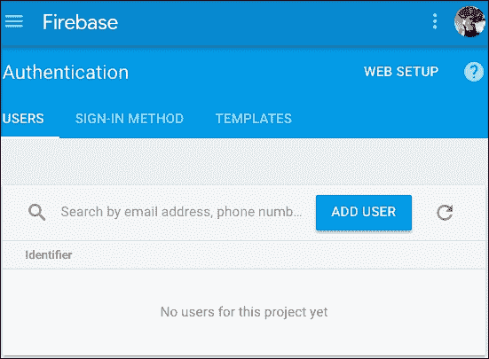
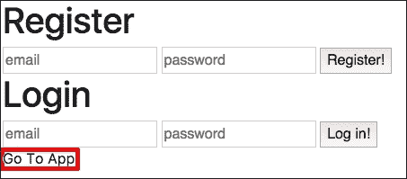
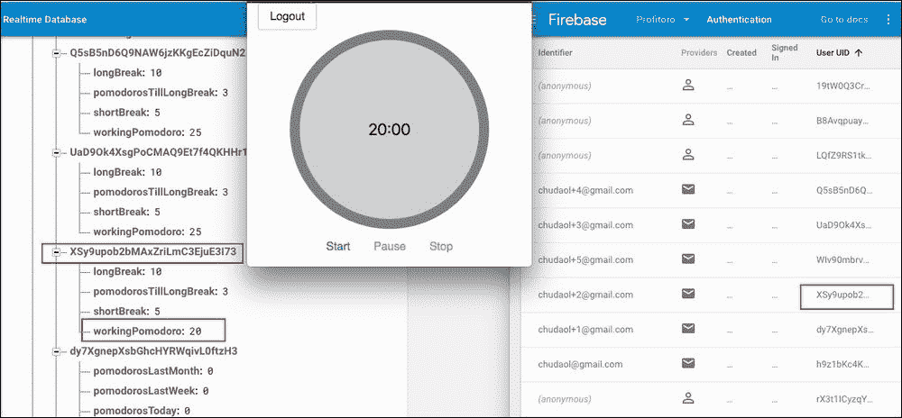
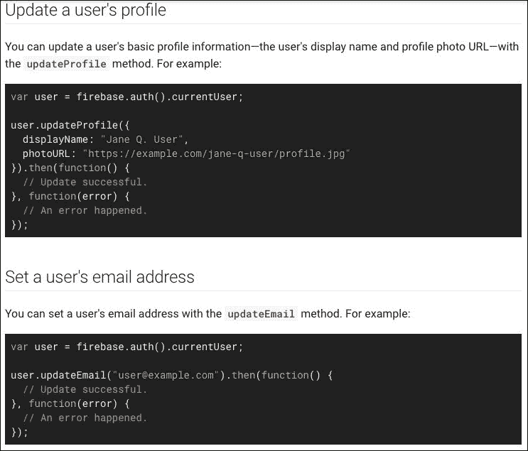
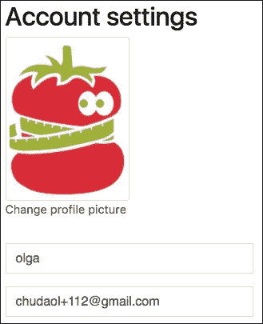

# 第六章：请进行身份验证！

在上一章中，我们将 ProFitOro 应用程序连接到了实时数据库。每当用户更新番茄钟计时器设置时，这些设置都会存储在数据库中，并立即在使用它们的组件之间传播。由于我们没有身份验证机制，我们不得不使用一个虚假用户来测试我们的更改。在本章中，我们将拥有真正的用户！

在这方面，我们将使用 Firebase 身份验证 API。因此，在本章中，我们将做以下事情：

+   讨论 AAA 的含义以及身份验证和授权之间的区别

+   探索 Firebase 身份验证 API

+   创建一个登录页面，并将其与 Firebase 身份验证 API 连接

+   将用户的设置与用户的身份验证连接起来

# 解释 AAA

**AAA**代表**身份验证、授权和计费**。最初，这个术语是用来描述安全网络协议的，然而，它可以很容易地应用于任何系统、网络资源或站点。

那么，AAA 是什么意思，为什么我们要关心呢？

**身份验证**是唯一识别系统用户的过程。经过身份验证的用户是被授予对系统访问权限的用户。通常，身份验证是通过一些用户名和密码来完成的。当您必须提供用户名和密码来打开您的 Facebook 页面时，您正在进行身份验证。

您的护照是在机场验证自己身份的一种方式。护照控制人员会看着你的脸，然后检查你的护照。因此，任何允许您“通过”的东西都是您身份验证的一部分。它可以是一个只有您和系统知道的特殊词（密码），也可以是您随身携带的可以帮助系统唯一识别您的东西（护照）。

**授权**是一种控制每个用户有权（权限）访问哪些资源的方式。如果您正在开发 Facebook 应用程序，您可以访问开发者页面，而普通用户无法访问此页面。

**计费**衡量为每个用户分配的资源。如果您拥有 Dropbox 商业标准帐户，您可以使用高达 2TB 的存储空间，而拥有普通免费 Dropbox 帐户只能获得 2GB 的空间。

对于我们的应用程序，我们应该关注 Triple-A 的前两个部分——*身份验证*和*授权*。在计算机科学中，我们经常使用术语**auth**，指的是身份验证或授权，甚至同时指两者。因此，我们将实现 auth，其中 auth 同时指身份验证和授权。在我们的 ProFitOro 应用程序的上下文中，这两个术语有什么区别呢？嗯，身份验证将允许用户登录到系统中，所以这很容易。授权呢？

您还记得我们决定只有经过身份验证的用户才能访问番茄工作法设置和统计数据吗？这就是授权。以后，我们可能会进一步实现一个特殊的角色——健身教练。拥有这个角色的用户将能够访问锻炼区域并能够添加新的锻炼。

在本章中，我们将使用 Firebase 身份验证机制，以添加登录和登陆到我们的应用程序的可能性，并控制用户可以访问的内容。

# Firebase 如何进行身份验证？

在上一章中，您学习了如何使用 Firebase API 创建 Firebase 应用程序实例，并通过应用程序使用它。我们能够访问数据库，读取它，并在其中存储数据。

您使用 Firebase 身份验证 API 的方式非常相似。您创建一个 Firebase 实例，向其提供一个`config`对象，并使用`firebase.auth()`方法来访问与身份验证相关的不同方法。检查您的 Firebase 控制台的**身份验证**选项卡：



现在还没有用户，但我们将在一分钟内解决这个问题！

Firebase SDK 提供了几种用户身份验证的方式：

+   基于电子邮件和密码的身份验证：对用户进行身份验证的经典方式。Firebase 提供了一种使用电子邮件/密码登录用户并将其登录的方法。它还提供了重置用户密码的方法。

+   联合实体提供者身份验证：与外部实体提供者（如 Google、Facebook、Twitter 或 GitHub）对用户进行身份验证的方式。

+   电话号码身份验证：通过向用户发送包含验证码的短信来对用户进行身份验证，用户需要输入验证码以确认其身份。

+   自定义身份验证系统集成：将已经存在的身份验证解决方案与 Firebase 身份验证 API 集成的方式。

+   **匿名用户身份验证**：提供 Firebase 功能（例如访问 Firebase 数据库）而无需进行身份验证的方式。例如，我们可以使用此匿名帐户来提供对数据库中存储的默认配置的访问权限。

对于我们的应用程序，我们将使用第一个和最后一个方法，因此我们将允许用户使用其电子邮件和密码组合进行登录和登录，并且我们将允许匿名用户使用应用程序的基本功能。

您应该在 Firebase 控制台中明确激活这两种方法。只需打开 Firebase 项目的**身份验证**选项卡，单击登录方法链接，然后启用这两种方法：


明确启用电子邮件/密码和匿名登录方法

使用 Firebase 身份验证 API 的工作流程如下：

1.  创建所有必要的方法进行登录和登录。

1.  为您的身份验证实现所有必要的 UI。

1.  将 UI 的更改连接到身份验证方法。

在第 3 步中发现了什么有趣的东西吗？*将 UI 的更改连接到身份验证方法*。您还记得我们正在处理一种响应式数据绑定框架，对吧？所以这将会很有趣！

# 如何将 Firebase 身份验证 API 连接到 Web 应用程序

为了将您的应用程序连接到 Firebase 身份验证 API，您应该首先创建一个 Firebase 应用程序实例：

```js
let config = {
  apiKey: 'YourAPIKey',
  databaseURL: 'YourDBURL',
  authDomain: 'YourAuthDomain'
}
let app = firebase.initializeApp(config)
```

您可以在弹出窗口中找到必要的密钥和 URL，如果单击**Web 设置**按钮将打开该窗口：


在 Web 应用程序中使用 Firebase 的设置配置

现在您可以使用应用程序实例来访问`auth()`对象及其方法。查看有关身份验证 API 的官方 Firebase 文档：[`firebase.google.com/docs/auth/users`](https://firebase.google.com/docs/auth/users)。

对我们来说 API 最重要的部分是创建和登录用户的方法，以及监听身份验证状态变化的方法：

```js
app.auth().**createUserWithEmailAndPassword**(email, password)
```

或者：

```js
app.auth().**signInWithEmailAndPassword**(email, password)
```

监听应用程序身份验证状态变化的方法称为`onAuthStateChanged`。您可以在此方法中设置重要属性，考虑应用程序根据用户是否已登录需要具有的状态：

```js
app.auth().**onAuthStateChanged**((user) => {
  if (user) {
    // user is logged in
  } else {
    // user is logged out
  }
})
```

就是这样！在我们的应用程序中，我们只需要提供一种可视方式将用户名和密码传递给 API。

# 认证到 ProFitOro 应用程序

现在让我们让 ProFitOro 应用程序的登录和注销成为可能！首先，我们必须设置 Firebase 实例，并找出应该将所有与身份验证相关的方法放在哪里。Firebase 应用程序初始化已经在 store/index.js 文件中完成。如果您仍然没有在 config 中包含它们，请添加 apiKey 和 authDomain 配置条目：

```js
// store/index.js
let config = {
  apiKey: 'YourAPIKey',
  databaseURL: 'https://profitoro-ad0f0.firebaseio.com',
  authDomain: 'profitoro-ad0f0.firebaseapp.com'
}
let firebaseApp = firebase.initializeApp(config)
```

我还将使用扩展运算符在 store 的 state 属性中导出 firebaseApp：

```js
//store/index.js
export default new Vuex.Store({
  state: {
    ...state,
    firebaseApp
  },
  <...>
})
```

我还将向我们的状态添加一个用户属性，以便我们可以在 onAuthStateChanged 监听器的处理程序上重置它：

```js
// store/state.js
export default {
  config,
  statistics,
  **user,**
 **isAnonymous: false**
}
```

让我们还创建一个小的变异，将用户对象的值重置为给定值：

```js
// store/mutations.js
export default {
  <...>
  **setUser (state, value) {**
 **state.user = value**
 **}**
}
```

现在我们已经完全准备好创建所需的操作。我将创建四个对我们的应用程序至关重要的操作：

+   createUser：此操作将调用 Firebase auth 的 createUserWithEmailAndPassword 方法，使用给定的电子邮件和密码

+   authenticate：此操作将调用 Firebase auth 的 signInWithEmailAndPassword 方法以使用给定的电子邮件和密码登录用户

+   注销：此操作将调用 Firebase auth 的 signOut 方法

+   bindAuth：此操作将设置 onAuthStateChanged 回调并提交 setUser 变异

首先，让我们以一种非常简单的方式实现这些操作，而不附加任何回调。因此，它们将如下所示：

```js
// store/actions.js
**createUser** ({state}, {email, password}) {
  state.firebaseApp.auth().**createUserWithEmailAndPassword**(email, password).catch(error => {
    console.log(error.code, error.message)
  })
},
**authenticate** ({state}, {email, password}) {
  state.firebaseApp.auth().**signInWithEmailAndPassword**(email, password)
},
**logout** ({state}) {
  state.firebaseApp.auth().**signOut**()
},
**bindAuth** ({commit, state}) {
  state.firebaseApp.auth().**onAuthStateChanged**((user) => {
    commit('setUser', user)
  })
},
```

太棒了！现在让我们将 bindAuth 操作附加到主 App.vue 组件的 created 方法上：

```js
// App.vue
methods: {
  ...mapActions(['bindStatistics', 'bindConfig', **'bindAuth'**])
},
created () {
  **this.bindAuth()**
  this.bindConfig()
  this.bindStatistics()
}
```

现在，一旦应用程序被创建，身份验证状态的监听器将立即绑定。我们可以做什么？现在，App.vue 组件立即显示的唯一组件是主内容组件。但是，如果用户没有登录，我们实际上应该显示着陆页组件，以提供给用户登录或注册的可能性。我们可以很容易地使用绑定到用户属性的 v-if 指令来实现。如果用户已定义，让我们显示主内容组件；否则，让我们显示着陆页组件。多么简单？我们的 App.vue 组件的模板将如下所示：

```js
// App.vue
<template>
  <div id="app">
    <landing-page **v-if="!user"**></landing-page>
    <main-content **v-if="user"**></main-content>
  </div>
</template>
```

如果您现在打开页面，您将看到显示着陆页：


当应用程序启动时，会显示登陆页面，因为用户没有登录

所有相关的代码到这部分都在`chapter6/1/profitoro`文件夹中。特别注意商店的文件（`index.js, actions.js, mutations.js, state.js`）和`App.vue`组件。

现在我们卡在了显示一些占位文本的登陆页面上，没有办法进入应用程序，因为我们无法登录！

好吧，这很容易解决：让我们在`Authentication.vue`组件中创建一个简单的注册和登录表单，并将其与我们的操作连接起来。

所以我将添加组件数据，用于保存注册的电子邮件、登录的电子邮件和相应的密码：

```js
// Authentication.vue
export default {
  **data** () {
    return {
 **registerEmail: '',**
 **registerPassword: '',**
 **loginEmail: '',**
 **loginPassword: ''**
    }
  }
}
```

我还将添加一个非常简单的标记，用于显示相应数据的输入：

```js
<template>
  <div>
    <h1>Register</h1>
    <input **v-model="registerEmail"** type="text" placeholder="email">
    <input **v-model="registerPassword"** type="password" placeholder="password">
    <button>Register!</button>
    <h1>Login</h1>
    <input **v-model="loginEmail"** type="text" placeholder="email">
    <input **v-model="loginPassword"** type="password" placeholder="password">
    <button>Log in!</button>
  </div>
</template>
```

现在让我们导入必要的操作（`authenticate`和`createUser`）并创建将调用这些操作的方法：

```js
// Authentication.vue
<script>
  **import {mapActions} from 'vuex'**

  export default {
    <...>
    methods: {
      **...mapActions(['createUser', 'authenticate'])**,
      **onRegisterClick** () {
        this.**createUser**({email: **this.registerEmail**, password: **this.registerPassword**})
      },
      **onLoginClick** () {
        this.**authenticate**({email: **this.loginEmail**, password: **this.loginPassword**})
      }
    }
  }
</script>
```

现在我们只需要将事件绑定到相应的按钮上，使用`v-on:click`指令：

```js
// Authentication.vue
<template>
  <div>
    <h1>Register</h1>
    <input v-model="registerEmail" type="text" placeholder="email">
    <input v-model="registerPassword" type="password" placeholder="password">
    <button **@click="onRegisterClick"**>Register!</button>
    <h1>Login</h1>
    <input v-model="loginEmail" type="text" placeholder="email">
    <input v-model="loginPassword" type="password" placeholder="password">
    <button **@click="onLoginClick"**>Log in!</button>
  </div>
</template>
```

让我们还在`HeaderComponent.vue`组件中添加一个按钮。这个按钮应该允许用户注销。这很容易；我们甚至不需要创建任何方法，我们只需要将事件绑定到实际的操作。因此整个标记和所需的脚本看起来就像这样简单：

```js
// HeaderComponent.vue
<template>
  <div>
    <button **@click="logout"**>Logout</button>
  </div>
</template>
<script>
  **import {mapActions} from 'vuex'**

  export default {
    methods: {
      **...mapActions(['logout'])**
    }
  }
</script>
```

就是这样！打开页面并尝试在你的应用程序中注册！它起作用了！一旦你登录，你不仅会看到番茄钟，还可以看到注销按钮。点击它，检查你是否真的被踢出应用程序到登陆页面。尝试重新登录。一切都像魅力一样运行。

不要忘记打开你的 Firebase 控制台并检查**认证**选项卡。你应该在那里看到所有注册的用户：


通过 Firebase 控制台的认证选项卡监视你的注册用户

恭喜！你刚刚使用 Firebase 认证 API 为你的应用程序实现了完整的认证机制。你可以在`chapter6/2/profitoro`文件夹中找到相应的代码。特别注意`Authentication.vue`和`HeaderComponent.vue`组件。

# 使认证界面再次变得伟大

我们刚刚为我们的 ProFitOro 应用程序实现了认证机制。这很棒，但是我们的认证页面的 UI 看起来好像我们使用了时光机，回到了互联网的早期。让我们使用我们强大的朋友-Bootstrap 来解决这个问题。

首先，我想将我的登陆页面布局为两列网格布局，因此整个登录属于左列，而将用户引导到应用程序而不注册的按钮位于右侧。但是，我希望这两列在移动设备上堆叠。

这对您来说并不新鲜；我想您应该还记得如何使用 Bootstrap 的网格布局来实现这种行为：[`v4-alpha.getbootstrap.com/layout/grid/`](https://v4-alpha.getbootstrap.com/layout/grid/)。因此，在我们的`LandingPage`组件中，我将把认证和`go-to-app-link`组件包装到带有`row`类的`div`中，并为这些组件添加相应的`col-*`类：

```js
// LandingPage.vue
<template>
  <div>
    <...>
    <div class="**container row justify-content-center**">
      <div class="**col-sm-12 col-md-6 col-lg-6**">
        <authentication></authentication>
      </div>
      <div class="**col-sm-12 col-md-6 col-lg-6**">
        <go-to-app-link></go-to-app-link>
      </div>
    </div>
  </div>
</template>
```

就是这样！现在您有一个漂亮的两列布局，在小型设备上会转换为单列布局：


这是我们在桌面设备上的布局

如您所见，在桌面设备上，我们有一个漂亮的两列布局。如果将浏览器调整到移动设备的大小，右列将跳到左列后面：



这是我们在移动设备上的布局

现在让我们来看看我们的`Authentication.vue`组件。为了使其比 20 年前的网页更美观，让我们对其应用 Bootstrap 的魔法。为此，我们将使用 Bootstrap 表单的类：[`v4-alpha.getbootstrap.com/components/forms/`](https://v4-alpha.getbootstrap.com/components/forms/)。

我们将整个表单包装到`<form>`标签中，将每个输入都包装到带有`form-group`类的`div`中。我们还将为每个输入添加`form-control`类。因此，例如，电子邮件输入将如下所示：

```js
<div class="**form-group**">
  <input class="**form-control**" v-model="email" type="email" placeholder="email">
</div>
```

作为一个小练习，做以下事情：

+   只需创建一个表单，其中有一个按钮可以在登录和注册表单之间切换

+   只需创建一个方法，根据表单当前的状态调用其中一个动作

+   探索 Bootstrap 的实用程序类，以除去所有边框，除了底部边框，并从中删除圆角：[`v4-alpha.getbootstrap.com/utilities/borders/`](https://v4-alpha.getbootstrap.com/utilities/borders/)

最后，您的表单应该如下所示：


这就是最终两种形式应该看起来的样子。它们应该通过底部按钮进行切换

尝试自己实现。要检查您的工作，请查看`chapter6/3/profitoro`文件夹。特别是，检查`Authentication.vue`组件的代码。它非常不同！

# 管理匿名用户

ProFitOro 允许未注册用户使用该应用程序。唯一的区别是，这些未注册用户也不被允许配置他们的设置，因为他们无法访问他们的统计数据。他们也无法管理锻炼。这就是我们遇到三 A 定义的第二个 A - *授权*。我们如何管理这些用户？如果我们只允许我们的用户注册和登录，他们如何进入应用程序？好吧，出于某种原因，我们已经准备好了“转到应用程序”的部分。让我提醒您在模型中的外观：


在初始模型中的无需注册！按钮

幸运的是，Firebase 身份验证 API 提供了一种方法来登录匿名用户。返回的用户对象包含`isAnonymous`属性，这将允许我们管理可以或不可以访问此匿名用户的资源。因此，让我们添加名为`authenticateAnonymous`的操作，并在其中调用相应的 Firebase `auth`方法：

```js
// store/actions.js
**authenticateAnonymous** ({state}) {
  state.firebaseApp.auth().**signInAnonymously**().catch(error => {
    console.log(error.code, error.message)
  })
},
```

这就是我们！现在让我们稍微修改一个设置用户和**isAnonymous**状态属性的变化，使其与用户对象中的相应属性相对应：

```js
// store/mutations.js
setUser (state, value) {
  state.user = value
  **state.isAnonymous = value.isAnonymous**
}
```

让我们还修改绑定配置和统计操作，并仅在用户设置且用户不是匿名用户时执行实际绑定：

```js
// state/actions.js
bindConfig: firebaseAction(({bindFirebaseRef, state}) => {
  if (state.user **&& !state.isAnonymous**) {
    bindFirebaseRef('config', state.configRef)
  }
}),
bindStatistics: firebaseAction(({bindFirebaseRef, state}) => {
  if (state.user **&& !state.isAnonymous**) {
    bindFirebaseRef('statistics', state.statisticsRef)
  }
})
```

我们已经完成了后端！现在让我们实现这个按钮！只需三个步骤即可实现。打开`GoToAppLink.vue`组件，导入`mapActions`助手，添加按钮，并使用`v-on:click`指令将事件侦听器绑定到它，该事件侦听器将调用相应的操作：

```js
// GoToAppLink.vue
<template>
  <div>
    **<button @click="authenticateAnonymous">**
 **START WITHOUT REGISTRATION**
 **</button>**
  </div>
</template>
<script>
  **import {mapActions} from 'vuex'**

  export default {
    methods: {
      **...mapActions(['authenticateAnonymous'])**
    }
  }
</script>
```

这有多简单？现在，作为一个小练习，借助 Bootstrap，尝试使事物看起来像下面这样：


使用相应的 Bootstrap 类使我们的按钮看起来像这样，并垂直对齐列。

检查 Bootstrap 的对齐类：[`v4-alpha.getbootstrap.com/layout/grid/#alignment`](https://v4-alpha.getbootstrap.com/layout/grid/#alignment)。还要检查辅助类以去除圆角。通过查看`chapter6/4/profitoro`文件夹中的代码来检查自己。特别注意`GoToAppLink.vue`组件和存储组件，如`action.js`和`mutations.js`。

# 个性化番茄钟

现在，我们已经可以注册新用户并登录现有用户，可能我们应该考虑利用我们的身份验证机制，因为现在我们实际上没有利用它。我们只是注册和登录。是的，我们还可以根据用户的身份验证隐藏或显示一些内容，但这还不够。所有这一切努力的重点是能够存储和检索用户的自定义番茄钟配置和用户的统计数据。

到目前为止，我们一直在使用硬编码的数据库对象，其中包含键`test`，以便访问用户的数据，但现在，由于我们已经有了真正的用户，是时候用真正的用户数据填充数据库并在我们的应用程序中使用它了。实际上，我们唯一需要做的就是用实际用户的 ID 替换这个硬编码的值。因此，例如，我们绑定`config`引用的代码看起来像这样：

```js
// store/actions.js
bindConfig: firebaseAction(({bindFirebaseRef, state}) => {
  if (state.user && !state.isAnonymous) {
    bindFirebaseRef('config', **state.configRef**)
  }
}),
```

在这里，引用`state.configRef`已经在存储的入口点`index.js`中定义：

```js
// store/actions.js
let firebaseApp = firebase.initializeApp(config)
let db = firebaseApp.database()
**let configRef = db.ref('/configuration/test')**

```

现在，我们实际上不能在存储的入口点实例化我们的数据库引用，因为在这一点上（无意冒犯），我们仍然不知道我们的用户是否已经通过身份验证。因此，最好的做法是将此代码传递给实际的`bindConfig`函数，并用真实用户的*uid*替换这个`test`：

```js
// store/action.js
bindConfig: firebaseAction(({bindFirebaseRef, state}) => {
  if (state.user && !state.isAnonymous) {
    let db = firebaseApp.database()
    bindFirebaseRef('config', **db.ref(`/configuration/${state.user.uid}`)**)
  }
}),
```

现在，我亲爱的细心用户，我知道你在惊叹“但是用户的*uid*配置是如何存储的？”非常注意到：它没有。我们仍然需要在用户首次注册时将其存储。实际上，我们需要存储配置和统计数据。

Firebase 数据库提供了一种写入新数据到数据库的方法，称为`set`。因此，您基本上获取引用（就像读取数据的情况一样）并设置您需要写入的数据：

```js
firebaseApp.database().ref(**`/configuration/${state.user.uid}`**).set(
  state.config
);
```

这将在我们的配置表中为给定的用户 ID 创建一个新条目，并设置默认状态的`config`数据。因此，我们将不得不在新用户创建时调用此方法。我们仍然需要将数据库引用绑定到我们的状态对象。为了减少代码量，我创建了一个方法`bindFirebaseReference`，它接收引用和表示应将其绑定到的状态键的字符串。该方法将分析数据库中是否已存在给定引用的条目，并在需要时创建它。为此，Firebase 提供了一个几乎可以应用于任何东西的好方法 - 这个方法称为`once`，它接收一个回调和一个快照。因此，在此回调中，我们可以分析此快照是否具有给定名称的子项，甚至是否具有值或为`null`。如果值已设置，我们将将我们的状态绑定到它。如果没有，我们将创建一个新条目。在这方面查看官方 Firebase 文档：[`firebase.google.com/docs/database/web/read-and-write`](https://firebase.google.com/docs/database/web/read-and-write)。这就是`once`方法及其回调的外观：


如何使用`once`方法检查数据库中是否存在数据

不考虑数据的存在与否，我们的绑定引用方法应调用 Firebase 绑定。因此，它将如下所示：

```js
// store/actions.js
bindFirebaseReference: firebaseAction(({bindFirebaseRef, state}, {reference, toBind}) => {
  return reference.once('value').then(snapshot => {
    if (!snapshot.val()) {
      **reference.set(state[toBind])**
    }
    **bindFirebaseRef(toBind, reference)**
  })
}),
```

我还用一个方法替换了绑定`config`和`statistics`的两种方法：

```js
// store/actions.js
bindFirebaseReferences: firebaseAction(({bindFirebaseRef, state, commit, dispatch}, user) => {
  let db = state.firebaseApp.database()
  let **configRef** = db.ref(**`/configuration/${user.uid}`**)
  let **statisticsRef** = db.ref(**`/statistics/${user.uid}`**)
  dispatch('bindFirebaseReference', {reference: configRef, toBind: 'config'}).then(() => {
    **commit('setConfigRef', configRef)**
  })
  dispatch('bindFirebaseReference', {reference: statisticsRef, toBind: 'statistics'}).then(() => {
    **commit('setStatisticsRef', statisticsRef)**
  })
}),
```

这个方法是从`bindAuth`方法中调用的。因此，现在我们可以从`App.vue`的`created`方法中删除绑定`config`和`statistics`的调用。我们还不需要在`store/index.js`中实例化引用，因为这两个引用都是在这个新方法中实例化的。我们还必须添加两个将引用设置为状态的 mutations，这样我们就不需要更改我们的 Pomodoro 配置设置 actions，因为它们正在使用这两个引用来更新数据。

检查`chapter6/5/profitoro`文件夹中代码的外观。查看`App.vue`组件中的轻微更改，并查看存储文件现在的外观（`index.js`，`mutations.js`，`state.js`，特别是`actions.js`）。

玩一下你的应用程序。注册、登录、更改番茄钟定时器配置、退出登录，然后检查它是否有效。检查你的 Firebase 控制台 - **实时数据库**选项卡和**身份验证**选项卡。检查无论你改变什么，你的数据都是一致的 - 在你的数据库中，在你的**身份验证**选项卡中，最重要的是在你的应用程序中（因为应用程序是你的用户将要看到的，对吧？）：



检查数据在各处是否一致

现在我们可以注册新用户，以现有用户身份登录，以匿名用户身份登录。我们为经过身份验证的用户提供了一个不错的价值 - 能够配置他们的番茄钟定时器并检查他们的统计数据。当然，我们的应用程序还远远不完美 - 我们没有验证输入，接受番茄钟配置区域中的任何值，这是不对的，而且我们也没有在启动页面上显示更改密码的可能性。但是我们有一个坚实的框架，它使我们能够在其基础上构建一个坚实而不错的应用程序。所以让我们继续前进！

# 更新用户的个人资料

如果我们能够通过显示欢迎消息来欢迎我们的用户，比如**欢迎 Olga**，那不是很有趣吗？但是我们的用户没有名字；他们只有电子邮件和密码 - 这两个在注册过程中传递的基本认证组件。那么，我们该怎么做呢？如果你仔细阅读了 Firebase 关于身份验证的文档（[`firebase.google.com/docs/auth/web/manage-users`](https://firebase.google.com/docs/auth/web/manage-users)），你可能会发现这些不错的方法：



用于更新用户个人资料和电子邮件地址的 Firebase 方法

让我们使用这些方法来更新我们用户的个人资料和用户的个人资料图片！

我们将定义三个新的操作 - 一个将通过调用 Firebase 的`updateProfile`方法来更新用户的显示名称，另一个将通过调用相同的方法来更新用户的个人资料图片 URL，还有一个将调用`updateEmail`方法。然后我们将在`Settings.vue`组件中创建必要的标记，将这些操作绑定到相应输入的更新上。听起来很容易，对吧？相信我，实际实现起来就像听起来的那么容易。

因此，让我们定义我们的操作。它们将如下所示：

```js
// store/actions.js
**updateUserName** ({state, commit}, displayName) {
  state.user.**updateProfile**({
    displayName
  })
},
**updatePhotoURL** ({state}, photoURL) {
  state.user.**updateProfile**({
    photoURL
  })
},
**updateUserEmail** ({state}, email) {
  state.user.**updateEmail**(email).then(() => {
    // Update successful.
  }, error => {
    console.log(error)
  })
},
```

太棒了！现在让我们切换到我们的`Settings.vue`组件，它将负责渲染所需的数据以更改帐户设置，并在需要时调用所需的操作来更新这些数据。所以首先，我将向数据函数添加三个条目，这些条目将在组件被`created`时设置为当前用户对象的相应属性：

```js
// Settings.vue
data () {
  return {
    **displayName**: '',
    **email**: '',
    **photoURL**: 'static/tomato.png'
  }
},
computed: {
  ...mapGetters({**user**: 'getUser'})
},
created () {
  **this.displayName** = this.user.displayName
  **this.email** = this.user.email
  **this.photoURL** = this.user.photoURL ? this.user.photoURL : this.photoURL
}
```

现在这些数据可以在相应的操作中使用。所以，让我们导入所需的操作并创建相应的方法：

```js
// Settings.vue
methods: {
  **...mapActions(['updateUserName', 'updateUserEmail', 'updatePhotoURL'])**,
  onChangeUserName () {
    this.**updateUserName**(this.**displayName**)
  },
  onChangeUserEmail () {
    this.**updateUserEmail**(this.**email**)
  },
  **onProfilePicChanged** () {
    this.**updatePhotoURL**(this.**photoURL**)
  }
}
```

现在我们可以添加所需的标记，其中包含了我们将使用`v-model`数据绑定指令绑定数据的输入框！我们还将在每个输入框的更新上调用相应的方法：

```js
// Settings.vue
<form>
  <div class="form-group">
    <figure class="figure">
      
      <input type="text" **v-model="photoURL"** **@change="onProfilePicChanged"**>
    </figure>
  </div>
  <div class="form-group">
    <input **@change="onChangeUserName"** **v-model="displayName"** type="text" placeholder="Change your username">
  </div>
  <div class="form-group">
    <input **@change="onChangeUserEmail"** **v-model="email"** type="text" placeholder="Change your username">
  </div>
</form>
```

然后...我们完成了！

作为一个小练习，做以下操作：在我们的图像后面添加一个标题，说**更改个人资料图片**。新图片 URL 的输入框应该只在用户点击这个标题时可见。一旦 URL 更新完成，输入框应该再次变得不可见。

结果应该如下所示：



用户点击更改个人资料图片标题之前的外观如下

最初，它包含默认用户图片。

用户点击标题后，更改图片 URL 的输入框出现：


用户点击标题后，输入框出现

用户更改个人资料图片 URL 后，输入框再次隐藏：


用户更改个人资料图片的 URL 后，输入框消失了

我的建议：向`Settings.vue`组件的数据添加一个额外的属性，当用户点击标题时将其设置为`true`，并在输入框内的值改变时将其重置为`false`。

还有，不要忘记我们这一部分的初始目标 - 在`Header.vue`组件内添加一个欢迎消息。这个欢迎消息应该包含用户的显示名称。它应该看起来像这样：


欢迎消息提到用户的名字

请注意，如果您决定更改您的电子邮件，您将不得不注销并再次登录；否则，您将在控制台中收到一些 Firebase 安全错误。

本章的最终代码可以在`chapter6/6/profitoro`文件夹中找到。请注意，我将帐户设置和番茄钟设置分成了两个单独的组件（`AccountSettings.vue`和`PomodoroTimerSettings.vue`）。这样做可以更容易地进行维护。也要注意存储组件。查看`Header.vue`组件以及它如何显示欢迎消息。

# 总结

在本章中，我们学习了如何结合 Firebase 实时数据库和认证 API 来更新用户的设置。我们已经构建了一个用户界面，允许用户更新其个人资料设置。在短短几分钟内，我们就完成了应用程序的完整认证和授权部分。我不知道你们，但我对此感到非常惊讶。

在下一章中，我们将最终摆脱包含应用程序所有部分的庞大页面 - 番茄钟计时器本身、统计数据和设置配置视图。我们将探索 Vue 的一个非常好的重要功能 - `vue-router`。我们将把它与 Bootstrap 的导航系统结合起来，以实现流畅的导航。我们还将探讨代码拆分这样一个热门话题，以实现应用程序的延迟加载。所以，让我们开始吧！
