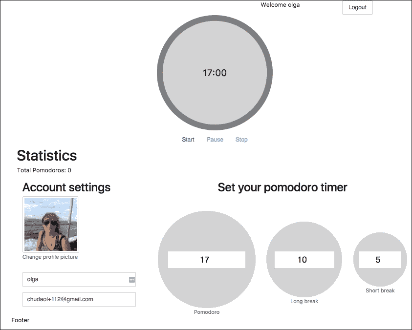
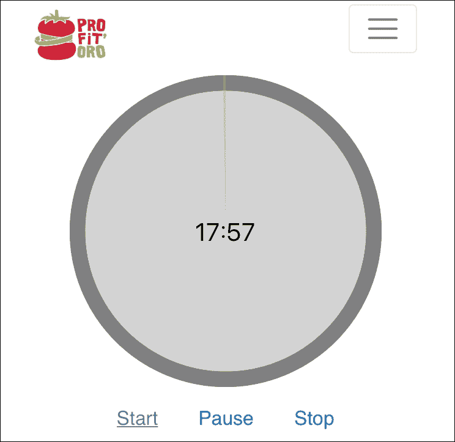

# 第七章：使用 vue-router 和 Nuxt.js 添加菜单和路由功能

在上一章中，我们为我们的应用程序添加了一个非常重要的功能 - *身份验证*。现在，我们的用户可以注册、登录应用程序，并在登录后管理他们的资源。因此，他们现在可以管理番茄钟计时器的配置和他们账户的设置。一旦登录，他们还可以访问他们的统计数据。我们已经学会了如何使用 Firebase 的身份验证 API 并将 Vue 应用程序连接到它。我必须说，上一章在学习上非常广泛，而且非常偏向后端。我非常喜欢它，希望你也喜欢。

尽管我们的应用程序具有身份验证和授权的复杂功能，但仍然缺乏导航。出于简单起见，我们目前在主页上显示应用程序的所有部分。这很丑陋：



承认吧，这很丑陋

在本章中，我们不打算让事情变得美丽。我们要做的是使事情可导航，以便通过导航访问应用程序的所有部分。我们将应用`vue-router`机制，以实现自然的浏览器导航，并且我们将使用 Bootstrap 的`navbar`来轻松导航到每个部分。因此，在本章中，我们将：

+   再次探索`vue-router`以实现 ProFitOro 应用程序的导航

+   使用 Bootstrap 的`navbar`来渲染导航栏

+   探索代码拆分技术，仅在需要时加载应用程序的每个部分

+   最后，我们将探索 Nuxt.js 模板，使用它重建我们的应用程序，并以不显眼和愉快的方式实现路由

# 使用 vue-router 添加导航

希望你还记得第二章中`vue-router`是什么，它是做什么的，以及它是如何工作的。只是提醒一下：

> Vue-router 是 Vue.js 的官方路由器。它与 Vue.js 核心深度集成，使使用 Vue.js 构建单页面应用程序变得轻而易举。

-(来自 vue-router 的官方文档)

`vue-router`非常容易使用，我们不需要安装任何东西 - 它已经与 Vue 应用程序的默认脚手架和 webpack 模板一起提供。简而言之，如果我们有应该表示路由的 Vue 组件，这就是我们要做的事情：

+   告诉 Vue 使用`vue-router`

+   创建一个路由实例并将每个组件映射到其路径

+   将此实例传递给 Vue 实例或组件的选项

+   使用`router-view`组件进行渲染

### 注意

查看官方`vue-router`文档：[`router.vuejs.org`](https://router.vuejs.org)

创建路由时，应将路由数组传递给它。每个数组项表示给定组件与某个路径的映射：

```js
{
  name: 'home',
  component: HomeComponent,
  path: '/'
}
```

ProFitOro 只有四个可能的路由 - 番茄钟计时器本身，我们可以将其视为主页，带有设置和统计信息的视图，以及协作锻炼的视图。因此，我们的路由看起来非常简单易懂：

```js
// router/index.js
import Vue from 'vue'
import Router from 'vue-router'
import {PomodoroTimer, Settings, Statistics, Workouts} from '@/components/main/sections'

Vue.use(Router)

export default new Router({
  mode: 'history',
  routes: [
    {
      name: **'home'**,
      component: **PomodoroTimer**,
      path: '**/**'
    },
    {
      name: **'settings'**,
      component: **Settings**,
      path: '**/settings'**
    },
    {
      name: **'statistics'**,
      component: **Statistics**,
      path: '**/statistics**'
    },
    {
      name: **'workouts'**,
      component: **Workouts**,
      path: '**/workouts**'
    }
  ]
})
```

现在，如果您在`ContentComponent`视图中导入创建的路由，将其传递给组件的选项并渲染`router-view`组件，您将能够看到 Vue 路由的实际效果！您还可以删除所有组件导入，因为`ContentComponent`现在实际上应该导入的唯一事物是负责其他一切的路由。因此，`ContentComponent`将如下所示：

```js
// ContentComponent.vue
<template>
  <div class="container">
    **<router-view></router-view>**
  </div>
</template>
<script>
  **import router from '@/router'**

  export default {
    **router**
  }
</script>
```

打开页面，在浏览器地址栏中输入`localhost:8080/settings`，`localhost:8080/statistics`，`localhost:8080/workouts`，您将看到视图根据您实际尝试访问的内容而出现。您必须承认，这真的很容易。

现在让我们添加链接，因为我们希望通过单击某些按钮进行导航，而不是在浏览器地址栏中输入导航 URL，对吧？

使用`vue-router`添加导航链接非常容易。使用提供的`router-link`组件，带有指向所需路径的`to`属性的链接：

```js
<router-link to="/">Home</router-link>
```

让我们在我们的`Header`组件中添加这些链接。这个组件应该负责导航表示。因此，在我们的`HeaderComponent.vue`的`template`部分中，添加以下内容：

```js
// HeaderComponent.vue
<template>
  <router-link to="/">Home </router-link>
  <router-link to="statistics">Statistics </router-link>
  <router-link to="workouts">Workouts </router-link>
  <router-link to="settings">Settings </router-link>
</template>
```

不要忘记在组件选项中导入路由并导出它：

```js
// HeaderComponent.vue
<script>
  //...
  **import router from '@/router'**

  export default {
    //

    **router**
  }
</script>
```

通过一点 Bootstrap 类的调整，我们可以得到如下结果：


使用 vue-router 导航 ProFitOro

这就是用`vue-router`及其组件进行路由和导航的基础知识。您可以在`chapter7/1/profitoro`文件夹中找到此部分的最终代码。特别注意路由器本身（`router/index.js`）、`ContentComponent.vue`和`HeaderComponent.vue`文件。

## 练习 - 根据身份验证限制导航

不要忘记，我们必须根据用户的身份验证状态限制导航链接。如果用户是匿名身份验证的，我们不应该显示导航链接。然而，应该有一个按钮，让用户返回到主页。因此，这个按钮应该调用注销功能，并显示不同的文本，比如**返回到起始页**。您已经知道如何有条件地渲染 Vue 组件。我们的路由链接不过是普通组件，所以根据用户的值和其属性`isAnonymous`应用条件渲染机制。

在`chapter7/2/profitoro`文件夹中检查此练习的解决方案。注意`HeaderComponent`组件。

# 使用 Bootstrap 导航栏进行导航链接

我们当前的导航栏很棒 - 它很实用，但不是响应式的。幸运的是，Bootstrap 有一个`navbar`组件，为我们实现了响应性和适应性。我们只需用一些 Bootstrap 类包装我们的导航元素，然后坐下来检查我们美丽的导航栏，在移动设备上折叠，在桌面设备上展开。查看 Bootstrap 关于`navbar`组件的文档：[`v4-alpha.getbootstrap.com/components/navbar/`](https://v4-alpha.getbootstrap.com/components/navbar/)。

### 注意

请记住，此 URL 是用于 alpha 版本。下一个稳定版本 4 将在官方网站上提供。

这些是我们将使用的类，将我们简单的导航栏转换为由 Bootstrap 管理的响应式导航栏：

+   导航栏：这个包裹整个导航栏元素

+   `navbar-toggleable-*`：这也应该包裹整个导航栏元素，并告诉它何时在展开/折叠状态之间切换（例如，`navbar-toggleable-md`会使导航栏在中等大小设备上折叠）

+   `navbar-toggler`：这是一个用于在小型设备上打开折叠菜单的按钮类

+   `navbar-toggler-*`：这告诉`toggler`元素应该被放置在哪里，例如，`navbar-toggler-right`

+   `navbar-brand`：这是代表品牌的导航栏元素的类（可以是标志和/或文本）

+   `collapse navbar-collapse`：这些类将包裹应该在小设备上折叠的导航栏元素

+   `nav-item`：这是每个导航栏项的类

+   `nav-link`：这是`nav-item`项的嵌套元素的类；最终这将是一个将您带到给定链接的锚点

还有许多其他类来定义导航栏的颜色方案，以及其定位、对齐等。查看文档并尝试它们。我将只改变`Header`组件的标记。因此，它将看起来像下面这样：

```js
// HeaderComponent.vue
<template>
  <div>
    <nav class="**navbar navbar-toggleable-md navbar-light**">
      <button class="**navbar-toggler navbar-toggler-right**" type="button" data-toggle="collapse" data-target="#navbarHeader" aria-controls="navbarHeader" aria-expanded="false" aria-label="Toggle navigation">
        <span class="navbar-toggler-icon"></span>
      </button>
      <div class="**navbar-brand**">
        <logo></logo>
      </div>
      <div class="collapse navbar-collapse" id="navbarHeader">
        <ul class="navbar-nav ml-auto">
          <li class="**nav-item**">
            <router-link class="**nav-link**" to="/">Home </router-link>
          </li>
          <li class="nav-item">
            <router-link class="**nav-link**" to="settings">Settings </router-link>
          </li>
          <li class="**nav-item**">
            <router-link class="**nav-link**" to="statistics">Statistics </router-link>
          </li>
          <li class="**nav-item**">
            <router-link class="**nav-link**" to="workouts">Workouts </router-link>
          </li>
        </ul>
        <form class="form-inline my-2 my-lg-0">
          <button class="btn btn-secondary" @click="onLogout">Logout</button>
        </form>
      </div>
    </nav>
  </div>
</template>
```

您可能已经注意到，我在导航项中使用了我们的`router-link`元素和`nav-link`类。事实证明它们非常好地配合在一起。因此，我们将 Vue 路由机制与 Bootstrap 的导航栏混合在一起，在我们的 Vue 应用程序中实现了一个优雅的响应式路由解决方案。现在，我们的页眉看起来就像这样：


ProFitOro 在桌面设备上的导航栏

如果我们在移动设备上打开 ProFitOro，我们将看到一个漂亮的切换按钮而不是菜单：



这是 ProFitOro 在移动设备上的菜单样子

如果我们在移动设备上点击切换按钮，菜单将垂直展开：


这是在移动设备上扩展的 ProFitOro 菜单的样子

### 提示

这在 Bootstrap 4 的 alpha 版本中运行良好，但是如果您使用 Bootstrap 4 Beta，您将看到一些不一致之处。一些类被删除，一些类被添加。为了使它看起来完全相同，做如下操作：

+   用`navbar-expand-lg`替换`navbar-tooglable-md`类

+   将`btn-secondary`按钮的类替换为`button-outline-secondary`，交换切换按钮和品牌元素

基于身份验证的条件渲染功能已被删除。我将重新添加它，但是不再在用户匿名时隐藏元素，而是将它们禁用。这将为应用程序带来额外的价值-未注册用户将不断被提醒，如果他注册，就可以使用一些不错的功能。因此，我将把`disabled` Bootstrap 类绑定到`router-link`元素上。如果用户是匿名的，这个类将被激活。因此，我们的每个路由链接将如下所示：

```js
// HeaderComponent.vue
<router-link class="nav-link" **:class="{disabled:user.isAnonymous}"** to="settings">Settings </router-link>
```

如果你现在打开页面并以匿名用户的身份进入应用程序，你会发现链接显示为禁用状态：


对于未经授权的用户，链接将显示为禁用状态

但是，我们的用户很聪明，我们都知道，对吧？我们的用户将做与你现在考虑做的事情完全相同（如果你还没有做过的话）-打开开发者工具控制台，转到元素选项卡，编辑标记并删除`disabled`类。*Ba-dum-tsss*，现在你可以点击导航链接了！

因此，我们还需要在路由器端保护它。幸运的是，`vue-router`实例提供了一个名为`beforeEach`的钩子方法。这个方法接收下一个和上一个路由，并且在其中你可以评估它们并调用`next()`方法，这将根据条件继续到下一个路由或替换被调用的路径。

此外，每个路由项都可以包括元属性，我们可以在其中传递一个条件，该条件决定是否可以调用该路由。在这方面，请查看`vue-router`文档：[`router.vuejs.org/en/advanced/meta.html`](https://router.vuejs.org/en/advanced/meta.html)。

因此，让我们为每个三个路由项添加一个`requiresAuth`的元属性，并像这样使用`beforeEach`方法：

```js
// router/index.js
router.beforeEach((**to, from, next**) => {
  if (to.matched.some(record => **record.meta.requiresAuth**)) {
    if **(!store.state.user || store.state.user.isAnonymous)** {
      next({
        **path: '/'**
      })
    } else {
      **next()**
    }
  } else {
    **next()**
  }
})
```

*Et voilá*，从现在开始，即使你在未经授权的情况下在浏览器地址栏中明确输入了其中一个有条件的路由 URL，你也会被重定向到主页！

查看`chapter7/3/profitoro`文件夹中此部分的最终代码。特别注意路由器本身（`router/index.js`）和`Header`组件。

# 代码拆分或延迟加载

当我们构建应用程序以部署到生产环境时，所有 JavaScript 都被捆绑到一个唯一的 JavaScript 文件中。这非常方便，因为一旦浏览器加载了这个文件，整个应用程序已经在客户端上了，没有人担心加载更多的东西。当然，这仅适用于单页应用程序。

我们的 ProFitOro 应用程序（至少在这个阶段）受益于这种捆绑行为-它很小，只有一个请求，一切就位，我们不需要为任何 JavaScript 文件从服务器请求任何内容。

然而，这种捆绑可能会有一些缺点。我非常确定您已经构建过或已经看到过庞大的 JavaScript 应用程序。总会有一些时候，加载庞大的捆绑包将变得难以忍受地慢，特别是当我们希望这些应用程序在桌面和移动环境下运行时。

这个问题的一个明显解决方案是以一种方式拆分代码，只有在需要时才加载不同的代码块。这对于单页应用程序来说是一个相当大的挑战，这就是为什么我们现在有一个庞大的社区致力于网页开发。

目前，在网页开发领域已经存在一些简单的技术，可以用来拆分 webpack 应用程序中的代码。查看官方 webpack 文档以了解更多信息：[`webpack.js.org/guides/code-splitting/`](https://webpack.js.org/guides/code-splitting/)。

为了在 Vue.js 应用程序中使用代码拆分，您不需要做任何复杂的事情。无需重新配置您的 webpack 配置文件，也无需重写您的组件。查看有关延迟加载路由的文档条目：[`router.vuejs.org/en/advanced/lazy-loading.html`](https://router.vuejs.org/en/advanced/lazy-loading.html)。

### 提示

**TL;DR**：为了延迟加载您的路由，您只需要改变导入它们的方式。因此，请考虑以下代码：`import PomodoroTimer from '@/components/main/sections/PomodoroTimer'` 要惰性加载您的路由，您应该写成以下形式：`const PomodoroTimer = () => import('@/components/main/sections/PomodoroTimer')`

其余的代码保持完全不变！

因此，我们只需改变在路由器中导入组件的方式：

```js
// router/index.js
const PomodoroTimer = () => import('@/components/main/sections/PomodoroTimer')
const Settings = () => import('@/components/main/sections/Settings')
const Statistics = () => import('@/components/main/sections/Statistics')
const Workouts = () => import('@/components/main/sections/Workouts')
```

就是这样！检查页面，确保一切仍然按预期工作。检查网络面板。您会看到现在将为不同的路由视图请求不同的 JavaScript 包！

如果您将网络请求与以前的版本进行比较，您将看到现在实际上有四个请求-`0.js`，`1.js`，`2.js`和`3.js`-与以前的单个`app.js`请求相比：


代码分割或延迟加载之前的 app.js 包的单个请求

在代码分割之后，如果我们通过应用程序的导航链接导航，我们将看到以下内容：


每个路由都会请求相当小的 JavaScript 块

注意一下块的大小。您不认为对于大型项目，代码分割技术实际上可能会增加应用程序的性能吗？检查`chapter7/3.1/profitoro`文件夹中的路由器代码。

# 服务器端渲染

**服务器端渲染**（**SSR**）最近成为了 Web 开发世界中又一个流行的缩写词。它与代码分割技术一起使用，有助于提高 Web 应用的性能。它还对 SEO 产生积极影响，因为所有内容一次性加载，爬虫能够立即看到，而不是在初始请求后在浏览器中构建内容的情况。

我找到了一篇关于 SSR 的好文章，比较了服务器端和客户端渲染（尽管它是 2012 年的）。看看这个链接：[`openmymind.net/2012/5/30/Client-Side-vs-Server-Side-Rendering/`](http://openmymind.net/2012/5/30/Client-Side-vs-Server-Side-Rendering/)。

将服务器端渲染引入 Vue 应用程序非常容易-在这方面查看官方文档：[`ssr.vuejs.org`](https://ssr.vuejs.org)。

我们的应用程序性能很重要；SEO 的工作也很重要。然而，重要的是不滥用工具，不引入实现开销和过度。我们的 ProFitOro 应用程序需要 SSR 吗？要回答这个问题，让我们考虑一下我们的内容。如果有大量的内容被带到页面上，并被用作初始渲染的基础，那么答案可能是肯定的。好吧，这不适用于我们的应用程序。我们有一个简单的登录页面，我们的 ProFitOro 计时器，以及一些配置设置。目前可能有意义的唯一视图是包含锻炼的视图。但现在，让我们不要把事情搞得太复杂。您可以尝试使用我们的 ProFitOro 进行 Vue 应用程序的服务器端渲染技术，但请记住，这不是应该始终使用的东西。还要了解服务器端渲染和预渲染之间的区别（[`github.com/chrisvfritz/prerender-spa-plugin`](https://github.com/chrisvfritz/prerender-spa-plugin)），并检查我们的应用程序实际上如何从这两种技术中受益。

# Nuxt.js

在我们忙于定义路由器对象、路由器链接、代码拆分和学习有关服务器端渲染的知识时，有人实现了一种开发 Vue.js 应用程序的方式，而不必担心所有这些事情。只需编写您的代码。所有诸如路由、代码拆分甚至服务器端渲染的事情都将在幕后为您处理！如果你想知道这到底是什么，让我向你介绍 Nuxt.js：[`nuxtjs.org`](https://nuxtjs.org)。

那么，Nuxt.js 是什么？

Nuxt.js 是用于创建通用 Vue.js 应用程序的框架。

它的主要范围是 UI 渲染，同时抽象出客户端/服务器分发。

它有什么了不起的地方？Nuxt.js 引入了页面的概念 - 基本上，页面也是 Vue 组件，但每个页面代表一个*路由*。一旦您在`pages`文件夹中定义了您的组件，它们就会成为路由，无需任何额外的配置。

在本章中，我们将完全将我们的 ProFitOro 迁移到 Nuxt 架构。所以，做好准备；我们将进行大量的更改！在本章结束时，我们的努力将得到一段漂亮、优雅的代码。

Nuxt 应用有一个单独的`config`文件，你可以在其中定义必要的 webpack 配置，以及`meta`、`links`和额外的`scripts`用于你的`index.html`文件。这是因为 Nuxt 会在构建过程中自动生成你的`index.html`，所以你不必在应用的根目录中拥有它。在这个配置文件中，你还可以定义每个路由变化时应该发生的过渡效果。

创建 Nuxt 应用的方式与创建任何 Vue 应用非常相似 - 所有 Nuxt.js 功能都内置在`nuxt-starter`模板中：[`github.com/nuxt-community/starter-template`](https://github.com/nuxt-community/starter-template)。因此，使用 Nuxt 模板创建 Vue.js 应用只是：

```js
**vue init nuxt/starter <project-name>**

```

让我们创建一个`profitoro-nuxt`项目并看看它是如何工作的。运行以下命令：

```js
**vue init nuxt/starter profitoro-nuxt**

```

点击 Enter 回答问题。

进入生成的文件夹，安装依赖，并运行应用：

```js
**cd profitoro-nuxt**
**npm install**
**npm run dev**

```

在`localhost:3000`上打开页面，并确保你看到这个：


Nuxt 应用的初始默认页面

让我们来探索文件夹的结构和代码。有一个名为`pages`的文件夹，你可以在里面找到`index.vue`页面。还有一个名为`components`的文件夹 - 在这里我们将存储我们的组件。有一个`nuxt.config.js`文件，其中存储了所有基本配置。简而言之，就是这样。

让我们来处理`pages`文件夹。我们的 ProFitOro 应用的哪些组件可以定义为`pages`？很容易识别它们，因为我们已经定义了路由。所以，我会说我们可以识别以下页面：

+   `index.vue`：这将检查用户是否已登录，并渲染登录页面或番茄钟计时器页面

+   `login.vue`：这个页面与我们当前的`LandingComponent.vue`完全相同

+   `pomodoro.vue`：这将是包含番茄钟计时器组件的页面

+   `settings.vue`：这个页面将代表我们的`Settings.vue`组件

+   `statistics.vue`：这个页面将负责渲染`Statistics.vue`组件

+   `workouts.vue`：这个页面将负责管理锻炼

让我们为所有这些页面创建占位符。这是我在`pages`文件夹内部的目录结构：

```js
**├── pages**
**│   ├── index.vue**
**│   ├── login.vue**
**│   ├── pomodoro.vue**
**│   ├── settings.vue**
**│   ├── statistics.vue**
**│   └── workouts.vue**

```

这是`login.vue`页面的初始内容：

```js
//login.vue
<template>
  <div>
    login
  </div>
</template>
<script>

</script>
<style scoped>

</style>
```

其他页面都和这个页面非常相似，除了`index.vue`页面：

```js
//index.vue
<template>
  <div>
    <pomodoro></pomodoro>
    <login></login>
  </div>
</template>
<script>
  **import login from './login'**
 **import pomodoro from './pomodoro'**

  export default {
    components: {login, pomodoro}
  }
</script>
<style>
</style>
```

如果你在浏览器中打开此应用程序，并尝试在浏览器的地址栏中键入不同的路径（`localhost:3000/pomodoro`，`localhost:3000/settings`等），你将看到它实际上呈现了相应的页面。多么美妙啊！我们不需要定义任何路由或任何额外的配置就能实现这种行为！在`chapter7/4/profitoro-nuxt`文件夹中检查此部分的代码。

## 使用 nuxt-link 添加链接

就像`vue-router`提供了一个名为`router-link`的组件一样，Nuxt 提供了一个非常相似的组件，名为`nuxt-link`。让我们使用 nuxt-links 而不是 router-links 来更改我们的`HeaderComponent`，并将此组件包含在我们的页面中。

在这之前，让我们安装`sass-loader`，因为，如果你记得的话，我们正在使用 sass 预处理器来处理我们的 CSS，而我们的`HeaderComponent`实际上在很大程度上依赖于它。因此，请继续运行以下命令：

```js
**npm install --save-dev node-sass sass-loader**

```

我还重新包含了 Bootstrap 样式，使用它的*sass*样式而不是纯 CSS。查看`chapter7/5/profitoro-nuxt`文件夹中的`assets/styles`文件夹。在此文件夹中运行`npm install`，并将其用作本部分的工作目录。

现在让我们将`HeaderComponent.vue`和`Logo.vue`复制到`components/common`文件夹中。我们的 logo 标记将发生变化。之前它被包裹在`router-link`组件内，并指向主页。我们将使用`nuxt-link`组件，而不是使用`router-link`：

```js
//components/common/Logo.vue
<template>
  **<nuxt-link to="/">**
    
  **</nuxt-link>**
</template>
```

请注意，我们将`src`属性绑定到`src`值。我们将从`assets`文件夹获取我们的源。在 Nuxt 应用程序中，我们可以使用`~`符号来指示应用程序的根目录。使用此符号实际上有助于使用相对路径。因此，logo 的源数据属性将如下所示：

```js
// components/common/Logo.vue
<script>
  export default {
    data () {
      return {
        **src: require('~/assets/profitoro_logo.svg')**
      }
    }
  }
</script>
```

我们的 logo 已经准备好了；现在是时候检查`HeaderComponent`组件，并用`nuxt-links`替换所有的路由链接。

打开刚刚复制的`HeaderComponent.vue`组件，暂时删除从 Vuex 存储中使用的所有数据，只保留`Logo`组件的`import`：

```js
//components/common/HeaderComponent.vue
<script>
  import Logo from '~/components/common/Logo'

  export default {
    components: {
      Logo
    }
  }
</script>
```

另外，删除标记内部所有数据的引用，只保留链接并用`nuxt-link`组件替换它们。因此，我们的链接部分将如下所示：

```js
//components/common/HeaderComponent.vue
<ul class="navbar-nav ml-auto">
  <li class="nav-item">
    <**nuxt-link** class="nav-link" **to="/"**>Home **</nuxt-link>**
  </li>
  <li class="nav-item">
    <**nuxt-link** class="nav-link" **to="settings"**>Settings **</nuxt-link>**
  </li>
  <li class="nav-item">
    <**nuxt-link** class="nav-link" **to="statistics"**>Statistics **</nuxt-link>**
  </li>
  <li class="nav-item">
    <**nuxt-link** class="nav-link" **to="workouts"**>Workouts **</nuxt-link>**
  </li>
</ul>
<form class="form-inline my-2 my-lg-0">
  <button class="btn btn-secondary" >Logout</button>
</form>
```

将`HeaderComponent`导入到我们的页面（`settings`，`statistics`，`pomodoro`和`workouts`）中：

```js
//pages/pomodoro.vue
<template>
  <div class="container">
    **<header-component></header-component>**
    pomodoro
  </div>
</template>
<script>
  **import HeaderComponent from '~/components/common/HeaderComponent'**
  export default {
    components: {
      **HeaderComponent**
    }
  }
</script>
<style scoped lang="scss">
  @import "../assets/styles/main";
</style>
```

打开页面。检查我们的链接是否完全没有改变：


我们的链接看起来完全一样！

检查一下，即使我们的响应性仍然存在。如果调整页面大小，你会看到 Bootstrap 的菜单按钮：


菜单按钮仍然存在

当然，最重要的部分是路由工作！点击链接并检查页面是否变化。

你也注意到了当你从一个页面切换到另一个页面时发生了一个很好的过渡吗？


过渡是自动发生的，我们没有额外编写任何代码让它发生！

你可以在 `chapter7/6/profitoro-nuxt` 文件夹中找到到目前为止的最终代码。

## 练习 - 使菜单按钮工作

正如我们已经检查过的，我们的响应式菜单按钮仍然存在。但是，如果你点击它，什么也不会发生！这是因为这个按钮的行为是在 `bootstrap.js` 依赖中定义的，而我们还没有包含它。使用 `nuxt.config.js` 来包含必要的 JavaScript 文件，使菜单按钮再次变得伟大。

完成后，检查我在 `chapter7/7/profitoro-nuxt` 文件夹中的解决方案。特别要检查 `nuxt.config.js` 文件的 `head` 部分。

## Nuxt.js 和 Vuex store

在这一部分不会有任何新东西 - Vuex store 可以以与以前相同的方式使用。啊，等等。在 Nuxt 应用程序内，我们必须导出返回 Vuex store 而不是实例本身的函数。在这方面查看官方文档：[`nuxtjs.org/guide/vuex-store`](https://nuxtjs.org/guide/vuex-store)。所以，基本上我们不会使用以下代码：

```js
export default new Vuex.Store({
  state,
  getters,
  mutations: {
    ...
  },
  actions
})
```

相反，我们必须这样做：

```js
**export default () => Vuex.Store**({
  state,
  getters,
  mutations: {
    ...
  },
  actions
})
```

让我们也利用这个机会在一个单独的文件中初始化 Firebase 应用程序，并将其用作我们应用程序的单例。因此，将 `firebaseApp` 的初始化移动到其单独的 `firebase/index.js` 文件中，并用导入的 `firebaseApp` 实例替换所有 `state.firebaseApp` 的出现。

最后，但同样重要的是，不要忘记安装所需的 `vuexfire` 和 `firebase` 依赖项：

```js
**npm install --save vuexfire firebase**

```

在 `chapter7/8/profitoro-nuxt` 文件夹中检查此部分的代码。特别要注意 `store` 和 `firebase` 文件夹。

## Nuxt.js 中间件

你还记得我们如何不得不在 vue 路由实例中引入`beforeEach`方法，以防止一些路由在用户未经身份验证时被渲染吗？Nuxt.js 有一个非常类似的机制。你只需要定义一个所谓的`middleware`，在其中可以根据一些条件（例如，基于 Vuex 存储中的`isAuthenticated`属性的值）重定向请求，然后告诉页面它们必须依赖于身份验证中间件。然后，每当尝试路由到给定页面时，中间件的函数将运行并执行其要求执行的任何操作。

让我们将这种类型的中间件添加到我们的 ProFitOro Nuxt 应用程序中。在`middleware`文件夹内创建一个名为`authentication.js`的文件，并添加以下内容：

```js
//middleware/authenticated.js
export default function ({ store, redirect }) {
  if (!store.getters.isAuthenticated) {
    return redirect('/')
  }
}
```

这段代码负责检查`isAuthenticated`属性并在其为 false 或未定义时将用户重定向到主页。

现在，在设置、统计和锻炼页面中添加 middleware 属性：

```js
<template>
  <...>
</template>
<script>
  //...
  export default {
    **middleware: 'authenticated'**,
    //...
  }
</script>
```

打开页面并尝试单击我们刚刚添加了 middleware 的页面的相应链接。它不会起作用！尝试删除一些页面的 middleware 代码，并检查路由是否正常工作。这不是很棒吗？

检查`chapter7/9/profitoro-nuxt`文件夹中的此部分代码。检查`middleware/index.js`文件和`pages`文件夹中的 Vue 页面。

## 练习-完成所有！

嗯，为了使我们的 ProFitOro 成为 Nuxt.js 应用程序，我们已经做了很多工作，但我们的功能还不完全。我们仍然需要复制很多组件。所以，请做吧。现在，这只是一个很好的复制粘贴的问题。所以，请做，并确保我们的 ProFitOro 正常工作。

如果有疑问，请查看`chapter7/10/profitoro-nuxt`文件夹。您可能会遇到尝试使用*Enter*键登录并发现自己成为匿名用户的问题。这是一个将在接下来的章节中修复的小问题。现在，请每次尝试使用有效凭据登录时，只需不要忘记点击**登录**按钮！

# 摘要

在本章中，我们使用不同的工具为我们的应用程序添加了基本路由。首先，我们学习了如何使用 vue-router 来实现路由功能，然后我们使用 Nuxt.js 模板来使用旧组件和样式构建全新的应用程序。我们使用了 Nuxt vue 提供的页面概念，以便以与`vue-router`相同的路由功能，并以轻松和不显眼的方式将我们的 ProFitOro 应用程序转变为 Nuxt 应用程序。我们显著减少了代码量并学到了新东西。完全是赢家！

在本章中，我们还使用了 Bootstrap 的`navbar`以一种漂亮和响应的方式显示我们的导航路由，并且学会了即使进行了最彻底的重构，当我们使用 Bootstrap 方法时，功能和响应性仍然与我们同在。再次取得了巨大成功！

我们的应用程序几乎完全功能，但是它仍然缺少主要功能 - 锻炼。目前，在番茄工作法间隔期间，我们正在展示一个硬编码的俯卧撑锻炼。

在阅读本书时，您是否正在使用 ProFitOro 应用程序？如果是的话，我想我会在街上认出你 - 你会因为做了这么多俯卧撑而有巨大的肌肉。

是时候在我们的应用程序中添加更多的锻炼了，不是吗？如果你还记得需求，锻炼是协作工作的主题。因此，我们将在下一章中添加这个功能。我们将使用 Firebase 的数据存储机制来存储锻炼的图像，实时数据库来存储锻炼的对象，Bootstrap 的卡片布局来显示不同的锻炼，以及基于 Bootstrap 的表单来向我们的应用程序添加新的锻炼。
