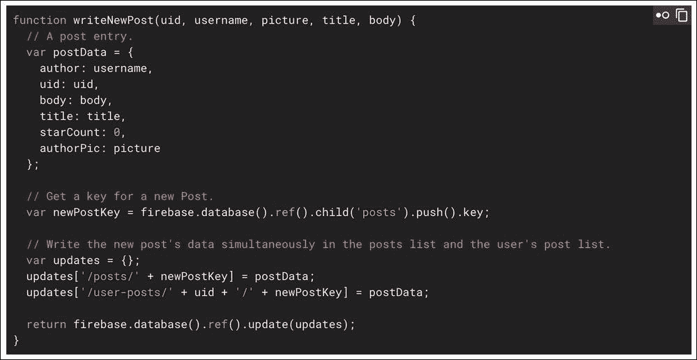
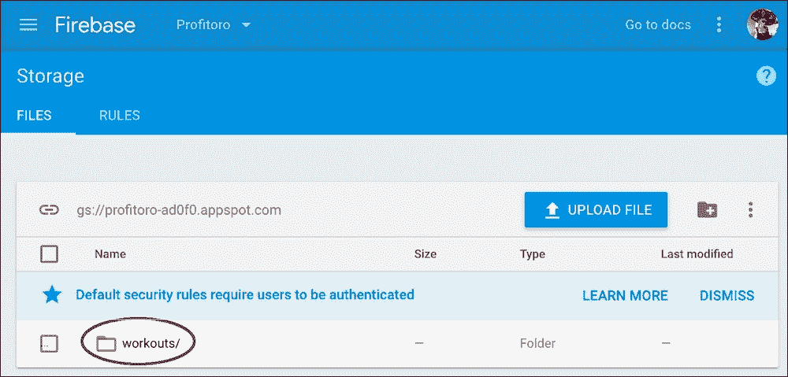
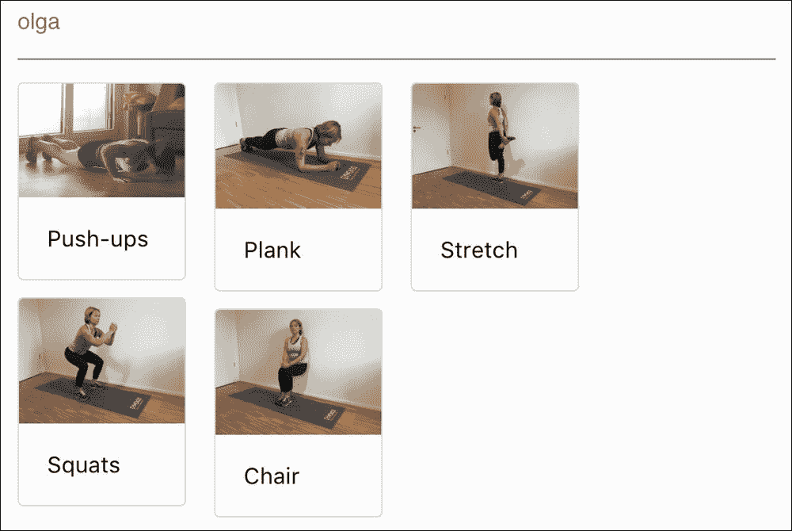
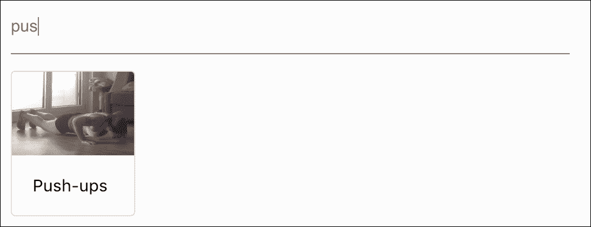
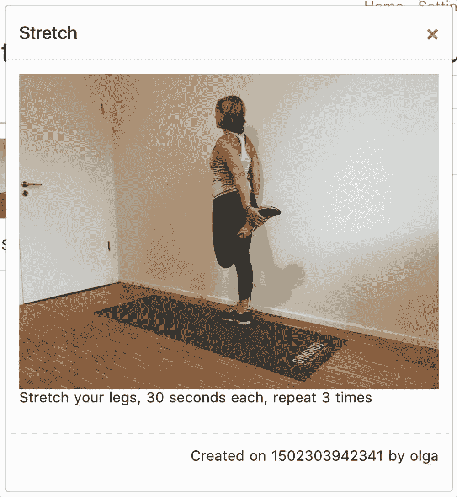
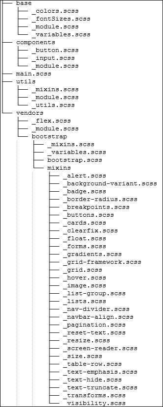
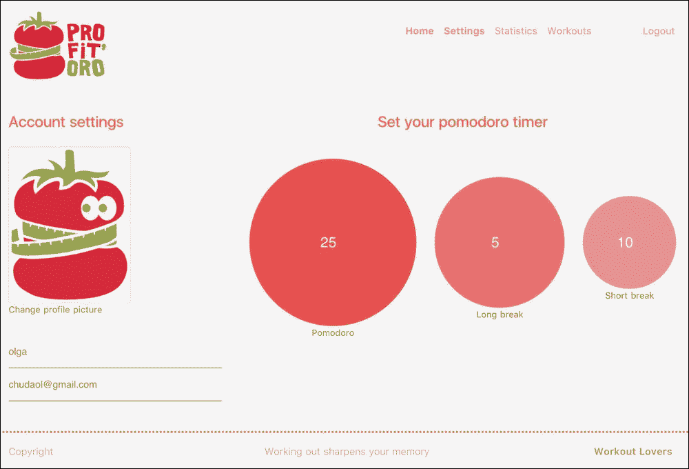
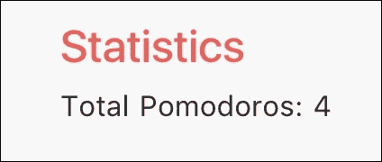

# 第八章：让我们合作 - 使用 Firebase 数据存储和 Vue.js 添加新的锻炼

在上一章中，我们学习了如何使用`vue-router`和`Nuxt.js`为 Vue 应用程序添加一些基本导航。我们已经重新设计了我们的 ProFitOro 应用程序，将其转变为基于 Nuxt 的应用程序。现在我们的应用程序是功能性的，它具有身份验证机制，并且可以导航。但是，它仍然缺少最重要的功能之一 - 锻炼。在本章中，我们将实现锻炼管理页面。你还记得它在第二章 *底层 - 教程解释*中的要求吗？

这个页面应该允许用户查看数据库中现有的锻炼，选择或取消选择它们在番茄钟休息期间显示，对它们进行评分，甚至添加新的锻炼。我们不打算实现所有这些功能。但是，我们将实现足够的功能让你能够继续这个应用程序，并且以巨大的成功完成它的实现！因此，在本章中，我们将做以下工作：

+   为锻炼管理页面定义一个响应式布局，它将包括两个基本部分 - 所有锻炼的可搜索列表以及向列表中添加新锻炼的可能性

+   使用 Firebase 数据库和数据存储机制存储新的锻炼以及锻炼图片

+   使用 Bootstrap 模态框显示每个单独的锻炼

+   使用响应式布局和 fixed-bottom 类使我们的页脚更好看

# 使用 Bootstrap 类创建布局

在我们开始为锻炼页面实现布局之前，让我提醒你模拟看起来是什么样子的：


这是我们最初在模拟中定义的东西

我们将做一些略有不同的事情 - 类似于我们在设置页面所做的事情。让我们创建一个在移动设备上堆叠的两列布局。因此，这个模拟将适用于移动屏幕，但在桌面设备上会显示两列。

让我们在`components/workouts`文件夹内添加两个组件 - `WorkoutsComponent.vue`和`NewWorkoutComponent.vue`。在这些新组件的模板中添加一些虚拟文本，并在`workouts.vue`页面中定义我们的两列布局。你肯定记得，为了在小设备上堆叠列，并在其他设备上使用不同大小的列，我们必须使用`col-*-<number>`表示法，其中`*`表示设备的大小（`sm`表示小，`md`表示中，`lg`表示大，等等），数字表示列的大小，范围从`1`到`12`。由于我们希望我们的布局在小设备上堆叠（这意味着列的大小应为`12`），并且在中大型设备上是两个大小相等的列，我想出了以下布局定义：

```js
// pages/workouts.vue
<template>
  <div class="container">
    <header-component></header-component>
    <div class="row justify-content-center">
      <div class="**col-sm-12 col-md-6 col-lg-6**">
        **<workouts-component></workouts-component>**
      </div>
      <div class="**col-sm-12 col-md-6 col-lg-6**">
        **<new-workout-component></new-workout-component>**
      </div>
    </div>
    <footer-component></footer-component>
  </div>
</template>
```

不要忘记将`WorkoutsComponent.vue`和`NewWorkoutComponent.vue`组件都导入`workouts.vue`页面：

```js
// pages/workouts.vue
<script>
  //...
  **import { NewWorkoutComponent, WorkoutComponent, WorkoutsComponent } from '~/components/workouts'**
  export default {
    components: {
    /...
      **NewWorkoutComponent**,
      **WorkoutsComponent**
    }
  }
</script>
```

现在我们有了一个两列响应式布局：


用于训练管理页面的两列响应式布局

检查`chapter8/1/profitoro`文件夹中的此实现的代码。特别注意`components/workouts`文件夹的内容和`workouts.vue`页面的内容。

# 使页脚漂亮

你不厌倦这个硬编码词“**页脚**”总是在我们的内容下面吗？


丑陋的飞行硬编码页脚总是粘在我们的内容上

让我们对此做些什么！如果你查看我们的模型，那里有三列：

+   版权信息的一列

+   另一个是当天的事实

+   最后是作者信息

你已经知道该怎么做了，对吧？再次强调，我们希望这些列在中大型设备上均匀分布，并在移动设备上堆叠。因此，我们的代码将如下所示：

```js
// components/common/FooterComponent.vue
<template>
  <div class="footer">
    <div class="container row">
      <div class="copyright **col-lg-4 col-md-4 col-sm-12**">Copyright</div>
      <div class="fact **col-lg-4 col-md-4 col-sm-12**">Working out sharpens your memory</div>
      <div class="author **col-lg-4 col-md-4 col-sm-12**"><span class="bold">Workout Lovers</span></div>
    </div>
  </div>
</template>
```

让我们暂时将“当天事实”部分硬编码。好吧，现在我们的页脚看起来好一些了。至少它不再只是“页脚”这个词在那里：


我们的页脚不再只是“页脚”这个词，但它仍然粘在主内容上

然而，它仍然固定在主要内容上，这并不是很好。如果我们的页脚固定在视口底部会很棒。这是一个常见的问题，在互联网上会找到很多关于这个问题的文章和解决方案：[`stackoverflow.com/questions/18915550/fix-footer-to-bottom-of-page`](https://stackoverflow.com/questions/18915550/fix-footer-to-bottom-of-page)。幸运的是，我们正在使用 Bootstrap，它带有一系列用于粘性顶部、固定底部等的实用类。

### 提示

为了使您的页脚在 Bootstrap 中固定，只需向其添加这个类：`fixed-bottom`

一旦将这个类添加到您的页脚中，您将看到它如何固定在视口底部。尝试调整视口大小，将页面底部上下移动，您会发现我们的页脚会跟随在底部。

在`chapter8/2/profitoro`文件夹中检查本节的代码。唯一的变化是`HeaderComponent.vue`组件，它位于`components/common`文件夹中。

# 使用 Firebase 实时数据库存储新的锻炼

在开始本节之前，请检查`chapter8/3/profitoro`文件夹中的代码。`Workouts`和`NewWorkout`组件都填充有标记。

### 提示

不要忘记运行`npm install`和`npm run dev`！

它还没有起作用，但显示了一些东西：


带有一些内容的锻炼管理页面

在本节中，我们将向 Firebase 数据库中的锻炼资源添加锻炼对象。之后，我们最终可以学习如何使用 Firebase 数据存储机制存储图像。

首先，让我们像为统计和配置对象一样添加 Firebase 绑定。打开`action.js`文件，找到`bindFirebaseReferences`方法。在这里，我们应该为`workouts`资源添加绑定。因此，这个方法现在包含三个绑定：

```js
// state/actions.js
**bindFirebaseReferences**: firebaseAction(({state, commit, dispatch}, user) => {
  let db = firebaseApp.database()
  let configRef = db.ref(`/configuration/${user.uid}`)
  let statisticsRef = db.ref(`/statistics/${user.uid}`)
  **let workoutsRef = db.ref('/workouts')**

  dispatch('bindFirebaseReference', {reference: configRef, toBind: 'config'}).then(() => {
    commit('setConfigRef', configRef)
  })
  dispatch('bindFirebaseReference', {reference: statisticsRef, toBind: 'statistics'}).then(() => {
    commit('setStatisticsRef', statisticsRef)
  })
  **dispatch('bindFirebaseReference', {reference: workoutsRef, toBind: 'workouts'}).then(() => {**
 **commit('setWorkoutsRef', workoutsRef)**
 **})**
})
```

一旦应用程序卸载，我们还应该解除它们的绑定：

```js
//state/actions.js
unbindFirebaseReferences: firebaseAction(({unbindFirebaseRef, commit}) => {
    commit('setConfigRef', null)
    commit('setStatisticsRef', null)
    **commit('setWorkoutsRef', null)**
    try {
      unbindFirebaseRef('config')
      unbindFirebaseRef('statistics')
      **unbindFirebaseRef('workouts')**
    } catch (error) {
      return
    }
  })
```

让我们还向我们的状态添加`workoutsRef`和`workouts`属性。最后但并非最不重要的是，不要忘记实现名为`setWorkoutsRef`的 mutation：

```js
// state/mutations.js
setWorkoutsRef (state, value) {
  state.workoutsRef = value
}
```

现在，有了存储在我们状态中的`workoutsRef`，我们可以实现将其更新为新创建的锻炼的操作。之后，我们将能够在`NewWorkout`组件中使用此操作并填充我们的锻炼数据库。

查看 Firebase 关于读取和写入实时数据库的文档：[`firebase.google.com/docs/database/web/read-and-write`](https://firebase.google.com/docs/database/web/read-and-write)。向下滚动，直到找到“*新帖子创建*”示例：



Firebase 数据库文档中的新帖子创建示例

你不觉得这个案例和我们的非常相似吗？用户添加的每个锻炼都有其名称、描述和图片（或者甚至多张图片）。锻炼也属于创建它们的用户。所以，也许我们可以做一些非常类似的事情。如果我们决定实现每个用户删除他们的锻炼的可能性，为`user-workouts`创建一个资源可能会很有用。在复制此代码之前，让我们就锻炼对象数据结构达成一致意见。它应该包含什么？由于它来自`NewWorkout`组件，它将已经带有锻炼的名称、描述和图片 URL。我们应该在`action`内丰富它吗？可能，我们应该添加添加它的用户的名称和 UID，创建日期和评分属性。这应该足够了。所以，我们的锻炼数据结构将如下所示：

```js
{
  **name**: 'string',
  **description**: 'string',
  **pictures**: ['string'],
  **username**: 'string',
  **uid**: 'string',
  **rate**: 'number',
  **date**: 'timestamp'
}
```

`name`、`description`、`username`和`uid`属性都是字符串。`pictures`属性应该是 URL 字符串的数组，`rating`应该是一个数字，让我们以时间戳的形式存储我们的`date`属性。

### 注意

很好，我们正在实现前端和后端部分，所以我们在我们之间达成了数据架构的一致。如果你曾经在一个有前端和后端开发人员的团队中工作过，请不要忘记在任何实施之前达成数据架构的一致！

因此，我们知道描述、名称和图片 URL 应该在`NewWorkout`组件内填充。因此，让我们在我们的`action`方法内填充其他所有内容。最后，它看起来会非常类似于 Firebase 示例：

```js
// store/actions.js
**createNewWorkout** ({commit, state}, workout) {
  if (!workout) {
    return
  }

  **workout.username = state.user.displayName**
 **workout.uid = state.user.uid**
 **workout.date = Date.now()**
 **workout.rate = 0**
  // Get a key for a new Workout.
  let newWorkoutKey = state.workoutsRef.push().key

  // Write the new post's data simultaneously in the posts list and the user's post list.
  let updates = {}
  updates['/**workouts**/' + newWorkoutKey] = workout
  updates['/**user-workouts**/' + state.user.uid + '/' + newWorkoutKey] = workout

  return firebaseApp.database().ref().update(updates)
},
```

再次注意，我们正在引入一个名为`user-workouts`的新资源。我们可以以与统计和配置用户数据相同的方式将此资源绑定到我们的状态。如果我们决定实现删除用户资源，这可能会很方便。

现在，让我们转到我们的`NewWorkout`组件。在这里，我们只需要将一些 Vue 模型绑定到相应的输入和单击事件绑定到**提交**按钮。**应用**按钮上的单击事件应绑定到`createNewWorkout`动作，同时调用相应的数据。暂时不要担心`pictures`，我们将在下一节中处理它们。

此时，我们可以用状态训练对象替换`Workouts`组件中的硬编码训练数组：

```js
//Components/Workouts.vue
// ...
<script>
  import {mapState} from 'vuex'
  export default {
    **computed: {**
 **...mapState(['workouts'])**
 **}**
  }
</script>
//...
```

检查您新创建的训练立即出现在训练部分的方式！

检查`chapter8/4/profitoro`文件夹中此部分的最终代码。注意存储文件（`actions.js`，`mutations.js`）以及`components/workouts`文件夹中的`NewWorkoutComponent`和`WorkoutsComponent`组件。

# 使用 Firebase 数据存储存储图像

Firebase 云存储允许您上传和检索不同的内容（文件、视频、图像等）。同样，Firebase 提供了一种访问和管理数据库的方式，您可以访问和管理存储桶。您可以上传 Blob、Base64 字符串、文件对象等。

首先，您应告诉您的 Firebase 应用程序，您将使用 Google 云存储。因此，您需要向应用程序配置对象添加`storageBucket`属性。在 Google Firebase 控制台上检查应用程序的设置，并将`storageBucket`引用复制到`firebase/index.js`文件中：

```js
// Initialize Firebase
import firebase from 'firebase'
//...
let config = {
  apiKey: 'YOUR_API_KEY',
  databaseURL: 'https://profitoro-ad0f0.firebaseio.com',
  authDomain: 'profitoro-ad0f0.firebaseapp.com',
  **storageBucket: 'gs://profitoro-ad0f0.appspot.com'**
}
//...
```

现在您的 Firebase 应用程序知道要使用哪个存储桶。让我们还打开 Firebase 控制台的数据存储选项卡，并为我们的训练图像添加一个文件夹。让我们称之为…训练：



在 Firebase 数据存储选项卡中创建一个名为“workouts”的文件夹

现在一切准备就绪，可以开始使用我们的云存储桶。

首先，我们必须获取对我们的训练文件夹的引用，以便我们可以修改它。查看有关存储桶引用创建的 Firebase API 文档：[`firebase.google.com/docs/storage/web/create-reference`](https://firebase.google.com/docs/storage/web/create-reference)。在我们的情况下，引用将如下所示：

```js
firebaseApp.storage().ref().child('workouts')
```

我们应该在哪里使用它？在存储训练之前，我们应该存储图片文件，获取它们的云 URL，并将这些 URL 分配给训练的`pictures`属性。因此，这是我们的计划：

+   创建一个上传文件并返回这些文件的下载 URL 的方法

+   在调用`createNewWorkout`动作之前使用这个方法来为 workout 对象的 pictures 属性分配 URL

让我们创建一个上传文件并返回其`downloadURL`的方法。查看 Firebase 文档，了解如何使用其 API 上传文件：[`firebase.google.com/docs/storage/web/upload-files`](https://firebase.google.com/docs/storage/web/upload-files)。看一下**从 Blob 或文件上传**部分。你会看到我们应该在云存储引用上使用"`put`"方法，提供一个文件对象。这将是一个返回快照对象的 promise：

```js
var file = ... // use the Blob or File API
ref.put(file).then(function(snapshot) {
  console.log('Uploaded a blob or file!');
});
```

这个`snapshot`对象是什么？这是存储在云上的文件的表示。它包含了很多信息，但对我们来说最重要的是它的`downloadURL`属性。因此，我们的 promise 看起来会和示例 promise 非常相似，但它将返回`snapshot.downloadURL`。因此，打开`actions.js`文件，创建一个名为`uploadImage`的新方法。这个方法将接收一个文件对象，在我们的`workout`云文件夹引用上创建一个子引用，然后`put`一个文件并返回`downloadURL`。因此，它看起来会像这样：

```js
function _uploadImage (file) {
  let ref = firebaseApp.storage().ref().child('workouts')
  return **ref.child(file.name)**.put(file).then(snapshot => {
    **return snapshot.downloadURL**
  })
}
```

你难道没有看到一个小问题吗？如果两个不同的用户提交了不同的图片，但使用了相同的名称，那么这些图片将会互相覆盖。作为一个小练习，想想避免这个问题的方法。

### 提示

提示：看一下这个 npm 包：

[`www.npmjs.com/package/uuid`](https://www.npmjs.com/package/uuid)

因此，我们有一个上传文件并返回其`downloadURL`的 promise。然而，这还不是我们最终的动作。我们最终的`action`方法应该上传一个*数组*的文件，因为这是我们从多文件输入中得到的 - 一组文件对象。因此，我们最终的 promise 将只返回所有 promise 的结果，它看起来会像下面这样简单：

```js
uploadImages ({state}, files) {
  return **Promise.all**(files.map(**_uploadImage**))
}
```

现在可以在`NewWorkout`组件中调用这个动作，然后再调用`createNewWorkout`动作。

首先，我们需要将`pictures`属性绑定到文件输入元素。显而易见的选择是使用`v-model`指令将属性`pictures`绑定到输入上：

```js
<input **v-model="pictures"** type="file" multiple class="form-control-file" id="imageFile">
```

尽管如此显而易见吗？`v-model`指令确定了*双向数据绑定*，但我们如何设置数据呢？文件输入的数据要么是`FileObject`，要么是`FileList`。我们该如何设置它呢？似乎对这个元素应用双向数据绑定是没有意义的。

### 注意

实际上，你不能将响应式数据绑定到文件输入，但是你可以在 change 事件中设置你的数据：

[`forum.vuejs.org/t/vuejs2-file-input/633/2`](https://forum.vuejs.org/t/vuejs2-file-input/633/2)

因此，我们必须监听`change`事件，并在每次更改时设置我们的数据。让我们将这个事件绑定到`filesChange`方法：

```js
// NewWorkoutComponent.vue
<input @change="**filesChange($event.target.files)**" type="file" multiple class="form-control-file" id="imageFile">
```

现在让我们创建这个方法，只需将`this.pictures`分配给我们接收到的参数。好吧，不是*只是分配*，因为我们接收到的是一个`FileList`对象，它并不完全是一个可以迭代的数组。因此，我们需要将它转换成一个简单的`File`对象数组。

### 提示

我们可以使用 ES6 扩展运算符来做到这一点：

`filesArray = [...fileListObject]`

因此，我们的`filesChange`方法将如下所示：

```js
  // NewWorkoutComponent.vue
  export default {
    methods: {
      //...
      **filesChange (files) {**
 **this.pictures = [...files]**
 **}**
    //...
    }
  }
```

现在我们终于可以更新我们的`onCreateNew`方法了。首先，它应该分发`uploadImages`动作，并在承诺解决后分发`createNewWorkout`动作，将承诺的结果分配给`pictures`数组。现在这个方法将如下所示：

```js
// NewWorkoutComponent.vue
onCreateNew (ev) {
  ev.preventDefault()
  ev.stopPropagation()
  **this.uploadImages(this.pictures).then(picUrls => {**
    this.createNewWorkout({
      name: this.name,
      description: this.description,
      pictures: **picUrls**
    })
    this.reset()
  })
}
```

不要忘记导入`uploadImages`动作。另外，创建一个`reset`方法，将所有数据重置为初始状态。

创建一些带有图片的锻炼，并享受结果！

## 让我们搜索！

所以现在我们可以创建锻炼，并看到它们显示在锻炼列表中。然而，我们有这个不错的搜索输入，但它什么也没做：(. 尽管如此，我们正在使用 Vue.js，所以实现这个搜索真的很容易。我们只需要创建一个`searchTerm`数据属性，并将其绑定到搜索输入，然后通过这个`searchTerm`过滤锻炼数组。因此，我将添加计算属性，让我们称之为`workoutsToDisplay`，这个属性将表示一个通过名称、描述和用户名属性过滤的锻炼属性（我们从 Vuex 存储的状态中导入的属性）。因此，它将给我们提供通过所有这些术语进行搜索的可能性：

```js
// WorkoutsComponent.vue
<script>
  //...
  export default {
    //...
    computed: {
      ...mapState(['workouts']),
      **workoutsToDisplay () {**
 **return this.workouts.filter(workout => {**
 **let name = workout.name.toLowerCase()**
 **let description = workout.description.toLowerCase()**
 **let username = workout.username.toLowerCase()**
 **let term = this.searchTerm.toLowerCase()**
 **return name.indexOf(term) >= 0 || description.indexOf(term) >= 0 || username.indexOf(term) >= 0**
 **})**
 **}**
    }
  //...
  }
</script>
```

不要忘记将`searchTerm`属性添加到组件的数据中，并将其绑定到搜索输入元素：

```js
<template>
  <div>
    <div class="form-group">
      <input **v-model="searchTerm"** class="input" type="search" placeholder="Search for workouts">
    </div>
  </div>
</template>
<script>
  //...
  export default {
    data () {
      return {
        name: '',
        username: '',
        datecreated: '',
        description: '',
        pictures: [],
        rate: 0,
        **searchTerm**: ''
      }
    }
  }
</script>
```

当然，我们现在应该遍历`workoutsToDisplay`数组来显示锻炼卡片，而不是遍历锻炼数组。因此，只需稍微编辑卡片`div`的`v-for`指令：

```js
v-for="workout in **workoutsToDisplay**"
```

打开页面并尝试搜索！如果我按用户名搜索，只会显示由该用户创建的锻炼：



有道理，因为我创建了所有现有的锻炼直到现在

如果我按锻炼的名称搜索，比如俯卧撑，只会出现这个锻炼：



按锻炼名称搜索

我们快要完成了！现在我们唯一要做的就是在番茄钟的休息时段显示从锻炼列表中随机选择的锻炼，而不是硬编码的数据。尝试在`pomodoro.vue`页面中自己做到这一点。

现在您可以创建新的锻炼，并且它们将立即出现在锻炼部分。它们还会在我们的番茄钟休息期间出现在主页上。

干得好！检查`chapter8/5/profitoro`文件夹中此部分的代码。特别注意`store/actions.js`文件中的新操作以及`components/workouts`文件夹中的`Workouts`和`NewWorkout`组件。查看随机锻炼是如何被选择并显示在`pomodoro.vue`页面中的。

# 使用 Bootstrap 模态框显示每个锻炼

现在我们可以在页面上看到所有现有的锻炼，这很棒。然而，我们的用户真的很想详细了解每个锻炼-查看锻炼的描述，对其进行评分，查看谁创建了它们以及何时创建的等等。在小的“卡片”元素中放置所有这些信息是不可想象的，因此我们需要一种放大每个元素以便能够查看其详细信息的方法。Bootstrap 模态框是提供此功能的绝佳工具。查看 Bootstrap 文档有关模态 API 的信息：[`v4-alpha.getbootstrap.com/components/modal/`](https://v4-alpha.getbootstrap.com/components/modal/)。

### 注意

请注意，Bootstrap 4 在撰写本文时处于 alpha 阶段，这就是为什么在某个时候这个链接可能不再有效，所以只需在官方 Bootstrap 网站上搜索相关信息即可。

基本上，我们需要一个触发模态的元素和模态标记本身。在我们的情况下，每个小锻炼卡都应该被用作模态触发器；`WorkoutComponent`将是我们的模态组件。因此，只需在 Workouts 组件内的`card`元素中添加`data-toggle`和`data-target`属性：

```js
// WorkoutsComponent.vue
<div class="card-columns">
  <div data-toggle="modal" data-target="#workoutModal" v-for="workout in workouts" class="card">
    
    <div class="card-block">
      <p class="card-text">{{ workout.name }}</p>
    </div>
  </div>
</div>
```

现在让我们来处理`WorkoutComponent`组件。假设它将接收以下属性：

+   名称

+   描述

+   用户名

+   创建日期

+   费率

+   图片

因此，我们可以为我们的模态构建一个非常简单的标记，类似于这样：

```js
<template>
  <div class="modal fade" id="**workoutModal**" tabindex="-1" role="dialog" aria-hidden="true">
    <div class="modal-dialog" role="document">
      <div class="modal-content">
        <div class="modal-header">
          <h5 class="modal-title">**{{ name }}**</h5>
          <button type="button" class="close" data-dismiss="modal" aria-label="Close">
            <span aria-hidden="true">&times;</span>
          </button>
        </div>
        <div class="modal-body">
          <div class="text-center">
            
          </div>
          <p>**{{ description }}**</p>
        </div>
        <div class="modal-footer">
          <p>Created on **{{ datecreated }}** by **{{ username }}**</p>
        </div>
      </div>
    </div>
  </div>
</template>
```

请记住，这个模态需要具有与其从切换元素进行定位的完全相同的 ID 属性。

不要忘记在`props`属性下指定所需的属性：

```js
// WorkoutComponent.vue
<script>
  export default {
    **props: ['name', 'description', 'username', 'datecreated', 'rate', 'pictures']**
  }
</script>
```

现在这个组件可以被导入到 Workouts 组件中并在那里使用：

```js
// WorkoutsComponent.vue
<template>
  <div>
    <...>
    <div class="card-columns">
      <...>
    </div>
    **<workout-component**
 **:name="name"**
 **:description="description"**
 **:username="username"**
 **:datecreated="datecreated"**
 **:pictures="pictures"**
 **:rate="rate">**
 **</workout-component>**
  </div>
</template>
```

如果你现在点击一些小卡片，空的模态将会打开：


模态有效！但是它是空的

我们肯定还应该做一些事情，以便所选元素的数据传播到组件的数据中。让我们添加一个方法来执行这项工作，并将其绑定到`card`元素的`click`事件上：

```js
// WorkoutsComponent.vue
<div data-toggle="modal" data-target="#workoutModal" v-for="workout in workouts" class="card" **@click="onChosenWorkout(workout)"**>
```

该方法将只是将锻炼的数据复制到相应组件的数据中：

```js
// WorkoutsComponent.vue – **methods** section
**onChosenWorkout** (workout) {
  this.name = workout.name
  this.description = workout.description
  this.username = workout.username
  this.datecreated = workout.date
  this.rate = workout.rate
  this.pictures = workout.pictures
}
```

现在看起来好多了！



数据绑定确实有效！

看起来不错，所有数据都在这里，但还不完美。想想我们如何能改进它。

## 练习

使模态底部显示的日期可读。以这样的方式做，使底部看起来像这样：


锻炼模态的底部，带有可读的数据

尝试使用现有工具，而不是重新发明轮子。

### 提示

想想 moment.js 库：

[`momentjs.com/`](https://momentjs.com/)

自己检查一下，直到这一刻的最终代码在`chapter8/6/profitoro`文件夹中。注意`components/workout`文件夹中的`Workouts`和`Workout`组件。

# 是时候应用一些样式了

我们的应用程序现在已经完全功能，可以立即使用。当然，它还不完美。它缺乏验证和一些功能，一些要求尚未实现，最重要的是...它缺乏美感！它全是灰色，没有风格...我们是人类，我们喜欢美丽的东西，不是吗？每个人都以自己的方式实现风格。我强烈建议，如果你想使用这个应用程序，请找到自己的风格和主题，并实现它并与我分享。我会很乐意看到它。

至于我，因为我不是设计师，我请我的好朋友 Vanessa（[`www.behance.net/MeegsyWeegsy`](https://www.behance.net/MeegsyWeegsy)）为 ProFitOro 应用程序设计一个漂亮的设计。她做得很好！因为我忙着写这本书，所以我没有时间实现 Vanessa 的设计，因此我请我的好朋友 Filipe（[`github.com/fil090302`](https://github.com/fil090302)）帮助我。Filipe 也做得很好！一切看起来都和 Vanessa 实现的一样。我们使用了`scss`，所以你一定很熟悉，因为我们在这个应用程序中已经在使用它作为预处理器。

您可以重用现有的样式来覆盖一些变量，以创建自己的主题。请在`chapter8/7/profitoro`文件夹中检查最终代码。所有样式都位于`assets/styles`目录中。它具有以下结构：



目录结构

至于最终的外观，就是这样的。

这是带有 Pomodoro 计时器的主页面：


包含 Pomodoro 计时器的主页面

这是设置页面的样子：



设置页面的外观和感觉

最后，这就是 Workouts 页面的样子：


Workouts 页面的外观和感觉

你仍然需要实现统计页面-现在，它只显示完成的 Pomodoro 的总数：



统计页面尚未完全完成，只显示完成的 Pomodoros 的总数

还有一些工作要做，但你不觉得我们迄今为止做得很好吗？我们不仅拥有一个完全可配置的番茄钟计时器，还可以在工作日进行小型锻炼。这是多么棒啊！

# 总结

在本章中，我们终于实现了锻炼管理页面。现在我们可以看到数据库中存储的所有锻炼，并创建我们自己的锻炼。我们学会了如何使用 Google Firebase 数据存储系统和 API 来存储静态文件，并且能够将新创建的锻炼存储在 Firebase 实时数据库中。我们还学会了如何使用 Bootstrap 模态框，并将其用于在漂亮的模态弹出窗口中显示每个锻炼。

在下一章中，我们将进行每个软件实施过程中最重要的工作 - 我们将测试迄今为止所做的工作。我们将使用 Jest ([`facebook.github.io/jest/`](https://facebook.github.io/jest/)) 来测试我们的应用程序。之后，我们将最终部署我们的应用程序并定义未来的工作。你准备好测试你的工作了吗？那就翻开下一页吧！
