# 第九章：测试测试和测试

在上一章中，我们实现了锻炼管理页面。我们学习了如何使用 Google Firebase 数据存储机制来存储静态文件，并且再次使用了实时数据库来存储锻炼对象。我们使用 Bootstrap 为锻炼管理页面构建了一个响应式布局，并学习了如何使用 Bootstrap 的模态组件在一个漂亮的弹出窗口中显示每个单独的锻炼。现在我们有一个完全负责的应用程序。多亏了 Bootstrap，我们不需要实现任何特殊的东西来获得一个漂亮的移动表示。在移动屏幕上添加新的锻炼的样子如下：

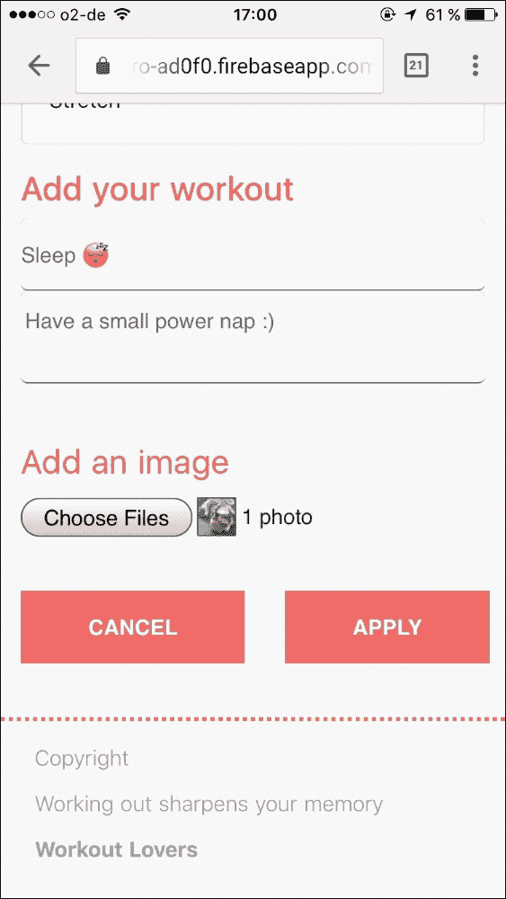

在移动屏幕上添加新的锻炼

这是我们的模态在移动设备上的样子：

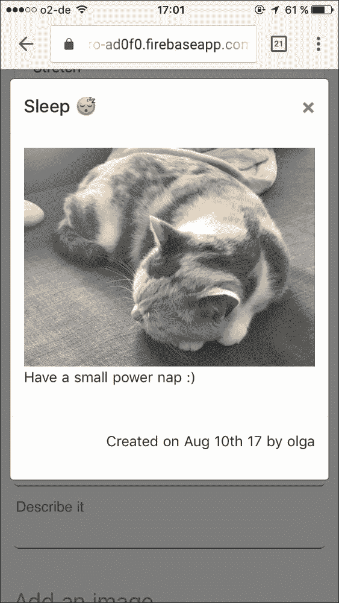

在移动设备上显示的锻炼模态

现在是测试我们的应用程序的时候了。我们将使用 Jest（[`facebook.github.io/jest/`](https://facebook.github.io/jest/)）来构建单元测试和运行快照测试。在本章中，我们将做以下事情：

+   学习如何配置我们的 Vue.js 应用程序与 Jest 一起工作

+   使用 Jest 断言测试 Vuex 存储

+   学习如何使用`jest.mock`和`jest.fn`方法模拟复杂对象

+   学习如何为 Vue 组件实现快照测试

# 为什么测试很重要？

我们的 ProFitOro 应用程序运行得很好，是吗？我们在浏览器中打开了它很多次，检查了所有实现的功能，所以它只是工作，对吧？是的，这是真的。现在去你的设置页面，尝试将计时器的值更改为一些奇怪的值。尝试使用负值，尝试使用巨大的值，尝试使用字符串，尝试使用空值……你认为这可以称为良好的用户体验吗？

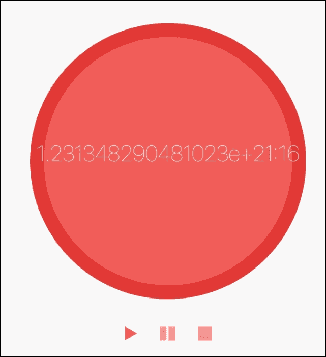

你不会想要在这么多分钟内工作，对吧？

你尝试过创建一个奇怪的锻炼吗？你尝试过在创建时输入一个巨大的锻炼名称并看看它是如何显示的吗？有成千上万种边缘情况，所有这些都应该仔细测试。我们希望我们的应用程序是可维护的、可靠的，并且提供令人惊叹的用户体验。

# 什么是 Jest？

你知道 Facebook 的人永远不会厌倦创造新工具。React、redux、react-native 以及所有这些响应式家族对他们来说还不够，他们创建了一个真正强大、易于使用的测试框架，叫做 Jest：[`facebook.github.io/jest/`](https://facebook.github.io/jest/)。Jest 非常酷，因为它足够自包含，让你不必分心于繁琐的配置或寻找异步测试插件、模拟库或伪计时器来与你喜欢的框架一起使用。Jest 是一个多合一的工具，虽然非常轻量级。此外，在每次运行时，它只运行自上次测试运行以来发生变化的测试，这非常优雅和快速！

最初为测试 React 应用程序而创建，Jest 被证明适用于其他用途，包括 Vue.js 应用程序。

查看罗曼·库巴在 2017 年 6 月波兰 Vue.js 大会上的精彩演讲([`youtu.be/pqp0PsPBO_0`](https://youtu.be/pqp0PsPBO_0))，他在其中简要解释了如何使用 Jest 测试 Vue 组件。

我们的应用不仅仅是一个 Vue 应用程序，它是一个使用了 Vuex 存储和 Firebase 的 Nuxt 应用程序。所有这些依赖项使得测试变得有点困难，因为我们必须模拟所有这些东西，还有 Nuxt 应用程序本身的特殊性。然而，这是可能的，一切设置好之后，编写测试的乐趣是巨大的！让我们开始吧！

# 开始使用 Jest

让我们从测试一个小的求和函数开始，检查它是否正确地对两个数字求和。

首先当然是安装 Jest：

```js
**npm install jest**

```

创建一个名为`test`的目录，并添加一个名为`sum.js`的文件，内容如下：

```js
// test/sum.js
export default function sum (a, b) {
  return a + b
}
```

现在为这个函数添加一个测试规范文件：

```js
// sum.spec.js
import sum from './sum'

describe('sum', () => {
  **it('create sum of 2 numbers', () => {**
 **expect(sum(15, 8)).toBe(23)**
 **})**
})
```

我们需要一个命令来运行测试。在`package.json`文件中添加一个`"test"`条目，它将调用一个`jest`命令：

```js
// package.json
"scripts": {
  //...
  **"test": "jest"**
}
```

现在如果你运行`npm test`，你会看到一些错误：


使用 Jest 运行测试时的测试输出中的错误

这是因为我们的 Jest 不知道我们在使用*ES6*！所以，我们需要添加`babel-jest`依赖项：

```js
**npm install babel-jest --save-dev**

```

安装完*babel-jest*之后，我们需要添加一个`.babelrc`文件，内容如下：

```js
// .babelrc
{
  "presets": ["es2015"]
}
```

你是否对 IDE 关于`describe`、`it`和其他未被识别的全局变量的警告感到烦恼？只需在你的`.eslintrc.js`文件中添加一个`jest: true`条目：

```js
// .eslintrc.js
module.exports = {
  root: true,
  parser: 'babel-eslint',
  env: {
    browser: true,
    node: true,
    **jest: true**
  },
  extends: 'standard',
  // required to lint *.vue files
  plugins: [
    'html'
  ],
  // add your custom rules here
  rules: {},
  globals: {}
}
```

现在如果你运行`npm test`，测试通过了！

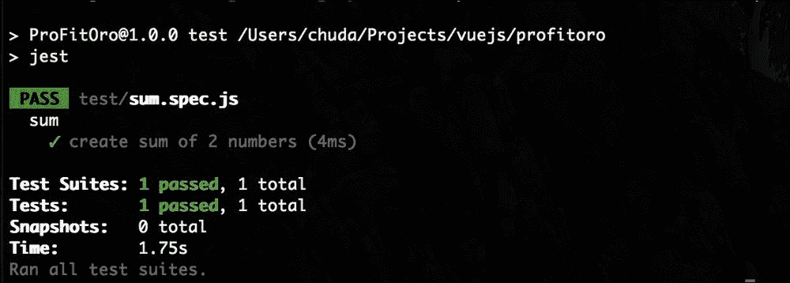

恭喜！你刚刚设置并运行了你的第一个 Jest 测试！

## 覆盖率

单元测试有助于确保它们检查的代码片段（单元）对于任何可能和不可能的输入都能正常工作。每个编写的单元测试都覆盖了相应的代码片段，就像一条毯子一样，保护这段代码免受未来的故障，并使我们对代码的功能和可维护性感到舒适。代码覆盖有不同的类型：语句覆盖、行覆盖、分支覆盖等等。代码覆盖越多，代码就越稳定，我们就越舒适。这就是为什么在编写单元测试时，每次运行时检查代码覆盖率非常重要。使用 Jest 很容易检查代码覆盖率。你不需要安装任何外部工具或编写额外的配置。只需执行带有覆盖率标志的测试命令：

```js
npm test -- --coverage
```

你会神奇地看到这个美丽的覆盖率输出：

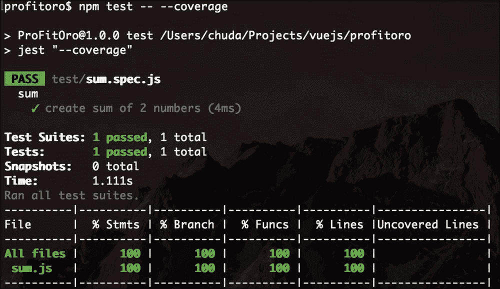

使用覆盖率运行 Jest 测试

像魔术一样，对吧？

在`chapter9/1/profitoro`目录中找到代码。别忘了在其上运行`npm install`。

# 测试实用函数

现在让我们测试我们的代码！让我们从 utils 开始。创建一个名为`utils.spec.js`的文件，并导入`leftPad`函数：

```js
import { leftPad } from '~/utils/utils'
```

再看看这个函数：

```js
// utils/utils.js
export const leftPad = value => {
  if (('' + value).length > 1) {
    return value
  }

  return '0' + value
}
```

如果输入字符串的长度大于`1`，则此函数应返回输入字符串。如果字符串的长度为`1`，则应返回带有前导`0`的字符串。

测试起来似乎很容易，对吧？我们将编写两个测试用例：

```js
// test/utils.spec.js
describe('utils', () => {
  describe('leftPad', () => {
    it('should return the string itself if its length is more than 1', () => {
      **expect(leftPad('01')).toEqual('01')**
    })
    it('should add a 0 from the left if the entry string is of the length of 1', () => {
      **expect(leftPad('0')).toEqual('00')**
    })
  })
})
```

啊...如果你运行这个测试，你会得到一个错误：

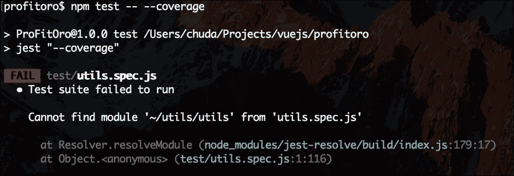

当然，可怜的 Jest，并不知道我们在 Nuxt 应用程序中使用的别名。对于它来说，`~`符号什么都不等于！幸运的是，这很容易解决。只需在`package.json`文件中添加`jest`条目，并在其中添加一个名称映射条目：

```js
// package.json
"jest": {
  "moduleNameMapper": {
    **"^~(.*)$": "<rootDir>/$1"**
  }
}
```

现在 Jest 将知道以`~`开头的所有内容都应映射到根目录。如果你现在运行`npm test -- --coverage`，你会看到测试通过了！

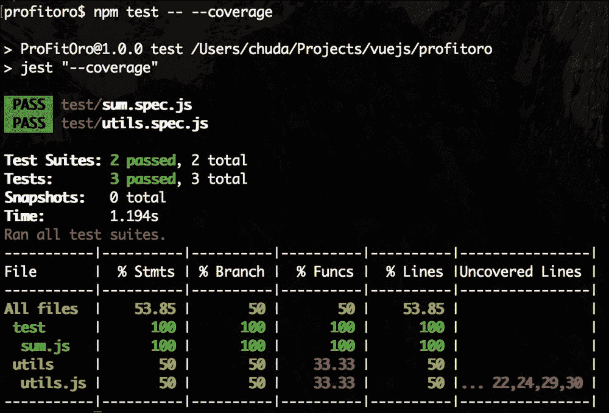

映射根目录别名后，测试可以正常运行

然而，代码覆盖率确实很低。这是因为我们的工具中还有另一个要测试的函数。检查`utils.js`文件。你能看到`numberOfSecondsFromNow`方法吗？它也需要一些测试覆盖率。它计算了从给定输入时间到现在经过的时间。我们应该如何处理这个`Date.now`？我们无法预测测试结果，因为我们无法保证测试运行时的*现在*时刻与我们检查时的时刻相同。每一毫秒都很重要。简单！我们应该模拟`Date.now`对象！

## 使用 Jest 进行模拟

事实证明，即使是看似不可能的事情（停止时间）在 Jest 中也是可能的。使用`jest.fn()`函数很容易模拟`Date.now`对象。

查看关于使用 Jest 进行模拟的文档：

[`facebook.github.io/jest/docs/en/snapshot-testing.html#tests-should-be-deterministic`](http://facebook.github.io/jest/docs/en/snapshot-testing.html#tests-should-be-deterministic)

我们可以通过调用`Date.now = jest.fn(() => 2000)`来模拟`Date.now`函数。

现在我们可以轻松测试`'numberOfSecondsFromNow'`函数：

```js
// test/utils.spec.js
import { leftPad, numberOfSecondsFromNow } from '~/utils/utils'
//...
describe(**'numberOfSecondsFromNow'**, () => {
  it('should return the exact number of seconds from now', () => {
    **Date.now = jest.fn(() => 2000)**
    expect(numberOfSecondsFromNow(1000)).toEqual(1)
  })
})
```

现在覆盖率更好了，但如果我们能覆盖我们有趣的`beep`函数，那就更完美了。我们应该在其中测试什么？让我们尝试测试一下，当调用`beep`函数时，`Audio.play`方法被调用。模拟函数有一个特殊的属性叫做**mock**，其中包含了关于这个函数的所有信息——已经对它执行的调用次数，传递给它的信息等等。因此，我们可以像这样模拟`Audio.prototype.play`方法：

```js
let mockAudioPlay = jest.fn()
Audio.prototype.play = mockAudioPlay
```

在调用 beep 方法后，我们可以像这样检查模拟上执行的调用次数：

```js
expect(mockAudioPlay.mock.calls.length).toEqual(1)
```

或者我们可以断言模拟已经被调用了，就像这样：

```js
expect(mockAudioPlay).toHaveBeenCalled()
```

整个测试可能看起来像下面这样：

```js
describe('beep', () => {
  it('should call the Audio.play functuon', () => {
    let mockAudioPlay = jest.fn()

    Audio.prototype.play = mockAudioPlay

    beep()
    expect(mockAudioPlay.mock.calls.length).toEqual(1)
    expect(mockAudioPlay).toHaveBeenCalled()
  })
})
```

为了避免由于模拟原生函数而产生的副作用，我们可能希望在测试后重置我们的模拟：

```js
it('should call the Audio.play functuon', () => {
  // ...
  expect(mockAudioPlay).toHaveBeenCalled()
  **mockAudioPlay.mockReset()**
})
```

在这方面查看 Jest 文档：[`facebook.github.io/jest/docs/en/mock-function-api.html#mockfnmockreset`](https://facebook.github.io/jest/docs/en/mock-function-api.html#mockfnmockreset)。

或者，您可以配置 Jest 设置，以便在每次测试后自动重置模拟。为此，在`package.json`文件中的 Jest`config`对象中添加`clearMocks`属性：

```js
//package.json
"jest": {
  **"clearMocks": true,**
  "moduleNameMapper": {
    "^~(.*)$": "<rootDir>/$1"
  }
},
```

耶！测试通过了。检查一下覆盖率。看起来相当不错；然而，分支覆盖率仍然不完美：

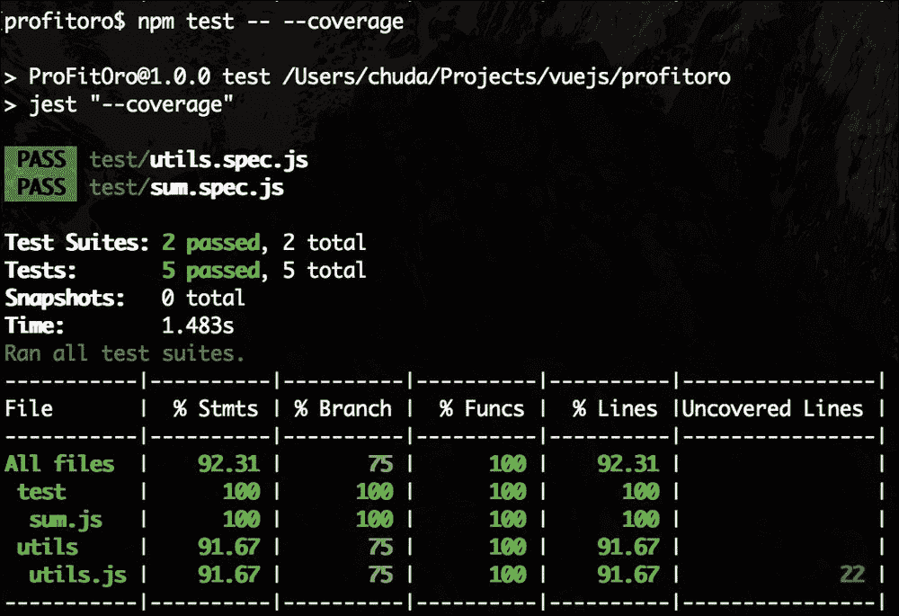

utils.js 文件的分支覆盖率仅为 75%

为什么会发生这种情况？首先，检查`未覆盖的行`列。它显示了测试未覆盖的行。这是`numberOfSecondsFromNow`方法的第`22`行：

```js
export const numberOfSecondsFromNow = startTime => {
  const SECOND = 1000
  if (!startTime) {
    **return 0**
  }
  return Math.floor((Date.now() - startTime) / SECOND)
}
```

作为替代方案，您可以检查项目目录中的`coverage`文件夹，并在浏览器中打开`lcov-report/index.html`文件，以更直观地了解发生了什么：

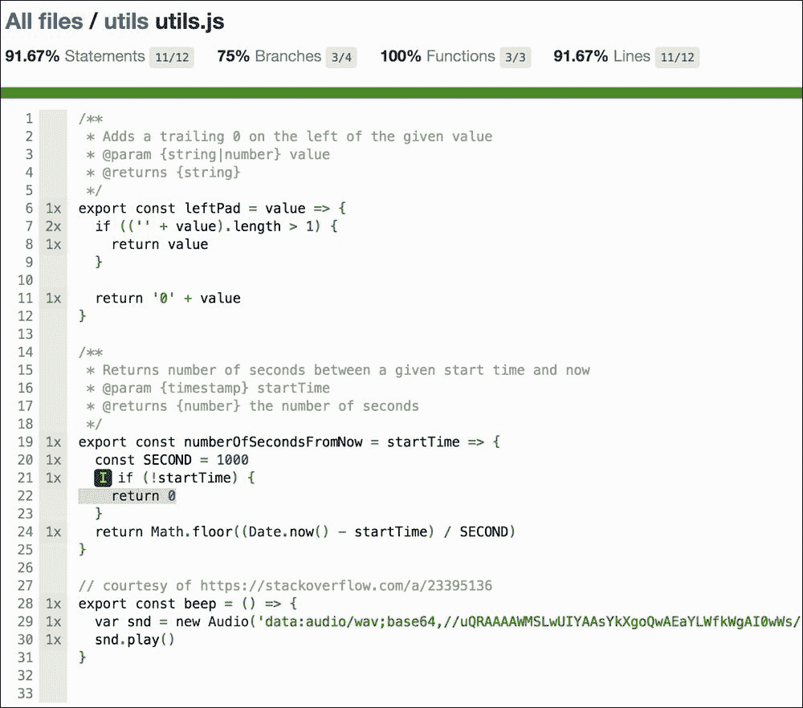

代码覆盖率 HTML 以一种美观的方式显示了覆盖和未覆盖的行

在这里，您可以清楚地看到第`22`行标记为红色，这意味着它没有被测试覆盖。好吧，让我们来覆盖它！只需添加一个新的测试，覆盖`startTime`属性未传递给此方法的情况，并确保它返回`0`：

```js
// test/utils.js
describe(**'numberOfSecondsFromNow'**, () => {
 **it('should return 0 if no parameter is passed', () => {**
 **expect(numberOfSecondsFromNow()).toEqual(0)**
 **})**
  it('should return the exact number of seconds from now', () => {
    Date.now = jest.fn(() => 2000)
    expect(numberOfSecondsFromNow(1000)).toEqual(1)
  })
})
```

现在带着覆盖标志运行测试。天啊！这不是很棒吗？

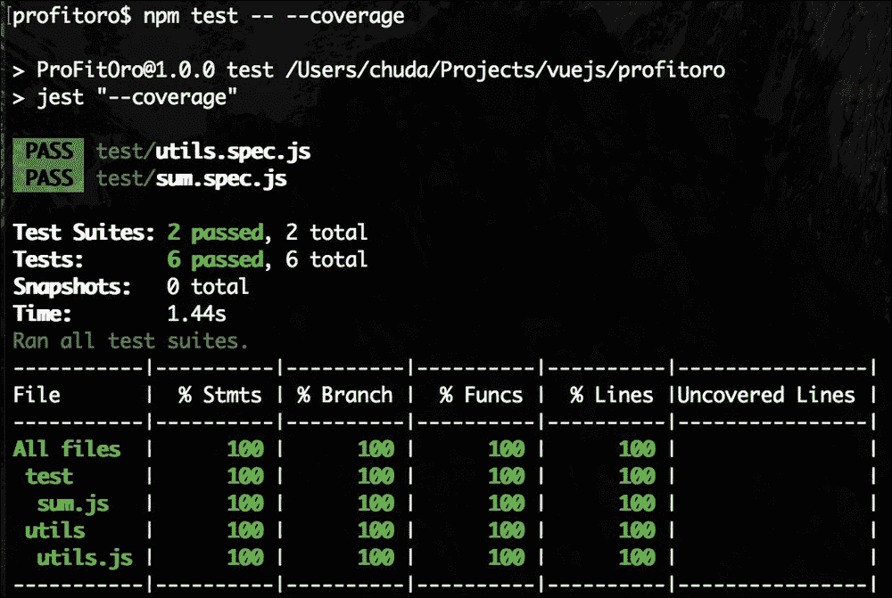

100%的代码覆盖率，是不是很棒？

本节的最终代码可以在`chapter9/2/profitoro`文件夹中找到。

# 使用 Jest 测试 Vuex 存储

现在让我们尝试测试我们的 Vuex 存储。我们要测试的存储最关键的部分是我们的操作和突变，因为它们实际上可以改变存储的状态。让我们从突变开始。在`test`文件夹中创建`mutations.spec.js`文件并导入`mutations.js`：

```js
// test/mutations.spec.js
import mutations from '~/store/mutations'
```

我们已经准备好为我们的突变函数编写单元测试。

## 测试突变

突变是非常简单的函数，它接收一个状态对象，并将其属性设置为给定值。因此，测试突变非常简单——我们只需模拟状态对象，并将其传递给我们想要测试的突变，以及我们想要设置的值。最后，我们必须检查该值是否已实际设置。例如，让我们测试`setWorkingPomodoro`突变。这是我们的突变的样子：

```js
// store/mutations.js
setWorkingPomodoro (state, workingPomodoro) {
  state.config.workingPomodoro = workingPomodoro
}
```

在我们的测试中，我们需要为状态对象创建一个模拟。它不需要代表完整的状态；它至少需要模拟状态的`config`对象的`workingPomodoro`属性。然后我们将调用突变，传递给它我们的模拟状态和`workingPomodoro`的新值，并断言这个值已经应用到我们的模拟中。因此，这些是步骤：

1.  为状态对象创建一个模拟：`let state = {config: {workingPomodoro: 1}}`

1.  使用新值调用突变：`mutations.setWorkingPomodoro(state, 30)`

1.  断言该值已设置为模拟对象：`expect(state.config).toEqual({workingPomodoro: 30})`

这个测试的完整代码看起来如下：

```js
// test/mutations.spec.js
import mutations from '~/store/mutations'

describe('mutations', () => {
  describe('setWorkingPomodoro', () => {
    it('should set the workingPomodoro property to 30', () => {
      let state = {config: {workingPomodoro: 1}}
      mutations.setWorkingPomodoro(state, 30)
      expect(state.config).toEqual({workingPomodoro: 30})
    })
  })
})
```

相同的机制应该被应用于测试其余的变化。继续并完成它们吧！

## 使用 Jest 进行异步测试——测试动作

让我们继续测试更复杂的东西——我们的动作！我们的动作大多是异步的，并且它们在内部使用复杂的 Firebase 应用程序对象。这使得它们非常具有挑战性，但我们确实喜欢挑战，不是吗？让我们来看看`actions.js`文件中的第一个动作。它是`uploadImages`动作，看起来是这样的：

```js
uploadImages ({state}, files) {
  return Promise.all(files.map(this._uploadImage))
}
```

我们可能在这里测试什么呢？例如，我们可以测试`_uploadImage`函数被调用的次数与传递的图像数组的大小完全相同。为此，我们必须模拟`_uploadImage`方法。为了做到这一点，让我们在`actions`中也导出它：

```js
// store/actions.js
function _uploadImage (file) {
  //...
}

export default {
  **_uploadImage**,
  uploadImages ({state}, files) {
    return Promise.all(files.map(**this._uploadImage**))
  }
  //...
}
```

现在我们可以模拟这个方法并检查`mock`被调用的次数。模拟本身非常简单；我们只需要将`actions._uploadImage`分配给`jest.fn()`：

```js
// test/actions.spec.js
it('should call method _uploadImage 3 times', () => {
  **actions._uploadImage = jest.fn()**
})
```

从现在开始，我们的`actions._uploadImage`具有一个特殊的魔法属性叫做`mock`，我们已经谈论过了。这个对象让我们有机会访问对`_uploadImage`方法的调用次数：

```js
actions._uploadImage.mock.calls
```

因此，要断言调用次数为三，我们只需运行以下断言：

```js
expect(**actions._uploadImage.mock.calls.length**).toEqual(**3**)
```

### 提示

在这里查看有关在 Jest 中模拟函数的完整文档：

[`facebook.github.io/jest/docs/mock-functions.html#content`](https://facebook.github.io/jest/docs/mock-functions.html#content)

很好，但我们应该在哪里调用这个期望呢？`uploadImages`函数是异步的；它返回一个 promise。不知何故，我们可以窥视未来并监听 promise 的解析，然后在那里调用我们的断言。我们应该定义一些*回调*，并在 promise 解析后调用它们吗？不，不需要。只需调用您的函数，并在`then`回调中运行断言。因此，我们的测试将如下所示：

```js
// test/actions.spec.js
import actions from '~/store/actions'

describe('actions', () => {
  describe('uploadImages', () => {
    it('should call method _uploadImage 3 times', () => {
      actions._uploadImage = jest.fn()
      actions.uploadImages({}, [1, 2, 3])**.then(() => {**
 **expect(actions._uploadImage.mock.calls.length).toEqual(3)**
 **})**
    })
  })
})
```

它就是这样工作的！

现在让我们创建一个更复杂的模拟——针对我们的`firebaseApp`。我们如何决定模拟什么以及如何模拟？只需查看代码并检查正在执行的操作。因此，让我们例如检查`createNewWorkout`方法：

```js
// store/actions.js
createNewWorkout ({commit, state}, workout) {
  //...
  **let newWorkoutKey = state.workoutsRef.push().key**
  let updates = {}
  updates['/workouts/' + newWorkoutKey] = workout
  updates['/user-workouts/' + state.user.uid + '/' + newWorkoutKey] = workout

  **return firebaseApp.database().ref().update(updates)**
}
```

这里发生了什么？状态的`workoutsReference`生成了一些新的键，然后创建了名为`updates`的对象。该对象包含两个条目 - 分别为保存了 workout 对象的 Firebase 数据库资源。

然后调用 Firebase 的数据库`update`方法与此对象。因此，我们必须模拟数据库的`update`方法，以便我们可以检查调用它时传入的数据。我们还必须以某种方式将此模拟注入到大型 Firebase 应用程序模拟中。创建一个文件夹来保存我们的模拟文件，并将其命名为`__mocks__`。在此目录中添加两个文件 - `firebaseMocks.js`和`firebaseAppMock.js`。在`firebaseMocks`文件中为`update`方法创建一个空函数：

```js
// __mocks__/firebaseMocks.js
export default {
  **update: () => {}**
}
```

创建一个`firebaseApp`对象的模拟，它将在其`database`方法内调用模拟的`update`函数：

```js
// __mocks__/firebaseAppMock.js
import firebaseMocks from './firebaseMocks'
export default {
  **database**: () => {
    return {
      ref: function () {
        return {
          **update: firebaseMocks.update**
        }
      }
    }
  }
}
```

为了测试`createNewWorkout`方法，我们将使用`jest.mock`函数将 Firebase 对象绑定到其模拟。查看有关`jest.mock`函数的详细文档：

[`facebook.github.io/jest/docs/en/jest-object.html#jestmockmodulename-factory-options`](http://facebook.github.io/jest/docs/en/jest-object.html#jestmockmodulename-factory-options)。

在导入`actions.js`模块之前，我们需要绑定我们的模拟。这样，它将已经使用模拟对象。因此，我们的导入部分将如下所示：

```js
// test/actions.spec.js
import mockFirebaseApp from '~/__mocks__/firebaseAppMock'
**jest.mock('~/firebase', () => mockFirebaseApp)**

**import actions from '~/store/actions'**

```

让我们看看`workout`对象的情况，以便了解如何模拟和进行确定性测试。我们有以下这些行：

```js
// actions.js
workout.username = state.user.displayName
workout.uid = state.user.uid
```

因此，我们状态对象的模拟必须包含具有预定义的`displayName`和`uid`的用户对象。让我们创建它：

```js
let state = {
  user: {
    displayName: 'Olga',
    uid: 1
  }}
```

接下来会发生什么？

```js
workout.date = Date.now()
workout.rate = 0
```

再次，我们需要模拟`Date.now`对象。让我们像在`utils`测试规范中所做的那样做同样的事情：

```js
Date.now = **jest.fn(() => 2000)**

```

让我们进一步阅读我们的方法。它包含一行代码，根据`workoutsRef`状态对象生成`newWorkoutKey`变量：

```js
let newWorkoutKey = state.workoutsRef.push().key
```

让我们在我们的状态模拟中也模拟`workoutsRef`：

```js
let state = {
  user: {
    displayName: 'Olga',
    uid: 1
  },
  **workoutsRef: {**
 **push: function () {**
 **return {**
 **key: 59**
 **}**
 **}**
  }}
```

现在我们知道，当我们调用`addNewWorkout`方法时，最终预期会调用 Firebase 数据库的`update`方法，该方法将包含两个条目的对象 - 一个带有键`/user-workouts/1/59`，另一个带有键`/workouts/59`，两者都具有相同的`workout`对象的条目：

```js
{
  'date': 2000,
  'rate': 0,
  'uid': 1,
  'username': 'Olga'
}
```

所以，首先我们需要创建一个间谍。间谍是一个特殊的函数，它将替换我们绑定到它的函数，并监视这个函数发生的任何事情。再次强调，你不需要为间谍安装任何外部插件或库。Jest 已经内置了它们。

### 注意

在官方文档中查看 Jest 间谍：

[`facebook.github.io/jest/docs/jest-object.html#jestspyonobject-methodname`](http://facebook.github.io/jest/docs/jest-object.html#jestspyonobject-methodname)

因此，我们想在`update`模拟函数上创建一个间谍。让我们创建一个间谍：

```js
const spy = jest.**spyOn**(firebaseMocks, 'update')
```

最后，我们的断言将如下所示：

```js
expect(spy).toHaveBeenCalledWith({
  '/user-workouts/1/59': {
    'date': 2000,
    'rate': 0,
    'uid': 1,
    'username': 'Olga'
  },
  '/workouts/59': {
    'date': 2000,
    'rate': 0,
    'uid': 1,
    'username': 'Olga'
  }
})
```

整个测试将如下所示：

```js
describe('createNewWorkout', () => {
  it('should call update with', () => {
    const spy = jest.spyOn(firebaseMocks, 'update')
    Date.now = jest.fn(() => 2000)
    let state = {
      user: {
        displayName: 'Olga',
        uid: 1
      },
      workoutsRef: {
        push: function () {
          return {
            key: 59
          }
        }
      }}
    actions.createNewWorkout({state: state}, {})
    expect(spy).toHaveBeenCalledWith({
      '/user-workouts/1/59': {
        'date': 2000,
        'rate': 0,
        'uid': 1,
        'username': 'Olga'
      },
      '/workouts/59': {
        'date': 2000,
        'rate': 0,
        'uid': 1,
        'username': 'Olga'
      }
    })
  })
})
```

现在你知道如何在不同的 Firebase 方法上创建模拟和如何在它们上创建间谍，你可以创建其余的测试规范来测试其余的操作。在`chapter9/3/profitoro`文件夹中查看此部分的代码。

让我们继续学习如何使用 Jest 实际测试我们的 Vue 组件！

# 使 Jest 与 Vuex、Nuxt.js、Firebase 和 Vue 组件一起工作

测试依赖于 Vuex 存储和 Nuxt.js 的 Vue 组件并不是一件容易的任务。我们必须准备好几件事情。

首先，我们必须安装`jest-vue-preprocessor`，以便告诉 Jest Vue 组件文件是有效的。我们还必须安装`babel-preset-stage-2`，否则 Jest 会抱怨 ES6 的*spread*操作符。运行以下命令：

```js
**npm install --save-dev jest-vue-preprocessor babel-preset-stage-2**

```

安装完依赖项后，在`.babelrc`文件中添加`stage-2`条目：

```js
// .babelrc
{
  "presets": ["es2015", "stage-2"]
}
```

现在我们需要告诉 Jest 它应该使用`babel-jest`转换器来处理常规的 JavaScript 文件，以及使用`jest-vue-transformer`来处理 Vue 文件。为了做到这一点，在`package.json`文件的 jest 条目中添加以下内容：

```js
// package.json
"jest": {
    **"transform": {**
 **"^.+\\.js$": "<rootDir>/node_modules/babel-jest",**
 **".*\\.(vue)$": "<rootDir>/node_modules/jest-vue-preprocessor"**
    }
  }
```

我们在我们的组件中使用了一些图像和样式。这可能会导致一些错误，因为 Jest 不知道这些 SVG 文件是什么。让我们在`package.json`文件的`moduleNameMapper` Jest 条目中再添加一个条目：

```js
// package.json
"jest": {
  "moduleNameMapper": {
     "\\.(jpg|jpeg|png|gif|eot|otf|webp|svg|ttf|woff|woff2|mp4|webm|wav|mp3|m4a|aac|oga)$": **"<rootDir>/__mocks__/fileMock.js"**,
"\\.(css|scss)$": **"<rootDir>/__mocks__/styleMock.js"**,
    // ...
  }
}
```

我们这样做是因为我们并不真的想测试图片或 CSS/SCSS 文件。

将`styleMock.js`和`fileMock.js`添加到`__mocks__`目录，内容如下：

```js
// styleMock.js
module.exports = {}

// fileMock.js
module.exports = 'test-file-stub'
```

查看官方文档以获取更多相关细节：[`facebook.github.io/jest/docs/webpack.html`](https://facebook.github.io/jest/docs/webpack.html)。

为 Vue 和 Vuex 文件添加名称映射：

```js
// package.json
"jest": {
  // ...
  "moduleNameMapper": {
    // ...
    **"^vue$": "vue/dist/vue.common.js",**
 **"^vuex$": "vuex/dist/vuex.common.js",**
    "^~(.*)$": "<rootDir>/$1"
  }
},
```

作为配置的最后一步，我们需要映射 Vue 文件的名称。Jest 很笨，无法理解我们实际上是在导入 Vue 文件，如果我们没有导入它的扩展名。因此，我们必须告诉它，从`components`或`pages`文件夹导入的任何内容都是 Vue 文件。因此，在这些配置步骤的最后，我们的 jest 的`moduleNamMapper`条目将如下所示：

```js
"jest": {
  //...
  "moduleNameMapper": {
    "\\.(jpg|jpeg|png|gif|eot|otf|webp|svg|ttf|woff|woff2|mp4|webm|wav|mp3|m4a|aac|oga)$": "<rootDir>/__mocks__/fileMock.js",
    "\\.(css|scss)$": "<rootDir>/__mocks__/styleMock.js",
    "^vue$": "vue/dist/vue.common.js",
    "^vuex$": "vuex/dist/vuex.common.js",
    **"^~/(components|pages)(.*)$": "<rootDir>/$1/$2.vue",**
    "^~(.*)$": "<rootDir>/$1"
  }
}
```

我们现在准备测试我们的组件。您可以在`chapter9/4/profitoro`文件夹中找到所有这些配置步骤的最终代码。

# 使用 Jest 测试 Vue 组件

让我们从测试`Header`组件开始。由于它依赖于 Vuex 存储，而 Vuex 存储又高度依赖于 Firebase，我们必须做与测试 Vuex 操作相同的事情——在将存储注入到被测试的组件之前模拟 Firebase 应用程序。首先创建一个名为`HeaderComponent.spec.js`的规范文件，并将以下内容粘贴到其`import`部分：

```js
import Vue from 'vue'
**import mockFirebaseApp from '~/__mocks__/firebaseAppMock'**
**jest.mock('~/firebase', () => mockFirebaseApp)**
**import store from '~/store'**
import HeaderComponent from '~/components/common/HeaderComponent'
```

请注意，我们首先模拟 Firebase 应用程序，然后导入我们的存储。现在，为了能够使用模拟存储正确测试我们的组件，我们需要将存储注入其中。这样做的最佳方法是在其中创建一个带有`HeaderComponent`的`Vue`实例：

```js
// HeaderComponent.spec.js
let $mounted

beforeEach(() => {
  $mounted = new Vue({
    template: '<header-component **ref="headercomponent"**></header-component>',
    **store: store()**,
    **components: {**
 **'header-component': HeaderComponent**
 **}**
  }).$mount()
})
```

请注意，我们已经将引用绑定到已安装的组件。现在我们将能够通过调用`$mounted.$refs.headercomponent`来访问我们的头部组件：

```js
**let $headerComponent = $mounted.$refs.headercomponent**

```

在这个组件中我们可以测试什么？它实际上没有太多的功能。它有一个名为`onLogout`的方法，该方法调用`logout`操作并将`/`路径推送到组件的`$router`属性。因此，我们实际上可以模拟`$router`属性，调用`onLogout`方法，并检查该属性的值。我们还可以对`logout`操作进行监视，并检查它是否已被调用。因此，我们对组件的`onLogout`方法的测试可以如下所示：

```js
// HeaderComponent.spec.js
test('onLogout', () => {
  let $headerComponent = $mounted.$refs.headercomponent
  **$headerComponent.$router = []**
  const spy = jest.spyOn($headerComponent, 'logout')
  $headerComponent.onLogout()
  **expect(spy).toHaveBeenCalled()**
 **expect($headerComponent.$router).toEqual(['/'])**
})
```

运行测试。您将看到许多与 Nuxt 组件未正确注册相关的错误：


关于 nuxt-link 组件的 Vue 错误

嗯，如果你能忍受这些错误，就忍受吧。否则，以生产模式运行您的测试：

```js
// package.json
"test": "NODE_ENV=production jest"
```

### 提示

请注意，如果您以生产模式运行测试，实际上可能会错过一些相关错误。

恭喜！您已经能够使用 Jest 测试依赖于 Nuxt、Vuex 和 Firebase 的 Vue 组件！检查`chapter9/5/profitoro`目录中的此测试代码。

# 使用 Jest 进行快照测试

Jest 最酷的功能之一是*快照测试*。什么是快照测试？当我们的组件被渲染时，它们会产生一些 HTML 标记，对吧？一旦你的应用程序稳定下来，很重要的一点是，新添加的功能不会破坏已经存在的稳定标记，你不觉得吗？这就是快照测试存在的原因。一旦你为某个组件生成了快照，它将保留在快照文件夹中，并在每次测试运行时，它将比较输出与现有的快照。创建快照非常容易。在挂载组件后，你只需要在该组件的 HTML 上调用期望的`toMatchSnapshot`：

```js
let $html = $mounted.$el.outerHTML
expect($html).**toMatchSnapshot()**

```

我将为一个测试套件文件中的所有页面运行快照测试。在这之前，我将模拟我们的 Vuex 存储器的 getter，因为有些页面使用未初始化的用户对象，从而导致错误。因此，在我们的`__mocks__`文件夹内创建一个名为`gettersMock`的文件，并添加以下内容：

```js
// __mocks__/gettersMock.js
export default {
  **getUser: () => {**
 **return {displayName: 'Olga'}**
 **}**,
  getConfig: () => {
    return {
      workingPomodoro: 25,
      shortBreak: 5,
      longBreak: 10,
      pomodorosTillLongBreak: 3
    }
  },
  getDisplayName: () => {
    return 'Olga'
  },
  getWorkouts: () => {
    return []
  },
  getTotalPomodoros: () => {
    return 10
  },
  isAuthenticated: () => {
    return false
  }
}
```

让我们回到导入部分。正如我们已经发现的那样，Jest 在确定导入内容时并不是很擅长，因此它会抱怨相对导入（那些从点开始的导入，例如，在每个`components`文件夹内的`index.js`文件中）。让我们用它们的绝对等价物替换所有这些相对导入路径：

```js
// components/landing/index.js
export {default as Authentication} from '**~/components**/landing/Authentication'
//...
```

我还在`package.json``jest`条目内的名称映射器条目中添加了一个映射：

```js
"jest": {
  "moduleNameMapper": {
    //...
    **"^~/(components/)(common|landing|workouts)$": "<rootDir>/$1/$2"**
    //...
  }
}
```

太棒了！创建一个`pages.snapshot.spec.js`文件，并导入所有必要的模拟对象和所有页面。不要忘记将相应的模拟对象绑定到 Vuex“getter”函数和 Firebase 应用程序对象。你的导入部分应该如下所示：

```js
// pages.snapshot.spec.js
import Vue from 'vue'
import mockFirebaseApp from '~/__mocks__/firebaseAppMock'
import mockGetters from '~/__mocks__/getterMocks'
**jest.mock('~/firebase', () => mockFirebaseApp)**
**jest.mock('~/store/getters', () => mockGetters)**
import store from '~/store'
**import IndexPage from '~/pages/index'**
**import AboutPage from '~/pages/about'**
**import LoginPage from '~/pages/login'**
**import PomodoroPage from '~/pages/pomodoro'**
**import SettingsPage from '~/pages/settings'**
**import StatisticsPage from '~/pages/statistics'**
**import WorkoutsPage from '~/pages/workouts'**

```

我们将为每个页面创建一个测试规范。我们将以与我们绑定`Header`组件相同的方式绑定每个页面组件。我们将导出我们想要测试的组件作为 Vue 实例的组件，并在创建后挂载此 Vue 实例。因此，索引组件绑定将如下所示：

```js
// pages.snapshot.spec.js
let $mounted = new Vue({
  template: '<index-page></index-page>',
  store: store(),
  components: {
    'index-page': IndexPage
  }
}).$mount()
```

你现在唯一需要做的就是执行快照期望。因此，索引页面的完整测试规范将如下所示：

```js
// pages.snapshot.spec.js
describe('pages', () => {
  test('index snapshot', () => {
    let $mounted = new Vue({
      template: '<index-page></index-page>',
      store: store(),
      components: {
        'index-page': IndexPage
      }
    }).$mount()
    **let $html = $mounted.$el.outerHTML**
 **expect($html).toMatchSnapshot()**
  })
})
```

对所有页面重复相同的步骤。运行测试！检查覆盖率。现在我们在谈论！我们实际上触及了几乎所有应用程序的组件！看看这个：

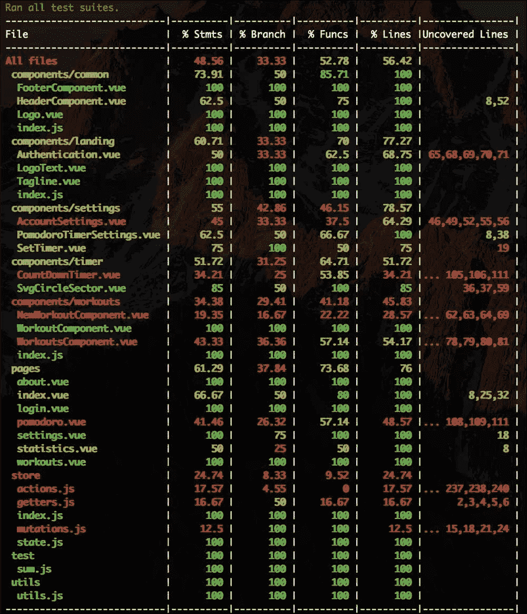

我们应用程序的几乎所有组件和文件都出现在覆盖报告中！

最重要的事情，实际上是快照测试的整个目的，就是在测试文件夹内生成的名为`__snapshots__`的文件夹。在这里，您将找到所有页面的所有 HTML 标记的新生成快照。这些快照看起来像这样：

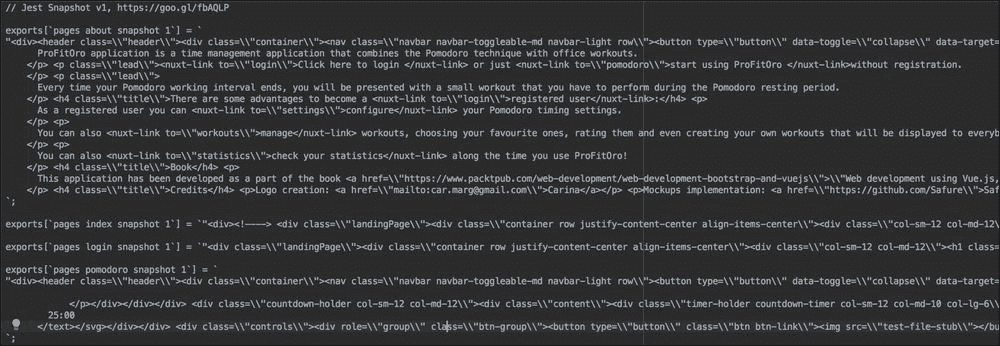

ProFitOro 页面的 Jest 快照

每当您进行影响标记的操作时，测试将失败。如果您真的想要更新快照，请使用更新标志运行测试：

```js
**npm test -- --u**

```

我发现快照测试是一个非常有趣和令人兴奋的功能！

### 提示

非常重要的是要提交您的快照文件！查看官方 Jest 网站上有关快照测试的详细文档：

[`facebook.github.io/jest/docs/snapshot-testing.html`](https://facebook.github.io/jest/docs/snapshot-testing.html)

本章的最终代码可以在`chapter9/6/profitoro`文件夹中找到。

# 总结

在本章中，我们使用了非常热门的技术来测试我们的 Vue 应用程序。我们使用了 Jest，并学习了如何创建模拟，测试组件，并使用它进行快照测试。

在下一章中，我们将最终看到我们的应用程序上线！我们将使用 Google Firebase Hosting 部署它，并提供必要的 CI/CD 工具，以便我们的应用程序在每次推送到主分支时都会自动部署和测试。您准备好看到您的作品上线并运行了吗？让我们开始吧！
