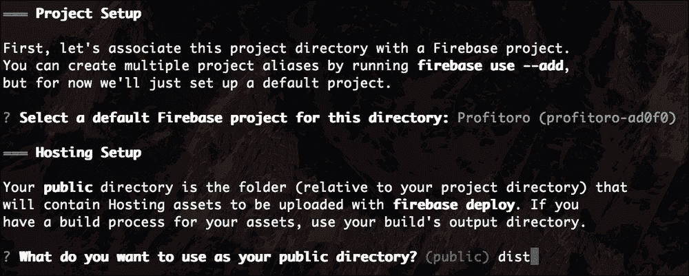
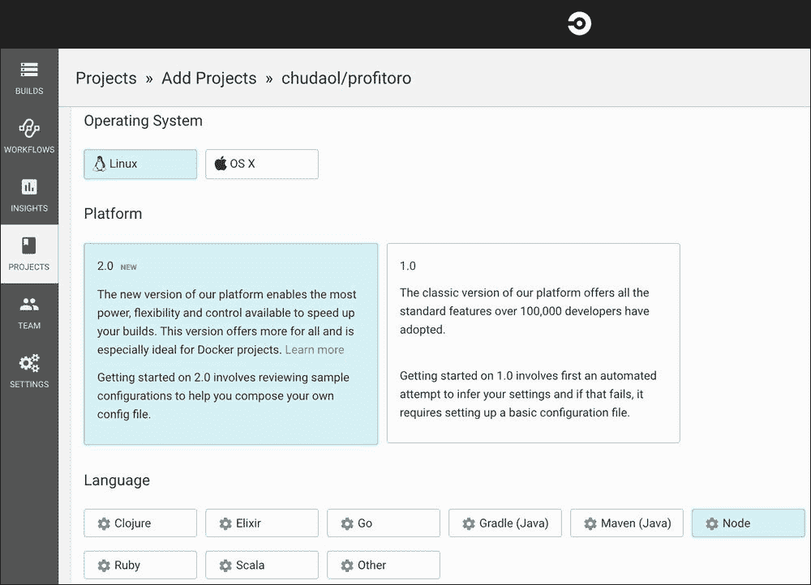
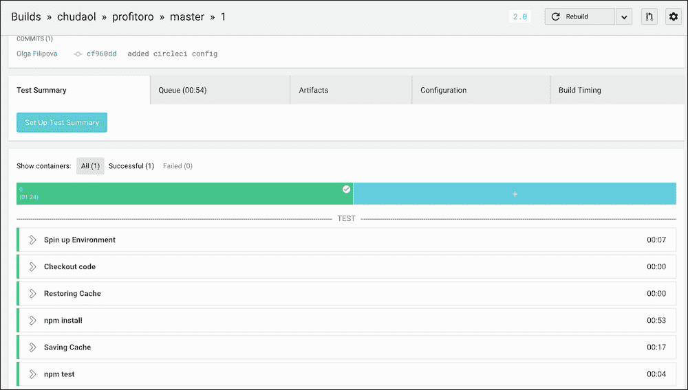
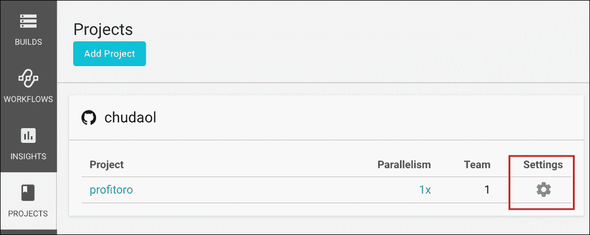
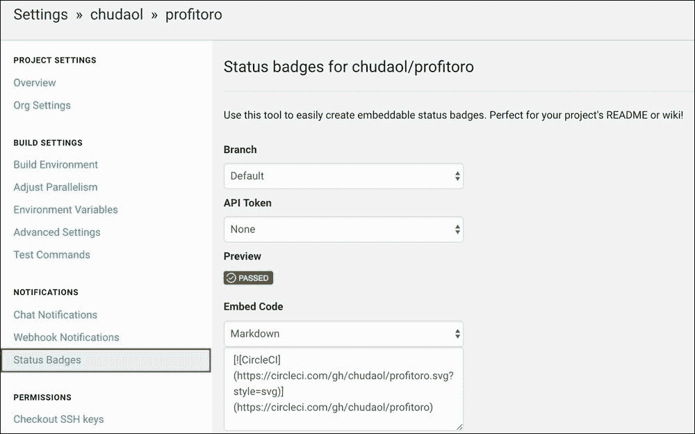
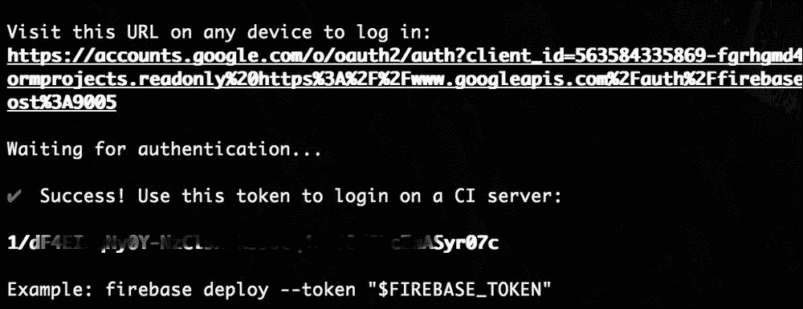
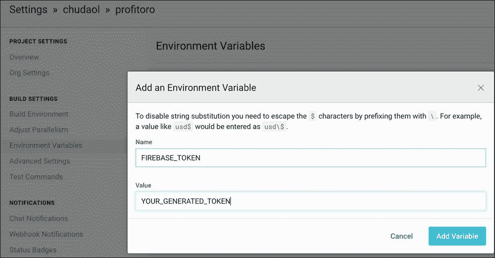
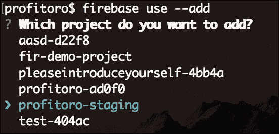
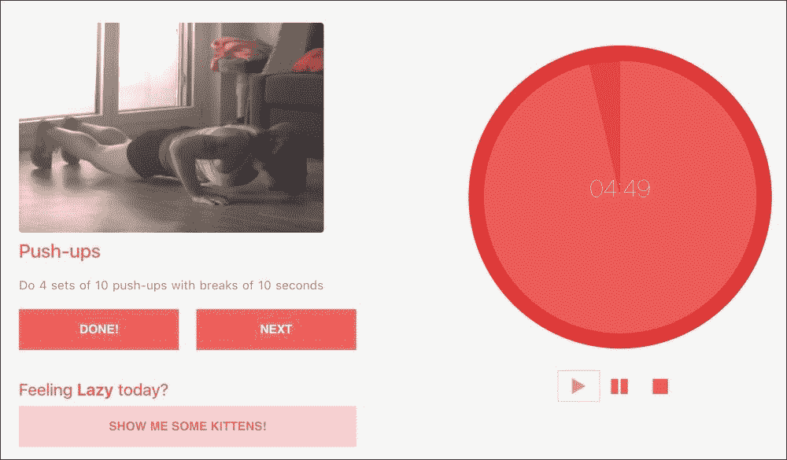

# 第十章 使用 Firebase 部署

在上一章中，我们为应用程序的代码设置了测试框架，从现在开始可以使用单元测试和快照测试。在本章中，我们将使我们的应用程序上线！我们还将设置**持续集成**（**CI**）和**持续部署**（**CD**）环境。因此，在本章中，我们将学习如何执行以下操作：

+   使用本地 Firebase 工具部署到 Firebase 托管

+   使用 CircleCI 设置 CI 工作流程

+   使用 Firebase 和 CircleCI 设置暂存和生产环境

# 从本地机器部署

在本节中，我们将使用 Firebase 命令行工具部署我们的应用程序。我们已经完成了。查看 Google Firebase 文档进行快速入门：[`firebase.google.com/docs/hosting/quickstart`](https://firebase.google.com/docs/hosting/quickstart)。

基本上，如果你还没有安装 Firebase 工具，请立即安装！

```js
**npm install -g firebase-tools**

```

现在切换到你的项目目录并初始化一个 Firebase 项目：

```js
**firebase init**

```

从下拉菜单中选择**托管**。

### 提示

这并不是很明显，所以请记住，要实际从列表中选择某个东西，你必须按下*空格*。


按空格选择托管功能

之后，从列表中选择你的 ProFitOro 项目，然后指定`dist`文件夹作为构建输出目录：



输入资产的公共目录 dist

回答下一个问题选择“否”，然后你就完成了！确保 Firebase 在你的项目文件夹中创建`firebase.json`和`.firebaserc`文件。

这就是`firebase.json`文件的样子：

```js
// firebase.json
{
  "hosting": {
    "public": "dist"
  }
}
```

这就是你的`.firebaserc`文件的样子：

```js
.firebasercs
{
  "projects": {
    "default": "profitoro-ad0f0"
  }
}
```

你已经完成了！现在，如果我们使用`npm run generate`命令生成静态资产，这些资产将最终出现在`dist`文件夹中。之后运行`firebase deploy`，你的应用程序将立即部署！

因此，请继续执行以下操作：

```js
**npm run generate**
**firebase deploy**

```

如果遇到错误或问题，请执行以下操作：

+   确保你的 Firebase CLI 是最新的

+   如果需要，使用`firebase login --reauth`重新进行身份验证

+   如果出现错误，请尝试使用`firebase use --add`添加项目

恭喜！你的应用程序已经启动运行！

### 注意

您可能会问，如果最终我们只是生成静态资产进行部署，为什么我们要费心使用整个 Nuxt 路由和服务器端渲染。问题是，不幸的是，Firebase 只托管静态文件。为了能够运行一个节点服务器，我们应该使用另一个容器，比如，例如 Heroku：[`stackoverflow.com/questions/30172320/firebase-hosting-with-own-server-node-js`](https://stackoverflow.com/questions/30172320/firebase-hosting-with-own-server-node-js)。

还有一件事情你应该知道：现在我们无法在本地运行我们的应用程序；如果我们尝试这样做，我们将会收到一个`webpack`错误：


当我们尝试在本地运行应用程序时出现 webpack 错误

出于某种原因，我们的`actions.js`文件尝试导入`firebase.json`而不是位于`firebase`目录内的 Firebase 应用程序`index.js`文件。这很容易解决。将 Firebase 目录重命名为`firebaseapp` - 最终，它就是位于内部的内容。请在`chapter10/1/profitoro`文件夹中找到与此部分对应的代码。注意根目录中的新`firebase.json`和`.firebaserc`文件，以及所有 Firebase 应用程序的导入已更改为`firebaseapp`文件夹。

# 使用 CircleCI 设置 CI/CD

现在，如果我们想部署我们的应用程序，我们首先必须在本地运行测试，以确保一切正常，然后使用`firebase deploy`命令进行部署。理想情况下，所有这些都应该是自动的。理想情况下，如果我们将代码推送到主分支，一切都应该自动进行，不需要我们的干预。具有自动化测试检查的自动化部署过程称为持续部署。这个术语的意思就像它听起来的那样 - 您的代码正在持续部署。有很多工具可以让您一次点击按钮或只需推送到主分支即可自动将代码部署到生产环境。从可靠的 Jenkins 开始，到 Codeship、CloudFlare、CircleCI、Travis……列表是无穷无尽的！我们将使用 CircleCI，因为它与 GitHub 集成得很好。如果您想了解如何使用 Travis 进行部署，请查看我之前关于 Vue.js 的书籍：

[`www.packtpub.com/web-development/learning-vuejs-2`](https://www.packtpub.com/web-development/learning-vuejs-2)

首先，你应该将你的项目托管在 GitHub 上。请按照 GitHub 文档学习如何初始化你的仓库：

[`help.github.com/articles/adding-an-existing-project-to-github-using-the-command-line/`](https://help.github.com/articles/adding-an-existing-project-to-github-using-the-command-line/)

或者只需 fork 我的：

[`github.com/chudaol/profitoro`](https://github.com/chudaol/profitoro)

一旦你的仓库上线，就在 CircleCI 上创建你的账户：

[`circleci.com`](https://circleci.com)

使用 CircleCI web 界面，创建一个新项目，并从列表中选择你的仓库。之后，选择 Linux 操作系统和 Node 作为语言：



CircleCI 项目配置

现在我们必须为我们的项目添加一个 CircleCI 配置，这样第一次推送时就知道该做什么。创建一个名为`config.yml`的文件的`.circleci`文件夹，并包含以下内容：

```js
// .circleci/config.yml
# Javascript Node CircleCI 2.0 configuration file
#
# Check https://circleci.com/docs/2.0/language-javascript/ for more details
#
version: 2
jobs:
  build:
    docker:
      # specify the version you desire here
      - image: circleci/node:7.10

      # Specify service dependencies here if necessary
      # CircleCI maintains a library of pre-built images
      # documented at https://circleci.com/docs/2.0/circleci-images/
      # - image: circleci/mongo:3.4.4

    working_directory: ~/repo

    steps:
      - checkout

      # Download and cache dependencies
      - restore_cache:
          keys:
          - v1-dependencies-{{ checksum "package.json" }}
          # fallback to using the latest cache if no exact match is found
          - v1-dependencies-

      - run: npm install

      - save_cache:
          paths:
            - node_modules
          key: v1-dependencies-{{ checksum "package.json" }}

      # run tests!
      - run: npm test
```

提交并推送更改到主分支。转到 CircleCI 界面，点击**开始构建**按钮：


点击开始构建按钮

如果你像我一样幸运，你会看到以下成功的输出：



CircleCI 成功！

让我们在我们的`README.md`文件中添加一个状态徽章，这样它就会出现在 GitHub 上。转到你的 CircleCI 项目设置（点击项目名称旁边的齿轮）：



点击项目名称旁边的齿轮以打开项目的设置选项卡

在**设置**部分，选择**通知**|**状态徽章**：



导航到设置|通知|状态徽章

复制并粘贴 markdown 代码到你的`README.md`文件中，使其看起来如下：

```js
// README.md
# Profitoro

**[](https://circleci.com/gh/chudaol/profitoro)**

> Take breaks during work. Exercise during breaks.
```

提交并推送更改到主分支！

如果你现在打开你的 GitHub 仓库，你会看到这个漂亮的徽章上写着**通过**：


CircleCI 徽章显示一个好消息：通过

但我们的整个目的不仅仅是看到一个漂亮的绿色徽章，而是真正能够部署到 Firebase 托管容器。为了做到这一点，我们必须配置 CircleCI。我们通过向`config.yml`文件添加`deploy`部分来实现这一点。查看[`circleci.com/docs/2.0/configuration-reference/#deploy`](https://circleci.com/docs/2.0/configuration-reference/#deploy)上的文档。为了能够部署到 Firebase 托管，我们需要登录。很明显，CircleCI 在任何情况下都没有登录到我们的 Firebase 帐户。幸运的是，这对我们来说很容易解决。我们需要生成一个 CI 令牌，然后在我们的`deploy`命令中使用它。

### 注意

可以使用`firebase login:ci`命令生成 Firebase CI 令牌。

只需在控制台中运行此命令：

```js
**firebase login:ci**

```

您将获得类似于此的输出：



Firebase login:ci 命令的输出

转到您的 CircleCI 的 Web 界面，并找到您项目的设置。在左侧，您会看到名为**构建设置**的选项卡。单击**环境变量**链接，将弹出**环境变量**部分。单击**添加变量**按钮，添加名为`FIREBASE_TOKEN`的变量，值为`YOUR_GENERATED_TOKEN`：



在您的 CircleCI 项目设置中添加一个新的环境变量

现在让我们在`config.yml`文件中添加一个部署步骤。在这之前，请记住我们必须调用`firebase deploy`命令。好吧，为此，我们应该在 CircleCI 服务器上全局安装 Firebase 工具。而不是在 CircleCI 服务器上污染一些全局安装的软件，让我们将其安装为*dev 依赖项*，然后从`node_modules`文件夹中调用命令。因此，首先，将`firebase-tools`安装为`dev`依赖项：

```js
**npm install --save-dev firebase-tools**

```

现在我们终于可以添加`deploy`步骤了。在这一步中，我们必须使用`npm run generate`命令生成资产，并使用我们的令牌运行`firebase deploy`（命令将是`firebase deploy --token=<YOUR_FIREBASE_TOKEN>`）。我们不必指定令牌本身，因为我们已经为其创建了一个环境变量，所以命令将如下所示：

```js
**firebase deploy --token=$FIREBASE_TOKEN**

```

整个`deploy`条目将如下所示：

```js
// .circleci/config.yml
jobs:
  build:
    #...

    steps:
      - checkout

      #...      
      # deploy!
      **- deploy:**
 **command: |**
 **if [ "${CIRCLE_BRANCH}" == "master" ]; then**
 **npm run generate**
 **./node_modules/.bin/firebase deploy --token=$FIREBASE_TOKEN --non-interactive**
 **fi**

```

推送更改。检查您的 CircleCI 控制台。成功部署后，检查您的 Firebase 控制台的**托管**选项卡，并确保最后一次部署正好在此时进行：


确保最后一次部署正好在此时进行！

这不是很棒吗？每当您将新更改推送到主分支时，它们将首先进行测试，只有在所有测试都通过后才会部署到您的 Firebase 托管提供商！我们设置所有这些需要多长时间？20 分钟？太棒了！

# 设置暂存和生产环境

您可能知道，直接部署到生产环境并不是一个很好的做法。即使测试通过，我们也必须先检查一切是否正确，这就是为什么我们需要一个*暂存*环境。

让我们在 Firebase 控制台上创建一个新项目，并将其命名为`profitoro-staging`。现在使用 Firebase 命令行工具向我们的项目添加一个新环境。只需在控制台中运行此命令：

```js
**firebase use –add**

```

选择正确的项目：



选择一个新创建的 profitoro-staging 项目

在下一步中键入别名`staging`：

```js
What alias do you want to use for this project? (e.g. staging) **staging**

```

检查`.firebaserc`文件是否已添加新条目：

```js
// .firebaserc
{
  "projects": {
    "default": "profitoro-ad0f0",
    **"staging": "profitoro-staging"**
  }
}
```

如果您现在在本地运行`firebase use staging`命令，然后在其后运行`firebase deploy`，您的项目将部署到我们新创建的暂存环境。如果您想切换并部署到生产环境，只需运行`firebase use default`命令，然后是`firebase deploy`命令。

现在我们需要重新配置我们的 CircleCI 工作流程。我们想要实现的是自动将资产部署到暂存服务器，然后进行手动批准以便部署到生产环境。为此，我们将使用带有手动批准的工作流配置。请查看有关此事的 CircleCI 官方文档页面：[`circleci.com/docs/2.0/workflows/#holding-a-workflow-for-a-manual-approval`](https://circleci.com/docs/2.0/workflows/#holding-a-workflow-for-a-manual-approval)。

我们最终会得到两个非常相似的作业-第一个将被称为`build`，它将包含与以前完全相同的内容，唯一的区别是部署步骤将使用别名`staging`：

```js
version: 2
jobs:
  build:
    docker
    #...

      # **deploy to staging!**
      - deploy:
          command: |
            if [ "${CIRCLE_BRANCH}" == "master" ]; then
              npm run generate
              **./node_modules/.bin/firebase use staging**
              ./node_modules/.bin/firebase deploy --token=$FIREBASE_TOKEN --non-interactive
            fi
```

第二个任务将被称为`deploy`，它将执行与`staging`任务完全相同的步骤（只是为了确保一切都没问题）。唯一的区别是在部署之前它将使用`default`别名：

```js
**build**:
  #...
deploy:
  docker:
    # ...
    # **deploy to production!**
    - deploy:
        command: |
          if [ "${CIRCLE_BRANCH}" == "master" ]; then
            npm run generate
            **./node_modules/.bin/firebase use default**
            ./node_modules/.bin/firebase deploy --token=$FIREBASE_TOKEN --non-interactive
          fi
```

之后，我们将添加一个名为`workflows`的新条目，如下所示：

```js
// .circleci/config.yml
jobs:
  build:
    #...
  deploy:
    #...
workflows:
  version: 2
  build-and-approval-deploy:
    jobs:
      - build
      - hold:
         type: approval
         requires:
           - build
      - deploy:
          requires:
            - hold
```

提交并推送到主分支。检查您的 CircleCI 控制台。成功部署到暂存环境后，单击**Workflow**选项卡，并检查它实际上是**暂停**状态：


工作流程处于暂停状态

检查您的暂存环境网站，并确保一切正常。

在完全确信一切都没问题之后，我们可以将我们的构建推广到生产环境。单击您的工作流程，然后单击**批准**按钮：


现在我们可以手动批准生产部署。

过一会儿，将会取得巨大成功！这不是很棒吗？

### 提示

尽管这超出了本书的范围，但请记住，在对暂存环境运行一些检查时，您不希望搞砸生产数据库。因此，为了使暂存成为真正的暂存，生产成为真正的生产，我们还应该设置一个暂存数据库。

检查`chapter10/2/profitoro`文件夹中的此部分代码。您需要注意的唯一两件事是`.firebaserc`配置文件和位于`.circleci/config.yml`目录中的 CircleCI 配置。

# 我们取得了什么成就？

亲爱的读者，我们已经走过了一段漫长的旅程。我们从最开始构建了我们的响应式应用程序，直到部署。我们使用了诸如 Vue.js、Bootstrap 4 和 Google Firebase 等优秀的技术来构建我们的应用程序。我们不仅使用了所有这些技术并学习了它们如何协同工作，而且实际上遵循了整个软件开发过程。

我们从业务理念、需求定义、用户故事定义和模型创建开始。我们继续进行实际实施-前端和后端都有。我们使用 Jest 进行了彻底的测试，最终将应用程序部署到了两个不同的环境中。甚至不仅仅是部署-我们实施了一个 CD 策略，它将自动为我们执行部署过程。

最重要的是-我们最终得到了一个完全功能的应用程序，可以让我们在工作期间管理时间并保持健康！

[`profitorolife.com/`](https://profitorolife.com/)

我甚至创建了一个 Facebook 页面：

[`www.facebook.com/profitoro/`](https://www.facebook.com/profitoro/)

如果你喜欢 ProFitOro 的标志设计，请向我的朋友 Carina 表示爱意和感谢：

`<car.marg@gmail.com>`

如果你喜欢模拟设计的方式，你应该感谢我的朋友和同事 Safi：

[`github.com/Safure`](https://github.com/Safure)

如果你喜欢 ProFitOro 的设计和插图，请查看我的朋友 Vanessa 的其他作品（[`www.behance.net/MeegsyWeegsy`](https://www.behance.net/MeegsyWeegsy)），并与她交谈，如果你觉得她可能也能帮助你。

如果你喜欢使用 SCSS 实现设计的方式，请给我的朋友 Filipe 一些*赞*（[`github.com/fil090302`](https://github.com/fil090302)）。

# 总结

在本章中，我们使用了 CircleCI 和 Firebase 来保证我们不断部署的软件的持续质量。正如我已经提到的，看到你从零开始创建的东西运行起来是如此美好！

然而，我们的工作还没有完成。还有很多改进要做。我们需要验证。我们需要编写更多的测试来增加我们的代码覆盖率！我们需要更多的锻炼，而且我们需要它们看起来漂亮。我们可能需要一些后台管理，让负责人可以在实际出现在所有人可见的锻炼列表之前检查每个添加的锻炼并批准它。

我们需要一个合适的统计页面，带有一些漂亮的图形。我们需要优化图像渲染。我们需要为每个锻炼显示多张图片。我们可能需要为锻炼添加视频支持。我们还需要在番茄工作计时器结束后出现的锻炼屏幕上做一些工作。现在看起来是这样的：



这里有很多按钮！但实际上它们都不起作用 :(

这里有三个按钮，但它们都不起作用。

所以，正如你所看到的，虽然我们已经完成了这本书，也有了一个功能齐全的软件，但我们还有一些工作要做。实际上，这让我感到非常高兴，因为这让我觉得我现在不必说再见。

与我分享您的想法，做一些了不起的事情并与我分享，或在 GitHub 上创建一些拉取请求或问题。我很乐意回答您。如果您有任何问题，建议或想法，请给我发电子邮件至`<chudaol@gmail.com>`。

感谢阅读本书并……去工作……出去！

# 索引

## A

+   会计

+   关于/ AAA 解释

+   操作

+   定义/ 定义操作和突变

+   警报组件

+   参考/ 继续结合 Vue.js 和 Bootstrap

+   匿名用户

+   管理/ 管理匿名用户

+   应用程序

+   部署/ 部署您的应用程序

+   脚手架/ 搭建应用程序

+   异步测试

+   Jest，使用/ 使用 Jest 进行异步测试-测试操作

+   身份验证/ AAA 解释

+   身份验证

+   关于/ AAA 解释

+   使用 Firebase 工作/ Firebase 的身份验证工作原理是什么？

+   身份验证，Firebase 文档

+   参考/ 更新用户配置文件

+   身份验证 API，Firebase

+   参考/ 如何将 Firebase 身份验证 API 连接到 Web 应用程序

+   身份验证 UI

+   增强/ 再次使身份验证 UI 变得很棒

+   授权

+   关于/ AAA 解释

## B

+   引导

+   用于添加表单/ 使用 Bootstrap 添加表单

+   关于/ Bootstrap

+   参考/ Bootstrap

+   功能/ Bootstrap

+   组件/ Bootstrap 组件

+   工具/ Bootstrap 工具

+   布局/ Bootstrap 布局

+   Vue.js，结合/ 结合 Vue.js 和 Bootstrap, 继续结合 Vue.js 和 Bootstrap

+   用于检查倒计时计时器组件的响应性/ 使用 Bootstrap 检查倒计时计时器的响应和适应性

+   用于检查倒计时计时器组件的适应性/ 使用 Bootstrap 检查倒计时计时器的响应和适应性

+   Bootstrap 标记

+   添加/ 添加 Bootstrap 标记

+   Bootstrap-Vue

+   参考/ 继续结合 Vue.js 和 Bootstrap

+   Bootstrap 类

+   用于创建布局/ 使用 Bootstrap 类创建布局

+   Bootstrap 模态框

+   用于显示锻炼/ 使用 Bootstrap 模态框显示每个锻炼, 锻炼

+   参考 / 使用 Bootstrap 模态框显示每个锻炼

+   Bootstrap 导航栏

+   使用，用于导航链接 / 使用 Bootstrap 导航栏进行导航链接

+   按钮

+   参考 / 倒计时计时器组件 - 让我们倒计时！

## C

+   驼峰式命名 / 定义 ProFitOro 组件

+   卡片 Bootstrap 组件

+   参考 / 结合 Vue.js 和 Bootstrap

+   卡片，Bootstrap 文档

+   参考 / 添加 Bootstrap 支持的标记

+   CI/CD

+   设置，使用 Circle CI / 使用 CircleCI 设置 CI/CD

+   Circle CI

+   用于设置 CI/CD / 使用 CircleCI 设置 CI/CD

+   CircleCI

+   参考 / 使用 CircleCI 设置 CI/CD, 设置暂存和生产环境

+   用于对齐的类，Bootstrap

+   参考 / 管理匿名用户

+   代码拆分 / 代码拆分或延迟加载

+   组件

+   消息卡，提取到 / 将消息卡提取到它们自己的组件中

+   组件，Bootstrap / Bootstrap 组件

+   组件，Vue / Vue 组件

+   倒计时计时器组件

+   响应性 / 使用 Bootstrap 实现倒计时器的响应和适应性

+   适应性 / 使用 Bootstrap 实现倒计时器的响应和适应性

+   倒计时，计数 / 倒计时组件-让我们倒计时！

+   自定义域

+   连接到 Firebase 项目 / 额外里程-将您的 Firebase 项目连接到自定义域

+   自定义模板，vue-cli

+   参考 / Vue-cli

## D

+   数据库条目

+   添加到 Firebase 应用程序数据库 / 向 Firebase 应用程序数据库添加第一个条目

## E

+   元素 / Vue.js

## F

+   文件上传

+   参考 / 使用 Firebase 数据存储存储图像

+   Firebase

+   关于 / 在 Firebase 控制台中创建项目, 什么是 Firebase？

+   服务 / 什么是 Firebase？

+   Firebase API 文档

+   参考 / 使用 Firebase 数据存储存储图像

+   Firebase 应用程序数据库

+   数据库条目，添加 / 向 Firebase 应用程序数据库添加第一个条目

+   Firebase 身份验证 API

+   工作流程/ Firebase 如何进行身份验证？

+   连接到 Web 应用程序/ 如何将 Firebase 身份验证 API 连接到 Web 应用程序

+   Firebase 控制台

+   项目，创建于/ 在 Firebase 控制台中创建项目

+   参考/ 在 Firebase 控制台中创建项目, 设置 Firebase 项目

+   Firebase 数据库

+   Vuex 存储，连接到/ 将 Vuex 存储连接到 Firebase 数据库

+   Firebase 数据存储

+   用于存储图像/ 使用 Firebase 数据存储存储图像, 让我们搜索！

+   Firebase 项目

+   Vue.js 应用程序，连接到/ 将 Vue.js 应用程序连接到 Firebase 项目

+   连接到自定义域/ 额外里程-将 Firebase 项目连接到自定义域

+   设置/ 设置 Firebase 项目

+   Firebase 实时数据库

+   用于存储锻炼/ 使用 Firebase 实时数据库存储新锻炼

+   文档，参考/ 使用 Firebase 实时数据库存储新锻炼

+   Firebase 实时数据库文档

+   参考 / 将 Vuex 存储连接到 Firebase 数据库

+   Firebase SDK

+   基于密码的身份验证 / Firebase 身份验证是如何工作的？

+   基于电子邮件的身份验证 / Firebase 身份验证是如何工作的？

+   联合实体提供者身份验证 / Firebase 身份验证是如何工作的？

+   基于电话号码的身份验证 / Firebase 身份验证是如何工作的？

+   自定义身份验证系统集成 / Firebase 身份验证是如何工作的？

+   匿名用户身份验证 / Firebase 身份验证是如何工作的？

+   flex-box

+   参考 / Bootstrap 实用工具

+   页脚

+   自定义 / 美化页脚

+   表单

+   添加，使用 Bootstrap / 使用 Bootstrap 添加表单

+   表单，Bootstrap 文档

+   参考 / 使用 Bootstrap 添加表单

+   功能，Bootstrap

+   引用 / Bootstrap

+   功能需求

+   收集 / 收集需求

## G

+   GoDaddy

+   参考 / 额外里程 – 将 Firebase 项目连接到自定义域

+   Google Firebase

+   参考 / 从本地机器部署

## H

+   Heroku

+   参考 / 从本地机器部署

+   历史 API

+   参考 / Vue 路由器

+   人机交互（HCI）

+   关于 / 模拟

## 我

+   图片

+   存储，使用 Firebase 数据存储 / 使用 Firebase 数据存储存储图片, 让我们搜索！

## J

+   Jest

+   关于 / 什么是 Jest？

+   参考 / 什么是 Jest？

+   使用 / 开始使用 Jest

+   覆盖率 / 覆盖率

+   模拟 / 使用 Jest 进行模拟

+   模拟，参考 / 使用 Jest 进行模拟

+   文档，参考 / 使用 Jest 进行模拟

+   用于测试 Vuex 存储 / 使用 Jest 测试 Vuex 存储

+   异步测试 / 使用 Jest 进行异步测试 - 测试操作

+   与 Vuex 一起工作 / 使用 Jest 与 Vuex、Nuxt.js、Firebase 和 Vue 组件

+   使用 Vue 组件工作 / 使用 Jest 与 Vuex、Nuxt.js、Firebase 和 Vue 组件

+   与 Nuxt.js 一起工作 / 使 Jest 与 Vuex、Nuxt.js、Firebase 和 Vue 组件一起工作

+   与 Firebase 一起工作 / 使 Jest 与 Vuex、Nuxt.js、Firebase 和 Vue 组件一起工作

+   用于测试 Vue 组件 / 使用 Jest 测试 Vue 组件

+   用于快照测试 / 使用 Jest 进行快照测试

+   jest.mock 函数

+   参考 / 使用 Jest 进行异步测试-测试操作

+   Jest 间谍

+   参考 / 使用 Jest 进行异步测试-测试操作

+   巨幕

+   参考 / 介绍锻炼

## K

+   KebabCased / 定义 ProFitOro 组件

## L

+   布局

+   创建，使用 Bootstrap 类 / 使用 Bootstrap 类创建布局

+   懒加载

+   关于 / 代码拆分或懒加载

+   参考 / 代码拆分或懒加载

+   本地机器

+   从本地机器部署 / 从本地机器部署

## M

+   菜单按钮

+   工作 / 练习-使菜单按钮工作

+   消息卡

+   提取到组件中 / 将消息卡提取到它们自己的组件中

+   模拟 / 使用 Jest 进行模拟

+   模拟功能

+   参考 / 使用 Jest 进行异步测试 - 测试操作

+   模型

+   关于 / 模型

+   登录页面 / 第一页 - 登录和注册

+   番茄钟计时器，显示 / 主页显示番茄钟计时器

+   锻炼，在休息期间 / 休息期间的锻炼

+   设置区域 / 设置

+   统计 / 统计

+   锻炼 / 锻炼

+   标志 / 标志

+   模式*历史选项

+   参考 / Vue 路由器

+   Moment.js 库

+   参考 / 添加实用功能以使事物看起来更好

+   moment.js 库

+   参考 / 练习

+   突变

+   定义 / 定义操作和突变

+   突变，Vuex 存储

+   参考 / Vuex 状态管理架构

## N

+   导航栏组件

+   参考 / 使用 Bootstrap 导航栏进行导航链接

+   导航

+   添加，使用 vue-router / 使用 vue-router 添加导航

+   根据身份验证限制 / 练习-根据身份验证限制导航

+   导航链接

+   使用 Bootstrap 导航栏 / 使用 Bootstrap 导航栏进行导航链接

+   名词

+   检索 / 名词

+   npm 包

+   参考 / 使用 Firebase 数据存储存储图像

+   nuxt-link

+   用于添加链接 / 使用 nuxt-link 添加链接

+   nuxt-starter 模板

+   关于 / Nuxt.js

+   参考 / Nuxt.js

+   Nuxt.js

+   关于 / Nuxt.js

+   URL / Nuxt.js

+   和 Vuex 存储 / Nuxt.js 和 Vuex 存储

+   Nuxt.js 中间件 / Nuxt.js 中间件

## O

+   偏移列

+   参考 / 使用 Bootstrap 响应式和自适应倒计时器

+   单向数据绑定 / Vue.js

## P

+   路径 SVG 元素

+   参考 / SVG 和三角函数

+   人物角色 / 人物角色

+   请介绍自己页面

+   参考 / 你好，用户

+   关于 / 你好，用户

+   番茄工作法

+   参考 / 陈述问题

+   番茄工作法计时器

+   主要原则/ 阐明问题

+   实现/ 实现番茄工作法计时器

+   SVG 和三角函数/ SVG 和三角函数, 练习

+   倒计时计时器组件，实现/ 实现倒计时计时器组件

+   关于/ 番茄工作法计时器, 练习

+   个性化/ 个性化番茄工作法计时器

+   预渲染 SPA 插件

+   参考/ 服务器端渲染

+   问题

+   阐明/ 阐明问题

+   profitoro

+   参考/ 使用 CircleCI 设置 CI/CD

+   ProFitOro 应用程序

+   认证到/ 认证到 ProFitOro 应用程序

+   ProFitOro 组件

+   定义/ 定义 ProFitOro 组件

+   项目

+   在 Firebase 控制台中创建/ 在 Firebase 控制台中创建项目

+   pull-*类

+   参考/ 使用 Bootstrap 实现倒计时计时器的响应性和适应性

+   push-*类

+   参考/ 使用 Bootstrap 实现倒计时计时器的响应性和适应性

## R

+   响应式应用程序

+   关于/ 我们取得了什么成就？

+   router-view 组件

+   参考/ Vue 路由器

## S

+   服务器端渲染（SSSR）

+   关于/ 服务器端渲染

+   参考/ 服务器端渲染

+   服务，Firebase

+   认证/ 什么是 Firebase？

+   数据库/ 什么是 Firebase？

+   托管/ 什么是 Firebase？

+   存储/ 什么是 Firebase？

+   单页面应用程序（SPA）/ Vue 路由器

+   快照测试

+   Jest，使用/ 使用 Jest 进行快照测试

+   参考/ 使用 Jest 进行快照测试

+   暂存和生产环境

+   设置/ 设置暂存和生产环境

+   样式

+   应用/ 是时候应用一些样式了

## T

+   模板文字

+   参考/ 倒计时组件- 让我们倒计时！

+   模板，vue-cli

+   webpack/ Vue-cli

+   webpack-simple/ Vue-cli

+   browserify/ Vue-cli

+   browserify-simple/ Vue-cli

+   简单/ Vue-cli

+   测试

+   重要性 / 为什么测试很重要？

+   Vue 文档

+   参考 / 练习

+   双向数据绑定 / Vue.js

## U

+   统一建模语言（UML） / 检索名词和动词

+   用户资料

+   更新 / 更新用户资料

+   用户故事 / 用户故事

+   实用函数

+   测试 / 测试实用函数

## V

+   v-on 指令

+   参考 / 倒计时组件- 让我们倒计时！

+   动词

+   检索 / 动词

+   Vue

+   组件 / Vue 组件

+   vue-cli

+   关于 / Vue-cli

+   参考 / Vue-cli, 搭建应用程序

+   vue-router

+   用于添加导航 / 使用 vue-router 添加导航

+   参考 / 使用 Bootstrap 导航栏进行导航链接

+   vue-router 库

+   参考 / Vue 路由器

+   Vue.js

+   功能，添加 / 使用 Vue.js 使事情功能化

+   实用函数，添加 / 添加实用函数使事情看起来更美观

+   关于 / Vue.js

+   参考 / Vue.js, 使用 CircleCI 设置 CI/CD

+   在脚本中包含 / 直接在脚本中包含

+   与 Bootstrap 结合 / 结合 Vue.js 和 Bootstrap, 继续结合 Vue.js 和 Bootstrap

+   Vue.js 应用程序

+   脚手架 / 搭建 Vue.js 应用程序

+   连接到 Firebase 项目 / 将 Vue.js 应用程序连接到 Firebase 项目

+   Vue 应用程序

+   URL / 服务器端渲染

+   Vue 组件

+   使用 Jest 进行测试 / 使用 Jest 测试 Vue 组件

+   Vue 指令

+   关于 / Vue 指令

+   条件渲染 / 条件渲染

+   文本，与 HTML / 文本与 HTML

+   循环 / 循环

+   数据，绑定 / 绑定数据

+   事件，处理 / 处理事件

+   Vue 文档

+   参考 / 搭建 Vue.js 应用程序

+   vuefire 包装器

+   参考 / 什么是 Firebase？

+   Vue 实例 / Vue.js

+   Vue 项目

+   关于 / Vue 项目-入门

+   CDN 版本，使用 / CDN

+   npm 依赖项，添加到 package.json 文件 / NPM

+   Vue 路由器 / Vue 路由器

+   Vuex

+   参考，用于模块 / 设置 Vuex 存储

+   Vuexfire

+   参考 / 将 Vuex 存储连接到 Firebase 数据库

+   Vuex 状态管理架构 / Vuex 状态管理架构

+   Vuex 存储

+   状态 / Vuex 状态管理架构, 设置 Vuex 存储

+   获取器 / Vuex 状态管理架构, 设置 Vuex 存储

+   突变 / Vuex 状态管理架构, 设置 Vuex 存储

+   设置 / 设置 Vuex 存储

+   行动 / 设置 Vuex 存储

+   连接到 Firebase 数据库 / 将 Vuex 存储连接到 Firebase 数据库

+   参考 / Nuxt.js 和 Vuex 存储

+   测试，使用 Jest / 使用 Jest 测试 Vuex 存储

+   测试，突变 / 测试突变

+   测试，操作 / 使用 Jest 进行异步测试 - 测试操作

## W

+   观察者

+   参考 / 练习

+   网络应用

+   Firebase 身份验证 API，连接到 / 如何将 Firebase 身份验证 API 连接到网络应用程序

+   webpack 文档

+   参考 / 代码拆分或延迟加载

+   WireframeSketcher

+   参考 / 模型

+   锻炼

+   使用 Firebase 实时数据库存储 / 使用 Firebase 实时数据库存储新的锻炼

+   使用 Bootstrap 模态框显示 / 使用 Bootstrap 模态框显示每个锻炼, 练习

+   锻炼

+   关于 / 介绍锻炼
