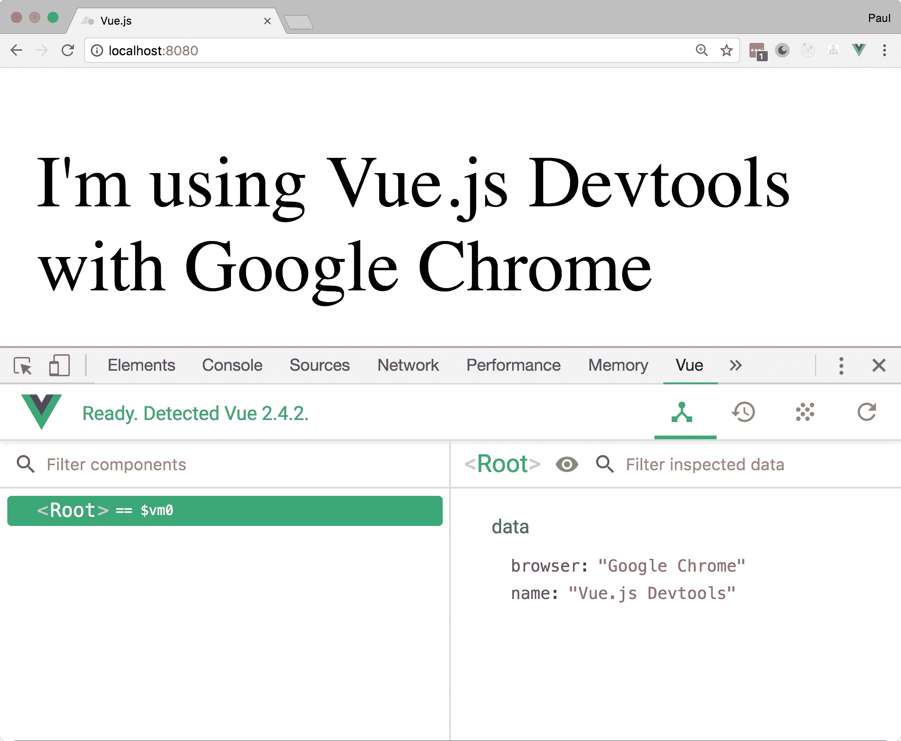
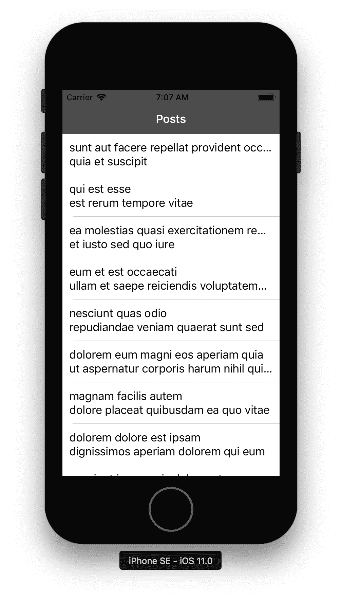

# 第一章：Vue.js 的原则和比较

在本章中，我们将探讨为什么 Vue 是一个重要的 Web 开发框架，以及如何设置我们的开发环境。如果我们打算在下一个项目中使用 Vue，重要的是我们意识到这样做的影响、时间投资和学习曲线。您将考虑 Vue 与其他前端开发项目的对比，以及使用 Vue 创建您的第一个应用程序。

总之，我们将考虑以下几点：

+   下载书籍先决条件

+   了解 Vue 在前端框架中的定位

+   为什么您应该考虑将 Vue 作为下一个项目的框架

+   调查 Vue 的灵活性及其在移动开发中的作用

# 先决条件

尽管你可以在没有 Node 的情况下开发 Vue 应用程序，但我们将在本书中始终使用 Node.js 来管理依赖关系并与 Vue **命令行界面** (**CLI**) 交互。这使我们能够更快地启动项目，并且可以默认使用 ECMAScript 2015，从而为我们提供更好的开发体验。让我们快速回顾一下如何设置开发环境。

# Windows

在 Windows 上安装 Node 就像访问[`nodejs.org`](https://nodejs.org/)并下载最新版本一样简单。确保在按照安装步骤时选择 Add to PATH，这样我们就可以在终端中访问 node 命令。

完成后，通过输入`node -v`和`npm -v`来检查 Node 安装是否成功。如果你得到两个版本号（即每个版本一个），那么你就可以继续进行本书的其余部分了！

# Mac

在 Mac 上安装 Node 需要比简单地从 Node 网站下载安装程序更多的工作。虽然可以使用来自[`nodejs.org`](https://nodejs.org/)的安装程序，但由于需要`sudo`，不建议这样做。

如果我们这样做，我们将不得不在所有的`npm`命令前加上`sudo`，这可能会使我们的系统容易受到潜在的脚本攻击，并且不方便。相反，我们可以通过 Homebrew 软件包管理器安装 Node，然后我们可以与`npm`交互，而不必担心必须以`sudo`身份运行事务。

使用 Homebrew 安装 Node 的另一个好处是它会自动添加到我们的 PATH 中。这意味着我们将能够在不必费力地调整我们的环境文件的情况下输入 node 命令。

# 通过 Homebrew 安装 Node

获取 Homebrew 的最快方法是访问[`brew.sh`](http://brew.sh/)并获取安装脚本。它应该看起来有点像这样：

```js
/usr/bin/ruby -e "$(curl -fsSL https://raw.githubusercontent.com/Homebrew/install/master/install)"
```

只需将其粘贴到您的终端中，它将下载 Homebrew 软件包管理器到您的 Mac 上。然后我们可以使用 brew install node 在系统上安装 Node 而不必担心任何问题。

完成后，通过输入`node -v`和`npm -v`来检查您的 Node 安装是否正常工作。如果您得到两个版本号（即每个版本一个），那么您就可以继续阅读本书的其余部分了！

为了管理不同的 Node 版本，我们还可以安装**Node Version Manager**（**NVM**）。但请注意，目前仅 Mac 支持此功能，不支持 Windows。要安装 NVM，我们可以使用 Homebrew，就像这样：

```js
--use Brew to install the NVM
brew install nvm

--File directory
mkdir ~/.nvm

--Install latest version
nvm install --lts

--Ensure latest version is used
nvm use node

--Remember details across sessions
nano ~/.bash_profile

--Execute in every session
export NVM_DIR="$HOME/.nvm"
 . "$(brew --prefix nvm)/nvm.sh"
```

# 编辑器

可以使用各种编辑器，如 Visual Studio Code，Sublime Text，Atom 和 WebStorm。我推荐使用 Visual Studio Code ([`code.visualstudio.com`](https://code.visualstudio.com))，因为它有频繁的发布周期和丰富的 Vue 扩展，可以用来改善我们的工作流程。

# 浏览器

我们将使用 Google Chrome 来运行我们的项目，因为它有一个名为 Vue devtools 的扩展，对我们的开发工作流程至关重要。如果您不使用 Google Chrome，请确保您的浏览器具有可供使用的相同 Vue devtools 扩展。

# 安装 Vue devtools

前往 Google Chrome 扩展商店并下载 Vue.js devtools ([`goo.gl/Sc3YU1`](https://goo.gl/Sc3YU1))。安装后，您将可以在开发者工具中访问 Vue 面板。在下面的示例中，我们能够看到 Vue 实例中的数据对象：

```js
<!DOCTYPE html>
<html lang="en">
<head>
  <meta charset="UTF-8">
  <meta name="viewport" content="width=device-width, initial-     
  scale=1.0">
  <meta http-equiv="X-UA-Compatible" content="ie=edge">
  <title>Vue.js</title>
</head>
<body>
  <div id="app"></div>
  <script src="http://unpkg.com/vue"></script>
  <script>
   Vue.config.devtools = true
   new Vue({
     el: '#app',
     data: {
       name: 'Vue.js Devtools',
       browser: 'Google Chrome'
     },
     template: `
      <div>
        <h1> I'm using {{name}} with {{browser}}</h1>
      </div>
     `
   });
  </script>
</body>
</html>
```

然后，我们转到浏览器并打开开发工具，我们可以看到 Vue 已被检测到，并且我们的消息已经输出到屏幕上：



我们将在整本书中使用它来更深入地了解我们的应用程序。请注意，开发者工具只会在本地服务器上提供 Vue 项目时才能识别您的 Vue 项目。

# Vue CLI

为了充分利用 Vue 的所有功能，我们将使用 Vue CLI。这使我们能够使用各种起始模板创建项目，并具有适当的捆绑/转译配置。在确保安装了 Node 的情况下，将以下内容输入到您的终端中：

```js
$ npm install vue-cli -g
```

这为我们未来的章节做好了准备，使用起始模板显著增强了我们的工作流程。

# Vue.js 的比较

本书旨在概述如何使用常见的开发模式、最佳实践和要避免的反模式来最佳地构建 Vue 应用程序。

我们的旅程始于看看 Vue 与其他常见项目的比较，如果你通过 GitHub 星标来衡量你的框架，Vue 显然是未来的赢家。根据[`bestof.js.org`](https://bestof.js.org)，2017 年它的每日星标数目为 114，而 React 为 76，Angular 为 32。

谈论现代 Web 开发技术时，对框架的讨论是一个有趣的话题。很少能找到一个真正客观的比较...但没关系！重点不在于哪个框架或库最好，而在于什么对你的团队、项目目标、消费者以及其他数百个变量最好。作为一个 Vue 开发者，你可能是一个想要用简单、易于使用的 API 构建响应式 Web 应用的人。

正是这种适应性强、易于使用的 API 使得 Vue 很愉快地使用，也许 Vue 最强大的地方之一就是简单而专注的文档。它的门槛非常低：只需从 CDN 添加一个脚本文件，初始化一个新的 Vue 实例...然后你就可以开始了！当然，Vue 比这更复杂得多，但与一些完整的框架如 Angular 相比，你可能会原谅自己认为它是如此简单。

Vue 使用模板、声明式绑定和基于组件的架构来分离关注点，使项目更易于维护。当考虑在企业内部使用哪个框架时，这变得尤为重要。通常情况下，这就是 Angular 等项目的闪光之处，因为它能够在整个项目中强制执行标准。

我们已经确定它很容易使用，但是与竞争对手相比，Vue 还很年轻...我们怎么知道这不全是炒作呢？有人在生产中使用它吗？当然有！GitLab 最近写了一篇关于他们为什么选择 Vue.js 的文章（[`about.gitlab.com/2016/10/20/why-we-chose-vue/`](https://about.gitlab.com/2016/10/20/why-we-chose-vue/)），他们列举的主要优点是易用性、代码量少和假设少。其他公司如 Laravel、任天堂、Sainsbury's 和阿里巴巴都在追随这条路线，甚至像 Rever Shine 这样的公司也将他们的 Web 客户端从 Angular 2.x 重写为 Vue 2.x（[`medium.com/reverdev/why-we-moved-from-angular-2-to-vue-js-and-why-we-didnt-choose-react-ef807d9f4163`](https://medium.com/reverdev/why-we-moved-from-angular-2-to-vue-js-and-why-we-didnt-choose-react-ef807d9f4163)）。

不仅是公开面向的 Web 应用程序正在利用 Vue.js——NativeScript Sidekick（[`www.nativescript.org/blog/announcing-the-nativescript-sidekick-public-preview`](https://www.nativescript.org/blog/announcing-the-nativescript-sidekick-public-preview)）是一个专注于改进 NativeScript 开发体验的项目，它是使用 Electron 和 Vue.js 构建的。

如果我们从 Sacha Greif（[`twitter.com/SachaGreif`](https://twitter.com/SachaGreif)）和 Michael Rambeau（[`michaelrambeau.com/`](http://michaelrambeau.com/)）的 JavaScript 调查中获得一些见解，我们可以看到惊人的**89%**的人在之前使用过 Vue，并希望再次使用它。其他库如 React 的满意度率也达到了**92%**，但是 Angular 2 及以后的版本并没有得到太多的喜爱，只有**65%**的人希望再次使用它。


作为前端开发人员，我们还有哪些其他选择？它们与 Vue 相比如何？让我们从 React 开始。

# React

React 是由 Facebook 开发和维护的 JavaScript 库，与 Vue 最为接近，因为它们的目标非常相似。与 Vue 一样，React 是基于组件的，并利用了虚拟 DOM 的概念。这允许对 DOM 节点进行高性能渲染，因为使用了不同的算法来确定 DOM 的哪些部分发生了变化，以及如何在变化时最好地渲染/更新它们。

在模板方面，React 使用 JSX 来渲染屏幕上的项目。它采用了更冗长的方式来创建 DOM 元素，使用`React.createElement`并简化如下：

这是没有 JSX 的样子：

```js
React.createElement</span>(  MyButton,  {color:  'red',  shadowSize: 5},  'Click Me' )
```

以下是 JSX 的样子。如你所见，两者看起来非常不同：

```js
<MyButton color="red" shadowSize={5}>
 Click  Me </MyButton>
```

对于新手开发者来说，与 Vue 的简单 HTML 模板相比，这增加了一些学习负担，但也正是这一点赋予了 React 其声明性的力量。它有一个使用`setState()`的状态管理系统，但也与 Redux 和 MobX 等第三方状态容器兼容。Vue 也具有类似的功能，使用`Vuex`库，我们将在本书的后面部分更详细地讨论这一点。

使用 React 的一个常见最近关注点是 BSD +专利许可协议，如果你是企业的一部分，这是需要牢记的事情。由于这个许可证，Apache 最近宣布，不会有任何 Apache 软件产品使用 React。另一个例子是[Wordpress.com](http://Wordpress.com)宣布他们不再在 Gutenberg 项目中使用 React（[`ma.tt/2017/09/on-react-and-wordpress/`](https://ma.tt/2017/09/on-react-and-wordpress/)）。这并不一定意味着你不应该在你的项目中使用 React，但还是值得指出的。

一些担心的开发者选择使用替代方案，如 Preact，但最近更多地选择了 Vue.js，因为它满足了 React 开发者在开发应用程序时寻求的许多目标。为此，微软（[`dev.office.com/fabric#/components`](http://dev.office.com/fabric#/components)）、苹果（[`developer.apple.com/documentation`](https://developer.apple.com/documentation)）和其他无数公司都发布了使用 React 的产品-你可以从中得出什么结论。

# Angular

Angular 是由 Google 开发和维护的一种有主见的 JavaScript 框架。在撰写本文时，它目前接近第 5 版，并提供了一种基于结构化标准的网页开发方法。它使用 TypeScript 来强制执行类型安全和 ECMAScript 2015>支持。

与 Angular 相比，Vue 似乎强制执行一组更小的约束，并允许开发人员有更多的选择。Angular 的核心竞争力之一是在任何地方都使用 TypeScript。大多数从 Angular.js 过来的开发人员在 Angular 2 宣布时第一次听说 TypeScript，我注意到有相当多的反对意见，因为需要“学习一门新语言”。事实上，JavaScript 就是 TypeScript，增加工具（自动完成、重构、类型安全等）的价值是不容忽视的。

特别是在处理企业项目时，随着项目复杂性和团队规模的增加，入门挑战变得更加困难。有了 TypeScript，我们能够更好地推理代码之间的关系。这种结构化的开发体验是 Angular 的主要优势。这就是为什么 Angular 团队选择 TypeScript 作为主要开发工具的原因。TypeScript 的好处不仅限于 Angular；我们将在本书后面看看如何将 Vue 与 TypeScript 集成以获得同样的好处。

使用 Angular 作为开发框架有什么缺点吗？不一定。当与 Vue 进行比较时，入门体验是非常不同的。

# 移动开发

在开发移动应用程序时，像 Angular 和 React 这样的项目是开发面向移动的应用程序的绝佳选择。NativeScript、React Native 和 Ionic Framework 项目的成功大大提升了这些框架的流行度。例如，Ionic Framework 目前在 GitHub 上的星标比 Angular 还要多！

Vue 在这一领域取得了一定的成就，例如 NativeScript Vue、Weex 和 Quasar Framework 等项目。所有列出的项目都相对较新，但只需要一个项目真正地提升 Vue 在生产中的流行度。以 NativeScript Vue 为例，只需要 43 行代码就可以创建一个连接到 REST API 并在屏幕上显示结果的跨平台移动应用程序。如果你想自己尝试一下，可以运行：

```js
# Install the NativeScript CLI
npm install nativescript -g

# New NativeScript Vue project
tns create NSVue --template nativescript-vue-template

# Change directory
cd NSVue

# Run on iOS
tns run ios
```

然后，我们可以将以下内容放在`app/app.js`中：

```js
const Vue = require('nativescript-vue/dist/index');
const http = require('http');
Vue.prototype.$http = http;

new Vue({
    template: `
    <page>
        <action-bar class="action-bar" title="Posts"></action-bar>
        <stack-layout>
            <list-view :items="posts">
                <template scope="post">
                    <stack-layout class="list">
                        <label :text="post.title"></label>
                        <label :text="post.body"></label>
                    </stack-layout>
                </template>
            </list-view>
        </stack-layout>
    </page>
    `,    
    data: {
        posts: []
    },
    created(args) {
        this.getPosts();
    },
    methods: {
        getPosts() {
            this.$http
                .getJSON(`https://jsonplaceholder.typicode.com/posts`)
                .then(response => {
                    this.posts = response.map(
                        post => {
                            return {
                                title: post.title,
                                body: post.body
                            }
                        }
                    )
                });
        }
    }
}).$start();
```

如果我们运行我们的代码，就可以看到一个帖子列表。你会注意到我们的 Vue 代码是声明式的，而且我们可以用更少的代码获得更大框架的功能：



# 服务器端渲染（SSR）

服务器端渲染允许我们将前端 JavaScript 应用程序渲染为服务器上的静态 HTML。这很重要，因为它可以显著加快我们的应用程序，因为浏览器只需解析关键的 HTML/CSS。最大化性能是现代 Web 应用程序的关键组成部分，随着渐进式 Web 应用程序和 AMP 等项目的预期不断增长。React、Angular 和 Vue 都能够使用各种不同的模式进行服务器端渲染。

让我们看看如何实现一个简单的服务器端渲染的 Vue 应用程序：

```js
# Create a new folder named vue-ssr:
$ mkdir vue-ssr
$ cd vue-ssr

# Create a new file named server.js
$ touch server.js

# Install dependencies
$ npm install vue vue-server-renderer express
```

在`server.js`中，我们可以创建一个新的 Vue 实例，并使用 Vue 渲染器将我们实例的内容输出为 HTML：

```js
const Vue = require("vue");
const server = require("express")();
const renderer = require("vue-server-renderer").createRenderer();

server.get("*", (req, res) => {
  const app = new Vue({
    data: {
      date: new Date()
    },
    template: `
    <div>
    The visited time: {{ date }}
    </div>`
  });

  renderer.renderToString(app, (err, html) => {
    if (err) {
      res.status(500).end("Internal Server Error");
      return;
    }
    res.end(`
      <!DOCTYPE html>
      <html lang="en">
        <head><title>Hello</title></head>
        <body>${html}</body>
      </html>
    `);
  });
});

server.listen(8080);
```

要运行应用程序，请在终端中输入以下内容：

```js
$ node server.js
```

然后我们可以在浏览器中打开`http://localhost:8080`，我们会在屏幕上看到当前的日期和时间。这只是一个简单的例子，但我们能够看到我们的应用程序是使用`vue-server-renderer`渲染的。请注意，我们没有定义一个目标元素来在我们的 Vue 实例中渲染内容；这是由`renderer.renderToString`函数处理的。

您还会注意到我们在 DOM 节点上有`data-server-rendered="true"`属性，这在客户端渲染的 Vue 应用程序中是不存在的。这使我们能够用服务器端实例来滋养我们的客户端实例，这是我们将在后面关于 Nuxt 的章节中更详细地讨论的内容（[`nuxtjs.org/`](https://nuxtjs.org/)）。

# 结论

企业中的 Web 框架选择总是取决于项目、团队和组织优先事项的目标。没有一个框架是正确的选择，因为最佳选择取决于上下文。每个框架或库都有其独特的优点、缺点和优先事项。如果您的优先事项是快速创建并扩展 Web 应用程序，Vue 可以与其他市场解决方案竞争。

Vue 功能丰富、声明式且高度可读。尽管它是一个简单的框架，但 Vue 的声明性质使我们能够快速启动而不必担心过于复杂的模式。

# 总结

在本章中，我们看了如何设置开发环境以及 Vue 在整个行业中的应用。我们了解到 Vue 是一个简单但强大的前端开发框架。此外，我们考虑了与其他流行项目（如 Angular 和 React）相比，Vue 的表现如何。我们还看了 Vue 如何与其他技术（如 NativeScript）配合使用，创建跨平台原生移动应用程序。最后，我们以高层次调查了 SSR，并为接下来的章节做好了铺垫。希望到现在你已经相信学习 Vue 是值得的，并且期待着利用它所提供的一切！

在下一章中，我们将看一下 Vue CLI 以及如何利用诸如 Webpack 之类的工具来创建我们的 Vue 项目。此外，我们还将探讨如何利用静态类型和 TypeScript 以及在 Vue 中使用 RxJS 的响应式可观察模式。
