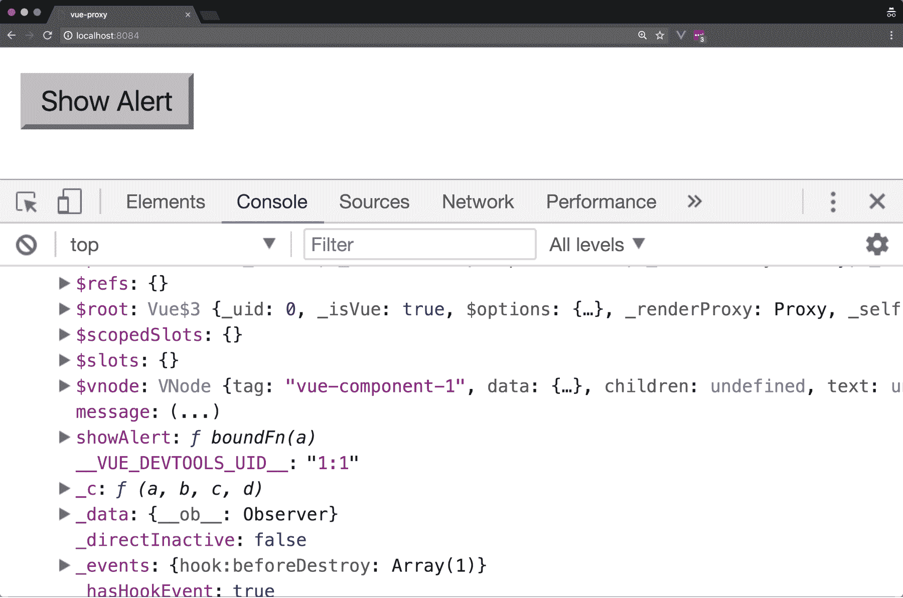
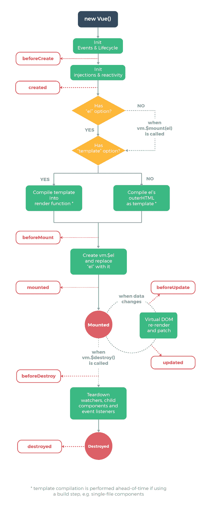
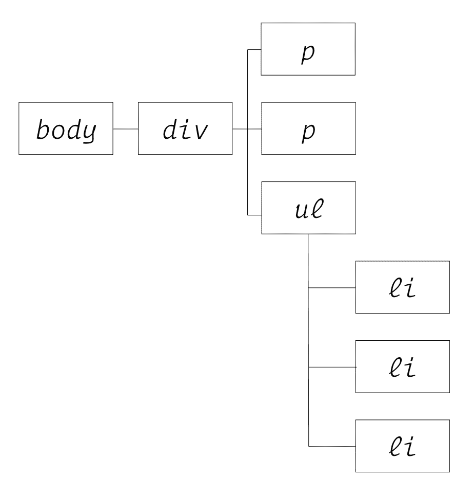
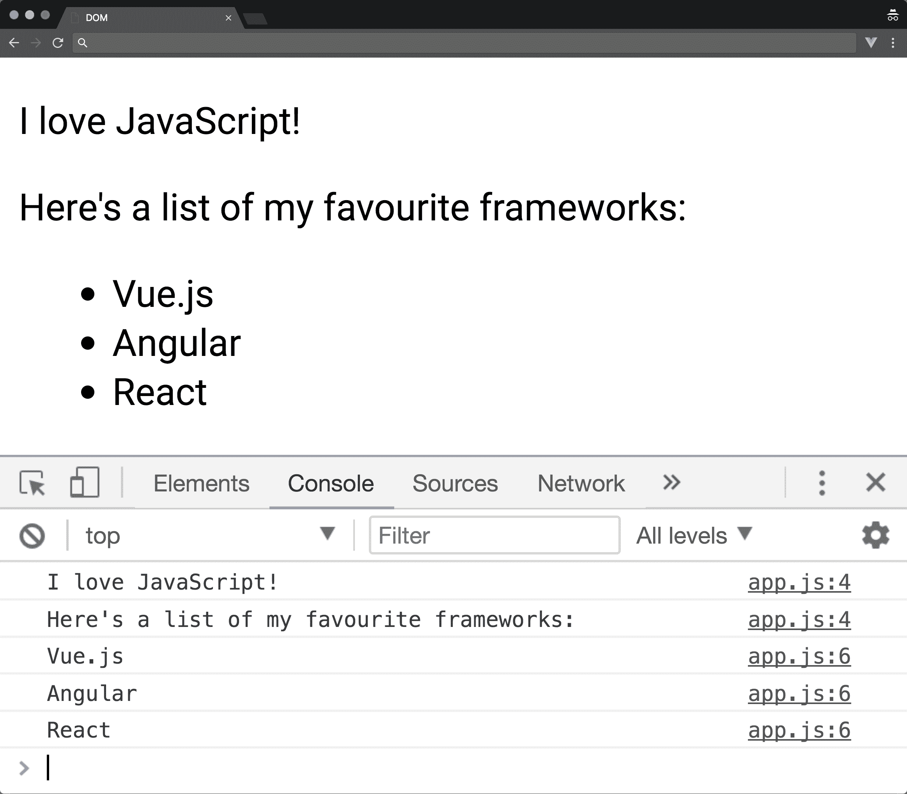

# 第三章：使用 Vue 编写干净、精简的代码

在本节中，我们将调查 Vue.js 实例在更低级别上的工作方式，看看 Vue 是如何处理 this 的。我们还将查看实例上的各种属性，如数据、计算、观察，以及在使用每个属性时的最佳实践。此外，我们将查看 Vue 实例中可用的各种生命周期钩子，允许我们在应用程序的各个阶段调用特定函数。最后，我们将调查**文档对象模型**（**DOM**）以及为什么 Vue 实现了虚拟 DOM 以提高性能。

在本章结束时，您将：

+   更好地理解 JavaScript 中`this`关键字的工作原理

+   了解 Vue 如何在 Vue 实例中代理`this`关键字

+   使用数据属性创建响应式绑定

+   使用计算属性基于我们的数据模型创建声明性函数

+   使用观察属性访问异步数据，并在计算属性的基础上构建

+   使用生命周期钩子在 Vue 生命周期的特定阶段激活功能

+   调查 DOM 和虚拟 DOM，以了解 Vue 如何将数据渲染到屏幕上

首先，让我们来看看在 JavaScript 中 this 是如何工作的，以及它如何与我们的 Vue 实例中的上下文相关联。

# 代理

到目前为止，您可能已经与 Vue 应用程序进行了交互，并想过：`this`是如何工作的？在查看 Vue.js 如何处理`this`之前，让我们先看看它在 JavaScript 中是如何工作的。

# 了解 JavaScript 中的'this'工作原理

在 JavaScript 中，`this`具有不同的上下文，从全局窗口上下文到 eval、可实例化和函数上下文。由于默认上下文与全局范围相关，因此 this 是我们的窗口对象：

```js
/**
 * Outputting the value of this to the console in the global context returns the Window object
 */
console.log(this);

/**
 * When referencing global Window objects, we don't need to refer to them with this, but if we do, we get the same behavior
 */
alert('Alert one');
this.alert('Alert two');
```

this 的上下文会根据我们所处的范围而改变。这意味着，如果我们有一个`Student`对象，具有特定的值，比如`firstName`、`lastName`、`grades`等，那么`this`的上下文将与对象本身相关联：

```js
/**
 * The context of this changes when we enter another lexical scope, take our Student object example:
 */
const Student = {
 firstName: 'Paul',
 lastName: 'Halliday',
 grades: [50, 95, 70, 65, 35],
 getFullName() {
  return `${this.firstName} ${this.lastName}` 
 },
 getGrades() {
  return this.grades.reduce((accumulator, grade) => accumulator + grade);
 },
 toString() {
  return `Student ${this.getFullName()} scored ${this.getGrades()}/500`;
 }
}
```

当我们运行上述代码并使用`console.log(Student.toString())`时，我们会得到这个结果：`Student Paul Halliday scored 315/500`，因为此时 this 的上下文现在是对象本身，而不是全局窗口范围。

如果我们想要在文档中显示 this，我们可以这样做：

```js
let res = document.createTextNode(Student.toString());
let heading = document.createElement('h1');
heading.appendChild(res);
document.body.appendChild(heading);
```

请注意，在上述代码中，我们再次不必使用`this`，因为它在全局上下文中不需要。

现在我们对`this`的基本工作原理有了一定的了解，我们可以调查 Vue 如何在实例内部代理`this`，以便更轻松地与各种属性进行交互。

# Vue 如何处理'this'

到目前为止，您可能已经注意到我们能够使用`this`语法引用数据、方法和其他对象中的值，但实例的实际结构是`this.data.propertyName`或`this.methods.methodName`；所有这些都是由 Vue 代理我们的实例属性实现的。

让我们来看一个非常简单的 Vue 应用程序，它只有一个实例。我们有一个`data`对象，其中有一个`message`变量和一个名为`showAlert`的方法；Vue 如何知道如何通过`this.message`访问我们的警报文本？

```js
<template>
 <button @click="showAlert">
 Show Alert</button>
</template>

<script>
export default {
 data() {
  return {
   message: 'Hello World!',
  };
 },
 methods: {
  showAlert() {
   alert(this.message);
  },
 },
};
</script>
```

Vue 将实例属性代理到顶层对象，使我们可以通过 this 访问这些属性。如果我们将实例记录到控制台（借助 Vue.js 开发工具），我们会得到以下结果：

控制台记录

在前面的屏幕截图中要查看的关键属性是`message`和`showAlert`，它们都在我们的 Vue 实例上定义，但在初始化时代理到根对象实例。

# 数据属性

当我们向数据对象添加变量时，实质上是创建了一个在任何更改时更新视图的响应式属性。这意味着，如果我们有一个名为`firstName`的属性的数据对象，每次该值更改时，该属性都会在屏幕上重新渲染：

```js
<!DOCTYPE html>
<html>
<head>
 <title>Vue Data</title>
 <script src="https://unpkg.com/vue"></script>
</head>
<body>
 <div id="app">
  <h1>Name: {{ firstName }}</h1>
  <input type="text" v-model="firstName">
 </div>

 <script>
 const app = new Vue({
  el: '#app',
  data: {
   firstName: 'Paul'
  }
 });
 </script>
</body>
</html>
```

这种响应性不会扩展到在创建 Vue 实例后添加到实例之外的数据对象。如果我们有另一个示例，但这次包括向实例本身添加另一个属性，例如`fullName`：

```js
<body>
 <div id="app">
  <h1>Name: {{ firstName }}</h1>
  <h1>Name: {{ name }}</h1>
  <input type="text" v-model="firstName">
 </div>

 <script>
 const app = new Vue({
  el: '#app',
  data: {
   firstName: 'Paul'
  }
 });
 app.fullName = 'Paul Halliday';
 </script>
</body>
```

尽管此项位于根实例上（与我们的`firstName`变量相同），但`fullName`不是响应式的，不会在任何更改时重新渲染。这是因为当 Vue 实例初始化时，它会遍历每个属性，并为每个数据属性添加 getter 和 setter，因此，如果在初始化后添加新属性，则缺少此属性并且不是响应式的。

Vue 如何实现响应式属性？目前，它使用`Object.defineProperty`为实例内部的项目定义自定义的 getter/setter。让我们在具有标准`get`/`set`功能的对象上创建自己的属性：

```js
 const user = {};
 let fullName = 'Paul Halliday';

 Object.defineProperty(user, 'fullName', {
  configurable: true,
  enumerable: true,
  get() {
   return fullName;
  },
  set(v) {
   fullName = v;
  }
 });

 console.log(user.fullName); // > Paul Halliday
 user.fullName = "John Doe";
 console.log(user.fullName); // > John Doe
```

由于观察者是使用自定义属性 setter/getter 设置的，所以在初始化之后仅仅添加一个属性到实例中并不会导致响应性。这在 Vue 3 中可能会发生变化，因为它将使用更新的 ES2015+ Proxy API（但可能不支持旧版浏览器）。

我们的 Vue 实例不仅仅是一个数据属性！让我们使用计算属性来创建基于数据模型中的项目的反应性派生值。

# 计算属性

在这一部分，我们将看看 Vue 实例中的计算属性。这允许我们创建小的、声明性的函数，根据数据模型中的项目返回一个单一的值。为什么这很重要呢？嗯，如果我们把所有的逻辑都放在模板里，我们的团队成员和未来的自己都需要做更多的工作来理解我们的应用程序在做什么。

因此，我们可以使用计算属性来大大简化我们的模板，并创建我们可以引用的变量，而不是逻辑本身。它不仅仅是一个抽象；计算属性是被缓存的，除非依赖项发生变化，否则不会重新计算。

让我们创建一个简单的项目来看看它的运作方式：

```js
# Create a new Vue.js project
$ vue init webpack-simple computed 

# Change directory
$ cd computed

# Install dependencies
$ npm install

# Run application
$ npm run dev
```

插值是强大的；例如，在我们的 Vue.js 模板中，我们可以使用`reverse()`方法来取一个字符串（例如`firstName`）并将其反转：

```js
<h1>{{  firstName.split('').reverse().join('') }}</h1>
```

现在我们将展示我们的`firstName`的反转版本，所以 Paul 会变成 luaP。这样做的问题是，在模板内部保持逻辑并不是很实际。如果我们想要反转多个字段，我们就必须在每个属性上添加另一个`split()`、`reverse()`和`join()`。为了使这更具声明性，我们可以使用计算属性。

在`App.vue`中，我们可以添加一个包含名为`reversedName`的函数的新计算对象；这个函数采用我们反转字符串的逻辑，并允许我们将其抽象成一个包含逻辑的函数，否则会污染模板：

```js
<template>
 <h1>Name: {{ reversedName }}</h1>
</template>

<script>
export default {
 data() {
  return {
   firstName: 'Paul'
  }
 },
 computed: {
  reversedName() {
   return this.firstName.split('').reverse().join('')
  }
 }
}
</script>
```

然后我们可以在 Vue.js devtools 中看到关于我们计算属性的更多信息：

使用 devtools 显示数据

在我们简单的例子中，重要的是要意识到，虽然我们可以把这个方法做成一个方法，但是有理由让它作为一个计算属性。计算属性是被缓存的，除非它们的依赖项发生变化，否则它们不会被重新渲染，这在我们有一个更大的数据驱动应用程序时尤为重要。

# 观察属性

计算属性并不总是解决我们的响应式数据问题的答案，有时我们需要创建自己的自定义监视属性。计算属性只能是同步的，必须是纯的（例如，没有观察到的副作用），并返回一个值；这与监视属性形成鲜明对比，后者通常用于处理异步数据。

监视属性允许我们在数据更改时反应性地执行函数。这意味着我们可以在数据对象中的每个项目更改时调用函数，并且我们将可以访问此更改后的值作为参数。让我们通过一个简单的例子来看一下： 

注意：`Axios`是一个需要添加到项目中的库。要这样做，请前往[`github.com/axios/axios`](https://github.com/axios/axios)并按照提供的安装步骤进行操作。

```js
<template>
 <div>
  <input type="number" v-model="id" />
  <p>Name: {{user.name}}</p>
  <p>Email: {{user.email}}</p>
  <p>Id: {{user.id}}</p>
 </div>
</template>

<script>
import axios from 'axios';

export default {
 data() {
  return {
   id: '',
   user: {}
  }
 },
 methods: {
  getDataForUser() { 
   axios.get(`https://jsonplaceholder.typicode.com/users/${this.id}`)
 .then(res => this.user = res.data);
  }
 },
 watch: {
  id() {
   this.getDataForUser();
  }
 }
}
</script>
```

在这个例子中，每当我们的文本框以新的`id`（1-10）更改时，我们就会获得有关该特定用户的信息，如下所示：


这实际上是在监视`id`上的任何更改，并调用`getDataForUser`方法，检索有关此用户的新数据。

尽管监视属性确实具有很大的能力，但计算属性在性能和易用性方面的优势不容小觑；因此，在可能的情况下，应优先考虑计算属性而不是监视属性。

# 生命周期钩子

我们可以在创建 Vue 实例期间的特定时间点触发各种生命周期钩子。这些钩子从`beforeCreate`之前的创建到`mounted`之后，`destroyed`等等。

如下图所示，创建一个新的 Vue 实例会在实例生命周期的不同阶段触发函数。

我们将看看如何在本节中激活这些钩子：

Vue.js 实例生命周期钩子

利用生命周期钩子（[`vuejs.org/v2/guide/instance.html`](https://vuejs.org/v2/guide/instance.html)）可以以与 Vue 实例上的任何其他属性类似的方式进行。让我们看看如何与每个钩子进行交互，从顶部开始；我将基于标准的`webpack-simple`模板创建另一个项目：

```js
// App.vue
<template>
</template>

<script>
export default {
 data () {
   return {
    msg: 'Welcome to Your Vue.js App'
   }
 },
 beforeCreate() {
  console.log('beforeCreate'); 
 },
 created() {
  console.log('created');
 }
}
</script>
```

请注意，我们只是简单地将这些函数添加到我们的实例中，而没有任何额外的导入或语法。然后我们在控制台中得到两个不同的日志声明，一个是在创建实例之前，另一个是在创建实例之后。我们实例的下一个阶段是`beforeMounted`和`mounted`钩子；如果我们添加这些，我们将能够再次在控制台上看到一条消息：

```js
beforeMount() {
 console.log('beforeMount');
},
mounted() {
 console.log('mounted');
}
```

如果我们修改我们的模板，使其有一个按钮来更新我们的数据属性，我们将能够触发`beforeUpdated`和`updated`钩子：

```js
<template>
 <div>
  <h1>{{msg}}</h1>
  <button @click="msg = 'Updated Hook'">Update Message</button>
 </div>
</template>

<script>
export default {
 data () {
   return {
    msg: 'Welcome to Your Vue.js App'
   }
 },
 beforeCreate() {
  console.log('beforeCreate'); 
 },
 created() {
  console.log('created');
 },
 beforeMount() {
  console.log('beforeMount');
 },
 mounted() {
  console.log('mounted');
 },
 beforeUpdated() {
  console.log('beforeUpdated'); 
 },
 updated() {
  console.log('updated');
 }
}
</script>
```

每当我们选择`Update Message`按钮时，我们的`beforeUpdated`和`updated`钩子都会触发。这使我们能够在生命周期的这个阶段执行一个操作，只留下`beforeDestroy`和`destroyed`尚未覆盖。让我们向我们的实例添加一个按钮和一个调用`$destroy`的方法，从而触发适当的生命周期钩子：

```js
<template>
  <div>
    <h1>{{msg}}</h1>
    <button @click="msg = 'Updated Hook'">Update Message
    </button>
    <button @click="remove">Destroy instance</button>
  </div>
</template>
```

然后我们可以向我们的实例添加`remove`方法，以及允许我们捕获适当钩子的函数：

```js
methods: {
  remove(){
   this.$destroy();
  }
},
// Other hooks
  beforeDestroy(){
  console.log("Before destroy");
},
  destroyed(){
  console.log("Destroyed");
}
```

当我们选择`destroy`实例按钮时，`beforeDestroy`和`destroy`生命周期钩子将触发。这使我们能够在销毁实例时清理任何订阅或执行任何其他操作。在现实世界的场景中，生命周期控制应该交给数据驱动的指令，比如`v-if`和`v-for`。我们将在下一章更详细地讨论这些指令。

# Vue.js 和虚拟 DOM

在性能改进方面，让我们考虑为什么 Vue.js 广泛使用虚拟 DOM 来在屏幕上渲染我们的元素。在看虚拟 DOM 之前，我们需要对 DOM 的实际含义有一个基础的理解。

# DOM

DOM 用于描述 HTML 或 XML 页面的结构。它创建了一个类似树状的结构，使我们能够在 JavaScript 中进行从创建、读取、更新和删除节点到遍历树等许多功能。让我们考虑以下 HTML 页面：

```js
<!DOCTYPE html>
<html lang="en">
<head>
 <title>DOM Example</title>
</head>
<body>
 <div>
  <p>I love JavaScript!</p>
  <p>Here's a list of my favourite frameworks:</p>
  <ul>
   <li>Vue.js</li>
   <li>Angular</li>
   <li>React</li>
  </ul>
 </div>

 <script src="app.js"></script>
</body>
</html>
```

我们能够查看 HTML 并看到我们有一个**div**，两个**p**，一个**ul**和**li**标签。浏览器解析这个 HTML 并生成 DOM 树，从高层次上看，它看起来类似于这样：



然后，我们可以通过`document.getElementsByTagName()`与 DOM 交互，返回一个 HTML 集合。如果我们想要映射这些集合对象，我们可以使用`Array.from`创建一个这些元素的数组。以下是一个例子：

```js
const paragraphs = Array.from(document.getElementsByTagName('p'));
const listItems = Array.from(document.getElementsByTagName('li'));

paragraphs.map(p => console.log(p.innerHTML));
listItems.map(li => console.log(li.innerHTML));
```

这样应该会在我们的数组中记录每个项目的`innerHTML`到控制台，从而展示我们如何访问 DOM 中的项目：



# 虚拟 DOM

更新 DOM 节点在计算上是昂贵的，取决于应用程序的大小，这可能会大大降低应用程序的性能。虚拟 DOM 采用 DOM 的概念，并为我们提供了一个抽象，允许使用差异算法来更新 DOM 节点。为了充分利用这一点，这些节点不再使用 document 前缀访问，而是通常表示为 JavaScript 对象。

这使得 Vue 能够准确地确定*什么*发生了变化，并且只重新渲染实际 DOM 中与之前不同的项目。

# 总结

在本章中，我们更多地了解了 Vue 实例以及如何利用各种属性类型，如数据、watchers、计算值等。我们了解了在 JavaScript 中`this`的工作原理，以及在 Vue 实例中使用它时的区别。此外，我们调查了 DOM 以及为什么 Vue 使用虚拟 DOM 来创建高性能的应用程序。

总之，数据属性允许我们在模板中使用响应式属性，计算属性允许我们将模板和过滤逻辑分离成高性能的属性，可以在模板中访问，而 watched 属性允许我们处理异步操作的复杂性。

在下一章中，我们将深入了解 Vue 指令，比如`v-if`，`v-model`，`v-for`，以及它们如何用于创建强大的响应式应用程序。
