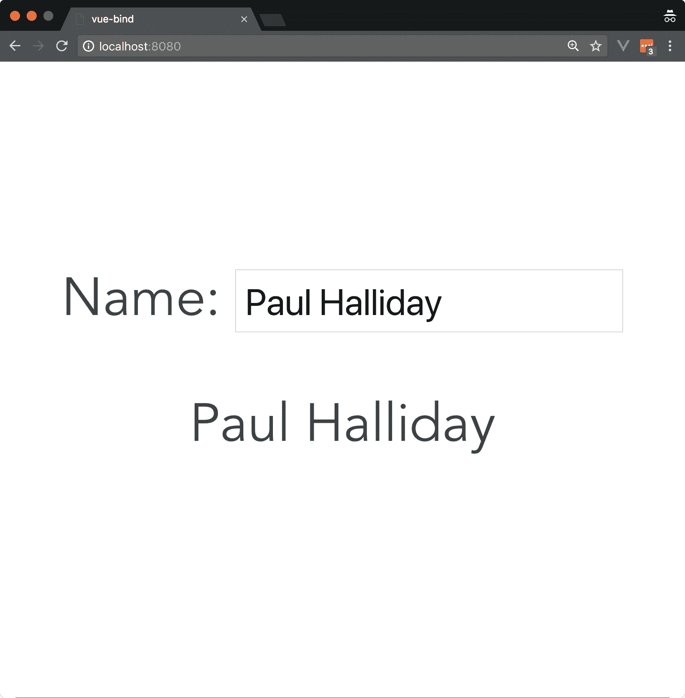
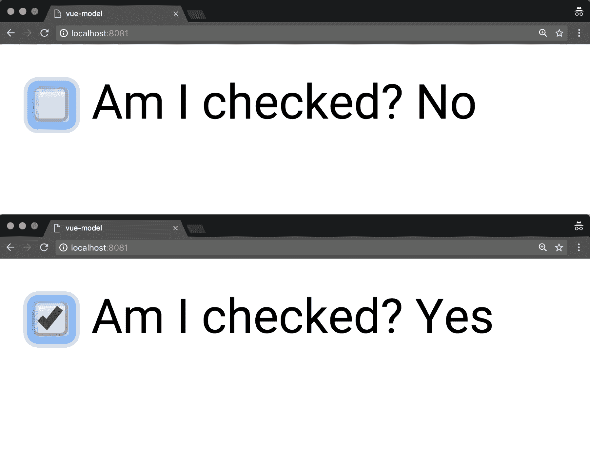
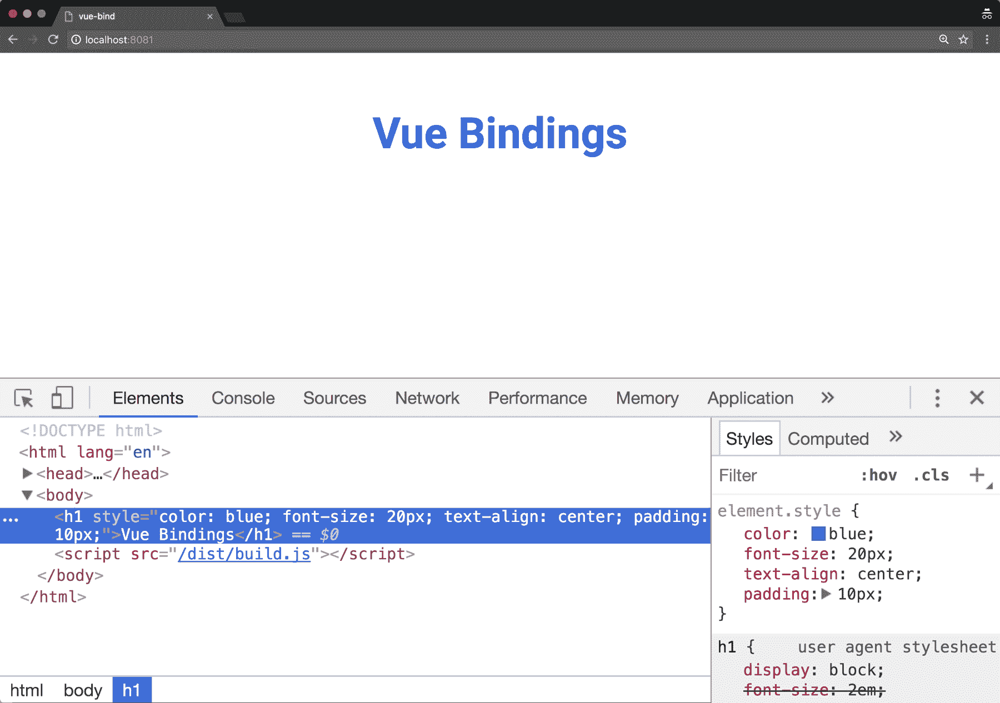
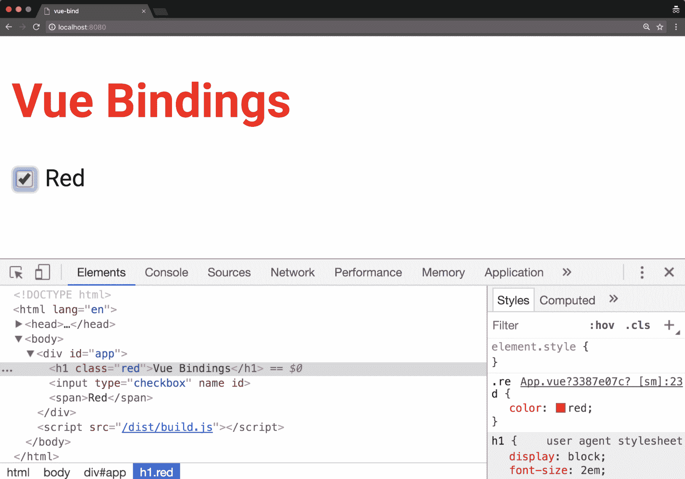
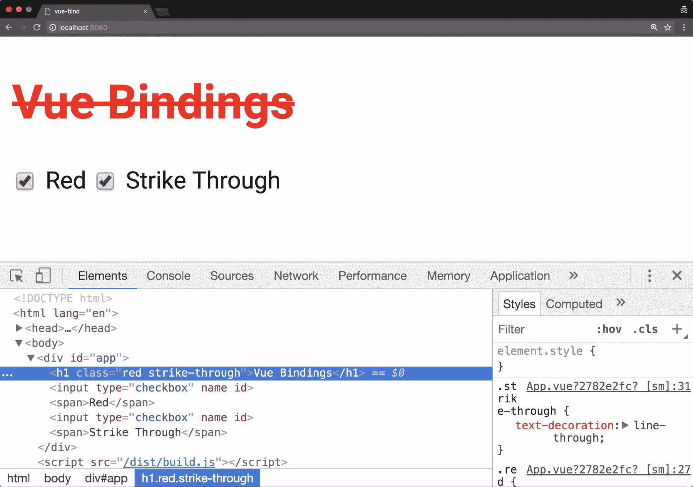
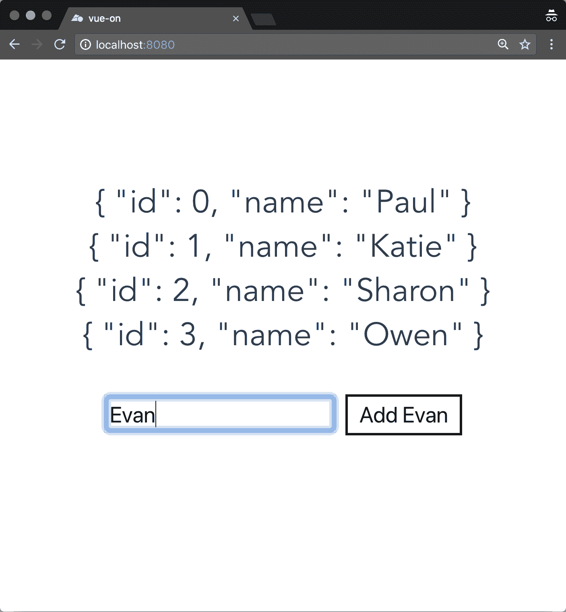
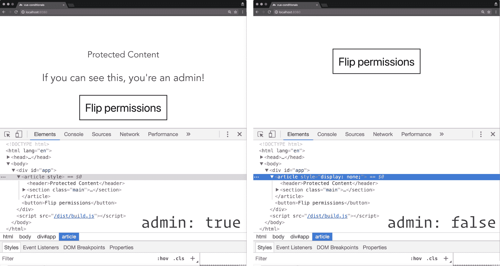
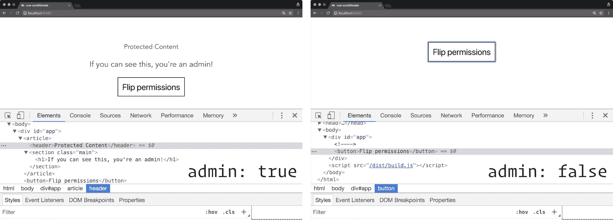
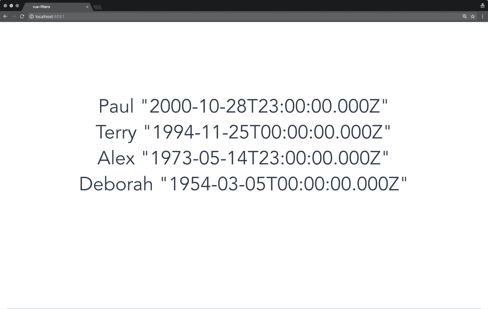
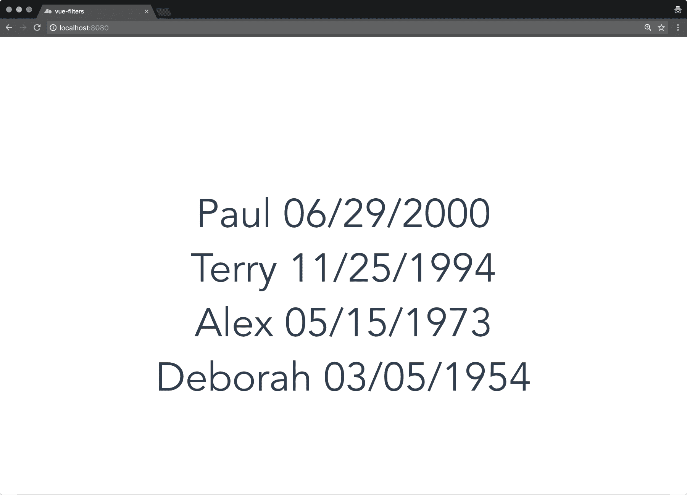

# 第四章：Vue.js 指令

在编写 Vue 应用程序时，我们可以访问各种强大的指令，这些指令允许我们塑造内容在屏幕上的呈现方式。这使我们能够通过对 HTML 模板进行添加来打造高度交互式的用户体验。本章将详细介绍这些指令，以及任何缩写和模式，使我们能够改进我们的工作流程。

在本章结束时，您将学会：

+   使用属性绑定来有条件地改变元素行为

+   研究了使用`v-model`的双向绑定

+   使用`v-if`，`v-else`和`v-if-else`有条件地显示信息

+   使用`v-for`在集合中对项目进行迭代

+   监听事件（如键盘/输入）使用`v-on`

+   使用事件修饰符来改变指令的绑定

+   使用过滤器来改变绑定的视图数据

+   看了一下我们如何可以使用简写语法来节省时间并更具有声明性

# 模型

任何业务应用程序最常见的需求之一就是文本输入。Vue 通过`v-model`指令来满足我们的需求。它允许我们在表单输入事件上创建反应式的双向数据绑定，使得处理表单变得更加容易。这是对获取表单值和输入事件的一种方便的抽象。为了探索这一点，我们可以创建一个新的 Vue 项目：

```js
# Create a new Vue project
$ vue init webpack-simple vue-model

# Navigate to directory
$ cd vue-model

# Install dependencies
$ npm install

# Run application
$ npm run dev
```

我们可以转到我们的根`App.vue`文件，从模板中删除所有内容，而是添加一个包含`label`和`form`输入的新`div`：

```js
<template>
 <div id="app">
  <label>Name:</label>
  <input type="text">
 </div>
</template>
```

这使我们能够向输入元素添加文本，即提示用户输入他们的姓名。我想捕获这个值并在姓名元素下方显示出来以进行演示。为了做到这一点，我们需要在输入元素中添加`v-model`指令；这将允许我们捕获用户输入事件并将值放入一个变量中。我们将这个变量称为`name`，并随后将其添加到我们 Vue 实例中的`data`对象中。现在值已经被捕获为一个变量，我们可以在模板中使用插值绑定来显示这个值：

```js
<template>
  <div id="app">
    <label>Name:</label>
    <input type="text" v-model="name">
    <p>{{name}}</p>
  </div>
</template>

<script>
export default {
  data () {
    return {
     name: ''
    }
  }
}
</script>
```

结果可以在以下截图中看到：



在使用`v-model`时，我们不仅限于处理文本输入，还可以在选择时捕获单选按钮或复选框。以下示例展示了这一点：

```js
 <input type="checkbox" v-model="checked">
 <span>Am I checked? {{checked ? 'Yes' : 'No' }}</span>
```

然后在我们的浏览器中显示如下：



`v-model`的好处是，它非常适应各种表单控件，让我们对 HTML 模板具有声明性的控制权。

# 使用 v-for 进行迭代

如果我们有想要重复一定次数的内容，我们可以使用`v-for`。这通常用于使用数据集填充模板。例如，假设我们有一个杂货清单，并且我们想要在屏幕上显示这个清单；我们可以使用`v-for`来做到这一点。我们可以创建一个新项目来看看它的运行情况：

```js
# Create a new Vue project
$ vue init webpack-simple vue-for

# Navigate to directory
$ cd vue-for

# Install dependencies
$ npm install

# Run application
$ npm run dev
```

首先，让我们创建一个包含杂货清单的数组，我们可以在屏幕上显示。每个项目都有`id`，`name`和`quantity`：

```js
<script>
export default {
  name: 'app',
  data () {
    return {
      groceries: [
        {
          id: 1,
          name: 'Pizza',
          quantity: 1
        },
        {
          id: 2,
          name: 'Hot Sauce',
          quantity: 5
        },
        {
          id: 3,
          name: 'Salad',
          quantity: 1
        },
        {
          id: 4,
          name: 'Water',
          quantity: 1
        },
        {
          id: 4,
          name: 'Yoghurt',
          quantity: 1
        }
      ]
    }
  }
}
</script>

<style>
#app {
  font-family: 'Avenir', Helvetica, Arial, sans-serif;
  -webkit-font-smoothing: antialiased;
  -moz-osx-font-smoothing: grayscale;
  text-align: center;
  color: #2c3e50;
  margin-top: 60px;
}

ul {
  list-style-type: none;
  padding: 0;
}

li {
  display: block;
}

</style>
```

然后，我们可以遍历我们的杂货清单中的每个项目，并修改 DOM 以在屏幕上显示它们：

```js
<template>
  <div id="app">
    <h1>Shopping List</h1>
    <ul>
      <li v-for="item in groceries" v-bind:key="item.id">
        {{item.name}}
      </li>
    </ul>
  </div>
</template>
```

请注意，我们在`li`元素上有一个`v-bind:key="item.id"`。这使得 Vue 在随时间变化的迭代中更好地工作，并且应尽可能添加一个键：


# 绑定

在这一部分，我们将看看如何在 Vue 应用程序中动态切换 CSS 类。我们将首先调查`v-bind`指令，看看如何将其应用于`class`和`style`属性。这对于根据特定业务逻辑有条件地应用样式非常有用。让我们为此示例创建一个新的 Vue 项目：

```js
# Create a new Vue project
$ vue init webpack-simple vue-bind

# Navigate to directory
$ cd vue-bind

# Install dependencies
$ npm install

# Run application
$ npm run dev
```

在我们的项目中，我们可以创建代表应用程序不同状态的复选框。我们将从一个名为`red`的开始。正如您可能推断的那样，通过检查这个复选框，我们可以将特定的文本颜色变为`red`，然后通过取消选中它将其变为黑色。

在`App.vue`中创建一个名为`red`的`data`对象，其值为`false`：

```js
<script>
export default {
 data () {
  return {
   red: false
  }
 }
}
</script>
```

这代表了我们复选框的值，我们将能够使用`v-model`指令来设置它：

```js
<template>
 <div id="app">
  <h1>Vue Bindings</h1>

  <input type="checkbox" v-model="red" >
  <span>Red</span>
 </div>
</template>
```

此时，我们可以为我们的颜色创建一个新的 CSS 类：

```js
<style>
.red {
 color: red;
}
</style>
```

正如您在浏览器中所看到的，如果我们打开开发工具，可以看到文本的颜色当前设置为`blue`：



最后，为了根据`red`变量的上下文添加/删除类，我们需要在我们的`h1`上添加`v-bind:class`指令，如下所示：

```js
<h1 v-bind:class="{ 'red': red }">Vue Bindings</h1>
```

现在在我们的浏览器中，我们可以看到我们有能力勾选框来将文本设置为`red`，就像这样：



# 添加次要属性

如果我们还想要向我们的类绑定添加另一个属性，我们需要在`data`对象中添加另一个属性（比如`strikeThrough`）：

```js
data () {
 return {
  red: false,
  strikeThrough: false
 }
}
```

然后我们可以添加另一个`checkbox`：

```js
<input type="checkbox" v-model="strikeThrough">
<span>Strike Through</span>
```

使用适当的`style`：

```js
<style>
.red {
 color: red;
}

.strike-through {
 text-decoration: line-through;
}
</style>
```

最后，我们需要调整我们的绑定以添加额外的类，就像这样：

```js
<h1 v-bind:class="{ 'red': red, 'strike-through': strikeThrough }">Vue Bindings</h1>
```

这是勾选两个框的结果：



# 样式绑定

我们可能想要向我们的标题添加各种样式，因此，我们可以使用`v-bind:style`。通过在我们的`data`对象中创建一个名为`headingStyles`的新对象，我们可以看到这个功能的实际效果：

```js
data () {
 return {
  headingStyles: {
   color: 'blue',
   fontSize: '20px',
   textAlign: 'center'
  }
 }
}
```

每当我们添加本应为 kebab-case 的 CSS 类（例如`text-align`）时，它们现在在我们的 JavaScript 中变为 camel-case（`textAlign`）。

让我们在模板中为我们的标题添加样式：

```js
<h1 v-bind:style="headingStyles">Vue Bindings</h1>
```

每当编译器看到`v-bind`或`:`时，`"`内的内容都被视为 JavaScript，具有隐式的`this`。

我们还可以将其拆分为一个单独的对象，例如添加`layoutStyles`：

```js
data () {
 return {
  headingStyles: {
   color: 'blue',
   fontSize: '20px',
  },
  layoutStyles: {
   textAlign: 'center',
   padding: '10px'
  }
 }
}
```

所以我们现在需要在`template`中的数组中添加`styles`，就像在`<h1>`标签中使用`v-bind`一样：

```js
<template>
 <h1 v-bind:style="[headingStyles, layoutStyles]">Vue Bindings</h1>
</template>
```


现在你可以在屏幕上看到我们的样式结果。请注意，数组中的任何后续项目都将优先采用首先声明的样式。

# DOM 事件和 v-on

我们可以使用`v-on`在 Vue 中处理 DOM 事件。通过监听 DOM 事件，我们能够对用户输入做出反应，从按键事件（比如点击*Enter*按钮）到按钮点击事件等等。

让我们创建一个试验项目来尝试在我们自己的项目中使用这个功能：

```js
# Create a new Vue project
$ vue init webpack-simple vue-on

# Navigate to directory
$ cd vue-on

# Install dependencies
$ npm install

# Run application
$ npm run dev
```

假设有一个`input`框，当我们点击添加按钮或按下*Enter*键时，输入将被添加到数组中：

```js
<template>
 <div id="app">
  <ul>
   <li v-for="(p, index) in person" :key="index">
    {{p}}
   </li>
  </ul>
  <input type="text" v-model="person" v-on:keyup.enter="addPerson" />
  <button v-on:click="addPerson">Add {{ person}} </button>
 </div>
</template>

<script>
export default {
 name: 'app',
 data () {
  return {
   person: '',
   people: []
  }
 },
 methods: {
  addPerson() {
   this.people = this.people.concat(
    {id: this.people.length, name: this.person}
   );
  this.person = '';
  }
 }
}
</script>
```

在将其推入之前，您必须复制对象。

这里到底发生了什么？我们使用`v-model`指令捕获了用户输入的值，然后我们监听了`keyup.enter`和`v-on:click`事件，两者都调用了`addPerson`函数，随后将`person`添加到数组中。之后，使用`v-for`指令，我们能够将这个人员列表输出到页面上：



# 按键修饰符

我们不仅仅局限于使用`enter`修饰符，我们还可以使用各种简写修饰符，例如使用@符号和缩短`v-on:event.name` `v-on：`，用@符号替换它。其他缩写方法包括：

+   `@`与`v-on：`相同

+   `@keyup.13`与`@keyup.enter`相同

+   `@key*`可以排队，例如`@keyup.ctrl.alt.delete`

其他修饰符可以在下表中看到：

| **名称** | **描述** | **代码示例** |
| --- | --- | --- |
| `.enter` | 每当按下*Enter*键时。 | `<input v-on:keyup.enter="myFunction" />` |
| `.tab` | 每当按下*Tab*键时。 | `<input v-on:keyup.tab="myFunction" />` |
| `.delete` | 每当按下*Delete*或*Backspace*键时。 | `<input v-on:keyup.delete="myFunction" />` |
| `.esc` | 每当按下*Esc*键时。 | `<input v-on:keyup.esc="myFunction" />` |
| `.up` | 每当按下上箭头键时。 | `<input v-on:keyup.up="myFunction" />` |
| `.down` | 每当按下下箭头键时。 | `<input v-on:keyup.down="myFunction" />` |
| `.left` | 每当按下左箭头键时。 | `<input v-on:keyup.left="myFunction" />` |
| `.right` | 每当按下右箭头键时。 | `<input v-on:keyup.right="myFunction" />` |

# 事件修饰符

通常在 JavaScript 中处理事件时，我们会修改事件本身的功能。这意味着我们需要在处理程序中添加`event.preventDefault()`或`event.stopPropagation()`。Vue 通过在模板中使用事件修饰符来处理这些调用，帮助我们抽象化这些调用。

这最好通过一个`form`示例来展示。让我们以前面的人员示例为例，并修改为包含一个`form`元素：

```js
<template>
  <div id="app">
    <ul>
      <li v-for="p in people" v-bind:key="p.id" >
        {{p}}
      </li>
    </ul>

    <form v-on:submit="addPerson">
      <input type="text" v-model="person" />
      <button>Add {{ person}} </button>
    </form>
  </div>
</template>
```

如果您尝试运行此示例，您会注意到当我们点击“添加”按钮时，页面会刷新。这是因为这是`form`提交事件的默认行为。由于我们此时没有向服务器 POST 数据，因此我们需要在我们的`submit`事件中添加`.prevent`修饰符：

```js
 <form v-on:submit.prevent="addPerson">
  <input type="text" v-model="person" />
  <button>Add {{ person}} </button>
 </form>
```

现在当我们选择我们的按钮时，`addPerson`函数被调用而不刷新页面。

# 有条件地显示 DOM 元素

在创建业务应用程序时，会有许多时候，您只想在某个条件为**true**或**false**时显示特定的元素。这可能包括用户的年龄，用户是否已登录，是否为管理员或您能想到的任何其他业务逻辑片段。

对于这一点，我们有各种条件指令，如`v-show`、`v-if`、`v-else`和`v-else-if`，它们都以类似但不同的方式起作用。让我们通过创建一个新的示例项目来更详细地了解这一点：

```js
# Create a new Vue project
$ vue init webpack-simple vue-conditionals

# Navigate to directory
$ cd vue-conditionals

# Install dependencies
$ npm install

# Run application
$ npm run dev
```

# v-show

如果我们想要隐藏元素但仍然在 DOM 中拥有它们（有效地`display:none`），我们可以使用`v-show`：

```js
<template>
<div id="app">
 <article v-show="admin">
  <header>Protected Content</header>
 <section class="main">
  <h1>If you can see this, you're an admin!</h1>
 </section>
</article>

 <button @click="admin = !admin">Flip permissions</button>
</div>
</template>

<script>
export default{
name: 'app',
 data (){
  return{
   admin: true
    }
  }
}
</script>
```

例如，如果我们有一个数据变量，可以确定某人是否是管理员，我们可以使用`v-show`只向适当的用户显示受保护的内容：



请注意，在前面的图中，当`admin`设置为`false`时，`display: none`样式被添加到元素中。乍一看，这似乎就是我们想要的，我们的项目已经消失了！在某些情况下，这是正确的，但在其他情况下，使用`v-if`可能更好。

`v-show`不会从 DOM 中移除元素，这意味着一切都会被初始加载，如果没有被使用，就会被隐藏起来。我们的页面将不得不渲染这些内容，如果使用不当可能会导致性能问题；因此在使用`v-show`之前要问这个问题：

我需要再次显示这个组件吗？如果是，会经常显示吗？

如果对这个问题的答案是**是**，那么在这种情况下`v-show`可能更好。否则，如果对这个问题的答案是**否**，那么在这种用例中`v-if`可能更好。

# v-if

如果我们想有条件地从 DOM 中移除元素，我们可以使用`v-if`。让我们用`v-if`替换之前的`v-show`指令：

```js
 <article v-if="admin">
  <header>Protected Content</header>
  <section class="main">
   <h1>If you can see this, you're an admin!</h1>
  </section>
 </article>
```

请注意，现在当我们查看 DOM 时，元素已完全被移除：



# v-else

在显示或隐藏元素时的常见模式是显示不同的内容。虽然我们可以多次使用`v-if`或`v-show`，但我们也可以使用`v-else`指令，它可以直接在显示或隐藏元素之后使用。

让我们更详细地了解一下这一点：

```js
<article v-if="admin">
  <header>Protected Content</header>
  <section class="main">
    <h1>If you can see this, you're an admin!</h1>
  </section>
</article>
<article v-else>
  <header>You're not an admin!</header>
  <section class="main">
    <h1>Perhaps you shouldn't be here.</h1>
  </section>
</article>
```

通过在第二个`<article>`中添加`v-else`指令，我们告诉 Vue 我们希望在第一个条件隐藏时显示这个 DOM 元素。由于这种工作方式，我们不必向`v-else`传递一个值，因为 Vue 明确地在前面的元素中寻找结构指令。

重要的是要意识到，如果在`v-if`和`v-else`指令之间有一个元素，这种方法是行不通的，比如这样： 

```js
<article v-if="admin">
  <header>Protected Content</header>
  <section class="main">
    <h1>If you can see this, you're an admin!</h1>
  </section>
</article>
<h1>The v-else will be ignored.</h1>
<article v-else>
  <header>You're not an admin!</header>
  <section class="main">
    <h1>Perhaps you shouldn't be here.</h1>
  </section>
</article>
```

# v-else-if

虽然`v-else`在标准的**IF NOT A** then **B**场景中运行良好，但您可能希望测试多个值并显示不同的模板。类似于`v-else`，我们可以使用`v-else-if`来改变应用程序的行为。在这个例子中，我们将通过使用 ES2015 引入的生成器来玩耍。

要使用生成器，我们需要安装`babel-polyfill`包；这也允许我们更好地处理`async`和`await`等内容：

```js
$ npm install babel-polyfill --save-dev
```

安装完成后，我们可以修改我们的 Webpack 配置（`webpack.config.js`）将其包含在我们的入口文件中：

```js
module.exports = {
 entry: ['babel-polyfill', './src/main.js'],
 output: {
  path: path.resolve(__dirname, './dist'),
  publicPath: '/dist/',
  filename: 'build.js',
 },
 // Omitted
```

如果我们没有安装适当的 polyfill，我们将无法在项目中使用生成器功能。让我们创建一个名为`returnRole()`的新方法，当调用时给我们三个用户中的一个“角色”：

```js
export default {
 name: 'app',
 data() {
  return {
   role: '',
  }
 },
  methods: {
   *returnRole() {
    yield 'guest';
    yield 'user';
    yield 'admin';
  }
 }
};
```

如果您以前从未见过生成器函数，您可能会想知道我们在函数名前面加上的星号（`*`）以及`yield`关键字是什么。这实质上允许我们通过捕获它的实例来逐步执行函数。例如，让我们创建一个返回迭代器的数据值，我们可以在其上调用`next()`：

```js
 data() {
  return {
   role: '',
   roleList: this.returnRole()
  }
 },
 methods: {
  getRole() {
   /**
    * Calling this.roleList.next() gives us an Iterator object with the interface of:
    * { value: string, done: boolean}
    * We can therefore check to see whether this was the >last< yielded value with done, or get the result by calling .value
    */

    this.role = this.roleList.next().value;
 },
```

因此，我们可以制作一个模板，利用`v-if-else`来根据用户角色显示不同的消息：

```js
<template>
 <div id="app">
  <article v-if="role === 'admin'">
   <header>You're an admin!</header>
   <section class="main">
    <h1>If you can see this, you're an admin!</h1>
   </section>
  </article>
  <article v-else-if="role === 'user'">
   <header>You're a user!</header>
   <section class="main">
    <h1>Enjoy your stay!</h1>
   </section>
  </article>
 <article v-else-if="role === 'guest'">
  <header>You're a guest!</header>
  <section class="main">
   <h1>Maybe you should make an account.</h1>
  </section>
 </article>
 <h1 v-else>You have no role!</h1>
 <button @click="getRole()">Switch Role</button>
 </div>
</template>
```

屏幕上显示的消息取决于用户角色。如果用户没有角色，我们使用`v-else`来显示一条消息，说明“您没有角色！”。这个例子展示了我们如何利用结构指令根据应用程序状态真正改变 DOM。

# 过滤器

在本节中，我们将研究过滤器；您可能在诸如 Angular（管道）之类的框架中遇到过过滤器。也许我们想创建一个允许我们以可读格式（DD/MM/YYYY）格式化日期的过滤器。让我们创建一个探索项目来进一步研究这个问题：

```js
# Create a new Vue project
$ vue init webpack-simple vue-filters

# Navigate to directory
$ cd vue-filters

# Install dependencies
$ npm install

# Run application
$ npm run dev
```

如果我们有一些测试人员，并使用`v-for`指令在屏幕上显示它们，我们将得到以下结果：



要获得前面截图中显示的结果，我们通过`v-for`指令显示我们的测试人员与适当的数据，我们需要添加以下代码：

```js
<template>
 <div id="app">
  <ul>
   <li v-for="person in people" v-bind:key="person.id">
    {{person.name}} {{person.dob}}
   </li>
  </ul>
 </div>
</template>

<script>
export default {
 name: 'app',
 data() {
  return {
   people: [
    {
     id: 1,
     name: 'Paul',
     dob: new Date(2000, 5, 29),
    },
    {
     id: 2,
     name: 'Terry',
     dob: new Date(1994, 10, 25),
    },
    {
     id: 3,
     name: 'Alex',
     dob: new Date(1973, 4, 15),
    },
    {
     id: 4,
     name: 'Deborah',
     dob: new Date(1954, 2, 5),
    },
   ],
  };
 },
};
</script>
```

我们可以自己做日期转换的工作，但在可能的情况下，值得寻找是否有可信赖的第三方组件可以做同样的事情。我们将使用 moment ([`momentjs.com`](https://momentjs.com)) 来实现这一点。

让我们为我们的项目安装 `moment`：

```js
$ npm install moment --save
```

然后我们可以将其添加到我们的 `App.vue` 中：

```js
<script>
import moment from 'moment';

export default {
 // Omitted
}
</script>
```

# 本地注册的过滤器

然后我们有一个选择：将过滤器添加到此 Vue 实例的本地，或者将其全局添加到整个项目中。我们首先看看如何在本地添加它：

首先，我们将创建一个函数，该函数接受一个值，并使用 `moment` 返回格式化的日期：

```js
const convertDateToString = value => moment(String(value)).format('MM/DD/YYYY');
```

然后我们可以在我们的 Vue 实例中添加一个 filters 对象，并通过一个 `key` 来引用它，比如 `date`。当我们在模板中调用 `date` 过滤器时，值将传递给这个过滤器，而我们将在屏幕上显示转换后的日期。这可以通过使用 `|` 键来实现，如下面的代码所示：

```js
 <ul>
  <li v-for="person in people" v-bind:key="person.id">
   {{person.name}} {{person.dob | date}}
  </li>
 </ul>
```

最后，要将其添加到本地 Vue 实例中，我们可以添加一个引用我们函数的 `filters` 对象：

```js
export default {
 filters: {
  date: convertDateToString,
 },
```

这样的结果显示了预期的日期：



# 全局注册的过滤器

如果我们想在其他地方使用这个过滤器，我们可以将这个函数抽象成自己的文件，并再次引用我们的过滤器，或者，我们可以在应用程序中全局注册 `date` 过滤器。让我们将我们的 `convertDateToString` 函数抽象成自己的文件，放在 `src/filters/date/date.filter.js` 中：

```js
import moment from 'moment';

export const convertDateToString = value =>
 moment(String(value)).format('MM/DD/YYYY');
```

之后，我们可以在我们的 `main.js` 中定义过滤器的接口：`Vue.filter('filterName', filterFunction())`。由于我们已经将函数抽象成了自己的文件，我们可以导入它并像这样定义它：

```js
import Vue from 'vue';
import App from './App.vue';
import { convertDateToString } from './filters/date/date.filter';

Vue.filter('date', convertDateToString);

new Vue({
 el: '#app',
 render: h => h(App),
});
```

如果您再次检查我们的应用程序，您会看到我们得到了与之前相同的结果。因此，重要的是要考虑过滤器在项目中的使用位置和次数。如果您在特定组件/实例上使用它（一次），那么应该将它放在本地；否则，将其放在全局。

# 总结

在本章中，我们看了很多 Vue 指令及其用法。这使我们有能力以声明方式改变模板在屏幕上的显示方式，包括捕获用户输入、挂接事件、过滤视图数据等等。每当您想在 Vue.js 应用程序中实现指令时，都应该将本章用作参考。

基于组件的架构是一个重要的概念，它使我们能够构建从个人到企业的可扩展项目。在下一章中，我们将看看如何创建这些可重用的组件，以封装项目中的功能部分。
