# 第五章：与 Vue.js 组件进行安全通信

在现代 Web 应用程序中，注意到组件驱动的架构并不需要花费太多精力。在短时间内，开发需求发生了变化，Web 从一个简单的文档查看器发展为承载具有显着庞大代码库的复杂应用程序。因此，能够创建可重用的组件使我们作为前端开发人员的生活变得更加轻松，因为我们可以将核心功能封装到单一块中，减少总体复杂性，实现更好的关注点分离，协作和可扩展性。

在本章中，我们将把前面的概念应用到我们的 Vue 应用程序中。在本章结束时，您将实现：

+   创建自己的 Vue 组件的能力

+   对单文件组件的更深入理解

+   创建特定于每个组件的样式的能力

+   能够在本地和全局注册组件，并理解选择其中一个的原因

+   使用 props 在父子组件之间进行通信的能力

+   使用全局事件总线在整个应用程序中进行通信的能力

+   使用插槽使您的组件更加灵活

让我们从*您的第一个 Vue 组件*开始。

# 您的第一个 Vue 组件

事实证明，我们一直在 Vue 应用程序中使用组件！使用`webpack-simple`模板，我们支持**单文件组件**（**SFC**），它本质上只是一个带有`.vue`扩展名的模板、脚本和样式标签：

```js
# Create a new Vue project
$ vue init webpack-simple vue-component-1

# Navigate to directory
$ cd vue-component-1

# Install dependencies
$ npm install

# Run application
$ npm run dev
```

由于我们正在使用 Visual Studio Code 的 Vetur 扩展，我们可以输入`scaffold`并按*Tab*键，然后创建一个可以在项目中使用的 SFC。如果我们用一个空组件覆盖`App.vue`，根据我们当前的定义，它将如下所示：

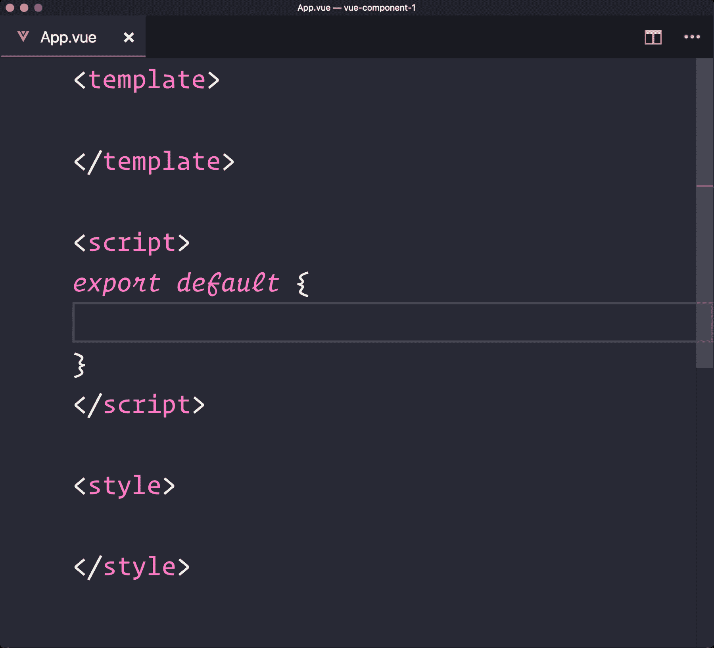

就是这样！有点。我们仍然需要向我们的组件添加一些功能，并且如果我们要创建一个新文件（即不使用默认的`App.vue`组件），则需要在某个地方注册它以供使用。让我们通过在`src/components/FancyButton.vue`下创建一个新文件来看看这个过程：

```js
<template>
 <button>
  {{buttonText}}
 </button>
</template>

<script>
export default {
 data() {
  return {
   buttonText: 'Hello World!'
  }
 }
}
</script>

<style>
 button {
  border: 1px solid black;
  padding: 10px;
 }
</style>
```

我们的`FancyButton`组件只是一个说'Hello World!'的按钮，并带有一点点样式。立即，我们需要考虑可以做些什么来使其更具可扩展性：

+   允许在此组件上输入以更改按钮文本

+   当我们为`button`元素设置样式（甚至如果我们添加了类），我们需要一种方法来阻止样式泄漏到应用程序的其他部分

+   注册此组件，以便可以在整个应用程序中全局使用

+   注册此组件，以便可以在组件内部本地使用

+   还有更多！

让我们从最简单的开始，注册组件，以便在我们的应用程序中使用。

# 全局注册组件

我们可以使用以下接口创建组件并全局注册它们：`Vue.component(name: string, options: Object<VueInstance>)`。虽然不是必需的，但在命名我们的组件时，遵循 W3C 自定义元素规范设置的命名约定很重要（[`www.w3.org/TR/custom-elements/#valid-custom-element-name`](https://www.w3.org/TR/custom-elements/#valid-custom-element-name)），即全部小写并且必须包含连字符。

在我们的`main.js`文件中，让我们首先从适当的路径导入`FancyButton`组件，然后注册它：

```js
import FancyButton from './components/FancyButton.vue';
```

之后，我们可以使用`Vue.component`注册组件，可以在`main.js`中看到加粗的结果代码如下：

```js
import Vue from 'vue';
import App from './App.vue';
import FancyButton from './components/FancyButton.vue';

Vue.component('fancy-button', FancyButton);

new Vue({
  el: '#app',
  render: h => h(App)
});
```

塔达！我们的组件现在已经全局注册了。现在...我们如何在`App.vue`组件内部使用它呢？好吧，记得我们指定的标签吗？我们只需将其添加到`template`中，如下所示：

```js
<template>
 <fancy-button/>
</template>
```

这是我们辛苦工作的结果（放大到 500%）：

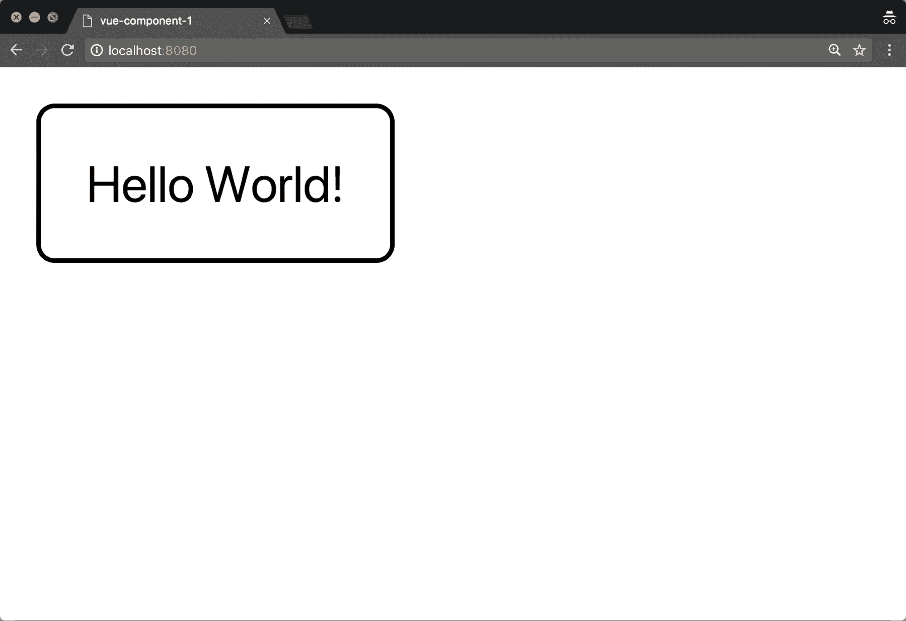

# 作用域样式

太棒了！如果我们添加另一个按钮元素会发生什么？因为我们直接用 CSS 为`button`元素设置了样式：

```js
<template>
  <div>
    <fancy-button></fancy-button>
    <button>I'm another button!</button>
  </div>
</template>
```

如果我们转到浏览器，我们可以看到我们创建的每个按钮：

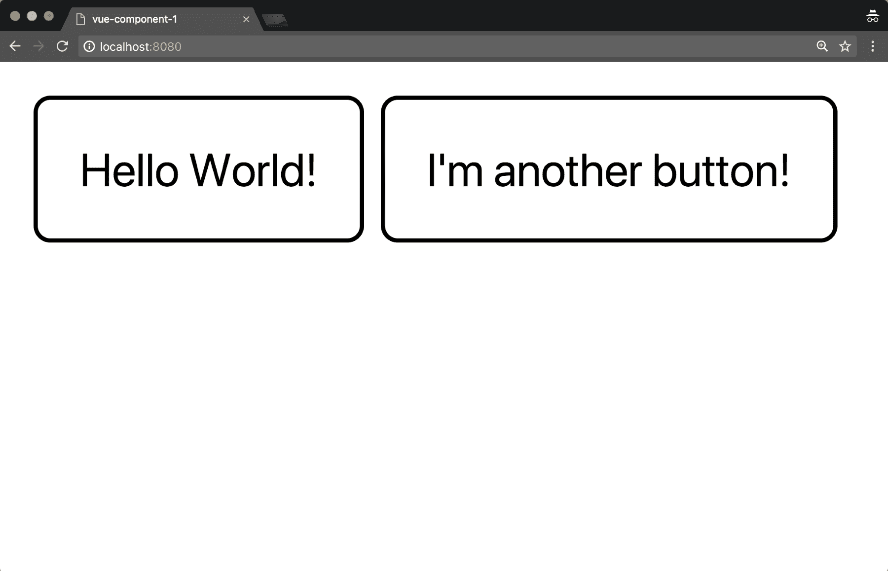

哦哦！这个其他按钮不是`fancy-button`，那么为什么它会得到样式？幸运的是，阻止样式泄漏到组件外部很简单，我们只需要在`style`标签中添加`scoped`属性：

```js
<style scoped>
 button {
 border: 1px solid black;
 padding: 10px;
 }
</style>
```

`scoped`属性不是 Vue 默认的一部分，这来自我们的 Webpack `vue-loader`。您会注意到，在添加此属性后，按钮样式仅适用于我们的`fancy-button`组件。如果我们看一下以下截图中两个按钮之间的区别，我们可以看到一个只是一个按钮，另一个是使用随机生成的数据属性为按钮设置样式。这可以阻止浏览器在这种情况下将样式应用于两个按钮元素。

在 Vue 中使用作用域 CSS 时，请记住组件内创建的规则不会在整个应用程序中全局访问：

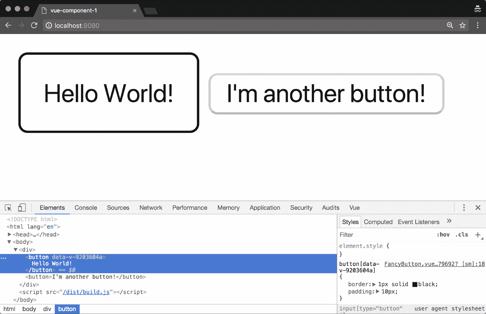

# 在本地注册组件

我们也可以在应用程序内部局部注册我们的组件。这可以通过将其添加到我们的 Vue 实例中来实现，例如，让我们将`main.js`中的全局注册注释掉，然后导航到`App.vue`：

```js
// Vue.component('fancy-button', FancyButton);
```

在将任何代码添加到我们的应用程序组件之前，请注意，我们的按钮现在已经消失，因为我们不再全局注册它。要在本地注册这个，我们需要首先导入组件，类似于之前的操作，然后将其添加到实例中的`component`对象中：

```js
<template>
 <div>
 <fancy-button></fancy-button>
 <button>I'm another button!</button>
 </div>
</template>

<script>
import FancyButton from './components/FancyButton.vue';

export default {
 components: {
 FancyButton
 }
}
</script>

<style>

</style>
```

我们的按钮现在再次出现在屏幕上。在决定注册组件的位置时，考虑它们在整个项目中可能需要被多频繁使用。

# 组件通信

现在我们有了创建可重用组件的能力，这使我们能够在项目中封装功能。为了使这些组件可用，我们需要让它们能够相互通信。我们首先要看的是组件属性的单向通信（称为“props”）。

组件通信的目的是保持我们的功能分布、松散耦合，并从而使我们的应用程序更容易扩展。为了实现松散耦合，您不应尝试在子组件中引用父组件的数据，而应仅使用`props`传递。让我们看看如何在我们的`FancyButton`上创建一个改变`button`文本的属性：

```js
<template>
 <button>
  {{buttonText}}
 </button>
</template>

<script>
export default {
 props: ['buttonText'],
}
</script>

<style scoped>
 button {
 border: 1px solid black;
 padding: 10px;
 }
</style>
```

请注意，我们能够在模板中绑定到`buttonText`值，因为我们创建了一个包含每个组件属性的字符串或对象值的`props`数组。设置这个可以通过连字符形式作为组件本身的属性，这是必需的，因为 HTML 是不区分大小写的：

```js
<template>
 <fancy-button button-text="I'm set using props!"></fancy-button>
</template>
```

这给我们带来了以下结果：

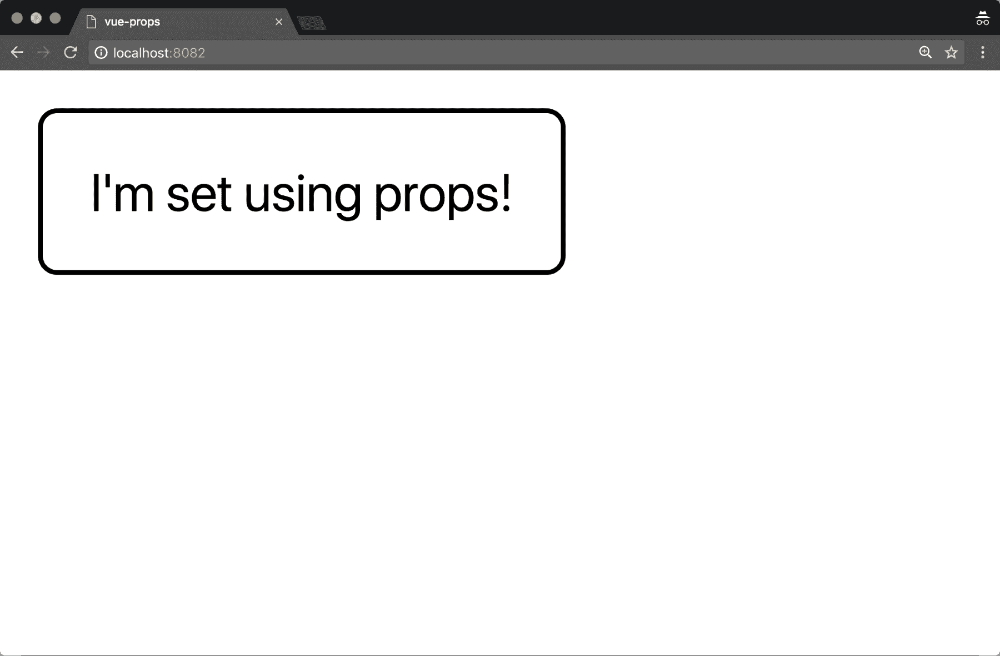

# 配置属性值

我们还可以通过将属性值设置为对象来进一步配置它们。这使我们能够定义默认值、类型、验证器等。让我们用我们的`buttonText`属性来做这个：

```js
export default {
 props: {
  buttonText: {
   type: String,
   default: "Fancy Button!",
   required: true,
   validator: value => value.length > 3
  }
 },
}
```

首先，我们确保只能将 String 类型传递到此属性中。我们还可以检查其他类型，例如：

+   数组

+   布尔值

+   函数

+   数字

+   对象

+   字符串

+   符号

根据 Web 组件的良好实践，向 props 发送原始值是一种良好的实践。

在底层，这是针对属性运行`instanceof`运算符，因此它也可以针对构造函数类型运行检查，如下面的屏幕截图所示：

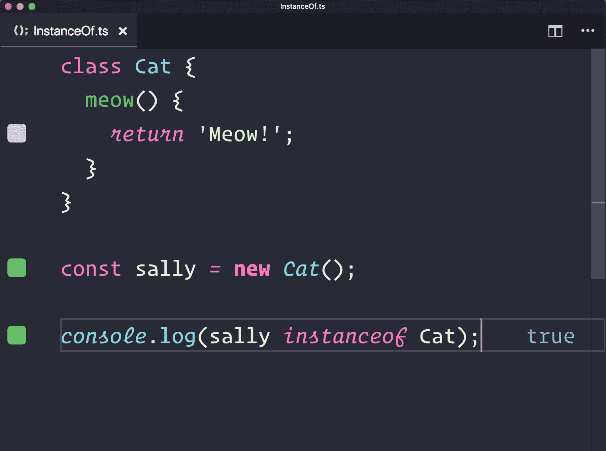

与此同时，我们还可以使用数组语法检查多种类型：

```js
export default {
 props: {
  buttonText: {
   type: [String, Number, Cat],
  }
 },
}
```

接下来，我们将默认文本设置为`FancyButton!`，这意味着默认情况下，如果未设置该属性，它将具有该值。我们还将`required`设置为`true`，这意味着每次创建`FancyButton`时，都必须包含`buttonText`属性。

目前这是一个术语上的矛盾（即默认值和必需性），但有时您可能希望在属性不是必需的情况下设置默认值。最后，我们将为此添加一个验证函数，以指定每次设置此属性时，它的字符串长度必须大于三。

我们如何知道属性验证失败了？在开发模式下，我们可以检查开发控制台，应该会有相应的错误。例如，如果我们忘记在组件上添加`buttonText`属性：

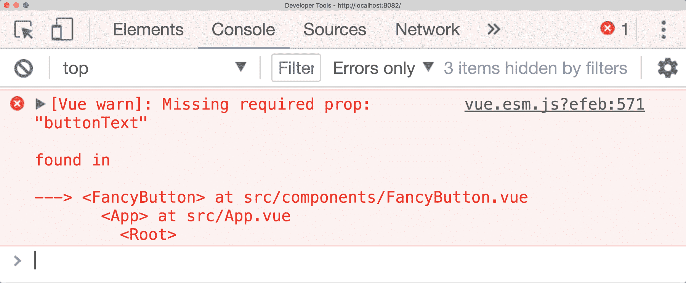

# 自定义事件

我们取得了很大的进展。我们现在有一个可以接受输入、可以全局或局部注册、具有作用域样式、验证等功能的组件。现在我们需要让它具有向其父组件发送事件的能力，以便在`FancyButton`按钮被点击时进行通信，这是通过编辑`$emit`事件的代码来实现的：

```js
<template>
 <button 
  @click.prevent="clicked">
  {{buttonText}}
 </button>
</template>

<script>
export default {
 props: {
  buttonText: {
   type: String,
   default: () => {
     return "Fancy Button!" 
   },
   required: true,
   validator: value => value.length > 3
  }
 },
 methods: {
  clicked() {
   this.$emit('buttonClicked');
  }
 }
}
</script>
```

在我们的示例中，我们将`clicked`函数附加到按钮的点击事件上，这意味着每当它被选中时，我们就会发出`buttonClicked`事件。然后我们可以在`App.vue`文件中监听此事件，将我们的元素添加到 DOM 中：

```js
<template>
  <fancy-button 
   @buttonClicked="eventListener()" 
   button-text="Click 
   me!">
  </fancy-button>
</template>

<script>
import FancyButton from './components/FancyButton.vue';

export default {
  components: {
    'fancy-button': FancyButton
  },
  methods: {
    eventListener() {
      console.log("The button was clicked from the child component!");
    }
  }
}
</script>

<style>

</style>
```

请注意，此时我们正在使用`@buttonClicked="eventListener()"`。这使用`v-on`事件在事件被触发时调用`eventListener()`函数，随后将消息记录到控制台。我们现在已经演示了在两个组件之间发送和接收事件的能力。

# 发送事件值

为了使事件系统更加强大，我们还可以将值传递给我们的另一个组件。让我们在`FancyButton`组件中添加一个输入框（也许我们需要重新命名它或考虑将输入分离成自己的组件！）：

```js
<template>
 <div>
  <input type="text" v-model="message">
  <button 
  @click.prevent="clicked()">
   {{buttonText}}
  </button>
 </div>
</template>

<script>
export default {
 data() {
  return {
   message: ''
  };
 },
 // Omitted
}
```

接下来要做的是在我们的`$emit`调用中传递消息值。我们可以在`clicked`方法中这样做：

```js
 methods: {
  clicked() {
   this.$emit('buttonClicked', this.message);
  }
 }
```

此时，我们可以将事件作为`eventListener`函数的参数来捕获：

```js
<template>
 <fancy-button @buttonClicked="eventListener($event)" button-text="Click me!"></fancy-button>
</template>
```

此时要做的最后一件事也是匹配函数的预期参数：

```js
 eventListener(message) {
  console.log(`The button was clicked from the child component with this message: ${message}`);
 }
```

然后我们应该在控制台中看到以下内容：

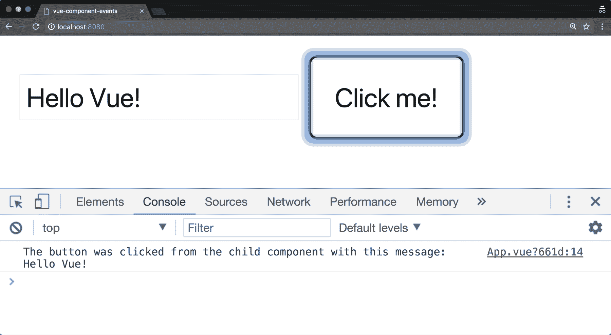

我们现在有能力在父子组件之间真正发送事件，以及我们可能想要发送的任何数据。

# 事件总线

当我们想要创建一个应用程序范围的事件系统（即，不仅限于父子组件），我们可以创建所谓的事件总线。这允许我们通过一个单一的 Vue 实例“管道”所有事件，从而实现超出父子组件通信的可能。除此之外，对于那些不想使用第三方库如`Vuex`，或者处理不多动作的小型项目来说，这也是有用的。让我们创建一个新的示例项目来演示它：

```js
# Create a new Vue project
$ vue init webpack-simple vue-event-bus

# Navigate to directory
$ cd vue-event-bus

# Install dependencies
$ npm install

# Run application
$ npm run dev
```

首先，在`src`文件夹中创建一个`EventsBus.js`。从这里，我们可以导出一个新的 Vue 实例，我们可以像以前一样使用`$emit`来发出事件：

```js
import Vue from 'vue';

export default new Vue();
```

接下来，我们可以创建两个组件，`ShoppingInput`和`ShoppingList`。这将允许我们输入新项目，并在购物清单上显示输入项目的列表，从我们的`ShoppingInput`组件开始：

```js
<template>
 <div>
  <input v-model="itemName">
  <button @click="addShoppingItem()">Add Shopping Item</button>
 </div>
</template>

<script>
import EventBus from '../EventBus';

export default {
 data() {
  return {
   itemName: ''
  }
 },
 methods: {
  addShoppingItem() {
   if(this.itemName.length > 0) {
    EventBus.$emit('addShoppingItem', this.itemName)
    this.itemName = "";
   }
  }
 },
}
</script>
```

这个组件的关键是，我们现在导入`EventBus`并使用`$emit`，而不是使用`this`，将我们的应用程序事件系统从基于组件变为基于应用程序。然后，我们可以使用`$on`来监视任何组件中的更改（以及随后的值）。让我们用下一个组件`ShoppingList`来看一下：

```js
<template>
 <div>
  <ul>
   <li v-for="item in shoppingList" :key="item">
    {{item}}
   </li>
  </ul>
 </div>
</template>

<script>
import EventBus from '../EventBus';
export default {
 props: ['shoppingList'],
 created() {
  EventBus.$on('addShoppingItem', (item) => {
   console.log(`There was an item added! ${item}`);
  })
 }
}
</script>
```

看看我们的`ShoppingList`组件，我们可以看到`$on`的使用，这允许我们监听名为`addShoppingItem`的事件（与我们发出的相同事件名称，或者您想要监听的任何其他事件）。这将返回该项，然后我们可以将其记录到控制台或在此时执行任何其他操作。

我们可以将所有这些放在我们的`App.vue`中：

```js
<template>
 <div>
  <shopping-input/>
  <shopping-list :shoppingList="shoppingList"/>
 </div>
</template>

<script>
import ShoppingInput from './components/ShoppingInput';
import ShoppingList from './components/ShoppingList';
import EventBus from './EventBus';

export default {
 components: {
  ShoppingInput,
  ShoppingList
 },
 data() {
  return {
   shoppingList: []
  }
 },
 created() {
  EventBus.$on('addShoppingItem', (itemName) => {
   this.shoppingList.push(itemName);
  })
 },
}
```

我们定义了两个组件，并在创建的生命周期钩子内监听`addShoppingItem`事件。就像以前一样，我们得到了`itemName`，然后我们可以将其添加到我们的数组中。我们可以将数组传递给另一个组件作为 prop，比如`ShoppingList`，以在屏幕上呈现。

最后，如果我们想要停止监听事件（完全或每个事件），我们可以使用`$off`。在`App.vue`内，让我们创建一个新的按钮来进一步展示这一点：

```js
<button @click="stopListening()">Stop listening</button>
```

然后我们可以这样创建`stopListening`方法：

```js
methods: {
 stopListening() {
  EventBus.$off('addShoppingItem')
 }
},
```

如果我们想要停止监听所有事件，我们可以简单地使用：

```js
EventBus.$off();
```

到目前为止，我们已经创建了一个事件系统，可以让我们与任何组件进行通信，而不受父/子关系的影响。我们可以通过`EventBus`发送事件并监听事件，从而更灵活地处理组件数据。

# 插槽

当我们组合组件时，我们应该考虑它们将如何被我们自己和团队使用。使用插槽允许我们动态地向组件添加具有不同行为的元素。让我们通过创建一个新的示例项目来看看它的作用：

```js
# Create a new Vue project
$ vue init webpack-simple vue-slots

# Navigate to directory
$ cd vue-slots

# Install dependencies
$ npm install

# Run application
$ npm run dev
```

然后，我们可以继续创建一个名为`Message`（`src/components/Message.vue`）的新组件。我们可以为这个组件添加一些特定的内容（比如下面的`h1`），以及一个`slot`标签，我们可以用它来从其他地方注入内容：

```js
<template>
 <div>
   <h1>I'm part of the Message component!</h1>
   <slot></slot>
 </div>
</template>

<script>
export default {}
</script>
```

如果我们在`App.vue`内注册了我们的组件，并将其放置在我们的模板内，我们就可以像这样在`component`标签内添加内容：

```js
<template>
 <div id="app">
   <message>
     <h2>What are you doing today?</h2>
   </message>
   <message>
     <h2>Learning about Slots in Vue.</h2>
   </message>
 </div>
</template>

<script>
import Message from './components/Message';

export default {
 components: {
  Message
 }
}
</script>
```

此时，`message`标签内的所有内容都被放置在`Message`组件内的`slot`中：

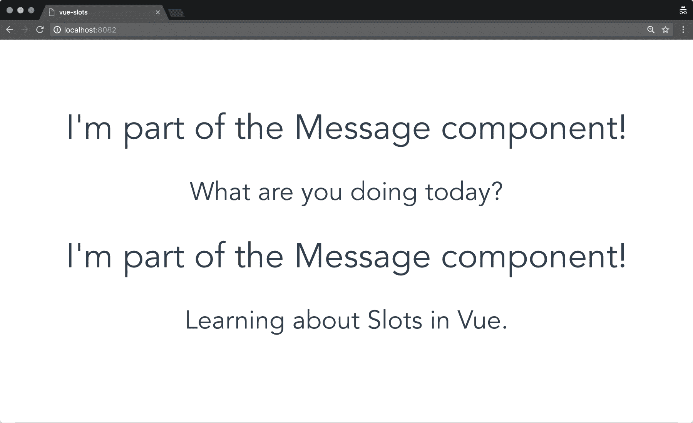

注意，每次声明`Message`组件时，我们都会看到"I'm part of the Message component!"，这表明即使我们向这个空间注入内容，我们仍然可以每次显示特定于组件的模板信息。

# 默认值

虽然我们可以向插槽中添加内容，但我们可能希望添加默认内容，以便在我们没有自己添加任何内容时显示。这意味着我们不必每次都添加内容，如果需要的话，我们可以在特定情况下覆盖它。

我们如何向我们的插槽添加默认行为？这很简单！我们只需要在`slot`标签之间添加我们的元素，就像这样：

```js
<template>
 <div>
  <h1>I'm part of the Message component!</h1>
  <slot>
   <h2>I'm a default heading that appears <em>only</em> when no slots 
   have been passed into this component</h2>
   </slot>
 </div>
</template>
```

因此，如果我们添加另一个`message`元素，但这次没有任何标记，我们会得到以下结果：

```js
<template>
 <div id="app">
  <message>
   <h2>What are you doing today?</h2>
  </message>
  <message>
   <h2>Learning about Slots in Vue.</h2>
  </message>
  <message></message>
 </div>
</template>
```

现在，如果我们转到浏览器，我们可以看到我们的消息如预期般显示：

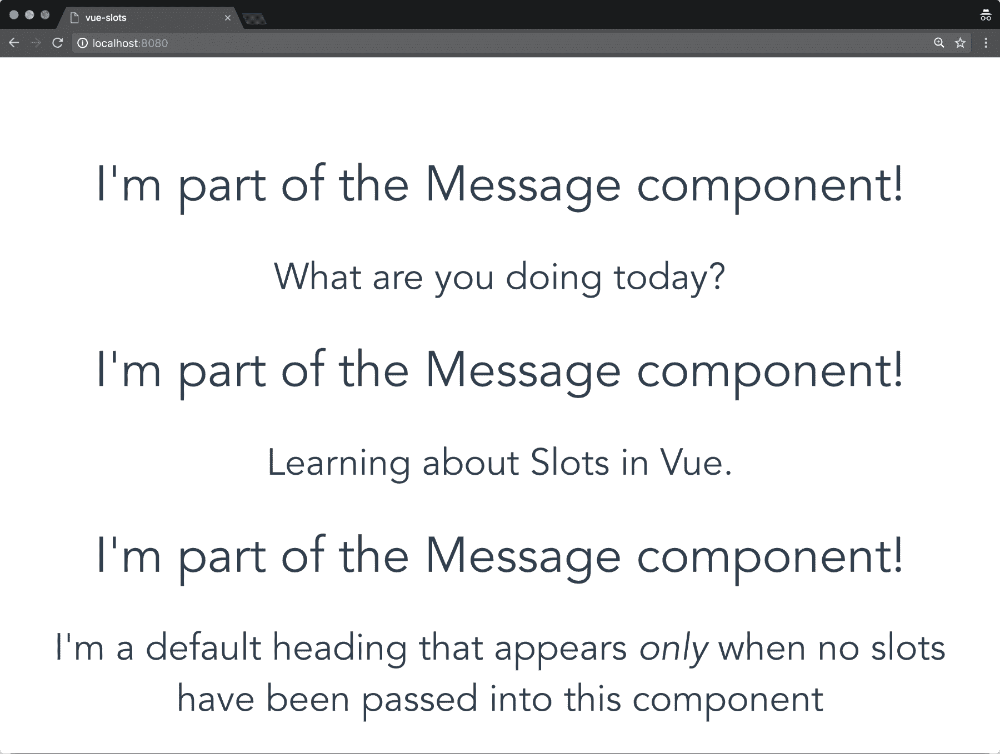

# 命名插槽

我们还可以通过命名插槽进一步进行。假设我们的`message`组件希望同时有`date`和`messageText`输入，其中一个是插槽，另一个是组件的属性。我们使用这个的情况可能是，也许我们想以不同的方式显示日期，添加不同的信息，或者根本不显示它。

我们的消息组件变成了：

```js
<template>
 <div>
  <slot name="date"></slot>
  <h1>{{messageText}}</h1>
 </div>
</template>

<script>
export default {
 props: ['messageText']
}
</script>
```

请注意我们在`slot`标签上的`name="date"`属性。这使我们能够在运行时动态地将我们的内容放在正确的位置。然后我们可以构建一个小型的聊天系统来展示这一点，让我们确保在继续之前在我们的项目中安装了`moment`：

```js
$ npm install moment --save
```

你可能还记得在第四章中使用`moment`，*Vue.js 指令*，我们还将重用之前创建的`Date`管道。让我们升级我们的`App.vue`，包含以下内容：

```js
<template>
 <div id="app">

  <input type="text" v-model="message">
  <button @click="sendMessage()">+</button>

  <message v-for="message in messageList" :message-text="message.text" :key="message">
   <h2 slot="date">{{ message.date | date }}</h2>
  </message>
 </div>
</template>

<script>
import moment from 'moment';
import Message from './components/Message';

const convertDateToString = value => moment(String(value)).format('MM/DD/YYYY');

export default {
 data() {
  return {
   message: '',
   messageList: []
  }
 },
 methods: {
  sendMessage() {
   if ( this.message.length > 0 ) {
    this.messageList.push({ date: new Date(), text: this.message });
    this.message = ""
   }
  }
 },
 components: {
  Message
 },
 filters: {
  date: convertDateToString
 }
}
</script>
```

这里发生了什么？在我们的模板中，我们正在遍历我们的`messageList`，每次添加新消息时都会创建一个新的消息组件。在组件标签内部，我们期望`messageText`会出现（因为我们将其作为 prop 传递，并且标记是在 Message 组件内部定义的），但我们还动态添加了日期使用`slot`：

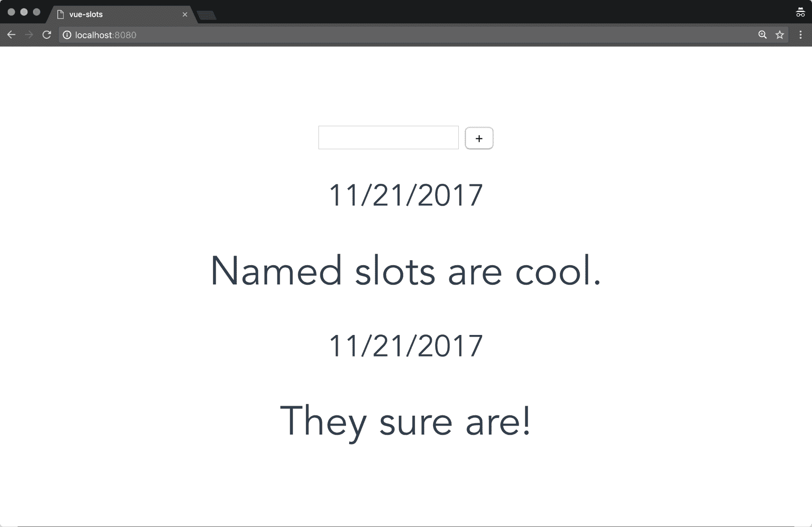

如果我们从 h2 中删除`slot="date"`会发生什么？日期还会显示吗？不会。这是因为当我们只使用命名插槽时，没有其他地方可以添加插槽。只有当我们将我们的`Message`组件更改为接受一个未命名插槽时，它才会出现，如下所示：

```js
<template>
 <div>
  <slot name="date"></slot>
  <slot></slot>
  <h1>{{messageText}}</h1>
 </div>
</template>
```

# 总结

本章使我们有能力创建可重用的组件，这些组件可以相互通信。我们已经看到了如何可以在整个项目中全局注册组件，或者在特定实例中本地注册组件，从而给我们带来了灵活性和适当的关注点分离。我们已经看到了这种强大的功能，从简单属性的添加到复杂验证和默认值的例子。

在下一章中，我们将研究如何创建**更好的 UI**。我们将更多地关注指令，比如在表单、动画和验证的上下文中使用`v-model`。
