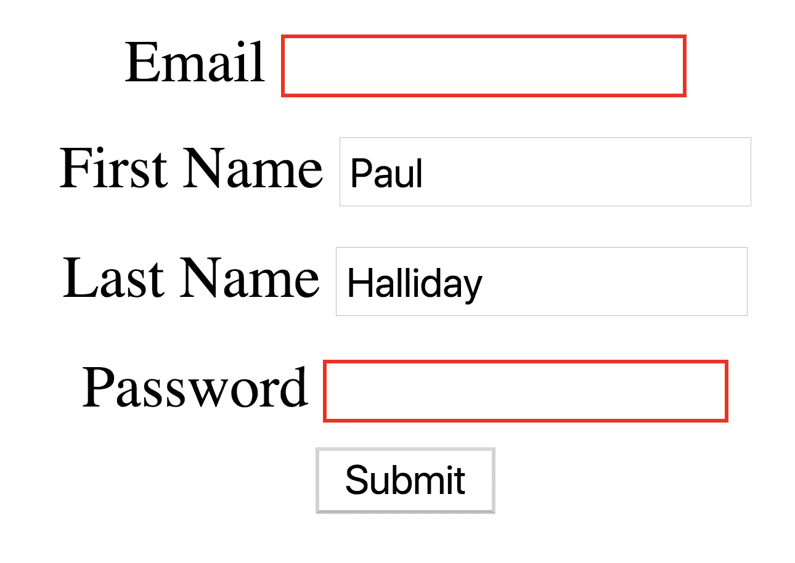
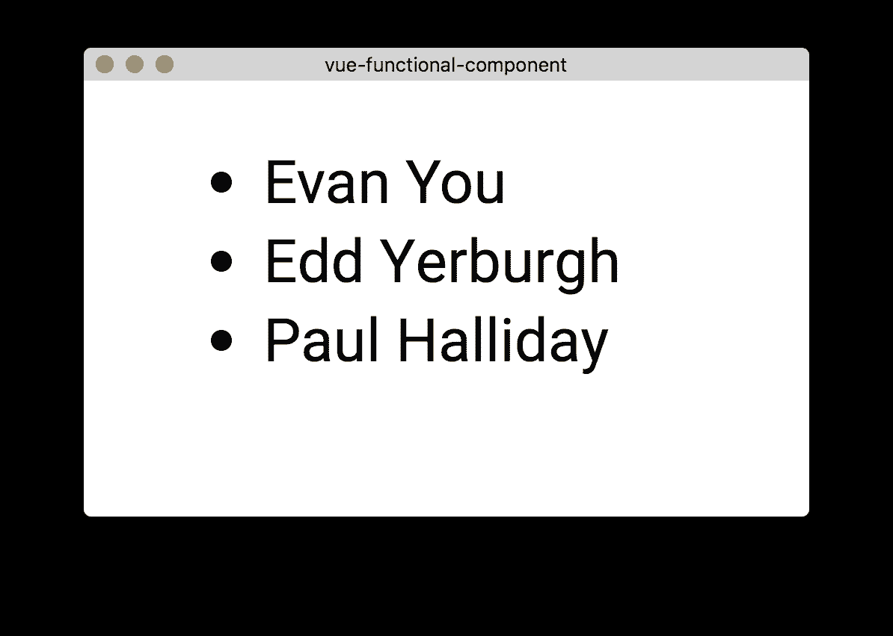

# 第六章：创建更好的 UI

过渡和动画是在我们的应用程序中创建更好用户体验的好方法。由于有很多不同的选项和用例，它们可以使应用程序的感觉得以或败。我们将在本章中进一步探讨这个概念。

我们还将使用名为`Vuelidate`的第三方库来进行表单验证。这将允许我们创建随着应用程序规模而扩展的表单。我们还将获得根据表单状态更改 UI 的能力，以及显示有用的验证消息来帮助用户。

最后，我们将看看如何使用`render`函数和 JSX 来使用 Vue 组合用户界面。虽然这并不适用于每种情况，但在某些情况下，您可能希望充分利用模板中的 JavaScript，并使用功能组件模型创建智能/表现组件。

到本章结束时，您将拥有：

+   学习了 CSS 动画

+   创建自己的 CSS 动画

+   使用`Animate.css`创建交互式 UI，工作量很小

+   调查并创建自己的 Vue 过渡

+   利用`Vuelidate`在 Vue 中验证表单

+   使用`render`函数作为模板驱动 UI 的替代方案

+   使用 JSX 来组合类似于 React 的 UI

让我们首先了解为什么我们应该关心项目中的动画和过渡。

# 动画

动画可以用来吸引特定 UI 元素的注意，并通过使其生动起来来改善用户的整体体验。当没有明确的开始状态和结束状态时，应该使用动画。动画可以自动播放，也可以由用户交互触发。

# CSS 动画

CSS 动画不仅是强大的工具，而且在项目中使用它们只需要很少的知识就可以轻松维护。

将它们添加到界面中可以是捕获用户注意力的直观方法，它们也可以用于轻松指向用户特定的元素。动画可以定制和自定义，使它们成为各种项目中许多用例的理想选择。

在深入研究 Vue 过渡和其他动画可能性之前，我们应该了解如何进行基本的 CSS3 动画。让我们创建一个更详细地查看这一点的简单项目：

```js
# Create a new Vue project
$ vue init webpack-simple vue-css-animations

# Navigate to directory
$ cd vue-css-animations

# Install dependencies
$ npm install

# Run application
$ npm run dev
```

在`App.vue`中，我们可以首先创建以下样式：

```js
<style>
button {
 background-color: transparent;
 padding: 5px;
 border: 1px solid black;
}

h1 {
 opacity: 0;
}

@keyframes fade {
 from { opacity: 0; }
 to { opacity: 1; }
}

.animated {
 animation: fade 1s;
 opacity: 1;
}
</style>
```

如您所见，没有什么特别的。我们使用`@keyframes`命名为`fade`来声明 CSS 动画，基本上给 CSS 两个我们希望元素处于的状态-`opacity: 1`和`opacity: 0`。它并没有说明这些关键帧持续多长时间或是否重复；这一切都在`animated`类中完成。我们在将类添加到元素时应用`fade`关键帧为`1`；与此同时，我们添加`opacity: 1`以确保在动画结束后它不会消失。

我们可以通过利用`v-bind:class`根据`toggle`的值动态添加/删除类来组合这些：

```js
<template>
 <div id="app">
  <h1 v-bind:class="{ animated: toggle }">I fade in!</h1>
  <button @click="toggle = !toggle">Toggle Heading</button>
 </div> 
</template>

<script>
export default {
 data () {
  return {
   toggle: false
  }
 }
}
</script>
```

很好。现在我们可以根据`Boolean`值淡入一个标题。但如果我们能做得更好呢？在这种特殊情况下，我们可以使用过渡来实现类似的结果。在更详细地查看过渡之前，让我们看看我们可以在项目中使用 CSS 动画的其他方式。

# Animate.css

`Animate.css`是一种很好的方式，可以轻松地将不同类型的动画实现到项目中。这是由 Daniel Eden 创建的开源 CSS 库([`daneden.me/`](https://daneden.me/))，它为我们提供了"即插即用"的 CSS 动画。

在将其添加到任何项目之前，前往[`daneden.github.io/animate.css/`](https://daneden.github.io/animate.css/)预览不同的动画样式。有许多不同的动画可供选择，每种都提供不同的默认动画。这些可以进一步定制，我们稍后将在本节中详细讨论。

继续运行以下命令在我们的终端中创建一个游乐项目：

```js
 Create a new Vue project
$ vue init webpack-simple vue-animate-css

# Navigate to directory
$ cd vue-animate-css

# Install dependencies
$ npm install

# Run application
$ npm run dev
```

设置项目后，继续在所选的编辑器中打开`index.html`文件。在`<head>`标签内，添加以下样式表：

```js
<link rel="stylesheet" href="https://cdnjs.cloudflare.com/ajax/libs/animate.css/3.5.2/animate.min.css">
```

这是项目中需要的样式表引用，以使`Animate.css`在项目中起作用。

# 使用 Animate.css

现在我们在项目中有了`Animate.css`，我们可以将`App.vue`更改为具有以下`template`：

```js
<template>
 <h1 class="animated fadeIn">Hello Vue!</h1>
</template>
```

在添加任何动画之前，我们首先需要添加 animated 类。接下来，我们可以从`Animate.css`库中选择任何动画；我们选择了`fadeIn`作为示例。然后可以将其替换为其他动画，如`bounceInLeft`，`shake`，`rubberBand`等等！

我们可以将之前的示例转换为基于布尔值的绑定类值，但过渡可能更有趣。

# 过渡

过渡效果是通过从一个特定状态开始，然后过渡到另一个状态并在中间插值数值来实现的。过渡不能在动画中涉及多个步骤。想象一对窗帘从打开到关闭：第一个状态将是打开的位置，而第二个状态将是关闭的位置。

Vue 有自己的标签来处理过渡，称为`<transition>`和`<transition-group>`。这些标签是可定制的，可以很容易地与 JavaScript 和 CSS 一起使用。实际上，并不一定需要有`transition`标签来使过渡生效，因为你只需将状态变量绑定到可见属性，但标签通常提供更多控制和潜在更好的结果。

让我们来看看之前的`toggle`示例，并创建一个使用`transition`的版本：

```js
<template>
 <div id="app">
  <transition name="fadeIn"
  enter-active-class="animated fadeIn"
  leave-active-class="animated fadeOut">
   <h1 v-if="toggle">I fade in and out!</h1>
  </transition>
  <button @click="toggle = !toggle">Toggle Heading</button>
 </div> 
</template>

<script>
export default {
 data () {
  return {
   toggle: false
  }
 }
}
</script>
```

让我们更详细地看看各个部分的运作方式。

我们将元素包裹在`<transition>`标签中，当`<h1>`进入 DOM 时，它会应用`animated fadeIn`的`enter-active-class`。这是通过`v-if`指令触发的，因为`toggle`变量最初设置为`false`。单击按钮会切换我们的布尔值，触发过渡并应用适当的 CSS 类。

# 过渡状态

每个进入/离开过渡都会应用最多六个类，这些类由进入场景时的过渡、过程中和离开场景时的过渡组成。第一组`(v-enter-*)`指的是最初进入然后移出的过渡，而第二组`(v-leave-*)`指的是结束过渡最初进入然后移出：

| **名称** | **描述** |
| --- | --- |
| `v-enter` | 这是进入的起始状态。在元素插入后的一帧后被移除。 |
| `v-enter-active` | `enter-active`是`enter`的活动状态。它在整个活动阶段都是活动的，并且只有在过渡或动画结束后才会被移除。该状态还管理进一步的指令，如延迟、持续时间等。 |
| `v-enter-to` | 这是进入的最后状态，在元素插入后的一帧后添加，与`v-enter`被移除的时间相同。一旦过渡/动画结束，`enter-to`就会被移除。 |
| `v-leave` | 这是离开的起始状态。一旦离开过渡被触发，就会在一帧后被移除。 |
| `v-leave-active` | `leave-active`是`leave`的活动状态。在整个离开阶段都是活动的，只有在过渡或动画结束时才会被移除。 |
| `v-leave-to` | 离开的最后状态，在离开触发后的一帧后添加，与`v-leave`同时移除。当过渡/动画结束时，`leave-to`也会被移除。 |

每个`enter`和`leave`过渡都有一个前缀，在表中显示为`v`的默认值，因为过渡本身没有名称。当将 enter 或 leave 过渡添加到项目中时，理想情况下应该应用适当的命名约定，以充当唯一标识符。如果您计划在项目中使用多个过渡，这可以帮助，并且可以通过简单的赋值操作完成：

```js
<transition name="my-transition">
```

# 表单验证

在本书中，我们已经看过了各种不同的捕获用户输入的方式，比如`v-model`。我们将使用一个名为**Vuelidate**的第三方库来根据特定规则进行模型验证。让我们通过在终端中运行以下命令来创建一个示例项目：

```js
# Create a new Vue project
$ vue init webpack-simple vue-validation

# Navigate to directory
$ cd vue-validation

# Install dependencies
$ npm install

# Install Vuelidate
$ npm install vuelidate

# Run application
$ npm run dev
```

# 什么是 Vuelidate？

`Vuelidate`是一个开源的轻量级库，帮助我们使用各种验证上下文进行模型验证。验证可以被功能组合，并且它也可以很好地与其他库（如`Moment`、`Vuex`等）配合使用。由于我们已经在项目中使用`npm install vuelidate`安装了它，现在我们需要在`main.js`中将其注册为插件。

```js
import Vue from 'vue';
import Vuelidate from 'vuelidate';
import App from './App.vue';

Vue.use(Vuelidate);

new Vue({
  el: '#app',
  validations: {},
  render: h => h(App),
});
```

将空验证对象添加到我们的主 Vue 实例中，可以在整个项目中引导 Vuelidate 的`$v`。这样我们就可以使用`$v`对象来获取关于表单当前状态的信息，跨越所有组件的 Vue 实例。

# 使用 Vuelidate

让我们创建一个基本表单，允许我们输入`firstName`、`lastName`、`email`和`password`。这将允许我们使用`Vuelidate`添加验证规则，并在屏幕上可视化它们：

```js
<template>
  <div>
    <form class="form" @submit.prevent="onSubmit">
      <div class="input">
        <label for="email">Email</label>
        <input 
        type="email" 
        id="email" 
        v-model.trim="email">
      </div>
      <div class="input"> 
        <label for="firstName">First Name</label>
        <input 
        type="text"
        id="firstName" 
        v-model.trim="firstName">
      </div>
      <div class="input">
        <label for="lastName">Last Name</label>
        <input 
        type="text" 
        id="lastName" 
        v-model.trim="lastName">
      </div>
      <div class="input">
        <label for="password">Password</label>
        <input 
        type="password" 
        id="password" 
        v-model.trim="password">
      </div>
      <button type="submit">Submit</button>
    </form>
  </div>
</template>
<script>
export default {
  data() {
    return {
      email: '',
      password: '',
      firstName: '',
      lastName: '',
    };
  },
  methods: {
    onSubmit(){
    }
  },
}
</script>
```

这里涉及很多内容，让我们一步一步来分解：

1.  我们正在创建一个新的表单，使用`@submit.prevent`指令，这样当表单提交时页面不会重新加载，这与在表单上调用 submit 并在事件上使用`preventDefault`是一样的。

1.  接下来，我们将在每个表单输入元素中添加`v-model.trim`，以便修剪任何空白并将输入捕获为变量

1.  我们在数据函数中定义这些变量，以便它们是响应式的

1.  `submit`按钮被定义为`type="submit"`，这样当点击它时，表单的`submit`函数就会运行

1.  我们正在创建一个空白的`onSubmit`函数，很快就会创建它

现在我们需要添加`@input`事件，并在每个`input`元素上调用`touch`事件，绑定到数据属性`v-model`，并为字段提供验证，如下所示：

```js
<div class="input">
  <label for="email">Email</label>
  <input 
  type="email" 
  id="email" 
  @input="$v.email.$touch()"
  v-model.trim="email">
</div>
<div class="input"> 
  <label for="firstName">First Name</label>
  <input 
  type="text"
  id="firstName" 
  v-model.trim="firstName"
  @input="$v.firstName.$touch()">
</div>
<div class="input">
  <label for="lastName">Last Name</label>
  <input 
  type="text" 
  id="lastName" 
  v-model.trim="lastName"
  @input="$v.lastName.$touch()">
</div>
<div class="input">
  <label for="password">Password</label>
  <input 
  type="password" 
  id="password" 
  v-model.trim="password"
  @input="$v.password.$touch()">
</div>
```

然后，通过从`Vuelidate`导入它们并添加与表单元素对应的`validations`对象，将验证添加到我们的 Vue 实例中。

`Vuelidate`将使用相同的名称与我们的`data`变量绑定，如下所示：

```js
import { required, email } from 'vuelidate/lib/validators';

export default {
 // Omitted
  validations: {
    email: {
      required,
      email,
    },
    firstName: {
      required,
    },
    lastName: {
      required,
    },
    password: {
      required,
    }
  },
}
```

我们只需导入所需的电子邮件验证器并将其应用于每个模型项。这基本上确保了我们所有的项目都是必需的，并且电子邮件输入与电子邮件正则表达式匹配。然后，我们可以通过添加以下内容来可视化表单和每个字段的当前状态：

```js
 <div class="validators">
  <pre>{{$v}}</pre>
 </div>
```

然后，我们可以添加一些样式来显示右侧的验证和左侧的表单：

```js
<style>
.form {
 display: inline-block;
 text-align: center;
 width: 49%;
}
.validators {
 display: inline-block;
 width: 49%;
 text-align: center;
 vertical-align: top;
}
.input {
 padding: 5px;
}
</style>
```

如果一切都按计划进行，我们应该会得到以下结果：


# 显示表单错误

我们可以使用`$invalid`布尔值来显示消息或更改表单字段的外观和感觉。让我们首先添加一个名为`error`的新类，它在输入字段周围添加了`red` `border`：

```js
<style>
input:focus {
  outline: none;
}
.error {
  border: 1px solid red;
}
</style>
```

然后，我们可以在字段无效且已触摸时有条件地应用此类，使用`v-bind:class`：

```js
<div class="input">
  <label for="email">Email</label>
  <input 
  :class="{ error: $v.email.$error }"
  type="email" 
  id="email" 
  @input="$v.email.$touch()"
  v-model.trim="email">
</div>
<div class="input"> 
  <label for="firstName">First Name</label>
  <input 
  :class="{ error: $v.firstName.$error }"
  type="text"
  id="firstName" 
  v-model.trim="firstName"
  @input="$v.firstName.$touch()">
</div>
<div class="input">
  <label for="lastName">Last Name</label>
  <input 
  :class="{ error: $v.lastName.$error}"
  type="text" 
  id="lastName" 
  v-model.trim="lastName"
  @input="$v.lastName.$touch()">
</div>
<div class="input">
  <label for="password">Password</label>
  <input 
  :class="{ error: $v.password.$error }"
  type="password" 
  id="password" 
  v-model.trim="password"
  @input="$v.password.$touch()">
</div>
```

这样，每当字段无效或有效时，我们就会得到以下结果：



随后，如果是这种情况，我们可以显示错误消息。这可以通过多种方式来完成，具体取决于您想要显示的消息类型。让我们以`email`输入为例，当`email`字段具有无效的电子邮件地址时显示错误消息：

```js
<div class="input">
  <label for="email">Email</label>
  <input 
  :class="{ error: $v.email.$error }"
  type="email" 
  id="email" 
  @input="$v.email.$touch()"
  v-model.trim="email">

  <p class="error-message" v-if="!$v.email.email">Please enter a valid email address</p>
</div>

// Omitted
<style>
.error-message {
 color: red;
}
</style>
```

从我们的`$v`对象的表示中，我们可以看到当字段具有有效的电子邮件地址时，电子邮件布尔值为 true，如果不是，则为 false。虽然这检查电子邮件是否正确，但它并不检查字段是否为空。让我们添加另一个基于`required`验证器的检查这一点的错误消息：

```js
 <p class="error-message" v-if="!$v.email.email">Please enter a valid email address.</p>
 <p class="error-message" v-if="!$v.email.required">Email must not be empty.</p>
```

如果我们愿意，甚至可以更进一步，创建自己的包装组件，用于呈现每个字段的各种错误消息。让我们填写剩下的错误消息，以及检查表单元素是否已被触摸（即`$dirty`）：

```js
<div class="input">
  <label for="email">Email</label>
  <input 
  :class="{ error: $v.email.$error }"
  type="email" 
  id="email" 
  @input="$v.email.$touch()"
  v-model.trim="email">

  <div v-if="$v.email.$dirty">
    <p class="error-message" v-if="!$v.email.email">Please enter a 
    valid email address.</p>
    <p class="error-message" v-if="!$v.email.required">Email must not 
    be empty.</p>
  </div>

</div>
<div class="input"> 
  <label for="firstName">First Name</label>
  <input 
  :class="{ error: $v.firstName.$error }"
  type="text"
  id="firstName" 
  v-model.trim="firstName"
  @input="$v.firstName.$touch()">

  <div v-if="$v.firstName.$dirty">
    <p class="error-message" v-if="!$v.firstName.required">First Name 
  must not be empty.</p>
  </div>
</div>
<div class="input">
  <label for="lastName">Last Name</label>
  <input 
  :class="{ error: $v.lastName.$error}"
  type="text" 
  id="lastName" 
  v-model.trim="lastName"
  @input="$v.lastName.$touch()">

  <div v-if="$v.lastName.$dirty">
    <p class="error-message" v-if="!$v.lastName.required">Last Name 
   must not be empty.</p>
  </div>
</div>
<div class="input">
  <label for="password">Password</label>
  <input 
  :class="{ error: $v.password.$error }"
  type="password" 
  id="password" 
  v-model.trim="password"
  @input="$v.password.$touch()">

  <div v-if="$v.password.$dirty">
    <p class="error-message" v-if="!$v.password.required">Password must 
  not be empty.</p>
  </div>
</div>
```

# 密码验证

在创建用户帐户时，密码往往会被输入两次，并符合最小长度。让我们添加另一个字段和一些更多的验证规则来强制执行这一点：

```js
import { required, email, minLength, sameAs } from 'vuelidate/lib/validators';

export default {
 // Omitted
  data() {
    return {
      email: '',
      password: '',
      repeatPassword: '',
      firstName: '',
      lastName: '',
    };
  },
  validations: {
    email: {
      required,
      email,
    },
    firstName: {
      required,
    },
    lastName: {
      required,
    },
    password: {
      required,
      minLength: minLength(6),
    },
    repeatPassword: {
      required,
      minLength: minLength(6),
      sameAsPassword: sameAs('password'),
    },
  },
}
```

我们已经完成了以下工作：

1.  将`repeatPassword`字段添加到我们的数据对象中，以便它可以保存重复的密码

1.  从`Vuelidate`导入了`minLength`和`sameAs`验证器

1.  将`password`验证器的`minLength`添加为`6`个字符

1.  添加了`sameAs`验证器来强制`repeatPassword`应遵循与`password`相同的验证规则

现在我们已经有了适当的密码验证，我们可以添加新字段并显示任何错误消息：

```js
<div class="input">
 <label for="email">Email</label>
 <input 
 :class="{ error: $v.email.$error }"
 type="email" 
 id="email" 
 @input="$v.email.$touch()"
 v-model.trim="email">

 <div v-if="$v.email.$dirty">
 <p class="error-message" v-if="!$v.email.email">Please enter a valid email address.</p>
 <p class="error-message" v-if="!$v.email.required">Email must not be empty.</p>
 </div>

</div>
<div class="input"> 
 <label for="firstName">First Name</label>
 <input 
 :class="{ error: $v.firstName.$error }"
 type="text"
 id="firstName" 
 v-model.trim="firstName"
 @input="$v.firstName.$touch()">

 <div v-if="$v.firstName.$dirty">
 <p class="error-message" v-if="!$v.firstName.required">First Name must not be empty.</p>
 </div>
</div>
<div class="input">
 <label for="lastName">Last Name</label>
 <input 
 :class="{ error: $v.lastName.$error}"
 type="text" 
 id="lastName" 
 v-model.trim="lastName"
 @input="$v.lastName.$touch()">

 <div v-if="$v.lastName.$dirty">
 <p class="error-message" v-if="!$v.lastName.required">Last Name must not be empty.</p>
 </div>
</div>
<div class="input">
 <label for="password">Password</label>
 <input 
 :class="{ error: $v.password.$error }"
 type="password" 
 id="password" 
 v-model.trim="password"
 @input="$v.password.$touch()">

 <div v-if="$v.password.$dirty">
 <p class="error-message" v-if="!$v.password.required">Password must not be empty.</p>
 </div>
</div>
<div class="input">
 <label for="repeatPassword">Repeat Password</label>
 <input 
 :class="{ error: $v.repeatPassword.$error }"
 type="password" 
 id="repeatPassword" 
 v-model.trim="repeatPassword"
 @input="$v.repeatPassword.$touch()">

 <div v-if="$v.repeatPassword.$dirty">
 <p class="error-message" v-if="!$v.repeatPassword.sameAsPassword">Passwords must be identical.</p>

 <p class="error-message" v-if="!$v.repeatPassword.required">Password must not be empty.</p>
 </div>
</div>
```

# 表单提交

接下来，如果表单无效，我们可以禁用我们的“提交”按钮：

```js
<button :disabled="$v.$invalid" type="submit">Submit</button>
```

我们还可以在 JavaScript 中使用`this.$v.$invalid`来获取此值。以下是一个示例，演示了如何检查表单是否无效，然后根据我们的表单元素创建用户对象：

```js
methods: {
  onSubmit() {
    if(!this.$v.$invalid) {
      const user = { 
        email: this.email,
        firstName: this.firstName,
        lastName: this.lastName,
        password: this.password,
        repeatPassword: this.repeatPassword
      }

      // Submit the object to an API of sorts
    }
  },
},
```

如果您希望以这种方式使用您的数据，您可能更喜欢设置您的数据对象如下：

```js
data() {
  return {
    user: {
      email: '',
      password: '',
      repeatPassword: '',
      firstName: '',
      lastName: '',
    }
  };
},
```

我们现在已经创建了一个具有适当验证的表单！

# 渲染/功能组件

我们将改变方向，从验证和动画转向考虑使用功能组件和渲染函数来提高应用程序性能。您可能也会听到它们被称为“呈现组件”，因为它们是无状态的，只接收数据作为输入属性。

到目前为止，我们只声明了组件的标记，使用了`template`标签，但也可以使用`render`函数（如`src/main.js`中所示）：

```js
import Vue from 'vue'
import App from './App.vue'

new Vue({
  el: '#app',
  render: h => h(App)
})
```

`h`来自超文本，它允许我们用 JavaScript 创建/描述 DOM 节点。在`render`函数中，我们只是渲染`App`组件，将来我们会更详细地看这个。Vue 创建了一个虚拟 DOM，使得处理实际 DOM 变得更简单（以及在处理大量元素时提高性能）。

# 渲染元素

我们可以用以下对象替换我们的`App.vue`组件，该对象接受一个`render`对象和`hyperscript`，而不是使用`template`：

```js
<script>
export default {
 render(h) {
  return h('h1', 'Hello render!')
 }
}
</script>
```

然后渲染一个带有文本节点`'Hello render!'`的新`h1`标签，这就是所谓的**VNode**（**虚拟节点**），复数形式为**VNodes**（**虚拟 DOM 节点**），它描述了整个树。现在让我们看看如何在`ul`中显示一个项目列表：

```js
  render(h){
    h('ul', [
      h('li', 'Evan You'),
      h('li', 'Edd Yerburgh'),
      h('li', 'Paul Halliday')
    ])
 }
```


重要的是要意识到，我们只能用超文本渲染一个根节点。这个限制对我们的模板也是一样的，所以我们预期将我们的项目包裹在一个`div`中，就像这样：

```js
render(h) {
 return h('div', [
  h('ul', [
   h('li', 'Evan You'),
   h('li', 'Edd Yerburgh'),
   h('li', 'Paul Halliday')
  ])
 ])
}
```

# 属性

我们还可以向我们渲染的项目传递样式元素和各种其他属性。以下是一个使用`style`对象来将每个项目的颜色更改为`red`的示例：

```js
 h('div', [
  h('ul', { style: { color: 'red' } }, [
   h('li', 'Evan You'),
   h('li', 'Edd Yerburgh'),
   h('li', 'Paul Halliday')
  ])
 ])
```

正如你可以想象的那样，我们可以添加尽可能多的`style`属性，以及我们期望的额外选项，比如`props`、`directives`、`on`（点击处理程序）等。让我们看看如何映射元素以渲染带有`props`的组件。

# 组件和 props

让我们在`components/ListItem.vue`下创建一个`ListItem`组件，其中有一个 prop，`name`。我们将在我们的`li`的位置渲染这个组件，并在包含各种`names`的数组上进行映射。请注意，我们还向我们的 Vue 实例添加了`functional: true`选项；这告诉 Vue 这纯粹是一个呈现组件，它不会有任何自己的状态：

```js
<script>
export default {
 props: ['name'],
 functional: true
}
</script>
```

在我们的`render`函数中，`h`通常也被称为`createElement`，因为我们在 JavaScript 上下文中，我们能够利用数组操作符，如`map`、`filter`、`reduce`等。让我们用`map`替换静态名称，用动态生成的组件：

```js
import ListItem from './components/ListItem.vue';

export default {
 data() {
  return {
   names: ['Evan You', 'Edd Yerburgh', 'Paul Halliday']
  }
 },
 render(createElement) {
  return createElement('div', [
   createElement('ul',
    this.names.map(name => 
     createElement(ListItem, 
      {props: { name: name } })
     ))
   ])
 }
}
```

我们需要做的最后一件事是向我们的组件添加一个`render`函数。作为第二个参数，我们能够访问上下文对象，这使我们能够访问`props`等`options`。在这个例子中，我们假设`name` prop 总是存在且不是`null`或`undefined`：

```js
export default {
 props: ['name'],
 functional: true,
 render(createElement, context) {
  return createElement('li', context.props.name)
 }
}
```

再次，我们现在有一个包含作为`prop`传递的项目的元素列表：



# JSX

虽然这是一个很好的思考练习，但在大多数情况下，模板更优越。也许有时您想在组件内部使用`render`函数，在这种情况下，使用 JSX 可能更简单。

让我们通过在终端中运行以下命令将 JSX 的 babel 插件添加到我们的项目中：

```js
**$ npm i -D babel-helper-vue-jsx-merge-props babel-plugin-syntax-jsx babel-plugin-transform-vue-jsx** 
```

然后我们可以更新我们的`.babelrc`以使用新的插件：

```js
{
 "presets": [
 ["env", { "modules": false }],
 "stage-3"
 ],
 "plugins": ["transform-vue-jsx"]
}
```

这使我们能够重写我们的`render`函数，以利用更简单的语法：

```js
render(h) {
 return (
  <div>
   <ul>
    { this.names.map(name => <ListItem name={name} />) }
   </ul>
  </div>
 )
}
```

这更具有声明性，而且更容易维护。在底层，它被转译为以前的`hyperscript`格式与 Babel 一起。

# 总结

在本章中，我们学习了如何在 Vue 项目中利用 CSS 动画和过渡。这使我们能够使用户体验更流畅，并改善我们应用程序的外观和感觉。 

我们还学习了如何使用`render`方法构建我们的 UI；这涉及使用 HyperScript 创建 VNodes，然后使用 JSX 进行更清晰的抽象。虽然您可能不想在项目中使用 JSX，但如果您来自 React 背景，您可能会觉得更舒适。
