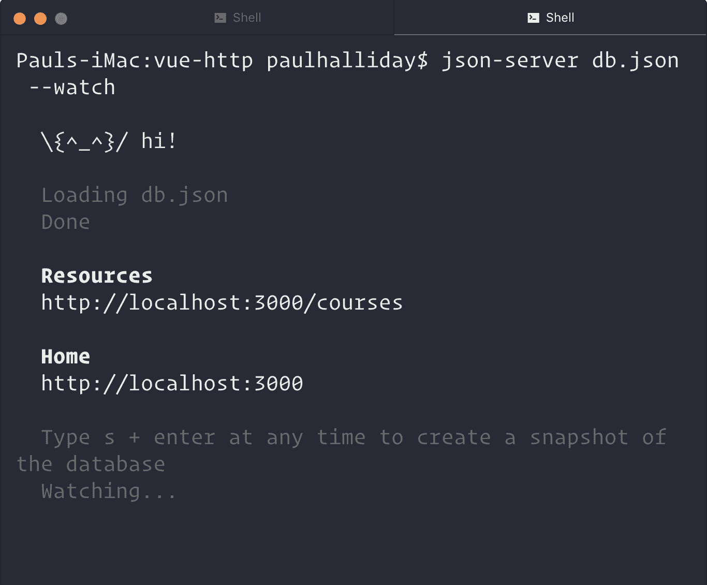
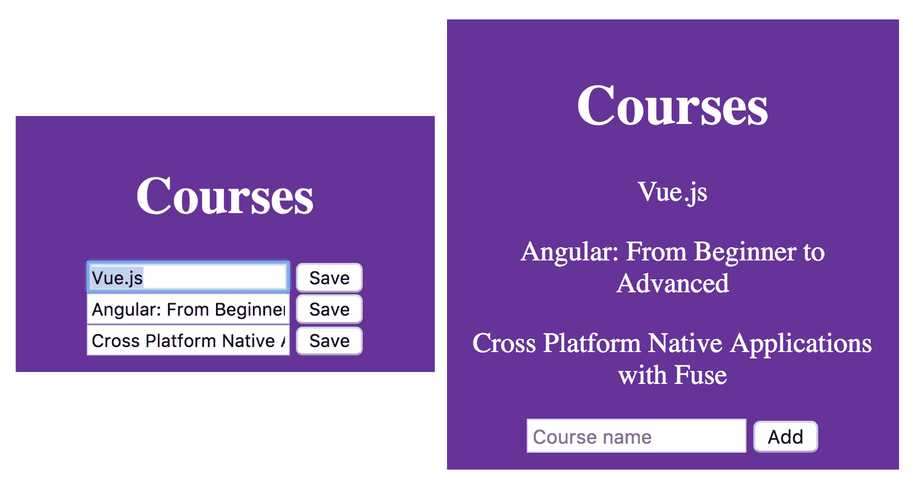
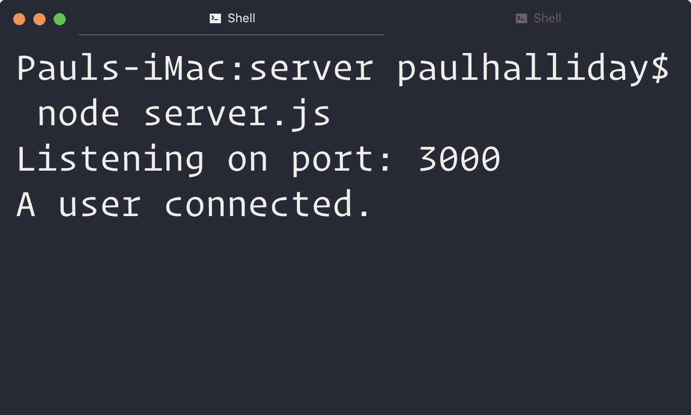
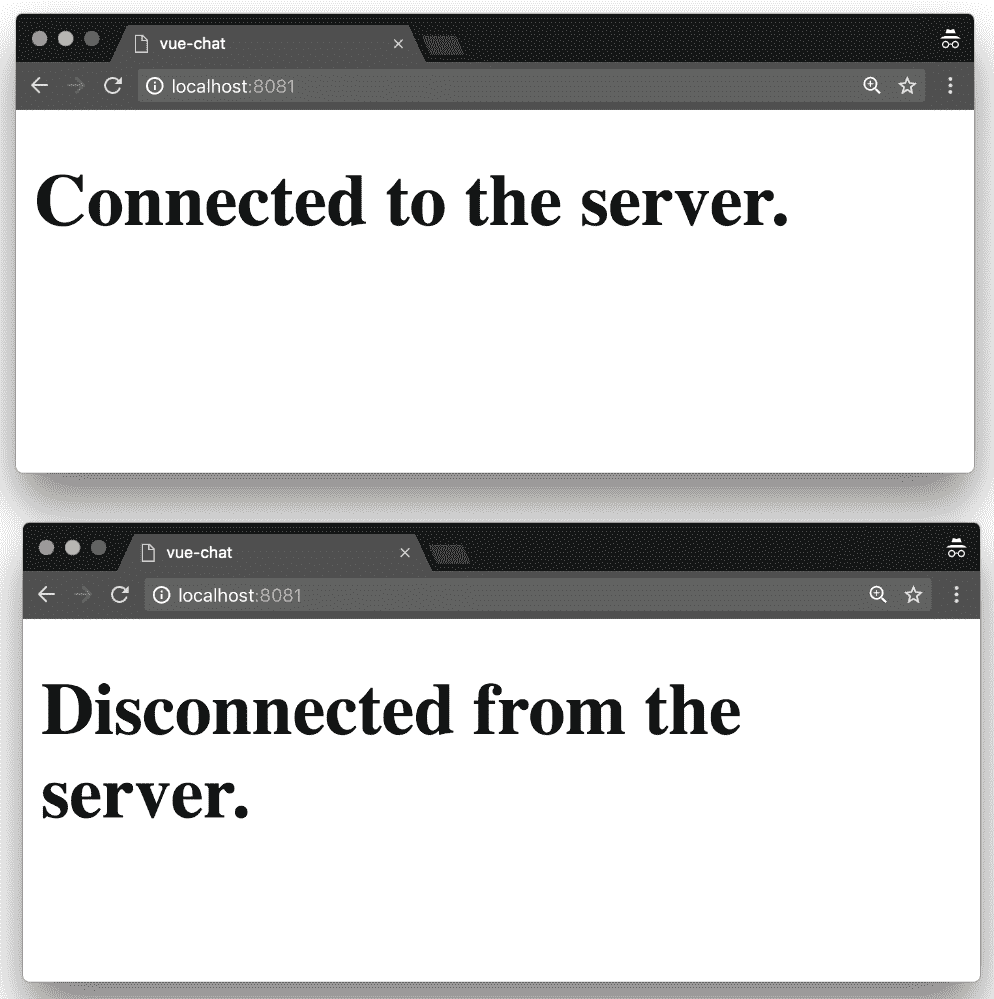
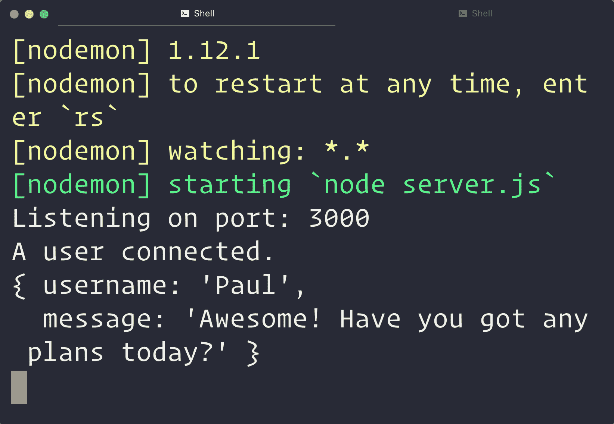
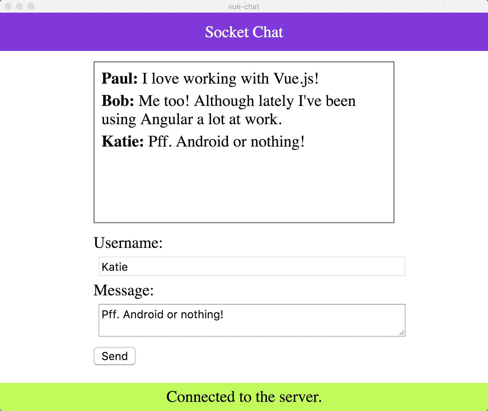

# 第七章：HTTP 和 WebSocket 通信

在本章中，我们将看看如何使用`HTTP`与服务器端 API 进行接口交互。我们将使用`HTTP GET`，`POST`，`PUT`，`PATCH`和`DELETE`创建一个应用程序，以及创建一个利用`Socket.io`库的内存实时聊天应用程序，利用 WebSockets。

在本章结束时，您将知道如何：

+   使用`json-server`创建模拟数据库 API

+   使用`Axios`创建 HTTP 请求

+   使用 WebSockets 和`Socket.io`进行客户端之间的实时通信

# HTTP

让我们首先创建一个新的 Vue.js 项目，作为我们的游乐场项目。在终端中输入以下内容：

```js
# Create a new Vue project
$ vue init webpack-simple vue-http

# Navigate to directory
$ cd vue-http
```

```js
# Install dependencies
$ npm install

# Run application
$ npm run dev
```

在 JavaScript 中有许多创建 HTTP 请求的方法。我们将使用`Axios`库在项目中使用简化的基于 promise 的方法。让我们通过在终端中输入以下内容来安装它：

```js
# Install Axios to our project
$ npm install axios --save
```

我们现在有了创建 HTTP 请求的能力；我们只需要一个 API 来指向`Axios`。让我们创建一个模拟 API。

# 安装 JSON 服务器

为了创建一个模拟 API，我们可以使用`json-server`库。这允许我们通过在项目内创建一个`db.json`文件来快速全局启动。它有效地创建了一个 GET，POST，PUT，PATCH 和 DELETE API，并将数据存储在一个文件中，附加到我们的原始 JSON 文件中。

我们可以通过在终端中运行以下命令来安装它：

```js
# Install the json-server module globally
$ npm install json-server -g
```

由于我们添加了`-g`标志，我们将能够在整个终端中全局访问`json-server`模块。

接下来，我们需要在项目的根目录下创建我们的`db.json`文件。您可以根据需要对数据集进行创意处理；我们只是简单地有一份我们可能感兴趣的课程列表：

```js
{
  "courses": [
    {
      "id": 1,
      "name": "Vue.js Design Patterns"
    },
    {
      "id": 2,
      "name": "Angular: From Beginner to Advanced"
    },
    {
      "id": 3,
      "name": "Cross Platform Native Applications with Fuse"
    }
  ]
}
```

然后我们可以通过在终端中运行以下命令来运行我们的数据库：

```js
# Run the database based on our db.json file
$ json-server db.json --watch
```

如果我们一切顺利，我们应该能够通过`http://localhost:3000`访问我们的数据库，如下成功消息所示：



太棒了。我们已经准备好了，现在我们可以获取课程列表。

# HTTP GET

我们需要做的第一件事是将`Axios`导入到我们的`App.vue`组件中。在这种情况下，我们还可以设置一个`ROOT_URL`，因为我们只会寻找`/courses`端点：

```js
<script>
import axios from 'axios'
export default {
  data() {
    return {
      ROOT_URL: 'http://localhost:3000/courses',
      courses: []
    }
  }
}
</script>
```

这样我们就能够钩入`created()`这样的生命周期钩子，并调用一个从我们的 API 请求课程的方法：

```js
export default {
  data() {
    return {
      ROOT_URL: 'http://localhost:3000/courses',
      courses: []
    }
  },
  created() {
    this.getCourseList();
  },
  methods: {
    getCourseList() {
      axios
        .get(this.ROOT_URL)
        .then(response => {
          this.courses = response.data;
        })
        .catch(error => console.log(error));
    }
  }
}
```

这里发生了什么？我们调用了`getCoursesList`函数，该函数向我们的`http://localhost:3000/courses`端点发出了 HTTP`GET`请求。然后，它要么将课程数组设置为数据（也就是说，我们的`db.json`中的所有内容），要么仅仅在出现错误时记录错误。

然后，我们可以使用`v-`指令在屏幕上显示这个：

```js
<template>
  <div class="course-list">
    <h1>Courses</h1>
    <div v-for="course in courses" v-bind:key="course.id">
      <p>
        {{course.name}}
      </p> 
    </div>
  </div>
</template>
```

再加上一点样式，我们得到：

```js
<style>
.course-list {
  background-color: rebeccapurple;
  padding: 10px;
  width: 50%;
  text-align: center;
  margin: 0 auto;
  color: white;
}
</style>
```


让我们继续进行 HTTP POST！

# HTTP POST

我们可以在`courseName` `div`后面添加一个输入框和`button`，允许用户向他们的学习列表中输入一个新的课程：

```js
<div>
 <input type="text" v-model="courseName" placeholder="Course name"> 
 <button @click="addCourse(courseName)">Add</button>
</div>
```

这要求我们将`courseName`变量添加到我们的`data`对象中：

```js
data() {
 return {
  ROOT_URL: 'http://localhost:3000/courses/',
  courses: [],
  courseName: '',
 };
},
```

然后，我们可以创建一个名为`addCourse`的类似方法，该方法以`courseName`作为参数：

```js
methods: {
// Omitted
 addCourse(name) {
  axios
   .post(this.ROOT_URL, { name })
   .then(response => {
     this.courses.push(response.data);
     this.courseName = ''; 
   })
   .catch(error => console.log(error));
 }
}
```

您可能会注意到它与之前的 HTTP 调用非常相似，但这次我们使用的是`.post`而不是`.get`，并传递了一个具有`name`键和值的对象。

发送 POST 请求后，我们使用`this.courses.push(response.data)`来更新客户端数组，因为虽然服务器端（我们的客户端`db.json`文件）已更新，但客户端状态没有更新。


# HTTP PUT

接下来，我们想要做的是能够更改列表中的项目。也许在提交项目时我们犯了一个错误，因此我们想要编辑它。让我们添加这个功能。

首先，让我们告诉 Vue 跟踪我们何时正在编辑课程。用户编辑课程的意图是每当他们点击课程名称时；然后我们可以将编辑布尔值添加到我们的`data`对象中：

```js
data() {
 return {
  ROOT_URL: 'http://localhost:3000/courses/',
  courses: [],
  courseName: '',
  editing: false,
 };
},
```

然后我们的模板可以更改以反映这一点：

```js
<template>
 <div class="course-list">
  <h1>Courses</h1>
  <div v-for="course in courses" v-bind:key="course.id">
   <p @click="setEdit(course)" v-if="!editing">
   {{course.name}}
   </p>
  <div v-else>
   <input type="text" v-model="course.name">
   <button @click="saveCourse(course)">Save</button>
  </div> 
  </div>
  <div v-if="!editing">
  <input type="text" v-model="courseName" placeholder="Course name"> 
  <button @click="addCourse(courseName)">Add</button>
  </div>
 </div>
</template>
```

这里到底发生了什么？嗯，我们已经将我们的`courseName`更改为只在我们不编辑时显示（也就是说，我们没有点击课程名称）。相反，使用`v-else`指令，我们显示一个输入框和`button`，允许我们保存新的`CourseName`。

此时，我们还隐藏了添加课程按钮，以保持简单。

代码如下所示：

```js
setEdit(course) {
 this.editing = !this.editing;
},
saveCourse(course) {
 this.setEdit();
 axios
 .put(`${this.ROOT_URL}/${course.id}`, { ...course })
 .then(response => {
 console.log(response.data);
 })
 .catch(error => console.log(error));
}
```

在这里，我们在指向所选课程的端点上使用了我们的`axios`实例上的`.put`方法。作为数据参数，我们使用了展开操作符`{ ...course }`来解构课程变量以与我们的 API 一起使用。

之后，我们只是将结果记录到控制台。当我们将"Vue.js Design Patterns"字符串编辑为简单地说`Vue.js`时，它看起来是这样的：



耶！我们要看的最后一件事是 DELETE 和从我们的数据库中删除项目。

# HTTP DELETE

为了从我们的列表中删除项目，让我们添加一个`button`，这样当用户进入编辑模式（通过点击一个项目）时，他们可以删除那个特定的课程：

```js
<div v-else>
  <input type="text" v-model="course.name">
  <button @click="saveCourse(course)">Save</button>
  <button @click="removeCourse(course)">Remove</button>
</div> 
```

我们的`removeCourse`函数如下：

```js
removeCourse(course) {
  axios
    .delete(`${this.ROOT_URL}/${course.id}`)
    .then(response => {
      this.setEdit();
      this.courses = this.courses.filter(c => c.id != course.id);
    })
    .catch(error => console.error(error));
},
```

我们调用`axios.delete`方法，然后过滤我们的`courses`列表，除了我们删除的课程之外的每个课程。然后更新我们的客户端状态，并使其与数据库一致。


在本章的这一部分中，我们根据我们的 REST API 创建了一个简单的“我想学习的课程”列表。它当然可以被抽象为多个组件，但由于这不是应用程序的核心重点，我们只是在一个组件中完成了所有操作。

接下来，让我们使用 Node 和`Socket.io`制作一个实时聊天应用程序。

# 使用 Node 和 Socket.io 制作实时聊天应用程序

在本节中，我们将使用 Node 和`Socket.io`创建一个实时聊天应用程序。我们将使用 Node.js 和 Express 框架编写少量代码，但它都是您所熟悉和喜爱的 JavaScript。

在您的终端中运行以下命令以创建一个新项目：

```js
# Create a new Vue project
$ vue init webpack-simple vue-chat

# Navigate to directory
$ cd vue-chat

# Install dependencies
$ npm install

# Run application
$ npm run dev
```

然后我们可以创建一个服务器文件夹，并初始化一个`package.json`，用于服务器特定的依赖项，如下所示：

```js
# Create a new folder named server
$ mkdir server

# Navigate to directory
$ cd server

# Make a server.js file
$ touch server.js

# Initialise a new package.json
$ npm init -y

# Install dependencies
$ npm install socket.io express --save
```

# 什么是 Socket.io？

在我们之前的例子中，如果我们想要从服务器获取新数据，我们需要发出另一个 HTTP 请求，而使用 WebSockets，我们可以简单地拥有一个一致的事件监听器，每当事件被触发时就会做出反应。

为了在我们的聊天应用程序中利用这一点，我们将使用`Socket.io`。这是一个客户端和服务器端的库，允许我们快速轻松地使用 WebSockets。它允许我们定义和提交事件，我们可以监听并随后执行操作。

# 服务器设置

然后，我们可以使用 Express 创建一个新的 HTTP 服务器，并通过在`server.js`中添加以下内容来监听应用程序连接：

```js
const app = require('express')();
const http = require('http').Server(app);
const io = require('socket.io')(http);
const PORT = 3000;

http.listen(PORT, () => console.log(`Listening on port: ${PORT}`));

io.on('connection', socket => {
  console.log('A user connected.');
});
```

如果我们在`server`文件夹内的终端中运行`node server.js`，我们应该会看到消息“Listening on port: 3000”。这意味着一旦我们在客户端应用程序中实现`Socket.io`，我们就能够监视每当有人连接到应用程序时。

# 客户端连接

为了捕获客户端连接，我们需要在 Vue 应用程序中安装`Socket.io`。我们还将使用另一个名为`vue-socket.io`的依赖项，在 Vue 应用程序中为我们提供更流畅的实现。

在终端中运行以下命令，确保你在根目录下（即不在`server`文件夹中）：

```js
# Install socket.io-client and vue-socket.io
$ npm install socket.io-client vue-socket.io --save
```

# 设置 Vue 和 Socket.io

让我们转到我们的`main.js`文件，这样我们就可以注册`Socket.io`和`Vue-Socket.io`插件。你可能还记得如何在之前的章节中做到这一点：

```js
import Vue from 'vue';
import App from './App.vue';
import SocketIo from 'socket.io-client';
import VueSocketIo from 'vue-socket.io';

export const Socket = SocketIo(`http://localhost:3000`);

Vue.use(VueSocketIo, Socket);

new Vue({
  el: '#app',
  render: h => h(App),
});
```

在上述代码块中，我们导入必要的依赖项，并创建对我们当前运行在端口`3000`上的 Socket.io 服务器的引用。然后我们使用`Vue.use`添加 Vue 插件。

如果我们做的一切都正确，我们的客户端和服务器应该在彼此交流。我们应该在终端中看到以下内容：



# 确定连接状态

现在我们已经添加了 Vue-Socket.io 插件，我们可以在 Vue 实例内部访问 sockets 对象。这使我们能够监听特定事件，并确定用户是否连接或断开 WebSocket 连接。

在`App.vue`中，让我们在屏幕上显示一条消息，如果我们与服务器连接/断开连接：

```js
<template>
  <div>
    <h1 v-if="isConnected">Connected to the server.</h1>
    <h1 v-else>Disconnected from the server.</h1>
  </div>
</template>

<script>
export default {
  data() {
    return {
      isConnected: false,
    };
  },
  sockets: {
    connect() {
      this.isConnected = true;
    },
    disconnect() {
      this.isConnected = false;
    },
  },
};
</script>
```

除了 sockets 对象之外，这里不应该有太多新的东西。每当我们连接到 socket 时，我们可以在`connect()`钩子内运行任何代码，`disconnect()`也是一样。我们只是翻转一个布尔值，以便在屏幕上显示不同的消息，使用`v-if`和`v-else`指令。

最初，我们得到了 Connected to the server，因为我们的服务器正在运行。如果我们在终端窗口中使用*CTRL* + *C*停止服务器，我们的标题将更改以反映我们不再具有 WebSocket 连接的事实。以下是结果：



# 创建连接状态栏

让我们用这个概念玩一些游戏。我们可以创建一个 components 文件夹，然后创建一个名为`ConnectionStatus.vue`的新组件。在这个文件中，我们可以创建一个状态栏，当用户在线或离线时向用户显示：

```js
<template>
  <div>
    <span v-if="isConnected === true" class="bar connected">
      Connected to the server.
    </span>
    <span v-else class="bar disconnected">
      Disconnected from the server.
    </span>
  </div>
</template>

<script>
export default {
  props: ['isConnected'],
};
</script>

<style>
.bar {
  position: absolute;
  bottom: 0;
  left: 0;
  right: 0;
  text-align: center;
  padding: 5px;
}

.connected {
  background: greenyellow;
  color: black;
}

.disconnected {
  background: red;
  color: white;
}
</style>
```

虽然我们当前应用程序中只有一个屏幕，但我们可能希望在多个组件中使用这个组件，所以我们可以在`main.js`中全局注册它：

```js
import App from './App.vue';
import ConnectionStatus from './components/ConnectionStatus.vue';

Vue.component('connection-status', ConnectionStatus);
```

然后，我们可以编辑我们的 `App.vue` 模板以使用此组件，并将当前连接状态作为 prop 传递：

```js
<template>
  <div>
    <connection-status :isConnected="isConnected" />
  </div>
</template>
```

这是我们的结果：


接下来，我们可以创建一个导航栏组件，使我们的用户界面更完整。

# 导航栏

导航栏组件除了简单显示我们应用程序的名称外，不会有太多用途。您可以更改此功能，以包括其他功能，例如登录/注销、添加新的聊天频道或任何其他特定于聊天的用户操作。

让我们在 `components` 文件夹中创建一个名为 `Navbar.vue` 的新组件：

```js
<template>
  <div v-once>
    <nav class="navbar">
      <span>Socket Chat</span>
    </nav>
  </div>
</template>

<script>
export default {};
</script>

<style>
.navbar {
  background-color: blueviolet;
  padding: 10px;
  margin: 0px;
  text-align: center;
  color: white;
}
</style>
```

您可能会注意到在这个 `div` 上添加了 `v-once` 指令。这是我们第一次看到它，但由于这个组件完全是静态的，我们可以告诉 Vue 不要监听任何更改，只渲染一次。

然后，我们必须删除 HTML body 内部的任何默认填充或边距。在根目录中创建一个名为 `styles.css` 的文件，其中包含这些属性：

```js
body {
 margin: 0px;
 padding: 0px;
}
```

然后，我们可以像这样将其添加到我们的 `index.html` 文件中：

```js
<head>
 <meta charset="utf-8">
 <title>vue-chat</title>
 <link rel="stylesheet" href="styles.css">
</head>
```

接下来，我们需要全局注册此组件。如果您觉得可以的话，请尝试在 `main.js` 中自行完成。

这要求我们导入 `Navbar` 并像这样注册它：

```js
import Navbar from './components/Navbar.vue'

Vue.component('navigation-bar', Navbar);
```

然后我们可以将其添加到我们的 `App.vue` 文件中：

```js
<template>
  <div>
    <navigation-bar />
    <connection-status :isConnected="isConnected" />
  </div>
</template>
```

接下来，让我们创建我们的 `MessageList` 组件来保存消息列表。

# 消息列表

通过创建一个接受消息数组的 prop 的新组件，我们可以在屏幕上显示消息列表。在 `components` 文件夹中创建一个名为 `MessageList.vue` 的新组件：

```js
<template>
 <div>
  <span v-for="message in messages" :key="message.id">
  <strong>{{message.username}}: </strong> {{message.message}}
  </span>
 </div>
</template>

<script>
export default {
 props: ['messages'],
};
</script>

<style scoped>
div {
 overflow: scroll;
 height: 150px;
 margin: 10px auto 10px auto;
 padding: 5px;
 border: 1px solid gray;
}
span {
 display: block;
 padding: 2px;
}
</style>
```

这个组件非常简单；它只是使用 `v-for` 指令遍历我们的 `messages` 数组。我们使用适当的 prop 将消息数组传递给这个组件。

不要将此组件全局注册，让我们在 `App.vue` 组件内部特别注册它。在这里，我们还可以向 `messages` 数组添加一些虚拟数据：

```js
import MessageList from './components/MessageList.vue';

export default {
 data() {
  return {
   isConnected: false,
   messages: [
    {
     id: 1,
     username: 'Paul',
     message: 'Hey!',
    },
    {
     id: 2,
     username: 'Evan',
     message: 'How are you?',
    },
   ],
  };
 },
 components: {
 MessageList,
},
```

然后我们可以将 `message-list` 组件添加到我们的模板中：

```js
 <div class="container">
  <message-list :messages="messages" />
 </div>
```

我们根据数据对象中找到的消息数组将消息作为 prop 传递。我们还可以添加以下样式：

```js
<style>
.container {
 width: 300px;
 margin: 0 auto;
}
</style>
```

这样做将使我们的消息框居中显示在屏幕上，并限制 `width` 以进行演示。

我们正在取得进展！这是我们的消息框：


接下来呢？嗯，我们仍然需要能够向我们的列表中添加消息的功能。让我们接下来处理这个。

# 向列表添加消息

在 components 文件夹中创建一个名为`MessageForm.vue`的新组件。这将用于将消息输入到列表中。

我们可以从以下开始：

```js
<template>
  <form @submit.prevent="sendMessage">
    <div>
      <label for="username">Username:</label>
      <input type="text" name="username" v-model="username">
    </div>
    <div>
      <label for="message">Message:</label>
      <textarea name="message" v-model="message"></textarea>
    </div>
    <button type="submit">Send</button>
  </form>
</template>

<script>
export default {
  data() {
    return {
      username: '',
      message: '',
    };
  },
};
</script>

<style>
input,
textarea {
  margin: 5px;
  width: 100%;
}
</style>

```

这本质上允许我们捕获用户对所选`username`和`message`的输入。然后我们可以使用这些信息在`sendMessage`函数中向我们的`Socket.io`服务器发送数据。

通过将`@submit.prevent`添加到我们的表单而不是`@submit`，我们确保覆盖了提交表单的默认行为；这是必要的，否则我们的页面会重新加载。

让我们去注册我们的表单在`App.vue`中，即使我们还没有连接任何操作：

```js
import MessageList from './components/MessageList.vue';

export default {
 // Omitted
 components: {
   MessageList,
   MessageForm,
 },
}
```

然后我们可以将其添加到我们的模板中：

```js
<template>
  <div>
    <navigation-bar />
    <div class="container">
      <message-list :messages="messages" />
      <message-form />
    </div>
    <connection-status :isConnected="isConnected" />
  </div>
</template>
```

现在我们的应用程序看起来是这样的：


# 使用 Socket.io 进行服务器端事件

为了发送新消息，我们可以在我们的`server.js`文件中监听名为`chatMessage`的事件。

这可以在我们的原始连接事件内完成，确保我们按 socket 逐个 socket 地监听事件：

```js
io.on('connection', socket => {
  console.log('A user connected.');

  socket.on('chatMessage', message => {
    console.log(message);
  })
});
```

如果我们从客户端发送`chatMessage`事件，那么它应该随后在我们的终端内记录出这条消息。让我们试一试！

因为我们对`server.js`文件进行了更改，所以我们需要重新启动 Node 实例。在运行`server.js`的终端窗口中按下*CTRL* + *C*，然后再次运行 node `server.js`。

# Nodemon

或者，您可能希望使用一个名为`nodemon`的模块，在进行任何更改时自动执行此操作。

在您的终端内运行以下命令：

```js
# Install nodemon globally
$ npm install nodemon -g
```

然后我们可以运行：

```js
# Listen for any changes to our server.js file and restart the server
$ nodemon server.js
```

太好了！让我们回到我们的`MessageForm`组件并创建`sendMessage`函数：

```js
methods: {
 sendMessage() {
   this.socket.emit('chatMessage', {
     username: this.username,
     message: this.message,
   });
 },
},
```


此时点击发送还没有将消息添加到数组中，但它确实在我们的终端内显示了发送的消息！让我们来看一下：



事实证明，我们不必写太多代码来利用我们的 WebSockets。让我们回到`App.vue`组件并向我们的 sockets 对象添加一个名为`chatMessage`的函数。注意这与事件名称相同，这意味着每次触发此事件时我们都可以运行特定的方法：

```js
export default {
// Omitted
 sockets: {
  connect() {
   this.isConnected = true;
  },
  disconnect() {
   this.isConnected = false;
  },
  chatMessage(messages) {
   this.messages = messages;
  },
 },
}
```

我们的客户端代码现在已经连接并监听`chatMessage`事件。问题在于我们的服务器端代码目前没有向客户端发送任何内容！让我们通过在 socket 内部发出一个事件来解决这个问题：

```js
const app = require('express')();
const http = require('http').Server(app);
const io = require('socket.io')(http);
const PORT = 3000;

http.listen(PORT, () => console.log(`Listening on port: ${PORT}`));

const messages = [];

const emitMessages = () => io.emit('chatMessage', messages);

io.on('connection', socket => {
  console.log('A user connected.');

  emitMessages(messages);

  socket.on('chatMessage', message => {
    messages.push(message);

    emitMessages(messages);
  });
});
```

我们使用一个名为 messages 的数组将消息保存在内存中。每当客户端连接到我们的应用程序时，我们也会向下游发送这些消息（所有先前的消息都将显示）。除此之外，每当数组中添加新消息时，我们也会将其发送给所有客户端。

如果我们打开两个 Chrome 标签，我们应该能够进行自我导向的对话！



然后我们可以在另一个标签页中与自己交谈！


# 总结

在本章中，我们学习了如何使用`Axios`库和`json-server`在 Vue 中创建 HTTP 请求。这使我们能够与第三方 API 进行交互，并增强我们的 Vue 应用程序。

我们还学习了如何使用 WebSockets 和`Socket.io`创建一个更大的应用程序。这使我们能够与连接到我们的应用程序的其他客户端进行实时通信，从而实现更多的可能性。

我们已经走了很长的路！为了真正利用 Vue，我们需要掌握路由器并了解高级状态管理概念。这将在接下来的章节中讨论！
