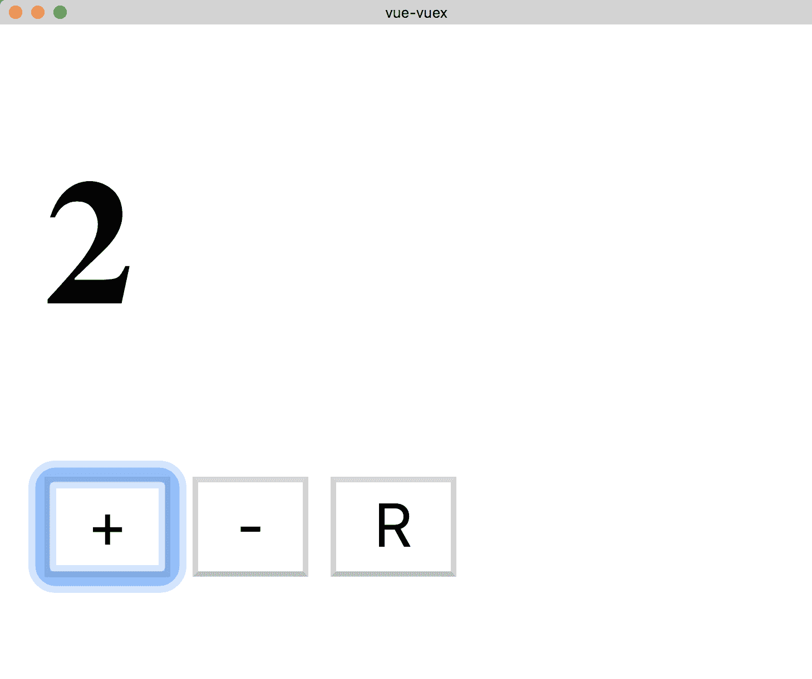

# 第九章：使用 Vuex 进行状态管理

在本章中，我们将研究使用`Vuex`的状态管理模式。`Vuex`可能并非每个应用程序都需要，但当适合使用它时，了解它的重要性以及如何实现它是非常重要的。

在本章结束时，您将完成以下工作：

+   了解了`Vuex`是什么以及为什么应该使用它

+   创建您的第一个 Vuex 存储

+   调查了 actions、mutations、getters 和 modules

+   使用 Vue devtools 逐步执行`Vuex`变化

# 什么是 Vuex？

状态管理是现代 Web 应用程序的重要组成部分，随着应用程序的增长，管理这些状态是每个项目都面临的问题。`Vuex`旨在通过强制使用集中式存储来帮助我们实现更好的状态管理，本质上是应用程序内的单一真相来源。它遵循类似于 Flux 和 Redux 的设计原则，并且还与官方 Vue devtools 集成，为出色的开发体验。

到目前为止，我已经谈到了*状态*和*状态管理*，但您可能仍然对这对于您的应用程序意味着什么感到困惑。让我们更深入地定义这些术语。

# 状态管理模式（SMP）

我们可以将状态定义为组件或应用程序中变量/对象的当前值。如果我们将我们的函数视为简单的`输入->输出`机器，那么这些函数外部存储的值构成了我们应用程序的当前状态。

注意我已经区分了**组件级**和**应用级**状态。组件级状态可以定义为限定在一个组件内的状态（即我们组件内的数据函数）。应用级状态类似，但通常用于多个组件或服务之间。

随着我们的应用程序不断增长，跨多个组件传递状态变得更加困难。我们在本书的前面看到，我们可以使用事件总线（即全局 Vue 实例）来传递数据，虽然这样可以实现，但最好将我们的状态定义为一个统一的集中存储的一部分。这使我们能够更容易地思考应用程序中的数据，因为我们可以开始定义**actions**和**mutations**，这些总是生成状态的新版本，并且管理状态变得更加系统化。

事件总线是一种简单的状态管理方法，依赖于单一视图实例，在小型 Vuex 项目中可能有益，但在大多数情况下，应该使用 Vuex。随着我们的应用变得更大，使用 Vuex 清晰地定义我们的操作和预期的副作用，使我们能够更好地管理和扩展项目。

所有这些是如何结合在一起的一个很好的例子可以在以下截图中看到（[`vuex.vuejs.org/en/intro.html`](https://vuex.vuejs.org/en/intro.html)）：

Vuex 状态流

让我们将这个例子分解成一个逐步的过程：

1.  初始**状态**在 Vue 组件内呈现。

1.  Vue 组件分派一个**Action**来从**后端 API**获取一些数据。

1.  然后触发一个**Commit**事件，由**Mutation**处理。这个**Mutation**返回一个包含来自**后端 API**的数据的新版本的状态。

1.  然后可以在 Vue **Devtools**中看到这个过程，并且您有能力在应用程序中发生的先前状态的不同版本之间“时间旅行”。

1.  然后在 Vue 组件内呈现新的**状态**。

我们 Vuex 应用程序的主要组件是存储，它是我们所有组件的单一真相来源。存储可以被读取但不能直接改变；它必须有变异函数来进行任何更改。虽然这种模式一开始可能看起来很奇怪，如果您以前从未使用过状态容器，但这种设计允许我们以一致的方式向我们的应用程序添加新功能。

由于 Vuex 是原生设计用于与 Vue 一起工作，因此存储默认是响应式的。这意味着从存储内部发生的任何更改都可以实时看到，无需任何黑客技巧。

# 思考状态

作为一个思考练习，让我们首先定义我们应用程序的目标以及任何状态、操作和潜在的变化。您现在不必将以下代码添加到您的应用程序中，所以请随意继续阅读，我们将在最后把它全部整合在一起。

让我们首先将状态视为键/值对的集合：

```js
const state = {
 count: 0 // number
}
```

对于我们的计数器应用程序，我们只需要一个状态元素——当前计数。这可能有一个默认值为`0`，类型为数字。因为这很可能是我们应用程序内唯一的状态，所以您可以考虑这个状态在这一点上是应用程序级别的。

接下来，让我们考虑用户可能想要在我们的计数器应用程序中执行的任何动作类型。

然后，这三种动作类型可以被分派到 store，因此我们可以执行以下变化，每次返回一个新的状态版本：

+   **增加**：将当前计数加一（0 -> 1）

+   **减少**：将当前计数减一（1 -> 0）

+   **重置**：将当前计数重置为零（n -> 0）

我们可以想象，此时我们的用户界面将使用正确的绑定版本更新我们的计数。让我们实现这一点，使其成为现实。

# 使用 Vuex

现在我们已经详细了解了由`Vuex`驱动的应用程序的组成部分，让我们创建一个游乐项目，以利用这些功能！

在终端中运行以下命令：

```js
# Create a new Vue project
$ vue init webpack-simple vuex-counter

# Navigate to directory
$ cd vuex-counter

# Install dependencies
$ npm install

# Install Vuex
$ npm install vuex

# Run application
$ npm run dev
```

# 创建一个新的 store

让我们首先创建一个名为`index.js`的文件，放在`src/store`内。这是我们将用来创建新 store 并整合各种组件的文件。

我们可以先导入`Vue`和`Vuex`，并告诉 Vue 我们想要使用`Vuex`插件：

```js
import Vue from 'vue';
import Vuex from 'vuex';

Vue.use(Vuex);
```

然后我们可以导出一个包含所有应用程序状态的状态对象的新`Vuex.Store`。我们导出这个对象，以便在必要时在其他组件中导入状态：

```js
export default new Vuex.Store({
  state: {
    count: 0,
  },
}); 
```

# 定义动作类型

然后我们可以在`src/store`内创建一个名为`mutation-types.js`的文件，其中包含用户可能在我们应用程序中执行的各种操作：

```js
export const INCREMENT = 'INCREMENT';
export const DECREMENT = 'DECREMENT';
export const RESET = 'RESET';
```

虽然我们不必像这样明确地定义我们的动作，但尽可能使用常量是一个好主意。这使我们能够更好地利用工具和 linting 技术，并且能够一目了然地推断整个应用程序中的动作。

# 动作

我们可以使用这些动作类型来提交一个新的动作，随后由我们的 mutations 处理。在`src/store`内创建一个名为`actions.js`的文件：

```js
import * as types from './mutation-types';

export default {
  types.INCREMENT {
    commit(types.INCREMENT);
  },
  types.DECREMENT {
    commit(types.DECREMENT);
  },
  types.RESET {
    commit(types.RESET);
  },
};
```

在每个方法内部，我们正在解构返回的`store`对象，只取`commit`函数。如果我们不这样做，我们将不得不像这样调用`commit`函数：

```js
export default {
 types.INCREMENT {
  store.commit(types.INCREMENT);
 }
}
```

如果我们重新查看我们的状态图，我们可以看到在提交一个动作后，该动作会被变化器捕捉到。

# 变化

变化是存储状态可以改变的唯一方法；这是通过提交/分派一个动作来完成的，就像之前看到的那样。让我们在`src/store`内创建一个名为`mutations.js`的新文件，并添加以下内容：

```js
import * as types from './mutation-types';

export default {
  types.INCREMENT {
    state.count++;
  },
  types.DECREMENT {
    state.count--;
  },
  types.RESET {
    state.count = 0;
  },
};
```

您会注意到，我们再次使用我们的动作类型来定义方法名；这是可能的，因为 ES2015+ 中有一个名为计算属性名的新功能。现在，每当一个动作被提交/分发时，改变器将知道如何处理这个动作并返回一个新的状态。

# 获取器

现在我们可以提交动作，并让这些动作返回状态的新版本。下一步是创建获取器，以便我们可以在整个应用程序中返回状态的切片部分。让我们在 `src/store` 中创建一个名为 `getters.js` 的新文件，并添加以下内容：

```js
export default {
  count(state) {
    return state.count;
  },
};
```

由于我们有一个微不足道的例子，为这个属性使用获取器并不是完全必要的，但是当我们扩展我们的应用程序时，我们将需要使用获取器来过滤状态。把它们想象成状态中的值的计算属性，所以如果我们想要返回这个属性的修改版本给视图层，我们可以这样做：

```js
export default {
  count(state) {
    return state.count > 3 ? 'Above three!' : state.count;
  },
};
```

# 组合元素

为了将所有这些整合在一起，我们必须重新访问我们的 `store/index.js` 文件，并添加适当的 `state`、`actions`、`getters` 和 `mutations`：

```js
import Vue from 'vue';
import Vuex from 'vuex';

import actions from './actions';
import getters from './getters';
import mutations from './mutations';

Vue.use(Vuex);

export default new Vuex.Store({
  state: {
    count: 0,
  },
  actions,
  getters,
  mutations,
});
```

在我们的 `App.vue` 中，我们可以创建一个 `template`，它将给我们当前的计数以及一些按钮来 `增加`、`减少` 和 `重置` 状态：

```js
<template>
  <div>
    <h1>{{count}}</h1>
    <button @click="increment">+</button>
    <button @click="decrement">-</button>
    <button @click="reset">R</button>
  </div>
</template>
```

每当用户点击按钮时，一个动作将从以下方法中分发：

```js
import * as types from './store/mutation-types';

export default {
  methods: {
    increment() {
      this.$store.dispatch(types.INCREMENT);
    },
    decrement() {
      this.$store.dispatch(types.DECREMENT);
    },
    reset() {
      this.$store.dispatch(types.RESET);
    },
  },
}
```

我们再次使用常量来提供更好的开发体验。接下来，为了利用我们之前创建的获取器，让我们定义一个 `computed` 属性：

```js
export default {
  // Omitted
  computed: {
    count() {
      return this.$store.getters.count;
    },
  },
}
```

然后我们就有了一个显示当前计数并可以增加、减少或重置的应用程序。



# 负载

如果我们想让用户决定要增加计数的数量怎么办？假设我们有一个文本框，我们可以在其中添加一个数字，并按照这个数字增加计数。如果文本框设置为 `0` 或为空，我们将增加计数 `1`。

因此，我们的模板将如下所示：

```js
<template>
  <div>
    <h1>{{count}}</h1>

    <input type="text" v-model="amount">

    <button @click="increment">+</button>
    <button @click="decrement">-</button>
    <button @click="reset">R</button>
  </div>
</template>
```

我们将金额值放在我们的本地组件状态上，因为这不一定需要成为主要的 Vuex 存储的一部分。这是一个重要的认识，因为这意味着如果有必要，我们仍然可以拥有本地数据/计算值。我们还可以更新我们的方法，将金额传递给我们的动作/改变器：

```js
export default {
  data() {
    return {
      amount: 0,
    };
  },
  methods: {
    increment() {
      this.$store.dispatch(types.INCREMENT, this.getAmount);
    },
    decrement() {
      this.$store.dispatch(types.DECREMENT, this.getAmount);
    },
    reset() {
      this.$store.dispatch(types.RESET);
    },
  },
  computed: {
    count() {
      return this.$store.getters.count;
    },
    getAmount() {
      return Number(this.amount) || 1;
    },
  },
};
```

然后我们需要更新`actions.js`，因为现在它接收`state`对象和我们的`amount`作为参数。当我们使用`commit`时，让我们也将`amount`传递给 mutation：

```js
import * as types from './mutation-types';

export default {
  types.INCREMENT {
    commit(types.INCREMENT, amount);
  },
  types.DECREMENT {
    commit(types.DECREMENT, amount);
  },
  types.RESET {
    commit(types.RESET);
  },
};
```

因此，我们的 mutation 看起来与以前类似，但这次我们根据数量增加/减少：

```js
export default {
  types.INCREMENT {
    state.count += amount;
  },
  types.DECREMENT {
    state.count -= amount;
  },
  types.RESET {
    state.count = 0;
  },
};
```

哒哒！现在我们可以根据文本值增加计数：

！[](assets/4061a26c-2e6b-4d07-bbd9-2a3648259a74.png)

# Vuex 和 Vue devtools

现在我们有了一种一致的通过动作与存储进行交互的方式，我们可以利用 Vue devtools 来查看我们的状态随时间的变化。如果您还没有安装 Vue devtools，请访问第二章，*Vue 项目的正确创建*，以获取更多关于此的信息。

我们将使用计数器应用程序作为示例，以确保您已经运行了此项目，并在 Chrome（或您的浏览器的等效物）中右键单击检查元素。如果我们转到 Vue 选项卡并选择 Vuex，我们可以看到计数器已加载初始应用程序状态：

！[](assets/ca392021-f7a8-4315-aa1b-cf5cf83597a1.png)

从上面的截图中，您可以看到计数状态成员以及任何 getter 的值。让我们点击几次增量按钮，看看会发生什么：

！[](assets/156c812f-8a82-40c6-92c6-4f76d75b84d2.png)

太棒了！我们可以看到 INCREMENT 动作以及状态和 getter 的后续更改，以及有关 mutation 本身的更多信息。让我们看看如何在我们的状态中进行时间旅行：

！[](assets/6af553b2-d7ed-4625-bfa0-e254c368672a.png)

在上面的截图中，我选择了第一个动作的时间旅行按钮。然后您可以看到我们的状态恢复到计数：1，这也反映在其余的元数据中。然后应用程序会更新以反映状态的更改，因此我们可以逐个步骤地查看每个动作在屏幕上的结果。这不仅有助于调试，而且我们向应用程序添加的任何新状态都将遵循相同的过程，并以这种方式可见。

让我们点击一个动作的提交按钮：

！[](assets/e644b281-6abc-4363-bd02-da43536bdea9.png)

正如您所看到的，这将合并我们点击提交时的所有动作，然后成为我们的基本状态的一部分。因此，计数属性等于您提交到基本状态的动作。

# 模块和可扩展性

目前，我们的一切都在根状态下。随着我们的应用程序变得更大，利用模块的好处将是一个不错的主意，这样我们就可以适当地将容器分割成不同的部分。让我们通过在`store`文件夹内创建一个名为`modules/count`的新文件夹，将我们的计数器状态转换为自己的模块。

然后，我们可以将`actions.js`、`getters.js`、`mutations.js`和`mutation-types.js`文件移动到计数模块文件夹中。这样做后，我们可以在文件夹内创建一个`index.js`文件，该文件仅导出此模块的`state`、`actions`、`getters`和`mutations`：

```js
import actions from './actions';
import getters from './getters';
import mutations from './mutations';

export const countStore = {
  state: {
    count: 0,
  },
  actions,
  getters,
  mutations,
};

export * from './mutation-types';
```

我还选择从`index.js`文件中导出 mutation 类型，这样我们就可以在组件内按模块使用这些类型，只需从`store/modules/count`导入。由于在此文件中导入了多个内容，我给 store 命名为`countStore`。让我们在`store/index.js`中定义新模块：

```js
import Vue from 'vue';
import Vuex from 'vuex';
import { countStore } from './modules/count';

Vue.use(Vuex);

export default new Vuex.Store({
  modules: {
    countStore,
  },
});
```

我们的`App.vue`稍作修改；我们不再引用 types 对象，而是专门从这个模块引用 types：

```js
import * as fromCount from './store/modules/count';

export default {
  data() {
    return {
      amount: 0,
    };
  },
  methods: {
    increment() {
      this.$store.dispatch(fromCount.INCREMENT, this.getAmount);
    },
    decrement() {
      this.$store.dispatch(fromCount.DECREMENT, this.getAmount);
    },
    reset() {
      this.$store.dispatch(fromCount.RESET);
    },
  },
  computed: {
    count() {
      return this.$store.getters.count;
    },
    getAmount() {
      return Number(this.amount) || 1;
    },
  },
};
```

然后，我们可以通过使用与我们的计数示例相同的文件/结构来向我们的应用程序添加更多的模块。这使我们能够在应用程序不断增长时进行扩展。

# 摘要

在本章中，我们利用了`Vuex`库来实现 Vue 中的一致状态管理。我们定义了什么是状态，以及组件状态和应用程序级状态。我们学会了如何适当地将我们的 actions、getters、mutations 和 store 分割成不同的文件以实现可扩展性，以及如何在组件内调用这些项目。

我们还研究了如何使用`Vuex`与 Vue devtools 来逐步执行应用程序中发生的 mutations。这使我们能够更好地调试/推理我们在开发应用程序时所做的决定。

在下一章中，我们将学习如何测试我们的 Vue 应用程序以及如何让我们的测试驱动我们的组件设计。
