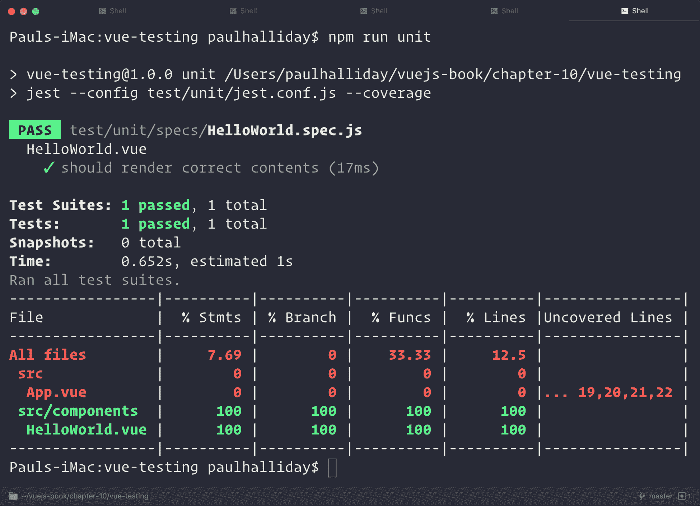
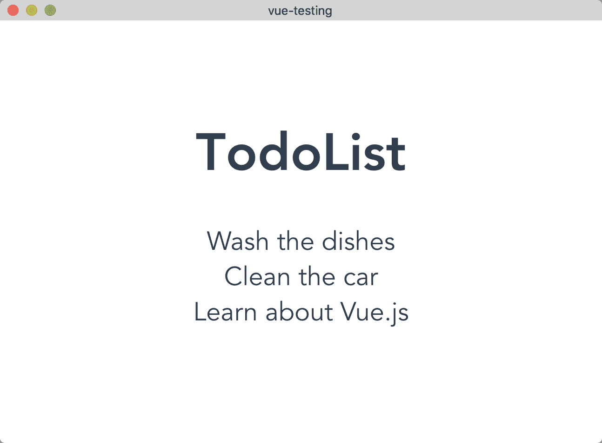
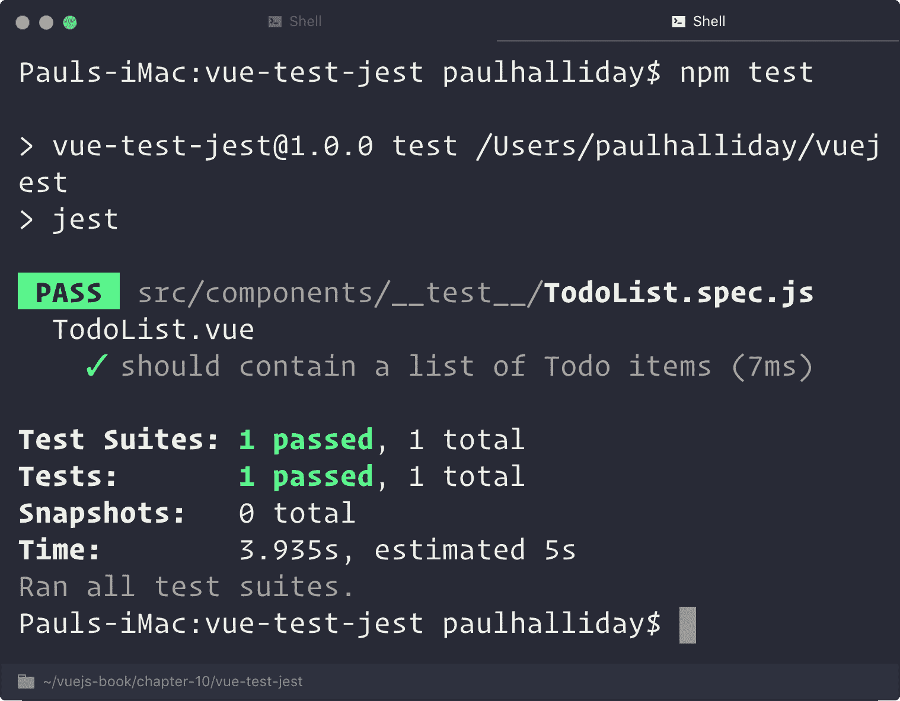
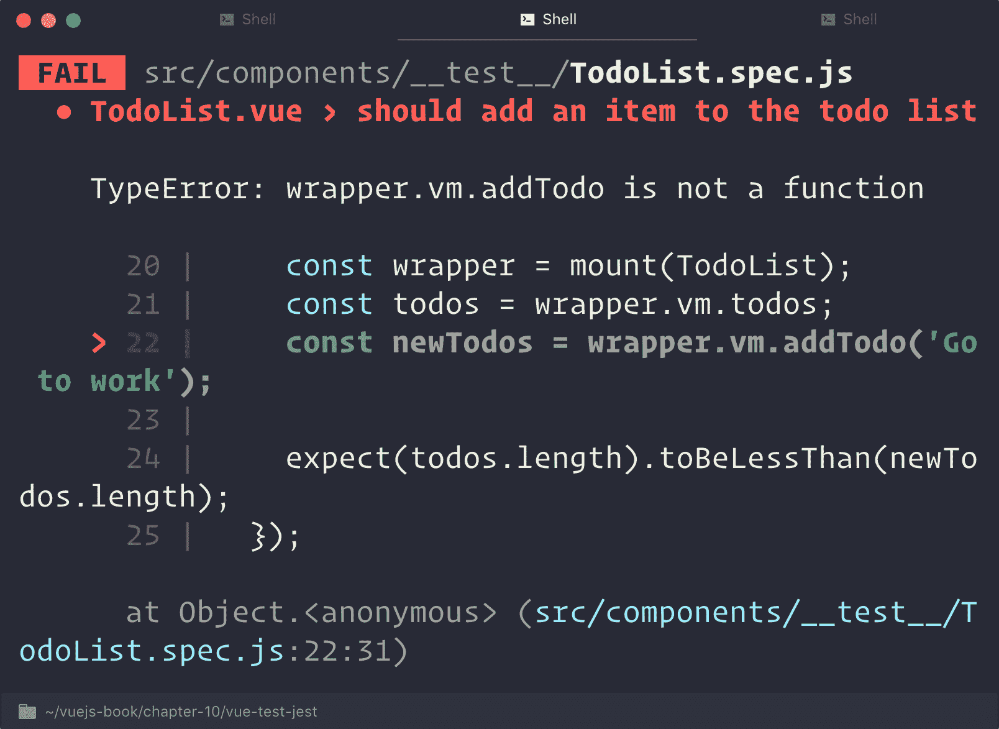
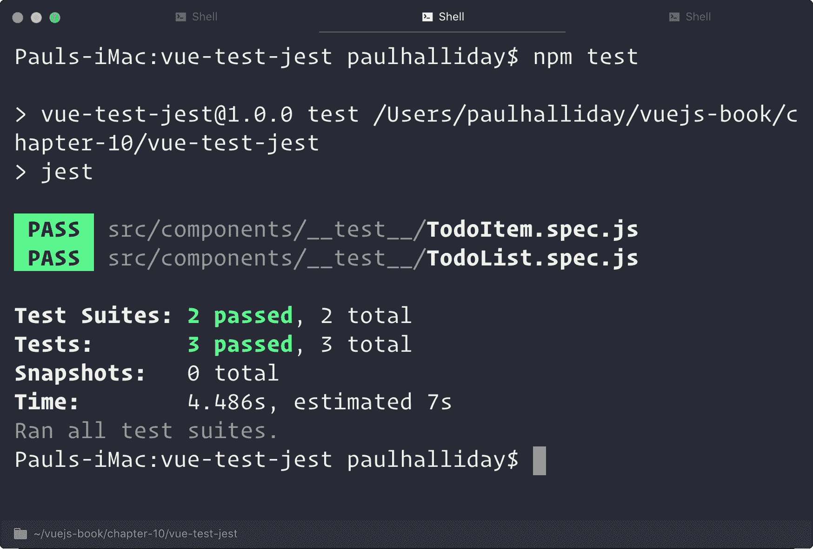
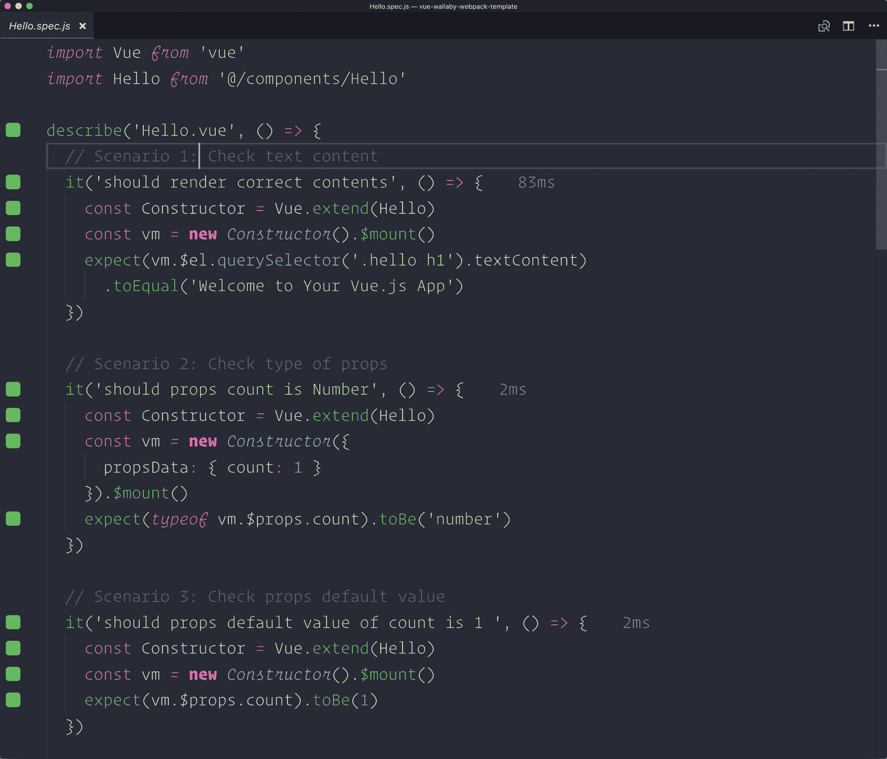

# 第十章：测试 Vue.js 应用程序

在一个紧迫和加速要求的世界中，为我们的应用程序创建自动化测试变得比以往任何时候都更加重要。一个需要考虑的重要因素，大多数开发人员忽视的是，测试是一种技能，仅仅因为你可能习惯编写解决方案，并不意味着你可以自动编写好的单元测试。随着你在这个领域的经验越来越丰富，你会发现自己更经常地编写测试，并想知道在没有它们的情况下你到底是怎么做的！

在本章结束时，我们将涵盖以下内容：

+   了解为什么应该考虑使用自动化测试工具和技术

+   为 Vue 组件编写你的第一个单元测试

+   编写模拟特定函数的测试

+   编写依赖于 Vue.js 事件的测试

+   使用 Wallaby.js 实时查看我们测试的结果

当我们谈论测试我们的 Vue 项目时，根据上下文，我们可能指的是不同的事情。

# 为什么要测试？

自动化测试工具是有原因的。当我们手动测试我们创建的工作时，你会从经验中知道这是一个漫长（有时复杂）的过程，不允许一致的结果。我们不仅需要手动记住一个特定组件是否工作（或者在某个地方写下结果！），而且它也不具有变化的弹性。

这些年来我听到过一些关于测试的话语：

*“但是保罗，如果我为我的应用程序编写测试，将需要三倍的时间！”*

*“我不知道如何编写测试...”*

*“那不是我的工作！”*

...以及其他各种。

关键是测试和开发一样是一种技能。你可能不会立刻擅长其中一种，但是随着时间、练习和毅力，你应该会发现自己处于一种测试感觉自然和软件开发的正常部分的位置。

# 单元测试

自动化测试工具取代了我们每次想要验证我们的功能是否按预期工作时所做的手动工作，并给了我们一种运行测试命令逐个测试我们的断言的方法。然后这些结果会以报告的形式呈现给我们（或者在我们的编辑器中实时显示，正如我们后面会看到的），这使我们有能力重构不按预期工作的代码。

通过使用自动化测试工具，与手动测试相比，我们节省了大量的工作量。

单元测试可以被定义为一种只测试一个“单元”（功能的最小可测试部分）的测试类型。然后，我们可以自动化这个过程，随着应用程序变得更大，不断测试我们的功能。在这一点上，您可能希望遵循测试驱动开发/行为驱动开发的实践。

在现代 JavaScript 测试生态系统中，有各种测试套件可用。这些测试套件可以被认为是给我们提供编写断言、运行测试、提供覆盖报告等功能的应用程序。我们将在项目中使用 Jest，因为这是由 Facebook 创建和维护的快速灵活的测试套件。

让我们创建一个新的游乐场项目，以便我们可以熟悉单元测试。我们将使用`webpack`模板而不是`webpack-simple`模板，因为这允许我们默认配置测试：

```js
# Create a new Vue project
**$ vue init webpack vue-testing** ? Project name vue-testing
? Project description Various examples of testing Vue.js applications
? Author Paul Halliday <hello@paulhalliday.io>
? Vue build runtime
? Install vue-router? Yes
? Use ESLint to lint your code? Yes
? Pick an ESLint preset Airbnb
? Set up unit tests Yes
? Pick a test runner jest
? Setup e2e tests with Nightwatch? No
? Should we run `npm install` for you after the project has been create
d? (recommended) npm

# Navigate to directory
$ cd vue-testing

# Run application
$ npm run dev
```

让我们首先调查`test/unit/specs`目录。这是我们在测试 Vue 组件时放置所有单元/集成测试的地方。打开`HelloWorld.spec.js`，让我们逐行进行：

```js
// Importing Vue and the HelloWorld component
import Vue from 'vue';
import HelloWorld from '@/components/HelloWorld';

// 'describe' is a function used to define the 'suite' of tests (i.e.overall context).
describe('HelloWorld.vue', () => {

  //'it' is a function that allows us to make assertions (i.e. test 
  true/false)
  it('should render correct contents', () => {
    // Create a sub class of Vue based on our HelloWorld component
    const Constructor = Vue.extend(HelloWorld);

    // Mount the component onto a Vue instance
    const vm = new Constructor().$mount();

    // The h1 with the 'hello' class' text should equal 'Welcome to 
   Your Vue.js App'
    expect(vm.$el.querySelector('.hello h1').textContent).toEqual(
      'Welcome to Your Vue.js App',
    );
  });
});
```

然后，我们可以通过在终端中运行`npm run unit`来运行这些测试（确保您在项目目录中）。这将告诉我们有多少个测试通过了以及整体测试代码覆盖率。这个指标可以用作确定应用程序在大多数情况下有多健壮的一种方式；但是，它不应该被当作圣经。在下面的截图中，我们可以清楚地看到有多少个测试通过了：



# 设置 vue-test-utils

为了获得更好的测试体验，建议使用`vue-test-utils`模块，因为这为我们提供了许多专门用于 Vue 框架的帮助程序和模式。让我们基于`webpack-simple`模板创建一个新项目，并自己集成 Jest 和`vue-test-utils`。在您的终端中运行以下命令：

```js
# Create a new Vue project
$ vue init webpack-simple vue-test-jest

# Navigate to directory
$ cd vue-test-jest

# Install dependencies
$ npm install

# Install Jest and vue-test-utils
$ npm install jest vue-test-utils --save-dev

# Run application
$ npm run dev
```

然后，我们必须在项目中添加一些额外的配置，以便我们可以运行 Jest，我们的测试套件。这可以在项目的`package.json`中配置。添加以下内容：

```js
{
  "scripts": {
    "test": "jest"
  }
}
```

这意味着任何时候我们想要运行我们的测试，我们只需在终端中运行`npm run test`。这将在任何匹配`*.spec.js`名称的文件上运行 Jest 的本地（项目安装）版本。

接下来，我们需要告诉 Jest 如何处理单文件组件（即`*.vue`文件）在我们的项目中。这需要`vue-jest`预处理器。我们还希望在测试中使用 ES2015+语法，因此我们还需要`babel-jest`预处理器。让我们通过在终端中运行以下命令来安装两者：

```js
npm install --save-dev babel-jest vue-jest
```

然后我们可以在`package.json`中定义以下对象：

```js
"jest": {
  "moduleNameMapper": {
    "^@/(.*)$": "<rootDir>/src/$1"
  },
  "moduleFileExtensions": [
    "js",
    "vue"
  ],
  "transform": {
    "^.+\\.js$": "<rootDir>/node_modules/babel-jest",
    ".*\\.(vue)$": "<rootDir>/node_modules/vue-jest"
  }
}
```

这本质上告诉 Jest 如何处理 JavaScript 和 Vue 文件，通过知道要使用哪个预处理器（即`babel-jest`或`vue-jest`），具体取决于上下文。

如果我们告诉 Babel 只为当前加载的 Node 版本转译功能，我们还可以使我们的测试运行更快。让我们在`.babelrc`文件中添加一个单独的测试环境：

```js
{
  "presets": [["env", { "modules": false }], "stage-3"],
  "env": {
    "test": {
      "presets": [["env", { "targets": { "node": "current" } }]]
    }
  }
}
```

现在我们已经添加了适当的配置，让我们开始测试吧！

# 创建一个 TodoList

现在让我们在`src/components`文件夹中创建一个`TodoList.vue`组件。这是我们将要测试的组件，我们将逐步为其添加更多功能：

```js
<template>
  <div>
    <h1>Todo List</h1>
    <ul>
      <li v-for="todo in todos" v-bind:key="todo.id">
        {{todo.id}}. {{todo.name}}</li>
    </ul>
  </div>
</template>

<script>
export default {
  data() {
    return {
      todos: [
        { id: 1, name: 'Wash the dishes' },
        { id: 2, name: 'Clean the car' },
        { id: 3, name: 'Learn about Vue.js' },
      ],
    };
  },
};
</script>

<style>
ul,
li {
  list-style: none;
  margin-left: 0;
  padding-left: 0;
}
</style>
```

正如您所看到的，我们只是一个返回具有不同项目的待办事项数组的简单应用程序。让我们在`src/router/index.js`中创建一个路由器，以匹配我们的新`TodoList`组件并将其显示为根：

```js
import Vue from 'vue';
import Router from 'vue-router';
import TodoList from '../components/TodoList';

Vue.use(Router);

export default new Router({
  routes: [
    {
      path: '/',
      name: 'TodoList',
      component: TodoList,
    },
  ],
});
```

由于我们正在使用`vue-router`，我们还需要安装它。在终端中运行以下命令：

```js
$ npm install vue-router --save-dev
```

然后，我们可以将路由器添加到`main.js`中：

```js
import Vue from 'vue'
import App from './App.vue'
import router from './router';

new Vue({
  el: '#app',
  router,
  render: h => h(App)
})
```

我现在已经添加了`router-view`，并决定从`App.vue`中删除 Vue 标志，这样我们就有了一个更清洁的用户界面。以下是`App.vue`的模板：

```js
<template>
  <div id="app">
    <router-view/>
  </div>
</template>
```

正如我们在浏览器中看到的那样，它显示了我们的模板，其中包括 TodoList 的名称和我们创建的`todo`项目：

让我们为这个组件编写一些测试

# 编写测试

在`src/components`文件夹中，创建一个名为`__tests__`的新文件夹，然后创建一个名为`TodoList.spec.js`的文件。Jest 将自动找到此文件夹和后续的测试。

让我们首先从测试工具中导入我们的组件和`mount`方法：

```js
import { mount } from 'vue-test-utils';
import TodoList from '../TodoList';
```

`mount`方法允许我们在隔离中测试我们的`TodoList`组件，并且使我们能够模拟任何输入 props、事件，甚至输出。接下来，让我们创建一个描述块，用于包含我们的测试套件：

```js
describe('TodoList.vue', () => {

});
```

现在让我们挂载组件并访问 Vue 实例：

```js
describe('TodoList.vue', () => {
 // Vue instance can be accessed at wrapper.vm
 const wrapper = mount(TodoList);
});
```

接下来，我们需要定义`it`块来断言我们测试用例的结果。让我们做出我们的第一个期望-它应该呈现一个待办事项列表：

```js
describe('TodoList.vue', () => {
  const todos = [{ id: 1, name: 'Wash the dishes' }];
  const wrapper = mount(TodoList);

  it('should contain a list of Todo items', () => {
    expect(wrapper.vm.todos).toContainEqual(todos[0]);
  });
});
```

我们可以通过在终端中运行`$ npm run test -- --watchAll`来观察测试的变化。或者，我们可以在`package.json`内创建一个新的脚本来代替这个操作：

```js
"scripts": {
 "test:watch": "jest --watchAll"
}
```

现在，如果我们在终端内运行`npm run test:watch`，它将监视文件系统的任何更改。

这是我们的结果：



这很有趣。我们有一个通过的测试！但是，此时我们必须考虑，这个测试是否脆弱？在实际应用中，我们可能不会在运行时默认拥有`TodoList`中的项目。

我们需要一种方法来在我们的隔离测试中设置属性。这就是设置自己的 Vue 选项的能力派上用场的地方！

# Vue 选项

我们可以在 Vue 实例上设置自己的选项。让我们使用`vue-test-utils`在实例上设置自己的数据，并查看这些数据是否呈现在屏幕上：

```js
describe('TodoList.vue', () => {
  it('should contain a list of Todo items', () => {
    const todos = [{ id: 1, name: 'Wash the dishes' }];
    const wrapper = mount(TodoList, {
      data: { todos },
    });

    // Find the list items on the page
    const liWrapper = wrapper.find('li').text();

    // List items should match the todos item in data
    expect(liWrapper).toBe(todos[0].name);
  });
});
```

正如我们所看到的，我们现在是根据组件内的数据选项来测试屏幕上呈现的项目。

让我们添加一个`TodoItem`组件，以便我们可以动态地渲染带有`todo`属性的组件。然后我们可以根据我们的属性测试这个组件的输出：

```js
<template>
  <li>{{todo.name}}</li>
</template>

<script>
export default {
  props: ['todo'],
};
</script>
```

然后我们可以将其添加到`TodoList`组件中：

```js
<template>
  <div>
    <h1>TodoList</h1>
    <ul>
      <TodoItem v-for="todo in todos" v-bind:key="todo.id" 
      :todo="todo">{{todo.name}}</TodoItem>
    </ul>
  </div>
</template>

<script>
import TodoItem from './TodoItem';

export default {
  components: {
    TodoItem,
  },
  // Omitted
}
```

我们的测试仍然如预期般通过，因为组件在运行时被渲染为`li`。不过，将其更改为查找组件本身可能是一个更好的主意：

```js
import { mount } from 'vue-test-utils';
import TodoList from '../TodoList';
import TodoItem from '../TodoItem';

describe('TodoList.vue', () => {
  it('should contain a list of Todo items', () => {
    const todos = [{ id: 1, name: 'Wash the dishes' }];
    const wrapper = mount(TodoList, {
      data: { todos },
    });

    // Find the list items on the page
    const liWrapper = wrapper.find(TodoItem).text();

    // List items should match the todos item in data
    expect(liWrapper).toBe(todos[0].name);
  });
});
```

让我们为我们的`TodoItem`编写一些测试，并在`components/__tests__`内创建一个`TodoItem.spec.js`：

```js
import { mount } from 'vue-test-utils';
import TodoItem from '../TodoItem';

describe('TodoItem.vue', () => {
  it('should display name of the todo item', () => {
    const todo = { id: 1, name: 'Wash the dishes' };
    const wrapper = mount(TodoItem, { propsData: { todo } });

    // Find the list items on the page
    const liWrapper = wrapper.find('li').text();

    // List items should match the todos item in data
    expect(liWrapper).toBe(todo.name);
  });
});
```

因为我们基本上使用相同的逻辑，所以我们的测试是相似的。主要区别在于，我们不是有一个`todos`列表，而是只有一个`todo`对象。我们使用`propsData`来模拟 props，而不是数据，基本上断言我们可以向这个组件添加属性，并且它呈现正确的数据。让我们看一下我们的测试是否通过或失败：


# 添加新功能

让我们以测试驱动的方式向我们的应用程序添加新功能。我们需要一种方法来向我们的`todo`列表中添加新项目，所以让我们首先编写我们的测试。在`TodoList.spec.js`内，我们将添加另一个`it`断言，应该向我们的`todo`列表中添加一个项目：

```js
it('should add an item to the todo list', () => {
  const wrapper = mount(TodoList);
  const todos = wrapper.vm.todos;
  const newTodos = wrapper.vm.addTodo('Go to work');
  expect(todos.length).toBeLessThan(newTodos.length);
});
```

如果我们现在运行我们的测试，我们将得到一个失败的测试，这是预期的！：



让我们尽可能少地修复我们的错误。我们可以在 Vue 实例内添加一个名为`addTodo`的方法：

```js
export default {
  methods: {
    addTodo(name) {},
  },
  // Omitted
}
```

现在我们得到了一个新的错误；这次它说无法读取未定义的`length`属性，基本上是说我们没有`newTodos`数组：


让我们使我们的`addTodo`函数返回一个将当前的`todos`与新 todo 结合在一起的数组：

```js
addTodo(name) {
  return [...this.todos, { name }]
},
```

运行`npm test`后，我们得到以下输出：



塔达！测试通过。

嗯。我记得我们所有的`todo`项目都有适当的`id`，但看起来情况已经不再是这样了。

理想情况下，我们的服务器端数据库应该为我们处理`id`号码，但目前，我们可以使用`uuid`包生成客户端`uuid`。让我们通过在终端中运行以下命令来安装它：

```js
$ npm install uuid
```

然后我们可以编写我们的测试用例，断言添加到列表中的每个项目都有一个`id`属性：

```js
it('should add an id to each todo item', () => {
  const wrapper = mount(TodoList);
  const todos = wrapper.vm.todos;
  const newTodos = wrapper.vm.addTodo('Go to work');

  newTodos.map(item => {
    expect(item.id).toBeTruthy();
  });
});
```

正如你所看到的，终端输出了我们有一个问题，这是因为显然我们没有`id`属性：


让我们使用之前安装的`uuid`包来实现这个目标：

```js
import uuid from 'uuid/v4';

export default {
  methods: {
    addTodo(name) {
      return [...this.todos, { id: uuid(), name }];
    },
  },
  // Omitted
};
```

然后我们得到了一个通过的测试：


从失败的测试开始对多个原因都是有益的：

+   它确保我们的测试实际上正在运行，我们不会花时间调试任何东西！

+   我们知道接下来需要实现什么，因为我们受当前错误消息的驱使

然后我们可以写入最少必要的内容来获得绿色的测试，并继续重构我们的代码，直到我们对解决方案感到满意。在以前的测试中，我们可以写得更少以获得绿色的结果，但为了简洁起见，我选择了更小的例子。

# 点击事件

太好了！我们的方法有效，但这不是用户将与应用程序交互的方式。让我们看看我们是否可以使我们的测试考虑用户输入表单和随后的按钮：

```js
<form @submit.prevent="addTodo(todoName)">
  <input type="text" v-model="todoName">
  <button type="submit">Submit</button>
</form>
```

我们还可以对我们的`addTodo`函数进行小小的改动，确保`this.todos`被赋予新的`todo`项目的值：

```js
addTodo(name) {
 this.todos = [...this.todos, { id: uuid(), name }];
 return this.todos;
},
```

很棒的是，通过进行这种改变，我们可以检查所有以前的用例，并且看到没有任何失败！为自动化测试欢呼！

接下来，让我们创建一个`it`块，我们可以用来断言每当我们点击提交按钮时，都会添加一个项目：

```js
  it('should add an item to the todo list when the button is clicked', () => {
    const wrapper = mount(TodoList);
  })
```

接下来，我们可以使用 find 从包装器中获取表单元素，然后触发事件。由于我们正在提交表单，我们将触发提交事件并传递参数给我们的`submit`函数。然后我们可以断言我们的`todo`列表应该是`1`：

```js
it('should add an item to the todo list when the button is clicked', () => {
 const wrapper = mount(TodoList);
 wrapper.find('form').trigger('submit', 'Clean the car');

 const todos = wrapper.vm.todos;

 expect(todos.length).toBe(1);
})
```

我们还可以检查在表单提交时是否调用了适当的方法。让我们使用`jest`来做到这一点：

```js
it('should call addTodo when form is submitted', () => {
  const wrapper = mount(TodoList);
  const spy = jest.spyOn(wrapper.vm, 'addTodo');

  wrapper.find('form').trigger('submit', 'Clean the car');

  expect(wrapper.vm.addTodo).toHaveBeenCalled();
});
```

# 测试事件

我们取得了很大的进展，但如果我们能测试组件之间触发的事件，那不是很棒吗？让我们通过创建一个`TodoInput`组件来看看这个问题，并将我们的表单抽象到`this`组件中：

```js
<template>
  <form @submit.prevent="addTodo(todoName)">
    <input type="text" v-model="todoName">
    <button type="submit">Submit</button>
  </form>
</template>

<script>
export default {
  data() {
    return {
      todoName: ''
    } 
  },
  methods: {
    addTodo(name) {
      this.$emit('addTodo', name);
    }
  }
}
</script>
```

现在，我们在`this`组件中的`addTodo`方法触发了一个事件。让我们在`TodoInput.spec.js`文件中测试该事件：

```js
import { mount } from 'vue-test-utils';
import TodoInput from '../TodoInput';

describe('TodoInput.vue', () => {
  it('should fire an event named addTodo with todo name', () => {
    const mock = jest.fn()
    const wrapper = mount(TodoInput);

    wrapper.vm.$on('addTodo', mock)
    wrapper.vm.addTodo('Clean the car');

    expect(mock).toBeCalledWith('Clean the car')
  })
});
```

在这个方法中，我们介绍了一个新的概念——`mock`。这允许我们定义自己的行为，并随后确定事件是如何被调用的。

每当`addTodo`事件被触发时，`mock`函数就会被调用。这使我们能够看到我们的事件是否被调用，并确保事件可以携带有效负载。

我们还可以确保`TodoList`处理`this`事件，但首先确保您已经更新了`TodoList`以包括`TodoInput`表单：

```js
<template>
  <div>
    <h1>TodoList</h1>

    <TodoInput @addTodo="addTodo($event)"></TodoInput>

    <ul>
      <TodoItem v-for="todo in todos" v-bind:key="todo.id" :todo="todo">{{todo.name}}</TodoItem>
    </ul>
  </div>
</template>

<script>
import uuid from 'uuid/v4';

import TodoItem from './TodoItem';
import TodoInput from './TodoInput';

export default {
  components: {
    TodoItem,
    TodoInput
  },
  data() {
    return {
      todos: [],
      todoName: ''
    };
  },
  methods: {
    addTodo(name) {
      this.todos = [...this.todos, { id: uuid(), name }];
      return this.todos;
    },
  },
};
</script>
<style>
ul,
li {
  list-style: none;
  margin-left: 0;
  padding-left: 0;
}
</style>
```

然后，在我们的`TodoList.spec.js`中，我们可以首先导入`TodoInput`，然后添加以下内容：

```js
import TodoInput from '../TodoInput';
it('should call addTodo when the addTodo event happens', () => {
  const wrapper = mount(TodoList);

  wrapper.vm.addTodo = jest.fn();
  wrapper.find(TodoInput).vm.$emit('addTodo', 'Clean the car');

  expect(wrapper.vm.addTodo).toBeCalledWith('Clean the car');
})
```

除此之外，我们还可以确保事件执行其预期功能；所以当我们触发事件时，它会向数组添加一个项目，我们正在测试数组的长度：

```js
it('adds an item to the todolist when the addTodo event happens', () => {
 const wrapper = mount(TodoList);
 wrapper.find(TodoInput).vm.$emit('addTodo', 'Clean the car');
 const todos = wrapper.vm.todos;
 expect(todos.length).toBe(1);
});
```

# 使用 Wallaby.js 获得更好的测试体验

我们还可以使用 Wallaby.js 在编辑器中实时查看我们的单元测试结果。这不是一个免费的工具，但在创建面向测试驱动的 Vue 应用程序时，您可能会发现它很有用。让我们首先克隆/下载一个已经设置好 Wallaby 的项目。在您的终端中运行以下命令：

```js
# Clone the repository
$ git clone https://github.com/ChangJoo-Park/vue-wallaby-webpack-template

# Change directory
$ cd vue-wallaby-webpack-template

# Install dependencies
$ npm install

# At the time of writing this package is missing eslint-plugin-node
$ npm install eslint-plugin-node

# Run in browser
$ npm run dev
```

然后，我们可以在编辑器中打开它，并在编辑器中安装 Wallaby.js 扩展。您可以在[`wallabyjs.com/download/`](https://wallabyjs.com/download/)找到受支持的编辑器列表和说明。

我将在 Visual Studio Code 中安装这个，首先在扩展市场中搜索 Wallaby：


然后，我们可以按下 Mac 上的*CMD* + *SHIFT + =*或 Windows 上的*CTRL* + *SHIFT + =*，告诉 Wallaby 有关项目的配置文件（`wallaby.js`）。从下拉菜单中，单击“选择配置文件”，然后键入`wallaby.js`。这将允许 Wallaby 和 Vue 一起工作。

要启动 Wallaby，我们可以再次打开配置菜单并选择“启动”。然后，我们可以导航到`tests/unit/specs/Hello.spec.js`文件，并在编辑器的行边距中看到不同的块：



由于一切都是绿色的，我们知道它已经通过了！如果我们改变测试的实现细节会怎么样？让我们故意让一个或多个测试失败：


除了“应该呈现正确内容”块之外，一切都保持不变，可以在左侧看到。这是因为我们现在有一个失败的断言，但更重要的是，我们不必重新运行测试，它们会立即显示在我们的编辑器中。不再需要在不同窗口之间切换以观看我们的测试输出！

# 摘要

本章让我们了解了如何适当地测试我们的 Vue 组件。我们学会了如何遵循先失败的方法来编写驱动我们开发决策的测试，以及如何利用 Wallaby.js 在编辑器中查看我们测试的结果！

在下一章中，我们将学习如何将我们的 Vue.js 应用与现代渐进式 Web 应用技术相结合，例如服务工作者、应用程序清单等等！
