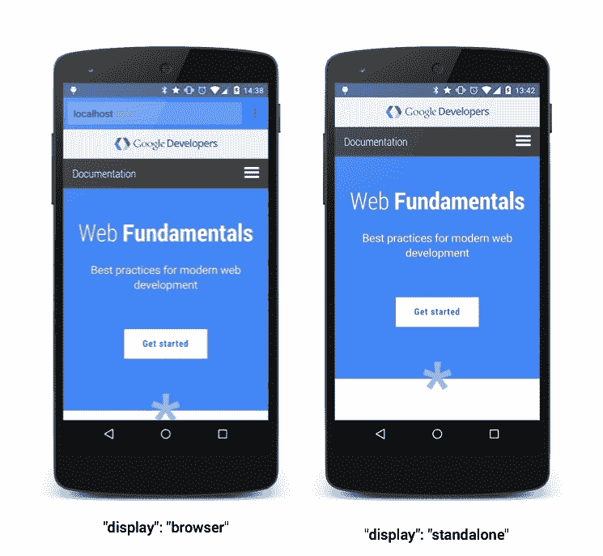
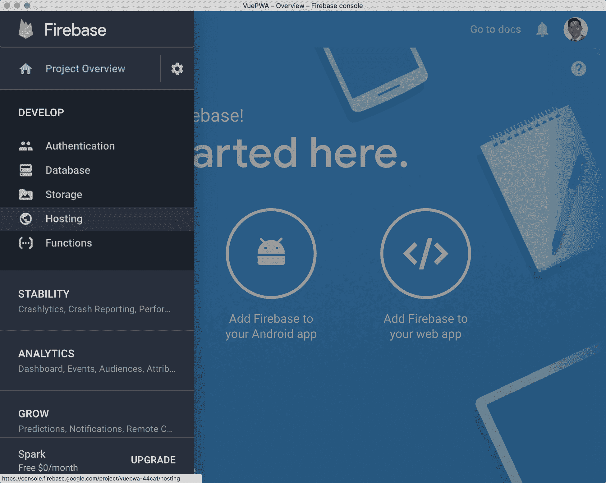
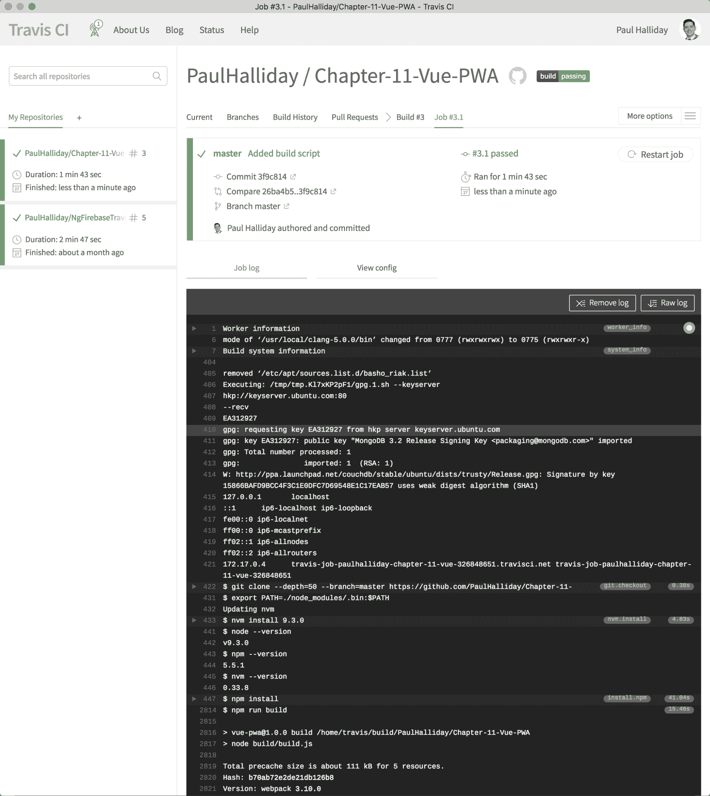
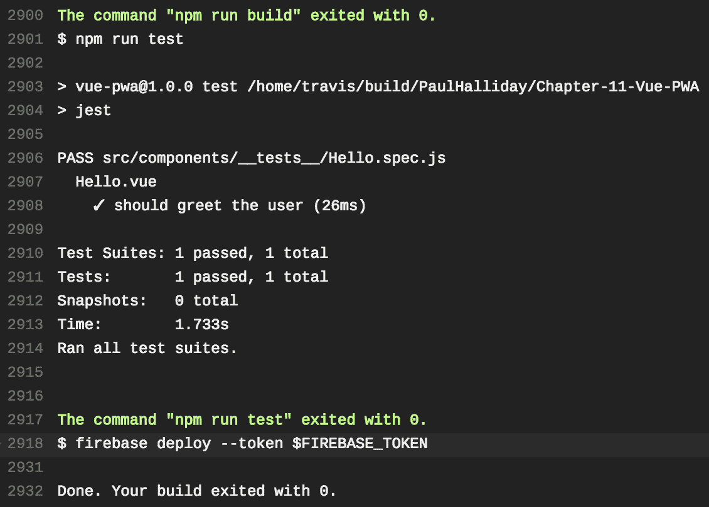

# 第十一章：优化

如果你多年来一直在编写针对 Web 平台的应用程序，你会看到 Web 经历了多少变化。最初只是一个简单的文档查看器，现在我们必须处理复杂的构建步骤、状态管理模式、持续审查性能和兼容性等等。

值得庆幸的是，JavaScript 的流行和随后的工具意味着有模板和经过验证的技术，我们可以用来优化我们的应用程序和部署。

在本章中，我们将看一下以下主题：

+   来自 Vue CLI 的`vue-pwa`模板

+   渐进式 Web 应用程序的特点

+   使用 ngrok 在任何设备上查看本地主机应用程序

+   使用 Firebase 托管部署 Web 应用程序

+   持续集成及其对大型项目的意义

+   在每次 Git`commit`上自动运行测试

+   在每次 Git`commit`上自动部署到 Firebase 托管

# 渐进式 Web 应用程序（PWA）

PWAs 可以被定义为利用现代 Web 的能力来提供周到、引人入胜和互动体验的应用程序。我的对 PWAs 的定义是包含渐进增强原则的。我们当然可以利用 PWAs 所提供的一切，但我们不必这样做（或者至少不是一次性做完）。

这意味着我们不仅在不断改进我们的应用程序，而且遵循这些原则迫使我们以用户的角度思考，用户可能有不稳定的互联网连接，想要离线优先体验，需要主屏幕可访问的应用程序等等。

再次，Vue CLI 让这个过程对我们来说很容易，因为它提供了一个 PWA 模板。让我们使用适当的模板创建一个新的 Vue 应用程序：

```js
# Create a new Vue project
$ vue init pwa vue-pwa

? Project name vue-pwa
? Project short name: fewer than 12 characters to not be truncated on homescreens (default: same as name) 
? Project description A PWA built with Vue.js
? Author Paul Halliday <hello@paulhalliday.io>
? Vue build runtime
? Install vue-router? Yes
? Use ESLint to lint your code? Yes
? Pick an ESLint preset Airbnb
? Setup unit tests with Karma + Mocha? No
? Setup e2e tests with Nightwatch? No

# Navigate to directory
$ cd vue-pwa

# Install dependencies
$ npm install

# Run application
$ npm run dev
```

在本章中，我们将看一下这个模板给我们带来的好处，以及我们如何使我们的应用程序和操作更加渐进。

# Web 应用程序清单

你可能已经看到使用 Web 应用程序清单的应用程序的好处——如果你曾经在一个要求你在主屏幕上安装的网站上，或者如果你注意到在 Android Chrome 上地址栏的颜色从默认灰色变成不同颜色，那就是一个渐进式应用程序。

让我们转到`static/manifest.json`并调查内容：

```js
{
  "name": "vue-pwa",
  "short_name": "vue-pwa",
  "icons": [
    {
      "src": "/static/img/icons/android-chrome-192x192.png",
      "sizes": "192x192",
      "type": "image/png"
    },
    {
      "src": "/static/img/icons/android-chrome-512x512.png",
      "sizes": "512x512",
      "type": "image/png"
    }
  ],
  "start_url": "/index.html",
  "display": "standalone",
  "background_color": "#000000",
  "theme_color": "#4DBA87"
}
```

我们有选项来给我们的应用程序`name`和`short_name`；这些将在设备的主屏幕上安装时显示。

`icons`数组用于为不同大小的图标提供高清体验。`start_url`定义了在用户主屏幕上安装时启动时要加载的文件，因此指向`index.html`。

我们可以通过显示属性在设备上运行 PWA 时更改应用程序的外观。有各种可用选项，如`browser`、`standalone`、`minimal-ui`和`fullscreen`。每个选项都会改变应用程序在设备上的显示方式；[(https://developers.google.com/web/fundamentals/web-app-manifest/)](https://developers.google.com/web/fundamentals/web-app-manifest/)

这里有一个浏览器和独立应用的例子：

显示选项-Web 应用清单

我们还可以利用`background_color`选项来改变 PWA 启动时闪屏背景的颜色，如下截图所示：


如果我们想要改变工具栏的颜色，我们可以使用`theme_color`选项（随着我们继续前进，我们将看一个例子）。

您可以根据项目的需求自定义您的 Web 应用清单并传递其他选项。您可以在 MDN 上找到有关 Web 应用清单的更多信息[`developer.mozilla.org/en-US/docs/Web/Manifest`](https://developer.mozilla.org/en-US/docs/Web/Manifest)。

# 在设备上进行测试

如果我们想要在设备上测试我们的应用程序而不用担心部署，我们可以使用 ngrok 等工具在本地主机和外部世界之间创建隧道。这允许我们在任何具有公共 URL 的设备上查看我们的应用程序，一旦关闭连接，URL 和随后的应用程序就会消失。

通过导航到[`ngrok.com/download`](https://ngrok.com/download)并按照您的平台的安装步骤来下载 ngrok。

Ngrok 也可以通过`npm`安装，输入：

```js
npm install ngrok -g
```

由于我们的 Vue 应用程序正在 8080 端口上运行，我们可以启动 ngrok 并告诉它从该端口提供服务。在已安装 ngrok 的终端中运行以下命令：

```js
$ ngrok http 8080
```

然后我们在终端中得到以下结果：


然后我们可以在任何设备上导航到此 URL，并在屏幕上看到以下结果：


这不是更本地化的体验吗？现在我们默认拥有有色的地址/状态栏。在生产模式下，我们还可以通过`ServiceWorker`获得更多功能。在深入了解之前，让我们看看如何使用 Firebase 将我们的应用程序部署到更永久的 URL。

# Firebase 部署

Firebase 是谷歌的一个平台，允许我们利用实时数据库、远程配置、推送通知等等。对于我们的用例来说，更重要的是静态文件部署的潜力，这是我们将要利用的东西。

该平台有三种不同的可用套餐，每种套餐提供不同级别的服务，第一层是免费的，接下来的两层需要付费。

首先，导航到[`firebase.google.com`](https://firebase.google.com)，并通过点击“登录”来使用谷歌账号登录，然后点击右上角的“转到控制台”。

然后，通过在 Firebase 仪表板上选择+添加项目来创建一个新的 Firebase 项目，然后选择项目名称和国家。

然后我们将导航到项目概述，我们可以选择将 Firebase 添加到我们的项目以及各种其他选项。我们正在寻找托管，因为我们有兴趣部署我们的静态内容。从左侧菜单中，点击“托管”：



我们将经常在这个屏幕上，因为它允许我们回滚部署以及查看其他使用指标。由于我们还没有进行第一次部署，屏幕看起来会类似于这样：


如果我们点击“开始”，我们将收到一条消息，指出我们需要下载 Firebase 工具。这是一个允许我们在终端内管理 Firebase 项目的 CLI。

通过在终端中运行以下命令来安装 Firebase 工具：

```js
$ npm install firebase-tools -g
```

然后我们可以按照托管向导的下一步中概述的步骤进行操作，但我们暂时不会使用部署步骤。向导应该看起来像这样：


让我们通过在终端中运行以下命令来登录 Firebase 控制台：

```js
$ firebase login
```

选择一个谷歌账号并给予适当的权限。然后会出现以下屏幕：


然后，我们可以在我们的`vue-pwa`项目中初始化一个新的 Firebase 项目。在终端中运行以下命令：

```js
$ firebase init
```

在这一点上，我们可以使用键盘导航到托管并用空格键选择它。这应该使圆圈变绿，并告诉 Firebase 我们想要在我们的项目中设置托管。

！[](assets/826a6ff0-0808-420e-b37a-1b39cd4ab76b.png)

然后，我们必须将我们的本地项目与 Firebase 仪表板中的项目进行匹配。从列表中选择您之前创建的项目：

！[](assets/a172175d-09f8-4b35-b194-088123863f48.png)

然后它应该问您与设置相关的问题-像这样回答：

！[](assets/aa4c1662-0734-419f-bcb4-1d06be3865b8.png)

我们现在可以随意部署到 Firebase。我们需要为生产构建我们的项目，以适当生成包含我们应用程序内容的`dist`文件夹。让我们在终端中运行以下命令：

```js
$ npm run prod
```

然后，要部署到 Firebase，我们可以运行以下命令：

```js
$ firebase deploy
```

过了一会儿，您应该会收到一个可导航的 URL，其中包含我们通过 HTTPS 提供的应用程序：

！[](assets/b0cf75f6-3328-4737-bbb0-fc4b2294a661.png)

我们的 Firebase 仪表板也已更新以反映我们的部署：

！[](assets/1e582605-e4f4-45f8-a9ca-0e9ab0070b81.png)

如果我们然后导航到 URL，我们应该按预期获得我们的项目：

！[](assets/3d3cb016-af9e-462c-9559-5759a1554014.png)

此外，因为我们使用生产构建构建了我们的应用程序，我们可以断开与 Wi-Fi 的连接或在开发者工具中勾选离线框。这样做后，我们会发现我们的应用程序仍然按预期运行，因为我们在所有生产构建上都运行了`ServiceWorker`。

# 持续集成（CI）

有各种 CI 平台可用，例如 Travis、GitLab、Jenkins 等等。每个平台通常都有一个共同的目标，即自动化部署和随之而来的挑战。

当然，我们可以部署我们的站点，运行我们的测试，并继续进行我们不断增加的构建步骤中的其他项目。这不仅是一个繁琐的过程，而且也给了我们许多犯错的机会。此外，这也意味着每个步骤都必须为团队的每个成员进行记录，文档必须保持最新，并且在整个组织中并不是完全可扩展的。

在我们的示例中，我们将使用 Travis CI，我想要解决的第一个目标是自动运行我们的单元测试。为此，我们需要在项目中有一个或多个单元测试。

# 单元测试

我们在前一章中介绍了如何测试 Vue.js 应用程序，那么每次推送新版本时自动运行测试不是很好吗？让我们快速在项目中设置一些测试，并将其与 Travis 集成：

```js
# Install necessary dependencies
$ npm install jest vue-test-utils babel-jest vue-jest --save-dev
```

然后我们可以添加一个运行`jest`的新脚本：

```js
{
  "scripts": {
    "test": "jest"
  }
}
```

接下来，将`jest`配置添加到您的`package.json`中：

```js
"jest": {
  "moduleNameMapper": {
    "^@/(.*)$": "<rootDir>/src/$1"
  },
  "moduleFileExtensions": [
    "js",
    "vue"
  ],
  "transform": {
    "^.+\\.js$": "<rootDir>/node_modules/babel-jest",
    ".*\\.(vue)$": "<rootDir>/node_modules/vue-jest"
  }
}
```

最后，我们可以在`.babelrc`中更新我们的`babel`配置：

```js
{
  "presets": [
    ["env", {
      "modules": false,
      "targets": {
        "browsers": ["> 1%", "last 2 versions", "not ie <= 8"]
      }
    }],
    "stage-2"
  ],
  "plugins": ["transform-runtime"],
  "env": {
    "test": {
      "presets": [["env", { "targets": { "node": "current" } }]],
      "plugins": [ "istanbul" ]
    }
  }
}
```

然后，在`components/__test__/Hello.spec.js`中创建一个简单的测试，只需检查我们数据中的`msg`是否与一个字符串匹配：

```js
import { mount } from 'vue-test-utils';
import Hello from '../Hello';

describe('Hello.vue', () => {
  it('should greet the user', () => {
    const wrapper = mount(Hello);

    expect(wrapper.vm.msg).toEqual('Welcome to Your Vue.js PWA');
  })
})
```

如预期的那样，我们可以运行`npm test`来执行我们的测试：


# 创建一个 Git 存储库

要使用 Travis CI 进行持续集成，我们需要将项目上传到 GitHub。如果您的机器上还没有安装 Git，请从[`git-scm.com/`](https://git-scm.com/)下载并随后在[`github.com`](https://github.com)创建一个 GitHub 账户。

在[`github.com/new`](https://github.com/new)为您的项目创建一个新的存储库，或者点击屏幕右上角的+号，然后点击新存储库按钮。

然后，我们可以给我们的存储库命名，并将可见性设置为公共或私有：


一旦我们点击创建存储库按钮，我们将看到多种上传存储库到 GitHub 的方式。唯一的问题是我们还没有把我们的 PWA 项目变成 Git 存储库。

我们可以在 Visual Studio Code 或命令行中执行此操作。在 Visual Studio Code 中，点击新存储库按钮。如果您刚安装了 Git，您可能需要重新启动编辑器才能看到此按钮。这是它在 Visual Studio Code 中的样子。


然后，我们可以用一个简单的消息进行新提交，比如“第一次提交”，然后点击打勾：


然后，我们可以按照内部突出显示的步骤将这些更改推送到 GitHub 上的存储库...或者按照以下图片中给出的命令行推送现有的存储库：


我们对存储库的任何未来更改都将推送到此远程存储库。这很重要，因为当我们创建 Travis 帐户时，它将自动访问我们的所有 GitHub 存储库。

# 连接到 Travis CI

让我们转到[`travis-ci.org/`](https://travis-ci.org/)，并单击使用 GitHub 登录。在给予 Travis 任何必要的权限后，您应该能够看到与您的帐户关联的存储库列表。我们可以告诉 Travis，我们希望它监视此存储库中的更改，方法是将开关切换为绿色：


# 配置 Travis

接下来要做的是向我们的项目添加一个适当的`.travis.yml`配置文件。这将告诉 Travis 每次我们将构建推送到 GitHub 时要做什么。因此，在我们使用 Travis 构建时会发生两个不同的阶段：

+   Travis 在我们的项目内安装任何依赖项

+   Travis 运行构建脚本

我们可以连接到构建过程的各个阶段，例如`before_install`、`install`、`before_script`、`script`、`before_cache`、`after_success`、`after_failure`、`before_deploy`、`deploy`、`after_deploy`和`after_script`。所有这些都相对容易理解，但如果看起来很多，不用担心，我们只会连接其中的一些阶段。

让我们在项目的根目录添加一个名为`.travis.yml`的文件，并逐步添加选项。我们可以首先定义项目的语言，由于我们使用的是 Node，接下来也是 Node 环境的版本：

```js
language: node_js
node_js: 
 - "9.3.0"
```

我选择的`node_js`版本与我的环境相匹配（可以使用`node -v`进行检查），但如果您需要针对特定版本的 Node（或多个版本），您可以在这里添加它们。

接下来，让我们添加我们只想在`master`分支上触发构建：

```js
branches: 
  only:
    - master
```

然后，我们需要告诉 Travis 从`package.json`运行什么脚本。因为我们想运行我们的测试，所以我们将运行测试脚本：

```js
script:
  - npm run test
```

最后，让我们声明我们希望收到每次构建的电子邮件通知：

```js
notifications:
  email:
    recipients:
      - your@email.com
    on_success: always 
    on_failure: always
```

这给我们以下文件：

```js
language: node_js
node_js: 
  - "9.3.0"

branches: 
  only:
    - master

script:
  - npm run build
  - npm run test

notifications:
  email:
    recipients:
      - your@email.com
    on_success: always 
    on_failure: always
```

如果我们将这些更改推送到我们的存储库并与原始存储库同步，我们应该能够观看 Travis 控制台运行我们的测试。Travis 可能需要一些时间来启动构建，所以请耐心等待：



如果我们向下滚动日志的底部，您可以看到我们的项目已经为生产和测试构建：


太棒了！我们现在可以运行我们的测试，并在 Travis CI 的构建过程中连接到各个阶段。鉴于我们正在 Travis 上为生产构建我们的项目，我们应该能够自动将此构建部署到 Firebase。

让我们更改我们的`Hello.vue`组件以显示新消息（并使我们的测试失败）：

```js
export default {
  name: 'hello',
  data() {
    return {
      msg: 'Welcome to Your Vue.js PWA! Deployed to Firebase by Travis CI',
    };
  },
};
```

# 自动部署到 Firebase

我们可以让 Travis 自动处理我们的部署，但是我们需要一种方法让 Travis 访问我们的部署令牌。我们可以通过在终端中运行以下命令来获取 CI 环境的令牌：

```js
$ firebase login:ci
```

再次登录您的 Google 帐户后，您应该在终端内获得一个令牌：

```js
 Success! Use this token to login on a CI server:

# Token here
```

现在保留令牌，因为我们一会儿会用到它。

返回 Travis CI 仪表板，并转到项目的设置。在设置内，我们需要添加一个环境变量，然后我们可以在部署脚本内引用它。

添加`FIREBASE_TOKEN`环境变量，其值等于我们从终端获得的令牌：


然后，我们可以更新我们的`.travis.yml`文件，在我们的 CI 环境中安装 firebase 工具，并且如果一切顺利，然后将它们部署到我们的 Firebase 托管环境：

```js
language: node_js
node_js: 
  - "9.3.0"

branches: 
  only:
    - master

before_script: 
  - npm install -g firebase-tools

script:
  - npm run build
  - npm run test

after_success: 
  - firebase deploy --token $FIREBASE_TOKEN

notifications:
  email:
    recipients:
      - your@email.com
    on_success: always 
    on_failure: always
```

在更改此文件并同步存储库后进行新的提交。然后这应该触发 Travis 上的新构建，我们可以查看日志。

以下是结果：


我们的部署失败**因为我们的测试失败。**请注意，我们托管在 Firebase 上的应用程序根本没有更改。这是有意的，这就是为什么我们将部署步骤放在`after_success`内的原因，因为如果我们有失败的测试，我们很可能不希望将此代码推送到生产环境。

让我们修复我们的测试，并将新的`commit`推送到存储库：

```js
import { mount } from 'vue-test-utils';
import Hello from '../Hello'

describe('Hello.vue', () => {
  it('should greet the user', () => {
    const wrapper = mount(Hello);

    expect(wrapper.vm.msg).toEqual('Welcome to Your Vue.js PWA! Deployed to Firebase by Travis CI');
  })
})
```

由于所有脚本的退出代码为 0（没有错误），`after_success`钩子被触发，将我们的项目推送到 Firebase Hosting：



如果我们在适当的 URL 检查我们的应用程序，我们应该看到一个更新的消息：


# 服务工作者

在使用`vue-pwa`模板为生产构建我们的应用程序时，它包括`ServiceWorker`。这本质上是一个在后台运行的脚本，使我们能够利用首次离线方法、推送通知、后台同步等功能。

我们的应用程序现在还会提示用户将应用程序安装到他们的主屏幕上，如下所示：


如果我们与互联网断开连接，我们也会获得首次离线体验，因为应用程序仍然可以继续运行。这是在使用`vue-pwa`模板时获得的主要好处之一，如果您想了解更多关于`ServiceWorker`以及如何根据自己的需求自定义它，Google 在[`developers.google.com/web/fundamentals/primers/service-workers/`](https://developers.google.com/web/fundamentals/primers/service-workers/)上有一个很好的入门指南。

# 摘要

在本章中，我们调查了 Vue CLI 中的 PWA 模板，随后看了一下随着应用程序的不断增长，我们如何可以自动部署和测试我们的应用程序。这些原则使我们能够不断确保我们可以花更多的时间开发功能，而不是花时间维护部署文档和每次遵循基本任务。

在接下来的章节中，我们将介绍 Nuxt，这是一个允许我们使用 Vue 创建服务器端渲染/静态应用程序的框架。Nuxt 还具有一个有趣的基于文件夹的路由结构，这在创建 Vue 应用程序时给了我们很大的力量。
