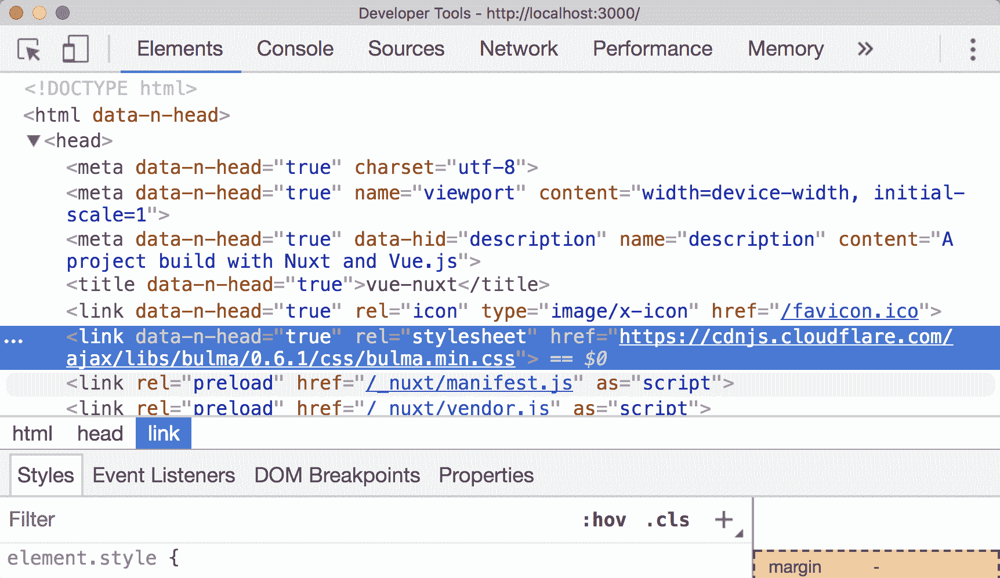
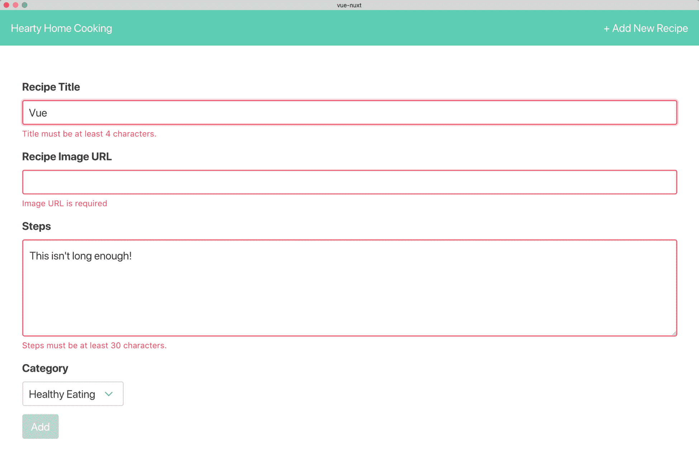
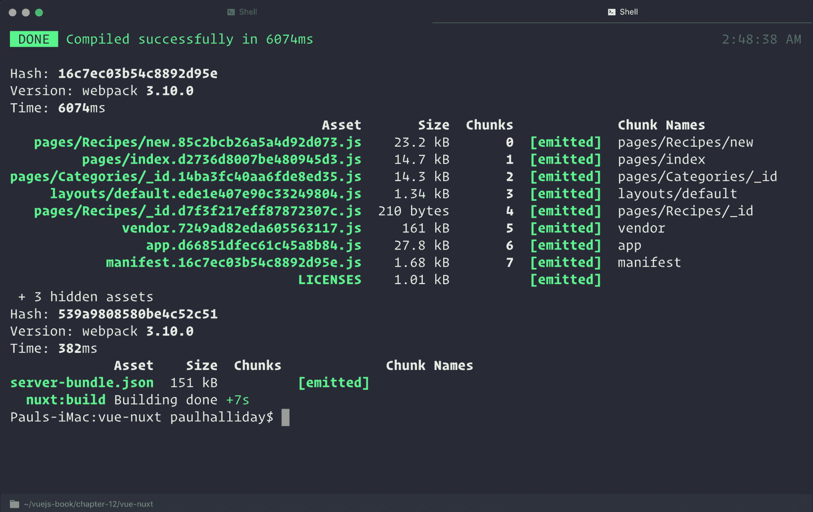
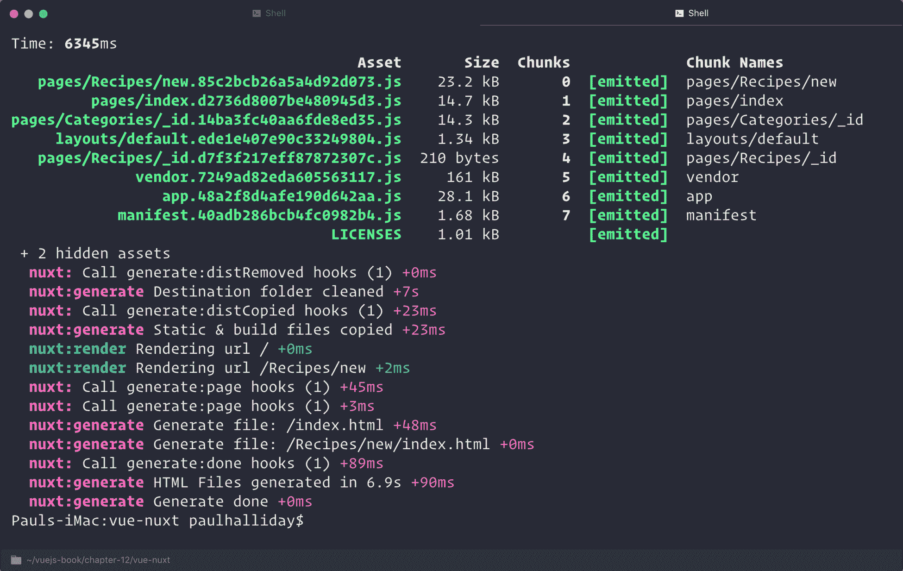

# 第十二章：使用 Nuxt 进行服务器端渲染

Nuxt 受到一个名为 Next.js 的流行 React 项目的启发，由 Zeit 构建。这两个项目的目标都是创建应用程序，利用最新的思想、工具和技术，提供更好的开发体验。Nuxt 最近进入了 1.x 版本及更高版本，这意味着它应该被认为是稳定的，可以用于生产网站。

在本章中，我们将更详细地了解 Nuxt，如果你觉得它有用，它可能会成为你创建 Vue 应用程序的默认方式。

在本章中，我们将涵盖以下主题：

+   调查 Nuxt 并理解使用它的好处

+   使用 Nuxt 创建应用程序

+   使用 Nuxt 中间件

+   使用布局定义内容

+   在 Nuxt 中理解路由

+   使用服务器端渲染构建 Vue 项目

+   将 Vue 项目构建为静态站点

# Nuxt

Nuxt 引入了通用 Vue 应用程序的概念，因为它使我们能够轻松地利用服务器端渲染（SSR）。与此同时，Nuxt 还赋予我们生成静态站点的能力，这意味着内容以 HTML、CSS 和 JS 文件的形式呈现，而不需要来回从服务器传输。

这还不是全部——Nuxt 处理路由生成，并且不会减少 Vue 的任何核心功能。让我们创建一个 Nuxt 项目。

# 创建一个 Nuxt 项目

我们可以使用 Vue CLI 使用启动模板创建一个新的 Nuxt 项目。这为我们提供了一个简单的 Nuxt 项目，并避免了手动配置的麻烦。我们将创建一个名为“丰盛家常烹饪”的“食谱列表”应用程序，该应用程序使用 REST API 获取类别和食谱名称。在终端中运行以下命令创建一个新的 Nuxt 项目：

```js
# Create a new Nuxt project
$ vue init nuxt-community/starter-template vue-nuxt

# Change directory
$ cd vue-nuxt

# Install dependencies
$ npm install

# Run the project in the browser
$ npm run dev
```

前面的步骤与创建新的 Vue 项目时所期望的非常相似，相反，我们可以简单地使用 Nuxt 存储库和启动模板来生成一个项目。

如果我们查看我们的`package.json`，你会发现我们没有生产依赖项的列表；相反，我们只有一个`nuxt`：

```js
"dependencies": {
  "nuxt": "¹.0.0"
}
```

这很重要，因为这意味着我们不必管理 Vue 的版本或担心其他兼容的包，因为我们只需要更新`nuxt`的版本。

# 目录结构

如果我们在编辑器中打开我们的项目，我们会注意到我们比以前的 Vue 应用程序有更多的文件夹。我编制了一张表格，概述了它们的含义：

| 文件夹 | 描述 |
| --- | --- |
| `资产` | 用于存储项目资产，例如未编译的图像、js 和 CSS。 使用 Webpack 加载程序作为模块加载。 |
| `组件` | 用于存储应用程序组件。 这些不会转换为路由。 |
| `布局` | 用于创建应用程序布局，例如默认布局、错误布局或其他自定义布局。 |
| `中间件` | 用于定义自定义应用程序中间件。 这允许我们在不同事件上运行自定义功能，例如在页面之间导航。 |
| `页面` | 用于创建组件（`.vue`文件），用作应用程序路由。 |
| `插件` | 用于注册应用程序范围的插件（即使用 `Vue.use`）。 |
| `静态` | 用于存储静态文件；此文件夹中的每个项目都映射到 `/*` 而不是 `/static/*`。 |
| `Store` | 与 Vuex 存储一起使用。 Nuxt 可以与 Vuex 的标准和模块实现一起使用。 |

尽管这可能看起来更复杂，但请记住，这有助于我们分离关注点，结构允许 Nuxt 处理诸如自动生成路由之类的事情。

# Nuxt 配置

让我们向项目添加一些自定义链接，以便我们可以利用 CSS 库、字体等。 让我们向项目添加 Bulma。

Bulma 是一个 CSS 框架，允许我们使用 Flexbox 构建应用程序，并让我们利用许多预制组件。 我们可以通过转到`nuxt.config.js`并在`head`对象内的`link`对象中添加一个新对象来将其添加到我们的项目中，如下所示：

```js
head: {
  // Omitted
  link: [
    { rel: 'icon', type: 'image/x-icon', href: '/favicon.ico' },
    {
      rel: 'stylesheet',
      href:
    'https://cdnjs.cloudflare.com/ajax/libs/bulma/0.6.1/css/bulma.min.css',
    },
  ],
}
```

如果我们使用开发人员工具来检查 HTML 文档中的头部，您会注意到 Bulma 已添加到我们的项目中。 如果我们转到开发人员工具，我们可以看到它确实在项目中使用 Bulma：



# 导航

每次我们在页面目录中创建一个新的`.vue`文件，我们都会为我们的应用程序创建一个新的路由。 这意味着每当我们想要创建一个新的路由时，我们只需创建一个带有路由名称的新文件夹，其余工作由 Nuxt 处理。 鉴于我们的`pages`文件夹中有默认的`index.vue`，路由最初看起来像这样：

```js
routes: [
  {
    name: 'index',
    path: '/',
    component: 'pages/index.vue'
  }
]
```

如果我们然后添加一个带有`index.vue`的`categories`文件夹，Nuxt 将生成以下路由：

```js
routes: [
  {
    name: 'index',
    path: '/',
    component: 'pages/index.vue'
  },
  {
    name: 'categories',
    path: '/categories',
    component: 'pages/categories/index.vue'
  }
]
```

如果我们想利用动态路由参数，比如`id`，我们可以在`categories`文件夹内创建一个名为`_id.vue`的组件。这将自动创建一个带有`id`参数的路由，允许我们根据用户的选择采取行动：

```js
routes: [
  {
    name: 'index',
    path: '/',
    component: 'pages/index.vue'
  },
  {
    name: 'categories',
    path: '/categories',
    component: 'pages/categories/index.vue'
  },
  {
    name: 'categories-id',
    path: '/categories/id',
    component: 'pages/categories/_id.vue'
  }
]
```

# 在路由之间导航

我们如何使用 Nuxt 在路由之间导航？嗯，当然是使用`nuxt-link`组件！

这类似于在标准 Vue.js 应用程序中导航链接时使用的`router-link`组件（截至目前为止，它与之相同），但这是用`nuxt-link`组件包装的，以利用未来的预取等功能。

# 布局

我们可以在 Nuxt 项目中创建自定义布局。这允许我们更改页面的排列方式，还允许我们添加共同点，比如静态导航栏和页脚。让我们使用 Bulma 创建一个新的导航栏，以便在我们的站点中的多个组件之间导航。

在`components`文件夹中，创建一个名为`NavigationBar.vue`的新文件，并给它以下标记：

```js
<template>
  <nav class="navbar is-primary" role="navigation" aria-label="main 
  navigation">
    <div class="navbar-brand">
      <nuxt-link class="navbar-item" to="/">Hearty Home Cooking</nuxt-
      link>
    </div>
  </nav>
</template>

<script>
export default {}
</script>
```

然后，我们需要将这个添加到我们默认布局中`layouts`/`default.vue`。我还用适当的 Bulma 类将`nuxt`标签（也就是我们的主`router-view`）包起来，以使我们的内容居中：

```js
<template>
  <div>
    <navigation-bar></navigation-bar>
    <section class="section">
      <nuxt class="container"/>
    </section>
  </div>
</template>

<script>
import NavigationBar from '../components/NavigationBar'

export default {
  components: {
    NavigationBar
  }
}
</script>
```

如果我们然后转到浏览器，我们会看到一个反映我们代码的应用程序：


# 模拟 REST API

在创建用于显示我们数据的组件之前，让我们用 JSON Server 模拟一个 REST API。为此，我们需要在项目的根目录下创建一个名为`db.json`的文件，如下所示：

```js
{
  "recipes": [
    { "id": 1, "title": "Blueberry and Chocolate Cake", "categoryId": 1, "image": "https://static.pexels.com/photos/291528/pexels-photo-291528.jpeg" },
    { "id": 2, "title": "Chocolate Cheesecake", "categoryId": 1, "image": "https://images.pexels.com/photos/47013/pexels-photo-47013.jpeg"},
    { "id": 3, "title": "New York and Berry Cheesecake", "categoryId": 1, "image": "https://images.pexels.com/photos/14107/pexels-photo-14107.jpeg"},
    { "id": 4, "title": "Salad with Light Dressing", "categoryId": 2, "image": "https://static.pexels.com/photos/257816/pexels-photo-257816.jpeg"},
    { "id": 5, "title": "Salmon Slices", "categoryId": 2, "image": "https://static.pexels.com/photos/629093/pexels-photo-629093.jpeg" },
    { "id": 6, "title": "Mushroom, Tomato and Sweetcorn Pizza", "categoryId": 3, "image": "https://static.pexels.com/photos/7658/food-pizza-box-chalkboard.jpg" },
    { "id": 7, "title": "Fresh Burger", "categoryId": 4, "image": "https://images.pexels.com/photos/460599/pexels-photo-460599.jpeg" }
  ],
  "categories": [
    { "id": 1, "name": "Dessert", "description": "Delcious desserts that range from creamy New York style cheesecakes to scrumptious blueberry and chocolate cakes."},
    { "id": 2, "name": "Healthy Eating", "description": "Healthy options don't have to be boring with our fresh salmon slices and sweet, crispy salad."},
    { "id": 3, "name": "Pizza", "description": "Pizza is always a popular choice, chef up the perfect meat feast with our recipes!"},
    { "id": 4, "name": "Burgers", "description": "Be the king of the party with our flagship BBQ Burger recipe, or make something lighter with our veggie burgers!"}
  ]
}
```

接下来，请确保您在终端中运行以下命令，以确保您的机器上安装了 JSON Server：

```js
$ npm install json-server -g
```

然后，通过在终端中输入以下命令，我们可以在`3001`端口（或除`3000`之外的任何端口，因为这是 Nuxt 运行的端口）上运行服务器：

```js
$ json-server --watch db.json --port 3001
```

这将监视我们数据库的任何更改，并相应地更新 API。然后我们就能够请求`localhost:3000/recipes/:id`和`localhost:3000/categories/:id`。在 Nuxt 中，我们可以使用`axios`和`asyncData`来做到这一点；让我们接下来看看。

# asyncData

我们可以使用`asyncData`方法在组件加载之前解析组件的数据，实质上是在服务器端请求数据，然后在加载时将结果与组件实例内的数据对象合并。这使得它成为一个很好的地方来添加异步操作，比如从 REST API 获取数据。

我们将使用`axios`库来创建 HTTP 请求，因此我们需要确保已经安装了它。在终端中运行以下命令：

```js
$ npm install axios
```

然后，在`pages`/`index.vue`中，当我们的应用程序启动时，我们将获取一个类别列表来展示给用户。让我们在`asyncData`中做到这一点：

```js
import axios from 'axios'

export default {
  asyncData ({ req, params }) {
    return axios.get(`http://localhost:3001/categories`)
      .then((res) => {
        return {
          categories: res.data
        }
      })
  },
}
```

# 类别

由于`asyncData`与我们的 Vue 实例的数据对象合并，我们可以在视图中访问数据。让我们创建一个`category`组件，用于显示 API 中每个类别的类别：

```js
<template>
  <div class="card">
    <header class="card-header">
      <p class="card-header-title">
        {{category.name}}
      </p>
    </header>
    <div class="card-content">
      <div class="content">
        {{category.description}}
      </div>
    </div>
    <footer class="card-footer">
      <nuxt-link :to="categoryLink" class="card-footer-
      item">View</nuxt-link>
    </footer>
  </div>
</template>

<script>

export default {
  props: ['category'],
  computed: {
    categoryLink () {
      return `/categories/${this.category.id}`
    }
  }
}
</script>

<style scoped>
div {
  margin: 10px;
}
</style>
```

在上面的代码中，我们使用 Bulma 来获取类别信息并将其放在卡片上。我们还使用了一个`computed`属性来生成`nuxt-link`组件的 prop。这使我们能够根据类别`id`导航用户到项目列表。然后我们可以将其添加到我们的根`pages/index.vue`文件中：

```js
<template>
  <div>
    <app-category v-for="category in categories" :key="category.id" 
    :category="category"></app-category>
  </div>
</template>

<script>
import Category from '../components/Category'
import axios from 'axios'

export default {
  asyncData ({ req, params }) {
    return axios.get(`http://localhost:3001/categories`)
      .then((res) => {
        return {
          categories: res.data
        }
      })
  },
  components: {
    'app-category': Category
  }
}
</script>
```

因此，这就是我们的首页现在的样子：


# 分类详情

为了将用户导航到`category`详细页面，我们需要在`categories`文件夹中创建一个`_id.vue`文件。这将使我们能够在此页面内访问 ID 参数。这个过程与之前类似，只是现在我们还添加了一个`validate`函数来检查`id`参数是否存在：

```js
<script>
import axios from 'axios'

export default {
  validate ({ params }) {
    return !isNaN(+params.id)
  },
  asyncData ({ req, params }) {
    return axios.get(`http://localhost:3001/recipes? 
    categoryId=${params.id}`)
      .then((res) => {
        return {
          recipes: res.data
        }
      })
  },
}
</script>
```

`validate`函数确保该路由存在参数，如果不存在，将会将用户导航到错误（`404`）页面。在本章的后面，我们将学习如何创建自己的错误页面。

现在我们在`data`对象内有一个基于用户选择的`categoryId`的`recipes`数组。让我们在组件文件夹内创建一个`Recipe.vue`组件，用于显示食谱信息：

```js
<template>
  <div class="recipe">
    <div class="card">
      <div class="card-image">
        <figure class="image is-4by3">
          
        </figure>
      </div>
      <div class="card-content has-text-centered">
        <div class="content">
          {{recipe.title}}
        </div>
      </div>
    </div>
  </div>
</template>

<script>

export default {
  props: ['recipe']
}
</script>

<style>
.recipe {
  padding: 10px; 
  margin: 5px;
}
</style>
```

我们再次使用 Bulma 进行样式设置，并且能够将一个食谱作为 prop 传递给这个组件。让我们在`_id.vue`组件内迭代所有的食谱：

```js
<template>
  <div>
    <app-recipe v-for="recipe in recipes" :key="recipe.id" 
    :recipe="recipe"></app-recipe>
  </div>
</template>

<script>
import Recipe from '../../components/Recipe'
import axios from 'axios'

export default {
  validate ({ params }) {
    return !isNaN(+params.id)
  },
  asyncData ({ req, params }) {
    return axios.get(`http://localhost:3001/recipes?
    categoryId=${params.id}`)
      .then((res) => {
        return {
          recipes: res.data
        }
      })
  },
  components: {
    'app-recipe': Recipe
  }
}
</script>
```

每当我们选择一个类别，现在我们会得到以下页面，显示所选的食谱：


# 错误页面

如果用户导航到一个不存在的路由或者我们的应用程序出现错误怎么办？嗯，我们当然可以利用 Nuxt 的默认错误页面，或者我们可以创建自己的错误页面。

我们可以通过在`layouts`文件夹内创建`error.vue`来实现这一点。让我们继续做这个，并在状态码为`404`时显示错误消息；如果不是，我们将显示一个通用的错误消息：

```js
<template>
  <div>
    <div class="has-text-centered" v-if="error.statusCode === 404">
      
        <h1 class="title">Page not found: 404</h1>
        <h2 class="subtitle">
          <nuxt-link to="/">Back to the home page</nuxt-link>
        </h2>
    </div>
    <div v-else class="has-text-centered">
      <h1 class="title">An error occured.</h1>
      <h2 class="subtitle">
        <nuxt-link to="/">Back to the home page</nuxt-link>
      </h2>
    </div>
  </div>
</template>

<script>

export default {
  props: ['error'],
}
</script>
```

如果我们然后导航到`localhost:3000/e`，您将被导航到我们的错误页面。让我们来看看错误页面：


# 插件

我们需要能够向我们的应用程序添加配方；因为添加新配方将需要一个表单和一些输入以适当验证表单，我们将使用`Vuelidate`。如果您还记得之前的章节，我们可以使用`Vue.use`添加`Vuelidate`和其他插件。在使用 Nuxt 时，该过程类似，但需要额外的步骤。让我们通过在终端中运行以下命令来安装`Vuelidate`：

```js
$ npm install vuelidate
```

在我们的插件文件夹内，创建一个名为`Vuelidate.js`的新文件。在这个文件内，我们可以导入`Vue`和`Vuelidate`并添加插件：

```js
import Vue from 'vue'
import Vuelidate from 'vuelidate'

Vue.use(Vuelidate)
```

然后，我们可以更新`nuxt.config.js`以添加指向我们的`Vuelidate`文件的插件数组：

```js
plugins: ['~/plugins/Vuelidate']
```

在`build`对象内，我们还将`'vuelidate'`添加到供应商包中，以便将其添加到我们的应用程序中：

```js
build: {
 vendor: ['vuelidate'],
 // Omitted
}
```

# 添加配方

让我们在`pages/Recipes/new.vue`下创建一个新的路由；这将生成一个到`localhost:3000/recipes/new`的路由。我们的实现将是简单的；例如，将食谱步骤作为`string`可能不是生产的最佳选择，但它允许我们在开发中实现我们的目标。

然后，我们可以使用`Vuelidate`添加适当的数据对象和验证：

```js
import { required, minLength } from 'vuelidate/lib/validators'

export default {
  data () {
    return {
      title: '',
      image: '',
      steps: '',
      categoryId: 1
    }
  },
  validations: {
    title: {
      required,
      minLength: minLength(4)
    },
    image: {
      required
    },
    steps: {
      required,
      minLength: minLength(30)
    }
  },
}
```

接下来，我们可以添加适当的模板，其中包括从验证消息到上下文类的所有内容，并在表单有效/无效时启用/禁用`submit`按钮：

```js
<template>
  <form @submit.prevent="submitRecipe">
    <div class="field">
      <label class="label">Recipe Title</label>
      <input class="input" :class="{ 'is-danger': $v.title.$error}" v-
      model.trim="title" @input="$v.title.$touch()" type="text">
      <p class="help is-danger" v-if="!$v.title.required && 
      $v.title.$dirty">Title is required</p>
      <p class="help is-danger" v-if="!$v.title.minLength && 
      $v.title.$dirty">Title must be at least 4 characters.</p>
    </div>

    <div class="field">
      <label class="label">Recipe Image URL</label>
      <input class="input" :class="{ 'is-danger': $v.image.$error}" v-
      model.trim="image" @input="$v.image.$touch()" type="text">
      <p class="help is-danger" v-if="!$v.image.required && 
      $v.image.$dirty">Image URL is required</p>
    </div>

    <div class="field">
      <label class="label">Steps</label>
      <textarea class="textarea" rows="5" :class="{ 'is-danger': 
      $v.steps.$error}" v-model="steps" @input="$v.steps.$touch()" 
      type="text">
      </textarea>
      <p class="help is-danger" v-if="!$v.steps.required && 
      $v.steps.$dirty">Recipe steps are required.</p>
      <p class="help is-danger" v-if="!$v.steps.minLength && 
      $v.steps.$dirty">Steps must be at least 30 characters.</p>
    </div>

    <div class="field">
      <label class="label">Category</label>
      <div class="control">
        <div class="select">
          <select v-model="categoryId" @input="$v.categoryId.$touch()">
            <option value="1">Dessert</option>
            <option value="2">Healthy Eating</option>
          </select>
        </div>
      </div>
    </div>

    <button :disabled="$v.$invalid" class="button is-
    primary">Add</button>
  </form>
</template>
```

要提交食谱，我们需要向我们的 API 发出 POST 请求：

```js
import axios from 'axios'

export default {
  // Omitted
  methods: {
    submitRecipe () {
      const recipe = { title: this.title, image: this.image, steps: 
      this.steps, categoryId: Number(this.categoryId) }
      axios.post('http://localhost:3001/recipes', recipe)
    }
  },
}
```

不要手动导航到`http://localhost:3000/recipes/new` URL，让我们在导航栏中添加一个项目：

```js
<template>
  <nav class="navbar is-primary" role="navigation" aria-label="main navigation">
    <div class="navbar-brand">
      <nuxt-link class="navbar-item" to="/">Hearty Home Cooking</nuxt-
      link>
    </div>
    <div class="navbar-end">
      <nuxt-link class="navbar-item" to="/recipes/new">+ Add New 
      Recipe</nuxt-
     link>
    </div>
  </nav>
</template>
```

现在我们的页面是这样的：



虽然我们还没有在应用程序中使用食谱步骤，但我在这个示例中包含了它作为您可能想要自己包含的功能。

# 转换

在页面之间导航时，Nuxt 使添加过渡效果变得非常简单。让我们通过添加自定义 CSS 来为每个导航操作添加一个`transition`。将名为`transition.css`的文件添加到`assets`文件夹中，然后我们将钩入到不同页面状态中：

```js
.page-enter-active, .page-leave-active {
  transition: all 0.25s;
}

.page-enter, .page-leave-active {
  opacity: 0;
  transform: scale(2);
}
```

添加文件后，我们需要告诉 Nuxt 我们要将其用作`.css`文件。将以下代码添加到您的`nuxt.config.js`中：

```js
 css: ['~/assets/transition.css']
```

现在，我们可以在任何页面之间导航，每次都会有页面过渡效果。

# 为生产构建

Nuxt 为我们提供了多种构建项目用于生产的方式，例如服务器渲染（Universal）、静态或单页应用程序（SPA）模式。所有这些都根据用例提供了不同的优缺点。

默认情况下，我们的项目处于服务器渲染（Universal）模式，并且可以通过在终端中运行以下命令来进行生产构建：

```js
$ npm run build
```

然后我们在项目的`.nuxt`文件夹内得到一个`dist`文件夹；其中包含我们应用程序的构建结果，可以部署到托管提供商：



# 静态

为了以静态模式构建我们的项目，我们可以在终端中运行以下命令：

```js
$ npm run generate
```

这将构建一个静态站点，然后可以部署到诸如 Firebase 之类的静态托管提供商。终端应该如下所示：



# SPA 模式

要以 SPA 模式构建我们的项目，我们需要将以下键值添加到`nuxt.config.js`中：

```js
mode: 'spa'
```

然后我们可以再次构建我们的项目，但这次将使用 SPA 模式构建：

```js
$ npm run build 
```

我们的命令终端现在应该如下所示：


# 总结

在本章中，我们讨论了如何使用 Nuxt 创建服务器渲染的 Vue 应用程序。我们还讨论了创建新路由有多么容易，以及如何在项目中添加自定义 CSS 库。此外，我们还介绍了如何在页面中添加过渡效果，使在路由之间切换时更加有趣。我们还介绍了如何根据需要构建项目的不同版本，无论是想要一个通用、静态还是 SPA 应用程序。

在最后一章中，我们将讨论 Vue.js 中常见的反模式以及如何避免它们。这对于编写能经受时间考验的一致性软件至关重要。
