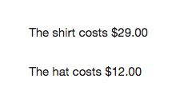

# 第一章：开始使用 Vue.js

Vue（发音为 view）是一个非常强大的 JavaScript 库，用于构建交互式用户界面。尽管具有处理大型单页应用程序的能力，但 Vue 也非常适合为小型个别用例提供框架。它的小文件大小意味着可以将其集成到现有生态系统中而不会增加太多冗余。

它被设计成具有简单的 API，与其竞争对手 React 和 Angular 相比，更容易入门。尽管它借鉴了这些库的一些逻辑和方法，但它已经确定开发人员需要一个更简单的库来构建应用程序。

与 React 或 Angular 不同，Vue 的一个优点是它产生的 HTML 输出干净。其他 JavaScript 库往往会在代码中散布额外的属性和类，而 Vue 会删除这些内容以产生干净、语义化的输出。

在本书的第一部分中，我们将构建一个使用 JSON 字符串来显示数据的应用程序。然后，我们将研究数据过滤和操作，然后转向构建可重用组件以减少代码重复。

在本章中，我们将讨论以下内容：

+   如何通过包含 JavaScript 文件来开始使用 Vue

+   如何初始化您的第一个 Vue 实例并查看数据对象

+   检查计算函数和属性

+   了解 Vue 方法

# 创建工作空间

要使用 Vue，我们首先需要在 HTML 中包含该库并初始化它。对于本书第一部分的示例，我们将在单个 HTML 页面中构建我们的应用程序。这意味着用于初始化和控制 Vue 的 JavaScript 将放置在页面底部。这将使我们的所有代码都保持在一个地方，并且意味着它可以轻松在您的计算机上运行。打开您喜欢的文本编辑器并创建一个新的 HTML 页面。使用以下模板作为起点：

```js
      <!DOCTYPE html>
      <html>
        <head>
        <meta charset="utf-8">
        <title>Vue.js App</title>
        </head>
        <body>
        <div id="app">
          </div>
          <script src="https://unpkg.com/vue"></script>
          <script type="text/javascript">
            // JS Code here
          </script>
        </body>
      </html>
```

主要的 HTML 标签和结构对您来说应该是熟悉的。让我们简要介绍一下其他一些方面。

# 应用空间

这是您的应用程序容器，并为 Vue 提供了一个工作画布。所有的 Vue 代码都将放置在这个标签中。实际的标签可以是任何 HTML 元素-主要是 main、section 等。元素的 ID 需要是唯一的，但可以是任何您希望的。这允许您在一个页面上拥有多个 Vue 实例，或者确定哪个 Vue 实例与哪个 Vue 代码相关联：

```js
      <div id="app">
      </div>
```

在教程中，将使用具有 ID 的此元素称为应用空间或视图。应注意，所有 HTML、标签和代码都应放置在此容器中。

尽管您可以在应用程序空间中使用大多数 HTML 标签，但不能在`<body>`或`<HTML>`标签上初始化 Vue - 如果这样做，Vue 将抛出 JavaScript 错误并无法初始化。您必须在`body`内使用一个元素。

# Vue 库

在本书的示例中，我们将使用来自 CDN（内容分发网络）unpkg 的 Vue.js 的托管版本。这确保我们的应用程序中有最新版本的 Vue，并且还意味着我们不需要创建和托管其他 JavaScript 文件。Unpkg 是一个独立的托管流行库的网站。它使您能够快速轻松地将 JavaScript 包添加到您的 HTML 中，而无需下载和托管文件：

```js
      <script src="https://unpkg.com/vue"></script>
```

在部署代码时，最好从本地文件提供库，而不是依赖于 CDN。这样可以确保您的实现将与当前保存的版本一起工作，以防他们发布更新。它还会增加应用程序的速度，因为它不需要从另一个服务器请求文件。

在包含库的`script`块中，我们将编写我们 Vue 应用程序的所有 JavaScript 代码。

# 初始化 Vue 并显示第一条消息

现在我们已经设置好了一个模板，我们可以使用以下代码初始化 Vue 并将其绑定到 HTML 应用空间：

```js
      const app = new Vue().$mount('#app');
```

此代码创建了 Vue 的一个新实例，并将其挂载在具有 ID 为`app`的 HTML 元素上。如果您保存文件并在浏览器中打开它，您会注意到没有发生任何事情。然而，在幕后，这一行代码将`div`与`app`变量链接在一起，`app`是 Vue 应用程序的一个实例。

Vue 本身有许多对象和属性，我们现在可以使用它们来构建我们的应用程序。您将遇到的第一个是`el`属性。使用 HTML 的 ID，此属性告诉 Vue 它应该绑定到哪个元素以及应用程序将被包含在哪里。这是挂载 Vue 实例的最常见方式，所有 Vue 代码都应该在此元素内进行：

```js
      const app = new Vue({
        el: '#app'
      });
```

当实例中没有指定`el`属性时，Vue 会初始化为未挂载状态，这允许在挂载之前运行和完成任何指定的函数或方法。然后，当准备好时，可以独立调用挂载函数。在使用`el`属性时，Vue 在幕后使用`$.mount`函数来挂载实例。如果确实想要等待，可以单独调用`$mount`函数，例如：

```js
      const app = new Vue();

      // When ready to mount app:
      app.$mount('#app');
```

然而，由于我们在整本书中不需要延迟执行挂载时机，所以可以使用`el`元素与 Vue 实例一起使用。使用`el`属性也是挂载 Vue 应用程序的最常见方式。

除了`el`值之外，Vue 还有一个包含我们需要访问应用程序或应用程序空间的任何数据的`data`对象。在 Vue 实例中创建一个新的数据对象，并通过以下方式为属性赋值：

```js
      const app = new Vue({
        el: '#app',

        data: {
 message: 'Hello!'
 }
      });
```

在应用程序空间中，我们现在可以访问`message`变量。为了在应用程序中显示数据，Vue 使用 Mustache 模板语言来输出数据或变量。通过将变量名放在双花括号`{{ 变量 }}`之间来实现。逻辑语句，如`if`或`foreach`，获取 HTML 属性，这将在本章后面进行介绍。

在应用程序空间中，添加代码来输出字符串：

```js
      <div id="app">
        {{ message }}
      </div>
```

保存文件，用浏览器打开，应该会显示出 Hello!字符串。

如果没有看到任何输出，请检查 JavaScript 控制台是否有错误。确保远程 JavaScript 文件正确加载，因为某些浏览器和操作系统在本地计算机上查看页面时，需要额外的安全步骤才能允许加载某些远程文件。

`data`对象可以处理多个键和数据类型。向数据对象添加更多的值，看看会发生什么-确保在每个值后面添加逗号。数据值是简单的 JavaScript，也可以处理基本的数学运算-尝试添加一个新的`price`键，并将值设置为`18 + 6`，看看会发生什么。或者，尝试添加一个 JavaScript 数组并将其打印出来：

```js
      const app = new Vue({
        el: '#app',

        data: {
         message: 'Hello!',
 price: 18 + 6,
 details: ['one', 'two', 'three']
       }
     });
```

在应用程序空间中，现在可以输出每个值-`{{ price }}`和`{{ details }}`现在输出数据-尽管列表可能不是您预期的样子。我们将在第二章中介绍如何使用和显示列表，*显示、循环、搜索和过滤数据*。

Vue 中的所有数据都是响应式的，可以由用户或应用程序更新。可以通过打开浏览器的 JavaScript 控制台并自己更新内容来测试。尝试输入`app.message = 'Goodbye!';`并按下*Enter*键-您的应用程序的内容将更新。这是因为您直接引用了属性-第一个`app`是指您在 JavaScript 中初始化应用程序的`const app`变量。句点表示其中的属性，而`message`表示数据键。您还可以将`app.details`或`price`更新为任何您想要的内容！

# 计算值

Vue 中的`data`对象非常适合直接存储和检索数据，但有时您可能希望在将数据输出到应用程序中之前对其进行操作。我们可以使用 Vue 中的`computed`对象来实现这一点。使用这种技术，我们能够开始遵循 MVVM（模型-视图-视图模型）方法论。

MVVM 是一种软件架构模式，将应用程序的各个部分分离成不同的部分。模型（或数据）是原始数据输入，可以来自 API、数据库或硬编码的数据值。在 Vue 的上下文中，这通常是我们之前使用的`data`对象。

视图是应用程序的前端。它只用于从模型输出数据，不应包含任何逻辑或数据操作，除非有一些无法避免的`if`语句。对于 Vue 应用程序来说，这些代码都放在`<div id="app"></div>`标签中。

视图模型是两者之间的桥梁。它允许您在视图输出之前操作模型中的数据。例如，将字符串转换为大写或添加货币符号前缀，或者从列表中过滤出折扣产品或计算数组中字段的总值等。在 Vue 中，这就是`computed`对象的作用。

计算对象可以有任意多个属性，但它们必须是函数。这些函数可以利用 Vue 实例上已有的数据并返回一个值，无论是字符串、数字还是数组，都可以在视图中使用。

第一步是在 Vue 应用程序中创建一个计算对象。在这个例子中，我们将使用计算值将字符串转换为小写，所以将`message`的值设置为一个字符串：

```js
      const app = new Vue({
          el: '#app',

        data: {
           message: 'Hello Vue!'
       },
          computed: {
 }
      });
```

不要忘记在数据对象的闭合大括号(`}`)之后添加逗号(`,`)，以便 Vue 知道要期望一个新对象。

下一步是在计算对象内创建一个函数。开发中最困难的部分之一是给事物命名 - 确保函数的名称具有描述性。由于我们的应用程序非常小且操作基本，我们将把它命名为`messageToLower`：

```js
      const app = new Vue({
        el: '#app',
        data: {
          message: 'HelLO Vue!'
        },
        computed: {
          messageToLower() {
 return 'hello vue!';
 }
        }
     });
```

在上面的示例中，我将其设置为返回一个硬编码的字符串，该字符串是`message`变量内容的小写版本。计算函数可以像在视图中使用数据键一样使用。将视图更新为输出`{{ messageToLower }}`而不是`{{ message }}`，然后在浏览器中查看结果。

然而，这段代码存在一些问题。首先，如果`messageToLower`的值是硬编码的，我们可以将其添加到另一个数据属性中。其次，如果`message`的值发生变化，小写版本将不再正确。

在 Vue 实例中，我们可以使用`this`变量访问数据值和计算值 - 我们将更新函数以使用现有的`message`值：

```js
      computed: {
        messageToLower() {
          return this.message.toLowerCase();
        }
      }
```

`messageToLower`函数现在引用现有的`message`变量，并使用原生 JavaScript 函数将字符串转换为小写。尝试在应用程序中或 JavaScript 控制台中更新`message`变量，以查看其更新。

计算函数不仅限于基本功能 - 请记住，它们旨在从视图中删除所有逻辑和操作。一个更复杂的例子可能是以下内容：

```js
      const app = new Vue({
        el: '#app',
             data: {
          price: 25,
          currency: '$',
          salesTax: 16
        },
        computed: {
          cost() {
       // Work out the price of the item including 
          salesTax
            let itemCost = parseFloat(
              Math.round((this.salesTax / 100) * 
              this.price) + this.price).toFixed(2);
            // Add text before displaying the currency and   
             amount
            let output = 'This item costs ' + 
            this.currency + itemCost;
           // Append to the output variable the price 
             without salesTax
             output += ' (' + this.currency + this.price + 
        ' excluding salesTax)';
             // Return the output value
              return output;
           }
        }
     });
```

虽然乍一看可能很高级，但该代码是将固定价格与添加了销售税后的价格进行计算。`price`、`salesTax`和`currency`符号都存储为数据对象上的值，并在`cost()`计算函数中访问。视图输出`{{ cost }}`，产生以下结果：

此商品价格为$29.00（不含销售税为$25）

如果更新了任何数据，无论是用户还是应用程序本身，计算函数都会重新计算和更新。这使得我们的函数可以根据`price`和`salesTax`值动态更新。在浏览器的控制台中尝试以下命令之一：

```js
 app.salesTax = 20
```

```js
 app.price = 99.99
```

段落和价格将立即更新。这是因为计算函数对`data`对象和应用程序的其余部分都是响应式的。

# 方法和可重用函数

在您的 Vue 应用程序中，您可能希望以一致或重复的方式计算或操作数据，或者运行不需要将输出传递给视图的任务。例如，如果您想要计算每个价格的销售税或从 API 检索一些数据，然后将其分配给某些变量。

与其为每次需要执行此操作时创建计算函数，Vue 允许您创建函数或方法。这些在您的应用程序中声明，并且可以从任何地方访问 - 类似于`data`或`computed`函数。

在您的 Vue 应用程序中添加一个方法对象，并注意数据对象的更新：

```js
      const app = new Vue({
        el: '#app',

        data: {
          shirtPrice: 25,
          hatPrice: 10,

          currency: '$',
          salesTax: 16
        },
        methods: {

 }
      });
```

在`data`对象中，`price`键已被替换为两个价格 - `shirtPrice`和`hatPrice`。我们将创建一个方法来计算每个价格的销售税。

类似于为计算对象创建函数，创建一个名为`calculateSalesTax`的方法函数。此函数需要接受一个参数，即`price`。在内部，我们将使用前面示例中的代码来计算销售税。请记住，将`this.price`替换为参数名`price`，如下所示：

```js
      methods: {
        calculateSalesTax(price) {
          // Work out the price of the item including   
          sales tax
          return parseFloat(
          Math.round((this.salesTax / 100) * price) 
         + price).toFixed(2);
        }
      }
```

保存不会对我们的应用程序产生任何影响 - 我们需要调用该函数。在您的视图中，更新输出以使用该函数并传入`shirtPrice`变量：

```js
      <div id="app">
        {{ calculateSalesTax(shirtPrice) }}
      </div>
```

保存您的文档并在浏览器中检查结果 - 是否符合您的预期？下一个任务是在数字前面添加货币符号。我们可以通过添加第二个方法来实现这一点，该方法返回传入函数的参数，并在数字前面添加货币符号：

```js
      methods: {
        calculateSalesTax(price) {
          // Work out the price of the item including 
          sales tax
          return parseFloat(
            Math.round((this.salesTax / 100) * price) +   
            price).toFixed(2);
         },
         addCurrency(price) {
 return this.currency + price;
 }
      }
```

然后，在我们的视图中更新输出以同时利用这两个方法。我们可以将第一个函数`calculateSalesTax`作为第二个`addCurrency`函数的参数传递，而不是赋值给一个变量。这是因为第一个方法`calculateSalesTax`接受`shirtPrice`参数并返回新的金额。我们不再将其保存为变量并将变量传递给`addCurrency`方法，而是直接将结果传递给此函数，即计算出的金额。

```js
      {{ addCurrency(calculateSalesTax(shirtPrice)) }}
```

然而，每次需要输出价格时编写这两个函数会变得繁琐。从这里开始，我们有两个选择：

+   我们可以创建第三个方法，名为`cost()` - 它接受价格参数并将输入通过这两个函数传递

+   创建一个计算函数，例如`shirtCost`，它使用`this.shirtPrice`而不是传入参数

或者，我们可以创建一个名为`shirtCost`的方法，它与我们的计算函数相同；然而，在这种情况下最好练习使用计算函数。

这是因为`computed`函数是被缓存的，而`method`函数不是。如果想象一下我们的方法比目前复杂得多，反复调用函数（例如，如果我们想在多个位置显示价格）可能会对性能产生影响。使用计算函数，只要数据不变，您可以随意调用它，应用程序会将结果缓存。如果数据发生变化，它只需要重新计算一次，并重新缓存该结果。

为`shirtPrice`和`hatPrice`创建计算函数，以便两个变量都可以在视图中使用。不要忘记在内部调用函数时必须使用`this`变量 - 例如，`this.addCurrency()`。使用以下 HTML 代码作为视图的模板：

```js
      <div id="app">
        <p>The shirt costs {{ shirtCost }}</p>
        <p>The hat costs {{ hatCost }}</p>
      </div>
```

在与以下代码进行比较之前，请尝试自己创建计算函数。不要忘记在开发中有很多方法可以做事情，所以如果你的代码能够工作但与以下示例不匹配，不要担心：

```js
      const app = new Vue({
        el: '#app',
        data: {
          shirtPrice: 25,
          hatPrice: 10,

          currency: '$',
          salesTax: 16
        },
        computed: {
          shirtCost() {
            returnthis.addCurrency(this.calculateSalesTax(
              this.shirtPrice))
          },
          hatCost() {
          return this.addCurrency(this.calculateSalesTax(
          this.hatPrice))
          },
        },
        methods: {
          calculateSalesTax(price) {
            // Work out the price of the item including 
            sales tax
            return parseFloat(
              Math.round((this.salesTax / 100) * price) + 
              price).toFixed(2);
                },
                addCurrency(price) {
            return this.currency + price;
          }
        }
      });
```

尽管基本，但结果应该如下所示：



# 总结

在本章中，我们学习了如何开始使用 Vue JavaScript 框架。我们检查了 Vue 实例中的`data`、`computed`和`methods`对象。我们介绍了如何在框架中使用每个对象并利用它们的优势。
