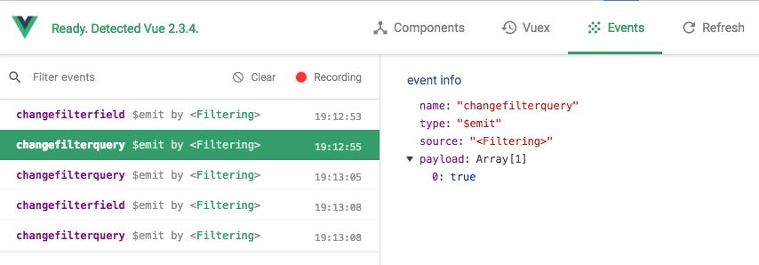

# 第十二章：使用 Vue Dev Tools 和测试您的 SPA

在过去的 11 章中，我们使用`Vue.js`开发了几个单页应用程序（SPA）。尽管开发是创建 SPA 的重要部分，但测试也是创建任何 JavaScript Web 应用程序的重要组成部分。

Vue 开发者工具在 Chrome 和 Firefox 中可用，可以提供对在特定视图中使用的组件或 Vuex 存储的当前状态的深入了解，以及从 JavaScript 中发出的任何事件。这些工具允许您在开发过程中检查和验证应用程序中的数据，以确保一切都正常。

SPA 测试的另一方面是自动化测试。您编写的条件、规则和路由用于自动化执行应用程序中的任务，允许您指定输出应该是什么，并且测试运行条件以验证结果是否匹配。

在本章中，我们将：

+   使用我们开发的应用程序介绍 Vue 开发者工具的用法

+   概述测试工具和应用程序

# 使用 Vue.js 开发者工具

Vue 开发者工具适用于 Chrome 和 Firefox，并可从 GitHub（[`github.com/vuejs/vue-devtools`](https://github.com/vuejs/vue-devtools)）下载。安装后，它们成为浏览器开发者工具的扩展。例如，在 Chrome 中，它们出现在审核选项卡之后。


只有在使用 Vue 开发模式时，Vue 开发者工具才能正常工作。默认情况下，未经压缩的 Vue 版本启用了开发模式。但是，如果您使用的是代码的生产版本，则可以通过在代码中将`devtools`变量设置为`true`来启用开发工具：

```js
Vue.config.devtools = true
```

在本书中，我们一直使用 Vue 的开发版本，因此开发工具应该适用于我们开发的所有三个 SPA。打开 Dropbox 示例并打开 Vue 开发者工具。

# 检查 Vue 组件的数据和计算值

Vue 开发者工具提供了页面上正在使用的组件的很好概述。您还可以深入了解组件并预览在该特定实例上使用的数据。这非常适合在任何给定时间检查页面上每个组件的属性。

例如，如果我们检查 Dropbox 应用程序并导航到组件选项卡，我们可以看到<Root> Vue 实例和<DropboxViewer>组件。点击这个将显示组件的所有数据属性 - 以及任何计算属性。这样我们就可以验证结构是否正确构建，以及计算路径属性：

！[](img/00023.jpeg)

深入研究每个组件，我们可以访问单个数据对象和计算属性。

使用 Vue 开发者工具来检查应用程序是一种更高效的验证数据的方式，因为它避免了使用多个`console.log()`语句。

# 查看 Vuex 的 mutations 和时间旅行

导航到下一个选项卡 Vuex，可以实时观察 store mutations 的发生。每次发生 mutation 时，左侧面板中都会创建一行新的。这个元素允许我们查看发送的数据以及数据提交之前和之后的 Vuex store 的样子。

它还提供了几个选项来还原、提交和时间旅行到任何点。加载 Dropbox 应用程序后，左侧面板中立即出现了几个结构 mutations，列出了 mutation 的名称和发生的时间。这是代码预缓存文件夹的操作。点击每个选项将显示 Vuex store 的状态 - 以及包含的 payload 的 mutation。状态显示是在 payload 发送和 mutation 提交之后。要预览该 mutation 之前的状态，请选择前面的选项：

！[](img/00024.jpeg)

在每个条目旁边，您会注意到三个符号，允许您执行多个操作并直接在浏览器中改变 store：

+   **提交此 mutation**：这允许您提交到该点的所有数据。这将从开发工具中*删除*所有的 mutations，并将基本状态更新到此点。如果有多个 mutations 发生，您希望跟踪它们，这将非常方便。

+   **还原此变化**：这将撤消该变化和此点之后的所有变化。这使您可以一遍又一遍地执行相同的操作，而无需刷新或丢失当前位置。例如，在我们的购物应用程序中将产品添加到购物篮时，会发生变化。使用此功能，您可以从购物篮中删除产品并撤消任何后续变化，而无需离开产品页面。

+   **时间旅行到此状态**：这允许您预览应用程序和该特定变化状态，而不会还原所选点之后发生的任何变化。

变化选项卡还允许您在左侧面板顶部提交或还原所有变化。在右侧面板中，您还可以导入和导出存储状态的 JSON 编码版本。当您想要重新测试多种情况和实例而不必重复多个步骤时，这非常方便。

# 预览事件数据

Vue 开发者工具的事件选项卡与 Vuex 选项卡类似，允许您检查应用程序中发出的任何事件。我们的 Dropbox 应用程序不使用事件，因此打开我们在本书的第二章和第三章中创建的 people-filtering 应用程序，*显示、循环、搜索和过滤数据*以及*优化我们的应用程序并使用组件显示数据*。

更改此应用程序中的过滤器会在每次更新过滤器类型时触发一个事件，同时附带过滤器查询：



左侧面板再次列出事件的名称和发生时间。右侧面板包含有关事件的信息，包括其组件来源和有效负载。这些数据可以确保事件数据与您预期的一样，如果不是，可以帮助您找到触发事件的位置。

Vue 开发工具非常宝贵，特别是在您的 JavaScript 应用程序变得越来越大和复杂时。打开我们开发的购物 SPA，并检查各个组件和 Vuex 数据，以了解这个工具如何帮助您创建只提交所需变化并发出所需事件的应用程序。

# 测试您的 SPA

大多数 Vue 测试套件都围绕着具备命令行知识并使用 CLI（命令行界面）创建 Vue 应用程序。除了使用前端兼容的 JavaScript 创建应用程序外，Vue 还有一个 CLI，允许您使用基于组件的文件创建应用程序。这些文件的扩展名为`.vue`，包含模板 HTML 以及组件所需的 JavaScript。它们还允许您创建作用域 CSS-仅适用于该组件的样式。如果选择使用 CLI 创建应用程序，您在本书中学到的所有理论知识和大部分实践知识都可以轻松移植过来。

# 命令行单元测试

除了组件文件之外，Vue CLI 还允许您更轻松地与命令行单元测试集成，例如 Jest、Mocha、Chai 和 TestCafe（[`testcafe.devexpress.com/`](https://testcafe.devexpress.com/)）。例如，TestCafe 允许您指定多个不同的测试，包括检查内容是否存在，点击按钮以测试功能等。一个 TestCafe 测试的示例是检查我们第一个应用程序中的过滤组件是否包含单词*Field*：

```js
test('The filtering contains the word "filter"', async testController => {
  const filterSelector = await new Selector('body > #app > form > label:nth-child(1)');

  await testController.expect(paragraphSelector.innerText).eql('Filter');
});
```

这个测试将返回`true`或`false`。单元测试通常与组件本身一起编写，允许组件在隔离环境中被重用和测试。这样可以确保外部因素对测试结果没有影响。

大多数命令行 JavaScript 测试库都可以与 Vue.js 集成；在 awesome Vue GitHub 存储库中有一个很棒的列表可用（[`github.com/vuejs/awesome-vue#test`](https://github.com/vuejs/awesome-vue#test)）。

# 浏览器自动化

使用命令行单元测试的替代方法是使用测试套件自动化浏览器。这种测试仍然通过命令行触发，但与其直接集成 Vue 应用程序不同，它会在浏览器中打开页面并像用户一样与其交互。一个常用的工具是`Nightwatch.js`（[`nightwatchjs.org/`](http://nightwatchjs.org/)）。

您可以使用此套件来开设您的商店，并与过滤组件或产品列表进行交互，以及对结果进行排序和比较。这些测试用例使用非正式的英语编写，并不限于与要测试的网站在同一域名或文件网络上。该库也是语言无关的，适用于任何网站，无论其使用何种构建方式。

Nightwatch.js 在其网站上给出的示例是打开 Google 并确保`rembrandt van rijn`的 Google 搜索结果的第一个结果是维基百科的条目。

```js
module.exports = {
  'Demo test Google' : function (client) {
    client
      .url('http://www.google.com')
      .waitForElementVisible('body', 1000)
      .assert.title('Google')
      .assert.visible('input[type=text]')
      .setValue('input[type=text]', 'rembrandt van rijn')
      .waitForElementVisible('button[name=btnG]', 1000)
      .click('button[name=btnG]')
      .pause(1000)
      .assert.containsText('ol#rso li:first-child',
        'Rembrandt - Wikipedia')
      .end();
  }
};
```

与 Nightwatch 相比，Selenium（[`www.seleniumhq.org/`](http://www.seleniumhq.org/)）是一种替代方案。Selenium 具有一个 Firefox 扩展，可以让您可视化地创建测试用例和命令。

测试，特别是对于大型应用程序来说，是至关重要的，尤其是在将应用程序部署到开发环境时。无论您选择单元测试还是浏览器自动化，都有大量的文章和书籍可供参考。

# 总结

在本书中，我们介绍了几种技术，并学习了如何使用 Vue 和官方 Vue 插件。我们构建了三个单页面应用程序，涵盖了不同的方法和方式。

在本书的第一部分中，我们介绍了如何初始化 Vue 实例。我们探讨了如何循环遍历数据以及如何创建用户界面来过滤显示的数据。我们还介绍了如何在每一行上有条件地渲染 CSS 类。

然后，我们开始将 Vuex 集成到我们的应用程序中，并与 API 进行通信，以 Dropbox 为例。我们研究了如何访问数据并将其存储在本地。这有助于提高应用程序的性能和速度，改善用户体验。

最后，我们创建了一个模拟商店。使用来自 Shopify CSV 文件的真实数据，我们创建了一个允许单独查看产品的应用程序。我们还创建了一个可以进行过滤和排序的类别列表页面，使用户能够找到他们想要的特定产品。为了完善体验，我们构建了一个可编辑的购物篮、结账和订单确认界面。

在本章中，我们介绍了使用 Vue 开发工具，以及如何构建测试用例。这完成了使用`Vue.js`构建单页面应用程序的过程。
